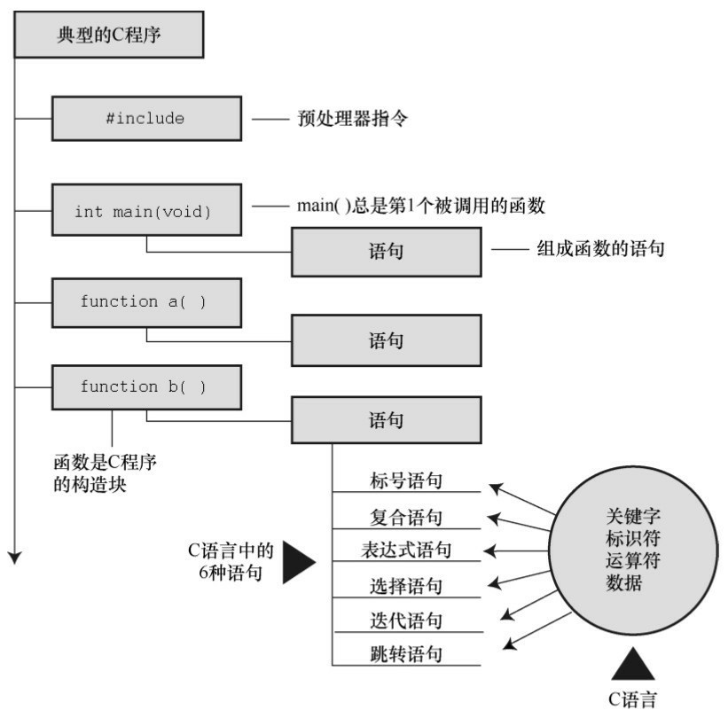
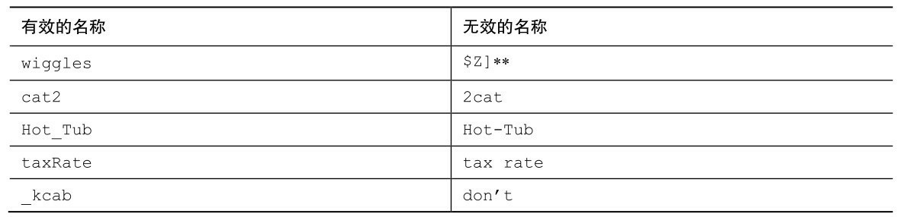
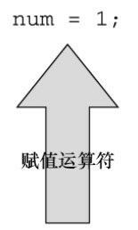
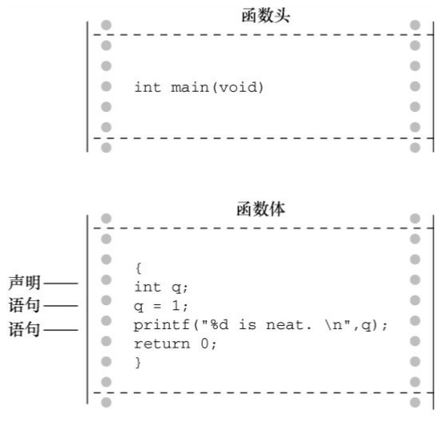
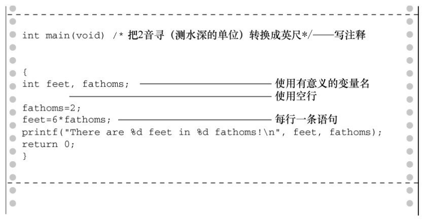
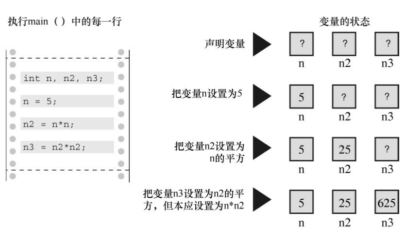
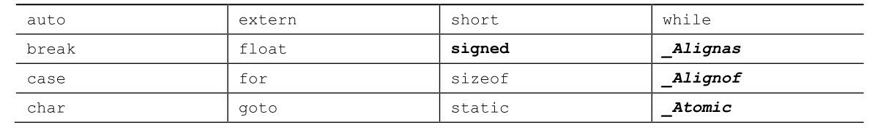
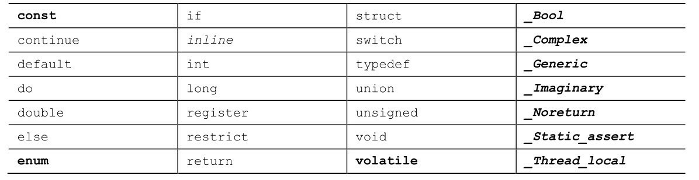
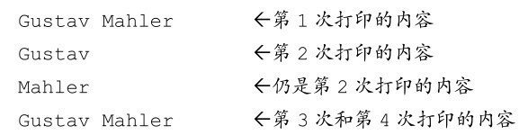

# 第2章 C语言概述
本章介绍以下内容：
* 运算符：=
* 函数：main()、printf()
* 编写一个简单的C程序
* 创建整型变量，为其赋值并在屏幕上显示其值
* 换行字符
* 如何在程序中写注释，创建包含多个函数的程序，发现程序的错误
* 什么是关键字

C程序是什么样子的？浏览本书，能看到许多示例。初见 C 程序会觉得有些古怪，程序中有许多｛、cp->tort和*ptr++这样的符号。然而，在学习C的过程中，对这些符号和C语言特有的其他符号会越来越熟悉，甚至会喜欢上它们。如果熟悉与C相关的其他语言，会对C语言有似曾相识的感觉。本章，我们从演示一个简单的程序示例开始，解释该程序的功能。同时，强调一些C语言的基本特性。

## 2.1 简单的C程序示例
我们来看一个简单的C程序，如程序清单2.1所示。该程序演示了用C语言编程的一些基本特性。请先通读程序清单2.1，看看自己是否能明白该程序的用途，再认真阅读后面的解释。

程序清单2.1 first.c程序
```c
#include　<stdio.h>
int main(void)　　　　　　　　 /* 一个简单的C程序 */
{
    int num;　　　　　　　　　 /* 定义一个名为num的变量 */
    num = 1;　　　　　　　　　 /* 为num赋一个值 */
    printf("I am a simple ");　/* 使用printf()函数 */
    printf("computer.\n");
    printf("My　favorite　number　is　%d　because　it　is　first.\n", num);
    return　0;
}
```

如果你认为该程序会在屏幕上打印一些内容，那就对了！光看程序也许并不知道打印的具体内容，所以，运行该程序，并查看结果。首先，用你熟悉的编辑器（或者编译器提供的编辑器）创建一个包含程序清单2.1 中所有内容的文件。给该文件命名，并以.c作为扩展名，以满足当前系统对文件名的要求。例如，可以使用first.c。现在，编译并运行该程序（查看第1章，复习该步骤的具体内容）。如果一切运行正常，该程序的输出应该是：
```json5
I am a simple computer.
My favorite number is 1 because it is first.
```

总而言之，结果在意料之中，但是程序中的\n 和%d 是什么？程序中有几行代码看起来有点奇怪。接下来，我们逐行解释这个程序。

**程序调整**

程序的输出是否在屏幕上一闪而过？某些窗口环境会在单独的窗口运行程序，然后在程序运行结束后自动关闭窗口。如果遇到这种情况，可以在程序中添加额外的代码，让窗口等待用户按下一个键后才关闭。一种方法是，在程序的return语句前添加一行代码：
```c
getchar()；
```

这行代码会让程序等待击键，窗口会在用户按下一个键后才关闭。在第 8 章中会详细介绍 getchar()的内容。

## 2.2 示例解释
我们会把程序清单2.1的程序分析两遍。第1遍（快速概要）概述程序中每行代码的作用，帮助读者初步了解程序。第2遍（程序细节）详细分析代码的具体含义，帮助读者深入理解程序。

图2.1总结了组成[C程序的几个部分](#c程序的几个部分)，图中包含的元素比第1个程序多。



### 2.2.1 第1遍：快速概要
本节简述程序中的每行代码的作用。下一节详细讨论代码的含义。
```c
#include<stdio.h>　　　←包含另一个文件
```

该行告诉编译器把stdio.h中的内容包含在当前程序中。stdio.h是C编译器软件包的标准部分，它提供键盘输入和屏幕输出的支持。

```c
int main(void)　　　　 ←函数名
```

C程序包含一个或多个函数，它们是C程序的基本模块。程序清单2.1的程序中有一个名为main()的函数。圆括号表明main()是一个函数名。int表明main()函数返回一个整数，void表明main()不带任何参数。这些内容我们稍后详述。现在，只需记住int和void是标准ANSI C定义main()的一部分（如果使用ANSI C之前的编译器，请省略void；考虑到兼容的问题，请尽量使用较新的C编译器）。

```c
/* 一个简单的C程序 */　　　 ←注释
```

注释在/*和*/两个符号之间，这些注释能提高程序的可读性。注意，注释只是为了帮助读者理解程序，编译器会忽略它们。

```c
{　　　　←函数体开始
```

左花括号表示函数定义开始，右花括号（}）表示函数定义结束。

```c
int num;　　　←声明
```

该声明表明，将使用一个名为num的变量，而且num是int（整数）类型。

```c
num = 1;　　　←赋值表达式语句
```

语句num = 1;把值1赋给名为num的变量。

```c
printf("I am a simple "); ←调用一个函数
```

该语句使用 printf()函数，在屏幕上显示 I am a simple，光标停在同一行。printf()是标准的C库函数。在程序中使用函数叫作调用函数。

```c
printf("computer.\n");　　 ←调用另一个函数
```

接下来调用的这个printf()函数在上条语句打印出来的内容后面加上“computer”。代码\n告诉计算机另起一行，即把光标移至下一行。

```c
printf("My favorite number is %d because it is first.\n", num);
```

最后调用的printf()把num的值（1）内嵌在用双引号括起来的内容中一并打印。%d告诉计算机以何种形式输出num的值，打印在何处。

```c
return 0;　　 ←return语句
```

C函数可以给调用方提供（或返回）一个数。目前，可暂时把该行看作是结束main()函数的要求。

```c
}　　　　←结束
```

必须以右花括号表示程序结束。

### 2.2.2 第2遍：程序细节
浏览完程序清单2.1后，我们来仔细分析这个程序。再次强调，本节将逐行分析程序中的代码，以每行代码为出发点，深入分析代码背后的细节，为更全面地学习C语言编程的特性夯实基础。

1. **#include**指令和头文件
```c
#include<stdio.h>
```

这是程序的第1行。`#include <stdio.h>` 的作用相当于把stdio.h文件中的所有内容都输入该行所在的位置。实际上，这是一种“拷贝-粘贴”的操作。

include 文件提供了一种方便的途径共享许多程序共有的信息。

#include这行代码是一条C预处理器指令（preprocessor directive）。通常，C编译器在编译前会对源代码做一些准备工作，即预处理（preprocessing）。

所有的C编译器软件包都提供stdio.h文件。该文件中包含了供编译器使用的输入和输出函数（如， printf()）信息。该文件名的含义是标准输入/输出头文件。通常，在C程序顶部的信息集合被称为头文件（header）。

在大多数情况下，头文件包含了编译器创建最终可执行程序要用到的信息。例如，头文件中可以定义一些常量，或者指明函数名以及如何使用它们。但是，函数的实际代码在一个预编译代码的库文件中。简而言之，头文件帮助编译器把你的程序正确地组合在一起。

ANSI/ISO C规定了C编译器必须提供哪些头文件。有些程序要包含stdio.h，而有些不用。特定C实现的文档中应该包含对C库函数的说明。这些说明确定了使用哪些函数需要包含哪些头文件。例如，要使用printf()函数，必须包含stdio.h头文件。省略必要的头文件可能不会影响某一特定程序，但是最好不要这样做。本书每次用到库函数，都会用#include指令包含ANSI/ISO标准指定的头文件。

注意 为何不内置输入和输出

读者一定很好奇，为何不把输入和输出这些基本功能内置在语言中。原因之一是，并非所有的程序都会用到I/O（输入/输出）包。轻装上阵表现了C语言的哲学。正是这种经济使用资源的原则，使得C语言成为流行的嵌入式编程语言（例如，编写控制汽车自动燃油系统或蓝光播放机芯片的代码）。#include中的#符号表明，C预处理器在编译器接手之前处理这条指令。本书后面章节中会介绍更多预处理器指令的示例，第16章将更详细地讨论相关内容。

2. main()函数
```c
int main(void);
```

程序清单2.1中的第2行表明该函数名为main。的确，main是一个极其普通的名称，但是这是唯一的选择。C程序一定从main()函数开始执行（目前不必考虑例外的情况）。除了main()函数，你可以任意命名其他函数，而且main()函数必须是开始的函数。圆括号有什么功能？用于识别main()是一个函数。很快你将学到更多的函数。就目前而言，只需记住函数是C程序的基本模块。

int是main()函数的返回类型。这表明main()函数返回的值是整数。返回到哪里？返回给操作系统。我们将在第6章中再来探讨这个问题。

通常，函数名后面的圆括号中包含一些传入函数的信息。该例中没有传递任何信息。因此，圆括号内是单词void（第11章将介绍把信息从main()函数传回操作系统的另一种形式）。

如果浏览旧式的C代码，会发现程序以如下形式开始：
```c
main()
```

C90标准勉强接受这种形式，但是C99和C11标准不允许这样写。因此，即使你使用的编译器允许，也不要这样写。

你还会看到下面这种形式：
```c
void main()
```

一些编译器允许这样写，但是所有的标准都未认可这种写法。因此，编译器不必接受这种形式，而且许多编译器都不能这样写。需要强调的是，只要坚持使用标准形式，把程序从一个编译器移至另一个编译器时就不会出什么问题。

3. 注释

/*一个简单的程序*/

在程序中，被/* */两个符号括起来的部分是程序的注释。写注释能让他人（包括自己）更容易明白你所写的程序。C 语言注释的好处之一是，可将注释放在任意的地方，甚至是与要解释的内容在同一行。较长的注释可单独放一行或多行。在/*和*/之间的内容都会被编译器忽略。下面列出了一些有效和无效的注释形式：
```c
/* 这是一条C注释。 */
/* 这也是一条注释，
被分成两行。*/
/*
也可以这样写注释。
*/
/* 这条注释无效，因为缺少了结束标记。
```

C99新增了另一种风格的注释，普遍用于C++和Java。这种新风格使用//符号创建注释，仅限于单行。
```c
// 这种注释只能写成一行。
int rigue; // 这种注释也可置于此。
```

因为一行末尾就标志着注释的结束，所以这种风格的注释只需在注释开始处标明//符号即可。

这种新形式的注释是为了解决旧形式注释存在的潜在问题。假设有下面的代码：
```c
/*
希望能运行。
*/
x　=　100;
y　=　200;
/* 其他内容已省略。 */
接下来，假设你决定删除第4行，但不小心删掉了第3行（*/）。代码如
下所示：
/*
希望能运行。
y　=　200;
/*其他内容已省略。 */
```

现在，编译器把第1行的/*和第4行的*/配对，导致4行代码全都成了注释（包括应作为代码的那一行）。而//形式的注释只对单行有效，不会导致这种“消失代码”的问题。

一些编译器可能不支持这一特性。还有一些编译器需要更改设置，才能支持C99或C11的特性。

考虑到只用一种注释风格过于死板乏味，本书在示例中采用两种风格的注释。

4. 花括号、函数体和块
```c
{
...
}
```

程序清单2.1中，花括号把main()函数括起来。一般而言，所有的C函数都使用花括号标记函数体的开始和结束。这是规定，不能省略。只有花括号（{}）能起这种作用，圆括号（()）和方括号（[]）都不行。

花括号还可用于把函数中的多条语句合并为一个单元或块。如果读者熟悉Pascal、ADA、Modula-2或者Algol，就会明白花括号在C语言中的作用类似于这些语言中的begin和end。

5. 声明
```c
int num;
```

程序清单2.1中，这行代码叫作声明（declaration）。声明是C语言最重要的特性之一。在该例中，声明完成了两件事。其一，在函数中有一个名为num的变量（variable）。其二，int表明num是一个整数（即，没有小数点或小数部分的数）。int是一种数据类型。编译器使用这些信息为num变量在内存中分配存储空间。分号在C语言中是大部分语句和声明的一部分，不像在Pascal中只是语句间的分隔符。

int是C语言的一个关键字（keyword），表示一种基本的C语言数据类型。关键字是语言定义的单词，不能做其他用途。例如，不能用int作为函数名和变量名。但是，这些关键字在该语言以外不起作用，所以把一只猫或一个可爱的小孩叫int是可以的（尽管某些地方的当地习俗或法律可能不允许）。

示例中的num是一个标识符（identifier），也就一个变量、函数或其他实体的名称。因此，声明把特定标识符与计算机内存中的特定位置联系起来，同时也确定了储存在某位置的信息类型或数据类型。

在C语言中，所有变量都必须先声明才能使用。这意味着必须列出程序中用到的所有变量名及其类型。

以前的C语言，还要求把变量声明在块的顶部，其他语句不能在任何声明的前面。也就是说，main()函数体如下所示：
```c
int main() //旧规则
{
    int　doors;
    int　dogs;
    doors　=　5;
    dogs　=　3;
    // 其他语句
}
```

C99和C11遵循C++的惯例，可以把声明放在块中的任何位置。尽管如此，首次使用变量之前一定要先声明它。因此，如果编译器支持这一新特性，可以这样编写上面的代码：
```c
int main()　　　　　　// 目前的C规则
{
    // 一些语句
    int　doors;
    doors = 5; // 第1次使用doors
    // 其他语句
    int　dogs;
    dogs = 3; // 第1次使用dogs
    // 其他语句
}
```

为了与旧系统更好地兼容，本书沿用最初的规则（即，把变量声明都写在块的顶部）。

现在，读者可能有3个问题：什么是数据类型？如何命名？为何要声明变量？请往下看。

**数据类型**

C 语言可以处理多种类型的数据，如整数、字符和浮点数。把变量声明为整型或字符类型，计算机才能正确地储存、读取和解释数据。下一章将详细介绍C语言中的各种数据类型。

**命名**

给变量命名时要使用有意义的变量名或标识符（如，程序中需要一个变量数羊，该变量名应该是sheep_count而不是x3）。如果变量名无法清楚地表达自身的用途，可在注释中进一步说明。这是一种良好的编程习惯和编程技巧。

C99和C11允许使用更长的标识符名，但是编译器只识别前63个字符。对于外部标识符（参阅第12章），只允许使用31个字符。〔以前C90只允许6个字符，这是一个很大的进步。旧式编译器通常最多只允许使用8个字符。〕实际上，你可以使用更长的字符，但是编译器会忽略超出的字符。也就是说，如果有两个标识符名都有63个字符，只有一个字符不同，那么编译器会识别这是两个不同的名称。如果两个标识符都是64个字符，只有最后一个字符不同，那么编译器可能将其视为同一个名称，也可能不会。标准并未定义在这种情况下会发生什么。

可以用小写字母、大写字母、数字和下划线（_）来命名。而且，名称的第1个字符必须是字符或下划线，不能是数字。表2.1给出了一些示例。

表2.1 有效和无效的名称



操作系统和C库经常使用以一个或两个下划线字符开始的标识符（如，_kcab），因此最好避免在自己的程序中使用这种名称。标准标签都以一个或两个下划线字符开始，如库标识符。这样的标识符都是保留的。这意味着，虽然使用它们没有语法错误，但是会导致名称冲突。

C语言的名称区分大小写，即把一个字母的大写和小写视为两个不同的字符。因此，stars和Stars、STARS都不同。

为了让C语言更加国际化，C99和C11根据通用字符名（即UCN）机制添加了扩展字符集。其中包含了除英文字母以外的部分字符。欲了解详细内容，请参阅附录B的“参考资料VII：扩展字符支持”。

声明变量的4个理由

一些更老的语言（如，FORTRAN 和 BASIC 的最初形式）都允许直接使用变量，不必先声明。为何 C语言不采用这种简单易行的方法？原因如下。

把所有的变量放在一处，方便读者查找和理解程序的用途。如果变量名都是有意义的（如，taxtate而不是 r），这样做效果很好。如果变量名无法表述清楚，在注释中解释变量的含义。这种方法让程序的可读性更高。

声明变量会促使你在编写程序之前做一些计划。程序在开始时要获得哪些信息？希望程序如何输出？表示数据最好的方式是什么？

声明变量有助于发现隐藏在程序中的小错误，如变量名拼写错误。例如，假设在某些不需要声明就可以直接使用变量的语言中，编写如下语句：
```c
RADIUS1 = 20.4;
```

在后面的程序中，误写成：
```c
CIRCUM = 6.28 * RADIUSl;
```

你不小心把数字1打成小写字母l。这些语言会创建一个新的变量RADIUSl，并使用该变量中的值（也许是0，也许是垃圾值），导致赋给CIRCUM的值是错误值。你可能要花很久时间才能查出原因。这样的错误在C语言中不会发生（除非你很不明智地声明了两个极其相似的变量），因为编译器在发现未声明的RADIUSl时会报错。

如果事先未声明变量，C程序将无法通过编译。如果前几个理由还不足以说服你，这个理由总可以让你认真考虑一下了。

如果要声明变量，应该声明在何处？前面提到过，C99之前的标准要求把声明都置于块的顶部，这样规定的好处是：把声明放在一起更容易理解程序的用途。C99 允许在需要时才声明变量，这样做的好处是：在给变量赋值之前声明变量，就不会忘记给变量赋值。但是实际上，许多编译器都还不支持C99。

6. 赋值
```c
num = 1;
```

程序清单中的这行代码是[赋值表达式语句](#赋值表达式语句)。赋值是C语言的基本操作之一。该行代码的意思是“把值1赋给变量num”。在执行int num;声明时，编译器在计算机内存中为变量num预留了空间，然后在执行这行赋值表达式语句时，把值储存在之前预留的位置。可以给num赋不同的值，这就是num之所以被称为变量（variable）的原因。注意，该赋值表达式语句从右侧把值赋到左侧。另外，该语句以分号结尾，如图2.2所示。



7. printf()函数
```c
printf("I am a simple ");
printf("computer.\n");
printf("My favorite number is %d because it is first.\n", num);
```

这3行都使用了C语言的一个标准函数：printf()。圆括号表明printf是一个函数名。圆括号中的内容是从main()函数传递给printf()函数的信息。例如，上面的第1行把I am a simple传递给printf()函数。该信息被称为参数，或者更确切地说，是函数的实际参数（actual argument），如图2.3所示。〔在C语言中，实际参数（简称实参）是传递给函数的特定值，形式参数（简称形参）是函数中用于储存值的变量。第5章中将详述相关内容。〕printf()函数用参数来做什么？该函数会查看双引号中的内容，并将其打印在屏幕上。

函数.png)

第1行printf()演示了在C语言中如何调用函数。只需输入函数名，把所需的参数填入圆括号即可。当程序运行到这一行时，控制权被转给已命名的函数（该例中是printf()）。函数执行结束后，控制权被返回至主调函数（calling function），该例中是main()。

第2行printf()函数的双引号中的\n字符并未输出。这是为什么？\n的意思是换行。\n组合（依次输入这两个字符）代表一个换行符（newline character）。对于printf()而言，它的意思是“在下一行的最左边开始新的一行”。也就是说，打印换行符的效果与在键盘按下Enter键相同。既然如此，为何不在键入printf()参数时直接使用Enter键？因为编辑器可能认为这是直接的命令，而不是储存在在源代码中的指令。换句话说，如果直接按下Enter键，编辑器会退出当前行并开始新的一行。但是，换行符仅会影响程序输出的显示格式。

换行符是一个转义序列（escape sequence）。转义序列用于代表难以表示或无法输入的字符。如，\t代表Tab键，\b代表Backspace键（退格键）。每个转义序列都以反斜杠字符（\）开始。我们在第3章中再来探讨相关内容。

这样，就解释了为什么3行printf()语句只打印出两行：第1个printf()打印的内容中不含换行符，但是第2和第3个printf()中都有换行符。

第3个printf()还有一些不明之处：参数中的%d在打印时有什么作用？先来看该函数的输出：
```json5
My favorite number is 1 because it is first.
```

对比发现，参数中的%d被数字1代替了，而1就是变量num的值。%d相当于是一个占位符，其作用是指明输出num值的位置。该行和下面的BASIC语句很像：
```json5
PRINT "My favorite number is "; num; " because it is first."
```

实际上，C语言的printf()比BASIC的这条语句做的事情多一些。%提醒程序，要在该处打印一个变量，d表明把变量作为十进制整数打印。printf()函数名中的f提醒用户，这是一种格式化打印函数。printf()函数有多种打印变量的格式，包括小数和十六进制整数。后面章节在介绍数据类型时，会详细介绍相关内容。

8. return语句
```c
return 0;
```

[return语句](#return语句)是程序清单2.1的最后一条语句。int main(void)中的int表明main()函数应返回一个整数。C标准要求main()这样做。有返回值的C函数要有return语句。该语句以return关键字开始，后面是待返回的值，并以分号结尾。如果遗漏 main()函数中的 return 语句，程序在运行至最外面的右花括号（}）时会返回0。因此，可以省略main()函数末尾的return语句。但是，不要在其他有返回值的函数中漏掉它。因此，强烈建议读者养成在 main()函数中保留 return 语句的好习惯。在这种情况下，可将其看作是统一代码风格。但对于某些操作系统（包括Linux和UNIX），return语句有实际的用途。第11章再详述这个主题。

## 2.3 简单程序的结构
在看过一个具体的程序示例后，我们来了解一下C程序的基本结构。程序由一个或多个函数组成，必须有 main()函数。函数由函数头和函数体组成。函数头包括函数名、传入该函数的信息类型和函数的返回类型。通过函数名后的圆括号可识别出函数，圆括号里可能为空，可能有参数。函数体被花括号括起来，由一系列语句、声明组成，如图2.4所示。本章的程序示例中有一条声明，声明了程序使用的变量名和类型。然后是一条赋值表达式语句，变量被赋给一个值。接下来是3条[printf()语句](#printf语句)，调用printf()函数3次。最后，main()以return语句结束。



简而言之，一个简单的C程序的格式如下：
```c
#include　<stdio.h>
int　main(void)
{
    语句
    return　0;
}
```

（大部分语句都以分号结尾。）

## 2.4 提高程序可读性的技巧
编写可读性高的程序是良好的编程习惯。可读性高的程序更容易理解，以后也更容易修改和更正。提高程序的可读性还有助于你理清编程思路。

前面介绍过两种提高程序可读性的技巧：选择有意义的函数名和写注释。注意，使用这两种技巧时应相得益彰，避免重复啰嗦。如果变量名是width，就不必写注释说明该变量表示宽度，但是如果变量名是video_routine_4，就要解释一下该变量名的含义。

提高程序可读性的第3个技巧是：在函数中用空行分隔概念上的多个部分。例如，程序清单2.1中用空行把声明部分和程序的其他部分区分开来。C语言并未规定一定要使用空行，但是多使用空行能提高程序的可读性。

提高程序可读性的第4个技巧是：每条语句各占一行。同样，这也不是C语言的要求。C语言的格式比较自由，可以把多条语句放在一行，也可以每条语句独占一行。下面的语句都没问题，但是不好看：
```c
int　main(　void　)　{　int　four;　four
=
4
;
printf(
"%d\n",
four);　return　0;}
```

分号告诉编译器一条语句在哪里结束、下一条语句在哪里开始。如果按照本章示例的约定来编写代码（见图2.5），程序的逻辑会更清晰。



## 2.5 进一步使用C
本章的第1个程序相当简单，下面的程序清单2.2也不太难。

程序清单2.2 fathm_ft.c程序
```c
// fathm_ft.c -- 把2音寻转换成英寸
#include　<stdio.h>
int　main(void)
{
    int　feet,　fathoms;
    fathoms　=　2;
    feet = 6 * fathoms;
    printf("There　are　%d　feet　in　%d　fathoms!\n",　feet,　fathoms);
    printf("Yes, I said %d feet!\n", 6 * fathoms);
    return　0;
}
```

与程序清单2.1相比，以上代码有什么新内容？这段代码提供了程序描述，声明了多个变量，进行了乘法运算，并打印了两个变量的值。下面我们更详细地分析这些内容。

### 2.5.1 程序说明
程序在开始处有一条注释（使用新的注释风格），给出了文件名和程序的目的。写这种程序说明很简单、不费时，而且在以后浏览或打印程序时很有帮助。

### 2.5.2 多条声明
接下来，程序在一条声明中声明了两个变量，而不是一个变量。为此，要在声明中用逗号隔开两个变量（feet和fathoms）。也就是说，
```c
int　feet,　fathoms;
```

和
```c
int　feet;
int　fathoms;
```

等价。

### 2.5.3 乘法
然后，程序进行了乘法运算。利用计算机强大的计算能力来计算 6 乘以 2。C 语言和许多其他语言一样，用*表示乘法。因此，语句
```c
feet = 6 * fathoms;
```

的意思是“查找变量fathoms的值，用6乘以该值，并把计算结果赋给变量 `feet` 。

### 2.5.4 打印多个值
最后，程序以新的方式使用printf()函数。如果编译并运行该程序，输出应该是这样：
```json5
There　are　12　feet　in　2　fathoms!
Yes,　I　said　12　feet!
```

程序的第1个printf()中进行了两次替换。双引号号后面的第1个变量（feet）替换了双引号中的第1个%d；双引号号后面的第2个变量（fathoms）替换了双引号中的第2个%d。注意，待输出的变量列于双引号的后面。还要注意，变量之间要用逗号隔开。

第2个printf()函数说明待打印的值不一定是变量，只要可求值得出合适类型值的项即可，如6 *fathoms。

该程序涉及的范围有限，但它是把[音寻](#音寻)转换成英寸程序的核心部分。我们还需要把其他值通过交互的方式赋给feet，其方法将在后面章节中介绍。

## 2.6 多个函数
到目前为止，介绍的几个程序都只使用了printf()函数。程序清单2.3演示了除main()以外，如何把自己的函数加入程序中。

程序清单2.3 two_func.c程序
```c
//* two_func.c -- 一个文件中包含两个函数 */
#include　<stdio.h>
void butler(void); /* ANSI/ISO C函数原型 */
int　main(void)
{
    printf("I　will　summon　the　butler　function.\n");
    butler();
    printf("Yes.　Bring　me　some　tea　and　writeable　DVDs.\n");
    return　0;
}
void butler(void) /* 函数定义开始 */
{
    printf("You　rang,　sir?\n");
}
```

该程序的输出如下：
```json5
I will summon the butler function.
You rang, sir?
Yes.Bring me some tea and writeable DVDs.
```

butler()函数在程序中出现了3次。第1次是函数原型（prototype），告知编译器在程序中要使用该函数；第 2 次以函数调用（function call）的形式出现在 main()中；最后一次出现在函数定义（function definition）中，函数定义即是函数本身的源代码。下面逐一分析。

C90 标准新增了函数原型，旧式的编译器可能无法识别（稍后我们将介绍，如果使用这种编译器应该怎么做）。函数原型是一种声明形式，告知编译器正在使用某函数，因此函数原型也被称为函数声明（function declaration）。函数原型还指明了函数的属性。例如，butler()函数原型中的第1个void表明，butler()函数没有返回值（通常，被调函数会向主调函数返回一个值，但是 bulter()函数没有）。第 2 个 void （butler(void)中的 void）的意思是 butler()函数不带参数。因此，当编译器运行至此，会检查butler()是否使用得当。注意，void在这里的意思是“空的”，而不是“无效”。

早期的C语言支持一种更简单的函数声明，只需指定返回类型，不用描述参数：
```c
void butler();
```

早期的C代码中的函数声明就类似上面这样，不是现在的函数原型。C90、C99 和C11 标准都承认旧版本的形式，但是也表明了会逐渐淘汰这种过时的写法。如果要使用以前写的 C代码，就需要把旧式声明转换成函数原型。本书在后面的章节会继续介绍函数原型的相关内容。

接下来我们继续分析程序。在 main()中调用 butler()很简单，写出函数名和圆括号即可。当butler()执行完毕后，程序会继续执行main()中的下一条语句。

程序的最后部分是 butler()函数的定义，其形式和 main()相同，都包含函数头和用花括号括起来的函数体。函数头重述了函数原型的信息：bulter()不带任何参数，且没有返回值。如果使用老式编译器，请去掉圆括号中的void。

这里要注意，何时执行 butler()函数取决于它在 main()中被调用的位置，而不是 butler()的定义在文件中的位置。例如，把 butler()函数的定义放在 main()定义之前，不会改变程序的执行顺序， butler()函数仍然在两次printf()调用之间被调用。记住，无论main()在程序文件处于什么位置，所有的C程序都从main()开始执行。但是，C的惯例是把main()放在开头，因为它提供了程序的基本框架。

C标准建议，要为程序中用到的所有函数提供函数原型。标准include文件（包含文件）为标准库函数提供可函数原型。例如，在C标准中，stdio.h文件包含了printf()的函数原型。第6章最后一个示例演示了如何使用带返回值的函数，第9章将详细全面地介绍函数。

## 2.7 调试程序
现在，你可以编写一个简单的 C 程序，但是可能会犯一些简单的错误。程序的错误通常叫做 bug，找出并修正错误的过程叫做调试（debug）。

程序清单2.4是一个有错误的程序，看看你能找出几处。
```c
/* nogood.c -- 有错误的程序 */
#include　<stdio.h>
int　main(void)
(
int　n,　int　n2,　int　n3;
/* 该程序有多处错误
n　=　5;
n2 = n * n;
n3 = n2 * n2;
printf("n　=　%d,　n　squared　=　%d,　n　cubed　=　%d\n",　n,　
n2,　n3)
return　0;
)
```

### 2.7.1 语法错误
程序清单 2.4 中有多处语法错误。如果不遵循 C 语言的规则就会犯语法错误。这类似于英文中的语法错误。例如，看看这个句子：[Bugs frustrate be can](#语法错误)。该句子中的英文单词都是有效的单词（即，拼写正确），但是并未按照正确的顺序组织句子，而且用词也不妥。C语言的语法错误指的是，把有效的C符号放在错误的地方。

nogood.c程序中有哪些错误？其一，main()函数体使用圆括号来代替花括号。这就是把C符号用错了地方。其二，变量声明应该这样写：
```c
int n, n2, n3;
```

或者，这样写：
```c
int　n;
int　n2;
int　n3;
```

其三，main()中的注释末尾漏掉了*/（另一种修改方案是，用//替换/*）。最后，printf()语句末尾漏掉了分号。

如何发现程序的语法错误？首先，在编译之前，浏览源代码看是否能发现一些明显的错误。接下来，查看编译器是否发现错误，检查程序的语法错误是它的工作之一。在编译程序时，编译器发现错误会报告错误信息，指出每一处错误的性质和具体位置。

尽管如此，编译器也有出错的时候。也许某处隐藏的语法错误会导致编译器误判。例如，由于nogood.c程序未正确声明n2和n3，会导致编译器在使用这些变量时发现更多问题。实际上，有时不用把编译器报告的所有错误逐一修正，仅修正第 1 条或前几处错误后，错误信息就会少很多。继续这样做，直到编译器不再报错。编译器另一个常见的毛病是，报错的位置比真正的错误位置滞后一行。例如，编译器在编译下一行时才会发现上一行缺少分号。因此，如果编译器报错某行缺少分号，请检查上一行。

### 2.7.2 语义错误
语义错误是指意思上的错误。例如，考虑这个句子：Scornful derivatives sing greenly（轻蔑的衍生物不熟练地唱歌）。句中的形容词、名词、动词和副词都在正确的位置上，所以语法正确。但是，却让人不知所云。在C语言中，如果遵循了C规则，但是结果不正确，那就是犯了语义错误。程序示例中有这样的错误：
```c
n3 = n2 * n2;
```

此处，n3原意表示n的3次方，但是代码中的n3被设置成n的4次方（n2 = n * n）。

编译器无法检测语义错误，因为这类错误并未违反 C语言的规则。编译器无法了解你的真正意图，所以你只能自己找出这些错误。例如，假设你修正了程序的语法错误，程序应该如程序清单2.5所示：

程序清单2.5 stillbad.c程序
```c
/* stillbad.c -- 修复了语法错误的程序 */
#include　<stdio.h>
int　main(void)
{
    int　n,　n2,　n3;
    /* 该程序有一个语义错误 */
    n　=　5;
    n2 = n * n;
    n3 = n2 * n2;
    printf("n　=　%d,　n　squared　=　%d,　n　cubed　=　%d\n",　n,　n2,　n3);
    return　0;
}
```

该程序的输出如下：
```c
n = 5, n squared = 25, n cubed = 625
```

如果对简单的立方比较熟悉，就会注意到 625 不对。下一步是跟踪程序的执行步骤，找出程序如何得出这个答案。对于本例，通过查看代码就会发现其中的错误，但是，还应该学习更系统的方法。方法之一是，把自己想象成计算机，跟着程序的步骤一步一步地执行。下面，我们来试试这种方法。

main()函数体一开始就声明了3个变量：n、n2、n3。你可以画出3个盒子并把变量名写在盒子上来模拟这种情况（见图2.6）。接下来，程序把5赋给变量n。你可以在标签为n的盒子里写上5。接着，程序把n和n相乘，并把乘积赋给n2。因此，查看标签为n的盒子，其值是5，5乘以5得25，于是把25放进标签为 n2 的盒子里。为了模拟下一条语句（n3 = n2 * n2），查看 n2 盒子，发现其值是 25。25乘以25得625，把625放进标签为n3的盒子。原来如此！程序中计算的是n2的平方，不是用n2乘以n得到n的3次方。

对于上面的程序示例，检查程序的过程可能过于繁琐。但是，用这种方法一步一步查看程序的执行情况，通常是发现程序问题所在的良方。



### 2.7.3 程序状态
通过逐步跟踪程序的执行步骤，并记录每个变量，便可监视程序的状态。程序状态（program state）是在程序的执行过程中，某给定点上所有变量值的集合。它是计算机当前状态的一个快照。

我们刚刚讨论了一种跟踪程序状态的方法：自己模拟计算机逐步执行程序。但是，如果程序中有10000次循环，这种方法恐怕行不通。不过，你可以跟踪一小部分循环，看看程序是否按照预期的方式执行。另外，还要考虑一种情况：你很可能按照自己所想去执行程序，而不是根据实际写出来的代码去执行。因此，要尽量忠实代码来模拟。

定位语义错误的另一种方法是：在程序中的关键点插入额外的 printf()语句，以监视制定变量值的变化。通过查看值的变化可以了解程序的执行情况。对程序的执行满意后，便可删除额外的 printf()语句，然后重新编译。

检测程序状态的第3种方法是使用调试器。调试器（debugger）是一种程序，让你一步一步运行另一个程序，并检查该程序变量的值。调试器有不同的使用难度和复杂度。较高级的调试器会显示正在执行的源代码行号。这在检查有多条执行路径的程序时很方便，因为很容易知道正在执行哪条路径。如果你的编译器自带调试器，现在可以花点时间学会怎么使用它。例如，试着调试一下程序清单2.4。

## 2.8 关键字和保留标识符
关键字是C语言的词汇。它们对C而言比较特殊，不能用它们作为标识符（如，变量名）。许多关键字用于指定不同的类型，如 int。还有一些关键字（如，if）用于控制程序中语句的执行顺序。在表 2.2 中所列的C语言关键字中，粗体表示的是C90标准新增的关键字，斜体表示的C99标准新增的关键字，粗斜体表示的是C11标准新增的关键字。

表2.2 ISO C关键字



续表



如果使用关键字不当（如，用关键字作为变量名），编译器会将其视为语法错误。还有一些保留标识符（reserved identifier），C语言已经指定了它们的用途或保留它们的使用权，如果你使用这些标识符来表示其他意思会导致一些问题。因此，尽管它们也是有效的名称，不会引起语法错误，也不能随便使用。保留标识符包括那些以下划线字符开头的标识符和标准库函数名，如printf()。

## 2.9 关键概念
编程是一件富有挑战性的事情。程序员要具备抽象和逻辑的思维，并谨慎地处理细节问题（编译器会强迫你注意细节问题）。平时和朋友交流时，可能用错几个单词，犯一两个语法错误，或者说几句不完整的句子，但是对方能明白你想说什么。而编译器不允许这样，对它而言，几乎正确仍然是错误。

编译器不会在下面讲到的概念性问题上帮助你。因此，本书在这一章中介绍一些关键概念帮助读者弥补这部分的内容。

在本章中，读者的目标应该是理解什么是C程序。可以把程序看作是你希望计算机如何完成任务的描述。编译器负责处理一些细节工作，例如把你要计算机完成的任务转换成底层的机器语言（如果从量化方面来解释编译器所做的工作，它可以把1KB的源文件创建成60KB的可执行文件；即使是一个很简单的C程序也要用大量的机器语言来表示）。由于编译器不具有真正的智能，所以你必须用编译器能理解的术语表达你的意图，这些术语就是C语言标准规定的形式规则（尽管有些约束，但总比直接用机器语言方便得多）。

编译器希望接收到特定格式的指令，我们在本章已经介绍过。作为程序员的任务是，在符合 C标准的编译器框架中，表达你希望程序应该如何完成任务的想法。

## 2.10 本章小结
C程序由一个或多个C函数组成。每个C程序必须包含一个main()函数，这是C程序要调用的第1个函数。简单的函数由函数头和后面的一对花括号组成，花括号中是由声明、语句组成的函数体。

在C语言中，大部分语句都以分号结尾。声明为变量创建变量名和标识该变量中储存的数据类型。变量名是一种标识符。赋值表达式语句把值赋给变量，或者更一般地说，把值赋给存储空间。函数表达式语句用于调用指定的已命名函数。调用函数执行完毕后，程序会返回到函数调用后面的语句继续执行。

printf()函数用于输出想要表达的内容和变量的值。

一门语言的语法是一套规则，用于管理语言中各有效语句组合在一起的方式。语句的语义是语句要表达的意思。编译器可以检测出语法错误，但是程序里的语义错误只有在编译完之后才能从程序的行为中表现出来。检查程序是否有语义错误要跟踪程序的状态，即程序每执行一步后所有变量的值。

最后，关键字是C语言的词汇。

## 2.11 复习题
复习题的参考答案在附录A中。

1. C语言的基本模块是什么？

2. 什么是语法错误？写出一个英语例子和C语言例子。

3. 什么是语义错误？写出一个英语例子和C语言例子。

4. Indiana Sloth编写了下面的程序，并征求你的意见。请帮助他评定。
```c
include　studio.h
int main{void} /* 该程序打印一年有多少周 /*
(
int　s
s　:=　56;
print(There　are　s　weeks　in　a　year.);
return　0;
```

5. 假设下面的4个例子都是完整程序中的一部分，它们都输出什么结果？
```json5
a.printf("Baa　Baa　Black　Sheep.");
printf("Have　you　any　wool?\n");
b.printf("Begone!\nO　creature　of　lard!\n");
c.printf("What?\nNo/nfish?\n");
d.int　num;
num　=　2;
printf("%d　+　%d　=　%d",　num,　num,　num　+　num);
```

6. 在main、int、function、char、=中，哪些是C语言的关键字？

7. 如何以下面的格式输出变量words和lines的值（这里，3020和350代表两个变量的值）？
```json5
There were 3020 words and 350 lines.
```

8. 考虑下面的程序：
```c
int　main(void)
{
    int　a,　b;
    a = 5;
    b = 2; /* 第7行 */
    b = a; /* 第8行 */
    a = b; /* 第9行 */
    printf("%d　%d\n",　b,　a);
    return　0;
}
```

请问，在执行完第7、第8、第9行后，程序的状态分别是什么？

9. 考虑下面的程序：
```c
#include　<stdio.h>
int　main(void)
{
    int　x,　y;
    x　=　10;
    y = 5;　　 /* 第7行 */
    y = x + y; /*第8行*/
    x = x*y;　 /*第9行*/
    printf("%d　%d\n",　x,　y);
    return　0;
}
```

请问，在执行完第7、第8、第9行后，程序的状态分别是什么？

## 2.12 编程练习
纸上得来终觉浅，绝知此事要躬行。读者应该试着编写一两个简单的程序，体会一下编写程序是否和阅读本章介绍的这样轻松。题目中会给出一些建议，但是应该尽量自己思考这些问题。一些编程答案练习的答案可在出版商网站获取。

1. 编写一个程序，调用一次 printf()函数，把你的姓名打印在一行。再调用一次 printf()函数，把你的姓名分别打印在两行。然后，再调用两次printf()函数，把你的姓名打印在一行。输出应如下所示（当然要把示例的内容换成你的姓名）：



2. 编写一个程序，打印你的姓名和地址。

3. 编写一个程序把你的年龄转换成天数，并显示这两个值。这里不用考虑闰年的问题。

4. 编写一个程序，生成以下输出：
```json5
For　he's　a　jolly　good　fellow!
For　he's　a　jolly　good　fellow!
For　he's　a　jolly　good　fellow!
Which　nobody　can　deny!
```

除了 main()函数以外，该程序还要调用两个自定义函数：一个名为jolly()，用于打印前 3 条消息，调用一次打印一条；另一个函数名为deny()，打印最后一条消息。

5. 编写一个程序，生成以下输出：
```json5
Brazil,　Russia,　India,　China
India,　China,
Brazil,　Russia
```

除了main()以外，该程序还要调用两个自定义函数：一个名为br()，调用一次打印一次“Brazil, Russia”；另一个名为ic()，调用一次打印一次“India,China”。其他内容在main()函数中完成。

6. 编写一个程序，创建一个整型变量toes，并将toes设置为10。程序中还要计算toes的两倍和toes的平方。该程序应打印3个值，并分别描述以示区分。

7. 许多研究表明，微笑益处多多。编写一个程序，生成以下格式的输出：
```json5
Smile!Smile!Smile!
Smile!Smile!
Smile!
```

该程序要定义一个函数，该函数被调用一次打印一次“Smile!”，根据程序的需要使用该函数。

8. 在C语言中，函数可以调用另一个函数。编写一个程序，调用一个名为one_three()的函数。该函数在一行打印单词“one”，再调用第2个函数two()，然后在另一行打印单词“three”。two()函数在一行显示单词“two”。main()函数在调用 one_three()函数前要打印短语“starting now:”，并在调用完毕后显示短语“done!”。因此，该程序的输出应如下所示：
```json5
starting　now:
one
two
three
done!
```

# 附录：名词解释

## C程序的几个部分
原书图中叙述有误。根据C11标准，C语言有6种语句，已在图中更正。——译者注

## 赋值表达式语句
C语言是通过赋值运算符而不是赋值语句完成赋值操作。根据C标准，C语言并没有所谓的“赋值语句”，本书及一些其他书籍中提到的“赋值语句”实际上是表达式语句（C语言的6种基本语句之一）。本书把“赋值语句”均译为“赋值表达式语句”，以提醒初学者注意。——译者注

## return语句
在C语言中，return语句是一种跳转语句。——译者注

## printf语句
市面上许多书籍（包括本书）都把这种语句叫作“函数调用语句”，但是历年的C标准中从来没有函数调用语句！值得一提的是，函数调用本身是一个表达式，圆括号是运算符，圆括号左边的函数名是运算对象。在C11标准中，这样的表达式是一种后缀表达式。在表达式末尾加上分号，就成了表达式语句。请初学者注意，这样的“函数调用语句”实质是表达式语句。本书的错误之处已在翻译过程中更正。——译者注

## 音寻
音寻，也称为寻。航海用的深度单位，1英寻=6英尺=1.8米，通常用在海图上测量水深。——译者注

## 语法错误
要理解该句子存在语法错误，需要具备基本的英文语法知识。——译者注

