# 第3章 数据和C
本章介绍以下内容：
* 关键字：int 、short、long、unsigned、char、float、double、_Bool、_Complex、_Imaginary
* 运算符：sizeof()
* 函数：scanf()
* 整数类型和浮点数类型的区别
* 如何书写整型和浮点型常数，如何声明这些类型的变量
* 如何使用printf()和scanf()函数读写不同类型的值

程序离不开数据。把数字、字母和文字输入计算机，就是希望它利用这些数据完成某些任务。例如，需要计算一份利息或显示一份葡萄酒商的排序列表。本章除了介绍如何读取数据外，还将教会读者如何操控数据。

C 语言提供两大系列的多种数据类型。本章详细介绍两大数据类型：整数类型和浮点数类型，讲解这些数据类型是什么、如何声明它们、如何以及何时使用它们。除此之外，还将介绍常量和变量的区别。读者很快就能看到第1个交互式程序。

## 3.1 示例程序
本章仍从一个简单的程序开始。如果发现有不熟悉的内容，别担心，我们稍后会详细解释。该程序的意图比较明了，请试着编译并运行程序清单3.1中的源代码。为了节省时间，在输入源代码时可省略注释。
```c
/* platinum.c　-- your weight in platinum */
#include　<stdio.h>
int　main(void)
{
    float weight;　 /* 你的体重　　　　　　　*/
    float value;　　/* 相等重量的白金价值　　　*/
    printf("Are　you　worth　your　weight　in　platinum?\n");
    printf("Let's　check　it　out.\n");
    printf("Please　enter　your　weight　in　pounds:　");
    /* 获取用户的输入　　　　　　　　　　　　　*/
    scanf("%f",　&weight);
    /* 假设白金的价格是每盎司$1700　　　　　*/
    /* 14.5833用于把英镑常衡盎司转换为金衡盎司[1]*/
    value = 1700.0 * weight * 14.5833;
    printf("Your　weight　in　platinum　is　worth　$%.2f.\n",　value);
    printf("You　are　easily　worth　that!　If　platinum　prices　drop,\n");
    printf("eat　more　to　maintain　your　value.\n");
    return　0;
}
```

提示 错误与警告

如果输入程序时打错（如，漏了一个分号），编译器会报告语法错误消息。然而，即使输入正确无误，编译器也可能给出一些警告，如“警告：从double类型转换成float类型可能会丢失数据”。错误消息表明程序中有错，不能进行编译。而警告则表明，尽管编写的代码有效，但可能不是程序员想要的。警告并不终止编译。特殊的警告与C如何处理1700.0这样的值有关。本例不必理会这个问题，本章稍后会进一步说明。

输入该程序时，可以把1700.0改成贵金属白金当前的市价，但是不要改动14.5833，该数是1英镑的[金衡盎司](#金衡盎司)数（金衡盎司用于衡量贵金属，而英镑常衡盎司用于衡量人的体重）。

注意，“enter your weight”的意思是输入你的体重，然后按下Enter或Return键（不要键入体重后就一直等着）。按下Enter键是告知计算机，你已完成输入数据。该程序需要你输入一个数字（如，155），而不是单词（如，too much）。如果输入字母而不是数字，会导致程序出问题。这个问题要用if语句来解决（详见第7章），因此请先输入数字。下面是程序的输出示例：
```json5
Are　you　worth　your　weight　in　platinum?
Let's　check　it　out.
Please　enter　your　weight　in　pounds:　156
Your　weight　in　platinum　is　worth　$3867491.25.
You　are　easily　worth　that!　If　platinum　prices　drop,
eat　more　to　maintain　your　value.
```

程序调整

即使用第2章介绍的方法，在程序中添加下面一行代码：
```c
getchar();
```

程序的输出是否依旧在屏幕上一闪而过？本例，需要调用两次getchar()函数：
```c
getchar();
getchar();
```

getchar()函数读取下一个输入字符，因此程序会等待用户输入。在这种情况下，键入 156 并按下Enter（或Return）键（发送一个换行符），然后scanf()读取键入的数字，第1个getchar()读取换行符，第2个getchar()让程序暂停，等待输入。

### 3.1.1 程序中的新元素
程序清单3.1中包含C语言的一些新元素。

注意，代码中使用了一种新的变量声明。前面的例子中只使用了整数类型的变量（int），但是本例使用了浮点数类型（float）的变量，以便处理更大范围的数据。float 类型可以储存带小数的数字。

程序中演示了常量的几种新写法。现在可以使用带小数点的数了。

为了打印新类型的变量，在printf()中使用%f来处理浮点值。%.2f中的.2用于精确控制输出，指定输出的浮点数只显示小数点后面两位。

scanf()函数用于读取键盘的输入。%f说明scanf()要读取用户从键盘输入的浮点数，&weight告诉 scanf()把输入的值赋给名为 weight 的变量。scanf()函数使用&符号表明找到 weight变量的地点。下一章将详细讨论&。就目前而言，请按照这样写。

也许本程序最突出的新特点是它的交互性。计算机向用户询问信息，然后用户输入数字。与非交互式程序相比，交互式程序用起来更有趣。更重要的是，交互式使得程序更加灵活。例如，示例程序可以使用任何合理的体重，而不只是 156磅。不必重写程序，就可以根据不同体重进行计算。scanf()和printf()函数用于实现这种交互。scanf()函数读取用户从键盘输入的数据，并把数据传递给程序；printf()函数读取程序中的数据，并把数据显示在屏幕上。把两个函数结合起来，就可以建立人机双向通信（见图 3.1），这让使用计算机更加饶有趣味。

和printf()函数.png)

本章着重解释上述新特性中的前两项：各种数据类型的变量和常量。第4章将介绍后3项。

## 3.2 变量与常量数据
在程序的指导下，计算机可以做许多事情，如数值计算、名字排序、执行语言或视频命令、计算彗星轨道、准备邮件列表、拨电话号码、画画、做决策或其他你能想到的事情。要完成这些任务，程序需要使用数据，即承载信息的数字和字符。有些数据类型在程序使用之前已经预先设定好了，在整个程序的运行过程中没有变化，这些称为常量（constant）。其他数据类型在程序运行期间可能会改变或被赋值，这些称为变量（variable）。在示例程序中，weight 是一个变量，14.5833 是一个常量。那么，1700.0 是常量还是变量？在现实生活中，白金的价格不会是常量，但是在程序中，像1700.0这样的价格被视为常量。

## 3.3 数据：数据类型关键字
不仅变量和常量不同，不同的数据类型之间也有差异。一些数据类型表示数字，一些数据类型表示字母（更普遍地说是字符）。C通过识别一些基本的数据类型来区分和使用这些不同的数据类型。如果数据是常量，编译器一般通过用户书写的形式来识别类型（如，42是整数，42.100是浮点数）。但是，对变量而言，要在声明时指定其类型。稍后会详细介绍如何声明变量。现在，我们先来了解一下 C语言的基本类型关键字。K&C给出了7个与类型相关的关键字。C90标准添加了2个关键字，C99标准又添加了3个关键字（见表3.1）。

表3.1 C语言的数据类型关键字

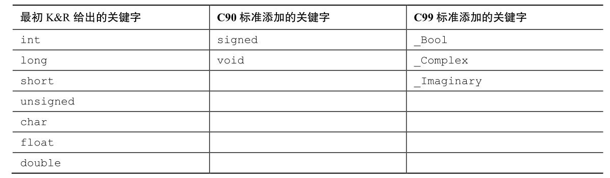

在C语言中，用int关键字来表示基本的整数类型。后3个关键字（long、short和unsigned）和C90新增的signed用于提供基本整数类型的变式，例如unsigned short int和long long int。char关键字用于指定字母和其他字符（如，#、$、%和*）。另外，char类型也可以表示较小的整数。float、double和long double表示带小数点的数。_Bool类型表示布尔值（true或false），_complex和_Imaginary分别表示复数和虚数。

通过这些关键字创建的类型，按计算机的储存方式可分为两大基本类型：整数类型和浮点数类型。

位、字节和字

位、字节和字是描述计算机数据单元或存储单元的术语。这里主要指存储单元。

最小的存储单元是位（bit），可以储存0或1（或者说，位用于设置“开”或“关”）。虽然1位储存的信息有限，但是计算机中位的数量十分庞大。位是计算机内存的基本构建块。

字节（byte）是常用的计算机存储单位。对于几乎所有的机器，1字节均为8位。这是字节的标准定义，至少在衡量存储单位时是这样（但是，C语言对此有不同的定义，请参阅本章3.4.3节）。既然1位可以表示0或1，那么8位字节就有256（2的8次方）种可能的0、1的组合。过二进制编码（仅用0和1便可表示数字），便可表示0～255的整数或一组字符（第15章将详细讨论二进制编码，如果感兴趣可以现在浏览一下该章的内容）。

字（word）是设计计算机时给定的自然存储单位。对于8位的微型计算机（如，最初的苹果机）， 1个字长只有8位。从那以后，个人计算机字长增至16位、32位，直到目前的64位。计算机的字长越大，其数据转移越快，允许的内存访问也更多。

### 3.3.1 整数和浮点数
整数类型？浮点数类型？如果觉得这些术语非常陌生，别担心，下面先简述它们的含义。如果不熟悉位、字节和字的概念，请阅读上面方框中的内容。刚开始学习时，不必了解所有的细节，就像学习开车之前不必详细了解汽车内部引擎的原理一样。但是，了解一些计算机或汽车引擎内部的原理会对你有所帮助。

对我们而言，整数和浮点数的区别是它们的书写方式不同。对计算机而言，它们的区别是储存方式不同。下面详细介绍整数和浮点数。

### 3.3.2 整数
和数学的概念一样，在C语言中，整数是没有小数部分的数。例如，2、−23和2456都是整数。而3.14、0.22和2.000都不是整数。计算机以二进制数字储存整数，例如，整数7以二进制写是111。因此，要在8位字节中储存该数字，需要把前5位都设置成0，后3位设置成1（如图3.2所示）。

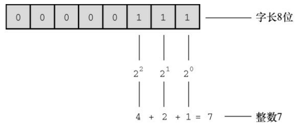

### 3.3.3 浮点数
浮点数与数学中实数的概念差不多。2.75、3.16E7、7.00 和 2e-8 都是浮点数。注意，在一个值后面加上一个小数点，该值就成为一个浮点值。所以，7是整数，7.00是浮点数。显然，书写浮点数有多种形式。稍后将详细介绍e记数法，这里先做简要介绍：3.16E7 表示3.16×107（3.16 乘以10 的7次方）。其中， 107=10000000，7被称为10的指数。

这里关键要理解浮点数和整数的储存方案不同。计算机把浮点数分成小数部分和指数部分来表示，而且分开储存这两部分。因此，虽然7.00和7在数值上相同，但是它们的储存方式不同。在十进制下，可以把7.0写成0.7E1。这里，0.7是小数部分，1是指数部分。图3.3演示了一个储存浮点数的例子。当然，计算机在内部使用二进制和2的幂进行储存，而不是10的幂。第15章将详述相关内容。现在，我们着重讲解这两种类型的实际区别。

整数没有小数部分，浮点数有小数部分。

浮点数可以表示的范围比整数大。参见本章末的表3.3。

对于一些算术运算（如，两个很大的数相减），浮点数损失的精度更多。

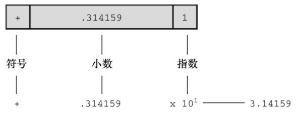

因为在任何区间内（如，1.0 到 2.0 之间）都存在无穷多个实数，所以计算机的浮点数不能表示区间内所有的值。浮点数通常只是实际值的近似值。例如，7.0可能被储存为浮点值6.99999。稍后会讨论更多精度方面的内容。

过去，浮点运算比整数运算慢。不过，现在许多CPU都包含浮点处理器，缩小了速度上的差距。

## 3.4 C语言基本数据类型
本节将详细节介绍C语言的基本数据类型，包括如何声明变量、如何表示字面值常量（如，5或2.78），以及典型的用法。一些老式的C语言编译器无法支持这里提到的所有类型，请查阅你使用的编译器文档，了解可以使用哪些类型。

### 3.4.1 int类型
C语言提供了许多整数类型，为什么一种类型不够用？因为 C语言让程序员针对不同情况选择不同的类型。特别是，C语言中的整数类型可表示不同的取值范围和正负值。一般情况使用int类型即可，但是为满足特定任务和机器的要求，还可以选择其他类型。

int类型是有符号整型，即int类型的值必须是整数，可以是正整数、负整数或零。其取值范围依计算机系统而异。一般而言，储存一个int要占用一个机器字长。因此，早期的16位IBM PC兼容机使用16位来储存一个int值，其取值范围（即int值的取值范围）是-32768～32767。目前的个人计算机一般是32位，因此用32位储存一个int值。现在，个人计算机产业正逐步向着64位处理器发展，自然能储存更大的整数。ISO C规定int的取值范围最小为-32768～32767。一般而言，系统用一个特殊位的值表示有符号整数的正负号。第15章将介绍常用的方法。

1. 声明int变量

第2章中已经用int声明过基本整型变量。先写上int，然后写变量名，最后加上一个分号。要声明多个变量，可以单独声明每个变量，也可在int后面列出多个变量名，变量名之间用逗号分隔。下面都是有效的声明：
```c
int erns;
int hogs, cows, goats;
```

可以分别在4条声明中声明各变量，也可以在一条声明中声明4个变量。两种方法的效果相同，都为4个int大小的变量赋予名称并分配内存空间。

以上声明创建了变量，但是并没有给它们提供值。变量如何获得值？前面介绍过在程序中获取值的两种途径。第1种途径是赋值：
```c
cows = 112;
```

第2种途径是，通过函数（如，scanf()）获得值。接下来，我们着重介绍第3种途径。

2. 初始化变量

初始化（initialize）变量就是为变量赋一个初始值。在C语言中，初始化可以直接在声明中完成。只需在变量名后面加上赋值运算符（=）和待赋给变量的值即可。如下所示：
```c
int hogs = 21;
int cows = 32, goats = 14;
int dogs, cats = 94; /* 有效，但是这种格式很糟糕 */
```

以上示例的最后一行，只初始化了cats，并未初始化dogs。这种写法很容易让人误认为dogs也被初始化为94，所以最好不要把初始化的变量和未初始化的变量放在同一条声明中。

简而言之，声明为变量创建和标记存储空间，并为其指定初始值（如图3.4所示）。

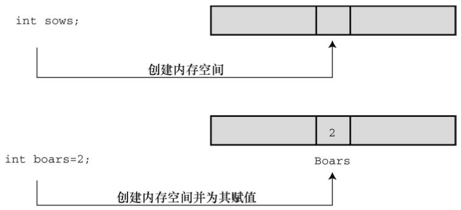

3. int类型常量

上面示例中出现的整数（21、32、14和94）都是整型常量或整型字面量。C语言把不含小数点和指数的数作为整数。因此，22和-44都是整型常量，但是22.0和2.2E1则不是。C语言把大多数整型常量视为int类型，但是非常大的整数除外。详见后面“long常量和long long常量”小节对long int类型的讨论。

4. 打印int值

可以使用printf()函数打印int类型的值。第2章中介绍过，%d指明了在一行中打印整数的位置。%d称为转换说明，它指定了printf()应使用什么格式来显示一个值。格式化字符串中的每个%d都与待打印变量列表中相应的int值匹配。这个值可以是int类型的变量、int类型的常量或其他任何值为int类型的表达式。作为程序员，要确保转换说明的数量与待打印值的数量相同，编译器不会捕获这类型的错误。程序清单3.2演示了一个简单的程序，程序中初始化了一个变量，并打印该变量的值、一个常量值和一个简单表达式的值。另外，程序还演示了如果粗心犯错会导致什么结果。

程序清单3.2 print1.c程序
```c
/* print1.c - 演示printf()的一些特性 */
#include　<stdio.h>
int　main(void)
{
    int　ten　=　10;
    int　two　=　2;
    printf("Doing　it　right:　");
    printf("%d　minus　%d　is　%d\n",　ten,　2,　ten　-　two);
    printf("Doing　it　wrong:　");
    printf("%d minus %d is %d\n", ten);　// 遗漏2个参数
    return　0;
}
```

编译并运行该程序，输出如下：
```json5
Doing it right: 10 minus 2 is 8
Doing it wrong: 10 minus 16 is 1650287143
```

在第一行输出中，第1个%d对应int类型变量ten；第2个%d对应int类型常量2；第3个%d对应int类型表达式ten - two的值。在第二行输出中，第1个%d对应ten的值，但是由于没有给后两个%d提供任何值，所以打印出的值是内存中的任意值（读者在运行该程序时显示的这两个数值会与输出示例中的数值不同，因为内存中储存的数据不同，而且编译器管理内存的位置也不同）。

你可能会抱怨编译器为何不能捕获这种明显的错误，但实际上问题出在printf()不寻常的设计。大部分函数都需要指定数目的参数，编译器会检查参数的数目是否正确。但是，printf()函数的参数数目不定，可以有1个、2个、3个或更多，编译器也爱莫能助。记住，使用printf()函数时，要确保转换说明的数量与待打印值的数量相等。

5. 八进制和十六进制

通常，C语言都假定整型常量是十进制数。然而，许多程序员很喜欢使用八进制和十六进制数。因为8和16都是2的幂，而10却不是。显然，八进制和十六进制记数系统在表达与计算机相关的值时很方便。例如，十进制数65536经常出现在16位机中，用十六进制表示正好是10000。另外，十六进制数的每一位的数恰好由4位二进制数表示。例如，十六进制数3是0011，十六进制数5是0101。因此，十六进制数35的位组合（bit pattern）是00110101，十六进制数53的位组合是01010011。这种对应关系使得十六进制和二进制的转换非常方便。但是，计算机如何知道10000是十进制、十六进制还是二进制？在C语言中，用特定的前缀表示使用哪种进制。0x或0X前缀表示十六进制值，所以十进制数16表示成十六进制是0x10或0X10。与此类似，0前缀表示八进制。例如，十进制数16表示成八进制是020。第15章将更全面地介绍进制相关的内容。

要清楚，使用不同的进制数是为了方便，不会影响数被储存的方式。也就是说，无论把数字写成16、020或0x10，储存该数的方式都相同，因为计算机内部都以二进制进行编码。

6. 显示八进制和十六进制

在C程序中，既可以使用和显示不同进制的数。不同的进制要使用不同的转换说明。以十进制显示数字，使用%d；以八进制显示数字，使用%o；以十六进制显示数字，使用%x。另外，要显示各进制数的前缀0、0x和0X，必须分别使用%#o、%#x、%#X。程序清单3.3演示了一个小程序。回忆一下，在某些集成开发环境（IDE）下编写的代码中插入 `getchar();` 语句，程序在执行完毕后不会立即关闭执行窗口。

程序清单3.3 bases.c程序
```c
/* bases.c--以十进制、八进制、十六进制打印十进制数100 */
#include <stdio.h>
int main(void)
{
    int x = 100;
    printf("dec = %d; octal = %o; hex = %x\n", x, x, x);
    printf("dec = %d; octal = %#o; hex = %#x\n", x, x, x);
    return 0;
}
```

编译并运行该程序，输出如下：
```json5
dec = 100; octal = 144; hex = 64
dec = 100; octal = 0144; hex = 0x64
```

该程序以3种不同记数系统显示同一个值。printf()函数做了相应的转换。注意，如果要在八进制和十六进制值前显示0和0x前缀，要分别在转换说明中加入#。

### 3.4.2 其他整数类型
初学C语言时，int类型应该能满足大多数程序的整数类型需求。尽管如此，还应了解一下整型的其他形式。当然，也可以略过本节跳至3.4.3节阅读char类型的相关内容，以后有需要时再阅读本节。

C语言提供3个附属关键字修饰基本整数类型：short、long和unsigned。应记住以下几点。

short int类型（或者简写为short）占用的存储空间可能比int类型少，常用于较小数值的场合以节省空间。与int类似，short是有符号类型。

long int或long占用的存储空间可能比int多，适用于较大数值的场合。与int类似，long是有符号类型。

long long int或long long（C99标准加入）占用的储存空间可能比long多，适用于更大数值的场合。该类型至少占64位。与int类似，long long是有符号类型。

unsigned int或unsigned只用于非负值的场合。这种类型与有符号类型表示的范围不同。例如，16位unsigned int允许的取值范围是0～65535，而不是-32768～32767。用于表示正负号的位现在用于表示另一个二进制位，所以无符号整型可以表示更大的数。

在C90标准中，添加了unsigned long int或unsigned long和unsigned int或unsigned short类型。C99标准又添加了unsigned long long int或unsigned long long。

在任何有符号类型前面添加关键字signed，可强调使用有符号类型的意图。例如，short、short int、signed short、signed short int都表示同一种类型。

1. 声明其他整数类型

其他整数类型的声明方式与int类型相同，下面列出了一些例子。不是所有的C编译器都能识别最后3条声明，最后一个例子所有的类型是C99标准新增的。
```c
long　int　estine;
long　johns;
short　int　erns;
short　ribs;
unsigned　int　s_count;
unsigned　players;
unsigned　long　headcount;
unsigned　short　yesvotes;
long　long　ago;
```

2. 使用多种整数类型的原因

为什么说short类型“可能”比int类型占用的空间少，long类型“可能”比int类型占用的空间多？因为C语言只规定了short占用的存储空间不能多于int，long占用的存储空间不能少于int。这样规定是为了适应不同的机器。例如，过去的一台运行Windows 3的机器上，int类型和short类型都占16位，long类型占32位。后来，Windows和苹果系统都使用16位储存short类型，32位储存int类型和long类型（使用32位可以表示的整数数值超过20亿）。现在，计算机普遍使用64位处理器，为了储存64位的整数，才引入了long long类型。

现在，个人计算机上最常见的设置是，long long占64位，long占32位，short占16位，int占16位或32位（依计算机的自然字长而定）。原则上，这4种类型代表4种不同的大小，但是在实际使用中，有些类型之间通常有重叠。

C 标准对基本数据类型只规定了允许的最小大小。对于 16 位机，short和 int 的最小取值范围是[−32767,32767]；对于32位机，long的最小取值范围是[−2147483647,2147483647]。对于unsigned short和unsigned int，最小取值范围是[0,65535]；对于unsigned long，最小取值范围是[0,4294967295]。long long类型是为了支持64位的需求，最小取值范围是[−9223372036854775807,9223372036854775807]；unsigned long long的最小取值范围是[0,18446744073709551615]。如果要开支票，这个数是一千八百亿亿（兆）六千七百四十四万亿零七百三十七亿零九百五十五万一千六百一十五。但是，谁会去数？

int类型那么多，应该如何选择？首先，考虑unsigned类型。这种类型的数常用于计数，因为计数不用负数。而且，unsigned类型可以表示更大的正数。

如果一个数超出了int类型的取值范围，且在long类型的取值范围内时，使用long类型。然而，对于那些long占用的空间比int大的系统，使用long类型会减慢运算速度。因此，如非必要，请不要使用long类型。另外要注意一点：如果在long类型和int类型占用空间相同的机器上编写代码，当确实需要32位的整数时，应使用long类型而不是int类型，以便把程序移植到16位机后仍然可以正常工作。类似地，如果确实需要64位的整数，应使用long long类型。

如果在int设置为32位的系统中要使用16位的值，应使用short类型以节省存储空间。通常，只有当程序使用相对于系统可用内存较大的整型数组时，才需要重点考虑节省空间的问题。使用short类型的另一个原因是，计算机中某些组件使用的硬件寄存器是16位。

3. long常量和long long常量

通常，程序代码中使用的数字（如，2345）都被储存为int类型。如果使用1000000这样的大数字，超出了int类型能表示的范围，编译器会将其视为long int类型（假设这种类型可以表示该数字）。如果数字超出long可表示的最大值，编译器则将其视为unsigned long类型。如果还不够大，编译器则将其视为long long或unsigned long long类型（前提是编译器能识别这些类型）。

八进制和十六进制常量被视为int类型。如果值太大，编译器会尝试使用unsigned int。如果还不够大，编译器会依次使用long、unsigned long、long long和unsigned long long类型。

有些情况下，需要编译器以long类型储存一个小数字。例如，编程时要显式使用IBM PC上的内存地址时。另外，一些C标准函数也要求使用long类型的值。要把一个较小的常量作为long类型对待，可以在值的末尾加上l（小写的L）或L后缀。使用L后缀更好，因为l看上去和数字1很像。因此，在int为16位、long为32位的系统中，会把7作为16位储存，把7L作为32位储存。l或L后缀也可用于八进制和十六进制整数，如020L和0x10L。

类似地，在支持long long类型的系统中，也可以使用ll或LL后缀来表示long long类型的值，如3LL。另外，u或U后缀表示unsigned long long，如5ull、10LLU、6LLU或9Ull。

整数溢出

如果整数超出了相应类型的取值范围会怎样？下面分别将有符号类型和无符号类型的整数设置为比最大值略大，看看会发生什么（printf()函数使用%u说明显示unsigned int类型的值）。
```c
/* toobig.c-- 超出系统允许的最大int值*/
#include <stdio.h>
int main(void)
{
    int i = 2147483647;
    unsigned int j = 4294967295;
    printf("%d %d %d\n", i, i+1, i+2);
    printf("%u %u %u\n", j, j+1, j+2);
    return 0;
}
```

在我们的系统下输出的结果是：
```json5
2147483647 -2147483648 -2147483647
4294967295 0 1
```

可以把无符号整数j看作是汽车的里程表。当达到它能表示的最大值时，会重新从起始点开始。整数 i 也是类似的情况。它们主要的区别是，在超过最大值时，unsigned int 类型的变量 j 从 0开始；而int类型的变量i则从−2147483648开始。注意，当i超出（溢出）其相应类型所能表示的最大值时，系统并未通知用户。因此，在编程时必须自己注意这类问题。

溢出行为是未定义的行为，C 标准并未定义有符号类型的溢出规则。以上描述的溢出行为比较有代表性，但是也可能会出现其他情况。

4. 打印short、long、long long和unsigned类型

打印unsigned int类型的值，使用%u转换说明；打印long类型的值，使用%ld转换说明。如果系统中int和long的大小相同，使用%d就行。但是，这样的程序被移植到其他系统（int和long类型的大小不同）中会无法正常工作。在x和o前面可以使用l前缀，%lx表示以十六进制格式打印long类型整数，%lo表示以八进制格式打印long类型整数。注意，虽然C允许使用大写或小写的常量后缀，但是在转换说明中只能用小写。

C语言有多种printf()格式。对于short类型，可以使用h前缀。%hd表示以十进制显示short类型的整数，%ho表示以八进制显示short类型的整数。h和l前缀都可以和u一起使用，用于表示无符号类型。例如，%lu表示打印unsigned long类型的值。程序清单3.4演示了一些例子。对于支持long long类型的系统，%lld和%llu分别表示有符号和无符号类型。第4章将详细介绍转换说明。

程序清单3.4 print2.c程序
```c
/* print2.c--更多printf()的特性 */
#include <stdio.h>
int main(void)
{
    unsigned int un = 3000000000; /* int为32位和short为16位的系统 */
    short end = 200;
    long big = 65537;
    long long verybig = 12345678908642;
    printf("un = %u and not %d\n", un, un);
    printf("end = %hd and %d\n", end, end);
    printf("big = %ld and not %hd\n", big, big);
    printf("verybig= %lld and not %ld\n", verybig, verybig);
    return 0;
}
```

在特定的系统中输出如下（输出的结果可能不同）：
```json5
un = 3000000000 and not -1294967296
end = 200 and 200
big = 65537 and not 1
verybig= 12345678908642 and not 12345678908642
```

该例表明，使用错误的转换说明会得到意想不到的结果。第 1 行输出，对于无符号变量 un，使用%d会生成负值！其原因是，无符号值 3000000000 和有符号值−129496296 在系统内存中的内部表示完全相同（详见第15章）。因此，如果告诉printf()该数是无符号数，它打印一个值；如果告诉它该数是有符号数，它将打印另一个值。在待打印的值大于有符号值的最大值时，会发生这种情况。对于较小的正数（如96），有符号和无符号类型的存储、显示都相同。

第2行输出，对于short类型的变量end，在printf()中无论指定以short类型（%hd）还是int类型（%d）打印，打印出来的值都相同。这是因为在给函数传递参数时，C编译器把short类型的值自动转换成int类型的值。你可能会提出疑问：为什么要进行转换？h修饰符有什么用？第1个问题的答案是，int类型被认为是计算机处理整数类型时最高效的类型。因此，在short和int类型的大小不同的计算机中，用int类型的参数传递速度更快。第2个问题的答案是，使用h修饰符可以显示较大整数被截断成 short 类型值的情况。第 3 行输出就演示了这种情况。把 65537 以二进制格式写成一个 32 位数是00000000000000010000000000000001。使用%hd，printf()只会查看后 16 位，所以显示的值是 1。与此类似，输出的最后一行先显示了verybig的完整值，然后由于使用了%ld，printf()只显示了储存在后32位的值。

本章前面介绍过，程序员必须确保转换说明的数量和待打印值的数量相同。以上内容也提醒读者，程序员还必须根据待打印值的类型使用正确的转换说明。

提示 匹配printf()说明符的类型

在使用 printf()函数时，切记检查每个待打印值都有对应的转换说明，还要检查转换说明的类型是否与待打印值的类型相匹配。

### 3.4.3 使用字符：char类型
char类型用于储存字符（如，字母或标点符号），但是从技术层面看，char是整数类型。因为char类型实际上储存的是整数而不是字符。计算机使用数字编码来处理字符，即用特定的整数表示特定的字符。美国最常用的编码是ASCII编码，本书也使用此编码。例如，在ASCII码中，整数65代表大写字母A。因此，储存字母A实际上储存的是整数65（许多IBM的大型主机使用另一种编码——EBCDIC，其原理相同。另外，其他国家的计算机系统可能使用完全不同的编码）。

标准ASCII码的范围是0～127，只需7位二进制数即可表示。通常，char类型被定义为8位的存储单元，因此容纳标准ASCII码绰绰有余。许多其他系统（如IMB PC和苹果Macs）还提供扩展ASCII码，也在8位的表示范围之内。一般而言，C语言会保证char类型足够大，以储存系统（实现C语言的系统）的基本字符集。

许多字符集都超过了127，甚至多于255。例如，日本汉字（kanji）字符集。商用的统一码（Unicode）创建了一个能表示世界范围内多种字符集的系统，目前包含的字符已超过110000个。国际标准化组织（ISO）和国际电工技术委员会（IEC）为字符集开发了ISO/IEC 10646标准。统一码标准也与ISO/IEC 10646标准兼容。

C语言把1字节定义为char类型占用的位（bit）数，因此无论是16位还是32位系统，都可以使用char类型。

1. 声明char类型变量

char类型变量的声明方式与其他类型变量的声明方式相同。下面是一些例子：
```c
char response;
char itable, latan;
```

以上声明创建了3个char类型的变量：response、itable和latan。

2. 字符常量和初始化

如果要把一个字符常量初始化为字母 A，不必背下 ASCII 码，用计算机语言很容易做到。通过以下初始化把字母A赋给grade即可：
```c
char grade = 'A';
```

在C语言中，用单引号括起来的单个字符被称为字符常量（character constant）。编译器一发现'A'，就会将其转换成相应的代码值。单引号必不可少。下面还有一些其他的例子：
```c
char broiled;     /* 声明一个char类型的变量 */
broiled = 'T';    /* 为其赋值，正确 */
broiled = T;    　/* 错误！此时T是一个变量 */
broiled = "T";    /* 错误！此时"T"是一个字符串 */
```

如上所示，如果省略单引号，编译器认为T是一个变量名；如果把T用双引号括起来，编译器则认为"T"是一个字符串。字符串的内容将在第4章中介绍。

实际上，字符是以数值形式储存的，所以也可使用数字代码值来赋值：
```c
char grade = 65; /* 对于ASCII，这样做没问题，但这是一种不好的编程风格 */
```

在本例中，虽然65是int类型，但是它在char类型能表示的范围内，所以将其赋值给grade没问题。由于65是字母A对应的ASCII码，因此本例是把A赋给grade。注意，能这样做的前提是系统使用ASCII码。其实，用'A'代替65才是较为妥当的做法，这样在任何系统中都不会出问题。因此，最好使用字符常量，而不是数字代码值。

奇怪的是，C语言将字符常量视为int类型而非char类型。例如，在int为32位、char为8位的ASCII系统中，有下面的代码：
```c
char grade = 'B';
```

本来'B'对应的数值66储存在32位的存储单元中，现在却可以储存在8位的存储单元中（grade）。利用字符常量的这种特性，可以定义一个字符常量'FATE'，即把4个独立的8位ASCII码储存在一个32位存储单元中。如果把这样的字符常量赋给char类型变量grade，只有最后8位有效。因此，grade的值是'E'。

3. 非打印字符

单引号只适用于字符、数字和标点符号，浏览ASCII表会发现，有些ASCII字符打印不出来。例如，一些代表行为的字符（如，退格、换行、终端响铃或蜂鸣）。C语言提供了3种方法表示这些字符。

第1种方法前面介绍过——使用ASCII码。例如，蜂鸣字符的ASCII值是7，因此可以这样写：
```c
char beep = 7;
```

第2种方法是使用特殊的符号序列表示一些特殊的字符。这些符号序列叫作转义序列（escape sequence）。表3.2列出了转义序列及其含义。

把转义序列赋给字符变量时，必须用单引号把转义序列括起来。例如，假设有下面一行代码：
```c
char nerf = '\n';
```

稍后打印变量nerf的效果是，在打印机或屏幕上另起一行。

表3.2 转义序列

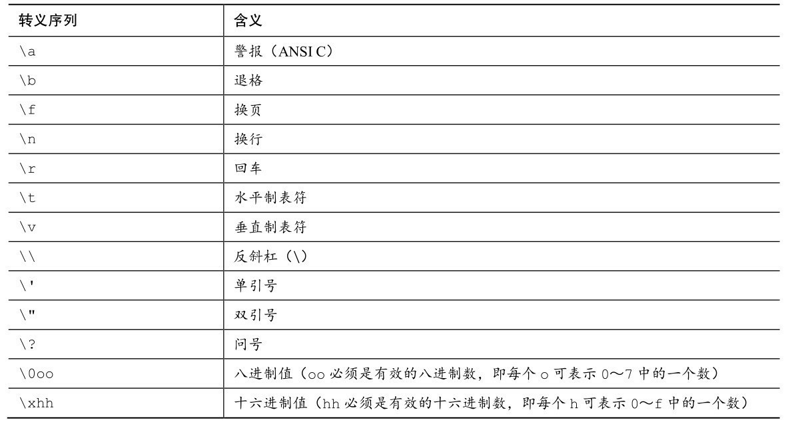

现在，我们来仔细分析一下转义序列。使用C90新增的警报字符（\a）是否能产生听到或看到的警报，取决于计算机的硬件，蜂鸣是最常见的警报（在一些系统中，警报字符不起作用）。C标准规定警报字符不得改变活跃位置。标准中的活跃位置（active position）指的是显示设备（屏幕、电传打字机、打印机等）中下一个字符将出现的位置。简而言之，平时常说的屏幕光标位置就是活跃位置。在程序中把警报字符输出在屏幕上的效果是，发出一声蜂鸣，但不会移动屏幕光标。

接下来的转义字符\b、\f、\n、\r、\t和\v是常用的输出设备控制字符。了解它们最好的方式是查看它们对活跃位置的影响。换页符（\f）把活跃位置移至下一页的开始处；换行符（\n）把活跃位置移至下一行的开始处；回车符（\r）把活跃位置移动到当前行的开始处；水平制表符（\t）将活跃位置移至下一个水平制表点（通常是第1个、第9个、第17个、第25个等字符位置）；垂直制表符（\v）把活跃位置移至下一个垂直制表点。

这些转义序列字符不一定在所有的显示设备上都起作用。例如，换页符和垂直制表符在PC屏幕上会生成奇怪的符号，光标并不会移动。只有将其输出到打印机上时才会产生前面描述的效果。

接下来的3个转义序列（\\、\'、\"）用于打印\、'、"字符（由于这些字符用于定义字符常量，是printf()函数的一部分，若直接使用它们会造成混乱）。如果打印下面一行内容：
```json5
Gramps sez, "a \ is a backslash."
```

应这样编写代码：
```c
printf("Gramps sez, \"a \\ is a backslash.\"\n");
```

表3.2中的最后两个转义序列（\0oo和\xhh）是ASCII码的特殊表示。如果要用八进制ASCII码表示一个字符，可以在编码值前面加一个反斜杠（\）并用单引号括起来。例如，如果编译器不识别警报字符（\a），可以使用ASCII码来代替：
```c
beep = '\007';
```

可以省略前面的 0，'\07'甚至'\7'都可以。即使没有前缀 0，编译器在处理这种写法时，仍会解释为八进制。

从C90开始，不仅可以用十进制、八进制形式表示字符常量，C语言还提供了第3种选择——用十六进制形式表示字符常量，即反斜杠后面跟一个x或X，再加上1～3位十六进制数字。例如，Ctrl+P字符的ASCII十六进制码是10（相当于十进制的16），可表示为'\x10'或'\x010'。图3.5列出了一些整数类型的不同进制形式。

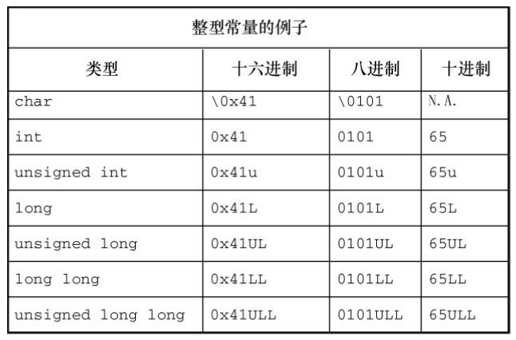

使用ASCII码时，注意数字和数字字符的区别。例如，字符4对应的ASCII码是52。'4'表示字符4，而不是数值4。

关于转义序列，读者可能有下面3个问题。

上面最后一个例子（printf("Gramps sez, \"a \\ is a backslash\"\"n"），为何没有用单引号把转义序列括起来？无论是普通字符还是转义序列，只要是双引号括起来的字符集合，就无需用单引号括起来。双引号中的字符集合叫作字符串（详见第4章）。注意，该例中的其他字符（G、r、a、m、p、s等）都没有用单引号括起来。与此类似，printf("Hello!\007\n");将打印Hello!并发出一声蜂鸣，而 printf("Hello!7\n");则打印 Hello!7。不是转义序列中的数字将作为普通字符被打印出来。

何时使用ASCII码？何时使用转义序列？如果要在转义序列（假设使用'\f'）和ASCII码（'\014'）之间选择，请选择前者（即'\f'）。这样的写法不仅更好记，而且可移植性更高。'\f'在不使用ASCII码的系统中，仍然有效。

如果要使用ASCII码，为何要写成'\032'而不是032？首先，'\032'能更清晰地表达程序员使用字符编码的意图。其次，类似\032这样的转义序列可以嵌入C的字符串中，如printf("Hello!\007\n");中就嵌入了\007。

4. 打印字符

printf()函数用%c指明待打印的字符。前面介绍过，一个字符变量实际上被储存为1字节的整数值。因此，如果用%d转换说明打印 char类型变量的值，打印的是一个整数。而%c转换说明告诉printf()打印该整数值对应的字符。程序清单3.5演示了打印char类型变量的两种方式。

程序清单3.5 charcode.c程序
```c
/* charcode.c-显示字符的代码编号 */
#include <stdio.h>
int main(void)
{
    char ch;
    printf("Please enter a character.\n");
    scanf("%c", &ch); /* 用户输入字符 */
    printf("The code for %c is %d.\n", ch, ch);
    return 0;
}
```

运行该程序后，输出示例如下：
```json5
Please enter a character.
C
The code for C is 67.
```

运行该程序时，在输入字母后不要忘记按下Enter或Return键。随后，scanf()函数会读取用户输入的字符，&符号表示把输入的字符赋给变量ch。接着，printf()函数打印ch的值两次，第1次打印一个字符（对应代码中的%c），第2次打印一个十进制整数值（对应代码中的%d）。注意，printf()函数中的转换说明决定了数据的显示方式，而不是数据的储存方式（见图3.6）。

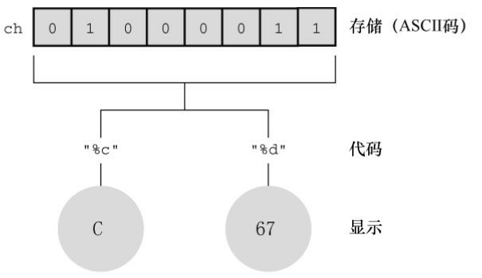

5. 有符号还是无符号

有些C编译器把char实现为有符号类型，这意味着char可表示的范围是-128～127。而有些C编译器把char实现为无符号类型，那么char可表示的范围是0～255。请查阅相应的编译器手册，确定正在使用的编译器如何实现char类型。或者，可以查阅limits.h头文件。下一章将详细介绍头文件的内容。

根据C90标准，C语言允许在关键字char前面使用signed或unsigned。这样，无论编译器默认char是什么类型，signed char表示有符号类型，而unsigned char表示无符号类型。这在用char类型处理小整数时很有用。如果只用char处理字符，那么char前面无需使用任何修饰符。

### 3.4.4 _Bool类型
C99标准添加了_Bool类型，用于表示布尔值，即逻辑值true和false。因为C语言用值1表示true，值0表示false，所以_Bool类型实际上也是一种整数类型。但原则上它仅占用1位存储空间，因为对0和1而言，1位的存储空间足够了。

程序通过布尔值可选择执行哪部分代码。我们将在第6章和第7章中详述相关内容。

### 3.4.5 可移植类型：stdint.h和inttypes.h
C 语言提供了许多有用的整数类型。但是，某些类型名在不同系统中的功能不一样。C99 新增了两个头文件stdint.h和inttypes.h，以确保C语言的类型在各系统中的功能相同。

C语言为现有类型创建了更多类型名。这些新的类型名定义在stdint.h头文件中。例如，int32_t表示32位的有符号整数类型。在使用32位int的系统中，头文件会把int32_t作为int的别名。不同的系统也可以定义相同的类型名。例如，int为16位、long为32位的系统会把int32_t作为long的别名。然后，使用int32_t类型编写程序，并包含stdint.h头文件时，编译器会把int或long替换成与当前系统匹配的类型。

上面讨论的类型别名是精确宽度整数类型（exact-width integer type）的示例。int32_t表示整数类型的宽度正好是32位。但是，计算机的底层系统可能不支持。因此，精确宽度整数类型是可选项。

如果系统不支持精确宽度整数类型怎么办？C99和C11提供了第2类别名集合。一些类型名保证所表示的类型一定是至少有指定宽度的最小整数类型。这组类型集合被称为最小宽度类型（minimum width type）。例如，int_least8_t是可容纳8位有符号整数值的类型中宽度最小的类型的一个别名。如果某系统的最小整数类型是16位，可能不会定义int8_t类型。尽管如此，该系统仍可使用int_least8_t类型，但可能把该类型实现为16位的整数类型。

当然，一些程序员更关心速度而非空间。为此，C99和C11定义了一组可使计算达到最快的类型集合。这组类型集合被称为最快最小宽度类型（fastst minimum width type）。例如，int_fast8_t被定义为系统中对8位有符号值而言运算最快的整数类型的别名。

另外，有些程序员需要系统的最大整数类型。为此，C99定义了最大的有符号整数类型intmax_t，可储存任何有效的有符号整数值。类似地，unitmax_t表示最大的无符号整数类型。顺带一提，这些类型有可能比long long和unsigned long类型更大，因为C编译器除了实现标准规定的类型以外，还可利用C语言实现其他类型。例如，一些编译器在标准引入 long long 类型之前，已提前实现了该类型。

C99 和 C11 不仅提供可移植的类型名，还提供相应的输入和输出。例如，printf()打印特定类型时要求与相应的转换说明匹配。如果要打印int32_t类型的值，有些定义使用%d，而有些定义使用%ld，怎么办？C 标准针对这一情况，提供了一些字符串宏（第 4 章中详细介绍）来显示可移植类型。例如， inttypes.h头文件中定义了PRId32字符串宏，代表打印32位有符号值的合适转换说明（如d或l）。程序清单3.6演示了一种可移植类型和相应转换说明的用法。

程序清单3.6 altnames.c程序
```c
/* altnames.c -- 可移植整数类型名 */
#include <stdio.h>
#include <inttypes.h> // 支持可移植类型

int main(void)
{
    int32_t me32;     // me32是一个32位有符号整型变量
    me32  =  45933945;
    printf("First, assume int32_t is int: ");
    printf("me32 = %d\n", me32);
    printf("Next, let's not make any assumptions.\n");
    printf("Instead, use a \"macro\" from inttypes.h: ");
    printf("me32 = %" PRId32 "\n", me32);
    return  0;
}
```

该程序最后一个printf()中，参数PRId32被定义在inttypes.h中的"d"替换，因而这条语句等价于：
```c
printf("me16 = %" "d" "\n", me16);
```

在C语言中，可以把多个连续的字符串组合成一个字符串，所以这条语句又等价于：
```c
printf("me16 = %d\n", me16);
```

下面是该程序的输出，注意，程序中使用了\"转义序列来显示双引号：
```json5
First, assume int32_t is int: me32 = 45933945
Next, let's not make any assumptions.
Instead, use a "macro" from inttypes.h: me32 = 45933945
```

篇幅有限，无法介绍扩展的所有整数类型。本节主要是为了让读者知道，在需要时可进行这种级别的类型控制。附录B中的参考资料VI“扩展的整数类型”介绍了完整的inttypes.h和stdint.h头文件。

注意 对C99/C11的支持

C语言发展至今，虽然ISO已发布了C11标准，但是编译器供应商对C99的实现程度却各不相同。在本书第6版的编写过程中，一些编译器仍未实现inttypes.h头文件及其相关功能。

### 3.4.6 float、double和long double
各种整数类型对大多数软件开发项目而言够用了。然而，面向金融和数学的程序经常使用浮点数。C语言中的浮点类型有float、double和long double类型。它们与FORTRAN和Pascal中的real类型一致。前面提到过，浮点类型能表示包括小数在内更大范围的数。浮点数的表示类似于科学记数法（即用小数乘以10的幂来表示数字）。该记数系统常用于表示非常大或非常小的数。表3.3列出了一些示例。

表3.3 记数法示例

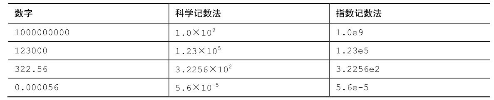

第1列是一般记数法；第2列是科学记数法；第3列是指数记数法（或称为e记数法），这是科学记数法在计算机中的写法，e后面的数字代表10的指数。图3.7演示了更多的浮点数写法。

C标准规定，float类型必须至少能表示6位有效数字，且取值范围至少是10-37～10+37。前一项规定指float类型必须至少精确表示小数点后的6位有效数字，如33.333333。后一项规定用于方便地表示诸如太阳质量（2.0e30千克）、一个质子的电荷量（1.6e-19库仑）或国家债务之类的数字。通常，系统储存一个浮点数要占用32位。其中8位用于表示指数的值和符号，剩下24位用于表示非指数部分（也叫作尾数或有效数）及其符号。


C语言提供的另一种浮点类型是double（意为双精度）。double类型和float类型的最小取值范围相同，但至少必须能表示10位有效数字。一般情况下，double占用64位而不是32位。一些系统将多出的 32 位全部用来表示非指数部分，这不仅增加了有效数字的位数（即提高了精度），而且还减少了舍入误差。另一些系统把其中的一些位分配给指数部分，以容纳更大的指数，从而增加了可表示数的范围。无论哪种方法，double类型的值至少有13位有效数字，超过了标准的最低位数规定。

C语言的第3种浮点类型是long double，以满足比double类型更高的精度要求。不过，C只保证long double类型至少与double类型的精度相同。

1. 声明浮点型变量

浮点型变量的声明和初始化方式与整型变量相同，下面是一些例子：
```c
float noah, jonah;
double trouble;
float planck = 6.63e-34;
long double gnp;
```

2. 浮点型常量

在代码中，可以用多种形式书写浮点型常量。浮点型常量的基本形式是：有符号的数字（包括小数点），后面紧跟e或E，最后是一个有符号数表示10的指数。下面是两个有效的浮点型常量：
```c
-1.56E+12
2.87e-3
```

正号可以省略。可以没有小数点（如，2E5）或指数部分（如，19.28），但是不能同时省略两者。可以省略小数部分（如，3.E16）或整数部分（如，.45E-6），但是不能同时省略两者。下面是更多的有效浮点型常量示例：
```c
3.14159
.2
4e16
.8E-5
100.
```

不要在浮点型常量中间加空格：1.56 E+12（错误！）

默认情况下，编译器假定浮点型常量是double类型的精度。例如，假设some是float类型的变量，编写下面的语句：
```c
some = 4.0 * 2.0;
```

通常，4.0和2.0被储存为64位的double类型，使用双精度进行乘法运算，然后将乘积截断成float类型的宽度。这样做虽然计算精度更高，但是会减慢程序的运行速度。

在浮点数后面加上f或F后缀可覆盖默认设置，编译器会将浮点型常量看作float类型，如2.3f和9.11E9F。使用l或L后缀使得数字成为long double类型，如54.3l和4.32L。注意，建议使用L后缀，因为字母l和数字1很容易混淆。没有后缀的浮点型常量是double类型。

C99 标准添加了一种新的浮点型常量格式——用十六进制表示浮点型常量，即在十六进制数前加上十六进制前缀（0x或0X），用p和P分别代替e和E，用2的幂代替10的幂（即，p计数法）。如下所示：
```c
0xa.1fp10
```

十六进制a等于十进制10，.1f是1/16加上15/256（十六进制f等于十进制15），p10是210或1024。0xa.1fp10表示的值是(10 + 1/16 + 15/256)×1024（即，十进制10364.0）。

注意，并非所有的编译器都支持C99的这一特性。

3. 打印浮点值

printf()函数使用%f转换说明打印十进制记数法的float和double类型浮点数，用%e打印指数记数法的浮点数。如果系统支持十六进制格式的浮点数，可用a和A分别代替e和E。打印long double类型要使用%Lf、%Le或%La转换说明。给那些未在函数原型中显式说明参数类型的函数（如，printf()）传递参数时，C编译器会把float类型的值自动转换成double类型。程序清单3.7演示了这些特性。

程序清单3.7 showf_pt.c程序
```c
/* showf_pt.c -- 以两种方式显示float类型的值 */
#include <stdio.h>
int main(void)
{
    float aboat = 32000.0;
    double abet = 2.14e9;
    long double dip = 5.32e-5;
    printf("%f can be written %e\n", aboat, aboat);
    // 下一行要求编译器支持C99或其中的相关特性
    printf("And it's %a in hexadecimal, powers of 2 notation\n", aboat);
    printf("%f can be written %e\n", abet, abet);
    printf("%Lf can be written %Le\n", dip, dip);
    return 0;
}
```

该程序的输出如下，前提是编译器支持C99/C11：
```c
32000.000000 can be written 3.200000e+04
And it's 0x1.f4p+14 in hexadecimal, powers of 2 notation
2140000000.000000 can be written 2.140000e+09
0.000053 can be written 5.320000e-05
```

该程序示例演示了默认的输出效果。下一章将介绍如何通过设置字段宽度和小数位数来控制输出格式。

4. 浮点值的上溢和下溢

假设系统的最大float类型值是3.4E38，编写如下代码：
```c
float toobig = 3.4E38 * 100.0f;
printf("%e\n", toobig);
```

会发生什么？这是一个上溢（overflow）的示例。当计算导致数字过大，超过当前类型能表达的范围时，就会发生上溢。这种行为在过去是未定义的，不过现在C语言规定，在这种情况下会给toobig赋一个表示无穷大的特定值，而且printf()显示该值为inf或infinity（或者具有无穷含义的其他内容）。

当除以一个很小的数时，情况更为复杂。回忆一下，float类型的数以指数和尾数部分来储存。存在这样一个数，它的指数部分是最小值，即由全部可用位表示的最小尾数值。该数字是float类型能用全部精度表示的最小数字。现在把它除以 2。通常，这个操作会减小指数部分，但是假设的情况中，指数已经是最小值了。所以计算机只好把尾数部分的位向右移，空出第1 个二进制位，并丢弃最后一个二进制数。以十进制为例，把一个有4位有效数字的数（如，0.1234E-10）除以10，得到的结果是0.0123E-10。虽然得到了结果，但是在计算过程中却损失了原末尾有效位上的数字。这种情况叫作下溢（underflow）。C语言把损失了类型全精度的浮点值称为低于正常的（subnormal）浮点值。因此，把最小的正浮点数除以 2将得到一个低于正常的值。如果除以一个非常大的值，会导致所有的位都为0。现在，C库已提供了用于检查计算是否会产生低于正常值的函数。

还有另一个特殊的浮点值NaN（not a number的缩写）。例如，给asin()函数传递一个值，该函数将返回一个角度，该角度的正弦就是传入函数的值。但是正弦值不能大于1，因此，如果传入的参数大于1，该函数的行为是未定义的。在这种情况下，该函数将返回NaN值，printf()函数可将其显示为nan、NaN或其他类似的内容。

浮点数舍入错误

给定一个数，加上1，再减去原来给定的数，结果是多少？你一定认为是1。但是，下面的浮点运算给出了不同的答案：
```c
/* floaterr.c--演示舍入错误 */
#include <stdio.h>
int main(void)
{
    float a,b;
    b = 2.0e20 + 1.0;
    a = b - 2.0e20;
    printf("%f \n", a);
    return 0;
}
```

该程序的输出如下：

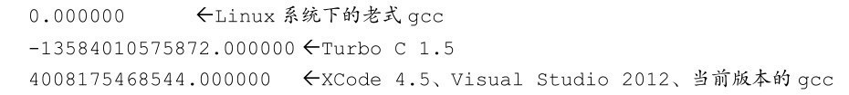

得出这些奇怪答案的原因是，计算机缺少足够的小数位来完成正确的运算。2.0e20是 2后面有20个0。如果把该数加1，那么发生变化的是第21位。要正确运算，程序至少要储存21位数字。而float类型的数字通常只能储存按指数比例缩小或放大的6或7位有效数字。在这种情况下，计算结果一定是错误的。另一方面，如果把2.0e20改成2.0e4，计算结果就没问题。因为2.0e4加1只需改变第5位上的数字，float类型的精度足够进行这样的计算。

浮点数表示法

上一个方框中列出了由于计算机使用的系统不同，一个程序有不同的输出。原因是，根据前面介绍的知识，实现浮点数表示法的方法有多种。为了尽可能地统一实现，电子和电气工程师协会（IEEE）为浮点数计算和表示法开发了一套标准。现在，许多硬件浮点单元都采用该标准。2011年，该标准被ISO/IEC/IEEE 60559:2011标准收录。该标准作为C99和C11的可选项，符合硬件要求的平台可开启。floaterr.c程序的第3个输出示例即是支持该浮点标准的系统显示的结果。支持C标准的编译器还包含捕获异常问题的工具。详见附录B.5，参考资料V。

### 3.4.7 复数和虚数类型
许多科学和工程计算都要用到复数和虚数。C99 标准支持复数类型和虚数类型，但是有所保留。一些独立实现，如嵌入式处理器的实现，就不需要使用复数和虚数（VCR芯片就不需要复数）。一般而言，虚数类型都是可选项。C11标准把整个复数软件包都作为可选项。

简而言之，C语言有3种复数类型：float_Complex、double_Complex和long double _Complex。例如，float _Complex类型的变量应包含两个float类型的值，分别表示复数的实部和虚部。类似地， C语言的3种虚数类型是float _Imaginary、double _Imaginary和long double _Imaginary。

如果包含complex.h头文件，便可用complex代替_Complex，用imaginary代替_Imaginary，还可以用I代替-1的平方根。

为何 C 标准不直接用 complex 作为关键字来代替_Complex，而要添加一个头文件（该头文件中把complex定义为_Complex）？因为标准委员会考虑到，如果使用新的关键字，会导致以该关键字作为标识符的现有代码全部失效。例如，之前的 C99，许多程序员已经使用 struct complex 定义一个结构来表示复数或者心理学程序中的心理状况（关键字struct用于定义能储存多个值的结构，详见第14章）。让complex成为关键字会导致之前的这些代码出现语法错误。但是，使用struct _Complex的人很少，特别是标准使用首字母是下划线的标识符作为预留字以后。因此，标准委员会选定_Complex作为关键字，在不用考虑名称冲突的情况下可选择使用complex。

### 3.4.8 其他类型
现在已经介绍完C语言的所有基本数据类型。有些人认为这些类型实在太多了，但有些人觉得还不够用。注意，虽然C语言没有字符串类型，但也能很好地处理字符串。第4章将详细介绍相关内容。

C语言还有一些从基本类型衍生的其他类型，包括数组、指针、结构和联合。尽管后面章节中会详细介绍这些类型，但是本章的程序示例中已经用到了指针〔指针（pointer）指向变量或其他数据对象位置〕。例如，在scanf()函数中用到的前缀&，便创建了一个指针，告诉 scanf()把数据放在何处。

- 小结：

基本数据类型

- 关键字：

基本数据类型由11个关键字组成：int、long、short、unsigned、char、float、double、signed、_Bool、_Complex和_Imaginary。

- 有符号整型：

有符号整型可用于表示正整数和负整数。

int ——系统给定的基本整数类型。C语言规定int类型不小于16位。

short或short int ——最大的short类型整数小于或等于最大的int类型整数。C语言规定short类型至少占16位。

long或long int ——该类型可表示的整数大于或等于最大的int类型整数。C语言规定long类型至少占32位。

long long或long long int ——该类型可表示的整数大于或等于最大的long类型整数。Long long类型至少占64位。

一般而言，long类型占用的内存比short类型大，int类型的宽度要么和long类型相同，要么和short类型相同。例如，旧DOS系统的PC提供16位的short和int，以及32位的long；Windows 95系统提供16位的short以及32位的int和long。

- 无符号整型：

无符号整型只能用于表示零和正整数，因此无符号整型可表示的正整数比有符号整型的大。在整型类型前加上关键字unsigned表明该类型是无符号整型：unsigned int、unsigned long、unsigned short。单独的unsigned相当于unsigned int。

- 字符类型：

可打印出来的符号（如A、&和+）都是字符。根据定义，char类型表示一个字符要占用1字节内存。出于历史原因，1字节通常是8位，但是如果要表示基本字符集，也可以是16位或更大。

char ——字符类型的关键字。有些编译器使用有符号的char，而有些则使用无符号的char。在需要时，可在char前面加上关键字signed或unsigned来指明具体使用哪一种类型。

- 布尔类型：

布尔值表示true和false。C语言用1表示true，0表示false。

_Bool ——布尔类型的关键字。布尔类型是无符号 int类型，所占用的空间只要能储存0或1即可。

- 实浮点类型：

实浮点类型可表示正浮点数和负浮点数。

float ——系统的基本浮点类型，可精确表示至少6位有效数字。

double ——储存浮点数的范围（可能）更大，能表示比 float 类型更多的有效数字（至少 10位，通常会更多）和更大的指数。

long long ——储存浮点数的范围（可能）比double更大，能表示比double更多的有效数字和更大的指数。

- 复数和虚数浮点数：

虚数类型是可选的类型。复数的实部和虚部类型都基于实浮点类型来构成：

float _Complex

double _Complex

long double _Complex

float _Imaginary

double _Imaginary

long long _Imaginary

- **小结：如何声明简单变量**

1. 选择需要的类型。
2. 使用有效的字符给变量起一个变量名。
3. 按以下格式进行声明：

类型说明符 变量名;

类型说明符由一个或多个关键字组成。下面是一些示例：
```c
int erest;
unsigned short cash;
```

4. 可以同时声明相同类型的多个变量，用逗号分隔各变量名，如下所示：
```c
char ch, init, ans;
```

5. 在声明的同时还可以初始化变量：
```c
float mass = 6.0E24;
```

### 3.4.9 类型大小
如何知道当前系统的指定类型的大小是多少？运行程序清单3.8，会列出当前系统的各类型的大小。

程序清单3.8 typesize.c程序
```c
//* typesize.c -- 打印类型大小 */
#include <stdio.h>
int main(void)
{
    /* C99为类型大小提供%zd转换说明 */
    printf("Type int has a size of %zd bytes.\n", sizeof(int));
    printf("Type char has a size of %zd bytes.\n", sizeof(char));
    printf("Type long has a size of %zd bytes.\n", sizeof(long));
    printf("Type long long has a size of %zd bytes.\n",
    sizeof(long long));
    printf("Type double has a size of %zd bytes.\n",
    sizeof(double));
    printf("Type long double has a size of %zd bytes.\n",
    sizeof(long double));
    return 0;
}
```

sizeof是C语言的内置运算符，以字节为单位给出指定类型的大小。C99和C11提供%zd转换说明匹配[sizeof的返回类型](#sizeof的返回类型)。一些不支持C99和C11的编译器可用%u或%lu代替%zd。

该程序的输出如下：
```c
Type int has a size of 4 bytes.
Type char has a size of 1 bytes.
Type long has a size of 8 bytes.
Type long long has a size of 8 bytes.
Type double has a size of 8 bytes.
Type long double has a size of 16 bytes.
```

该程序列出了6种类型的大小，你也可以把程序中的类型更换成感兴趣的其他类型。注意，因为C语言定义了char类型是1字节，所以char类型的大小一定是1字节。而在char类型为16位、double类型为64位的系统中，sizeof给出的double是4字节。在limits.h和float.h头文件中有类型限制的相关信息（下一章将详细介绍这两个头文件）。

顺带一提，注意该程序最后几行 printf()语句都被分为两行，只要不在引号内部或一个单词中间断行，就可以这样写。

## 3.5 使用数据类型
编写程序时，应注意合理选择所需的变量及其类型。通常，用int或float类型表示数字，char类型表示字符。在使用变量之前必须先声明，并选择有意义的变量名。初始化变量应使用与变量类型匹配的常数类型。例如：
```c
int apples = 3;　　　 /* 正确 */
int oranges = 3.0;　　/* 不好的形式 */
```

与Pascal相比，C在检查类型匹配方面不太严格。C编译器甚至允许二次初始化，但在激活了较高级别警告时，会给出警告。最好不要养成这样的习惯。

把一个类型的数值初始化给不同类型的变量时，编译器会把值转换成与变量匹配的类型，这将导致部分数据丢失。例如，下面的初始化：
```c
int cost = 12.99;　　 /* 用double类型的值初始化int类型的变量 */
float pi = 3.1415926536;　 /* 用double类型的值初始化float类型的变量 */
```

许多程序员和公司内部都有系统化的命名约定，在变量名中体现其类型。例如，用 i_前缀表示 int类型，us_前缀表示 unsigned short 类型。这样，一眼就能看出来 i_smart 是 int 类型的变量， us_versmart是unsigned short类型的变量。

## 3.6 参数和陷阱
有必要再次提醒读者注意 printf()函数的用法。读者应该还记得，传递给函数的信息被称为参数。例如，printf("Hello, pal.")函数调用有一个参数："Hello,pal."。双引号中的字符序列（如，"Hello,pal."）被称为字符串（string），第4章将详细讲解相关内容。现在，关键是要理解无论双引号中包含多少个字符和标点符号，一个字符串就是一个参数。

与此类似，scanf("%d", &weight)函数调用有两个参数："%d"和&weight。C语言用逗号分隔函数中的参数。printf()和scanf()函数与一般函数不同，它们的参数个数是可变的。例如，前面的程序示例中调用过带一个、两个，甚至三个参数的 printf()函数。程序要知道函数的参数个数才能正常工作。printf()和scanf()函数用第1个参数表明后续有多少个参数，即第1个字符串中的转换说明与后面的参数一一对应。例如，下面的语句有两个%d转换说明，说明后面还有两个参数：
```c
printf("%d cats ate %d cans of tuna\n", cats, cans);
```

后面的确还有两个参数：cats和cans。

程序员要负责确保转换说明的数量、类型与后面参数的数量、类型相匹配。现在，C 语言通过函数原型机制检查函数调用时参数的个数和类型是否正确。但是，该机制对printf()和scanf()不起作用，因为这两个函数的参数个数可变。如果参数在匹配上有问题，会出现什么情况？假设你编写了程序清单 3.9中的程序。

程序清单3.9 badcount.c程序
```c
/* badcount.c -- 参数错误的情况 */
#include <stdio.h>
int main(void)

{
    int n = 4;
    int m = 5;
    float f = 7.0f;
    float g = 8.0f;
    printf("%d\n", n, m);  /* 参数太多 */
    printf("%d %d %d\n", n); /* 参数太少 */
    printf("%d %d\n", f, g); /* 值的类型不匹配 */
    return 0;
}
```

XCode 4.6（OS 10.8）的输出如下：
```c
4
4 1 -706337836
1606414344 1
```

Microsoft Visual Studio Express 2012（Windows 7）的输出如下：
```c
4
4 0 0
0 1075576832
```

注意，用%d显示float类型的值，其值不会被转换成int类型。在不同的平台下，缺少参数或参数类型不匹配导致的结果不同。

所有编译器都能顺利编译并运行该程序，但其中大部分会给出警告。的确，有些编译器会捕获到这类问题，然而C标准对此未作要求。因此，计算机在运行时可能不会捕获这类错误。如果程序正常运行，很难觉察出来。如果程序没有打印出期望值或打印出意想不到的值，你才会检查 printf()函数中的参数个数和类型是否得当。

## 3.7 转义序列示例
再来看一个程序示例，该程序使用了一些特殊的转义序列。程序清单3.10 演示了退格（\b）、水平制表符（\t）和回车（\t）的工作方式。这些概念在计算机使用电传打字机作为输出设备时就有了，但是它们不一定能与现代的图形接口兼容。例如，程序清单3.10在某些Macintosh的实现中就无法正常运行。

程序清单3.10 escape.c程序
```c
/* escape.c -- 使用转移序列 */
#include <stdio.h>
int main(void)
{
    float salary;
    printf("\aEnter your desired monthly salary:"); /* 1 */
    printf(" $_______\b\b\b\b\b\b\b");        /* 2 */
    scanf("%f", &salary);
    printf("\n\t$%.2f a month is $%.2f a year.", salary,
    salary * 12.0);              /* 3 */
    printf("\rGee!\n");                /* 4 */
    return 0;
}
```

### 3.7.1 程序运行情况
假设在系统中运行的转义序列行为与本章描述的行为一致（实际行为可能不同。例如，XCode 4.6把\a、\b和\r显示为颠倒的问号），下面我们来分析这个程序。

第1条printf()语句（注释中标为1）发出一声警报（因为使用了\a），然后打印下面的内容：
```c
Enter your desired monthly salary:
```

因为printf()中的字符串末尾没有\n，所以光标停留在冒号后面。

第2条printf()语句在光标处接着打印，屏幕上显示的内容是：
```c
Enter your desired monthly salary: $_______
```

冒号和美元符号之间有一个空格，这是因为第2条printf()语句中的字符串以一个空格开始。7个退格字符使得光标左移7个位置，即把光标移至7个下划线字符的前面，紧跟在美元符号后面。通常，退格不会擦除退回所经过的字符，但有些实现是擦除的，这和本例不同。

假设键入的数据是4000.00（并按下Enter键），屏幕显示的内容应该是：
```c
Enter your desired monthly salary: $4000.00
```

键入的字符替换了下划线字符。按下Enter键后，光标移至下一行的起始处。

第3条printf()语句中的字符串以\n\t开始。换行字符使光标移至下一行起始处。水平制表符使光标移至该行的下一个制表点，一般是第9列（但不一定）。然后打印字符串中的其他内容。执行完该语句后，此时屏幕显示的内容应该是：
```c
Enter　your　desired　monthly　salary:　$4000.00
$4000.00　a　month　is　$48000.00　a　year.
```

因为这条printf()语句中没有使用换行字符，所以光标停留在最后的点号后面。

第4条printf()语句以\r开始。这使得光标回到当前行的起始处。然后打印Gee!，接着\n使光标移至下一行的起始处。屏幕最后显示的内容应该是：
```c
Enter your desired monthly salary: $4000.00

Gee!    $4000.00 a month is $48000.00 a year.
```

### 3.7.2 刷新输出
printf()何时把输出发送到屏幕上？最初，printf()语句把输出发送到一个叫作缓冲区（buffer）的中间存储区域，然后缓冲区中的内容再不断被发送到屏幕上。C 标准明确规定了何时把缓冲区中的内容发送到屏幕：当缓冲区满、遇到换行字符或需要输入的时候（从缓冲区把数据发送到屏幕或文件被称为刷新缓冲区）。例如，前两个 printf()语句既没有填满缓冲区，也没有换行符，但是下一条 scanf()语句要求用户输入，这迫使printf()的输出被发送到屏幕上。

旧式编译器遇到scanf()也不会强行刷新缓冲区，程序会停在那里不显示任何提示内容，等待用户输入数据。在这种情况下，可以使用换行字符刷新缓冲区。代码应改为：
```c
printf("Enter your desired monthly salary:\n");
scanf("%f", &salary);
```

无论接下来的输入是否能刷新缓冲区，代码都会正常运行。这将导致光标移至下一行起始处，用户无法在提示内容同一行输入数据。还有一种刷新缓冲区的方法是使用fflush()函数，详见第13章。

## 3.8 关键概念
C语言提供了大量的数值类型，目的是为程序员提供方便。那以整数类型为例，C认为一种整型不够，提供了有符号、无符号，以及大小不同的整型，以满足不同程序的需求。

计算机中的浮点数和整数在本质上不同，其存储方式和运算过程有很大区别。即使两个32位存储单元储存的位组合完全相同，但是一个解释为float类型，另一个解释为long类型，这两个相同的位组合表示的值也完全不同。例如，在PC中，假设一个位组合表示float类型的数256.0，如果将其解释为long类型，得到的值是113246208。C语言允许编写混合数据类型的表达式，但是会进行自动类型转换，以便在实际运算时统一使用一种类型。

计算机在内存中用数值编码来表示字符。美国最常用的是ASCII码，除此之外C也支持其他编码。字符常量是计算机系统使用的数值编码的符号表示，它表示为单引号括起来的字符，如'A'。

## 3.9 本章小结
C 有多种的数据类型。基本数据类型分为两大类：整数类型和浮点数类型。通过为类型分配的储存量以及是有符号还是无符号，区分不同的整数类型。最小的整数类型是char，因实现不同，可以是有符号的char或无符号的char，即unsigned char或signed char。但是，通常用char类型表示小整数时才这样显示说明。其他整数类型有short、int、long和long long类型。C规定，后面的类型不能小于前面的类型。上述都是有符号类型，但也可以使用unsigned关键字创建相应的无符号类型：unsigned short、unsigned int、unsigned long和unsigned long long。或者，在类型名前加上signed修饰符显式表明该类型是有符号类型。最后，_Bool类型是一种无符号类型，可储存0或1，分别代表false和true。

浮点类型有3种：float、double和C90新增的long double。后面的类型应大于或等于前面的类型。有些实现可选择支持复数类型和虚数类型，通过关键字_Complex和_Imaginary与浮点类型的关键字组合（如，double _Complex类型和float _Imaginary类型）来表示这些类型。

整数可以表示为十进制、八进制或十六进制。0前缀表示八进制数，0x或0X前缀表示十六进制数。例如，32、040、0x20分别以十进制、八进制、十六进制表示同一个值。l或L前缀表明该值是long类型， ll或LL前缀表明该值是long long类型。

在C语言中，直接表示一个字符常量的方法是：把该字符用单引号括起来，如'Q'、'8'和'$'。C语言的转义序列（如，'\n'）表示某些非打印字符。另外，还可以在八进制或十六进制数前加上一个反斜杠（如，'\007'），表示ASCII码中的一个字符。

浮点数可写成固定小数点的形式（如，9393.912）或指数形式（如，7.38E10）。C99和C11提供了第3种指数表示法，即用十六进制数和2的幂来表示（如，0xa.1fp10）。

printf()函数根据转换说明打印各种类型的值。转换说明最简单的形式由一个百分号（%）和一个转换字符组成，如%d或%f。

## 3.10 复习题
复习题的参考答案在附录A中。

1. 指出下面各种数据使用的合适数据类型（有些可使用多种数据类型）：

a.East Simpleton的人口

b.DVD影碟的价格

c.本章出现次数最多的字母

d.本章出现次数最多的字母次数

2. 在什么情况下要用long类型的变量代替int类型的变量？

3. 使用哪些可移植的数据类型可以获得32位有符号整数？选择的理由是什么？

4. 指出下列常量的类型和含义（如果有的话）：

a.'\b'

b.1066

c.99.44

d.0XAA

e.2.0e30

5. Dottie Cawm编写了一个程序，请找出程序中的错误。
```c
include <stdio.h>
main
(
    float g; h;
    float tax, rate;
    g = e21;
    tax = rate*g;
)
```

6. 写出下列常量在声明中使用的数据类型和在printf()中对应的转换说明：

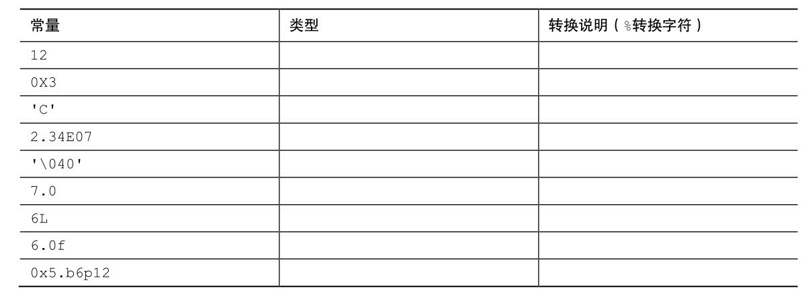

7. 写出下列常量在声明中使用的数据类型和在printf()中对应的转换说明（假设int为16位）：

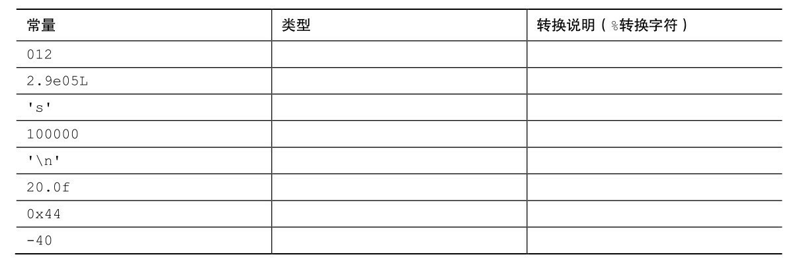

8. 假设程序的开头有下列声明：
```c
int imate = 2;
long shot = 53456;
char grade = 'A';
float log = 2.71828;
```

把下面printf()语句中的转换字符补充完整：
```c
printf("The odds against the %__ were %__ to 1.\n", imate, shot);
printf("A score of %__ is not an %__ grade.\n", log, grade);
```

9. 假设ch是char类型的变量。分别使用转义序列、十进制值、八进制字符常量和十六进制字符常量把回车字符赋给ch（假设使用ASCII编码值）。

10. 修正下面的程序（在C中，/表示除以）。
```c
void main(int) / this program is perfect /
{
cows, legs integer;
printf("How many cow legs did you count?\n);
scanf("%c", legs);
cows = legs / 4;
printf("That implies there are %f cows.\n", cows)
}
```

11. 指出下列转义序列的含义：

a.\n

b.\\

c.\"

d.\t

## 3.11 编程练习
1. 通过试验（即编写带有此类问题的程序）观察系统如何处理整数上溢、浮点数上溢和浮点数下溢的情况。

2. 编写一个程序，要求提示输入一个ASCII码值（如，66），然后打印输入的字符。

3. 编写一个程序，发出一声警报，然后打印下面的文本：
```c
Startled by the sudden sound, Sally shouted,
"By the Great Pumpkin, what was that!"
```

4. 编写一个程序，读取一个浮点数，先打印成小数点形式，再打印成指数形式。然后，如果系统支持，再打印成p记数法（即十六进制记数法）。按以下格式输出（实际显示的指数位数因系统而异）：
```c
Enter a floating-point value: 64.25
fixed-point notation: 64.250000
exponential notation: 6.425000e+01
p notation: 0x1.01p+6
```

5. 一年大约有3.156×107秒。编写一个程序，提示用户输入年龄，然后显示该年龄对应的秒数。

6. 1个水分子的质量约为3.0×10−23克。1夸脱水大约是950克。编写一个程序，提示用户输入水的夸脱数，并显示水分子的数量。

7. 1英寸相当于2.54厘米。编写一个程序，提示用户输入身高（/英寸），然后以厘米为单位显示身高。

8. 在美国的体积测量系统中，1品脱等于2杯，1杯等于8盎司，1盎司等于2大汤勺，1大汤勺等于3茶勺。编写一个程序，提示用户输入杯数，并以品脱、盎司、汤勺、茶勺为单位显示等价容量。思考对于该程序，为何使用浮点类型比整数类型更合适？


# 附录：名词解释

## 金衡盎司
欧美日常使用的度量衡单位是常衡盎司（avoirdupois ounce），而欧美黄金市场上使用的黄金交易计量单位是金衡盎司（troy ounce）。国际黄金市场上的报价，其单位“盎司”都指的是黄金盎司。常衡盎司属英制计量单位，做重量单位时也称为英两。相关换算参考如下：1常衡盎司 = 28.350克，1金衡盎司 = 31.104克，16常衡盎司 = 1磅。该程序的单位转换思路是：把磅换算成金衡盎司，即28.350÷31.104×16=14.5833。——译者注

## sizeof的返回类型
即，size_t类型。——译者注


