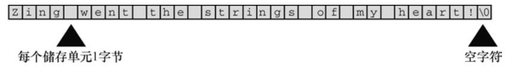
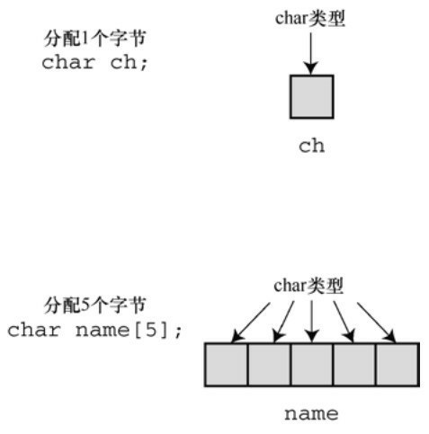
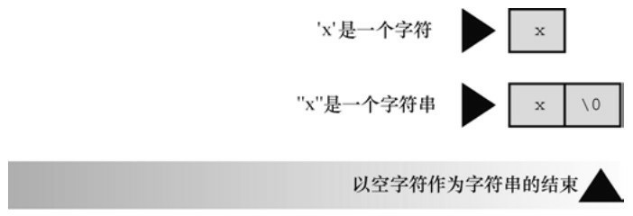
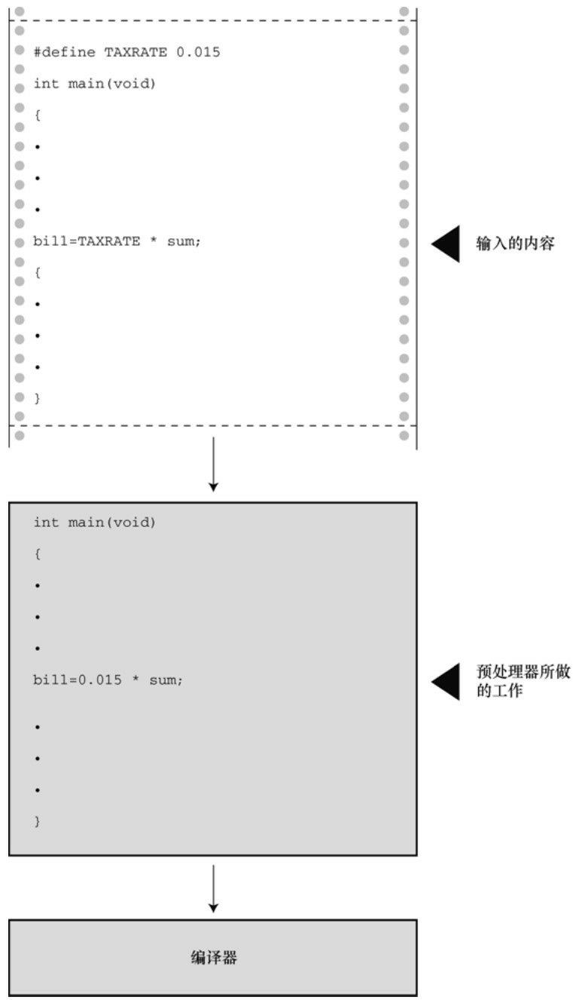
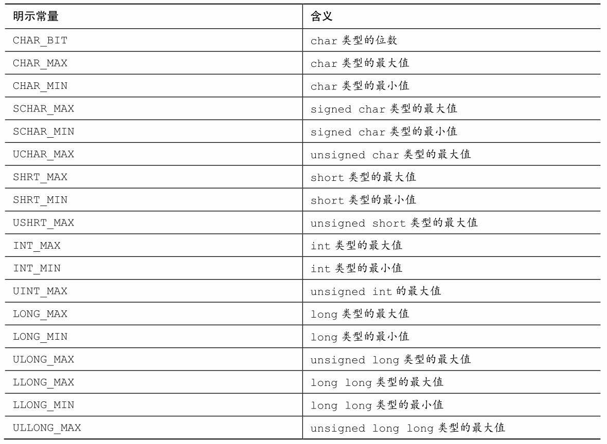
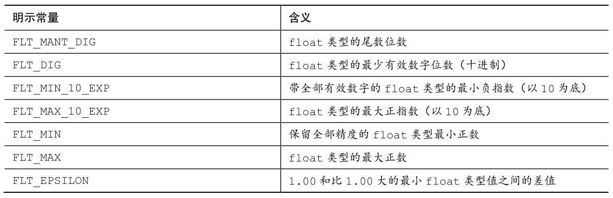
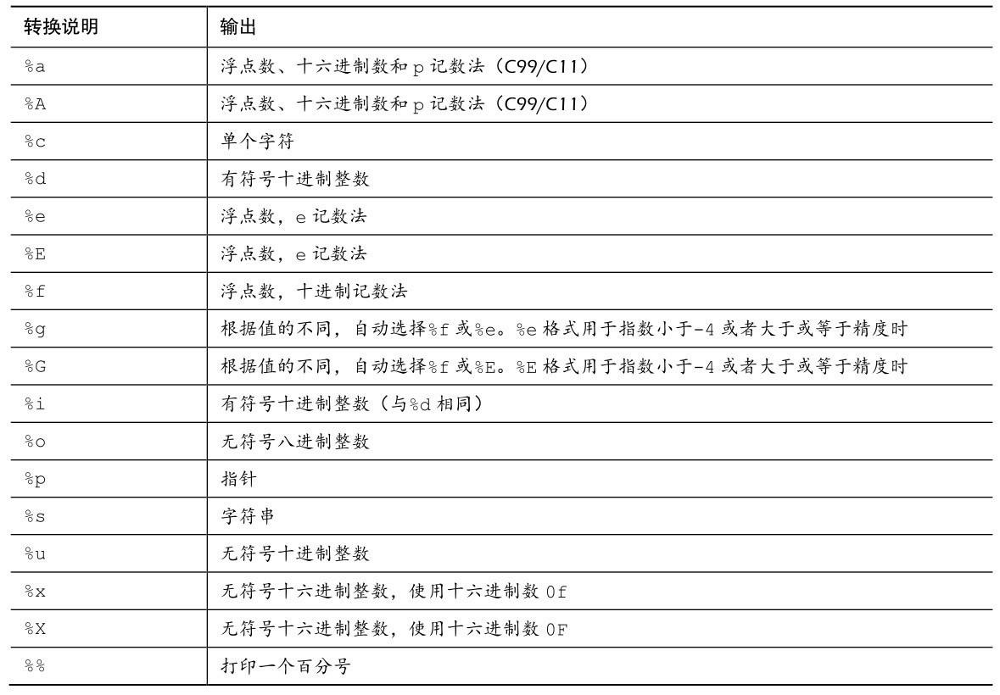
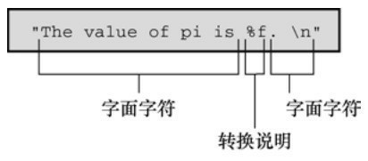
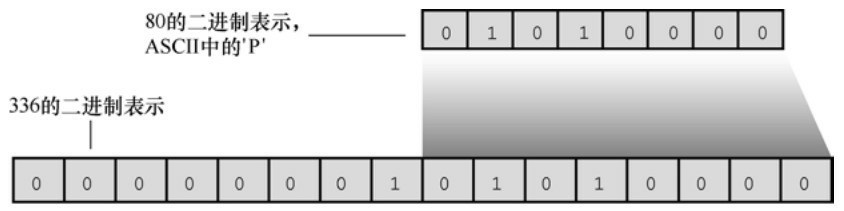
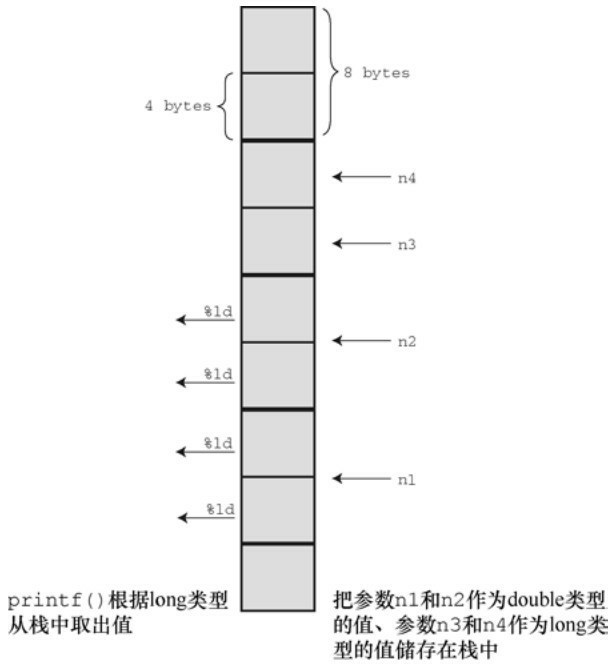

# 第4章 字符串和格式化输入/输出

本章介绍以下内容：

* 函数：strlen()
* 关键字：const
* 字符串
* 如何创建、存储字符串
* 如何使用strlen()函数获取字符串的长度
* 用C预处理器指令#define和ANSIC的const修饰符创建符号常量

本章重点介绍输入和输出。与程序交互和使用字符串可以编写个性化的程序，本章将详细介绍C语言的两个输入/输出函数：printf()和scanf()。学会使用这两个函数，不仅能与用户交互，还可根据个人喜好和任务要求格式化输出。最后，简要介绍一个重要的工具——C预处理器指令，并学习如何定义、使用符号常量。

## 4.1 前导程序
与前两章一样，本章以一个简单的程序开始。程序清单4.1与用户进行简单的交互。为了使程序的形式灵活多样，代码中使用了新的注释风格。

程序清单4.1 talkback.c程序
```c
// talkback.c -- 演示与用户交互
#include <stdio.h>
#include <string.h> // 提供strlen()函数的原型
#define DENSITY (62.4)   // 人体密度（单位：磅/立方英尺）
int main()
{
    float weight, volume;
    int size, letters;
    char name[40]; // name是一个可容纳40个字符的数组
    printf("Hi! What's your first name?\n");
    scanf("%s", name);
    printf("%s, what's your weight in pounds?\n", name);
    scanf("%f", &weight);
    size = sizeof name;
    letters = strlen(name);
    volume = weight / DENSITY;
    printf("Well, %s, your volume is %2.2f cubic feet.\n",
    name, volume);
    printf("Also, your first name has %d letters,\n",
    letters);
    printf("and we have %d bytes to store it.\n", size);
    return 0;
}
```

运行talkback.c程序，输入结果如下：
```json5
Hi! What's your first name?
Christine
Christine, what's your weight in pounds?
154
Well, Christine, your volume is 2.47 cubic feet.
Also, your first name has 9 letters,
and we have 40 bytes to store it.
```

该程序包含以下新特性。

用数组（array）储存字符串（character string）。在该程序中，用户输入的名被储存在数组中，该数组占用内存中40个连续的字节，每个字节储存一个字符值。

使用%s转换说明来处理字符串的输入和输出。注意，在scanf()中，name没有&前缀，而weight有（稍后解释，&weight和name都是地址）。

用C预处理器把字符常量DENSITY定义为62.4。

用C函数strlen()获取字符串的长度。

对于BASIC的输入/输出而言，C的输入/输出看上去有些复杂。不过，复杂换来的是程序的高效和方便控制输入/输出。而且，一旦熟悉用法后，会发现它很简单。

## 4.2 字符串简介
字符串（character string）是一个或多个字符的序列，如下所示：
```c
"Zing went the strings of my heart!"
```

双引号不是字符串的一部分。双引号仅告知编译器它括起来的是字符串，正如单引号用于标识单个字符一样。

### 4.2.1 char类型数组和null字符
C语言没有专门用于储存字符串的变量类型，字符串都被储存在char类型的数组中。数组由连续的存储单元组成，字符串中的字符被储存在相邻的存储单元中，每个单元储存一个字符（见图4.1）。



注意图4.1中数组末尾位置的字符\0。这是空字符（null character），C语言用它标记字符串的结束。空字符不是数字0，它是非打印字符，其ASCII码值是（或等价于）0。C中的字符串一定以空字符结束，这意味着数组的容量必须至少比待存储字符串中的字符数多1。因此，程序清单4.1中有40个存储单元的字符串，只能储存39个字符，剩下一个字节留给空字符。

那么，什么是数组？可以把数组看作是一行连续的多个存储单元。用更正式的说法是，数组是同类型数据元素的有序序列。程序清单4.1通过以下声明创建了一个包含40个存储单元（或元素）的数组，每个单元储存一个char类型的值：
```c
char name[40];
```

name后面的方括号表明这是一个数组，方括号中的40表明该数组中的元素数量。char表明每个元素的类型（见图4.2）。



字符串看上去比较复杂！必须先创建一个数组，把字符串中的字符逐个放入数组，还要记得在末尾加上一个\0。还好，计算机可以自己处理这些细节。

### 4.2.2 使用字符串
试着运行程序清单4.2，使用字符串其实很简单。

程序清单4.2 praise1.c程序
```c
/* praise1.c -- 使用不同类型的字符串 */
#include <stdio.h>

#define PRAISE "You are an extraordinary being."

int main(void)
{
    char name[40];
    printf("What's your name? ");
    scanf("%s", name);
    printf("Hello, %s.%s\n", name, PRAISE);
    return 0;
}
```

%s告诉printf()打印一个字符串。%s出现了两次，因为程序要打印两个字符串：一个储存在name数组中；一个由PRAISE来表示。运行praise1.c，其输出如下所示：
```json5
What's your name? Angela Plains
Hello, Angela.You are an extraordinary being.
```

你不用亲自把空字符放入字符串末尾，scanf()在读取输入时就已完成这项工作。也不用在字符串常量PRAISE末尾添加空字符。稍后我们会解释#define指令，现在先理解PRAISE后面用双引号括起来的文本是一个字符串。编译器会在末尾加上空字符。

注意（这很重要），scanf()只读取了Angela Plains中的Angela，它在遇到第1个空白（空格、制表符或换行符）时就不再读取输入。因此，scanf()在读到Angela和Plains之间的空格时就停止了。一般而言，根据%s转换说明，scanf()只会读取字符串中的一个单词，而不是一整句。C语言还有其他的输入函数（如，fgets()），用于读取一般字符串。后面章节将详细介绍这些函数。

字符串和字符

字符串常量"x"和字符常量'x'不同。区别之一在于'x'是基本类型（char），而"x"是派生类型（char数组）；区别之二是"x"实际上由两个字符组成：'x'和空字符\0（见图4.3）。



### 4.2.3 strlen()函数
上一章提到了 sizeof 运算符，它以字节为单位给出对象的大小。strlen()函数给出字符串中的字符长度。因为 1 字节储存一个字符，读者可能认为把两种方法应用于字符串得到的结果相同，但事实并非如此。请根据程序清单4.3，在程序清单4.2中添加几行代码，看看为什么会这样。

程序清单4.3 praise2.c程序
```c
/* praise2.c */
// 如果编译器不识别%zd，尝试换成%u或%lu。
#include <stdio.h>
#include <string.h> /* 提供strlen()函数的原型 */

#define PRAISE "You are an extraordinary being."

int main(void)
{
    char name[40];
    printf("What's your name? ");
    scanf("%s", name);
    printf("Hello, %s.%s\n", name, PRAISE);
    printf("Your name of %zd letters occupies %zd memory cells.\n",
    strlen(name), sizeof name);
    printf("The phrase of praise has %zd letters ",
    strlen(PRAISE));
    printf("and occupies %zd memory cells.\n", sizeof PRAISE);
    return 0;
}
```

如果使用ANSI C之前的编译器，必须移除这一行：
```c
#include <string.h>
```

string.h头文件包含多个与字符串相关的函数原型，包括strlen()。第11章将详细介绍该头文件（顺带一提，一些ANSI之前的UNIX系统用strings.h代替string.h，其中也包含了一些字符串函数的声明）。

一般而言，C 把函数库中相关的函数归为一类，并为每类函数提供一个头文件。例如，printf()和scanf()都隶属标准输入和输出函数，使用stdio.h头文件。string.h头文件中包含了strlen()函数和其他一些与字符串相关的函数（如拷贝字符串的函数和字符串查找函数）。

注意，程序清单4.3使用了两种方法处理很长的printf()语句。第1种方法是将printf()语句分为两行（可以在参数之间断为两行，但是不要在双引号中的字符串中间断开）；第 2 种方法是使用两个printf()语句打印一行内容，只在第2条printf()语句中使用换行符（\n）。运行该程序，其交互输出如下：
```json5
What's your name? Serendipity Chance
Hello, Serendipity.You are an extraordinary being.
Your name of 11 letters occupies 40 memory cells.
The phrase of praise has 31 letters and occupies 32 memory cells.
```

sizeof运算符报告，name数组有40个存储单元。但是，只有前11个单元用来储存Serendipity，所以strlen()得出的结果是11。name数组的第12个单元储存空字符，strlen()并未将其计入。图4.4演示了这个概念。

函数知道在何处停止.png)

对于 PRAISE，用 strlen()得出的也是字符串中的字符数（包括空格和标点符号）。然而，sizeof运算符给出的数更大，因为它把字符串末尾不可见的空字符也计算在内。该程序并未明确告诉计算机要给字符串预留多少空间，所以它必须计算双引号内的字符数。

第 3 章提到过，C99 和 C11 标准专门为 sizeof 运算符的返回类型添加了%zd 转换说明，这对于strlen()同样适用。对于早期的C，还要知道sizeof和strlen()返回的实际类型（通常是unsigned或unsigned long）。

另外，还要注意一点：上一章的 sizeof 使用了圆括号，但本例没有。圆括号的使用时机否取决于运算对象是类型还是特定量？运算对象是类型时，圆括号必不可少，但是对于特定量，可有可无。也就是说，对于类型，应写成sizeof(char)或sizeof(float)；对于特定量，可写成sizeof name或sizeof 6.28。尽管如此，还是建议所有情况下都使用圆括号，如sizeof(6.28)。

程序清单4.3中使用strlen()和sizeof，完全是为了满足读者的好奇心。在实际应用中，strlen()和 sizeof 是非常重要的编程工具。例如，在各种要处理字符串的程序中，strlen()很有用。详见第11章。

下面我们来学习#define指令。

## 4.3 常量和C预处理器
有时，在程序中要使用常量。例如，可以这样计算圆的周长：
```c
circumference = 3.14159 * diameter;
```

这里，常量3.14159代表著名的常量pi（π）。在该例中，输入实际值便可使用这个常量。然而，这种情况使用符号常量（symbolic constant）会更好。也就是说，使用下面的语句，计算机稍后会用实际值完成替换：
```c
circumference = pi * diameter;
```

为什么使用符号常量更好？首先，常量名比数字表达的信息更多。请比较以下两条语句：
```c
owed = 0.015 * housevalue;
owed = taxrate * housevalue;
```

如果阅读一个很长的程序，第2条语句所表达的含义更清楚。

另外，假设程序中的多处使用一个常量，有时需要改变它的值。毕竟，税率通常是浮动的。如果程序使用符号常量，则只需更改符号常量的定义，不用在程序中查找使用常量的地方，然后逐一修改。

那么，如何创建符号常量？方法之一是声明一个变量，然后将该变量设置为所需的常量。可以这样写：
```c
float taxrate;
taxrate = 0.015;
```

这样做提供了一个符号名，但是taxrate是一个变量，程序可能会无意间改变它的值。C语言还提供了一个更好的方案——C预处理器。第2 章中介绍了预处理器如何使用#include包含其他文件的信息。预处理器也可用来定义常量。只需在程序顶部添加下面一行：
```c
#define TAXRATE 0.015
```

编译程序时，程序中所有的TAXRATE都会被替换成0.015。这一过程被称为编译时替换（compile-time substitution）。在运行程序时，程序中所有的替换均已完成（见图 4.5）。通常，这样定义的常量也称为[明示常量（manifest constant）](#明示常量)。

请注意格式，首先是#define，接着是符号常量名（TAXRATE），然后是符号常量的值（0.015）（注意，其中并没有=符号）。所以，其通用格式如下：
```c
#define NAME value
```

实际应用时，用选定的符号常量名和合适的值来替换NAME和value。注意，末尾不用加分号，因为这是一种由预处理器处理的替换机制。为什么TAXRATE 要用大写？用大写表示符号常量是 C 语言一贯的传统。这样，在程序中看到全大写的名称就立刻明白这是一个符号常量，而非变量。大写常量只是为了提高程序的可读性，即使全用小写来表示符号常量，程序也能照常运行。尽管如此，初学者还是应该养成大写常量的好习惯。

另外，还有一个不常用的命名约定，即在名称前带c_或k_前缀来表示常量（如，c_level或k_line）。

符号常量的命名规则与变量相同。可以使用大小写字母、数字和下划线字符，首字符不能为数字。程序清单4.4演示了一个简单的示例。



程序清单4.4 pizza.c程序
```c
/* pizza.c -- 在比萨饼程序中使用已定义的常量 */
#include <stdio.h>
#define PI 3.14159
int main(void)
{
    float area, circum, radius;
    printf("What is the radius of your pizza?\n");
    scanf("%f", &radius);
    area = PI * radius * radius;
    circum = 2.0 * PI *radius;
    printf("Your basic pizza parameters are as follows:\n");
    printf("circumference = %1.2f, area = %1.2f\n", circum,area);
    return 0;
}
```

printf()语句中的%1.2f表明，结果被四舍五入为两位小数输出。下面是一个输出示例：
```c
What is the radius of your pizza?
6.0
Your basic pizza parameters are as follows:
circumference = 37.70, area = 113.10
```

#define指令还可定义字符和字符串常量。前者使用单引号，后者使用双引号。如下所示：
```c
#define BEEP '\a'
#define TEE 'T'
#define ESC '\033'
#define OOPS "Now you have done it!"
```

记住，符号常量名后面的内容被用来替换符号常量。不要犯这样的常见错误：
```c
/* 错误的格式 */
#define TOES = 20
```

如果这样做，替换TOES的是= 20，而不是20。这种情况下，下面的语句：
```c
digits = fingers + TOES;
```

将被转换成错误的语句：
```c
digits = fingers + = 20;
```

### 4.3.1 const限定符
C90标准新增了const关键字，用于限定一个变量为[只读](#只读)。其声明如下：
```c
const int MONTHS = 12; // MONTHS在程序中不可更改，值为12
```

这使得MONTHS成为一个只读值。也就是说，可以在计算中使用MONTHS，可以打印MONTHS，但是不能更改MONTHS的值。const用起来比#define更灵活，第12章将讨论与const相关的内容。

### 4.3.2 明示常量
C头文件limits.h和float.h分别提供了与整数类型和浮点类型大小限制相关的详细信息。每个头文件都定义了一系列供实现使用的[明示常量](#明示常量定义)。例如，limits.h头文件包含以下类似的代码：
```c
#define INT_MAX +32767
#define INT_MIN -32768
```

这些明示常量代表int类型可表示的最大值和最小值。如果系统使用32位的int，该头文件会为这些明示常量提供不同的值。如果在程序中包含limits.h头文件，就可编写下面的代码：
```c
printf("Maximum int value on this system = %d\n", INT_MAX);
```

如果系统使用4字节的int，limits.h头文件会提供符合4字节int的INT_MAX和INT_MIN。表4.1列出了limits.h中能找到的一些明示常量。

表4.1 limits.h中的一些明示常量



类似地，float.h头文件中也定义一些明示常量，如FLT_DIG和DBL_DIG，分别表示float类型和double类型的有效数字位数。表4.2列出了float.h中的一些明示常量（可以使用文本编辑器打开并查看系统使用的float.h头文件）。表中所列都与float类型相关。把明示常量名中的FLT分别替换成DBL和LDBL，即可分别表示double和long double类型对应的明示常量（表中假设系统使用2的幂来表示浮点数）。

表4.2 float.h中的一些明示常量



程序清单4.5演示了如何使用float.h和limits.h中的数据（注意，编译器要完全支持C99标准才能识别LLONG_MIN标识符）。

程序清单4.5 defines.c程序
```c
// defines.c -- 使用limit.h和float头文件中定义的明示常量
#include <stdio.h>
#include <limits.h>  // 整型限制
#include <float.h>   // 浮点型限制

int main(void)
{
    printf("Some number limits for this system:\n");
    printf("Biggest int: %d\n", INT_MAX);
    printf("Smallest long long: %lld\n", LLONG_MIN);
    printf("One byte = %d bits on this system.\n", CHAR_BIT);
    printf("Largest double: %e\n", DBL_MAX);
    printf("Smallest normal float: %e\n", FLT_MIN);
    printf("float precision = %d digits\n", FLT_DIG);
    printf("float epsilon = %e\n", FLT_EPSILON);
    return 0;
}
```

该程序的输出示例如下：
```json5
Some number limits for this system:
Biggest int: 2147483647
Smallest long long: -9223372036854775808
One byte = 8 bits on this system.
Largest double: 1.797693e+308
Smallest normal float: 1.175494e-38
float precision = 6 digits
float epsilon = 1.192093e-07
```

C预处理器是非常有用的工具，要好好利用它。本书的后面章节中会介绍更多相关应用。

## 4.4 printf()和scanf()
printf()函数和scanf()函数能让用户可以与程序交流，它们是输入/输出函数，或简称为I/O函数。它们不仅是C语言中的I/O函数，而且是最多才多艺的函数。过去，这些函数和C库的一些其他函数一样，并不是C语言定义的一部分。最初，C把输入/输出的实现留给了编译器的作者，这样可以针对特殊的机器更好地匹配输入/输出。后来，考虑到兼容性的问题，各编译器都提供不同版本的printf()和scanf()。尽管如此，各版本之间偶尔有一些差异。C90 和C99 标准规定了这些函数的标准版本，本书亦遵循这一标准。

虽然printf()是输出函数，scanf()是输入函数，但是它们的工作原理几乎相同。两个函数都使用格式字符串和参数列表。我们先介绍printf()，再介绍scanf()。

### 4.4.1 printf()函数
请求printf()函数打印数据的指令要与待打印数据的类型相匹配。例如，打印整数时使用%d，打印字符时使用%c。这些符号被称为转换说明（conversion specification），它们指定了如何把数据转换成可显示的形式。我们先列出ANSI C标准为printf()提供的转换说明，然后再示范如何使用一些较常见的转换说明。表4.3列出了一些转换说明和各自对应的输出类型。

表4.3 转换说明及其打印的输出结果



### 4.4.2 使用printf()
程序清单4.6的程序中使用了一些转换说明。

程序清单4.6 printout.c程序
```c
/* printout.c -- 使用转换说明 */
#include <stdio.h>
#define PI 3.141593
int main(void)
{
    int number = 7;
    float pies = 12.75;
    int cost = 7800;
    printf("The %d contestants ate %f berry pies.\n", number,
    pies);
    printf("The value of pi is %f.\n", PI);
    printf("Farewell! thou art too dear for my possessing,\n");
    printf("%c%d\n", '$', 2 * cost);
    return 0;
}
```

该程序的输出如下：
```json5
The 7 contestants ate 12.750000 berry pies.
The value of pi is 3.141593.
Farewell! thou art too dear for my possessing,
$15600
```

这是printf()函数的格式：
```c
printf( 格式字符串, 待打印项1, 待打印项2,...);
```

待打印项1、待打印项2等都是要打印的项。它们可以是变量、常量，甚至是在打印之前先要计算的表达式。第3章提到过，格式字符串应包含每个待打印项对应的转换说明。例如，考虑下面的语句：
```c
printf("The %d contestants ate %f berry pies.\n", number,pies);
```

格式字符串是双引号括起来的内容。上面语句的格式字符串包含了两个待打印项number和poes对应的两个转换说明。图4.6演示了printf()语句的另一个例子。

下面是程序清单4.6中的另一行：
```c
printf("The value of pi is %f.\n", PI);
```

该语句中，待打印项列表只有一个项——符号常量PI。

如图4.7所示，格式字符串包含两种形式不同的信息：
* 实际要打印的字符；
* 转换说明。

图4.6 printf()的参数

的参数.png)

图4.7 剖析格式字符串



**警告**

格式字符串中的转换说明一定要与后面的每个项相匹配，若忘记这个基本要求会导致严重的后果。千万别写成下面这样：
```c
printf("The score was Squids %d, Slugs %d.\n", score1);
```

这里，第2个%d没有对应任何项。系统不同，导致的结果也不同。不过，出现这种问题最好的状况是得到无意义的值。

如果只打印短语或句子，就不需要使用任何转换说明。如果只打印数据，也不用加入说明文字。程序清单4.6中的最后两个printf()语句都没问题：
```c
printf("Farewell! thou art too dear for my possessing,\n");
printf("%c%d\n", '$', 2 * cost);
```

注意第2条语句，待打印列表的第1个项是一个字符常量，不是变量；第2个项是一个乘法表达式。这说明printf()使用的是值，无论是变量、常量还是表达式的值。

由于 printf()函数使用%符号来标识转换说明，因此打印%符号就成了个问题。如果单独使用一个%符号，编译器会认为漏掉了一个转换字符。解决方法很简单，使用两个%符号就行了：
```c
pc = 2*6;
printf("Only %d%% of Sally's gribbles were edible.\n", pc);
```

下面是输出结果：
```json5
Only 12% of Sally's gribbles were edible.
```

### 4.4.3 printf()的转换说明修饰符
在%和转换字符之间插入修饰符可修饰基本的转换说明。表4.4和表4.5列出可作为修饰符的合法字符。如果要插入多个字符，其书写顺序应该与表4.4中列出的顺序相同。不是所有的组合都可行。表中有些字符是C99新增的，如果编译器不支持C99，则可能不支持表中的所有项。

表4.4 printf()的修饰符

的修饰符.png)

**注意 类型可移植性**

sizeof 运算符以字节为单位返回类型或值的大小。这应该是某种形式的整数，但是标准只规定了该值是无符号整数。在不同的实现中，它可以是unsigned int、unsigned long甚至是unsigned long long。因此，如果要用printf()函数显示sizeof表达式，根据不同系统，可能使用%u、%lu或%llu。这意味着要查找你当前系统的用法，如果把程序移植到不同的系统还要进行修改。鉴于此， C提供了可移植性更好的类型。首先，stddef.h头文件（在包含stdio.h头文件时已包含其中）把size_t定义成系统使用sizeof返回的类型，这被称为底层类型（underlying type）。其次，printf()使用z修饰符表示打印相应的类型。同样，C还定义了ptrdiff_t类型和t修饰符来表示系统使用的两个地址差值的底层有符号整数类型。

**注意 float参数的转换**

对于浮点类型，有用于double和long double类型的转换说明，却没有float类型的。这是因为在K&R C中，表达式或参数中的float类型值会被自动转换成double类型。一般而言，ANSI C不会把float自动转换成double。然而，为保护大量假设float类型的参数被自动转换成double的现有程序，printf()函数中所有float类型的参数（对未使用显式原型的所有C函数都有效）仍自动转换成double类型。因此，无论是K&R C还是ANSI C，都没有显示float类型值专用的转换说明。

表4.5 printf()中的标记

中的标记.png)

1. 使用修饰符和标记的示例

接下来，用程序示例演示如何使用这些修饰符和标记。先来看看字段宽度在打印整数时的效果。考虑程序清单4.7中的程序。

程序清单4.7 width.c程序
```c
/* width.c -- 字段宽度 */
#include <stdio.h>
#define PAGES 959
int main(void)
{
    printf("*%d*\n", PAGES);
    printf("*%2d*\n", PAGES);
    printf("*%10d*\n", PAGES);
    printf("*%-10d*\n", PAGES);
    return 0;
}
```

程序清单4.7通过4种不同的转换说明把相同的值打印了4次。程序中使用星号（*）标出每个字段的开始和结束。其输出结果如下所示：
```json5
*959*
*959*
*       959*
*959       *
```

第1个转换说明%d不带任何修饰符，其对应的输出结果与带整数字段宽度的转换说明的输出结果相同。在默认情况下，没有任何修饰符的转换说明，就是这样的打印结果。第2个转换说明是%2d，其对应的输出结果应该是 2 字段宽度。因为待打印的整数有 3 位数字，所以字段宽度自动扩大以符合整数的长度。第 3个转换说明是%10d，其对应的输出结果有10个空格宽度，实际上在两个星号之间有7个空格和3位数字，并且数字位于字段的右侧。最后一个转换说明是%-10d，其对应的输出结果同样是 10 个空格宽度，-标记说明打印的数字位于字段的左侧。熟悉它们的用法后，能很好地控制输出格式。试着改变PAGES的值，看看编译器如何打印不同位数的数字。

接下来看看浮点型格式。请输入、编译并运行程序清单4.8中的程序。

程序清单4.8 floats.c程序
```c
// floats.c -- 一些浮点型修饰符的组合
#include <stdio.h>
int main(void)
{
    const double RENT = 3852.99;  // const变量
    printf("*%f*\n", RENT);
    printf("*%e*\n", RENT);
    printf("*%4.2f*\n", RENT);
    printf("*%3.1f*\n", RENT);
    printf("*%10.3f*\n", RENT);
    printf("*%10.3E*\n", RENT);
    printf("*%+4.2f*\n", RENT);
    printf("*%010.2f*\n", RENT);
    return 0;
}
```

该程序中使用了const关键字，限定变量为只读。该程序的输出如下：
```json5
*3852.990000*
*3.852990e+03*
*3852.99*
*3853.0*
*  3852.990*
* 3.853E+03*
*+3852.99*
*0003852.99*
```

本例的第1个转换说明是%f。在这种情况下，字段宽度和小数点后面的位数均为系统默认设置，即字段宽度是容纳带打印数字所需的位数和小数点后打印6位数字。

第2个转换说明是%e。默认情况下，编译器在小数点的左侧打印1个数字，在小数点的右侧打印6个数字。这样打印的数字太多！解决方案是指定小数点右侧显示的位数，程序中接下来的 4 个例子就是这样做的。请注意，第4个和第6个例子对输出结果进行了四舍五入。另外，第6个例子用E代替了e。

第7个转换说明中包含了+标记，这使得打印的值前面多了一个代数符号（+）。0标记使得打印的值前面以0填充以满足字段要求。注意，转换说明%010.2f的第1个0是标记，句点（.）之前、标记之后的数字（本例为10）是指定的字段宽度。尝试修改RENT的值，看看编译器如何打印不同大小的值。程序清单4.9演示了其他组合。

程序清单4.9 flags.c程序
```c
/* flags.c -- 演示一些格式标记 */
#include <stdio.h>
int main(void)
{
    printf("%x %X %#x\n", 31, 31, 31);
    printf("**%d**% d**% d**\n", 42, 42, -42);
    printf("**%5d**%5.3d**%05d**%05.3d**\n", 6, 6, 6, 6);
    return 0;
}
```

该程序的输出如下：
```json5
1f 1F 0x1f
**42** 42**-42**
**    6**  006**00006**  006**
```

第1行输出中，1f是十六进制数，等于十进制数31。第1行printf()语句中，根据%x打印出1f，%F打印出1F，%#x打印出0x1f。

第2行输出演示了如何在转换说明中用空格在输出的正值前面生成前导空格，负值前面不产生前导空格。这样的输出结果比较美观，因为打印出来的正值和负值在相同字段宽度下的有效数字位数相同。

第3行输出演示了如何在整型格式中使用精度（%5.3d）生成足够的前导0以满足最小位数的要求（本例是3）。然而，使用0标记会使得编译器用前导0填充满整个字段宽度。最后，如果0标记和精度一起出现，0标记会被忽略。

下面来看看字符串格式的示例。考虑程序清单4.10中的程序。

程序清单4.10 stringf.c程序
```c
/* stringf.c -- 字符串格式 */
#include <stdio.h>
#define BLURB "Authentic imitation!"
int main(void)
{
    printf("[%2s]\n", BLURB);
    printf("[%24s]\n", BLURB);
    printf("[%24.5s]\n", BLURB);
    printf("[%-24.5s]\n", BLURB);
    return 0;
}
```

该程序的输出如下：
```json5
[Authentic imitation!]
[    Authentic imitation!]
[                   Authe]
[Authe                   ]
```

注意，虽然第1个转换说明是%2s，但是字段被扩大为可容纳字符串中的所有字符。还需注意，精度限制了待打印字符的个数。.5告诉printf()只打印5个字符。另外，-标记使得文本左对齐输出。

2. 学以致用

学习完以上几个示例，试试如何用一个语句打印以下格式的内容：
```json
The NAME family just may be $XXX.XX dollars richer!
```

这里，NAME和XXX.XX代表程序中变量（如name[40]和cash）的值。可参考以下代码：
```c
printf("The %s family just may be $%.2f richer!\n",name,cash);
```

### 4.4.4 转换说明的意义
下面深入探讨一下转换说明的意义。转换说明把以二进制格式储存在计算机中的值转换成一系列字符（字符串）以便于显示。例如，数字76在计算机内部的存储格式是二进制数01001100。%d转换说明将其转换成字符7和6，并显示为76；%x转换说明把相同的值（01001100）转换成十六进制记数法4c；%c转换说明把01001100转换成字符L。

转换（conversion）可能会误导读者认为原始值被转替换成转换后的值。实际上，转换说明是翻译说明，%d的意思是“把给定的值翻译成十进制整数文本并打印出来”。

1. 转换不匹配

前面强调过，转换说明应该与待打印值的类型相匹配。通常都有多种选择。例如，如果要打印一个int类型的值，可以使用%d、%x或%o。这些转换说明都可用于打印int类型的值，其区别在于它们分别表示一个值的形式不同。类似地，打印double类型的值时，可使用%f、%e或%g。

转换说明与待打印值的类型不匹配会怎样？上一章中介绍过不匹配导致的一些问题。匹配非常重要，一定要牢记于心。程序清单4.11演示了一些不匹配的整型转换示例。

程序清单4.11 intconv.c程序
```c
/* intconv.c -- 一些不匹配的整型转换 */
#include <stdio.h>
#define PAGES 336
#define WORDS 65618
int main(void)
{
    short num = PAGES;
    short mnum = -PAGES;
    printf("num as short and unsigned short:　%hd %hu\n", num,num);
    printf("-num as short and unsigned short: %hd %hu\n", mnum,mnum);
    printf("num as int and char: %d %c\n", num, num);
    printf("WORDS as int, short, and char: %d %hd %c\n",WORDS,WORDS,WORDS);
    return 0;
}
```

在我们的系统中，该程序的输出如下：
```json5
num as short and unsigned short:　336 336
-num as short and unsigned short: -336 65200
num as int and char: 336 P
WORDS as int, short, and char: 65618 82 R
```

请看输出的第1行，num变量对应的转换说明%hd和%hu输出的结果都是336。这没有任何问题。然而，第2行mnum变量对应的转换说明%u（无符号）输出的结果却为65200，并非期望的336。这是由于有符号short int类型的值在我们的参考系统中的表示方式所致。首先，short int的大小是2字节；其次，系统使用二进制补码来表示有符号整数。这种方法，数字0～32767代表它们本身，而数字32768～65535则表示负数。其中，65535表示-1，65534表示-2，以此类推。因此，-336表示为65200（即， 65536-336）。所以被解释成有符号int时，65200代表-336；而被解释成无符号int时，65200则代表65200。一定要谨慎！一个数字可以被解释成两个不同的值。尽管并非所有的系统都使用这种方法来表示负整数，但要注意一点：别期望用%u转换说明能把数字和符号分开。

第3行演示了如果把一个大于255的值转换成字符会发生什么情况。在我们的系统中，short int是2字节，char是1字节。当printf()使用%c打印336时，它只会查看储存336的2字节中的后1字节。这种截断（见图4.8）相当于用一个整数除以256，只保留其余数。在这种情况下，余数是80，对应的ASCII值是字符P。用专业术语来说，该数字被解释成“以256为模”（modulo 256），即该数字除以256后取其余数。



最后，我们在该系统中打印比short int类型最大整数（32767）更大的整数（65618）。这次，计算机也进行了求模运算。在本系统中，应把数字65618储存为4字节的int类型值。用%hd转换说明打印时， printf()只使用最后2个字节。这相当于65618除以65536的余数。这里，余数是82。鉴于负数的储存方法，如果余数在32767～65536范围内会被打印成负数。对于整数大小不同的系统，相应的处理行为类似，但是产生的值可能不同。

混淆整型和浮点型，结果更奇怪。考虑程序清单4.12。

程序清单4.12 floatcnv.c程序
```c
/* floatcnv.c -- 不匹配的浮点型转换 */
#include <stdio.h>
int main(void)
{
    float n1 = 3.0;
    double n2 = 3.0;
    long n3 = 2000000000;
    long n4 = 1234567890;
    printf("%.1e %.1e %.1e %.1e\n", n1, n2, n3, n4);
    printf("%ld %ld\n", n3, n4);
    printf("%ld %ld %ld %ld\n", n1, n2, n3, n4);
    return 0;
}
```

在我们的系统中，该程序的输出如下：
```json5
3.0e+00 3.0e+00 3.0e+00 0.0e+00
2000000000 1234567890
2000000000 1234567890 2000000000 0
```

第1行输出显示，%e转换说明没有把整数转换成浮点数。考虑一下，如果使用%e转换说明打印n3（long类型）会发生什么情况。首先，%e转换说明让printf()函数认为待打印的值是double类型（本系统中double为8字节）。当printf()查看n3（本系统中是4字节的值）时，除了查看n3的4字节外，还会查看查看n3相邻的4字节，共8字节单元。接着，它将8字节单元中的位组合解释成浮点数（如，把一部分位组合解释成指数）。因此，即使n3的位数正确，根据%e转换说明和%ld转换说明解释出来的值也不同。最终得到的结果是无意义的值。

第1行也说明了前面提到的内容：float类型的值作为printf()参数时会被转换成double类型。在本系统中，float是4字节，但是为了printf()能正确地显示该值，n1被扩成8字节。

第2行输出显示，只要使用正确的转换说明，printf()就可以打印n3和n4。

第3行输出显示，如果printf()语句有其他不匹配的地方，即使用对了转换说明也会生成虚假的结果。用%ld转换说明打印浮点数会失败，但是在这里，用%ld打印long类型的数竟然也失败了！问题出在C如何把信息传递给函数。具体情况因编译器实现而异。“参数传递”框中针对一个有代表性的系统进行了讨论。

**参数传递**

参数传递机制因实现而异。下面以我们的系统为例，分析参数传递的原理。函数调用如下：
```c
printf("%ld %ld %ld %ld\n", n1, n2, n3, n4);
```

该调用告诉计算机把变量n1、n2、、n3和n4的值传递给程序。这是一种常见的参数传递方式。程序把传入的值放入被称为栈（stack）的内存区域。计算机根据变量类型（不是根据转换说明）把这些值放入栈中。因此，n1被储存在栈中，占8字节（float类型被转换成double类型）。同样，n2也在栈中占8字节，而n3和n4在栈中分别占4字节。然后，控制转到printf()函数。该函数根据转换说明（不是根据变量类型）从栈中读取值。%ld转换说明表明printf()应该读取4字节，所以printf()读取栈中的前4字节作为第1个值。这是n1的前半部分，将被解释成一个long类型的整数。根据下一个%ld转换说明，printf()再读取4字节，这是n1的后半部分，将被解释成第2个long类型的整数（见图4.9）。类似地，根据第3个和第4个%ld，printf()读取n2的前半部分和后半部分，并解释成两个long类型的整数。因此，对于n3和n4，虽然用对了转换说明，但printf()还是读错了字节。
```c
float n1; /* 作为double类型传递 */
double n2;
long n3, n4;
...
printf("%ld %ld %ld %ld\n", n1, n2, n3, n4);
```



2. printf()的返回值

第2章提到过，大部分C函数都有一个返回值，这是函数计算并返回给主调程序（calling program）的值。例如，C库包含一个sqrt()函数，接受一个数作为参数，并返回该数的平方根。可以把返回值赋给变量，也可以用于计算，还可以作为参数传递。总之，可以把返回值像其他值一样使用。printf()函数也有一个返回值，它返回打印字符的个数。如果有输出错误，printf()则返回一个负值（printf()的旧版本会返回不同的值）。

printf()的返回值是其打印输出功能的附带用途，通常很少用到，但在检查输出错误时可能会用到（如，在写入文件时很常用）。如果一张已满的CD或DVD拒绝写入时，程序应该采取相应的行动，例如终端蜂鸣30秒。不过，要实现这种情况必须先了解if语句。程序清单4.13演示了如何确定函数的返回值。

程序清单4.13 prntval.c程序
```c
/* prntval.c -- printf()的返回值 */
#include <stdio.h>
int main(void)
{
    int bph2o = 212;
    int rv;
    rv = printf("%d F is water's boiling point.\n", bph2o);
    printf("The printf() function printed %d characters.\n", 
    rv);
    return 0;
}
```

该程序的输出如下：
```json5
212 F is water's boiling point.
The printf() function printed 32 characters.
```

首先，程序用rv = printf(...);的形式把printf()的返回值赋给rv。因此，该语句执行了两项任务：打印信息和给变量赋值。其次，注意计算针对所有字符数，包括空格和不可见的换行符（\n）。

3. 打印较长的字符串

有时，printf()语句太长，在屏幕上不方便阅读。如果空白（空格、制表符、换行符）仅用于分隔不同的部分，C 编译器会忽略它们。因此，一条语句可以写成多行，只需在不同部分之间输入空白即可。例如，程序清单4.13中的一条printf()语句：
```c
printf("The printf() function printed %d characters.\n", 
    rv);
```

该语句在逗号和 rv之间断行。为了让读者知道该行未完，示例缩进了rv。C编译器会忽略多余的空白。

但是，不能在双引号括起来的字符串中间断行。如果这样写：
```c
printf("The printf() function printed %d
characters.\n", rv);
```

C编译器会报错：字符串常量中有非法字符。在字符串中，可以使用\n来表示换行字符，但是不能通过按下Enter（或Return）键产生实际的换行符。

给字符串断行有3种方法，如程序清单4.14所示。

程序清单4.14 longstrg.c程序
```c
/* longstrg.c ––打印较长的字符串 */
#include <stdio.h>

int main(void)
{
    printf("Here's one way to print a ");
    printf("long string.\n");
    printf("Here's another way to print a \
    long string.\n");
    printf("Here's the newest way to print a "
    "long string.\n");  /* ANSI C */
    return 0;
}
```

该程序的输出如下：
```json5
Here's one way to print a long string.
Here's another way to print a     long string.
Here's the newest way to print a long string.
```

方法1：使用多个printf()语句。因为第1个字符串没有以\n字符结束，所以第2个字符串紧跟第1个字符串末尾输出。

方法2：用反斜杠（\）和Enter（或Return）键组合来断行。这使得光标移至下一行，而且字符串中不会包含换行符。其效果是在下一行继续输出。但是，下一行代码必须和程序清单中的代码一样从最左边开始。如果缩进该行，比如缩进5个空格，那么这5个空格就会成为字符串的一部分。

方法3：ANSI C引入的字符串连接。在两个用双引号括起来的字符串之间用空白隔开，C编译器会把多个字符串看作是一个字符串。因此，以下3种形式是等效的：
```c
printf("Hello, young lovers, wherever you are.");
printf("Hello, young "　　 "lovers" ", wherever you are.");
printf("Hello, young lovers"
", wherever you are.");
```

上述方法中，要记得在字符串中包含所需的空格。如，"young""lovers"会成为"younglovers"，而"young " "lovers"才是"young lovers"。

### 4.4.5 使用scanf()
刚学完输出，接下来我们转至输入——学习scanf()函数。C库包含了多个输入函数，scanf()是最通用的一个，因为它可以读取不同格式的数据。当然，从键盘输入的都是文本，因为键盘只能生成文本字符：字母、数字和标点符号。如果要输入整数 2014，就要键入字符 2、0、1、4。如果要将其储存为数值而不是字符串，程序就必须把字符依次转换成数值，这就是scanf()要做的。scanf()把输入的字符串转换成整数、浮点数、字符或字符串，而printf()正好与它相反，把整数、浮点数、字符和字符串转换成显示在屏幕上的文本。

scanf()和 printf()类似，也使用格式字符串和参数列表。scanf()中的格式字符串表明字符输入流的目标数据类型。两个函数主要的区别在参数列表中。printf()函数使用变量、常量和表达式，而scanf()函数使用指向变量的指针。这里，读者不必了解如何使用指针，只需记住以下两条简单的规则：

- 如果用scanf()读取基本变量类型的值，在变量名前加上一个&；
- 如果用scanf()把字符串读入字符数组中，不要使用&。

程序清单4.15中的小程序演示了这两条规则。

程序清单4.15 input.c程序
```c
// input.c -- 何时使用&
#include <stdio.h>
int main(void)
{
    int age;    // 变量
    float assets;      // 变量
    char pet[30];     // 字符数组，用于储存字符串
    printf("Enter your age, assets, and favorite pet.\n");
    scanf("%d %f", &age, &assets); // 这里要使用&
    scanf("%s", pet);     // 字符数组不使用&
    printf("%d $%.2f %s\n", age, assets, pet);
    return 0;
}
```

下面是该程序与用户交互的示例：
```json5
Enter your age, assets, and favorite pet.
38
92360.88 llama
38 $92360.88 llama
```

scanf()函数使用空白（换行符、制表符和空格）把输入分成多个字段。在依次把转换说明和字段匹配时跳过空白。注意，上面示例的输入项（粗体部分是用户的输入）分成了两行。只要在每个输入项之间输入至少一个换行符、空格或制表符即可，可以在一行或多行输入：
```json5
Enter your age, assets, and favorite pet.
42
2121.45
guppy
42 $2121.45 guppy
```

唯一例外的是%c转换说明。根据%c，scanf()会读取每个字符，包括空白。我们稍后详述这部分。

scanf()函数所用的转换说明与printf()函数几乎相同。主要的区别是，对于float类型和double类型，printf()都使用%f、%e、%E、%g和%G转换说明。而scanf()只把它们用于float类型，对于double类型时要使用l修饰符。表4.6列出了C99标准中常用的转换说明。

表4.6 ANSI C中scanf()的转换说明

的转换说明.png)

可以在表4.6所列的转换说明中（百分号和转换字符之间）使用修饰符。如果要使用多个修饰符，必须按表4.7所列的顺序书写。

转换说明中的修饰符.png)

续表

转换说明中的修饰符_2.png)

如你所见，使用转换说明比较复杂，而且这些表中还省略了一些特性。省略的主要特性是，从高度格式化源中读取选定数据，如穿孔卡或其他数据记录。因为在本书中，scanf()主要作为与程序交互的便利工具，所以我们不在书中讨论更复杂的特性。

1. 从scanf()角度看输入

接下来，我们更详细地研究scanf()怎样读取输入。假设scanf()根据一个%d转换说明读取一个整数。scanf()函数每次读取一个字符，跳过所有的空白字符，直至遇到第1个非空白字符才开始读取。因为要读取整数，所以scanf()希望发现一个数字字符或者一个符号（+或-）。如果找到一个数字或符号，它便保存该字符，并读取下一个字符。如果下一个字符是数字，它便保存该数字并读取下一个字符。scanf()不断地读取和保存字符，直至遇到非数字字符。如果遇到一个非数字字符，它便认为读到了整数的末尾。然后，scanf()把非数字字符放回输入。这意味着程序在下一次读取输入时，首先读到的是上一次读取丢弃的非数字字符。最后，scanf()计算已读取数字（可能还有符号）相应的数值，并将计算后的值放入指定的变量中。

如果使用字段宽度，scanf()会在字段结尾或第1个空白字符处停止读取（满足两个条件之一便停止）。

如果第1个非空白字符是A而不是数字，会发生什么情况？scanf()将停在那里，并把A放回输入中，不会把值赋给指定变量。程序在下一次读取输入时，首先读到的字符是A。如果程序只使用%d转换说明， scanf()就一直无法越过A读下一个字符。另外，如果使用带多个转换说明的scanf()，C规定在第1个出错处停止读取输入。

用其他数值匹配的转换说明读取输入和用%d 的情况相同。区别在于scanf()会把更多字符识别成数字的一部分。例如，%x转换说明要求scanf()识别十六进制数a～f和A～F。浮点转换说明要求scanf()识别小数点、e记数法（指数记数法）和新增的p记数法（十六进制指数记数法）。

如果使用%s 转换说明，scanf()会读取除空白以外的所有字符。scanf()跳过空白开始读取第 1 个非空白字符，并保存非空白字符直到再次遇到空白。这意味着 scanf()根据%s 转换说明读取一个单词，即不包含空白字符的字符串。如果使用字段宽度，scanf()在字段末尾或第1个空白字符处停止读取。无法利用字段宽度让只有一个%s的scanf()读取多个单词。最后要注意一点：当scanf()把字符串放进指定数组中时，它会在字符序列的末尾加上'\0'，让数组中的内容成为一个C字符串。

实际上，在C语言中scanf()并不是最常用的输入函数。这里重点介绍它是因为它能读取不同类型的数据。C 语言还有其他的输入函数，如 getchar()和 fgets()。这两个函数更适合处理一些特殊情况，如读取单个字符或包含空格的字符串。我们将在第7章、第11章、第13章中讨论这些函数。目前，无论程序中需要读取整数、小数、字符还是字符串，都可以使用scanf()函数。

2. 格式字符串中的普通字符

scanf()函数允许把普通字符放在格式字符串中。除空格字符外的普通字符必须与输入字符串严格匹配。例如，假设在两个转换说明中添加一个逗号：
```c
scanf("%d,%d", &n, &m);
```

scanf()函数将其解释成：用户将输入一个数字、一个逗号，然后再输入一个数字。也就是说，用户必须像下面这样进行输入两个整数：
```c
88,121
```

由于格式字符串中，%d后面紧跟逗号，所以必须在输入88后再输入一个逗号。但是，由于scanf()会跳过整数前面的空白，所以下面两种输入方式都可以：
```c
88, 121
```

和
```c
88,
121
```

格式字符串中的空白意味着跳过下一个输入项前面的所有空白。例如，对于下面的语句：
```c
scanf("%d ,%d", &n, &m);
```

以下的输入格式都没问题：
```c
88,121
88 ,121
88 , 121
```

请注意，“所有空白”的概念包括没有空格的特殊情况。

除了%c，其他转换说明都会自动跳过待输入值前面所有的空白。因此，scanf("%d%d", &n, &m)与scanf("%d %d", &n, &m)的行为相同。对于%c，在格式字符串中添加一个空格字符会有所不同。例如，如果把%c放在格式字符串中的空格前面，scanf()便会跳过空格，从第1个非空白字符开始读取。也就是说，scanf("%c", &ch)从输入中的第1个字符开始读取，而scanf(" %c", &ch)则从第1个非空白字符开始读取。

3. scanf()的返回值

scanf()函数返回成功读取的项数。如果没有读取任何项，且需要读取一个数字而用户却输入一个非数值字符串，scanf()便返回0。当scanf()检测到“文件结尾”时，会返回EOF（EOF是stdio.h中定义的特殊值，通常用#define指令把EOF定义为-1）。我们将在第6章中讨论文件结尾的相关内容以及如何利用scanf()的返回值。在读者学会if语句和while语句后，便可使用scanf()的返回值来检测和处理不匹配的输入。

### 4.4.6 printf()和scanf()的*修饰符
printf()和scanf()都可以使用*修饰符来修改转换说明的含义。但是，它们的用法不太一样。首先，我们来看printf()的*修饰符。

如果你不想预先指定字段宽度，希望通过程序来指定，那么可以用*修饰符代替字段宽度。但还是要用一个参数告诉函数，字段宽度应该是多少。也就是说，如果转换说明是%*d，那么参数列表中应包含*和 d对应的值。这个技巧也可用于浮点值指定精度和字段宽度。程序清单4.16演示了相关用法。

程序清单4.16 varwid.c程序
```c
/* varwid.c -- 使用变宽输出字段 */
#include <stdio.h>
int main(void)
{
    unsigned width, precision;
    int number = 256;
    double weight = 242.5;
    printf("Enter a field width:\n");
    scanf("%d", &width);
    printf("The number is :%*d:\n", width, number);
    printf("Now enter a width and a precision:\n");
    scanf("%d %d", &width, &precision);
    printf("Weight = %*.*f\n", width, precision, weight);
    printf("Done!\n");
    return 0;
}
```

变量width提供字段宽度，number是待打印的数字。因为转换说明中*在d的前面，所以在printf()的参数列表中，width在number的前面。同样，width和precision提供打印weight的格式化信息。下面是一个运行示例：
```c
Enter a field width:
6
The number is :   256:
Now enter a width and a precision:
8 3
Weight =  242.500
Done!
```

这里，用户首先输入6，因此6是程序使用的字段宽度。类似地，接下来用户输入8和3，说明字段宽度是8，小数点后面显示3位数字。一般而言，程序应根据weight的值来决定这些变量的值。

scanf()中*的用法与此不同。把*放在%和转换字符之间时，会使得scanf()跳过相应的输出项。程序清单4.17就是一个例子。

程序清单4.17 skip2.c程序
```c
/* skiptwo.c -- 跳过输入中的前两个整数 */
#include <stdio.h>
int main(void)
{
    int n;
    printf("Please enter three integers:\n");
    scanf("%*d %*d %d", &n);
    printf("The last integer was %d\n", n);
    return 0;
}
```

程序清单4.17中的scanf()指示：跳过两个整数，把第3个整数拷贝给n。下面是一个运行示例：
```c
Please enter three integers:
2013 2014 2015
The last integer was 2015
```

在程序需要读取文件中特定列的内容时，这项跳过功能很有用。

### 4.4.7 printf()的用法提示
想把数据打印成列，指定固定字段宽度很有用。因为默认的字段宽度是待打印数字的宽度，如果同一列中打印的数字位数不同，那么下面的语句：
```c
printf("%d %d %d\n", val1, val2, val3);
```

打印出来的数字可能参差不齐。例如，假设执行3次printf()语句，用户输入不同的变量，其输出可能是这样：
```c
12 234 1222
4 5 23
22334 2322 10001
```

使用足够大的固定字段宽度可以让输出整齐美观。例如，若使用下面的语句：
```c
printf("%9d %9d %9d\n", val1, val2, val3);
```

上面的输出将变成：
```c
12　　　234　　　1222
4　　　　5　　　　23
22334　　 2322　　 10001
```

在两个转换说明中间插入一个空白字符，可以确保即使一个数字溢出了自己的字段，下一个数字也不会紧跟该数字一起输出（这样两个数字看起来像是一个数字）。这是因为格式字符串中的普通字符（包括空格）会被打印出来。

另一方面，如果要在文字中嵌入一个数字，通常指定一个小于或等于该数字宽度的字段会比较方便。这样，输出数字的宽度正合适，没有不必要的空白。例如，下面的语句：
```c
printf("Count Beppo ran %.2f miles in 3 hours.\n", distance);
```

其输出如下：
```c
Count Beppo ran 10.22 miles in 3 hours.
```

如果把转换说明改为%10.2f，则输出如下：
```c
Count Beppo ran 10.22 miles in 3 hours.
```

**本地化设置**

美国和世界上的许多地区都使用一个点来分隔十进制值的整数部分和小数部分，如3.14159。然而，许多其他地区用逗号来分隔，如 3,14159。读者可能注意到了，printf()和 scanf()都没有提供逗号的转换说明。C语言考虑了这种情况。本书附录B的参考资料V中介绍了C支持的本地化概念，因此C程序可以选择特定的本地化设置。例如，如果指定了荷兰语言环境，printf()和scanf()在显示和读取浮点值时会使用本地惯例（在这种情况下，用逗号代替点分隔浮点值的整数部分和小数部分）。另外，一旦指定了环境，便可在代码的数字中使用逗号：
```c
double pi = 3,14159; // 荷兰本地化设置
```

C标准有两个本地化设置："C"和""（空字符串）。默认情况下，程序使用"C"本地化设置，基本上符合美国的用法习惯。而""本地化设置可以替换当前系统中使用的本地语言环境。原则上，这与"C"本地化设置相同。事实上，大部分操作系统（如UNIX、Linux和Windows）都提供本地化设置选项列表，只不过它们提供的列表可能不同。

## 4.5 关键概念
C语言用char类型表示单个字符，用字符串表示字符序列。字符常量是一种字符串形式，即用双引号把字符括起来："Good luck, my friend"。可以把字符串储存在字符数组（由内存中相邻的字节组成）中。字符串，无论是表示成字符常量还是储存在字符数组中，都以一个叫做空字符的隐藏字符结尾。

在程序中，最好用#define 定义数值常量，用 const 关键字声明的变量为只读变量。在程序中使用符号常量（明示常量），提高了程序的可读性和可维护性。

C 语言的标准输入函数（scanf()）和标准输出函数（printf()）都使用一种系统。在该系统中，第1个参数中的转换说明必须与后续参数中的值相匹配。例如，int转换说明%d与一个浮点值匹配会产生奇怪的结果。必须格外小心，确保转换说明的数量和类型与函数的其余参数相匹配。对于scanf()，一定要记得在变量名前加上地址运算符（&）。

空白字符（制表符、空格和换行符）在 scanf()处理输入时起着至关重要的作用。除了%c 模式（读取下一个字符），scanf()在读取输入时会跳过非空白字符前的所有空白字符，然后一直读取字符，直至遇到空白字符或与正在读取字符不匹配的字符。考虑一下，如果scanf()根据不同的转换说明读取相同的输入行，会发生什么情况。假设有如下输入行：
```c
-13.45e12# 0
```

如果其对应的转换说明是%d，scanf()会读取3个字符（-13）并停在小数点处，小数点将被留在输入中作为下一次输入的首字符。如果其对应的转换说明是%f，scanf()会读取-13.45e12，并停在#符号处，而#将被留在输入中作为下一次输入的首字符；然后，scanf()把读取的字符序列-13.45e12转换成相应的浮点值，并储存在float类型的目标变量中。如果其对应的转换说明是%s，scanf()会读取-13.45e12#，并停在空格处，空格将被留在输入中作为下一次输入的首字符；然后，scanf()把这 10个字符的字符码储存在目标字符数组中，并在末尾加上一个空字符。如果其对应的转换说明是%c，scanf()只会读取并储存第1个字符，该例中是[一个空格](#一个空格)。

## 4.6 本章小结
字符串是一系列被视为一个处理单元的字符。在C语言中，字符串是以空字符（ASCII码是0）结尾的一系列字符。可以把字符串储存在字符数组中。数组是一系列同类型的项或元素。下面声明了一个名为name、有30个char类型元素的数组：
```c
char name[30];
```

要确保有足够多的元素来储存整个字符串（包括空字符）。

字符串常量是用双引号括起来的字符序列，如："This is an example of a string"。

scanf()函数（声明在string.h头文件中）可用于获得字符串的长度（末尾的空字符不计算在内）。scanf()函数中的转换说明是%s时，可读取一个单词。

C预处理器为预处理器指令（以#符号开始）查找源代码程序，并在开始编译程序之前处理它们。处理器根据#include指令把另一个文件中的内容添加到该指令所在的位置。#define指令可以创建明示常量（符号常量），即代表常量的符号。limits.h和float.h头文件用#define定义了一组表示整型和浮点型不同属性的符号常量。另外，还可以使用const限定符创建定义后就不能修改的变量。

printf()和scanf()函数对输入和输出提供多种支持。两个函数都使用格式字符串，其中包含的转换说明表明待读取或待打印数据项的数量和类型。另外，可以使用转换说明控制输出的外观：字段宽度、小数位和字段内的布局。

## 4.7 复习题
复习题的参考答案在附录A中。

1. 再次运行程序清单 4.1，但是在要求输入名时，请输入名和姓（根据英文书写习惯，名和姓中间有一个空格），看看会发生什么情况？为什么？

2. 假设下列示例都是完整程序中的一部分，它们打印的结果分别是什么？

a.printf("He sold the painting for $%2.2f.\n", 2.345e2);

b.printf("%c%c%c\n", 'H', 105, '\41');

c.#define Q "His Hamlet was funny without being vulgar."printf("%s\nhas %d characters.\n", Q, strlen(Q));

d.printf("Is %2.2e the same as %2.2f?\n", 1201.0, 1201.0);

3. 在第2题的c中，要输出包含双引号的字符串Q，应如何修改？

4. 找出下面程序中的错误。
```c
define B booboo
define X 10
main(int)
{
    int age;
    char name;
    printf("Please enter your first name.");
    scanf("%s", name);
    printf("All right, %c, what's your age?\n", name);
    scanf("%f", age);
    xp = age + X;
    printf("That's a %s! You must be at least %d.\n", B, xp);
    rerun 0;
}
```

5. 假设一个程序的开头是这样：
```c
#define BOOK "War and Peace"
int main(void)
{
float cost =12.99;
float percent = 80.0;
```

请构造一个使用BOOK、cost和percent的printf()语句，打印以下内容：
```c
This copy of "War and Peace" sells for $12.99.
That is 80% of list.
```

6. 打印下列各项内容要分别使用什么转换说明？

a.一个字段宽度与位数相同的十进制整数

b.一个形如8A、字段宽度为4的十六进制整数

c.一个形如232.346、字段宽度为10的浮点数

d.一个形如2.33e+002、字段宽度为12的浮点数

e.一个字段宽度为30、左对齐的字符串

7. 打印下面各项内容要分别使用什么转换说明？

a.字段宽度为15的unsigned long类型的整数

b.一个形如0x8a、字段宽度为4的十六进制整数

c.一个形如2.33E+02、字段宽度为12、左对齐的浮点数

d.一个形如+232.346、字段宽度为10的浮点数

e.一个字段宽度为8的字符串的前8个字符

8. 打印下面各项内容要分别使用什么转换说明？

a.一个字段宽度为6、最少有4位数字的十进制整数

b.一个在参数列表中给定字段宽度的八进制整数

c.一个字段宽度为2的字符

d.一个形如+3.13、字段宽度等于数字中字符数的浮点数

e.一个字段宽度为7、左对齐字符串中的前5个字符

9. 分别写出读取下列各输入行的scanf()语句，并声明语句中用到变量和数组。

a.101

b.22.32 8.34E−09

c.linguini

d.catch 22

e.catch 22 （但是跳过catch）

10. 什么是空白？

11. 下面的语句有什么问题？如何修正？
```c
printf("The double type is %z bytes..\n", sizeof(double));
```

12. 假设要在程序中用圆括号代替花括号，以下方法是否可行？
```c
#define ( {
#define ) }
```

## 4.8 编程练习
1. 编写一个程序，提示用户输入名和姓，然后以“名,姓”的格式打印出来。

2. 编写一个程序，提示用户输入名和姓，并执行一下操作：

a.打印名和姓，包括双引号；

b.在宽度为20的字段右端打印名和姓，包括双引号；

c.在宽度为20的字段左端打印名和姓，包括双引号；

d.在比姓名宽度宽3的字段中打印名和姓。

3. 编写一个程序，读取一个浮点数，首先以小数点记数法打印，然后以指数记数法打印。用下面的格式进行输出（系统不同，指数记数法显示的位数可能不同）：

a.输入21.3或2.1e+001；

b.输入+21.290或2.129E+001；

4. 编写一个程序，提示用户输入身高（单位：英寸）和姓名，然后以下面的格式显示用户刚输入的信息：
```c
Dabney, you are 6.208 feet tall
```

使用float类型，并用/作为除号。如果你愿意，可以要求用户以厘米为单位输入身高，并以米为单位显示出来。

5. 编写一个程序，提示用户输入以兆位每秒（Mb/s）为单位的下载速度和以兆字节（MB）为单位的文件大小。程序中应计算文件的下载时间。注意，这里1字节等于8位。使用float类型，并用/作为除号。该程序要以下面的格式打印 3 个变量的值（下载速度、文件大小和下载时间），显示小数点后面两位数字：
```c
At 18.12 megabits per second, a file of 2.20 megabytes
downloads in 0.97 seconds.
```

6. 编写一个程序，先提示用户输入名，然后提示用户输入姓。在一行打印用户输入的名和姓，下一行分别打印名和姓的字母数。字母数要与相应名和姓的结尾对齐，如下所示：
```c
Melissa Honeybee
7　　　　8
```

接下来，再打印相同的信息，但是字母个数与相应名和姓的开头对齐，如下所示：
```c
Melissa Honeybee
7　　　 8
```

7. 编写一个程序，将一个double类型的变量设置为1.0/3.0，一个float类型的变量设置为1.0/3.0。分别显示两次计算的结果各3次：一次显示小数点后面6位数字；一次显示小数点后面12位数字；一次显示小数点后面16位数字。程序中要包含float.h头文件，并显示FLT_DIG和DBL_DIG的值。1.0/3.0的值与这些值一致吗？

8. 编写一个程序，提示用户输入旅行的里程和消耗的汽油量。然后计算并显示消耗每加仑汽油行驶的英里数，显示小数点后面一位数字。接下来，使用1加仑大约3.785升，1英里大约为1.609千米，把单位是英里/加仑的值转换为升/100公里（欧洲通用的燃料消耗表示法），并显示结果，显示小数点后面 1 位数字。注意，美国采用的方案测量消耗单位燃料的行程（值越大越好），而欧洲则采用单位距离消耗的燃料测量方案（值越低越好）。使用#define 创建符号常量或使用 const 限定符创建变量来表示两个转换系数。


# 附录：名词解释

## 明示常量
其实，符号常量的概念在K&R合著的《C语言程序设计》中介绍过。但是，在历年的C标准中（包括最新的C11），并没有符号常量的概念，只提到过#define最简单的用法是定义一个“明示常量”。市面上各编程书籍对此概念的理解不同，有些作者把#define宏定义实现的“常量”归为“明示常量”；有些作者（如，本书的作者）则认为“明示常量”相当于“符号常量”。——译者注

## 只读
注意，在C语言中，用const类型限定符声明的是变量，不是常量。——译者注

## 明示常量定义
再次提醒读者注意，本书作者认为“明示常量”相当于“符号常量”，经常在书中混用这两个术语。——译者注

## 一个空格
注意，“ -13.45e12# 0”的负号前面有一个空格。——译者注


