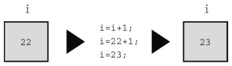
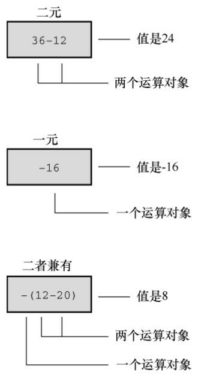
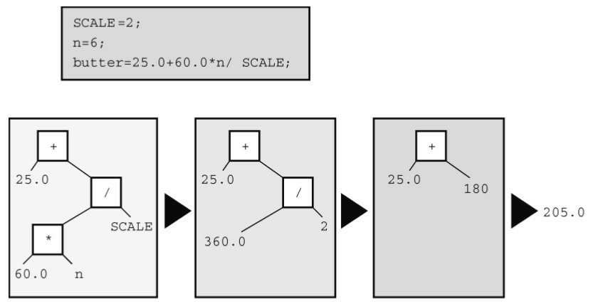
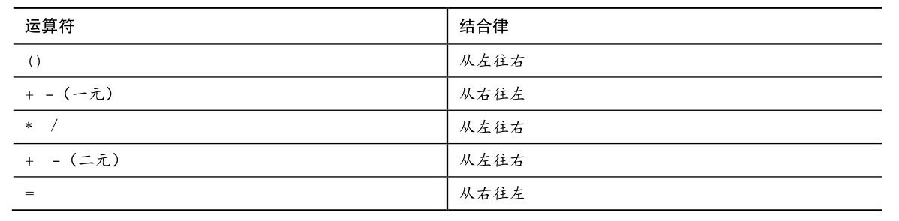
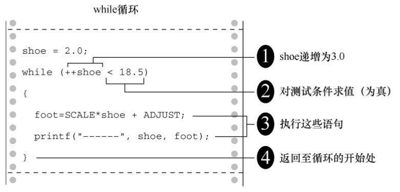
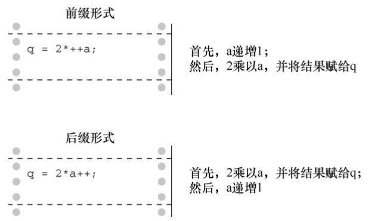
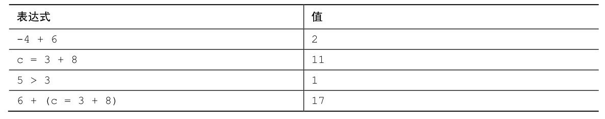
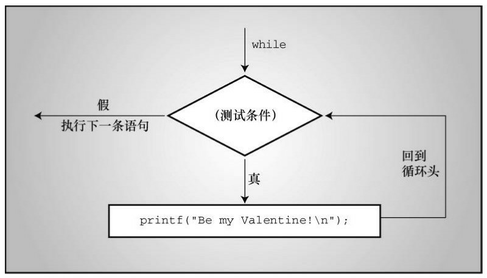
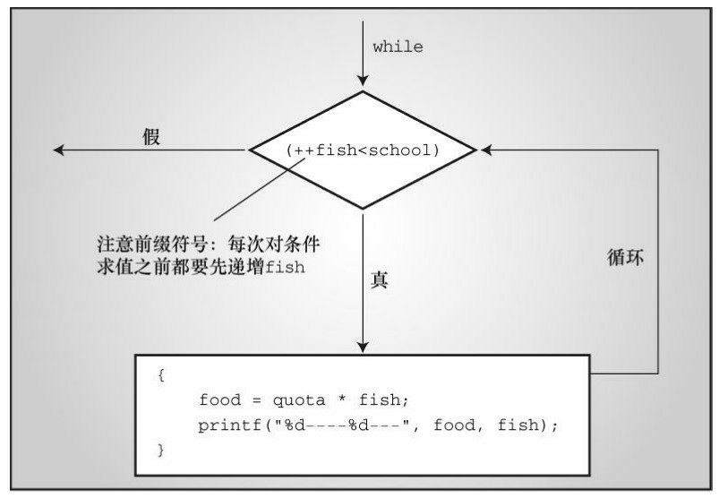

# 第5章 运算符、表达式和语句
本章介绍以下内容：
* 关键字：while、typedef
* 运算符：=、-、*、/、%、++、--、(类型名)
* C语言的各种运算符，包括用于普通数学运算的运算符
* 运算符优先级以及语句、表达式的含义
* while循环
* 复合语句、自动类型转换和强制类型转换
* 如何编写带有参数的函数

现在，读者已经熟悉了如何表示数据，接下来我们学习如何处理数据。C 语言为处理数据提供了大量的操作，可以在程序中进行算术运算、比较值的大小、修改变量、逻辑地组合关系等。我们先从基本的算术运算（加、减、乘、除）开始。

组织程序是处理数据的另一个方面，让程序按正确的顺序执行各个步骤。C 有许多语言特性，帮助你完成组织程序的任务。循环就是其中一个特性，本章中你将窥其大概。循环能重复执行行为，让程序更有趣、更强大。

## 5.1 循环简介
程序清单5.1是一个简单的程序示例，该程序进行了简单的运算，计算穿9码男鞋的脚长（单位：英寸）。为了让读者体会循环的好处，程序的第1个版本演示了不使用循环编程的局限性。

程序清单5.1 shoes1.c程序
```c
/* shoes1.c -- 把鞋码转换成英寸 */
#include <stdio.h>
#define ADJUST 7.31          // 字符常量
int main(void)
{
    const double SCALE = 0.333;// const变量
    double shoe, foot;
    shoe = 9.0;
    foot = SCALE * shoe + ADJUST;
    printf("Shoe size (men's)   foot length\n");
    printf("%10.1f %15.2f inches\n", shoe, foot);
    return 0;
}
```

该程序的输出如下：
```json5
Shoe size (men's)   foot length
       9.0           10.31 inches
```

该程序演示了用#define 指令创建符号常量和用 const 限定符创建在程序运行过程中不可更改的变量。程序使用了乘法和加法，假定用户穿9码的鞋，以英寸为单位打印用户的脚长。你可能会说：“这太简单了，我用笔算比敲程序还要快。”说得没错。写出来的程序只使用一次（本例即只根据一只鞋的尺码计算一次脚长），实在是浪费时间和精力。如果写成交互式程序会更有用，但是仍无法利用计算机的优势。

应该让计算机做一些重复计算的工作。毕竟，需要重复计算是使用计算机的主要原因。C 提供多种方法做重复计算，我们在这里简单介绍一种——while循环。它能让你对运算符做更有趣地探索。程序清单5.2演示了用循环改进后的程序。

程序清单5.2 shoes2.c程序
```c
/* shoes2.c -- 计算多个不同鞋码对应的脚长 */
#include <stdio.h>
#define ADJUST 7.31          // 字符常量
int main(void)
{
    const double SCALE = 0.333;// const变量
    double shoe, foot;
    printf("Shoe size (men's)   foot length\n");
    shoe = 3.0;
    while (shoe < 18.5)      /* while循环开始 */
    {               /* 块开始 */
        foot = SCALE * shoe + ADJUST;
        printf("%10.1f %15.2f inches\n", shoe, foot);
        shoe = shoe + 1.0;
    }               /* 块结束    */
    printf("If the shoe fits, wear it.\n");
    return 0;
}
```

下面是shoes2.c程序的输出（...表示并未显示完整，有删节）：
```c
Shoe size (men's)   foot length
       3.0            8.31 inches
       4.0            8.64 inches
       5.0            8.97 inches
       6.0            9.31 inches
......
      16.0           12.64 inches
      17.0           12.97 inches
      18.0           13.30 inches
If the shoe fits, wear it.
```

（如果读者对此颇有研究，应该知道该程序不符合实际情况。程序中假定了一个统一的鞋码系统。）

下面解释一下while循环的原理。当程序第1次到达while循环时，会检查圆括号中的条件是否为真。该程序中，条件表达式如下：
```c
shoe < 18.5
```

符号<的意思是小于。变量shoe被初始化为3.0，显然小于18.5。因此，该条件为真，程序进入块中继续执行，把尺码转换成英寸。然后打印计算的结果。下一条语句把 shoe增加1.0，使shoe的值为4.0：
```c
shoe = shoe + 1.0;
```

此时，程序返回while入口部分检查条件。为何要返回while的入口部分？因为上面这条语句的下面是右花括号（}），代码使用一对花括号（{}）来标出while循环的范围。花括号之间的内容就是要被重复执行的内容。花括号以及被花括号括起来的部分被称为块（block）。现在，回到程序中。因为4小于18.5，所以要重复执行被花括号括起来的所有内容（用计算机术语来说就是，程序循环这些语句）。该循环过程一直持续到shoe的值为19.0。此时，由于19.0小于18.5，所以该条件为假：
```c
shoe < 18.5
```

出现这种情况后，控制转到紧跟while循环后面的第1条语句。该例中，是最后的printf()语句。

可以很方便地修改该程序用于其他转换。例如，把SCALE设置成1.8、ADJUST设置成32.0，该程序便可把摄氏温度转换成华氏温度；把SCALE设置成0.6214、ADJUST设置成0，该程序便可把公里转换成英里。注意，修改了设置后，还要更改打印的消息，以免前后表述不一。

通过while循环能便捷灵活地控制程序。现在，我们来学习程序中会用到的基本运算符。

## 5.2 基本运算符
C用运算符（operator）表示算术运算。例如，+运算符使在它两侧的值加在一起。如果你觉得术语“运算符”很奇怪，那么请记住东西总得有个名称。与其叫“那些东西”或“运算处理符”，还不如叫“运算符”。现在，我们介绍一下用于基本算术运算的运算符：=、+、-、*和/（C 没有指数运算符。不过，C 的标准数学库提供了一个pow()函数用于指数运算。例如，pow(3.5,2.2)返回3.5的2.2次幂）。

### 5.2.1 赋值运算符：=
在C语言中，=并不意味着“相等”，而是一个赋值运算符。下面的赋值表达式语句：
```c
bmw = 2002;
```

把值2002赋给变量bmw。也就是说，=号左侧是一个变量名，右侧是赋给该变量的值。符号=被称为赋值运算符。另外，上面的语句不读作“bmw等于2002”，而读作“把值2002赋给变量bmw”。赋值行为从右往左进行。

也许变量名和变量值的区别看上去微乎其微，但是，考虑下面这条常用的语句：
```c
i = i + 1;
```

对数学而言，这完全行不通。如果给一个有限的数加上 1，它不可能“等于”原来的数。但是，在计算机赋值表达式语句中，这很合理。该语句的意思是：找出变量 i 的值，把该值加 1，然后把新值赋值变量i（见图5.1）。



在C语言中，类似这样的语句没有意义（实际上是无效的）：
```c
2002 = bmw;
```

因为在这种情况下，2002 被称为右值（rvale），只能是字面常量。不能给常量赋值，常量本身就是它的值。因此，在编写代码时要记住，=号左侧的项必须是一个变量名。实际上，赋值运算符左侧必须引用一个存储位置。最简单的方法就是使用变量名。不过，后面章节还会介绍“指针”，可用于指向一个存储位置。概括地说，C 使用可修改的左值（modifiable lvalue）标记那些可赋值的实体。也许“可修改的左值”不太好懂，我们再来看一些定义。

几个术语：数据对象、左值、右值和运算符

赋值表达式语句的目的是把值储存到内存位置上。用于储存值的数据存储区域统称为数据对象（data object）。C 标准只有在提到这个概念时才会用到对象这个术语。使用变量名是标识对象的一种方法。除此之外，还有其他方法，但是要在后面的章节中才学到。例如，可以指定数组的元素、结构的成员，或者使用指针表达式（指针中储存的是它所指向对象的地址）。左值（lvalue）是 C 语言的术语，用于标识特定数据对象的名称或表达式。因此，对象指的是实际的数据存储，而左值是用于标识或定位存储位置的标签。

对于早期的C语言，提到左值意味着：

1. 它指定一个对象，所以引用内存中的地址；
2. 它可用在赋值运算符的左侧，左值（lvalue）中的l源自left。

但是后来，标准中新增了const限定符。用const创建的变量不可修改。因此，const标识符满足上面的第1项，但是不满足第2项。一方面C继续把标识对象的表达式定义为左值，一方面某些左值却不能放在赋值运算符的左侧。有些左值不能用于赋值运算符的左侧。此时，标准对左值的定义已经不能满足当前的状况。

为此，C标准新增了一个术语：可修改的左值（modifiable lvalue），用于标识可修改的对象。所以，赋值运算符的左侧应该是可修改的左值。当前标准建议，使用术语对象定位值（object locator value）更好。

右值（rvalue）指的是能赋值给可修改左值的量，且本身不是左值。例如，考虑下面的语句：
```c
bmw = 2002;
```

这里，bmw是可修改的左值，2002是右值。读者也许猜到了，右值中的r源自right。右值可以是常量、变量或其他可求值的表达式（如，函数调用）。实际上，当前标准在描述这一概念时使用的是表达式的值（value of an expression），而不是右值。

我们看几个简单的示例：
```c
int ex;
int why;
int zee;
const int TWO = 2;
why = 42;
zee = why;
ex = TWO * (why + zee);
```

这里，ex、why和zee都是可修改的左值（或对象定位值），它们可用于赋值运算符的左侧和右侧。TWO是不可改变的左值，它只能用于赋值运算符的右侧（在该例中，TWO被初始化为2，这里的=运算符表示初始化而不是赋值，因此并未违反规则）。同时，42 是右值，它不能引用某指定内存位置。另外，why和 zee 是可修改的左值，表达式(why + zee)是右值，该表达式不能表示特定内存位置，而且也不能给它赋值。它只是程序计算的一个临时值，在计算完毕后便会被丢弃。

在学习名称时，被称为“项”（如，赋值运算符左侧的项）的就是运算对象（operand）。运算对象是运算符操作的对象。例如，可以把吃汉堡描述为：“吃”运算符操作“汉堡”运算对象。类似地可以说，=运算符的左侧运算对象应该是可修改的左值。

C的基本赋值运算符有些与众不同，请看程序清单5.3。

程序清单5.3 golf.c程序
```c
/* golf.c -- 高尔夫锦标赛记分卡 */
#include <stdio.h>
int main(void)
{
    int jane, tarzan, cheeta;
    cheeta = tarzan = jane = 68;
    printf("                    cheeta   tarzan   jane\n");
    printf("First round score %4d %8d %8d\n", cheeta, tarzan, 
    jane);
    return 0;
}
```

许多其他语言都会回避该程序中的三重赋值，但是C完全没问题。赋值的顺序是从右往左：首先把86赋给jane，然后再赋给tarzan，最后赋给cheeta。因此，程序的输出如下：
```json5
                    cheeta   tarzan   jane
First round score   68       68       68
```

### 5.2.2 加法运算符：+
加法运算符（addition operator）用于加法运算，使其两侧的值相加。例如，语句：
```c
printf("%d", 4 + 20);
```

打印的是24，而不是表达式
```c
4 + 20
```

相加的值（运算对象）可以是变量，也可以是常量。因此，执行下面的语句：
```c
income = salary + bribes;
```

计算机会查看加法运算符右侧的两个变量，把它们相加，然后把和赋给变量income。

在此提醒读者注意，income、salary和bribes都是可修改的左值。因为每个变量都标识了一个可被赋值的数据对象。但是，表达式salary + brives是一个右值。

### 5.2.3 减法运算符：-
减法运算符（subtraction operator）用于减法运算，使其左侧的数减去右侧的数。例如，下面的语句把200.0赋给takehome：
```c
takehome = 224.00 – 24.00;
```

+和-运算符都被称为二元运算符（binary operator），即这些运算符需要两个运算对象才能完成操作。

### 5.2.4 符号运算符：-和+
减号还可用于标明或改变一个值的代数符号。例如，执行下面的语句后，smokey的值为12：
```c
rocky = –12;
```

smokey = –rocky;以这种方式使用的负号被称为一元运算符（unary operator）。一元运算符只需要一个运算对象（见图5.2）。

C90标准新增了一元+运算符，它不会改变运算对象的值或符号，只能这样使用：
```c
dozen = +12;
```

编译器不会报错。但是在以前，这样做是不允许的。



### 5.2.5 乘法运算符：*
符号*表示乘法。下面的语句用2.54乘以inch，并将结果赋给cm：
```c
cm = 2.54 * inch;
```

C没有平方函数，如果要打印一个平方表，怎么办？如程序清单5.4所示，可以使用乘法来计算平方。

程序清单5.4 squares.c程序
```c
/* squares.c -- 计算1～20的平方 */
#include <stdio.h>
int main(void)
{
    int num = 1;
    while (num < 21)
    {
        printf("%4d %6d\n", num, num * num);
        num = num + 1;
    }
    return 0;
}
```

该程序打印数字1～20及其平方。接下来，我们再看一个更有趣的例子。

1. 指数增长

读者可能听过这样一个故事，一位强大的统治者想奖励做出突出贡献的学者。他问这位学者想要什么，学者指着棋盘说，在第1个方格里放1粒小麦、第2个方格里放2粒小麦、第3个方格里放4粒小麦，第4个方格里放 8 粒小麦，以此类推。这位统治者不熟悉数学，很惊讶学者竟然提出如此谦虚的要求。因为他原本准备奖励给学者一大笔财产。如果程序清单5.5运行的结果正确，这显然是跟统治者开了一个玩笑。程序计算出每个方格应放多少小麦，并计算了总数。可能大多数人对小麦的产量不熟悉，该程序以谷粒数为单位，把计算的小麦总数与粗略估计的世界小麦年产量进行了比较。

程序清单5.5 wheat.c程序
```c
/* wheat.c -- 指数增长 */
#include <stdio.h>
#define SQUARES 64       // 棋盘中的方格数
int main(void)
{
    const double CROP = 2E16; // 世界小麦年产谷粒数
    double current, total;
    int count = 1;
    printf("square      grains     total    ");
    printf("fraction of \n");
    printf("          added        grains   ");
    printf("world total\n");
    total = current = 1.0;   /* 从1颗谷粒开始 */
    printf("%4d %13.2e %12.2e %12.2e\n", count, current,
    total, total / CROP);
    while (count < SQUARES)
    {
        count = count + 1;
        current = 2.0 * current;  /* 下一个方格谷粒翻倍 */
        total = total + current;  /* 更新总数 */
        printf("%4d %13.2e %12.2e %12.2e\n", count, current,
        total, total / CROP);
    }
    printf("That's all.\n");
    return 0;
}
```

程序的输出结果如下：
```json5
square      grains     total    fraction of
          added        grains   world total
   1      1.00e+00     1.00e+00     5.00e-17
   2      2.00e+00     3.00e+00     1.50e-16
   3      4.00e+00     7.00e+00     3.50e-16
   4      8.00e+00     1.50e+01     7.50e-16
   5      1.60e+01     3.10e+01     1.55e-15
   6      3.20e+01     6.30e+01     3.15e-15
   7      6.40e+01     1.27e+02     6.35e-15
   8      1.28e+02     2.55e+02     1.27e-14
   9      2.56e+02     5.11e+02     2.55e-14
  10      5.12e+02     1.02e+03     5.12e-14
  11      1.02e+03     2.05e+03     1.02e-13
  12      2.05e+03     4.10e+03     2.05e-13
  13      4.10e+03     8.19e+03     4.10e-13
  14      8.19e+03     1.64e+04     8.19e-13
  15      1.64e+04     3.28e+04     1.64e-12
  16      3.28e+04     6.55e+04     3.28e-12
  17      6.55e+04     1.31e+05     6.55e-12
  18      1.31e+05     2.62e+05     1.31e-11
  19      2.62e+05     5.24e+05     2.62e-11
  20      5.24e+05     1.05e+06     5.24e-11
  21      1.05e+06     2.10e+06     1.05e-10
  22      2.10e+06     4.19e+06     2.10e-10
  23      4.19e+06     8.39e+06     4.19e-10
  24      8.39e+06     1.68e+07     8.39e-10
  25      1.68e+07     3.36e+07     1.68e-09
  26      3.36e+07     6.71e+07     3.36e-09
  27      6.71e+07     1.34e+08     6.71e-09
  28      1.34e+08     2.68e+08     1.34e-08
  29      2.68e+08     5.37e+08     2.68e-08
  30      5.37e+08     1.07e+09     5.37e-08
  31      1.07e+09     2.15e+09     1.07e-07
  32      2.15e+09     4.29e+09     2.15e-07
  33      4.29e+09     8.59e+09     4.29e-07
  34      8.59e+09     1.72e+10     8.59e-07
  35      1.72e+10     3.44e+10     1.72e-06
  36      3.44e+10     6.87e+10     3.44e-06
  37      6.87e+10     1.37e+11     6.87e-06
  38      1.37e+11     2.75e+11     1.37e-05
  39      2.75e+11     5.50e+11     2.75e-05
  40      5.50e+11     1.10e+12     5.50e-05
  41      1.10e+12     2.20e+12     1.10e-04
  42      2.20e+12     4.40e+12     2.20e-04
  43      4.40e+12     8.80e+12     4.40e-04
  44      8.80e+12     1.76e+13     8.80e-04
  45      1.76e+13     3.52e+13     1.76e-03
  46      3.52e+13     7.04e+13     3.52e-03
  47      7.04e+13     1.41e+14     7.04e-03
  48      1.41e+14     2.81e+14     1.41e-02
  49      2.81e+14     5.63e+14     2.81e-02
  50      5.63e+14     1.13e+15     5.63e-02
  51      1.13e+15     2.25e+15     1.13e-01
  52      2.25e+15     4.50e+15     2.25e-01
  53      4.50e+15     9.01e+15     4.50e-01
  54      9.01e+15     1.80e+16     9.01e-01
  55      1.80e+16     3.60e+16     1.80e+00
  56      3.60e+16     7.21e+16     3.60e+00
  57      7.21e+16     1.44e+17     7.21e+00
  58      1.44e+17     2.88e+17     1.44e+01
  59      2.88e+17     5.76e+17     2.88e+01
  60      5.76e+17     1.15e+18     5.76e+01
  61      1.15e+18     2.31e+18     1.15e+02
  62      2.31e+18     4.61e+18     2.31e+02
  63      4.61e+18     9.22e+18     4.61e+02
  64      9.22e+18     1.84e+19     9.22e+02
That's all.
```

10个方格以后，该学者得到的小麦仅超过了1000粒。但是，看看55个方格的小麦数是多少：
```c
55      1.80e+16     3.60e+16     1.80e+00
```

总量已超过了世界年产量！不妨自己动手运行该程序，看看第64个方格有多少小麦。

这个程序示例演示了指数增长的现象。世界人口增长和我们使用的能源都遵循相同的模式。

### 5.2.6 除法运算符：/
C使用符号/来表示除法。/左侧的值是被除数，右侧的值是除数。例如，下面four的值是4.0：
```c
four = 12.0/3.0;
```

整数除法和浮点数除法不同。浮点数除法的结果是浮点数，而整数除法的结果是整数。整数是没有小数部分的数。这使得5除以3很让人头痛，因为实际结果有小数部分。在C语言中，整数除法结果的小数部分被丢弃，这一过程被称为截断（truncation）。

运行程序清单5.6中的程序，看看截断的情况，体会整数除法和浮点数除法的区别。

程序清单5.6 divide.c程序
```c
/* divide.c -- 演示除法 */
#include <stdio.h>
int main(void)
{
    printf("integer division:  5/4  is %d \n", 5 / 4);
    printf("integer division:  6/3  is %d \n", 6 / 3);
    printf("integer division:  7/4  is %d \n", 7 / 4);
    printf("floating division: 7./4. is %1.2f \n", 7. / 4.);
    printf("mixed division:   7./4  is %1.2f \n", 7. / 4);
    return 0;
}
```

程序清单5.6中包含一个“混合类型”的示例，即浮点值除以整型值。C相对其他一些语言而言，在类型管理上比较宽容。尽管如此，一般情况下还是要避免使用混合类型。该程序的输出如下：
```c
integer division:  5/4  is 1
integer division:  6/3  is 2
integer division:  7/4  is 1
floating division: 7./4. is 1.75
mixed division:   7./4  is 1.75
```

注意，整数除法会截断计算结果的小数部分（丢弃整个小数部分），不会四舍五入结果。混合整数和浮点数计算的结果是浮点数。实际上，计算机不能真正用浮点数除以整数，编译器会把两个运算对象转换成相同的类型。本例中，在进行除法运算前，整数会被转换成浮点数。

C99标准以前，C语言给语言的实现者留有一些空间，让他们来决定如何进行负数的整数除法。一种方法是，舍入过程采用小于或等于浮点数的最大整数。当然，对于3.8而言，处理后的3符合这一描述。但是-3.8 会怎样？该方法建议四舍五入为-4，因为-4 小于-3.8.但是，另一种舍入方法是直接丢弃小数部分。这种方法被称为“趋零截断”，即把-3.8转换成-3。在C99以前，不同的实现采用不同的方法。但是C99规定使用趋零截断。所以，应把-3.8转换成-3。

### 5.2.7 运算符优先级
考虑下面的代码：
```c
butter = 25.0 + 60.0 * n / SCALE;
```

这条语句中有加法、乘法和除法运算。先算哪一个？是25.0加上60.0，然后把计算的和85.0乘以n，再把结果除以SCALE？还是60.0乘以n，然后把计算的结果加上25.0，最后再把结果除以SCALE？还是其他运算顺序？假设n是6.0，SCALE是2.0，带入语句中计算会发现，第1种顺序得到的结果是255，第2种顺序得到的结果是192.5。C程序一定是采用了其他的运算顺序，因为程序运行该语句后，butter的值是205.0。

显然，执行各种操作的顺序很重要。C 语言对此有明确的规定，通过运算符优先级来解决操作顺序的问题。每个运算符都有自己的优先级。正如普通的算术运算那样，乘法和除法的优先级比加法和减法高，所以先执行乘法和除法。如果两个运算符的优先级相同怎么办？如果它们处理同一个运算对象，则根据它们在语句中出现的顺序来执行。对大多数运算符而言，这种情况都是按从左到右的顺序进行（=运算符除外）。因此，语句：
```c
butter = 25.0 + 60.0 * n / SCALE;
```

的运算顺序是：

60.0 * n首先计算表达式中的*或/（假设n的值是6，所以60.0*n得360.0）360.0 / SCALE 然后计算表达式中第2个*或/25.0 + 180最后计算表达式里第1个+或-，结果为205.0（假设SCALE的值是2.0）

许多人喜欢用表达式树（expression tree）来表示求值的顺序，如图5.3所示。该图演示了如何从最初的表达式逐步简化为一个值。



如何让加法运算在乘法运算之前执行？可以这样做：
```c
flour = (25.0 + 60.0 * n) / SCALE;
```

最先执行圆括号中的部分。圆括号内部按正常的规则执行。该例中，先执行乘法运算，再执行加法运算。执行完圆括号内的表达式后，用运算结果除以SCALE。

表5.1总结了到目前为止学过的运算符优先级。



注意正号（加号）和负号（减号）的两种不同用法。结合律栏列出了运算符如何与运算对象结合。例如，一元负号与它右侧的量相结合，在除法中用除号左侧的运算对象除以右侧的运算对象。

### 5.2.8 优先级和求值顺序
运算符优先级为表达式中的求值顺序提供重要的依据，但是并没有规定所有的顺序。C 给语言的实现者留出选择的余地。考虑下面的语句：
```c
y = 6 * 12 + 5 * 20;
```

当运算符共享一个运算对象时，优先级决定了求值顺序。例如上面的语句中，12是*和+运算符的运算对象。根据运算符的优先级，乘法的优先级比加法高，所以先进行乘法运算。类似地，先对 5 进行乘法运算而不是加法运算。简而言之，先进行两个乘法运算6 * 12和5 * 20，再进行加法运算。但是，优先级并未规定到底先进行哪一个乘法。C 语言把主动权留给语言的实现者，根据不同的硬件来决定先计算前者还是后者。可能在一种硬件上采用某种方案效率更高，而在另一种硬件上采用另一种方案效率更高。无论采用哪种方案，表达式都会简化为 72 + 100，所以这并不影响最终的结果。但是，读者可能会根据乘法从左往右的结合律，认为应该先执行+运算符左边的乘法。结合律只适用于共享同一运算对象运算符。例如，在表达式12 / 3 * 2中，/和*运算符的优先级相同，共享运算对象3。因此，从左往右的结合律在这种情况起作用。表达式简化为4 * 2，即8（如果从右往左计算，会得到12/6，即2，这种情况下计算的先后顺序会影响最终的计算结果）。在该例中，两个*运算符并没有共享同一个运算对象，因此从左往右的结合律不适用于这种情况。

学以致用

接下来，我们在更复杂的示例中使用以上规则，请看程序清单5.7。

程序清单5.7 rules.c程序
```c
/* rules.c -- 优先级测试 */
#include <stdio.h>
int main(void)
{
    int top, score;
    top = score = -(2 + 5) * 6 + (4 + 3 * (2 + 3));
    printf("top = %d, score = %d\n", top, score);
    return 0;
}
```

该程序会打印什么值？先根据代码推测一下，再运行程序或阅读下面的分析来检查你的答案。

首先，圆括号的优先级最高。先计算-(2 + 5) * 6中的圆括号部分，还是先计算(4 + 3 * (2 + 3))中的圆括号部分取决于具体的实现。圆括号的最高优先级意味着，在子表达式-(2 + 5) * 6中，先计算(2 + 5)的值，得7。然后，把一元负号应用在7上，得-7。现在，表达式是：
```c
top = score = -7 * 6 + (4 + 3 * (2 + 3))
```

下一步，计算2 + 3的值。表达式变成：
```c
top = score = -7 * 6 + (4 + 3 * 5)
```

接下来，因为圆括号中的*比+优先级高，所以表达式变成：
```c
top = score = -7 * 6 + (4 + 15)
```

然后，表达式为：
```c
top = score = -7 * 6 + 19
```

-7乘以6后，得到下面的表达式：
```c
top = score = -42 + 19
```

然后进行加法运算，得到：
```c
top = score = -23
```

现在，-23被赋值给score，最终top的值也是-23。记住，=运算符的结合律是从右往左。

## 5.3 其他运算符
C语言有大约40个运算符，有些运算符比其他运算符常用得多。前面讨论的是最常用的，本节再介绍4个比较有用的运算符。

### 5.3.1 sizeof运算符和size_t类型
读者在第3章就见过sizeof运算符。回顾一下，sizeof运算符以字节为单位返回运算对象的大小（在C中，1字节定义为char类型占用的空间大小。过去，1字节通常是8位，但是一些字符集可能使用更大的字节）。运算对象可以是具体的数据对象（如，变量名）或类型。如果运算对象是类型（如，float），则必须用圆括号将其括起来。程序清单5.8演示了这两种用法。

程序清单5.8 sizeof.c程序
```c
// sizeof.c -- 使用sizeof运算符
// 使用C99新增的%zd转换说明 -- 如果编译器不支持%zd，请将其改成%u或%lu
#include <stdio.h>
int main(void)
{
    int n = 0;
    size_t intsize;
    intsize = sizeof (int);
    printf("n = %d, n has %zd bytes; all ints have %zd bytes.\n",n, sizeof n, intsize);
    return 0;
}
```

C 语言规定，sizeof 返回 size_t 类型的值。这是一个无符号整数类型，但它不是新类型。前面介绍过，size_t是语言定义的标准类型。C有一个typedef机制（第14章再详细介绍），允许程序员为现有类型创建别名。例如，
```c
typedef double real;
```

这样，real就是double的别名。现在，可以声明一个real类型的变量：
```c
real deal; // 使用typedef
```

编译器查看real时会发现，在typedef声明中real已成为double的别名，于是把deal创建为double 类型的变量。类似地，C 头文件系统可以使用 typedef 把 size_t 作为 unsigned int 或unsigned long的别名。这样，在使用size_t类型时，编译器会根据不同的系统替换标准类型。

C99 做了进一步调整，新增了%zd 转换说明用于 printf()显示 size_t 类型的值。如果系统不支持%zd，可使用%u或%lu代替%zd。

### 5.3.2 求模运算符：%
求模运算符（modulus operator）用于整数运算。求模运算符给出其左侧整数除以右侧整数的余数（remainder）。例如，13 % 5（读作“13求模5”）得3，因为13比5的两倍多3，即13除以5的余数是3。求模运算符只能用于整数，不能用于浮点数。

乍一看会认为求模运算符像是数学家使用的深奥符号，但是实际上它非常有用。求模运算符常用于控制程序流。例如，假设你正在设计一个账单预算程序，每 3 个月要加进一笔额外的费用。这种情况可以在程序中对月份求模3（即，month % 3），并检查结果是否为0。如果为0，便加进额外的费用。等学到第7章的if语句后，读者会更明白。

程序清单5.9演示了%运算符的另一种用途。同时，该程序也演示了while循环的另一种用法。

程序清单5.9 min_sec.c程序
```c
// min_sec.c -- 把秒数转换成分和秒
#include <stdio.h>
#define SEC_PER_MIN 60      // 1分钟60秒
int main(void)
{
    int sec, min, left;
    printf("Convert seconds to minutes and seconds!\n");
    printf("Enter the number of seconds (<=0 to quit):\n");
    scanf("%d", &sec);      // 读取秒数
    while (sec > 0)
    {
        min = sec / SEC_PER_MIN;  // 截断分钟数
        left = sec % SEC_PER_MIN;  // 剩下的秒数
        printf("%d seconds is %d minutes, %d seconds.\n", sec,min, left);
        printf("Enter next value (<=0 to quit):\n");
        scanf("%d", &sec);
    }
    printf("Done!\n");
    return 0;
}
```

该程序的输出如下：
```c
Convert seconds to minutes and seconds!
Enter the number of seconds (<=0 to quit):
154
154 seconds is 2 minutes, 34 seconds.
Enter next value (<=0 to quit):
567
567 seconds is 9 minutes, 27 seconds.
Enter next value (<=0 to quit):
0
Done!
```

程序清单5.2使用一个计数器来控制while循环。当计数器超出给定的大小时，循环终止。而程序清单5.9则通过scanf()为变量sec获取一个新值。只要该值为正，循环就继续。当用户输入一个0或负值时，循环退出。这两种情况设计的要点是，每次循环都会修改被测试的变量值。

负数求模如何进行？C99规定“趋零截断”之前，该问题的处理方法很多。但自从有了这条规则之后，如果第1个运算对象是负数，那么求模的结果为负数；如果第1个运算对象是正数，那么求模的结果也是正数：
```json5
11 / 5得2，11 % 5得1
11 / -5得-2，11 % -2得1
-11 / -5得2，-11 % -5得-1
-11 / 5得-2，-11 % 5得-1
```

如果当前系统不支持C99标准，会显示不同的结果。实际上，标准规定：无论何种情况，只要a和b都是整数值，便可通过a - (a/b)*b来计算a%b。例如，可以这样计算-11%5：
```c
-11 - (-11/5) * 5 = -11 -(-2)*5 = -11 -(-10) = -1
```

### 5.3.3 递增运算符：++
递增运算符（increment operator）执行简单的任务，将其运算对象递增1。该运算符以两种方式出现。第1种方式，++出现在其作用的变量前面，这是前缀模式；第2种方式，++出现在其作用的变量后面，这是后缀模式。两种模式的区别在于递增行为发生的时间不同。我们先解释它们的相似之处，再分析它们不同之处。程序清单5.10中的程序示例演示了递增运算符是如何工作的。

程序清单5.10 add_one.c程序
```c
/* add_one.c -- 递增：前缀和后缀 */
#include <stdio.h>
int main(void)
{
    int ultra = 0, super = 0;
    while (super < 5)
    {
        super++;
        ++ultra;
        printf("super = %d, ultra = %d \n", super, ultra);
    }
    return 0;
}
```

运行该程序后，其输出如下：
```c
super = 1, ultra = 1
super = 2, ultra = 2
super = 3, ultra = 3
super = 4, ultra = 4
super = 5, ultra = 5
```

该程序两次同时计数到5。用下面两条语句分别代替程序中的两条递增语句，程序的输出相同：
```c
super = super + 1;
ultra = ultra + 1;
```

这些都是很简单的语句，为何还要创建两个缩写形式？原因之一是，紧凑结构的代码让程序更为简洁，可读性更高。这些运算符让程序看起来很美观。例如，可重写程序清单5.2（shoes2.c）中的一部分代码：
```c
shoe = 3.0;
while (shoe < 18.5)
{
    foot = SCALE * size + ADJUST;
    printf("%10.1f %20.2f inches\n", shoe, foot);
    ++shoe;
}
```

但是，这样做也没有充分利用递增运算符的优势。还可以这样缩短这段程序：
```c
shoe = 2.0;
while (++shoe < 18.5)
{
    foot = SCALE*shoe + ADJUST;
    printf("%10.1f %20.2f inches\n", shoe, foot);
}
```

如上代码所示，把变量的递增过程放入while循环的条件中。这种结构在C语言中很普遍，我们来仔细分析一下。

首先，这样的while循环是如何工作的？很简单。shoe的值递增1，然后和18.5作比较。如果递增后的值小于18.5，则执行花括号内的语句一次。然后，shoe的值再递增1，重复刚才的步骤，直到shoe的值不小于18.5为止。注意，我们把shoe的初始值从3.0改为2.0，因为在对foot第1次求值之前， shoe已经递增了1（见图5.4）。



其次，这样做有什么好处？它使得程序更加简洁。更重要的是，它把控制循环的两个过程集中在一个地方。该循环的主要过程是判断是否继续循环（本例中，要检查鞋子的尺码是否小于 18.5），次要过程是改变待测试的元素（本例中是递增鞋子的尺码）。

如果忘记改变鞋子的尺码，shoe的值会一直小于18.5，循环不会停止。计算机将陷入无限循环（infinite loop）中，生成无数相同的行。最后，只能强行关闭这个程序。把循环测试和更新循环放在一处，就不会忘记更新循环。

但是，把两个操作合并在一个表达式中，降低了代码的可读性，让代码难以理解。而且，还容易产生计数错误。

递增运算符的另一个优点是，通常它生成的机器语言代码效率更高，因为它和实际的机器语言指令很相似。尽管如此，随着商家推出的C编译器越来越智能，这一优势可能会消失。一个智能的编译器可以把x = x + 1当作++x对待。

最后，递增运算符还有一个在某些场合特别有用的特性。我们通过程序清单5.11来说明。

程序清单5.11 post_pre.c程序
```c
/* post_pre.c -- 前缀和后缀 */
#include <stdio.h>
int main(void)
{
    int a = 1, b = 1;
    int a_post, pre_b;
    a_post = a++; // 后缀递增
    pre_b = ++b;  // 前缀递增
    printf("a  a_post  b  pre_b \n");
    printf("%1d %5d %5d %5d\n", a, a_post, b, pre_b);
    return 0;
}
```

如果你的编译器没问题，那么程序的输出应该是：
```c
a  a_post  b  pre_b
2     1     2     2
```

a和b都递增了1，但是，a_post是a递增之前的值，而b_pre是b递增之后的值。这就是++的前缀形式和后缀形式的区别（见图5.5）。



a_post = a++;   // 后缀：使用a的值乊后，递增a

b_pre= ++b;     // 前缀：使用b的值乊前，递增b

单独使用递增运算符时（如，ego++;），使用哪种形式都没关系。但是，当运算符和运算对象是更复杂表达式的一部分时（如上面的示例），使用前缀或后缀的效果不同。例如，我们曾经建议用下面的代码：
```c
while (++shoe < 18.5)
```

该测试条件相当于提供了一个鞋子尺码到18的表。如果使用shoe++而不是++shoes，尺码表会增至19。因为shoe会在与18.5进行比较之后才递增，而不是先递增再比较。

当然，使用下面这种形式也没错：
```c
shoe = shoe + 1;
```

只不过，有人会怀疑你是否是真正的C程序员。

在学习本书的过程中，应多留意使用递增运算符的例子。自己思考是否能互换使用前缀和后缀形式，或者当前环境是否只能使用某种形式。

如果使用前缀形式和后缀形式会对代码产生不同的影响，那么最为明智的是不要那样使用它们。例如，不要使用下面的语句：
```c
b = ++i; // 如果使用i++，会得到不同的结果
```

应该使用下列语句：
```c
++i;   // 第1行
b = i; // 如果第1行使用的是i++，幵不会影响b的值
```

尽管如此，有时小心翼翼地使用会更有意思。所以，本书会根据实际情况，采用不同的写法。

### 5.3.4 递减运算符：--
每种形式的递增运算符都有一个递减运算符（decrement operator）与之对应，用--代替++即可：
```c
--count; // 前缀形式的递减运算符
count--; // 后缀形式的递减运算符
```

程序清单5.12演示了计算机可以是位出色的填词家。

程序清单5.12 bottles.c程序
```c
#include <stdio.h>
#define MAX 100
int main(void)
{
    int count = MAX + 1;
    while (--count > 0) {
        printf("%d bottles of spring water on the wall, "
        "%d bottles of spring water!\n", count, count);
        printf("Take one down and pass it around,\n");
        printf("%d bottles of spring water!\n\n", count - 1);
    }
    return 0;
}
```

该程序的输出如下（篇幅有限，省略了中间大部分输出）：
```c
100 bottles of spring water on the wall, 100 bottles of spring water!
Take one down and pass it around,
99 bottles of spring water!

99 bottles of spring water on the wall, 99 bottles of spring water!
Take one down and pass it around,
98 bottles of spring water!

98 bottles of spring water on the wall, 98 bottles of spring water!
Take one down and pass it around,
97 bottles of spring water!

......

3 bottles of spring water on the wall, 3 bottles of spring water!
Take one down and pass it around,
2 bottles of spring water!

2 bottles of spring water on the wall, 2 bottles of spring water!
Take one down and pass it around,
1 bottles of spring water!

1 bottles of spring water on the wall, 1 bottles of spring water!
Take one down and pass it around,
0 bottles of spring water!
```

显然，这位填词家在复数的表达上有点问题。在学完第7章中的条件运算符后，可以解决这个问题。

顺带一提，>运算符表示“大于”，<运算符表示“小于”，它们都是关系运算符（relational operator）。我们将在第6章中详细介绍关系运算符。

### 5.3.5 优先级
递增运算符和递减运算符都有很高的结合优先级，只有圆括号的优先级比它们高。因此，x*y++表示的是(x)*(y++)，而不是(x+y)++。不过后者无效，因为递增和递减运算符只能影响一个变量（或者，更普遍地说，只能影响一个可修改的左值），而组合x*y本身不是可修改的左值。

不要混淆这两个运算符的优先级和它们的求值顺序。假设有如下语句：
```c
y = 2;
n = 3;
nextnum = (y + n++)*6;
```

nextnum的值是多少？把y和n的值带入上面的第3条语句得：
```c
nextnum = (2 + 3)*6 = 5*6 = 30
```

n的值只有在被使用之后才会递增为4。根据优先级的规定，++只作用于n，不作用与y + n。除此之外，根据优先级可以判断何时使用n的值对表达式求值，而递增运算符的性质决定了何时递增n的值。

如果n++是表达式的一部分，可将其视为“先使用n，再递增”；而++n则表示“先递增n，再使用”。

### 5.3.6 不要自作聪明
如果一次用太多递增运算符，自己都会糊涂。例如，利用递增运算符改进 squares.c 程序（程序清单5.4），用下面的while循环替换原程序中的while循环：
```c
while (num < 21)
{
    printf("%10d %10d\n", num, num*num++);
}
```

这个想法看上去不错。打印num，然后计算num*num得到平方值，最后把num递增1。但事实上，修改后的程序只能在某些系统上能正常运行。该程序的问题是：当 printf()获取待打印的值时，可能先对最后一个参数（ ）求值，这样在获取其他参数的值之前就递增了num。所以，本应打印：
```c
5       25
```

却打印成：
```c
6       25
```

它甚至可能从右往左执行，对最右边的num（++作用的num）使用5，对第2个num和最左边的num使用6，结果打印出：
```c
6       30
```

在C语言中，编译器可以自行选择先对函数中的哪个参数求值。这样做提高了编译器的效率，但是如果在函数的参数中使用了递增运算符，就会有一些问题。

类似这样的语句，也会导致一些麻烦：
```c
ans = num/2 + 5*(1 + num++);
```

同样，该语句的问题是：编译器可能不会按预想的顺序来执行。你可能认为，先计算第1项（num/2），接着计算第2项（5*(1 + num++)）。但是，编译器可能先计算第2项，递增num，然后在num/2中使用num递增后的新值。因此，无法保证编译器到底先计算哪一项。

还有一种情况，也不确定：
```c
n = 3;
y = n++ + n++;
```

可以肯定的是，执行完这两条语句后，n的值会比旧值大2。但是，y的值不确定。在对y求值时，编译器可以使用n的旧值（3）两次，然后把n递增1两次，这使得y的值为6，n的值为5。或者，编译器使用n的旧值（3）一次，立即递增n，再对表达式中的第2个n使用递增后的新值，然后再递增n，这使得 y 的值为 7，n 的值为 5。两种方案都可行。对于这种情况更精确地说，结果是未定义的，这意味着 C标准并未定义结果应该是什么。

遵循以下规则，很容易避免类似的问题：

如果一个变量出现在一个函数的多个参数中，不要对该变量使用递增或递减运算符；

如果一个变量多次出现在一个表达式中，不要对该变量使用递增或递减运算符。

另一方面，对于何时执行递增，C 还是做了一些保证。我们在本章后面的“副作用和序列点”中学到序列点时再来讨论这部分内容。

## 5.4 表达式和语句
在前几章中，我们已经多次使用了术语表达式（expression）和语句（statement）。现在，我们来进一步学习它们。C的基本程序步骤由语句组成，而大多数语句都由表达式构成。因此，我们先学习表达式。

### 5.4.1 表达式
表达式（expression）由运算符和运算对象组成（前面介绍过，运算对象是运算符操作的对象）。最简单的表达式是一个单独的运算对象，以此为基础可以建立复杂的表达式。下面是一些表达式：
```c
4
-6
4+21
a*(b + c/d)/20
q = 5*2
x = ++q % 3
q > 3
```

如你所见，运算对象可以是常量、变量或二者的组合。一些表达式由子表达式（subexpression）组成（子表达式即较小的表达式）。例如，c/d是上面例子中a*(b + c/d)/20的子表达式。

每个表达式都有一个值

C 表达式的一个最重要的特性是，每个表达式都有一个值。要获得这个值，必须根据运算符优先级规定的顺序来执行操作。在上面我们列出的表达式中，前几个都很清晰明了。但是，有赋值运算符（=）的表达式的值是什么？这些表达式的值与赋值运算符左侧变量的值相同。因此，表达式q = 5*2作为一个整体的值是10。那么，表达式q > 3的值是多少？这种关系表达式的值不是0就是1，如果条件为真，表达式的值为1；如果条件为假，表达式的值为0。表5.2列出了一些表达式及其值：



虽然最后一个表达式看上去很奇怪，但是在C中完全合法（但不建议使用），因为它是两个子表达式的和，每个子表达式都有一个值。

### 5.4.2 语句
语句（statement）是C程序的基本构建块。一条语句相当于一条完整的计算机指令。在C中，大部分语句都以分号结尾。因此，
```c
legs = 4
```

只是一个表达式（它可能是一个较大表达式的一部分），而下面的代码则是一条语句：
```c
legs = 4;
```

最简单的语句是空语句：
```c
;   //空语句
```

C把末尾加上一个分号的表达式都看作是一条语句（即，表达式语句）。因此，像下面这样写也没问题：
```c
3 + 4;
```

但是，这些语句在程序中什么也不做，不算是真正有用的语句。更确切地说，语句可以改变值或调用函数：
```c
x = 25;
++x;
y = sqrt(x);
```

虽然一条语句（或者至少是一条有用的语句）相当于一条完整的指令，但并不是所有的指令都是语句。考虑下面的语句：
```c
x = 6 + (y = 5);
```

该语句中的子表达式y = 5是一条完整的指令，但是它只是语句的一部分。因为一条完整的指令不一定是一条语句，所以分号用于识别在这种情况下的语句（即，简单语句）。

到目前为止，读者已经见过多种语句（不包括空语句）。程序清单5.13演示了一些常见的语句。

程序清单5.13 addemup.c程序
```c
/* addemup.c -- 几种常见的语句 */
#include <stdio.h>
int main(void)         /* 计算前20个整数的和  */
{
    int count, sum;     /* 声明[1]       */
    count = 0;         /* 表达式语句      */
    sum = 0;          /* 表达式语句      */
    while (count++ < 20)    /* 迭代语句      */
        sum = sum + count;
    printf("sum = %d\n", sum); /* 表达式语句[2]     */
    return 0;       /* 跳转语句         */
}
```

[声明](#声明)

[表达式语句](#表达式语句)

下面我们讨论程序清单 5.13。到目前为止，相信读者已经很熟悉声明了。尽管如此，我们还是要提醒读者：声明创建了名称和类型，并为其分配内存位置。注意，声明不是表达式语句。也就是说，如果删除声明后面的分号，剩下的部分不是一个表达式，也没有值：
```c
int port /* 不是表达式，没有值 */
```

赋值表达式语句在程序中很常用：它为变量分配一个值。赋值表达式语句的结构是，一个变量名，后面是一个赋值运算符，再跟着一个表达式，最后以分号结尾。注意，在while循环中有一个赋值表达式语句。赋值表达式语句是表达式语句的一个示例。

函数表达式语句会引起函数调用。在该例中，调用printf()函数打印结果。while语句有3个不同的部分（见图5.6）。首先是关键字while；然后，圆括号中是待测试的条件；最后如果测试条件为真，则执行while循环体中的语句。该例的while循环中只有一条语句。可以是本例那样的一条语句，不需要用花括号括起来，也可以像其他例子中那样包含多条语句。多条语句需要用花括号括起来。这种语句是复合语句，稍后马上介绍。



while语句是一种迭代语句，有时也被称为结构化语句，因为它的结构比简单的赋值表达式语句复杂。在后面的章节里，我们会遇到许多这样的语句。

副作用和序列点

我们再讨论一个C语言的术语副作用（side effect）。副作用是对数据对象或文件的修改。例如，语句：
```c
states = 50;
```

它的副作用是将变量的值设置为50。副作用？这似乎更像是主要目的！但是从C语言的角度看，主要目的是对表达式求值。给出表达式4 + 6，C会对其求值得10；给出表达式states = 50，C会对其求值得50。对该表达式求值的副作用是把变量states的值改为50。跟赋值运算符一样，递增和递减运算符也有副作用，使用它们的主要目的就是使用其副作用。

类似地，调用 printf()函数时，它显示的信息其实是副作用（printf()的返回值是待显示字符的个数）。

序列点（sequence point）是程序执行的点，在该点上，所有的副作用都在进入下一步之前发生。在 C语言中，语句中的分号标记了一个序列点。意思是，在一个语句中，赋值运算符、递增运算符和递减运算符对运算对象做的改变必须在程序执行下一条语句之前完成。后面我们要讨论的一些运算符也有序列点。另外，任何一个完整表达式的结束也是一个序列点。

什么是完整表达式？所谓完整表达式（full expression），就是指这个表达式不是另一个更大表达式的子表达式。例如，表达式语句中的表达式和while循环中的作为测试条件的表达式，都是完整表达式。

序列点有助于分析后缀递增何时发生。例如，考虑下面的代码：
```c
while (guests++ < 10)
    printf("%d \n", guests);
```

对于该例，C语言的初学者认为“先使用值，再递增它”的意思是，在printf()语句中先使用guests，再递增它。但是，表达式guests++ < 10是一个完整的表达式，因为它是while循环的测试条件，所以该表达式的结束就是一个序列点。因此，C 保证了在程序转至执行 printf()之前发生副作用（即，递增guests）。同时，使用后缀形式保证了guests在完成与10的比较后才进行递增。

现在，考虑下面这条语句：
```c
y = (4 + x++) + (6 + x++);
```

表达式4 + x++不是一个完整的表达式，所以C无法保证x在子表达式4 + x++求值后立即递增x。这里，完整表达式是整个赋值表达式语句，分号标记了序列点。所以，C 保证程序在执行下一条语句之前递增x两次。C并未指明是在对子表达式求值以后递增x，还是对所有表达式求值后再递增x。因此，要尽量避免编写类似的语句。

### 5.4.3 复合语句（块）
复合语句（compound statement）是用花括号括起来的一条或多条语句，复合语句也称为块（block）。shoes2.c程序使用块让while语句包含多条语句。比较下面两个程序段：
```c
/* 程序段 1 */
index = 0;
while (index++ < 10)
sam = 10 * index + 2;
printf("sam = %d\n", sam);
/* 程序段 2 */
index = 0;
while (index++ < 10)
{
    sam = 10 * index + 2;
    printf("sam = %d\n", sam);
}
```

程序段1，while循环中只有一条赋值表达式语句。没有花括号，while语句从while这行运行至下一个分号。循环结束后，printf()函数只会被调用一次。

程序段2，花括号确保两条语句都是while循环的一部分，每执行一次循环就调用一次printf()函数。根据while语句的结构，整个复合语句被视为一条语句（见图5.7）。



提示 风格提示

再看一下前面的两个while程序段，注意循环体中的缩进。缩进对编译器不起作用，编译器通过花括号和while循环的结构来识别和解释指令。这里，缩进是为了让读者一眼就可以看出程序是如何组织的。

程序段2中，块或复合语句放置花括号的位置是一种常见的风格。另一种常用的风格是：
```c
while (index++ < 10) {
    sam = 10*index + 2;
    printf("sam = %d \n", sam);
}
```

这种风格突出了块附属于while循环，而前一种风格则强调语句形成一个块。对编译器而言，这两种风格完全相同。

总而言之，使用缩进可以为读者指明程序的结构。

总结 表达式和语句

表达式：

表达式由运算符和运算对象组成。最简单的表达式是不带运算符的一个常量或变量（如，22 或beebop）。更复杂的例子是55 + 22和vap = 2 * (vip + (vup = 4))。

语句：

到目前为止，读者接触到的语句可分为简单语句和复合语句。简单语句以一个分号结尾。如下所示：

赋值表达式语句:   toes = 12;

函数表达式语句:   printf("%d\n", toes);

空语句:      ;   /* 什么也不做 */

复合语句（或块）由花括号括起来的一条或多条语句组成。如下面的while语句所示：
```c
while (years < 100)
{
    wisdom = wisdom * 1.05;
    printf("%d %d\n", years, wisdom);
    years = years + 1;
}
```

## 5.5 类型转换
通常，在语句和表达式中应使用类型相同的变量和常量。但是，如果使用混合类型，C 不会像 Pascal那样停在那里死掉，而是采用一套规则进行自动类型转换。虽然这很便利，但是有一定的危险性，尤其是在无意间混合使用类型的情况下（许多UNIX系统都使用lint程序检查类型“冲突”。如果选择更高错误级别，许多非UNIX C编译器也可能报告类型问题）。最好先了解一些基本的类型转换规则。

1. 当类型转换出现在表达式时，无论是unsigned还是signed的char和short都会被自动转换成int，如有必要会被转换成unsigned int（如果short与int的大小相同，unsigned short就比int大。这种情况下，unsigned short会被转换成unsigned int）。在K&R那时的C中，float会被自动转换成double（目前的C不是这样）。由于都是从较小类型转换为较大类型，所以这些转换被称为升级（promotion）。
2. 涉及两种类型的运算，两个值会被分别转换成两种类型的更高级别。
3. 类型的级别从高至低依次是long double、double、float、unsigned long long、long long、unsigned long、long、unsigned int、int。例外的情况是，当long 和 int 的大小相同时，unsigned int比long的级别高。之所以short和char类型没有列出，是因为它们已经被升级到int或unsigned int。
4. 在赋值表达式语句中，计算的最终结果会被转换成被赋值变量的类型。这个过程可能导致类型升级或降级（demotion）。所谓降级，是指把一种类型转换成更低级别的类型。
5. 当作为函数参数传递时，char和short被转换成int，float被转换成double。第9章将介绍，函数原型会覆盖自动升级。

类型升级通常都不会有什么问题，但是类型降级会导致真正的麻烦。原因很简单：较低类型可能放不下整个数字。例如，一个8位的char类型变量储存整数101没问题，但是存不下22334。

如果待转换的值与目标类型不匹配怎么办？这取决于转换涉及的类型。待赋值的值与目标类型不匹配时，规则如下。

1. 目标类型是无符号整型，且待赋的值是整数时，额外的位将被忽略。例如，如果目标类型是 8 位unsigned char，待赋的值是原始值求模256。
2. 如果目标类型是一个有符号整型，且待赋的值是整数，结果因实现而异。
3. 如果目标类型是一个整型，且待赋的值是浮点数，该行为是未定义的。

如果把一个浮点值转换成整数类型会怎样？当浮点类型被降级为整数类型时，原来的浮点值会被截断。例如，23.12和23.99都会被截断为23，-23.5会被截断为-23。

程序清单5.14演示了这些规则。

程序清单5.14 convert.c程序
```c
/* convert.c -- 自动类型转换 */
#include <stdio.h>
int main(void)
{
    char ch;
    int i;
    float fl;
    fl = i = ch = 'C';                  /* 第9行 */
    printf("ch = %c, i = %d, fl = %2.2f\n", ch, i, fl); /* 第10行 */
    ch = ch + 1;                     /* 第11行 */
    i = fl + 2 * ch;                   /* 第12行 */
    fl = 2.0 * ch + i;                  /* 第13行 */
    printf("ch = %c, i = %d, fl = %2.2f\n", ch, i, fl); /* 第14行 */
    ch = 1107;                      /* 第15行 */
    printf("Now ch = %c\n", ch);             /* 第16行 */
    ch = 80.89;                     /* 第17行 */
    printf("Now ch = %c\n", ch);             /* 第18行 */
    return 0;
}
```

运行convert.c后输出如下：
```c
ch = C, i = 67, fl = 67.00
ch = D, i = 203, fl = 339.00
Now ch = S
Now ch = P
```

在我们的系统中，char是8位，int是32位。程序的分析如下。

第9行和第10行：字符'C'被作为1字节的ASCII值储存在ch中。整数变量i接受由'C'转换的整数，即按4字节储存67。最后，fl接受由67转换的浮点数67.00。

第11行和第14行：字符变量'C'被转换成整数67，然后加1。计算结果是4字节整数68，被截断成1字节储存在ch中。根据%c转换说明打印时，68被解释成'D'的ASCII码。

第12行和第14行：ch的值被转换成4字节的整数（68），然后2乘以ch。为了和fl相加，乘积整数（136）被转换成浮点数。计算结果（203.00f）被转换成int类型，并储存在i中。

第13行和第14行：ch的值（'D'，或68）被转换成浮点数，然后2乘以ch。为了做加法，i的值（203）被转换为浮点类型。计算结果（339.00）被储存在fl中。

第15行和第16行：演示了类型降级的示例。把ch设置为一个超出其类型范围的值，忽略额外的位后，最终ch的值是字符S的ASCII码。或者，更确切地说，ch的值是1107 % 265，即83。

第17行和第18行：演示了另一个类型降级的示例。把ch设置为一个浮点数，发生截断后，ch的值是字符P的ASCII码。

### 5.5.1 强制类型转换运算符
通常，应该避免自动类型转换，尤其是类型降级。但是如果能小心使用，类型转换也很方便。我们前面讨论的类型转换都是自动完成的。然而，有时需要进行精确的类型转换，或者在程序中表明类型转换的意图。这种情况下要用到强制类型转换（cast），即在某个量的前面放置用圆括号括起来的类型名，该类型名即是希望转换成的目标类型。圆括号和它括起来的类型名构成了强制类型转换运算符（cast operator），其通用形式是：
```c
(type)
```

用实际需要的类型（如，long）替换type即可。

考虑下面两行代码，其中mice是int类型的变量。第2行包含两次int强制类型转换。
```c
mice = 1.6 + 1.7;
mice = (int)1.6 + (int)1.7;
```

第1 行使用自动类型转换。首先，1.6和1.7相加得3.3。然后，为了匹配int 类型的变量，3.3被类型转换截断为整数3。第2行，1.6和1.7在相加之前都被转换成整数（1），所以把1+1的和赋给变量mice。本质上，两种类型转换都好不到哪里去，要考虑程序的具体情况再做取舍。

一般而言，不应该混合使用类型（因此有些语言直接不允许这样做），但是偶尔这样做也是有用的。C语言的原则是避免给程序员设置障碍，但是程序员必须承担使用的风险和责任。

总结 C的一些运算符

下面是我们学过的一些运算符。

**赋值运算符：**

= 将其右侧的值赋给左侧的变量

**算术运算符：**

+    将其左侧的值与右侧的值相加

-    将其左侧的值减去右侧的值

-    作为一元运算符，改变其右侧值的符号

*    将其左侧的值乘以右侧的值

/    将其左侧的值除以右侧的值，如果两数都是整数，计算结果将被截断

%    当其左侧的值除以右侧的值时，取其余数（只能应用于整数）

++    对其右侧的值加1（前缀模式），或对其左侧的值加1（后缀模式）

--    对其右侧的值减1（前缀模式），或对其左侧的值减1（后缀模式）

**其他运算符：**

sizeof    获得其右侧运算对象的大小（以字节为单位），运算对象可以是一个被圆括号括起来的类型说明符，如sizeof(float)，或者是一个具体的变量名、数组名等，如sizeof foo

(类型名)   强制类型转换运算符将其右侧的值转换成圆括号中指定的类型，如(float)9把整数9转换成浮点数9.0

## 5.6 带参数的函数
现在，相信读者已经熟悉了带参数的函数。要掌握函数，还要学习如何编写自己的函数（在此之前，读者可能要复习一下程序清单2.3中的butler()函数，该函数不带任何参数）。程序清单5.15中有一个pound()函数，打印指定数量的#号（该符号也叫作编号符号或井号）。该程序还演示了类型转换的应用。

程序清单5.15 pound.c程序
```c
/* pound.c -- 定义一个带一个参数的函数 */
#include <stdio.h>
void pound(int n);// ANSI函数原型声明
int main(void)
{
    int times = 5;
    char ch = '!';   // ASCII码是33
    float f = 6.0f;
    pound(times);    // int类型的参数
    pound(ch);       // 和pound((int)ch);相同
    pound(f);        // 和pound((int)f);相同
    return 0;
}

void pound(int n)   // ANSI风格函数头
{             // 表明该函数接受一个int类型的参数
    while (n-- > 0)
        printf("#");
    printf("\n");
}
```

运行该程序后，输出如下：
```c
#####
#################################
######
```

首先，看程序的函数头：
```c
void pound(int n)
```

如果函数不接受任何参数，函数头的圆括号中应该写上关键字 void。由于该函数接受一个 int 类型的参数，所以圆括号中包含一个int类型变量n的声明。参数名应遵循C语言的命名规则。

声明参数就创建了被称为形式参数（formal argument或formal parameter，简称形参）的变量。该例中，形式参数是 int 类型的变量 n。像pound(10)这样的函数调用会把 10 赋给 n。在该程序中，调用pound(times)就是把 times 的值（5）赋给 n。我们称函数调用传递的值为实际参数（actual argument或actual parameter），简称实参。所以，函数调用pound(10)把实际参数10传递给函数，然后该函数把10赋给形式参数（变量n）。也就是说，main()中的变量times的值被拷贝给pound()中的新变量n。

注意 实参和形参

在英文中，argument和parameter经常可以互换使用，但是C99标准规定了：对于actual argument或actual parameter使用术语argument（译为实参）；对于formal argument或formal parameter使用术语parameter（译为形参）。为遵循这一规定，我们可以说形参是变量，实参是函数调用提供的值，实参被赋给相应的形参。因此，在程序清单5.15中，times是pound()的实参，n是pound()的形参。类似地，在函数调用pound(times + 4)中，表达式times + 4的值是该函数的实参。

变量名是函数私有的，即在函数中定义的函数名不会和别处的相同名称发生冲突。如果在pound()中用times代替n，那么这个times与main()中的times不同。也就是说，程序中出现了两个同名的变量，但是程序可以区分它们。

现在，我们来学习函数调用。第1 个函数调用是pound(times)，times的值5被赋给n。因此， printf()函数打印了5个井号和1个换行符。第2个函数调用是pound(ch)。这里，ch是char类型，被初始化为!字符，在ASCII中ch的数值是33。但是pound()函数的参数类型是int，与char不匹配。程序开头的函数原型在这里发挥了作用。原型（prototype）即是函数的声明，描述了函数的返回值和参数。pound()函数的原型说明了两点：

该函数没有返回值（函数名前面有void关键字）；

该函数有一个int类型的参数。

该例中，函数原型告诉编译器pound()需要一个int类型的参数。相应地，当编译器执行到pound(ch)表达式时，会把参数ch自动转换成int类型。在我们的系统中，该参数从1字节的33变成4字节的33，所以现在33的类型满足函数的要求。与此类似，最后一次调用是pound(f)，使得float类型的变量被转换成合适的类型。

在ANSI C之前，C使用的是函数声明，而不是函数原型。函数声明只指明了函数名和返回类型，没有指明参数类型。为了向下兼容，C现在仍然允许这样的形式：
```c
void pound(); /* ANSI C乊前的函数声明 */
```

如果用这条函数声明代替pound.c程序中的函数原型会怎样？第 1 次函数调用，pound(times)没问题，因为times是int类型。第2次函数调用，pound(ch)也没问题，因为即使缺少函数原型，C也会把char和short类型自动升级为int类型。第3次函数调用，pound(f)会失败，因为缺少函数原型，float会被自动升级为 double，这没什么用。虽然程序仍然能运行，但是输出的内容不正确。在函数调用中显式使用强制类型转换，可以修复这个问题：
```c
pound ((int)f); // 把f强制类型转换为正确的类型
```

注意，如果f的值太大，超过了int类型表示的范围，这样做也不行。

## 5.7 示例程序
程序清单5.16演示了本章介绍的几个概念，这个程序对某些人很有用。程序看起来很长，但是所有的计算都在程序的后面几行中。我们尽量使用大量的注释，让程序看上去清晰明了。请通读该程序，稍后我们会分析几处要点。

程序清单5.16 running.c程序
```c
// running.c -- A useful program for runners
#include <stdio.h>
const int S_PER_M = 60;        // 1分钟的秒数
const int S_PER_H = 3600;      // 1小时的分钟数
const double M_PER_K = 0.62137;   // 1公里的英里数
int main(void)
{
    double distk, distm;  // 跑过的距离（分别以公里和英里为单位）
    double rate;       // 平均速度（以英里/小时为单位）
    int min, sec;      // 跑步用时（以分钟和秒为单位）
    int time;        // 跑步用时（以秒为单位）
    double mtime;      // 跑1英里需要的时间，以秒为单位
    int mmin, msec;     // 跑1英里需要的时间，以分钟和秒为单位
    printf("This program converts your time for a metric race\n");
    printf("to a time for running a mile and to your average\n");
    printf("speed in miles per hour.\n");
    printf("Please enter, in kilometers, the distance run.\n");
    scanf("%lf", &distk);      // %lf表示读取一个double类型的值
    printf("Next enter the time in minutes and seconds.\n");
    printf("Begin by entering the minutes.\n");
    scanf("%d", &min);
    printf("Now enter the seconds.\n");
    scanf("%d", &sec);
    time = S_PER_M * min + sec;   // 把时间转换成秒
    distm = M_PER_K * distk;    // 把公里转换成英里
    rate = distm / time * S_PER_H; // 英里/秒×秒/小时 = 英里/小时
    mtime = (double) time / distm; // 时间/距离 = 跑1英里所用的时间
    mmin = (int) mtime / S_PER_M;  // 求出分钟数
    msec = (int) mtime % S_PER_M;  // 求出剩余的秒数
    printf("You ran %1.2f km (%1.2f miles) in %d min, %d sec.\n",
    distk, distm, min, sec);
    printf("That pace corresponds to running a mile in %d min, ", mmin);
    printf("%d sec.\nYour average speed was %1.2f mph.\n", msec, rate);
    return 0;
}
```

程序清单5.16使用了min_sec程序（程序清单5.9）中的方法把时间转换成分钟和秒，除此之外还使用了类型转换。为什么要进行类型转换？因为程序在秒转换成分钟的部分需要整型参数，但是在公里转换成英里的部分需要浮点运算。我们使用强制类型转换运算符进行了显式转换。

实际上，我们曾经利用自动类型转换编写这个程序，即使用int类型的mtime来强制时间计算转换成整数形式。但是，在测试的11个系统中，这个版本的程序在1个系统上无法运行，这是由于编译器（版本比较老）没有遵循C规则。而使用强制类型转换就没有问题。对读者而言，强制类型转换强调了转换类型的意图，对编译器而言也是如此。

下面是程序清单5.16的输出示例：
```c
This program converts your time for a metric race
to a time for running a mile and to your average
speed in miles per hour.
Please enter, in kilometers, the distance run.
10.0
Next enter the time in minutes and seconds.
Begin by entering the minutes.
36
Now enter the seconds.
23
You ran 10.00 km (6.21 miles) in 36 min, 23 sec.
That pace corresponds to running a mile in 5 min, 51 sec.
Your average speed was 10.25 mph.
```

## 5.8 关键概念
C 通过运算符提供多种操作。每个运算符的特性包括运算对象的数量、优先级和结合律。当两个运算符共享一个运算对象时，优先级和结合律决定了先进行哪项运算。每个 C表达式都有一个值。如果不了解运算符的优先级和结合律，写出的表达式可能不合法或者表达式的值与预期不符。这会影响你成为一名优秀的程序员。

虽然C允许编写混合数值类型的表达式，但是算术运算要求运算对象都是相同的类型。因此，C会进行自动类型转换。尽管如此，不要养成依赖自动类型转换的习惯，应该显式选择合适的类型或使用强制类型转换。这样，就不用担心出现不必要的自动类型转换。

## 5.9 本章小结
C 语言有许多运算符，如本章讨论的赋值运算符和算术运算符。一般而言，运算符需要一个或多个运算对象才能完成运算生成一个值。只需要一个运算对象的运算符（如负号和 sizeof）称为一元运算符，需要两个运算对象的运算符（如加法运算符和乘法运算符）称为二元运算符。

表达式由运算符和运算对象组成。在C语言中，每个表达式都有一个值，包括赋值表达式和比较表达式。运算符优先级规则决定了表达式中各项的求值顺序。当两个运算符共享一个运算对象时，先进行优先级高的运算。如果运算符的优先级相等，由结合律（从左往右或从右往左）决定求值顺序。

大部分语句都以分号结尾。最常用的语句是表达式语句。用花括号括起来的一条或多条语句构成了复合语句（或称为块）。while语句是一种迭代语句，只要测试条件为真，就重复执行循环体中的语句。

在C语言中，许多类型转换都是自动进行的。当char和short类型出现在表达式里或作为函数的参数（函数原型除外）时，都会被升级为int类型；float类型在函数参数中时，会被升级为double类型。在K&R C（不是ANSI C）下，表达式中的float也会被升级为double类型。当把一种类型的值赋给另一种类型的变量时，值将被转换成与变量的类型相同。当把较大类型转换成较小类型时（如，long转换成short，或 double 转换成 float），可能会丢失数据。根据本章介绍的规则，在混合类型的运算中，较小类型会被转换成较大类型。

定义带一个参数的函数时，便在函数定义中声明了一个变量，或称为形式参数。然后，在函数调用中传入的值会被赋给这个变量。这样，在函数中就可以使用该值了。

## 5.10 复习题
复习题的参考答案在附录A中。

1. 假设所有变量的类型都是int，下列各项变量的值是多少：
```json5
a.x = (2 + 3) * 6;
b.x = (12 + 6)/2*3;
c.y = x = (2 + 3)/4;
d.y = 3 + 2*(x = 7/2);
```

2. 假设所有变量的类型都是int，下列各项变量的值是多少：
```json5
a.x = (int)3.8 + 3.3;
b.x = (2 + 3) * 10.5;
c.x = 3 / 5 * 22.0;
d.x = 22.0 * 3 / 5;
```

3. 对下列各表达式求值：
```json5
a.30.0 / 4.0 * 5.0;
b.30.0 / (4.0 * 5.0);
c.30 / 4 * 5;
d.30 * 5 / 4;
e.30 / 4.0 * 5;
f.30 / 4 * 5.0;
```

4. 请找出下面的程序中的错误。
```c
int main(void)
{
    int i = 1,
    float n;
    printf("Watch out! Here come a bunch of fractions!\n");
    while (i < 30)
    n = 1/i;
    printf(" %f", n);
    printf("That's all, folks!\n");
    return;
}
```

5. 这是程序清单 5.9 的另一个版本。从表面上看，该程序只使用了一条scanf()语句，比程序清单5.9简单。请找出不如原版之处。
```c
#include <stdio.h>
#define S_TO_M 60
int main(void)
{
    int sec, min, left;
    printf("This program converts seconds to minutes and ");
    printf("seconds.\n");
    printf("Just enter the number of seconds.\n");
    printf("Enter 0 to end the program.\n");
    while (sec > 0) {
        scanf("%d", &sec);
        min = sec/S_TO_M;
        left = sec % S_TO_M;
        printf("%d sec is %d min, %d sec. \n", sec, min, left);
        printf("Next input?\n");
    }
    printf("Bye!\n");
    return 0;
}
```

6. 下面的程序将打印出什么内容？
```c
#include <stdio.h>
#define FORMAT "%s! C is cool!\n"
int main(void)
{
    int num = 10;
    printf(FORMAT,FORMAT);
    printf("%d\n", ++num);
    printf("%d\n", num++);
    printf("%d\n", num--);
    printf("%d\n", num);
    return 0;
}
```

7. 下面的程序将打印出什么内容？
```c
#include <stdio.h>
int main(void)
{
    char c1, c2;
    int diff;
    float num;
    c1 = 'S';
    c2 = 'O';
    diff = c1 - c2;
    num = diff;
    printf("%c%c%c:%d %3.2f\n", c1, c2, c1, diff, num);
    return 0;
}
```

8. 下面的程序将打印出什么内容？
```c
#include <stdio.h>
#define TEN 10
int main(void)
{
    int n = 0;
    while (n++ < TEN)
    printf("%5d", n);
    printf("\n");
    return 0;
}
```

9. 修改上一个程序，使其可以打印字母a～g。

10. 假设下面是完整程序中的一部分，它们分别打印什么？
```c
a.
int x = 0;
while (++x < 3)
printf("%4d", x);
b.
int x = 100;
while (x++ < 103)
printf("%4d\n",x);
printf("%4d\n",x);
c.
char ch = 's';
while (ch < 'w')
{
printf("%c", ch);
ch++;
}
printf("%c\n",ch);
```

11. 下面的程序会打印出什么？
```c
#define MESG "COMPUTER BYTES DOG"
#include <stdio.h>
int main(void)
{
    int n = 0;
    while ( n < 5 )
    printf("%s\n", MESG);
    n++;
    printf("That's all.\n");
    return 0;
}
```

12. 分别编写一条语句，完成下列各任务（或者说，使其具有以下副作用）：
```c
a.将变量x的值增加10
b.将变量x的值增加1
c.将a与b之和的两倍赋给c
d.将a与b的两倍之和赋给c
```

13. 分别编写一条语句，完成下列各任务：
```c
a.将变量x的值减少1
b.将n除以k的余数赋给m
c.q除以b减去a，并将结果赋给p
d.a与b之和除以c与d的乘积，并将结果赋给x
```

## 5.11 编程练习
1. 编写一个程序，把用分钟表示的时间转换成用小时和分钟表示的时间。使用#define或const创建一个表示60的符号常量或const变量。通过while循环让用户重复输入值，直到用户输入小于或等于0的值才停止循环。

2. 编写一个程序，提示用户输入一个整数，然后打印从该数到比该数大10的所有整数（例如，用户输入5，则打印5～15的所有整数，包括5和15）。要求打印的各值之间用一个空格、制表符或换行符分开。

3. 编写一个程序，提示用户输入天数，然后将其转换成周数和天数。例如，用户输入18，则转换成2周4天。以下面的格式显示结果：
```c
18 days are 2 weeks, 4 days.
```
通过while循环让用户重复输入天数，当用户输入一个非正值时（如0或-20），循环结束。

4. 编写一个程序，提示用户输入一个身高（单位：厘米），并分别以厘米和英寸为单位显示该值，允许有小数部分。程序应该能让用户重复输入身高，直到用户输入一个非正值。其输出示例如下：
```c
Enter a height in centimeters: 182
182.0 cm = 5 feet, 11.7 inches
Enter a height in centimeters (<=0 to quit): 168.7
168.0 cm = 5 feet, 6.4 inches
Enter a height in centimeters (<=0 to quit): 0
bye
```

5. 修改程序addemup.c（程序清单5.13），你可以认为addemup.c是计算20天里赚多少钱的程序（假设第1天赚$1、第2天赚$2、第3天赚$3，以此类推）。修改程序，使其可以与用户交互，根据用户输入的数进行计算（即，用读入的一个变量来代替20）。

6. 修改编程练习5的程序，使其能计算整数的平方和（可以认为第1天赚$1、第2天赚$4、第3天赚$9，以此类推，这看起来很不错）。C没有平方函数，但是可以用n * n来表示n的平方。

7. 编写一个程序，提示用户输入一个double类型的数，并打印该数的立方值。自己设计一个函数计算并打印立方值。main()函数要把用户输入的值传递给该函数。

8. 编写一个程序，显示求模运算的结果。把用户输入的第1个整数作为求模运算符的第2个运算对象，该数在运算过程中保持不变。用户后面输入的数是第1个运算对象。当用户输入一个非正值时，程序结束。其输出示例如下：
```c
This program computes moduli.
Enter an integer to serve as the second operand: 256
Now enter the first operand: 438
438 % 256 is 182
Enter next number for first operand (<= 0 to quit): 1234567
1234567 % 256 is 135
Enter next number for first operand (<= 0 to quit): 0
Done
```

9. 编写一个程序，要求用户输入一个华氏温度。程序应读取double类型的值作为温度值，并把该值作为参数传递给一个用户自定义的函数Temperatures()。该函数计算摄氏温度和开氏温度，并以小数点后面两位数字的精度显示3种温度。要使用不同的温标来表示这3个温度值。下面是华氏温度转摄氏温度的公式：

摄氏温度 = 5.0 / 9.0 * (华氏温度 - 32.0)

开氏温标常用于科学研究，0表示绝对零，代表最低的温度。下面是摄氏温度转开氏温度的公式：

开氏温度 = 摄氏温度 + 273.16

Temperatures()函数中用const创建温度转换中使用的变量。在main()函数中使用一个循环让用户重复输入温度，当用户输入 q 或其他非数字时，循环结束。scanf()函数返回读取数据的数量，所以如果读取数字则返回1，如果读取q则不返回1。可以使用==运算符将scanf()的返回值和1作比较，测试两值是否相等。


# 附录：名词解释

## 声明
根据C标准，声明不是语句。这与C++有所不同。——译者注

## 表达式语句
在C语言中，赋值和函数调用都是表达式。没有所谓的“赋值语句”和“函数调用语句”，这些语句实际上都是表达式语句。本书将“assignmentstatement”均译为“赋值表达式语句”，以提醒读者注意。——译者注


