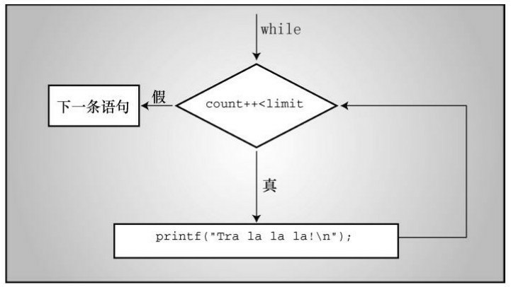
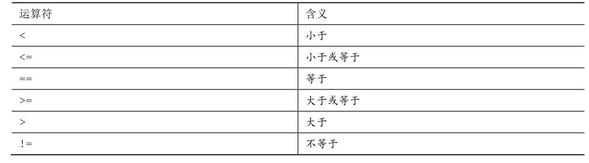
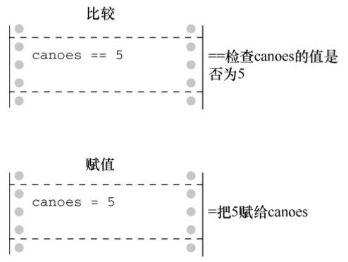
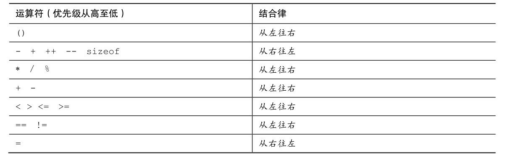
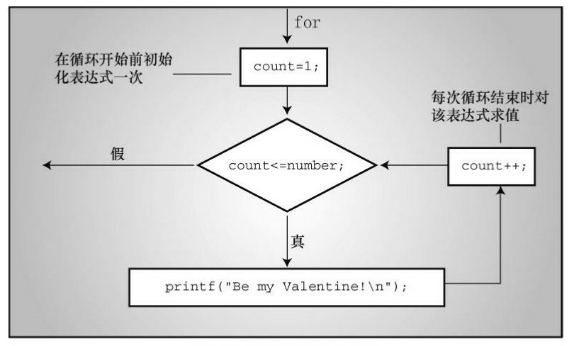
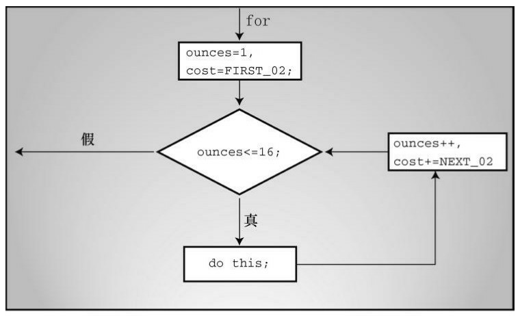
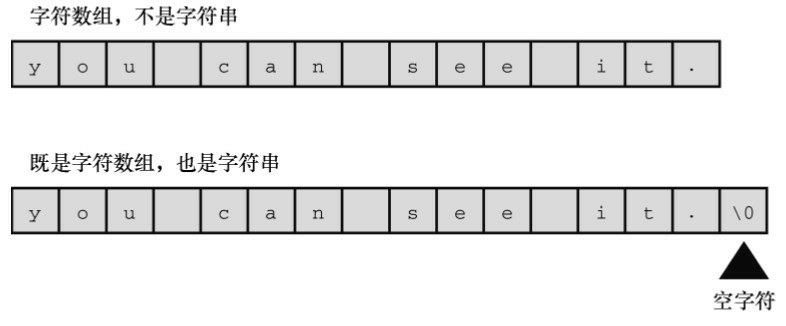
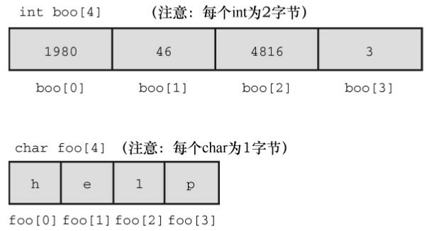

# 第6章 C控制语句：循环
本章介绍以下内容：

* 关键字：for、while、do while
* 运算符：<、>、>=、<=、!=、==、+=、*=、-=、/=、%=
* 函数：fabs()
* C语言有3种循环：for、while、do while
* 使用关系运算符构建控制循环的表达式
* 其他运算符
* 循环常用的数组
* 编写有返回值的函数

大多数人都希望自己是体格强健、天资聪颖、多才多艺的能人。虽然有时事与愿违，但至少我们用 C能写出这样的程序。诀窍是控制程序流。对于计算机科学（是研究计算机，不是用计算机做研究）而言，一门语言应该提供以下3种形式的程序流：

* 执行语句序列；
* 如果满足某些条件就重复执行语句序列（循环）；
* 通过测试选择执行哪一个语句序列（分支）；

读者对第一种形式应该很熟悉，前面学过的程序中大部分都是由语句序列组成。while循环属于第二种形式。本章将详细讲解while循环和其他两种循环：for和do while。第三种形式用于在不同的执行方案之间进行选择，让程序更“智能”，且极大地提高了计算机的用途。不过，要等到下一章才介绍这部分的内容。本章还将介绍数组，可以把新学的知识应用在数组上。另外，本章还将继续介绍函数的相关内容。首先，我们从while循环开始学习。

## 6.1 再探while循环
经过上一章的学习，读者已经熟悉了 while 循环。这里，我们用一个程序来回顾一下，程序清单 6.1根据用户从键盘输入的整数进行求和。程序利用了scanf()的返回值来结束循环。

程序清单6.1 summing.c程序
```c
/* summing.c -- 根据用户键入的整数求和 */
#include <stdio.h>
int main(void)
{
    long num;
    long sum = 0L;     /* 把sum初始化为0 */
    int status;
    printf("Please enter an integer to be summed ");
    printf("(q to quit): ");
    status = scanf("%ld", &num);
    while (status == 1)  /* == 的意思是“等于” */
    {
        sum = sum + num;
        printf("Please enter next integer (q to quit): ");
        status = scanf("%ld", &num);
    }
    printf("Those integers sum to %ld.\n", sum);
    return 0;
}
```

该程序使用long类型以储存更大的整数。尽管C编译器会把0自动转换为合适的类型，但是为了保持程序的一致性，我们把sum初始化为0L（long类型的0），而不是0（int类型的0）。

该程序的运行示例如下：
```c
Please enter an integer to be summed (q to quit): 44
Please enter next integer (q to quit): 33
Please enter next integer (q to quit): 88
Please enter next integer (q to quit): 121
Please enter next integer (q to quit): q
Those integers sum to 286.
```

### 6.1.1 程序注释
先看while循环，该循环的测试条件是如下表达式：
```c
status == 1
```

==运算符是C的相等运算符（equality operator），该表达式判断status是否等于1。不要把status== 1与status = 1混淆，后者是把1赋给status。根据测试条件status == 1，只要status等于1，循环就会重复。每次循环，num的当前值都被加到sum上，这样sum的值始终是当前整数之和。当status的值不为1时，循环结束。然后程序打印sum的最终值。

要让程序正常运行，每次循环都要获取num的一个新值，并重置status。程序利用scanf()的两个不同的特性来完成。首先，使用scanf()读取num的一个新值；然后，检查scanf()的返回值判断是否成功获取值。第4章中介绍过，scanf()返回成功读取项的数量。如果scanf()成功读取一个整数，就把该数存入num并返回1，随后返回值将被赋给status（注意，用户输入的值储存在num中，不是status中）。这样做同时更新了num和status的值，while循环进入下一次迭代。如果用户输入的不是数字（如， q），scanf()会读取失败并返回0。此时，status的值就是0，循环结束。因为输入的字符q不是数字，所以它会被放回输入队列中（实际上，不仅仅是 q，任何非数值的数据都会导致循环终止，但是提示用户输入q退出程序比提示用户输入一个非数字字符要简单）。

如果 scanf()在转换值之前出了问题（例如，检测到文件结尾或遇到硬件问题），会返回一个特殊值EOF（其值通常被定义为-1）。这个值也会引起循环终止。

如何告诉循环何时停止？该程序利用 scanf()的双重特性避免了在循环中交互输入时的这个棘手的问题。例如，假设scanf()没有返回值，那么每次循环只会改变num的值。虽然可以使用num的值来结束循环，比如把num > 0（num大于0）或num ！= 0（num不等于0）作为测试条件，但是这样用户就不能输入某些值，如-3或0。也可以在循环中添加代码，例如每次循环时询问用户“是否继续循环？<y/n>”，然后判断用户是否输入y。这个方法有些笨拙，而且还减慢了输入的速度。使用scanf()的返回值，轻松地避免了这些问题。

现在，我们来看看该程序的结构。总结如下：

* 把sum初始化为0
* 提示用户输入数据
* 读取用户输入的数据
* 当输入的数据为整数时，
* 输入添加给sum，
* 提示用户进行输入，
* 然后读取下一个输入
* 输入完成后，打印sum的值

顺带一提，这叫作伪代码（pseudocode），是一种用简单的句子表示程序思路的方法，它与计算机语言的形式相对应。伪代码有助于设计程序的逻辑。确定程序的逻辑无误之后，再把伪代码翻译成实际的编程代码。使用伪代码的好处之一是，可以把注意力集中在程序的组织和逻辑上，不用在设计程序时还要分心如何用编程语言来表达自己的想法。例如，可以用缩进来代表一块代码，不用考虑C的语法要用花括号把这部分代码括起来。

总之，因为while循环是入口条件循环，程序在进入循环体之前必须获取输入的数据并检查status的值，所以在 while 前面要有一个 scanf()。要让循环继续执行，在循环内需要一个读取数据的语句，这样程序才能获取下一个status的值，所以在while循环末尾还要有一个scanf()，它为下一次迭代做好了准备。可以把下面的伪代码作为while循环的标准格式：

* 获得第1个用于测试的值
* 当测试为真时
* 处理值
* 获取下一个值

### 6.1.2 C风格读取循环
根据伪代码的设计思路，程序清单6.1可以用Pascal、BASIC或FORTRAN来编写。但是C更为简洁，下面的代码：
```c
status = scanf("%ld", &num);
while (status == 1)
{
    /* 循环行为 */
    status = scanf("%ld", &num);
}
```

可以用这些代码替换：
```c
while (scanf("%ld", &num) == 1)
{
    /*循环行为*/
}
```

第二种形式同时使用scanf()的两种不同的特性。首先，如果函数调用成功，scanf()会把一个值存入num。然后，利用scanf()的返回值（0或1，不是num的值）控制while循环。因为每次迭代都会判断循环的条件，所以每次迭代都要调用scanf()读取新的num值来做判断。换句话说，C的语法特性让你可以用下面的精简版本替换标准版本：

* 当获取值和判断值都成功
* 处理该值

接下来，我们正式地学习while语句。

## 6.2 while语句
while循环的通用形式如下：
```c
while ( expression )
    statement
```

statement部分可以是以分号结尾的简单语句，也可以是用花括号括起来的复合语句。

到目前为止，程序示例中的expression部分都使用关系表达式。也就是说，expression是值之间的比较，可以使用任何表达式。如果expression为真（或者更一般地说，非零），执行 statement部分一次，然后再次判断expression。在expression为假（0）之前，循环的判断和执行一直重复进行。每次循环都被称为一次迭代（iteration），如图6.1所示。



### 6.2.1 终止while循环
while循环有一点非常重要：在构建while循环时，必须让测试表达式的值有变化，表达式最终要为假。否则，循环就不会终止（实际上，可以使用break和if语句来终止循环，但是你尚未学到）。考虑下面的例子：
```c
index = 1;
while (index < 5)
    printf("Good morning!\n");
```

上面的程序段将打印无数次Good morning。为什么？因为循环中index的值一直都是原来的值1，不曾变过。现在，考虑下面的程序段：
```c
index = 1;
while (--index < 5)
    printf("Good morning!\n");
```

这段程序也好不到哪里去。虽然改变了index的值，但是改错了！不过，这个版本至少在index减少到其类型到可容纳的最小负值并变成最大正值时会终止循环（第3章3.4.2节中的toobig.c程序解释过，最大正值加1一般会得到一个负值；类似地，最小负值减1一般会得到最大正值）。

### 6.2.2 何时终止循环
要明确一点：只有在对测试条件求值时，才决定是终止还是继续循环。例如，考虑程序清单6.2中的程序。

程序清单6.2 when.c程序
```c
// when.c -- 何时退出循环
#include <stdio.h>
int main(void)
{
    int n = 5;
    while (n < 7)           // 第7行
    {
        printf("n = %d\n", n);
        n++;              // 第10行
        printf("Now n = %d\n", n); // 第11行
    }
    printf("The loop has finished.\n");
    return 0;
}
```

运行程序清单6.2，输出如下：
```c
n = 5
Now n = 6
n = 6
Now n = 7
The loop has finished.
```

在第2次循环时，变量n在第10行首次获得值7。但是，此时程序并未退出，它结束本次循环（第11行），并在对第7行的测试条件求值时才退出循环（变量n在第1次判断时为5，第2次判断时为6）。

### 6.2.3 while：入口条件循环
while循环是使用入口条件的有条件循环。所谓“有条件”指的是语句部分的执行取决于测试表达式描述的条件，如(index < 5)。该表达式是一个入口条件（entry condition），因为必须满足条件才能进入循环体。在下面的情况中，就不会进入循环体，因为条件一开始就为假：
```c
index = 10;
while (index++ < 5)
    printf("Have a fair day or better.\n");
```

把第1行改为：
```c
index = 3;
```

就可以运行这个循环了。

### 6.2.4 语法要点
使用while时，要牢记一点：只有在测试条件后面的单独语句（简单语句或复合语句）才是循环部分。程序清单6.3演示了忽略这点的后果。缩进是为了让读者阅读方便，不是计算机的要求。

程序清单6.3 while1.c程序
```c
/* while1.c -- 注意花括号的使用 */
/* 糟糕的代码创建了一个无限循环 */
#include <stdio.h>
int main(void)
{
    int n = 0;
    while (n < 3)
        printf("n is %d\n", n);
    n++;
    printf("That's all this program does\n");
    return 0;
}
```

该程序的输出如下：
```c
n is 0
n is 0
n is 0
n is 0
n is 0
n is 0
n is 0
n is 0
n is 0
n is 0
n is 0
n is 0
n is 0
n is 0
n is 0
n is 0
...
```

屏幕上会一直输出以上内容，除非强行关闭这个程序。

虽然程序中缩进了n++;这条语句，但是并未把它和上一条语句括在花括号内。因此，只有直接跟在测试条件后面的一条语句是循环的一部分。变量n的值不会改变，条件n < 3一直为真。该循环会一直打印n is 0，除非强行关闭程序。这是一个无限循环（infinite loop）的例子，没有外部干涉就不会退出。

记住，即使while语句本身使用复合语句，在语句构成上，它也是一条单独的语句。该语句从while开始执行，到第1个分号结束。在使用了复合语句的情况下，到右花括号结束。

要注意放置分号的位置。例如，考虑程序清单6.4。

程序清单6.4 while2.c程序
```c
/* while2.c -- 注意分号的位置 */
#include <stdio.h>
int main(void)
{
    int n = 0;
    while (n++ < 3);      /* 第7行 */
        printf("n is %d\n", n); /* 第8行 */
    printf("That's all this program does.\n");
    return 0;
}
```

该程序的输出如下：
```c
n is 4
That's all this program does.
```

如前所述，循环在执行完测试条件后面的第 1 条语句（简单语句或复合语句）后进入下一轮迭代，直到测试条件为假才会结束。该程序中第7行的测试条件后面直接跟着一个分号，循环在此进入下一轮迭代，因为单独一个分号被视为一条语句。虽然n的值在每次循环时都递增1，但是第8行的语句不是循环的一部分，因此只会打印一次循环结束后的n值。

在该例中，测试条件后面的单独分号是空语句（null statement），它什么也不做。在C语言中，单独的分号表示空语句。有时，程序员会故意使用带空语句的while语句，因为所有的任务都在测试条件中完成了，不需要在循环体中做什么。例如，假设你想跳过输入到第1个非空白字符或数字，可以这样写：
```c
while (scanf("%d", &num) == 1)
    ; /* 跳过整数输入 */
```

只要scanf()读取一个整数，就会返回1，循环继续执行。注意，为了提高代码的可读性，应该让这个分号独占一行，不要直接把它放在测试表达式同行。这样做一方面让读者更容易看到空语句，一方面也提醒自己和读者空语句是有意而为之。处理这种情况更好的方法是使用下一章介绍的continue语句。

## 6.3 用关系运算符和表达式比较大小
while循环经常依赖测试表达式作比较，这样的表达式被称为关系表达式（relational expression），出现在关系表达式中间的运算符叫做关系运算符（relational operator）。前面的示例中已经用过一些关系运算符，表 6.1列出了 C 语言的所有关系运算符。该表也涵盖了所有的数值关系（数字之间的关系再复杂也没有人与人之间的关系复杂）。



关系运算符常用于构造while语句和其他C语句（稍后讨论）中用到的关系表达式。这些语句都会检查关系表达式为真还是为假。下面有3个互不相关的while语句，其中都包含关系表达式。
```c
while (number < 6)
{
    printf("Your number is too small.\n");
    scanf("%d", &number);
}

while (ch != '$')
{
    count++;
    scanf("%c", &ch);
}

while (scanf("%f", &num) == 1)
    sum = sum + num;
```

注意，第2个while语句的关系表达式还可用于比较字符。比较时使用的是机器字符码（假定为ASCII）。但是，不能用关系运算符比较字符串。第11章将介绍如何比较字符串。

虽然关系运算符也可用来比较浮点数，但是要注意：比较浮点数时，尽量只使用<和>。因为浮点数的舍入误差会导致在逻辑上应该相等的两数却不相等。例如，3乘以1/3的积是1.0。如果用把1/3表示成小数点后面6位数字，乘积则是.999999，不等于1。使用fabs()函数（声明在math.h头文件中）可以方便地比较浮点数，该函数返回一个浮点值的绝对值（即，没有代数符号的值）。例如，可以用类似程序清单6.5的方法来判断一个数是否接近预期结果。

程序清单6.5 cmpflt.c程序
```c
// cmpflt.c -- 浮点数比较
#include <math.h>
#include <stdio.h>
int main(void)
{
    const double ANSWER = 3.14159;
    double response;
    printf("What is the value of pi?\n");
    scanf("%lf", &response);
    while (fabs(response - ANSWER) > 0.0001)
    {
        printf("Try again!\n");
        scanf("%lf", &response);
    }
    printf("Close enough!\n");
    return 0;
}
```

循环会一直提示用户继续输入，除非用户输入的值与正确值之间相差0.0001：
```c
What is the value of pi?
3.14
Try again!
3.14159
Close enough!
```

### 6.3.1 什么是真
这是一个古老的问题，但是对C而言还不算难。在C中，表达式一定有一个值，关系表达式也不例外。程序清单6.6中的程序用于打印两个关系表达式的值，一个为真，一个为假。

程序清单6.6 t_and_f.c程序
```c
/* t_and_f.c -- C中的真和假的值 */
#include <stdio.h>
int main(void)
{
    int true_val, false_val;
    true_val = (10 > 2);    // 关系为真的值
    false_val = (10 == 2); // 关系为假的值
    printf("true = %d; false = %d \n", true_val, false_val);
    return 0;
}
```

程序清单6.6把两个关系表达式的值分别赋给两个变量，即把表达式为真的值赋给true_val，表达式为假的值赋给false_val。运行该程序后输出如下：
```c
true = 1; false = 0
```

原来如此！对C而言，表达式为真的值是1，表达式为假的值是0。一些C程序使用下面的循环结构，由于1为真，所以循环会一直进行。
```c
while (1)
{
    ...
}
```

### 6.3.2 其他真值
既然1或0可以作为while语句的测试表达式，是否还可以使用其他数字？如果可以，会发生什么？我们用程序清单6.7来做个实验。

程序清单6.7 truth.c程序
```c
// truth.c -- 哪些值为真
#include <stdio.h>
int main(void)
{
    int n = 3;
    while (n)
        printf("%2d is true\n", n--);
    printf("%2d is false\n", n);
    n = -3;
    while (n)
        printf("%2d is true\n", n++);
    printf("%2d is false\n", n);
    return 0;
}
```

该程序的输出如下：
```c
 3 is true
 2 is true
 1 is true
 0 is false
-3 is true
-2 is true
-1 is true
 0 is false
```

执行第1个循环时，n分别是3、2、1，当n等于0时，第1个循环结束。与此类似，执行第2个循环时，n分别是-3、-2和-1，当n等于0时，第2个循环结束。一般而言，所有的非零值都视为真，只有0被视为假。在C中，真的概念还真宽！

也可以说，只要测试条件的值为非零，就会执行 while 循环。这是从数值方面而不是从真/假方面来看测试条件。要牢记：关系表达式为真，求值得1；关系表达式为假，求值得0。因此，这些表达式实际上相当于数值。

许多C程序员都会很好地利用测试条件的这一特性。例如，用while(goats)替换while (goats !=0)，因为表达式goats != 0和goats都只有在goats的值为0时才为0或假。第1种形式（while (goats != 0)）对初学者而言可能比较清楚，但是第2种形式（while (goats)）才是C程序员最常用的。要想成为一名C程序员，应该多熟悉while (goats)这种形式。

### 6.3.3 真值的问题
C对真的概念约束太少会带来一些麻烦。例如，我们稍微修改一下程序清单6.1，修改后的程序如程序清单6.8所示。

程序清单6.8 trouble.c程序
```c
// trouble.c -- 误用=会导致无限循环
#include <stdio.h>
int main(void)
{
    long num;
    long sum = 0L;
    int status;
    printf("Please enter an integer to be summed ");
    printf("(q to quit): ");
    status = scanf("%ld", &num);
    while (status = 1)
    {
        sum = sum + num;
        printf("Please enter next integer (q to quit): ");
        status = scanf("%ld", &num);
    }
    printf("Those integers sum to %ld.\n", sum);
    return 0;
}
```

运行该程序，其输出如下：
```c
Please enter an integer to be summed (q to quit): 20
Please enter next integer (q to quit): 5
Please enter next integer (q to quit): 30
Please enter next integer (q to quit): q
Please enter next integer (q to quit):
Please enter next integer (q to quit):
Please enter next integer (q to quit):
Please enter next integer (q to quit):
```

（„„屏幕上会一直显示最后的提示内容，除非强行关闭程序。也许你根本不想运行这个示例。）

这个麻烦的程序示例改动了while循环的测试条件，把status == 1替换成status = 1。后者是一个赋值表达式语句，所以 status 的值为 1。而且，整个赋值表达式的值就是赋值运算符左侧的值，所以status = 1的值也是1。这里，while (status = 1)实际上相当于while (1)，也就是说，循环不会退出。虽然用户输入q，status被设置为0，但是循环的测试条件把status又重置为1，进入了下一次迭代。

读者可能不太理解，程序的循环一直运行着，用户在输入q后完全没机会继续输入。如果scanf()读取指定形式的输入失败，就把无法读取的输入留在输入队列中，供下次读取。当scanf()把q作为整数读取时失败了，它把 q留下。在下次循环时，scanf()从上次读取失败的地方（q）开始读取，scanf()把q作为整数读取，又失败了。因此，这样修改后不仅创建了一个无限循环，还创建了一个无限失败的循环，真让人沮丧。好在计算机觉察不出来。对计算机而言，无限地执行这些愚蠢的指令比成功预测未来10年的股市行情没什么两样。

不要在本应使用==的地方使用=。一些计算机语言（如，BASIC）用相同的符号表示赋值运算符和关系相等运算符，但是这两个运算符完全不同（见图 6.2）。赋值运算符把一个值赋给它左侧的变量；而关系相等运算符检查它左侧和右侧的值是否相等，不会改变左侧变量的值（如果左侧是一个变量）。



示例如下：
```c
canoes = 5                      <- 把5赋值给canoes
canoes == 5                     <- 检查canoes的值是否为5
```

要注意使用正确的运算符。编译器不会检查出你使用了错误的形式，得出也不是预期的结果（误用=的人实在太多了，以至于现在大多数编译器都会给出警告，提醒用户是否要这样做）。如果待比较的一个值是常量，可以把该常量放在左侧有助于编译器捕获错误：
```c
5 = canoes                      <- 语法错误
5 == canoes                     <- 检查canoes的值是否为5
```

可以这样做是因为C语言不允许给常量赋值，编译器会把赋值运算符的这种用法作为语法错误标记出来。许多经验丰富的程序员在构建比较是否相等的表达式时，都习惯把常量放在左侧。

总之，关系运算符用于构成关系表达式。关系表达式为真时值为1，为假时值为0。通常用关系表达式作为测试条件的语句（如while和if）可以使用任何表达式作为测试条件，非零为真，零为假。

### 6.3.4 新的_Bool类型
在C语言中，一直用int类型的变量表示真/假值。C99专门针对这种类型的变量新增了_Bool类型。该类型是以英国数学家George Boole的名字命名的，他开发了用代数表示逻辑和解决逻辑问题。在编程中，表示真或假的变量被称为布尔变量（Boolean variable），所以_Bool是C语言中布尔变量的类型名。_Bool类型的变量只能储存1（真）或0（假）。如果把其他非零数值赋给_Bool类型的变量，该变量会被设置为1。这反映了C把所有的非零值都视为真。

程序清单6.9修改了程序清单6.8中的测试条件，把int类型的变量status替换为_Bool类型的变量input_is_good。给布尔变量取一个能表示真或假值的变量名是一种常见的做法。

程序清单6.9 boolean.c程序
```c
// boolean.c -- 使用_Bool类型的变量 variable
#include <stdio.h>
#include <stdbool.h>
int main(void)
{
    long num;
    long sum = 0L;
    _Bool input_is_good;
    printf("Please enter an integer to be summed ");
    printf("(q to quit): ");
    input_is_good = (scanf("%ld", &num) == 1);
    while (input_is_good)
    {
        sum = sum + num;
        printf("Please enter next integer (q to quit): ");
        input_is_good = (scanf("%ld", &num) == 1);
    }
    printf("Those integers sum to %ld.\n", sum);
    return 0;
}
```

注意程序中把比较的结果赋值给_Bool类型的变量input_is_good：
```c
input_is_good = (scanf("%ld", &num) == 1);
```

这样做没问题，因为==运算符返回的值不是1就是0。顺带一提，从优先级方面考虑的话，并不需要用圆括号把 `scanf("%ld", &num) == 1` 括起来。但是，这样做可以提高代码可读性。还要注意，如何为变量命名才能让while循环的测试简单易懂：
```c
while (input_is_good)
```

C99提供了stdbool.h头文件，该头文件让bool成为_Bool的别名，而且还把true和false分别定义为1和0的符号常量。包含该头文件后，写出的代码可以与C++兼容，因为C++把bool、true和false定义为关键字。

如果系统不支持_Bool类型，导致无法运行该程序，可以把_Bool替换成int即可。

### 6.3.5 优先级和关系运算符
关系运算符的优先级比算术运算符（包括+和-）低，比赋值运算符高。这意味着x > y + 2和x > (y+ 2)相同，x = y > 2和x = (y > 2)相同。换言之，如果y大于2，则给x赋值1，否则赋值0。y的值不会赋给x。

关系运算符比赋值运算符的优先级高，因此，x_bigger = x > y;相当于x_bigger = (x > y);。

关系运算符之间有两种不同的优先级。

* 高优先级组： <<= >>=
* 低优先级组： == !=

与其他大多数运算符一样，关系运算符的结合律也是从左往右。因此：

ex != wye == zee与(ex != wye) == zee相同

首先，C判断ex与wye是否相等；然后，用得出的值1或0（真或假）再与zee比较。我们并不推荐这样写，但是在这里有必要说明一下。

表6.2列出了目前我们学过的运算符的性质。附录B的参考资料II“C运算符”中列出了全部运算符的完整优先级表。



小结：while语句

关键字：while

一般注解：

while语句创建了一个循环，重复执行直到测试表达式为假或0。while语句是一种入口条件循环，也就是说，在执行多次循环之前已决定是否执行循环。因此，循环有可能不被执行。循环体可以是简单语句，也可以是复合语句。

形式：
```c
while ( expression )
    statement
```

在expression部分为假或0之前，重复执行statement部分。

示例：
```c
while (n++ < 100)
    printf(" %d %d\n",n, 2 * n + 1); // 简单语句

while (fargo < 1000)
{   // 复合语句
    fargo = fargo + step;
    step = 2 * step;
}
```

小结：关系运算符和表达式

关系运算符：

每个关系运算符都把它左侧的值和右侧的值进行比较。

* <      小于
* <=     小于或等于
* ==     等于
* >=     大于或等于
* >      大于
* !=     不等于

关系表达式：

简单的关系表达式由关系运算符及其运算对象组成。如果关系为真，关系表达式的值为 1；如果关系为假，关系表达式的值为0。

示例：

5 > 2为真，关系表达式的值为1

(2 + a) == a 为假，关系表达式的值为0

## 6.4 不确定循环和计数循环
一些while循环是不确定循环（indefinite loop）。所谓不确定循环，指在测试表达式为假之前，预先不知道要执行多少次循环。例如，程序清单6.1通过与用户交互获得数据来计算整数之和。我们事先并不知道用户会输入什么整数。另外，还有一类是计数循环（counting loop）。这类循环在执行循环之前就知道要重复执行多少次。程序清单6.10就是一个简单的计数循环。

程序清单6.10 sweetie1.c程序
```c
// sweetie1.c -- 一个计数循环
#include <stdio.h>
int main(void)
{
    const int NUMBER = 22;
    int count = 1;             // 初始化
    while (count <= NUMBER)        // 测试
    {
        printf("Be my Valentine!\n");  // 行为
        count++;              // 更新计数
    }
    return 0;
}
```

虽然程序清单6.10运行情况良好，但是定义循环的行为并未组织在一起，程序的编排并不是很理想。我们来仔细分析一下。

在创建一个重复执行固定次数的循环中涉及了3个行为：

* 1.必须初始化计数器；
* 2.计数器与有限的值作比较；
* 3.每次循环时递增计数器。

while循环的测试条件执行比较，递增运算符执行递增。程序清单6.10中，递增发生在循环的末尾，这可以防止不小心漏掉递增。因此，这样做比将测试和更新组合放在一起（即使用count++ <= NUMBER）要好，但是计数器的初始化放在循环外，就有可能忘记初始化。实践告诉我们可能会发生的事情终究会发生，所以我们来学习另一种控制语句，可以避免这些问题。

## 6.5 for循环
for循环把上述3个行为（初始化、测试和更新）组合在一处。程序清单6.11使用for循环修改了程序清单6.10的程序。

程序清单6.11 sweetie2.c程序
```c
// sweetie2.c -- 使用for循环的计数循环
#include <stdio.h>
int main(void)
{
    const int NUMBER = 22;
    int count;
    for (count = 1; count <= NUMBER; count++)
        printf("Be my Valentine!\n");
    return 0;
}
```

关键字for后面的圆括号中有3个表达式，分别用两个分号隔开。第1个表达式是初始化，只会在for循环开始时执行一次。第 2 个表达式是测试条件，在执行循环之前对表达式求值。如果表达式为假（本例中，count大于NUMBER时），循环结束。第3个表达式执行更新，在每次循环结束时求值。程序清单6.10用这个表达式递增count 的值，更新计数。完整的for语句还包括后面的简单语句或复合语句。for圆括号中的表达式也叫做控制表达式，它们都是完整表达式，所以每个表达式的副作用（如，递增变量）都发生在对下一个表达式求值之前。图6.3演示了for循环的结构。



程序清单6.12 for_cube.c程序
```c
/* for_cube.c -- 使用for循环创建一个立方表 */
#include <stdio.h>
int main(void)
{
    int num;
    printf("   n  n cubed\n");
    for (num = 1; num <= 6; num++)
        printf("%5d %5d\n", num, num*num*num);
    return 0;
}
```

程序清单6.12打印整数1～6及其对应的立方，该程序的输出如下：
```c
   n  n cubed
    1     1
    2     8
    3    27
    4    64
    5   125
    6   216
```

for循环的第1行包含了循环所需的所有信息：num的初值，num的[终值](#终值)和每次循环num的增量。

### 6.5.1 利用for的灵活性
虽然for循环看上去和FORTRAN的DO循环、Pascal的FOR循环、BASIC的FOR...NEXT循环类似，但是for循环比这些循环灵活。这些灵活性源于如何使用for循环中的3个表达式。以前面程序示例中的for循环为例，第1个表达式给计数器赋初值，第2个表达式表示计数器的范围，第3个表达式递增计数器。这样使用for循环确实很像其他语言的循环。除此之外，for循环还有其他9种用法。

可以使用递减运算符来递减计数器：
```c
/* for_down.c */
#include <stdio.h>
int main(void)
{
    int secs;
    for (secs = 5; secs > 0; secs--)
        printf("%d seconds!\n", secs);
    printf("We have ignition!\n");
    return 0;
}
```

该程序输出如下：
```c
5 seconds!
4 seconds!
3 seconds!
2 seconds!
1 seconds!
We have ignition!
```

可以让计数器递增2、10等：
```c
/* for_13s.c */
#include <stdio.h>
int main(void)
{
    int n; // 从2开始，每次递增13
    for (n = 2; n < 60; n = n + 13)
        printf("%d \n", n);
    return 0;
}
```

每次循环n递增13，程序的输出如下：
```c
2
15
28
41
54
```

可以用字符代替数字计数：
```c
/* for_char.c */
#include <stdio.h>
int main(void)
{
    char ch;
    for (ch = 'a'; ch <= 'z'; ch++)
        printf("The ASCII value for %c is %d.\n", ch, ch);
    return 0;
}
```

该程序假定系统用ASCII码表示字符。由于篇幅有限，省略了大部分输出：
```c
The ASCII value for a is 97.
The ASCII value for b is 98.
......
The ASCII value for x is 120.
The ASCII value for y is 121.
The ASCII value for z is 122.
```

该程序能正常运行是因为字符在内部是以整数形式储存的，因此该循环实际上仍是用整数来计数。

除了测试迭代次数外，还可以测试其他条件。在for_cube程序中，可以把：
```c
for (num = 1; num <= 6; num++)
```

替换成：
```c
for (num = 1; num*num*num <= 216; num++)
```

如果与控制循环次数相比，你更关心限制立方的大小，就可以使用这样的测试条件。

可以让递增的量几何增长，而不是算术增长。也就是说，每次都乘上而不是加上一个固定的量：
```c
/* for_geo.c */
#include <stdio.h>
int main(void)
{
    double debt;
    for (debt = 100.0; debt < 150.0; debt = debt * 1.1)
        printf("Your debt is now $%.2f.\n", debt);
    return 0;
}
```

该程序中，每次循环都把debt乘以1.1，即debt的值每次都增加10%，其输出如下：
```c
Your debt is now $100.00.
Your debt is now $110.00.
Your debt is now $121.00.
Your debt is now $133.10.
Your debt is now $146.41.
```

第3个表达式可以使用任意合法的表达式。无论是什么表达式，每次迭代都会更新该表达式的值。
```c
/* for_wild.c */
#include <stdio.h>
int main(void)
{
    int x;
    int y = 55;
    for (x = 1; y <= 75; y = (++x * 5) + 50)
        printf("%10d %10d\n", x, y);
    return 0;
}
```

该循环打印x的值和表达式++x * 5 + 50的值，程序的输出如下：
```c
         1         55
         2         60
         3         65
         4         70
         5         75
```

注意，测试涉及y，而不是x。for循环中的3个表达式可以是不同的变量（注意，虽然该例可以正常运行，但是编程风格不太好。如果不在更新部分加入代数计算，程序会更加清楚）。

可以省略一个或多个表达式（但是不能省略分号），只要在循环中包含能结束循环的语句即可。
```c
/* for_none.c */
#include <stdio.h>
int main(void)
{
    int ans, n;
    ans = 2;
    for (n = 3; ans <= 25;)
        ans = ans * n;
    printf("n = %d; ans = %d.\n", n, ans);
    return 0;
}
```

该程序的输出如下：
```c
n = 3; ans = 54.
```

该循环保持n的值为3。变量ans开始的值为2，然后递增到6和18，最终是54（18比25小，所以for循环进入下一次迭代，18乘以3得54）。顺带一提，省略第2个表达式被视为真，所以下面的循环会一直运行：
```c
for (; ; )
    printf("I want some action\n");
```

第1个表达式不一定是给变量赋初值，也可以使用printf()。记住，在执行循环的其他部分之前，只对第1个表达式求值一次或执行一次。
```c
/* for_show.c */
#include <stdio.h>
int main(void)
{
    int num = 0;
    for (printf("Keep entering numbers!\n"); num != 6;)
        scanf("%d", &num);
    printf("That's the one I want!\n");
    return 0;
}
```

该程序打印第1行的句子一次，在用户输入6之前不断接受数字：
```c
Keep entering numbers!
3
5
8
6
That's the one I want!
```

循环体中的行为可以改变循环头中的表达式。例如，假设创建了下面的循环：
```c
for (n = 1; n < 10000; n = n + delta)
```

如果程序经过几次迭代后发现delta太小或太大，循环中的if语句（详见第7章）可以改变delta的大小。在交互式程序中，用户可以在循环运行时才改变 delta 的值。这样做也有危险的一面，例如，把delta设置为0就没用了。

总而言之，可以自己决定如何使用for循环头中的表达式，这使得在执行固定次数的循环外，还可以做更多的事情。接下来，我们将简要讨论一些运算符，使for循环更加有用。

小结：for语句

关键字：for

一般注解：

for语句使用3个表达式控制循环过程，分别用分号隔开。initialize表达式在执行for语句之前只执行一次；然后对test表达式求值，如果表达式为真（或非零），执行循环一次；接着对update表达式求值，并再次检查test表达式。for语句是一种入口条件循环，即在执行循环之前就决定了是否执行循环。因此，for循环可能一次都不执行。statement部分可以是一条简单语句或复合语句。

形式：
```c
for ( initialize; test; update )
    statement
```

在test为假或0之前，重复执行statement部分。

示例：
```c
for (n = 0; n < 10 ; n++)
    printf(" %d %d\n", n, 2 * n + 1);
```

## 6.6 其他赋值运算符：+=、-=、*=、/=、%=
C有许多赋值运算符。最基本、最常用的是=，它把右侧表达式的值赋给左侧的变量。其他赋值运算符都用于更新变量，其用法都是左侧是一个变量名，右侧是一个表达式。赋给变量的新值是根据右侧表达式的值调整后的值。确切的调整方案取决于具体的运算符。例如：
```c
scores += 20   与   scores = scores + 20     相同
dimes -= 2     与   dimes = dimes - 2        相同
bunnies *= 2   与   bunnies = bunnies * 2    相同
time /= 2.73   与   time = time / 2.73       相同
reduce %= 3    与   reduce = reduce % 3      相同
```

上述所列的运算符右侧都使用了简单的数，还可以使用更复杂的表达式，例如：
```c
x *= 3 * y + 12 与 x = x * (3 * y + 12) 相同
```

以上提到的赋值运算符与=的优先级相同，即比+或*优先级低。上面最后一个例子也反映了赋值运算符的优先级，3 * y先与12相加，再把计算结果与x相乘，最后再把乘积赋给x。

并非一定要使用这些组合形式的赋值运算符。但是，它们让代码更紧凑，而且与一般形式相比，组合形式的赋值运算符生成的机器代码更高效。当需要在for循环中塞进一些复杂的表达式时，这些组合的赋值运算符特别有用。

## 6.7 逗号运算符
逗号运算符扩展了for循环的灵活性，以便在循环头中包含更多的表达式。例如，程序清单6.13演示了一个打印一类邮件资费（first-class postage rate）的程序（在撰写本书时，邮资为首重40美分/盎司，续重20美分/盎司，可以在互联网上查看当前邮资）。

程序清单6.13 postage.c程序
```c
// postage.c -- 一类邮资
#include <stdio.h>
int main(void)
{
    const int FIRST_OZ = 46;  // 2013邮资
    const int NEXT_OZ = 20;   // 2013邮资
    int ounces, cost;
    printf(" ounces  cost\n");
    for (ounces = 1, cost = FIRST_OZ; ounces <= 16; ounces++,cost += NEXT_OZ)
        printf("%5d  $%4.2f\n", ounces, cost / 100.0);
    return 0;
}
```

该程序的前5行输出如下：
```c
 ounces  cost
    1  $0.46
    2  $0.66
    3  $0.86
    4  $1.06
```

该程序在初始化表达式和更新表达式中使用了逗号运算符。初始化表达式中的逗号使ounces和cost都进行了初始化，更新表达式中的逗号使每次迭代ounces递增1、cost递增20（NEXT_Z的值是20）。绝大多数计算都在for循环头中进行（见图6.4）。

逗号运算符并不局限于在for循环中使用，但是这是它最常用的地方。逗号运算符有两个其他性质。首先，它保证了被它分隔的表达式从左往右求值（换言之，逗号是一个序列点，所以逗号左侧项的所有副作用都在程序执行逗号右侧项之前发生）。因此，ounces在cost之前被初始化。在该例中，顺序并不重要，但是如果cost的表达式中包含了ounces时，顺序就很重要。例如，假设有下面的表达式：
```c
ounces++, cost = ounces * FIRST_OZ
```

在该表达式中，先递增ounce，然后在第2个子表达式中使用ounce的新值。作为序列点的逗号保证了左侧子表达式的副作用在对右侧子表达式求值之前发生。



其次，整个逗号表达式的值是右侧项的值。例如，下面语句 `x = (y = 3, (z = ++y + 2) + 5);`的效果是：先把3赋给y，递增y为4，然后把4加2之和（6）赋给z，接着加上5，最后把结果11赋给 x。至于为什么有人编写这样的代码，在此不做评价。另一方面，假设在写数字时不小心输入了逗号：
```c
houseprice = 249,500;
```

这不是语法错误，C 编译器会将其解释为一个逗号表达式，即houseprice = 249 是逗号左侧的子表达式，500 是右侧的子表达式。因此，整个逗号表达式的值是逗号右侧表达式的值，而且左侧的赋值表达式把249赋给变量houseprice。因此，这与下面代码的效果相同：
```c
houseprice = 249;
500;
```

记住，任何表达式后面加上一个分号就成了表达式语句。所以，500;也是一条语句，但是什么也不做。

另外，下面的语句
```c
houseprice = (249,500);
```

赋给houseprice的值是逗号右侧子表达式的值，即500。

逗号也可用作分隔符。在下面语句中的逗号都是分隔符，不是逗号运算符：
```c
char ch, date;
printf("%d %d\n", chimps, chumps);
```

小结：新的运算符

赋值运算符：

下面的运算符用右侧的值，根据指定的操作更新左侧的变量：
```c
+=  把右侧的值加到左侧的变量上
-=  从左侧的变量中减去右侧的值
*=  把左侧的变量乘以右侧的值
/=  把左侧的变量除以右侧的值
%=  左侧变量除以右侧值得到的余数
```

示例：
```c
rabbits *= 1.6;与rabbits = rabbits * 1.6;相同
```

这些组合赋值运算符与普通赋值运算符的优先级相同，都比算术运算符的优先级低。因此，
```c
contents *= old_rate + 1.2;
```

最终的效果与下面的语句相同：
```c
contents = contents * (old_rate + 1.2);
```

逗号运算符：

逗号运算符把两个表达式连接成一个表达式，并保证最左边的表达式最先求值。逗号运算符通常在for循环头的表达式中用于包含更多的信息。整个逗号表达式的值是逗号右侧表达式的值。

示例：
```c
for (step = 2, fargo = 0; fargo < 1000; step *= 2)
    fargo += step;
```

### 6.7.1 当Zeno遇到for循环
接下来，我们看看 for 循环和逗号运算符如何解决古老的悖论。希腊哲学家 Zeno 曾经提出箭永远不会达到它的目标。首先，他认为箭要到达目标距离的一半，然后再达到剩余距离的一半，然后继续到达剩余距离的一半，这样就无穷无尽。Zeno认为箭的飞行过程有无数个部分，所以要花费无数时间才能结束这一过程。不过，我们怀疑Zeno是自愿甘做靶子才会得出这样的结论。

我们采用一种定量的方法，假设箭用1秒钟走完一半的路程，然后用1/2秒走完剩余距离的一半，然后用1/4秒再走完剩余距离的一半，等等。可以用下面的无限序列来表示总时间：
```c
1 + 1/2 + 1/4 + 1/8 + 1/16 +....
```

程序清单6.14中的程序求出了序列前几项的和。变量power_of_two的值分别是1.0、2.0、4.0、8.0等。

程序清单6.14 zeno.c程序
```c
/* zeno.c -- 求序列的和 */
#include <stdio.h>
int main(void)
{
    int t_ct;    // 项计数
    double time, power_of_2;
    int limit;
    printf("Enter the number of terms you want: ");
    scanf("%d", &limit);
    for (time = 0, power_of_2 = 1, t_ct = 1; t_ct <= limit; t_ct++, power_of_2 *= 2.0)
    {
        time += 1.0 / power_of_2;
        printf("time = %f when terms = %d.\n", time, t_ct);
    }
    return 0;
}
```

下面是序列前15项的和：
```c
time = 1.000000 when terms = 1.
time = 1.500000 when terms = 2.
time = 1.750000 when terms = 3.
time = 1.875000 when terms = 4.
time = 1.937500 when terms = 5.
time = 1.968750 when terms = 6.
time = 1.984375 when terms = 7.
time = 1.992188 when terms = 8.
time = 1.996094 when terms = 9.
time = 1.998047 when terms = 10.
time = 1.999023 when terms = 11.
time = 1.999512 when terms = 12.
time = 1.999756 when terms = 13.
time = 1.999878 when terms = 14.
time = 1.999939 when terms = 15.
```

不难看出，尽管不断添加新的项，但是总和看起来变化不大。就像程序输出显示的那样，数学家的确证明了当项的数目接近无穷时，总和无限接近2.0。假设S表示总和，下面我们用数学的方法来证明一下：
```c
S = 1 + 1/2 + 1/4 + 1/8 + ...
```

这里的省略号表示“等等”。把S除以2得：
```c
S/2 = 1/2 + 1/4 + 1/8 + 1/16 + ...
```

第1个式子减去第2个式子得：
```c
S - S/2 = 1 +1/2 -1/2 + 1/4 -1/4 +...
```

除了第1个值为1，其他的值都是一正一负地成对出现，所以这些项都可以消去。只留下：
```c
S/2 = 1
```

然后，两侧同乘以2，得：
```c
S = 2
```

从这个示例中得到的启示是，在进行复杂的计算之前，先看看数学上是否有简单的方法可用。

程序本身是否有需要注意的地方？该程序演示了在表达式中可以使用多个逗号运算符，在for循环中，初始化了time、power_of_2和count。构建完循环条件之后，程序本身就很简短了。

## 6.8 出口条件循环：do while
while循环和for循环都是入口条件循环，即在循环的每次迭代之前检查测试条件，所以有可能根本不执行循环体中的内容。C语言还有出口条件循环（exit-condition loop），即在循环的每次迭代之后检查测试条件，这保证了至少执行循环体中的内容一次。这种循环被称为 do while循环。程序清单6.15 演示了一个示例。

程序清单6.15 do_while.c程序
```c
/* do_while.c -- 出口条件循环 */
#include <stdio.h>
int main(void)
{
    const int secret_code = 13;
    int code_entered;
    do
    {
        printf("To enter the triskaidekaphobia therapy club,\n");
        printf("please enter the secret code number: ");
        scanf("%d", &code_entered);
    } while (code_entered != secret_code);
    printf("Congratulations! You are cured!\n");
    return 0;
}
```

程序清单6.15在用户输入13之前不断提示用户输入数字。下面是一个运行示例：
```c
To enter the triskaidekaphobia therapy club,
please enter the secret code number: 12
To enter the triskaidekaphobia therapy club,
please enter the secret code number: 14
To enter the triskaidekaphobia therapy club,
please enter the secret code number: 13
Congratulations! You are cured!
```

使用while循环也能写出等价的程序，但是长一些，如程序清单6.16所示。

程序清单6.16 entry.c程序
```c
/* entry.c -- 出口条件循环 */
#include <stdio.h>
int main(void)
{
    const int secret_code = 13;
    int code_entered;
    printf("To enter the triskaidekaphobia therapy club,\n");
    printf("please enter the secret code number: ");
    scanf("%d", &code_entered);
    while (code_entered != secret_code)
    {
        printf("To enter the triskaidekaphobia therapy club,\n");
        printf("please enter the secret code number: ");
        scanf("%d", &code_entered);
    }
    printf("Congratulations! You are cured!\n");
    return 0;
}
```

下面是do while循环的通用形式：
```c
do
    statement
while ( expression );
```

statement可以是一条简单语句或复合语句。注意，do while循环以分号结尾，其结构见图6.5。

do while循环在执行完循环体后才执行测试条件，所以至少执行循环体一次；而for循环或while循环都是在执行循环体之前先执行测试条件。do while循环适用于那些至少要迭代一次的循环。例如，下面是一个包含do while循环的密码程序伪代码：


```c
do
{
    提示用户输入密码
    读取用户输入的密码
} while (用户输入的密码不等于密码);
```

避免使用这种形式的do while结构：
```c
do
{
    询问用户是否继续
    其他行为
} while (回答是yes);
```

这样的结构导致用户在回答“no”之后，仍然执行“其他行为”部分，因为测试条件执行晚了。

小结：do while语句

关键字：do while

一般注解：

do while 语句创建一个循环，在 expression 为假或 0 之前重复执行循环体中的内容。do while语句是一种出口条件循环，即在执行完循环体后才根据测试条件决定是否再次执行循环。因此，该循环至少必须执行一次。statement部分可是一条简单语句或复合语句。

形式：
```c
do
    statement
while ( expression );
```

在test为假或0之前，重复执行statement部分。

示例：
```c
do
    scanf("%d", &number);
while (number != 20);
```

## 6.9 如何选择循环
如何选择使用哪一种循环？首先，确定是需要入口条件循环还是出口条件循环。通常，入口条件循环用得比较多，有几个原因。其一，一般原则是在执行循环之前测试条件比较好。其二，测试放在循环的开头，程序的可读性更高。另外，在许多应用中，要求在一开始不满足测试条件时就直接跳过整个循环。

那么，假设需要一个入口条件循环，用for循环还是while循环？这取决于个人喜好，因为二者皆可。要让for循环看起来像while循环，可以省略第1个和第3个表达式。例如：
```c
for ( ; test ; )
```

与下面的while效果相同：
```c
while ( test )
```

要让while循环看起来像for循环，可以在while循环的前面初始化变量，并在while循环体中包含更新语句。例如：
```c
初始化;
while ( 测试 )
{
    其他语句
    更新语句
}
```

与下面的for循环效果相同：
```c
for ( 初始化 ;测试 ; 更新 )
    其他语句
```

一般而言，当循环涉及初始化和更新变量时，用for循环比较合适，而在其他情况下用while循环更好。对于下面这种条件，用while循环就很合适：
```c
while (scanf("%ld", &num) == 1)
```

对于涉及索引计数的循环，用for循环更适合。例如：
```c
for (count = 1; count <= 100; count++)
```

## 6.10 嵌套循环
嵌套循环（nested loop）指在一个循环内包含另一个循环。嵌套循环常用于按行和列显示数据，也就是说，一个循环处理一行中的所有列，另一个循环处理所有的行。程序清单6.17演示了一个简单的示例。

程序清单6.17 rows1.c程序
```c
/* rows1.c -- 使用嵌套循环 */
#include <stdio.h>
#define ROWS  6
#define CHARS 10
int main(void)
{
    int row;
    char ch;
    for (row = 0; row < ROWS; row++)         /* 第10行 */
    {
        for (ch = 'A'; ch < ('A' + CHARS); ch++)   /* 第12行 */
            printf("%c", ch);
        printf("\n");
    }
    return 0;
}
```

运行该程序后，输出如下：
```c
ABCDEFGHIJ
ABCDEFGHIJ
ABCDEFGHIJ
ABCDEFGHIJ
ABCDEFGHIJ
ABCDEFGHIJ
```

### 6.10.1 程序分析
第10行开始的for循环被称为外层循环（outer loop），第12行开始的for循环被称为内层循环（inner loop）。外层循环从row为0开始循环，到row为6时结束。因此，外层循环要执行6次，row的值从0变为5。每次迭代要执行的第1条语句是内层的for循环，该循环要执行10次，在同一行打印字符A～J；第2条语句是外层循环的printf("\n");，该语句的效果是另起一行，这样在下一次运行内层循环时，将在下一行打印的字符。

注意，嵌套循环中的内层循环在每次外层循环迭代时都执行完所有的循环。在程序清单6.17中，内层循环一行打印10个字符，外层循环创建6行。

### 6.10.2 嵌套变式
上一个实例中，内层循环和外层循环所做的事情相同。可以通过外层循环控制内层循环，在每次外层循环迭代时内层循环完成不同的任务。把程序清单6.17稍微修改后，如程序清单6.18所示。内层循环开始打印的字符取决于外层循环的迭代次数。该程序的第 1 行使用了新的注释风格，而且用const 关键字代替#define，有助于读者熟悉这两种方法。

程序清单6.18 rows2.c程序
```c
// rows2.c -- 依赖外部循环的嵌套循环
#include <stdio.h>
int main(void)
{
    const int ROWS = 6;
    const int CHARS = 6;
    int row;
    char ch;
    for (row = 0; row < ROWS; row++)
    {
        for (ch = ('A' + row); ch < ('A' + CHARS); ch++)
            printf("%c", ch);
        printf("\n");
    }
    return 0;
}
```

该程序的输出如下：
```c
ABCDEF
BCDEF
CDEF
DEF
EF
F
```

因为每次迭代都要把row的值与‘A’相加，所以ch在每一行都被初始化为不同的字符。然而，测试条件并没有改变，所以每行依然是以F结尾，这使得每一行打印的字符都比上一行少一个。

## 6.11 数组简介
在许多程序中，数组很重要。数组可以作为一种储存多个相关项的便利方式。我们在第10章中将详细介绍数组，但是由于循环经常用到数组，所以在这里先简要地介绍一下。

数组（array）是按顺序储存的一系列类型相同的值，如10个char类型的字符或15个int类型的值。整个数组有一个数组名，通过整数下标访问数组中单独的项或元素（element）。例如，以下声明：
```c
float debts[20];
```

声明debts是一个内含20个元素的数组，每个元素都可以储存float类型的值。数组的第1个元素是debts[0]，第2个元素是debts[1]，以此类推，直到debts[19]。注意，数组元素的编号从0开始，不是从1开始。可以给每个元素赋float类型的值。例如，可以这样写：
```c
debts[5] = 32.54;
debts[6] = 1.2e+21;
```

实际上，使用数组元素和使用同类型的变量一样。例如，可以这样把值读入指定的元素中：
```c
scanf("%f", &debts[4]); // 把一个值读入数组的第5个元素
```

这里要注意一个潜在的陷阱：考虑到影响执行的速度，C 编译器不会检查数组的下标是否正确。下面的代码，都不正确：
```c
debts[20] = 88.32;   // 该数组元素不存在
debts[33] = 828.12;  // 该数组元素不存在
```

编译器不会查找这样的错误。当运行程序时，这会导致数据被放置在已被其他数据占用的地方，可能会破坏程序的结果甚至导致程序异常中断。

数组的类型可以是任意数据类型。
```c
int nannies[22]; /* 可储存22个int类型整数的数组 */
char actors[26]; /* 可储存26个字符的数组 */
long big[500];   /* 可储存500个long类型整数的数组 */
```

我们在第4章中讨论过字符串，可以把字符串储存在char类型的数组中（一般而言，char类型数组的所有元素都储存char类型的值）。如果char类型的数组末尾包含一个表示字符串末尾的空字符\0，则该数组中的内容就构成了一个字符串（见图6.6）。



用于识别数组元素的数字被称为下标（subscript）、索引（indice）或 偏移量（offset）。下标必须是整数，而且要从0开始计数。数组的元素被依次储存在内存中相邻的位置，如图6.7所示。



### 6.11.1 在for循环中使用数组
程序中有许多地方要用到数组，程序清单6.19是一个较为简单的例子。该程序读取10个高尔夫分数，稍后进行处理。使用数组，就不用创建10个不同的变量来储存10个高尔夫分数。而且，还可以用for循环来读取数据。程序打印总分、平均分、差点（handicap，它是平均分与标准分的差值）。

程序清单6.19 scores_in.c程序
```c
// scores_in.c -- 使用循环处理数组
#include <stdio.h>
#define SIZE 10
#define PAR 72
int main(void)
{
    int index, score[SIZE];
    int sum = 0;
    float average;
    printf("Enter %d golf scores:\n", SIZE);
    for (index = 0; index < SIZE; index++)
        scanf("%d", &score[index]);   // 读取10个分数
    printf("The scores read in are as follows:\n");
    for (index = 0; index < SIZE; index++)
        printf("%5d", score[index]);  // 验证输入
    printf("\n");
    for (index = 0; index < SIZE; index++)
        sum += score[index];       // 求总分数
    average = (float) sum / SIZE;    // 求平均分
    printf("Sum of scores = %d, average = %.2f\n", sum,  average);
    printf("That's a handicap of %.0f.\n", average - PAR);
    return 0;
}
```

先看看程序清单6.19是否能正常工作，接下来再做一些解释。下面是程序的输出：
```c
Enter 10 golf scores:
99 95 109 105 100
96 98 93 99 97 98
The scores read in are as follows:
   99   95  109  105  100   96   98   93   99   97
Sum of scores = 991, average = 99.10
That's a handicap of 27.
```

程序运行没问题，我们来仔细分析一下。首先，注意程序示例虽然打印了11个数字，但是只读入了10个数字，因为循环只读了10个值。由于scanf()会跳过空白字符，所以可以在一行输入10个数字，也可以每行只输入一个数字，或者像本例这样混合使用空格和换行符隔开每个数字（因为输入是缓冲的，只有当用户键入Enter键后数字才会被发送给程序）。

然后，程序使用数组和循环处理数据，这比使用10个单独的scanf()语句和10个单独的printf()语句读取10个分数方便得多。for循环提供了一个简单直接的方法来使用数组下标。注意，int类型数组元素的用法与int类型变量的用法类似。要读取int类型变量fue，应这样写 `scanf("%d", &fue)` 。程序清单6.19中要读取int类型的元素 `score[index]` ，所以这样写 `scanf("%d", &score[index]);` 。

该程序示例演示了一些较好的编程风格。第一，用#define 指令创建的明示常量（SIZE）来指定数组的大小。这样就可以在定义数组和设置循环边界时使用该明示常量。如果以后要扩展程序处理20个分数，只需简单地把SIZE重新定义为20即可，不用逐一修改程序中使用了数组大小的每一处。

第二，下面的代码可以很方便地处理一个大小为SIZE的数组：
```c
for (index = 0; index < SIZE; index++)
```

设置正确的数组边界很重要。第1个元素的下标是0，因此循环开始时把index设置为0。因为从0开始编号，所以数组中最后一个元素的下标是SIZE - 1。也就是说，第10个元素是score[9]。通过测试条件index < SIZE来控制循环中使用的最后一个index的值是SIZE - 1。

第三，程序能重复显示刚读入的数据。这是很好的编程习惯，有助于确保程序处理的数据与期望相符。

最后，注意该程序使用了3个独立的for循环。这是否必要？是否可以将其合并成一个循环？当然可以，读者可以动手试试，合并后的程序显得更加紧凑。但是，调整时要注意遵循模块化（modularity）的原则。模块化隐含的思想是：应该把程序划分为一些独立的单元，每个单元执行一个任务。这样做提高了程序的可读性。也许更重要的是，模块化使程序的不同部分彼此独立，方便后续更新或修改程序。在掌握如何使用函数后，可以把每个执行任务的单元放进函数中，提高程序的模块化。

## 6.12 使用函数返回值的循环示例
本章最后一个程序示例要用一个函数计算数的整数次幂（math.h库提供了一个更强大幂函数pow()，可以使用浮点指数）。该示例有3个主要任务：设计算法、在函数中表示算法并返回计算结果、提供一个测试函数的便利方法。

首先分析算法。为简化函数，我们规定该函数只处理正整数的幂。这样，把n与n相乘p次便可计算n的p次幂。这里自然会用到循环。先把变量pow设置为1，然后将其反复乘以n：
```c
for(i = 1; i <= p; i++)
    pow *= n;
```

回忆一下，*=运算符把左侧的项乘以右侧的项，再把乘积赋给左侧的项。第1次循环后，pow的值是1乘以n，即n；第2次循环后，pow的值是上一次的值（n）乘以n，即n的平方；以此类推。这种情况使用for循环很合适，因为在执行循环之前已预先知道了迭代的次数（已知p）。

现在算法已确定，接下来要决定使用何种数据类型。指数p是整数，其类型应该是int。为了扩大n及其幂的范围，n和pow的类型都是double。

接下来，考虑如何把以上内容用函数来实现。要使用两个参数（分别是double类型和int类型）才能把所需的信息传递给函数，并指定求哪个数的多少次幂。而且，函数要返回一个值。如何把函数的返回值返回给主调函数？编写一个有返回值的函数，要完成以下内容：

1. 定义函数时，确定函数的返回类型；
2. 使用关键字return表明待返回的值。

例如，可以这样写：
```c
double power(double n, int p) // 返回一个double类型的值
{
    double pow = 1;
    int i;
    for (i = 1; i <= p; i++)
        pow *= n;
    return pow; // 返回pow的值
}
```

要声明函数的返回类型，在函数名前写出类型即可，就像声明一个变量那样。关键字 return 表明该函数将把它后面的值返回给主调函数。根据上面的代码，函数返回一个变量的值。返回值也可以是表达式的值，如下所示：
```c
return 2 * x + b;
```

函数将计算表达式的值，并返回该值。在主调函数中，可以把返回值赋给另一个变量、作为表达式中的值、作为另一个函数的参数（如，`printf("%f", power(6.28, 3)` )，或者忽略它。

现在，我们在一个程序中使用这个函数。要测试一个函数很简单，只需给它提供几个值，看它是如何响应的。这种情况下可以创建一个输入循环，选择 while 循环很合适。可以使用 scanf()函数一次读取两个值。如果成功读取两个值，scanf()则返回2，所以可以把scanf()的返回值与2作比较来控制循环。还要注意，必须先声明power()函数（即写出函数原型）才能在程序中使用它，就像先声明变量再使用一样。程序清单6.20演示了这个程序。

程序清单6.20 powwer.c程序
```c
// power.c -- 计算数的整数幂
#include <stdio.h>
double power(double n, int p); // ANSI函数原型
int main(void)
{
    double x, xpow;
    int exp;
    printf("Enter a number and the positive integer power");
    printf(" to which\nthe number will be raised. Enter q");
    printf(" to quit.\n");
    while (scanf("%lf%d", &x, &exp) == 2)
    {
        xpow = power(x, exp); // 函数调用
        printf("%.3g to the power %d is %.5g\n", x, exp, xpow);
        printf("Enter next pair of numbers or q to quit.\n");
    }
    printf("Hope you enjoyed this power trip -- bye!\n");
    return 0;
}

double power(double n, int p)  // 函数定义
{
    double pow = 1;
    int i;
    for (i = 1; i <= p; i++)
        pow *= n;
    return pow;          // 返回pow的值
}
```

运行该程序后，输出示例如下：
```c
Enter a number and the positive integer power to which
the number will be raised. Enter q to quit.
1.2 12
1.2 to the power 12 is 8.9161
Enter next pair of numbers or q to quit.
2
16
2 to the power 16 is 65536
Enter next pair of numbers or q to quit.
q
Hope you enjoyed this power trip -- bye!
```

### 6.12.1 程序分析
该程序示例中的main()是一个驱动程序（driver），即被设计用来测试函数的小程序。

该例的while循环是前面讨论过的一般形式。输入1.2 12，scanf()成功读取两值，并返回2，循环继续。因为scanf()跳过空白，所以可以像输出示例那样，分多行输入。但是输入q会使scanf()的返回值为0，因为q与scanf()中的转换说明%1f不匹配。scanf()将返回0，循环结束。类似地，输入2.8 q会使scanf()的返回值为1，循环也会结束。

现在分析一下与函数相关的内容。powwer()函数在程序中出现了3次。首次出现是：
```c
double power(double n, int p); // ANSI函数原型
```

这是power()函数的原型，它声明程序将使用一个名为power()的函数。开头的关键字double表明power()函数返回一个double类型的值。编译器要知道power()函数返回值的类型，才能知道有多少字节的数据，以及如何解释它们。这就是为什么必须声明函数的原因。圆括号中的 double n, int p表示power()函数的两个参数。第1个参数应该是double类型的值，第2个参数应该是int类型的值。

第2次出现是：
```c
xpow = power(x,exp); // 函数调用
```

程序调用power()，把两个值传递给它。该函数计算x的exp次幂，并把计算结果返回给主调函数。在主调函数中，返回值将被赋给变量xpow。

第3次出现是：
```c
double power(double n, int p) // 函数定义
```

这里，power()有两个形参，一个是double类型，一个是int类型，分别由变量n和变量p表示。注意，函数定义的末尾没有分号，而函数原型的末尾有分号。在函数头后面花括号中的内容，就是power()完成任务的代码。

power()函数用for循环计算n的p次幂，并把计算结果赋给pow，然后返回pow的值，如下所示：
```c
return pow; //返回pow的值
```

### 6.12.2 使用带返回值的函数
声明函数、调用函数、定义函数、使用关键字return，都是定义和使用带返回值函数的基本要素。

这里，读者可能有一些问题。例如，既然在使用函数返回值之前要声明函数，那么为什么在使用scanf()的返回值之前没有声明scanf()？为什么在定义中说明了power()的返回类型为double，还要单独声明这个函数？

我们先回答第2 个问题。编译器在程序中首次遇到power()时，需要知道power()的返回类型。此时，编译器尚未执行到power()的定义，并不知道函数定义中的返回类型是double。因此，必须通过前置声明（forward declaration）预先说明函数的返回类型。前置声明告诉编译器，power()定义在别处，其返回类型为double。如果把power()函数的定义置于main()的文件顶部，就可以省略前置声明，因为编译器在执行到main()之前已经知道power()的所有信息。但是，这不是C的标准风格。因为main()通常只提供整个程序的框架，最好把 main()放在所有函数定义的前面。另外，通常把函数放在其他文件中，所以前置声明必不可少。

接下来，为什么不用声明 scanf()函数就可以使用它？其实，你已经声明了。stdio.h 头文件中包含了scanf()、printf()和其他I/O函数的原型。scanf()函数的原型表明，它返回的类型是int。

## 6.13 关键概念
循环是一个强大的编程工具。在创建循环时，要特别注意以下3个方面：

* 注意循环的测试条件要能使循环结束；
* 确保循环测试中的值在首次使用之前已初始化；
* 确保循环在每次迭代都更新测试的值。

C通过求值来处理测试条件，结果为0表示假，非0表示真。带关系运算符的表达式常用于循环测试，它们有些特殊。如果关系表达式为真，其值为1；如果为假，其值为0。这与新类型_Bool的值保持一致。

数组由相邻的内存位置组成，只储存相同类型的数据。记住，数组元素的编号从 0 开始，所有数组最后一个元素的下标一定比元素数目少1。C编译器不会检查数组下标值是否有效，自己要多留心。

使用函数涉及3个步骤：

* 通过函数原型声明函数；
* 在程序中通过函数调用使用函数；
* 定义函数。

函数原型是为了方便编译器查看程序中使用的函数是否正确，函数定义描述了函数如何工作。现代的编程习惯是把程序要素分为接口部分和实现部分，例如函数原型和函数定义。接口部分描述了如何使用一个特性，也就是函数原型所做的；实现部分描述了具体的行为，这正是函数定义所做的。

## 6.14 本章小结
本章的主题是程序控制。C语言为实现结构化的程序提供了许多工具。while语句和for语句提供了入口条件循环。for语句特别适用于需要初始化和更新的循环。使用逗号运算符可以在for循环中初始化和更新多个变量。有些场合也需要使用出口条件循环，C为此提供了do while语句。

典型的while循环设计的伪代码如下：
```c
获得初值
while (值满足测试条件)
{
    处理该值
    获取下一个值
}
```

for循环也可以完成相同的任务：
```c
for (获得初值; 值满足测试条件; 获得下一个值)
    处理该值
```

这些循环都使用测试条件来判断是否继续执行下一次迭代。一般而言，如果对测试表达式求值为非0，则继续执行循环；否则，结束循环。通常，测试条件都是关系表达式（由关系运算符和表达式构成）。表达式的关系为真，则表达式的值为1；如果关系为假，则表达式的值为0。C99新增了_Bool类型，该类型的变量只能储存1或0，分别表示真或假。

除了关系运算符，本章还介绍了其他的组合赋值运算符，如+=或*=。这些运算符通过对其左侧运算对象执行算术运算来修改它的值。

接下来还简单地介绍了数组。声明数组时，方括号中的值指明了该数组的元素个数。数组的第 1 个元素编号为0，第2个元素编号为1，以此类推。例如，以下声明：
```c
double hippos[20];
```

创建了一个有20个元素的数组hippos，其元素从hippos[0]～hippos[19]。利用循环可以很方便地操控数组的下标。

最后，本章演示了如何编写和使用带返回值的函数。

## 6.15 复习题
复习题的参考答案在附录A中。

1. 写出执行完下列各行后quack的值是多少。后5行中使用的是第1行quack的值。
```c
int quack = 2;
quack += 5;
quack *= 10;
quack -= 6;
quack /= 8;
quack %= 3;
```

2. 假设value是int类型，下面循环的输出是什么？
```c
for ( value = 36; value > 0; value /= 2)
    printf("%3d", value);
```

如果value是double类型，会出现什么问题？

3. 用代码表示以下测试条件：
```c
a.大于5
b.scanf()读取一个名为double的类型值且失败
c.X的值等于
```

4. 用代码表示以下测试条件：
```c
a. scanf()成功读入一个整数
b. x不等于
c. x大于或等于20
```

5. 下面的程序有点问题，请找出问题所在。
```c
#include <stdio.h>
int main(void)
{                  /* 第3行 */
    int i, j, list(10);       /* 第4行 */
    for (i = 1, i <= 10, i++)    /* 第6行 */
    {                /* 第7行 */
    list[i] = 2*i + 3;      /* 第8行 */
    for (j = 1, j > = i, j++)  /* 第9行 */
    printf(" %d", list[j]); /* 第10行 */
    printf("\n");        /* 第11行 */
}                  /* 第12行 */
```

6. 编写一个程序打印下面的图案，要求使用嵌套循环：
```c
$$$$$$$$
$$$$$$$$
$$$$$$$$
$$$$$$$$
```

7. 下面的程序各打印什么内容？
```c
a.
#include <stdio.h>
int main(void)
{
int i = 0;
while (++i < 4)
printf("Hi! ");
do
printf("Bye! ");
while (i++ < 8);
return 0;
}
b.
#include <stdio.h>
int main(void)
{
int i;
char ch;
for (i = 0, ch = 'A'; i < 4; i++, ch += 2 * i)
printf("%c", ch);
return 0;
}
```

8. 假设用户输入的是 `Go west, young man!` ，下面各程序的输出是什么？（在ASCII码中，!紧跟在空格字符后面）
```c
a.
#include <stdio.h>
int main(void)
{
char ch;
scanf("%c", &ch);
while (ch != 'g')
{
printf("%c", ch);
scanf("%c", &ch);
}
return 0;
}
b.
#include <stdio.h>
int main(void)
{
char ch;
scanf("%c", &ch);
while (ch != 'g')
{
printf("%c", ++ch);
scanf("%c", &ch);
}
return 0;
}
c.
#include <stdio.h>
int main(void)
{
char ch;
do {
scanf("%c", &ch);
printf("%c", ch);
} while (ch != 'g');
return 0;
}
d.
#include <stdio.h>
int main(void)
{
char ch;
scanf("%c", &ch);
for (ch = '$'; ch != 'g'; scanf("%c", &ch))
printf("%c", ch);
return 0;
}
```

9. 下面的程序打印什么内容？
```c
#include <stdio.h>
int main(void)
{
    int n, m;
    n = 30;
    while (++n <= 33)
        printf("%d|", n);
    n = 30;
    do
        printf("%d|", n);
    while (++n <= 33);
        printf("\n***\n");
    for (n = 1; n*n < 200; n += 4)
        printf("%d\n", n);
    printf("\n***\n");
    for (n = 2, m = 6; n < m; n *= 2, m += 2)
        printf("%d %d\n", n, m);
    printf("\n***\n");
    for (n = 5; n > 0; n--)
    {
        for (m = 0; m <= n; m++)
            printf("=");
        printf("\n");
    }
    return 0;
}
```

10. 考虑下面的声明：
```c
double mint[10];
a.数组名是什么？
b.该数组有多少个元素？
c.每个元素可以储存什么类型的值？
d.下面的哪一个scanf()的用法正确？
i.scanf("%lf", mint[2])
ii.scanf("%lf", &mint[2])
iii.scanf("%lf", &mint)
```

11. Noah先生喜欢以2计数，所以编写了下面的程序，创建了一个储存2、4、6、8等数字的数组。这个程序是否有错误之处？如果有，请指出。
```c
#include <stdio.h>
#define SIZE 8
int main(void)
{
    int by_twos[SIZE];
    int index;
    for (index = 1; index <= SIZE; index++)
        by_twos[index] = 2 * index;
    for (index = 1; index <= SIZE; index++)
        printf("%d ", by_twos);
    printf("\n");
    return 0;
}
```

12. 假设要编写一个返回long类型值的函数，函数定义中应包含什么？

13. 定义一个函数，接受一个int类型的参数，并以long类型返回参数的平方值。

14. 下面的程序打印什么内容？
```c
#include <stdio.h>
int main(void)
{
    int k;
    for (k = 1, printf("%d: Hi!\n", k); printf("k = %d\n", k), k*k < 26; k += 2, printf("Now k is %d\n", k))
        printf("k is %d in the loop\n", k);
    return 0;
}
```

## 6.16 编程练习
1. 编写一个程序，创建一个包含26个元素的数组，并在其中储存26个小写字母。然后打印数组的所有内容。

2. 使用嵌套循环，按下面的格式打印字符：
```c
$
$$
$$$
$$$$
$$$$$
```

3. 使用嵌套循环，按下面的格式打印字母：
```c
F
FE
FED
FEDC
FEDCB
FEDCBA
```

注意：如果你的系统不使用ASCII或其他以数字顺序编码的代码，可以把字符数组初始化为字母表中的字母：
```c
char lets[27] = "ABCDEFGHIJKLMNOPQRSTUVWXYZ";
```

然后用数组下标选择单独的字母，例如lets[0]是‘A’，等等。

4. 使用嵌套循环，按下面的格式打印字母：
```c
A
BC
DEF
GHIJ
KLMNO
PQRSTU
```

如果你的系统不使用以数字顺序编码的代码，请参照练习3的方案解决。

5. 编写一个程序，提示用户输入大写字母。使用嵌套循环以下面金字塔型的格式打印字母：
```c
A
ABA
ABCBA
ABCDCBA
ABCDEDCBA
```

打印这样的图形，要根据用户输入的字母来决定。例如，上面的图形是在用户输入E后的打印结果。

提示：用外层循环处理行，每行使用3个内层循环，分别处理空格、以升序打印字母、以降序打印字母。如果系统不使用ASCII或其他以数字顺序编码的代码，请参照练习3的解决方案。

6. 编写一个程序打印一个表格，每一行打印一个整数、该数的平方、该数的立方。要求用户输入表格的上下限。使用一个for循环。

7. 编写一个程序把一个单词读入一个字符数组中，然后倒序打印这个单词。提示：strlen()函数（第4章介绍过）可用于计算数组最后一个字符的下标。

8. 编写一个程序，要求用户输入两个浮点数，并打印两数之差除以两数乘积的结果。在用户输入非数字之前，程序应循环处理用户输入的每对值。

9. 修改练习8，使用一个函数返回计算的结果。

10. 编写一个程序，要求用户输入一个上限整数和一个下限整数，计算从上限到下限范围内所有整数的平方和，并显示计算结果。然后程序继续提示用户输入上限和下限整数，并显示结果，直到用户输入的上限整数小于下限整数为止。程序的运行示例如下：
```c
Enter lower and upper integer limits: 5 9
The sums of the squares from 25 to 81 is 255
Enter next set of limits: 3 25
The sums of the squares from 9 to 625 is 5520
Enter next set of limits: 5 5
Done
```

11. 编写一个程序，在数组中读入8个整数，然后按倒序打印这8个整数。

12. 考虑下面两个无限序列：
```c
1.0 + 1.0/2.0 + 1.0/3.0 + 1.0/4.0 + ...
1.0 - 1.0/2.0 + 1.0/3.0 - 1.0/4.0 + ...
```

编写一个程序计算这两个无限序列的总和，直到到达某次数。提示：奇数个-1 相乘得-1，偶数个-1相乘得1。让用户交互地输入指定的次数，当用户输入0或负值时结束输入。查看运行100项、1000项、10000项后的总和，是否发现每个序列都收敛于某值？

13. 编写一个程序，创建一个包含8个元素的int类型数组，分别把数组元素设置为2的前8次幂。使用for循环设置数组元素的值，使用do while循环显示数组元素的值。

14. 编写一个程序，创建两个包含8个元素的double类型数组，使用循环提示用户为第一个数组输入8 个值。第二个数组元素的值设置为第一个数组对应元素的累积之和。例如，第二个数组的第 4个元素的值是第一个数组前4个元素之和，第二个数组的第5个元素的值是第一个数组前5个元素之和（用嵌套循环可以完成，但是利用第二个数组的第5个元素是第二个数组的第4个元素与第一个数组的第5个元素之和，只用一个循环就能完成任务，不需要使用嵌套循环）。最后，使用循环显示两个数组的内容，第一个数组显示成一行，第二个数组显示在第一个数组的下一行，而且每个元素都与第一个数组各元素相对应。

15. 编写一个程序，读取一行输入，然后把输入的内容倒序打印出来。可以把输入储存在char类型的数组中，假设每行字符不超过255。回忆一下，根据%c转换说明，scanf()函数一次只能从输入中读取一个字符，而且在用户按下Enter键时scanf()函数会生成一个换行字符（\n）。

16. Daphne以10%的单利息投资了100美元（也就是说，每年投资获利相当于原始投资的10%）。Deirdre以 5%的复合利息投资了 100 美元（也就是说，利息是当前余额的 5%，包含之前的利息）。编写一个程序，计算需要多少年Deirdre的投资额才会超过Daphne，并显示那时两人的投资额。

17. Chuckie Lucky赢得了100万美元（税后），他把奖金存入年利率8%的账户。在每年的最后一天， Chuckie取出10万美元。编写一个程序，计算多少年后Chuckie会取完账户的钱？

18. Rabnud博士加入了一个社交圈。起初他有5个朋友。他注意到他的朋友数量以下面的方式增长。第1周少了1个朋友，剩下的朋友数量翻倍；第2周少了2个朋友，剩下的朋友数量翻倍。一般而言，第N周少了N个朋友，剩下的朋友数量翻倍。编写一个程序，计算并显示Rabnud博士每周的朋友数量。该程序一直运行，直到超过邓巴数（Dunbar’s number）。邓巴数是粗略估算一个人在社交圈中有稳定关系的成员的最大值，该值大约是150。


# 附录：名词解释

## 终值
其实num的最终值不是6，而是7。虽然最后一次循环打印的num值是6，但随后num++使num的值为7，然后num<= 6为假，for循环结束。——译者注

