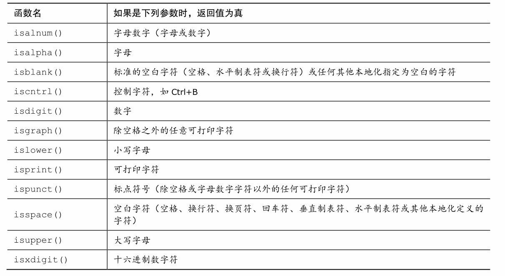
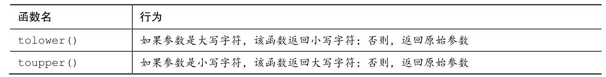
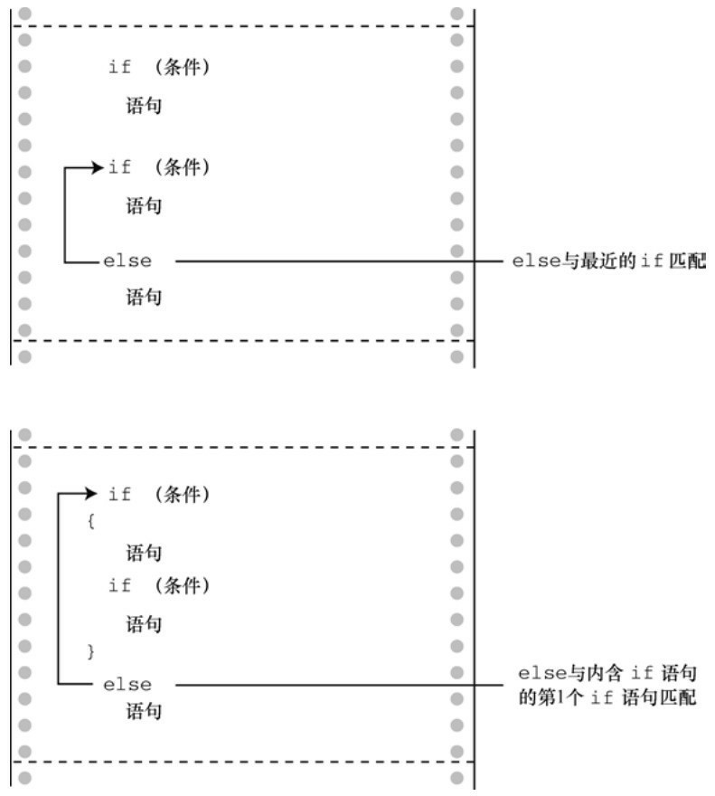
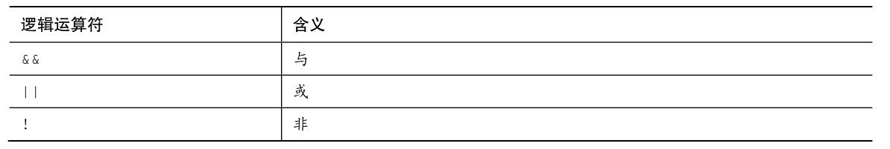
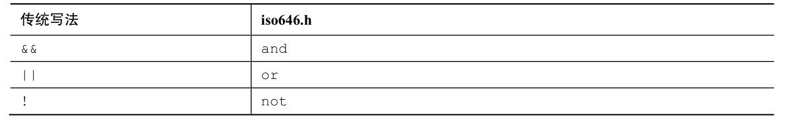
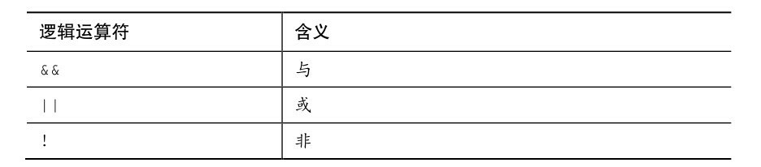
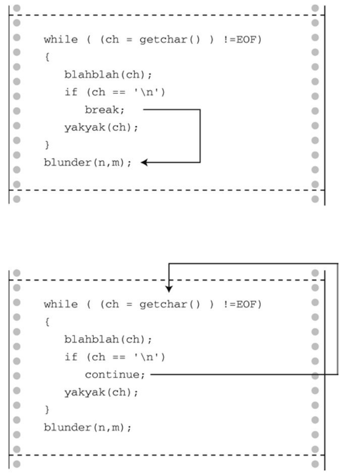
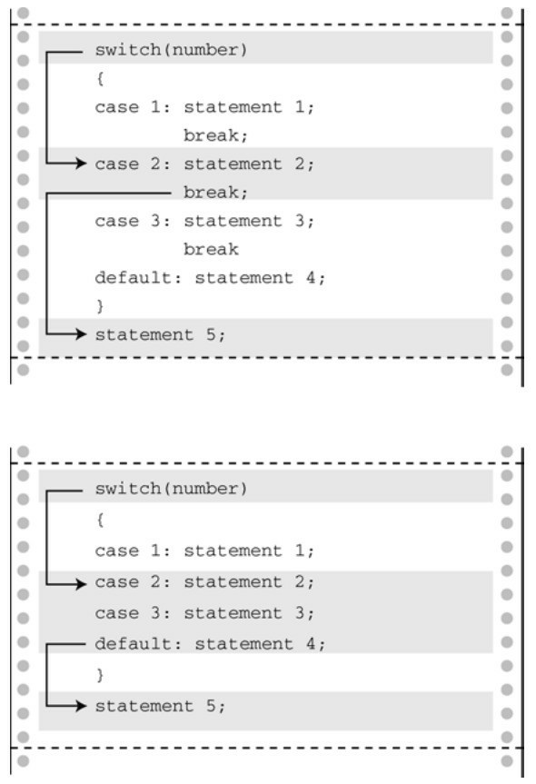
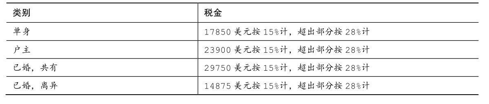

# 第7章 C控制语句：分支和跳转
本章介绍以下内容：

* 关键字：if、else、switch、continue、break、case、default、goto
* 运算符：&&、||、?:
* 函数：getchar()、putchar()、ctype.h系列
* 如何使用if和if else语句，如何嵌套它们
* 在更复杂的测试表达式中用逻辑运算符组合关系表达式
* C的条件运算符
* switch语句
* break、continue和goto语句
* 使用C的字符I/O函数：getchar()和putchar()
* ctype.h头文件提供的字符分析函数系列

随着越来越熟悉C，可以尝试用C程序解决一些更复杂的问题。这时候，需要一些方法来控制和组织程序，为此C提供了一些工具。前面已经学过如何在程序中用循环重复执行任务。本章将介绍分支结构（如， if和switch），让程序根据测试条件执行相应行为。另外，还将介绍C语言的逻辑运算符，使用逻辑运算符能在 while 或 if 的条件中测试更多关系。此外，本章还将介绍跳转语句，它将程序流转换到程序的其他部分。学完本章后，读者就可以设计按自己期望方式运行的程序。

## 7.1 if语句
我们从一个有if语句的简单示例开始学习，请看程序清单7.1。该程序读取一列数据，每个数据都表示每日的最低温度（℃），然后打印统计的总天数和最低温度在0℃以下的天数占总天数的百分比。程序中的循环通过scanf()读入温度值。while循环每迭代一次，就递增计数器增加天数，其中的if语句负责判断0℃以下的温度并单独统计相应的天数。

程序清单7.1 colddays.c程序
```c
// colddays.c -- 找出0℃以下的天数占总天数的百分比
#include <stdio.h>
int main(void)
{
    const int FREEZING = 0;
    float temperature;
    int cold_days = 0;
    int all_days = 0;
    printf("Enter the list of daily low temperatures.\n");
    printf("Use Celsius, and enter q to quit.\n");
    while (scanf("%f", &temperature) == 1)
    {
        all_days++;
        if (temperature < FREEZING)
            cold_days++;
    }
    if (all_days != 0)
        printf("%d days total: %.1f%% were below freezing.\n", all_days, 100.0 * (float) cold_days / all_days);
    if (all_days == 0)
        printf("No data entered!\n");
    return 0;
}
```

下面是该程序的输出示例：
```c
Enter the list of daily low temperatures.
Use Celsius, and enter q to quit.
12 5 -2.5 0 6 8 -3 -10 5 10 q
10 days total: 30.0% were below freezing.
```

while循环的测试条件利用scanf()的返回值来结束循环，因为scanf()在读到非数字字符时会返回0。temperature的类型是float而不是int，这样程序既可以接受-2.5这样的值，也可以接受8这样的值。

while循环中的新语句如下：
```c
if (temperature < FREEZING)
    cold_days++;
```

if 语句指示计算机，如果刚读取的值（remperature）小于 0，就把cold_days 递增 1；如果temperature不小于0，就跳过cold_days++;语句，while循环继续读取下一个温度值。

接着，该程序又使用了两次if语句控制程序的输出。如果有数据，就打印结果；如果没有数据，就打印一条消息（稍后将介绍一种更好的方法来处理这种情况）。

为避免整数除法，该程序示例把计算后的百分比强制转换为 float类型。其实，也不必使用强制类型转换，因为在表达式100.0 * cold_days / all_days中，将首先对表达式100.0 * cold_days求值，由于C的自动转换类型规则，乘积会被强制转换成浮点数。但是，使用强制类型转换可以明确表达转换类型的意图，保护程序免受不同版本编译器的影响。if语句被称为分支语句（branching statement）或选择语句（selection statement），因为它相当于一个交叉点，程序要在两条分支中选择一条执行。if语句的通用形式如下：
```c
if ( expression )
    statement
```

如果对expression求值为真（非0），则执行statement；否则，跳过statement。与while循环一样，statement可以是一条简单语句或复合语句。if语句的结构和while语句很相似，它们的主要区别是：如果满足条件可执行的话，if语句只能测试和执行一次，而while语句可以测试和执行多次。

通常，expression 是关系表达式，即比较两个量的大小（如，表达式 x > y 或 c == 6）。如果expression为真（即x大于y，或c == 6），则执行statement。否则，忽略statement。概括地说，可以使用任意表达式，表达式的值为0则为假。

statement部分可以是一条简单语句，如本例所示，或者是一条用花括号括起来的复合语句（或块）：
```c
if (score > big)
    printf("Jackpot!\n"); // 简单语句
if (joe > ron)
{              // 复合语句
    joecash++;
    printf("You lose, Ron.\n");
}
```

注意，即使if语句由复合语句构成，整个if语句仍被视为一条语句。

## 7.2 if else语句
简单形式的if语句可以让程序选择执行一条语句，或者跳过这条语句。C还提供了if else形式，可以在两条语句之间作选择。我们用if else形式修正程序清单7.1中的程序段。
```c
if (all_days != 0)
    printf("%d days total: %.1f%% were below freezing.\n", all_days, 100.0 * (float) cold_days / all_days);
if (all_days == 0)
    printf("No data entered!\n");
```

如果程序发现all_days不等于0，那么它应该知道另一种情况一定是all_days等于0。用if else形式只需测试一次。重写上面的程序段如下：
```c
if (all_days!= 0)
    printf("%d days total: %.1f%% were below freezing.\n", all_days, 100.0 * (float) cold_days / all_days);
else
    printf("No data entered!\n");
```

如果if语句的测试表达式为真，就打印温度数据；如果为假，就打印警告消息。

注意，if else语句的通用形式是：
```c
if ( expression )
    statement1
else
    statement2
```

如果expression为真（非0），则执行statement1；如果expression为假或0，则执行else后面的statement2。statement1和statement2可以是一条简单语句或复合语句。C并不要求一定要缩进，但这是标准风格。缩进让根据测试条件的求值结果来判断执行哪部分语句一目了然。

如果要在if和else之间执行多条语句，必须用花括号把这些语句括起来成为一个块。下面的代码结构违反了C语法，因为在if和else之间只允许有一条语句（简单语句或复合语句）：
```c
if (x > 0)
printf("Incrementing x:\n");
x++;
else   // 将产生一个错误
printf("x <= 0 \n");
```

编译器把printf()语句视为if语句的一部分，而把x++;看作一条单独的语句，它不是if语句的一部分。然后，编译器发现else并没有所属的if，这是错误的。上面的代码应该这样写：
```c
if (x > 0)
{
    printf("Incrementing x:\n");
    x++;
}
else
    printf("x <= 0 \n");
```

if语句用于选择是否执行一个行为，而else if语句用于在两个行为之间选择。图7.1比较了这两种语句。


### 7.2.1 另一个示例：介绍getchar()和putchar()
到目前为止，学过的大多数程序示例都要求输入数值。接下来，我们看看输入字符的示例。相信读者已经熟悉了如何用 scanf()和 printf()根据%c 转换说明读写字符，我们马上要讲解的示例中要用到一对字符输入/输出函数：getchar()和putchar()。

getchar()函数不带任何参数，它从输入队列中返回下一个字符。例如，下面的语句读取下一个字符输入，并把该字符的值赋给变量ch：
```c
ch = getchar();
```

该语句与下面的语句效果相同：
```c
scanf("%c", &ch);
```

putchar()函数打印它的参数。例如，下面的语句把之前赋给ch的值作为字符打印出来：
```c
putchar(ch);
```

该语句与下面的语句效果相同：
```c
printf("%c", ch);
```

由于这些函数只处理字符，所以它们比更通用的scanf()和printf()函数更快、更简洁。而且，注意 getchar()和 putchar()不需要转换说明，因为它们只处理字符。这两个函数通常定义在 stdio.h头文件中（而且，它们通常是预处理宏，而不是真正的函数，第16章会讨论类似函数的宏）。

接下来，我们编写一个程序来说明这两个函数是如何工作的。该程序把一行输入重新打印出来，但是每个非空格都被替换成原字符在ASCII序列中的下一个字符，空格不变。这一过程可描述为“如果字符是空白，原样打印；否则，打印原字符在ASCII序列中的下一个字符”。

C代码看上去和上面的描述很相似，请看程序清单7.2。

程序清单7.2 cypher1.c程序
```c
// cypher1.c -- 更改输入，空格不变
#include <stdio.h>
#define SPACE ' '        // SPACE表示单引号-空格-单引号
int main(void)
{
    char ch;
    ch = getchar();       // 读取一个字符
    while (ch != '\n')     // 当一行未结束时
    {
        if (ch == SPACE)    // 留下空格
            putchar(ch);    // 该字符不变
        else
            putchar(ch + 1);  // 改变其他字符
        ch = getchar();    // 获取下一个字符
    }
    putchar(ch);        // 打印换行符
    return 0;
}
```

（如果编译器警告因转换可能导致数据丢失，不用担心。第8章在讲到EOF时再解释。）

下面是该程序的输入示例：
```c
CALL ME HAL.
DBMM NF IBM/
```

把程序清单7.1中的循环和该例中的循环作比较。前者使用scanf()返回的状态值判断是否结束循环，而后者使用输入项的值来判断是否结束循环。这使得两程序所用的循环结构略有不同：程序清单7.1中在循环前面有一条“读取语句”，程序清单7.2中在每次迭代的末尾有一条“读取语句”。不过，C的语法比较灵活，读者也可以模仿程序清单7.1，把读取和测试合并成一个表达式。也就是说，可以把这种形式的循环：
```c
ch = getchar();    /* 读取一个字符 */
while (ch != '\n')  /* 当一行未结束时 */
{
    ...       /* 处理字符 */
    ch = getchar();  /* 获取下一个字符 */
}
```

替换成下面形式的循环：
```c
while ((ch = getchar()) != '\n')
{
    ...       /* 处理字符 */
}
```

关键的一行代码是：
```c
while ((ch = getchar()) != '\n')
```

这体现了C特有的编程风格——把两个行为合并成一个表达式。C对代码的格式要求宽松，这样写让其中的每个行为更加清晰：
```c
while (
(ch = getchar())       // 给ch赋一个值
!= '\n')  // 把ch和\n作比较
```

以上执行的行为是赋值给ch和把ch的值与换行符作比较。表达式ch = getchar()两侧的圆括号使之成为!=运算符的左侧运算对象。要对该表达式求值，必须先调用getchar()函数，然后把该函数的返回值赋给 ch。因为赋值表达式的值是赋值运算符左侧运算对象的值，所以 ch = getchar()的值就是 ch 的新值，因此，读取ch的值后，测试条件相当于是ch != '\n'（即，ch不是换行符）。

这种独特的写法在C编程中很常见，应该多熟悉它。还要记住合理使用圆括号组合子表达式。上面例子中的圆括号都必不可少。假设省略ch = getchar()两侧的圆括号：
```c
while (ch = getchar() != '\n')
```

!=运算符的优先级比=高，所以先对表达式getchar() != '\n'求值。由于这是关系表达式，所以其值不是1就是0（真或假）。然后，把该值赋给ch。省略圆括号意味着赋给ch的值是0或1，而不是 getchar()的返回值。这不是我们的初衷。

下面的语句：
```c
putchar(ch + 1); /* 改变其他字符 */
```

再次演示了字符实际上是作为整数储存的。为方便计算，表达式ch + 1中的ch被转换成int类型，然后int类型的计算结果被传递给接受一个int类型参数的putchar()，该函数只根据最后一个字节确定显示哪个字符。

### 7.2.2 ctype.h系列的字符函数
注意到程序清单7.2的输出中，最后输入的点号（.）被转换成斜杠（/），这是因为斜杠字符对应的ASCII码比点号的 ASCII 码多 1。如果程序只转换字母，保留所有的非字母字符（不只是空格）会更好。本章稍后讨论的逻辑运算符可用来测试字符是否不是空格、不是逗号等，但是列出所有的可能性太繁琐。C 有一系列专门处理字符的函数，ctype.h头文件包含了这些函数的原型。这些函数接受一个字符作为参数，如果该字符属于某特殊的类别，就返回一个非零值（真）；否则，返回0（假）。例如，如果isalpha()函数的参数是一个字母，则返回一个非零值。程序清单7.3在程序清单7.2的基础上使用了这个函数，还使用了刚才精简后的循环。

程序清单7.3 cypher2.c程序
```c
// cypher2.c -- 替换输入的字母，非字母字符保持不变
#include <stdio.h>
#include <ctype.h>       // 包含isalpha()的函数原型
int main(void)
{
    char ch;
    while ((ch = getchar()) != '\n')
    {
        if (isalpha(ch))    // 如果是一个字符，
            putchar(ch + 1);  // 显示该字符的下一个字符
        else          // 否则，
            putchar(ch);    // 原样显示
    }
    putchar(ch);        // 显示换行符
    return 0;
}
```

下面是该程序的一个输出示例，注意大小写字母都被替换了，除了空格和标点符号：
```c
Look! It's a programmer!
Mppl! Ju't b qsphsbnnfs!
```

表7.1和表7.2列出了ctype.h头文件中的一些函数。有些函数涉及本地化，指的是为适应特定区域的使用习惯修改或扩展 C 基本用法的工具（例如，许多国家在书写小数点时，用逗号代替点号，于是特殊的本地化可以指定C编译器使用逗号以相同的方式输出浮点数，这样123.45可以显示为123,45）。注意，字符映射函数不会修改原始的参数，这些函数只会返回已修改的值。也就是说，下面的语句不改变ch的值：
```c
tolower(ch); // 不影响ch的值
```

这样做才会改变ch的值：
```c
ch = tolower(ch); // 把ch转换成小写字母
```

表7.1 ctype.h头文件中的字符测试函数



表7.2 ctype.h头文件中的字符映射函数



### 7.2.3 多重选择else if
现实生活中我们经常有多种选择。在程序中也可以用else if扩展if else结构模拟这种情况。来看一个特殊的例子。电力公司通常根据客户的总用电量来决定电费。下面是某电力公司的电费清单，单位是千瓦时（kWh）：
```c
首 360kWh:      $0.13230/kWh
续 108kWh:      $0.15040/kWh
续 252kWh:      $0.30025/kWh
超过 720kWh:    $0.34025/kWh
```

如果对用电管理感兴趣，可以编写一个计算电费的程序。程序清单7.4是完成这一任务的第1步。

程序清单7.4 electric.c程序
```c
// electric.c -- 计算电费
#include <stdio.h>
#define RATE1  0.13230       // 首次使用 360 kwh 的费率
#define RATE2  0.15040       // 接着再使用 108 kwh 的费率
#define RATE3  0.30025       // 接着再使用 252 kwh 的费率
#define RATE4  0.34025       // 使用超过 720kwh 的费率
#define BREAK1 360.0         // 费率的第1个分界点
#define BREAK2 468.0         // 费率的第2个分界点
#define BREAK3 720.0         // 费率的第3个分界点
#define BASE1 (RATE1 * BREAK1)
// 使用360kwh的费用
#define BASE2 (BASE1 + (RATE2 * (BREAK2 - BREAK1)))
// 使用468kwh的费用
#define BASE3 (BASE1 + BASE2 + (RATE3 *(BREAK3 - BREAK2)))
// 使用720kwh的费用
int main(void)
{
    double kwh;           // 使用的千瓦时
    double bill;          // 电费
    printf("Please enter the kwh used.\n");
    scanf("%lf", &kwh);       // %lf对应double类型
    if (kwh <= BREAK1)
        bill = RATE1 * kwh;
    else if (kwh <= BREAK2)     // 360～468 kwh
        bill = BASE1 + (RATE2 * (kwh - BREAK1));
    else if (kwh <= BREAK3)     // 468～720 kwh
        bill = BASE2 + (RATE3 * (kwh - BREAK2));
    else              // 超过 720 kwh
        bill = BASE3 + (RATE4 * (kwh - BREAK3));
    printf("The charge for %.1f kwh is $%1.2f.\n", kwh, bill);
    return 0;
}
```

该程序的输出示例如下：
```c
Please enter the kwh used.
580
The charge for 580.0 kwh is $97.50.
```

程序清单 7.4 用符号常量表示不同的费率和费率分界点，以便把常量统一放在一处。这样，电力公司在更改费率以及费率分界点时，更新数据非常方便。BASE1和BASE2根据费率和费率分界点来表示。一旦费率或分界点发生了变化，它们也会自动更新。预处理器是不进行计算的。程序中出现BASE1的地方都会被替换成 0.13230*360.0。不用担心，编译器会对该表达式求值得到一个数值（47.628），以便最终的程序代码使用的是47.628而不是一个计算式。

程序流简单明了。该程序根据kwh的值在3个公式之间选择一个。特别要注意的是，如果kwh大于或等于360，程序只会到达第1个else。因此，else if (kwh <= BREAK2)这行相当于要求kwh在360～482之间，如程序注释所示。类似地，只有当kwh的值超过720时，才会执行最后的else。最后，注意BASE1、BASE2和BASE3分别代表360、468和720千瓦时的总费用。因此，当电量超过这些值时，只需要加上额外的费用即可。

实际上，else if 是已学过的 if else 语句的变式。例如，该程序的核心部分只不过是下面代码的另一种写法：
```c
if (kwh <= BREAK1)
    bill = RATE1 * kwh;
else if (kwh <= BREAK2)     // 360～468 kwh
    bill = BASE1 + (RATE2 * (kwh - BREAK1));
else if (kwh <= BREAK3)     // 468～720 kwh
    bill = BASE2 + (RATE3 * (kwh - BREAK2));
else                    // 超过720 kwh
    bill = BASE3 + (RATE4 * (kwh - BREAK3));
```

也就是说，该程序由一个if else语句组成，else部分包含另一个if else语句，该if else语句的else部分又包含另一个if else语句。第2个if else语句嵌套在第 1个if else语句中，第3个if else语句嵌套在第2个if else语句中。回忆一下，整个if else语句被视为一条语句，因此不必把嵌套的if else语句用花括号括起来。当然，花括号可以更清楚地表明这种特殊格式的含义。

这两种形式完全等价。唯一不同的是使用空格和换行的位置不同，不过编译器会忽略这些。尽管如此，第1种形式还是好些，因为这种形式更清楚地显示了有4种选择。在浏览程序时，这种形式让读者更容易看清楚各项选择。在需要时要缩进嵌套的部分，例如，必须测试两个单独的量时。本例中，仅在夏季对用电量超过720kWh的用户加收10%的电费，就属于这种情况。

可以把多个else if语句连成一串使用，如下所示（当然，要在编译器的限制范围内）：
```c
if (score < 1000)
    bonus = 0;
else if (score < 1500)
    bonus = 1;
else if (score < 2000)
    bonus = 2;
else if (score < 2500)
    bonus = 4;
else
    bonus = 6;
```

（这可能是一个游戏程序的一部分，bonus表示下一局游戏获得的光子炸弹或补给。）

对于编译器的限制范围，C99标准要求编译器最少支持127层套嵌。

### 7.2.4 else与if配对
如果程序中有许多if和else，编译器如何知道哪个if对应哪个else？例如，考虑下面的程序段：
```c
if (number > 6)
if (number < 12)
    printf("You're close!\n");
else
    printf("Sorry, you lose a turn!\n");
```

何时打印Sorry, you lose a turn!？当number小于或等于6时，还是number大于12时？换言之，else与第1个if还是第2个if匹配？答案是，else与第2个if匹配。也就是说，输入的数字和匹配的响应如下：
```c
数字    响应
5      None
10     You’re close!
15     Sorry, you lose a turn!
```

规则是，如果没有花括号，else与离它最近的if匹配，除非最近的if被花括号括起来（见图7.2）。



注意：要缩进“语句”，“语句”可以是一条简单语句或复合语句。

第1个例子的缩进使得else看上去与第1个if相匹配，但是记住，编译器是忽略缩进的。如果希望else与第1个if匹配，应该这样写：
```c
if (number > 6)
{
    if (number < 12)
        printf("You're close!\n");
}
else
    printf("Sorry, you lose a turn!\n");
```

这样改动后，响应如下：
```c
数字    响应
5      Sorry, you lose a turn!
10     You’re close!
15     None
```

### 7.2.5 多层嵌套的if语句
前面介绍的if...else if...else序列是嵌套if的一种形式，从一系列选项中选择一个执行。有时，选择一个特定选项后又引出其他选择，这种情况可以使用另一种嵌套 if。例如，程序可以使用 if else选择男女，if else的每个分支里又包含另一个if else来区分不同收入的群体。

我们把这种形式的嵌套if应用在下面的程序中。给定一个整数，显示所有能整除它的约数。如果没有约数，则报告该数是一个素数。

在编写程序的代码之前要先规划好。首先，要总体设计一下程序。为方便起见，程序应该使用一个循环让用户能连续输入待测试的数。这样，测试一个新的数字时不必每次都要重新运行程序。下面是我们为这种循环开发的一个模型（伪代码）：

* 提示用户输入数字
* 当scanf()返回值为1
* 分析该数并报告结果
* 提示用户继续输入

回忆一下在测试条件中使用scanf()，把读取数字和判断测试条件确定是否结束循环合并在一起。

下一步，设计如何找出约数。也许最直接的方法是：
```c
for (div = 2; div < num; div++)
    if (num % div == 0)
        printf("%d is divisible by %d\n", num, div);
```

该循环检查2～num之间的所有数字，测试它们是否能被num整除。但是，这个方法有点浪费时间。我们可以改进一下。例如，考虑如果144%2得0，说明2是144的约数；如果144除以2得72，那么72也是144的一个约数。所以，num % div测试成功可以获得两个约数。为了弄清其中的原理，我们分析一下循环中得到的成对约数：2和72、2和48、4和36、6和24、8和18、9和6、12和12、16和9、18和8，等等。在得到12和12这对约数后，又开始得到已找到的相同约数（次序相反）。因此，不用循环到143，在达到12以后就可以停止循环。这大大地节省了循环时间！

分析后发现，必须测试的数只要到num的平方根就可以了，不用到num。对于9这样的数字，不会节约很多时间，但是对于10000这样的数，使用哪一种方法求约数差别很大。不过，我们不用在程序中计算平方根，可以这样编写测试条件：
```c
for (div = 2; (div * div) <= num; div++)
    if (num % div == 0)
        printf("%d is divisible by %d and %d.\n",num, div, num / div);
```

如果num是144，当div = 12时停止循环。如果num是145，当div = 13时停止循环。

不使用平方根而用这样的测试条件，有两个原因。其一，整数乘法比求平方根快。其二，我们还没有正式介绍平方根函数。

还要解决两个问题才能准备编程。第1个问题，如果待测试的数是一个完全平方数怎么办？报告144可以被12和12整除显得有点傻。可以使用嵌套if语句测试div是否等于num /div。如果是，程序只打印一个约数：
```c
for (div = 2; (div * div) <= num; div++)
{
  if (num % div == 0)
  {
      if (div * div != num)
          printf("%d is divisible by %d and %d.\n",num, div, num / div);
      else
          printf("%d is divisible by %d.\n", num, div);
  }
}
```

注意

从技术角度看，if else语句作为一条单独的语句，不必使用花括号。外层if也是一条单独的语句，也不必使用花括号。但是，当语句太长时，使用花括号能提高代码的可读性，而且还可防止今后在if循环中添加其他语句时忘记加花括号。

第2个问题，如何知道一个数字是素数？如果num是素数，程序流不会进入if语句。要解决这个问题，可以在外层循环把一个变量设置为某个值（如，1），然后在if语句中把该变量重新设置为0。循环完成后，检查该变量是否是1，如果是，说明没有进入if语句，那么该数就是素数。这样的变量通常称为标记（flag）。

一直以来，C都习惯用int作为标记的类型，其实新增的_Bool类型更合适。另外，如果在程序中包含了stdbool.h头文件，便可用bool代替_Bool类型，用true和false分别代替1和0。

程序清单7.5体现了以上分析的思路。为扩大该程序的应用范围，程序用long类型而不是int类型（如果系统不支持_Bool类型，可以把isPrime的类型改为int，并用1和0分别替换程序中的true和false）。

程序清单7.5 divisors.c程序
```c
// divisors.c -- 使用嵌套if语句显示一个数的约数
#include <stdio.h>
#include <stdbool.h>
int main(void)
{
    unsigned long num;     // 待测试的数
    unsigned long div;     // 可能的约数
    bool isPrime;          // 素数标记
    printf("Please enter an integer for analysis; ");
    printf("Enter q to quit.\n");
    while (scanf("%lu", &num) == 1)
    {
        for (div = 2, isPrime = true; (div * div) <= num; div++)
        {
            if (num % div == 0)
            {
                if ((div * div) != num)
                    printf("%lu is divisible by %lu and %lu.\n",num, div, num / div);
                else
                    printf("%lu is divisible by %lu.\n", num, div);
                isPrime = false;  // 该数不是素数
            }
        }
        if (isPrime)
            printf("%lu is prime.\n", num);
        printf("Please enter another integer for analysis; ");
        printf("Enter q to quit.\n");
    }
    printf("Bye.\n");
    return 0;
}
```

注意，该程序在for循环的测试表达式中使用了逗号运算符，这样每次输入新值时都可以把isPrime设置为true。

下面是该程序的一个输出示例：
```c
Please enter an integer for analysis; Enter q to quit.
123456789
123456789 is divisible by 3 and 41152263.
123456789 is divisible by 9 and 13717421.
123456789 is divisible by 3607 and 34227.
123456789 is divisible by 3803 and 32463.
123456789 is divisible by 10821 and 11409.
Please enter another integer for analysis; Enter q to quit.
149
149 is prime.
Please enter another integer for analysis; Enter q to quit.
2013
2013 is divisible by 3 and 671.
2013 is divisible by 11 and 183.
2013 is divisible by 33 and 61.
Please enter another integer for analysis; Enter q to quit.
q
Bye.
```

该程序会把1认为是素数，其实它不是。下一节将要介绍的逻辑运算符可以排除这种特殊的情况。

小结：用if语句进行选择

关键字：if、else

一般注解：

下面各形式中，statement可以是一条简单语句或复合语句。表达式为真说明其值是非零值。

形式1：
```c
if (expression)
    statement
```

如果expression为真，则执行statement部分。

形式2：
```c
if (expression)
    statement1
else
    statement2
```

如果expression为真，执行statement1部分；否则，执行statement2部分。

形式3：
```c
if (expression1)
    statement1
else if (expression2)
    statement2
else
    statement3
```

如果expression1为真，执行statement1部分；如果expression2为真，执行statement2部分；否则，执行statement3部分。

示例：
```c
if (legs == 4)
    printf("It might be a horse.\n");
else if (legs > 4)
    printf("It is not a horse.\n");
else   /* 如果legs < 4 */
{
    legs++;
    printf("Now it has one more leg.\n");
}
```

## 7.3 逻辑运算符
读者已经很熟悉了，if 语句和 while 语句通常使用关系表达式作为测试条件。有时，把多个关系表达式组合起来会很有用。例如，要编写一个程序，计算输入的一行句子中除单引号和双引号以外其他字符的数量。这种情况下可以使用逻辑运算符，并使用句点（.）标识句子的末尾。程序清单7.6用一个简短的程序进行演示。

程序清单7.6 chcount.c程序
```c
// chcount.c -- 使用逻辑与运算符
#include <stdio.h>
#define PERIOD '.'
int main(void)
{
    char ch;
    int charcount = 0;
    while ((ch = getchar()) != PERIOD)
    {
        if (ch != '"' && ch != '\'')
            charcount++;
    }
    printf("There are %d non-quote characters.\n", charcount);
    return 0;
}
```

下面是该程序的一个输出示例：
```c
I didn't read the "I'm a Programming Fool" best seller.
There are 50 non-quote characters.
```

程序首先读入一个字符，并检查它是否是一个句点，因为句点标志一个句子的结束。接下来，if语句的测试条件中使用了逻辑与运算符&&。该 if 语句翻译成文字是“如果待测试的字符不是双引号，并且它也不是单引号，那么charcount递增1”。

逻辑运算符两侧的条件必须都为真，整个表达式才为真。逻辑运算符的优先级比关系运算符低，所以不必在子表达式两侧加圆括号。

C有3种逻辑运算符，见表7.3。

表7.3 种逻辑运算符



假设exp1和exp2是两个简单的关系表达式（如car > rat或debt == 1000），那么：

当且仅当exp1和exp2都为真时，exp1 && exp2才为真；

如果exp1或exp2为真，则exp1 || exp2为真；

如果exp1为假，则!exp1为真；如果exp1为真，则!exp1为假。

下面是一些具体的例子：

5 > 2 && 4 > 7为假，因为只有一个子表达式为真；

5 > 2 || 4 > 7为真，因为有一个子表达式为真；

!(4 > 7)为真，因为4不大于7。

顺带一提，最后一个表达式与下面的表达式等价：

4 <= 7

如果不熟悉逻辑运算符或者觉得很别扭，请记住：(练习&&时间)== 完美。

### 7.3.1 备选拼写：iso646.h头文件
C 是在美国用标准美式键盘开发的语言。但是在世界各地，并非所有的键盘都有和美式键盘一样的符号。因此，C99标准新增了可代替逻辑运算符的拼写，它们被定义在ios646.h头文件中。如果在程序中包含该头文件，便可用and代替&&、or代替||、not代替!。例如，可以把下面的代码：
```c
if (ch != '"' && ch != '\'')
    charcount++;
```

改写为：
```c
if (ch != '"' and ch != '\'')
    charcount++;
```

表7.4列出了逻辑运算符对应的拼写，很容易记。读者也许很好奇，为何C不直接使用and、or和not？因为C一直坚持尽量保持较少的关键字。参考资料V“新增C99和C11的标准ANSI C库”列出了一些运算符的备选拼写，有些我们还没见过。

表7.4 逻辑运算符的备选拼写



### 7.3.2 优先级
!运算符的优先级很高，比乘法运算符还高，与递增运算符的优先级相同，只比圆括号的优先级低。&&运算符的优先级比||运算符高，但是两者的优先级都比关系运算符低，比赋值运算符高。因此，表达式a >b && b > c || b > d相当于((a > b) && (b > c)) || (b > d)。

也就是说，b介于a和c之间，或者b大于d。

尽管对于该例没必要使用圆括号，但是许多程序员更喜欢使用带圆括号的第 2 种写法。这样做即使不记得逻辑运算符的优先级，表达式的含义也很清楚。

### 7.3.3 求值顺序
除了两个运算符共享一个运算对象的情况外，C 通常不保证先对复杂表达式中哪部分求值。例如，下面的语句，可能先对表达式5 + 3求值，也可能先对表达式9 + 6求值：
```c
apples = (5 + 3) * (9 + 6);
```

C 把先计算哪部分的决定权留给编译器的设计者，以便针对特定系统优化设计。但是，对于逻辑运算符是个例外，C保证逻辑表达式的求值顺序是从左往右。&&和||运算符都是序列点，所以程序在从一个运算对象执行到下一个运算对象之前，所有的副作用都会生效。而且，C 保证一旦发现某个元素让整个表达式无效，便立即停止求值。正是由于有这些规定，才能写出这样结构的代码：
```c
while ((c = getchar()) != ' ' && c != '\n')
```

如上代码所示，读取字符直至遇到第1 个空格或换行符。第1 个子表达式把读取的值赋给c，后面的子表达式会用到c的值。如果没有求值循序的保证，编译器可能在给c赋值之前先对后面的表达式求值。

这里还有一个例子：
```c
if (number != 0 && 12/number == 2)
    printf("The number is 5 or 6.\n");
```

如果number的值是0，那么第1个子表达式为假，且不再对关系表达式求值。这样避免了把0作为除数。许多语言都没有这种特性，知道number为0后，仍继续检查后面的条件。

最后，考虑这个例子：
```c
while ( x++ < 10 && x + y < 20)
```

实际上，&&是一个序列点，这保证了在对&&右侧的表达式求值之前，已经递增了x。

小结：逻辑运算符和表达式

逻辑运算符：

逻辑运算符的运算对象通常是关系表达式。!运算符只需要一个运算对象，其他两个逻辑运算符都需要两个运算对象，左侧一个，右侧一个。



逻辑表达式：

当且仅当expression1和expression2都为真，expression1 && expression2才为真。如果 expression1 或 expression2 为真，expression1 || expression2 为真。如果expression为假，!expression则为真，反之亦然。

求值顺序：

逻辑表达式的求值顺序是从左往右。一旦发现有使整个表达式为假的因素，立即停止求值。

示例：
```c
6 > 2 && 3 == 3        真
!(6 > 2 && 3 == 3)     假
x != 0 && (20 / x) < 5 只有当x不等于0时，才会对第2个表达式求值
```

### 7.3.4 范围
&&运算符可用于测试范围。例如，要测试score是否在90～100的范围内，可以这样写：
```c
if (range >= 90 && range <= 100)
    printf("Good show!\n");
```

千万不要模仿数学上的写法：
```c
if (90 <= range <= 100)  // 千万不要这样写！
    printf("Good show!\n");
```

这样写的问题是代码有语义错误，而不是语法错误，所以编译器不会捕获这样的问题（虽然可能会给出警告）。由于<=运算符的求值顺序是从左往右，所以编译器把测试表达式解释为：
```c
(90 <= range) <= 100
```

子表达式90 <= range的值要么是1（为真），要么是0（为假）。这两个值都小于100，所以不管range的值是多少，整个表达式都恒为真。因此，在范围测试中要使用&&。

许多代码都用范围测试来确定一个字符是否是小写字母。例如，假设ch是char类型的变量：
```c
if (ch >= 'a' && ch <= 'z')
    printf("That's a lowercase character.\n");
```

该方法仅对于像ASCII这样的字符编码有效，这些编码中相邻字母与相邻数字一一对应。但是，对于像EBCDIC这样的代码就没用了。相应的可移植方法是，用ctype.h系列中的islower()函数（参见表7.1）：
```c
if (islower(ch))
    printf("That's a lowercase character.\n");
```

无论使用哪种特定的字符编码，islower()函数都能正常运行（不过，一些早期的编译器没有ctype.h系列）。

## 7.4 一个统计单词的程序
现在，我们可以编写一个统计单词数量的程序（即，该程序读取并报告单词的数量）。该程序还可以计算字符数和行数。先来看看编写这样的程序要涉及那些内容。

首先，该程序要逐个字符读取输入，知道何时停止读取。然后，该程序能识别并计算这些内容：字符、行数和单词。据此我们编写的伪代码如下：
```c
读取一个字符
当有更多输入时
递增字符计数
如果读完一行，递增行数计数
如果读完一个单词，递增单词计数
读取下一个字符
```

前面有一个输入循环的模型：
```c
while ((ch = getchar()) != STOP)
{
...
}
```

这里，STOP表示能标识输入末尾的某个值。以前我们用过换行符和句点标记输入的末尾，但是对于一个通用的统计单词程序，它们都不合适。我们暂时选用一个文本中不常用的字符（如，|）作为输入的末尾标记。第8章中会介绍更好的方法，以便程序既能处理文本文件，又能处理键盘输入。

现在，我们考虑循环体。因为该程序使用getchar()进行输入，所以每次迭代都要通过递增计数器来计数。为了统计行数，程序要能检查换行字符。如果输入的字符是一个换行符，该程序应该递增行数计数器。这里要注意STOP 字符位于一行的中间的情况。是否递增行数计数？我们可以作为特殊行计数，即没有换行符的一行字符。可以通过记录之前读取的字符识别这种情况，即如果读取时发现 STOP 字符的上一个字符不是换行符，那么这行就是特殊行。

最棘手的部分是识别单词。首先，必须定义什么是该程序识别的单词。我们用一个相对简单的方法，把一个单词定义为一个不含空白（即，没有空格、制表符或换行符）的字符序列。因此，“glymxck”和“r2d2”都算是一个单词。程序读取的第 1 个非空白字符即是一个单词的开始，当读到空白字符时结束。判断非空白字符最直接的测试表达式是：
```c
c != ' ' && c != '\n' && c != '\t' /* 如果c不是空白字符，该表达式为真*/
```

检测空白字符最直接的测试表达式是：
```c
c == ' ' || c == '\n' || c == '\t' /*如果c是空白字符，该表达式为真*/
```

然而，使用ctype.h头文件中的函数isspace()更简单，如果该函数的参数是空白字符，则返回真。所以，如果c是空白字符，isspace(c)为真；如果c不是空白字符，!isspace(c)为真。

要查找一个单词里是否有某个字符，可以在程序读入单词的首字符时把一个标记（名为 inword）设置为1。也可以在此时递增单词计数。然后，只要inword为1（或true），后续的非空白字符都不记为单词的开始。下一个空白字符，必须重置标记为0（或false），然后程序就准备好读取下一个单词。我们把以上分析写成伪代码：
```c
如果c不是空白字符，且inword为假
设置inword为真，并给单词计数
如果c是空白字符，且inword为真
设置inword为假
```

这种方法在读到每个单词的开头时把inword设置为1（真），在读到每个单词的末尾时把inword设置为0（假）。只有在标记从0设置为1时，递增单词计数。如果能使用_Bool类型，可以在程序中包含stdbool.h头文件，把inword的类型设置为bool，其值用true和false表示。如果编译器不支持这种用法，就把inword的类型设置为int，其值用1和0表示。

如果使用布尔类型的变量，通常习惯把变量自身作为测试条件。如下所示：
```c
用if (inword)代替if (inword == true)
用if (!inword)代替if (inword == false)
```

可以这样做的原因是，如果 inword为true，则表达式 inword == true为true；如果 inword为false，则表达式inword == true为false。所以，还不如直接用inword作为测试条件。类似地，!inword的值与表达式inword == false的值相同（非真即false，非假即true）。

程序清单7.7把上述思路（识别行、识别不完整的行和识别单词）翻译了成C代码。

程序清单7.7 wordcnt.c程序
```c
// wordcnt.c -- 统计字符数、单词数、行数
#include <stdio.h>
#include <ctype.h>     // 为isspace()函数提供原型
#include <stdbool.h>    // 为bool、true、false提供定义
#define STOP '|'
int main(void)
{
    char c;        // 读入字符
    char prev;       // 读入的前一个字符
    long n_chars = 0L;// 字符数
    int n_lines = 0;    // 行数
    int n_words = 0;    // 单词数
    int p_lines = 0;    // 不完整的行数
    bool inword = false;  // 如果c在单词中，inword 等于 true
    printf("Enter text to be analyzed (| to terminate):\n");
    prev = '\n';      // 用于识别完整的行
    while ((c = getchar()) != STOP)
    {
        n_chars++;     // 统计字符
        if (c == '\n')
            n_lines++;   // 统计行
        if (!isspace(c) && !inword)
        {
            inword = true;// 开始一个新的单词
            n_words++;   // 统计单词
        }
        if (isspace(c) && inword)
            inword = false;  // 打到单词的末尾
        prev = c;     // 保存字符的值
    }
    if (prev != '\n')
        p_lines = 1;
    printf("characters = %ld, words = %d, lines = %d, ", n_chars, n_words, n_lines);
    printf("partial lines = %d\n", p_lines);
    return 0;
}
```

下面是运行该程序后的一个输出示例：
```c
Enter text to be analyzed (| to terminate):
Reason is a
powerful servant but
an inadequate master.
|
characters = 55, words = 9, lines = 3, partial lines = 0
```

该程序使用逻辑运算符把伪代码翻译成C代码。例如，把下面的伪代码：
```c
如果c不是空白字符，且inword为假
```

翻译成如下C代码：
```c
if (!isspace(c) &&!inword)
```

再次提醒读者注意，!inword 与 inword == false 等价。上面的整个测试条件比单独判断每个空白字符的可读性高：
```c
if (c != ' ' && c != '\n' && c != '\t' && !inword)
```

上面的两种形式都表示“如果c不是空白字符，且如果c不在单词里”。如果两个条件都满足，则一定是一个新单词的开头，所以要递增n_words。如果位于单词中，满足第1个条件，但是inword为true，就不递增 n_word。当读到下一个空白字符时，inword 被再次设置为 false。检查代码，查看一下如果单词之间有多个空格时，程序是否能正常运行。第 8 章讲解了如何修正这个问题，让该程序能统计文件中的单词量。

## 7.5 条件运算符：?:
C提供条件表达式（conditional expression）作为表达if else语句的一种便捷方式，该表达式使用?:条件运算符。该运算符分为两部分，需要 3 个运算对象。回忆一下，带一个运算对象的运算符称为一元运算符，带两个运算对象的运算符称为二元运算符。以此类推，带 3 个运算对象的运算符称为三元运算符。条件运算符是C语言中唯一的三元运算符。下面的代码得到一个数的绝对值：
```c
x = (y < 0) ? -y : y;
```

在=和;之间的内容就是条件表达式，该语句的意思是“如果y小于0，那么x = -y;否则，x = y”。用if else可以这样表达：
```c
if (y < 0)
    x = -y;
else
    x = y;
```

条件表达式的通用形式如下：
```c
expression1 ? expression2 : expression3
```

如果 expression1 为真（非 0），那么整个条件表达式的值与 expression2 的值相同；如果expression1为假（0），那么整个条件表达式的值与expression3的值相同。

需要把两个值中的一个赋给变量时，就可以用条件表达式。典型的例子是，把两个值中的最大值赋给变量：
```c
max = (a > b) ? a : b;
```

如果a大于b，那么将max设置为a；否则，设置为b。

通常，条件运算符完成的任务用 if else 语句也可以完成。但是，使用条件运算符的代码更简洁，而且编译器可以生成更紧凑的程序代码。

我们来看程序清单7.8中的油漆程序，该程序计算刷给定平方英尺的面积需要多少罐油漆。基本算法很简单：用平方英尺数除以每罐油漆能刷的面积。但是，商店只卖整罐油漆，不会拆分来卖，所以如果计算结果是1.7罐，就需要两罐。因此，该程序计算得到带小数的结果时应该进1。条件运算符常用于处理这种情况，而且还要根据单复数分别打印can和cans。

程序清单7.8 paint.c程序
```c
/* paint.c -- 使用条件运算符 */
#include <stdio.h>
#define COVERAGE 350   // 每罐油漆可刷的面积（单位：平方英尺）
int main(void)
{
    int sq_feet;
    int cans;
    printf("Enter number of square feet to be painted:\n");
    while (scanf("%d", &sq_feet) == 1)
    {
        cans = sq_feet / COVERAGE;
        cans += ((sq_feet % COVERAGE == 0)) ? 0 : 1;
        printf("You need %d %s of paint.\n", cans,
        cans == 1 ? "can" : "cans");
        printf("Enter next value (q to quit):\n");
    }
    return 0;
}
```

下面是该程序的运行示例：
```c
Enter number of square feet to be painted:
349
You need 1 can of paint.
Enter next value (q to quit):
351
You need 2 cans of paint.
Enter next value (q to quit):
q
```

该程序使用的变量都是int类型，除法的计算结果（sq_feet / COVERAGE）会被截断。也就是说， 351/350得1。所以，cans被截断成整数部分。如果sq_feet % COVERAGE得0，说明sq_feet被COVERAGE整除，cans的值不变；否则，肯定有余数，就要给cans加1。这由下面的语句完成：
```c
cans += ((sq_feet % COVERAGE == 0)) ? 0 : 1;
```

该语句把+=右侧表达式的值加上cans，再赋给cans。右侧表达式是一个条件表达式，根据sq_feet是否能被COVERAGE整除，其值为0或1。

printf()函数中的参数也是一个条件表达式：
```c
cans == 1 ? "can" : "cans");
```

如果cans的值是1，则打印can；否则，打印cans。这也说明了条件运算符的第2个和第3个运算对象可以是字符串。

小结：条件运算符

条件运算符：?:

一般注解：

条件运算符需要3个运算对象，每个运算对象都是一个表达式。其通用形式如下：
```c
expression1 ? expression2 : expression3
```

如果expression1为真，整个条件表达式的值是expression2的值；否则，是expression3的值。

示例：
```c
(5 > 3) ? 1 : 2 值为1
(3 > 5) ? 1 : 2 值为2
(a > b) ? a : b 如果a >b，则取较大的值
```

## 7.6 循环辅助：continue和break
一般而言，程序进入循环后，在下一次循环测试之前会执行完循环体中的所有语句。continue 和break语句可以根据循环体中的测试结果来忽略一部分循环内容，甚至结束循环。

### 7.6.1 continue语句
3种循环都可以使用continue语句。执行到该语句时，会跳过本次迭代的剩余部分，并开始下一轮迭代。如果continue语句在嵌套循环内，则只会影响包含该语句的内层循环。程序清单7.9中的简短程序演示了如何使用continue。

程序清单7.9 skippart.c程序
```c
/* skippart.c -- 使用continue跳过部分循环 */
#include <stdio.h>
int main(void)
{
    const float MIN = 0.0f;
    const float MAX = 100.0f;
    float score;
    float total = 0.0f;
    int n = 0;
    float min = MAX;
    float max = MIN;
    printf("Enter the first score (q to quit): ");
    while (scanf("%f", &score) == 1)
    {
        if (score < MIN || score > MAX)
        {
            printf("%0.1f is an invalid value.Try again: ",score);
            continue;  // 跳转至while循环的测试条件
        }
        printf("Accepting %0.1f:\n", score);
        min = (score < min) ? score : min;
        max = (score > max) ? score : max;
        total += score;
        n++;
        printf("Enter next score (q to quit): ");
    }
    if (n > 0)
    {
        printf("Average of %d scores is %0.1f.\n", n, total / n);
        printf("Low = %0.1f, high = %0.1f\n", min, max);
    }
    else
        printf("No valid scores were entered.\n");
    return 0;
}
```

在程序清单7.9中，while循环读取输入，直至用户输入非数值数据。循环中的if语句筛选出无效的分数。假设输入 188，程序会报告：188 is an invalid value。在本例中，continue 语句让程序跳过处理有效输入部分的代码。程序开始下一轮循环，准备读取下一个输入值。

注意，有两种方法可以避免使用continue，一是省略continue，把剩余部分放在一个else块中：
```c
if (score < 0 || score > 100)
    /* printf()语句 */
else
{
    /* 语句*/
}
```

另一种方法是，用以下格式来代替：
```c
if (score >= 0 && score <= 100)
{
    /* 语句 */
}
```

这种情况下，使用continue的好处是减少主语句组中的一级缩进。当语句很长或嵌套较多时，紧凑简洁的格式提高了代码的可读性。

continue还可用作占位符。例如，下面的循环读取并丢弃输入的数据，直至读到行末尾：
```c
while (getchar() != '\n')
    ;
```

当程序已经读取一行中的某些内容，要跳至下一行开始处时，这种用法很方便。问题是，一般很难注意到一个单独的分号。如果使用continue，可读性会更高：
```c
while (getchar() != '\n')
    continue;
```

如果用了continue没有简化代码反而让代码更复杂，就不要使用continue。例如，考虑下面的程序段：
```c
while ((ch = getchar() ) != '\n')
{
    if (ch == '\t')
        continue;
    putchar(ch);
}
```

该循环跳过制表符，并在读到换行符时退出循环。以上代码这样表示更简洁：
```c
while ((ch = getchar()) != '\n')
    if (ch != '\t')
        putchar(ch);
```

通常，在这种情况下，把if的测试条件的关系反过来便可避免使用continue。

以上介绍了continue语句让程序跳过循环体的余下部分。那么，从何处开始继续循环？对于while和 do while 循环，执行 continue 语句后的下一个行为是对循环的测试表达式求值。考虑下面的循环：
```c
count = 0;
while (count < 10)
{
    ch = getchar();
    if (ch == '\n')
        continue;
    putchar(ch);
    count++;
}
```

该循环读取10个字符（除换行符外，因为当ch是换行符时，程序会跳过count++;语句）并重新显示它们，其中不包括换行符。执行continue后，下一个被求值的表达式是循环测试条件。

对于for循环，执行continue后的下一个行为是对更新表达式求值，然后是对循环测试表达式求值。例如，考虑下面的循环：
```c
for (count = 0; count < 10; count++)
{
    ch = getchar();
    if (ch == '\n')
        continue;
    putchar(ch);
}
```

该例中，执行完continue后，首先递增count，然后将递增后的值和10作比较。因此，该循环与上面while循环的例子稍有不同。while循环的例子中，除了换行符，其余字符都显示；而本例中，换行符也计算在内，所以读取的10个字符中包含换行符。

### 7.6.2 break语句
程序执行到循环中的break语句时，会终止包含它的循环，并继续执行下一阶段。把程序清单7.9中的continue替换成break，在输入188时，不是跳至执行下一轮循环，而是导致退出当前循环。图7.3比较了break和continue。如果break语句位于嵌套循环内，它只会影响包含它的当前循环。



break还可用于因其他原因退出循环的情况。程序清单7.10用一个循环计算矩形的面积。如果用户输入非数字作为矩形的长或宽，则终止循环。

程序清单7.10 break.c程序
```c
/* break.c -- 使用 break 退出循环 */
#include <stdio.h>
int main(void)
{
    float length, width;
    printf("Enter the length of the rectangle:\n");
    while (scanf("%f", &length) == 1)
    {
        printf("Length = %0.2f:\n", length);
        printf("Enter its width:\n");
        if (scanf("%f", &width) != 1)
            break;
        printf("Width = %0.2f:\n", width);
        printf("Area = %0.2f:\n", length * width);
        printf("Enter the length of the rectangle:\n");
    }
    printf("Done.\n");
    return 0;
}
```

可以这样控制循环：
```c
while (scanf("%f %f", &length, &width) == 2)
```

但是，用break可以方便显示用户输入的值。

和continue一样，如果用了break代码反而更复杂，就不要使用break。例如，考虑下面的循环：
```c
while ((ch = getchar()) != '\n')
{
    if (ch == '\t')
        break;
    putchar(ch);
}
```

如果把两个测试条件放在一起，逻辑就更清晰了：
```c
while ((ch = getchar() ) != '\n' && ch != '\t')
    putchar(ch);
```

break语句对于稍后讨论的switch语句而言至关重要。

在for循环中的break和continue的情况不同，执行完break语句后会直接执行循环后面的第1条语句，连更新部分也跳过。嵌套循环内层的break只会让程序跳出包含它的当前循环，要跳出外层循环还需要一个break：
```c
int p, q;
scanf("%d", &p);
while (p > 0)
{
    printf("%d\n", p);
    scanf("%d", &q);
    while (q > 0)
    {
        printf("%d\n", p*q);
        if (q > 100)
            break; // 跳出内层循环
        scanf("%d", &q);
    }
    if (q > 100)
        break; // 跳出外层循环
    scanf("%d", &p);
}
```

## 7.7 多重选择：switch和break
使用条件运算符和 if else 语句很容易编写二选一的程序。然而，有时程序需要在多个选项中进行选择。可以用if else if...else来完成。但是，大多数情况下使用switch语句更方便。程序清单7.11演示了如何使用switch语句。该程序读入一个字母，然后打印出与该字母开头的动物名。

程序清单7.11 animals.c程序
```c
/* animals.c -- 使用switch语句 */
#include <stdio.h>
#include <ctype.h>
int main(void)
{
    char ch;
    printf("Give me a letter of the alphabet, and I will give ");
    printf("an animal name\nbeginning with that letter.\n");
    printf("Please type in a letter; type # to end my act.\n");
    while ((ch = getchar()) != '#')
    {
        if ('\n' == ch)
            continue;
        if (islower(ch))  /* 只接受小写字母*/
            switch (ch)
            {
                case 'a':
                    printf("argali, a wild sheep of Asia\n");
                    break;
                case 'b':
                    printf("babirusa, a wild pig of Malay\n");
                    break;
                case 'c':
                    printf("coati, racoonlike mammal\n");
                    break;
                case 'd':
                    printf("desman, aquatic, molelike critter\n");
                    break;
                case 'e':
                    printf("echidna, the spiny anteater\n");
                    break;
                case 'f':
                    printf("fisher, brownish marten\n");
                    break;
                default:
                    printf("That's a stumper!\n");
            }        /* switch结束    */
        else
            printf("I recognize only lowercase letters.\n");
        while (getchar() != '\n')
            continue;   /* 跳过输入行的剩余部分 */
        printf("Please type another letter or a #.\n");
    }          /* while循环结束   */
    printf("Bye!\n");
    return 0;
}
```

篇幅有限，我们只编到f，后面的字母以此类推。在进一步解释该程序之前，先看看输出示例：
```c
Give me a letter of the alphabet, and I will give an animal name
beginning with that letter.
Please type in a letter; type # to end my act.
a
argali, a wild sheep of Asia
Please type another letter or a #.
dab
desman, aquatic, molelike critter
Please type another letter or a #.
r
That's a stumper!
Please type another letter or a #.
Q
I recognize only lowercase letters.
Please type another letter or a #.
#
Bye!
```

该程序的两个主要特点是：使用了switch语句和它对输出的处理。我们先分析switch的工作原理。

### 7.7.1 switch语句
要对紧跟在关键字 switch 后圆括号中的表达式求值。在程序清单 7.11 中，该表达式是刚输入给 ch的值。然后程序扫描标签（这里指，case 'a' :、case 'b' :等）列表，直到发现一个匹配的值为止。然后程序跳转至那一行。如果没有匹配的标签怎么办？如果有default :标签行，就跳转至该行；否则，程序继续执行在switch后面的语句。

break语句在其中起什么作用？它让程序离开switch语句，跳至switch语句后面的下一条语句（见图7.4）。如果没有break语句，就会从匹配标签开始执行到switch末尾。例如，如果删除该程序中的所有break语句，运行程序后输入d，其交互的输出结果如下：



```c
Give me a letter of the alphabet, and I will give an animal name
beginning with that letter.
Please type in a letter; type # to end my act.
d [enter]
desman, aquatic, molelike critter
echidna, the spiny anteater
fisher, a brownish marten
That's a stumper!
Please type another letter or a #.
# [enter]
Bye!
```

如上所示，执行了从case 'd':到switch语句末尾的所有语句。

顺带一提，break语句可用于循环和switch语句中，但是continue只能用于循环中。尽管如此，如果switch语句在一个循环中，continue便可作为switch语句的一部分。这种情况下，就像在其他循环中一样，continue让程序跳出循环的剩余部分，包括switch语句的其他部分。

如果读者熟悉Pascal，会发现switch语句和Pascal的case语句类似。它们最大的区别在于，如果只希望处理某个带标签的语句，就必须在switch语句中使用break语句。另外，C语言的case一般都指定一个值，不能使用一个范围。

switch在圆括号中的测试表达式的值应该是一个整数值（包括char类型）。case标签必须是整数类型（包括char类型）的常量或整型常量表达式（即，表达式中只包含整型常量）。不能用变量作为case标签。switch的构造如下：
```c
switch ( 整型表达式)
{
    case 常量1:
        语句   <--可选
    case 常量2:
        语句   <--可选
    default :   <--可选
        语句   <--可选
}
```

### 7.7.2 只读每行的首字符
animals.c（程序清单7.11）的另一个独特之处是它读取输入的方式。运行程序时读者可能注意到了，当输入dab时，只处理了第1个字符。这种丢弃一行中其他字符的行为，经常出现在响应单字符的交互程序中。可以用下面的代码实现这样的行为：
```c
while (getchar() != '\n')
    continue;    /* 跳过输入行的其余部分 */
```

循环从输入中读取字符，包括按下Enter键产生的换行符。注意，函数的返回值并没有赋给ch，以上代码所做的只是读取并丢弃字符。由于最后丢弃的字符是换行符，所以下一个被读取的字符是下一行的首字母。在外层的while循环中，getchar()读取首字母并赋给ch。

假设用户一开始就按下Enter键，那么程序读到的首个字符就是换行符。下面的代码处理这种情况：
```c
if (ch == '\n')
    continue;
```

### 7.7.3 多重标签
如程序清单7.12所示，可以在switch语句中使用多重case标签。

程序清单7.12 vowels.c程序
```c
// vowels.c -- 使用多重标签
#include <stdio.h>
int main(void)
{
    char ch;
    int a_ct, e_ct, i_ct, o_ct, u_ct;
    a_ct = e_ct = i_ct = o_ct = u_ct = 0;
    printf("Enter some text; enter # to quit.\n");
    while ((ch = getchar()) != '#')
    {
        switch (ch)
        {
            case 'a':
            case 'A': 
                a_ct++;
                break;
            case 'e':
            case 'E': 
                e_ct++;
                break;
            case 'i':
            case 'I': 
                i_ct++;
                break;
            case 'o':
            case 'O': 
                o_ct++;
                break;
            case 'u':
            case 'U': 
                u_ct++;
                break;
            default:
                break;
        }         // switch结束
    }            // while循环结束
    printf("number of vowels:    A    E    I    O    U\n");
    printf("                  %4d %4d %4d %4d %4d\n", a_ct, e_ct, i_ct, o_ct, u_ct);
    return 0;
}
```

假设如果ch是字母i，switch语句会定位到标签为case 'i' :的位置。由于该标签没有关联break语句，所以程序流直接执行下一条语句，即i_ct++;。如果 ch是字母I，程序流会直接定位到case 'I' :。本质上，两个标签都指的是相同的语句。

严格地说，case 'U'的 break 语句并不需要。因为即使删除这条 break 语句，程序流会接着执行switch中的下一条语句，即default : break;。所以，可以把case 'U'的break语句去掉以缩短代码。但是从另一方面看，保留这条break语句可以防止以后在添加新的case（例如，把y作为元音）时遗漏break语句。

下面是该程序的运行示例：
```c
Enter some text; enter # to quit.
I see under the overseer.#
number of vowels:    A    E    I    O    U
                     0    7    1    1    1
```

在该例中，如果使用ctype.h系列的toupper()函数（参见表7.2）可以避免使用多重标签，在进行测试之前就把字母转换成大写字母：
```c
while ((ch = getchar()) != '#')
{
    ch = toupper(ch);
    switch (ch)
    {
    case 'A': a_ct++;
    break;
    case 'E': e_ct++;
    break;
    case 'I': i_ct++;
    break;
    case 'O': o_ct++;
    break;
    case 'U': u_ct++;
    break;
    default: break;
    } // switch结束
} // while循环结束
```

或者，也可以先不转换ch，把toupper(ch)放进switch的测试条件中：switch(toupper(ch))。

小结：带多重选择的switch语句

关键字：switch

一般注解：

程序根据expression的值跳转至相应的case标签处。然后，执行剩下的所有语句，除非执行到break语句进行重定向。expression和case标签都必须是整数值（包括char类型），标签必须是常量或完全由常量组成的表达式。如果没有case标签与expression的值匹配，控制则转至标有default的语句（如果有的话）；否则，将转至执行紧跟在switch语句后面的语句。

形式：
```c
switch ( expression )
{
    case label1 : statement1//使用break跳出switch
    case label2 : statement2
    default : statement3
}
```

可以有多个标签语句，default语句可选。

示例：
```c
switch (choice)
{
    case 1 :
    case 2 : printf("Darn tootin'!\n"); break;
    case 3 : printf("Quite right!\n");
    case 4 : printf("Good show!\n"); break;
    default: printf("Have a nice day.\n");
}
```

如果choice的值是1或2，打印第1条消息；如果choice的值是3，打印第2条和第3条消息（程序继续执行后续的语句，因为case 3后面没有break语句）；如果choice的值是4，则打印第3条消息；如果choice的值是其他值只打印最后一条消息。

### 7.7.4 switch和if else
何时使用switch？何时使用if else？你经常会别无选择。如果是根据浮点类型的变量或表达式来选择，就无法使用 switch。如果根据变量在某范围内决定程序流的去向，使用 switch 就很麻烦，这种情况用if就很方便：
```c
if (integer < 1000 && integer > 2)
```

使用switch要涵盖以上范围，需要为每个整数（3～999）设置case标签。但是，如果使用switch，程序通常运行快一些，生成的代码少一些。

## 7.8 goto语句
早期版本的BASIC和FORTRAN所依赖的goto语句，在C中仍然可用。但是C和其他两种语言不同，没有goto语句C程序也能运行良好。Kernighan和Ritchie提到goto语句“易被滥用”，并建议“谨慎使用，或者根本不用”。首先，介绍一下如何使用goto语句；然后，讲解为什么通常不需要它。

goto语句有两部分：goto和标签名。标签的命名遵循变量命名规则，如下所示：
```c
goto part2;
```

要让这条语句正常工作，函数还必须包含另一条标为part2的语句，该语句以标签名后紧跟一个冒号开始：
```c
part2: printf("Refined analysis:\n");
```

### 7.8.1 避免使用goto
原则上，根本不用在C程序中使用goto语句。但是，如果你曾经学过FORTRAN或BASIC（goto对这两种语言而言都必不可少），可能还会依赖用goto来编程。为了帮助你克服这个习惯，我们先概述一些使用goto的常见情况，然后再介绍C的解决方案。

处理包含多条语句的if语句：
```c
if (size > 12)
goto a;
goto b;
a: cost = cost * 1.05;
flag = 2;
b: bill = cost * flag;
```

对于以前的BASIC和FORTRAN，只有直接跟在if条件后面的一条语句才属于if，不能使用块或复合语句。我们把以上模式转换成等价的C代码，标准C用复合语句或块来处理这种情况：
```c
if (size > 12)
{
    cost = cost * 1.05;
    flag = 2;
}
bill = cost * flag;
```

二选一：
```c
if (ibex > 14)
goto a;
sheds = 2;
goto b;
a: sheds= 3;
b: help = 2 * sheds;
```

C通过if else表达二选一更清楚：
```c
if (ibex > 14)
    sheds = 3;
else
    sheds = 2;
help = 2 * sheds;
```

实际上，新版的BASIC和FORTRAN已经把else纳入新的语法中。

创建不确定循环：
```c
readin: scanf("%d", &score);
if (score < O)
goto stage2;
lots of statements
goto readin;
stage2: more stuff;
```

C用while循环代替：
```c
scanf("%d", &score);
while (score <= 0)
{
    lots of statements
    scanf("%d", &score);
}
more stuff;
```

跳转至循环末尾，并开始下一轮迭代。C使用continue语句代替。

跳出循环。C使用break语句。实际上，break和continue是goto的特殊形式。使用break和 continue 的好处是：其名称已经表明它们的用法，而且这些语句不使用标签，所以不用担心把标签放错位置导致的危险。

胡乱跳转至程序的不同部分。简而言之，不要这样做！

但是，C程序员可以接受一种goto的用法——出现问题时从一组嵌套循环中跳出（一条break语句只能跳出当前循环）：
```c
while (funct > 0)
{
  for (i = 1, i <= 100; i++)
  {
    for (j = 1; j <= 50; j++)
    {
      其他语句
      if (问题)
        goto help;
      其他语句
    }
    其他语句
  }
  其他语句
}
其他语句
help: 语句
```

从其他例子中也能看出，程序中使用其他形式比使用goto的条理更清晰。当多种情况混在一起时，这种差异更加明显。哪些goto语句可以帮助if语句？哪些可以模仿if else？哪些控制循环？哪些是因为程序无路可走才不得已放在那里？过度地使用 goto 语句，会让程序错综复杂。如果不熟悉goto语句，就不要使用它。如果已经习惯使用goto语句，试着改掉这个毛病。讽刺地是，虽然C根本不需要goto，但是它的goto比其他语言的goto好用，因为C允许在标签中使用描述性的单词而不是数字。

小结：程序跳转

关键字：break、continue、goto

一般注解：

这3种语句都能使程序流从程序的一处跳转至另一处。

break语句：

所有的循环和switch语句都可以使用break语句。它使程序控制跳出当前循环或switch语句的剩余部分，并继续执行跟在循环或switch后面的语句。

示例：
```c
switch (number)
{
    case 4:
        printf("That's a good choice.\n");
        break;
    case 5:
        printf("That's a fair choice.\n");
        break;
    default:
        printf("That's a poor choice.\n");
}
```

continue语句：

所有的循环都可以使用continue语句，但是switch语句不行。continue语句使程序控制跳出循环的剩余部分。对于while或for循环，程序执行到continue语句后会开始进入下一轮迭代。对于do while循环，对出口条件求值后，如有必要会进入下一轮迭代。

示例：
```c
while ((ch = getchar()) != '\n')
{
    if (ch == ' ')
        continue;
    putchar(ch);
    chcount++;
}
```

以上程序段把用户输入的字符再次显示在屏幕上，并统计非空格字符。

goto语句：

goto语句使程序控制跳转至相应标签语句。冒号用于分隔标签和标签语句。标签名遵循变量命名规则。标签语句可以出现在goto的前面或后面。

形式：
```c
goto label ;

...

label : statement
```

示例：
```c
top : ch = getchar();

...

if (ch != 'y')
goto top;
```

## 7.9 关键概念
智能的一个方面是，根据情况做出相应的响应。所以，选择语句是开发具有智能行为程序的基础。C语言通过if、if else和switch语句，以及条件运算符（?:）可以实现智能选择。

if 和 if else 语句使用测试条件来判断执行哪些语句。所有非零值都被视为 true，零被视为false。测试通常涉及关系表达式（比较两个值）、逻辑表达式（用逻辑运算符组合或更改其他表达式）。

要记住一个通用原则，如果要测试两个条件，应该使用逻辑运算符把两个完整的测试表达式组合起来。例如，下面这些是错误的：
```c
if (a < x < z)　　　　　　 // 错误，没有使用逻辑运算符
    …
if (ch != 'q' && != 'Q')　 // 错误，缺少完整的测试表达式
    …
```

正确的方式是用逻辑运算符连接两个关系表达式：
```c
if (a < x && x < z)　　　　　　 // 使用&&组合两个表达式
    …
if (ch != 'q' && ch != 'Q')　　// 使用&&组合两个表达式
    …
```

对比这两章和前几章的程序示例可以发现：使用第6章、第7章介绍的语句，可以写出功能更强大、更有趣的程序。

## 7.10 本章小结
本章介绍了很多内容，我们来总结一下。if语句使用测试条件控制程序是否执行测试条件后面的一条简单语句或复合语句。如果测试表达式的值是非零值，则执行语句；如果测试表达式的值是零，则不执行语句。if else语句可用于二选一的情况。如果测试条件是非零，则执行else前面的语句；如果测试表达式的值是零，则执行else后面的语句。在else后面使用另一个if语句形成else if，可构造多选一的结构。

测试条件通常都是关系表达式，即用一个关系运算符（如，<或==）的表达式。使用C的逻辑运算符，可以把关系表达式组合成更复杂的测试条件。

在多数情况下，用条件运算符（?:）写成的表达式比if else语句更简洁。

ctype.h系列的字符函数（如，issapce()和isalpha()）为创建以分类字符为基础的测试表达式提供了便捷的工具。

switch 语句可以在一系列以整数作为标签的语句中进行选择。如果紧跟在 switch 关键字后的测试条件的整数值与某标签匹配，程序就转至执行匹配的标签语句，然后在遇到break之前，继续执行标签语句后面的语句。

break、continue和goto语句都是跳转语句，使程序流跳转至程序的另一处。break语句使程序跳转至紧跟在包含break语句的循环或switch末尾的下一条语句。continue语句使程序跳出当前循环的剩余部分，并开始下一轮迭代。

## 7.11 复习题
复习题的参考答案在附录A中。

1. 判断下列表达式是true还是false。
```c
a 100 > 3 && 'a'>'c'
b 100 > 3 || 'a'>'c'
c !(100>3)
```

2. 根据下列描述的条件，分别构造一个表达式：
```c
a umber等于或大于90，但是小于100
b h不是字符q或k
c umber在1～9之间（包括1和9），但不是5
d umber不在1～9之间
```

3. 下面的程序关系表达式过于复杂，而且还有些错误，请简化并改正。
```c
#include <stdio.h>
int main(void)                  /* 1 */
{                        /* 2 */
int weight, height; /* weight以磅为单位，height以英寸为单位 *//* 4 */
scanf("%d , weight, height);          /* 5 */
if (weight < 100 && height > 64)        /* 6 */
if (height >= 72)             /* 7 */
printf("You are very tall for your weight.\n");
else if (height < 72 &&> 64)        /* 9 */
printf("You are tall for your weight.\n");/* 10 */
else if (weight > 300 && !(weight <= 300)  /* 11 */
&& height < 48)            /* 12 */
if (!(height >= 48))            /* 13 */
printf(" You are quite short for your weight.\n");
else                     /* 15 */
printf("Your weight is ideal.\n");      /* 16 */
/* 17 */
return 0;
}
```

4. 下列个表达式的值是多少？
```c
a.5 > 2
b.3 + 4 > 2 && 3 < 2
c.x >= y || y > x
d.d = 5 + ( 6 > 2 )
e.'X' > 'T' ? 10 : 5
f.x > y ? y > x : x > y
```

5. 下面的程序将打印什么？
```c
#include <stdio.h>
int main(void)
{
    int num;
    for (num = 1; num <= 11; num++)
    {
        if (num % 3 == 0)
            putchar('$');
        else
            putchar('*');
        putchar('#');
        putchar('%');
    }
    putchar('\n');
    return 0;
}
```

6. 下面的程序将打印什么？
```c
#include <stdio.h>
int main(void)
{
    int i = 0;
    while (i < 3) {
      switch (i++) {
      case 0: printf("fat ");
      case 1: printf("hat ");
      case 2: printf("cat ");
      default: printf("Oh no!");
    }
    putchar('\n');
    }
    return 0;
}
```

7. 下面的程序有哪些错误？
```c
#include <stdio.h>
int main(void)
{
char ch;
int lc = 0; /* 统计小写字母
int uc = 0; /* 统计大写字母
int oc = 0; /* 统计其他字母
while ((ch = getchar()) != '#')
{
if ('a' <= ch >= 'z')
lc++;
else if (!(ch < 'A') || !(ch > 'Z')
uc++;
oc++;
}
printf(%d lowercase, %d uppercase, %d other, lc, uc, oc);
return 0;
}
```

8. 下面的程序将打印什么？
```c
/* retire.c */
#include <stdio.h>
int main(void)
{
    int age = 20;
    while (age++ <= 65)
    {
        if ((age % 20) == 0) /* age是否能被20整除？ */
            printf("You are %d.Here is a raise.\n", age);
        if (age = 65)
            printf("You are %d.Here is your gold watch.\n", age);
    }
    return 0;
}
```

9. 给定下面的输入时，以下程序将打印什么？
```c
q
c
h
b
```

```c
#include <stdio.h>
int main(void)
{
    char ch;
    while ((ch = getchar()) != '#')
    {
        if (ch == '\n')
            continue;
        printf("Step 1\n");
        if (ch == 'c')
            continue;
        else if (ch == 'b')
            break;
        else if (ch == 'h')
            goto laststep;
        printf("Step 2\n");
        laststep: printf("Step 3\n");
    }
    printf("Done\n");
    return 0;
}
```

10. 重写复习题9，但这次不能使用continue和goto语句。

## 7.12 编程练习
1. 编写一个程序读取输入，读到#字符停止，然后报告读取的空格数、换行符数和所有其他字符的数量。

2. 编写一个程序读取输入，读到#字符停止。程序要打印每个输入的字符以及对应的ASCII码（十进制）。一行打印8个字符。建议:使用字符计数和求模运算符（%）在每8个循环周期时打印一个换行符。

3. 编写一个程序，读取整数直到用户输入 0。输入结束后，程序应报告用户输入的偶数（不包括 0）个数、这些偶数的平均值、输入的奇数个数及其奇数的平均值。

4. 使用if else语句编写一个程序读取输入，读到#停止。用感叹号替换句号，用两个感叹号替换原来的感叹号，最后报告进行了多少次替换。

5. 使用switch重写练习4。

6. 编写程序读取输入，读到#停止，报告ei出现的次数。

注意

该程序要记录前一个字符和当前字符。用“Receive your eieio award”这样的输入来测试。

7. 编写一个程序，提示用户输入一周工作的小时数，然后打印工资总额、税金和净收入。做如下假设：
```c
a.基本工资 = 1000美元/小时
b.加班（超过40小时） = 1.5倍的时间
c.税率： 前300美元为15%
续150美元为20%
余下的为25%
用#define定义符号常量。不用在意是否符合当前的税法。
```

8. 修改练习7的假设a，让程序可以给出一个供选择的工资等级菜单。使用switch完成工资等级选择。运行程序后，显示的菜单应该类似这样：
```c
*****************************************************************
Enter the number corresponding to the desired pay rate or action:
1) $8.75/hr              2) $9.33/hr
3) $10.00/hr             4) $11.20/hr
5) quit
*****************************************************************
```

如果选择 1～4 其中的一个数字，程序应该询问用户工作的小时数。程序要通过循环运行，除非用户输入 5。如果输入 1～5 以外的数字，程序应提醒用户输入正确的选项，然后再重复显示菜单提示用户输入。使用#define创建符号常量表示各工资等级和税率。

9. 编写一个程序，只接受正整数输入，然后显示所有小于或等于该数的素数。

10. 1988年的美国联邦税收计划是近代最简单的税收方案。它分为4个类别，每个类别有两个等级。

下面是该税收计划的摘要（美元数为应征税的收入）：



例如，一位工资为20000美元的单身纳税人，应缴纳税费0.15×17850+0.28×（20000−17850）美元。编写一个程序，让用户指定缴纳税金的种类和应纳税收入，然后计算税金。程序应通过循环让用户可以多次输入。

11. ABC 邮购杂货店出售的洋蓟售价为 2.05 美元/磅，甜菜售价为 1.15美元/磅，胡萝卜售价为 1.09美元/磅。在添加运费之前，100美元的订单有5%的打折优惠。少于或等于5磅的订单收取6.5美元的运费和包装费，5磅～20磅的订单收取14美元的运费和包装费，超过20磅的订单在14美元的基础上每续重1磅增加0.5美元。编写一个程序，在循环中用switch语句实现用户输入不同的字母时有不同的响应，即输入a的响应是让用户输入洋蓟的磅数，b是甜菜的磅数，c是胡萝卜的磅数，q 是退出订购。程序要记录累计的重量。即，如果用户输入 4 磅的甜菜，然后输入 5磅的甜菜，程序应报告9磅的甜菜。然后，该程序要计算货物总价、折扣（如果有的话）、运费和包装费。随后，程序应显示所有的购买信息：物品售价、订购的重量（单位：磅）、订购的蔬菜费用、订单的总费用、折扣（如果有的话）、运费和包装费，以及所有的费用总额。


