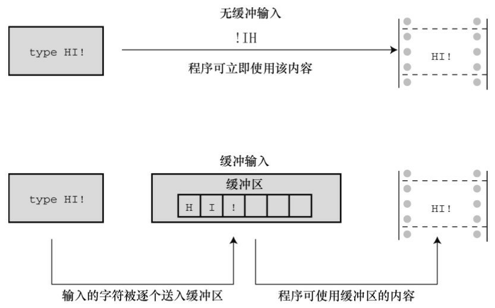
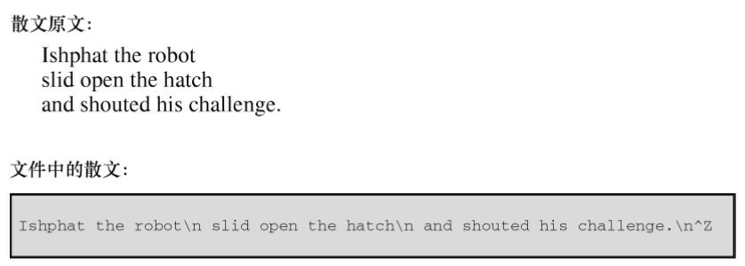

# 第8章 字符输入/输出和输入验证
本章介绍以下内容：

* 更详细地介绍输入、输出以及缓冲输入和无缓冲输入的区别
* 如何通过键盘模拟文件结尾条件
* 如何使用重定向把程序和文件相连接
* 创建更友好的用户界面

在涉及计算机的话题时，我们经常会提到输入（input）和输出（output）。我们谈论输入和输出设备（如键盘、U盘、扫描仪和激光打印机），讲解如何处理输入数据和输出数据，讨论执行输入和输出任务的函数。本章主要介绍用于输入和输出的函数（简称I/O函数）。

I/O函数（如printf()、scanf()、getchar()、putchar()等）负责把信息传送到程序中。前几章简单介绍过这些函数，本章将详细介绍它们的基本概念。同时，还会介绍如何设计与用户交互的界面。

最初，输入/输出函数不是C定义的一部分，C把开发这些函数的任务留给编译器的实现者来完成。在实际应用中，UNIX 系统中的 C 实现为这些函数提供了一个模型。ANSI C 库吸取成功的经验，把大量的UNIX I/O函数囊括其中，包括一些我们曾经用过的。由于必须保证这些标准函数在不同的计算机环境中能正常工作，所以它们很少使用某些特殊系统才有的特性。因此，许多C供应商会利用硬件的特性，额外提供一些I/O函数。其他函数或函数系列需要特殊的操作系统支持，如Winsows或Macintosh OS提供的特殊图形界面。这些有针对性、非标准的函数让程序员能更有效地使用特定计算机编写程序。本章只着重讲解所有系统都通用的标准 I/O 函数，用这些函数编写的可移植程序很容易从一个系统移植到另一个系统。处理文件输入/输出的程序也可以使用这些函数。

许多程序都有输入验证，即判断用户的输入是否与程序期望的输入匹配。本章将演示一些与输入验证相关的问题和解决方案。

## 8.1 单字符I/O：getchar()和putchar()
第 7 章中提到过，getchar()和 putchar()每次只处理一个字符。你可能认为这种方法实在太笨拙了，毕竟与我们的阅读方式相差甚远。但是，这种方法很适合计算机。而且，这是绝大多数文本（即，普通文字）处理程序所用的核心方法。为了帮助读回忆这些函数的工作方式，请看程序清单8.1。该程序获取从键盘输入的字符，并把这些字符发送到屏幕上。程序使用while 循环，当读到#字符时停止。

程序清单8.1 echo.c程序
```c
/* echo.c -- 重复输入 */
#include <stdio.h>
int main(void)
{
    char ch;
    while ((ch = getchar()) != '#')
        putchar(ch);
    return 0;
}
```

自从ANSI C标准发布以后，C就把stdio.h头文件与使用getchar()和putchar()相关联，这就是为什么程序中要包含这个头文件的原因（其实，getchar()和 putchar()都不是真正的函数，它们被定义为供预处理器使用的宏，我们在第16章中再详细讨论）。运行该程序后，与用户的交互如下：
```c
Hello, there. I would[enter]
Hello, there. I would
like a #3 bag of potatoes.[enter]
like a
```

读者可能好奇，为何输入的字符能直接显示在屏幕上？如果用一个特殊字符（如，#）来结束输入，就无法在文本中使用这个字符，是否有更好的方法结束输入？要回答这些问题，首先要了解 C程序如何处理键盘输入，尤其是缓冲和标准输入文件的概念。

## 8.2 缓冲区
如果在老式系统运行程序清单8.1，你输入文本时可能显示如下：
```c
HHeelllloo,, tthheerree..II wwoouulldd[enter]
lliikkee aa #
```

以上行为是个例外。像这样回显用户输入的字符后立即重复打印该字符是属于无缓冲（或直接）输入，即正在等待的程序可立即使用输入的字符。对于该例，大部分系统在用户按下Enter键之前不会重复打印刚输入的字符，这种输入形式属于缓冲输入。用户输入的字符被收集并储存在一个被称为缓冲区（buffer）的临时存储区，按下Enter键后，程序才可使用用户输入的字符。图8.1比较了这两种输入。



为什么要有缓冲区？首先，把若干字符作为一个块进行传输比逐个发送这些字符节约时间。其次，如果用户打错字符，可以直接通过键盘修正错误。当最后按下Enter键时，传输的是正确的输入。

虽然缓冲输入好处很多，但是某些交互式程序也需要无缓冲输入。例如，在游戏中，你希望按下一个键就执行相应的指令。因此，缓冲输入和无缓冲输入都有用武之地。

缓冲分为两类：完全缓冲I/O和行缓冲I/O。完全缓冲输入指的是当缓冲区被填满时才刷新缓冲区（内容被发送至目的地），通常出现在文件输入中。缓冲区的大小取决于系统，常见的大小是 512 字节和 4096字节。行缓冲I/O指的是在出现换行符时刷新缓冲区。键盘输入通常是行缓冲输入，所以在按下Enter键后才刷新缓冲区。

那么，使用缓冲输入还是无缓冲输入？ANSI C和后续的C标准都规定输入是缓冲的，不过最初K&R把这个决定权交给了编译器的编写者。读者可以运行echo.c程序观察输出的情况，了解所用的输出类型。

ANSI C决定把缓冲输入作为标准的原因是：一些计算机不允许无缓冲输入。如果你的计算机允许无缓冲输入，那么你所用的C编译器很可能会提供一个无缓冲输入的选项。例如，许多IBM PC兼容机的编译器都为支持无缓冲输入提供一系列特殊的函数，其原型都在conio.h头文件中。这些函数包括用于回显无缓冲输入的getche()函数和用于无回显无缓冲输入的getch()函数（回显输入意味着用户输入的字符直接显示在屏幕上，无回显输入意味着击键后对应的字符不显示）。UNIX系统使用另一种不同的方式控制缓冲。在UNIX系统中，可以使用ioctl()函数（该函数属于UNIX库，但是不属于C标准）指定待输入的类型，然后用getchar()执行相应的操作。在ANSI C中，用setbuf()和setvbuf()函数（详见第13章）控制缓冲，但是受限于一些系统的内部设置，这些函数可能不起作用。总之，ANSI没有提供调用无缓冲输入的标准方式，这意味着是否能进行无缓冲输入取决于计算机系统。在这里要对使用无缓冲输入的朋友说声抱歉，本书假设所有的输入都是缓冲输入。

## 8.3 结束键盘输入
在echo.c程序（程序清单8.1）中，只要输入的字符中不含#，那么程序在读到#时才会结束。但是， #也是一个普通的字符，有时不可避免要用到。应该用一个在文本中用不到的字符来标记输入完成，这样的字符不会无意间出现在输入中，在你不希望结束程序的时候终止程序。C 的确提供了这样的字符，不过在此之前，先来了解一下C处理文件的方式。

### 8.3.1 文件、流和键盘输入
文件（file）是存储器中储存信息的区域。通常，文件都保存在某种永久存储器中（如，硬盘、U盘或DVD等）。毫无疑问，文件对于计算机系统相当重要。例如，你编写的C程序就保存在文件中，用来编译C程序的程序也保存在文件中。后者说明，某些程序需要访问指定的文件。当编译储存在名为 echo.c 文件中的程序时，编译器打开echo.c文件并读取其中的内容。当编译器处理完后，会关闭该文件。其他程序，例如文字处理器，不仅要打开、读取和关闭文件，还要把数据写入文件。

C 是一门强大、灵活的语言，有许多用于打开、读取、写入和关闭文件的库函数。从较低层面上，C可以使用主机操作系统的基本文件工具直接处理文件，这些直接调用操作系统的函数被称为底层 I/O （low-level I/O）。由于计算机系统各不相同，所以不可能为普通的底层I/O函数创建标准库，ANSI C也不打算这样做。然而从较高层面上，C还可以通过标准I/O包（standard I/O package）来处理文件。这涉及创建用于处理文件的标准模型和一套标准I/O函数。在这一层面上，具体的C实现负责处理不同系统的差异，以便用户使用统一的界面。

上面讨论的差异指的是什么？例如，不同的系统储存文件的方式不同。有些系统把文件的内容储存在一处，而文件相关的信息储存在另一处；有些系统在文件中创建一份文件描述。在处理文件方面，有些系统使用单个换行符标记行末尾，而其他系统可能使用回车符和换行符的组合来表示行末尾。有些系统用最小字节来衡量文件的大小，有些系统则以字节块的大小来衡量。

如果使用标准 I/O 包，就不用考虑这些差异。因此，可以用 if (ch == '\n')检查换行符。即使系统实际用的是回车符和换行符的组合来标记行末尾，I/O函数会在两种表示法之间相互转换。

从概念上看，C程序处理的是流而不是直接处理文件。流（stream）是一个实际输入或输出映射的理想化数据流。这意味着不同属性和不同种类的输入，由属性更统一的流来表示。于是，打开文件的过程就是把流与文件相关联，而且读写都通过流来完成。

第13章将更详细地讨论文件。本章着重理解C把输入和输出设备视为存储设备上的普通文件，尤其是把键盘和显示设备视为每个C程序自动打开的文件。stdin流表示键盘输入，stdout流表示屏幕输出。getchar()、putchar()、printf()和scanf()函数都是标准I/O包的成员，处理这两个流。

以上讨论的内容说明，可以用处理文件的方式来处理键盘输入。例如，程序读文件时要能检测文件的末尾才知道应在何处停止。因此，C 的输入函数内置了文件结尾检测器。既然可以把键盘输入视为文件，那么也应该能使用文件结尾检测器结束键盘输入。下面我们从文件开始，学习如何结束文件。

### 8.3.2 文件结尾
计算机操作系统要以某种方式判断文件的开始和结束。检测文件结尾的一种方法是，在文件末尾放一个特殊的字符标记文件结尾。CP/M、IBMDOS和MS-DOS的文本文件曾经用过这种方法。如今，这些操作系统可以使用内嵌的Ctrl+Z字符来标记文件结尾。这曾经是操作系统使用的唯一标记，不过现在有一些其他的选择，例如记录文件的大小。所以现代的文本文件不一定有嵌入的Ctrl+Z，但是如果有，该操作系统会将其视为一个文件结尾标记。图8.2演示了这种方法。



操作系统使用的另一种方法是储存文件大小的信息。如果文件有3000字节，程序在读到3000字节时便达到文件的末尾。MS-DOS 及其相关系统使用这种方法处理二进制文件，因为用这种方法可以在文件中储存所有的字符，包括Ctrl+Z。新版的DOS也使用这种方法处理文本文件。UNIX使用这种方法处理所有的文件。

无论操作系统实际使用何种方法检测文件结尾，在C语言中，用getchar()读取文件检测到文件结尾时将返回一个特殊的值，即EOF（end of file的缩写）。scanf()函数检测到文件结尾时也返回EOF。通常， EOF定义在stdio.h文件中：
```c
#define EOF (-1)
```

为什么是-1？因为getchar()函数的返回值通常都介于0～127，这些值对应标准字符集。但是，如果系统能识别扩展字符集，该函数的返回值可能在0～255之间。无论哪种情况，-1都不对应任何字符，所以，该值可用于标记文件结尾。

某些系统也许把EOF定义为-1以外的值，但是定义的值一定与输入字符所产生的返回值不同。如果包含stdio.h文件，并使用EOF符号，就不必担心EOF值不同的问题。这里关键要理解EOF是一个值，标志着检测到文件结尾，并不是在文件中找得到的符号。

那么，如何在程序中使用EOF？把getchar()的返回值和EOF作比较。如果两值不同，就说明没有到达文件结尾。也就是说，可以使用下面这样的表达式：
```c
while ((ch = getchar()) != EOF)
```

如果正在读取的是键盘输入不是文件会怎样？绝大部分系统（不是全部）都有办法通过键盘模拟文件结尾条件。了解这些以后，读者可以重写程序清单8.1的程序，如程序清单8.2所示。

程序清单8.2 echo_eof.c程序
```c
/* echo_eof.c -- 重复输入，直到文件结尾 */
#include <stdio.h>
int main(void)
{
    int ch;
    while ((ch = getchar()) != EOF)
        putchar(ch);
    return 0;
}
```

注意下面几点。

不用定义EOF，因为stdio.h中已经定义过了。

不用担心EOF的实际值，因为EOF在stdio.h中用#define预处理指令定义，可直接使用，不必再编写代码假定EOF为某值。

变量ch的类型从char变为int，因为char类型的变量只能表示0～255的无符号整数，但是EOF的值是-1。还好，getchar()函数实际返回值的类型是int，所以它可以读取EOF字符。如果实现使用有符号的char类型，也可以把ch声明为char类型，但最好还是用更通用的形式。

由于getchar()函数的返回类型是int，如果把getchar()的返回值赋给char类型的变量，一些编译器会警告可能丢失数据。

ch是整数不会影响putchar()，该函数仍然会打印等价的字符。

使用该程序进行键盘输入，要设法输入EOF字符。不能只输入字符EOF，也不能只输入-1（输入-1会传送两个字符：一个连字符和一个数字1）。正确的方法是，必须找出当前系统的要求。例如，在大多数UNIX和Linux系统中，在一行开始处按下Ctrl+D会传输文件结尾信号。许多微型计算机系统都把一行开始处的Ctrl+Z识别为文件结尾信号，一些系统把任意位置的Ctrl+Z解释成文件结尾信号。

下面是在UNIX系统下运行echo_eof.c程序的缓冲示例：
```c
She walks in beauty, like the night
She walks in beauty, like the night
Of cloudless climes and starry skies...
Of cloudless climes and starry skies...
Lord Byron
Lord Byron
[Ctrl+D]
```

每次按下Enter键，系统便会处理缓冲区中储存的字符，并在下一行打印该输入行的副本。这个过程一直持续到以UNIX风格模拟文件结尾（按下Ctrl+D）。在PC中，要按下Ctrl+Z。

我们暂停一会。既然echo_eof.c程序能把用户输入的内容拷贝到屏幕上，那么考虑一下该程序还可以做什么。假设以某种方式把一个文件传送给它，然后它把文件中的内容打印在屏幕上，当到达文件结尾发现EOF信号时停止。或者，假设以某种方式把程序的输出定向到一个文件，然后通过键盘输入数据，用echo_eof.c 来储存在文件中输入的内容。假设同时使用这两种方法：把输入从一个文件定向到echo_eof.c中，并把输出发送至另一个文件，然后便可以使用echo_eof.c来拷贝文件。这个小程序有查看文件内容、创建一个新文件、拷贝文件的潜力，没想到一个小程序竟然如此多才多艺！关键是要控制输入流和输出流，这是我们下一个要讨论的主题。

注意 模拟EOF和图形界面

模拟EOF的概念是在使用文本界面的命令行环境中产生的。在这种环境中，用户通过击键与程序交互，由操作系统生成EOF信号。但是在一些实际应用中，却不能很好地转换成图形界面（如Windows和Macintosh），这些用户界面包含更复杂的鼠标移动和按钮点击。程序要模拟EOF的行为依赖于编译器和项目类型。例如，Ctrl+Z可以结束输入或整个程序，这取决于特定的设置。

## 8.4 重定向和文件
输入和输出涉及函数、数据和设备。例如，考虑 echo_eof.c，该程序使用输入函数 getchar()。输出设备（我们假设）是键盘，输入数据流由字符组成。假设你希望输入函数和数据类型不变，仅改变程序查找数据的位置。那么，程序如何知道去哪里查找输入？

在默认情况下，C程序使用标准I/O包查找标准输入作为输入源。这就是前面介绍过的stdin流，它是把数据读入计算机的常用方式。它可以是一个过时的设备，如磁带、穿孔卡或电传打印机，或者（假设）是键盘，甚至是一些先进技术，如语音输入。然而，现代计算机非常灵活，可以让它到别处查找输入。尤其是，可以让一个程序从文件中查找输入，而不是从键盘。

程序可以通过两种方式使用文件。第 1 种方法是，显式使用特定的函数打开文件、关闭文件、读取文件、写入文件，诸如此类。我们在第13章中再详细介绍这种方法。第2种方法是，设计能与键盘和屏幕互动的程序，通过不同的渠道重定向输入至文件和从文件输出。换言之，把stdin流重新赋给文件。继续使用getchar()函数从输入流中获取数据，但它并不关心从流的什么位置获取数据。虽然这种重定向的方法在某些方面有些限制，但是用起来比较简单，而且能让读者熟悉普通的文件处理技术。

重定向的一个主要问题与操作系统有关，与C无关。尽管如此，许多C环境中（包括UNIX、Linux和Windows命令提示模式）都有重定向特性，而且一些C实现还在某些缺乏重定向特性的系统中模拟它。在UNIX上运行苹果OS X，可以用UNIX命令行模式启动Terminal应用程序。接下来我们介绍UNIX、Linux和Windows的重定向。

### 8.4.1 UNIX、Linux和DOS重定向
UNIX（运行命令行模式时）、Linux（ditto）和Window命令行提示（模仿旧式DOS命令行环境）都能重定向输入、输出。重定向输入让程序使用文件而不是键盘来输入，重定向输出让程序输出至文件而不是屏幕。

1. 重定向输入

假设已经编译了echo_eof.c 程序，并把可执行版本放入一个名为echo_eof（或者在Windows系统中名为echo_eof.exe）的文件中。运行该程序，输入可执行文件名：
```c
echo_eof
```

该程序的运行情况和前面描述的一样，获取用户从键盘输入的输入。现在，假设你要用该程序处理名为words的文本文件。文本文件（text file）是内含文本的文件，其中储存的数据是我们可识别的字符。文件的内容可以是一篇散文或者C程序。内含机器语言指令的文件（如储存可执行程序的文件）不是文本文件。由于该程序的操作对象是字符，所以要使用文本文件。只需用下面的命令代替上面的命令即可：
```c
echo_eof < words
```

< 符号是UNIX和DOS/Windows的重定向运算符。该运算符使words文件与stdin流相关联，把文件中的内容导入echo_eof程序。echo_eof程序本身并不知道（或不关心）输入的内容是来自文件还是键盘，它只知道这是需要导入的字符流，所以它读取这些内容并把字符逐个打印在屏幕上，直至读到文件结尾。因为C把文件和I/O设备放在一个层面，所以文件就是现在的I/O设备。试试看！

注意 重定向

对于UNIX、Linux和Windows命令提示，<两侧的空格是可选的。一些系统，如AmigaDOS（那些喜欢怀旧的人使用的系统），支持重定向，但是在重定向符号和文件名之间不允许有空格。

下面是一个特殊的words文件的运行示例，$是UNIX和Linux的标准提示符。在Windows/DOS系统中见到的DOS提示可能是A>或C>。
```c
$ echo_eof < words
The world is too much with us: late and soon,
Getting and spending, we lay waste our powers:
Little we see in Nature that is ours;
We have given our hearts away, a sordid boon!
$
```

2. 重定向输出

现在假设要用echo_eof把键盘输入的内容发送到名为mywords的文件中。然后，输入以下命令并开始输入：
```c
echo_eof>mywords
```

>符号是第2个重定向运算符。它创建了一个名为mywords的新文件，然后把echo_eof的输出（即，你输入字符的副本）重定向至该文件中。重定向把stdout从显示设备（即，显示器）赋给mywords文件。如果已经有一个名为mywords的文件，通常会擦除该文件的内容，然后替换新的内容（但是，许多操作系统有保护现有文件的选项，使其成为只读文件）。所有出现在屏幕的字母都是你刚才输入的，其副本储存在文件中。在下一行的开始处按下Ctrl+D（UNIX）或Ctrl+Z（DOS）即可结束该程序。如果不知道输入什么内容，可参照下面的示例。这里，我们使用UNIX提示符$。记住在每行的末尾单击Enter键，这样才能把缓冲区的内容发送给程序。
```c
$ echo_eof > mywords
You should have no problem recalling which redirection
operator does what. Just remember that each operator 
points
in the direction the information flows. Think of it as
a funnel.
[Ctrl+D]
$
```

按下Ctrl+D或Ctrl+Z后，程序会结束，你的系统会提示返回。程序是否起作用了？UNIX的ls命令或Windows命令行提示模式的dir命令可以列出文件名，会显示mywords文件已存在。可以使用UNIX或Linux的cat或DOS的type命令检查文件中的内容，或者再次使用echo_eof，这次把文件重定向到程序：
```c
$ echo_eof < mywords
You should have no problem recalling which redirection
operator does what. Just remember that each operator points
in the direction the information flows. Think of it as a
funnel.
$
```

3. 组合重定向

现在，假设你希望制作一份mywords文件的副本，并命名为savewords。只需输入以下命令即可：
```c
echo_eof < mywords > savewords
```

下面的命令也起作用，因为命令与重定向运算符的顺序无关：
```c
echo_eof > savewords < mywords
```

注意：在一条命令中，输入文件名和输出文件名不能相同。
```c
echo_eof < mywords > mywords....<--错误
```

原因是> mywords在输入之前已导致原mywords的长度被截断为0。

总之，在UNIX、Linux或Windows/DOS系统中使用两个重定向运算符（<和>）时，要遵循以下原则。

重定向运算符连接一个可执行程序（包括标准操作系统命令）和一个数据文件，不能用于连接一个数据文件和另一个数据文件，也不能用于连接一个程序和另一个程序。

使用重定向运算符不能读取多个文件的输入，也不能把输出定向至多个文件。

通常，文件名和运算符之间的空格不是必须的，除非是偶尔在UNIXshell、Linux shell或Windows命令行提示模式中使用的有特殊含义的字符。例如，我们用过的echo_eof<words。

以上介绍的都是正确的例子，下面来看一下错误的例子，addup和count是两个可执行程序，fish和beets是两个文本文件：
```c
fish > beets            ←违反第1条规则
addup < count           ←违反第1条规则
addup < fish < beets    ←违反第2条规则
count > beets fish      ←违反第2条规则
```

UNIX、Linux或Windows/DOS 还有>>运算符，该运算符可以把数据添加到现有文件的末尾，而 | 运算符能把一个文件的输出连接到另一个文件的输入。欲了解所有相关运算符的内容，请参阅 UNIX 的相关书籍，如UNIXPrimer Plus，Third Edition（Wilson、Pierce和Wessler合著）。

4. 注释

重定位让你能使用键盘输入程序文件。要完成这一任务，程序要测试文件的末尾。例如，第 7 章演示的统计单词程序（程序清单7.7），计算单词个数直至遇到第1个|字符。把ch的char类型改成int类型，把循环测试中的|替换成EOF，便可用该程序来计算文本文件中的单词量。

重定向是一个命令行概念，因为我们要在命令行输入特殊的符号发出指令。如果不使用命令行环境，也可以使用重定向。首先，一些集成开发环境提供了菜单选项，让用户指定重定向。其次，对于 Windows系统，可以打开命令提示窗口，并在命令行运行可执行文件。Microsoft Visual Studio的默认设置是把可执行文件放在项目文件夹的子文件夹，称为Debug。文件名和项目名的基本名相同，文件名的扩展名为.exe。默认情况下，Xcode在给项目命名后才能命名可执行文件，并将其放在Debug文件夹中。在UNIX系统中，可以通过Terminal工具运行可执行文件。从使用上看，Terminal比命令行编译器（GCC或Clang）简单。

如果用不了重定向，可以用程序直接打开文件。程序清单8.3演示了一个注释较少的示例。我们学到第13章时再详细讲解。待读取的文件应该与可执行文件位于同一目录。

程序清单8.3 file_eof.c程序
```c
// file_eof.c --打开一个文件并显示该文件
#include <stdio.h>
#include <stdlib.h>       // 为了使用exit()
int main()
{
    int ch;
    FILE * fp;
    char fname[50];       // 储存文件名
    printf("Enter the name of the file: ");
    scanf("%s", fname);
    fp = fopen(fname, "r");   // 打开待读取文件
    if (fp == NULL)       // 如果失败
    {
        printf("Failed to open file. Bye\n");
        exit(1);         // 退出程序
    }
    // getc(fp)从打开的文件中获取一个字符
    while ((ch = getc(fp)) != EOF)
        putchar(ch);
    fclose(fp);          // 关闭文件
    return 0;
}
```

小结：如何重定向输入和输出

绝大部分C系统都可以使用重定向，可以通过操作系统重定向所有程序，或只在C编译器允许的情况下重定向C程序。假设prog是可执行程序名，file1和file2是文件名。

把输出重定向至文件：>
```c
prog >file1
```

把输入重定向至文件：<
```c
prog <file2
```

组合重定向：
```c
prog <file2 >file1
prog >file1 <file2
```

这两种形式都是把file2作为输入、file1作为输出。

留白：

一些系统要求重定向运算符左侧有一个空格，右侧没有空格。而其他系统（如，UNIX）允许在重定位运算符两侧有空格或没有空格。

## 8.5 创建更友好的用户界面
大部分人偶尔会写一些中看不中用的程序。还好，C提供了大量工具让输入更顺畅，处理过程更顺利。不过，学习这些工具会导致新的问题。本节的目标是，指导读者解决这些问题并创建更友好的用户界面，让交互数据输入更方便，减少错误输入的影响。

### 8.5.1 使用缓冲输入
缓冲输入用起来比较方便，因为在把输入发送给程序之前，用户可以编辑输入。但是，在使用输入的字符时，它也会给程序员带来麻烦。前面示例中看到的问题是，缓冲输入要求用户按下Enter键发送输入。这一动作也传送了换行符，程序必须妥善处理这个麻烦的换行符。我们以一个猜谜程序为例。用户选择一个数字，程序猜用户选中的数字是多少。该程序使用的方法单调乏味，先不要在意算法，我们关注的重点在输入和输出。查看程序清单8.4，这是猜谜程序的最初版本，后面我们会改进。

程序清单8.4 guess.c程序
```c
/* guess.c -- 一个拖沓且错误的猜数字程序 */
#include <stdio.h>
int main(void)
{
    int guess = 1;
    printf("Pick an integer from 1 to 100. I will try to guess ");
    printf("it.\nRespond with a y if my guess is right and with");
    printf("\nan n if it is wrong.\n");
    printf("Uh...is your number %d?\n", guess);
    while (getchar() != 'y')   /* 获取响应，与 y 做对比 */
        printf("Well, then, is it %d?\n", ++guess);
    printf("I knew I could do it!\n");
    return 0;
}
```

下面是程序的运行示例：
```c
Pick an integer from 1 to 100. I will try to guess it.
Respond with a y if my guess is right and with
an n if it is wrong.
Uh...is your number 1?
n
Well, then, is it 2?
Well, then, is it 3?
n
Well, then, is it 4?
Well, then, is it 5?
y
I knew I could do it!
```

撇开这个程序糟糕的算法不谈，我们先选择一个数字。注意，每次输入n 时，程序打印了两条消息。这是由于程序读取n作为用户否定了数字1，然后还读取了一个换行符作为用户否定了数字2。

一种解决方案是，使用while循环丢弃输入行最后剩余的内容，包括换行符。这种方法的优点是，能把no和no way这样的响应视为简单的n。程序清单8.4的版本会把no当作两个响应。下面用循环修正char response;这个问题：
```c
while (getchar() != 'y')  /* 获取响应，与 y 做对比*/
{
    printf("Well, then, is it %d?\n", ++guess);
    while (getchar() != '\n')
        continue;     /* 跳过剩余的输入行 */
}
```

使用以上循环后，该程序的输出示例如下：
```c
Pick an integer from 1 to 100. I will try to guess it.
Respond with a y if my guess is right and with
an n if it is wrong.
Uh...is your number 1?
n
Well, then, is it 2?
no
Well, then, is it 3?
no sir
Well, then, is it 4?
forget it
Well, then, is it 5?
y
I knew I could do it!
```

这的确是解决了换行符的问题。但是，该程序还是会把f被视为n。我们用if语句筛选其他响应。首先，添加一个char类型的变量储存响应：

修改后的循环如下：
```c
    while ((response = getchar()) != 'y') /* 获取响应 */
    {
        if (response == 'n')
            printf("Well, then, is it %d?\n", ++guess);
        else
            printf("Sorry, I understand only y or n.\n");
        while (getchar() != '\n')
            continue; /* 跳过剩余的输入行 */
    }
```

现在，程序的运行示例如下：
```c
Pick an integer from 1 to 100. I will try to guess it.
Respond with a y if my guess is right and with
an n if it is wrong.
Uh...is your number 1?
n
Well, then, is it 2?
no
Well, then, is it 3?
no sir
Well, then, is it 4?
forget it
Sorry, I understand only y or n.
n
Well, then, is it 5?
y
I knew I could do it!
```

在编写交互式程序时，应该事先预料到用户可能会输入错误，然后设计程序处理用户的错误输入。在用户出错时通知用户再次输入。

当然，无论你的提示写得多么清楚，总会有人误解，然后抱怨这个程序设计得多么糟糕。

### 8.5.2 混合数值和字符输入
假设程序要求用 getchar()处理字符输入，用 scanf()处理数值输入，这两个函数都能很好地完成任务，但是不能把它们混用。因为 getchar()读取每个字符，包括空格、制表符和换行符；而 scanf()在读取数字时则会跳过空格、制表符和换行符。

我们通过程序清单8.5来解释这种情况导致的问题。该程序读入一个字符和两个数字，然后根据输入的两个数字指定的行数和列数打印该字符。

程序清单8.5 showchar1.c程序
```c
/* showchar1.c -- 有较大 I/O 问题的程序 */
#include <stdio.h>
void display(char cr, int lines, int width);
int main(void)
{
    int ch;        /* 待打印字符  */
    int rows, cols;    /* 行数和列数 */
    printf("Enter a character and two integers:\n");
    while ((ch = getchar()) != '\n')
    {
        scanf("%d %d", &rows, &cols);
        display(ch, rows, cols);
        printf("Enter another character and two integers;\n");
        printf("Enter a newline to quit.\n");
    }
    printf("Bye.\n");
    return 0;
}

void display(char cr, int lines, int width)
{
    int row, col;
    for (row = 1; row <= lines; row++)
    {
        for (col = 1; col <= width; col++)
            putchar(cr);
        putchar('\n');/* 结束一行并开始新的一行 */
    }
}
```

注意，该程序以 int 类型读取字符（这样做可以检测 EOF），但是却以 char 类型把字符传递给display()函数。因为char比int小，一些编译器会给出类型转换的警告。可以忽略这些警告，或者用下面的强制类型转换消除警告：
```c
display(char(ch), rows, cols);
```

在该程序中，main()负责获取数据，display()函数负责打印数据。下面是该程序的一个运行示例，看看有什么问题：
```c
Enter a character and two integers:
c 2 3
ccc
ccc
Enter another character and two integers;
Enter a newline to quit.
Bye.
```

该程序开始时运行良好。你输入c 2 3，程序打印c字符2行3列。然后，程序提示输入第2组数据，还没等你输入数据程序就退出了！这是什么情况？又是换行符在捣乱，这次是输入行中紧跟在 3 后面的换行符。scanf()函数把这个换行符留在输入队列中。和 scanf()不同，getchar()不会跳过换行符，所以在进入下一轮迭代时，你还没来得及输入字符，它就读取了换行符，然后将其赋给ch。而ch是换行符正式终止循环的条件。

要解决这个问题，程序要跳过一轮输入结束与下一轮输入开始之间的所有换行符或空格。另外，如果该程序不在getchar()测试时，而在scanf()阶段终止程序会更好。修改后的版本如程序清单8.6所示。

程序清单8.6 showchar2.c程序
```c
/* showchar2.c -- 按指定的行列打印字符 */
#include <stdio.h>
void display(char cr, int lines, int width);
int main(void)
{
    int ch;        /* 待打印字符*/
    int rows, cols;    /* 行数和列数 */
    printf("Enter a character and two integers:\n");
    while ((ch = getchar()) != '\n')
    {
        if (scanf("%d %d", &rows, &cols) != 2)
            break;
        display(ch, rows, cols);
        while (getchar() != '\n')
            continue;
        printf("Enter another character and two integers;\n");
        printf("Enter a newline to quit.\n");
    }
    printf("Bye.\n");
    return 0;
}

void display(char cr, int lines, int width)
{
    int row, col;
    for (row = 1; row <= lines; row++)
    {
        for (col = 1; col <= width; col++)
            putchar(cr);
        putchar('\n');  /* 结束一行并开始新的一行 */
    }
}
```

while循环实现了丢弃scanf()输入后面所有字符（包括换行符）的功能，为循环的下一轮读取做好了准备。该程序的运行示例如下：
```c
Enter a character and two integers:
c 1 2
cc
Enter another character and two integers;
Enter a newline to quit.
! 3 6
!!!!!!
!!!!!!
!!!!!!
Enter another character and two integers;
Enter a newline to quit.

Bye.
```

在if语句中使用一个break语句，可以在scanf()的返回值不等于2时终止程序，即如果一个或两个输入值不是整数或者遇到文件结尾就终止程序。

## 8.6 输入验证
在实际应用中，用户不一定会按照程序的指令行事。用户的输入和程序期望的输入不匹配时常发生，这会导致程序运行失败。作为程序员，除了完成编程的本职工作，还要事先预料一些可能的输入错误，这样才能编写出能检测并处理这些问题的程序。

例如，假设你编写了一个处理非负数整数的循环，但是用户很可能输入一个负数。你可以使用关系表达式来排除这种情况：
```c
long n;
scanf("%ld", &n);   // 获取第1个值
while (n >= 0)      // 检测不在范围内的值
{
    // 处理n
    scanf("%ld", &n);   // 获取下一个值
}
```

另一类潜在的陷阱是，用户可能输入错误类型的值，如字符 q。排除这种情况的一种方法是，检查scanf()的返回值。回忆一下，scanf()返回成功读取项的个数。因此，下面的表达式当且仅当用户输入一个整数时才为真：
```c
scanf("%ld", &n) == 1
```

结合上面的while循环，可改进为：
```c
long n;
while (scanf("%ld", &n) == 1 && n >= 0)
{
    //处理n
}
```

while循环条件可以描述为“当输入是一个整数且该整数为正时”。

对于最后的例子，当用户输入错误类型的值时，程序结束。然而，也可以让程序友好些，提示用户再次输入正确类型的值。在这种情况下，要处理有问题的输入。如果scanf()没有成功读取，就会将其留在输入队列中。这里要明确，输入实际上是字符流。可以使用getchar()函数逐字符地读取输入，甚至可以把这些想法都结合在一个函数中，如下所示：
```c
long get_long(void)
{
    long input;
    char ch;
    while (scanf("%ld", &input) != 1)
    {
        while ((ch = getchar()) != '\n')
            putchar(ch); // 处理错误的输入
        printf(" is not an integer.\nPlease enter an ");
        printf("integer value, such as 25, -178, or 3: ");
    }
    return input;
}
```

该函数要把一个int类型的值读入变量input中。如果读取失败，函数则进入外层while循环体。然后内层循环逐字符地读取错误的输入。注意，该函数丢弃该输入行的所有剩余内容。还有一个方法是，只丢弃下一个字符或单词，然后该函数提示用户再次输入。外层循环重复运行，直到用户成功输入整数，此时scanf()的返回值为1。

在用户输入整数后，程序可以检查该值是否有效。考虑一个例子，要求用户输入一个上限和一个下限来定义值的范围。在该例中，你可能希望程序检查第1个值是否大于第2个值（通常假设第1个值是较小的那个值），除此之外还要检查这些值是否在允许的范围内。例如，当前的档案查找一般不会接受 1958 年以前和2014年以后的查询任务。这个限制可以在一个函数中实现。

假设程序中包含了stdbool.h 头文件。如果当前系统不允许使用_Bool，把bool替换成int，把true 替换成 1，把 false 替换成 0 即可。注意，如果输入无效，该函数返回 true，所以函数名为bad_limits()：
```c
bool bad_limits(long begin, long end,long low, long high)
{
    bool not_good = false;
    if (begin > end)
    {
        printf("%ld isn't smaller than %ld.\n", begin, end);
        not_good = true;
    }
    if (begin < low || end < low)
    {
        printf("Values must be %ld or greater.\n", low);
        not_good = true;
    }
    if (begin > high || end > high)
    {
        printf("Values must be %ld or less.\n", high);
        not_good = true;
    }
    return not_good;
}
```

程序清单8.7使用了上面的两个函数为一个进行算术运算的函数提供整数，该函数计算特定范围内所有整数的平方和。程序限制了范围的上限是10000000，下限是-10000000。

程序清单8.7 checking.c程序
```c
// checking.c -- 输入验证
#include <stdio.h>
#include <stdbool.h>

// 验证输入是一个整数
long get_long(void);
// 验证范围的上下限是否有效
bool bad_limits(long begin, long end,
long low, long high);
// 计算a～b之间的整数平方和
double sum_squares(long a, long b);

int main(void)
{
    const long MIN = -10000000L;  // 范围的下限
    const long MAX = +10000000L;  // 范围的上限
    long start;            // 用户指定的范围最小值
    long stop;             // 用户指定的范围最大值
    double answer;
    printf("This program computes the sum of the squares of "
    "integers in a range.\nThe lower bound should not "
    "be less than -10000000 and\nthe upper bound "
    "should not be more than +10000000.\nEnter the "
    "limits (enter 0 for both limits to quit):\n"
    "lower limit: ");
    start = get_long();
    printf("upper limit: ");
    stop = get_long();
    while (start != 0 || stop != 0)
    {
        if (bad_limits(start, stop, MIN, MAX))
            printf("Please try again.\n");
        else
        {
            answer = sum_squares(start, stop);
            printf("The sum of the squares of the integers ");
            printf("from %ld to %ld is %g\n",
            start, stop, answer);
        }
        printf("Enter the limits (enter 0 for both "
        "limits to quit):\n");
        printf("lower limit: ");
        start = get_long();
        printf("upper limit: ");
        stop = get_long();
    }
    printf("Done.\n");
    return 0;
}

long get_long(void)
{
    long input;
    char ch;
    while (scanf("%ld", &input) != 1)
    {
        while ((ch = getchar()) != '\n')
            putchar(ch);       // 处理错误输入
        printf(" is not an integer.\nPlease enter an ");
        printf("integer value, such as 25, -178, or 3: ");
    }
    return input;
}

double sum_squares(long a, long b)
{
    double total = 0;
    long i;
    for (i = a; i <= b; i++)
        total += (double) i * (double) i;
    return total;
}

bool bad_limits(long begin, long end, long low, long high)
{
    bool not_good = false;
    if (begin > end)
    {
        printf("%ld isn't smaller than %ld.\n", begin, end);
        not_good = true;
    }
    if (begin < low || end < low)
    {
        printf("Values must be %ld or greater.\n", low);
        not_good = true;
    }
    if (begin > high || end > high)
    {
        printf("Values must be %ld or less.\n", high);
        not_good = true;
    }
    return not_good;
}
```

下面是该程序的输出示例：
```c
This program computes the sum of the squares of integers in a range.
The lower bound should not be less than -10000000 and
the upper bound should not be more than +10000000.
Enter the limits (enter 0 for both limits to quit):
lower limit: low
low is not an integer.
Please enter an integer value, such as 25, -178, or 3: 3
upper limit: a big number
a big number is not an integer.
Please enter an integer value, such as 25, -178, or 3: 12
The sum of the squares of the integers from 3 to 12 is 645
Enter the limits (enter 0 for both limits to quit):
lower limit: 80
upper limit: 10
80 isn't smaller than 10.
Please try again.
Enter the limits (enter 0 for both limits to quit):
lower limit: 0
upper limit: 0
Done.
```

### 8.6.1 分析程序
虽然checking.c程序的核心计算部分（sum_squares()函数）很短，但是输入验证部分比以往程序示例要复杂。接下来分析其中的一些要素，先着重讨论程序的整体结构。

程序遵循模块化的编程思想，使用独立函数（模块）来验证输入和管理显示。程序越大，使用模块化编程就越重要。

main()函数管理程序流，为其他函数委派任务。它使用 get_long()获取值、while 循环处理值、badlimits()函数检查值是否有效、sum_squres()函数处理实际的计算：
```c
start = get_long();
printf("upper limit: ");
stop = get_long();
while (start != 0 || stop != 0)
{
    if (bad_limits(start, stop, MIN, MAX))
        printf("Please try again.\n");
    else
    {
        answer = sum_squares(start, stop);
        printf("The sum of the squares of the integers ");
        printf("from %ld to %ld is %g\n", start, stop, answer);
    }
    printf("Enter the limits (enter 0 for both "
    "limits to quit):\n");
    printf("lower limit: ");
    start = get_long();
    printf("upper limit: ");
    stop = get_long();
}
```

### 8.6.2 输入流和数字
在编写处理错误输入的代码时（如程序清单8.7），应该很清楚C是如何处理输入的。考虑下面的输入：
```c
is 28 12.4
```

在我们眼中，这就像是一个由字符、整数和浮点数组成的字符串。但是对 C程序而言，这是一个字节流。第1个字节是字母i的字符编码，第2个字节是字母s的字符编码，第3个字节是空格字符的字符编码，第4个字节是数字2的字符编码，等等。所以，如果get_long()函数处理这一行输入，第1个字符是非数字，那么整行输入都会被丢弃，包括其中的数字，因为这些数字只是该输入行中的其他字符：
```c
while ((ch = getchar()) != '\n')
    putchar(ch); // 处理错误的输入
```

虽然输入流由字符组成，但是也可以设置scanf()函数把它们转换成数值。例如，考虑下面的输入：
```c
42
```

如果在scanf()函数中使用%c转换说明，它只会读取字符4并将其储存在char类型的变量中。如果使用%s转换说明，它会读取字符4和字符2这两个字符，并将其储存在字符数组中。如果使用%d转换说明，scanf()同样会读取两个字符，但是随后会计算出它们对应的整数值：4×10+2，即42，然后将表示该整数的二进制数储存在 int 类型的变量中。如果使用%f 转换说明，scanf()也会读取两个字符，计算出它们对应的数值42.0，用内部的浮点表示法表示该值，并将结果储存在float类型的变量中。

简而言之，输入由字符组成，但是scanf()可以把输入转换成整数值或浮点数值。使用转换说明（如%d或%f）限制了可接受输入的字符类型，而getchar()和使用%c的scanf()接受所有的字符。

## 8.7 菜单浏览
许多计算机程序都把菜单作为用户界面的一部分。菜单给用户提供方便的同时，却给程序员带来了一些麻烦。我们看看其中涉及了哪些问题。

菜单给用户提供了一份响应程序的选项。假设有下面一个例子：
```c
Enter the letter of your choice:
a. advice       b. bell
c. count        q. quit
```

理想状态是，用户输入程序所列选项之一，然后程序根据用户所选项完成任务。作为一名程序员，自然希望这一过程能顺利进行。因此，第1个目标是：当用户遵循指令时程序顺利运行；第2个目标是：当用户没有遵循指令时，程序也能顺利运行。显而易见，要实现第 2 个目标难度较大，因为很难预料用户在使用程序时的所有错误情况。

现在的应用程序通常使用图形界面，可以点击按钮、查看对话框、触摸图标，而不是我们示例中的命令行模式。但是，两者的处理过程大致相同：给用户提供选项、检查并执行用户的响应、保护程序不受误操作的影响。除了界面不同，它们底层的程序结构也几乎相同。但是，使用图形界面更容易通过限制选项控制输入。

### 8.7.1 任务
我们来更具体地分析一个菜单程序需要执行哪些任务。它要获取用户的响应，根据响应选择要执行的动作。另外，程序应该提供返回菜单的选项。C 的 switch 语句是根据选项决定行为的好工具，用户的每个选择都可以对应一个特定的case标签。使用while语句可以实现重复访问菜单的功能。因此，我们写出以下伪代码：
```c
获取选项
当选项不是'q'时
转至相应的选项并执行
获取下一个选项
```

### 8.7.2 使执行更顺利
当你决定实现这个程序时，就要开始考虑如何让程序顺利运行（顺利运行指的是，处理正确输入和错误输入时都能顺利运行）。例如，你能做的是让“获取选项”部分的代码筛选掉不合适的响应，只把正确的响应传入switch。这表明需要为输入过程提供一个只返回正确响应的函数。结合while循环和switch语句，其程序结构如下：
```c
#include <stdio.h>
char get_choice(void);
void count(void);
int main(void)
{
    int choice;
    while ((choice = get_choice()) != 'q')
    {
        switch (choice)
        {
            case 'a': printf("Buy low, sell high.\n");
            break;
            case 'b': putchar('\a'); /* ANSI */
            break;
            case 'c': count();
            break;
            default:  printf("Program error!\n");
            break;
        }
    }
    return 0;
}
```

定义get_choice()函数只能返回'a'、'b'、'c'和'q'。get_choice()的用法和getchar()相同，两个函数都是获取一个值，并与终止值（该例中是'q'）作比较。我们尽量简化实际的菜单选项，以便读者把注意力集中在程序结构上。稍后再讨论 count()函数。default 语句可以方便调试。如果get_choice()函数没能把返回值限制为菜单指定的几个选项值，default语句有助于发现问题所在。

get_choice()函数

下面的伪代码是设计这个函数的一种方案：
```c
显示选项
获取用户的响应
当响应不合适时
提示用户再次输入
获取用户的响应
```

下面是一个简单而笨拙的实现：
```c
char get_choice(void)
{
    int ch;
    printf("Enter the letter of your choice:\n");
    printf("a. advice        b. bell\n");
    printf("c. count         q. quit\n");
    ch = getchar();
    while ((ch < 'a' || ch > 'c') && ch != 'q')
    {
        printf("Please respond with a, b, c, or q.\n");
        ch = getchar();
    }
    return ch;
}
```

缓冲输入依旧带来些麻烦，程序把用户每次按下 Return 键产生的换行符视为错误响应。为了让程序的界面更流畅，该函数应该跳过这些换行符。

这类问题有多种解决方案。一种是用名为get_first()的新函数替换getchar()函数，读取一行的第1个字符并丢弃剩余的字符。这种方法的优点是，把类似act这样的输入视为简单的a，而不是继续把act中的c作为选项c的一个有效的响应。我们重写输入函数如下：
```c
char get_choice(void)
{
    int ch;
    printf("Enter the letter of your choice:\n");
    printf("a. advice         b. bell\n");
    printf("c. count          q. quit\n");
    ch = get_first();
    while ((ch < 'a' || ch > 'c') && ch != 'q')
    {
        printf("Please respond with a, b, c, or q.\n");
        ch = getfirst();
    }
    return ch;
}

char get_first(void)
{
    int ch;
    ch = getchar();  /* 读取下一个字符 */
    while (getchar() != '\n')
        continue; /* 跳过该行剩下的内容 */
    return ch;
}
```

### 8.7.3 混合字符和数值输入
前面分析过混合字符和数值输入会产生一些问题，创建菜单也有这样的问题。例如，假设count()函数（选择c）的代码如下：
```c
void count(void)
{
    int n, i;
    printf("Count how far? Enter an integer:\n");
    scanf("%d", &n);
    for (i = 1; i <= n; i++)
        printf("%d\n", i);
}
```

如果输入3作为响应，scanf()会读取3并把换行符留在输入队列中。下次调用 get_choice()将导致get_first()返回这个换行符，从而导致我们不希望出现的行为。

重写 get_first()，使其返回下一个非空白字符而不仅仅是下一个字符，即可修复这个问题。我们把这个任务留给读者作为练习。另一种方法是，在count()函数中清理换行符，如下所示：
```c
void count(void)
{
    int n, i;
    printf("Count how far? Enter an integer:\n");
    n = get_int();
    for (i = 1; i <= n; i++)
        printf("%d\n", i);
    while (getchar() != '\n')
        continue;
}
```

该函数借鉴了程序清单8.7中的get_long()函数，将其改为get_int()获取int类型的数据而不是long类型的数据。回忆一下，原来的get_long()函数如何检查有效输入和让用户重新输入。程序清单8.8演示了菜单程序的最终版本。

程序清单8.8 menuette.c程序
```c
/* menuette.c -- 菜单程序 */
#include <stdio.h>
char get_choice(void);
char get_first(void);
int get_int(void);
void count(void);

int main(void)
{
    int choice;
    void count(void);
    while ((choice = get_choice()) != 'q')
    {
        switch (choice)
        {
            case 'a':  printf("Buy low, sell high.\n");
            break;
            case 'b': putchar('\a');  /* ANSI */
            break;
            case 'c':  count();
            break;
            default:  printf("Program error!\n");
            break;
        }
    }
    printf("Bye.\n");
    return 0;
}

void count(void)
{
    int n, i;
    printf("Count how far? Enter an integer:\n");
    n = get_int();
    for (i = 1; i <= n; i++)
        printf("%d\n", i);
    while (getchar() != '\n')
        continue;
}

char get_choice(void)
{
    int ch;
    printf("Enter the letter of your choice:\n");
    printf("a. advice       b. bell\n");
    printf("c. count        q. quit\n");
    ch = get_first();
    while ((ch < 'a' || ch > 'c') && ch != 'q')
    {
        printf("Please respond with a, b, c, or q.\n");
        ch = get_first();
    }
    return ch;
}

char get_first(void)
{
    int ch;
    ch = getchar();
    while (getchar() != '\n')
        continue;
    return ch;
}

int get_int(void)
{
    int input;
    char ch;
    while (scanf("%d", &input) != 1)
    {
        while ((ch = getchar()) != '\n')
            putchar(ch); // 处理错误输出
        printf(" is not an integer.\nPlease enter an ");
        printf("integer value, such as 25, -178, or 3: ");
    }
    return input;
}
```

下面是该程序的一个运行示例：
```c
Enter the letter of your choice:
a. advice       b. bell
c. count        q. quit
a
Buy low, sell high.
Enter the letter of your choice:
a. advice       b. bell
c. count        q. quit
count
Count how far? Enter an integer:
two
two is not an integer.
Please enter an integer value, such as 25, -178, or 3: 5
1
2
3
4
5
Enter the letter of your choice:
a. advice       b. bell
c. count        q. quit
d
Please respond with a, b, c, or q.
q
Bye.
```

要写出一个自己十分满意的菜单界面并不容易。但是，在开发了一种可行的方案后，可以在其他情况下复用这个菜单界面。

学完以上程序示例后，还要注意在处理较复杂的任务时，如何让函数把任务委派给另一个函数。这样让程序更模块化。

## 8.8 关键概念
C程序把输入作为传入的字节流。getchar()函数把每个字符解释成一个字符编码。scanf()函数以同样的方式看待输入，但是根据转换说明，它可以把字符输入转换成数值。许多操作系统都提供重定向，允许用文件代替键盘输入，用文件代替显示器输出。

程序通常接受特殊形式的输入。可以在设计程序时考虑用户在输入时可能犯的错误，在输入验证部分处理这些错误情况，让程序更强健更友好。

对于一个小型程序，输入验证可能是代码中最复杂的部分。处理这类问题有多种方案。例如，如果用户输入错误类型的信息，可以终止程序，也可以给用户提供有限次或无限次机会重新输入。

## 8.9 本章小结
许多程序使用 getchar()逐字符读取输入。通常，系统使用行缓冲输入，即当用户按下 Enter 键后输入才被传送给程序。按下Enter键也传送了一个换行符，编程时要注意处理这个换行符。ANSI C把缓冲输入作为标准。

通过标准I/O包中的一系列函数，以统一的方式处理不同系统中的不同文件形式，是C语言的特性之一。getchar()和 scanf()函数也属于这一系列。当检测到文件结尾时，这两个函数都返回 EOF（被定义在stdio.h头文件中）。在不同系统中模拟文件结尾条件的方式稍有不同。在UNIX系统中，在一行开始处按下Ctrl+D可以模拟文件结尾条件；而在DOS系统中则使用Ctrl+Z。

许多操作系统（包括UNIX和DOS）都有重定向的特性，因此可以用文件代替键盘和屏幕进行输入和输出。读到EOF即停止读取的程序可用于键盘输入和模拟文件结尾信号，或者用于重定向文件。

混合使用 getchar()和 scanf()时，如果在调用 getchar()之前，scanf()在输入行留下一个换行符，会导致一些问题。不过，意识到这个问题就可以在程序中妥善处理。

编写程序时，要认真设计用户界面。事先预料一些用户可能会犯的错误，然后设计程序妥善处理这些错误情况。

## 8.10 复习题
复习题的参考答案在附录A中。

1. putchar(getchar())是一个有效表达式，它实现什么功能？getchar(putchar())是否也是有效表达式？

2. 下面的语句分别完成什么任务？
```c
a.putchar('H');
b.putchar('\007');
c.putchar('\n');
d.putchar('\b');
```

3. 假设有一个名为 count 的可执行程序，用于统计输入的字符数。设计一个使用 count 程序统计essay文件中字符数的命令行，并把统计结果保存在essayct文件中。

4. 给定复习题3中的程序和文件，下面哪一条是有效的命令？
```c
a.essayct <essay
b.count essay
c.essay >count
```

5. EOF是什么？

6. 对于给定的输出（ch是int类型，而且是缓冲输入），下面各程序段的输出分别是什么？
```c
a.输入如下：
If you quit, I will.[enter]
程序段如下：
while ((ch = getchar()) != 'i')
    putchar(ch);
b.输入如下：
Harhar[enter]
程序段如下：
while ((ch = getchar()) != '\n')
{
    putchar(ch++);
    putchar(++ch);
}
```

7. C如何处理不同计算机系统中的不同文件和换行约定？

8. 在使用缓冲输入的系统中，把数值和字符混合输入会遇到什么潜在的问题？

## 8.11 编程练习
下面的一些程序要求输入以EOF终止。如果你的操作系统很难或根本无法使用重定向，请使用一些其他的测试来终止输入，如读到&字符时停止。

1. 设计一个程序，统计在读到文件结尾之前读取的字符数。

2. 编写一个程序，在遇到 EOF 之前，把输入作为字符流读取。程序要打印每个输入的字符及其相应的ASCII十进制值。注意，在ASCII序列中，空格字符前面的字符都是非打印字符，要特殊处理这些字符。如果非打印字符是换行符或制表符，则分别打印\n或\t。否则，使用控制字符表示法。例如，ASCII的1是Ctrl+A，可显示为^A。注意，A的ASCII值是Ctrl+A的值加上64。其他非打印字符也有类似的关系。除每次遇到换行符打印新的一行之外，每行打印10对值。（注意：不同的操作系统其控制字符可能不同。）

3. 编写一个程序，在遇到 EOF 之前，把输入作为字符流读取。该程序要报告输入中的大写字母和小写字母的个数。假设大小写字母数值是连续的。或者使用ctype.h库中合适的分类函数更方便。

4. 编写一个程序，在遇到EOF之前，把输入作为字符流读取。该程序要报告平均每个单词的字母数。不要把空白统计为单词的字母。实际上，标点符号也不应该统计，但是现在暂时不同考虑这么多（如果你比较在意这点，考虑使用ctype.h系列中的ispunct()函数）。

5. 修改程序清单8.4的猜数字程序，使用更智能的猜测策略。例如，程序最初猜50，询问用户是猜大了、猜小了还是猜对了。如果猜小了，那么下一次猜测的值应是50和100中值，也就是75。如果这次猜大了，那么下一次猜测的值应是50和75的中值，等等。使用二分查找（binary search）策略，如果用户没有欺骗程序，那么程序很快就会猜到正确的答案。

6. 修改程序清单8.8中的get_first()函数，让该函数返回读取的第1个非空白字符，并在一个简单的程序中测试。

7. 修改第7章的编程练习8，用字符代替数字标记菜单的选项。用q代替5作为结束输入的标记。

8. 编写一个程序，显示一个提供加法、减法、乘法、除法的菜单。获得用户选择的选项后，程序提示用户输入两个数字，然后执行用户刚才选择的操作。该程序只接受菜单提供的选项。程序使用float类型的变量储存用户输入的数字，如果用户输入失败，则允许再次输入。进行除法运算时，如果用户输入0作为第2个数（除数），程序应提示用户重新输入一个新值。该程序的一个运行示例如下：
```c
Enter the operation of your choice:
a. add        s. subtract
m. multiply     d. divide
q. quit
a
Enter first number: 22 .4
Enter second number: one
one is not an number.
Please enter a number, such as 2.5, -1.78E8, or 3: 1
22.4 + 1 = 23.4
Enter the operation of your choice:
a. add        s. subtract
m. multiply     d. divide
q. quit
d
Enter first number: 18.4
Enter second number: 0
Enter a number other than 0: 0.2
18.4 / 0.2 = 92
Enter the operation of your choice:
a. add        s. subtract
m. multiply     d. divide
q. quit
q
Bye.
```


