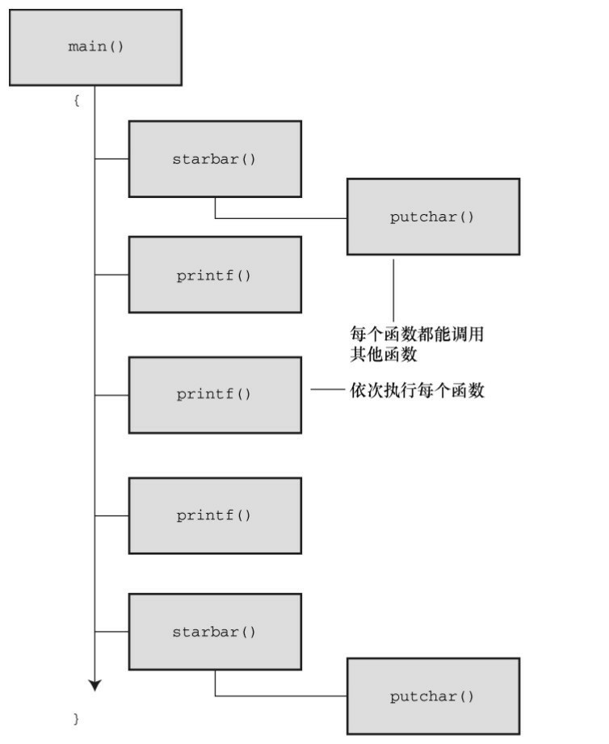
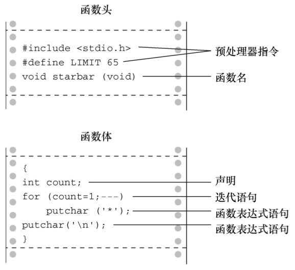
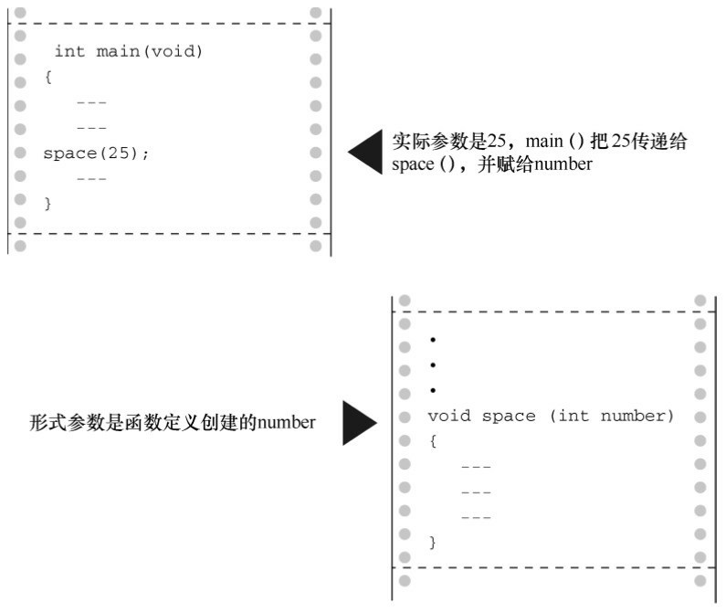
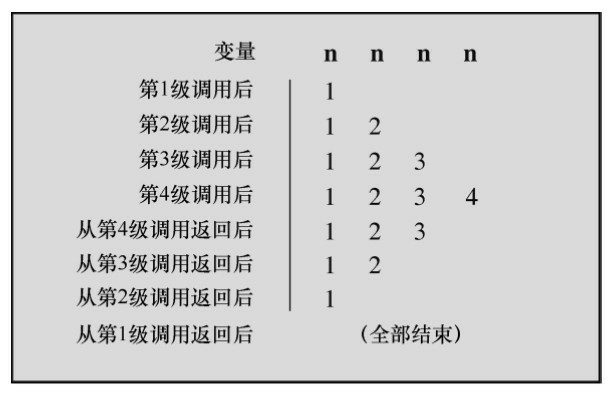
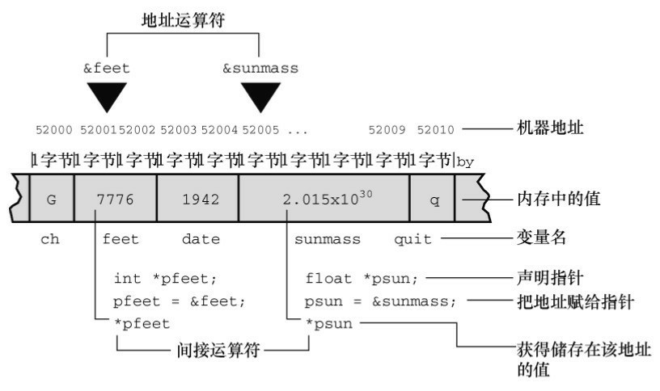
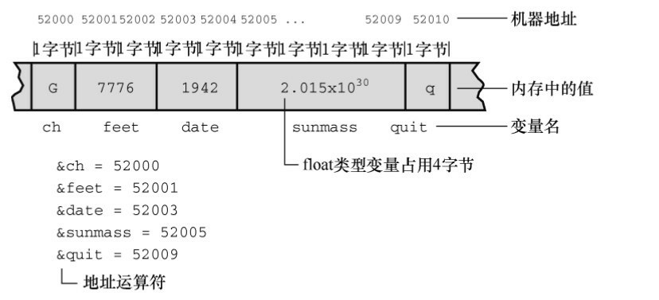

# 第9章 函数
本章介绍以下内容：

* 关键字：return
* 运算符：*（一元）、&（一元）
* 函数及其定义方式
* 如何使用参数和返回值
* 如何把指针变量用作函数参数
* 函数类型
* ANSI C原型
* 递归

如何组织程序？C的设计思想是，把函数用作构件块。我们已经用过C标准库的函数，如printf()、scanf()、getchar()、putchar()和 strlen()。现在要进一步学习如何创建自己的函数。前面章节中已大致介绍了相关过程，本章将巩固以前学过的知识并做进一步的拓展。

## 9.1 复习函数
首先，什么是函数？函数（function）是完成特定任务的独立程序代码单元。语法规则定义了函数的结构和使用方式。虽然C中的函数和其他语言中的函数、子程序、过程作用相同，但是细节上略有不同。一些函数执行某些动作，如printf()把数据打印到屏幕上；一些函数找出一个值供程序使用，如strlen()把指定字符串的长度返回给程序。一般而言，函数可以同时具备以上两种功能。

为什么要使用函数？首先，使用函数可以省去编写重复代码的苦差。如果程序要多次完成某项任务，那么只需编写一个合适的函数，就可以在需要时使用这个函数，或者在不同的程序中使用该函数，就像许多程序中使用putchar()一样。其次，即使程序只完成某项任务一次，也值得使用函数。因为函数让程序更加模块化，从而提高了程序代码的可读性，更方便后期修改、完善。例如，假设要编写一个程序完成以下任务：
```c
读入一系列数字；
分类这些数字；
找出这些数字的平均值；
打印一份柱状图。
```

可以使用下面的程序：
```c
#include <stdio.h>
#define SIZE 50
int main(void)
{
    float list[SIZE];
    readlist(list, SIZE);
    sort(list, SIZE);
    average(list, SIZE);
    bargraph(list, SIZE);
    return 0;
}
```

当然，还要编写4个函数readlist()、sort()、average()和bargraph()的实现细节。描述性的函数名能清楚地表达函数的用途和组织结构。然后，单独设计和测试每个函数，直到函数都能正常完成任务。如果这些函数够通用，还可以用于其他程序。

许多程序员喜欢把函数看作是根据传入信息（输入）及其生成的值或响应的动作（输出）来定义的“黑盒”。如果不是自己编写函数，根本不用关心黑盒的内部行为。例如，使用printf()时，只需知道给该函数传入格式字符串或一些参数以及 printf()生成的输出，无需了解 printf()的内部代码。以这种方式看待函数有助于把注意力集中在程序的整体设计，而不是函数的实现细节上。因此，在动手编写代码之前，仔细考虑一下函数应该完成什么任务，以及函数和程序整体的关系。

如何了解函数？首先要知道如何正确地定义函数、如何调用函数和如何建立函数间的通信。我们从一个简单的程序示例开始，帮助读者理清这些内容，然后再详细讲解。

### 9.1.1 创建并使用简单函数
我们的第1个目标是创建一个在一行打印40个星号的函数，并在一个打印表头的程序中使用该函数。如程序清单9.1所示，该程序由main()和starbar()组成。

程序清单9.1 lethead1.c程序
```c
/* lethead1.c */
#include <stdio.h>
#define NAME "GIGATHINK, INC."
#define ADDRESS "101 Megabuck Plaza"
#define PLACE "Megapolis, CA 94904"
#define WIDTH 40
void starbar(void); /* 函数原型 */
int main(void)
{
    starbar();
    printf("%s\n", NAME);
    printf("%s\n", ADDRESS);
    printf("%s\n", PLACE);
    starbar();   /* 使用函数 */
    return 0;
}

void starbar(void) /* 定义函数  */
{
    int count;
    for (count = 1; count <= WIDTH; count++)
        putchar('*');
    putchar('\n');
}
```

该程序的输出如下：
```c
****************************************
GIGATHINK, INC.
101 Megabuck Plaza
Megapolis, CA 94904
****************************************
```

### 9.1.2 分析程序
该程序要注意以下几点。

程序在3处使用了starbar标识符：函数原型（function prototype）告诉编译器函数starbar()的类型；函数调用（function call）表明在此处执行函数；函数定义（function definition）明确地指定了函数要做什么。

函数和变量一样，有多种类型。任何程序在使用函数之前都要声明该函数的类型。因此，在main()函数定义的前面出现了下面的ANSI C风格的函数原型：
```c
void starbar(void);
```

圆括号表明starbar是一个函数名。第1个void是函数类型，void类型表明函数没有返回值。第2个void（在圆括号中）表明该函数不带参数。分号表明这是在声明函数，不是定义函数。也就是说，这行声明了程序将使用一个名为starbar()、没有返回值、没有参数的函数，并告诉编译器在别处查找该函数的定义。对于不识别ANSI C风格原型的编译器，只需声明函数的类型，如下所示：
```c
void starbar();
```

注意，一些老版本的编译器甚至连void都识别不了。如果使用这种编译器，就要把没有返回值的函数声明为int类型。当然，最好还是换一个新的编译器。

一般而言，函数原型指明了函数的返回值类型和函数接受的参数类型。这些信息称为该函数的签名（signature）。对于starbar()函数而言，其签名是该函数没有返回值，没有参数。

程序把 starbar()原型置于 main()的前面。当然，也可以放在 main()里面的声明变量处。放在哪个位置都可以。

在main()中，执行到下面的语句时调用了starbar()函数：
```c
starbar();
```

这是调用void类型函数的一种形式。当计算机执行到starbar();语句时，会找到该函数的定义并执行其中的内容。执行完starbar()中的代码后，计算机返回主调函数（calling function）继续执行下一行（本例中，主调函数是main()），见图9.1（更确切地说，编译器把C程序翻译成执行以上操作的机器语言代码）。

程序中strarbar()和main()的定义形式相同。首先函数头包括函数类型、函数名和圆括号，接着是左花括号、变量声明、函数表达式语句，最后以右花括号结束（见图9.2）。注意，函数头中的starbar()后面没有分号，告诉编译器这是定义starbar()，而不是调用函数或声明函数原型。

程序把 starbar()和 main()放在一个文件中。当然，也可以把它们分别放在两个文件中。把函数都放在一个文件中的单文件形式比较容易编译，而使用多个文件方便在不同的程序中使用同一个函数。如果把函数放在一个单独的文件中，要把#define 和#include 指令也放入该文件。我们稍后会讨论使用多个文件的情况。现在，先把所有的函数都放在一个文件中。main()的右花括号告诉编译器该函数结束的位置，后面的starbar()函数头告诉编译器starbar()是一个函数。





starbar()函数中的变量count是局部变量（local variable），意思是该变量只属于starbar()函数。可以在程序中的其他地方（包括main()中）使用count，这不会引起名称冲突，它们是同名的不同变量。

如果把starbar()看作是一个黑盒，那么它的行为是打印一行星号。不用给该函数提供任何输入，因为调用它不需要其他信息。而且，它没有返回值，所以也不给 main()提供（或返回）任何信息。简而言之，starbar()不需要与主调函数通信。

接下来介绍一个函数间需要通信的例子。

### 9.1.3 函数参数
在程序清单9.1的输出中，如果文字能居中，信头会更加美观。可以通过在打印文字之前打印一定数量的空格来实现，这和打印一定数量的星号（starbar()函数）类似，只不过现在要打印的是一定数量的空格。虽然这是两个任务，但是任务非常相似，与其分别为它们编写一个函数，不如写一个更通用的函数，可以在两种情况下使用。我们设计一个新的函数show_n_char()（显示一个字符n次）。唯一要改变的是使用内置的值来显示字符和重复的次数，show_n_char()将使用函数参数来传递这些值。

我们来具体分析。假设可用的空间是40个字符宽。调用show_n_char('*', 40)应该正好打印一行40个星号，就像starbar()之前做的那样。第2行GIGATHINK, INT.的空格怎么处理？GIGATHINK, INT.是15个字符宽，所以第1个版本中，文字后面有25个空格。为了让文字居中，文字的左侧应该有12个空格，右侧有13个空格。因此，可以调用show_n_char('*', 12)。

show_n_char()与starbar()很相似，但是show_n_char()带有参数。从功能上看，前者不会添加换行符，而后者会，因为show_n_char()要把空格和文本打印成一行。程序清单9.2是修改后的版本。为强调参数的工作原理，程序使用了不同的参数形式。

程序清单9.2 lethead2.c程序
```c
/* lethead2.c */
#include <stdio.h>
#include <string.h>     /* 为strlen()提供原型 */
#define NAME "GIGATHINK, INC."
#define ADDRESS "101 Megabuck Plaza"
#define PLACE "Megapolis, CA 94904"
#define WIDTH 40
#define SPACE ' '
void show_n_char(char ch, int num);

int main(void)
{
    int spaces;
    show_n_char('*', WIDTH);        /* 用符号常量作为参数 */
    putchar('\n');
    show_n_char(SPACE, 12);         /* 用符号常量作为参数 */
    printf("%s\n", NAME);
    spaces = (WIDTH - strlen(ADDRESS)) / 2; /* 计算要跳过多少个空格*/
    show_n_char(SPACE, spaces);       /* 用一个变量作为参数*/
    printf("%s\n", ADDRESS);
    show_n_char(SPACE, (WIDTH - strlen(PLACE)) / 2);
    printf("%s\n", PLACE);         /* 用一个表达式作为参数 */
    show_n_char('*', WIDTH);
    putchar('\n');
    return 0;
}

/* show_n_char()函数的定义 */
void show_n_char(char ch, int num)
{
    int count;
    for (count = 1; count <= num; count++)
        putchar(ch);
}
```

该函数的运行结果如下：
```c
****************************************
            GIGATHINK, INC.
           101 Megabuck Plaza
          Megapolis, CA 94904
****************************************
```

下面我们回顾一下如何编写一个带参数的函数，然后介绍这种函数的用法。

### 9.1.4 定义带形式参数的函数
函数定义从下面的ANSI C风格的函数头开始：
```c
void show_n_char(char ch, int num)
```

该行告知编译器show_n_char()使用两个参数ch和num，ch是char类型，num是int类型。这两个变量被称为形式参数（formal argument，但是最近的标准推荐使用formal parameter），简称形参。和定义在函数中变量一样，形式参数也是局部变量，属该函数私有。这意味着在其他函数中使用同名变量不会引起名称冲突。每次调用函数，就会给这些变量赋值。

注意，ANSI C要求在每个变量前都声明其类型。也就是说，不能像普通变量声明那样使用同一类型的变量列表：
```c
void dibs(int x, y, z)         /* 无效的函数头 */
void dubs(int x, int y, int z) /* 有效的函数头 */
ANSI C也接受ANSI C之前的形式，但是将其视为废弃不用的形式：
void show_n_char(ch, num)
char ch;
int num;
```

这里，圆括号中只有参数名列表，而参数的类型在后面声明。注意，普通的局部变量在左花括号之后声明，而上面的变量在函数左花括号之前声明。如果变量是同一类型，这种形式可以用逗号分隔变量名列表，如下所示：
```c
void dibs(x, y, z)
int x, y, z;   /* 有效 */
```

当前的标准正逐渐淘汰 ANSI 之前的形式。读者应对此有所了解，以便能看懂以前编写的程序，但是自己编写程序时应使用现在的标准形式（C99和C11标准继续警告这些过时的用法即将被淘汰）。

虽然show_n_char()接受来自main()的值，但是它没有返回值。因此，show_n_char()的类型是void。

下面，我们来学习如何使用函数。

### 9.1.5 声明带形式参数函数的原型
在使用函数之前，要用ANSI C形式声明函数原型：
```c
void show_n_char(char ch, int num);
```

当函数接受参数时，函数原型用逗号分隔的列表指明参数的数量和类型。根据个人喜好，你也可以省略变量名：
```c
void show_n_char(char, int);
```

在原型中使用变量名并没有实际创建变量，char仅代表了一个char类型的变量，以此类推。再次提醒读者注意，ANSI C也接受过去的声明函数形式，即圆括号内没有参数列表：
```c
void show_n_char();
```

这种形式最终会从标准中剔除。即使没有被剔除，现在函数原型的设计也更有优势（稍后会介绍）。了解这种形式的写法是为了以后读得懂以前写的代码。

### 9.1.6 调用带实际参数的函数
在函数调用中，实际参数（actual argument，简称实参）提供了ch和num的值。考虑程序清单9.2中第1次调用show_n_char()：
```c
show_n_char(SPACE, 12);
```

实际参数是空格字符和12。这两个值被赋给show_n_char()中相应的形式参数：变量ch和num。简而言之，形式参数是被调函数（called function）中的变量，实际参数是主调函数（calling function）赋给被调函数的具体值。如上例所示，实际参数可以是常量、变量，或甚至是更复杂的表达式。无论实际参数是何种形式都要被求值，然后该值被拷贝给被调函数相应的形式参数。以程序清单 9.2 中最后一次调用show_n_char()为例：
```c
show_n_char(SPACE, (WIDTH - strlen(PLACE)) / 2);
```

构成该函数第2个实际参数的是一个很长的表达式，对该表达式求值为10。然后，10被赋给变量num。被调函数不知道也不关心传入的数值是来自常量、变量还是一般表达式。再次强调，实际参数是具体的值，该值要被赋给作为形式参数的变量（见图 9.3）。因为被调函数使用的值是从主调函数中拷贝而来，所以无论被调函数对拷贝数据进行什么操作，都不会影响主调函数中的原始数据。

注意 实际参数和形式参数

实际参数是出现在函数调用圆括号中的表达式。形式参数是函数定义的函数头中声明的变量。调用函数时，创建了声明为形式参数的变量并初始化为实际参数的求值结果。程序清单 9.2 中，'*'和WIDTH都是第1次调用show_n_char()时的实际参数，而SPACE和11是第2次调用show_n_char()时的实际参数。在函数定义中，ch和num都是该函数的形式参数。



### 9.1.7 黑盒视角
从黑盒的视角看 show_n_char()，待显示的字符和显示的次数是输入。执行后的结果是打印指定数量的字符。输入以参数的形式被传递给函数。这些信息清楚地表明了如何在 main()中使用该函数。而且，这也可以作为编写该函数的设计说明。

黑盒方法的核心部分是：ch、num和count都是show_n_char()私有的局部变量。如果在main()中使用同名变量，那么它们相互独立，互不影响。也就是说，如果main()有一个count变量，那么改变它的值不会改变show_n_char()中的count，反之亦然。黑盒里发生了什么对主调函数是不可见的。

### 9.1.8 使用return从函数中返回值
前面介绍了如何把信息从主调函数传递给被调函数。反过来，函数的返回值可以把信息从被调函数传回主调函数。为进一步说明，我们将创建一个返回两个参数中较小值的函数。由于函数被设计用来处理int类型的值，所以被命名为imin()。另外，还要创建一个简单的main()，用于检查imin()是否正常工作。这种被设计用于测试函数的程序有时被称为驱动程序（driver），该驱动程序调用一个函数。如果函数成功通过了测试，就可以安装在一个更重要的程序中使用。程序清单9.3演示了这个驱动程序和返回最小值的函数。

程序清单9.3 lesser.c程序
```c
/* lesser.c -- 找出两个整数中较小的一个 */
#include <stdio.h>
int imin(int, int);

int main(void)
{
    int evil1, evil2;
    printf("Enter a pair of integers (q to quit):\n");
    while (scanf("%d %d", &evil1, &evil2) == 2)
    {
        printf("The lesser of %d and %d is %d.\n", evil1, evil2, imin(evil1, evil2));
        printf("Enter a pair of integers (q to quit):\n");
    }
    printf("Bye.\n");
    return 0;
}

int imin(int n, int m)
{
    int min;
    if (n < m)
        min = n;
    else
        min = m;
    return min;
}
```

回忆一下，scanf()返回成功读数据的个数，所以如果输入不是两个整数会导致循环终止。下面是一个运行示例：
```c
Enter a pair of integers (q to quit):
509 333
The lesser of 509 and 333 is 333.
Enter a pair of integers (q to quit):
-9393 6
The lesser of -9393 and 6 is -9393.
Enter a pair of integers (q to quit):
q
Bye.
```

关键字return后面的表达式的值就是函数的返回值。在该例中，该函数返回的值就是变量min的值。因为min是int类型的变量，所以imin()函数的类型也是int。

变量min属于imin()函数私有，但是return语句把min的值传回了主调函数。下面这条语句的作用是把min的值赋给lesser:
```c
lesser = imin(n,m);
```

是否能像写成下面这样：
```c
imin(n,m);
lesser = min;
```

不能。因为主调函数甚至不知道min的存在。记住，imin()中的变量是imin()的局部变量。函数调用imin(evil1, evil2)只是把两个变量的值拷贝了一份。

返回值不仅可以赋给变量，也可以被用作表达式的一部分。例如，可以这样：
```c
answer = 2 * imin(z, zstar) + 25;
printf("%d\n", imin(-32 + answer, LIMIT));
```

返回值不一定是变量的值，也可以是任意表达式的值。例如，可以用以下的代码简化程序示例：
```c
/* 返回最小值的函数，第2个版本 */
imin(int n,int m)
{
    return (n < m) ? n : m;
}
```

条件表达式的值是n和m中的较小者，该值要被返回给主调函数。虽然这里不要求用圆括号把返回值括起来，但是如果想让程序条理更清楚或统一风格，可以把返回值放在圆括号内。

如果函数返回值的类型与函数声明的类型不匹配会怎样？
```c
int what_if(int n)
{
    double z = 100.0 / (double) n;
    return z; // 会发生什么？
}
```

实际得到的返回值相当于把函数中指定的返回值赋给与函数类型相同的变量所得到的值。因此在本例中，相当于把z的值赋给int类型的变量，然后返回int类型变量的值。例如，假设有下面的函数调用：
```c
result = what_if(64);
```

虽然在what_if()函数中赋给z的值是1.5625，但是return语句返回确实int类型的值1。

使用 return 语句的另一个作用是，终止函数并把控制返回给主调函数的下一条语句。因此，可以这样编写imin()：
```c
/*返回最小值的函数，第3个版本*/
imin(int n,int m)
{
    if (n < m)
        return n;
    else
        return m;
}
```

许多C程序员都认为只在函数末尾使用一次return语句比较好，因为这样做更方便浏览程序的人理解函数的控制流。但是，在函数中使用多个return语句也没有错。无论如何，对用户而言，这3个版本的函数用起来都一样，因为所有的输入和输出都完全相同，不同的是函数内部的实现细节。下面的版本也没问题：
```c
/*返回最小值的函数，第4个版本*/
imin(int n, int m)
{
    if (n < m)
        return n;
    else
        return m;
    printf("Professor Fleppard is like totally a fopdoodle.\n");
}
```

return语句导致printf()语句永远不会被执行。如果Fleppard教授在自己的程序中使用这个版本的函数，可能永远不知道编写这个函数的学生对他的看法。

另外，还可以这样使用return：
```c
return;
```

这条语句会导致终止函数，并把控制返回给主调函数。因为 return 后面没有任何表达式，所以没有返回值，只有在void函数中才会用到这种形式。

### 9.1.9 函数类型
声明函数时必须声明函数的类型。带返回值的函数类型应该与其返回值类型相同，而没有返回值的函数应声明为void类型。如果没有声明函数的类型，旧版本的C编译器会假定函数的类型是int。这一惯例源于C的早期，那时的函数绝大多数都是int类型。然而，C99标准不再支持int类型函数的这种假定设置。

类型声明是函数定义的一部分。要记住，函数类型指的是返回值的类型，不是函数参数的类型。例如，下面的函数头定义了一个带两个int类型参数的函数，但是其返回值是double类型。
```c
double klink(int a, int b)
```

要正确地使用函数，程序在第 1 次使用函数之前必须知道函数的类型。方法之一是，把完整的函数定义放在第1次调用函数的前面。然而，这种方法增加了程序的阅读难度。而且，要使用的函数可能在C库或其他文件中。因此，通常的做法是提前声明函数，把函数的信息告知编译器。例如，程序清单 9.3 中的main()函数包含以下几行代码：
```c
#include <stdio.h>
int imin(int, int);
int main(void)
{
int evil1, evil2, lesser;
```

第2行代码说明imin是一个函数名，有两个int类型的形参，且返回int类型的值。现在，编译器在程序中调用imin()函数时就知道应该如何处理。

在程序清单9.3中，我们把函数的前置声明放在主调函数外面。当然，也可以放在主调函数里面。例如，重写lesser.c（程序清单9.3）的开头部分：
```c
#include <stdio.h>
int main(void)
{
int imin(int, int); /* 声明imin()函数的原型*/
int evil1, evil2, lesser;
```

注意在这两种情况中，函数原型都声明在使用函数之前。

ANSI C标准库中，函数被分成多个系列，每一系列都有各自的头文件。这些头文件中除了其他内容，还包含了本系列所有函数的声明。例如，stdio.h 头文件包含了标准 I/O 库函数（如，printf()和scanf()）的声明。math.h头文件包含了各种数学函数的声明。例如，下面的声明：
```c
double sqrt(double);
```

告知编译器sqrt()函数有一个double类型的形参，而且返回double类型的值。不要混淆函数的声明和定义。函数声明告知编译器函数的类型，而函数定义则提供实际的代码。在程序中包含 math.h 头文件告知编译器：sqrt()返回double类型，但是sqrt()函数的代码在另一个库函数的文件中。

## 9.2 ANSI C函数原型
在ANSI C标准之前，声明函数的方案有缺陷，因为只需要声明函数的类型，不用声明任何参数。下面我们看一下使用旧式的函数声明会导致什么问题。

下面是ANSI之前的函数声明，告知编译器imin()返回int类型的值：
```c
int imin();
```

然而，以上函数声明并未给出imin()函数的参数个数和类型。因此，如果调用imin()时使用的参数个数不对或类型不匹配，编译器根本不会察觉出来。

### 9.2.1 问题所在
我们看看与imax()函数相关的一些示例，该函数与imin()函数关系密切。程序清单9.4演示了一个程序，用过去声明函数的方式声明了imax()函数，然后错误地使用该函数。

程序清单9.4 misuse.c程序
```c
/* misuse.c -- 错误地使用函数 */
#include <stdio.h>
int imax();   /* 旧式函数声明 */
int main(void)
{
printf("The maximum of %d and %d is %d.\n",3, 5, imax(3));
printf("The maximum of %d and %d is %d.\n",3, 5, imax(3.0, 5.0));
return 0;
}
int imax(n, m)
int n, m;
{
return (n > m ? n : m);
}
```

第1次调用printf()时省略了imax()的一个参数，第2次调用printf()时用两个浮点参数而不是整数参数。尽管有些问题，但程序可以编译和运行。

下面是使用Xcode 4.6运行的输出示例：
```c
The maximum of 3 and 5 is 1606416656.
The maximum of 3 and 5 is 3886.
```

使用gcc运行该程序，输出的值是1359379472和1359377160。这两个编译器都运行正常，之所以输出错误的结果，是因为它们运行的程序没有使用函数原型。

到底是哪里出了问题？由于不同系统的内部机制不同，所以出现问题的具体情况也不同。下面介绍的是使用P C和VA X的情况。主调函数把它的参数储存在被称为栈（stack）的临时存储区，被调函数从栈中读取这些参数。对于该例，这两个过程并未相互协调。主调函数根据函数调用中的实际参数决定传递的类型，而被调函数根据它的形式参数读取值。因此，函数调用imax(3)把一个整数放在栈中。当imax()函数开始执行时，它从栈中读取两个整数。而实际上栈中只存放了一个待读取的整数，所以读取的第 2 个值是当时恰好在栈中的其他值。

第2次使用imax()函数时，它传递的是float类型的值。这次把两个double类型的值放在栈中（回忆一下，当float类型被作为参数传递时会被升级为double类型）。在我们的系统中，两个double类型的值就是两个64位的值，所以128位的数据被放在栈中。当imax()从栈中读取两个int类型的值时，它从栈中读取前64位。在我们的系统中，每个int类型的变量占用32位。这些数据对应两个整数，其中较大的是3886。

### 9.2.2 ANSI的解决方案
针对参数不匹配的问题，ANSI C标准要求在函数声明时还要声明变量的类型，即使用函数原型（function prototype）来声明函数的返回类型、参数的数量和每个参数的类型。未标明 imax()函数有两个 int 类型的参数，可以使用下面两种函数原型来声明：
```c
int imax(int, int);
int imax(int a, int b);
```

第1种形式使用以逗号分隔的类型列表，第2种形式在类型后面添加了变量名。注意，这里的变量名是假名，不必与函数定义的形式参数名一致。

有了这些信息，编译器可以检查函数调用是否与函数原型匹配。参数的数量是否正确？参数的类型是否匹配？以 imax()为例，如果两个参数都是数字，但是类型不匹配，编译器会把实际参数的类型转换成形式参数的类型。例如，imax(3.0, 5.0)会被转换成imax(3, 5)。我们用函数原型替换程序清单9.4中的函数声明，如程序清单9.5所示。

程序清单9.5 proto.c程序
```c
/* proto.c -- 使用函数原型 */
#include <stdio.h>
int imax(int, int);    /* 函数原型 */
int main(void)
{
    printf("The maximum of %d and %d is %d.\n", 3, 5, imax(3));
    printf("The maximum of %d and %d is %d.\n", 3, 5, imax(3.0, 5.0));
    return 0;
}
int imax(int n, int m)
{
    return (n > m ? n : m);
}
```

编译程序清单9.5时，我们的编译器给出调用的imax()函数参数太少的错误消息。

如果是类型不匹配会怎样？为探索这个问题，我们用imax(3, 5)替换imax(3)，然后再次编译该程序。这次编译器没有给出任何错误信息，程序的输出如下：
```c
The maximum of 3 and 5 is 5.
The maximum of 3 and 5 is 5.
```

如上文所述，第2次调用中的3.0和5.0被转换成3和5，以便函数能正确地处理输入。

虽然没有错误消息，但是我们的编译器还是给出了警告：double转换成int可能会导致丢失数据。例如，下面的函数调用：
```c
imax(3.9, 5.4)
```

相当于:
```c
imax(3, 5)
```

错误和警告的区别是：错误导致无法编译，而警告仍然允许编译。一些编译器在进行类似的类型转换时不会通知用户，因为C标准中对此未作要求。不过，许多编译器都允许用户选择警告级别来控制编译器在描述警告时的详细程度。

### 9.2.3 无参数和未指定参数
假设有下面的函数原型：
```c
void print_name();
```

一个支持ANSI C的编译器会假定用户没有用函数原型来声明函数，它将不会检查参数。为了表明函数确实没有参数，应该在圆括号中使用void关键字：
```c
void print_name(void);
```

支持ANSI C的编译器解释为print_name()不接受任何参数。然后在调用该函数时，编译器会检查以确保没有使用参数。

一些函数接受（如，printf()和scanf()）许多参数。例如对于printf()，第1个参数是字符串，但是其余参数的类型和数量都不固定。对于这种情况，ANSI C允许使用部分原型。例如，对于printf()可以使用下面的原型：
```c
int printf(const char *, ...);
```

这种原型表明，第1个参数是一个字符串（第11章中将详细介绍），可能还有其他未指定的参数。

C库通过stdarg.h头文件提供了一个定义这类（形参数量不固定的）函数的标准方法。第16章中详细介绍相关内容。

### 9.2.4 函数原型的优点
函数原型是C语言的一个强有力的工具，它让编译器捕获在使用函数时可能出现的许多错误或疏漏。如果编译器没有发现这些问题，就很难觉察出来。是否必须使用函数原型？不一定。你也可以使用旧式的函数声明（即不用声明任何形参），但是这样做的弊大于利。

有一种方法可以省略函数原型却保留函数原型的优点。首先要明白，之所以使用函数原型，是为了让编译器在第1次执行到该函数之前就知道如何使用它。因此，把整个函数定义放在第1次调用该函数之前，也有相同的效果。此时，函数定义也相当于函数原型。对于较小的函数，这种用法很普遍：
```c
// 下面这行代码既是函数定义，也是函数原型
int imax(int a, int b) { return a > b ? a : b; }
int main()
{
    int x, z;
    ...
    z = imax(x, 50);
    ...
}
```

## 9.3 递归
C允许函数调用它自己，这种调用过程称为递归（recursion）。递归有时难以捉摸，有时却很方便实用。结束递归是使用递归的难点，因为如果递归代码中没有终止递归的条件测试部分，一个调用自己的函数会无限递归。

可以使用循环的地方通常都可以使用递归。有时用循环解决问题比较好，但有时用递归更好。递归方案更简洁，但效率却没有循环高。

### 9.3.1 演示递归
我们通过一个程序示例，来学习什么是递归。程序清单 9.6 中的 main() 函数调用 up_and_down()函数，这次调用称为“第1级递归”。然后 up_and_down()调用自己，这次调用称为“第2级递归”。接着第2级递归调用第3级递归，以此类推。该程序示例共有4级递归。为了进一步深入研究递归时发生了什么，程序不仅显示了变量n的值，还显示了储存n的内存地址&n（。本章稍后会详细讨论&运算符，printf()函数使用%p转换说明打印地址，如果你的系统不支持这种格式，请使用%u或%lu代替%p）。

程序清单9.6 recur.c程序
```c
/* recur.c -- 递归演示 */
#include <stdio.h>
void up_and_down(int);

int main(void)
{
    up_and_down(1);
    return 0;
}

void up_and_down(int n)
{
    printf("Level %d: n location %p\n", n, &n); // #1
    if (n < 4)
        up_and_down(n + 1);
    printf("LEVEL %d: n location %p\n", n, &n); // #2
}
```

下面是在我们系统中的输出：
```c
Level 1: n location 0x7ffc8b85699c
Level 2: n location 0x7ffc8b85697c
Level 3: n location 0x7ffc8b85695c
Level 4: n location 0x7ffc8b85693c
LEVEL 4: n location 0x7ffc8b85693c
LEVEL 3: n location 0x7ffc8b85695c
LEVEL 2: n location 0x7ffc8b85697c
LEVEL 1: n location 0x7ffc8b85699c
```

我们来仔细分析程序中的递归是如何工作的。首先，main()调用了带参数1的up_and_down()函数，执行结果是up_and_down()中的形式参数n的值是1，所以打印语句#1打印Level 1。然后，由于n小于4，up_and_down()（第1级）调用实际参数为n + 1（或2）的up_and_down()（第2级）。于是第2级调用中的n的值是2，打印语句#1打印Level 2。与此类似，下面两次调用打印的分别是Level 3和Level 4。

当执行到第4级时，n的值是4，所以if测试条件为假。up_and_down()函数不再调用自己。第4级调用接着执行打印语句#2，即打印LEVEL 4，因为n的值是4。此时，第4级调用结束，控制被传回它的主调函数（即第3级调用）。在第3级调用中，执行的最后一条语句是调用if语句中的第4级调用。被调函数（第4级调用）把控制返回在这个位置，因此，第3级调用继续执行后面的代码，打印语句#2打印LEVEL 3。然后第3级调用结束，控制被传回第2级调用，接着打印LEVEL 2，以此类推。

注意，每级递归的变量 n 都属于本级递归私有。这从程序输出的地址值可以看出（当然，不同的系统表示的地址格式不同，这里关键要注意，Level 1和LEVEL 1的地址相同，Level 2和LEVEL 2的地址相同，等等）。

如果觉得不好理解，可以假设有一条函数调用链——fun1()调用fun2()、fun2()调用 fun3()、fun3()调用fun4()。当 fun4()结束时，控制传回fun3()；当fun3()结束时，控制传回 fun2()；当fun2()结束时，控制传回fun1()。递归的情况与此类似，只不过fun1()、fun2()、fun3()和fun4()都是相同的函数。

### 9.3.2 递归的基本原理
初次接触递归会觉得较难理解。为了帮助读者理解递归过程，下面以程序清单9.6为例讲解几个要点。

第1，每级函数调用都有自己的变量。也就是说，第1级的n和第2级的n不同，所以程序创建了4个单独的变量，每个变量名都是n，但是它们的值各不相同。当程序最终返回 up_and_down()的第1 级调用时，最初的n仍然是它的初值1（见图9.4）。



第2，每次函数调用都会返回一次。当函数执行完毕后，控制权将被传回上一级递归。程序必须按顺序逐级返回递归，从某级up_and_down()返回上一级的up_and_down()，不能跳级回到main()中的第1级调用。

第3，递归函数中位于递归调用之前的语句，均按被调函数的顺序执行。例如，程序清单9.6中的打印语句#1位于递归调用之前，它按照递归的顺序：第1级、第2级、第3级和第4级，被执行了4次。

第4，递归函数中位于递归调用之后的语句，均按被调函数相反的顺序执行。例如，打印语句#2位于递归调用之后，其执行的顺序是第4级、第3级、第2级、第1级。递归调用的这种特性在解决涉及相反顺序的编程问题时很有用。稍后将介绍一个这样的例子。

第5，虽然每级递归都有自己的变量，但是并没有拷贝函数的代码。程序按顺序执行函数中的代码，而递归调用就相当于又从头开始执行函数的代码。除了为每次递归调用创建变量外，递归调用非常类似于一个循环语句。实际上，递归有时可用循环来代替，循环有时也能用递归来代替。

最后，递归函数必须包含能让递归调用停止的语句。通常，递归函数都使用if或其他等价的测试条件在函数形参等于某特定值时终止递归。为此，每次递归调用的形参都要使用不同的值。例如，程序清单9.6中的up_and_down(n)调用up_and_down(n+1)。最终，实际参数等于4时，if的测试条件(n < 4)为假。

### 9.3.3 尾递归
最简单的递归形式是把递归调用置于函数的末尾，即正好在 return 语句之前。这种形式的递归被称为尾递归（tail recursion），因为递归调用在函数的末尾。尾递归是最简单的递归形式，因为它相当于循环。

下面要介绍的程序示例中，分别用循环和尾递归计算阶乘。一个正整数的阶乘（factorial）是从1到该整数的所有整数的乘积。例如，3的阶乘（写作3！）是1×2×3。另外，0！等于1，负数没有阶乘。程序清单9.7中，第1个函数使用for循环计算阶乘，第2个函数使用递归计算阶乘。

程序清单9.7 factor.c程序
```c
// factor.c -- 使用循环和递归计算阶乘
#include <stdio.h>
long fact(int n);
long rfact(int n);

int main(void)
{
    int num;
    printf("This program calculates factorials.\n");
    printf("Enter a value in the range 0-12 (q to quit):\n");
    while (scanf("%d", &num) == 1)
    {
        if (num < 0)
            printf("No negative numbers, please.\n");
        else if (num > 12)
            printf("Keep input under 13.\n");
        else
        {
            printf("loop: %d factorial = %ld\n",
            num, fact(num));
            printf("recursion: %d factorial = %ld\n",
            num, rfact(num));
        }
        printf("Enter a value in the range 0-12 (q to quit):\n");
    }
    printf("Bye.\n");
    return 0;
}

long fact(int n)   // 使用循环的函数
{
    long ans;
    for (ans = 1; n > 1; n--)
        ans *= n;
    return ans;
}

long rfact(int n)  // 使用递归的函数
{
    long ans;
    if (n > 0)
        ans = n * rfact(n - 1);
    else
        ans = 1;
    return ans;
}
```

测试驱动程序把输入限制在0~12。因为12!已快接近5亿，而13!比62亿还大，已超过我们系统中long类型能表示的范围。要计算超过12的阶乘，必须使用能表示更大范围的类型，如double或long long。

下面是该程序的运行示例：
```c
This program calculates factorials.
Enter a value in the range 0-12 (q to quit):
5
loop: 5 factorial = 120
recursion: 5 factorial = 120
Enter a value in the range 0-12 (q to quit):
10
loop: 10 factorial = 3628800
recursion: 10 factorial = 3628800
Enter a value in the range 0-12 (q to quit):
q
Bye.
```

使用循环的函数把ans初始化为1，然后把ans与从n~2的所有递减整数相乘。根据阶乘的公式，还应该乘以1，但是这并不会改变结果。

现在考虑使用递归的函数。该函数的关键是n! = n×(n-1)!。可以这样做是因为(n-1)!是n-1~1的所有正整数的乘积。因此，n乘以n-1就得到n的阶乘。阶乘的这一特性很适合使用递归。如果调用函数rfact()，rfact(n)是 n*rfact(n-1)。因此，通过调用 rfact(n-1)来计算rfact(n)，如程序清单9.7中所示。当然，必须要在满足某条件时结束递归，可以在n等于0时把返回值设为1。

程序清单9.7中使用递归的输出和使用循环的输出相同。注意，虽然rfact()的递归调用不是函数的最后一行，但是当n>0时，它是该函数执行的最后一条语句，因此它也是尾递归。

既然用递归和循环来计算都没问题，那么到底应该使用哪一个？一般而言，选择循环比较好。首先，每次递归都会创建一组变量，所以递归使用的内存更多，而且每次递归调用都会把创建的一组新变量放在栈中。递归调用的数量受限于内存空间。其次，由于每次函数调用要花费一定的时间，所以递归的执行速度较慢。那么，演示这个程序示例的目的是什么？因为尾递归是递归中最简单的形式，比较容易理解。在某些情况下，不能用简单的循环代替递归，因此读者还是要好好理解递归。

### 9.3.4 递归和倒序计算
递归在处理倒序时非常方便（在解决这类问题中，递归比循环简单）。我们要解决的问题是：编写一个函数，打印一个整数的二进制数。二进制表示法根据 2 的幂来表示数字。例如，十进制数 234 实际上是2×102+3×101+4×100，所以二进制数101实际上是1×22+0×21+1×20。二进制数由0和1表示。

我们要设计一个以二进制形式表示整数的方法或算法（algorithm）。例如，如何用二进制表示十进制数5？在二进制中，奇数的末尾一定是1，偶数的末尾一定是0，所以通过5 % 2即可确定5的二进制数的最后一位是1还是0。一般而言，对于数字n，其二进制的最后一位是n % 2。因此，计算的第一位数字实际上是待输出二进制数的最后一位。这一规律提示我们，在递归函数的递归调用之前计算n % 2，在递归调用之后打印计算结果。这样，计算的第1个值正好是最后一个打印的值。

要获得下一位数字，必须把原数除以 2。这种计算方法相当于在十进制下把小数点左移一位，如果计算结果是偶数，那么二进制的下一位数就是0；如果是奇数，就是1。例如，5/2得2（整数除法），2是偶数（2%2 得0），所以下一位二进制数是 0。到目前为止，我们已经获得 01。继续重复这个过程。2/2得1，1%2得1，所以下一位二进制数是1。因此，我们得到5的等价二进制数是101。那么，程序应该何时停止计算？当与2相除的结果小于2时停止计算，因为只要结果大于或等于2，就说明还有二进制位。每次除以 2 就相当于去掉一位二进制，直到计算出最后一位为止（如果不好理解，可以拿十进制数来做类比：628%10得8，因此8就是该数最后一位；而628/10得62，而62%10得2，所以该数的下一位是2，以此类推）。程序清单9.8演示了上述算法。

程序清单9.8 binary.c程序
```c
/* binary.c -- 以二进制形式打印制整数 */
#include <stdio.h>
void to_binary(unsigned long n);

int main(void)
{
    unsigned long number;
    printf("Enter an integer (q to quit):\n");
    while (scanf("%lu", &number) == 1)
    {
        printf("Binary equivalent: ");
        to_binary(number);
        putchar('\n');
        printf("Enter an integer (q to quit):\n");
    }
    printf("Done.\n");
    return 0;
}

void to_binary(unsigned long n) /* 递归函数 */
{
    int r;
    r = n % 2;
    if (n >= 2)
        to_binary(n / 2);
    putchar(r == 0 ? '0' : '1');
    return;
}
```

在该程序中，如果r的值是0，to_binary()函数就显示字符'0'；如果r的值是1，to_binary()函数则显示字符'1'。条件表达式r == 0 ? '0' : '1'用于把数值转换成字符。

下面是该程序的运行示例：
```c
Enter an integer (q to quit):
9
Binary equivalent: 1001
Enter an integer (q to quit):
255
Binary equivalent: 11111111
Enter an integer (q to quit):
1024
Binary equivalent: 10000000000
Enter an integer (q to quit):
q
Done.
```

不用递归，是否能实现这种用二进制形式表示整数的算法？当然可以。但是由于这种算法要首先计算最后一位二进制数，所以在显示结果之前必须把所有的位数都储存在别处（例如，数组）。第 15 章中会介绍一个不用递归实现该算法的例子。

### 9.3.5 递归的优缺点
递归既有优点也有缺点。优点是递归为某些编程问题提供了最简单的解决方案。缺点是一些递归算法会快速消耗计算机的内存资源。另外，递归不方便阅读和维护。我们用一个例子来说明递归的优缺点。

斐波那契数列的定义如下：第1 个和第2 个数字都是1，而后续的每个数字都是其前两个数字之和。例如，该数列的前几个数是：1、1、2、3、5、8、13。斐波那契数列在数学界深受喜爱，甚至有专门研究它的刊物。不过，这不在本书的讨论范围之内。下面，我们要创建一个函数，接受正整数n，返回相应的斐波那契数值。

首先，来看递归。递归提供一个简单的定义。如果把函数命名为Fibonacci()，那么如果n是1或2， Fibonacci(n)应返回1；对于其他数值，则应返回Fibonacci(n-1)+Fibonacci(n-2)：
```c
unsigned long Fibonacci(unsigned n)
{
    if (n > 2)
        return Fibonacci(n-1) + Fibonacci(n-2);
    else
        return 1;
}
```

这个递归函数只是重述了数学定义的递归。该函数使用了双递归（double recursion），即函数每一级递归都要调用本身两次。这暴露了一个问题。

为了说明这个问题，假设调用 Fibonacci(40)。这是第1 级递归调用，将创建一个变量 n。然后在该函数中要调用Fibonacci()两次，在第2级递归中要分别创建两个变量n。这两次调用中的每次调用又会进行两次调用，因而在第3级递归中要创建4个名为n的变量。此时总共创建了7个变量。由于每级递归创建的变量都是上一级递归的两倍，所以变量的数量呈指数增长！在第 5章中介绍过一个计算小麦粒数的例子，按指数增长很快就会产生非常大的值。在本例中，指数增长的变量数量很快就消耗掉计算机的大量内存，很可能导致程序崩溃。

虽然这是个极端的例子，但是该例说明：在程序中使用递归要特别注意，尤其是效率优先的程序。

所有的C函数皆平等

程序中的每个C函数与其他函数都是平等的。每个函数都可以调用其他函数，或被其他函数调用。这点与Pascal和Modula-2中的过程不同，虽然过程可以嵌套在另一个过程中，但是嵌套在不同过程中的过程之间不能相互调用。

main()函数是否与其他函数不同？是的，main()的确有点特殊。当main()与程序中的其他函数放在一起时，最开始执行的是main()函数中的第1条语句，但是这也是局限之处。main()也可以被自己或其他函数递归调用——尽管很少这样做。

## 9.4 编译多源代码文件的程序
使用多个函数最简单的方法是把它们都放在同一个文件中，然后像编译只有一个函数的文件那样编译该文件即可。其他方法因操作系统而异，下面将举例说明。

### 9.4.1 UNIX
假定在UNIX系统中安装了UNIX C编译器cc（最初的cc已经停用，但是许多UNIX系统都给cc命令起了一个别名用作其他编译器命令，典型的是gcc或clang）。假设file1.c和file2.c是两个内含C函数的文件，下面的命令将编译两个文件并生成一个名为a.out的可执行文件：
```c
cc file1.c file2.c
```

另外，还生成两个名为file1.o和file2.o的目标文件。如果后来改动了file1.c，而file2.c不变，可以使用以下命令编译第1个文件，并与第2个文件的目标代码合并：
```c
cc file1.c file2.o
```

UNIX系统的make命令可自动管理多文件程序，但是这超出了本书的讨论范围。

注意，OS X的Terminal工具可以打开UNIX命令行环境，但是必须先下载命令行编译器（GCC和Clang）。

### 9.4.2 Linux
假定Linux系统安装了GNU C编译器GCC。假设file1.c和file2.c是两个内含C函数的文件，下面的命令将编译两个文件并生成名为a.out的可执行文件：
```c
gcc file1.c file2.c
```

另外，还生成两个名为file1.o和file2.o的目标文件。如果后来改动了file1.c，而file2.c不变，可以使用以下命令编译第1个文件，并与第2个文件的目标代码合并：
```c
gcc file1.c file2.o
```

### 9.4.3 DOS命令行编译器
绝大多数DOS命令行编译器的工作原理和UNIX的cc命令类似，只不过使用不同的名称而已。其中一个区别是，对象文件的扩展名是.obj，而不是.o。一些编译器生成的不是目标代码文件，而是汇编语言或其他特殊代码的中间文件。

### 9.4.4 Windows和苹果的IDE编译器
Windows和Macintosh系统使用的集成开发环境中的编译器是面向项目的。项目（project）描述的是特定程序使用的资源。资源包括源代码文件。这种IDE中的编译器要创建项目来运行单文件程序。对于多文件程序，要使用相应的菜单命令，把源代码文件加入一个项目中。要确保所有的源代码文件都在项目列表中列出。许多IDE都不用在项目列表中列出头文件（即扩展名为.h的文件），因为项目只管理使用的源代码文件，源代码文件中的#include指令管理该文件中使用的头文件。但是，Xcode要在项目中添加头文件。

### 9.4.5 使用头文件
如果把main()放在第1个文件中，把函数定义放在第2个文件中，那么第1个文件仍然要使用函数原型。把函数原型放在头文件中，就不用在每次使用函数文件时都写出函数的原型。C 标准库就是这样做的，例如，把I/O函数原型放在stdio.h中，把数学函数原型放在math.h中。你也可以这样用自定义的函数文件。

另外，程序中经常用C预处理器定义符号常量。这种定义只储存了那些包含#define指令的文件。如果把程序的一个函数放进一个独立的文件中，你也可以使用#define指令访问每个文件。最直接的方法是在每个文件中再次输入指令，但是这个方法既耗时又容易出错。另外，还会有维护的问题：如果修改了#define 定义的值，就必须在每个文件中修改。更好的做法是，把#define 指令放进头文件，然后在每个源文件中使用#include指令包含该文件即可。

总之，把函数原型和已定义的字符常量放在头文件中是一个良好的编程习惯。我们考虑一个例子：假设要管理 4 家酒店的客房服务，每家酒店的房价不同，但是每家酒店所有房间的房价相同。对于预订住宿多天的客户，第2天的房费是第1天的95%，第3天是第2天的95%，以此类推（暂不考虑这种策略的经济效益）。设计一个程序让用户指定酒店和入住天数，然后计算并显示总费用。同时，程序要实现一份菜单，允许用户反复输入数据，除非用户选择退出。

程序清单9.9、程序清单9.10和程序清单9.11演示了如何编写这样的程序。第1个程序清单包含main()函数，提供整个程序的组织结构。第 2 个程序清单包含支持的函数，我们假设这些函数在独立的文件中。最后，程序清单9.11列出了一个头文件，包含了该程序所有源文件中使用的自定义符号常量和函数原型。前面介绍过，在UNIX和DOS环境中，#include "hotels.h"指令中的双引号表明被包含的文件位于当前目录中（通常是包含源代码的目录）。如果使用IDE，需要知道如何把头文件合并成一个项目。

程序清单9.9 usehotel.c控制模块
```c
/* usehotel.c -- 房间费率程序 */
/* 与程序清单9.10一起编译   */
#include <stdio.h>
#include "hotel.h" /* 定义符号常量，声明函数 */
int main(void)
{
    int nights;
    double hotel_rate;
    int code;
    while ((code = menu()) != QUIT)
    {
        switch (code)
        {
            case 1:  hotel_rate = HOTEL1;
            break;
            case 2:  hotel_rate = HOTEL2;
            break;
            case 3:  hotel_rate = HOTEL3;
            break;
            case 4:  hotel_rate = HOTEL4;
            break;
            default: hotel_rate = 0.0;
            printf("Oops!\n");
            break;
        }
        nights = getnights();
        showprice(hotel_rate, nights);
    }
    printf("Thank you and goodbye.\n");
    return 0;
}
```

程序清单9.10 hotel.c函数支持模块
```c
/* hotel.c -- 酒店管理函数 */
#include <stdio.h>
#include "hotel.h"
int menu(void)
{
    int code, status;
    printf("\n%s%s\n", STARS, STARS);
    printf("Enter the number of the desired hotel:\n");
    printf("1) Fairfield Arms        2) Hotel Olympic\n");
    printf("3) Chertworthy Plaza     4) The Stockton\n");
    printf("5) quit\n");
    printf("%s%s\n", STARS, STARS);
    while ((status = scanf("%d", &code)) != 1 || (code < 1 || code > 5))
    {
        if (status != 1)
            scanf("%*s"); // 处理非整数输入
        printf("Enter an integer from 1 to 5, please.\n");
    }
    return code;
}

int getnights(void)
{
    int nights;
    printf("How many nights are needed? ");
    while (scanf("%d", &nights) != 1)
    {
        scanf("%*s");   // 处理非整数输入
        printf("Please enter an integer, such as 2.\n");
    }
    return nights;
}

void showprice(double rate, int nights)
{
    int n;
    double total = 0.0;
    double factor = 1.0;
    for (n = 1; n <= nights; n++, factor *= DISCOUNT)
        total += rate * factor;
    printf("The total cost will be $%0.2f.\n", total);
}
```

程序清单9.11 hotel.h头文件
```c
/* hotel.h -- 符号常量和 hotel.c 中所有函数的原型 */
#define QUIT     5
#define HOTEL1  180.00
#define HOTEL2  225.00
#define HOTEL3  255.00
#define HOTEL4  355.00
#define DISCOUNT  0.95
#define STARS "**********************************"
// 显示选择列表
int menu(void);
// 返回预订天数
int getnights(void);
// 根据费率、入住天数计算费用
// 并显示结果
void showprice(double rate, int nights);
```

下面是这个多文件程序的运行示例：
```c
********************************************************************
Enter the number of the desired hotel:
1) Fairfield Arms        2) Hotel Olympic
3) Chertworthy Plaza      4) The Stockton
5) quit
********************************************************************
3
How many nights are needed? 1
The total cost will be $255.00.
********************************************************************
Enter the number of the desired hotel:
1) Fairfield Arms        2) Hotel Olympic
3) Chertworthy Plaza      4) The Stockton
5) quit
********************************************************************
4
How many nights are needed? 3
The total cost will be $1012.64.
********************************************************************
Enter the number of the desired hotel:
1) Fairfield Arms        2) Hotel Olympic
3) Chertworthy Plaza      4) The Stockton
5) quit
********************************************************************
5
Thank you and goodbye.
```

顺带一提，该程序中有几处编写得很巧妙。尤其是，menu()和getnights()函数通过测试scanf()的返回值来跳过非数值数据，而且调用 scanf("%*s")跳至下一个空白字符。注意，menu()函数中是如何检查非数值输入和超出范围的数据：
```c
while ((status = scanf("%d", &code)) != 1 ||(code < 1 || code > 5))
```

以上代码段利用了C语言的两个规则：从左往右对逻辑表达式求值；一旦求值结果为假，立即停止求值。在该例中，只有在scanf()成功读入一个整数值后，才会检查code的值。

用不同的函数处理不同的任务时应检查数据的有效性。当然，首次编写menu()或getnights()函数时可以暂不添加这一功能，只写一个简单的scanf()即可。待基本版本运行正常后，再逐步改善各模块。

## 9.5 查找地址：&运算符
指针（pointer）是 C 语言最重要的（有时也是最复杂的）概念之一，用于储存变量的地址。前面使用的scanf()函数中就使用地址作为参数。概括地说，如果主调函数不使用return返回的值，则必须通过地址才能修改主调函数中的值。接下来，我们将介绍带地址参数的函数。首先介绍一元&运算符的用法。

一元&运算符给出变量的存储地址。如果pooh是变量名，那么&pooh是变量的地址。可以把地址看作是变量在内存中的位置。假设有下面的语句：
```c
pooh = 24;
```

假设pooh的存储地址是0B76（PC地址通常用十六进制形式表示）。那么，下面的语句：
```c
printf("%d %p\n", pooh, &pooh);
```

将输出如下内容（%p是输出地址的转换说明）：
```c
24 0B76
```

程序清单9.12中使用了这个运算符查看不同函数中的同名变量分别储存在什么位置。

程序清单9.12 loccheck.c程序
```c
/* loccheck.c -- 查看变量被储存在何处 */
#include <stdio.h>
void mikado(int);       /* 函数原型 */

int main(void)
{
    int pooh = 2, bah = 5; /* main()的局部变量 */
    printf("In main(), pooh = %d and &pooh = %p\n", pooh, &pooh);
    printf("In main(), bah = %d and &bah = %p\n", bah, &bah);
    mikado(pooh);
    return 0;
}

void mikado(int bah)      /* 定义函数 */
{
    int pooh = 10;       /* mikado()的局部变量 */
    printf("In mikado(), pooh = %d and &pooh = %p\n", pooh, &pooh);
    printf("In mikado(), bah = %d and &bah = %p\n",  bah, &bah);
}
```

程序清单9.12中使用ANSI C的%p格式打印地址。我们的系统输出如下：
```c
In main(), pooh = 2 and &pooh = 0x7ffe1f4d7ddc
In main(), bah = 5 and &bah = 0x7ffe1f4d7dd8
In mikado(), pooh = 10 and &pooh = 0x7ffe1f4d7dbc
In mikado(), bah = 2 and &bah = 0x7ffe1f4d7dac
```

实现不同，%p表示地址的方式也不同。然而，许多实现都如本例所示，以十六进制显示地址。顺带一提，每个十六进制数对应4位，该例显示12个十六进制数，对应48位地址。

该例的输出说明了什么？首先，两个pooh的地址不同，两个bah的地址也不同。因此，和前面介绍的一样，计算机把它们看成4个独立的变量。其次，函数调用mikado(pooh)把实际参数（main()中的pooh）的值（2）传递给形式参数（mikado()中的bah）。注意，这种传递只传递了值。涉及的两个变量（main()中的pooh和mikado()中的bah）并未改变。

我们强调第2 点，是因为这并不是在所有语言中都成立。例如，在FORTRAN中，子例程会影响主调例程的原始变量。子例程的变量名可能与原始变量不同，但是它们的地址相同。但是，在 C语言中不是这样。每个C函数都有自己的变量。这样做更可取，因为这样做可以防止原始变量被被调函数中的副作用意外修改。然而，正如下节所述，这也带来了一些麻烦。

## 9.6 更改主调函数中的变量
有时需要在一个函数中更改其他函数的变量。例如，普通的排序任务中交换两个变量的值。假设要交换两个变量x和y的值。简单的思路是：
```c
x = y;
y = x;
```

这完全不起作用，因为执行到第2行时，x的原始值已经被y的原始值替换了。因此，要多写一行代码，储存x的原始值：
```c
temp = x;
x = y;
y = temp;
```

上面这 3 行代码便可实现交换值的功能，可以编写成一个函数并构造一个驱动程序来测试。在程序清单9.13中，为清楚地表明变量属于哪个函数，在main()中使用变量x和y，在intercharge()中使用u和v。

程序清单9.13 swap1.c程序
```c
/* swap1.c -- 第1个版本的交换函数 */
#include <stdio.h>
void interchange(int u, int v); /* 声明函数 */

int main(void)
{
    int x = 5, y = 10;
    printf("Originally x = %d and y = %d.\n", x, y);
    interchange(x, y);
    printf("Now x = %d and y = %d.\n", x, y);
    return 0;
}

void interchange(int u, int v) /* 定义函数 */
{
    int temp;
    temp = u;
    u = v;
    v = temp;
}
```

运行该程序后，输出如下：
```c
Originally x = 5 and y = 10.
Now x = 5 and y = 10.
```

两个变量的值并未交换！我们在interchange()中添加一些打印语句来检查错误（见程序清单9.14）。

程序清单9.14 swap2.c程序
```c
/* swap2.c -- 查找swap1.c的问题 */
#include <stdio.h>
void interchange(int u, int v);

int main(void)
{
    int x = 5, y = 10;
    printf("Originally x = %d and y = %d.\n", x, y);
    interchange(x, y);
    printf("Now x = %d and y = %d.\n", x, y);
    return 0;
}

void interchange(int u, int v)
{
    int temp;
    printf("Originally u = %d and v = %d.\n", u, v);
    temp = u;
    u = v;
    v = temp;
    printf("Now u = %d and v = %d.\n", u, v);
}
```

下面是该程序的输出：
```c
Originally x = 5 and y = 10.
Originally u = 5 and v = 10.
Now u = 10 and v = 5.
Now x = 5 and y = 10.
```

看来，interchange()没有问题，它交换了 u 和 v 的值。问题出在把结果传回 main()时。interchange()使用的变量并不是main()中的变量。因此，交换u和v的值对x和y的值没有影响！是否能用return语句把值传回main()？当然可以，在interchange()的末尾加上下面一行语句：
```c
return(u);
```

然后修改main()中的调用：
```c
x = interchange(x,y);
```

这只能改变x的值，而y的值依旧没变。用return语句只能把被调函数中的一个值传回主调函数，但是现在要传回两个值。这没问题！不过，要使用指针。

## 9.7 指针简介
指针？什么是指针？从根本上看，指针（pointer）是一个值为内存地址的变量（或数据对象）。正如char类型变量的值是字符，int类型变量的值是整数，指针变量的值是地址。在C语言中，指针有许多用法。本章将介绍如何把指针作为函数参数使用，以及为何要这样用。

假设一个指针变量名是ptr，可以编写如下语句：
```c
ptr = &pooh; // 把pooh的地址赋给ptr
```

对于这条语句，我们说ptr“指向”pooh。ptr和&pooh的区别是ptr是变量，而&pooh是常量。或者，ptr是可修改的左值，而&pooh是右值。还可以把ptr指向别处：
```c
ptr = &bah; // 把ptr指向bah，而不是pooh
```

现在ptr的值是bah的地址。

要创建指针变量，先要声明指针变量的类型。假设想把ptr声明为储存int类型变量地址的指针，就要使用下面介绍的新运算符。

### 9.7.1 间接运算符：*
假设已知ptr指向bah，如下所示：
```c
ptr = &bah;
```

然后使用间接运算符*（indirection operator）找出储存在bah中的值，该运算符有时也称为解引用运算符（dereferencing operator）。不要把间接运算符和二元乘法运算符（*）混淆，虽然它们使用的符号相同，但语法功能不同。
```c
val = *ptr; // 找出ptr指向的值
```

语句ptr = &bah;和val = *ptr;放在一起相当于下面的语句：
```c
val = bah;
```

由此可见，使用地址和间接运算符可以间接完成上面这条语句的功能，这也是“间接运算符”名称的由来。

小结：与指针相关的运算符

地址运算符：&

一般注解：

后跟一个变量名时，&给出该变量的地址。

示例：

&nurse表示变量nurse的地址。

地址运算符：*

一般注解：

后跟一个指针名或地址时，*给出储存在指针指向地址上的值。

示例：
```c
nurse = 22;
ptr = &nurse; // 指向nurse的指针
val = *ptr;  // 把ptr指向的地址上的值赋给val
```

执行以上3条语句的最终结果是把22赋给val。

### 9.7.2 声明指针
相信读者已经很熟悉如何声明int类型和其他基本类型的变量，那么如何声明指针变量？你也许认为是这样声明：
```c
pointer ptr; // 不能这样声明指针
```

为什么不能这样声明？因为声明指针变量时必须指定指针所指向变量的类型，因为不同的变量类型占用不同的存储空间，一些指针操作要求知道操作对象的大小。另外，程序必须知道储存在指定地址上的数据类型。long和float可能占用相同的存储空间，但是它们储存数字却大相径庭。下面是一些指针的声明示例：
```c
int * pi;     // pi是指向int类型变量的指针
char * pc;    // pc是指向char类型变量的指针
float * pf, * pg; // pf、pg都是指向float类型变量的指针
```

类型说明符表明了指针所指向对象的类型，星号（*）表明声明的变量是一个指针。int * pi;声明的意思是pi是一个指针，*pi是int类型（见图9.5）。



*和指针名之间的空格可有可无。通常，程序员在声明时使用空格，在解引用变量时省略空格。

pc指向的值（*pc）是char类型。pc本身是什么类型？我们描述它的类型是“指向char类型的指针”。pc 的值是一个地址，在大部分系统内部，该地址由一个无符号整数表示。但是，不要把指针认为是整数类型。一些处理整数的操作不能用来处理指针，反之亦然。例如，可以把两个整数相乘，但是不能把两个指针相乘。所以，指针实际上是一个新类型，不是整数类型。因此，如前所述，ANSI C专门为指针提供了%p格式的转换说明。

### 9.7.3 使用指针在函数间通信
我们才刚刚接触指针，指针的世界丰富多彩。本节着重介绍如何使用指针解决函数间的通信问题。请看程序清单9.15，该程序在interchange()函数中使用了指针参数。稍后我们将对该程序做详细分析。

程序清单9.15 swap3.c程序
```c
/* swap3.c -- 使用指针解决交换函数的问题 */
#include <stdio.h>
void interchange(int * u, int * v);

int main(void)
{
    int x = 5, y = 10;
    printf("Originally x = %d and y = %d.\n", x, y);
    interchange(&x, &y);  // 把地址发送给函数
    printf("Now x = %d and y = %d.\n", x, y);
    return 0;
}

void interchange(int * u, int * v)
{
    int temp;
    temp = *u;  // temp获得 u 所指向对象的值
    *u = *v;
    *v = temp;
}
```

该程序是否能正常运行？下面是程序的输出：
```c
Originally x = 5 and y = 10.
Now x = 10 and y = 5.
```

没问题，一切正常。接下来，我们分析程序清单9.15的运行情况。首先看函数调用：
```c
interchange(&x, &y);
```

该函数传递的不是x和y的值，而是它们的地址。这意味着出现在interchange()原型和定义中的形式参数u和v将把地址作为它们的值。因此，应把它们声明为指针。由于x和y是整数，所以u和v是指向整数的指针，其声明如下：
```c
void interchange (int * u, int * v)
```

接下来，在函数体中声明了一个交换值时必需的临时变量：
```c
int temp;
```

通过下面的语句把x的值储存在temp中：
```c
temp = *u;
```

记住，u的值是&x，所以u指向x。这意味着用*u即可表示x的值，这正是我们需要的。不要写成这样：
```c
temp = u; /* 不要这样做 */
```

因为这条语句赋给temp的是x的地址（u的值就是x的地址），而不是x的值。函数要交换的是x和y的值，而不是它们的地址。

与此类似，把y的值赋给x，要使用下面的语句：
```c
*u = *v;
```

这条语句相当于：
```c
x = y;
```

我们总结一下该程序示例做了什么。我们需要一个函数交换x和y的值。把x和y的地址传递给函数，我们让interchange()访问这两个函数。使用指针和*运算符，该函数可以访问储存在这些位置的值并改变它们。

可以省略ANSI C风格的函数原型中的形参名，如下所示：
```c
void interchange(int *, int *);
```

一般而言，可以把变量相关的两类信息传递给函数。如果这种形式的函数调用，那么传递的是x的值：
```c
function1(x);
```

如果下面形式的函数调用，那么传递的是x的地址：
```c
function2(&x);
```

第1种形式要求函数定义中的形式参数必须是一个与x的类型相同的变量：
```c
int function1(int num)
```

第2种形式要求函数定义中的形式参数必须是一个指向正确类型的指针：
```c
int function2(int * ptr)
```

如果要计算或处理值，那么使用第 1 种形式的函数调用；如果要在被调函数中改变主调函数的变量，则使用第2种形式的函数调用。我们用过的scanf()函数就是这样。当程序要把一个值读入变量时（如本例中的num），调用的是scanf("%d", &num)。scanf()读取一个值，然后把该值储存到指定的地址上。

对本例而言，指针让interchange()函数通过自己的局部变量改变main()中变量的值。

熟悉Pascal和Modula-2的读者应该看出第1种形式和Pascal的值参数相同，第2种形式和Pascal的变量参数类似。C++程序员可能认为，既然C和C++都使用指针变量，那么C应该也有引用变量。让他们失望了，C没有引用变量。对BASIC程序员而言，可能很难理解整个程序。如果觉得本节的内容晦涩难懂，请多做一些相关的编程练习，你会发现指针非常简单实用（见图9.6）。



变量：名称、地址和值

通过前面的讨论发现，变量的名称、地址和变量的值之间关系密切。我们来进一步分析。

编写程序时，可以认为变量有两个属性：名称和值（还有其他性质，如类型，暂不讨论）。计算机编译和加载程序后，认为变量也有两个属性：地址和值。地址就是变量在计算机内部的名称。

在许多语言中，地址都归计算机管，对程序员隐藏。然而在 C 中，可以通过&运算符访问地址，通过*运算符获得地址上的值。例如，&barn表示变量barn的地址，使用函数名即可获得变量的数值。例如，printf("%d\n", barn)打印barn的值，使用*运算符即可获得储存在地址上的值。如果pbarn=&barn;，那么*pbarn表示的是储存在&barn地址上的值。

简而言之，普通变量把值作为基本量，把地址作为通过&运算符获得的派生量，而指针变量把地址作为基本量，把值作为通过*运算符获得的派生量。

虽然打印地址可以满足读者好奇心，但是这并不是&运算符的主要用途。更重要的是使用&、*和指针可以操纵地址和地址上的内容，如swap3.c程序（程序清单9.15）所示。

小结：函数

形式：

典型的ANSI C函数的定义形式为：

返回类型 名称（形参声明列表）

函数体

形参声明列表是用逗号分隔的一系列变量声明。除形参变量外，函数的其他变量均在函数体的花括号之内声明。

示例：
```c
int diff(int x, int y) // ANSI C
{ // 函数体开始
    int z;     // 声明局部变量
    z = x - y;
    return z; // 返回一个值
} // 函数体结束
```

传递值：

实参用于把值从主调函数传递给被调函数。如果变量a和b的值分别是5和2，那么调用：
```c
c = diff(a,b);
```

把5和2分别传递给变量x和y。5和2称为实际参数（简称实参），diff()函数定义中的变量x和y称为形式参数（简称形参）。使用关键字return把被调函数中的一个值传回主调函数。本例中， c接受z的值3。被调函数一般不会改变主调函数中的变量，如果要改变，应使用指针作为参数。如果希望把更多的值传回主调函数，必须这么做。

函数的返回类型：

函数的返回类型指的是函数返回值的类型。如果返回值的类型与声明的返回类型不匹配，返回值将被转换成函数声明的返回类型。

函数签名：

函数的返回类型和形参列表构成了函数签名。因此，函数签名指定了传入函数的值的类型和函数返回值的类型。

示例：
```c
double duff(double, int); // 函数原型
int main(void)
{
    double q, x;
    int n;
    ...
    q = duff(x,n);     //函数调用
    ...
}

double duff(double u, int k)  //函数定义
{
    double tor;
    ...
    return tor;  //返回double类型的值
}
```

## 9.8 关键概念
如果想用C编出高效灵活的程序，必须理解函数。把大型程序组织成若干函数非常有用，甚至很关键。如果让一个函数处理一个任务，程序会更好理解，更方便调试。要理解函数是如何把信息从一个函数传递到另一函数，也就是说，要理解函数参数和返回值的工作原理。另外，要明白函数形参和其他局部变量都属于函数私有，因此，声明在不同函数中的同名变量是完全不同的变量。而且，函数无法直接访问其他函数中的变量。这种限制访问保护了数据的完整性。但是，当确实需要在函数中访问另一个函数的数据时，可以把指针作为函数的参数。

## 9.9 本章小结
函数可以作为组成大型程序的构件块。每个函数都应该有一个单独且定义好的功能。使用参数把值传给函数，使用关键字return把值返回函数。如果函数返回的值不是int类型，则必须在函数定义和函数原型中指定函数的类型。如果需要在被调函数中修改主调函数的变量，使用地址或指针作为参数。

ANSI C提供了一个强大的工具——函数原型，允许编译器验证函数调用中使用的参数个数和类型是否正确。

C 函数可以调用本身，这种调用方式被称为递归。一些编程问题要用递归来解决，但是递归不仅消耗内存多，效率不高，而且费时。


## 9.10 复习题
复习题的参考答案在附录A中。

1. 实际参数和形式参数的区别是什么？

2. 根据下面各函数的描述，分别编写它们的ANSI C函数头。注意，只需写出函数头，不用写函数体。
```c
a.donut()接受一个int类型的参数，打印若干（参数指定数目）个0
b.gear()接受两个int类型的参数，返回int类型的值
c.guess()不接受参数，返回一个int类型的值
d.stuff_it()接受一个double类型的值和double类型变量的地址，把第1个值储存在指定位置
```

3. 根据下面各函数的描述，分别编写它们的ANSI C函数头。注意，只需写出函数头，不用写函数体。
```c
a.n_to_char()接受一个int类型的参数，返回一个char类型的值
b.digit()接受一个double类型的参数和一个int类型的参数，返回一个int类型的值
c.which()接受两个可储存double类型变量的地址，返回一个double类型的地址
d.random()不接受参数，返回一个int类型的值
```

4. 设计一个函数，返回两整数之和。

5. 如果把复习题4改成返回两个double类型的值之和，应如何修改函数？

6. 设计一个名为alter()的函数，接受两个int类型的变量x和y，把它们的值分别改成两个变量之和以及两变量之差。

7. 下面的函数定义是否正确？
```c
void salami(num)
{
    int num, count;
    for (count = 1; count <= num; num++)
        printf(" O salami mio!\n");
}
```

8. 编写一个函数，返回3个整数参数中的最大值。

9. 给定下面的输出：
```c
Please choose one of the following:
1) copy files         2) move files
3) remove files       4) quit
Enter the number of your choice:
```
```c
a.编写一个函数，显示一份有4个选项的菜单，提示用户进行选择（输出如上所示）。
b.编写一个函数，接受两个int类型的参数分别表示上限和下限。该函数从用户的输入中读取整数。如果整数超出规定上下限，函数再次打印菜单（使用a部分的函数）提示用户输入，然后获取一个新值。如果用户输入的整数在规定范围内，该函数则把该整数返回主调函数。如果用户输入一个非整数字符，该函数应返回4。
c.使用本题a和b部分的函数编写一个最小型的程序。最小型的意思是，该程序不需要实现菜单中各选项的功能，只需显示这些选项并获取有效的响应即可。
```

## 9.11 编程练习
1. 设计一个函数min(x, y)，返回两个double类型值的较小值。在一个简单的驱动程序中测试该函数。

2. 设计一个函数chline(ch, i, j)，打印指定的字符j行i列。在一个简单的驱动程序中测试该函数。

3. 编写一个函数，接受3个参数：一个字符和两个整数。字符参数是待打印的字符，第1个整数指定一行中打印字符的次数，第2个整数指定打印指定字符的行数。编写一个调用该函数的程序。

4. 两数的调和平均数这样计算：先得到两数的倒数，然后计算两个倒数的平均值，最后取计算结果的倒数。编写一个函数，接受两个double类型的参数，返回这两个参数的调和平均数。

5. 编写并测试一个函数larger_of()，该函数把两个double类型变量的值替换为较大的值。例如， larger_of(x, y)会把x和y中较大的值重新赋给两个变量。

6. 编写并测试一个函数，该函数以3个double变量的地址作为参数，把最小值放入第1个函数，中间值放入第2个变量，最大值放入第3个变量。

7. 编写一个函数，从标准输入中读取字符，直到遇到文件结尾。程序要报告每个字符是否是字母。如果是，还要报告该字母在字母表中的数值位置。例如，c和C在字母表中的位置都是3。合并一个函数，以一个字符作为参数，如果该字符是一个字母则返回一个数值位置，否则返回-1。

8. 第6章的程序清单6.20中，power()函数返回一个double类型数的正整数次幂。改进该函数，使其能正确计算负幂。另外，函数要处理0的任何次幂都为0，任何数的0次幂都为1（函数应报告0的0次幂未定义，因此把该值处理为1）。要使用一个循环，并在程序中测试该函数。

9. 使用递归函数重写编程练习8。

10. 为了让程序清单9.8中的to_binary()函数更通用，编写一个to_base_n()函数接受两个在2～10范围内的参数，然后以第2个参数中指定的进制打印第1个参数的数值。例如，to_base_n(129， 8)显示的结果为201，也就是129的八进制数。在一个完整的程序中测试该函数。

11. 编写并测试Fibonacci()函数，该函数用循环代替递归计算斐波那契数。


