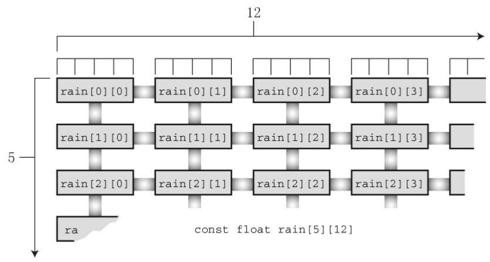
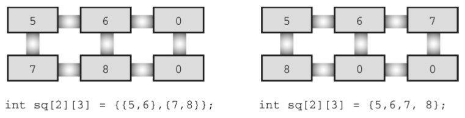
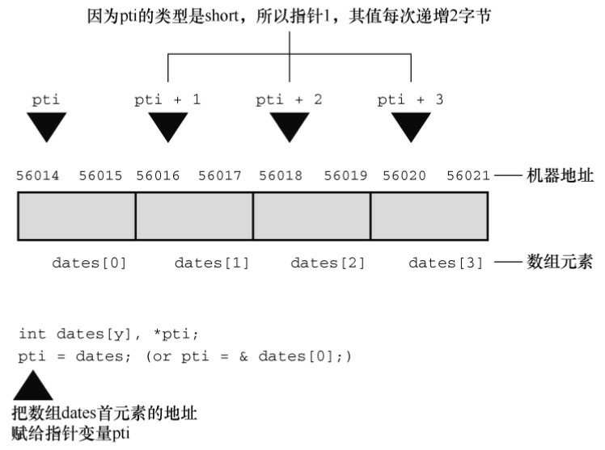
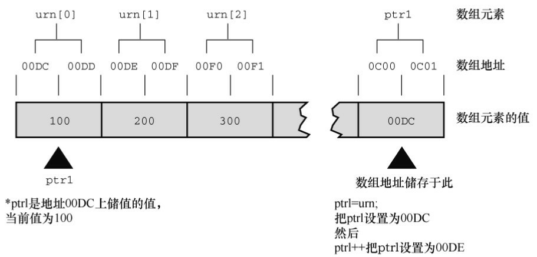
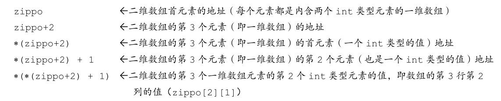
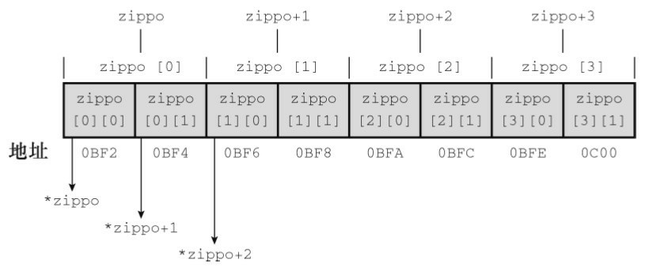

# 第10章 数组和指针
本章介绍以下内容：

* 关键字：static
* 运算符：&、*（一元）
* 如何创建并初始化数组
* 指针（在已学过的基础上）、指针和数组的关系
* 编写处理数组的函数
* 二维数组

人们通常借助计算机完成统计每月的支出、日降雨量、季度销售额等任务。企业借助计算机管理薪资、库存和客户交易记录等。作为程序员，不可避免地要处理大量相关数据。通常，数组能高效便捷地处理这种数据。第 6章简单地介绍了数组，本章将进步地学习如何使用数组，着重分析如何编写处理数组的函数。这种函数把模块化编程的优势应用到数组。通过本章的学习，你将明白数组和指针关系密切。

## 10.1 数组
前面介绍过，数组由数据类型相同的一系列元素组成。需要使用数组时，通过声明数组告诉编译器数组中内含多少元素和这些元素的类型。编译器根据这些信息正确地创建数组。普通变量可以使用的类型，数组元素都可以用。考虑下面的数组声明：
```c
/* 一些数组声明*/
int main(void)
{
    float candy[365];    /* 内含365个float类型元素的数组 */
    char code[12];       /*内含12个char类型元素的数组*/
    int states[50];      /*内含50个int类型元素的数组 */
    ...
}
```

方括号（[]）表明candy、code和states都是数组，方括号中的数字表明数组中的元素个数。

要访问数组中的元素，通过使用数组下标数（也称为索引）表示数组中的各元素。数组元素的编号从0开始，所以candy[0]表示candy数组的第1个元素，candy[364]表示第365个元素，也就是最后一个元素。读者对这些内容应该比较熟悉，下面我们介绍一些新内容。

### 10.1.1 初始化数组
数组通常被用来储存程序需要的数据。例如，一个内含12个整数元素的数组可以储存12个月的天数。在这种情况下，在程序一开始就初始化数组比较好。下面介绍初始化数组的方法。

只储存单个值的变量有时也称为标量变量（scalar variable），我们已经很熟悉如何初始化这种变量：
```c
int fix = 1;
float flax = PI * 2;
```

代码中的PI已定义为宏。C使用新的语法来初始化数组，如下所示：
```c
int main(void)
{
    int powers[8] = {1,2,4,6,8,16,32,64}; /* 从ANSI C开始支持这种初始化 */
    ...
}
```

如上所示，用以逗号分隔的值列表（用花括号括起来）来初始化数组，各值之间用逗号分隔。在逗号和值之间可以使用空格。根据上面的初始化，把 1 赋给数组的首元素（powers[0]），以此类推（不支持ANSI的编译器会把这种形式的初始化识别为语法错误，在数组声明前加上关键字static可解决此问题。第12章将详细讨论这个关键字）。

程序清单10.1演示了一个小程序，打印每个月的天数。

程序清单10.1 day_mon1.c程序
```c
/* day_mon1.c -- 打印每个月的天数 */
#include <stdio.h>
#define MONTHS 12

int main(void)
{
    int days[MONTHS] = { 31, 28, 31, 30, 31, 30, 31, 31, 30, 31, 30, 31 };
    int index;
    for (index = 0; index < MONTHS; index++)
        printf("Month %2d has %2d days.\n", index + 1, days[index]);
    return 0;
}
```

该程序的输出如下：
```c
Month  1 has 31 days.
Month  2 has 28 days.
Month  3 has 31 days.
Month  4 has 30 days.
Month  5 has 31 days.
Month  6 has 30 days.
Month  7 has 31 days.
Month  8 has 31 days.
Month  9 has 30 days.
Month 10 has 31 days.
Month 11 has 30 days.
Month 12 has 31 days.
```

这个程序还不够完善，每4年打错一个月份的天数（即，2月份的天数）。该程序用初始化列表初始化days[]，列表（用花括号括起来）中用逗号分隔各值。

注意该例使用了符号常量 MONTHS 表示数组大小，这是我们推荐且常用的做法。例如，如果要采用一年13个月的记法，只需修改#define这行代码即可，不用在程序中查找所有使用过数组大小的地方。

注意 使用const声明数组

有时需要把数组设置为只读。这样，程序只能从数组中检索值，不能把新值写入数组。要创建只读数组，应该用const声明和初始化数组。因此，程序清单10.1中初始化数组应改成：
```c
const int days[MONTHS] = {31,28,31,30,31,30,31,31,30,31,30,31};
```

这样修改后，程序在运行过程中就不能修改该数组中的内容。和普通变量一样，应该使用声明来初始化 const 数据，因为一旦声明为 const，便不能再给它赋值。明确了这一点，就可以在后面的例子中使用const了。

如果初始化数组失败怎么办？程序清单10.2演示了这种情况。

程序清单10.2 no_data.c程序
```c
/* no_data.c -- 为初始化数组 */
#include <stdio.h>
#define SIZE 4

int main(void)
{
    int no_data[SIZE]; /* 未初始化数组 */
    int i;
    printf("%2s%14s\n",   "i", "no_data[i]");
    for (i = 0; i < SIZE; i++)
        printf("%2d%14d\n", i, no_data[i]);
    return 0;
}
```

该程序的输出如下（系统不同，输出的结果可能不同）：
```c
 i    no_data[i]
 0             0
 1             0
 2       4198464
 3             0
```

使用数组前必须先初始化它。与普通变量类似，在使用数组元素之前，必须先给它们赋初值。编译器使用的值是内存相应位置上的现有值，因此，读者运行该程序后的输出会与该示例不同。

注意 存储类别警告

数组和其他变量类似，可以把数组创建成不同的存储类别（storage class）。第12章将介绍存储类别的相关内容，现在只需记住：本章描述的数组属于自动存储类别，意思是这些数组在函数内部声明，且声明时未使用关键字static。到目前为止，本书所用的变量和数组都是自动存储类别。

在这里提到存储类别的原因是，不同的存储类别有不同的属性，所以不能把本章的内容推广到其他存储类别。对于一些其他存储类别的变量和数组，如果在声明时未初始化，编译器会自动把它们的值设置为0。

初始化列表中的项数应与数组的大小一致。如果不一致会怎样？我们还是以上一个程序为例，但初始化列表中缺少两个元素，如程序清单10.3所示：

程序清单10.3 somedata.c程序
```c
/* some_data.c -- 部分初始化数组 */
#include <stdio.h>
#define SIZE 4

int main(void)
{
    int some_data[SIZE] = { 1492, 1066 };
    int i;
    printf("%2s%14s\n",   "i", "some_data[i]");
    for (i = 0; i < SIZE; i++)
        printf("%2d%14d\n", i, some_data[i]);
    return 0;
}
```

下面是该程序的输出：
```c
 i  some_data[i]
 0          1492
 1          1066
 2             0
 3             0
```

如上所示，编译器做得很好。当初始化列表中的值少于数组元素个数时，编译器会把剩余的元素都初始化为0。也就是说，如果不初始化数组，数组元素和未初始化的普通变量一样，其中储存的都是垃圾值；但是，如果部分初始化数组，剩余的元素就会被初始化为0。

如果初始化列表的项数多于数组元素个数，编译器可没那么仁慈，它会毫不留情地将其视为错误。但是，没必要因此嘲笑编译器。其实，可以省略方括号中的数字，让编译器自动匹配数组大小和初始化列表中的项数（见程序清单10.4）

程序清单10.4 day_mon2.c程序
```c
/* day_mon2.c -- 让编译器计算元素个数 */
#include <stdio.h>
int main(void)
{
    const int days[] = { 31, 28, 31, 30, 31, 30, 31, 31, 30, 31 };
    int index;
    for (index = 0; index < sizeof days / sizeof days[0]; index++)
        printf("Month %2d has %d days.\n", index + 1, days[index]);
    return 0;
}
```

在程序清单10.4中，要注意以下两点。

如果初始化数组时省略方括号中的数字，编译器会根据初始化列表中的项数来确定数组的大小。

注意for循环中的测试条件。由于人工计算容易出错，所以让计算机来计算数组的大小。sizeof运算符给出它的运算对象的大小（以字节为单位）。所以sizeof days是整个数组的大小（以字节为单位），sizeof day[0]是数组中一个元素的大小（以字节为单位）。整个数组的大小除以单个元素的大小就是数组元素的个数。

下面是该程序的输出：
```c
Month  1 has 31 days.
Month  2 has 28 days.
Month  3 has 31 days.
Month  4 has 30 days.
Month  5 has 31 days.
Month  6 has 30 days.
Month  7 has 31 days.
Month  8 has 31 days.
Month  9 has 30 days.
Month 10 has 31 days.
```

我们的本意是防止初始化值的个数超过数组的大小，让程序找出数组大小。我们初始化时用了10个值，结果就只打印了10个值！这就是自动计数的弊端：无法察觉初始化列表中的项数有误。

还有一种初始化数组的方法，但这种方法仅限于初始化字符数组。我们在下一章中介绍。

### 10.1.2 指定初始化器（C99）
C99 增加了一个新特性：指定初始化器（designated initializer）。利用该特性可以初始化指定的数组元素。例如，只初始化数组中的最后一个元素。对于传统的C初始化语法，必须初始化最后一个元素之前的所有元素，才能初始化它：
```c
int arr[6] = {0,0,0,0,0,212}; // 传统的语法
```

而C99规定，可以在初始化列表中使用带方括号的下标指明待初始化的元素：
```c
int arr[6] = {[5] = 212}; // 把arr[5]初始化为212
```

对于一般的初始化，在初始化一个元素后，未初始化的元素都会被设置为0。程序清单10.5中的初始化比较复杂。

程序清单10.5 designate.c程序
```c
// designate.c -- 使用指定初始化器
#include <stdio.h>
#define MONTHS 12
int main(void)
{
    int days[MONTHS] = { 31, 28, [4] = 31, 30, 31, [1] = 29 };
    int i;
    for (i = 0; i < MONTHS; i++)
        printf("%2d  %d\n", i + 1, days[i]);
    return 0;
}
```

该程序在支持C99的编译器中输出如下：
```c
1   31
2   29
3   0
4   0
5   31
6   30
7   31
8   0
9   0
10   0
11   0
12   0
```

以上输出揭示了指定初始化器的两个重要特性。第一，如果指定初始化器后面有更多的值，如该例中的初始化列表中的片段：[4] = 31,30,31，那么后面这些值将被用于初始化指定元素后面的元素。也就是说，在days[4]被初始化为31后，days[5]和days[6]将分别被初始化为30和31。第二，如果再次初始化指定的元素，那么最后的初始化将会取代之前的初始化。例如，程序清单10.5中，初始化列表开始时把days[1]初始化为28，但是days[1]又被后面的指定初始化[1] = 29初始化为29。

如果未指定元素大小会怎样？
```c
int stuff[] = {1, [6] = 23};       //会发生什么？
int staff[] = {1, [6] = 4, 9, 10}; //会发生什么？
```

编译器会把数组的大小设置为足够装得下初始化的值。所以，stuff数组有7个元素，编号为0～6；而staff数组的元素比stuff数组多两个（即有9个元素）。

### 10.1.3 给数组元素赋值
声明数组后，可以借助数组下标（或索引）给数组元素赋值。例如，下面的程序段给数组的所有元素赋值：
```c
/* 给数组的元素赋值 */
#include <stdio.h>
#define SIZE 50
int main(void)
{
    int counter, evens[SIZE];
    for (counter = 0; counter < SIZE; counter++)
        evens[counter] = 2 * counter;
    ...
}
```

注意这段代码中使用循环给数组的元素依次赋值。C 不允许把数组作为一个单元赋给另一个数组，除初始化以外也不允许使用花括号列表的形式赋值。下面的代码段演示了一些错误的赋值形式:
```c
/* 一些无效的数组赋值 */
#define SIZE 5
int main(void)
{
int oxen[SIZE] = {5,3,2,8};     /* 初始化没问题 */
int yaks[SIZE];
yaks = oxen;                    /* 不允许 */
yaks[SIZE] = oxen[SIZE];        /* 数组下标越界 */
yaks[SIZE] = {5,3,2,8};         /* 不起作用 */
```

oxen数组的最后一个元素是oxen[SIZE-1]，所以oxen[SIZE]和yaks[SIZE]都超出了两个数组的末尾。

### 10.1.4 数组边界
在使用数组时，要防止数组下标超出边界。也就是说，必须确保下标是有效的值。例如，假设有下面的声明：
```c
int doofi[20];
```

那么在使用该数组时，要确保程序中使用的数组下标在0～19的范围内，因为编译器不会检查出这种错误（但是，一些编译器发出警告，然后继续编译程序）。

考虑程序清单10.6的问题。该程序创建了一个内含4个元素的数组，然后错误地使用了-1～6的下标。

程序清单10.6 bounds.c程序
```c
// bounds.c -- 数组下标越界
#include <stdio.h>
#define SIZE 4
int main(void)
{
    int value1 = 44;
    int arr[SIZE];
    int value2 = 88;
    int i;
    printf("value1 = %d, value2 = %d\n", value1, value2);
    for (i = -1; i <= SIZE; i++)
        arr[i] = 2 * i + 1;
    for (i = -1; i < 7; i++)
        printf("%2d %d\n", i, arr[i]);
    printf("value1 = %d, value2 = %d\n", value1, value2);
    printf("address of arr[-1]: %p\n", &arr[-1]);
    printf("address of arr[4]: %p\n", &arr[4]);
    printf("address of value1: %p\n", &value1);
    printf("address of value2: %p\n", &value2);
    return 0;
}
```

编译器不会检查数组下标是否使用得当。在C标准中，使用越界下标的结果是未定义的。这意味着程序看上去可以运行，但是运行结果很奇怪，或异常中止。下面是使用GCC的输出示例：
```c
value1 = 44, value2 = 88
-1 -1
 0 1
 1 3
 2 5
 3 7
 4 9
 5 32766
 6 44
value1 = 44, value2 = -1
address of arr[-1]: 0x7ffe0828b17c
address of arr[4]: 0x7ffe0828b190
address of value1: 0x7ffe0828b198
address of value2: 0x7ffe0828b17c
```

注意，该编译器似乎把value2储存在数组的前一个位置，把value1储存在数组的后一个位置（其他编译器在内存中储存数据的顺序可能不同）。在上面的输出中，arr[-1]与value2对应的内存地址相同， arr[4]和value1对应的内存地址相同。因此，使用越界的数组下标会导致程序改变其他变量的值。不同的编译器运行该程序的结果可能不同，有些会导致程序异常中止。

C 语言为何会允许这种麻烦事发生？这要归功于 C 信任程序员的原则。不检查边界，C 程序可以运行更快。编译器没必要捕获所有的下标错误，因为在程序运行之前，数组的下标值可能尚未确定。因此，为安全起见，编译器必须在运行时添加额外代码检查数组的每个下标值，这会降低程序的运行速度。C 相信程序员能编写正确的代码，这样的程序运行速度更快。但并不是所有的程序员都能做到这一点，所以就出现了下标越界的问题。

还要记住一点：数组元素的编号从0开始。最好是在声明数组时使用符号常量来表示数组的大小：
```c
#define SIZE 4
int main(void)
{
    int arr[SIZE];
    for (i = 0; i < SIZE; i++)
        ....
```

这样做能确保整个程序中的数组大小始终一致。

### 10.1.5 指定数组的大小
本章前面的程序示例都使用整型常量来声明数组：
```c
#define SIZE 4
int main(void)
{
    int arr[SIZE];       // 整数符号常量
    double lots[144];    // 整数字面常量
    ...
```

在C99标准之前，声明数组时只能在方括号中使用整型常量表达式。所谓整型常量表达式，是由整型常量构成的表达式。sizeof表达式被视为整型常量，但是（与C++不同）const值不是。另外，表达式的值必须大于0：
```c
int n = 5;
int m = 8;
float a1[5];         // 可以
float a2[5*2 + 1];     //可以
float a3[sizeof(int) + 1]; //可以
float a4[-4];        // 不可以，数组大小必须大于0
float a5[0];         // 不可以，数组大小必须大于0
float a6[2.5];        // 不可以，数组大小必须是整数
float a7[(int)2.5];     // 可以，已被强制转换为整型常量
float a8[n];         // C99之前不允许
float a9[m];         // C99之前不允许
```

上面的注释表明，以前支持C90标准的编译器不允许后两种声明方式。而C99标准允许这样声明，这创建了一种新型数组，称为变长数组（variable-length array）或简称 VLA（C11 放弃了这一创新的举措，把VLA设定为可选，而不是语言必备的特性）。

C99引入变长数组主要是为了让C成为更好的数值计算语言。例如，VLA简化了把FORTRAN现有的数值计算例程库转换为C代码的过程。VLA有一些限制，例如，声明VLA时不能进行初始化。在充分了解经典的C数组后，我们再详细介绍VLA。

## 10.2 多维数组
气象研究员Tempest Cloud为完成她的研究项目要分析5年内每个月的降水量数据，她首先要解决的问题是如何表示数据。一个方案是创建60个变量，每个变量储存一个数据项（我们曾经提到过这一笨拙的方案，和以前一样，这个方案并不合适）。使用一个内含60个元素的数组比将建60个变量好，但是如果能把各年的数据分开储存会更好，即创建5个数组，每个数组12个元素。然而，这样做也很麻烦，如果Tempest决定研究50年的降水量，岂不是要创建50个数组。是否能有更好的方案？

处理这种情况应该使用数组的数组。主数组（master array）有5个元素（每个元素表示一年），每个元素是内含12个元素的数组（每个元素表示一个月）。下面是该数组的声明：
```c
float rain[5][12]; // 内含5个数组元素的数组，每个数组元素内含12个float类型的元素
```

理解该声明的一种方法是，先查看中间部分（粗体部分）：
```c
float rain[5][12]; // rain是一个内含5个元素的数组
```

这说明数组rain有5个元素，至于每个元素的情况，要查看声明的其余部分（粗体部分）：
```c
floatrain[5][12] ; // 一个内含12个float类型元素的数组
```

这说明每个元素的类型是float[12]，也就是说，rain的每个元素本身都是一个内含12个float类型值的数组。

根据以上分析可知，rain的首元素rain[0]是一个内含12个float类型值的数组。所以，rain[1]、rain[2]等也是如此。如果 rain[0]是一个数组，那么它的首元素就是 rain[0][0]，第 2 个元素是rain[0][1]，以此类推。简而言之，数组rain有5个元素，每个元素都是内含12个float类型元素的数组，rain[0]是内含12个float值的数组，rain[0][0]是一个float类型的值。假设要访问位于2行3列的值，则使用rain[2][3]（记住，数组元素的编号从0开始，所以2行指的是第3行）。



该二维视图有助于帮助读者理解二维数组的两个下标。在计算机内部，这样的数组是按顺序储存的，从第1个内含12个元素的数组开始，然后是第2个内含12个元素的数组，以此类推。

我们要在气象分析程序中用到这个二维数组。该程序的目标是，计算每年的总降水量、年平均降水量和月平均降水量。要计算年总降水量，必须对一行数据求和；要计算某月份的平均降水量，必须对一列数据求和。二维数组很直观，实现这些操作也很容易。程序清单10.7演示了这个程序。

程序清单10.7 rain.c程序
```c
/* rain.c -- 计算每年的总降水量、年平均降水量和5年中每月的平均降水量 */
#include <stdio.h>
#define MONTHS 12   // 一年的月份数
#define YEARS  5    // 年数
int main(void)
{
    // 用2010～2014年的降水量数据初始化数组
    const float rain[YEARS][MONTHS] =
    {
        { 4.3, 4.3, 4.3, 3.0, 2.0, 1.2, 0.2, 0.2, 0.4, 2.4, 3.5, 6.6 },
        { 8.5, 8.2, 1.2, 1.6, 2.4, 0.0, 5.2, 0.9, 0.3, 0.9, 1.4, 7.3 },
        { 9.1, 8.5, 6.7, 4.3, 2.1, 0.8, 0.2, 0.2, 1.1, 2.3, 6.1, 8.4 },
        { 7.2, 9.9, 8.4, 3.3, 1.2, 0.8, 0.4, 0.0, 0.6, 1.7, 4.3, 6.2 },
        { 7.6, 5.6, 3.8, 2.8, 3.8, 0.2, 0.0, 0.0, 0.0, 1.3, 2.6, 5.2 }
    };
    int year, month;
    float subtot, total;
    printf(" YEAR   RAINFALL  (inches)\n");
    for (year = 0, total = 0; year < YEARS; year++)
    {             // 每一年，各月的降水量总和
        for (month = 0, subtot = 0; month < MONTHS; month++)
            subtot += rain[year][month];
        printf("%5d %15.1f\n", 2010 + year, subtot);
        total += subtot;  // 5年的总降水量
    }
    printf("\nThe yearly average is %.1f inches.\n\n", total / YEARS);
    printf("MONTHLY AVERAGES:\n\n");
    printf(" Jan  Feb  Mar  Apr  May  Jun  Jul  Aug  Sep Oct ");
    printf(" Nov  Dec\n");
    for (month = 0; month < MONTHS; month++)
    {             // 每个月，5年的总降水量
        for (year = 0, subtot = 0; year < YEARS; year++)
            subtot += rain[year][month];
        printf("%4.1f ", subtot / YEARS);
    }
    printf("\n");
    return 0;
}
```

下面是该程序的输出：
```c
 YEAR   RAINFALL  (inches)
 2010            32.4
 2011            37.9
 2012            49.8
 2013            44.0
 2014            32.9

The yearly average is 39.4 inches.

MONTHLY AVERAGES:

 Jan  Feb  Mar  Apr  May  Jun  Jul  Aug  Sep Oct  Nov  Dec
 7.3  7.3  4.9  3.0  2.3  0.6  1.2  0.3  0.5  1.7  3.6  6.7
```

学习该程序的重点是数组初始化和计算方案。初始化二维数组比较复杂，我们先来看较为简单的计算部分。

程序使用了两个嵌套for循环。第1个嵌套for循环的内层循环，在year不变的情况下，遍历month计算某年的总降水量；而外层循环，改变year的值，重复遍历month，计算5年的总降水量。这种嵌套循环结构常用于处理二维数组，一个循环处理数组的第1个下标，另一个循环处理数组的第2个下标：
```c
for (year = 0, total = 0; year < YEARS; year++)
{ 
    // 处理每一年的数据
    for (month = 0, subtot = 0; month < MONTHS; month++)
        ...// 处理每月的数据
    ...//处理每一年的数据
}
```

第2个嵌套for循环和第1个的结构相同，但是内层循环遍历year，外层循环遍历month。记住，每执行一次外层循环，就完整遍历一次内层循环。因此，在改变月份之前，先遍历完年，得到某月 5 年间的平均降水量，以此类推：
```c
for (month = 0; month < MONTHS; month++)
{
    // 处理每月的数据
    for (year = 0, subtot =0; year < YEARS; year++)
        ...// 处理每年的数据
    ...// 处理每月的数据
}
```

### 10.2.1 初始化二维数组
初始化二维数组是建立在初始化一维数组的基础上。首先，初始化一维数组如下：
```c
sometype ar1[5] = {val1, val2, val3, val4, val5};
```

这里，val1、val2等表示sometype类型的值。例如，如果sometype是int，那么val1可能是7；如果sometype是double，那么val1可能是11.34，诸如此类。但是rain是一个内含5个元素的数组，每个元素又是内含12个float类型元素的数组。所以，对rain而言，val1应该包含12个值，用于初始化内含12个float类型元素的一维数组，如下所示：
```c
{4.3,4.3,4.3,3.0,2.0,1.2,0.2,0.2,0.4,2.4,3.5,6.6}
```

也就是说，如果sometype是一个内含12个double类型元素的数组，那么val1就是一个由12个double类型值构成的数值列表。因此，为了初始化二维数组rain，要用逗号分隔5个这样的数值列表：
```c
const float rain[YEARS][MONTHS] =
{
    {4.3,4.3,4.3,3.0,2.0,1.2,0.2,0.2,0.4,2.4,3.5,6.6},
    {8.5,8.2,1.2,1.6,2.4,0.0,5.2,0.9,0.3,0.9,1.4,7.3},
    {9.1,8.5,6.7,4.3,2.1,0.8,0.2,0.2,1.1,2.3,6.1,8.4},
    {7.2,9.9,8.4,3.3,1.2,0.8,0.4,0.0,0.6,1.7,4.3,6.2},
    {7.6,5.6,3.8,2.8,3.8,0.2,0.0,0.0,0.0,1.3,2.6,5.2}
};
```

这个初始化使用了5个数值列表，每个数值列表都用花括号括起来。第1个列表的数据用于初始化数组的第1行，第2个列表的数据用于初始化数组的第2行，以此类推。前面讨论的数据个数和数组大小不匹配的问题同样适用于这里的每一行。也就是说，如果第1个列表中只有10个数，则只会初始化数组第1行的前10个元素，而最后两个元素将被默认初始化为0。如果某列表中的数值个数超出了数组每行的元素个数，则会出错，但是这并不会影响其他行的初始化。

初始化时也可省略内部的花括号，只保留最外面的一对花括号。只要保证初始化的数值个数正确，初始化的效果与上面相同。但是如果初始化的数值不够，则按照先后顺序逐行初始化，直到用完所有的值。后面没有值初始化的元素被统一初始化为0。图10.2演示了这种初始化数组的方法。



因为储存在数组rain中的数据不能修改，所以程序使用了const关键字声明该数组。

### 10.2.2 其他多维数组
前面讨论的二维数组的相关内容都适用于三维数组或更多维的数组。可以这样声明一个三维数组：
```c
int box[10][20][30];
```

可以把一维数组想象成一行数据，把二维数组想象成数据表，把三维数组想象成一叠数据表。例如，把上面声明的三维数组box想象成由10个二维数组（每个二维数组都是20行30列）堆叠起来。

还有一种理解box的方法是，把box看作数组的数组。也就是说，box内含10个元素，每个元素是内含20个元素的数组，这20个数组元素中的每个元素是内含30个元素的数组。或者，可以简单地根据所需的下标值去理解数组。

通常，处理三维数组要使用3重嵌套循环，处理四维数组要使用4重嵌套循环。对于其他多维数组，以此类推。在后面的程序示例中，我们只使用二维数组。

## 10.3 指针和数组
第9章介绍过指针，指针提供一种以符号形式使用地址的方法。因为计算机的硬件指令非常依赖地址，指针在某种程度上把程序员想要传达的指令以更接近机器的方式表达。因此，使用指针的程序更有效率。尤其是，指针能有效地处理数组。我们很快就会学到，数组表示法其实是在变相地使用指针。

我们举一个变相使用指针的例子：数组名是数组首元素的地址。也就是说，如果flizny是一个数组，下面的语句成立：
```c
flizny == &flizny[0]; // 数组名是该数组首元素的地址
```

flizny 和&flizny[0]都表示数组首元素的内存地址（&是地址运算符）。两者都是常量，在程序的运行过程中，不会改变。但是，可以把它们赋值给指针变量，然后可以修改指针变量的值，如程序清单10.8所示。注意指针加上一个数时，它的值发生了什么变化（转换说明%p通常以十六进制显示指针的值）。

程序清单10.8 pnt_add.c程序
```c
// pnt_add.c -- 指针地址
#include <stdio.h>
#define SIZE 4
int main(void)
{
    short dates[SIZE];
    short * pti;
    short index;
    double bills[SIZE];
    double * ptf;
    pti = dates; // 把数组地址赋给指针
    ptf = bills;
    printf("%23s %15s\n", "short", "double");
    for (index = 0; index < SIZE; index++)
        printf("pointers + %d: %10p %10p\n", index, pti + index, ptf + index);
    return 0;
}
```

下面是该例的输出示例：
```c
                  short          double
pointers + 0: 0x7ffd04d71070 0x7ffd04d71050
pointers + 1: 0x7ffd04d71072 0x7ffd04d71058
pointers + 2: 0x7ffd04d71074 0x7ffd04d71060
pointers + 3: 0x7ffd04d71076 0x7ffd04d71068
```

第2行打印的是两个数组开始的地址，下一行打印的是指针加1后的地址，以此类推。注意，地址是十六进制的，因此dd比dc大1，a1比a0大1。但是，显示的地址是怎么回事？
```c
0x7fff5fbff8dc + 1是否是0x7fff5fbff8de?
0x7fff5fbff8a0 + 1是否是0x7fff5fbff8a8?
```

我们的系统中，地址按字节编址，short类型占用2字节，double类型占用8字节。在C中，指针加1指的是增加一个存储单元。对数组而言，这意味着把加1后的地址是下一个元素的地址，而不是下一个字节的地址（见图10.3）。这是为什么必须声明指针所指向对象类型的原因之一。只知道地址不够，因为计算机要知道储存对象需要多少字节（即使指针指向的是标量变量，也要知道变量的类型，否则*pt 就无法正确地取回地址上的值）。



现在可以更清楚地定义指向int的指针、指向float的指针，以及指向其他数据对象的指针。

指针的值是它所指向对象的地址。地址的表示方式依赖于计算机内部的硬件。许多计算机（包括PC和Macintosh）都是按字节编址，意思是内存中的每个字节都按顺序编号。这里，一个较大对象的地址（如double类型的变量）通常是该对象第一个字节的地址。

在指针前面使用*运算符可以得到该指针所指向对象的值。

指针加1，指针的值递增它所指向类型的大小（以字节为单位）。

下面的等式体现了C语言的灵活性：
```c
dates + 2 == &date[2]     // 相同的地址
*(dates + 2) == dates[2]  // 相同的值
```

以上关系表明了数组和指针的关系十分密切，可以使用指针标识数组的元素和获得元素的值。从本质上看，同一个对象有两种表示法。实际上，C语言标准在描述数组表示法时确实借助了指针。也就是说，定义ar[n]的意思是*(ar + n)。可以认为*(ar + n)的意思是“到内存的ar位置，然后移动n个单元，检索储存在那里的值”。

顺带一提，不要混淆 *(dates+2)和*dates+2。间接运算符（*）的优先级高于+，所以*dates+2相当于(*dates)+2：
```c
*(dates + 2) // dates第3个元素的值
*dates + 2   // dates第1个元素的值加2
```

明白了数组和指针的关系，便可在编写程序时适时使用数组表示法或指针表示法。运行程序清单 10.9后输出的结果和程序清单10.1输出的结果相同。

程序清单10.9 day_mon3.c程序
```c
/* day_mon3.c -- uses pointer notation */
#include <stdio.h>
#define MONTHS 12
int main(void)
{
    int days[MONTHS] = { 31, 28, 31, 30, 31, 30, 31, 31, 30, 31, 30, 31 };
    int index;
    for (index = 0; index < MONTHS; index++)
        printf("Month %2d has %d days.\n", index + 1, *(days + index)); //与 days[index]相同
    return 0;
}
```

这里，days是数组首元素的地址，days + index是元素days[index]的地址，而*(days + index)则是该元素的值，相当于days[index]。for循环依次引用数组中的每个元素，并打印各元素的内容。

这样编写程序是否有优势？不一定。编译器编译这两种写法生成的代码相同。程序清单 10.9 要注意的是，指针表示法和数组表示法是两种等效的方法。该例演示了可以用指针表示数组，反过来，也可以用数组表示指针。在使用以数组为参数的函数时要注意这点。

## 10.4 函数、数组和指针
假设要编写一个处理数组的函数，该函数返回数组中所有元素之和，待处理的是名为marbles的int类型数组。应该如何调用该函数？也许是下面这样：
```c
total = sum(marbles); // 可能的函数调用
```

那么，该函数的原型是什么？记住，数组名是该数组首元素的地址，所以实际参数marbles是一个储存int类型值的地址，应把它赋给一个指针形式参数，即该形参是一个指向int的指针：
```c
int sum(int * ar); // 对应的函数原型
```

sum()从该参数获得了什么信息？它获得了该数组首元素的地址，知道要在该位置上找出一个整数。注意，该参数并未包含数组元素个数的信息。我们有两种方法让函数获得这一信息。第一种方法是，在函数代码中写上固定的数组大小：
```c
int sum(int * ar) // 相应的函数定义
{
    int i;
    int total = 0;
    for (i = 0; i < 10; i++)  // 假设数组有10个元素
        total += ar[i];    // ar[i] 与 *(ar + i) 相同
    return total;
}
```

既然能使用指针表示数组名，也可以用数组名表示指针。另外，回忆一下，+=运算符把右侧运算对象加到左侧运算对象上。因此，total是当前数组元素之和。

该函数定义有限制，只能计算10个int类型的元素。另一个比较灵活的方法是把数组大小作为第2个参数：
```c
int sum(int * ar, int n)    // 更通用的方法
{
    int i;
    int total = 0;
    for (i = 0; i < n; i++)   // 使用 n 个元素
        total += ar[i];    // ar[i] 和 *(ar + i) 相同
    return total;
}
```

这里，第1个形参告诉函数该数组的地址和数据类型，第2个形参告诉函数该数组中元素的个数。

关于函数的形参，还有一点要注意。只有在函数原型或函数定义头中，才可以用int ar[]代替int * ar：
```c
int sum (int ar[], int n);
```

int *ar形式和int ar[]形式都表示ar是一个指向int的指针。但是，int ar[]只能用于声明形式参数。第2种形式（int ar[]）提醒读者指针ar指向的不仅仅一个int类型值，还是一个int类型数组的元素。

注意 声明数组形参

因为数组名是该数组首元素的地址，作为实际参数的数组名要求形式参数是一个与之匹配的指针。只有在这种情况下，C才会把int ar[]和int * ar解释成一样。也就是说，ar是指向int的指针。由于函数原型可以省略参数名，所以下面4种原型都是等价的：
```c
int sum(int *ar, int n);
int sum(int *, int);
int sum(int ar[], int n);
int sum(int [], int);
```

但是，在函数定义中不能省略参数名。下面两种形式的函数定义等价：
```c
int sum(int *ar, int n)
{
    // 其他代码已省略
}
int sum(int ar[], int n);
{
    //其他代码已省略
}
```

可以使用以上提到的任意一种函数原型和函数定义。

程序清单 10.10 演示了一个程序，使用 sum()函数。该程序打印原始数组的大小和表示该数组的函数形参的大小（如果你的编译器不支持用转换说明%zd打印sizeof返回值，可以用%u或%lu来代替）。

程序清单10.10 sum_arr1.c程序
```c
// sum_arr1.c -- 数组元素之和
// 如果编译器不支持 %zd，用 %u 或 %lu 替换它
#include <stdio.h>
#define SIZE 10
int sum(int ar[], int n);

int main(void)
{
    int marbles[SIZE] = { 20, 10, 5, 39, 4, 16, 19, 26, 31, 20 };
    long answer;
    answer = sum(marbles, SIZE);
    printf("The total number of marbles is %ld.\n", answer);
    printf("The size of marbles is %zd bytes.\n",
    sizeof marbles);
    return 0;
}

int sum(int ar[], int n)   // 这个数组的大小是？
{
    int i;
    int total = 0;
    for (i = 0; i < n; i++)
        total += ar[i];
    printf("The size of ar is %zd bytes.\n", sizeof ar);
    return total;
}
```

该程序的输出如下：
```c
The size of ar is 8 bytes.
The total number of marbles is 190.
The size of marbles is 40 bytes.
```

注意，marbles的大小是40字节。这没问题，因为marbles内含10个int类型的值，每个值占4字节，所以整个marbles的大小是40字节。但是，ar才8字节。这是因为ar并不是数组本身，它是一个指向 marbles 数组首元素的指针。我们的系统中用 8 字节储存地址，所以指针变量的大小是 8字节（其他系统中地址的大小可能不是8字节）。简而言之，在程序清单10.10中，marbles是一个数组， ar是一个指向marbles数组首元素的指针，利用C中数组和指针的特殊关系，可以用数组表示法来表示指针ar。

### 10.4.1 使用指针形参
函数要处理数组必须知道何时开始、何时结束。sum()函数使用一个指针形参标识数组的开始，用一个整数形参表明待处理数组的元素个数（指针形参也表明了数组中的数据类型）。但是这并不是给函数传递必备信息的唯一方法。还有一种方法是传递两个指针，第1个指针指明数组的开始处（与前面用法相同），第2个指针指明数组的结束处。程序清单10.11演示了这种方法，同时该程序也表明了指针形参是变量，这意味着可以用索引表明访问数组中的哪一个元素。

程序清单10.11 sum_arr2.c程序
```c
/* sum_arr2.c -- 数组元素之和 */
#include <stdio.h>
#define SIZE 10
int sump(int * start, int * end);

int main(void)
{
    int marbles[SIZE] = { 20, 10, 5, 39, 4, 16, 19, 26, 31, 20 };
    long answer;
    answer = sump(marbles, marbles + SIZE);
    printf("The total number of marbles is %ld.\n", answer);
    return 0;
}

/* 使用指针算法 */
int sump(int * start, int * end)
{
    int total = 0;
    while (start < end)
    {
        total += *start;  // 把数组元素的值加起来
        start++;      // 让指针指向下一个元素
    }
    return total;
}
```

指针start开始指向marbles数组的首元素，所以赋值表达式total += *start把首元素（20）加给total。然后，表达式start++递增指针变量start，使其指向数组的下一个元素。因为start是指向int的指针，start递增1相当于其值递增int类型的大小。

注意，sump()函数用另一种方法结束加法循环。sum()函数把元素的个数作为第2个参数，并把该参数作为循环测试的一部分：
```c
for( i = 0; i < n; i++)
```

而sump()函数则使用第2个指针来结束循环：
```c
while (start < end)
```

因为while循环的测试条件是一个不相等的关系，所以循环最后处理的一个元素是end所指向位置的前一个元素。这意味着end指向的位置实际上在数组最后一个元素的后面。C保证在给数组分配空间时，指向数组后面第一个位置的指针仍是有效的指针。这使得 while循环的测试条件是有效的，因为 start在循环中最后的值是[end](#最后的值是end)。注意，使用这种“越界”指针的函数调用更为简洁：
```c
answer = sump(marbles, marbles + SIZE);
```

因为下标从0开始，所以marbles + SIZE指向数组末尾的下一个位置。如果end指向数组的最后一个元素而不是数组末尾的下一个位置，则必须使用下面的代码：
```c
answer = sump(marbles, marbles + SIZE - 1);
```

这种写法既不简洁也不好记，很容易导致编程错误。顺带一提，虽然C保证了marbles + SIZE有效，但是对marbles[SIZE]（即储存在该位置上的值）未作任何保证，所以程序不能访问该位置。

还可以把循环体压缩成一行代码：
```c
total += *start++;
```

一元运算符*和++的优先级相同，但结合律是从右往左，所以start++先求值，然后才是*start。也就是说，指针start先递增后指向。使用后缀形式（即start++而不是++start）意味着先把指针指向位置上的值加到total上，然后再递增指针。如果使用*++start，顺序则反过来，先递增指针，再使用指针指向位置上的值。如果使用(*start)++，则先使用start指向的值，再递增该值，而不是递增指针。这样，指针将一直指向同一个位置，但是该位置上的值发生了变化。虽然*start++的写法比较常用，但是*(start++)这样写更清楚。程序清单10.12的程序演示了这些优先级的情况。

程序清单10.12 order.c程序
```c
/* order.c -- 指针运算中的优先级 */
#include <stdio.h>
int data[2] = { 100, 200 };
int moredata[2] = { 300, 400 };
int main(void)
{
    int * p1, *p2, *p3;
    p1 = p2 = data;
    p3 = moredata;
    printf(" *p1 = %d,  *p2 = %d,  *p3 = %d\n",*p1, *p2, *p3);
    printf("*p1++ = %d, *++p2 = %d, (*p3)++ = %d\n",*p1++, *++p2, (*p3)++);
    printf(" *p1 = %d,  *p2 = %d,  *p3 = %d\n",*p1, *p2, *p3);
    return 0;
}
```

下面是该程序的输出：
```c
 *p1 = 100,  *p2 = 100,  *p3 = 300
*p1++ = 100, *++p2 = 200, (*p3)++ = 300
 *p1 = 200,  *p2 = 200,  *p3 = 301
```

只有(*p3)++改变了数组元素的值，其他两个操作分别把p1和p2指向数组的下一个元素。

### 10.4.2 指针表示法和数组表示法
从以上分析可知，处理数组的函数实际上用指针作为参数，但是在编写这样的函数时，可以选择是使用数组表示法还是指针表示法。如程序清单10.10所示，使用数组表示法，让函数是处理数组的这一意图更加明显。另外，许多其他语言的程序员对数组表示法更熟悉，如FORTRAN、Pascal、Modula-2或BASIC。其他程序员可能更习惯使用指针表示法，觉得使用指针更自然，如程序清单10.11所示。

至于C语言，ar[i]和*(ar+1)这两个表达式都是等价的。无论ar是数组名还是指针变量，这两个表达式都没问题。但是，只有当ar是指针变量时，才能使用ar++这样的表达式。

指针表示法（尤其与递增运算符一起使用时）更接近机器语言，因此一些编译器在编译时能生成效率更高的代码。然而，许多程序员认为他们的主要任务是确保代码正确、逻辑清晰，而代码优化应该留给编译器去做。

## 10.5 指针操作
可以对指针进行哪些操作？C提供了一些基本的指针操作，下面的程序示例中演示了8种不同的操作。为了显示每种操作的结果，该程序打印了指针的值（该指针指向的地址）、储存在指针指向地址上的值，以及指针自己的地址。如果编译器不支持%p 转换说明，可以用%u 或%lu 代替%p；如果编译器不支持用%td转换说明打印地址的差值，可以用%d或%ld来代替。

程序清单10.13演示了指针变量的 8种基本操作。除了这些操作，还可以使用关系运算符来比较指针。

程序清单10.13 ptr_ops.c程序
```c
// ptr_ops.c -- 指针操作
#include <stdio.h>
int main(void)
{
    int urn[5] = { 100, 200, 300, 400, 500 };
    int * ptr1, *ptr2, *ptr3;
    ptr1 = urn;       // 把一个地址赋给指针
    ptr2 = &urn[2];     // 把一个地址赋给指针
    // 解引用指针，以及获得指针的地址
    printf("pointer value, dereferenced pointer, pointer address:\n");
    printf("ptr1 = %p, *ptr1 =%d, &ptr1 = %p\n", ptr1, *ptr1, &ptr1);
    // 指针加法
    ptr3 = ptr1 + 4;
    printf("\nadding an int to a pointer:\n");
    printf("ptr1 + 4 = %p, *(ptr1 + 4) = %d\n", ptr1 + 4, *(ptr1 + 4));
    ptr1++;         // 递增指针
    printf("\nvalues after ptr1++:\n");
    printf("ptr1 = %p, *ptr1 =%d, &ptr1 = %p\n", ptr1, *ptr1, &ptr1);
    ptr2--;         // 递减指针
    printf("\nvalues after --ptr2:\n");
    printf("ptr2 = %p, *ptr2 = %d, &ptr2 = %p\n", ptr2, *ptr2, &ptr2);
    --ptr1;         // 恢复为初始值
    ++ptr2;         // 恢复为初始值
    printf("\nPointers reset to original values:\n");
    printf("ptr1 = %p, ptr2 = %p\n", ptr1, ptr2);
    // 一个指针减去另一个指针
    printf("\nsubtracting one pointer from another:\n");
    printf("ptr2 = %p, ptr1 = %p, ptr2 - ptr1 = %td\n", 
    ptr2, ptr1, ptr2 - ptr1);
    // 一个指针减去一个整数
    printf("\nsubtracting an int from a pointer:\n");
    printf("ptr3 = %p, ptr3 - 2 = %p\n", ptr3, ptr3 - 2);
    return 0;
}
```

下面是我们的系统运行该程序后的输出：
```c
pointer value, dereferenced pointer, pointer address:
ptr1 = 0x7ffec93faa20, *ptr1 =100, &ptr1 = 0x7ffec93faa18

adding an int to a pointer:
ptr1 + 4 = 0x7ffec93faa30, *(ptr1 + 4) = 500

values after ptr1++:
ptr1 = 0x7ffec93faa24, *ptr1 =200, &ptr1 = 0x7ffec93faa18

values after --ptr2:
ptr2 = 0x7ffec93faa24, *ptr2 = 200, &ptr2 = 0x7ffec93faa10

Pointers reset to original values:
ptr1 = 0x7ffec93faa20, ptr2 = 0x7ffec93faa28

subtracting one pointer from another:
ptr2 = 0x7ffec93faa28, ptr1 = 0x7ffec93faa20, ptr2 - ptr1 = 2

subtracting an int from a pointer:
ptr3 = 0x7ffec93faa30, ptr3 - 2 = 0x7ffec93faa28
```

下面分别描述了指针变量的基本操作。

赋值：可以把地址赋给指针。例如，用数组名、带地址运算符（&）的变量名、另一个指针进行赋值。在该例中，把urn数组的首地址赋给了ptr1，该地址的编号恰好是0x7fff5fbff8d0。变量ptr2获得数组urn的第3个元素（urn[2]）的地址。注意，地址应该和指针类型兼容。也就是说，不能把double类型的地址赋给指向int的指针，至少要避免不明智的类型转换。C99/C11已经强制不允许这样做。

解引用：*运算符给出指针指向地址上储存的值。因此，*ptr1的初值是100，该值储存在编号为0x7fff5fbff8d0的地址上。

取址：和所有变量一样，指针变量也有自己的地址和值。对指针而言，&运算符给出指针本身的地址。本例中，ptr1 储存在内存编号为0x7fff5fbff8c8 的地址上，该存储单元储存的内容是0x7fff5fbff8d0，即urn的地址。因此&ptr1是指向ptr1的指针，而ptr1是指向utn[0]的指针。

指针与整数相加：可以使用+运算符把指针与整数相加，或整数与指针相加。无论哪种情况，整数都会和指针所指向类型的大小（以字节为单位）相乘，然后把结果与初始地址相加。因此ptr1 +4与&urn[4]等价。如果相加的结果超出了初始指针指向的数组范围，计算结果则是未定义的。除非正好超过数组末尾第一个位置，C保证该指针有效。

递增指针：递增指向数组元素的指针可以让该指针移动至数组的下一个元素。因此，ptr1++相当于把ptr1的值加上4（我们的系统中int为4字节），ptr1指向urn[1]（见图10.4，该图中使用了简化的地址）。现在ptr1的值是0x7fff5fbff8d4（数组的下一个元素的地址），*ptr的值为200（即urn[1]的值）。注意，ptr1本身的地址仍是 0x7fff5fbff8c8。毕竟，变量不会因为值发生变化就移动位置。



指针减去一个整数：可以使用-运算符从一个指针中减去一个整数。指针必须是第1个运算对象，整数是第 2 个运算对象。该整数将乘以指针指向类型的大小（以字节为单位），然后用初始地址减去乘积。所以ptr3 - 2与&urn[2]等价，因为ptr3指向的是&arn[4]。如果相减的结果超出了初始指针所指向数组的范围，计算结果则是未定义的。除非正好超过数组末尾第一个位置，C保证该指针有效。

递减指针：当然，除了递增指针还可以递减指针。在本例中，递减ptr3使其指向数组的第2个元素而不是第3个元素。前缀或后缀的递增和递减运算符都可以使用。注意，在重置ptr1和ptr2前，它们都指向相同的元素urn[1]。

指针求差：可以计算两个指针的差值。通常，求差的两个指针分别指向同一个数组的不同元素，通过计算求出两元素之间的距离。差值的单位与数组类型的单位相同。例如，程序清单10.13的输出中，ptr2 - ptr1得2，意思是这两个指针所指向的两个元素相隔两个int，而不是2字节。只要两个指针都指向相同的数组（或者其中一个指针指向数组后面的第 1 个地址），C 都能保证相减运算有效。如果指向两个不同数组的指针进行求差运算可能会得出一个值，或者导致运行时错误。

比较：使用关系运算符可以比较两个指针的值，前提是两个指针都指向相同类型的对象。

注意，这里的减法有两种。可以用一个指针减去另一个指针得到一个整数，或者用一个指针减去一个整数得到另一个指针。

在递增或递减指针时还要注意一些问题。编译器不会检查指针是否仍指向数组元素。C 只能保证指向数组任意元素的指针和指向数组后面第 1 个位置的指针有效。但是，如果递增或递减一个指针后超出了这个范围，则是未定义的。另外，可以解引用指向数组任意元素的指针。但是，即使指针指向数组后面一个位置是有效的，也能解引用这样的越界指针。

解引用未初始化的指针

说到注意事项，一定要牢记一点：千万不要解引用未初始化的指针。例如，考虑下面的例子：
```c
int * pt;  // 未初始化的指针
*pt = 5;   // 严重的错误
```

为何不行？第2行的意思是把5储存在pt指向的位置。但是pt未被初始化，其值是一个随机值，所以不知道5将储存在何处。这可能不会出什么错，也可能会擦写数据或代码，或者导致程序崩溃。切记：创建一个指针时，系统只分配了储存指针本身的内存，并未分配储存数据的内存。因此，在使用指针之前，必须先用已分配的地址初始化它。例如，可以用一个现有变量的地址初始化该指针（使用带指针形参的函数时，就属于这种情况）。或者还可以使用第12章将介绍的malloc()函数先分配内存。无论如何，使用指针时一定要注意，不要解引用未初始化的指针！
```c
double * pd; // 未初始化的指针
*pd = 2.4;   // 不要这样做
```

假设
```c
int urn[3];
int * ptr1, * ptr2;
```

下面是一些有效和无效的语句：
```c
有效语句               无效语句
ptr1++;               urn++;
ptr2 = ptr1 + 2;      ptr2 = ptr2 + ptr1;
ptr2 = urn + 1;       ptr2 = urn * ptr1;
```

基于这些有效的操作，C 程序员创建了指针数组、函数指针、指向指针的指针数组、指向函数的指针数组等。别紧张，接下来我们将根据已学的内容介绍指针的一些基本用法。指针的第 1 个基本用法是在函数间传递信息。前面学过，如果希望在被调函数中改变主调函数的变量，必须使用指针。指针的第 2 个基本用法是用在处理数组的函数中。下面我们再来看一个使用函数和数组的编程示例。

## 10.6 保护数组中的数据
编写一个处理基本类型（如，int）的函数时，要选择是传递int类型的值还是传递指向int的指针。通常都是直接传递数值，只有程序需要在函数中改变该数值时，才会传递指针。对于数组别无选择，必须传递指针，因为这样做效率高。如果一个函数按值传递数组，则必须分配足够的空间来储存原数组的副本，然后把原数组所有的数据拷贝至新的数组中。如果把数组的地址传递给函数，让函数直接处理原数组则效率要高。

传递地址会导致一些问题。C 通常都按值传递数据，因为这样做可以保证数据的完整性。如果函数使用的是原始数据的副本，就不会意外修改原始数据。但是，处理数组的函数通常都需要使用原始数据，因此这样的函数可以修改原数组。有时，这正是我们需要的。例如，下面的函数给数组的每个元素都加上一个相同的值：
```c
void add_to(double ar[], int n, double val)
{
    int i;
    for (i = 0; i < n; i++)
        ar[i] += val;
}
```

因此，调用该函数后，prices数组中的每个元素的值都增加了2.5：
```c
add_to(prices, 100, 2.50);
```

该函数修改了数组中的数据。之所以可以这样做，是因为函数通过指针直接使用了原始数据。

然而，其他函数并不需要修改数据。例如，下面的函数计算数组中所有元素之和，它不用改变数组的数据。但是，由于ar实际上是一个指针，所以编程错误可能会破坏原始数据。例如，下面示例中的ar[i]++会导致数组中每个元素的值都加1：
```c
int sum(int ar[], int n) // 错误的代码
{
    int i;
    int total = 0;
    for( i = 0; i < n; i++)
        total += ar[i]++; // 错误递增了每个元素的值
    return total;
}
```

### 10.6.1 对形式参数使用const
在K&R C的年代，避免类似错误的唯一方法是提高警惕。ANSI C提供了一种预防手段。如果函数的意图不是修改数组中的数据内容，那么在函数原型和函数定义中声明形式参数时应使用关键字const。例如，sum()函数的原型和定义如下：
```c
int sum(const int ar[], int n); /* 函数原型 */
int sum(const int ar[], int n) /* 函数定义 */
{
    int i;
    int total = 0;
    for( i = 0; i < n; i++)
        total += ar[i];
    return total;
}
```

以上代码中的const告诉编译器，该函数不能修改ar指向的数组中的内容。如果在函数中不小心使用类似ar[i]++的表达式，编译器会捕获这个错误，并生成一条错误信息。

这里一定要理解，这样使用const并不是要求原数组是常量，而是该函数在处理数组时将其视为常量，不可更改。这样使用const可以保护数组的数据不被修改，就像按值传递可以保护基本数据类型的原始值不被改变一样。一般而言，如果编写的函数需要修改数组，在声明数组形参时则不使用const；如果编写的函数不用修改数组，那么在声明数组形参时最好使用const。

程序清单10.14的程序中，一个函数显示数组的内容，另一个函数给数组每个元素都乘以一个给定值。因为第1个函数不用改变数组，所以在声明数组形参时使用了const；而第2个函数需要修改数组元素的值，所以不使用const。

程序清单10.14 arf.c程序
```c
/* arf.c -- 处理数组的函数 */
#include <stdio.h>
#define SIZE 5
void show_array(const double ar[], int n);
void mult_array(double ar[], int n, double mult);

int main(void)
{
    double dip[SIZE] = { 20.0, 17.66, 8.2, 15.3, 22.22 };
    printf("The original dip array:\n");
    show_array(dip, SIZE);
    mult_array(dip, SIZE, 2.5);
    printf("The dip array after calling mult_array():\n");
    show_array(dip, SIZE);
    return 0;
}

/* 显示数组的内容 */
void show_array(const double ar[], int n)
{
    int i;
    for (i = 0; i < n; i++)
    printf("%8.3f ", ar[i]);
    putchar('\n');
}

/* 把数组的每个元素都乘以相同的值 */
void mult_array(double ar[], int n, double mult)
{
    int i;
    for (i = 0; i < n; i++)
        ar[i] *= mult;
}
```

下面是该程序的输出：
```c
The original dip array:
  20.000   17.660    8.200   15.300   22.220
The dip array after calling mult_array():
  50.000   44.150   20.500   38.250   55.550
```

注意该程序中两个函数的返回类型都是void。虽然mult_array()函数更新了dip数组的值，但是并未使用return机制。

### 10.6.2 const的其他内容
我们在前面使用const创建过变量：
```c
const double PI = 3.14159;
```

虽然用#define指令可以创建类似功能的符号常量，但是const的用法更加灵活。可以创建const数组、const指针和指向const的指针。

程序清单10.4演示了如何使用const关键字保护数组：
```c
#define MONTHS 12
...
const int days[MONTHS] = {31,28,31,30,31,30,31,31,30,31,30,31};
```

如果程序稍后尝试改变数组元素的值，编译器将生成一个编译期错误消息：
```c
days[9] = 44;   /* 编译错误 */
```

指向const的指针不能用于改变值。考虑下面的代码：
```c
double rates[5] = {88.99, 100.12, 59.45, 183.11, 340.5};
const double * pd = rates;   // pd指向数组的首元素
```

第2行代码把pd指向的double类型的值声明为const，这表明不能使用pd来更改它所指向的值：
```c
*pd = 29.89;       // 不允许
pd[2] = 222.22;    //不允许
rates[0] = 99.99;  // 允许，因为rates未被const限定
```

无论是使用指针表示法还是数组表示法，都不允许使用pd修改它所指向数据的值。但是要注意，因为rates并未被声明为const，所以仍然可以通过rates修改元素的值。另外，可以让pd指向别处：
```c
pd++; /* 让pd指向rates[1] -- 没问题 */
```

指向 const 的指针通常用于函数形参中，表明该函数不会使用指针改变数据。例如，程序清单 10.14中的show_array()函数原型如下：
```c
void show_array(const double *ar, int n);
```

关于指针赋值和const需要注意一些规则。首先，把const数据或非const数据的地址初始化为指向const的指针或为其赋值是合法的：
```c
double rates[5] = {88.99, 100.12, 59.45, 183.11, 340.5};
const double locked[4] = {0.08, 0.075, 0.0725, 0.07};
const double * pc = rates; // 有效
pc = locked;         //有效
pc = &rates[3];       //有效
```

然而，只能把非const数据的地址赋给普通指针：
```c
double rates[5] = {88.99, 100.12, 59.45, 183.11, 340.5};
const double locked[4] = {0.08, 0.075, 0.0725, 0.07};
double * pnc = rates; // 有效
pnc = locked;         // 无效
pnc = &rates[3];      // 有效
```

这个规则非常合理。否则，通过指针就能改变const数组中的数据。

应用以上规则的例子，如 show_array()函数可以接受普通数组名和 const 数组名作为参数，因为这两种参数都可以用来初始化指向const的指针：
```c
show_array(rates, 5);    // 有效
show_array(locked, 4);   // 有效
```

因此，对函数的形参使用const不仅能保护数据，还能让函数处理const数组。

另外，不应该把const数组名作为实参传递给mult_array()这样的函数：
```c
mult_array(rates, 5, 1.2);    // 有效
mult_array(locked, 4, 1.2);   // 不要这样做
```

C标准规定，使用非const标识符（如，mult_arry()的形参ar）修改const数据（如，locked）导致的结果是未定义的。

const还有其他的用法。例如，可以声明并初始化一个不能指向别处的指针，关键是const的位置：
```c
double rates[5] = {88.99, 100.12, 59.45, 183.11, 340.5};
double * const pc = rates; // pc指向数组的开始
pc = &rates[2];            // 不允许，因为该指针不能指向别处
*pc = 92.99;               // 没问题 -- 更改rates[0]的值
```

可以用这种指针修改它所指向的值，但是它只能指向初始化时设置的地址。

最后，在创建指针时还可以使用const两次，该指针既不能更改它所指向的地址，也不能修改指向地址上的值：
```c
double rates[5] = {88.99, 100.12, 59.45, 183.11, 340.5};
const double * const pc = rates;
pc = &rates[2];  //不允许
*pc = 92.99;     //不允许
```

## 10.7 指针和多维数组
指针和多维数组有什么关系？为什么要了解它们的关系？处理多维数组的函数要用到指针，所以在使用这种函数之前，先要更深入地学习指针。至于第 1 个问题，我们通过几个示例来回答。为简化讨论，我们使用较小的数组。假设有下面的声明：
```c
int zippo[4][2]; /* 内含int数组的数组 */
```

然后数组名zippo是该数组首元素的地址。在本例中，zippo的首元素是一个内含两个int值的数组，所以zippo是这个内含两个int值的数组的地址。下面，我们从指针的属性进一步分析。

因为zippo是数组首元素的地址，所以zippo的值和&zippo[0]的值相同。而zippo[0]本身是一个内含两个整数的数组，所以zippo[0]的值和它首元素（一个整数）的地址（即&zippo[0][0]的值）相同。简而言之，zippo[0]是一个占用一个int大小对象的地址，而zippo是一个占用两个int大小对象的地址。由于这个整数和内含两个整数的数组都开始于同一个地址，所以zippo和zippo[0]的值相同。

给指针或地址加1，其值会增加对应类型大小的数值。在这方面，zippo和zippo[0]不同，因为zippo指向的对象占用了两个int大小，而zippo[0]指向的对象只占用一个int大小。因此， zippo + 1和zippo[0] + 1的值不同。

解引用一个指针（在指针前使用*运算符）或在数组名后使用带下标的[]运算符，得到引用对象代表的值。因为zippo[0]是该数组首元素（zippo[0][0]）的地址，所以*(zippo[0])表示储存在zippo[0][0]上的值（即一个int类型的值）。与此类似，*zippo代表该数组首元素（zippo[0]）的值，但是zippo[0]本身是一个int类型值的地址。该值的地址是&zippo[0][0]，所以*zippo就是&zippo[0][0]。对两个表达式应用解引用运算符表明，**zippo与*&zippo[0][0]等价，这相当于zippo[0][0]，即一个int类型的值。简而言之，zippo是地址的地址，必须解引用两次才能获得原始值。地址的地址或指针的指针是就是双重间接（double indirection）的例子。

显然，增加数组维数会增加指针的复杂度。现在，大部分初学者都开始意识到指针为什么是 C 语言中最难的部分。认真思考上述内容，看看是否能用所学的知识解释程序清单10.15中的程序。该程序显示了一些地址值和数组的内容。

程序清单10.15 zippo1.c程序
```c
/* zippo1.c -- zippo的相关信息 */
#include <stdio.h>

int main(void)
{
    int zippo[4][2] = { { 2, 4 }, { 6, 8 }, { 1, 3 }, { 5, 7 } };
    printf("  zippo = %p,   zippo + 1 = %p\n",zippo, zippo + 1);
    printf("zippo[0] = %p, zippo[0] + 1 = %p\n",zippo[0], zippo[0] + 1);
    printf(" *zippo = %p,  *zippo + 1 = %p\n",*zippo, *zippo + 1);
    printf("zippo[0][0] = %d\n", zippo[0][0]);
    printf(" *zippo[0] = %d\n", *zippo[0]);
    printf("  **zippo = %d\n", **zippo);
    printf("    zippo[2][1] = %d\n", zippo[2][1]);
    printf("*(*(zippo+2) + 1) = %d\n", *(*(zippo + 2) + 1));
    return 0;
}
```

下面是我们的系统运行该程序后的输出：
```c
  zippo = 0x7ffc6aee6fd0,   zippo + 1 = 0x7ffc6aee6fd8
zippo[0] = 0x7ffc6aee6fd0, zippo[0] + 1 = 0x7ffc6aee6fd4
 *zippo = 0x7ffc6aee6fd0,  *zippo + 1 = 0x7ffc6aee6fd4
zippo[0][0] = 2
 *zippo[0] = 2
  **zippo = 2
    zippo[2][1] = 3
*(*(zippo+2) + 1) = 3
```

其他系统显示的地址值和地址形式可能不同，但是地址之间的关系与以上输出相同。该输出显示了二维数组zippo的地址和一维数组zippo[0]的地址相同。它们的地址都是各自数组首元素的地址，因而与&zippo[0][0]的值也相同。

尽管如此，它们也有差别。在我们的系统中，int是4 字节。前面讨论过，zippo[0]指向一个4 字节的数据对象。zippo[0]加1，其值加4（十六进制中，38+4得3c）。数组名zippo 是一个内含2个int类型值的数组的地址，所以zippo指向一个8字节的数据对象。因此，zippo加1，它所指向的地址加8字节（十六进制中，38+8得40）。

该程序演示了zippo[0]和*zippo完全相同，实际上确实如此。然后，对二维数组名解引用两次，得到储存在数组中的值。使用两个间接运算符（*）或者使用两对方括号（[]）都能获得该值（还可以使用一个*和一对[]，但是我们暂不讨论这么多情况）。

要特别注意，与 zippo[2][1]等价的指针表示法是*(*(zippo+2) + 1)。看上去比较复杂，应最好能理解。下面列出了理解该表达式的思路：



以上分析并不是为了说明用指针表示法（*(*(zippo+2) + 1)）代替数组表示法（zippo[2][1]），而是提示读者，如果程序恰巧使用一个指向二维数组的指针，而且要通过该指针获取值时，最好用简单的数组表示法，而不是指针表示法。

图10.5以另一种视图演示了数组地址、数组内容和指针之间的关系。



### 10.7.1 指向多维数组的指针
如何声明一个指针变量pz指向一个二维数组（如，zippo）？在编写处理类似zippo这样的二维数组时会用到这样的指针。把指针声明为指向int的类型还不够。因为指向int只能与zippo[0]的类型匹配，说明该指针指向一个int类型的值。但是zippo是它首元素的地址，该元素是一个内含两个int类型值的一维数组。因此，pz必须指向一个内含两个int类型值的数组，而不是指向一个int类型值，其声明如下：
```c
int (* pz)[2];  // pz指向一个内含两个int类型值的数组
```

以上代码把pz声明为指向一个数组的指针，该数组内含两个int类型值。为什么要在声明中使用圆括号？因为[]的优先级高于*。考虑下面的声明：
```c
int * pax[2];   // pax是一个内含两个指针元素的数组，每个元素都指向int的指针
```

由于[]优先级高，先与pax结合，所以pax成为一个内含两个元素的数组。然后*表示pax数组内含两个指针。最后，int表示pax数组中的指针都指向int类型的值。因此，这行代码声明了两个指向int的指针。而前面有圆括号的版本，*先与pz结合，因此声明的是一个指向数组（内含两个int类型的值）的指针。程序清单10.16演示了如何使用指向二维数组的指针。

程序清单10.16 zippo2.c程序
```c
/* zippo2.c -- 通过指针获取zippo的信息 */
#include <stdio.h>

int main(void)
{
    int zippo[4][2] = { { 2, 4 }, { 6, 8 }, { 1, 3 }, { 5, 7 } };
    int(*pz)[2];
    pz = zippo;
    printf("  pz = %p,   pz + 1 = %p\n",   pz, pz + 1);
    printf("pz[0] = %p, pz[0] + 1 = %p\n",  pz[0], pz[0] + 1);
    printf(" *pz = %p,  *pz + 1 = %p\n",  *pz, *pz + 1);
    printf("pz[0][0] = %d\n", pz[0][0]);
    printf(" *pz[0] = %d\n", *pz[0]);
    printf("  **pz = %d\n", **pz);
    printf("    pz[2][1] = %d\n", pz[2][1]);
    printf("*(*(pz+2) + 1) = %d\n", *(*(pz + 2) + 1));
    return 0;
}
```

下面是该程序的输出：
```c
  pz = 0x7ffd51f92690,   pz + 1 = 0x7ffd51f92698
pz[0] = 0x7ffd51f92690, pz[0] + 1 = 0x7ffd51f92694
 *pz = 0x7ffd51f92690,  *pz + 1 = 0x7ffd51f92694
pz[0][0] = 2
 *pz[0] = 2
  **pz = 2
    pz[2][1] = 3
*(*(pz+2) + 1) = 3
```

系统不同，输出的地址可能不同，但是地址之间的关系相同。如前所述，虽然pz是一个指针，不是数组名，但是也可以使用 pz[2][1]这样的写法。可以用数组表示法或指针表示法来表示一个数组元素，既可以使用数组名，也可以使用指针名：
```c
zippo[m][n] == *(*(zippo + m) + n)
pz[m][n] == *(*(pz + m) + n)
```

### 10.7.2 指针的兼容性
指针之间的赋值比数值类型之间的赋值要严格。例如，不用类型转换就可以把 int 类型的值赋给double类型的变量，但是两个类型的指针不能这样做。
```c
int n = 5;
double x;
int * p1 = &n;
double * pd = &x;
x = n;        // 隐式类型转换
pd = p1;      // 编译时错误
```

更复杂的类型也是如此。假设有如下声明：
```c
int * pt;
int (*pa)[3];
int ar1[2][3];
int ar2[3][2];
int **p2; // 一个指向指针的指针
```

有如下的语句：
```c
pt = &ar1[0][0]; // 都是指向int的指针
pt = ar1[0];     // 都是指向int的指针
pt = ar1;        // 无效
pa = ar1;        // 都是指向内含3个int类型元素数组的指针
pa = ar2;        // 无效
p2 = &pt;        // both pointer-to-int *
*p2 = ar2[0];    // 都是指向int的指针
p2 = ar2;        // 无效
```

注意，以上无效的赋值表达式语句中涉及的两个指针都是指向不同的类型。例如，pt 指向一个 int类型值，而ar1指向一个内含3和int类型元素的数组。类似地，pa指向一个内含2个int类型元素的数组，所以它与ar1的类型兼容，但是ar2指向一个内含2个int类型元素的数组，所以pa与ar2不兼容。

上面的最后两个例子有些棘手。变量p2是指向指针的指针，它指向的指针指向int，而ar2是指向数组的指针，该数组内含2个int类型的元素。所以，p2和ar2的类型不同，不能把ar2赋给p2。但是，*p2是指向int的指针，与ar2[0]兼容。因为ar2[0]是指向该数组首元素（ar2[0][0]）的指针，所以ar2[0]也是指向int的指针。

一般而言，多重解引用让人费解。例如，考虑下面的代码：
```c
int x = 20;
const int y = 23;
int * p1 = &x;
const int * p2 = &y;
const int ** pp2;
p1 = p2;    // 不安全 -- 把const指针赋给非const指针
p2 = p1;    // 有效 -- 把非const指针赋给const指针
pp2 = &p1;  // 不安全 –- 嵌套指针类型赋值
```

前面提到过，把const指针赋给非const指针不安全，因为这样可以使用新的指针改变const指针指向的数据。编译器在编译代码时，可能会给出警告，执行这样的代码是未定义的。但是把非const指针赋给const指针没问题，前提是只进行一级解引用：
```c
p2 = p1; // 有效 -- 把非const指针赋给const指针
```

但是进行两级解引用时，这样的赋值也不安全，例如，考虑下面的代码：
```c
const int **pp2;
int *p1;
const int n = 13;
pp2 = &p1;  // 允许，但是这导致const限定符失效（根据第1行代码，不能通过*pp2修改它所指向的内容）
*pp2 = &n;  // 有效，两者都声明为const，但是这将导致p1指向n（*pp2已被修改）
*p1 = 10;   //有效，但是这将改变n的值（但是根据第3行代码，不能修改n的值）
```

发生了什么？如前所示，标准规定了通过非const指针更改const数据是未定义的。例如，在Terminal中（OS X对底层UNIX系统的访问）使用gcc编译包含以上代码的小程序，导致n最终的值是13，但是在相同系统下使用clang来编译，n最终的值是10。两个编译器都给出指针类型不兼容的警告。当然，可以忽略这些警告，但是最好不要相信该程序运行的结果，这些结果都是未定义的。

**C const和C++ const**

C和C++中const的用法很相似，但是并不完全相同。区别之一是，C++允许在声明数组大小时使用const整数，而C却不允许。区别之二是，C++的指针赋值检查更严格：
```c
const int y;
const int * p2 = &y;
int * p1;
p1 = p2; // C++中不允许这样做，但是C可能只给出警告
```

C++不允许把const指针赋给非const指针。而C则允许这样做，但是如果通过p1更改y，其行为是未定义的。

### 10.7.3 函数和多维数组
如果要编写处理二维数组的函数，首先要能正确地理解指针才能写出声明函数的形参。在函数体中，通常使用数组表示法进行相关操作。

下面，我们编写一个处理二维数组的函数。一种方法是，利用for循环把处理一维数组的函数应用到二维数组的每一行。如下所示：
```c
int junk[3][4] = { {2,4,5,8}, {3,5,6,9}, {12,10,8,6} };
int i, j;
int total = 0;
for (i = 0; i < 3 ; i++)
    total += sum(junk[i], 4); // junk[i]是一维数组
```

记住，如果 junk 是二维数组，junk[i]就是一维数组，可将其视为二维数组的一行。这里，sum()函数计算二维数组的每行的总和，然后for循环再把每行的总和加起来。

然而，这种方法无法记录行和列的信息。用这种方法计算总和，行和列的信息并不重要。但如果每行代表一年，每列代表一个月，就还需要一个函数计算某列的总和。该函数要知道行和列的信息，可以通过声明正确类型的形参变量来完成，以便函数能正确地传递数组。在这种情况下，数组 junk是一个内含 3个数组元素的数组，每个元素是内含4个int类型值的数组（即junk是一个3行4列的二维数组）。通过前面的讨论可知，这表明junk是一个指向数组（内含4个int类型值）的指针。可以这样声明函数的形参：
```c
void somefunction( int (* pt)[4] );
```

另外，如果当且仅当pt是一个函数的形式参数时，可以这样声明：
```c
void somefunction( int pt[][4] );
```

注意，第1个方括号是空的。空的方括号表明pt是一个指针。这样的变量稍后可以用作相同方法作为junk。下面的程序示例中就是这样做的，如程序清单10.17所示。注意该程序清单演示了3种等价的原型语法。

程序清单10.17 array2d.c程序
```c
// array2d.c -- 处理二维数组的函数
#include <stdio.h>
#define ROWS 3
#define COLS 4
void sum_rows(int ar[][COLS], int rows);
void sum_cols(int [][COLS], int);    // 省略形参名，没问题
int sum2d(int(*ar)[COLS], int rows);  // 另一种语法

int main(void)
{
    int junk[ROWS][COLS] = {
    { 2, 4, 6, 8 },
    { 3, 5, 7, 9 },
    { 12, 10, 8, 6 }
    };
    sum_rows(junk, ROWS);
    sum_cols(junk, ROWS);
    printf("Sum of all elements = %d\n", sum2d(junk, ROWS));
    return 0;
}

void sum_rows(int ar[][COLS], int rows)
{
    int r;
    int c;
    int tot;
    for (r = 0; r < rows; r++)
    {
        tot = 0;
        for (c = 0; c < COLS; c++)
            tot += ar[r][c];
        printf("row %d: sum = %d\n", r, tot);
    }
}

void sum_cols(int ar[][COLS], int rows)
{
    int r;
    int c;
    int tot;
    for (c = 0; c < COLS; c++)
    {
        tot = 0;
        for (r = 0; r < rows; r++)
            tot += ar[r][c];
        printf("col %d: sum = %d\n", c, tot);
    }
}

int sum2d(int ar[][COLS], int rows)
{
    int r;
    int c;
    int tot = 0;
    for (r = 0; r < rows; r++)
        for (c = 0; c < COLS; c++)
            tot += ar[r][c];
    return tot;
}
```

该程序的输出如下：
```c
row 0: sum = 20
row 1: sum = 24
row 2: sum = 36
col 0: sum = 17
col 1: sum = 19
col 2: sum = 21
col 3: sum = 23
Sum of all elements = 80
```

程序清单10.17中的程序把数组名junk（即，指向数组首元素的指针，首元素是子数组）和符号常量ROWS（代表行数3）作为参数传递给函数。每个函数都把ar视为内含数组元素（每个元素是内含4个int类型值的数组）的数组。列数内置在函数体中，但是行数靠函数传递得到。如果传入函数的行数是12，那么函数要处理的是12×4的数组。因为rows是元素的个数，然而，因为每个元素都是数组，或者视为一行，rows也可以看成是行数。

注意，ar和main()中的junk都使用数组表示法。因为ar和junk的类型相同，它们都是指向内含4个int类型值的数组的指针。

注意，下面的声明不正确：
```c
int sum2(int ar[][], int rows); // 错误的声明
```

前面介绍过，编译器会把数组表示法转换成指针表示法。例如，编译器会把 ar[1]转换成 ar+1。编译器对ar+1求值，要知道ar所指向的对象大小。下面的声明：
```c
int sum2(int ar[][4], int rows);  // 有效声明
```

表示ar指向一个内含4个int类型值的数组（在我们的系统中，ar指向的对象占16字节），所以ar+1的意思是“该地址加上16字节”。如果第2对方括号是空的，编译器就不知道该怎样处理。

也可以在第1对方括号中写上大小，如下所示，但是编译器会忽略该值：
```c
int sum2(int ar[3][4], int rows); // 有效声明，但是3将被忽略
```

与使用typedef（第5章和第14章中讨论）相比，这种形式方便得多：
```c
typedef int arr4[4];         // arr4是一个内含 4 个int的数组
typedef arr4 arr3x4[3];        // arr3x4 是一个内含3个 arr4的数组
int sum2(arr3x4 ar, int rows);   // 与下面的声明相同
int sum2(int ar[3][4], int rows);  // 与下面的声明相同
int sum2(int ar[][4], int rows);  // 标准形式
```

一般而言，声明一个指向N维数组的指针时，只能省略最左边方括号中的值：
```c
int sum4d(int ar[][12][20][30], int rows);
```

因为第1对方括号只用于表明这是一个指针，而其他的方括号则用于描述指针所指向数据对象的类型。下面的声明与该声明等价：
```c
int sum4d(int (*ar)[12][20][30], int rows); // ar是一个指针
```

这里，ar指向一个12×20×30的int数组。

## 10.8 变长数组（VLA）
读者在学习处理二维数组的函数中可能不太理解，为何只把数组的行数作为函数的形参，而列数却内置在函数体内。例如，函数定义如下：
```c
#define COLS 4
int sum2d(int ar[][COLS], int rows)
{
    int r;
    int c;
    int tot = 0;
    for (r = 0; r < rows; r++)
        for (c = 0; c < COLS; c++)
            tot += ar[r][c];
    return tot;
}
```

假设声明了下列数组：
```c
int array1[5][4];
int array2[100][4];
int array3[2][4];
```

可以用sum2d()函数分别计算这些数组的元素之和：
```c
tot = sum2d(array1, 5);   // 5×4 数组的元素之和
tot = sum2d(array2, 100); // 100×4数组的元素之和
tot = sum2d(array3, 2);   // 2×4数组的元素之和
```

sum2d()函数之所以能处理这些数组，是因为这些数组的列数固定为4，而行数被传递给形参rows， rows是一个变量。但是如果要计算6×5的数组（即6行5列），就不能使用这个函数，必须重新创建一个CLOS为5的函数。因为C规定，数组的维数必须是常量，不能用变量来代替COLS。

要创建一个能处理任意大小二维数组的函数，比较繁琐（必须把数组作为一维数组传递，然后让函数计算每行的开始处）。而且，这种方法不好处理FORTRAN的子例程，这些子例程都允许在函数调用中指定两个维度。虽然 FORTRAN 是比较老的编程语言，但是在过去的几十年里，数值计算领域的专家已经用FORTRAN开发出许多有用的计算库。C正逐渐替代FORTRAN，如果能直接转换现有的FORTRAN库就好了。

鉴于此，C99新增了变长数组（variable-length array，VLA），允许使用变量表示数组的维度。如下所示：
```c
int quarters = 4;
int regions = 5;
double sales[regions][quarters];  // 一个变长数组（VLA）
```

前面提到过，变长数组有一些限制。变长数组必须是自动存储类别，这意味着无论在函数中声明还是作为函数形参声明，都不能使用static或extern存储类别说明符（第12章介绍）。而且，不能在声明中初始化它们。最终，C11把变长数组作为一个可选特性，而不是必须强制实现的特性。

注意 变长数组不能改变大小

变长数组中的“变”不是指可以修改已创建数组的大小。一旦创建了变长数组，它的大小则保持不变。这里的“变”指的是：在创建数组时，可以使用变量指定数组的维度。

由于变长数组是C语言的新特性，目前完全支持这一特性的编译器不多。下面我们来看一个简单的例子：如何编写一个函数，计算int的二维数组所有元素之和。

首先，要声明一个带二维变长数组参数的函数，如下所示：
```c
int sum2d(int rows, int cols, int ar[rows][cols]); // ar是一个变长数组（VLA）
```

注意前两个形参（rows和cols）用作第3个形参二维数组ar的两个维度。因为ar的声明要使用rows和cols，所以在形参列表中必须在声明ar之前先声明这两个形参。因此，下面的原型是错误的：
```c
int sum2d(int ar[rows][cols], int rows, int cols); // 无效的顺序
```

C99/C11标准规定，可以省略原型中的形参名，但是在这种情况下，必须用星号来代替省略的维度：
```c
int sum2d(int, int, int ar[*][*]); // ar是一个变长数组（VLA），省略了维度形参名
```

其次，该函数的定义如下：
```c
int sum2d(int rows, int cols, int ar[rows][cols])
{
    int r;
    int c;
    int tot = 0;
    for (r = 0; r < rows; r++)
        for (c = 0; c < cols; c++)
            tot += ar[r][c];
    return tot;
}
```

该函数除函数头与传统的C函数（程序清单10.17）不同外，还把符号常量COLS替换成变量cols。这是因为在函数头中使用了变长数组。由于用变量代表行数和列数，所以新的sum2d()现在可以处理任意大小的二维int数组，如程序清单10.18所示。但是，该程序要求编译器支持变长数组特性。另外，该程序还演示了以变长数组作为形参的函数既可处理传统C数组，也可处理变长数组。

程序清单10.18 vararr2d.c程序
```c
//vararr2d.c -- 使用变长数组的函数
#include <stdio.h>
#define ROWS 3
#define COLS 4
int sum2d(int rows, int cols, int ar[rows][cols]);
int main(void)
{
    int i, j;
    int rs = 3;
    int cs = 10;
    int junk[ROWS][COLS] = {
        { 2, 4, 6, 8 },
        { 3, 5, 7, 9 },
        { 12, 10, 8, 6 }
    };
    int morejunk[ROWS - 1][COLS + 2] = {
        { 20, 30, 40, 50, 60, 70 },
        { 5, 6, 7, 8, 9, 10 }
    };
    int varr[rs][cs]; // 变长数组（VLA）
    for (i = 0; i < rs; i++)
        for (j = 0; j < cs; j++)
            varr[i][j] = i * j + j;
    printf("3x5 array\n");
    printf("Sum of all elements = %d\n", sum2d(ROWS, COLS, junk));
    printf("2x6 array\n");
    printf("Sum of all elements = %d\n", sum2d(ROWS - 1, COLS + 2, morejunk));
    printf("3x10 VLA\n");
    printf("Sum of all elements = %d\n", sum2d(rs, cs, varr));
    return 0;
}

// 带变长数组形参的函数
int sum2d(int rows, int cols, int ar[rows][cols])
{
    int r;
    int c;
    int tot = 0;
    for (r = 0; r < rows; r++)
    for (c = 0; c < cols; c++)
    tot += ar[r][c];
    return tot;
}
```

下面是该程序的输出：
```c
3x5 array
Sum of all elements = 80
2x6 array
Sum of all elements = 315
3x10 VLA
Sum of all elements = 270
```

需要注意的是，在函数定义的形参列表中声明的变长数组并未实际创建数组。和传统的语法类似，变长数组名实际上是一个指针。这说明带变长数组形参的函数实际上是在原始数组中处理数组，因此可以修改传入的数组。下面的代码段指出指针和实际数组是何时声明的：
```c
int thing[10][6];
twoset(10,6,thing);
...
}
void twoset (int n, int m, int ar[n][m]) // ar是一个指向数组（内含m个int类型的值）的指针
{
    int temp[n][m];  // temp是一个n×m的int数组
    temp[0][0] = 2;  // 设置temp的一个元素为2
    ar[0][0] = 2;   // 设置thing[0][0]为2
}
```

如上代码所示调用twoset()时，ar成为指向thing[0]的指针，temp被创建为10×6的数组。因为ar和thing都是指向thing[0]的指针，ar[0][0]与thing[0][0]访问的数据位置相同。

const和数组大小

是否可以在声明数组时使用const变量？
```c
const int SZ = 80;
...
double ar[SZ]; // 是否允许？
```

C90标准不允许（也可能允许）。数组的大小必须是给定的整型常量表达式，可以是整型常量组合，如20、sizeof表达式或其他不是const的内容。由于C实现可以扩大整型常量表达式的范围，所以可能会允许使用const，但是这种代码可能无法移植。

C99/C11 标准允许在声明变长数组时使用 const 变量。所以该数组的定义必须是声明在块中的自动存储类别数组。

变长数组还允许动态内存分配，这说明可以在程序运行时指定数组的大小。普通 C数组都是静态内存分配，即在编译时确定数组的大小。由于数组大小是常量，所以编译器在编译时就知道了。第12章将详细介绍动态内存分配。

## 10.9 复合字面量
假设给带int类型形参的函数传递一个值，要传递int类型的变量，但是也可以传递int类型常量，如5。在C99 标准以前，对于带数组形参的函数，情况不同，可以传递数组，但是没有等价的数组常量。C99新增了复合字面量（compound literal）。字面量是除符号常量外的常量。例如，5是int类型字面量， 81.3是double类型的字面量，'Y'是char类型的字面量，"elephant"是字符串字面量。发布C99标准的委员会认为，如果有代表数组和结构内容的复合字面量，在编程时会更方便。

对于数组，复合字面量类似数组初始化列表，前面是用括号括起来的类型名。例如，下面是一个普通的数组声明：
```c
int diva[2] = {10, 20};
```

下面的复合字面量创建了一个和diva数组相同的匿名数组，也有两个int类型的值：
```c
(int [2]){10, 20}   // 复合字面量
```

注意，去掉声明中的数组名，留下的int [2]即是复合字面量的类型名。

初始化有数组名的数组时可以省略数组大小，复合字面量也可以省略大小，编译器会自动计算数组当前的元素个数：
```c
(int []){50, 20, 90} // 内含3个元素的复合字面量
```

因为复合字面量是匿名的，所以不能先创建然后再使用它，必须在创建的同时使用它。使用指针记录地址就是一种用法。也就是说，可以这样用：
```c
int * pt1;
pt1 = (int [2]) {10, 20};
```

注意，该复合字面量的字面常量与上面创建的 diva 数组的字面常量完全相同。与有数组名的数组类似，复合字面量的类型名也代表首元素的地址，所以可以把它赋给指向int的指针。然后便可使用这个指针。例如，本例中*pt1是10，pt1[1]是20。

还可以把复合字面量作为实际参数传递给带有匹配形式参数的函数：
```c
int sum(const int ar[], int n);
...
int total3;
total3 = sum((int []){4,4,4,5,5,5}, 6);
```

这里，第1个实参是内含6个int类型值的数组，和数组名类似，这同时也是该数组首元素的地址。这种用法的好处是，把信息传入函数前不必先创建数组，这是复合字面量的典型用法。

可以把这种用法应用于二维数组或多维数组。例如，下面的代码演示了如何创建二维int数组并储存其地址：
```c
int (*pt2)[4];   // 声明一个指向二维数组的指针，该数组内含2个数组元素，
// 每个元素是内含4个int类型值的数组
pt2 = (int [2][4]) { {1,2,3,-9}, {4,5,6,-8} };
```

如上所示，该复合字面量的类型是int [2][4]，即一个2×4的int数组。

程序清单10.19把上述例子放进一个完整的程序中。

程序清单10.19 flc.c程序
```c
// flc.c -- 有趣的常量
#include <stdio.h>
#define COLS 4
int sum2d(const int ar[][COLS], int rows);
int sum(const int ar[], int n);

int main(void)
{
    int total1, total2, total3;
    int * pt1;
    int(*pt2)[COLS];
    pt1 = (int[2]) { 10, 20 };
    pt2 = (int[2][COLS]) { {1, 2, 3, -9}, { 4, 5, 6, -8 } };
    total1 = sum(pt1, 2);
    total2 = sum2d(pt2, 2);
    total3 = sum((int []){ 4, 4, 4, 5, 5, 5 }, 6);
    printf("total1 = %d\n", total1);
    printf("total2 = %d\n", total2);
    printf("total3 = %d\n", total3);
    return 0;
}

int sum(const int ar [], int n)
{
    int i;
    int total = 0;
    for (i = 0; i < n; i++)
        total += ar[i];
    return total;
}

int sum2d(const int ar [][COLS], int rows)
{
    int r;
    int c;
    int tot = 0;
    for (r = 0; r < rows; r++)
        for (c = 0; c < COLS; c++)
            tot += ar[r][c];
    return tot;
}
```

要支持C99的编译器才能正常运行该程序示例（目前并不是所有的编译器都支持），其输出如下：
```c
total1 = 30
total2 = 4
total3 = 27
```

记住，复合字面量是提供只临时需要的值的一种手段。复合字面量具有块作用域（第12章将介绍相关内容），这意味着一旦离开定义复合字面量的块，程序将无法保证该字面量是否存在。也就是说，复合字面量的定义在最内层的花括号中。

## 10.10 关键概念
数组用于储存相同类型的数据。C 把数组看作是派生类型，因为数组是建立在其他类型的基础上。也就是说，无法简单地声明一个数组。在声明数组时必须说明其元素的类型，如int类型的数组、float类型的数组，或其他类型的数组。所谓的其他类型也可以是数组类型，这种情况下，创建的是数组的数组（或称为二维数组）。

通常编写一个函数来处理数组，这样在特定的函数中解决特定的问题，有助于实现程序的模块化。在把数组名作为实际参数时，传递给函数的不是整个数组，而是数组的地址（因此，函数对应的形式参数是指针）。为了处理数组，函数必须知道从何处开始读取数据和要处理多少个数组元素。数组地址提供了“地址”，“元素个数”可以内置在函数中或作为单独的参数传递。第 2 种方法更普遍，因为这样做可以让同一个函数处理不同大小的数组。

数组和指针的关系密切，同一个操作可以用数组表示法或指针表示法。它们之间的关系允许你在处理数组的函数中使用数组表示法，即使函数的形式参数是一个指针，而不是数组。

对于传统的 C 数组，必须用常量表达式指明数组的大小，所以数组大小在编译时就已确定。C99/C11新增了变长数组，可以用变量表示数组大小。这意味着变长数组的大小延迟到程序运行时才确定。

## 10.11 本章小结
数组是一组数据类型相同的元素。数组元素按顺序储存在内存中，通过整数下标（或索引）可以访问各元素。在C中，数组首元素的下标是0，所以对于内含n个元素的数组，其最后一个元素的下标是n-1。作为程序员，要确保使用有效的数组下标，因为编译器和运行的程序都不会检查下标的有效性。

声明一个简单的一维数组形式如下：
```c
type name [ size ];
```

这里，type是数组中每个元素的数据类型，name是数组名，size是数组元素的个数。对于传统的C数组，要求size是整型常量表达式。但是C99/C11允许使用整型非常量表达式。这种情况下的数组被称为变长数组。

C把数组名解释为该数组首元素的地址。换言之，数组名与指向该数组首元素的指针等价。概括地说，数组和指针的关系十分密切。如果ar是一个数组，那么表达式ar[i]和*(ar+i)等价。

对于 C 语言而言，不能把整个数组作为参数传递给函数，但是可以传递数组的地址。然后函数可以使用传入的地址操控原始数组。如果函数没有修改原始数组的意图，应在声明函数的形式参数时使用关键字const。在被调函数中可以使用数组表示法或指针表示法，无论用哪种表示法，实际上使用的都是指针变量。

指针加上一个整数或递增指针，指针的值以所指向对象的大小为单位改变。也就是说，如果pd指向一个数组的8字节double类型值，那么pd加1意味着其值加8，以便它指向该数组的下一个元素。

二维数组即是数组的数组。例如，下面声明了一个二维数组：
```c
double sales[5][12];
```

该数组名为sales，有5个元素（一维数组），每个元素都是一个内含12个double类型值的数组。第1个一维数组是sales[0]，第2个一维数组是sales[1]，以此类推，每个元素都是内含12个double类型值的数组。使用第2个下标可以访问这些一维数组中的特定元素。例如，sales[2][5]是slaes[2]的第6个元素，而sales[2]是sales的第3个元素。

C 语言传递多维数组的传统方法是把数组名（即数组的地址）传递给类型匹配的指针形参。声明这样的指针形参要指定所有的数组维度，除了第1个维度。传递的第1个维度通常作为第2个参数。例如，为了处理前面声明的sales数组，函数原型和函数调用如下：
```c
void display(double ar[][12], int rows);
...
display(sales, 5);
```

变长数组提供第2种语法，把数组维度作为参数传递。在这种情况下，对应函数原型和函数调用如下：
```c
void display(int rows, int cols, double ar[rows][cols]);
...
display(5, 12, sales);
```

虽然上述讨论中使用的是int类型的数组和double类型的数组，其他类型的数组也是如此。然而，字符串有一些特殊的规则，这是由于其末尾的空字符所致。有了这个空字符，不用传递数组的大小，函数通过检测字符串的末尾也知道在何处停止。我们将在第11章中详细介绍。

## 10.12 复习题
复习题的参考答案在附录A中。

1. 下面的程序将打印什么内容？
```c
#include <stdio.h>
int main(void)
{
    int ref[] = { 8, 4, 0, 2 };
    int *ptr;
    int index;
    for (index = 0, ptr = ref; index < 4; index++, ptr++)
        printf("%d %d\n", ref[index], *ptr);
    return 0;
}
```

2. 在复习题1中，ref有多少个元素？

3. 在复习题1中，ref的地址是什么？ref + 1是什么意思？++ref指向什么？

4. 在下面的代码中，*ptr和*(ptr + 2)的值分别是什么？
```c
a.
int *ptr;
int torf[2][2] = {12, 14, 16};
ptr = torf[0];
b.
int * ptr;
int fort[2][2] = { {12}, {14,16} };
ptr = fort[0];
```

5. 在下面的代码中，**ptr和**(ptr + 1)的值分别是什么？
```c
a.
int (*ptr)[2];
int torf[2][2] = {12, 14, 16};
ptr = torf;
b.
int (*ptr)[2];
int fort[2][2] = { {12}, {14,16} };
ptr = fort;
```

6. 假设有下面的声明：
```c
int grid[30][100];
a.用1种写法表示grid[22][56]
b.用2种写法表示grid[22][0]
c.用3种写法表示grid[0][0]
```

7. 正确声明以下各变量：
```c
a.digits是一个内含10个int类型值的数组
b.rates是一个内含6个float类型值的数组
c.mat是一个内含3个元素的数组，每个元素都是内含5个整数的数组
d.psa是一个内含20个元素的数组，每个元素都是指向int的指针
e.pstr是一个指向数组的指针，该数组内含20个char类型的值
```

8. 
```c
a.声明一个内含6个int类型值的数组，并初始化各元素为1、2、4、8、
16、32
b.用数组表示法表示a声明的数组的第3个元素（其值为4）
c.假设编译器支持C99/C11标准，声明一个内含100个int类型值的数组，
并初始化最后一个元素为-1，其他元素不考虑
d.假设编译器支持C99/C11标准，声明一个内含100个int类型值的数组，
并初始化下标为5、10、11、12、3的元素为101，其他元素不考虑
```

9. 内含10个元素的数组下标范围是什么？

10. 假设有下面的声明：
```c
float rootbeer[10], things[10][5], *pf, value = 2.2;
int i = 3;
判断以下各项是否有效：
a.rootbeer[2] = value;
b.scanf("%f", &rootbeer );
c.rootbeer = value;
d.printf("%f", rootbeer);
e.things[4][4] = rootbeer[3];
f.things[5] = rootbeer;
g.pf = value;
h.pf = rootbeer;
```

11. 声明一个800×600的int类型数组。

12. 下面声明了3个数组：
```c
double trots[20];
short clops[10][30];
long shots[5][10][15];
a.分别以传统方式和以变长数组为参数的方式编写处理trots数组的void
函数原型和函数调用
b.分别以传统方式和以变长数组为参数的方式编写处理clops数组的void
函数原型和函数调用
c.分别以传统方式和以变长数组为参数的方式编写处理shots数组的void
函数原型和函数调用
```

13. 下面有两个函数原型：
```c
void show(const double ar[], int n);     // n是数组元素的个数
void show2(const double ar2[][3], int n);  // n是二维数组的行数
a.编写一个函数调用，把一个内含8、3、9和2的复合字面量传递给
show()函数。
b.编写一个函数调用，把一个2行3列的复合字面量（8、3、9作为第1
行，5、4、1作为第2行）传递给show2()函数。
```

## 10.13 编程练习
1. 修改程序清单10.7的rain.c程序，用指针进行计算（仍然要声明并初始化数组）。

2. 编写一个程序，初始化一个double类型的数组，然后把该数组的内容拷贝至3个其他数组中（在main()中声明这4个数组）。使用带数组表示法的函数进行第1份拷贝。使用带指针表示法和指针递增的函数进行第2份拷贝。把目标数组名、源数组名和待拷贝的元素个数作为前两个函数的参数。第3个函数以目标数组名、源数组名和指向源数组最后一个元素后面的元素的指针。也就是说，给定以下声明，则函数调用如下所示：
```c
double source[5] = {1.1, 2.2, 3.3, 4.4, 5.5};
double target1[5];
double target2[5];
double target3[5];
copy_arr(target1, source, 5);
copy_ptr(target2, source, 5);
copy_ptrs(target3, source, source + 5);
```

3. 编写一个函数，返回储存在int类型数组中的最大值，并在一个简单的程序中测试该函数。

4. 编写一个函数，返回储存在double类型数组中最大值的下标，并在一个简单的程序中测试该函数。

5. 编写一个函数，返回储存在double类型数组中最大值和最小值的差值，并在一个简单的程序中测试该函数。

6. 编写一个函数，把double类型数组中的数据倒序排列，并在一个简单的程序中测试该函数。

7. 编写一个程序，初始化一个double类型的二维数组，使用编程练习2中的一个拷贝函数把该数组中的数据拷贝至另一个二维数组中（因为二维数组是数组的数组，所以可以使用处理一维数组的拷贝函数来处理数组中的每个子数组）。

8. 使用编程练习2中的拷贝函数，把一个内含7个元素的数组中第3～第5个元素拷贝至内含3个元素的数组中。该函数本身不需要修改，只需要选择合适的实际参数（实际参数不需要是数组名和数组大小，只需要是数组元素的地址和待处理元素的个数）。

9. 编写一个程序，初始化一个double类型的3×5二维数组，使用一个处理变长数组的函数将其拷贝至另一个二维数组中。还要编写一个以变长数组为形参的函数以显示两个数组的内容。这两个函数应该能处理任意N×M数组（如果编译器不支持变长数组，就使用传统C函数处理N×5的数组）。

10. 编写一个函数，把两个数组中相对应的元素相加，然后把结果储存到第 3 个数组中。也就是说，如果数组1中包含的值是2、4、5、8，数组2中包含的值是1、0、4、6，那么该函数把3、4、9、14赋给第3个数组。函数接受3个数组名和一个数组大小。在一个简单的程序中测试该函数。

11. 编写一个程序，声明一个int类型的3×5二维数组，并用合适的值初始化它。该程序打印数组中的值，然后各值翻倍（即是原值的2倍），并显示出各元素的新值。编写一个函数显示数组的内容，再编写一个函数把各元素的值翻倍。这两个函数都以函数名和行数作为参数。

12. 重写程序清单10.7的rain.c程序，把main()中的主要任务都改成用函数来完成。

13. 编写一个程序，提示用户输入3组数，每组数包含5个double类型的数（假设用户都正确地响应，不会输入非数值数据）。该程序应完成下列任务。
```c
a.把用户输入的数据储存在3×5的数组中
b.计算每组（5个）数据的平均值
c.计算所有数据的平均值
d.找出这15个数据中的最大值
e.打印结果
```

每个任务都要用单独的函数来完成（使用传统C处理数组的方式）。完成任务b，要编写一个计算并返回一维数组平均值的函数，利用循环调用该函数3次。对于处理其他任务的函数，应该把整个数组作为参数，完成任务c和d的函数应把结果返回主调函数。

14. 以变长数组作为函数形参，完成编程练习13。

# 附录：名词解释

## 最后的值是end
在最后一次while循环中执行完start++;后，start的值就是end的值。——译者注


