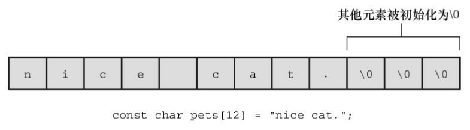
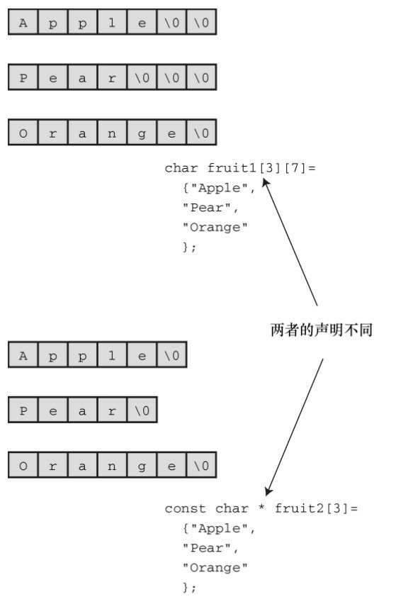
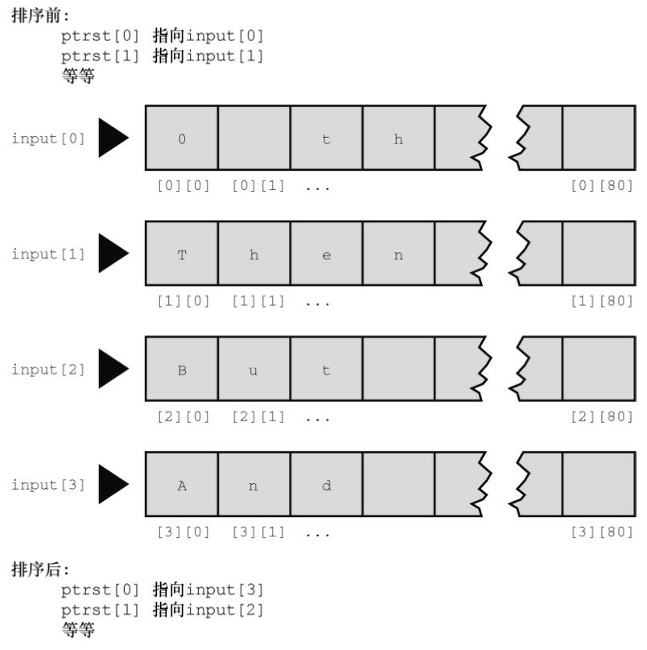
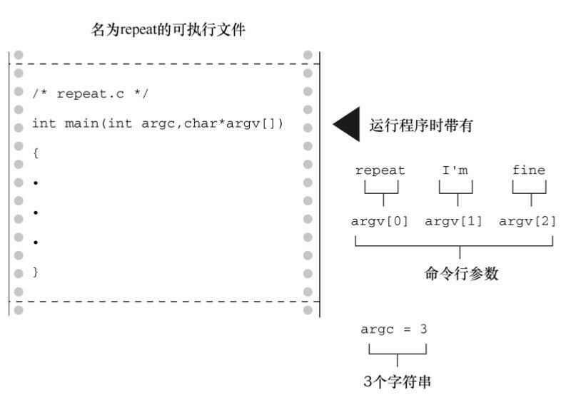

# 第11章 字符串和字符串函数
本章介绍以下内容：

* 函数：gets()、gets_s()、fgets()、puts()、fputs()、strcat()、strncat()、strcmp()、strncmp()、strcpy()、strncpy()、sprintf()、strchr()
* 创建并使用字符串
* 使用C库中的字符和字符串函数，并创建自定义的字符串函数
* 使用命令行参数

字符串是C语言中最有用、最重要的数据类型之一。虽然我们一直在使用字符串，但是要学的东西还很多。C 库提供大量的函数用于读写字符串、拷贝字符串、比较字符串、合并字符串、查找字符串等。通过本章的学习，读者将进一步提高自己的编程水平。

## 11.1 表示字符串和字符串I/O
第4章介绍过，字符串是以空字符（\0）结尾的char类型数组。因此，可以把上一章学到的数组和指针的知识应用于字符串。不过，由于字符串十分常用，所以 C提供了许多专门用于处理字符串的函数。本章将讨论字符串的性质、如何声明并初始化字符串、如何在程序中输入和输出字符串，以及如何操控字符串。

程序清单11.1演示了在程序中表示字符串的几种方式。

程序清单11.1 strings1.c程序
```c
//  strings1.c
#include <stdio.h>
#define MSG "I am a symbolic string constant."
#define MAXLENGTH 81
int main(void)
{
    char words[MAXLENGTH] = "I am a string in an array.";
    const char * pt1 = "Something is pointing at me.";
    puts("Here are some strings:");
    puts(MSG);
    puts(words);
    puts(pt1);
    words[8] = 'p';
    puts(words);
    return 0;
}
```

和printf()函数一样，puts()函数也属于stdio.h系列的输入/输出函数。但是，与printf()不同的是，puts()函数只显示字符串，而且自动在显示的字符串末尾加上换行符。下面是该程序的输出：
```c
Here are some strings:
I am a symbolic string constant.
I am a string in an array.
Something is pointing at me.
I am a spring in an array.
```

我们先分析一下该程序中定义字符串的几种方法，然后再讲解把字符串读入程序涉及的一些操作，最后学习如何输出字符串。

### 11.1.1 在程序中定义字符串
程序清单11.1中使用了多种方法（即字符串常量、char类型数组、指向char的指针）定义字符串。程序应该确保有足够的空间储存字符串，这一点我们稍后讨论。

1. 字符串字面量（字符串常量）

用双引号括起来的内容称为字符串字面量（string literal），也叫作字符串常量（string constant）。双引号中的字符和编译器自动加入末尾的\0字符，都作为字符串储存在内存中，所以"I am a symbolic stringconstant."、"I am a string in an array."、"Something is pointed at me."、"Here are some strings:"都是字符串字面量。

从ANSI C标准起，如果字符串字面量之间没有间隔，或者用空白字符分隔，C会将其视为串联起来的字符串字面量。例如：
```c
char greeting[50] = "Hello, and"" how are" " you"
" today!";
```

与下面的代码等价：
```c
char greeting[50] = "Hello, and how are you today!";
```

如果要在字符串内部使用双引号，必须在双引号前面加上一个反斜杠（\）：
```c
printf("\"Run, Spot, run!\" exclaimed Dick.\n");
```

输出如下：
```c
"Run, Spot, run!" exclaimed Dick.
```

字符串常量属于静态存储类别（static storage class），这说明如果在函数中使用字符串常量，该字符串只会被储存一次，在整个程序的生命期内存在，即使函数被调用多次。用双引号括起来的内容被视为指向该字符串储存位置的指针。这类似于把数组名作为指向该数组位置的指针。如果确实如此，程序清单11.2中的程序会输出什么？

程序清单11.2 strptr.c程序
```c
/* strptr.c -- 把字符串看作指针 */
#include <stdio.h>
int main(void)
{
    printf("%s, %p, %c\n", "We", "are", *"space farers");
    return 0;
}
```

printf()根据%s 转换说明打印 We，根据%p 转换说明打印一个地址。因此，如果"are"代表一个地址，printf()将打印该字符串首字符的地址（如果使用ANSI之前的实现，可能要用%u或%lu代替%p）。最后，*"space farers"表示该字符串所指向地址上储存的值，应该是字符串*"space farers"的首字符。是否真的是这样？下面是该程序的输出：
```c
We, 0x100000f61, s
```

2. 字符串数组和初始化

定义字符串数组时，必须让编译器知道需要多少空间。一种方法是用足够空间的数组储存字符串。在下面的声明中，用指定的字符串初始化数组m1：
```c
const char m1[40] = "Limit yourself to one line's worth.";
```

const表明不会更改这个字符串。

这种形式的初始化比标准的数组初始化形式简单得多：
```c
const char m1[40] = { 'L','i', 'm', 'i', 't', ' ', 'y', 'o', 'u', 'r', 's', 'e', 'l',
'f', ' ', 't', 'o', ' ', 'o', 'n', 'e', ' ','l', 'i', 'n', 'e',
'\", 's', ' ', 'w', 'o', 'r','t', 'h', '.', '\0'
};
```

注意最后的空字符。没有这个空字符，这就不是一个字符串，而是一个字符数组。

在指定数组大小时，要确保数组的元素个数至少比字符串长度多1（为了容纳空字符）。所有未被使用的元素都被自动初始化为0（这里的0指的是char形式的空字符，不是数字字符0），如图11.1所示。



通常，让编译器确定数组的大小很方便。回忆一下，省略数组初始化声明中的大小，编译器会自动计算数组的大小：
```c
const char m2[] = "If you can't think of anything, fake it.";
```

让编译器确定初始化字符数组的大小很合理。因为处理字符串的函数通常都不知道数组的大小，这些函数通过查找字符串末尾的空字符确定字符串在何处结束。

让编译器计算数组的大小只能用在初始化数组时。如果创建一个稍后再填充的数组，就必须在声明时指定大小。声明数组时，数组大小必须是可求值的整数。在C99新增变长数组之前，数组的大小必须是整型常量，包括由整型常量组成的表达式。
```c
int n = 8;
char cookies[1];    // 有效
char cakes[2 + 5];// 有效，数组大小是整型常量表达式
char pies[2*sizeof(long double) + 1]; // 有效
char crumbs[n];     // 在C99标准之前无效，C99标准之后这种数组是变长数组
```

字符数组名和其他数组名一样，是该数组首元素的地址。因此，假设有下面的初始化：
```c
char car[10] = "Tata";
```

那么，以下表达式都为真：
```c
car == &car[0]、*car == 'T'、*(car+1) == car[1] == 'a'。
```

还可以使用指针表示法创建字符串。例如，程序清单11.1中使用了下面的声明：
```c
const char * pt1 = "Something is pointing at me.";
```

该声明和下面的声明几乎相同：
```c
const char ar1[] = "Something is pointing at me.";
```

以上两个声明表明，pt1和ar1都是该字符串的地址。在这两种情况下，带双引号的字符串本身决定了预留给字符串的存储空间。尽管如此，这两种形式并不完全相同。

3. 数组和指针

数组形式和指针形式有何不同？以上面的声明为例，数组形式（ar1[]）在计算机的内存中分配为一个内含29个元素的数组（每个元素对应一个字符，还加上一个末尾的空字符'\0'），每个元素被初始化为字符串字面量对应的字符。通常，字符串都作为可执行文件的一部分储存在数据段中。当把程序载入内存时，也载入了程序中的字符串。字符串储存在静态存储区（static memory）中。但是，程序在开始运行时才会为该数组分配内存。此时，才将字符串拷贝到数组中（第 12 章将详细讲解）。注意，此时字符串有两个副本。一个是在静态内存中的字符串字面量，另一个是储存在ar1数组中的字符串。

此后，编译器便把数组名ar1识别为该数组首元素地址（&ar1[0]）的别名。这里关键要理解，在数组形式中，ar1是地址常量。不能更改ar1，如果改变了ar1，则意味着改变了数组的存储位置（即地址）。可以进行类似ar1+1这样的操作，标识数组的下一个元素。但是不允许进行++ar1这样的操作。递增运算符只能用于变量名前（或概括地说，只能用于可修改的左值），不能用于常量。

指针形式（*pt1）也使得编译器为字符串在静态存储区预留29个元素的空间。另外，一旦开始执行程序，它会为指针变量pt1留出一个储存位置，并把字符串的地址储存在指针变量中。该变量最初指向该字符串的首字符，但是它的值可以改变。因此，可以使用递增运算符。例如，++pt1将指向第2 个字符（o）。

字符串字面量被视为const数据。由于pt1指向这个const数据，所以应该把pt1声明为指向const数据的指针。这意味着不能用pt1改变它所指向的数据，但是仍然可以改变pt1的值（即，pt1指向的位置）。如果把一个字符串字面量拷贝给一个数组，就可以随意改变数据，除非把数组声明为const。

总之，初始化数组把静态存储区的字符串拷贝到数组中，而初始化指针只把字符串的地址拷贝给指针。程序清单11.3演示了这一点。

程序清单11.3 addresses.c程序
```c
// addresses.c -- 字符串的地址
#define MSG "I'm special"
#include <stdio.h>
int main()
{
    char ar[] = MSG;
    const char *pt = MSG;
    printf("address of \"I'm special\": %p \n", "I'm special");
    printf("         address ar: %p\n", ar);
    printf("         address pt: %p\n", pt);
    printf("       address of MSG: %p\n", MSG);
    printf("address of \"I'm special\": %p \n", "I'm special");
    return 0;
}
```

下面是在我们的系统中运行该程序后的输出：
```c
address of "I'm special": 0x402008
         address ar: 0x7ffe6763291c
         address pt: 0x402008
       address of MSG: 0x402008
address of "I'm special": 0x402008
```

该程序的输出说明了什么？第一，pt和MSG的地址相同，而ar的地址不同，这与我们前面讨论的内容一致。第二，虽然字符串字面量"I'm special"在程序的两个 printf()函数中出现了两次，但是编译器只使用了一个存储位置，而且与MSG的地址相同。编译器可以把多次使用的相同字面量储存在一处或多处。另一个编译器可能在不同的位置储存3个"I'm special"。第三，静态数据使用的内存与ar使用的动态内存不同。不仅值不同，特定编译器甚至使用不同的位数表示两种内存。

数组和指针表示字符串的区别是否很重要？通常不太重要，但是这取决于想用程序做什么。我们来进一步讨论这个主题。

4. 数组和指针的区别

初始化字符数组来储存字符串和初始化指针来指向字符串有何区别（“指向字符串”的意思是指向字符串的首字符）？例如，假设有下面两个声明：
```c
char heart[] = "I love Tillie!";
const char *head = "I love Millie!";
```

两者主要的区别是：数组名heart是常量，而指针名head是变量。那么，实际使用有什么区别？

首先，两者都可以使用数组表示法：
```c
for (i = 0; i < 6; i++)
    putchar(heart[i]);
putchar('\n');
for (i = 0; i < 6; i++)
    putchar(head[i]);
putchar('\n');
```

上面两段代码的输出是：
```c
I love
I love
```

其次，两者都能进行指针加法操作：
```c
for (i = 0; i < 6; i++)
    putchar(*(heart + i));
putchar('\n');
for (i = 0; i < 6; i++)
    putchar(*(head + i));
putchar('\n');
```

输出如下：
```c
I love
I love
```

但是，只有指针表示法可以进行递增操作：
```c
while (*(head) != '\0')  /* 在字符串末尾处停止*/
    putchar(*(head++));  /* 打印字符，指针指向下一个位置 */
```

这段代码的输出如下：
```c
I love Millie!
```

假设想让head和heart统一，可以这样做：
```c
head = heart;   /* head现在指向数组heart */
```

这使得head指针指向heart数组的首元素。

但是，不能这样做：
```c
heart = head;   /* 非法构造，不能这样写 */
```

这类似于x = 3;和3 = x;的情况。赋值运算符的左侧必须是变量（或概括地说是可修改的左值），如*pt_int。顺带一提，head = heart;不会导致head指向的字符串消失，这样做只是改变了储存在head中的地址。除非已经保存了"I love Millie!"的地址，否则当head指向别处时，就无法再访问该字符串。

另外，还可以改变heart数组中元素的信息：
```c
heart[7]= 'M';或者*(heart + 7) = 'M';
```

数组的元素是变量（除非数组被声明为const），但是数组名不是变量。

我们来看一下未使用const限定符的指针初始化：
```c
char * word = "frame";
```

是否能使用该指针修改这个字符串？
```c
word[1] = 'l'; // 是否允许？
```

编译器可能允许这样做，但是对当前的C标准而言，这样的行为是未定义的。例如，这样的语句可能导致内存访问错误。原因前面提到过，编译器可以使用内存中的一个副本来表示所有完全相同的字符串字面量。例如，下面的语句都引用字符串"Klingon"的一个内存位置：
```c
char * p1 = "Klingon";
p1[0] = 'F'; // ok?
printf("Klingon");
printf(": Beware the %ss!\n", "Klingon");
```

也就是说，编译器可以用相同的地址替换每个"Klingon"实例。如果编译器使用这种单次副本表示法，并允许p1[0]修改'F'，那将影响所有使用该字符串的代码。所以以上语句打印字符串字面量"Klingon"时实际上显示的是"Flingon"：
```c
Flingon: Beware the Flingons!
```

实际上在过去，一些编译器由于这方面的原因，其行为难以捉摸，而另一些编译器则导致程序异常中断。因此，建议在把指针初始化为字符串字面量时使用const限定符：
```c
const char * pl = "Klingon";  // 推荐用法
```

然而，把非const数组初始化为字符串字面量却不会导致类似的问题。因为数组获得的是原始字符串的副本。

总之，如果不修改字符串，不要用指针指向字符串字面量。

5. 字符串数组

如果创建一个字符数组会很方便，可以通过数组下标访问多个不同的字符串。程序清单11.4演示了两种方法：指向字符串的指针数组和char类型数组的数组。

程序清单11.4 arrchar.c程序
```c
// arrchar.c -- 指针数组，字符串数组
#include <stdio.h>
#define SLEN 40
#define LIM 5
int main(void)
{
    const char *mytalents[LIM] = {
    "Adding numbers swiftly",
    "Multiplying accurately", "Stashing data",
    "Following instructions to the letter",
    "Understanding the C language"
    };
    char yourtalents[LIM][SLEN] = {
    "Walking in a straight line",
    "Sleeping", "Watching television",
    "Mailing letters", "Reading email"
    };
    int i;
    puts("Let's compare talents.");
    printf("%-36s  %-25s\n", "My Talents", "Your Talents");
    for (i = 0; i < LIM; i++)
        printf("%-36s  %-25s\n", mytalents[i], yourtalents[i]);
    printf("\nsizeof mytalents: %zd, sizeof yourtalents: %zd\n",sizeof(mytalents), sizeof(yourtalents));
    return 0;
}
```

从某些方面来看，mytalents和yourtalents非常相似。两者都代表5个字符串。使用一个下标时都分别表示一个字符串，如mytalents[0]和yourtalents[0]；使用两个下标时都分别表示一个字符，例如 mytalents[1][2]表示 mytalents 数组中第 2 个指针所指向的字符串的第 3 个字符'l'，yourtalents[1][2]表示youttalentes数组的第2个字符串的第3个字符'e'。而且，两者的初始化方式也相同。

但是，它们也有区别。mytalents数组是一个内含5个指针的数组，在我们的系统中共占用40字节。而yourtalents是一个内含5个数组的数组，每个数组内含40个char类型的值，共占用200字节。所以，虽然mytalents[0]和yourtalents[0]都分别表示一个字符串，但mytalents和yourtalents的类型并不相同。mytalents中的指针指向初始化时所用的字符串字面量的位置，这些字符串字面量被储存在静态内存中；而 yourtalents 中的数组则储存着字符串字面量的副本，所以每个字符串都被储存了两次。此外，为字符串数组分配内存的使用率较低。yourtalents 中的每个元素的大小必须相同，而且必须是能储存最长字符串的大小。

我们可以把yourtalents想象成矩形二维数组，每行的长度都是40字节；把mytalents想象成不规则的数组，每行的长度不同。图 11.2 演示了这两种数组的情况（实际上，mytalents 数组的指针元素所指向的字符串不必储存在连续的内存中，图中所示只是为了强调两种数组的不同）。



综上所述，如果要用数组表示一系列待显示的字符串，请使用指针数组，因为它比二维字符数组的效率高。但是，指针数组也有自身的缺点。

mytalents 中的指针指向的字符串字面量不能更改；而yourtalentsde 中的内容可以更改。所以，如果要改变字符串或为字符串输入预留空间，不要使用指向字符串字面量的指针。

### 11.1.2 指针和字符串
读者可能已经注意到了，在讨论字符串时或多或少会涉及指针。实际上，字符串的绝大多数操作都是通过指针完成的。例如，考虑程序清单11.5中的程序。

程序清单11.5 p_and_s.c程序
```c
/* p_and_s.c -- 指针和字符串 */
#include <stdio.h>
int main(void)
{
    const char * mesg = "Don't be a fool!";
    const char * copy;
    copy = mesg;
    printf("%s\n", copy);
    printf("mesg = %s; &mesg = %p; value = %p\n", mesg, &mesg, mesg);
    printf("copy = %s; &copy = %p; value = %p\n", copy, &copy, copy);
    return 0;
}
```

注意

如果编译器不识别%p，用%u或%lu代替%p。

你可能认为该程序拷贝了字符串"Don't be a fool!"，程序的输出似乎也验证了你的猜测：
```c
Don't be a fool!
mesg = Don't be a fool!; &mesg = 0x0012ff48; value = 0x0040a000
copy = Don't be a fool!; &copy = 0x0012ff44; value = 0x0040a000
```

我们来仔细分析最后两个printf()的输出。首先第1项，mesg和copy都以字符串形式输出（%s转换说明）。这里没问题，两个字符串都是"Don't be a fool!"。

接着第2项，打印两个指针的地址。如上输出所示，指针mesg和copy分别储存在地址为0x0012ff48和0x0012ff44的内存中。

注意最后一项，显示两个指针的值。所谓指针的值就是它储存的地址。mesg 和 copy 的值都是0x0040a000，说明它们都指向的同一个位置。因此，程序并未拷贝字符串。语句copy = mesg;把mesg的值赋给copy，即让copy也指向mesg指向的字符串。

为什么要这样做？为何不拷贝整个字符串？假设数组有50个元素，考虑一下哪种方法更效率：拷贝一个地址还是拷贝整个数组？通常，程序要完成某项操作只需要知道地址就可以了。如果确实需要拷贝整个数组，可以使用strcpy()或strncpy()函数，本章稍后介绍这两个函数。

我们已经讨论了如何在程序中定义字符串，接下来看看如何从键盘输入字符串。

## 11.2 字符串输入
如果想把一个字符串读入程序，首先必须预留储存该字符串的空间，然后用输入函数获取该字符串。

### 11.2.1 分配空间
要做的第 1 件事是分配空间，以储存稍后读入的字符串。前面提到过，这意味着必须要为字符串分配足够的空间。不要指望计算机在读取字符串时顺便计算它的长度，然后再分配空间（计算机不会这样做，除非你编写一个处理这些任务的函数）。假设编写了如下代码：
```c
char *name;
scanf("%s", name);
```

虽然可能会通过编译（编译器很可能给出警告），但是在读入name时，name可能会擦写掉程序中的数据或代码，从而导致程序异常中止。因为scanf()要把信息拷贝至参数指定的地址上，而此时该参数是个未初始化的指针，name可能会指向任何地方。大多数程序员都认为出现这种情况很搞笑，但仅限于评价别人的程序时。

最简单的方法是，在声明时显式指明数组的大小：
```c
char name[81];
```

现在name是一个已分配块（81字节）的地址。还有一种方法是使用C库函数来分配内存，第12章将详细介绍。

为字符串分配内存后，便可读入字符串。C 库提供了许多读取字符串的函数：scanf()、gets()和fgets()。我们先讨论最常用gets()函数。

### 11.2.2 不幸的gets()函数
在读取字符串时，scanf()和转换说明%s只能读取一个单词。可是在程序中经常要读取一整行输入，而不仅仅是一个单词。许多年前，gets()函数就用于处理这种情况。gets()函数简单易用，它读取整行输入，直至遇到换行符，然后丢弃换行符，储存其余字符，并在这些字符的末尾添加一个空字符使其成为一个 C 字符串。它经常和 puts()函数配对使用，该函数用于显示字符串，并在末尾添加换行符。程序清单11.6中演示了这两个函数的用法。

程序清单11.6 getsputs.c程序
```c
/* getsputs.c -- 使用 gets() 和 puts() */
#include <stdio.h>
#define STLEN 81
int main(void)
{
    char words[STLEN];
    puts("Enter a string, please.");
    gets(words); // 典型用法
    printf("Your string twice:\n");
    printf("%s\n", words);
    puts(words);
    puts("Done.");
    return 0;
}
```

下面是该程序在某些编译器（或者至少是旧式编译器）中的运行示例：
```c
Enter a string, please.
I want to learn about string theory!
Your string twice:
I want to learn about string theory!
I want to learn about string theory!
Done.
```

整行输入（除了换行符）都被储存在 words 中，puts(words)和printf("%s\n, words")的效果相同。

下面是该程序在另一个编译器中的输出示例：
```c
Enter a string, please.
warning: this program uses gets(), which is unsafe.
Oh, no!
Your string twice:
Oh, no!
Oh, no!
Done.
```

编译器在输出中插入了一行警告消息。每次运行这个程序，都会显示这行消息。但是，并非所有的编译器都会这样做。其他编译器可能在编译过程中给出警告，但不会引起你的注意。

这是怎么回事？问题出在 gets()唯一的参数是 words，它无法检查数组是否装得下输入行。上一章介绍过，数组名会被转换成该数组首元素的地址，因此，gets()函数只知道数组的开始处，并不知道数组中有多少个元素。

如果输入的字符串过长，会导致缓冲区溢出（buffer overflow），即多余的字符超出了指定的目标空间。如果这些多余的字符只是占用了尚未使用的内存，就不会立即出现问题；如果它们擦写掉程序中的其他数据，会导致程序异常中止；或者还有其他情况。为了让输入的字符串容易溢出，把程序中的STLEN设置为5，程序的输出如下：
```c
Enter a string, please.
warning: this program uses gets(), which is unsafe.
I think I'll be just fine.
Your string twice:
I think I'll be just fine.
I think I'll be just fine.
Done.
Segmentation fault: 11
```

“Segmentation fault”（分段错误）似乎不是个好提示，的确如此。在UNIX系统中，这条消息说明该程序试图访问未分配的内存。

C 提供解决某些编程问题的方法可能会导致陷入另一个尴尬棘手的困境。但是，为什么要特别提到gets()函数？因为该函数的不安全行为造成了安全隐患。过去，有些人通过系统编程，利用gets()插入和运行一些破坏系统安全的代码。

不久，C 编程社区的许多人都建议在编程时摒弃 gets()。制定 C99 标准的委员会把这些建议放入了标准，承认了gets()的问题并建议不要再使用它。尽管如此，在标准中保留gets()也合情合理，因为现有程序中含有大量使用该函数的代码。而且，只要使用得当，它的确是一个很方便的函数。

好景不长，C11标准委员会采取了更强硬的态度，直接从标准中废除了gets()函数。既然标准已经发布，那么编译器就必须根据标准来调整支持什么，不支持什么。然而在实际应用中，编译器为了能兼容以前的代码，大部分都继续支持gets()函数。不过，我们使用的编译器，可没那么大方。

### 11.2.3 gets()的替代品
过去通常用fgets()来代替gets()，fgets()函数稍微复杂些，在处理输入方面与gets()略有不同。C11标准新增的gets_s()函数也可代替gets()。该函数与gets()函数更接近，而且可以替换现有代码中的gets()。但是，它是stdio.h输入/输出函数系列中的可选扩展，所以支持C11的编译器也不一定支持它。

1. fgets()函数（和fputs()）

fgets()函数通过第2个参数限制读入的字符数来解决溢出的问题。该函数专门设计用于处理文件输入，所以一般情况下可能不太好用。fgets()和gets()的区别如下。

fgets()函数的第2个参数指明了读入字符的最大数量。如果该参数的值是n，那么fgets()将读入n-1个字符，或者读到遇到的第一个换行符为止。

如果fgets()读到一个换行符，会把它储存在字符串中。这点与gets()不同，gets()会丢弃换行符。

fgets()函数的第3 个参数指明要读入的文件。如果读入从键盘输入的数据，则以stdin（标准输入）作为参数，该标识符定义在stdio.h中。

因为 fgets()函数把换行符放在字符串的末尾（假设输入行不溢出），通常要与 fputs()函数（和puts()类似）配对使用，除非该函数不在字符串末尾添加换行符。fputs()函数的第2个参数指明它要写入的文件。如果要显示在计算机显示器上，应使用stdout（标准输出）作为该参数。程序清单11.7演示了fgets()和fputs()函数的用法。

程序清单11.7 fgets1.c程序
```c
/* fgets1.c -- 使用 fgets() 和 fputs() */
#include <stdio.h>
#define STLEN 14
int main(void)
{
    char words[STLEN];
    puts("Enter a string, please.");
    fgets(words, STLEN, stdin);
    printf("Your string twice (puts(), then fputs()):\n");
    puts(words);
    fputs(words, stdout);
    puts("Enter another string, please.");
    fgets(words, STLEN, stdin);
    printf("Your string twice (puts(), then fputs()):\n");
    puts(words);
    fputs(words, stdout);
    puts("Done.");
    return 0;
}
```

下面是该程序的输出示例：
```c
Enter a string, please.
apple pie
Your string twice (puts(), then fputs()):
apple pie
apple pie
Enter another string, please.
strawberry shortcake
Your string twice (puts(), then fputs()):
strawberry sh
strawberry shDone.
```

第1行输入，apple pie，比fgets()读入的整行输入短，因此，apple pie\n\0被储存在数组中。所以当puts()显示该字符串时又在末尾添加了换行符，因此apple pie后面有一行空行。因为fputs()不在字符串末尾添加换行符，所以并未打印出空行。

第2行输入，strawberry shortcake，超过了大小的限制，所以fgets()只读入了13个字符，并把strawberry sh\0 储存在数组中。再次提醒读者注意，puts()函数会在待输出字符串末尾添加一个换行符，而fputs()不会这样做。

fputs()函数返回指向 char的指针。如果一切进行顺利，该函数返回的地址与传入的第 1 个参数相同。但是，如果函数读到文件结尾，它将返回一个特殊的指针：空指针（null pointer）。该指针保证不会指向有效的数据，所以可用于标识这种特殊情况。在代码中，可以用数字0来代替，不过在C语言中用宏NULL来代替更常见（如果在读入数据时出现某些错误，该函数也返回NULL）。程序清单11.8演示了一个简单的循环，读入并显示用户输入的内容，直到fgets()读到文件结尾或空行（即，首字符是换行符）。

程序清单11.8 fgets2.c程序
```c
/* fgets2.c -- 使用 fgets() 和 fputs() */
#include <stdio.h>
#define STLEN 10
int main(void)
{
    char words[STLEN];
    puts("Enter strings (empty line to quit):");
    while (fgets(words, STLEN, stdin) != NULL && words[0] != '\n')
        fputs(words, stdout);
    puts("Done.");
    return 0;
}
```

下面是该程序的输出示例：
```c
Enter strings (empty line to quit):
By the way, the gets() function
By the way, the gets() function
also returns a null pointer if it
also returns a null pointer if it
encounters end-of-file.
encounters end-of-file.
Done.
```

有意思，虽然STLEN被设置为10，但是该程序似乎在处理过长的输入时完全没问题。程序中的fgets()一次读入 STLEN - 1 个字符（该例中为 9 个字符）。所以，一开始它只读入了“By the wa”，并储存为By the wa\0；接着fputs()打印该字符串，而且并未换行。然后while循环进入下一轮迭代，fgets()继续从剩余的输入中读入数据，即读入“y, the ge”并储存为y, the ge\0；接着fputs()在刚才打印字符串的这一行接着打印第 2 次读入的字符串。然后while 进入下一轮迭代，fgets()继续读取输入、fputs()打印字符串，这一过程循环进行，直到读入最后的“tion\n”。fgets()将其储存为tion\n\0， fputs()打印该字符串，由于字符串中的\n，光标被移至下一行开始处。

系统使用缓冲的I/O。这意味着用户在按下Return键之前，输入都被储存在临时存储区（即，缓冲区）中。按下Return键就在输入中增加了一个换行符，并把整行输入发送给fgets()。对于输出，fputs()把字符发送给另一个缓冲区，当发送换行符时，缓冲区中的内容被发送至屏幕上。

fgets()储存换行符有好处也有坏处。坏处是你可能并不想把换行符储存在字符串中，这样的换行符会带来一些麻烦。好处是对于储存的字符串而言，检查末尾是否有换行符可以判断是否读取了一整行。如果不是一整行，要妥善处理一行中剩下的字符。

首先，如何处理掉换行符？一个方法是在已储存的字符串中查找换行符，并将其替换成空字符：
```c
while (words[i] != '\n') // 假设\n在words中
    i++;
words[i] = '\0';
```

其次，如果仍有字符串留在输入行怎么办？一个可行的办法是，如果目标数组装不下一整行输入，就丢弃那些多出的字符：
```c
while (getchar() != '\n') // 读取但不储存输入，包括\n
    continue;
```

程序清单11.9在程序清单11.8的基础上添加了一部分测试代码。该程序读取输入行，删除储存在字符串中的换行符，如果没有换行符，则丢弃数组装不下的字符。

程序清单11.9 fgets3.c程序
```c
/* fgets3.c -- 使用 fgets() */
#include <stdio.h>
#define STLEN 10
int main(void)
{
    char words[STLEN];
    int i;
    puts("Enter strings (empty line to quit):");
    while (fgets(words, STLEN, stdin) != NULL && words[0] != '\n')
    {
        i = 0;
        while (words[i] != '\n' && words[i] != '\0')
            i++;
        if (words[i] == '\n')
            words[i] = '\0';
        else // 如果word[i] == '\0'则执行这部分代码
            while (getchar() != '\n')
                continue;
        puts(words);
    }
    puts("done");
    return 0;
}
```

循环
```c
while (words[i] != '\n' && words[i] != '\0')
    i++;
```

遍历字符串，直至遇到换行符或空字符。如果先遇到换行符，下面的if语句就将其替换成空字符；如果先遇到空字符，else部分便丢弃输入行的剩余字符。下面是该程序的输出示例：
```c
Enter strings (empty line to quit):
This
This
program seems
program s
unwilling to accept long lines.
unwilling
But it doesn't get stuck on long
But it do
lines either.
lines eit
done
```

空字符和空指针

程序清单 11.9 中出现了空字符和空指针。从概念上看，两者完全不同。空字符（或'\0'）是用于标记C字符串末尾的字符，其对应字符编码是0。由于其他字符的编码不可能是 0，所以不可能是字符串的一部分。

空指针（或NULL）有一个值，该值不会与任何数据的有效地址对应。通常，函数使用它返回一个有效地址表示某些特殊情况发生，例如遇到文件结尾或未能按预期执行。

空字符是整数类型，而空指针是指针类型。两者有时容易混淆的原因是：它们都可以用数值0来表示。但是，从概念上看，两者是不同类型的0。另外，空字符是一个字符，占1字节；而空指针是一个地址，通常占4字节。

2. gets_s()函数

C11新增的gets_s()函数（可选）和fgets()类似，用一个参数限制读入的字符数。假设把程序清单11.9中的fgets()换成gets_s()，其他内容不变，那么下面的代码将把一行输入中的前9个字符读入words数组中，假设末尾有换行符：
```c
gets_s(words, STLEN);
```

gets_s()与fgets()的区别如下。

gets_s()只从标准输入中读取数据，所以不需要第3个参数。

如果gets_s()读到换行符，会丢弃它而不是储存它。

如果gets_s()读到最大字符数都没有读到换行符，会执行以下几步。首先把目标数组中的首字符设置为空字符，读取并丢弃随后的输入直至读到换行符或文件结尾，然后返回空指针。接着，调用依赖实现的“处理函数”（或你选择的其他函数），可能会中止或退出程序。

第2个特性说明，只要输入行未超过最大字符数，gets_s()和gets()几乎一样，完全可以用gets_s()替换gets()。第3个特性说明，要使用这个函数还需要进一步学习。

我们来比较一下 gets()、fgets()和 gets_s()的适用性。如果目标存储区装得下输入行，3 个函数都没问题。但是fgets()会保留输入末尾的换行符作为字符串的一部分，要编写额外的代码将其替换成空字符。

如果输入行太长会怎样？使用gets()不安全，它会擦写现有数据，存在安全隐患。gets_s()函数很安全，但是，如果并不希望程序中止或退出，就要知道如何编写特殊的“处理函数”。另外，如果打算让程序继续运行，gets_s()会丢弃该输入行的其余字符，无论你是否需要。由此可见，当输入太长，超过数组可容纳的字符数时，fgets()函数最容易使用，而且可以选择不同的处理方式。如果要让程序继续使用输入行中超出的字符，可以参考程序清单11.8中的处理方法。如果想丢弃输入行的超出字符，可以参考程序清单11.9中的处理方法。

所以，当输入与预期不符时，gets_s()完全没有fgets()函数方便、灵活。也许这也是gets_s()只作为C库的可选扩展的原因之一。鉴于此，fgets()通常是处理类似情况的最佳选择。

3. s_gets()函数

程序清单11.9演示了fgets()函数的一种用法：读取整行输入并用空字符代替换行符，或者读取一部分输入，并丢弃其余部分。既然没有处理这种情况的标准函数，我们就创建一个，在后面的程序中会用得上。程序清单11.10提供了一个这样的函数。

程序清单11.10 s_gets()函数
```c
char * s_gets(char * st, int n)
{
    char * ret_val;
    int i = 0;
    ret_val = fgets(st, n, stdin);
    if (ret_val) // 即，ret_val != NULL
    {
        while (st[i] != '\n' && st[i] != '\0')
            i++;
        if (st[i] == '\n')
            st[i] = '\0';
        else
            while (getchar() != '\n')
                continue;
    }
    return ret_val;
}
```

如果 fgets()返回 NULL，说明读到文件结尾或出现读取错误，s_gets()函数跳过了这个过程。它模仿程序清单11.9的处理方法，如果字符串中出现换行符，就用空字符替换它；如果字符串中出现空字符，就丢弃该输入行的其余字符，然后返回与fgets()相同的值。我们在后面的示例中将讨论fgets()函数。

也许读者想了解为什么要丢弃过长输入行中的余下字符。这是因为，输入行中多出来的字符会被留在缓冲区中，成为下一次读取语句的输入。例如，如果下一条读取语句要读取的是 double 类型的值，就可能导致程序崩溃。丢弃输入行余下的字符保证了读取语句与键盘输入同步。

我们设计的 s_gets()函数并不完美，它最严重的缺陷是遇到不合适的输入时毫无反应。它丢弃多余的字符时，既不通知程序也不告知用户。但是，用来替换前面程序示例中的gets()足够了。

### 11.2.4 scanf()函数
我们再来研究一下scanf()。前面的程序中用scanf()和%s转换说明读取字符串。scanf()和gets()或fgets()的区别在于它们如何确定字符串的末尾：scanf()更像是“获取单词”函数，而不是“获取字符串”函数；如果预留的存储区装得下输入行，gets()和fgets()会读取第1个换行符之前所有的字符。scanf()函数有两种方法确定输入结束。无论哪种方法，都从第1个非空白字符作为字符串的开始。如果使用%s转换说明，以下一个空白字符（空行、空格、制表符或换行符）作为字符串的结束（字符串不包括空白字符）。如果指定了字段宽度，如%10s，那么scanf()将读取10 个字符或读到第1个空白字符停止（先满足的条件即是结束输入的条件），见图11.3。

.png)

前面介绍过，scanf()函数返回一个整数值，该值等于scanf()成功读取的项数或EOF（读到文件结尾时返回EOF）。

程序清单11.11演示了在scanf()函数中指定字段宽度的用法。

程序清单11.11 scan_str.c程序
```c
/* scan_str.c -- 使用 scanf() */
#include <stdio.h>
int main(void)
{
    char name1[11], name2[11];
    int count;
    printf("Please enter 2 names.\n");
    count = scanf("%5s %10s", name1, name2);
    printf("I read the %d names %s and %s.\n", count, name1, 
    name2);
    return 0;
}
```

下面是该程序的3个输出示例：
```c
Please enter 2 names.
Jesse Jukes
I read the 2 names Jesse and Jukes.
Please enter 2 names.
Liza Applebottham
I read the 2 names Liza and Applebotth.
Please enter 2 names.
Portensia Callowit
I read the 2 names Porte and nsia.
```

第1个输出示例，两个名字的字符个数都未超过字段宽度。第2个输出示例，只读入了Applebottham的前10个字符Applebotth（因为使用了%10s转换说明）。第3个输出示例，Portensia的后4个字符nsia被写入name2中，因为第2次调用scanf()时，从上一次调用结束的地方继续读取数据。在该例中，读取的仍是Portensia中的字母。

根据输入数据的性质，用fgets()读取从键盘输入的数据更合适。例如，scanf()无法完整读取书名或歌曲名，除非这些名称是一个单词。scanf()的典型用法是读取并转换混合数据类型为某种标准形式。例如，如果输入行包含一种工具名、库存量和单价，就可以使用scanf()。否则可能要自己拼凑一个函数处理一些输入检查。如果一次只输入一个单词，用scanf()也没问题。

scanf()和gets()类似，也存在一些潜在的缺点。如果输入行的内容过长，scanf()也会导致数据溢出。不过，在%s转换说明中使用字段宽度可防止溢出。

## 11.3 字符串输出
讨论完字符串输入，接下来我们讨论字符串输出。C有3个标准库函数用于打印字符串：put()、fputs()和printf()。

### 11.3.1 puts()函数
puts()函数很容易使用，只需把字符串的地址作为参数传递给它即可。程序清单11.12演示了puts()的一些用法。

程序清单11.12 put_out.c程序
```c
/* put_out.c -- 使用 puts() */
#include <stdio.h>
#define DEF "I am a #defined string."
int main(void)
{
    char str1[80] = "An array was initialized to me.";
    const char * str2 = "A pointer was initialized to me.";
    puts("I'm an argument to puts().");
    puts(DEF);
    puts(str1);
    puts(str2);
    puts(&str1[5]);
    puts(str2 + 4);
    return 0;
}
```

该程序的输出如下：
```c
I'm an argument to puts().
I am a #defined string.
An array was initialized to me.
A pointer was initialized to me.
ray was initialized to me.
inter was initialized to me.
```

如上所示，每个字符串独占一行，因为puts()在显示字符串时会自动在其末尾添加一个换行符。

该程序示例再次说明，用双引号括起来的内容是字符串常量，且被视为该字符串的地址。另外，储存字符串的数组名也被看作是地址。在第5个puts()调用中，表达式&str1[5]是str1数组的第6个元素（r），puts()从该元素开始输出。与此类似，第6个puts()调用中，str2+4指向储存"pointer"中i的存储单元，puts()从这里开始输出。

puts()如何知道在何处停止？该函数在遇到空字符时就停止输出，所以必须确保有空字符。不要模仿程序清单11.13中的程序！

程序清单11.13 nono.c程序
```c
/* nono.c -- 千万不要模仿！ */
#include <stdio.h>
int main(void)
{
    char side_a[] = "Side A";
    char dont[] = { 'W', 'O', 'W', '!' };
    char side_b[] = "Side B";
    puts(dont); /* dont 不是一个字符串 */
    return 0;
}
```

由于dont缺少一个表示结束的空字符，所以它不是一个字符串，因此puts()不知道在何处停止。它会一直打印dont后面内存中的内容，直到发现一个空字符为止。为了让puts()能尽快读到空字符，我们把dont放在side_a和side_b之间。下面是该程序的一个运行示例：
```c
WOW!Side A
```

我们使用的编译器把side_a数组储存在dont数组之后，所以puts()一直输出至遇到side_a中的空字符。你所使用的编译器输出的内容可能不同，这取决于编译器如何在内存中储存数据。如果删除程序中的side_a和side_b数组会怎样？通常内存中有许多空字符，如果幸运的话，puts()很快就会发现一个。但是，这样做很不靠谱。

### 11.3.2 fputs()函数
fputs()函数是puts()针对文件定制的版本。它们的区别如下。

fputs()函数的第 2 个参数指明要写入数据的文件。如果要打印在显示器上，可以用定义在stdio.h中的stdout（标准输出）作为该参数。

与puts()不同，fputs()不会在输出的末尾添加换行符。

注意，gets()丢弃输入中的换行符，但是puts()在输出中添加换行符。另一方面，fgets()保留输入中的换行符，fputs()不在输出中添加换行符。假设要编写一个循环，读取一行输入，另起一行打印出该输入。可以这样写：
```c
char line[81];
while (gets(line))// 与while (gets(line) != NULL)相同
    puts(line);
```

如果gets()读到文件结尾会返回空指针。对空指针求值为0（即为假），这样便可结束循环。或者，可以这样写：
```c
char line[81];
while (fgets(line, 81, stdin))
    fputs(line, stdout);
```

第1个循环（使用gets()和puts()的while循环），line数组中的字符串显示在下一行，因为puts()在字符串末尾添加了一个换行符。第2个循环（使用fgets()和fputs()的while循环），line数组中的字符串也显示在下一行，因为fgets()把换行符储存在字符串末尾。注意，如果混合使用 fgets()输入和puts()输出，每个待显示的字符串末尾就会有两个换行符。这里关键要注意：puts()应与gets()配对使用，fputs()应与fgets()配对使用。

我们在这里提到已被废弃的 gets()，并不是鼓励使用它，而是为了让读者了解它的用法。如果今后遇到包含该函数的代码，不至于看不懂。

### 11.3.3 printf()函数
在第4章中，我们详细讨论过printf()函数的用法。和puts()一样，printf()也把字符串的地址作为参数。printf()函数用起来没有puts()函数那么方便，但是它更加多才多艺，因为它可以格式化不同的数据类型。

与puts()不同的是，printf()不会自动在每个字符串末尾加上一个换行符。因此，必须在参数中指明应该在哪里使用换行符。例如：
```c
printf("%s\n", string);
```

和下面的语句效果相同：
```c
puts(string);
```

如上所示，printf()的形式更复杂些，需要输入更多代码，而且计算机执行的时间也更长（但是你觉察不到）。然而，使用 printf()打印多个字符串更加简单。例如，下面的语句把 Well、用户名和一个#define定义的字符串打印在一行：
```c
printf("Well, %s, %s\n", name, MSG);
```

## 11.4 自定义输入/输出函数
不一定非要使用C库中的标准函数，如果无法使用这些函数或者不想用它们，完全可以在getchar()和putchar()的基础上自定义所需的函数。假设你需要一个类似puts()但是不会自动添加换行符的函数。程序清单11.14给出了一个这样的函数。

程序清单11.14 put1()函数
```c
/* put1.c -- 打印字符串，不添加\n */
#include <stdio.h>
void put1(const char * string)/* 不会改变字符串 */
{
    while (*string != '\0')
        putchar(*string++);
}
```

指向char的指针string最初指向传入参数的首元素。因为该函数不会改变传入的字符串，所以形参使用了const限定符。打印了首元素的内容后，指针递增1，指向下一个元素。while循环重复这一过程，直到指针指向包含空字符的元素。记住，++的优先级高于*，因此putchar(*string++)打印string指向的值，递增的是string本身，而不是递增它所指向的字符。

可以把 put1.c 程序作为编写字符串处理函数的模型。因为每个字符串都以空字符结尾，所以不用给函数传递字符串的大小。函数依次处理每个字符，直至遇到空字符。

用数组表示法编写这个函数稍微复杂些：
```c
int i = 0;
while (string[i]!= '\0')
    putchar(string[i++]);
```

要为数组索引创建一个额外的变量。

许多C程序员会在while循环中使用下面的测试条件：
```c
while (*string)
```

当string指向空字符时，*string的值是0，即测试条件为假，while循环结束。这种方法比上面两种方法简洁。但是，如果不熟悉C语言，可能觉察不出来。这种处理方法很普遍，作为C程序员应该熟悉这种写法。

注意

为什么程序清单11.14中的形式参数是const char * string，而不是constchar sting[]？从技术方面看，两者等价且都有效。使用带方括号的写法是为了提醒用户：该函数处理的是数组。然而，如果要处理字符串，实际参数可以是数组名、用双引号括起来的字符串，或声明为 char *类型的变量。用const char * string可以提醒用户：实际参数不一定是数组。

假设要设计一个类似puts()的函数，而且该函数还给出待打印字符的个数。如程序清单11.15所示，添加一个功能很简单。

程序清单11.15 put2.c程序
```c
/* put2.c -- 打印一个字符串，并统计打印的字符数 */
#include <stdio.h>
int put2(const char * string)
{
    int count = 0;
    while (*string)  /* 常规用法 */
    {
        putchar(*string++);
        count++;
    }
    putchar('\n');  /* 不统计换行符 */
    return(count);
}
```

下面的函数调用将打印字符串pizza：
```c
put1("pizza");
```

下面的调用将返回统计的字符数，并将其赋给num（该例中，num的值是5）：
```c
num = put2("pizza");
```

程序清单11.16使用一个简单的驱动程序测试put1()和put2()，并演示了嵌套函数的调用。

程序清单11.16 .c程序
```c
//put_put.c -- 用户自定义输出函数
#include <stdio.h>
void put1(const char *);
int put2(const char *);

int main(void)
{
    put1("If I'd as much money");
    put1(" as I could spend,\n");
    printf("I count %d characters.\n",
    put2("I never would cry old chairs to mend."));
    return 0;
}

void put1(const char * string)
{
    while (*string) /* 与 *string != '\0' 相同 */
        putchar(*string++);
}

int put2(const char * string)
{
    int count = 0;
    while (*string)
    {
        putchar(*string++);
        count++;
    }
    putchar('\n');
    return(count);
}
```

程序中使用 printf()打印 put2()的值，但是为了获得 put2()的返回值，计算机必须先执行put2()，因此在打印字符数之前先打印了传递给该函数的字符串。下面是该程序的输出：
```c
If I'd as much money as I could spend,
I never would cry old chairs to mend.
I count 37 characters.
```

## 11.5 字符串函数
C库提供了多个处理字符串的函数，ANSI C把这些函数的原型放在string.h头文件中。其中最常用的函数有 strlen()、strcat()、strcmp()、strncmp()、strcpy()和 strncpy()。另外，还有sprintf()函数，其原型在stdio.h头文件中。欲了解string.h系列函数的完整列表，请查阅附录B中的参考资料V“新增C99和C11的标准ANSI C库”。

### 11.5.1 strlen()函数
strlen()函数用于统计字符串的长度。下面的函数可以缩短字符串的长度，其中用到了strlen()：
```c
void fit(char *string, unsigned int size)
{
    if (strlen(string) > size)
        string[size] = '\0';
}
```

该函数要改变字符串，所以函数头在声明形式参数string时没有使用const限定符。

程序清单11.17中的程序测试了fit()函数。注意代码中使用了C字符串常量的串联特性。

程序清单11.17 test_fit.c程序
```c
/* test_fit.c -- 使用缩短字符串长度的函数 */
#include <stdio.h>
#include <string.h>  /* 内含字符串函数原型 */
void fit(char *, unsigned int);
int main(void)
{
    char mesg [] = "Things should be as simple as possible,"
    " but not simpler.";
    puts(mesg);
    fit(mesg, 38);
    puts(mesg);
    puts("Let's look at some more of the string.");
    puts(mesg + 39);
    return 0;
}

void fit(char *string, unsigned int size)
{
    if (strlen(string) > size)
        string[size] = '\0';
}
```

下面是该程序的输出：
```c
Things should be as simple as possible, but not simpler.
Things should be as simple as possible
Let's look at some more of the string.
 but not simpler.
```

fit()函数把第39个元素的逗号替换成'\0'字符。puts()函数在空字符处停止输出，并忽略其余字符。然而，这些字符还在缓冲区中，下面的函数调用把这些字符打印了出来：
```c
puts(mesg + 8);
```

表达式mesg + 39是mesg[39]的地址，该地址上储存的是空格字符。所以put()显示该字符并继续输出直至遇到原来字符串中的空字符。图11.4演示了这一过程。

函数和空字符.png)

注意

一些ANSI之前的系统使用strings.h头文件，而有些系统可能根本没有字符串头文件。

string.h头文件中包含了C字符串函数系列的原型，因此程序清单11.17要包含该头文件。

### 11.5.2 strcat()函数
strcat()（用于拼接字符串）函数接受两个字符串作为参数。该函数把第2个字符串的备份附加在第1个字符串末尾，并把拼接后形成的新字符串作为第1个字符串，第2个字符串不变。strcat()函数的类型是char *（即，指向char的指针）。strcat()函数返回第1个参数，即拼接第2个字符串后的第1个字符串的地址。

程序清单11.18演示了strcat()的用法。该程序还使用了程序清单11.10的s_gets()函数。回忆一下，该函数使用fgets()读取一整行，如果有换行符，将其替换成空字符。

程序清单11.18 str_cat.c程序
```c
/* str_cat.c -- 拼接两个字符串 */
#include <stdio.h>
#include <string.h> /* strcat()函数的原型在该头文件中 */
#define SIZE 80
char * s_gets(char * st, int n);

int main(void)
{
    char flower[SIZE];
    char addon [] = "s smell like old shoes.";
    puts("What is your favorite flower?");
    if (s_gets(flower, SIZE))
    {
        strcat(flower, addon);
        puts(flower);
        puts(addon);
    }
    else
    puts("End of file encountered!");
    puts("bye");
    return 0;
}

char * s_gets(char * st, int n)
{
    char * ret_val;
    int i = 0;
    ret_val = fgets(st, n, stdin);
    if (ret_val)
    {
        while (st[i] != '\n' && st[i] != '\0')
            i++;
        if (st[i] == '\n')
            st[i] = '\0';
        else
            while (getchar() != '\n')
                continue;
    }
    return ret_val;
}
```

该程序的输出示例如下：
```c
What is your favorite flower?
wonderflower
wonderflowers smell like old shoes.
s smell like old shoes.
bye
```

从以上输出可以看出，flower改变了，而addon保持不变。

### 11.5.3 strncat()函数
strcat()函数无法检查第1个数组是否能容纳第2个字符串。如果分配给第1个数组的空间不够大，多出来的字符溢出到相邻存储单元时就会出问题。当然，可以像程序清单11.15那样，用strlen()查看第1个数组的长度。注意，要给拼接后的字符串长度加1才够空间存放末尾的空字符。或者，用strncat()，该函数的第3 个参数指定了最大添加字符数。例如，strncat(bugs, addon, 13)将把 addon字符串的内容附加给bugs，在加到第13个字符或遇到空字符时停止。因此，算上空字符（无论哪种情况都要添加空字符），bugs数组应该足够大，以容纳原始字符串（不包含空字符）、添加原始字符串在后面的13个字符和末尾的空字符。程序清单11.19使用这种方法，计算avaiable变量的值，用于表示允许添加的最大字符数。

程序清单11.19 join_chk.c程序
```c
/* join_chk.c -- 拼接两个字符串，检查第1个数组的大小 */
#include <stdio.h>
#include <string.h>
#define SIZE 30
#define BUGSIZE 13
char * s_gets(char * st, int n);

int main(void)
{
    char flower[SIZE];
    char addon [] = "s smell like old shoes.";
    char bug[BUGSIZE];
    int available;
    puts("What is your favorite flower?");
    s_gets(flower, SIZE);
    if ((strlen(addon) + strlen(flower) + 1) <= SIZE)
        strcat(flower, addon);
    puts(flower);
    puts("What is your favorite bug?");
    s_gets(bug, BUGSIZE);
    available = BUGSIZE - strlen(bug) - 1;
    strncat(bug, addon, available);
    puts(bug);
    return 0;
}

char * s_gets(char * st, int n)
{
    char * ret_val;
    int i = 0;
    ret_val = fgets(st, n, stdin);
    if (ret_val)
    {
        while (st[i] != '\n' && st[i] != '\0')
            i++;
        if (st[i] == '\n')
            st[i] = '\0';
        else
            while (getchar() != '\n')
              continue;
    }
    return ret_val;
}
```

读者可能已经注意到，strcat()和 gets()类似，也会导致缓冲区溢出。为什么 C11 标准不废弃strcat()，只留下strncat()？为何对gets()那么残忍？这也许是因为gets()造成的安全隐患来自于使用该程序的人，而strcat()暴露的问题是那些粗心的程序员造成的。无法控制用户会进行什么操作，但是，可以控制你的程序做什么。C语言相信程序员，因此程序员有责任确保strcat()的使用安全。

### 11.5.4 strcmp()函数
假设要把用户的响应与已储存的字符串作比较，如程序清单11.20所示。

程序清单11.20 nogo.c程序
```c
/* nogo.c -- 该程序是否能正常运行？ */
#include <stdio.h>
#define ANSWER "Grant"
#define SIZE 40
char * s_gets(char * st, int n);

int main(void)
{
    char try[SIZE];
    puts("Who is buried in Grant's tomb?");
    s_gets(try, SIZE);
    while (try != ANSWER)
    {
        puts("No, that's wrong. Try again.");
        s_gets(try, SIZE);
    }
    puts("That's right!");
    return 0;
}

char * s_gets(char * st, int n)
{
    char * ret_val;
    int i = 0;
    ret_val = fgets(st, n, stdin);
    if (ret_val)
    {
        while (st[i] != '\n' && st[i] != '\0')
            i++;
        if (st[i] == '\n')
            st[i] = '\0';
        else
            while (getchar() != '\n')
                continue;
    }
    return ret_val;
}
```

这个程序看上去没问题，但是运行后却不对劲。ANSWER和try都是指针，所以try != ANSWER检查的不是两个字符串是否相等，而是这两个字符串的地址是否相同。因为ANSWE和try储存在不同的位置，所以这两个地址不可能相同，因此，无论用户输入什么，程序都提示输入不正确。这真让人沮丧。

该函数要比较的是字符串的内容，不是字符串的地址。读者可以自己设计一个函数，也可以使用C标准库中的strcmp()函数（用于字符串比较）。该函数通过比较运算符来比较字符串，就像比较数字一样。如果两个字符串参数相同，该函数就返回0，否则返回非零值。修改后的版本如程序清单11.21所示。

程序清单11.21 compare.c程序
```c
/* compare.c -- 该程序可以正常运行 */
#include <stdio.h>
#include <string.h>  // strcmp()函数的原型在该头文件中
#define ANSWER "Grant"
#define SIZE 40
char * s_gets(char * st, int n);

int main(void)
{
    char try[SIZE];
    puts("Who is buried in Grant's tomb?");
    s_gets(try, SIZE);
    while (strcmp(try, ANSWER) != 0)
    {
        puts("No, that's wrong. Try again.");
        s_gets(try, SIZE);
    }
    puts("That's right!");
    return 0;
}

char * s_gets(char * st, int n)
{
    char * ret_val;
    int i = 0;
    ret_val = fgets(st, n, stdin);
    if (ret_val)
    {
        while (st[i] != '\n' && st[i] != '\0')
            i++;
        if (st[i] == '\n')
            st[i] = '\0';
        else
            while (getchar() != '\n')
                continue;
    }
    return ret_val;
}
```

注意

由于非零值都为“真”，所以许多经验丰富的C程序员会把该例main()中的while循环头写成：while (strcmp(try, ANSWER))

strcmp()函数比较的是字符串，不是整个数组，这是非常好的功能。虽然数组try占用了40字节，而储存在其中的"Grant"只占用了6字节（还有一个用来放空字符），strcmp()函数只会比较try中第1个空字符前面的部分。所以，可以用strcmp()比较储存在不同大小数组中的字符串。

如果用户输入GRANT、grant或Ulysses S.Grant会怎样？程序会告知用户输入错误。希望程序更友好，必须把所有正确答案的可能性包含其中。这里可以使用一些小技巧。例如，可以使用#define定义类似GRANT这样的答案，并编写一个函数把输入的内容都转换成小写，就解决了大小写的问题。但是，还要考虑一些其他错误的形式，这些留给读者完成。

1. strcmp()的返回值

如果strcmp()比较的字符串不同，它会返回什么值？请看程序清单11.22的程序示例。

程序清单11.22 compback.c程序
```c
/* compback.c -- strcmp()的返回值 */
#include <stdio.h>
#include <string.h>
int main(void)
{
    printf("strcmp(\"A\", \"A\") is ");
    printf("%d\n", strcmp("A", "A"));
    printf("strcmp(\"A\", \"B\") is ");
    printf("%d\n", strcmp("A", "B"));
    printf("strcmp(\"B\", \"A\") is ");
    printf("%d\n", strcmp("B", "A"));
    printf("strcmp(\"C\", \"A\") is ");
    printf("%d\n", strcmp("C", "A"));
    printf("strcmp(\"Z\", \"a\") is ");
    printf("%d\n", strcmp("Z", "a"));
    printf("strcmp(\"apples\", \"apple\") is ");
    printf("%d\n", strcmp("apples", "apple"));
    return 0;
}
```

在我们的系统中运行该程序，输出如下：
```c
strcmp("A", "A") is 0
strcmp("A", "B") is -1
strcmp("B", "A") is 1
strcmp("C", "A") is 1
strcmp("Z", "a") is -1
strcmp("apples", "apple") is 1
```

strcmp()比较"A"和本身，返回0；比较"A"和"B"，返回-1；比较"B"和"A"，返回1。这说明，如果在字母表中第1个字符串位于第2个字符串前面，strcmp()中就返回负数；反之，strcmp()则返回正数。所以，strcmp()比较"C"和"A"，返回1。其他系统可能返回2，即两者的ASCII码之差。ASCII标准规定，在字母表中，如果第1个字符串在第2个字符串前面，strcmp()返回一个负数；如果两个字符串相同，strcmp()返回0；如果第1个字符串在第2个字符串后面，strcmp()返回正数。然而，返回的具体值取决于实现。例如，下面给出在不同实现中的输出，该实现返回两个字符的差值：
```c
strcmp("A", "A") is 0
strcmp("A", "B") is -1
strcmp("B", "A") is 1
strcmp("C", "A") is 2
strcmp("Z", "a") is -7
strcmp("apples", "apple") is 115
```

如果两个字符串开始的几个字符都相同会怎样？一般而言，strcmp()会依次比较每个字符，直到发现第 1 对不同的字符为止。然后，返回相应的值。例如，在上面的最后一个例子中，"apples"和"apple"只有最后一对字符不同（"apples"的s和"apple"的空字符）。由于空字符在ASCII中排第1。字符s一定在它后面，所以strcmp()返回一个正数。

最后一个例子表明，strcmp()比较所有的字符，不只是字母。所以，与其说该函数按字母顺序进行比较，不如说是按机器排序序列（machine collating sequence）进行比较，即根据字符的数值进行比较（通常都使用ASCII值）。在ASCII中，大写字母在小写字母前面，所以strcmp("Z", "a")返回的是负值。

大多数情况下，strcmp()返回的具体值并不重要，我们只在意该值是0还是非0（即，比较的两个字符串是否相等）。或者按字母排序字符串，在这种情况下，需要知道比较的结果是为正、为负还是为0。

注意

strcmp()函数比较的是字符串，不是字符，所以其参数应该是字符串（如"apples"和"A"），而不是字符（如'A'）。但是，char 类型实际上是整数类型，所以可以使用关系运算符来比较字符。假设word是储存在char类型数组中的字符串，ch是char类型的变量，下面的语句都有效：
```c
if (strcmp(word, "quit") == 0) // 使用strcmp()比较字符串
    puts("Bye!");
if (ch == 'q') // 使用 == 比较字符
    puts("Bye!");
```

尽管如此，不要使用ch或'q'作为strcmp()的参数。

程序清单11.23用strcmp()函数检查程序是否要停止读取输入。

程序清单11.23 quit_chk.c程序
```c
/* quit_chk.c -- 某程序的开始部分 */
#include <stdio.h>
#include <string.h>
#define SIZE 80
#define LIM 10
#define STOP "quit"
char * s_gets(char * st, int n);

int main(void)
{
    char input[LIM][SIZE];
    int ct = 0;
    printf("Enter up to %d lines (type quit to quit):\n", LIM);
    while (ct < LIM && s_gets(input[ct], SIZE) != NULL && strcmp(input[ct], STOP) != 0)
    {
        ct++;
    }
    printf("%d strings entered\n", ct);
    return 0;
}

char * s_gets(char * st, int n)
{
    char * ret_val;
    int i = 0;
    ret_val = fgets(st, n, stdin);
    if (ret_val)
    {
        while (st[i] != '\n' && st[i] != '\0')
            i++;
        if (st[i] == '\n')
            st[i] = '\0';
        else
            while (getchar() != '\n')
                continue;
    }
    return ret_val;
}
```

该程序在读到EOF字符（这种情况下s_gets()返回NULL）、用户输入quit或输入项达到LIM时退出。

顺带一提，有时输入空行（即，只按下Enter键或Return键）表示结束输入更方便。为实现这一功能，只需修改一下while循环的条件即可：
```c
while (ct < LIM && s_gets(input[ct], SIZE) != NULL&& input[ct][0] != '\0')
```

这里，input[ct]是刚输入的字符串，input[ct][0]是该字符串的第1个字符。如果用户输入空行， s_gets()便会把该行第1个字符（换行符）替换成空字符。所以，下面的表达式用于检测空行：
```c
input[ct][0] != '\0'
```

2. strncmp()函数

strcmp()函数比较字符串中的字符，直到发现不同的字符为止，这一过程可能会持续到字符串的末尾。而strncmp()函数在比较两个字符串时，可以比较到字符不同的地方，也可以只比较第3个参数指定的字符数。例如，要查找以"astro"开头的字符串，可以限定函数只查找这5 个字符。程序清单11.24 演示了该函数的用法。

程序清单11.24 starsrch.c程序
```c
/* starsrch.c -- 使用 strncmp() */
#include <stdio.h>
#include <string.h>
#define LISTSIZE 6
int main()
{
    const char * list[LISTSIZE] =
    {
        "astronomy", "astounding",
        "astrophysics", "ostracize",
        "asterism", "astrophobia"
    };
    int count = 0;
    int i;
    for (i = 0; i < LISTSIZE; i++)
        if (strncmp(list[i], "astro", 5) == 0)
        {
            printf("Found: %s\n", list[i]);
            count++;
        }
    printf("The list contained %d words beginning"
    " with astro.\n", count);
    return 0;
}
```

下面是该程序的输出：
```c
Found: astronomy
Found: astrophysics
Found: astrophobia
The list contained 3 words beginning with astro.
```

### 11.5.5 strcpy()和strncpy()函数
前面提到过，如果pts1和pts2都是指向字符串的指针，那么下面语句拷贝的是字符串的地址而不是字符串本身：
```c
pts2 = pts1;
```

如果希望拷贝整个字符串，要使用strcpy()函数。程序清单11.25要求用户输入以q开头的单词。该程序把输入拷贝至一个临时数组中，如果第1 个字母是q，程序调用strcpy()把整个字符串从临时数组拷贝至目标数组中。strcpy()函数相当于字符串赋值运算符。

程序清单11.25 copy1.c程序
```c
/* copy1.c -- 演示 strcpy() */
#include <stdio.h>
#include <string.h> // strcpy()的原型在该头文件中
#define SIZE 40
#define LIM 5
char * s_gets(char * st, int n);
int main(void)
{
    char qwords[LIM][SIZE];
    char temp[SIZE];
    int i = 0;
    printf("Enter %d words beginning with q:\n", LIM);
    while (i < LIM && s_gets(temp, SIZE))
    {
        if (temp[0] != 'q')
            printf("%s doesn't begin with q!\n", temp);
        else
        {
            strcpy(qwords[i], temp);
            i++;
        }
    }
    puts("Here are the words accepted:");
    for (i = 0; i < LIM; i++)
        puts(qwords[i]);
    return 0;
}

char * s_gets(char * st, int n)
{
    char * ret_val;
    int i = 0;
    ret_val = fgets(st, n, stdin);
    if (ret_val)
    {
        while (st[i] != '\n' && st[i] != '\0')
            i++;
        if (st[i] == '\n')
            st[i] = '\0';
        else
            while (getchar() != '\n')
                continue;
    }
    return ret_val;
}
```

下面是该程序的运行示例：
```c
Enter 5 words beginning with q:
quackery
quasar
quilt
quotient
no more
no more doesn't begin with q!
quiz
Here are the words accepted:
quackery
quasar
quilt
quotient
quiz
```

注意，只有在输入以q开头的单词后才会递增计数器i，而且该程序通过比较字符进行判断：
```c
if (temp[0] != 'q')
```

这行代码的意思是：temp中的第1个字符是否是q？当然，也可以通过比较字符串进行判断：
```c
if (strncmp(temp, "q", 1) != 0)
```

这行代码的意思是：temp字符串和"q"的第1个元素是否相等？

请注意，strcpy()第2个参数（temp）指向的字符串被拷贝至第1个参数（qword[i]）指向的数组中。拷贝出来的字符串被称为目标字符串，最初的字符串被称为源字符串。参考赋值表达式语句，很容易记住strcpy()参数的顺序，即第1个是目标字符串，第2个是源字符串。
```c
char target[20];
int x;
x = 50;          /* 数字赋值*/
strcpy(target, "Hi ho!"); /* 字符串赋值*/
target = "So long";    /* 语法错误 */
```

程序员有责任确保目标数组有足够的空间容纳源字符串的副本。下面的代码有点问题：
```c
char * str;
strcpy(str, "The C of Tranquility");   // 有问题
```

strcpy()把"The C of Tranquility"拷贝至str指向的地址上，但是str未被初始化，所以该字符串可能被拷贝到任意的地方！

总之，strcpy()接受两个字符串指针作为参数，可以把指向源字符串的第2个指针声明为指针、数组名或字符串常量；而指向源字符串副本的第1个指针应指向一个数据对象（如，数组），且该对象有足够的空间储存源字符串的副本。记住，声明数组将分配储存数据的空间，而声明指针只分配储存一个地址的空间。

1. strcpy()的其他属性

strcpy()函数还有两个有用的属性。第一，strcpy()的返回类型是 char *，该函数返回的是第 1个参数的值，即一个字符的地址。第二，第 1 个参数不必指向数组的开始。这个属性可用于拷贝数组的一部分。程序清单11.26演示了该函数的这两个属性。

程序清单11.26 copy2.c程序
```c
/* copy2.c -- 使用 strcpy() */
#include <stdio.h>
#include <string.h>  // 提供strcpy()的函数原型
#define WORDS  "beast"
#define SIZE 40
int main(void)
{
    const char * orig = WORDS;
    char copy[SIZE] = "Be the best that you can be.";
    char * ps;
    puts(orig);
    puts(copy);
    ps = strcpy(copy + 7, orig);
    puts(copy);
    puts(ps);
    return 0;
}
```

下面是该程序的输出：
```c
beast
Be the best that you can be.
Be the beast
beast
```

注意，strcpy()把源字符串中的空字符也拷贝在内。在该例中，空字符覆盖了copy数组中that的第1个t（见图11.5）。注意，由于第1个参数是copy + 7，所以ps指向copy中的第8个元素（下标为7）。因此puts(ps)从该处开始打印字符串。

函数.png)

2. 更谨慎的选择：strncpy()

strcpy()和 strcat()都有同样的问题，它们都不能检查目标空间是否能容纳源字符串的副本。拷贝字符串用 strncpy()更安全，该函数的第 3 个参数指明可拷贝的最大字符数。程序清单 11.27 用strncpy()代替程序清单11.25中的strcpy()。为了演示目标空间装不下源字符串的副本会发生什么情况，该程序使用了一个相当小的目标字符串（共7个元素，包含6个字符）。

程序清单11.27 copy3.c程序
```c
/* copy3.c -- 使用strncpy() */
#include <stdio.h>
#include <string.h>  /* 提供strncpy()的函数原型*/
#define SIZE 40
#define TARGSIZE 7
#define LIM 5
char * s_gets(char * st, int n);

int main(void)
{
    char qwords[LIM][TARGSIZE];
    char temp[SIZE];
    int i = 0;
    printf("Enter %d words beginning with q:\n", LIM);
    while (i < LIM && s_gets(temp, SIZE))
    {
        if (temp[0] != 'q')
            printf("%s doesn't begin with q!\n", temp);
        else
        {
            strncpy(qwords[i], temp, TARGSIZE - 1);
            qwords[i][TARGSIZE - 1] = '\0';
            i++;
        }
    }
    puts("Here are the words accepted:");
    for (i = 0; i < LIM; i++)
        puts(qwords[i]);
    return 0;
}

char * s_gets(char * st, int n)
{
    char * ret_val;
    int i = 0;
    ret_val = fgets(st, n, stdin);
    if (ret_val)
    {
        while (st[i] != '\n' && st[i] != '\0')
            i++;
        if (st[i] == '\n')
            st[i] = '\0';
        else
            while (getchar() != '\n')
                continue;
    }
    return ret_val;
}
```

下面是该程序的运行示例：
```c
Enter 5 words beginning with q:
quack
quadratic
quisling
quota
quagga
Here are the words accepted:
quack
quadra
quisli
quota
quagga
```

strncpy(target, source, n)把source中的n个字符或空字符之前的字符（先满足哪个条件就拷贝到何处）拷贝至target中。因此，如果source中的字符数小于n，则拷贝整个字符串，包括空字符。但是，strncpy()拷贝字符串的长度不会超过n，如果拷贝到第n个字符时还未拷贝完整个源字符串，就不会拷贝空字符。所以，拷贝的副本中不一定有空字符。鉴于此，该程序把 n 设置为比目标数组大小少1（TARGSIZE-1），然后把数组最后一个元素设置为空字符：
```c
strncpy(qwords[i], temp, TARGSIZE - 1);
qwords[i][TARGSIZE - 1] = '\0';
```

这样做确保储存的是一个字符串。如果目标空间能容纳源字符串的副本，那么从源字符串拷贝的空字符便是该副本的结尾；如果目标空间装不下副本，则把副本最后一个元素设置为空字符。

### 11.5.6 sprintf()函数
sprintf()函数声明在stdio.h中，而不是在string.h中。该函数和printf()类似，但是它是把数据写入字符串，而不是打印在显示器上。因此，该函数可以把多个元素组合成一个字符串。sprintf()的第1个参数是目标字符串的地址。其余参数和printf()相同，即格式字符串和待写入项的列表。

程序清单11.28中的程序用printf()把3个项（两个字符串和一个数字）组合成一个字符串。注意， sprintf()的用法和printf()相同，只不过sprintf()把组合后的字符串储存在数组formal中而不是显示在屏幕上。

程序清单11.28 format.c程序
```c
/* format.c -- 格式化字符串 */
#include <stdio.h>
#define MAX 20
char * s_gets(char * st, int n);
int main(void)
{
    char first[MAX];
    char last[MAX];
    char formal[2 * MAX + 10];
    double prize;
    puts("Enter your first name:");
    s_gets(first, MAX);
    puts("Enter your last name:");
    s_gets(last, MAX);
    puts("Enter your prize money:");
    scanf("%lf", &prize);
    sprintf(formal, "%s, %-19s: $%6.2f\n", last, first, prize);
    puts(formal);
    return 0;
}

char * s_gets(char * st, int n)
{
    char * ret_val;
    int i = 0;
    ret_val = fgets(st, n, stdin);
    if (ret_val)
    {
        while (st[i] != '\n' && st[i] != '\0')
            i++;
        if (st[i] == '\n')
            st[i] = '\0';
        else
            while (getchar() != '\n')
                continue;
    }
    return ret_val;
}
```

下面是该程序的运行示例：
```c
Enter your first name:
Annie
Enter your last name:
von Wurstkasse
Enter your prize money:
25000
von Wurstkasse, Annie              : $25000.00
```

sprintf()函数获取输入，并将其格式化为标准形式，然后把格式化后的字符串储存在formal中。

### 11.5.7 其他字符串函数
ANSI C库有20多个用于处理字符串的函数，下面总结了一些常用的函数。

```c
char *strcpy(char * restrict s1, const char * restrict s2);
```
该函数把s2指向的字符串（包括空字符）拷贝至s1指向的位置，返回值是s1。

```c
char *strncpy(char * restrict s1, const char * restrict s2, size_t n);
```
该函数把s2指向的字符串拷贝至s1指向的位置，拷贝的字符数不超过n，其返回值是s1。该函数不会拷贝空字符后面的字符，如果源字符串的字符少于n个，目标字符串就以拷贝的空字符结尾；如果源字符串有n个或超过n个字符，就不拷贝空字符。

```c
char *strcat(char * restrict s1, const char * restrict s2);
```
该函数把s2指向的字符串拷贝至s1指向的字符串末尾。s2字符串的第1个字符将覆盖s1字符串末尾的空字符。该函数返回s1。

```c
char *strncat(char * restrict s1, const char * restrict s2, size_t n);
```
该函数把s2字符串中的n个字符拷贝至s1字符串末尾。s2字符串的第1个字符将覆盖s1字符串末尾的空字符。不会拷贝s2字符串中空字符和其后的字符，并在拷贝字符的末尾添加一个空字符。该函数返回s1。

```c
int strcmp(const char * s1, const char * s2);
```
如果s1字符串在机器排序序列中位于s2字符串的后面，该函数返回一个正数；如果两个字符串相等，则返回0；如果s1字符串在机器排序序列中位于s2字符串的前面，则返回一个负数。

```c
int strncmp(const char * s1, const char * s2, size_t n);
```
该函数的作用和strcmp()类似，不同的是，该函数在比较n个字符后或遇到第1个空字符时停止比较。

```c
char *strchr(const char * s, int c);
```
如果s字符串中包含c字符，该函数返回指向s字符串首位置的指针（末尾的空字符也是字符串的一部分，所以在查找范围内）；如果在字符串s中未找到c字符，该函数则返回空指针。

```c
char *strpbrk(const char * s1, const char * s2);
```
如果 s1 字符中包含 s2 字符串中的任意字符，该函数返回指向 s1 字符串首位置的指针；如果在s1字符串中未找到任何s2字符串中的字符，则返回空字符。

```c
char *strrchr(const char * s, int c);
```
该函数返回s字符串中c字符的最后一次出现的位置（末尾的空字符也是字符串的一部分，所以在查找范围内）。如果未找到c字符，则返回空指针。

```c
char *strstr(const char * s1, const char * s2);
```
该函数返回指向s1字符串中s2字符串出现的首位置。如果在s1中没有找到s2，则返回空指针。

```c
size_t strlen(const char * s);
```
该函数返回s字符串中的字符数，不包括末尾的空字符。

请注意，那些使用const关键字的函数原型表明，函数不会更改字符串。例如，下面的函数原型：
```c
char *strcpy(char * restrict s1, const char * restrict s2);
```

表明不能更改s2指向的字符串，至少不能在strcpy()函数中更改。但是可以更改s1指向的字符串。这样做很合理，因为s1是目标字符串，要改变，而s2是源字符串，不能更改。

关键字restrict将在第12章中介绍，该关键字限制了函数参数的用法。例如，不能把字符串拷贝给本身。

第5章中讨论过，size_t类型是sizeof运算符返回的类型。C规定sizeof运算符返回一个整数类型，但是并未指定是哪种整数类型，所以size_t在一个系统中可以是unsigned int，而在另一个系统中可以是 unsigned long。string.h头文件针对特定系统定义了 size_t，或者参考其他有 size_t定义的头文件。

前面提到过，参考资料V中列出了string.h系列的所有函数。除提供ANSI标准要求的函数外，许多实现还提供一些其他函数。应查看你所使用的C实现文档，了解可以使用哪些函数。

我们来看一下其中一个函数的简单用法。前面学过的fgets()读入一行输入时，在目标字符串的末尾添加换行符。我们自定义的s_gets()函数通过while循环检测换行符。其实，这里可以用strchr()代替s_gets()。首先，使用strchr()查找换行符（如果有的话）。如果该函数发现了换行符，将返回该换行符的地址，然后便可用空字符替换该位置上的换行符：
```c
char line[80];
char * find;
fgets(line, 80, stdin);
find = strchr(line, '\n'); // 查找换行符
if (find)           // 如果没找到换行符，返回NULL
*find = '\0';     // 把该处的字符替换为空字符
```

如果strchr()未找到换行符，fgets()在达到行末尾之前就达到了它能读取的最大字符数。可以像在s_gets()中那样，给if添加一个else来处理这种情况。

接下来，我们看一个处理字符串的完整程序。

## 11.6 字符串示例：字符串排序
我们来处理一个按字母表顺序排序字符串的实际问题。准备名单表、创建索引和许多其他情况下都会用到字符串排序。该程序主要是用 strcmp()函数来确定两个字符串的顺序。一般的做法是读取字符串函数、排序字符串并打印出来。之前，我们设计了一个读取字符串的方案，该程序就用到这个方案。打印字符串没问题。程序使用标准的排序算法，稍后解释。我们使用了一个小技巧，看看读者是否能明白。程序清单11.29演示了这个程序。

程序清单11.29 sort_str.c程序
```c
/* sort_str.c -- 读入字符串，并排序字符串 */
#include <stdio.h>
#include <string.h>
#define SIZE 81    /* 限制字符串长度，包括 \0 */
#define LIM 20    /* 可读入的最多行数 */
#define HALT ""    /* 空字符串停止输入 */
void stsrt(char *strings [], int num); /* 字符串排序函数 */
char * s_gets(char * st, int n);

int main(void)
{
    char input[LIM][SIZE];   /* 储存输入的数组    */
    char *ptstr[LIM];     /* 内含指针变量的数组  */
    int ct = 0;        /* 输入计数      */
    int k;           /* 输出计数      */
    printf("Input up to %d lines, and I will sort them.\n", LIM);
    printf("To stop, press the Enter key at a line's start.\n");
    while (ct < LIM && s_gets(input[ct], SIZE) != NULL && input[ct][0] != '\0')
    {
        ptstr[ct] = input[ct]; /* 设置指针指向字符串  */
        ct++;
    }
    stsrt(ptstr, ct);     /* 字符串排序函数    */
    puts("\nHere's the sorted list:\n");
    for (k = 0; k < ct; k++)
        puts(ptstr[k]);    /* 排序后的指针     */
    return 0;
}

/* 字符串-指针-排序函数 */
void stsrt(char *strings [], int num)
{
    char *temp;
    int top, seek;
    for (top = 0; top < num - 1; top++)
        for (seek = top + 1; seek < num; seek++)
            if (strcmp(strings[top], strings[seek]) > 0)
            {
                temp = strings[top];
                strings[top] = strings[seek];
                strings[seek] = temp;
            }
}

char * s_gets(char * st, int n)
{
    char * ret_val;
    int i = 0;
    ret_val = fgets(st, n, stdin);
    if (ret_val)
    {
        while (st[i] != '\n' && st[i] != '\0')
            i++;
        if (st[i] == '\n')
            st[i] = '\0';
        else
            while (getchar() != '\n')
                continue;
    }
    return ret_val;
}
```

我们用一首童谣来测试该程序：
```c
Input up to 20 lines, and I will sort them.
To stop, press the Enter key at a line's start.
O that I was where I would be,
Then would I be where I am not;
But where I am I must be,
And where I would be I can not.


Here's the sorted list:

And where I would be I can not.
But where I am I must be,
O that I was where I would be,
Then would I be where I am not;
```

看来经过排序后，这首童谣的内容未受影响。

### 11.6.1 排序指针而非字符串
该程序的巧妙之处在于排序的是指向字符串的指针，而不是字符串本身。我们来分析一下具体怎么做。最初，ptrst[0]被设置为input[0]，ptrst[1]被设置为input[1]，以此类推。这意味着指针ptrst[i]指向数组input[i]的首字符。每个input[i]都是一个内含81个元素的数组，每个ptrst[i]都是一个单独的变量。排序过程把ptrst重新排列，并未改变input。例如，如果按字母顺序input[1]在intput[0]前面，程序便交换指向它们的指针（即ptrst[0]指向input[1]的开始，而ptrst[1]指向input[0]的开始）。这样做比用strcpy()交换两个input字符串的内容简单得多，而且还保留了input数组中的原始顺序。图11.6从另一个视角演示了这一过程。



### 11.6.2 选择排序算法
我们采用选择排序算法（selection sort algorithm）来排序指针。具体做法是，利用for循环依次把每个元素与首元素比较。如果待比较的元素在当前首元素的前面，则交换两者。循环结束时，首元素包含的指针指向机器排序序列最靠前的字符串。然后外层for循环重复这一过程，这次从input的第2个元素开始。当内层循环执行完毕时，ptrst中的第2个元素指向排在第2的字符串。这一过程持续到所有元素都已排序完毕。

现在来进一步分析选择排序的过程。下面是排序过程的伪代码：
```c
for n = 首元素至 n = 倒数第2个元素,
找出剩余元素中的最大值，并将其放在第n个元素中
```

具体过程如下。首先，从n = 0开始，遍历整个数组找出最大值元素，那该元素与第1个元素交换；然后设置n = 1，遍历除第1个元素以外的其他元素，在其余元素中找出最大值元素，把该元素与第2个元素交换；重复这一过程直至倒数第 2 个元素为止。现在只剩下两个元素。比较这两个元素，把较大者放在倒数第2的位置。这样，数组中的最小元素就在最后的位置上。

这看起来用for循环就能完成任务，但是我们还要更详细地分析“查找和放置”的过程。在剩余项中查找最大值的方法是，比较数组剩余元素的第1个元素和第2个元素。如果第2个元素比第1个元素大，交换两者。现在比较数组剩余元素的第1个元素和第3个元素，如果第3个元素比较大，交换两者。每次交换都把较大的元素移至顶部。继续这一过程直到比较第 1 个元素和最后一个元素。比较完毕后，最大值元素现在是剩余数组的首元素。已经排出了该数组的首元素，但是其他元素还是一团糟。下面是排序过程的伪代码：
```c
for n - 第2个元素至最后一个元素,
比较第n个元素与第1个元素，如果第n个元素更大，交换这两个元素的值
```

看上去用一个for循环也能搞定。只不过要把它嵌套在刚才的for循环中。外层循环指明正在处理数组的哪一个元素，内层循环找出应储存在该元素的值。把这两部分伪代码结合起来，翻译成 C代码，就得到了程序清单11.29中的stsrt()函数。顺带一提，C库中有一个更高级的排序函数：qsort()。该函数使用一个指向函数的指针进行排序比较。第16章将给出该函数的用法示例。

## 11.7 ctype.h字符函数和字符串
第7章中介绍了ctype.h系列与字符相关的函数。虽然这些函数不能处理整个字符串，但是可以处理字符串中的字符。例如，程序清单11.30中定义的ToUpper()函数，利用toupper()函数处理字符串中的每个字符，把整个字符串转换成大写；定义的 PunctCount()函数，利用 ispunct()统计字符串中的标点符号个数。另外，该程序使用strchr()处理fgets()读入字符串的换行符（如果有的话）。

程序清单11.30 mod_str.c程序
```c
/* mod_str.c -- 修改字符串 */
#include <stdio.h>
#include <string.h>
#include <ctype.h>
#define LIMIT 81
void ToUpper(char *);
int PunctCount(const char *);

int main(void)
{
    char line[LIMIT];
    char * find;
    puts("Please enter a line:");
    fgets(line, LIMIT, stdin);
    find = strchr(line, '\n'); // 查找换行符
    if (find)        // 如果地址不是 NULL，
        *find = '\0';     // 用空字符替换
    ToUpper(line);
    puts(line);
    printf("That line has %d punctuation characters.\n", 
    PunctCount(line));
    return 0;
}

void ToUpper(char * str)
{
    while (*str)
    {
        *str = toupper(*str);
        str++;
    }
}

int PunctCount(const char * str)
{
    int ct = 0;
    while (*str)
    {
        if (ispunct(*str))
            ct++;
        str++;
    }
    return ct;
}
```

while (*str)循环处理str指向的字符串中的每个字符，直至遇到空字符。此时*str的值为0（空字符的编码值为0），即循环条件为假，循环结束。下面是该程序的运行示例：
```c
Please enter a line:
Me? You talkin' to me? Get outta here!
ME? YOU TALKIN' TO ME? GET OUTTA HERE!
That line has 4 punctuation characters.
```

ToUpper()函数利用toupper()处理字符串中的每个字符（由于C区分大小写，所以这是两个不同的函数名）。根据ANSI C中的定义，toupper()函数只改变小写字符。但是一些很旧的C实现不会自动检查大小写，所以以前的代码通常会这样写：
```c
if (islower(*str)) /* ANSI C之前的做法 -- 在转换大小写之前先检查 */
*str = toupper(*str);
```

顺带一提，ctype.h中的函数通常作为宏（macro）来实现。这些C预处理器宏的作用很像函数，但是两者有一些重要的区别。我们在第16章再讨论关于宏的内容。

该程序使用 fgets()和 strchr()组合，读取一行输入并把换行符替换成空字符。这种方法与使用s_gets()的区别是：s_gets()会处理输入行剩余字符（如果有的话），为下一次输入做好准备。而本例只有一条输入语句，就没必要进行多余的步骤。

## 11.8 命令行参数
在图形界面普及之前都使用命令行界面。DOS和UNIX就是例子。Linux终端提供类UNIX命令行环境。命令行（command line）是在命令行环境中，用户为运行程序输入命令的行。假设一个文件中有一个名为fuss的程序。在UNIX环境中运行该程序的命令行是：
```c
$ fuss
```

或者在Windows命令提示模式下是：
```c
C> fuss
```

命令行参数（command-line argument）是同一行的附加项。如下例：
```c
$ fuss -r Ginger
```

一个C程序可以读取并使用这些附加项（见图11.7）。

程序清单11.27是一个典型的例子，该程序通过main()的参数读取这些附加项。



程序清单11.31 repeat.c程序
```c
/* repeat.c -- 带参数的 main() */
#include <stdio.h>
int main(int argc, char *argv [])
{
    int count;
    printf("The command line has %d arguments:\n", argc - 1);
    for (count = 1; count < argc; count++)
        printf("%d: %s\n", count, argv[count]);
    printf("\n");
    return 0;
}
```

把该程序编译为可执行文件repeat。下面是通过命令行运行该程序后的输出：
```c
C>repeat Resistance is futile
The command line has 3 arguments:
1: Resistance
2: is
3: futile
```

由此可见该程序为何名为repeat。下面我们解释一下它的运行原理。

C编译器允许main()没有参数或者有两个参数（一些实现允许main()有更多参数，属于对标准的扩展）。main()有两个参数时，第1个参数是命令行中的字符串数量。过去，这个int类型的参数被称为argc （表示参数计数(argument count)）。系统用空格表示一个字符串的结束和下一个字符串的开始。因此，上面的repeat示例中包括命令名共有4个字符串，其中后3个供repeat使用。该程序把命令行字符串储存在内存中，并把每个字符串的地址储存在指针数组中。而该数组的地址则被储存在 main()的第 2 个参数中。按照惯例，这个指向指针的指针称为argv（表示参数值[argument value]）。如果系统允许（一些操作系统不允许这样），就把程序本身的名称赋给argv[0]，然后把随后的第1个字符串赋给argv[1]，以此类推。在我们的例子中，有下面的关系：
```c
argv[0] 指向 repeat （对大部分系统而言）
argv[1] 指向Resistance
argv[2] 指向is
argv[3] 指向futile
```

程序清单11.31的程序通过一个for循环依次打印每个字符串。printf()中的%s转换说明表明，要提供一个字符串的地址作为参数，而指针数组中的每个元素（argv[0]、argv[1]等）都是这样的地址。

main()中的形参形式与其他带形参的函数相同。许多程序员用不同的形式声明argv：
```c
int main(int argc, char **argv)
```

char **argv与char *argv[]等价。也就是说，argv是一个指向指针的指针，它所指向的指针指向 char。因此，即使在原始定义中，argv 也是指向指针（该指针指向 char）的指针。两种形式都可以使用，但我们认为第1种形式更清楚地表明argv表示一系列字符串。

顺带一提，许多环境（包括UNIX和DOS）都允许用双引号把多个单词括起来形成一个参数。例如：
```c
repeat "I am hungry" now
```

这行命令把字符串"I am hungry"赋给argv[1]，把"now"赋给argv[2]。

### 11.8.1 集成环境中的命令行参数
Windows集成环境（如Xcode、Microsoft Visual C++和Embarcadero C++ Builder）都不用命令行运行程序。有些环境中有项目对话框，为特定项目指定命令行参数。其他环境中，可以在IDE中编译程序，然后打开MS-DOS窗口在命令行模式中运行程序。但是，如果你的系统有一个运行命令行的编译器（如GCC）会更简单。

### 11.8.2 Macintosh中的命令行参数
如果使用Xcode 4.6（或类似的版本），可以在Product菜单中选择Scheme选项来提供命令行参数，编辑Scheme，运行。然后选择Argument标签，在Launch的Arguments Pass中输入参数。

或者进入Mac的Terminal模式和UNIX的命令行环境。然后，可以找到程序可执行代码的目录（UNIX的文件夹），或者下载命令行工具，使用gcc或clang编译程序。

## 11.9 把字符串转换为数字
数字既能以字符串形式储存，也能以数值形式储存。把数字储存为字符串就是储存数字字符。例如，数字213以'2'、'1'、'3'、'\0'的形式被储存在字符串数组中。以数值形式储存213，储存的是int类型的值。

C要求用数值形式进行数值运算（如，加法和比较）。但是在屏幕上显示数字则要求字符串形式，因为屏幕显示的是字符。printf()和 sprintf()函数，通过%d 和其他转换说明，把数字从数值形式转换为字符串形式，scanf()可以把输入字符串转换为数值形式。C 还有一些函数专门用于把字符串形式转换成数值形式。

假设你编写的程序需要使用数值命令形参，但是命令形参数被读取为字符串。因此，要使用数值必须先把字符串转换为数字。如果需要整数，可以使用atoi()函数（用于把字母数字转换成整数），该函数接受一个字符串作为参数，返回相应的整数值。程序清单11.32中的程序示例演示了该函数的用法。

程序清单11.32 hello.c程序
```c
/* hello.c -- 把命令行参数转换为数字 */
#include <stdio.h>
#include <stdlib.h>
int main(int argc, char *argv [])
{
    int i, times;
    if (argc < 2 || (times = atoi(argv[1])) < 1)
        printf("Usage: %s positive-number\n", argv[0]);
    else
        for (i = 0; i < times; i++)
            puts("Hello, good looking!");
    return 0;
}
```

该程序的运行示例：
```c
$ hello 3
Hello, good looking!
Hello, good looking!
Hello, good looking!
```

$是UNIX和Linux的提示符（一些UNIX系统使用% ）。
命令行参数3被储存为字符串3\0。atoi()函数把该字符串转换为整数值3，然后该值被赋给times。该值确定了执行for循环的次数。

如果运行该程序时没有提供命令行参数，那么argc < 2为真，程序给出一条提示信息后结束。如果times 为 0 或负数，情况也是如此。C 语言逻辑运算符的求值顺序保证了如果 argc < 2，就不会对atoi(argv[1])求值。

如果字符串仅以整数开头，atio()函数也能处理，它只把开头的整数转换为字符。例如， atoi("42regular")将返回整数42。如果在命令行输入hello what会怎样？在我们所用的C实现中，如果命令行参数不是数字，atoi()函数返回0。然而C标准规定，这种情况下的行为是未定义的。因此，使用有错误检测功能的strtol()函数（马上介绍）会更安全。

该程序中包含了stdlib.h头文件，因为从ANSI C开始，该头文件中包含了atoi()函数的原型。除此之外，还包含了 atof()和 atol()函数的原型。atof()函数把字符串转换成 double 类型的值， atol()函数把字符串转换成long类型的值。atof()和atol()的工作原理和atoi()类似，因此它们分别返回double类型和long类型。

ANSI C还提供一套更智能的函数：strtol()把字符串转换成long类型的值，strtoul()把字符串转换成unsigned long类型的值，strtod()把字符串转换成double类型的值。这些函数的智能之处在于识别和报告字符串中的首字符是否是数字。而且，strtol()和strtoul()还可以指定数字的进制。

下面的程序示例中涉及strtol()函数，其原型如下：
```c
long strtol(const char * restrict nptr, char ** restrict endptr, int base);
```

这里，nptr是指向待转换字符串的指针，endptr是一个指针的地址，该指针被设置为标识输入数字结束字符的地址，base表示以什么进制写入数字。程序清单11.33演示了该函数的用法。

程序清单11.33 strcnvt.c程序
```c
/* strcnvt.c -- 使用 strtol() */
#include <stdio.h>
#include <stdlib.h>
#define LIM 30
char * s_gets(char * st, int n);
int main()
{
    char number[LIM];
    char * end;
    long value;
    puts("Enter a number (empty line to quit):");
    while (s_gets(number, LIM) && number[0] != '\0')
    {
        value = strtol(number, &end, 10); /* 十进制 */
        printf("base 10 input, base 10 output: %ld, stopped at %s (%d)\n", value, end, *end);
        value = strtol(number, &end, 16); /* 十六进制 */
        printf("base 16 input, base 10 output: %ld, stopped at %s (%d)\n", value, end, *end);
        puts("Next number:");
    }
    puts("Bye!\n");
    return 0;
}

char * s_gets(char * st, int n)
{
    char * ret_val;
    int i = 0;
    ret_val = fgets(st, n, stdin);
    if (ret_val)
    {
        while (st[i] != '\n' && st[i] != '\0')
            i++;
        if (st[i] == '\n')
            st[i] = '\0';
        else
            while (getchar() != '\n')
                continue;
    }
    return ret_val;
}
```

下面是该程序的输出示例：
```c
Enter a number (empty line to quit):
10
base 10 input, base 10 output: 10, stopped at  (0)
base 16 input, base 10 output: 16, stopped at  (0)
Next number:
10atom
base 10 input, base 10 output: 10, stopped at atom (97)
base 16 input, base 10 output: 266, stopped at tom (116)
Next number:

Bye!
```

首先注意，当base分别为10和16时，字符串"10"分别被转换成数字10和16。还要注意，如果end指向一个字符，*end就是一个字符。因此，第1次转换在读到空字符时结束，此时end指向空字符。打印end会显示一个空字符串，以%d转换说明输出*end显示的是空字符的ASCII码。

对于第2个输入的字符串，当base为10时，end的值是'a'字符的地址。所以打印end显示的是字符串"atom"，打印*end显示的是'a'字符的ASCII码。然而，当base为16时，'a'字符被识别为一个有效的十六进制数，strtol()函数把十六进制数10a转换成十进制数266。

strtol()函数最多可以转换三十六进制，'a'~'z'字符都可用作数字。strtoul()函数与该函数类似，但是它把字符串转换成无符号值。strtod()函数只以十进制转换，因此它值需要两个参数。

许多实现使用 itoa()和 ftoa()函数分别把整数和浮点数转换成字符串。但是这两个函数并不是 C标准库的成员，可以用sprintf()函数代替它们，因为sprintf()的兼容性更好。

## 11.10 关键概念
许多程序都要处理文本数据。一个程序可能要求用户输入姓名、公司列表、地址、一种蕨类植物的学名、音乐剧的演员等。毕竟，我们用言语与现实世界互动，使用文本的例子不计其数。C 程序通过字符串的方式来处理它们。

字符串，无论是由字符数组、指针还是字符串常量标识，都储存为包含字符编码的一系列字节，并以空字符串结尾。C 提供库函数处理字符串，查找字符串并分析它们。尤其要牢记，应该使用 strcmp()来代替关系运算符，当比较字符串时，应该使用strcpy()或strncpy()代替赋值运算符把字符串赋给字符数组。

## 11.11 本章小结
C字符串是一系列char类型的字符，以空字符（'\0'）结尾。字符串可以储存在字符数组中。字符串还可以用字符串常量来表示，里面都是字符，括在双引号中（空字符除外）。编译器提供空字符。因此，"joy"被储存为4个字符j、o、y和\0。strlen()函数可以统计字符串的长度，空字符不计算在内。

字符串常量也叫作字符串——字面量，可用于初始化字符数组。为了容纳末尾的空字符，数组大小应该至少比容纳的数组长度多1。也可以用字符串常量初始化指向char的指针。

函数使用指向字符串首字符的指针来表示待处理的字符串。通常，对应的实际参数是数组名、指针变量或用双引号括起来的字符串。无论是哪种情况，传递的都是首字符的地址。一般而言，没必要传递字符串的长度，因为函数可以通过末尾的空字符确定字符串的结束。

fgets()函数获取一行输入，puts()和 fputs()函数显示一行输出。它们都是stdio.h 头文件中的函数，用于代替已被弃用的gets()。

C库中有多个字符串处理函数。在ANSI C中，这些函数都声明在string.h文件中。C库中还有许多字符处理函数，声明在ctype.h文件中。

给main()函数提供两个合适的形式参数，可以让程序访问命令行参数。第1个参数通常是int类型的argc，其值是命令行的单词数量。第2个参数通常是一个指向数组的指针argv，数组内含指向char的指针。每个指向char的指针都指向一个命令行参数字符串，argv[0]指向命令名称，argv[1]指向第1个命令行参数，以此类推。

atoi()、atol()和atof()函数把字符串形式的数字分别转换成int、long 和double类型的数字。strtol()、strtoul()和strtod()函数把字符串形式的数字分别转换成long、unsigned long和double类型的数字。

## 11.12 复习题
复习题的参考答案在附录A中。

1. 下面字符串的声明有什么问题？
```c
int main(void)
{
char name[] = {'F', 'e', 's', 's' };
...
}
```

2. 下面的程序会打印什么？
```c
#include <stdio.h>
int main(void)
{
char note[] = "See you at the snack bar.";
char *ptr;
ptr = note;
puts(ptr);
puts(++ptr);
note[7] = '\0';
puts(note);
puts(++ptr);
return 0;
}
```

3. 下面的程序会打印什么？
```c
#include <stdio.h>
#include <string.h>
int main(void)
{
char food [] = "Yummy";
char *ptr;
ptr = food + strlen(food);
while (--ptr >= food)
puts(ptr);
return 0;
}
```

4. 下面的程序会打印什么？
```c
#include <stdio.h>
#include <string.h>
int main(void)
{
char goldwyn[40] = "art of it all ";
char samuel[40] = "I read p";
const char * quote = "the way through.";
strcat(goldwyn, quote);
strcat(samuel, goldwyn);
puts(samuel);
return 0;
}
```

5. 下面的练习涉及字符串、循环、指针和递增指针。首先，假设定义了下面的函数：
```c
#include <stdio.h>
char *pr(char *str)
{
char *pc;
pc = str;
while (*pc)
putchar(*pc++);
do {
putchar(*--pc);
} while (pc - str);
return (pc);
}
考虑下面的函数调用：
x = pr("Ho Ho Ho!");
a.将打印什么？
b.x是什么类型？
c.x的值是什么？
d.表达式*--pc是什么意思？与--*pc有何不同？
e.如果用*--pc替换--*pc，会打印什么？
f.两个while循环用来测试什么？
g.如果pr()函数的参数是空字符串，会怎样？
h.必须在主调函数中做什么，才能让pr()函数正常运行？
```

6. 假设有如下声明：
```c
char sign = '$';
sign占用多少字节的内存？'$'占用多少字节的内存？"$"占用多少字节的内存？
```

7. 下面的程序会打印出什么？
```c
#include <stdio.h>
#include <string.h>
#define M1 "How are ya, sweetie? "
char M2[40] = "Beat the clock.";
char * M3 = "chat";
int main(void)
{
char words[80];
printf(M1);
puts(M1);
puts(M2);
puts(M2 + 1);
strcpy(words, M2);
strcat(words, " Win a toy.");
puts(words);
words[4] = '\0';
puts(words);
while (*M3)
puts(M3++);
puts(--M3);
puts(--M3);
M3 = M1;
puts(M3);
return 0;
}
```

8. 下面的程序会打印出什么？
```c
#include <stdio.h>
int main(void)
{
char str1 [] = "gawsie";
char str2 [] = "bletonism";
char *ps;
int i = 0;
for (ps = str1; *ps != '\0'; ps++) {
if (*ps == 'a' || *ps == 'e')
putchar(*ps);
else
(*ps)--;
putchar(*ps);
}
putchar('\n');
while (str2[i] != '\0') {
printf("%c", i % 3 ? str2[i] : '*');
++i;
}
return 0;
}
```

9. 本章定义的s_gets()函数，用指针表示法代替数组表示法便可减少一个变量i。请改写该函数。

10. strlen()函数接受一个指向字符串的指针作为参数，并返回该字符串的长度。请编写一个这样的函数。

11. 本章定义的s_gets()函数，可以用strchr()函数代替其中的while循环来查找换行符。请改写该函数。

12. 设计一个函数，接受一个指向字符串的指针，返回指向该字符串第1个空格字符的指针，或如果未找到空格字符，则返回空指针。

13. 重写程序清单11.21，使用ctype.h头文件中的函数，以便无论用户选择大写还是小写，该程序都能正确识别答案。

## 11.13 编程练习
1. 设计并测试一个函数，从输入中获取下n个字符（包括空白、制表符、换行符），把结果储存在一个数组里，它的地址被传递作为一个参数。

2. 修改并编程练习1的函数，在n个字符后停止，或在读到第1个空白、制表符或换行符时停止，哪个先遇到哪个停止。不能只使用scanf()。

3. 设计并测试一个函数，从一行输入中把一个单词读入一个数组中，并丢弃输入行中的其余字符。该函数应该跳过第1个非空白字符前面的所有空白。将一个单词定义为没有空白、制表符或换行符的字符序列。

4. 设计并测试一个函数，它类似编程练习3的描述，只不过它接受第2个参数指明可读取的最大字符数。

5. 设计并测试一个函数，搜索第1个函数形参指定的字符串，在其中查找第2个函数形参指定的字符首次出现的位置。如果成功，该函数返指向该字符的指针，如果在字符串中未找到指定字符，则返回空指针（该函数的功能与 strchr()函数相同）。在一个完整的程序中测试该函数，使用一个循环给函数提供输入值。

6. 编写一个名为is_within()的函数，接受一个字符和一个指向字符串的指针作为两个函数形参。如果指定字符在字符串中，该函数返回一个非零值（即为真）。否则，返回0（即为假）。在一个完整的程序中测试该函数，使用一个循环给函数提供输入值。

7. strncpy(s1, s2, n)函数把s2中的n个字符拷贝至s1中，截断s2，或者有必要的话在末尾添加空字符。如果s2的长度是n或多于n，目标字符串不能以空字符结尾。该函数返回s1。自己编写一个这样的函数，名为mystrncpy()。在一个完整的程序中测试该函数，使用一个循环给函数提供输入值。

8. 编写一个名为string_in()的函数，接受两个指向字符串的指针作为参数。如果第2个字符串中包含第1个字符串，该函数将返回第1个字符串开始的地址。例如，string_in("hats", "at")将返回hats中a的地址。否则，该函数返回空指针。在一个完整的程序中测试该函数，使用一个循环给函数提供输入值。

9. 编写一个函数，把字符串中的内容用其反序字符串代替。在一个完整的程序中测试该函数，使用一个循环给函数提供输入值。

10. 编写一个函数接受一个字符串作为参数，并删除字符串中的空格。在一个程序中测试该函数，使用循环读取输入行，直到用户输入一行空行。该程序应该应用该函数只每个输入的字符串，并显示处理后的字符串。

11. 编写一个函数，读入10个字符串或者读到EOF时停止。该程序为用户提供一个有5个选项的菜单：打印源字符串列表、以ASCII中的顺序打印字符串、按长度递增顺序打印字符串、按字符串中第1个单词的长度打印字符串、退出。菜单可以循环显示，除非用户选择退出选项。当然，该程序要能真正完成菜单中各选项的功能。

12. 编写一个程序，读取输入，直至读到 EOF，报告读入的单词数、大写字母数、小写字母数、标点符号数和数字字符数。使用ctype.h头文件中的函数。

13. 编写一个程序，反序显示命令行参数的单词。例如，命令行参数是see you later，该程序应打印later you see。

14. 编写一个通过命令行运行的程序计算幂。第1个命令行参数是double类型的数，作为幂的底数，第2个参数是整数，作为幂的指数。

15. 使用字符分类函数实现atoi()函数。如果输入的字符串不是纯数字，该函数返回0。

16. 编写一个程序读取输入，直至读到文件结尾，然后把字符串打印出来。该程序识别和实现下面的命令行参数：
```c
-p     按原样打印
-u     把输入全部转换成大写
-l     把输入全部转换成小写
```

如果没有命令行参数，则让程序像是使用了-p参数那样运行。


