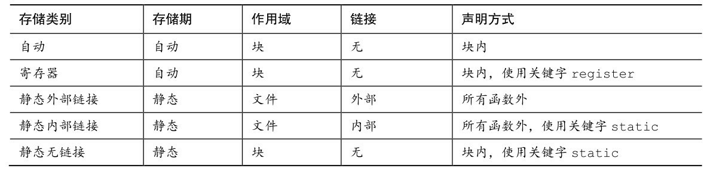

# 第12章 存储类别、链接和内存管理
本章介绍以下内容：

* 关键字：auto、extern、static、register、const、volatile、restricted、_Thread_local、_Atomic
* 函数：rand()、srand()、time()、malloc()、calloc()、free()
* 如何确定变量的作用域（可见的范围）和生命期（它存在多长时间）
* 设计更复杂的程序

C语言能让程序员恰到好处地控制程序，这是它的优势之一。程序员通过 C的内存管理系统指定变量的作用域和生命期，实现对程序的控制。合理使用内存储存数据是设计程序的一个要点。

## 12.1 存储类别
C提供了多种不同的模型或存储类别（storage class）在内存中储存数据。要理解这些存储类别，先要复习一些概念和术语。

本书目前所有编程示例中使用的数据都储存在内存中。从硬件方面来看，被储存的每个值都占用一定的物理内存，C 语言把这样的一块内存称为对象（object）。对象可以储存一个或多个值。一个对象可能并未储存实际的值，但是它在储存适当的值时一定具有相应的大小（面向对象编程中的对象指的是类对象，其定义包括数据和允许对数据进行的操作，C不是面向对象编程语言）。

从软件方面来看，程序需要一种方法访问对象。这可以通过声明变量来完成：
```c
int entity = 3;
```

该声明创建了一个名为entity的标识符（identifier）。标识符是一个名称，在这种情况下，标识符可以用来指定（designate）特定对象的内容。标识符遵循变量的命名规则（第2章介绍过）。在该例中，标识符entity即是软件（即C程序）指定硬件内存中的对象的方式。该声明还提供了储存在对象中的值。

变量名不是指定对象的唯一途径。考虑下面的声明：
```c
int * pt = &entity;
int ranks[10];
```

第1行声明中，pt是一个标识符，它指定了一个储存地址的对象。但是，表达式*pt不是标识符，因为它不是一个名称。然而，它确实指定了一个对象，在这种情况下，它与 entity 指定的对象相同。一般而言，那些指定对象的表达式被称为左值（第5章介绍过）。所以，entity既是标识符也是左值；*pt既是表达式也是左值。按照这个思路，ranks + 2 * entity既不是标识符（不是名称），也不是左值（它不指定内存位置上的内容）。但是表达式*(ranks + 2 * entity)是一个左值，因为它的确指了特定内存位置的值，即ranks数组的第7个元素。顺带一提，ranks的声明创建了一个可容纳10个int类型元素的对象，该数组的每个元素也是一个对象。

所有这些示例中，如果可以使用左值改变对象中的值，该左值就是一个可修改的左值（modifiable lvalue）。现在，考虑下面的声明：
```c
const char * pc = "Behold a string literal!";
```

程序根据该声明把相应的字符串字面量储存在内存中，内含这些字符值的数组就是一个对象。由于数组中的每个字符都能被单独访问，所以每个字符也是一个对象。该声明还创建了一个标识符为pc的对象，储存着字符串的地址。由于可以设置pc重新指向其他字符串，所以标识符pc是一个可修改的左值。const只能保证被pc指向的字符串内容不被修改，但是无法保证pc不指向别的字符串。由于*pc指定了储存'B'字符的数据对象，所以*pc 是一个左值，但不是一个可修改的左值。与此类似，因为字符串字面量本身指定了储存字符串的对象，所以它也是一个左值，但不是可修改的左值。

可以用存储期（storage duration）描述对象，所谓存储期是指对象在内存中保留了多长时间。标识符用于访问对象，可以用作用域（scope）和链接（linkage）描述标识符，标识符的作用域和链接表明了程序的哪些部分可以使用它。不同的存储类别具有不同的存储期、作用域和链接。标识符可以在源代码的多文件中共享、可用于特定文件的任意函数中、可仅限于特定函数中使用，甚至只在函数中的某部分使用。对象可存在于程序的执行期，也可以仅存在于它所在函数的执行期。对于并发编程，对象可以在特定线程的执行期存在。可以通过函数调用的方式显式分配和释放内存。

我们先学习作用域、链接和存储期的含义，再介绍具体的存储类别。

### 12.1.1 作用域
作用域描述程序中可访问标识符的区域。一个C变量的作用域可以是块作用域、函数作用域、函数原型作用域或文件作用域。到目前为止，本书程序示例中使用的变量几乎都具有块作用域。块是用一对花括号括起来的代码区域。例如，整个函数体是一个块，函数中的任意复合语句也是一个块。定义在块中的变量具有块作用域（block scope），块作用域变量的可见范围是从定义处到包含该定义的块的末尾。另外，虽然函数的形式参数声明在函数的左花括号之前，但是它们也具有块作用域，属于函数体这个块。所以到目前为止，我们使用的局部变量（包括函数的形式参数）都具有块作用域。因此，下面代码中的变量 cleo和patrick都具有块作用域：
```c
double blocky(double cleo)
{
    double patrick = 0.0;
    ...
    return patrick;
}
```

声明在内层块中的变量，其作用域仅局限于该声明所在的块：
```c
double blocky(double cleo)
{
    double patrick = 0.0;
    int i;
    for (i = 0; i < 10; i++)
    {
        double q = cleo * i; // q的作用域开始
        ...
        patrick *= q;
    }                // q的作用域结束
    ...
    return patrick;
}
```

在该例中，q的作用域仅限于内层块，只有内层块中的代码才能访问q。

以前，具有块作用域的变量都必须声明在块的开头。C99 标准放宽了这一限制，允许在块中的任意位置声明变量。因此，对于for的循环头，现在可以这样写：
```c
for (int i = 0; i < 10; i++)
    printf("A C99 feature: i = %d", i);
```

为适应这个新特性，C99把块的概念扩展到包括for循环、while循环、do while循环和if语句所控制的代码，即使这些代码没有用花括号括起来，也算是块的一部分。所以，上面for循环中的变量i被视为for循环块的一部分，它的作用域仅限于for循环。一旦程序离开for循环，就不能再访问i。

函数作用域（function scope）仅用于goto语句的标签。这意味着即使一个标签首次出现在函数的内层块中，它的作用域也延伸至整个函数。如果在两个块中使用相同的标签会很混乱，标签的函数作用域防止了这样的事情发生。

函数原型作用域（function prototype scope）用于函数原型中的形参名（变量名），如下所示：
```c
int mighty(int mouse, double large);
```

函数原型作用域的范围是从形参定义处到原型声明结束。这意味着，编译器在处理函数原型中的形参时只关心它的类型，而形参名（如果有的话）通常无关紧要。而且，即使有形参名，也不必与函数定义中的形参名相匹配。只有在变长数组中，形参名才有用：
```c
void use_a_VLA(int n, int m, ar[n][m]);
```

方括号中必须使用在函数原型中已声明的名称。

变量的定义在函数的外面，具有文件作用域（file scope）。具有文件作用域的变量，从它的定义处到该定义所在文件的末尾均可见。考虑下面的例子：
```c
#include <stdio.h>
int units = 0;    /* 该变量具有文件作用域 */
void critic(void);
int main(void)
{
    ...
}
void critic(void)
{
    ...
}
```

这里，变量units具有文件作用域，main()和critic()函数都可以使用它（更准确地说，units具有外部链接文件作用域，稍后讲解）。由于这样的变量可用于多个函数，所以文件作用域变量也称为全局变量（global variable）。

注意 翻译单元和文件

你认为的多个文件在编译器中可能以一个文件出现。例如，通常在源代码（.c扩展名）中包含一个或多个头文件（.h 扩展名）。头文件会依次包含其他头文件，所以会包含多个单独的物理文件。但是，C预处理实际上是用包含的头文件内容替换#include指令。所以，编译器源代码文件和所有的头文件都看成是一个包含信息的单独文件。这个文件被称为翻译单元（translation unit）。描述一个具有文件作用域的变量时，它的实际可见范围是整个翻译单元。如果程序由多个源代码文件组成，那么该程序也将由多个翻译单元组成。每个翻译单元均对应一个源代码文件和它所包含的文件。

### 12.1.2 链接
接下来，我们介绍链接。C 变量有 3 种链接属性：外部链接、内部链接或无链接。具有块作用域、函数作用域或函数原型作用域的变量都是无链接变量。这意味着这些变量属于定义它们的块、函数或原型私有。具有文件作用域的变量可以是外部链接或内部链接。外部链接变量可以在多文件程序中使用，内部链接变量只能在一个翻译单元中使用。

注意 正式和非正式术语

C 标准用“内部链接的文件作用域”描述仅限于一个翻译单元（即一个源代码文件和它所包含的头文件）的作用域，用“外部链接的文件作用域”描述可延伸至其他翻译单元的作用域。但是，对程序员而言这些术语太长了。一些程序员把“内部链接的文件作用域”简称为“文件作用域”，把“外部链接的文件作用域”简称为“全局作用域”或“程序作用域”。

如何知道文件作用域变量是内部链接还是外部链接？可以查看外部定义中是否使用了存储类别说明符static：
```c
int giants = 5;           // 文件作用域，外部链接
static int dodgers = 3;   // 文件作用域，内部链接
int main()
{
    ...
}
    ...
```

该文件和同一程序的其他文件都可以使用变量giants。而变量dodgers属文件私有，该文件中的任意函数都可使用它。

### 12.1.3 存储期
作用域和链接描述了标识符的可见性。存储期描述了通过这些标识符访问的对象的生存期。C对象有4种存储期：静态存储期、线程存储期、自动存储期、动态分配存储期。

如果对象具有静态存储期，那么它在程序的执行期间一直存在。文件作用域变量具有静态存储期。注意，对于文件作用域变量，关键字 static表明了其链接属性，而非存储期。以 static声明的文件作用域变量具有内部链接。但是无论是内部链接还是外部链接，所有的文件作用域变量都具有静态存储期。

线程存储期用于并发程序设计，程序执行可被分为多个线程。具有线程存储期的对象，从被声明时到线程结束一直存在。以关键字_Thread_local声明一个对象时，每个线程都获得该变量的私有备份。

块作用域的变量通常都具有自动存储期。当程序进入定义这些变量的块时，为这些变量分配内存；当退出这个块时，释放刚才为变量分配的内存。这种做法相当于把自动变量占用的内存视为一个可重复使用的工作区或暂存区。例如，一个函数调用结束后，其变量占用的内存可用于储存下一个被调用函数的变量。

变长数组稍有不同，它们的存储期从声明处到块的末尾，而不是从块的开始处到块的末尾。

我们到目前为止使用的局部变量都是自动类别。例如，在下面的代码中，变量number和index在每次调用bore()函数时被创建，在离开函数时被销毁：
```c
void bore(int number)
{
    int index;
    for (index = 0; index < number; index++)
        puts("They don't make them the way they used to.\n");
    return 0;
}
```

然而，块作用域变量也能具有静态存储期。为了创建这样的变量，要把变量声明在块中，且在声明前面加上关键字static：
```c
void more(int number)
{
    int index;
    static int ct = 0;
    ...
    return 0;
}
```

这里，变量ct储存在静态内存中，它从程序被载入到程序结束期间都存在。但是，它的作用域定义在more()函数块中。只有在执行该函数时，程序才能使用ct访问它所指定的对象（但是，该函数可以给其他函数提供该存储区的地址以便间接访问该对象，例如通过指针形参或返回值）。

C 使用作用域、链接和存储期为变量定义了多种存储方案。本书不涉及并发程序设计，所以不再赘述这方面的内容。已分配存储期在本章后面介绍。因此，剩下5种存储类别：自动、寄存器、静态块作用域、静态外部链接、静态内部链接，如表12.1所列。现在，我们已经介绍了作用域、链接和存储期，接下来将详细讨论这些存储类别。

表12.1 5种存储类别



### 12.1.4 自动变量
属于自动存储类别的变量具有自动存储期、块作用域且无链接。默认情况下，声明在块或函数头中的任何变量都属于自动存储类别。为了更清楚地表达你的意图（例如，为了表明有意覆盖一个外部变量定义，或者强调不要把该变量改为其他存储类别），可以显式使用关键字auto，如下所示：
```c
int main(void)
{
    auto int plox;
```

关键字auto是存储类别说明符（storage-class specifier）。auto关键字在C++中的用法完全不同，如果编写C/C++兼容的程序，最好不要使用auto作为存储类别说明符。

块作用域和无链接意味着只有在变量定义所在的块中才能通过变量名访问该变量（当然，参数用于传递变量的值和地址给另一个函数，但是这是间接的方法）。另一个函数可以使用同名变量，但是该变量是储存在不同内存位置上的另一个变量。

变量具有自动存储期意味着，程序在进入该变量声明所在的块时变量存在，程序在退出该块时变量消失。原来该变量占用的内存位置现在可做他用。

接下来分析一下嵌套块的情况。块中声明的变量仅限于该块及其包含的块使用。
```c
int loop(int n)
{
    int m; // m 的作用域
    scanf("%d", &m);
    {
        int i; // m 和 i 的作用域
        for (i = m; i < n; i++)
            puts("i is local to a sub-block\n");
    }
    return m; // m 的作用域，i 已经消失
}
```

在上面的代码中，i仅在内层块中可见。如果在内层块的前面或后面使用i，编译器会报错。通常，在设计程序时用不到这个特性。然而，如果这个变量仅供该块使用，那么在块中就近定义该变量也很方便。这样，可以在靠近使用变量的地方记录其含义。另外，这样的变量只有在使用时才占用内存。变量n和 m 分别定义在函数头和外层块中，它们的作用域是整个函数，而且在调用函数到函数结束期间都一直存在。

如果内层块中声明的变量与外层块中的变量同名会怎样？内层块会隐藏外层块的定义。但是离开内层块后，外层块变量的作用域又回到了原来的作用域。程序清单12.1演示了这一过程。

程序清单12.1 hiding.c程序
```c
// hiding.c -- 块中的变量
#include <stdio.h>
int main()
{
    int x = 30;       // 原始的 x
    printf("x in outer block: %d at %p\n", x, &x);
    {
        int x = 77;     // 新的 x，隐藏了原始的 x
        printf("x in inner block: %d at %p\n", x, &x);
    }
    printf("x in outer block: %d at %p\n", x, &x);
    while (x++ < 33)    // 原始的 x
    {
        int x = 100;    // 新的 x，隐藏了原始的 x
        x++;
        printf("x in while loop: %d at %p\n", x, &x);
    }
    printf("x in outer block: %d at %p\n", x, &x);
    return 0;
}
```

下面是该程序的输出：
```c
x in outer block: 30 at 0x7fff5fbff8c8
x in inner block: 77 at 0x7fff5fbff8c4
x in outer block: 30 at 0x7fff5fbff8c8
x in while loop: 101 at 0x7fff5fbff8c0
x in while loop: 101 at 0x7fff5fbff8c0
x in while loop: 101 at 0x7fff5fbff8c0
x in outer block: 34 at 0x7fff5fbff8c8
```

首先，程序创建了变量x并初始化为30，如第1条printf()语句所示。然后，定义了一个新的变量x，并设置为77，如第2条printf()语句所示。根据显示的地址可知，新变量隐藏了原始的x。第3条printf()语句位于第1个内层块后面，显示的是原始的x的值，这说明原始的x既没有消失也不曾改变。

也许该程序最难懂的是while循环。while循环的测试条件中使用的是原始的x：
```c
while(x++ < 33)
```

在该循环中，程序创建了第3个x变量，该变量只定义在while循环中。所以，当执行到循环体中的x++时，递增为101的是新的x，然后printf()语句显示了该值。每轮迭代结束，新的x变量就消失。然后循环的测试条件使用并递增原始的x，再次进入循环体，再次创建新的x。在该例中，这个x被创建和销毁了3次。注意，该循环必须在测试条件中递增x，因为如果在循环体中递增x，那么递增的是循环体中创建的x，而非测试条件中使用的原始x。

我们使用的编译器在创建while循环体中的x时，并未复用内层块中x占用的内存，但是有些编译器会这样做。

该程序示例的用意不是鼓励读者要编写类似的代码（根据C的命名规则，要想出别的变量名并不难），而是为了解释在内层块中定义变量的具体情况。

1. 没有花括号的块

前面提到一个C99特性：作为循环或if语句的一部分，即使不使用花括号（{}），也是一个块。更完整地说，整个循环是它所在块的子块（subblock），循环体是整个循环块的子块。与此类似，if 语句是一个块，与其相关联的子语句是if语句的子块。这些规则会影响到声明的变量和这些变量的作用域。程序清单12.2演示了for循环中该特性的用法。

程序清单12.2 forc99.c程序
```c
// forc99.c -- 新的 C99 块规则
#include <stdio.h>
int main()
{
    int n = 8;
    printf("  Initially, n = %d at %p\n", n, &n);
    for (int n = 1; n < 3; n++)
        printf("    loop 1: n = %d at %p\n", n, &n);
    printf("After loop 1, n = %d at %p\n", n, &n);
    for (int n = 1; n < 3; n++)
    {
        printf(" loop 2 index n = %d at %p\n", n, &n);
        int n = 6;
        printf("    loop 2: n = %d at %p\n", n, &n);
        n++;
    }
    printf("After loop 2, n = %d at %p\n", n, &n);
    return 0;
}
```

假设编译器支持C语言的这个新特性，该程序的输出如下：
```c
Initially, n = 8 at 0x7fff5fbff8c8
loop 1: n = 1 at 0x7fff5fbff8c4
loop 1: n = 2 at 0x7fff5fbff8c4
After loop 1, n = 8 at 0x7fff5fbff8c8
loop 2 index n = 1 at 0x7fff5fbff8c0
loop 2: n = 6 at 0x7fff5fbff8bc
loop 2 index n = 2 at 0x7fff5fbff8c0
loop 2: n = 6 at 0x7fff5fbff8bc
After loop 2, n = 8 at 0x7fff5fbff8c8
```

第1个for循环头中声明的n，其作用域作用至循环末尾，而且隐藏了原始的n。但是，离开循环后，原始的n又起作用了。

第2个for循环头中声明的n作为循环的索引，隐藏了原始的n。然后，在循环体中又声明了一个n，隐藏了索引n。结束一轮迭代后，声明在循环体中的n消失，循环头使用索引n进行测试。当整个循环结束时，原始的 n 又起作用了。再次提醒读者注意，没必要在程序中使用相同的变量名。如果用了，各变量的情况如上所述。

注意 支持C99和C11

有些编译器并不支持C99/C11的这些作用域规则（Microsoft Visual Studio 2012就是其中之一）。有些编译会提供激活这些规则的选项。例如，撰写本书时，gcc默认支持了C99的许多特性，但是要用选项激活程序清单12.2中使用的特性：
```c
gcc –std=c99 forc99.c
```

与此类似，gcc或clang都要使用或选项，才支持C11特性。

2. 自动变量的初始化

自动变量不会初始化，除非显式初始化它。考虑下面的声明：
```c
int main(void)
{
    int repid;
    int tents = 5;
```

tents变量被初始化为5，但是repid变量的值是之前占用分配给repid的空间中的任意值（如果有的话），别指望这个值是0。可以用非常量表达式（non-constant expression）初始化自动变量，前提是所用的变量已在前面定义过：
```c
int main(void)
{
    int ruth = 1;
    int rance = 5 * ruth; // 使用之前定义的变量
```

### 12.1.5 寄存器变量
变量通常储存在计算机内存中。如果幸运的话，寄存器变量储存在CPU的寄存器中，或者概括地说，储存在最快的可用内存中。与普通变量相比，访问和处理这些变量的速度更快。由于寄存器变量储存在寄存器而非内存中，所以无法获取寄存器变量的地址。绝大多数方面，寄存器变量和自动变量都一样。也就是说，它们都是块作用域、无链接和自动存储期。使用存储类别说明符register便可声明寄存器变量：
```c
int main(void)
{
    register int quick;
```

我们刚才说“如果幸运的话”，是因为声明变量为register类别与直接命令相比更像是一种请求。编译器必须根据寄存器或最快可用内存的数量衡量你的请求，或者直接忽略你的请求，所以可能不会如你所愿。在这种情况下，寄存器变量就变成普通的自动变量。即使是这样，仍然不能对该变量使用地址运算符。

在函数头中使用关键字register，便可请求形参是寄存器变量：
```c
void macho(register int n)
```

可声明为register的数据类型有限。例如，处理器中的寄存器可能没有足够大的空间来储存double类型的值。

### 12.1.6 块作用域的静态变量
静态变量（static variable）听起来自相矛盾，像是一个不可变的变量。实际上，静态的意思是该变量在内存中原地不动，并不是说它的值不变。具有文件作用域的变量自动具有（也必须是）静态存储期。前面提到过，可以创建具有静态存储期、块作用域的局部变量。这些变量和自动变量一样，具有相同的作用域，但是程序离开它们所在的函数后，这些变量不会消失。也就是说，这种变量具有块作用域、无链接，但是具有静态存储期。计算机在多次函数调用之间会记录它们的值。在块中（提供块作用域和无链接）以存储类别说明符static（提供静态存储期）声明这种变量。程序清单12.3演示了一个这样的例子。

程序清单12.3 loc_stat.c程序
```c
/* loc_stat.c -- 使用局部静态变量 */
#include <stdio.h>
void trystat(void);

int main(void)
{
    int count;
    for (count = 1; count <= 3; count++)
    {
        printf("Here comes iteration %d:\n", count);
        trystat();
    }
    return 0;
}

void trystat(void)
{
    int fade = 1;
    static int stay = 1;
    printf("fade = %d and stay = %d\n", fade++, stay++);
}
```

注意，trystat()函数先打印再递增变量的值。该程序的输出如下：
```c
Here comes iteration 1:
fade = 1 and stay = 1
Here comes iteration 2:
fade = 1 and stay = 2
Here comes iteration 3:
fade = 1 and stay = 3
```

静态变量stay保存了它被递增1后的值，但是fade变量每次都是1。这表明了初始化的不同：每次调用trystat()都会初始化fade，但是stay只在编译strstat()时被初始化一次。如果未显式初始化静态变量，它们会被初始化为0。

下面两个声明很相似：
```c
int fade = 1;
static int stay = 1;
```

第1条声明确实是trystat()函数的一部分，每次调用该函数时都会执行这条声明。这是运行时行为。第2条声明实际上并不是trystat()函数的一部分。如果逐步调试该程序会发现，程序似乎跳过了这条声明。这是因为静态变量和外部变量在程序被载入内存时已执行完毕。把这条声明放在trystat()函数中是为了告诉编译器只有trystat()函数才能看到该变量。这条声明并未在运行时执行。

不能在函数的形参中使用static：
```c
int wontwork(static int flu); // 不允许
```

“局部静态变量”是描述具有块作用域的静态变量的另一个术语。阅读一些老的 C文献时会发现，这种存储类别被称为内部静态存储类别（internal static storage class）。这里的内部指的是函数内部，而非内部链接。

### 12.1.7 外部链接的静态变量
外部链接的静态变量具有文件作用域、外部链接和静态存储期。该类别有时称为外部存储类别（external storage class），属于该类别的变量称为外部变量（external variable）。把变量的定义性声明（defining declaration）放在在所有函数的外面便创建了外部变量。当然，为了指出该函数使用了外部变量，可以在函数中用关键字extern再次声明。如果一个源代码文件使用的外部变量定义在另一个源代码文件中，则必须用extern在该文件中声明该变量。如下所示：
```c
int Errupt;          /* 外部定义的变量 */
double Up[100];      /* 外部定义的数组 */
extern char Coal;    /* 如果Coal被定义在另一个文件， */
/*则必须这样声明*/
void next(void);
int main(void)
{
    extern int Errupt;   /* 可选的声明*/
    extern double Up[];  /* 可选的声明*/
    ...
}
void next(void)
{
    ...
}
```

注意，在main()中声明Up数组时（这是可选的声明）不用指明数组大小，因为第1次声明已经提供了数组大小信息。main()中的两条 extern 声明完全可以省略，因为外部变量具有文件作用域，所以Errupt和Up从声明处到文件结尾都可见。它们出现在那里，仅为了说明main()函数要使用这两个变量。

如果省略掉函数中的extern关键字，相当于创建了一个自动变量。去掉下面声明中的extern：
```c
extern int Errupt;
```

便成为：
```c
int Errupt;
```

这使得编译器在 main()中创建了一个名为 Errupt 的自动变量。它是一个独立的局部变量，与原来的外部变量Errupt不同。该局部变量仅main()中可见，但是外部变量Errupt对于该文件的其他函数（如 next()）也可见。简而言之，在执行块中的语句时，块作用域中的变量将“隐藏”文件作用域中的同名变量。如果不得已要使用与外部变量同名的局部变量，可以在局部变量的声明中使用 auto 存储类别说明符明确表达这种意图。

外部变量具有静态存储期。因此，无论程序执行到main()、next()还是其他函数，数组Up及其值都一直存在。

下面 3 个示例演示了外部和自动变量的一些使用情况。示例 1 中有一个外部变量 Hocus。该变量对main()和magic()均可见。
```c
/* 示例1 */
int Hocus;
int magic();
int main(void)
{
    extern int Hocus; // Hocus 之前已声明为外部变量
    ...
}
int magic()
{
    extern int Hocus; // 与上面的Hocus 是同一个变量
    ...
}
```

示例2中有一个外部变量Hocus，对两个函数均可见。这次，在默认情况下对magic()可见。
```c
/*示例2 */
int Hocus;
int magic();
int main(void)
{
    extern int Hocus; // Hocus之前已声明为外部变量
    ...
}
int magic()
{
    //并未在该函数中声明Hocus，但是仍可使用该变量
    ...
}
```

在示例3中，创建了4个独立的变量。main()中的Hocus变量默认是自动变量，属于main()私有。magic()中的Hocus变量被显式声明为自动，只有magic()可用。外部变量Houcus对main()和magic()均不可见，但是对该文件中未创建局部Hocus变量的其他函数可见。最后，Pocus是外部变量，magic()可见，但是main()不可见，因为Pocus被声明在main()后面。
```c
/* 示例 3 */
int Hocus;
int magic();
int main(void)
{
    int Hocus; // 声明Hocus，默认是自动变量
    ...
}
int Pocus;
int magic()
{
    auto int Hocus; //把局部变量Hocus显式声明为自动变量
    ...
}
```

这 3 个示例演示了外部变量的作用域是：从声明处到文件结尾。除此之外，还说明了外部变量的生命期。外部变量Hocus和Pocus在程序运行中一直存在，因为它们不受限于任何函数，不会在某个函数返回后就消失。

1. 初始化外部变量

外部变量和自动变量类似，也可以被显式初始化。与自动变量不同的是，如果未初始化外部变量，它们会被自动初始化为 0。这一原则也适用于外部定义的数组元素。与自动变量的情况不同，只能使用常量表达式初始化文件作用域变量：
```c
int x = 10;          // 没问题，10是常量
int y = 3 + 20;       // 没问题，用于初始化的是常量表达式
size_t z = sizeof(int);   //没问题，用于初始化的是常量表达式
int x2 = 2 * x;      // 不行，x是变量
```

（只要不是变长数组，sizeof表达式可被视为常量表达式。）

2. 使用外部变量

下面来看一个使用外部变量的示例。假设有两个函数main()和critic()，它们都要访问变量units。可以把units声明在这两个函数的上面，如程序清单12.4所示（注意：该例的目的是演示外部变量的工作原理，并非它的典型用法）。

程序清单12.4 global.c程序
```c
/* global.c -- 使用外部变量 */
#include <stdio.h>
int units = 0;    /* 外部变量 */
void critic(void);
int main(void)
{
    extern int units; /* 可选的重复声明 */
    printf("How many pounds to a firkin of butter?\n");
    scanf("%d", &units);
    while (units != 56)
        critic();
    printf("You must have looked it up!\n");
    return 0;
}
void critic(void)
{
    /* 删除了可选的重复声明 */
    printf("No luck, my friend. Try again.\n");
    scanf("%d", &units);
}
```

下面是该程序的输出示例：
```c
How many pounds to a firkin of butter?
14
No luck, my friend. Try again.
56
You must have looked it up!
```

注意，critic()是如何读取 units的第2 个值的。当while循环结束时，main()也知道units的新值。所以main()函数和critic()都可以通过标识符units访问相同的变量。用C的术语来描述是， units具有文件作用域、外部链接和静态存储期。

把units定义在所有函数定义外面（即外部），units便是一个外部变量，对units定义下面的所有函数均可见。因此，critics()可以直接使用units变量。

类似地，main()也可直接访问units。但是，main()中确实有如下声明：
```c
extern int units;
```

本例中，以上声明主要是为了指出该函数要使用这个外部变量。存储类别说明符extern告诉编译器，该函数中任何使用units的地方都引用同一个定义在函数外部的变量。再次强调，main()和critic()使用的都是外部定义的units。

3. 外部名称

C99和C11标准都要求编译器识别局部标识符的前63个字符和外部标识符的前31个字符。这修订了以前的标准，即编译器识别局部标识符前31个字符和外部标识符前6个字符。你所用的编译器可能还执行以前的规则。外部变量名比局部变量名的规则严格，是因为外部变量名还要遵循局部环境规则，所受的限制更多。

4. 定义和声明

下面进一步介绍定义变量和声明变量的区别。考虑下面的例子：
```c
int tern = 1; /* tern被定义 */
main()
{
    extern int tern; /* 使用在别处定义的tern */
```

这里，tern被声明了两次。第1次声明为变量预留了存储空间，该声明构成了变量的定义。第2次声明只告诉编译器使用之前已创建的tern变量，所以这不是定义。第1次声明被称为定义式声明（defining declaration），第2次声明被称为引用式声明（referencing declaration）。关键字extern表明该声明不是定义，因为它指示编译器去别处查询其定义。

假设这样写：
```c
extern int tern;
int main(void)
{
```

编译器会假设 tern 实际的定义在该程序的别处，也许在别的文件中。该声明并不会引起分配存储空间。因此，不要用关键字extern创建外部定义，只用它来引用现有的外部定义。

外部变量只能初始化一次，且必须在定义该变量时进行。假设有下面的代码：
```c
// file_one.c
char permis = 'N';
...
// file_two.c
extern char permis = 'Y'; /* 错误 */
```

file_two中的声明是错误的，因为file_one.c中的定义式声明已经创建并初始化了permis。

### 12.1.8 内部链接的静态变量
该存储类别的变量具有静态存储期、文件作用域和内部链接。在所有函数外部（这点与外部变量相同），用存储类别说明符static定义的变量具有这种存储类别：
```c
static int svil = 1;  // 静态变量，内部链接
int main(void)
{
```

这种变量过去称为外部静态变量（external static variable），但是这个术语有点自相矛盾（这些变量具有内部链接）。但是，没有合适的新简称，所以只能用内部链接的静态变量（static variable with internal linkage）。普通的外部变量可用于同一程序中任意文件中的函数，但是内部链接的静态变量只能用于同一个文件中的函数。可以使用存储类别说明符 extern，在函数中重复声明任何具有文件作用域的变量。这样的声明并不会改变其链接属性。考虑下面的代码：
```c
int traveler = 1;      // 外部链接
static int stayhome = 1;  // 内部链接
int main()
{
    extern int traveler;  // 使用定义在别处的 traveler
    extern int stayhome;  // 使用定义在别处的 stayhome
    ...
```

对于该程序所在的翻译单元，trveler和stayhome都具有文件作用域，但是只有traveler可用于其他翻译单元（因为它具有外部链接）。这两个声明都使用了extern关键字，指明了main()中使用的这两个变量的定义都在别处，但是这并未改变stayhome的内部链接属性。

### 12.1.9 多文件
只有当程序由多个翻译单元组成时，才体现区别内部链接和外部链接的重要性。接下来简要介绍一下。

复杂的C程序通常由多个单独的源代码文件组成。有时，这些文件可能要共享一个外部变量。C通过在一个文件中进行定义式声明，然后在其他文件中进行引用式声明来实现共享。也就是说，除了一个定义式声明外，其他声明都要使用extern关键字。而且，只有定义式声明才能初始化变量。

注意，如果外部变量定义在一个文件中，那么其他文件在使用该变量之前必须先声明它（用 extern关键字）。也就是说，在某文件中对外部变量进行定义式声明只是单方面允许其他文件使用该变量，其他文件在用extern声明之前不能直接使用它。

过去，不同的编译器遵循不同的规则。例如，许多 UNIX系统允许在多个文件中不使用 extern 关键字声明变量，前提是只有一个带初始化的声明。编译器会把文件中一个带初始化的声明视为该变量的定义。

### 12.1.10 存储类别说明符
读者可能已经注意到了，关键字static和extern的含义取决于上下文。C语言有6个关键字作为存储类别说明符：auto、register、static、extern、_Thread_local和typedef。typedef关键字与任何内存存储无关，把它归于此类有一些语法上的原因。尤其是，在绝大多数情况下，不能在声明中使用多个存储类别说明符，所以这意味着不能使用多个存储类别说明符作为typedef的一部分。唯一例外的是_Thread_local，它可以和static或extern一起使用。

auto说明符表明变量是自动存储期，只能用于块作用域的变量声明中。由于在块中声明的变量本身就具有自动存储期，所以使用auto主要是为了明确表达要使用与外部变量同名的局部变量的意图。

register 说明符也只用于块作用域的变量，它把变量归为寄存器存储类别，请求最快速度访问该变量。同时，还保护了该变量的地址不被获取。

用 static 说明符创建的对象具有静态存储期，载入程序时创建对象，当程序结束时对象消失。如果static 用于文件作用域声明，作用域受限于该文件。如果 static 用于块作用域声明，作用域则受限于该块。因此，只要程序在运行对象就存在并保留其值，但是只有在执行块内的代码时，才能通过标识符访问。块作用域的静态变量无链接。文件作用域的静态变量具有内部链接。

extern 说明符表明声明的变量定义在别处。如果包含 extern 的声明具有文件作用域，则引用的变量必须具有外部链接。如果包含 extern 的声明具有块作用域，则引用的变量可能具有外部链接或内部链接，这接取决于该变量的定义式声明。

小结：存储类别

自动变量具有块作用域、无链接、自动存储期。它们是局部变量，属于其定义所在块（通常指函数）私有。寄存器变量的属性和自动变量相同，但是编译器会使用更快的内存或寄存器储存它们。不能获取寄存器变量的地址。

具有静态存储期的变量可以具有外部链接、内部链接或无链接。在同一个文件所有函数的外部声明的变量是外部变量，具有文件作用域、外部链接和静态存储期。如果在这种声明前面加上关键字static，那么其声明的变量具有文件作用域、内部链接和静态存储期。如果在函数中用 static 声明一个变量，则该变量具有块作用域、无链接、静态存储期。

具有自动存储期的变量，程序在进入该变量的声明所在块时才为其分配内存，在退出该块时释放之前分配的内存。如果未初始化，自动变量中是垃圾值。程序在编译时为具有静态存储期的变量分配内存，并在程序的运行过程中一直保留这块内存。如果未初始化，这样的变量会被设置为0。

具有块作用域的变量是局部的，属于包含该声明的块私有。具有文件作用域的变量对文件（或翻译单元）中位于其声明后面的所有函数可见。具有外部链接的文件作用域变量，可用于该程序的其他翻译单元。具有内部链接的文件作用域变量，只能用于其声明所在的文件内。

下面用一个简短的程序使用了5种存储类别。该程序包含两个文件（程序清单12.5和程序清单12.6），所以必须使用多文件编译（参见第9章或参看编译器的指导手册）。该示例仅为了让读者熟悉5种存储类别的用法，并不是提供设计模型，好的设计可以不需要使用文件作用域变量。

程序清单12.5 parta.c程序
```c
// parta.c --- 不同的存储类别
// 与 partb.c 一起编译
#include <stdio.h>
void report_count();
void accumulate(int k);
int count = 0;     // 文件作用域，外部链接
int main(void)
{
    int value;     // 自动变量
    register int i;  // 寄存器变量
    printf("Enter a positive integer (0 to quit): ");
    while (scanf("%d", &value) == 1 && value > 0)
    {
        ++count;    // 使用文件作用域变量
        for (i = value; i >= 0; i--)
            accumulate(i);
        printf("Enter a positive integer (0 to quit): ");
    }
    report_count();
    return 0;
}

void report_count()
{
    printf("Loop executed %d times\n", count);
}
```

程序清单12.6 partb.c程序
```c
// partb.c -- 程序的其余部分
// 与 parta.c 一起编译
#include <stdio.h>
extern int count;      // 引用式声明，外部链接
static int total = 0;    // 静态定义，内部链接
void accumulate(int k);   // 函数原型
void accumulate(int k)// k 具有块作用域，无链接
{
    static int subtotal = 0;  // 静态，无链接
    if (k <= 0)
    {
        printf("loop cycle: %d\n", count);
        printf("subtotal: %d; total: %d\n", subtotal, total);
        subtotal = 0;
    }
    else
    {
        subtotal += k;
        total += k;
    }
}
```

在该程序中，块作用域的静态变量subtotal统计每次while循环传入accumulate()函数的总数，具有文件作用域、内部链接的变量 total 统计所有传入 accumulate()函数的总数。当传入负值时， accumulate()函数报告total和subtotal的值，并在报告后重置subtotal为0。由于parta.c调用了 accumulate()函数，所以必须包含 accumulate()函数的原型。而 partb.c 只包含了accumulate()函数的定义，并未在文件中调用该函数，所以其原型为可选（即省略原型也不影响使用）。该函数使用了外部变量count 统计main()中的while循环迭代的次数（顺带一提，对于该程序，没必要使用外部变量把 parta.c 和 partb.c的代码弄得这么复杂）。在 parta.c 中，main()和report_count()共享count。

下面是程序的运行示例：
```c
Enter a positive integer (0 to quit): 5
loop cycle: 1
subtotal: 15; total: 15
Enter a positive integer (0 to quit): 10
loop cycle: 2
subtotal: 55; total: 70
Enter a positive integer (0 to quit): 2
loop cycle: 3
subtotal: 3; total: 73
Enter a positive integer (0 to quit): 0
Loop executed 3 times
```

### 12.1.11 存储类别和函数
函数也有存储类别，可以是外部函数（默认）或静态函数。C99 新增了第 3 种类别——内联函数，将在第16章中介绍。外部函数可以被其他文件的函数访问，但是静态函数只能用于其定义所在的文件。假设一个文件中包含了以下函数原型：
```c
double gamma(double);   /* 该函数默认为外部函数 */
static double beta(int, int);
extern double delta(double, int);
```

在同一个程序中，其他文件中的函数可以调用gamma()和delta()，但是不能调用beta()，因为以static存储类别说明符创建的函数属于特定模块私有。这样做避免了名称冲突的问题，由于beta()受限于它所在的文件，所以在其他文件中可以使用与之同名的函数。

通常的做法是：用 extern 关键字声明定义在其他文件中的函数。这样做是为了表明当前文件中使用的函数被定义在别处。除非使用static关键字，否则一般函数声明都默认为extern。

### 12.1.12 存储类别的选择
对于“使用哪种存储类别”的回答绝大多数是“自动存储类别”，要知道默认类别就是自动存储类别。初学者会认为外部存储类别很不错，为何不把所有的变量都设置成外部变量，这样就不必使用参数和指针在函数间传递信息了。然而，这背后隐藏着一个陷阱。如果这样做，A()函数可能违背你的意图，私下修改B()函数使用的变量。多年来，无数程序员的经验表明，随意使用外部存储类别的变量导致的后果远远超过了它所带来的便利。

唯一例外的是const数据。因为它们在初始化后就不会被修改，所以不用担心它们被意外篡改：
```c
const int DAYS = 7;
const char * MSGS[3] = {"Yes", "No", Maybe"};
```

保护性程序设计的黄金法则是：“按需知道”原则。尽量在函数内部解决该函数的任务，只共享那些需要共享的变量。除自动存储类别外，其他存储类别也很有用。不过，在使用某类别之前先要考虑一下是否有必要这样做。

## 12.2 随机数函数和静态变量
学习了不同存储类别的概念后，我们来看几个相关的程序。首先，来看一个使用内部链接的静态变量的函数：随机数函数。ANSI C库提供了rand()函数生成随机数。生成随机数有多种算法，ANSI C允许C实现针对特定机器使用最佳算法。然而，ANSI C标准还提供了一个可移植的标准算法，在不同系统中生成相同的随机数。实际上，rand()是“伪随机数生成器”，意思是可预测生成数字的实际序列。但是，数字在其取值范围内均匀分布。

为了看清楚程序内部的情况，我们使用可移植的ANSI版本，而不是编译器内置的rand()函数。可移植版本的方案开始于一个“种子”数字。该函数使用该种子生成新的数，这个新数又成为新的种子。然后，新种子可用于生成更新的种子，以此类推。该方案要行之有效，随机数函数必须记录它上一次被调用时所使用的种子。这里需要一个静态变量。程序清单12.7演示了版本0（稍后给出版本1）。

程序清单12.7 rand0.c函数文件
```c
/* rand0.c --生成随机数*/
/* 使用 ANSI C 可移植算法 */
static unsigned long int next = 1; /* 种子 */
unsigned int rand0(void)
{
    /* 生成伪随机数的魔术公式 */
    next = next * 1103515245 + 12345;
    return (unsigned int) (next / 65536) % 32768;
}
```

在程序清单12.7中，静态变量next的初始值是1，其值在每次调用rand0()函数时都会被修改（通过魔术公式）。该函数是用于返回一个0～32767之间的值。注意，next是具有内部链接的静态变量（并非无链接）。这是为了方便稍后扩展本例，供同一个文件中的其他函数共享。

程序清单12.8是测试rand0()函数的一个简单的驱动程序。

程序清单12.8 r_drive0.c驱动程序
```c
/* r_drive0.c -- 测试 rand0()函数 */
/* 与 rand0.c 一起编译*/
#include <stdio.h>
extern unsigned int rand0(void);
int main(void)
{
    int count;
    for (count = 0; count < 5; count++)
        printf("%d\n", rand0());
    return 0;
}
```

该程序也需要多文件编译。程序清单 12.7 和程序清单 12.8 分别使用一个文件。程序清单 12.8 中的extern关键字提醒读者rand0()被定义在其他文件中，在这个文件中不要求写出该函数原型。输出如下：
```c
16838
5758
10113
17515
31051
```

程序输出的数字看上去是随机的，再次运行程序后，输出如下：
```c
16838
5758
10113
17515
31051
```

看来，这两次的输出完全相同，这体现了“伪随机”的一个方面。每次主程序运行，都开始于相同的种子1。可以引入另一个函数srand1()重置种子来解决这个问题。关键是要让next成为只供rand1()和srand1()访问的内部链接静态变量（srand1()相当于C库中的srand()函数）。把srand1()加入rand1()所在的文件中。程序清单12.9给出了修改后的文件。

程序清单12.9 s_and_r.c文件程序
```c
/* s_and_r.c -- 包含 rand1() 和 srand1() 的文件  */
/*       使用 ANSI C 可移植算法   */
static unsigned long int next = 1; /* 种子 */
int rand1(void)
{
    /*生成伪随机数的魔术公式*/
    next = next * 1103515245 + 12345;
    return (unsigned int) (next / 65536) % 32768;
}
void srand1(unsigned int seed)
{
    next = seed;
}
```

注意，next是具有内部链接的文件作用域静态变量。这意味着rand1()和srand1()都可以使用它，但是其他文件中的函数无法访问它。使用程序清单12.10的驱动程序测试这两个函数。

程序清单12.10 r_drive1.c驱动程序
```c
/* r_drive1.c -- 测试 rand1() 和 srand1() */
/* 与 s_and_r.c 一起编译 */
#include <stdio.h>
#include <stdlib.h>
extern void srand1(unsigned int x);
extern int rand1(void);
int main(void)
{
    int count;
    unsigned seed;
    printf("Please enter your choice for seed.\n");
    while (scanf("%u", &seed) == 1)
    {
        srand1(seed);  /* 重置种子 */
        for (count = 0; count < 5; count++)
            printf("%d\n", rand1());
        printf("Please enter next seed (q to quit):\n");
    }
    printf("Done\n");
    return 0;
}
```

编译两个文件，运行该程序后，其输出如下：
```c
1
16838
5758
10113
17515
31051
Please enter next seed (q to quit):
513
20067
23475
8955
20841
15324
Please enter next seed (q to quit):
q
Done
```

设置seed的值为1，输出的结果与前面程序相同。但是设置seed的值为513后就得到了新的结果。

注意 自动重置种子

如果 C 实现允许访问一些可变的量（如，时钟系统），可以用这些值（可能会被截断）初始化种子值。例如，ANSI C有一个time()函数返回系统时间。虽然时间单元因系统而异，但是重点是该返回值是一个可进行运算的类型，而且其值随着时间变化而变化。time()返回值的类型名是time_t，具体类型与系统有关。这没关系，我们可以使用强制类型转换：
```c
#include <time.h> /* 提供time()的ANSI原型*/
srand1((unsigned int) time(0)); /* 初始化种子 */
```

一般而言，time()接受的参数是一个 time_t 类型对象的地址，而时间值就储存在传入的地址上。当然，也可以传入空指针（0）作为参数，这种情况下，只能通过返回值机制来提供值。

可以把这个技巧应用于标准的ANSI C函数srand()和rand()中。如果使用这些函数，要在文件中包含stdlib.c头文件。实际上，既然已经明白了srand1()和rand1()如何使用内部链接的静态变量，你也可以使用编译器提供的版本。我们将在下一个示例中这样做。

## 12.3 掷骰子
我们将要模拟一个非常流行的游戏——掷骰子。骰子的形式多种多样，最普遍的是使用两个6面骰子。在一些冒险游戏中，会使用5种骰子：4面、6面、8面、12面和20面。聪明的古希腊人证明了只有5种正多面体，它们的所有面都具有相同的形状和大小。各种不同类型的骰子就是根据这些正多面体发展而来。也可以做成其他面数的，但是其所有的面不会都相等，因此各个面朝上的几率就不同。

计算机计算不用考虑几何的限制，所以可以设计任意面数的电子骰子。我们先从6面开始。

我们想获得1～6的随机数。然而，rand()生成的随机数在0～RAND_MAX之间。RAND_MAX被定义在stdlib.h中，其值通常是INT_MAX。因此，需要进行一些调整，方法如下。

1. 把随机数求模6，获得的整数在0～5之间。
2. 结果加1，新值在1～6之间。
3. 为方便以后扩展，把第1步中的数字6替换成骰子面数。

下面的代码实现了这3个步骤：
```c
#include <stdlib.h> /* 提供rand()的原型 */
int rollem(int sides)
{
    int roll;
    roll = rand() % sides + 1;
    return roll;
}
```

我们还想用一个函数提示用户选择任意面数的骰子，并返回点数总和。如程序清单12.11所示。

程序清单12.11 diceroll.c程序
```c
/* diceroll.c -- 掷骰子模拟程序 */
/* 与 mandydice.c 一起编译 */
#include "diceroll.h"
#include <stdio.h>
#include <stdlib.h>      /* 提供库函数 rand()的原型 */
int roll_count = 0;      /* 外部链接 */
static int rollem(int sides)  /* 该函数属于该文件私有 */
{
    int roll;
    roll = rand() % sides + 1;
    ++roll_count;       /* 计算函数调用次数 */
    return roll;
}

int roll_n_dice(int dice, int sides)
{
    int d;
    int total = 0;
    if (sides < 2)
    {
        printf("Need at least 2 sides.\n");
        return -2;
    }
    if (dice < 1)
    {
        printf("Need at least 1 die.\n");
        return -1;
    }
    for (d = 0; d < dice; d++)
        total += rollem(sides);
    return total;
}
```

该文件加入了新元素。第一，rollem()函数属于该文件私有，它是roll_n_dice()的辅助函数。第二，为了演示外部链接的特性，该文件声明了一个外部变量roll_count。该变量统计调用rollem()函数的次数。这样设计有点蹩脚，仅为了演示外部变量的特性。第三，该文件包含以下预处理指令：
```c
#include "diceroll.h"
```

如果使用标准库函数，如 rand()，要在当前文件中包含标准头文件（对rand()而言要包含stdlib.h），而不是声明该函数。因为头文件中已经包含了正确的函数原型。我们效仿这一做法，把roll_n_dice()函数的原型放在diceroll.h头文件中。把文件名放在双引号中而不是尖括号中，指示编译器在本地查找文件，而不是到编译器存放标准头文件的位置去查找文件。“本地查找”的含义取决于具体的实现。一些常见的实现把头文件与源代码文件或工程文件（如果编译器使用它们的话）放在相同的目录或文件夹中。程序清单12.12是头文件中的内容。

程序清单12.12 diceroll.h文件
```c
//diceroll.h
extern int roll_count;
int roll_n_dice(int dice, int sides);
```

该头文件中包含一个函数原型和一个 extern 声明。由于 direroll.c 文件包含了该文件， direroll.c实际上包含了roll_count的两个声明：
```c
extern int roll_count;   // 头文件中的声明（引用式声明）
int roll_count = 0;      // 源代码文件中的声明（定义式声明）
```

这样做没问题。一个变量只能有一个定义式声明，但是带 extern 的声明是引用式声明，可以有多个引用式声明。

使用 roll_n_dice()函数的程序都要包含 diceroll.c 头文件。包含该头文件后，程序便可使用roll_n_dice()函数和roll_count变量。如程序清单12.13所示。

程序清单12.13 manydice.c文件
```c
/* manydice.c -- 多次掷骰子的模拟程序 */
/* 与 diceroll.c 一起编译*/
#include <stdio.h>
#include <stdlib.h>    /* 为库函数 srand() 提供原型 */
#include <time.h>     /* 为 time() 提供原型      */
#include "diceroll.h"   /* 为roll_n_dice()提供原型，为roll_count变量
提供声明 */
int main(void)
{
    int dice, roll;
    int sides;
    int status;
    srand((unsigned int) time(0)); /* 随机种子 */
    printf("Enter the number of sides per die, 0 to stop.\n");
    while (scanf("%d", &sides) == 1 && sides > 0)
    {
        printf("How many dice?\n");
        if ((status = scanf("%d", &dice)) != 1)
        {
            if (status == EOF)
                break;       /* 退出循环 */
            else
            {
                printf("You should have entered an integer.");
                printf(" Let's begin again.\n");
                while (getchar() != '\n')
                    continue;   /* 处理错误的输入 */
                printf("How many sides? Enter 0 to stop.\n");
                continue;       /* 进入循环的下一轮迭代 */
            }
        }
        roll = roll_n_dice(dice, sides);
        printf("You have rolled a %d using %d %d-sided dice.\n",
        roll, dice, sides);
        printf("How many sides? Enter 0 to stop.\n");
    }
    printf("The rollem() function was called %d times.\n",
    roll_count);     /* 使用外部变量 */
    printf("GOOD FORTUNE TO YOU!\n");
    return 0;
}
```

要与包含程序清单12.11的文件一起编译该文件。可以把程序清单12.11、12.12和12.13都放在同一文件夹或目录中。运行该程序，下面是一个输出示例：
```c
Enter the number of sides per die, 0 to stop.
6
How many dice?
2
You have rolled a 12 using 2 6-sided dice.
How many sides? Enter 0 to stop.
6
How many dice?
2
You have rolled a 4 using 2 6-sided dice.
How many sides? Enter 0 to stop.
6
How many dice?
2
You have rolled a 5 using 2 6-sided dice.
How many sides? Enter 0 to stop.
0
The rollem() function was called 6 times.
GOOD FORTUNE TO YOU!
```

因为该程序使用了srand()随机生成随机数种子，所以大多数情况下，即使输入相同也很难得到相同的输出。注意，manydice.c中的main()访问了定义在diceroll.c中的roll_count变量。

有3种情况可以导致外层while循环结束：side小于1、输入类型不匹配（此时scanf()返回0）、遇到文件结尾（返回值是EOF）。为了读取骰子的点数，该程序处理文件结尾的方式（退出while循环）与处理类型不匹配（进入循环的下一轮迭代）的情况不同。

可以通过多种方式使用roll_n_dice()。sides等于2时，程序模仿掷硬币，“正面朝上”为2，“反面朝上”为1（或者反过来表示也行）。很容易修改该程序单独显示点数的结果，或者构建一个骰子模拟器。如果要掷多次骰子（如在一些角色扮演类游戏中），可以很容易地修改程序以输出类似的结果：
```c
Enter the number of sets; enter q to stop.
18
How many sides and how many dice?
6 3
Here are 18 sets of 3 6-sided throws.
12 10 6 9 8 14 8 15 9 14 12 17 11 7 10
13 8 14
How many sets? Enter q to stop.
q
```

rand1()或 rand()（不是 rollem()）还可以用来创建一个猜数字程序，让计算机选定一个数字，你来猜。读者感兴趣的话可以自己编写这个程序。

## 12.4 分配内存：malloc()和free()
我们前面讨论的存储类别有一个共同之处：在确定用哪种存储类别后，根据已制定好的内存管理规则，将自动选择其作用域和存储期。然而，还有更灵活地选择，即用库函数分配和管理内存。

首先，回顾一下内存分配。所有程序都必须预留足够的内存来储存程序使用的数据。这些内存中有些是自动分配的。例如，以下声明：
```c
float x;
char place[] = "Dancing Oxen Creek";
```

为一个float类型的值和一个字符串预留了足够的内存，或者可以显式指定分配一定数量的内存：
```c
int plates[100];
```

该声明预留了100个内存位置，每个位置都用于储存int类型的值。声明还为内存提供了一个标识符。因此，可以使用x或place识别数据。回忆一下，静态数据在程序载入内存时分配，而自动数据在程序执行块时分配，并在程序离开该块时销毁。

C 能做的不止这些。可以在程序运行时分配更多的内存。主要的工具是malloc()函数，该函数接受一个参数：所需的内存字节数。malloc()函数会找到合适的空闲内存块，这样的内存是匿名的。也就是说， malloc()分配内存，但是不会为其赋名。然而，它确实返回动态分配内存块的首字节地址。因此，可以把该地址赋给一个指针变量，并使用指针访问这块内存。因为char表示1字节，malloc()的返回类型通常被定义为指向char的指针。然而，从ANSI C标准开始，C使用一个新的类型：指向void的指针。该类型相当于一个“通用指针”。malloc()函数可用于返回指向数组的指针、指向结构的指针等，所以通常该函数的返回值会被强制转换为匹配的类型。在ANSI C中，应该坚持使用强制类型转换，提高代码的可读性。然而，把指向 void的指针赋给任意类型的指针完全不用考虑类型匹配的问题。如果 malloc()分配内存失败，将返回空指针。

我们试着用 malloc()创建一个数组。除了用 malloc()在程序运行时请求一块内存，还需要一个指针记录这块内存的位置。例如，考虑下面的代码：
```c
double * ptd;
ptd = (double *) malloc(30 * sizeof(double));
```

以上代码为30个double类型的值请求内存空间，并设置ptd指向该位置。注意，指针ptd被声明为指向一个double类型，而不是指向内含30个double类型值的块。回忆一下，数组名是该数组首元素的地址。因此，如果让ptd指向这个块的首元素，便可像使用数组名一样使用它。也就是说，可以使用表达式ptd[0]访问该块的首元素，ptd[1]访问第2个元素，以此类推。根据前面所学的知识，可以使用数组名来表示指针，也可以用指针来表示数组。

现在，我们有3种创建数组的方法。

声明数组时，用常量表达式表示数组的维度，用数组名访问数组的元素。可以用静态内存或自动内存创建这种数组。

声明变长数组（C99新增的特性）时，用变量表达式表示数组的维度，用数组名访问数组的元素。具有这种特性的数组只能在自动内存中创建。

声明一个指针，调用malloc()，将其返回值赋给指针，使用指针访问数组的元素。该指针可以是静态的或自动的。

使用第2种和第3种方法可以创建动态数组（dynamic array）。这种数组和普通数组不同，可以在程序运行时选择数组的大小和分配内存。例如，假设n是一个整型变量。在C99之前，不能这样做：
```c
double item[n]; /* C99之前：n不允许是变量 */
```

但是，可以这样做：
```c
ptd = (double *) malloc(n * sizeof(double)); /* 可以 */
```

如你所见，这比变长数组更灵活。

通常，malloc()要与free()配套使用。free()函数的参数是之前malloc()返回的地址，该函数释放之前malloc()分配的内存。因此，动态分配内存的存储期从调用malloc()分配内存到调用free()释放内存为止。设想malloc()和free()管理着一个内存池。每次调用malloc()分配内存给程序使用，每次调用free()把内存归还内存池中，这样便可重复使用这些内存。free()的参数应该是一个指针，指向由 malloc()分配的一块内存。不能用 free()释放通过其他方式（如，声明一个数组）分配的内存。malloc()和free()的原型都在stdlib.h头文件中。

使用malloc()，程序可以在运行时才确定数组大小。如程序清单12.14所示，它把内存块的地址赋给指针 ptd，然后便可以使用数组名的方式使用ptd。另外，如果内存分配失败，可以调用 exit()函数结束程序，其原型在stdlib.h中。EXIT_FAILURE的值也被定义在stdlib.h中。标准提供了两个返回值以保证在所有操作系统中都能正常工作：EXIT_SUCCESS（或者，相当于0）表示普通的程序结束， EXIT_FAILURE 表示程序异常中止。一些操作系统（包括 UNIX、Linux 和 Windows）还接受一些表示其他运行错误的整数值。

程序清单12.14 dyn_arr.c程序
```c
/* dyn_arr.c -- 动态分配数组 */
#include <stdio.h>
#include <stdlib.h> /* 为 malloc()、free()提供原型 */
int main(void)
{
    double * ptd;
    int max;
    int number;
    int i = 0;
    puts("What is the maximum number of type double entries?");
    if (scanf("%d", &max) != 1)
    {
        puts("Number not correctly entered -- bye.");
        exit(EXIT_FAILURE);
    }
    ptd = (double *) malloc(max * sizeof(double));
    if (ptd == NULL)
    {
        puts("Memory allocation failed. Goodbye.");
        exit(EXIT_FAILURE);
    }
    /* ptd 现在指向有max个元素的数组 */
    puts("Enter the values (q to quit):");
    while (i < max && scanf("%lf", &ptd[i]) == 1)
        ++i;
    printf("Here are your %d entries:\n", number = i);
    for (i = 0; i < number; i++)
    {
        printf("%7.2f ", ptd[i]);
        if (i % 7 == 6)
            putchar('\n');
    }
    if (i % 7 != 0)
        putchar('\n');
    puts("Done.");
    free(ptd);
    return 0;
}
```

下面是该程序的运行示例。程序通过交互的方式让用户先确定数组的大小，我们设置数组大小为 5。虽然我们后来输入了6个数，但程序也只处理前5个数。
```c
What is the maximum number of type double entries?
5
Enter the values (q to quit):
20 30 35 25 40 80
Here are your 5 entries:
  20.00   30.00   35.00   25.00   40.00
Done.
```

该程序通过以下代码获取数组的大小：
```c
if (scanf("%d", &max) != 1)
{
    puts("Number not correctly entered -- bye.");
    exit(EXIT_FAILURE);
}
```

接下来，分配足够的内存空间以储存用户要存入的所有数，然后把动态分配的内存地址赋给指针ptd：
```c
ptd = (double *) malloc(max * sizeof (double));
```

在C中，不一定要使用强制类型转换(double *)，但是在C++中必须使用。所以，使用强制类型转换更容易把C程序转换为C++程序。

malloc()可能分配不到所需的内存。在这种情况下，该函数返回空指针，程序结束：
```c
if (ptd == NULL)
{
    puts("Memory allocation failed. Goodbye.");
    exit(EXIT_FAILURE);
}
```

如果程序成功分配内存，便可把ptd视为一个有max个元素的数组名。

注意，free()函数位于程序的末尾，它释放了malloc()函数分配的内存。free()函数只释放其参数指向的内存块。一些操作系统在程序结束时会自动释放动态分配的内存，但是有些系统不会。为保险起见，请使用free()，不要依赖操作系统来清理。

使用动态数组有什么好处？从本例来看，使用动态数组给程序带来了更多灵活性。假设你已经知道，在大多数情况下程序所用的数组都不会超过100个元素，但是有时程序确实需要10000个元素。要是按照平时的做法，你不得不为这种情况声明一个内含 10000 个元素的数组。基本上这样做是在浪费内存。如果需要10001个元素，该程序就会出错。这种情况下，可以使用一个动态数组调整程序以适应不同的情况。

### 12.4.1 free()的重要性
静态内存的数量在编译时是固定的，在程序运行期间也不会改变。自动变量使用的内存数量在程序执行期间自动增加或减少。但是动态分配的内存数量只会增加，除非用 free()进行释放。例如，假设有一个创建数组临时副本的函数，其代码框架如下：
```c
    ...
int main()
{
    double glad[2000];
    int i;
    ...
    for (i = 0; i < 1000; i++)
    gobble(glad, 2000);
    ...
}

void gobble(double ar[], int n)
{
    double * temp = (double *) malloc( n * sizeof(double));
    .../* free(temp); // 假设忘记使用free() */
}
```

第1次调用gobble()时，它创建了指针temp，并调用malloc()分配了16000字节的内存（假设double为8 字节）。假设如代码注释所示，遗漏了free()。当函数结束时，作为自动变量的指针temp也会消失。但是它所指向的16000字节的内存却仍然存在。由于temp指针已被销毁，所以无法访问这块内存，它也不能被重复使用，因为代码中没有调用free()释放这块内存。

第2次调用gobble()时，它又创建了指针temp，并调用malloc()分配了16000字节的内存。第1次分配的16000字节内存已不可用，所以malloc()分配了另外一块16000字节的内存。当函数结束时，该内存块也无法被再访问和再使用。

循环要执行1000次，所以在循环结束时，内存池中有1600万字节被占用。实际上，也许在循环结束之前就已耗尽所有的内存。这类问题被称为内存泄漏（memory leak）。在函数末尾处调用free()函数可避免这类问题发生。

### 12.4.2 calloc()函数
分配内存还可以使用calloc()，典型的用法如下：
```c
long * newmem;
newmem = (long *)calloc(100, sizeof (long));
```

和malloc()类似，在ANSI之前，calloc()也返回指向char的指针；在ANSI之后，返回指向void的指针。如果要储存不同的类型，应使用强制类型转换运算符。calloc()函数接受两个无符号整数作为参数（ANSI规定是size_t类型）。第1个参数是所需的存储单元数量，第2个参数是存储单元的大小（以字节为单位）。在该例中，long为4字节，所以，前面的代码创建了100个4字节的存储单元，总共400字节。

用sizeof(long)而不是4，提高了代码的可移植性。这样，在其他long不是4字节的系统中也能正常工作。

calloc()函数还有一个特性：它把块中的所有位都设置为0（注意，在某些硬件系统中，不是把所有位都设置为0来表示浮点值0）。

free()函数也可用于释放calloc()分配的内存。

动态内存分配是许多高级程序设计技巧的关键。我们将在第17章中详细讲解。有些编译器可能还提供其他内存管理函数，有些可以移植，有些不可以。读者可以抽时间看一下。

### 12.4.3 动态内存分配和变长数组
变长数组（VLA）和调用 malloc()在功能上有些重合。例如，两者都可用于创建在运行时确定大小的数组：
```c
int vlamal()
{
    int n;
    int * pi;
    scanf("%d", &n);
    pi = (int *) malloc (n * sizeof(int));
    int ar[n];// 变长数组
    pi[2] = ar[2] = -5;
    ...
}
```

不同的是，变长数组是自动存储类型。因此，程序在离开变长数组定义所在的块时（该例中，即vlamal()函数结束时），变长数组占用的内存空间会被自动释放，不必使用 free()。另一方面，用malloc()创建的数组不必局限在一个函数内访问。例如，可以这样做：被调函数创建一个数组并返回指针，供主调函数访问，然后主调函数在末尾调用free()释放之前被调函数分配的内存。另外，free()所用的指针变量可以与 malloc()的指针变量不同，但是两个指针必须储存相同的地址。但是，不能释放同一块内存两次。

对多维数组而言，使用变长数组更方便。当然，也可以用 malloc()创建二维数组，但是语法比较繁琐。如果编译器不支持变长数组特性，就只能固定二维数组的维度，如下所示：
```c
int n = 5;
int m = 6;
int ar2[n][m]; // n×m的变长数组（VLA）
int (* p2)[6]; // C99之前的写法
int (* p3)[m]; // 要求支持变长数组
p2 = (int (*)[6]) malloc(n * 6 * sizeof(int)); // n×6 数组
p3 = (int (*)[m]) malloc(n * m * sizeof(int)); // n×m 数组（要求支持变长数组）
ar2[1][2] = p2[1][2] = 12;
```

先复习一下指针声明。由于malloc()函数返回一个指针，所以p2必须是一个指向合适类型的指针。第1个指针声明：
```c
int (* p2)[6]; // C99之前的写法
```

表明p2指向一个内含6个int类型值的数组。因此，p2[i]代表一个由6个整数构成的元素，p2[i][j]代表一个整数。

第2个指针声明用一个变量指定p3所指向数组的大小。因此，p3代表一个指向变长数组的指针，这行代码不能在C90标准中运行。

### 12.4.4 存储类别和动态内存分配
存储类别和动态内存分配有何联系？我们来看一个理想化模型。可以认为程序把它可用的内存分为 3部分：一部分供具有外部链接、内部链接和无链接的静态变量使用；一部分供自动变量使用；一部分供动态内存分配。

静态存储类别所用的内存数量在编译时确定，只要程序还在运行，就可访问储存在该部分的数据。该类别的变量在程序开始执行时被创建，在程序结束时被销毁。

然而，自动存储类别的变量在程序进入变量定义所在块时存在，在程序离开块时消失。因此，随着程序调用函数和函数结束，自动变量所用的内存数量也相应地增加和减少。这部分的内存通常作为栈来处理，这意味着新创建的变量按顺序加入内存，然后以相反的顺序销毁。

动态分配的内存在调用 malloc()或相关函数时存在，在调用 free()后释放。这部分的内存由程序员管理，而不是一套规则。所以内存块可以在一个函数中创建，在另一个函数中销毁。正是因为这样，这部分的内存用于动态内存分配会支离破碎。也就是说，未使用的内存块分散在已使用的内存块之间。另外，使用动态内存通常比使用栈内存慢。

总而言之，程序把静态对象、自动对象和动态分配的对象储存在不同的区域。

程序清单12.15 where.c程序
```c
// where.c -- 数据被储存在何处？
#include <stdio.h>
#include <stdlib.h>
#include <string.h>
int static_store = 30;
const char * pcg = "String Literal";
int main()
{
    int auto_store = 40;
    char auto_string [] = "Auto char Array";
    int * pi;
    char * pcl;
    pi = (int *) malloc(sizeof(int));
    *pi = 35;
    pcl = (char *) malloc(strlen("Dynamic String") + 1);
    strcpy(pcl, "Dynamic String");
    printf("static_store: %d at %p\n", static_store, &static_store);
    printf("  auto_store: %d at %p\n", auto_store, &auto_store);
    printf("    *pi: %d at %p\n", *pi, pi);
    printf("  %s at %p\n", pcg, pcg);
    printf(" %s at %p\n", auto_string, auto_string);
    printf("  %s at %p\n", pcl, pcl);
    printf("  %s at %p\n", "Quoted String", "Quoted String");
    free(pi);
    free(pcl);
    return 0;
}
```

在我们的系统中，该程序的输入如下：
```c
static_store: 30 at 0x404040
  auto_store: 40 at 0x7ffd7f07c98c
    *pi: 35 at 0xb3a2eb0
  String Literal at 0x402004
 Auto char Array at 0x7ffd7f07c970
  Dynamic String at 0xb3a2ed0
  Quoted String at 0x40206d
```

如上所示，静态数据（包括字符串字面量）占用一个区域，自动数据占用另一个区域，动态分配的数据占用第3个区域（通常被称为内存堆或自由内存）。

## 12.5 ANSI C类型限定符
我们通常用类型和存储类别来描述一个变量。C90 还新增了两个属性：恒常性（constancy）和易变性（volatility）。这两个属性可以分别用关键字const 和 volatile 来声明，以这两个关键字创建的类型是限定类型（qualified type）。C99标准新增了第3个限定符：restrict，用于提高编译器优化。C11标准新增了第4个限定符：_Atomic。C11提供一个可选库，由stdatomic.h管理，以支持并发程序设计，而且_Atomic是可选支持项。

C99 为类型限定符增加了一个新属性：它们现在是幂等的（idempotent）！这个属性听起来很强大，其实意思是可以在一条声明中多次使用同一个限定符，多余的限定符将被忽略：
```c
const const const int n = 6; // 与 const int n = 6;相同
```

有了这个新属性，就可以编写类似下面的代码：
```c
typedef const int zip;
const zip q = 8;
```

### 12.5.1 const类型限定符
第4章和第10章中介绍过const。以const关键字声明的对象，其值不能通过赋值或递增、递减来修改。在ANSI兼容的编译器中，以下代码：
```c
const int nochange;  /* 限定nochange的值不能被修改 */
nochange = 12;       /* 不允许 */
```

编译器会报错。但是，可以初始化const变量。因此，下面的代码没问题：
```c
const int nochange = 12; /* 没问题 */
```

该声明让nochange成为只读变量。初始化后，就不能再改变它的值。

可以用const关键字创建不允许修改的数组：
```c
const int days1[12] = {31,28,31,30,31,30,31,31,30,31,30,31};
```

1. 在指针和形参声明中使用const

声明普通变量和数组时使用 const 关键字很简单。指针则复杂一些，因为要区分是限定指针本身为const还是限定指针指向的值为const。下面的声明：
```c
const float * pf; /* pf 指向一个float类型的const值 */
```

创建了 pf 指向的值不能被改变，而 pt 本身的值可以改变。例如，可以设置该指针指向其他 const值。相比之下，下面的声明：
```c
float * const pt; /* pt 是一个const指针 */
```

创建的指针pt本身的值不能更改。pt必须指向同一个地址，但是它所指向的值可以改变。下面的声明：
```c
const float * const ptr;
```

表明ptr既不能指向别处，它所指向的值也不能改变。

还可以把const放在第3个位置：
```c
float const * pfc; // 与const float * pfc;相同
```

如注释所示，把const放在类型名之后、*之前，说明该指针不能用于改变它所指向的值。简而言之， const放在*左侧任意位置，限定了指针指向的数据不能改变；const放在*的右侧，限定了指针本身不能改变。

const 关键字的常见用法是声明为函数形参的指针。例如，假设有一个函数要调用 display()显示一个数组的内容。要把数组名作为实际参数传递给该函数，但是数组名是一个地址。该函数可能会更改主调函数中的数据，但是下面的原型保证了数据不会被更改：
```c
void display(const int array[], int limit);
```

在函数原型和函数头，形参声明const int array[]与const int * array相同，所以该声明表明不能更改array指向的数据。

ANSI C库遵循这种做法。如果一个指针仅用于给函数访问值，应将其声明为一个指向const限定类型的指针。如果要用指针更改主调函数中的数据，就不使用const关键字。例如，ANSI C中的strcat()原型如下：
```c
char *strcat(char * restrict s1, const char * restrict s2);
```

回忆一下，strcat()函数在第1个字符串的末尾添加第2个字符串的副本。这更改了第1个字符串，但是未更改第1个字符串。上面的声明体现了这一点。

2. 对全局数据使用const

前面讲过，使用全局变量是一种冒险的方法，因为这样做暴露了数据，程序的任何部分都能更改数据。如果把数据设置为 const，就可避免这样的危险，因此用 const 限定符声明全局数据很合理。可以创建const变量、const数组和const结构（结构是一种复合数据类型，将在下一章介绍）。

然而，在文件间共享const数据要小心。可以采用两个策略。第一，遵循外部变量的常用规则，即在一个文件中使用定义式声明，在其他文件中使用引用式声明（用extern关键字）：
```c
/* file1.c -- 定义了一些外部const变量 */
const double PI = 3.14159;
const char * MONTHS[12] = { "January", "February", "March", "April",
"May","June", "July","August", "September", "October",
"November", "December" };
/* file2.c -- 使用定义在别处的外部const变量 */
extern const double PI;
extern const * MONTHS [];
```

另一种方案是，把const变量放在一个头文件中，然后在其他文件中包含该头文件：
```c
/* constant.h --定义了一些外部const变量*/
static const double PI = 3.14159;
static const char * MONTHS[12] ={"January", "February", "March", "April",
"May",
"June", "July","August", "September", "October",
"November", "December"};
/* file1.c --使用定义在别处的外部const变量*/
#include "constant.h"
/* file2.c --使用定义在别处的外部const变量*/
#include "constant.h"
```

这种方案必须在头文件中用关键字static声明全局const变量。如果去掉static，那么在file1.c和file2.c中包含constant.h将导致每个文件中都有一个相同标识符的定义式声明，C标准不允许这样做（然而，有些编译器允许）。实际上，这种方案相当于给每个文件提供了一个单独的[数据副本](#数据副本)。由于每个副本只对该文件可见，所以无法用这些数据和其他文件通信。不过没关系，它们都是完全相同（每个文件都包含相同的头文件）的const数据（声明时使用了const关键字），这不是问题。

头文件方案的好处是，方便你偷懒，不用惦记着在一个文件中使用定义式声明，在其他文件中使用引用式声明。所有的文件都只需包含同一个头文件即可。但它的缺点是，数据是重复的。对于前面的例子而言，这不算什么问题，但是如果const数据包含庞大的数组，就不能视而不见了。

### 12.5.2 volatile类型限定符
volatile 限定符告知计算机，代理（而不是变量所在的程序）可以改变该变量的值。通常，它被用于硬件地址以及在其他程序或同时运行的线程中共享数据。例如，一个地址上可能储存着当前的时钟时间，无论程序做什么，地址上的值都随时间的变化而改变。或者一个地址用于接受另一台计算机传入的信息。
```c
volatile的语法和const一样：
olatile int loc1;/* loc1 是一个易变的位置 */
volatile int * ploc;  /* ploc 是一个指向易变的位置的指针 */
```

以上代码把loc1声明为volatile变量，把ploc声明为指向volatile变量的指针。

读者可能认为volatile是个可有可无的概念，为何ANSI委员把volatile关键字放入标准？原因是它涉及编译器的优化。例如，假设有下面的代码：
```c
vall =x;
/* 一些不使用 x 的代码*/
val2 = x
```

智能的（进行优化的）编译器会注意到以上代码使用了两次 x，但并未改变它的值。于是编译器把 x的值临时储存在寄存器中，然后在val2需要使用x时，才从寄存器中（而不是从原始内存位置上）读取x的值，以节约时间。这个过程被称为高速缓存（caching）。通常，高速缓存是个不错的优化方案，但是如果一些其他代理在以上两条语句之间改变了x的值，就不能这样优化了。如果没有volatile关键字，编译器就不知道这种事情是否会发生。因此，为安全起见，编译器不会进行高速缓存。这是在 ANSI 之前的情况。现在，如果声明中没有volatile关键字，编译器会假定变量的值在使用过程中不变，然后再尝试优化代码。

可以同时用const和volatile限定一个值。例如，通常用const把硬件时钟设置为程序不能更改的变量，但是可以通过代理改变，这时用 volatile。只能在声明中同时使用这两个限定符，它们的顺序不重要，如下所示：
```c
volatile const int loc;
const volatile int * ploc;
```

### 12.5.3 restrict类型限定符
restrict 关键字允许编译器优化某部分代码以更好地支持计算。它只能用于指针，表明该指针是访问数据对象的唯一且初始的方式。要弄明白为什么这样做有用，先看几个例子。考虑下面的代码：
```c
int ar[10];
int * restrict restar = (int *) malloc(10 * sizeof(int));
int * par = ar;
```

这里，指针restar是访问由malloc()所分配内存的唯一且初始的方式。因此，可以用restrict关键字限定它。而指针par既不是访问ar数组中数据的初始方式，也不是唯一方式。所以不用把它设置为restrict。

现在考虑下面稍复杂的例子，其中n是int类型：
```c
for (n = 0; n < 10; n++)
{
    par[n] += 5;
    restar[n] += 5;
    ar[n] *= 2;
    par[n] += 3;
    restar[n] += 3;
}
```

由于之前声明了 restar 是访问它所指向的数据块的唯一且初始的方式，编译器可以把涉及 restar的两条语句替换成下面这条语句，效果相同：
```c
restar[n] += 8; /* 可以进行替换 */
```

但是，如果把与par相关的两条语句替换成下面的语句，将导致计算错误：
```c
par[n] += 8; / * 给出错误的结果 */
```

这是因为for循环在par两次访问相同的数据之间，用ar改变了该数据的值。

在本例中，如果未使用restrict关键字，编译器就必须假设最坏的情况（即，在两次使用指针之间，其他的标识符可能已经改变了数据）。如果用了restrict关键字，编译器就可以选择捷径优化计算。

restrict 限定符还可用于函数形参中的指针。这意味着编译器可以假定在函数体内其他标识符不会修改该指针指向的数据，而且编译器可以尝试对其优化，使其不做别的用途。例如，C 库有两个函数用于把一个位置上的字节拷贝到另一个位置。在C99中，这两个函数的原型是：
```c
void * memcpy(void * restrict s1, const void * restrict s2, size_t n);
void * memmove(void * s1, const void * s2, size_t n);
```

这两个函数都从位置s2把n字节拷贝到位置s1。memcpy()函数要求两个位置不重叠，但是memove()没有这样的要求。声明s1和s2为restrict说明这两个指针都是访问相应数据的唯一方式，所以它们不能访问相同块的数据。这满足了memcpy()无重叠的要求。memmove()函数允许重叠，它在拷贝数据时不得不更小心，以防在使用数据之前就先覆盖了数据。

restrict 关键字有两个读者。一个是编译器，该关键字告知编译器可以自由假定一些优化方案。另一个读者是用户，该关键字告知用户要使用满足restrict要求的参数。总而言之，编译器不会检查用户是否遵循这一限制，但是无视它后果自负。

### 12.5.4 _Atomic类型限定符（C11）
并发程序设计把程序执行分成可以同时执行的多个线程。这给程序设计带来了新的挑战，包括如何管理访问相同数据的不同线程。C11通过包含可选的头文件stdatomic.h和threads.h，提供了一些可选的（不是必须实现的）管理方法。值得注意的是，要通过各种宏函数来访问原子类型。当一个线程对一个原子类型的对象执行原子操作时，其他线程不能访问该对象。例如，下面的代码：
```c
int hogs;// 普通声明
hogs = 12;  // 普通赋值
```

可以替换成：
```c
_Atomic int hogs;      // hogs 是一个原子类型的变量
atomic_store(&hogs, 12);  // stdatomic.h中的宏
```

这里，在hogs中储存12是一个原子过程，其他线程不能访问hogs。

编写这种代码的前提是，编译器要支持这一新特性。

### 12.5.5 旧关键字的新位置
C99允许把类型限定符和存储类别说明符static放在函数原型和函数头的形式参数的初始方括号中。对于类型限定符而言，这样做为现有功能提供了一个替代的语法。例如，下面是旧式语法的声明：
```c
void ofmouth(int * const a1, int * restrict a2, int n); // 以前的风格
```

该声明表明a1是一个指向int的const指针，这意味着不能更改指针本身，可以更改指针指向的数据。除此之外，还表明a2是一个restrict指针，如上一节所述。新的等价语法如下：
```c
void ofmouth(int a1[const], int a2[restrict], int n); // C99允许
```

根据新标准，在声明函数形参时，指针表示法和数组表示法都可以使用这两个限定符。

static的情况不同，因为新标准为static引入了一种与以前用法不相关的新用法。现在，static除了表明静态存储类别变量的作用域或链接外，新的用法告知编译器如何使用形式参数。例如，考虑下面的原型：
```c
double stick(double ar[static 20]);
```

static 的这种用法表明，函数调用中的实际参数应该是一个指向数组首元素的指针，且该数组至少有20个元素。这种用法的目的是让编译器使用这些信息优化函数的编码。为何给static新增一个完全不同的用法？C 标准委员会不愿意创建新的关键字，因为这样会让以前用新关键字作为标识符的程序无效。所以，他们会尽量利用现有的关键字，尽量不添加新的关键字。

restrict 关键字有两个读者。一个是编译器，该关键字告知编译器可以自由假定一些优化方案。另一个读者是用户，该关键字告知用户要使用满足restrict要求的参数。

## 12.6 关键概念
C 提供多种管理内存的模型。除了熟悉这些模型外，还要学会如何选择不同的类别。大多数情况下，最好选择自动变量。如果要使用其他类别，应该有充分的理由。通常，使用自动变量、函数形参和返回值进行函数间的通信比使用全局变量安全。但是，保持不变的数据适合用全局变量。

应该尽量理解静态内存、自动内存和动态分配内存的属性。尤其要注意：静态内存的数量在编译时确定；静态数据在载入程序时被载入内存。在程序运行时，自动变量被分配或释放，所以自动变量占用的内存数量随着程序的运行会不断变化。可以把自动内存看作是可重复利用的工作区。动态分配的内存也会增加和减少，但是这个过程由函数调用控制，不是自动进行的。

## 12.7 本章小结
内存用于存储程序中的数据，由存储期、作用域和链接表征。存储期可以是静态的、自动的或动态分配的。如果是静态存储期，在程序开始执行时分配内存，并在程序运行时都存在。如果是自动存储期，在程序进入变量定义所在块时分配变量的内存，在程序离开块时释放内存。如果是动态分配存储期，在调用malloc()（或相关函数）时分配内存，在调用free()函数时释放内存。

作用域决定程序的哪些部分可以访问某数据。定义在所有函数之外的变量具有文件作用域，对位于该变量声明之后的所有函数可见。定义在块或作为函数形参内的变量具有块作用域，只对该块以及它包含的嵌套块可见。

链接描述定义在程序某翻译单元中的变量可被链接的程度。具有块作用域的变量是局部变量，无链接。具有文件作用域的变量可以是内部链接或外部链接。内部链接意味着只有其定义所在的文件才能使用该变量。外部链接意味着其他文件使用也可以使用该变量。

下面是C的5种存储类别（不包括线程的概念）。

自动——在块中不带存储类别说明符或带 auto 存储类别说明符声明的变量（或作为函数头中的形参）属于自动存储类别，具有自动存储期、块作用域、无链接。如果未初始化自动变量，它的值是未定义的。

寄存器——在块中带 register 存储类别说明符声明的变量（或作为函数头中的形参）属于寄存器存储类别，具有自动存储期、块作用域、无链接，且无法获取其地址。把一个变量声明为寄存器变量即请求编译器将其储存到访问速度最快的区域。如果未初始化寄存器变量，它的值是未定义的。

静态、无链接——在块中带static存储类别说明符声明的变量属于“静态、无链接”存储类别，具有静态存储期、块作用域、无链接。只在编译时被初始化一次。如果未显式初始化，它的字节都被设置为0。

静态、外部链接——在所有函数外部且没有使用 static 存储类别说明符声明的变量属于“静态、外部链接”存储类别，具有静态存储期、文件作用域、外部链接。只能在编译器被初始化一次。如果未显式初始化，它的字节都被设置为0。

静态、内部链接——在所有函数外部且使用了 static 存储类别说明符声明的变量属于“静态、内部链接”存储类别，具有静态存储期、文件作用域、内部链接。只能在编译器被初始化一次。如果未显式初始化，它的字节都被设置为0。

动态分配的内存由 malloc()（或相关）函数分配，该函数返回一个指向指定字节数内存块的指针。这块内存被free()函数释放后便可重复使用，free()函数以该内存块的地址作为参数。

类型限定符const、volatile、restrict和_Atomic。const限定符限定数据在程序运行时不能改变。对指针使用const时，可限定指针本身不能改变或指针指向的数据不能改变，这取决于const在指针声明中的位置。volatile 限定符表明，限定的数据除了被当前程序修改外还可以被其他进程修改。该限定符的目的是警告编译器不要进行假定的优化。restrict限定符也是为了方便编译器设置优化方案。restrict限定的指针是访问它所指向数据的唯一途径。

## 12.8 复习题
复习题的参考答案在附录A中。

1. 哪些类别的变量可以成为它所在函数的局部变量？

2. 哪些类别的变量在它所在程序的运行期一直存在？

3. 哪些类别的变量可以被多个文件使用？哪些类别的变量仅限于在一个文件中使用？

4. 块作用域变量具有什么链接属性？

5. extern关键字有什么用途？

6. 考虑下面两行代码，就输出的结果而言有何异同：
```c
int * p1 = (int *)malloc(100 * sizeof(int));
int * p1 = (int *)calloc(100, sizeof(int));
```

7. 下面的变量对哪些函数可见？程序是否有误？
```c
/* 文件 1 */
int daisy;
int main(void)
{
    int lily;
    ...;
}
int petal()
{
    extern int daisy, lily;
    ...;
}
/* 文件 2 */
extern int daisy;
static int lily;
int rose;
int stem()
{
    int rose;
    ...;
}
void root()
{
    ...;
}
```

8. 下面程序会打印什么？
```c
#include <stdio.h>
char color = 'B';
void first(void);
void second(void);
int main(void)
{
extern char color;
printf("color in main() is %c\n", color);
first();
printf("color in main() is %c\n", color);
second();
printf("color in main() is %c\n", color);
return 0;
}
void first(void)
{
char color;
color = 'R';
printf("color in first() is %c\n", color);
}
void second(void)
{
color = 'G';
printf("color in second() is %c\n", color);
}
```

9. 假设文件的开始处有如下声明：
```c
static int plink;
int value_ct(const int arr[], int value, int n);
a.以上声明表明了程序员的什么意图？
b.用const int value和const int n分别替换int value和int n，是否对主调程序的值加强保护。
```

## 12.9 编程练习
1. 不使用全局变量，重写程序清单12.4。

2. 在美国，通常以英里/加仑来计算油耗；在欧洲，以升/100 公里来计算。下面是程序的一部分，提示用户选择计算模式（美制或公制），然后接收数据并计算油耗。
```c
// pe12-2b.c
// 与 pe12-2a.c 一起编译
#include <stdio.h>
#include "pe12-2a.h"
int main(void)
{
int mode;
printf("Enter 0 for metric mode, 1 for US mode: ");
scanf("%d", &mode);
while (mode >= 0)
{
set_mode(mode);
get_info();
show_info();
printf("Enter 0 for metric mode, 1 for US mode");
printf(" (-1 to quit): ");
scanf("%d", &mode);
}
printf("Done.\n");
return 0;
}
```

下面是是一些输出示例：
```c
Enter 0 for metric mode, 1 for US mode: 0
Enter distance traveled in kilometers: 600
Enter fuel consumed in liters: 78.8
Fuel consumption is 13.13 liters per 100 km.
Enter 0 for metric mode, 1 for US mode (-1 to quit): 1
Enter distance traveled in miles: 434
Enter fuel consumed in gallons: 12.7
Fuel consumption is 34.2 miles per gallon.
Enter 0 for metric mode, 1 for US mode (-1 to quit): 3
Invalid mode specified. Mode 1(US) used.
Enter distance traveled in miles: 388
Enter fuel consumed in gallons: 15.3
Fuel consumption is 25.4 miles per gallon.
Enter 0 for metric mode, 1 for US mode (-1 to quit): -1
Done.
```

如果用户输入了不正确的模式，程序向用户给出提示消息并使用上一次输入的正确模式。请提供pe12-2a.h头文件和pe12-2a.c源文件。源代码文件应定义3个具有文件作用域、内部链接的变量。一个表示模式、一个表示距离、一个表示消耗的燃料。get_info()函数根据用户输入的模式提示用户输入相应数据，并将其储存到文件作用域变量中。show_info()函数根据设置的模式计算并显示油耗。可以假设用户输入的都是数值数据。

3. 重新设计编程练习2，要求只使用自动变量。该程序提供的用户界面不变，即提示用户输入模式等。但是，函数调用要作相应变化。

4. 在一个循环中编写并测试一个函数，该函数返回它被调用的次数。

5. 编写一个程序，生成100个1～10范围内的随机数，并以降序排列（可以把第11章的排序算法稍加改动，便可用于整数排序，这里仅对整数排序）。

6. 编写一个程序，生成1000个1～10范围内的随机数。不用保存或打印这些数字，仅打印每个数出现的次数。用 10 个不同的种子值运行，生成的数字出现的次数是否相同？可以使用本章自定义的函数或ANSI C的rand()和srand()函数，它们的格式相同。这是一个测试特定随机数生成器随机性的方法。

7. 编写一个程序，按照程序清单12.13输出示例后面讨论的内容，修改该程序。使其输出类似：
```c
Enter the number of sets; enter q to stop : 18
How many sides and how many dice? 6 3
Here are 18 sets of 3 6-sided throws.
12 10 6 9 8 14 8 15 9 14 12 17 11 7 10
13 8 14
How many sets? Enter q to stop: q
```

8. 下面是程序的一部分：
```c
// pe12-8.c
#include <stdio.h>
int * make_array(int elem, int val);
void show_array(const int ar [], int n);
int main(void)
{
int * pa;
int size;
int value;
printf("Enter the number of elements: ");
while (scanf("%d", &size) == 1 && size > 0)
{
printf("Enter the initialization value: ");
scanf("%d", &value);
pa = make_array(size, value);
if (pa)
{
show_array(pa, size);
free(pa);
}
printf("Enter the number of elements (<1 to quit): ");
}
printf("Done.\n");
return 0;
}
```

提供make_array()和show_array()函数的定义，完成该程序。make_array()函数接受两个参数，第1个参数是int类型数组的元素个数，第2个参数是要赋给每个元素的值。该函数调用malloc()创建一个大小合适的数组，将其每个元素设置为指定的值，并返回一个指向该数组的指针。show_array()函数显示数组的内容，一行显示8个数。

9. 编写一个符合以下描述的函数。首先，询问用户需要输入多少个单词。然后，接收用户输入的单词，并显示出来，使用malloc()并回答第1个问题（即要输入多少个单词），创建一个动态数组，该数组内含相应的指向char的指针（注意，由于数组的每个元素都是指向char的指针，所以用于储存malloc()返回值的指针应该是一个指向指针的指针，且它所指向的指针指向char）。在读取字符串时，该程序应该把单词读入一个临时的char数组，使用malloc()分配足够的存储空间来储存单词，并把地址存入该指针数组（该数组中每个元素都是指向 char 的指针）。然后，从临时数组中把单词贝到动态分配的存储空间中。因此，有一个字符指针数组，每个指针都指向一个对象，该对象的大小正好能容纳被储存的特定单词。下面是该程序的一个运行示例：
```c
How many words do you wish to enter? 5
Enter 5 words now:
I enjoyed doing this exerise
Here are your words:
I
enjoyed
doing
this
exercise
```

# 附录：名词解释

## 数据副本
注意，以static声明的文件作用域变量具有内部链接属性。——译者注


