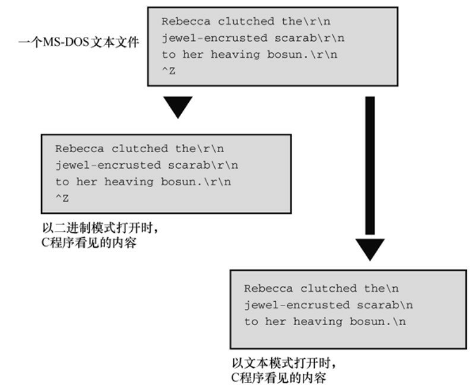
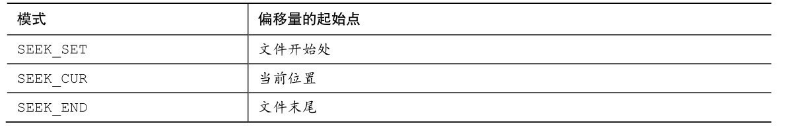
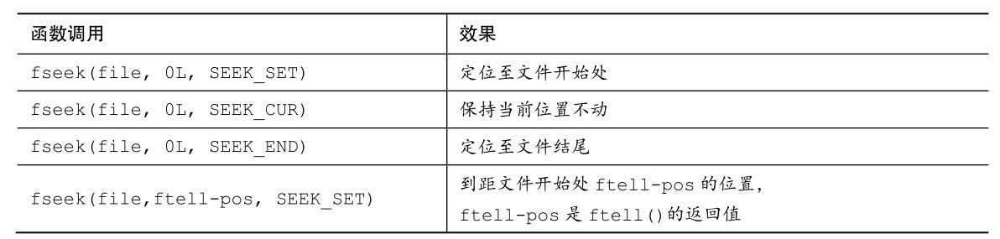
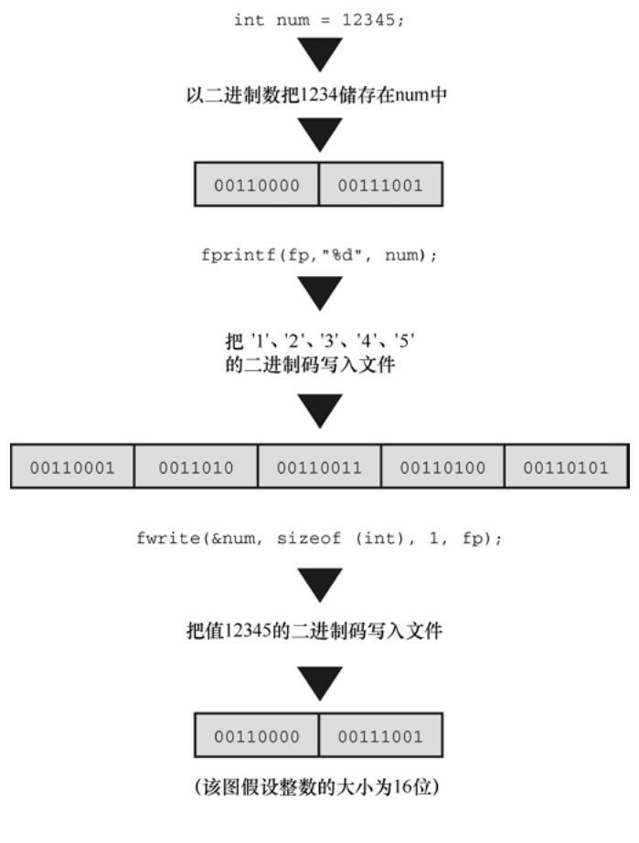
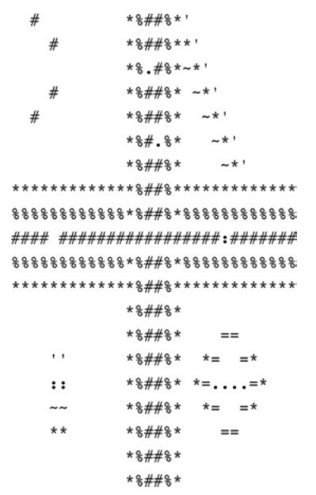

# 第13章 文件输入/输出
本章介绍以下内容：

* 函数：fopen()、getc()、putc()、exit()、fclose()
* fprintf()、fscanf()、fgets()、fputs()
* rewind()、fseek()、ftell()、fflush()
* fgetpos()、fsetpos()、feof()、ferror()
* ungetc()、setvbuf()、fread()、fwrite()
* 如何使用C标准I/O系列的函数处理文件
* 文件模式和二进制模式、文本和二进制格式、缓冲和无缓冲I/O
* 使用既可以顺序访问文件也可以随机访问文件的函数

文件是当今计算机系统不可或缺的部分。文件用于储存程序、文档、数据、书信、表格、图形、照片、视频和许多其他种类的信息。作为程序员，必须会编写创建文件和从文件读写数据的程序。本章将介绍相关的内容。

## 13.1 与文件进行通信
有时，需要程序从文件中读取信息或把信息写入文件。这种程序与文件交互的形式就是文件重定向（第8章介绍过）。这种方法很简单，但是有一定限制。例如，假设要编写一个交互程序，询问用户书名并把完整的书名列表保存在文件中。如果使用重定向，应该类似于：
```c
books > bklist
```

用户的输入被重定向到 bklist 中。这样做不仅会把不符合要求的文本写入 bklist，而且用户也看不到要回答什么问题。

C提供了更强大的文件通信方法，可以在程序中打开文件，然后使用特殊的I/O函数读取文件中的信息或把信息写入文件。在研究这些方法之前，先简要介绍一下文件的性质。

### 13.1.1 文件是什么
文件（file）通常是在磁盘或固态硬盘上的一段已命名的存储区。对我们而言，stdio.h就是一个文件的名称，该文件中包含一些有用的信息。然而，对操作系统而言，文件更复杂一些。例如，大型文件会被分开储存，或者包含一些额外的数据，方便操作系统确定文件的种类。然而，这都是操作系统所关心的，程序员关心的是C程序如何处理文件（除非你正在编写操作系统）。

C把文件看作是一系列连续的字节，每个字节都能被单独读取。这与UNIX环境中（C的发源地）的文件结构相对应。由于其他环境中可能无法完全对应这个模型，C提供两种文件模式：文本模式和二进制模式。

### 13.1.2 文本模式和二进制模式
首先，要区分文本内容和二进制内容、文本文件格式和二进制文件格式，以及文件的文本模式和二进制模式。

所有文件的内容都以二进制形式（0或1）储存。但是，如果文件最初使用二进制编码的字符（例如， ASCII或Unicode）表示文本（就像C字符串那样），该文件就是文本文件，其中包含文本内容。如果文件中的二进制值代表机器语言代码或数值数据（使用相同的内部表示，假设，用于long或double类型的值）或图片或音乐编码，该文件就是二进制文件，其中包含二进制内容。

UNIX用同一种文件格式处理文本文件和二进制文件的内容。不奇怪，鉴于C是作为开发UNIX的工具而创建的，C和UNIX在文本中都使用\n（换行符）表示换行。UNIX目录中有一个统计文件大小的计数，程序可使用该计数确定是否读到文件结尾。然而，其他系统在此之前已经有其他方法处理文件，专门用于保存文本。也就是说，其他系统已经有一种与UNIX模型不同的格式处理文本文件。例如，以前的OS X Macintosh文件用\r （回车符）表示新的一行。早期的MS-DOS文件用\r\n组合表示新的一行，用嵌入的Ctrl+Z字符表示文件结尾，即使实际文件用添加空字符的方法使其总大小是256的倍数（在Windows中，Notepad仍然生成MS-DOS格式的文本文件，但是新的编辑器可能使用类UNIX格式居多）。其他系统可能保持文本文件中的每一行长度相同，如有必要，用空字符填充每一行，使其长度保持一致。或者，系统可能在每行的开始标出每行的长度。

为了规范文本文件的处理，C 提供两种访问文件的途径：二进制模式和文本模式。在二进制模式中，程序可以访问文件的每个字节。而在文本模式中，程序所见的内容和文件的实际内容不同。程序以文本模式读取文件时，把本地环境表示的行末尾或文件结尾映射为C模式。例如，C程序在旧式Macintosh中以文本模式读取文件时，把文件中的\r转换成\n；以文本模式写入文件时，把\n转换成\r。或者，C文本模式程序在MS-DOS平台读取文件时，把\r\n转换成\n；写入文件时，把\n转换成\r\n。在其他环境中编写的文本模式程序也会做类似的转换。

除了以文本模式读写文本文件，还能以二进制模式读写文本文件。如果读写一个旧式MS-DOS文本文件，程序会看到文件中的\r 和\n 字符，不会发生映射（图 13.1 演示了一些文本）。如果要编写旧式 Mac格式、MS-DOS格式或UNIX/Linux格式的文件模式程序，应该使用二进制模式，这样程序才能确定实际的文件内容并执行相应的动作。



虽然C提供了二进制模式和文本模式，但是这两种模式的实现可以相同。前面提到过，因为UNIX使用一种文件格式，这两种模式对于UNIX实现而言完全相同。Linux也是如此。

### 13.1.3 I/O的级别
除了选择文件的模式，大多数情况下，还可以选择I/O的两个级别（即处理文件访问的两个级别）。底层I/O（low-level I/O）使用操作系统提供的基本I/O服务。标准高级I/O（standard high-level I/O）使用C库的标准包和stdio.h头文件定义。因为无法保证所有的操作系统都使用相同的底层I/O模型，C标准只支持标准I/O包。有些实现会提供底层库，但是C标准建立了可移植的I/O模型，我们主要讨论这些I/O。

### 13.1.4 标准文件
C程序会自动打开3个文件，它们被称为标准输入（standard input）、标准输出（standard output）和标准错误输出（standard error output）。在默认情况下，标准输入是系统的普通输入设备，通常为键盘；标准输出和标准错误输出是系统的普通输出设备，通常为显示屏。

通常，标准输入为程序提供输入，它是 getchar()和 scanf()使用的文件。程序通常输出到标准输出，它是putchar()、puts()和printf()使用的文件。第8章提到的重定向把其他文件视为标准输入或标准输出。标准错误输出提供了一个逻辑上不同的地方来发送错误消息。例如，如果使用重定向把输出发送给文件而不是屏幕，那么发送至标准错误输出的内容仍然会被发送到屏幕上。这样很好，因为如果把错误消息发送至文件，就只能打开文件才能看到。

## 13.2 标准I/O
与底层I/O相比，标准I/O包除了可移植以外还有两个好处。第一，标准I/O有许多专门的函数简化了处理不同I/O的问题。例如，printf()把不同形式的数据转换成与终端相适应的字符串输出。第二，输入和输出都是缓冲的。也就是说，一次转移一大块信息而不是一字节信息（通常至少512字节）。例如，当程序读取文件时，一块数据被拷贝到缓冲区（一块中介存储区域）。这种缓冲极大地提高了数据传输速率。程序可以检查缓冲区中的字节。缓冲在后台处理，所以让人有逐字符访问的错觉（如果使用底层I/O，要自己完成大部分工作）。程序清单13.1演示了如何用标准I/O读取文件和统计文件中的字符数。我们将在后面几节讨论程序清单 13.1 中的一些特性。该程序使用命令行参数，如果你是Windows用户，在编译后必须在命令提示窗口运行该程序；如果你是Macintosh用户，最简单的方法是使用Terminal在命令行形式中编译并运行该程序。或者，如第11章所述，如果在IDE中运行该程序，可以使用Xcode的Product菜单提供命令行参数。或者也可以用puts()和fgets()函数替换命令行参数来获得文件名。

程序清单13.1 count.c程序
```c
/* count.c -- 使用标准 I/O */
#include <stdio.h>
#include <stdlib.h>  // 提供 exit()的原型
int main(int argc, char *argv [])
{
    int ch;      // 读取文件时，储存每个字符的地方
    FILE *fp;   // “文件指针”
    unsigned long count = 0;
    if (argc != 2)
    {
        printf("Usage: %s filename\n", argv[0]);
        exit(EXIT_FAILURE);
    }
    if ((fp = fopen(argv[1], "r")) == NULL)
    {
        printf("Can't open %s\n", argv[1]);
        exit(EXIT_FAILURE);
    }
    while ((ch = getc(fp)) != EOF)
    {
        putc(ch, stdout); // 与 putchar(ch); 相同
        count++;
    }
    fclose(fp);
    printf("File %s has %lu characters\n", argv[1], count);
    return 0;
}
```

### 13.2.1 检查命令行参数
首先，程序清单13.1中的程序检查argc的值，查看是否有命令行参数。如果没有，程序将打印一条消息并退出程序。字符串 argv[0]是该程序的名称。显式使用 argv[0]而不是程序名，错误消息的描述会随可执行文件名的改变而自动改变。这一特性在像 UNIX 这种允许单个文件具有多个文件名的环境中也很方便。但是，一些操作系统可能不识别argv[0]，所以这种用法并非完全可移植。

exit()函数关闭所有打开的文件并结束程序。exit()的参数被传递给一些操作系统，包括 UNIX、Linux、Windows和MS-DOS，以供其他程序使用。通常的惯例是：正常结束的程序传递0，异常结束的程序传递非零值。不同的退出值可用于区分程序失败的不同原因，这也是UNIX和DOS编程的通常做法。但是，并不是所有的操作系统都能识别相同范围内的返回值。因此，C 标准规定了一个最小的限制范围。尤其是，标准要求0或宏EXIT_SUCCESS用于表明成功结束程序，宏EXIT_FAILURE用于表明结束程序失败。这些宏和exit()原型都位于stdlib.h头文件中。

根据ANSI C的规定，在最初调用的main()中使用return与调用exit()的效果相同。因此，在main()，下面的语句：
```c
return 0;
```

和下面这条语句的作用相同：
```c
exit(0);
```

但是要注意，我们说的是“最初的调用”。如果main()在一个递归程序中，exit()仍然会终止程序，但是return只会把控制权交给上一级递归，直至最初的一级。然后return结束程序。return和exit()的另一个区别是，即使在其他函数中（除main()以外）调用exit()也能结束整个程序。

### 13.2.2 fopen()函数
继续分析程序清单13.1，该程序使用fopen()函数打开文件。该函数声明在stdio.h中。它的第1个参数是待打开文件的名称，更确切地说是一个包含改文件名的字符串地址。第 2 个参数是一个字符串，指定待打开文件的模式。表13.1列出了C库提供的一些模式。

的模式字符串.png)

像UNIX和Linux这样只有一种文件类型的系统，带b字母的模式和不带b字母的模式相同。

新的C11新增了带x字母的写模式，与以前的写模式相比具有更多特性。第一，如果以传统的一种写模式打开一个现有文件，fopen()会把该文件的长度截为 0，这样就丢失了该文件的内容。但是使用带 x字母的写模式，即使fopen()操作失败，原文件的内容也不会被删除。第二，如果环境允许，x模式的独占特性使得其他程序或线程无法访问正在被打开的文件。

警告

如果使用任何一种"w"模式（不带x字母）打开一个现有文件，该文件的内容会被删除，以便程序在一个空白文件中开始操作。然而，如果使用带x字母的任何一种模式，将无法打开一个现有文件。

程序成功打开文件后，fopen()将返回文件指针（file pointer），其他I/O函数可以使用这个指针指定该文件。文件指针（该例中是fp）的类型是指向FILE的指针，FILE是一个定义在stdio.h中的派生类型。文件指针fp并不指向实际的文件，它指向一个包含文件信息的数据对象，其中包含操作文件的I/O函数所用的缓冲区信息。因为标准库中的I/O函数使用缓冲区，所以它们不仅要知道缓冲区的位置，还要知道缓冲区被填充的程度以及操作哪一个文件。标准I/O函数根据这些信息在必要时决定再次填充或清空缓冲区。fp指向的数据对象包含了这些信息（该数据对象是一个 C结构，将在第 14章中介绍）。

### 13.2.3 getc()和putc()函数
getc()和putc()函数与getchar()和putchar()函数类似。所不同的是，要告诉getc()和putc()函数使用哪一个文件。下面这条语句的意思是“从标准输入中获取一个字符”：
```c
ch = getchar();
```

然而，下面这条语句的意思是“从fp指定的文件中获取一个字符”：
```c
ch = getc(fp);
```

与此类似，下面语句的意思是“把字符ch放入FILE指针fpout指定的文件中”：
```c
putc(ch, fpout);
```

在putc()函数的参数列表中，第1个参数是待写入的字符，第2个参数是文件指针。

程序清单13.1把stdout作为putc()的第2个参数。stdout作为与标准输出相关联的文件指针，定义在stdio.h中，所以putc(ch, stdout)与putchar(ch)的作用相同。实际上，putchar()函数一般通过putc()来定义。与此类似，getchar()也通过使用标准输入的getc()来定义。

为何该示例不用 putchar()而要用 putc()？原因之一是为了介绍 putc()函数；原因之二是，把stdout替换成别的参数，很容易将这段程序改写成文件输出。

### 13.2.4 文件结尾
从文件中读取数据的程序在读到文件结尾时要停止。如何告诉程序已经读到文件结尾？如果 getc()函数在读取一个字符时发现是文件结尾，它将返回一个特殊值EOF。所以C程序只有在读到超过文件末尾时才会发现文件的结尾（一些其他语言用一个特殊的函数在读取之前测试文件结尾，C语言不同）。

为了避免读到空文件，应该使用入口条件循环（不是do while循环）进行文件输入。鉴于getc() （和其他C输入函数）的设计，程序应该在进入循环体之前先尝试读取。如下面设计所示：
```c
// 设计范例 #1
int ch;      // 用int类型的变量储存EOF
FILE * fp;
fp = fopen("wacky.txt", "r");
ch = getc(fp);     // 获取初始输入
while (ch != EOF)
{
    putchar(ch); // 处理输入
    ch = getc(fp);  // 获取下一个输入
}
```

以上代码可简化为：
```c
// 设计范例 #2
int ch;
FILE * fp;
fp = fopen("wacky.txt", "r");
while (( ch = getc(fp)) != EOF)
{
    putchar(ch); //处理输入
}
```

由于ch = getc(fp)是while测试条件的一部分，所以程序在进入循环体之前就读取了文件。不要设计成下面这样：
```c
// 糟糕的设计（存在两个问题）
int ch;
FILE * fp;
fp = fopen("wacky.txt", "r");
while (ch != EOF) // 首次使用ch时，它的值尚未确定
{
    ch = getc(fp);  // 获取输入
    putchar(ch);    // 处理输入
}
```

第1个问题是，ch首次与EOF比较时，其值尚未确定。第2个问题是，如果getc()返回EOF，该循环会把EOF作为一个有效字符处理。这些问题都可以解决。例如，把ch初始化为一个哑值（dummy value），再把一个if语句加入到循环中。但是，何必多此一举，直接使用上面的设计范例即可。

其他输入函数也会用到这种处理方案，它们在读到文件结尾时也会返回一个错误信号（EOF 或 NULL指针）。

### 13.2.5 fclose()函数
fclose(fp)函数关闭fp指定的文件，必要时刷新缓冲区。对于较正式的程序，应该检查是否成功关闭文件。如果成功关闭，fclose()函数返回0，否则返回EOF：
```c
if (fclose(fp) != 0)
    printf("Error in closing file %s\n", argv[1]);
```

如果磁盘已满、移动硬盘被移除或出现I/O错误，都会导致调用fclose()函数失败。

### 13.2.6 指向标准文件的指针
stdio.h头文件把3个文件指针与3个标准文件相关联，C程序会自动打开这3个标准文件。如表13.2所示：


这些文件指针都是指向FILE的指针，所以它们可用作标准I/O函数的参数，如fclose(fp)中的fp。接下来，我们用一个程序示例创建一个新文件，并写入内容。

## 13.3 一个简单的文件压缩程序
下面的程序示例把一个文件中选定的数据拷贝到另一个文件中。该程序同时打开了两个文件，以"r"模式打开一个，以"w"模式打开另一个。该程序（程序清单13.2）以保留每3个字符中的第1个字符的方式压缩第1个文件的内容。最后，把压缩后的文本存入第2个文件。第2个文件的名称是第1个文件名加上.red后缀（此处的red代表reduced）。使用命令行参数，同时打开多个文件，以及在原文件名后面加上后缀，都是相当有用的技巧。这种压缩方式有限，但是也有它的用途（很容易把该程序改成用标准 I/O 而不是命令行参数提供文件名）。

程序清单13.2 reducto.c程序
```c
// reducto.c –把文件压缩成原来的1/3！
#include <stdio.h>
#include <stdlib.h>  // 提供 exit()的原型
#include <string.h>  // 提供 strcpy()、strcat()的原型
#define LEN 40

int main(int argc, char *argv [])
{
    FILE *in, *out;  // 声明两个指向 FILE 的指针
    int ch;
    char name[LEN];  // 储存输出文件名
    int count = 0;
    // 检查命令行参数
    if (argc < 2)
    {
        fprintf(stderr, "Usage: %s filename\n", argv[0]);
        exit(EXIT_FAILURE);
    }
    // 设置输入
    if ((in = fopen(argv[1], "r")) == NULL)
    {
        fprintf(stderr, "I couldn't open the file \"%s\"\n",
        argv[1]);
        exit(EXIT_FAILURE);
    }
    // 设置输出
    strncpy(name, argv[1], LEN - 5);  // 拷贝文件名
    name[LEN - 5] = '\0';
    strcat(name, ".red");        // 在文件名后添加.red
    if ((out = fopen(name, "w")) == NULL)
    {          // 以写模式打开文件
        fprintf(stderr, "Can't create output file.\n");
        exit(3);
    }
    // 拷贝数据
    while ((ch = getc(in)) != EOF)
        if (count++ % 3 == 0)
            putc(ch, out);// 打印3个字符中的第1个字符
    // 收尾工作
    if (fclose(in) != 0 || fclose(out) != 0)
        fprintf(stderr, "Error in closing files\n");
    return 0;
}
```

假设可执行文件名是reducto，待读取的文件名为eddy，该文件中包含下面一行内容：
```c
So even Eddy came oven ready.
```

命令如下：
```c
reducto eddy
```

待写入的文件名为eddy.red。该程序把输出显示在eddy.red中，而不是屏幕上。打开eddy.red，内容如下：
```c
Send money
```

该程序示例演示了几个编程技巧。我们来仔细研究一下。

fprintf()和 printf()类似，但是 fprintf()的第 1 个参数必须是一个文件指针。程序中使用stderr指针把错误消息发送至标准错误，C标准通常都这么做。

为了构造新的输出文件名，该程序使用strncpy()把名称eddy拷贝到数组name中。参数LEN-5为.red后缀和末尾的空字符预留了空间。如果argv[2]字符串比LEN-5长，就拷贝不了空字符。出现这种情况时，程序会添加空字符。调用strncpy()后，name中的第1个空字符在调用strcat()函数时，被.red的.覆盖，生成了eddy.red。程序中还检查了是否成功打开名为eddy.red的文件。这个步骤在一些环境中相当重要，因为像strange.c.red这样的文件名可能是无效的。例如，在传统的DOS环境中，不能在后缀名后面添加后缀名（MSDOS使用的方法是用.red替换现有后缀名，所以strange.c将变成strange.red。例如，可以用strchr()函数定位（如果有的话），然后只拷贝点前面的部分即可）。

该程序同时打开了两个文件，所以我们要声明两个 FIFL 指针。注意，程序都是单独打开和关闭每个文件。同时打开的文件数量是有限的，这个限制取决于系统和实现，范围一般是10～20。相同的文件指针可以处理不同的文件，前提是这些文件不需要同时打开。

## 13.4 文件I/O：fprintf()、fscanf()、fgets()和fputs()
前面章节介绍的I/O函数都类似于文件I/O函数。它们的主要区别是，文件I/O函数要用FILE指针指定待处理的文件。与 getc()、putc()类似，这些函数都要求用指向 FILE 的指针（如，stdout）指定一个文件，或者使用fopen()的返回值。

### 13.4.1 fprintf()和fscanf()函数
文件I/O函数fprintf()和fscanf()函数的工作方式与printf()和scanf()类似，区别在于前者需要用第1个参数指定待处理的文件。我们在前面用过fprintf()。程序清单13.3演示了这两个文件I/O函数和rewind()函数的用法。

程序清单13.3 addaword.c程序
```c
/* addaword.c -- 使用 fprintf()、fscanf() 和 rewind() */
#include <stdio.h>
#include <stdlib.h>
#include <string.h>
#define MAX 41
int main(void)
{
    FILE *fp;
    char words[MAX];
    if ((fp = fopen("wordy", "a+")) == NULL)
    {
        fprintf(stdout, "Can't open \"wordy\" file.\n");
        exit(EXIT_FAILURE);
    }
    puts("Enter words to add to the file; press the #");
    puts("key at the beginning of a line to terminate.");
    while ((fscanf(stdin, "%40s", words) == 1) && (words[0] != '#'))
        fprintf(fp, "%s\n", words);
    puts("File contents:");
    rewind(fp);    /* 返回到文件开始处 */
    while (fscanf(fp, "%s", words) == 1)
        puts(words);
    puts("Done!");
    if (fclose(fp) != 0)
        fprintf(stderr, "Error closing file\n");
    return 0;
}
```

该程序可以在文件中添加单词。使用"a+"模式，程序可以对文件进行读写操作。首次使用该程序，它将创建wordy文件，以便把单词存入其中。随后再使用该程序，可以在wordy文件后面添加单词。虽然"a+"模式只允许在文件末尾添加内容，但是该模式下可以读整个文件。rewind()函数让程序回到文件开始处，方便while循环打印整个文件的内容。注意，rewind()接受一个文件指针作为参数。

下面是该程序在UNIX环境中的一个运行示例（可执行程序已重命名为addword）：
```c
$ addaword
Enter words to add to the file; press the Enter
key at the beginning of a line to terminate.
The fabulous programmer
#
File contents:
The
fabulous
programmer
Done!
$ addaword
Enter words to add to the file; press the Enter
key at the beginning of a line to terminate.
enchanted the
large
#
File contents:
The
fabulous
programmer
enchanted
the
large
Done!
```

如你所见，fprintf()和 fscanf()的工作方式与 printf()和 scanf()类似。但是，与 putc()不同的是，fprintf()和fscanf()函数都把FILE指针作为第1个参数，而不是最后一个参数。

### 13.4.2 fgets()和fputs()函数
第11章时介绍过fgets()函数。它的第1个参数和gets()函数一样，也是表示储存输入位置的地址（char * 类型）；第2个参数是一个整数，表示待输入[字符串的大小](#字符串的大小)；最后一个参数是文件指针，指定待读取的文件。下面是一个调用该函数的例子：
```c
fgets(buf, STLEN, fp);
```

这里，buf是char类型数组的名称，STLEN是字符串的大小，fp是指向FILE的指针。

fgets()函数读取输入直到第 1 个换行符的后面，或读到文件结尾，或者读取STLEN-1 个字符（以上面的 fgets()为例）。然后，fgets()在末尾添加一个空字符使之成为一个字符串。字符串的大小是其字符数加上一个空字符。如果fgets()在读到字符上限之前已读完一整行，它会把表示行结尾的换行符放在空字符前面。fgets()函数在遇到EOF时将返回NULL值，可以利用这一机制检查是否到达文件结尾；如果未遇到EOF则之前返回传给它的地址。

fputs()函数接受两个参数：第1个是字符串的地址；第2个是文件指针。该函数根据传入地址找到的字符串写入指定的文件中。和 puts()函数不同，fputs()在打印字符串时不会在其末尾添加换行符。下面是一个调用该函数的例子：
```c
fputs(buf, fp);
```

这里，buf是字符串的地址，fp用于指定目标文件。

由于fgets()保留了换行符，fputs()就不会再添加换行符，它们配合得非常好。如第11章的程序清单11.8所示，即使输入行比STLEN长，这两个函数依然处理得很好。

## 13.5 随机访问：fseek()和ftell()
有了 fseek()函数，便可把文件看作是数组，在 fopen()打开的文件中直接移动到任意字节处。我们创建一个程序（程序清单13.4）演示fseek()和ftell()的用法。注意，fseek()有3个参数，返回int类型的值；ftell()函数返回一个long类型的值，表示文件中的当前位置。

程序清单13.4 reverse.c程序
```c
/* reverse.c -- 倒序显示文件的内容 */
#include <stdio.h>
#include <stdlib.h>
#define CNTL_Z '\032'   /* DOS文本文件中的文件结尾标记 */
#define SLEN 81
int main(void)
{
    char file[SLEN];
    char ch;
    FILE *fp;
    long count, last;
    puts("Enter the name of the file to be processed:");
    scanf("%80s", file);
    if ((fp = fopen(file, "rb")) == NULL)
    {                  /* 只读模式  */
        printf("reverse can't open %s\n", file);
        exit(EXIT_FAILURE);
    }
    fseek(fp, 0L, SEEK_END);       /* 定位到文件末尾 */
    last = ftell(fp);
    for (count = 1L; count <= last; count++)
    {
        fseek(fp, -count, SEEK_END);    /* 回退   */
        ch = getc(fp);
        if (ch != CNTL_Z && ch != '\r') /* MS-DOS 文件 */
            putchar(ch);
    }
    putchar('\n');
    fclose(fp);
    return 0;
}
```

下面是对一个文件的输出：
```c
Enter the name of the file to be processed:
Cluv
.C ni eno naht ylevol erom margorp a
ees reven llahs I taht kniht I
```

该程序使用二进制模式，以便处理MS-DOS文本和UNIX文件。但是，在使用其他格式文本文件的环境中可能无法正常工作。

注意

如果通过命令行环境运行该程序，待处理文件要和可执行文件在同一个目录（或文件夹）中。如果在IDE中运行该程序，具体查找方案序因实现而异。例如，默认情况下，Microsoft Visual Studio 2012在源代码所在的目录中查找，而Xcode 4.6则在可执行文件所在的目录中查找。

接下来，我们要讨论3个问题：fseek()和ftell()函数的工作原理、如何使用二进制流、如何让程序可移植。

### 13.5.1 fseek()和ftell()的工作原理
fseek()的第1个参数是FILE指针，指向待查找的文件，fopen()应该已打开该文件。

fseek()的第2个参数是偏移量（offset）。该参数表示从起始点开始要移动的距离（参见表13.3列出的起始点模式）。该参数必须是一个long类型的值，可以为正（前移）、负（后移）或0（保持不动）。

fseek()的第3个参数是模式，该参数确定起始点。根据ANSI标准，在stdio.h头文件中规定了几个表示模式的明示常量（manifest constant），如表13.3所示。



旧的实现可能缺少这些定义，可以使用数值0L、1L、2L分别表示这3种模式。L后缀表明其值是long类型。或者，实现可能把这些明示常量定义在别的头文件中。如果不确定，请查阅实现的使用手册或在线帮助。

下面是调用fseek()函数的一些示例，fp是一个文件指针：
```c
fseek(fp, 0L, SEEK_SET); // 定位至文件开始处
fseek(fp, 10L, SEEK_SET); // 定位至文件中的第10个字节
fseek(fp, 2L, SEEK_CUR); // 从文件当前位置前移2个字节
fseek(fp, 0L, SEEK_END); // 定位至文件结尾
fseek(fp, -10L, SEEK_END); // 从文件结尾处回退10个字节
```

对于这些调用还有一些限制，我们稍后再讨论。

如果一切正常，fseek()的返回值为0；如果出现错误（如试图移动的距离超出文件的范围），其返回值为-1。

ftell()函数的返回类型是long，它返回的是当前的位置。ANSI C把它定义在stdio.h中。在最初实现的UNIX中，ftell()通过返回距文件开始处的字节数来确定文件的位置。文件的第1个字节到文件开始处的距离是0，以此类推。ANSI C规定，该定义适用于以二进制模式打开的文件，以文件模式打开文件的情况不同。这也是程序清单13.4以二进制模式打开文件的原因。

下面，我们来分析程序清单13.4中的基本要素。首先，下面的语句：
```c
fseek(fp, 0L, SEEK_END);
```

把当前位置设置为距文件末尾 0 字节偏移量。也就是说，该语句把当前位置设置在文件结尾。下一条语句：
```c
last = ftell(fp);
```

把从文件开始处到文件结尾的字节数赋给last。

然后是一个for循环：
```c
for (count = 1L; count <= last; count++)
{
    fseek(fp, -count, SEEK_END); /* go backward */
    ch = getc(fp);
}
```

第1轮迭代，把程序定位到文件结尾的第1个字符（即，文件的最后一个字符）。然后，程序打印该字符。下一轮迭代把程序定位到前一个字符，并打印该字符。重复这一过程直至到达文件的第1个字符，并打印。

### 13.5.2 二进制模式和文本模式
我们设计的程序清单13.4在UNIX和MS-DOS环境下都可以运行。UNIX只有一种文件格式，所以不需要进行特殊的转换。然而MS-DOS要格外注意。许多MS-DOS编辑器都用Ctrl+Z标记文本文件的结尾。以文本模式打开这样的文件时，C 能识别这个作为文件结尾标记的字符。但是，以二进制模式打开相同的文件时，Ctrl+Z字符被看作是文件中的一个字符，而实际的文件结尾符在该字符的后面。文件结尾符可能紧跟在Ctrl+Z字符后面，或者文件中可能用空字符填充，使该文件的大小是256的倍数。在DOS环境下不会打印空字符，程序清单13.4中就包含了防止打印Ctrl+Z字符的代码。

二进制模式和文本模式的另一个不同之处是：MS-DOS用\r\n组合表示文本文件换行。以文本模式打开相同的文件时，C程序把\r\n“看成”\n。但是，以二进制模式打开该文件时，程序能看见这两个字符。因此，程序清单13.4中还包含了不打印\r的代码。通常，UNIX文本文件既没有Ctrl+Z，也没有\r，所以这部分代码不会影响大部分UNIX文本文件。

ftell()函数在文本模式和二进制模式中的工作方式不同。许多系统的文本文件格式与UNIX的模型有很大不同，导致从文件开始处统计的字节数成为一个毫无意义的值。ANSI C规定，对于文本模式，ftell()返回的值可以作为fseek()的第2个参数。对于MS-DOS，ftell()返回的值把\r\n当作一个字节计数。

### 13.5.3 可移植性
理论上，fseek()和ftell()应该符合UNIX模型。但是，不同系统存在着差异，有时确实无法做到与UNIX模型一致。因此，ANSI对这些函数降低了要求。下面是一些限制。

在二进制模式中，实现不必支持SEEK_END模式。因此无法保证程序清单13.4的可移植性。移植性更高的方法是逐字节读取整个文件直到文件末尾。C 预处理器的条件编译指令（第 16 章介绍）提供了一种系统方法来处理这种情况。

在文本模式中，只有以下调用能保证其相应的行为。



不过，许多常见的环境都支持更多的行为。

### 13.5.4 fgetpos()和fsetpos()函数
fseek()和 ftell()潜在的问题是，它们都把文件大小限制在 long 类型能表示的范围内。也许 20亿字节看起来相当大，但是随着存储设备的容量迅猛增长，文件也越来越大。鉴于此，ANSI C新增了两个处理较大文件的新定位函数：fgetpos()和 fsetpos()。这两个函数不使用 long 类型的值表示位置，它们使用一种新类型：fpos_t（代表file position type，文件定位类型）。fpos_t类型不是基本类型，它根据其他类型来定义。fpos_t 类型的变量或数据对象可以在文件中指定一个位置，它不能是数组类型，除此之外，没有其他限制。实现可以提供一个满足特殊平台要求的类型，例如，fpos_t可以实现为结构。

ANSI C定义了如何使用fpos_t类型。fgetpos()函数的原型如下：
```c
int fgetpos(FILE * restrict stream, fpos_t * restrict pos);
```

调用该函数时，它把fpos_t类型的值放在pos指向的位置上，该值描述了文件中的一个位置。如果成功，fgetpos()函数返回0；如果失败，返回非0。

fsetpos()函数的原型如下：
```c
int fsetpos(FILE *stream, const fpos_t *pos);
```

调用该函数时，使用pos指向位置上的fpos_t类型值来设置文件指针指向该值指定的位置。如果成功，fsetpos()函数返回0；如果失败，则返回非0。fpos_t类型的值应通过之前调用fgetpos()获得。

## 13.6 标准I/O的机理
我们在前面学习了标准I/O包的特性，本节研究一个典型的概念模型，分析标准I/O的工作原理。

通常，使用标准I/O的第1步是调用fopen()打开文件（前面介绍过，C程序会自动打开3种标准文件）。fopen()函数不仅打开一个文件，还创建了一个缓冲区（在读写模式下会创建两个缓冲区）以及一个包含文件和缓冲区数据的结构。另外，fopen()返回一个指向该结构的指针，以便其他函数知道如何找到该结构。假设把该指针赋给一个指针变量fp，我们说fopen()函数“打开一个流”。如果以文本模式打开该文件，就获得一个文本流；如果以二进制模式打开该文件，就获得一个二进制流。

这个结构通常包含一个指定流中当前位置的文件位置指示器。除此之外，它还包含错误和文件结尾的指示器、一个指向缓冲区开始处的指针、一个文件标识符和一个计数（统计实际拷贝进缓冲区的字节数）。

我们主要考虑文件输入。通常，使用标准I/O的第2步是调用一个定义在stdio.h中的输入函数，如fscanf()、getc()或 fgets()。一调用这些函数，文件中的数据块就被拷贝到缓冲区中。缓冲区的大小因实现而异，一般是512字节或是它的倍数，如4096或16384（随着计算机硬盘容量越来越大，缓冲区的大小也越来越大）。最初调用函数，除了填充缓冲区外，还要设置fp所指向的结构中的值。尤其要设置流中的当前位置和拷贝进缓冲区的字节数。通常，当前位置从字节0开始。

在初始化结构和缓冲区后，输入函数按要求从缓冲区中读取数据。在它读取数据时，文件位置指示器被设置为指向刚读取字符的下一个字符。由于stdio.h系列的所有输入函数都使用相同的缓冲区，所以调用任何一个函数都将从上一次函数停止调用的位置开始。

当输入函数发现已读完缓冲区中的所有字符时，会请求把下一个缓冲大小的数据块从文件拷贝到该缓冲区中。以这种方式，输入函数可以读取文件中的所有内容，直到文件结尾。函数在读取缓冲区中的最后一个字符后，把结尾指示器设置为真。于是，下一次被调用的输入函数将返回EOF。

输出函数以类似的方式把数据写入缓冲区。当缓冲区被填满时，数据将被拷贝至文件中。

## 13.7 其他标准I/O函数
ANSI标准库的标准I/O系列有几十个函数。虽然在这里无法一一列举，但是我们会简要地介绍一些，让读者对它们有一个大概的了解。这里列出函数的原型，表明函数的参数和返回类型。我们要讨论的这些函数，除了setvbuf()，其他函数均可在ANSI之前的实现中使用。参考资料V的“新增C99和C11的标准ANSI C库”中列出了全部的ANSI C标准I/O包。

### 13.7.1 int ungetc(int c, FILE *fp)函数
int ungetc()函数把c指定的字符放回输入流中。如果把一个字符放回输入流，下次调用标准输入函数时将读取该字符（见图13.2）。例如，假设要读取下一个冒号之前的所有字符，但是不包括冒号本身，可以使用 getchar()或getc()函数读取字符到冒号，然后使用 ungetc()函数把冒号放回输入流中。ANSI C标准保证每次只会放回一个字符。如果实现允许把一行中的多个字符放回输入流，那么下一次输入函数读入的字符顺序与放回时的顺序相反。

函数.png)

### 13.7.2 int fflush()函数
fflush()函数的原型如下：
```c
int fflush(FILE *fp);
```

调用fflush()函数引起输出缓冲区中所有的未写入数据被发送到fp指定的输出文件。这个过程称为刷新缓冲区。如果 fp是空指针，所有输出缓冲区都被刷新。在输入流中使用fflush()函数的效果是未定义的。只要最近一次操作不是输入操作，就可以用该函数来更新流（任何读写模式）。

### 13.7.3 int setvbuf()函数
setvbuf()函数的原型是：
```c
int setvbuf(FILE * restrict fp, char * restrict buf, int mode, size_t size);
```

setvbuf()函数创建了一个供标准I/O函数替换使用的缓冲区。在打开文件后且未对流进行其他操作之前，调用该函数。指针fp识别待处理的流，buf指向待使用的存储区。如果buf的值不是NULL，则必须创建一个缓冲区。例如，声明一个内含1024个字符的数组，并传递该数组的地址。然而，如果把NULL作为buf的值，该函数会为自己分配一个缓冲区。变量size告诉setvbuf()数组的大小（size_t是一种派生的整数类型，第5章介绍过）。mode的选择如下：_IOFBF表示完全缓冲（在缓冲区满时刷新）；_IOLBF表示行缓冲（在缓冲区满时或写入一个换行符时）；_IONBF表示无缓冲。如果操作成功，函数返回0，否则返回一个非零值。

假设一个程序要储存一种数据对象，每个数据对象的大小是3000字节。可以使用setvbuf()函数创建一个缓冲区，其大小是该数据对象大小的倍数。

### 13.7.4 二进制I/O：fread()和fwrite()
介绍fread()和fwrite()函数之前，先要了解一些背景知识。之前用到的标准I/O函数都是面向文本的，用于处理字符和字符串。如何要在文件中保存数值数据？用 fprintf()函数和%f转换说明只是把数值保存为字符串。例如，下面的代码：
```c
double num = 1./3.;
fprintf(fp,"%f", num);
```

把num储存为8个字符：0.333333。使用%.2f转换说明将其储存为4个字符：0.33，用%.12f转换说明则将其储存为 14 个字符：0.333333333333。改变转换说明将改变储存该值所需的空间数量，也会导致储存不同的值。把num 储存为 0.33 后，读取文件时就无法将其恢复为更高的精度。一般而言， fprintf()把数值转换为字符数据，这种转换可能会改变值。

为保证数值在储存前后一致，最精确的做法是使用与计算机相同的位组合来储存。因此，double 类型的值应该储存在一个 double 大小的单元中。如果以程序所用的表示法把数据储存在文件中，则称以二进制形式储存数据。不存在从数值形式到字符串的转换过程。对于标准 I/O，fread()和 fwrite函数用于以二进制形式处理数据（见图13.3）。

实际上，所有的数据都是以二进制形式储存的，甚至连字符都以字符码的二进制表示来储存。如果文件中的所有数据都被解释成字符码，则称该文件包含文本数据。如果部分或所有的数据都被解释成二进制形式的数值数据，则称该文件包含二进制数据（另外，用数据表示机器语言指令的文件都是二进制文件）。



二进制和文本的用法很容易混淆。ANSI C和许多操作系统都识别两种文件格式：二进制和文本。能以二进制数据或文本数据形式存储或读取信息。可以用二进制模式打开文本格式的文件，可以把文本储存在二进制形式的文件中。可以调用 getc()拷贝包含二进制数据的文件。然而，一般而言，用二进制模式在二进制格式文件中储存二进制数据。类似地，最常用的还是以文本格式打开文本文件中的文本数据（通常文字处理器生成的文件都是二进制文件，因为这些文件中包含了大量非文本信息，如字体和格式等）。

### 13.7.5 size_t fwrite()函数
fwrite()函数的原型如下：
```c
size_t fwrite(const void * restrict ptr, size_t size, size_t nmemb,FILE * restrict fp);
```

fwrite()函数把二进制数据写入文件。size_t是根据标准C类型定义的类型，它是sizeof运算符返回的类型，通常是unsigned int，但是实现可以选择使用其他类型。指针ptr是待写入数据块的地址。size表示待写入数据块的大小（以字节为单位），nmemb表示待写入数据块的数量。和其他函数一样，fp指定待写入的文件。例如，要保存一个大小为256字节的数据对象（如数组），可以这样做：
```c
char buffer[256];
fwrite(buffer, 256, 1, fp);
```

以上调用把一块256字节的数据从buffer写入文件。另举一例，要保存一个内含10个double类型值的数组，可以这样做：
```c
double earnings[10];
fwrite(earnings, sizeof(double), 10, fp);
```

以上调用把earnings数组中的数据写入文件，数据被分成10块，每块都是double的大小。

注意fwrite()原型中的const void * restrict ptr声明。fwrite()的一个问题是，它的第1个参数不是固定的类型。例如，第1个例子中使用buffer，其类型是指向char的指针；而第2个例子中使用earnings，其类型是指向double的指针。在ANSI C函数原型中，这些实际参数都被转换成指向void的指针类型，这种指针可作为一种通用类型指针（在ANSI C之前，这些参数使用char *类型，需要把实参强制转换成char *类型）。

fwrite()函数返回成功写入项的数量。正常情况下，该返回值就是nmemb，但如果出现写入错误，返回值会比nmemb小。

### 13.7.6 size_t fread()函数
size_t fread()函数的原型如下：
```c
size_t fread(void * restrict ptr, size_t size, size_t nmemb,FILE * restrict fp);
```

fread()函数接受的参数和fwrite()函数相同。在fread()函数中，ptr是待读取文件数据在内存中的地址，fp指定待读取的文件。该函数用于读取被fwrite()写入文件的数据。例如，要恢复上例中保存的内含10个double类型值的数组，可以这样做：
```c
double earnings[10];
fread(earnings, sizeof (double), 10, fp);
```

该调用把10个double大小的值拷贝进earnings数组中。

fread()函数返回成功读取项的数量。正常情况下，该返回值就是nmemb，但如果出现读取错误或读到文件结尾，该返回值就会比nmemb小。

### 13.7.7 int feof(FILE *fp)和int ferror(FILE *fp)函数
如果标准输入函数返回 EOF，则通常表明函数已到达文件结尾。然而，出现读取错误时，函数也会返回EOF。feof()和ferror()函数用于区分这两种情况。当上一次输入调用检测到文件结尾时，feof()函数返回一个非零值，否则返回0。当读或写出现错误，ferror()函数返回一个非零值，否则返回0。

### 13.7.8 一个程序示例
接下来，我们用一个程序示例说明这些函数的用法。该程序把一系列文件中的内容附加在另一个文件的末尾。该程序存在一个问题：如何给文件传递信息。可以通过交互或使用命令行参数来完成，我们先采用交互式的方法。下面列出了程序的设计方案。
```c
询问目标文件的名称并打开它。
使用一个循环询问源文件。
以读模式依次打开每个源文件，并将其添加到目标文件的末尾。
```

为演示setvbuf()函数的用法，该程序将使用它指定一个不同的缓冲区大小。下一步是细化程序打开目标文件的步骤：
```c
1.以附加模式打开目标文件；
2.如果打开失败，则退出程序；
3.为该文件创建一个4096字节的缓冲区；
4.如果创建失败，则退出程序。
```

与此类似，通过以下具体步骤细化拷贝部分：
```c
1.如果该文件与目标文件相同，则跳至下一个文件；
2.如果以读模式无法打开文件，则跳至下一个文件；
3.把文件内容添加至目标文件末尾。
```

最后，程序回到目标文件的开始处，显示当前整个文件的内容。

作为练习，我们使用fread()和fwrite()函数进行拷贝。程序清单13.5给出了这个程序。

程序清单13.5 append.c程序
```c
/* append.c -- 把文件附加到另一个文件末尾 */
#include <stdio.h>
#include <stdlib.h>
#include <string.h>
#define BUFSIZE 4096
#define SLEN 81
void append(FILE *source, FILE *dest);
char * s_gets(char * st, int n);
int main(void)
{
    FILE *fa, *fs;  // fa 指向目标文件，fs 指向源文件
    int files = 0;     // 附加的文件数量
    char file_app[SLEN];  // 目标文件名
    char file_src[SLEN];  // 源文件名
    int ch;
    puts("Enter name of destination file:");
    s_gets(file_app, SLEN);
    if ((fa = fopen(file_app, "a+")) == NULL)
    {
        fprintf(stderr, "Can't open %s\n", file_app);
        exit(EXIT_FAILURE);
    }
    if (setvbuf(fa, NULL, _IOFBF, BUFSIZE) != 0)
    {
        fputs("Can't create output buffer\n", stderr);
        exit(EXIT_FAILURE);
    }
    puts("Enter name of first source file (empty line to quit):");
    while (s_gets(file_src, SLEN) && file_src[0] != '\0')
    {
        if (strcmp(file_src, file_app) == 0)
            fputs("Can't append file to itself\n", stderr);
        else if ((fs = fopen(file_src, "r")) == NULL)
            fprintf(stderr, "Can't open %s\n", file_src);
        else
        {
            if (setvbuf(fs, NULL, _IOFBF, BUFSIZE) != 0)
            {
                fputs("Can't create input buffer\n", stderr);
                continue;
            }
            append(fs, fa);
            if (ferror(fs) != 0)
                fprintf(stderr, "Error in reading file %s.\n",file_src);
            if (ferror(fa) != 0)
                fprintf(stderr, "Error in writing file %s.\n",file_app);
            fclose(fs);
            files++;
            printf("File %s appended.\n", file_src);
            puts("Next file (empty line to quit):");
        }
    }
    printf("Done appending.%d files appended.\n", files);
    rewind(fa);
    printf("%s contents:\n", file_app);
    while ((ch = getc(fa)) != EOF)
        putchar(ch);
    puts("Done displaying.");
    fclose(fa);
    return 0;
}

void append(FILE *source, FILE *dest)
{
    size_t bytes;
    static char temp[BUFSIZE]; // 只分配一次
    while ((bytes = fread(temp, sizeof(char), BUFSIZE, source)) > 0)
        fwrite(temp, sizeof(char), bytes, dest);
}

char * s_gets(char * st, int n)
{
    char * ret_val;
    char * find;
    ret_val = fgets(st, n, stdin);
    if (ret_val)
    {
        find = strchr(st, '\n');  // 查找换行符
        if (find)          // 如果地址不是NULL，
            *find = '\0';     // 在此处放置一个空字符
        else
            while (getchar() != '\n')
                continue;
    }
    return ret_val;
}
```

如果setvbuf()无法创建缓冲区，则返回一个非零值，然后终止程序。可以用类似的代码为正在拷贝的文件创建一块4096字节的缓冲区。把NULL作为setvbuf()的第2个参数，便可让函数分配缓冲区的存储空间。

该程序获取文件名所用的函数是 s_gets()，而不是 scanf()，因为 scanf()会跳过空白，因此无法检测到空行。该程序还用s_gets()代替fgets()，因为后者在字符串中保留换行符。

以下代码防止程序把文件附加在自身末尾：
```c
if (strcmp(file_src, file_app) == 0)
    fputs("Can't append file to itself\n",stderr);
```

参数file_app表示目标文件名，file_src表示正在处理的文件名。

append()函数完成拷贝任务。该函数使用fread()和fwrite()一次拷贝4096字节，而不是一次拷贝1字节：
```c
void append(FILE *source, FILE *dest)
{
    size_t bytes;
    static char temp[BUFSIZE]; // 只分配一次
    while ((bytes = fread(temp, sizeof(char), BUFSIZE, source)) > 0)
        fwrite(temp, sizeof(char), bytes, dest);
}
```

因为是以附加模式打开由 dest 指定的文件，所以所有的源文件都被依次添加至目标文件的末尾。注意，temp数组具有静态存储期（意思是在编译时分配该数组，不是在每次调用append()函数时分配）和块作用域（意思是该数组属于它所在的函数私有）。

该程序示例使用文本模式的文件。使用"ab+"和"rb"模式可以处理二进制文件。

### 13.7.9 用二进制I/O进行随机访问
随机访问是用二进制I/O写入二进制文件最常用的方式，我们来看一个简短的例子。程序清单13.6中的程序创建了一个储存double类型数字的文件，然后让用户访问这些内容。

程序清单13.6 randbin.c程序
```c
/* randbin.c -- 用二进制I/O进行随机访问 */
#include <stdio.h>
#include <stdlib.h>
#define ARSIZE 1000
int main()
{
    double numbers[ARSIZE];
    double value;
    const char * file = "numbers.dat";
    int i;
    long pos;
    FILE *iofile;
    // 创建一组 double类型的值
    for (i = 0; i < ARSIZE; i++)
        numbers[i] = 100.0 * i + 1.0 / (i + 1);
    // 尝试打开文件
    if ((iofile = fopen(file, "wb")) == NULL)
    {
        fprintf(stderr, "Could not open %s for output.\n", file);
        exit(EXIT_FAILURE);
    }
    // 以二进制格式把数组写入文件
    fwrite(numbers, sizeof(double), ARSIZE, iofile);
    fclose(iofile);
    if ((iofile = fopen(file, "rb")) == NULL)
    {
        fprintf(stderr,
        "Could not open %s for random access.\n", file);
        exit(EXIT_FAILURE);
    }
    // 从文件中读取选定的内容
    printf("Enter an index in the range 0-%d.\n", ARSIZE - 1);
    while (scanf("%d", &i) == 1 && i >= 0 && i < ARSIZE)
    {
        pos = (long) i * sizeof(double);  // 计算偏移量
        fseek(iofile, pos, SEEK_SET);    // 定位到此处
        fread(&value, sizeof(double), 1, iofile);
        printf("The value there is %f.\n", value);
        printf("Next index (out of range to quit):\n");
    }
    // 完成
    fclose(iofile);
    puts("Bye!");
    return 0;
}
```

首先，该程序创建了一个数组，并在该数组中存放了一些值。然后，程序以二进制模式创建了一个名为numbers.dat的文件，并使用fwrite()把数组中的内容拷贝到文件中。内存中数组的所有double类型值的位组合（每个位组合都是64位）都被拷贝至文件中。不能用文本编辑器读取最后的二进制文件，因为无法把文件中的值转换成字符串。然而，储存在文件中的每个值都与储存在内存中的值完全相同，没有损失任何精确度。此外，每个值在文件中也同样占用64位存储空间，所以可以很容易地计算出每个值的位置。

程序的第 2 部分用于打开待读取的文件，提示用户输入一个值的索引。程序通过把索引值和 double类型值占用的字节相乘，即可得出文件中的一个位置。然后，程序调用fseek()定位到该位置，用fread()读取该位置上的数据值。注意，这里并未使用转换说明。fread()从已定位的位置开始，拷贝8字节到内存中地址为&value的位置。然后，使用printf()显示value。下面是该程序的一个运行示例：
```c
Enter an index in the range 0-999.
500
The value there is 50000.001996.
Next index (out of range to quit):
900
The value there is 90000.001110.
Next index (out of range to quit):
0
The value there is 1.000000.
Next index (out of range to quit):
-1
Bye!
```

## 13.8 关键概念
C程序把输入看作是字节流，输入流来源于文件、输入设备（如键盘），或者甚至是另一个程序的输出。类似地，C程序把输出也看作是字节流，输出流的目的地可以是文件、视频显示等。

C 如何解释输入流或输出流取决于所使用的输入/输出函数。程序可以不做任何改动地读取和存储字节，或者把字节依次解释成字符，随后可以把这些字符解释成普通文本以用文本表示数字。类似地，对于输出，所使用的函数决定了二进制值是被原样转移，还是被转换成文本或以文本表示数字。如果要在不损失精度的前提下保存或恢复数值数据，请使用二进制模式以及fread()和fwrite()函数。如果打算保存文本信息并创建能在普通文本编辑器查看的文本，请使用文本模式和函数（如getc()和fprintf()）。

要访问文件，必须创建文件指针（类型是FILE *）并把指针与特定文件名相关联。随后的代码就可以使用这个指针（而不是文件名）来处理该文件。

要重点理解C如何处理文件结尾。通常，用于读取文件的程序使用一个循环读取输入，直至到达文件结尾。C 输入函数在读过文件结尾后才会检测到文件结尾，这意味着应该在尝试读取之后立即判断是否是文件结尾。可以使用13.2.4节中“设计范例”中的双文件输入模式。

## 13.9 本章小结
对于大多数C程序而言，写入文件和读取文件必不可少。为此，绝大对数C实现都提供底层I/O和标准高级I/O。因为ANSI C库考虑到可移植性，包含了标准I/O包，但是未提供底层I/O。

标准 I/O 包自动创建输入和输出缓冲区以加快数据传输。fopen()函数为标准 I/O 打开一个文件，并创建一个用于存储文件和缓冲区信息的结构。fopen()函数返回指向该结构的指针，其他函数可以使用该指针指定待处理的文件。feof()和ferror()函数报告I/O操作失败的原因。

C把输入视为字节流。如果使用fread()函数，C把输入看作是二进制值并将其储存在指定存储位置。如果使用fscanf()、getc()、fgets()或其他相关函数，C则将每个字节看作是字符码。然后fscanf()和scanf()函数尝试把字符码翻译成转换说明指定的其他类型。例如，输入一个值23，%f转换说明会把23翻译成一个浮点值，%d转换说明会把23翻译成一个整数值，%s转换说明则会把23储存为字符串。getc()和 fgetc()系列函数把输入作为字符码储存，将其作为单独的字符保存在字符变量中或作为字符串储存在字符数组中。类似地，fwrite()将二进制数据直接放入输出流，而其他输出函数把非字符数据转换成用字符表示后才将其放入输出流。

ANSI C提供两种文件打开模式：二进制和文本。以二进制模式打开文件时，可以逐字节读取文件；以文本模式打开文件时，会把文件内容从文本的系统表示法映射为C表示法。对于UNIX和Linux系统，这两种模式完全相同。

通常，输入函数getc()、fgets()、fscanf()和fread()都从文件开始处按顺序读取文件。然而， fseek()和ftell()函数让程序可以随机访问文件中的任意位置。fgetpos()和fsetpos()把类似的功能扩展至更大的文件。与文本模式相比，二进制模式更容易进行随机访问。

## 13.10 复习题
复习题的参考答案在附录A中。

1. 下面的程序有什么问题？
```c
int main(void)
{
    int * fp;
    int k;
    fp = fopen("gelatin");
    for (k = 0; k < 30; k++)
        fputs(fp, "Nanette eats gelatin.");
    fclose("gelatin");
    return 0;
}
```

2. 下面的程序完成什么任务？（假设在命令行环境中运行）
```c
#include <stdio.h>
#include <stdlib.h>
#include <ctype.h>
int main(int argc, char *argv [])
{
    int ch;
    FILE *fp;
    if (argc < 2)
        exit(EXIT_FAILURE);
    if ((fp = fopen(argv[1], "r")) == NULL)
        exit(EXIT_FAILURE);
    while ((ch = getc(fp)) != EOF)
        if (isdigit(ch))
            putchar(ch);
    fclose(fp);
    return 0;
}
```

3. 假设程序中有下列语句：
```c
#include <stdio.h>
FILE * fp1,* fp2;
char ch;
fp1 = fopen("terky", "r");
fp2 = fopen("jerky", "w");
```

另外，假设成功打开了两个文件。补全下面函数调用中缺少的参数：
```c
a.ch = getc();
b.fprintf( ,"%c\n", );
c.putc( , );
d.fclose(); /* 关闭terky文件 */
```

4. 编写一个程序，不接受任何命令行参数或接受一个命令行参数。如果有一个参数，将其解释为文件名；如果没有参数，使用标准输入（stdin）作为输入。假设输入完全是浮点数。该程序要计算和报告输入数字的算术平均值。

5. 编写一个程序，接受两个命令行参数。第1个参数是字符，第2个参数是文件名。要求该程序只打印文件中包含给定字符的那些行。

注意

C程序根据'\n'识别文件中的行。假设所有行都不超过256个字符，你可能会想到用fgets()。

6. 二进制文件和文本文件有何区别？二进制流和文本流有何区别？

7. 

a.分别用fprintf()和fwrite()储存8238201有何区别？

b.分别用putc()和fwrite()储存字符S有何区别？

8. 下面语句的区别是什么？
```c
printf("Hello, %s\n", name);
fprintf(stdout, "Hello, %s\n", name);
fprintf(stderr, "Hello, %s\n", name);
```

9. "a+"、"r+"和"w+"模式打开的文件都是可读写的。哪种模式更适合用来更改文件中已有的内容？

## 13.11 编程练习

1. 修改程序清单13.1中的程序，要求提示用户输入文件名，并读取用户输入的信息，不使用命令行参数。

2. 编写一个文件拷贝程序，该程序通过命令行获取原始文件名和拷贝文件名。尽量使用标准I/O和二进制模式。

3. 编写一个文件拷贝程序，提示用户输入文本文件名，并以该文件名作为原始文件名和输出文件名。该程序要使用 ctype.h 中的 toupper()函数，在写入到输出文件时把所有文本转换成大写。使用标准I/O和文本模式。

4. 编写一个程序，按顺序在屏幕上显示命令行中列出的所有文件。使用argc控制循环。

5. 修改程序清单13.5中的程序，用命令行界面代替交互式界面。

6. 使用命令行参数的程序依赖于用户的内存如何正确地使用它们。重写程序清单 13.2 中的程序，不使用命令行参数，而是提示用户输入所需信息。

7. 编写一个程序打开两个文件。可以使用命令行参数或提示用户输入文件名。
```c
a.该程序以这样的顺序打印：打印第1个文件的第1行，第2个文件的第1行，第1个文件的第2行，第2个文件的第2行，以此类推，打印到行数较多文件的最后一行。
b.修改该程序，把行号相同的行打印成一行。
```

8. 编写一个程序，以一个字符和任意文件名作为命令行参数。如果字符后面没有参数，该程序读取标准输入；否则，程序依次打开每个文件并报告每个文件中该字符出现的次数。文件名和字符本身也要一同报告。程序应包含错误检查，以确定参数数量是否正确和是否能打开文件。如果无法打开文件，程序应报告这一情况，然后继续处理下一个文件。

9. 修改程序清单 13.3 中的程序，从 1 开始，根据加入列表的顺序为每个单词编号。当程序下次运行时，确保新的单词编号接着上次的编号开始。

10. 编写一个程序打开一个文本文件，通过交互方式获得文件名。通过一个循环，提示用户输入一个文件位置。然后该程序打印从该位置开始到下一个换行符之前的内容。用户输入负数或非数值字符可以结束输入循环。

11. 编写一个程序，接受两个命令行参数。第1个参数是一个字符串，第2个参数是一个文件名。然后该程序查找该文件，打印文件中包含该字符串的所有行。因为该任务是面向行而不是面向字符的，所以要使用fgets()而不是getc()。使用标准C库函数strstr()（11.5.7节简要介绍过）在每一行中查找指定字符串。假设文件中的所有行都不超过255个字符。

12. 创建一个文本文件，内含20行，每行30个整数。这些整数都在0～9之间，用空格分开。该文件是用数字表示一张图片，0～9表示逐渐增加的灰度。编写一个程序，把文件中的内容读入一个20×30的int数组中。一种把这些数字转换为图片的粗略方法是：该程序使用数组中的值初始化一个20×31的字符数组，用值0 对应空格字符，1 对应点字符，以此类推。数字越大表示字符所占的空间越大。例如，用#表示9。每行的最后一个字符（第31个）是空字符，这样该数组包含了20个字符串。最后，程序显示最终的图片（即，打印所有的字符串），并将结果储存在文本文件中。例如，下面是开始的数据：
```c
0 0 9 0 0 0 0 0 0 0 0 0 5 8 9 9 8 5 2 0 0 0 0 0 0 0 0 0 0 0
0 0 0 0 9 0 0 0 0 0 0 0 5 8 9 9 8 5 5 2 0 0 0 0 0 0 0 0 0 0
0 0 0 0 0 0 0 0 0 0 0 0 5 8 1 9 8 5 4 5 2 0 0 0 0 0 0 0 0 0
0 0 0 0 9 0 0 0 0 0 0 0 5 8 9 9 8 5 0 4 5 2 0 0 0 0 0 0 0 0
0 0 9 0 0 0 0 0 0 0 0 0 5 8 9 9 8 5 0 0 4 5 2 0 0 0 0 0 0 0
0 0 0 0 0 0 0 0 0 0 0 0 5 8 9 1 8 5 0 0 0 4 5 2 0 0 0 0 0 0
0 0 0 0 0 0 0 0 0 0 0 0 5 8 9 9 8 5 0 0 0 0 4 5 2 0 0 0 0 0
5 5 5 5 5 5 5 5 5 5 5 5 5 8 9 9 8 5 5 5 5 5 5 5 5 5 5 5 5 5
8 8 8 8 8 8 8 8 8 8 8 8 5 8 9 9 8 5 8 8 8 8 8 8 8 8 8 8 8 8
9 9 9 9 0 9 9 9 9 9 9 9 9 9 9 9 9 9 9 9 9 9 3 9 9 9 9 9 9 9
8 8 8 8 8 8 8 8 8 8 8 8 5 8 9 9 8 5 8 8 8 8 8 8 8 8 8 8 8 8
5 5 5 5 5 5 5 5 5 5 5 5 5 8 9 9 8 5 5 5 5 5 5 5 5 5 5 5 5 5
0 0 0 0 0 0 0 0 0 0 0 0 5 8 9 9 8 5 0 0 0 0 0 0 0 0 0 0 0 0
0 0 0 0 0 0 0 0 0 0 0 0 5 8 9 9 8 5 0 0 0 0 6 6 0 0 0 0 0 0
0 0 0 0 2 2 0 0 0 0 0 0 5 8 9 9 8 5 0 0 5 6 0 0 6 5 0 0 0 0
0 0 0 0 3 3 0 0 0 0 0 0 5 8 9 9 8 5 0 5 6 1 1 1 1 6 5 0 0 0
0 0 0 0 4 4 0 0 0 0 0 0 5 8 9 9 8 5 0 0 5 6 0 0 6 5 0 0 0 0
0 0 0 0 5 5 0 0 0 0 0 0 5 8 9 9 8 5 0 0 0 0 6 6 0 0 0 0 0 0
0 0 0 0 0 0 0 0 0 0 0 0 5 8 9 9 8 5 0 0 0 0 0 0 0 0 0 0 0 0
0 0 0 0 0 0 0 0 0 0 0 0 5 8 9 9 8 5 0 0 0 0 0 0 0 0 0 0 0 0
```

根据以上描述选择特定的输出字符，最终输出如下：



13. 用变长数组（VLA）代替标准数组，完成编程练习12。

14. 数字图像，尤其是从宇宙飞船发回的数字图像，可能会包含一些失真。为编程练习12添加消除失真的函数。该函数把每个值与它上下左右相邻的值作比较，如果该值与其周围相邻值的差都大于1，则用所有相邻值的平均值（四舍五入为整数）代替该值。注意，与边界上的点相邻的点少于4个，所以做特殊处理。


# 附录：名词解释

## 字符串的大小
注意，字符串大小和字符串长度不同。前者指该字符串占用多少空间，后者指该字符串的字符个数。——译者注