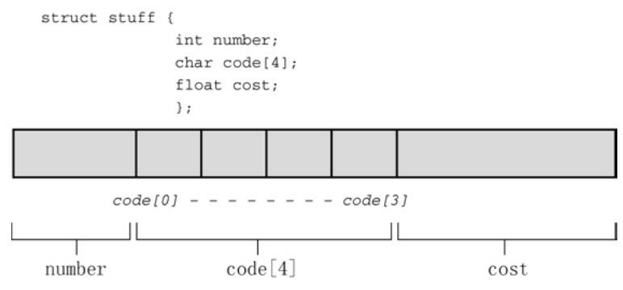
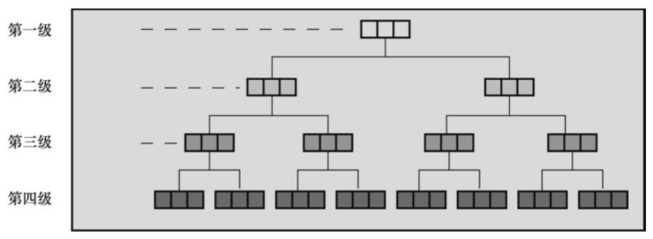
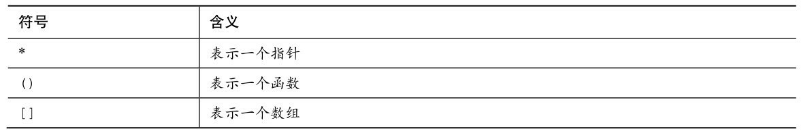
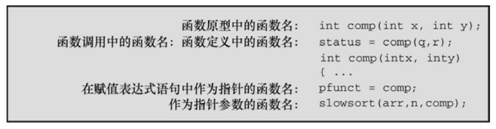

# 第14章 结构和其他数据形式
本章介绍以下内容：

* 关键字：struct、union、typedef
* 运算符：.、->
* 什么是C结构，如何创建结构模板和结构变量
* 如何访问结构的成员，如何编写处理结构的函数
* 联合和指向函数的指针

设计程序时，最重要的步骤之一是选择表示数据的方法。在许多情况下，简单变量甚至是数组还不够。为此，C提供了结构变量（structure variable）提高你表示数据的能力，它能让你创造新的形式。如果熟悉Pascal的记录（record），应该很容易解结构。如果不懂Pascal也没关系，本章将详细介绍C结构。我们先通过一个示例来分析为何需要C结构，学习如何创建和使用结构。

## 14.1 示例问题：创建图书目录
Gwen Glenn要打印一份图书目录。她想打印每本书的各种信息：书名、作者、出版社、版权日期、页数、册数和价格。其中的一些项目（如，书名)可以储存在字符数组中，其他项目需要一个int数组或float数组。用 7 个不同的数组分别记录每一项比较繁琐，尤其是 Gwen 还想创建多份列表：一份按书名排序、一份按作者排序、一份按价格排序等。如果能把图书目录的信息都包含在一个数组里更好，其中每个元素包含一本书的相关信息。

因此，Gwen需要一种即能包含字符串又能包含数字的数据形式，而且还要保持各信息的独立。C结构就满足这种情况下的需求。我们通过一个示例演示如何创建和使用数组。但是，示例进行了一些限制。第一，该程序示例演示的书目只包含书名、作者和价格。第二，只有一本书的数目。当然，别忘了这只是进行了限制，我们在后面将扩展该程序。请看程序清单14.1及其输出，然后阅读后面的一些要点。

程序清单14.1 book.c程序
```c
//* book.c -- 一本书的图书目录 */
#include <stdio.h>
#include <string.h>
char * s_gets(char * st, int n);
#define MAXTITL 41  /* 书名的最大长度 + 1  */
#define MAXAUTL 31  /* 作者姓名的最大长度 + 1*/

struct book {    /* 结构模版：标记是 book */
    char title[MAXTITL];
    char author[MAXAUTL];
    float value;
};         /* 结构模版结束    */

int main(void)
{
    struct book library; /* 把 library 声明为一个 book 类型的变量 */
    printf("Please enter the book title.\n");
    s_gets(library.title, MAXTITL);  /* 访问title部分*/
    printf("Now enter the author.\n");
    s_gets(library.author, MAXAUTL);
    printf("Now enter the value.\n");
    scanf("%f", &library.value);
    printf("%s by %s: $%.2f\n", library.title,
    library.author, library.value);
    printf("%s: \"%s\" ($%.2f)\n", library.author,
    library.title, library.value);
    printf("Done.\n");
    return 0;
}

char * s_gets(char * st, int n)
{
    char * ret_val;
    char * find;
    ret_val = fgets(st, n, stdin);
    if (ret_val)
    {
        find = strchr(st, '\n');  // 查找换行符
        if (find)          // 如果地址不是 NULL,
            *find = '\0';     // 在此处放置一个空字符
        else
            while (getchar() != '\n')
                continue;     //处理输入行中剩余的字符
    }
    return ret_val;
}
```

我们使用前面章节中介绍的s_gets()函数去掉fgets()储存在字符串中的换行符。下面是该例的一个运行示例：
```c
Please enter the book title.
Chicken of the Andes
Now enter the author.
Disma Lapoult
Now enter the value.
29.99
Chicken of the Andes by Disma Lapoult: $29.99
Disma Lapoult: "Chicken of the Andes" ($29.99)
Done.
```

程序清单14.1中创建的结构有3部分，每个部分都称为成员（member）或字段（field）。这3部分中，一部分储存书名，一部分储存作者名，一部分储存价格。下面是必须掌握的3个技巧：
```c
为结构建立一个格式或样式；
声明一个适合该样式的变量；
访问结构变量的各个部分。
```

## 14.2 建立结构声明
结构声明（structure declaration）描述了一个结构的组织布局。声明类似下面这样：
```c
struct book {
char title[MAXTITL];
char author[MAXAUTL];
float value;
};
```

该声明描述了一个由两个字符数组和一个float类型变量组成的结构。该声明并未创建实际的数据对象，只描述了该对象由什么组成。〔有时，我们把结构声明称为模板，因为它勾勒出结构是如何储存数据的。如果读者知道C++的模板，此模板非彼模板，C++中的模板更为强大。〕我们来分析一些细节。首先是关键字 struct，它表明跟在其后的是一个结构，后面是一个可选的标记（该例中是 book），稍后程序中可以使用该标记引用该结构。所以，我们在后面的程序中可以这样声明：
```c
struct book library;
```

这把library声明为一个使用book结构布局的结构变量。

在结构声明中，用一对花括号括起来的是结构成员列表。每个成员都用自己的声明来描述。例如，title部分是一个内含MAXTITL个元素的char类型数组。成员可以是任意一种C的数据类型，甚至可以是其他结构！右花括号后面的分号是声明所必需的，表示结构布局定义结束。可以把这个声明放在所有函数的外部（如本例所示），也可以放在一个函数定义的内部。如果把结构声明置于一个函数的内部，它的标记就只限于该函数内部使用。如果把结构声明置于函数的外部，那么该声明之后的所有函数都能使用它的标记。例如，在程序的另一个函数中，可以这样声明：
```c
struct book dickens;
```

这样，该函数便创建了一个结构变量dickens，该变量的结构布局是book。

结构的标记名是可选的。但是以程序示例中的方式建立结构时（在一处定义结构布局，在另一处定义实际的结构变量），必须使用标记。我们学完如何定义结构变量后，再来看这一点。

## 14.3 定义结构变量
结构有两层含义。一层含义是“结构布局”，刚才已经讨论过了。结构布局告诉编译器如何表示数据，但是它并未让编译器为数据分配空间。下一步是创建一个结构变量，即是结构的另一层含义。程序中创建结构变量的一行是:
```c
struct book library;
```

编译器执行这行代码便创建了一个结构变量library。编译器使用book模板为该变量分配空间：一个内含MAXTITL个元素的char数组、一个内含MAXAUTL个元素的char数组和一个float类型的变量。这些存储空间都与一个名称library结合在一起（见图14.1）。

在结构变量的声明中，struct book所起的作用相当于一般声明中的int或float。例如，可以定义两个struct book类型的变量，或者甚至是指向structbook类型结构的指针：
```c
struct book doyle, panshin, * ptbook;
```



结构变量doyle和panshin中都包含title、author和value部分。指针ptbook可以指向doyle、panshin或任何其他book类型的结构变量。从本质上看，book结构声明创建了一个名为struct book的新类型。

就计算机而言，下面的声明：
```c
struct book library;
```

是以下声明的简化：
```c
struct book {
char title[MAXTITL];
char author[AXAUTL];
float value;
} library;  /* 声明的右右花括号后跟变量名*/
```

换言之，声明结构的过程和定义结构变量的过程可以组合成一个步骤。如下所示，组合后的结构声明和结构变量定义不需要使用结构标记：
```c
struct { /* 无结构标记 */
char title[MAXTITL];
char author[MAXAUTL];
float value;
} library;
```

然而，如果打算多次使用结构模板，就要使用带标记的形式；或者，使用本章后面介绍的typedef。

这是定义结构变量的一个方面，在这个例子中，并未初始化结构变量。

### 14.3.1 初始化结构
初始化变量和数组如下：
```c
int count = 0;
int fibo[7] = {0,1,1,2,3,5,8};
```

结构变量是否也可以这样初始化？是的，可以。初始化一个结构变量（ANSI之前，不能用自动变量初始化结构；ANSI之后可以用任意存储类别）与初始化数组的语法类似：
```c
struct book library = {
"The Pious Pirate and the Devious Damsel",
"Renee Vivotte",
1.95
};
```

简而言之，我们使用在一对花括号中括起来的初始化列表进行初始化，各初始化项用逗号分隔。因此， title成员可以被初始化为一个字符串，value成员可以被初始化为一个数字。为了让初始化项与结构中各成员的关联更加明显，我们让每个成员的初始化项独占一行。这样做只是为了提高代码的可读性，对编译器而言，只需要用逗号分隔各成员的初始化项即可。

注意 初始化结构和类别储存期

第12章中提到过，如果初始化静态存储期的变量（如，静态外部链接、静态内部链接或静态无链接），必须使用常量值。这同样适用于结构。如果初始化一个静态存储期的结构，初始化列表中的值必须是常量表达式。如果是自动存储期，初始化列表中的值可以不是常量。

### 14.3.2 访问结构成员
结构类似于一个“超级数组”，这个超级数组中，可以是一个元素为char类型，下一个元素为forat类型，下一个元素为int数组。可以通过数组下标单独访问数组中的各元素，那么，如何访问结构中的成员？使用结构成员运算符——点（.）访问结构中的成员。例如，library.value即访问library的value部分。可以像使用任何float类型变量那样使用library.value。与此类似，可以像使用字符数组那样使用 library.title。因此，程序清单 14.1 中的程序中有s_gets(library.title, MAXTITL);和scanf("%f", &library.value);这样的代码。

本质上，.title、.author和.value的作用相当于book结构的下标。

注意，虽然library是一个结构，但是library.value是一个float类型的变量，可以像使用其他 float 类型变量那样使用它。例如，scanf("%f",...)需要一个 float 类型变量的地址，而&library.float正好符合要求。.比&的优先级高，因此这个表达式和&(library.float)一样。

如果还有一个相同类型的结构变量，可以用相同的方法：
```c
struct book bill, newt;
s_gets(bill.title, MAXTITL);
s_gets(newt.title, MAXTITL);
```

.title 引用 book 结构的第 1 个成员。注意，程序清单 14.1 中的程序以两种不同的格式打印了library结构变量中的内容。这说明可以自行决定如何使用结构成员。

### 14.3.3 结构的初始化器
C99和C11为结构提供了指定[初始化器](#指定初始化器)（designated initializer），其语法与数组的指定初始化器类似。但是，结构的指定初始化器使用点运算符和成员名（而不是方括号和下标）标识特定的元素。例如，只初始化book结构的value成员，可以这样做：
```c
struct book surprise = { .value = 10.99};
```

可以按照任意顺序使用指定初始化器：
```c
struct book gift = { .value = 25.99,
.author = "James Broadfool",
.title = "Rue for the Toad"};
```

与数组类似，在指定初始化器后面的普通初始化器，为指定成员后面的成员提供初始值。另外，对特定成员的最后一次赋值才是它实际获得的值。例如，考虑下面的代码：
```c
struct book gift= {.value = 18.90,
.author = "Philionna Pestle",
0.25};
```

赋给value的值是0.25，因为它在结构声明中紧跟在author成员之后。新值0.25取代了之前的18.9。在学习了结构的基本知识后，可以进一步了解结构的一些相关类型。

## 14.4 结构数组
接下来，我们要把程序清单14.1的程序扩展成可以处理多本书。显然，每本书的基本信息都可以用一个 book 类型的结构变量来表示。为描述两本书，需要使用两个变量，以此类推。可以使用这一类型的结构数组来处理多本书。在下一个程序中（程序清单 14.2）就创建了一个这样的数组。如果你使用 Borland C/C++，请参阅本节后面的“Borland C和浮点数”。

结构和内存

manybook.c程序创建了一个内含100个结构变量的数组。由于该数组是自动存储类别的对象，其中的信息被储存在栈（stack）中。如此大的数组需要很大一块内存，这可能会导致一些问题。如果在运行时出现错误，可能抱怨栈大小或栈溢出，你的编译器可能使用了一个默认大小的栈，这个栈对于该例而言太小。要修正这个问题，可以使用编译器选项设置栈大小为10000，以容纳这个结构数组；或者可以创建静态或外部数组（这样，编译器就不会把数组放在栈中）；或者可以减小数组大小为16。为何不一开始就使用较小的数组？这是为了让读者意识到栈大小的潜在问题，以便今后再遇到类似的问题，可以自己处理好。

程序清单14.2 manybook.c程序
```c
/* manybook.c -- 包含多本书的图书目录 */
#include <stdio.h>
#include <string.h>
char * s_gets(char * st, int n);
#define MAXTITL  40
#define MAXAUTL  40
#define MAXBKS 100    /* 书籍的最大数量 */
struct book {      /* 简历 book 模板  */
char title[MAXTITL];
char author[MAXAUTL];
float value;
};

int main(void)
{
struct book library[MAXBKS];  /* book 类型结构的数组 */
int count = 0;
int index;
printf("Please enter the book title.\n");
printf("Press [enter] at the start of a line to stop.\n");
while (count < MAXBKS && s_gets(library[count].title, MAXTITL) !=
NULL
&& library[count].title[0] != '\0')
{
printf("Now enter the author.\n");
s_gets(library[count].author, MAXAUTL);
printf("Now enter the value.\n");
scanf("%f", &library[count++].value);
while (getchar() != '\n')
continue;   /* 清理输入行*/
if (count < MAXBKS)
printf("Enter the next title.\n");
}
if (count > 0)
{
printf("Here is the list of your books:\n");
for (index = 0; index < count; index++)
printf("%s by %s: $%.2f\n", library[index].title,
library[index].author, library[index].value);
}
else
printf("No books? Too bad.\n");
return 0;
}

char * s_gets(char * st, int n)
{
char * ret_val;
char * find;
ret_val = fgets(st, n, stdin);
if (ret_val)
{
find = strchr(st, '\n');  // 查找换行符
if (find)          // 如果地址不是 NULL，
*find = '\0';     // 在此处放置一个空字符
else
while (getchar() != '\n')
continue;     // 处理输入行中剩余的字符
}
return ret_val;
}
```

下面是该程序的一个输出示例：
```c
Please enter the book title.
Press [enter] at the start of a line to stop.
My Life as a Budgie
Now enter the author.
Mack Zackles
Now enter the value.
12.95
Enter the next title.
...（此处省略了许多内容）...
Here is the list of your books:
My Life as a Budgie by Mack Zackles: $12.95
Thought and Unthought Rethought by Kindra Schlagmeyer: $43.50
Concerto for Financial Instruments by Filmore Walletz: $49.99
The CEO Power Diet by Buster Downsize: $19.25
C++ Primer Plus by Stephen Prata: $59.99
Fact Avoidance: Perception as Reality by Polly Bull: $19.97
Coping with Coping by Dr.Rubin Thonkwacker: $0.02
Diaphanous Frivolity by Neda McFey: $29.99
Murder Wore a Bikini by Mickey Splats: $18.95
A History of Buvania, Volume 8, by Prince Nikoli Buvan: $50.04
Mastering Your Digital Watch, 5nd Edition, by Miklos Mysz: $28.95
A Foregone Confusion by Phalty Reasoner: $5.99
Outsourcing Government: Selection vs.Election by Ima Pundit: $33.33
```

Borland C和浮点数

如果程序不使用浮点数，旧式的Borland C编译器会尝试使用小版本的scanf()来压缩程序。然而，如果在一个结构数组中只有一个浮点值（如程序清单14.2中那样），那么这种编译器（DOS的Borland C/C++ 3.1之前的版本，不是Borland C/C++ 4.0）就无法发现它存在。结果，编译器会生成如下消息：
```c
scanf : floating point formats not linked
Abnormal program termination
```

一种解决方案是，在程序中添加下面的代码：
```c
#include <math.h>
double dummy = sin(0.0);
```

这段代码强制编译器载入浮点版本的scanf()。

首先，我们学习如何声明结构数组和如何访问数组中的结构成员。然后，着重分析该程序的两个方面。

### 14.4.1 声明结构数组
声明结构数组和声明其他类型的数组类似。下面是一个声明结构数组的例子：
```c
struct book library[MAXBKS];
```

以上代码把library声明为一个内含MAXBKS个元素的数组。数组的每个元素都是一个book类型的数组。因此，library[0]是第1个book类型的结构变量，library[1]是第2个book类型的结构变量，以此类推。参看图14.2 可以帮助读者理解。数组名library本身不是结构名，它是一个数组名，该数组中的每个元素都是struct book类型的结构变量。

![图14.2 一个结构数组library[MAXBKS]](./img/图14.2一个结构数组libraryMAXBKS.png)

### 14.4.2 标识结构数组的成员
为了标识结构数组中的成员，可以采用访问单独结构的规则：在结构名后面加一个点运算符，再在点运算符后面写上成员名。如下所示：
```c
library[0].value /* 第1个数组元素与value 相关联 */
library[4].title /* 第5个数组元素与title 相关联 */
```

注意，数组下标紧跟在library后面，不是成员名后面：
```c
library.value[2] // 错误
library[2].value // 正确
```

使用library[2].value的原因是：library[2]是结构变量名，正如library[1]是另一个变量名。

顺带一提，下面的表达式代表什么？
```c
library[2].title[4]
```

这是library数组第3个结构变量（library[2]部分）中书名的第5个字符（title[4]部分）。以程序清单14.2的输出为例，这个字符是e。该例指出，点运算符右侧的下标作用于各个成员，点运算符左侧的下标作用与结构数组。

最后，总结一下：
```c
library        // 一个book 结构的数组
library[2]       // 一个数组元素，该元素是book结构
library[2].title    // 一个char数组（library[2]的title成员）
library[2].title[4]  // 数组中library[2]元素的title 成员的一个字符
```

下面，我们来讨论一下这个程序。

### 14.4.3 程序讨论
较之程序清单14.1，该程序主要的改动之处是：插入一个while循环读取多个项。该循环的条件测试是：
```c
while (count < MAXBKS && s_gets(library[count].title, MAXTITL) != NULL && library[count].title[0] != '\0')
```

表达式 s_gets(library[count].title, MAXTITL)读取一个字符串作为书名，如果 s_gets()尝试读到文件结尾后面，该表达式则返回NULL。表达式library[count].title[0] != '\0'判断字符串中的首字符是否是空字符（即，该字符串是否是空字符串）。如果在一行开始处用户按下 Enter 键，相当于输入了一个空字符串，循环将结束。程序中还检查了图书的数量，以免超出数组的大小。

然后，该程序中有如下几行：
```c
while (getchar() != '\n')
    continue; /* 清理输入行 */
```

前面章节介绍过，这段代码弥补了scanf()函数遇到空格和换行符就结束读取的问题。当用户输入书的价格时，可能输入如下信息：
```c
12.50[Enter]
```

其传送的字符序列如下：
```c
12.50\n
```

scanf()函数接受1、2、.、5和0，但是把\n留在输入序列中。如果没有上面两行清理输入行的代码，就会把留在输入序列中的换行符当作空行读入，程序以为用户发送了停止输入的信号。我们插入的这两行代码只会在输入序列中查找并删除\n，不会处理其他字符。这样s_gets()就可以重新开始下一次输入。

## 14.5 嵌套结构
有时，在一个结构中包含另一个结构（即嵌套结构）很方便。例如，Shalala Pirosky创建了一个有关她朋友信息的结构。显然，结构中需要一个成员表示朋友的姓名。然而，名字可以用一个数组来表示，其中包含名和姓这两个成员。程序清单14.3是一个简单的示例。

程序清单14.3 friend.c程序
```c
// friend.c -- 嵌套结构示例
#include <stdio.h>
#define LEN 20
const char * msgs[5] =
{
"  Thank you for the wonderful evening, ",
"You certainly prove that a ",
"is a special kind of guy.We must get together",
"over a delicious ",
" and have a few laughs"
};
struct names {         // 第1个结构
char first[LEN];
char last[LEN];
};
struct guy {          // 第2个结构
struct names handle;    // 嵌套结构
char favfood[LEN];
char job[LEN];
float income;
};
int main(void)
{
    struct guy fellow = {   // 初始化一个结构变量
    { "Ewen", "Villard" },
    "grilled salmon",
    "personality coach",
    68112.00
    };
    printf("Dear %s, \n\n", fellow.handle.first);
    printf("%s%s.\n", msgs[0], fellow.handle.first);
    printf("%s%s\n", msgs[1], fellow.job);
    printf("%s\n", msgs[2]);
    printf("%s%s%s", msgs[3], fellow.favfood, msgs[4]);
    if (fellow.income > 150000.0)
        puts("!!");
    else if (fellow.income > 75000.0)
        puts("!");
    else
        puts(".");
    printf("\n%40s%s\n", " ", "See you soon,");
    printf("%40s%s\n", " ", "Shalala");
    return 0;
}
```

下面是该程序的输出：
```c
Dear Ewen,

  Thank you for the wonderful evening, Ewen.
You certainly prove that a personality coach
is a special kind of guy.We must get together
over a delicious grilled salmon and have a few laughs.

                                        See you soon,
                                        Shalala
```

首先，注意如何在结构声明中创建嵌套结构。和声明int类型变量一样，进行简单的声明：
```c
struct names handle;
```

该声明表明handle是一个struct name类型的变量。当然，文件中也应包含结构names的声明。

其次，注意如何访问嵌套结构的成员，这需要使用两次点运算符：
```c
printf("Hello, %s!\n", fellow.handle.first);
```

从左往右解释fellow.handle.first：
```c
(fellow.handle).first
```

也就是说，找到fellow，然后找到fellow的handle的成员，再找到handle的first成员。

## 14.6 指向结构的指针
喜欢使用指针的人一定很高兴能使用指向结构的指针。至少有 4 个理由可以解释为何要使用指向结构的指针。第一，就像指向数组的指针比数组本身更容易操控（如，排序问题）一样，指向结构的指针通常比结构本身更容易操控。第二，在一些早期的C实现中，结构不能作为参数传递给函数，但是可以传递指向结构的指针。第三，即使能传递一个结构，传递指针通常更有效率。第四，一些用于表示数据的结构中包含指向其他结构的指针。

下面的程序（程序清单14.4）演示了如何定义指向结构的指针和如何用这样的指针访问结构的成员。

程序清单14.4 friends.c程序
```c
/* friends.c -- 使用指向结构的指针 */
#include <stdio.h>
#define LEN 20
struct names {
char first[LEN];
char last[LEN];
};
struct guy {
struct names handle;
char favfood[LEN];
char job[LEN];
float income;
};
int main(void)
{
    struct guy fellow[2] = {
    { { "Ewen", "Villard" },
    "grilled salmon",
    "personality coach",
    68112.00
    },
    { { "Rodney", "Swillbelly" },
    "tripe",
    "tabloid editor",
    432400.00
    }
    };
    struct guy * him;   /* 这是一个指向结构的指针 */
    printf("address #1: %p #2: %p\n", &fellow[0], &fellow[1]);
    him = &fellow[0];   /* 告诉编译器该指针指向何处 */
    printf("pointer #1: %p #2: %p\n", him, him + 1);
    printf("him->income is $%.2f: (*him).income is $%.2f\n",
    him->income, (*him).income);
    him++;        /* 指向下一个结构  */
    printf("him->favfood is %s: him->handle.last is %s\n",
    him->favfood, him->handle.last);
    return 0;
}
```

该程序的输出如下：
```c
address #1: 0x7ffe0923d460 #2: 0x7ffe0923d4b4
pointer #1: 0x7ffe0923d460 #2: 0x7ffe0923d4b4
him->income is $68112.00: (*him).income is $68112.00
him->favfood is tripe: him->handle.last is Swillbelly
```

我们先来看如何创建指向guy类型结构的指针，然后再分析如何通过该指针指定结构的成员。

### 14.6.1 声明和初始化结构指针
声明结构指针很简单：
```c
struct guy * him;
```

首先是关键字 struct，其次是结构标记 guy，然后是一个星号（*），其后跟着指针名。这个语法和其他指针声明一样。

该声明并未创建一个新的结构，但是指针him现在可以指向任意现有的guy类型的结构。例如，如果barney是一个guy类型的结构，可以这样写：
```c
him = &barney;
```

和数组不同的是，结构名并不是结构的地址，因此要在结构名前面加上&运算符。

在本例中，fellow 是一个结构数组，这意味着 fellow[0]是一个结构。所以，要让 him 指向fellow[0]，可以这样写：
```c
him = &fellow[0];
```

输出的前两行说明赋值成功。比较这两行发现，him指向fellow[0]，him + 1指向fellow[1]。注意，him加1相当于him指向的地址加84。在十六进制中，874 - 820 = 54（十六进制）= 84（十进制），因为每个guy结构都占用84字节的内存：names.first占用20字节，names.last占用20字节，favfood占用20字节，job占用20字节，income占用4字节（假设系统中float占用4字节）。顺带一提，在有些系统中，一个结构的大小可能大于它各成员大小之和。这是因为系统对数据进行校准的过程中产生了一些“缝隙”。例如，有些系统必须把每个成员都放在偶数地址上，或4的倍数的地址上。在这种系统中，结构的内部就存在未使用的“缝隙”。

### 14.6.2 用指针访问成员
指针him指向结构变量fellow[0]，如何通过him获得fellow[0]的成员的值？程序清单14.4中的第3行输出演示了两种方法。

第1种方法也是最常用的方法：使用->运算符。该运算符由一个连接号（-）后跟一个大于号（>）组成。我们有下面的关系：
```c
如果him == &barney，那么him->income 即是 barney.income
如果him == &fellow[0]，那么him->income 即是 fellow[0].income
```

换句话说，->运算符后面的结构指针和.运算符后面的结构名工作方式相同（不能写成him.incone，因为him不是结构名）。

这里要着重理解him是一个指针，但是hime->income是该指针所指向结构的一个成员。所以在该例中，him->income是一个float类型的变量。

第2种方法是，以这样的顺序指定结构成员的值：如果him == &fellow[0]，那么*him == fellow[0]，因为&和*是一对互逆运算符。因此，可以做以下替代：
```c
fellow[0].income == (*him).income
```

必须要使用圆括号，因为.运算符比*运算符的优先级高。

总之，如果him是指向guy类型结构barney的指针，下面的关系恒成立：
```c
barney.income == (*him).income == him->income // 假设 him == &barney
```

接下来，我们来学习结构和函数的交互。

## 14.7 向函数传递结构的信息
函数的参数把值传递给函数。每个值都是一个数字——可能是int类型、float类型，可能是ASCII字符码，或者是一个地址。然而，一个结构比一个单独的值复杂，所以难怪以前的C实现不允许把结构作为参数传递给函数。当前的实现已经移除了这个限制，ANSI C允许把结构作为参数使用。所以程序员可以选择是传递结构本身，还是传递指向结构的指针。如果你只关心结构中的某一部分，也可以把结构的成员作为参数。我们接下来将分析这3种传递方式，首先介绍以结构成员作为参数的情况。

### 14.7.1 传递结构成员
只要结构成员是一个具有单个值的数据类型（即，int及其相关类型、char、float、double或指针），便可把它作为参数传递给接受该特定类型的函数。程序清单14.5中的财务分析程序（初级版本）演示了这一点，该程序把客户的银行账户添加到他/她的储蓄和贷款账户中。

程序清单14.5 funds1.c程序
```c
/* funds1.c -- 把结构成员作为参数传递 */
#include <stdio.h>
#define FUNDLEN 50
struct funds {
char   bank[FUNDLEN];
double  bankfund;
char   save[FUNDLEN];
double  savefund;
};
double sum(double, double);

int main(void)
{
    struct funds stan = {
    "Garlic-Melon Bank",
    4032.27,
    "Lucky's Savings and Loan",
    8543.94
    };
    printf("Stan has a total of $%.2f.\n",
    sum(stan.bankfund, stan.savefund));
    return 0;
}

/* 两个double类型的数相加 */
double sum(double x, double y)
{
    return(x + y);
}
```

运行该程序后输出如下：
```c
Stan has a total of $12576.21.
```

看来，这样传递参数没问题。注意，sum()函数既不知道也不关心实际的参数是否是结构的成员，它只要求传入的数据是double类型。

当然，如果需要在被调函数中修改主调函数中成员的值，就要传递成员的地址：
```c
modify(&stan.bankfund);
```

这是一个更改银行账户的函数。

把结构的信息告诉函数的第2种方法是，让被调函数知道自己正在处理一个结构。

### 14.7.2 传递结构的地址
我们继续解决前面的问题，但是这次把结构的地址作为参数。由于函数要处理funds结构，所以必须声明funds结构。如程序清单14.6所示。

程序清单14.6 funds2.c程序
```c
/* funds2.c -- 传递指向结构的指针 */
#include <stdio.h>
#define FUNDLEN 50
struct funds {
char   bank[FUNDLEN];
double  bankfund;
char   save[FUNDLEN];
double  savefund;
};
double sum(const struct funds *); /* 参数是一个指针 */
int main(void)
{
    struct funds stan = {
    "Garlic-Melon Bank",
    4032.27,
    "Lucky's Savings and Loan",
    8543.94
    };
    printf("Stan has a total of $%.2f.\n", sum(&stan));
    return 0;
}

double sum(const struct funds * money)
{
    return(money->bankfund + money->savefund);
}
```

运行该程序后输出如下：
```c
Stan has a total of $12576.21.
```

sum()函数使用指向funds结构的指针（money）作为它的参数。把地址&stan传递给该函数，使得指针money指向结构stan。然后通过->运算符获取stan.bankfund和stan.savefund的值。由于该函数不能改变指针所指向值的内容，所以把money声明为一个指向const的指针。

虽然该函数并未使用其他成员，但是也可以访问它们。注意，必须使用&运算符来获取结构的地址。和数组名不同，结构名只是其地址的别名。

### 14.7.3 传递结构
对于允许把结构作为参数的编译器，可以把程序清单14.6重写为程序清单14.7。

程序清单14.7 funds3.c程序
```c
/* funds3.c -- 传递一个结构 */
#include <stdio.h>
#define FUNDLEN 50
struct funds {
char  bank[FUNDLEN];
double bankfund;
char  save[FUNDLEN];
double savefund;
};
double sum(struct funds moolah); /* 参数是一个结构 */

int main(void)
{
    struct funds stan = {
    "Garlic-Melon Bank",
    4032.27,
    "Lucky's Savings and Loan",
    8543.94
    };
    printf("Stan has a total of $%.2f.\n", sum(stan));
    return 0;
}

double sum(struct funds moolah)
{
    return(moolah.bankfund + moolah.savefund);
}
```

下面是运行该程序后的输出：
```c
Stan has a total of $12576.21.
```

该程序把程序清单14.6中指向struct funds类型的结构指针money替换成struct funds类型的结构变量moolah。调用sum()时，编译器根据funds模板创建了一个名为moolah的自动结构变量。然后，该结构的各成员被初始化为 stan结构变量相应成员的值的副本。因此，程序使用原来结构的副本进行计算，然而，传递指针的程序清单14.6使用的是原始的结构进行计算。由于moolah是一个结构，所以该程序使用moolah.bankfund，而不是moolah->bankfund。另一方面，由于money是指针，不是结构，所以程序清单14.6使用的是monet->bankfund。

### 14.7.4 其他结构特性
现在的C允许把一个结构赋值给另一个结构，但是数组不能这样做。也就是说，如果n_data和o_data都是相同类型的结构，可以这样做：
```c
o_data = n_data; // 把一个结构赋值给另一个结构
```

这条语句把n_data的每个成员的值都赋给o_data的相应成员。即使成员是数组，也能完成赋值。另外，还可以把一个结构初始化为相同类型的另一个结构：
```c
struct names right_field = {"Ruthie", "George"};
struct names captain = right_field; // 把一个结构初始化为另一个结构
```

现在的C（包括ANSI C），函数不仅能把结构本身作为参数传递，还能把结构作为返回值返回。把结构作为函数参数可以把结构的信息传送给函数；把结构作为返回值的函数能把结构的信息从被调函数传回主调函数。结构指针也允许这种双向通信，因此可以选择任一种方法来解决编程问题。我们通过另一组程序示例来演示这两种方法。

为了对比这两种方法，我们先编写一个程序以传递指针的方式处理结构，然后以传递结构和返回结构的方式重写该程序。

程序清单14.8 names1.c程序
```c
/* names1.c -- 使用指向结构的指针 */
#include <stdio.h>
#include <string.h>
#define NLEN 30
struct namect {
char fname[NLEN];
char lname[NLEN];
int letters;
};
void getinfo(struct namect *);
void makeinfo(struct namect *);
void showinfo(const struct namect *);
char * s_gets(char * st, int n);
int main(void)
{
struct namect person;
getinfo(&person);
makeinfo(&person);
showinfo(&person);
return 0;
}
void getinfo(struct namect * pst)
{
printf("Please enter your first name.\n");
s_gets(pst->fname, NLEN);
printf("Please enter your last name.\n");
s_gets(pst->lname, NLEN);
}
void makeinfo(struct namect * pst)
{
pst->letters = strlen(pst->fname) +strlen(pst->lname);
}
void showinfo(const struct namect * pst)
{
printf("%s %s, your name contains %d letters.\n",
pst->fname, pst->lname, pst->letters);
}
char * s_gets(char * st, int n)
{
char * ret_val;
char * find;
ret_val = fgets(st, n, stdin);
if (ret_val)
{
find = strchr(st, '\n');  // 查找换行符
if (find)          // 如果地址不是 NULL,
*find = '\0';     // 在此处放置一个空字符
else
while (getchar() != '\n')
continue;     // 处理输入行的剩余字符
}
return ret_val;
}
```

下面是编译并运行该程序后的一个输出示例：
```c
Please enter your first name.
Viola
Please enter your last name.
Plunderfest
Viola Plunderfest, your name contains 16 letters.
```

该程序把任务分配给3个函数来完成，都在main()中调用。每调用一个函数就把person结构的地址传递给它。

getinfo()函数把结构的信息从自身传递给main()。该函数通过与用户交互获得姓名，并通过pst指针定位，将其放入 person 结构中。由于 pst->lname意味着 pst 指向结构的 lname 成员，这使得pst->lname等价于char数组的名称，因此做s_gets()的参数很合适。注意，虽然getinfo()给main()提供了信息，但是它并未使用返回机制，所以其返回类型是void。

makeinfo()函数使用双向传输方式传送信息。通过使用指向 person 的指针，该指针定位了储存在该结构中的名和姓。该函数使用C库函数strlen()分别计算名和姓中的字母总数，然后使用person的地址储存两数之和。同样，makeinfo()函数的返回类型也是void。

showinfo()函数使用一个指针定位待打印的信息。因为该函数不改变数组的内容，所以将其声明为const。

所有这些操作中，只有一个结构变量 person，每个函数都使用该结构变量的地址来访问它。一个函数把信息从自身传回主调函数，一个函数把信息从主调函数传给自身，一个函数通过双向传输来传递信息。

现在，我们来看如何使用结构参数和返回值来完成相同的任务。第一，为了传递结构本身，函数的参数必须是person，而不是&person。那么，相应的形式参数应声明为struct namect，而不是指向该类型的指针。第二，可以通过返回一个结构，把结构的信息返回给main()。程序清单14.9演示了不使用指针的版本。

程序清单14.9 names2.c程序
```c
/* names2.c -- 传递并返回结构 */
#include <stdio.h>
#include <string.h>
#define NLEN 30
struct namect {
char fname[NLEN];
char lname[NLEN];
int letters;
};
struct namect getinfo(void);
struct namect makeinfo(struct namect);
void showinfo(struct namect);
char * s_gets(char * st, int n);
int main(void)
{
struct namect person;
person = getinfo();
person = makeinfo(person);
showinfo(person);
return 0;
}
struct namect getinfo(void)
{
struct namect temp;
printf("Please enter your first name.\n");
s_gets(temp.fname, NLEN);
printf("Please enter your last name.\n");
s_gets(temp.lname, NLEN);
return temp;
}
struct namect makeinfo(struct namect info)
{
info.letters = strlen(info.fname) + strlen(info.lname);
return info;
}
void showinfo(struct namect info)
{
printf("%s %s, your name contains %d letters.\n",
info.fname, info.lname, info.letters);
}
char * s_gets(char * st, int n)
{
char * ret_val;
char * find;
ret_val = fgets(st, n, stdin);
if (ret_val)
{
find = strchr(st, '\n');  // 查找换行符
if (find)          // 如果地址不是 NULL，
*find = '\0';     // 在此处放置一个空字符
else
while (getchar() != '\n')
continue;     // 处理输入行的剩余部分
}
return ret_val;
}
```

该版本最终的输出和前面版本相同，但是它使用了不同的方式。程序中的每个函数都创建了自己的person备份，所以该程序使用了4个不同的结构，不像前面的版本只使用一个结构。

例如，考虑makeinfo()函数。在第1个程序中，传递的是person的地址，该函数实际上处理的是person的值。在第2个版本的程序中，创建了一个新的结构info。储存在person中的值被拷贝到info中，函数处理的是这个副本。因此，统计完字母个数后，计算结果储存在info中，而不是person中。然而，返回机制弥补了这一点。makeinfo()中的这行代码：
```c
return info;
```

与main()中的这行结合：
```c
person = makeinfo(person);
```

把储存在info中的值拷贝到person中。注意，必须把makeinfo()函数声明为struct namect类型，所以该函数要返回一个结构。

### 14.7.5 结构和结构指针的选择
假设要编写一个与结构相关的函数，是用结构指针作为参数，还是用结构作为参数和返回值？两者各有优缺点。

把指针作为参数有两个优点：无论是以前还是现在的C实现都能使用这种方法，而且执行起来很快，只需要传递一个地址。缺点是无法保护数据。被调函数中的某些操作可能会意外影响原来结构中的数据。不过，ANSI C新增的const限定符解决了这个问题。例如，如果在程序清单14.8中，showinfo()函数中的代码改变了结构的任意成员，编译器会捕获这个错误。

把结构作为参数传递的优点是，函数处理的是原始数据的副本，这保护了原始数据。另外，代码风格也更清楚。假设定义了下面的结构类型：
```c
struct vector {double x; double y;};
```

如果用vector类型的结构ans储存相同类型结构a和b的和，就要把结构作为参数和返回值：
```c
struct vector ans, a, b;
struct vector sum_vect(struct vector, struct vector);
...
ans = sum_vect(a,b);
```

对程序员而言，上面的版本比用指针传递的版本更自然。指针版本如下：
```c
struct vector ans, a, b;
void sum_vect(const struct vector *, const struct vector *, struct vector *);
...
sum_vect(&a, &b, &ans);
```

另外，如果使用指针版本，程序员必须记住总和的地址应该是第1个参数还是第2个参数的地址。

传递结构的两个缺点是：较老版本的实现可能无法处理这样的代码，而且传递结构浪费时间和存储空间。尤其是把大型结构传递给函数，而它只使用结构中的一两个成员时特别浪费。这种情况下传递指针或只传递函数所需的成员更合理。

通常，程序员为了追求效率会使用结构指针作为函数参数，如需防止原始数据被意外修改，使用const限定符。按值传递结构是处理小型结构最常用的方法。

### 14.7.6 结构中的字符数组和字符指针
到目前为止，我们在结构中都使用字符数组来储存字符串。是否可以使用指向 char 的指针来代替字符数组？例如，程序清单14.3中有如下声明：
```c
#define LEN 20
struct names {
char first[LEN];
char last[LEN];
};
```

其中的结构声明是否可以这样写：
```c
struct pnames {
char * first;
char * last;
};
```

当然可以，但是如果不理解这样做的含义，可能会有麻烦。考虑下面的代码：
```c
struct names veep = {"Talia", "Summers"};
struct pnames treas = {"Brad", "Fallingjaw"};
printf("%s and %s\n", veep.first, treas.first);
```

以上代码都没问题，也能正常运行，但是思考一下字符串被储存在何处。对于struct names类型的结构变量veep，以上字符串都储存在结构内部，结构总共要分配40字节储存姓名。然而，对于struct pnames类型的结构变量treas，以上字符串储存在编译器储存常量的地方。结构本身只储存了两个地址，在我们的系统中共占16字节。尤其是，struct pnames结构不用为字符串分配任何存储空间。它使用的是储存在别处的字符串（如，字符串常量或数组中的字符串）。简而言之，在pnames结构变量中的指针应该只用来在程序中管理那些已分配和在别处分配的字符串。

我们看看这种限制在什么情况下出问题。考虑下面的代码：
```c
struct names accountant;
struct pnames attorney;
puts("Enter the last name of your accountant:");
scanf("%s", accountant.last);
puts("Enter the last name of your attorney:");
scanf("%s", attorney.last);  /* 这里有一个潜在的危险 */
```

就语法而言，这段代码没问题。但是，用户的输入储存到哪里去了？对于会计师（accountant），他的名储存在accountant结构变量的last成员中，该结构中有一个储存字符串的数组。对于律师（attorney），scanf()把字符串放到attorney.last表示的地址上。由于这是未经初始化的变量，地址可以是任何值，因此程序可以把名放在任何地方。如果走运的话，程序不会出问题，至少暂时不会出问题，否则这一操作会导致程序崩溃。实际上，如果程序能正常运行并不是好事，因为这意味着一个未被觉察的危险潜伏在程序中。

因此，如果要用结构储存字符串，用字符数组作为成员比较简单。用指向 char 的指针也行，但是误用会导致严重的问题。

### 14.7.7 结构、指针和malloc()
如果使用malloc()分配内存并使用指针储存该地址，那么在结构中使用指针处理字符串就比较合理。这种方法的优点是，可以请求malloc()为字符串分配合适的存储空间。可以要求用4字节储存"Joe"和用18字节储存"Rasolofomasoandro"。用这种方法改写程序清单14.9并不费劲。主要是更改结构声明（用指针代替数组）和提供一个新版本的getinfo()函数。新的结构声明如下：
```c
struct namect {
char * fname; // 用指针代替数组
char * lname;
int letters;
};
```

新版本的getinfo()把用户的输入读入临时数组中，调用malloc()函数分配存储空间，并把字符串拷贝到新分配的存储空间中。对名和姓都要这样做：
```c
void getinfo (struct namect * pst)
{
    char temp[SLEN];
    printf("Please enter your first name.\n");
    s_gets(temp, SLEN);
    // 分配内存储存名
    pst->fname = (char *) malloc(strlen(temp) + 1);
    // 把名拷贝到已分配的内存
    strcpy(pst->fname, temp);
    printf("Please enter your last name.\n");
    s_gets(temp, SLEN);
    ```
    pst->lname = (char *) malloc(strlen(temp) + 1);
    strcpy(pst->lname, temp);
}
```

要理解这两个字符串都未储存在结构中，它们储存在 malloc()分配的内存块中。然而，结构中储存着这两个字符串的地址，处理字符串的函数通常都要使用字符串的地址。因此，不用修改程序中的其他函数。

第12章建议，应该成对使用malloc()和free()。因此，还要在程序中添加一个新的函数cleanup()，用于释放程序动态分配的内存。如程序清单14.10所示。

程序清单14.10 names3.c程序
```c
// names3.c -- 使用指针和 malloc()
#include <stdio.h>
#include <string.h>  // 提供 strcpy()、strlen() 的原型
#include <stdlib.h>  // 提供 malloc()、free() 的原型
#define SLEN 81
struct namect {
char * fname; // 使用指针
char * lname;
int letters;
};
void getinfo(struct namect *);   // 分配内存
void makeinfo(struct namect *);
void showinfo(const struct namect *);
void cleanup(struct namect *);   // 调用该函数时释放内存
char * s_gets(char * st, int n);
int main(void)
{
struct namect person;
getinfo(&person);
makeinfo(&person);
showinfo(&person);
cleanup(&person);
return 0;
}
void getinfo(struct namect * pst)
{
char temp[SLEN];
printf("Please enter your first name.\n");
s_gets(temp, SLEN);
// 分配内存以储存名
pst->fname = (char *) malloc(strlen(temp) + 1);
// 把名拷贝到动态分配的内存中
strcpy(pst->fname, temp);
printf("Please enter your last name.\n");
s_gets(temp, SLEN);
pst->lname = (char *) malloc(strlen(temp) + 1);
strcpy(pst->lname, temp);
}
void makeinfo(struct namect * pst)
{
pst->letters = strlen(pst->fname) +
strlen(pst->lname);
}
void showinfo(const struct namect * pst)
{
printf("%s %s, your name contains %d letters.\n",
pst->fname, pst->lname, pst->letters);
}
void cleanup(struct namect * pst)
{
free(pst->fname);
free(pst->lname);
}
char * s_gets(char * st, int n)
{
char * ret_val;
char * find;
ret_val = fgets(st, n, stdin);
if (ret_val)
{
find = strchr(st, '\n');  // 查找换行符
if (find)          // 如果地址不是 NULL，
*find = '\0';     // 在此处放置一个空字符
else
while (getchar() != '\n')
continue;     // 处理输入行的剩余部分
}
return ret_val;
}
```

下面是该程序的输出：
```c
Please enter your first name.
Floresiensis
Please enter your last name.
Mann
Floresiensis Mann, your name contains 16 letters.
```

### 14.7.8 复合字面量和结构（C99）
C99 的复合字面量特性可用于结构和数组。如果只需要一个临时结构值，复合字面量很好用。例如，可以使用复合字面量创建一个数组作为函数的参数或赋给另一个结构。语法是把类型名放在圆括号中，后面紧跟一个用花括号括起来的初始化列表。例如，下面是struct book类型的复合字面量：
```c
(struct book) {"The Idiot", "Fyodor Dostoyevsky", 6.99}
```

程序清单14.11中的程序示例，使用复合字面量为一个结构变量提供两个可替换的值（在撰写本书时，并不是所有的编译器都支持这个特性，不过这是时间的问题）。

程序清单14.11 complit.c程序
```c
/* complit.c -- 复合字面量 */
#include <stdio.h>
#define MAXTITL 41
#define MAXAUTL 31
struct book {     // 结构模版：标记是 book
char title[MAXTITL];
char author[MAXAUTL];
float value;
};
int main(void)
{
struct book readfirst;
int score;
printf("Enter test score: ");
scanf("%d", &score);
if (score >= 84)
readfirst = (struct book) {"Crime and Punishment",
"Fyodor Dostoyevsky",
11.25};
else
readfirst = (struct book) {"Mr.Bouncy's Nice Hat",
"Fred Winsome",5.99};
printf("Your assigned reading:\n");
printf("%s by %s: $%.2f\n", readfirst.title,
readfirst.author, readfirst.value);
return 0;
}
```

还可以把复合字面量作为函数的参数。如果函数接受一个结构，可以把复合字面量作为实际参数传递：
```c
struct rect {double x; double y;};
double rect_area(struct rect r){return r.x * r.y;}
...
double area;
area = rect_area( (struct rect) {10.5, 20.0});
```

值210被赋给area。

如果函数接受一个地址，可以传递复合字面量的地址：
```c
struct rect {double x; double y;};
double rect_areap(struct rect * rp){return rp->x * rp->y;}
...
double area;
area = rect_areap( &(struct rect) {10.5, 20.0});
```

值210被赋给area。

复合字面量在所有函数的外部，具有静态存储期；如果复合字面量在块中，则具有自动存储期。复合字面量和普通初始化列表的语法规则相同。这意味着，可以在复合字面量中使用指定初始化器。

### 14.7.9 伸缩型数组成员（C99）
C99新增了一个特性：伸缩型数组成员（flexible array member），利用这项特性声明的结构，其最后一个数组成员具有一些特性。第1个特性是，该数组不会立即存在。第2个特性是，使用这个伸缩型数组成员可以编写合适的代码，就好像它确实存在并具有所需数目的元素一样。这可能听起来很奇怪，所以我们来一步步地创建和使用一个带伸缩型数组成员的结构。

首先，声明一个伸缩型数组成员有如下规则：

伸缩型数组成员必须是结构的最后一个成员；

结构中必须至少有一个成员；

伸缩数组的声明类似于普通数组，只是它的方括号中是空的。

下面用一个示例来解释以上几点：
```c
struct flex
{
int count;
double average;
double scores[]; // 伸缩型数组成员
};
```

声明一个struct flex类型的结构变量时，不能用scores做任何事，因为没有给这个数组预留存储空间。实际上，C99的意图并不是让你声明struct flex类型的变量，而是希望你声明一个指向struct flex类型的指针，然后用malloc()来分配足够的空间，以储存struct flex类型结构的常规内容和伸缩型数组成员所需的额外空间。例如，假设用scores表示一个内含5个double类型值的数组，可以这样做：
```c
struct flex * pf; // 声明一个指针
// 请求为一个结构和一个数组分配存储空间
pf = malloc(sizeof(struct flex) + 5 * sizeof(double));
```

现在有足够的存储空间储存count、average和一个内含5个double类型值的数组。可以用指针pf访问这些成员：
```c
pf->count = 5;     // 设置 count 成员
pf->scores[2] = 18.5; // 访问数组成员的一个元素
```

程序清单14.13进一步扩展了这个例子，让伸缩型数组成员在第1种情况下表示5个值，在第2种情况下代表9个值。该程序也演示了如何编写一个函数处理带伸缩型数组元素的结构。

程序清单14.12 flexmemb.c程序
```c
// flexmemb.c -- 伸缩型数组成员（C99新增特性）
#include <stdio.h>
#include <stdlib.h>
struct flex
{
size_t count;
double average;
double scores []; // 伸缩型数组成员
};
void showFlex(const struct flex * p);
int main(void)
{
struct flex * pf1, *pf2;
int n = 5;
int i;
int tot = 0;
// 为结构和数组分配存储空间
pf1 = malloc(sizeof(struct flex) + n * sizeof(double));
pf1->count = n;
for (i = 0; i < n; i++)
{
pf1->scores[i] = 20.0 - i;
tot += pf1->scores[i];
}
pf1->average = tot / n;
showFlex(pf1);
n = 9;
tot = 0;
pf2 = malloc(sizeof(struct flex) + n * sizeof(double));
pf2->count = n;
for (i = 0; i < n; i++)
{
pf2->scores[i] = 20.0 - i / 2.0;
tot += pf2->scores[i];
}
pf2->average = tot / n;
showFlex(pf2);
free(pf1);
free(pf2);
return 0;
}
void showFlex(const struct flex * p)
{
int i;
printf("Scores : ");
for (i = 0; i < p->count; i++)
printf("%g ", p->scores[i]);
printf("\nAverage: %g\n", p->average);
}
```

下面是该程序的输出：
```c
Scores : 20 19 18 17 16
Average: 18
Scores : 20 19.5 19 18.5 18 17.5 17 16.5 16
Average: 17
```

带伸缩型数组成员的结构确实有一些特殊的处理要求。第一，不能用结构进行赋值或拷贝：
```c
struct flex * pf1, *pf2;  // *pf1 和*pf2 都是结构
...
*pf2 = *pf1;       // 不要这样做
```

这样做只能拷贝除伸缩型数组成员以外的其他成员。确实要进行拷贝，应使用memcpy()函数（第16章中介绍）。

第二，不要以按值方式把这种结构传递给结构。原因相同，按值传递一个参数与赋值类似。要把结构的地址传递给函数。

第三，不要使用带伸缩型数组成员的结构作为数组成员或另一个结构的成员。

这种类似于在结构中最后一个成员是伸缩型数组的情况，称为struct hack。除了伸缩型数组成员在声明时用空的方括号外，struct hack特指大小为0的数组。然而，struct hack是针对特殊编译器（GCC）的，不属于C标准。这种伸缩型数组成员方法是标准认可的编程技巧。

### 14.7.10 匿名结构（C11）
匿名结构是一个没有名称的结构成员。为了理解它的工作原理，我们先考虑如何创建嵌套结构：
```c
struct names
{
char first[20];
char last[20];
};
struct person
{
int id;
struct names name;// 嵌套结构成员
};
struct person ted = {8483, {"Ted", "Grass"}};
```

这里，name成员是一个嵌套结构，可以通过类似ted.name.first的表达式访问"ted"：
```c
puts(ted.name.first);
```

在C11中，可以用嵌套的匿名成员结构定义person：
```c
struct person
{
int id;
struct {char first[20]; char last[20];}; // 匿名结构
};
```

初始化ted的方式相同：
```c
struct person ted = {8483, {"Ted", "Grass"}};
```

但是，在访问ted时简化了步骤，只需把first看作是person的成员那样使用它：
```c
puts(ted.first);
```

当然，也可以把first和last直接作为person的成员，删除嵌套循环。匿名特性在嵌套联合中更加有用，我们在本章后面介绍。

### 14.7.11 使用结构数组的函数
假设一个函数要处理一个结构数组。由于数组名就是该数组的地址，所以可以把它传递给函数。另外，该函数还需访问结构模板。为了理解该函数的工作原理，程序清单14.13把前面的金融程序扩展为两人，所以需要一个内含两个funds结构的数组。

程序清单14.13 funds4.c程序
```c
/* funds4.c -- 把结构数组传递给函数 */
#include <stdio.h>
#define FUNDLEN 50
#define N 2
struct funds {
char   bank[FUNDLEN];
double  bankfund;
char save[FUNDLEN];
double  savefund;
};
double sum(const struct funds money [], int n);
int main(void)
{
struct funds jones[N] = {
{
"Garlic-Melon Bank",
4032.27,
"Lucky's Savings and Loan",
8543.94
},
{
"Honest Jack's Bank",
3620.88,
"Party Time Savings",
3802.91
}
};
printf("The Joneses have a total of $%.2f.\n",sum(jones, N));
return 0;
}
double sum(const struct funds money [], int n)
{
double total;
int i;
for (i = 0, total = 0; i < n; i++)
total += money[i].bankfund + money[i].savefund;
return(total);
}
```

该程序的输出如下：
```c
The Joneses have a total of $20000.00.
```

（读者也许认为这个总和有些巧合！）

数组名jones是该数组的地址，即该数组首元素（jones[0]）的地址。因此，指针money的初始值相当于通过下面的表达式获得：
```c
money = &jones[0];
```

因为money指向jones数组的首元素，所以money[0]是该数组的另一个名称。与此类似，money[1]是第2个元素。每个元素都是一个funds类型的结构，所以都可以使用点运算符（.）来访问funds类型结构的成员。

下面是几个要点。

可以把数组名作为数组中第1个结构的地址传递给函数。

然后可以用数组表示法访问数组中的其他结构。注意下面的函数调用与使用数组名效果相同：
```c
sum(&jones[0], N)
```

因为jones和&jones[0]的地址相同，使用数组名是传递结构地址的一种间接的方法。

由于sum()函数不能改变原始数据，所以该函数使用了ANSI C的限定符const。

## 14.8 把结构内容保存到文件中
由于结构可以储存不同类型的信息，所以它是构建数据库的重要工具。
例如，可以用一个结构储存雇员或汽车零件的相关信息。最终，我们要把这
些信息储存在文件中，并且能再次检索。数据库文件可以包含任意数量的此
类数据对象。储存在一个结构中的整套信息被称为记录（record），单独的
项被称为字段（field）。本节我们来探讨这个主题。

或许储存记录最没效率的方法是用fprintf()。例如，回忆程序清单14.1中
的book结构：
```c
#define MAXTITL 40
#define MAXAUTL 40
struct book {
char title[MAXTITL];
char author[MAXAUTL];
float value;
};
```

如果pbook标识一个文件流，那么通过下面这条语句可以把信息储存在
struct book类型的结构变量primer中：
```c
fprintf(pbooks, "%s %s %.2f\n", primer.title,primer.author, primer.value);
```

对于一些结构（如，有 30 个成员的结构），这个方法用起来很不方
便。另外，在检索时还存在问题，因为程序要知道一个字段结束和另一个字
段开始的位置。虽然用固定字段宽度的格式可以解决这个问题（例
如，"%39s%39s%8.2f"），但是这个方法仍然很笨拙。

更好的方案是使用fread()和fwrite()函数读写结构大小的单元。回忆一
下，这两个函数使用与程序相同的二进制表示法。例如：
```c
fwrite(&primer, sizeof(struct book), 1, pbooks);
```

定位到 primer 结构变量开始的位置，并把结构中所有的字节都拷贝到
与 pbooks 相关的文件中。sizeof(struct book)告诉函数待拷贝的一块数据的大
小，1 表明一次拷贝一块数据。带相同参数的fread()函数从文件中拷贝一块
结构大小的数据到&primer指向的位置。简而言之，这两个函数一次读写整
个记录，而不是一个字段。

以二进制表示法储存数据的缺点是，不同的系统可能使用不同的二进制
表示法，所以数据文件可能不具可移植性。甚至同一个系统，不同编译器设
置也可能导致不同的二进制布局。

### 14.8.1 保存结构的程序示例
为了演示如何在程序中使用这些函数，我们把程序清单14.2修改为一个
新的版本（即程序清单14.14），把书名保存在book.dat文件中。如果该文件
已存在，程序将显示它当前的内容，然后允许在文件中添加内容（如果你使
用的是早期的Borland编译器，请参阅程序清单14.2后面的“Borland C和浮点
数”）。

程序清单14.14 booksave.c程序
```c
/* booksave.c -- 在文件中保存结构中的内容 */
#include <stdio.h>
#include <stdlib.h>
#include <string.h>
#define MAXTITL 40
#define MAXAUTL 40
#define MAXBKS 10     /* 最大书籍数量 */
char * s_gets(char * st, int n);
struct book {       /* 建立 book 模板 */
char title[MAXTITL];
char author[MAXAUTL];
float value;
};
int main(void)
{
struct book library[MAXBKS]; /* 结构数组 */
int count = 0;
int index, filecount;
FILE * pbooks;
int size = sizeof(struct book);
if ((pbooks = fopen("book.dat", "a+b")) == NULL)
{
fputs("Can't open book.dat file\n", stderr);
exit(1);
}
rewind(pbooks);      /* 定位到文件开始 */
while (count < MAXBKS && fread(&library[count], size,
1, pbooks) == 1)
{
if (count == 0)
puts("Current contents of book.dat:");
printf("%s by %s: $%.2f\n", library[count].title,
library[count].author, library[count].value);
count++;
}
filecount = count;
if (count == MAXBKS)
{
fputs("The book.dat file is full.", stderr);
exit(2);
}
puts("Please add new book titles.");
puts("Press [enter] at the start of a line to stop.");
while (count < MAXBKS && s_gets(library[count].title, MAXTITL) !=
NULL
&& library[count].title[0] != '\0')
{
puts("Now enter the author.");
s_gets(library[count].author, MAXAUTL);
puts("Now enter the value.");
scanf("%f", &library[count++].value);
while (getchar() != '\n')
continue;     /* 清理输入行 */
if (count < MAXBKS)
puts("Enter the next title.");
}
if (count > 0)
{
puts("Here is the list of your books:");
for (index = 0; index < count; index++)
printf("%s by %s: $%.2f\n", library[index].title,
library[index].author, library[index].value);
fwrite(&library[filecount], size, count - filecount,
pbooks);
}
else
puts("No books? Too bad.\n");
puts("Bye.\n");
fclose(pbooks);
return 0;
}
char * s_gets(char * st, int n)
{
char * ret_val;
char * find;
ret_val = fgets(st, n, stdin);
if (ret_val)
{
find = strchr(st, '\n');  // 查找换行符
if (find)       // 如果地址不是 NULL，
*find = '\0';     // 在此处放置一个空字符
else
while (getchar() != '\n')
continue;   // 清理输入行
}
return ret_val;
}
```

我们先看几个运行示例，然后再讨论程序中的要点。
```c
$ booksave
Please add new book titles.
Press [enter] at the start of a line to stop.
Metric Merriment
Now enter the author.
Polly Poetica
Now enter the value.
18.99
Enter the next title.
Deadly Farce
Now enter the author.
Dudley Forse
Now enter the value.
15.99
Enter the next title.
[enter]
Here is the list of your books:
Metric Merriment by Polly Poetica: $18.99
Deadly Farce by Dudley Forse: $15.99
Bye.
$ booksave
Current contents of book.dat:
Metric Merriment by Polly Poetica: $18.99
Deadly Farce by Dudley Forse: $15.99
Please add new book titles.
The Third Jar
Now enter the author.
Nellie Nostrum
Now enter the value.
22.99
Enter the next title.
[enter]
Here is the list of your books:
Metric Merriment by Polly Poetica: $18.99
Deadly Farce by Dudley Forse: $15.99
The Third Jar by Nellie Nostrum: $22.99
Bye.
$
```

再次运行booksave.c程序把这3本书作为当前的文件记录打印出来。

### 14.8.2 程序要点
首先，以"a+b"模式打开文件。a+部分允许程序读取整个文件并在文件
的末尾添加内容。b 是 ANSI的一种标识方法，表明程序将使用二进制文件
格式。对于不接受b模式的UNIX系统，可以省略b，因为UNIX只有一种文件
形式。对于早期的ANSI实现，要找出和b等价的表示法。

我们选择二进制模式是因为fread()和fwrite()函数要使用二进制文件。虽
然结构中有些内容是文本，但是value成员不是文本。如果使用文本编辑器
查看book.dat，该结构本文部分的内容显示正常，但是数值部分的内容不可
读，甚至会导致文本编辑器出现乱码。

rewrite()函数确保文件指针位于文件开始处，为读文件做好准备。

第1个while循环每次把一个结构读到结构数组中，当数组已满或读完文
件时停止。变量filecount统计已读结构的数量。

第2个while按下循环提示用户进行输入，并接受用户的输入。和程序清
单14.2一样，当数组已满或用户在一行的开始处按下Enter键时，循环结束。注意，该循环开始时count变量的值是第1个循环结束后的值。该循环把新输
入项添加到数组的末尾。

然后for循环打印文件和用户输入的数据。因为该文件是以附加模式打
开，所以新写入的内容添加到文件现有内容的末尾。

我们本可以用一个循环在文件末尾一次添加一个结构，但还是决定用
fwrite()一次写入一块数据。对表达式count - filecount求值得新添加的书籍数
量，然后调用fwrite()把结构大小的块写入文件。由于表达式
&library[filecount]是数组中第1个新结构的地址，所以拷贝就从这里开始。

也许该例是把结构写入文件和检索它们的最简单的方法，但是这种方法
浪费存储空间，因为这还保存了结构中未使用的部分。该结构的大小是
2×40×sizeof(char)+sizeof(float)，在我们的系统中共84字节。实际上不是每个
输入项都需要这么多空间。但是，让每个输入块的大小相同在检索数据时很
方便。

另一个方法是使用可变大小的记录。为了方便读取文件中的这种记录，
每个记录以数值字段规定记录的大小。这比上一种方法复杂。通常，这种方
法涉及接下来要介绍的“链式结构”和第16章的动态内存分配。

## 14.9 链式结构
在结束讨论结构之前，我们想简要介绍一下结构的多种用途之一：创建
新的数据形式。计算机用户已经开发出的一些数据形式比我们提到过的数组
和简单结构更有效地解决特定的问题。这些形式包括队列、二叉树、堆、哈
希表和图表。许多这样的形式都由链式结构（linked structure）组成。通
常，每个结构都包含一两个数据项和一两个指向其他同类型结构的指针。这
些指针把一个结构和另一个结构链接起来，并提供一种路径能遍历整个彼此
链接的结构。例如，图14.3演示了一个二叉树结构，每个单独的结构（或节
点）都和它下面的两个结构（或节点）相连。



图14.3中显示的分级或树状的结构是否比数组高效？考虑一个有10级节
点的树的情况。它有210−1（或1023）个节点，可以储存1023个单词。如果
这些单词以某种规则排列，那么可以从最顶层开始，逐级向下移动查找单
词，最多只需移动9次便可找到任意单词。如果把这些单词都放在一个数组
中，最多要查找1023个元素才能找出所需的单词。

如果你对这些高级概念感兴趣，可以阅读一些关于数据结构的书籍。使
用C结构，可以创建和使用那些书中介绍的各种数据形式。另外，第17章中
也介绍了一些高级数据形式。

本章对结构的概念介绍至此为止，第17章中会给出链式结构的例子。下面，我们介绍C语言中的联合、枚举和typedef。

## 14.10 联合简介
联合（union）是一种数据类型，它能在同一个内存空间中储存不同的
数据类型（不是同时储存）。其典型的用法是，设计一种表以储存既无规
律、事先也不知道顺序的混合类型。使用联合类型的数组，其中的联合都大
小相等，每个联合可以储存各种数据类型。

创建联合和创建结构的方式相同，需要一个联合模板和联合变量。可以
用一个步骤定义联合，也可以用联合标记分两步定义。下面是一个带标记的
联合模板：
```c
union hold {
int digit;
double bigfl;
char letter;
};
```

根据以上形式声明的结构可以储存一个int类型、一个double类型和char
类型的值。然而，声明的联合只能储存一个int类型的值或一个double类型的
值或char类型的值。

下面定义了3个与hold类型相关的变量：
```c
union hold fit;    // hold类型的联合变量
union hold save[10];  // 内含10个联合变量的数组
union hold * pu;   // 指向hold类型联合变量的指针
```

第1个声明创建了一个单独的联合变量fit。编译器分配足够的空间以便
它能储存联合声明中占用最大字节的类型。在本例中，占用空间最大的是
double类型的数据。在我们的系统中，double类型占64位，即8字节。第2个
声明创建了一个数组save，内含10个元素，每个元素都是8字节。第3个声明
创建了一个指针，该指针变量储存hold类型联合变量的地址。

可以初始化联合。需要注意的是，联合只能储存一个值，这与结构不
同。有 3 种初始化的方法：把一个联合初始化为另一个同类型的联合；初始
化联合的第1个元素；或者根据C99标准，使用指定初始化器：
```c
union hold valA;
valA.letter = 'R';
union hold valB = valA;       // 用另一个联合来初始化
union hold valC = {88};       // 初始化联合的digit 成员
union hold valD = {.bigfl = 118.2}; // 指定初始化器
```

### 14.10.1 使用联合
下面是联合的一些用法：
```c
fit.digit = 23; //把 23 储存在 fit，占2字节
fit.bigfl = 2.0; // 清除23，储存 2.0，占8字节
fit.letter = 'h'; // 清除2.0，储存h，占1字节
```

点运算符表示正在使用哪种数据类型。在联合中，一次只储存一个值。
即使有足够的空间，也不能同时储存一个char类型值和一个int类型值。编写
代码时要注意当前储存在联合中的数据类型。

和用指针访问结构使用->运算符一样，用指针访问联合时也要使用->运
算符：
```c
pu = &fit;
x = pu->digit; // 相当于 x = fit.digit
```

不要像下面的语句序列这样：
```c
fit.letter = 'A';
flnum = 3.02*fit.bigfl; // 错误
```

以上语句序列是错误的，因为储存在 fit 中的是 char 类型，但是下一行
却假定 fit 中的内容是double类型。

不过，用一个成员把值储存在一个联合中，然后用另一个成员查看内
容，这种做法有时很有用。下一章的程序清单15.4就给出了一个这样的例
子。

联合的另一种用法是，在结构中储存与其成员有从属关系的信息。例
如，假设用一个结构表示一辆汽车。如果汽车属于驾驶者，就要用一个结构
成员来描述这个所有者。如果汽车被租赁，那么需要一个成员来描述其租赁
公司。可以用下面的代码来完成：
```c
struct owner {
char socsecurity[12];
...
};
struct leasecompany {
char name[40];
char headquarters[40];
...
};
union data {
struct owner owncar;
struct leasecompany leasecar;
};
struct car_data {
char make[15];
int status; /* 私有为0，租赁为1 */
union data ownerinfo;
...
};
```

假设flits是car_data类型的结构变量，如果flits.status为0，程序将使用
flits.ownerinfo.owncar.socsecurity，如果flits.status为1，程序则使用
flits.ownerinfo.leasecar.name。

### 14.10.2 匿名联合（C11）
匿名联合和匿名结构的工作原理相同，即匿名联合是一个结构或联合的
无名联合成员。例如，我们重新定义car_data结构如下：
```c
struct owner {
char socsecurity[12];
...
};
struct leasecompany {
char name[40];
char headquarters[40];
...
};
struct car_data {
char make[15];
int status; /* 私有为0，租赁为1 */
union {
struct owner owncar;
struct leasecompany leasecar;
};
.
};
```

现在，如果 flits 是 car_data 类型的结构变量，可以用
flits.owncar.socsecurity 代替flits.ownerinfo.owncar.socsecurity。

总结：结构和联合运算符

成员运算符：.

一般注释：

该运算符与结构或联合名一起使用，指定结构或联合的一个成员。如果
name是一个结构的名称， member是该结构模版指定的一个成员名，下面标
识了该结构的这个成员：
```c
name.member
```

name.member的类型就是member的类型。联合使用成员运算符的方式与
结构相同。

示例：
```c
struct {
int code;
float cost;
} item;
item.code = 1265;
```

间接成员运算符：->

一般注释：

该运算符和指向结构或联合的指针一起使用，标识结构或联合的一个成
员。假设ptrstr是指向结构的指针，member是该结构模版指定的一个成员，
那么：
```c
ptrstr->member
```

标识了指向结构的成员。联合使用间接成员运算符的方式与结构相同。

示例：
```c
struct {
int code;
float cost;
} item, * ptrst;
ptrst = &item;
ptrst->code = 3451;
```

最后一条语句把一个int类型的值赋给item的code成员。如下3个表达式
是等价的：
```c
ptrst->code   item.code    (*ptrst).code
```

## 14.11 枚举类型
可以用枚举类型（enumerated type）声明符号名称来表示整型常量。使
用enum关键字，可以创建一个新“类型”并指定它可具有的值（实际上，enum
常量是int类型，因此，只要能使用int类型的地方就可以使用枚举类型）。枚
举类型的目的是提高程序的可读性。它的语法与结构的语法相同。例如，可
以这样声明：
```c
enum spectrum {red, orange, yellow, green, blue, violet};
enum spectrum color;
```

第1个声明创建了spetrum作为标记名，允许把enum spetrum作为一个类型
名使用。第2个声明使color作为该类型的变量。第1个声明中花括号内的标
识符枚举了spectrum变量可能有的值。因此， color 可能的值是 red、
orange、yellow 等。这些符号常量被称为枚举符（enumerator）。然后，便
可这样用：
```c
int c;
color = blue;
if (color == yellow)
...;
for (color = red; color <= violet; color++)
...;
```

虽然枚举符（如red和blue）是int类型，但是枚举变量可以是任意整数类
型，前提是该整数类型可以储存枚举常量。例如，spectrum的枚举符范围是
0～5，所以编译器可以用unsigned char来表示color变量。

顺带一提，C枚举的一些特性并不适用于C++。例如，C允许枚举变量
使用++运算符，但是C++标准不允许。所以，如果编写的代码将来会并入
C++程序，那么必须把上面例子中的color声明为int类型，才能C和C++都兼
容。

### 14.11.1 enum常量
blue和red到底是什么？从技术层面看，它们是int类型的常量。例如，假
定有前面的枚举声明，可以这样写：
```c
printf("red = %d, orange = %d\n", red, orange);
```

其输出如下：
```c
red = 0, orange = 1
```

red成为一个有名称的常量，代表整数0。类似地，其他标识符都是有名
称的常量，分别代表1～5。只要是能使用整型常量的地方就可以使用枚举常
量。例如，在声明数组时，可以用枚举常量表示数组的大小；在switch语句
中，可以把枚举常量作为标签。

### 14.11.2 默认值
默认情况下，枚举列表中的常量都被赋予0、1、2等。因此，下面的声
明中nina的值是3：
```c
enum kids {nippy, slats, skippy, nina, liz};
```

### 14.11.3 赋值
在枚举声明中，可以为枚举常量指定整数值：
```c
enum levels {low = 100, medium = 500, high = 2000};
```

如果只给一个枚举常量赋值，没有对后面的枚举常量赋值，那么后面的常量会被赋予后续的值。例如，假设有如下的声明：
```c
enum feline {cat, lynx = 10, puma, tiger};
```

那么，cat的值是0（默认），lynx、puma和tiger的值分别是10、11、12。

### 14.11.4 enum的用法
枚举类型的目的是为了提高程序的可读性和可维护性。如果要处理颜
色，使用red和blue比使用0和1更直观。注意，枚举类型只能在内部使用。如
果要输入color中orange的值，只能输入1，而不是单词orange。或者，让程序
先读入字符串"orange"，再将其转换为orange代表的值。

因为枚举类型是整数类型，所以可以在表达式中以使用整数变量的方式
使用enum变量。它们用在case语句中很方便。

程序清单14.15演示了一个使用enum的小程序。该程序示例使用默认值
的方案，把red的值设置为0，使之成为指向字符串"red"的指针的索引。

程序清单14.15 enum.c程序
```c
/* enum.c -- 使用枚举类型的值 */
#include <stdio.h>
#include <string.h>  // 提供 strcmp()、strchr()函数的原型
#include <stdbool.h>  // C99 特性
char * s_gets(char * st, int n);
enum spectrum { red, orange, yellow, green, blue, violet };
const char * colors [] = { "red", "orange", "yellow",
"green", "blue", "violet" };
#define LEN 30
int main(void)
{
char choice[LEN];
enum spectrum color;
bool color_is_found = false;
puts("Enter a color (empty line to quit):");
while (s_gets(choice, LEN) != NULL && choice[0] != '\0')
{
for (color = red; color <= violet; color++)
{
if (strcmp(choice, colors[color]) == 0)
{
color_is_found = true;
break;
}
}
if (color_is_found)
switch (color)
{
case red: puts("Roses are red.");
break;
case orange: puts("Poppies are orange.");
break;
case yellow: puts("Sunflowers are yellow.");
break;
case green: puts("Grass is green.");
break;
case blue: puts("Bluebells are blue.");
break;
case violet: puts("Violets are violet.");
break;
}
else
printf("I don't know about the color %s.\n", choice);
color_is_found = false;
puts("Next color, please (empty line to quit):");
}
puts("Goodbye!");
return 0;
}
char * s_gets(char * st, int n)
{
char * ret_val;
char * find;
ret_val = fgets(st, n, stdin);
if (ret_val)
{
find = strchr(st, '\n');  // 查找换行符
if (find)          // 如果地址不是 NULL，
*find = '\0';     // 在此处放置一个空字符
else
while (getchar() != '\n')
continue;     // 清理输入行
}
return ret_val;
}
```

当输入的字符串与color数组的成员指向的字符串相匹配时，for循环结
束。如果循环找到匹配的颜色，程序就用枚举变量的值与作为case标签的枚
举常量匹配。下面是该程序的一个运行示例：
```c
Enter a color (empty line to quit):
blue
Bluebells are blue.
Next color, please (empty line to quit):
orange
Poppies are orange.
Next color, please (empty line to quit):
purple
I don't know about the color purple.
Next color, please (empty line to quit):
Goodbye!
```

### 14.11.5 共享名称空间
C语言使用名称空间（namespace）标识程序中的各部分，即通过名称来
识别。作用域是名称空间概念的一部分：两个不同作用域的同名变量不冲
突；两个相同作用域的同名变量冲突。名称空间是分类别的。在特定作用域
中的结构标记、联合标记和枚举标记都共享相同的名称空间，该名称空间与
普通变量使用的空间不同。这意味着在相同作用域中变量和标记的名称可以
相同，不会引起冲突，但是不能在相同作用域中声明两个同名标签或同名变量。例如，在C中，下面的代码不会产生冲突：
```c
struct rect { double x; double y; };
int rect; // 在C中不会产生冲突
```

尽管如此，以两种不同的方式使用相同的标识符会造成混乱。另外，
C++不允许这样做，因为它把标记名和变量名放在相同的名称空间中。

## 14.12 typedef简介
typedef工具是一个高级数据特性，利用typedef可以为某一类型自定义名
称。这方面与#define类似，但是两者有3处不同：

* 与#define不同，typedef创建的符号名只受限于类型，不能用于值。
* typedef由编译器解释，不是预处理器。
* 在其受限范围内，typedef比#define更灵活。

下面介绍typedef的工作原理。假设要用BYTE表示1字节的数组。只需像
定义个char类型变量一样定义BYTE，然后在定义前面加上关键字typedef即
可：
```c
typedef unsigned char BYTE;
```

随后，便可使用BYTE来定义变量：
```c
BYTE x, y[10], * z;
```

该定义的作用域取决于typedef定义所在的位置。如果定义在函数中，就
具有局部作用域，受限于定义所在的函数。如果定义在函数外面，就具有文
件作用域。

通常，typedef定义中用大写字母表示被定义的名称，以提醒用户这个类
型名实际上是一个符号缩写。当然，也可以用小写：
```c
typedef unsigned char byte;
```

typedef中使用的名称遵循变量的命名规则。

为现有类型创建一个名称，看上去真是多此一举，但是它有时的确很有
用。在前面的示例中，用BYTE代替unsigned char表明你打算用BYTE类型的
变量表示数字，而不是字符码。使用typedef还能提高程序的可移植性。例如，我们之前提到的sizeof运算符的返回类型：size_t类型，以及time()函数
的返回类型：time_t类型。C标准规定sizeof和time()返回整数类型，但是让实
现来决定具体是什么整数类型。其原因是，C 标准委员会认为没有哪个类型
对于所有的计算机平台都是最优选择。所以，标准委员会决定建立一个新的
类型名（如，time_t），并让实现使用typedef来设置它的具体类型。以这样
的方式，C标准提供以下通用原型：
```c
time_t time(time_t *);
```

time_t 在一个系统中是 unsigned long，在另一个系统中可以是 unsigned
long long。只要包含time.h头文件，程序就能访问合适的定义，你也可以在
代码中声明time_t类型的变量。

typedef的一些特性与#define的功能重合。例如：
```c
#define BYTE unsigned char
```

这使预处理器用BYTE替换unsigned char。但是也有#define没有的功能：
```c
typedef char * STRING;
```

没有typedef关键字，编译器将把STRING识别为一个指向char的指针变
量。有了typedef关键字，编译器则把STRING解释成一个类型的标识符，该
类型是指向char的指针。因此：
```c
STRING name, sign;
```

相当于：
```c
char * name, * sign;
```

但是，如果这样假设：
```c
#define STRING char *
```

然后，下面的声明：
```c
STRING name, sign;
```

将被翻译成：
```c
char * name, sign;
```

这导致只有name才是指针。

还可以把typedef用于结构：
```c
typedef struct complex {
float real;
float imag;
} COMPLEX;
```

然后便可使用COMPLEX类型代替complex结构来表示复数。使用typedef
的第1个原因是：为经常出现的类型创建一个方便、易识别的类型名。例
如，前面的例子中，许多人更倾向于使用 STRING 或与其等价的标记。

用typedef来命名一个结构类型时，可以省略该结构的标签：
```c
typedef struct {double x; double y;} rect;
```

假设这样使用typedef定义的类型名：
```c
rect r1 = {3.0, 6.0};
rect r2;
```

以上代码将被翻译成：
```c
struct {double x; double y;} r1= {3.0, 6.0};
struct {double x; double y;} r2;
r2 = r1;
```

这两个结构在声明时都没有标记，它们的成员完全相同（成员名及其类
型都匹配），C认为这两个结构的类型相同，所以r1和r2间的赋值是有效操
作。

使用typedef的第2个原因是：typedef常用于给复杂的类型命名。例如，
下面的声明：
```c
typedef char (* FRPTC ()) [5];
```

把FRPTC声明为一个函数类型，该函数返回一个指针，该指针指向内含
5个char类型元素的数组（参见下一节的讨论）。

使用typedef时要记住，typedef并没有创建任何新类型，它只是为某个已
存在的类型增加了一个方便使用的标签。以前面的STRING为例，这意味着
我们创建的STRING类型变量可以作为实参传递给以指向char指针作为形参
的函数。

通过结构、联合和typedef，C提供了有效处理数据的工具和处理可移植
数据的工具。

## 14.13 其他复杂的声明
C 允许用户自定义数据形式。虽然我们常用的是一些简单的形式，但是
根据需要有时还会用到一些复杂的形式。在一些复杂的声明中，常包含下面
的符号，如表14.1所示：

表14.1 声明时可使用的符号



下面是一些较复杂的声明示例：
```c
int board[8][8];    // 声明一个内含int数组的数组
int ** ptr;      // 声明一个指向指针的指针，被指向的指针指向int
int * risks[10];   // 声明一个内含10个元素的数组，每个元素都是一个指向int的指针
int (* rusks)[10];  // 声明一个指向数组的指针，该数组内含10个int类型的值
int * oof[3][4];   // 声明一个3×4 的二维数组，每个元素都是指向int的指针
int (* uuf)[3][4];  // 声明一个指向3×4二维数组的指针，该数组中内含int类型值
int (* uof[3])[4];  // 声明一个内含3个指针元素的数组，其中每个指针都指向一个内含4个int类型元素的数组
```

要看懂以上声明，关键要理解*、()和[]的优先级。记住下面几条规则。

1. 数组名后面的[]和函数名后面的()具有相同的优先级。它们比*（解引
用运算符）的优先级高。因此下面声明的risk是一个指针数组，不是指向数
组的指针：
```c
int * risks[10];
```

2. []和()的优先级相同，由于都是从左往右结合，所以下面的声明中，
在应用方括号之前，*先与rusks结合。因此rusks是一个指向数组的指针，该
数组内含10个int类型的元素：
```c
int (* rusks)[10];
```

3. []和()都是从左往右结合。因此下面声明的goods是一个由12个内含50
个int类型值的数组组成的二维数组，不是一个有50个内含12个int类型值的数
组组成的二维数组：
```c
int goods[12][50];
```

把以上规则应用于下面的声明：
```c
int * oof[3][4];
```

[3]比*的优先级高，由于从左往右结合，所以[3]先与oof结合。因此，
oof首先是一个内含3个元素的数组。然后再与[4]结合，所以oof的每个元素
都是内含4个元素的数组。*说明这些元素都是指针。最后，int表明了这4个
元素都是指向int的指针。因此，这条声明要表达的是：foo是一个内含3个元
素的数组，其中每个元素是由4个指向int的指针组成的数组。简而言之，oof
是一个3×4的二维数组，每个元素都是指向int的指针。编译器要为12个指针
预留存储空间。

现在来看下面的声明：
```c
int (* uuf)[3][4];
```

圆括号使得*先与uuf结合，说明uuf是一个指针，所以uuf是一个指向3×4的int类型二维数组的指针。编译器要为一个指针预留存储空间。

根据这些规则，还可以声明：
```c
char * fump(int);     // 返回字符指针的函数
char (* frump)(int);   // 指向函数的指针，该函数的返回类型为char
char (* flump[3])(int);  // 内含3个指针的数组，每个指针都指向返回类型为char的函数
```

这3个函数都接受int类型的参数。

可以使用typedef建立一系列相关类型：
```c
typedef int arr5[5];
typedef arr5 * p_arr5;
typedef p_arr5 arrp10[10];
arr5 togs;  // togs 是一个内含5个int类型值的数组
p_arr5 p2;  // p2 是一个指向数组的指针，该数组内含5个int类型的值
arrp10 ap;  // ap 是一个内含10个指针的数组，每个指针都指向一个内含5个int类型值的数组
```

如果把这些放入结构中，声明会更复杂。至于应用，我们就不再进一步讨论了。

## 14.14 函数和指针
通过上一节的学习可知，可以声明一个指向函数的指针。这个复杂的玩
意儿到底有何用处？通常，函数指针常用作另一个函数的参数，告诉该函数
要使用哪一个函数。例如，排序数组涉及比较两个元素，以确定先后。如果
元素是数字，可以使用>运算符；如果元素是字符串或结构，就要调用函数
进行比较。C库中的 qsort()函数可以处理任意类型的数组，但是要告诉
qsort()使用哪个函数来比较元素。为此， qsort()函数的参数列表中，有一个
参数接受指向函数的指针。然后，qsort()函数使用该函数提供的方案进行排
序，无论这个数组中的元素是整数、字符串还是结构。

我们来进一步研究函数指针。首先，什么是函数指针？假设有一个指向
int类型变量的指针，该指针储存着这个int类型变量储存在内存位置的地址。
同样，函数也有地址，因为函数的机器语言实现由载入内存的代码组成。指
向函数的指针中储存着函数代码的起始处的地址。

其次，声明一个数据指针时，必须声明指针所指向的数据类型。声明一
个函数指针时，必须声明指针指向的函数类型。为了指明函数类型，要指明
函数签名，即函数的返回类型和形参类型。例如，考虑下面的函数原型：
```c
void ToUpper(char *); // 把字符串中的字符转换成大写字符
```

ToUpper()函数的类型是“带char * 类型参数、返回类型是void的函数”。
下面声明了一个指针pf指向该函数类型：
```c
void (*pf)(char *);  // pf 是一个指向函数的指针
```

从该声明可以看出，第1对圆括号把*和pf括起来，表明pf是一个指向函
数的指针。因此，(*pf)是一个参数列表为(char *)、返回类型为void的函数。
注意，把函数名ToUpper替换为表达式(*pf)是创建指向函数指针最简单的方
式。所以，如果想声明一个指向某类型函数的指针，可以写出该函数的原型
后把函数名替换成(*pf)形式的表达式，创建函数指针声明。前面提到过，由
于运算符优先级的规则，在声明函数指针时必须把*和指针名括起来。如果
省略第1个圆括号会导致完全不同的情况：
```c
void *pf(char *); // pf 是一个返回字符指针的函数提示
```

要声明一个指向特定类型函数的指针，可以先声明一个该类型的函数，
然后把函数名替换成(*pf)形式的表达式。然后，pf就成为指向该类型函数的
指针。

声明了函数指针后，可以把类型匹配的函数地址赋给它。在这种上下文
中，函数名可以用于表示函数的地址：
```c
void ToUpper(char *);
void ToLower(char *);
int round(double);
void (*pf)(char *);
pf = ToUpper;   // 有效，ToUpper是该类型函数的地址
pf = ToLower;   //有效，ToUpper是该类型函数的地址
pf = round;    // 无效，round与指针类型不匹配
pf = ToLower();  // 无效，ToLower()不是地址
```

最后一条语句是无效的，不仅因为 ToLower()不是地址，而且
ToLower()的返回类型是 void，它没有返回值，不能在赋值语句中进行赋
值。注意，指针pf可以指向其他带char *类型参数、返回类型是void的函数，
不能指向其他类型的函数。

既然可以用数据指针访问数据，也可以用函数指针访问函数。奇怪的
是，有两种逻辑上不一致的语法可以这样做，下面解释：
```c
void ToUpper(char *);
void ToLower(char *);
void (*pf)(char *);
char mis[] = "Nina Metier";
pf = ToUpper;
(*pf)(mis);  // 把ToUpper 作用于（语法1）
pf = ToLower;
pf(mis);   // 把ToLower 作用于（语法2）
```

这两种方法看上去都合情合理。先分析第1种方法：由于pf指向ToUpper
函数，那么*pf就相当于ToUpper函数，所以表达式(*pf)(mis)和ToUpper(mis)
相同。从ToUpper函数和pf的声明就能看出，ToUpper和(*pf)是等价的。第2
种方法：由于函数名是指针，那么指针和函数名可以互换使用，所以pf(mis)
和ToUpper(mis)相同。从pf的赋值表达式语句就能看出ToUpper和pf是等价
的。由于历史的原因，贝尔实验室的C和UNIX的开发者采用第1种形式，而
伯克利的UNIX推广者却采用第2种形式。K&R C不允许第2种形式。但是，
为了与现有代码兼容，ANSI C认为这两种形式（本例中是(*pf)(mis)和
pf(mis)）等价。后续的标准也延续了这种矛盾的和谐。

作为函数的参数是数据指针最常见的用法之一，函数指针亦如此。例
如，考虑下面的函数原型：
```c
void show(void (* fp)(char *), char * str);
```

这看上去让人头晕。它声明了两个形参：fp和str。fp形参是一个函数指
针，str是一个数据指针。更具体地说，fp指向的函数接受char * 类型的参
数，其返回类型为void；str指向一个char类型的值。因此，假设有上面的声
明，可以这样调用函数：
```c
show(ToLower, mis);  /* show()使用ToLower()函数：fp = ToLower */
show(pf, mis);    /* show()使用pf指向的函数： fp = pf */
```

show()如何使用传入的函数指针？是用fp()语法还是(*fp)()语法调用函
数：
```c
void show(void (* fp)(char *), char * str)
{
(*fp)(str); /* 把所选函数作用于str */
puts(str);    /* 显示结果 */
}
```

例如，这里的show()首先用fp指向的函数转换str，然后显示转换后的字
符串。

顺带一提，把带返回值的函数作为参数传递给另一个函数有两种不同的
方法。例如，考虑下面的语句：
```c
function1(sqrt);   /* 传递sqrt()函数的地址 */
function2(sqrt(4.0)); /* 传递sqrt()函数的返回值 */
```

第1条语句传递的是sqrt()函数的地址，假设function1()在其代码中会使
用该函数。第2条语句先调用sqrt()函数，然后求值，并把返回值（该例中是
2.0）传递给function2()。

程序清单14.16中的程序通过show()函数来演示这些要点，该函数以各
种转换函数作为参数。该程序也演示了一些处理菜单的有用技巧。

程序清单14.16 func_ptr.c程序
```c
// func_ptr.c -- 使用函数指针
#include <stdio.h>
#include <string.h>
#include <ctype.h>
#define LEN 81
char * s_gets(char * st, int n);
char showmenu(void);
void eatline(void);    // 读取至行末尾
void show(void(*fp)(char *), char * str);
void ToUpper(char *);   // 把字符串转换为大写
void ToLower(char *);   // 把字符串转换为小写
void Transpose(char *);  // 大小写转置
void Dummy(char *);    // 不更改字符串
int main(void)
{
char line[LEN];
char copy[LEN];
char choice;
void(*pfun)(char *); // 声明一个函数指针，被指向的函数接受char *类型的参数，无返回值
puts("Enter a string (empty line to quit):");
while (s_gets(line, LEN) != NULL && line[0] != '\0')
{
while ((choice = showmenu()) != 'n')
{
switch (choice) // switch语句设置指针
{
case 'u': pfun = ToUpper;  break;
case 'l': pfun = ToLower;  break;
case 't': pfun = Transpose; break;
case 'o': pfun = Dummy;  break;
}
strcpy(copy, line);  // 为show()函数拷贝一份
show(pfun, copy);   // 根据用户的选择，使用选定的函数
}
puts("Enter a string (empty line to quit):");
}
puts("Bye!");
return 0;
}
char showmenu(void)
{
char ans;
puts("Enter menu choice:");
puts("u) uppercase   l) lowercase");
puts("t) transposed case o) original case");
puts("n) next string");
ans = getchar();    // 获取用户的输入
ans = tolower(ans);  // 转换为小写
eatline();       // 清理输入行
while (strchr("ulton", ans) == NULL)
{
puts("Please enter a u, l, t, o, or n:");
ans = tolower(getchar());
eatline();
}
return ans;
}
void eatline(void)
{
while (getchar() != '\n')
continue;
}
void ToUpper(char * str)
{
while (*str)
{
*str = toupper(*str);
str++;
}
}
void ToLower(char * str)
{
while (*str)
{
*str = tolower(*str);
str++;
}
}
void Transpose(char * str)
{
while (*str)
{
if (islower(*str))
*str = toupper(*str);
else if (isupper(*str))
*str = tolower(*str);
str++;
}
}
void Dummy(char * str)
{
// 不改变字符串
}
void show(void(*fp)(char *), char * str)
{
(*fp)(str);  // 把用户选定的函数作用于str
puts(str);  // 显示结果
}
char * s_gets(char * st, int n)
{
char * ret_val;
char * find;
ret_val = fgets(st, n, stdin);
if (ret_val)
{
find = strchr(st, '\n');  // 查找换行符
if (find)          // 如果地址不是NULL，
*find = '\0';     // 在此处放置一个空字符
else
while (getchar() != '\n')
continue;     // 清理输入行中剩余的字符
}
return ret_val;
}
```

下面是该程序的输出示例：
```c
Enter a string (empty line to quit):
Does C make you feel loopy?
Enter menu choice:
u) uppercase l) lowercase
t) transposed case o) original case
n) next string
t
dOES c MAKE YOU FEEL LOOPY?
Enter menu choice:
u) uppercase l) lowercase
t) transposed case o) original case
n) next string
l
does c make you feel loopy?
Enter menu choice:
u) uppercase l) lowercase
t) transposed case o) original case
n) next string
n
Enter a string (empty line to quit):
Bye!
```

注意，ToUpper()、ToLower()、Transpose()和 Dummy()函数的类型都相
同，所以这 4 个函数都可以赋给pfun指针。该程序把pfun作为show()的参
数，但是也可以直接把这4个函数中的任一个函数名作为参数，如
show(Transpose, copy)。

这种情况下，可以使用typedef。例如，该程序中可以这样写：
```c
typedef void (*V_FP_CHARP)(char *);
void show (V_FP_CHARP fp, char *);
V_FP_CHARP pfun;
```

如果还想更复杂一些，可以声明并初始化一个函数指针的数组：
```c
V_FP_CHARP arpf[4] = {ToUpper, ToLower, Transpose, Dummy};
```

然后把showmenu()函数的返回类型改为int，如果用户输入u，则返回0；
如果用户输入l，则返回2；如果用户输入t，则返回2，以此类推。可以把程
序中的switch语句替换成下面的while循环：
```c
index = showmenu();
while (index >= 0 && index <= 3)
{
strcpy(copy, line);    /* 为show()拷贝一份 */
show(arpf[index], copy);  /* 使用选定的函数 */
index = showmenu();
}
```

虽然没有函数数组，但是可以有函数指针数组。

以上介绍了使用函数名的4种方法：定义函数、声明函数、调用函数和
作为指针。图14.4进行了总结。



至于如何处理菜单，showmenu()函数给出了几种技巧。首先，下面的代
码：
```c
ans = getchar();    // 获取用户输入
ans = tolower(ans);  // 转换成小写
```

和
```c
ans = tolower(getchar());
```

演示了转换用户输入的两种方法。这两种方法都可以把用户输入的字符
转换为一种大小写形式，这样就不用检测用户输入的是'u'还是'U'，等等。

eatline()函数丢弃输入行中的剩余字符，在处理这两种情况时很有用。
第一，用户为了输入一个选择，输入一个字符，然后按下Enter键，将产生
一个换行符。如果不处理这个换行符，它将成为下一次读取的第1个字符。
第二，假设用户输入的是整个单词uppercase，而不是一个字母u。如果 没有
eatline()函数，程序会把uppercase中的字符作为用户的响应依次读取。有了
eatline()，程序会读取u字符并丢弃输入行中剩余的字符。

其次，showmenu()函数的设计意图是，只给程序返回正确的选项。为完
成这项任务，程序使用了string.h头文件中的标准库函数strchr()：
```c
while (strchr("ulton", ans) == NULL)
```

该函数在字符串"ulton"中查找字符ans首次出现的位置，并返回一个指
向该字符的指针。如果没有找到该字符，则返回空指针。因此，上面的
while循环头可以用下面的while循环头代替，但是上面的用起来更方便：
```c
while (ans != 'u' && ans != 'l' && ans != 't' && ans != 'o' && ans != 'n')
```

待检查的项越多，使用strchr()就越方便。

## 14.15 关键概念
我们在编程中要表示的信息通常不只是一个数字或一些列数字。程序可
能要处理具有多种属性的实体。例如，通过姓名、地址、电话号码和其他信
息表示一名客户；或者，通过电影名、发行人、播放时长、售价等表示一部
电影DVD。C结构可以把这些信息都放在一个单元内。在组织程序时这很重
要，因为这样可以把相关的信息都储存在一处，而不是分散储存在多个变量
中。

设计结构时，开发一个与之配套的函数包通常很有用。例如，写一个以
结构（或结构的地址）为参数的函数打印结构内容，比用一堆printf()语句强
得多。因为只需要一个参数就能打印结构中的所有信息。如果把信息放到零
散的变量中，每个部分都需要一个参数。另外，如果要在结构中增加一个成
员，只需重写函数，不必改写函数调用。这在修改结构时很方便。

联合声明与结构声明类似。但是，联合的成员共享相同的存储空间，而
且在联合中同一时间内只能有一个成员。实质上，可以在联合变量中储存一
个类型不唯一的值。

enum 工具提供一种定义符号常量的方法，typedef 工具提供一种为基本
或派生类型创建新标识符的方法。

指向函数的指针提供一种告诉函数应使用哪一个函数的方法。

## 14.16 本章小结
C 结构提供在相同的数据对象中储存多个不同类型数据项的方法。可以
使用标记来标识一个具体的结构模板，并声明该类型的变量。通过成员点运
算符（.）可以使用结构模版中的标签来访问结构的各个成员。

如果有一个指向结构的指针，可以用该指针和间接成员运算符（->）代
替结构名和点运算符来访问结构的各成员。和数组不同，结构名不是结构的
地址，要在结构名前使用&运算符才能获得结构的地址。

一贯以来，与结构相关的函数都使用指向结构的指针作为参数。现在的
C允许把结构作为参数传递，作为返回值和同类型结构之间赋值。然而，传
递结构的地址通常更有效。

联合使用与结构相同的语法。然而，联合的成员共享一个共同的存储空
间。联合同一时间内只能储存一个单独的数据项，不像结构那样同时储存多
种数据类型。也就是说，结构可以同时储存一个int类型数据、一个double类
型数据和一个char类型数据，而相应的联合只能保存一个int类型数据，或者
一个double类型数据，或者一个char类型数据。

通过枚举可以创建一系列代表整型常量（枚举常量）的符号和定义相关
联的枚举类型。

typedef工具可用于建立C标准类型的别名或缩写。

函数名代表函数的地址，可以把函数的地址作为参数传递给其他函数，
然后这些函数就可以使用被指向的函数。如果把特定函数的地址赋给一个名
为pf的函数指针，可以通过以下两种方式调用该函数：
```c
#include <math.h> /* 提供sin()函数的原型：double sin(double) */
...
double (*pdf)(double);
double x;
pdf = sin;
x = (*pdf)(1.2); // 调用sin(1.2)
x = pdf(1.2);   // 同样调用 sin(1.2)
```

## 14.17 复习题
复习题的参考答案在附录A中。

1. 下面的结构模板有什么问题：
```c
structure {
char itable;
int num[20];
char * togs
}
```

2. 下面是程序的一部分，输出是什么？
```c
#include <stdio.h>
struct house {
float sqft;
int rooms;
int stories;
char address[40];
};
int main(void)
{
struct house fruzt = {1560.0, 6, 1, "22 Spiffo Road"};
struct house *sign;
sign = &fruzt;
printf("%d %d\n", fruzt.rooms, sign->stories);
printf("%s \n", fruzt.address);
printf("%c %c\n", sign->address[3], fruzt.address[4]);
return 0;
}
```

3. 设计一个结构模板储存一个月份名、该月份名的3个字母缩写、该月
的天数以及月份号。

4. 定义一个数组，内含12个结构（第3题的结构类型）并初始化为一个
年份（非闰年）。

5. 编写一个函数，用户提供月份号，该函数就返回一年中到该月为止
（包括该月）的总天数。假设在所有函数的外部声明了第3题的结构模版和
一个该类型结构的数组。

6. a.假设有下面的 typedef，声明一个内含 10 个指定结构的数组。然
后，单独给成员赋值（或等价字符串），使第3个元素表示一个焦距长度有
500mm，孔径为f/2.0的Remarkata镜头。
```c
typedef struct lens {  /* 描述镜头      */
float foclen;   /* 焦距长度，单位为mm  */
float fstop;    /* 孔径       */
char brand[30];  /* 品牌名称      */
} LENS;
```

b.重写a，在声明中使用一个待指定初始化器的初始化列表，而不是对
每个成员单独赋值。

7. 考虑下面程序片段：
```c
struct name {
char first[20];
char last[20];
};
struct bem {
int limbs;
struct name title;
char type[30];
};
struct bem * pb;
struct bem deb = {
6,
{ "Berbnazel", "Gwolkapwolk" },
"Arcturan"
};
pb = &deb;

a.下面的语句分别打印什么？
printf("%d\n", deb.limbs);
printf("%s\n", pb->type);
printf("%s\n", pb->type + 2);
b.如何用结构表示法（两种方法）表示"Gwolkapwolk"？
c.编写一个函数，以bem结构的地址作为参数，并以下面的形式输出结
构的内容（假定结构模板在一个名为starfolk.h的头文件中）：
Berbnazel Gwolkapwolk is a 6-limbed Arcturan.
```

8. 考虑下面的声明：
```c
struct fullname {
char fname[20];
char lname[20];
};
struct bard {
struct fullname name;
int born;
int died;
};
struct bard willie;
struct bard *pt = &willie;
a.用willie标识符标识willie结构的born成员。
b.用pt标识符标识willie结构的born成员。
c.调用scanf()读入一个用willie标识符标识的born成员的值。
d.调用scanf()读入一个用pt标识符标识的born成员的值。
e.调用scanf()读入一个用willie标识符标识的name成员中lname成员的
值。
f.调用scanf()读入一个用pt标识符标识的name成员中lname成员的值。
g.构造一个标识符，标识willie结构变量所表示的姓名中名的第3个字母
（英文的名在前）。
h.构造一个表达式，表示willie结构变量所表示的名和姓中的字母总
数。
```

9. 定义一个结构模板以储存这些项：汽车名、马力、EPA（美国环保
局）城市交通MPG（每加仑燃料行驶的英里数）评级、轴距和出厂年份。
使用car作为该模版的标记。

10. 假设有如下结构：
```c
struct gas {
float distance;
float gals;
float mpg;
};
a.设计一个函数，接受struct gas类型的参数。假设传入的结构包含
distance和gals信息。该函数为mpg成员计算正确的值，并把值返回该结构。
b.设计一个函数，接受struct gas类型的参数。假设传入的结构包含
distance和gals信息。该函数为mpg成员计算正确的值，并把该值赋给合适的
成员。
```

11. 声明一个标记为choices的枚举，把枚举常量no、yes和maybe分别设置
为0、1、2。

12. 声明一个指向函数的指针，该函数返回指向char的指针，接受一个指
向char的指针和一个char类型的值。

13. 声明4个函数，并初始化一个指向这些函数的指针数组。每个函数都
接受两个double类型的参数，返回double类型的值。另外，用两种方法使用
该数组调用带10.0和2.5实参的第2个函数。

## 14.18 编程练习
1. 重新编写复习题 5，用月份名的拼写代替月份号（别忘了使用
strcmp()）。在一个简单的程序中测试该函数。

2. 编写一个函数，提示用户输入日、月和年。月份可以是月份号、月份
名或月份名缩写。然后该程序应返回一年中到用户指定日子（包括这一天）
的总天数。

3. 修改程序清单 14.2 中的图书目录程序，使其按照输入图书的顺序输出
图书的信息，然后按照标题字母的声明输出图书的信息，最后按照价格的升
序输出图书的信息。

4. 编写一个程序，创建一个有两个成员的结构模板：
```c
a.第1个成员是社会保险号，第2个成员是一个有3个成员的结构，第1个
成员代表名，第2个成员代表中间名，第3个成员表示姓。创建并初始化一个
内含5个该类型结构的数组。该程序以下面的格式打印数据：
Dribble, Flossie M.–– 302039823
如果有中间名，只打印它的第1个字母，后面加一个点（.）；如果没有
中间名，则不用打印点。编写一个程序进行打印，把结构数组传递给这个函
数。
b.修改a部分，传递结构的值而不是结构的地址。
```

5. 编写一个程序满足下面的要求。
```c
a.外部定义一个有两个成员的结构模板name：一个字符串储存名，一个
字符串储存姓。
b.外部定义一个有3个成员的结构模板student：一个name类型的结构，
一个grade数组储存3个浮点型分数，一个变量储存3个分数平均数。
c.在main()函数中声明一个内含CSIZE（CSIZE = 4）个student类型结构的
数组，并初始化这些结构的名字部分。用函数执行g、e、f和g中描述的任
务。
d.以交互的方式获取每个学生的成绩，提示用户输入学生的姓名和分
数。把分数储存到grade数组相应的结构中。可以在main()函数或其他函数中
用循环来完成。
e.计算每个结构的平均分，并把计算后的值赋给合适的成员。
f.打印每个结构的信息。
g.打印班级的平均分，即所有结构的数值成员的平均值。
```

6. 一个文本文件中保存着一个垒球队的信息。每行数据都是这样排列：
```c
4 Jessie Joybat 5 2 1 1
```

第1项是球员号，为方便起见，其范围是0～18。第2项是球员的名。第3
项是球员的姓。名和姓都是一个单词。第4项是官方统计的球员上场次数。
接着3项分别是击中数、走垒数和打点（RBI）。文件可能包含多场比赛的
数据，所以同一位球员可能有多行数据，而且同一位球员的多行数据之间可
能有其他球员的数据。编写一个程序，把数据储存到一个结构数组中。该结
构中的成员要分别表示球员的名、姓、上场次数、击中数、走垒数、打点和
安打率（稍后计算）。可以使用球员号作为数组的索引。该程序要读到文件
结尾，并统计每位球员的各项累计总和。

世界棒球统计与之相关。例如，一次走垒和触垒中的失误不计入上场次
数，但是可能产生一个RBI。但是该程序要做的是像下面描述的一样读取和
处理数据文件，不会关心数据的实际含义。

要实现这些功能，最简单的方法是把结构的内容都初始化为零，把文件
中的数据读入临时变量中，然后将其加入相应的结构中。程序读完文件后，
应计算每位球员的安打率，并把计算结果储存到结构的相应成员中。计算安
打率是用球员的累计击中数除以上场累计次数。这是一个浮点数计算。最
后，程序结合整个球队的统计数据，一行显示一位球员的累计数据。

7. 修改程序清单 14.14，从文件中读取每条记录并显示出来，允许用户
删除记录或修改记录的内容。如果删除记录，把空出来的空间留给下一个要
读入的记录。要修改现有的文件内容，必须用"r+b"模式，而不是"a+b"模
式。而且，必须更加注意定位文件指针，防止新加入的记录覆盖现有记录。
最简单的方法是改动储存在内存中的所有数据，然后再把最后的信息写入文
件。跟踪的一个方法是在book结构中添加一个成员表示是否该项被删除。

8. 巨人航空公司的机群由 12 个座位的飞机组成。它每天飞行一个航
班。根据下面的要求，编写一个座位预订程序。
```c
a.该程序使用一个内含 12 个结构的数组。每个结构中包括：一个成员
表示座位编号、一个成员表示座位是否已被预订、一个成员表示预订人的
名、一个成员表示预订人的姓。
b.该程序显示下面的菜单：
To choose a function, enter its letter label:
a) Show number of empty seats
b) Show list of empty seats
c) Show alphabetical list of seats
d) Assign a customer to a seat assignment
e) Delete a seat assignment
f) Quit
c.该程序能成功执行上面给出的菜单。选择d)和e)要提示用户进行额外
输入，每个选项都能让用户中止输入。
d.执行特定程序后，该程序再次显示菜单，除非用户选择f)。
```

9. 巨人航空公司（编程练习 8）需要另一架飞机（容量相同），每天飞
4 班（航班 102、311、444 和519）。把程序扩展为可以处理4个航班。用一
个顶层菜单提供航班选择和退出。选择一个特定航班，就会出现和编程练习
8类似的菜单。但是该菜单要添加一个新选项：确认座位分配。而且，菜单
中的退出是返回顶层菜单。每次显示都要指明当前正在处理的航班号。另
外，座位分配显示要指明确认状态。

10. 编写一个程序，通过一个函数指针数组实现菜单。例如，选择菜单
中的 a，将激活由该数组第 1个元素指向的函数。

11. 编写一个名为transform()的函数，接受4个参数：内含double类型数据
的源数组名、内含double类型数据的目标数组名、一个表示数组元素个数的
int类型参数、函数名（或等价的函数指针）。transform()函数应把指定函数
应用于源数组中的每个元素，并把返回值储存在目标数组中。例如：
```c
transform(source, target, 100, sin);
```

该声明会把target[0]设置为sin(source[0])，等等，共有100个元素。在一
个程序中调用transform()4次，以测试该函数。分别使用math.h函数库中的两
个函数以及自定义的两个函数作为参数。

# 附录：名词解释

## 指定初始化器
也被称为标记化结构初始化语法。——译者注


