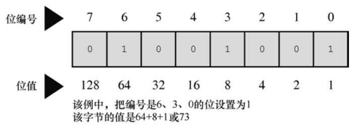
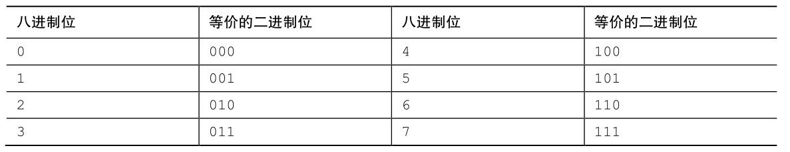
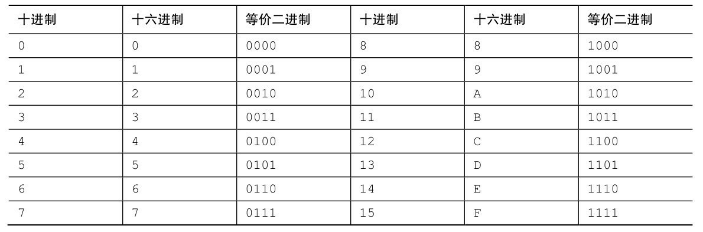
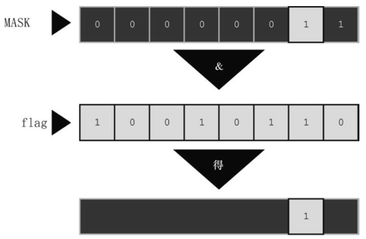
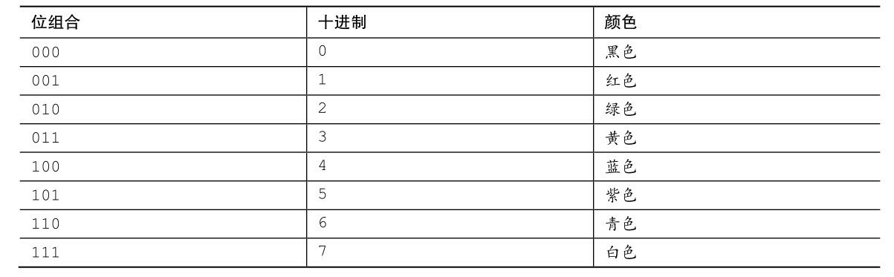
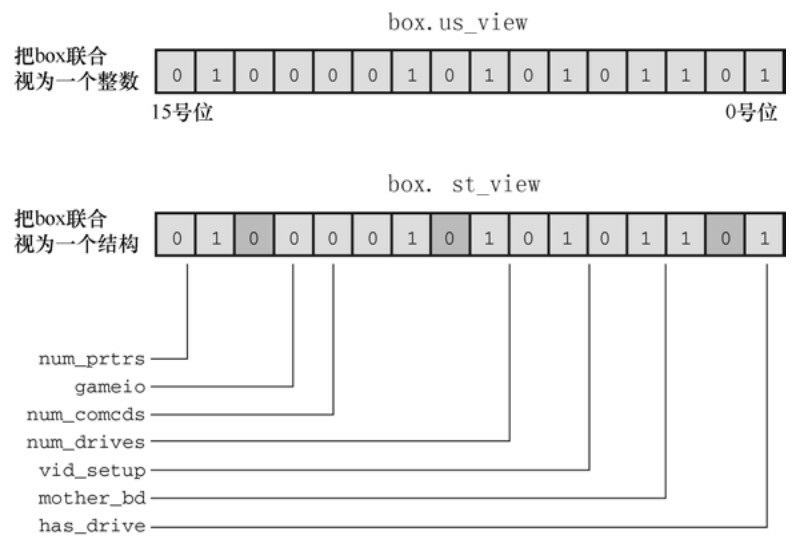
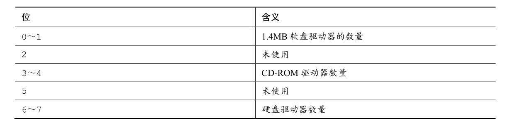
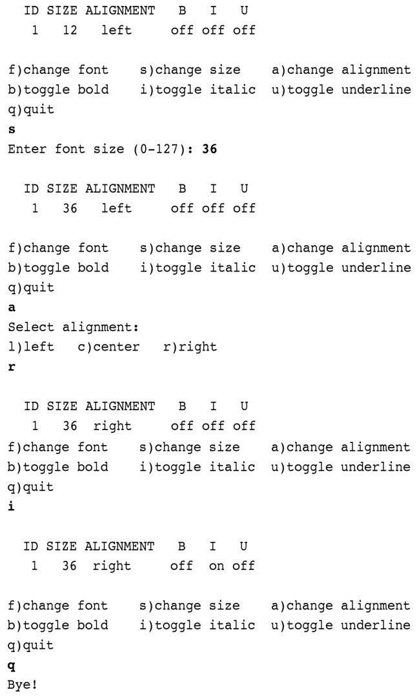

# 第15章 位操作
本章介绍以下内容：

* 运算符：～、&、|、^、
* <<、>>
* &=、|=、^=、>>=、<<=
* 二进制、十进制和十六进制记数法（复习）
* 处理一个值中的位的两个C工具：位运算符和位字段
* 关键字：_Alignas、_Alignof

在C语言中，可以单独操控变量中的位。读者可能好奇，竟然有人想这
样做。有时必须单独操控位，而且非常有用。例如，通常向硬件设备发送一
两个字节来控制这些设备，其中每个位（bit）都有特定的含义。另外，与
文件相关的操作系统信息经常被储存，通过使用特定位表明特定项。许多压
缩和加密操作都是直接处理单独的位。高级语言一般不会处理这级别的细
节，C 在提供高级语言便利的同时，还能在为汇编语言所保留的级别上工
作，这使其成为编写设备驱动程序和嵌入式代码的首选语言。

首先要介绍位、字节、二进制记数法和其他进制记数系统的一些背景知
识。

## 15.1 二进制数、位和字节
通常都是基于数字10来书写数字。例如2157的千位是2，百位是1，十位
是5，个位是7，可以写成：
```c
2×1000 + 1×100 + 5×10 + 7×1
```

注意，1000是10的立方（即3次幂），100是10的平方（即2次幂），10
是10的1次幂，而且10（以及任意正数）的0次幂是1。因此，2157也可以写
成：
```c
2×103+ 1×102+ 5×101+ 7×100
```

因为这种书写数字的方法是基于10的幂，所以称以10为基底书写2157。

姑且认为十进制系统得以发展是得益于我们都有10根手指。从某种意义
上看，计算机的位只有2根手指，因为它只能被设置为0或1，关闭或打开。
因此，计算机适用基底为2的数制系统。它用2的幂而不是10的幂。以2为基
底表示的数字被称为二进制数（binary number）。二进制中的2和十进制中
的10作用相同。例如，二进制数1101可表示为：
```c
1×23+ 1×22+ 0×21+ 1×20
```

以十进制数表示为：
```c
1×8 + 1×4 + 0×2 + 1×1 = 13
```

用二进制系统可以把任意整数（如果有足够的位）表示为0和1的组合。
由于数字计算机通过关闭和打开状态的组合来表示信息，这两种状态分别用
0和1来表示，所以使用这套数制系统非常方便。接下来，我们来学习二进制
系统如何表示1字节的整数。

### 15.1.1 二进制整数
通常，1字节包含8位。C语言用字节（byte）表示储存系统字符集所需
的大小，所以C字节可能是8位、9位、16位或其他值。不过，描述存储器芯
片和数据传输率中所用的字节指的是8位字节。为了简化起见，本章假设1字
节是8位（计算机界通常用八位组(octet)这个术语特指8位字节）。可以从左
往右给这8位分别编号为7～0。在1字节中，编号是7的位被称为高阶位
（high-order bit），编号是0的位被称为低阶位（low-order bit）。每 1位的
编号对应2的相应指数。因此，可以根据图15.1所示的例子理解字节。



这里，128是2的7次幂，以此类推。该字节能表示的最大数字是把所有
位都设置为1：11111111。这个二进制数的值是：
```c
128 + 64 + 32 + 16 + 8 + 4 + 2 + 1 = 255
```

而该字节最小的二进制数是00000000，其值为0。因此，1字节可储存0
～255范围内的数字，总共256个值。或者，通过不同的方式解释位组合
（bit pattern），程序可以用1字节储存-128～+127范围内的整数，总共还是
256个值。例如，通常unsigned char用1字节表示的范围是0～255，而signed
char用1字节表示的范围是-128～+127。

### 15.1.2 有符号整数
如何表示有符号整数取决于硬件，而不是C语言。也许表示有符号数最
简单的方式是用1位（如，高阶位）储存符号，只剩下7位表示数字本身（假
设储存在1字节中）。用这种符号量（sign-magnitude）表示法，10000001表
示−1，00000001表示1。因此，其表示范围是−127～+127。

这种方法的缺点是有两个0：+0和-0。这很容易混淆，而且用两个位组
合来表示一个值也有些浪费。

二进制补码（two’s-complement）方法避免了这个问题，是当今最常用
的系统。我们将以1字节为例，讨论这种方法。二进制补码用1字节中的后7
位表示0～127，高阶位设置为0。目前，这种方法和符号量的方法相同。另
外，如果高阶位是1，表示的值为负。这两种方法的区别在于如何确定负
值。从一个9位组合100000000（256的二进制形式）减去一个负数的位组
合，结果是该负值的量。例如，假设一个负值的位组合是 10000000，作为
一个无符号字节，该组合为表示 128；作为一个有符号值，该组合表示负值
（编码是 7的位为1），而且值为100000000-10000000，即
1000000（128）。因此，该数是-128（在符号量表示法中，该位组合表示
−0）。类似地，10000001 是−127，11111111 是−1。该方法可以表示−128～
+127范围内的数。

要得到一个二进制补码数的相反数，最简单的方法是反转每一位（即0
变为1，1变为0），然后加1。因为1是00000001，那么−1则是11111110+1，
或11111111。这与上面的介绍一致。

二进制反码（one’s-complement）方法通过反转位组合中的每一位形成
一个负数。例如，00000001是1，那么11111110是−1。这种方法也有一个
−0：11111111。该方法能表示-127～+127之间的数。

### 15.1.3 二进制浮点数
浮点数分两部分储存：二进制小数和二进制指数。下面我们将详细介
绍。

1. 二进制小数

一个普通的浮点数0.527，表示如下：
```c
5/10 + 2/100 + 7/1000
```

从左往右，各分母都是10的递增次幂。在二进制小数中，使用2的幂作
为分母，所以二进制小数.101表示为：
```c
1/2 + 0/4 + 1/8
```

用十进制表示法为：
```c
0.50 + 0.00 + 0.125
```

即是0.625。

许多分数（如，1/3）不能用十进制表示法精确地表示。与此类似，许
多分数也不能用二进制表示法准确地表示。实际上，二进制表示法只能精确
地表示多个1/2的幂的和。因此，3/4和7/8可以精确地表示为二进制小数，但
是1/3和2/5却不能。

2. 浮点数表示法

为了在计算机中表示一个浮点数，要留出若干位（因系统而异）储存二
进制分数，其他位储存指数。一般而言，数字的实际值是由二进制小数乘以
2的指定次幂组成。例如，一个浮点数乘以4，那么二进制小数不变，其指数
乘以2，二进制分数不变。如果一份浮点数乘以一个不是2的幂的数，会改变
二进制小数部分，如有必要，也会改变指数部分。

## 15.2 其他进制数
计算机界通常使用八进制记数系统和十六进制记数系统。因为8和16都
是2的幂，这些系统比十进制系统更接近计算机的二进制系统。

### 15.2.1 八进制
八进制（octal）是指八进制记数系统。该系统基于8的幂，用0～7表示
数字（正如十进制用0～9表示数字一样）。例如，八进制数451（在C中写
作0451）表示为：
```c
4×82+ 5×81+ 1×80= 297（十进制）
```

了解八进制的一个简单的方法是，每个八进制位对应3个二进制位。表
15.1列出了这种对应关系。这种关系使得八进制与二进制之间的转换很容
易。例如，八进制数0377的二进制形式是11111111。即，用111代替0377中
的最后一个7，再用111代替倒数第2个7，最后用011代替3，并舍去第1位的
0。这表明比0377大的八进制要用多个字节表示。这是八进制唯一不方便的
地方：一个3位的八进制数可能要用9位二进制数来表示。注意，将八进制数
转换为二进制形式时，不能去掉中间的0。例如，八进制数0173的二进制形
式是01111011，不是0111111。

表15.1 与八进制位等价的二进制位



### 15.2.2 十六进制
十六进制（hexadecimal或hex）是指十六进制记数系统。该系统基于16
的幂，用0～15表示数字。但是，由于没有单独的数（digit，即0～9这样单
独一位的数）表示10～15，所以用字母A～F来表示。例如，十六进制数
A3F（在C中写作0xA3F）表示为：
```c
10×162+3×161+ 15×160= 2623（十进制）
```

由于A表示10，F表示15。在C语言中，A～F既可用小写也可用大写。
因此，2623也可写作0xa3f。

每个十六进制位都对应一个4位的二进制数（即4个二进制位），那么两
个十六进制位恰好对应一个8位字节。第1个十六进制表示前4位，第2个十六
进制位表示后4位。因此，十六进制很适合表示字节值。

表15.2列出了各进制之间的对应关系。例如，十六进制值0xC2可转换为
11000010。相反，二进制值11010101可以看作是1101 0101，可转换为
0xD5。



介绍了位和字节的相关内容，接下来我们研究C用位和字节进行哪些操
作。C有两个操控位的工具。第 1 个工具是一套（6 个）作用于位的按位运
算符。第 2 个工具是字段（field）数据形式，用于访问 int中的位。下面将
简要介绍这些C的特性。

## 15.3 C按位运算符
C 提供按位逻辑运算符和移位运算符。在下面的例子中，为了方便读者
了解位的操作，我们用二进制记数法写出值。但是在实际的程序中不必这
样，用一般形式的整型变量或常量即可。例如，在程序中用25或031或
0x19，而不是00011001。另外，下面的例子均使用8位二进制数，从左往右
每位的编号为7～0。

### 15.3.1 按位逻辑运算符
4个按位逻辑运算符都用于整型数据，包括char。之所以叫作按位
（bitwise）运算，是因为这些操作都是针对每一个位进行，不影响它左右两
边的位。不要把这些运算符与常规的逻辑运算符（&&、||和！）混淆，常规
的逻辑运算符操作的是整个值。

1. 二进制反码或按位取反：～

一元运算符～把1变为0，把0变为1。如下例子所示：
```c
～(10011010) // 表达式
(01100101)  // 结果值
```

假设val的类型是unsigned char，已被赋值为2。在二进制中，00000010
表示2。那么，～val的值是11111101，即253。注意，该运算符不会改变val
的值，就像3 * val不会改变val的值一样， val仍然是2。但是，该运算符确实
创建了一个可以使用或赋值的新值：
```c
newval = ～val;
printf("%d", ～val);
```

如果要把val的值改为～val，使用下面这条语句：
```c
val = ～val;
```

2. 按位与：&

二元运算符&通过逐位比较两个运算对象，生成一个新值。对于每个
位，只有两个运算对象中相应的位都为1时，结果才为1（从真/假方面看，
只有当两个位都为真时，结果才为真）。因此，对下面的表达式求值：
```c
(10010011) & (00111101)  // 表达式
```

由于两个运算对象中编号为4和0的位都为1，得：
```c
(00010001)  // 结果值
```

C有一个按位与和赋值结合的运算符：&=。下面两条语句产生的最终结
果相同：
```c
val &= 0377;
val = val & 0377;
```

3. 按位或：|

二元运算符|，通过逐位比较两个运算对象，生成一个新值。对于每个
位，如果两个运算对象中相应的位为1，结果就为1（从真/假方面看，如果
两个运算对象中相应的一个位为真或两个位都为真，那么结果为真）。因
此，对下面的表达式求值：
```c
(10010011) | (00111101) // 表达式
```

除了编号为6的位，这两个运算对象的其他位至少有一个位为1，得：
```c
(10111111) // 结果值
```

C有一个按位或和赋值结合的运算符：|=。下面两条语句产生的最终作
用相同：
```c
val |= 0377;
val = val | 0377;
```

4. 按位异或：^

二元运算符^逐位比较两个运算对象。对于每个位，如果两个运算对象
中相应的位一个为1（但不是两个为1），结果为1（从真/假方面看，如果两
个运算对象中相应的一个位为真且不是两个为同为1，那么结果为真）。因
此，对下面表达式求值：
```c
(10010011) ^ (00111101) // 表达式
```

编号为0的位都是1，所以结果为0，得：
```c
(10101110)  // 结果值
```

C有一个按位异或和赋值结合的运算符：^=。下面两条语句产生的最终
作用相同：
```c
val ^= 0377;
val = val ^ 0377;
```

### 15.3.2 用法：掩码
按位与运算符常用于掩码（mask）。所谓掩码指的是一些设置为开
（1）或关（0）的位组合。要明白称其为掩码的原因，先来看通过&把一个
量与掩码结合后发生什么情况。例如，假设定义符号常量MASK为2 （即，
二进制形式为00000010），只有1号位是1，其他位都是0。下面的语句：
```c
flags = flags & MASK;
```

把flags中除1号位以外的所有位都设置为0，因为使用按位与运算符
（&）任何位与0组合都得0。1号位的值不变（如果1号位是1，那么 1&1得
1；如果 1号位是0，那么 0&1也得0）。这个过程叫作“使用掩码”，因为掩
码中的0隐藏了flags中相应的位。

可以这样类比：把掩码中的0看作不透明，1看作透明。表达式flags &
MASK相当于用掩码覆盖在flags的位组合上，只有MASK为1的位才可见（见
图15.2）。



用&=运算符可以简化前面的代码，如下所示：
```c
flags &= MASK;
```

下面这条语句是按位与的一种常见用法：
```c
ch &= 0xff; /* 或者 ch &= 0377; */
```

前面介绍过oxff的二进制形式是11111111，八进制形式是0377。这个掩
码保持ch中最后8位不变，其他位都设置为0。无论ch原来是8位、16位或是
其他更多位，最终的值都被修改为1个8位字节。在该例中，掩码的宽度为8位。

### 15.3.3 用法：打开位（设置位）
有时，需要打开一个值中的特定位，同时保持其他位不变。例如，一台
IBM PC 通过向端口发送值来控制硬件。例如，为了打开内置扬声器，必须
打开 1 号位，同时保持其他位不变。这种情况可以使用按位或运算符
（|）。

以上一节的flags和MASK（只有1号位为1）为例。下面的语句：
```c
flags = flags | MASK;
```

把flags的1号位设置为1，且其他位不变。因为使用|运算符，任何位与0
组合，结果都为本身；任何位与1组合，结果都为1。

例如，假设flags是00001111，MASK是10110110。下面的表达式：
```c
flags | MASK
```

即是：
```c
(00001111) | (10110110)  // 表达式
```

其结果为：
```c
(10111111)         // 结果值
```

MASK中为1的位，flags与其对应的位也为1。MASK中为0的位，flags与
其对应的位不变。

用|=运算符可以简化上面的代码，如下所示：
```c
flags |= MASK;
```

同样，这种方法根据MASK中为1的位，把flags中对应的位设置为1，其
他位不变。

### 15.3.4 用法：关闭位（清空位）
和打开特定的位类似，有时也需要在不影响其他位的情况下关闭指定的
位。假设要关闭变量flags中的1号位。同样，MASK只有1号位为1（即，打
开）。可以这样做：
```c
flags = flags & ～MASK;
```

由于MASK除1号位为1以外，其他位全为0，所以～MASK除1号位为0
以外，其他位全为1。使用&，任何位与1组合都得本身，所以这条语句保持
1号位不变，改变其他各位。另外，使用&，任何位与0组合都的0。所以无
论1号位的初始值是什么，都将其设置为0。

例如，假设flags是00001111，MASK是10110110。下面的表达式：
```c
flags & ～MASK
```

即是：
```c
(00001111) & ～(10110110) // 表达式
```

其结果为：
```c
(00001001)         // 结果值
```

MASK中为1的位在结果中都被设置（清空）为0。flags中与MASK为0的
位相应的位在结果中都未改变。

可以使用下面的简化形式：
```c
flags &= ～MASK;
```

### 15.3.5 用法：切换位
切换位指的是打开已关闭的位，或关闭已打开的位。可以使用按位异或
运算符（^）切换位。也就是说，假设b是一个位（1或0），如果b为1，则
1^b为0；如果b为0，则1^b为1。另外，无论b为1还是0，0^b均为b。因此，
如果使用^组合一个值和一个掩码，将切换该值与MASK为1的位相对应的
位，该值与MASK为0的位相对应的位不变。要切换flags中的1号位，可以使用
下面两种方法：
```c
flags = flags ^ MASK;
flags ^= MASK;
```

例如，假设flags是00001111，MASK是10110110。表达式：
```c
flags ^ MASK
```

即是：
```c
(00001111) ^ (10110110)  // 表达式
```

其结果为：
```c
(10111001)         // 结果值
```

flags中与MASK为1的位相对应的位都被切换了，MASK为0的位相对应
的位不变。


### 15.3.6 用法：检查位的值
前面介绍了如何改变位的值。有时，需要检查某位的值。例如，flags中
1号位是否被设置为1？不能这样直接比较flags和MASK：
```c
if (flags == MASK)
puts("Wow!"); /* 不能正常工作 */
```

这样做即使flags的1号位为1，其他位的值会导致比较结果为假。因此，
必须覆盖flags中的其他位，只用1号位和MASK比较：
```c
if ((flags & MASK) == MASK)
puts("Wow!");
```

由于按位运算符的优先级比==低，所以必须在flags & MASK周围加上
圆括号。

为了避免信息漏过边界，掩码至少要与其覆盖的值宽度相同。

### 15.3.7 移位运算符
下面介绍C的移位运算符。移位运算符向左或向右移动位。同样，我们
在示例中仍然使用二进制数，有助于读者理解其工作原理。

1. 左移：<<

左移运算符（<<）将其左侧运算对象每一位的值向左移动其右侧运算
对象指定的位数。左侧运算对象移出左末端位的值丢失，用0填充空出的位
置。下面的例子中，每一位都向左移动两个位置：
```c
(10001010) << 2  // 表达式
(00101000)    // 结果值
```

该操作产生了一个新的位值，但是不改变其运算对象。例如，假如stonk为1，那么stonk<<2为4，但是stonk本身不变，仍为1。可以使用左移赋
值运算符（<<=）来更改变量的值。该运算符将变量中的位向左移动其右侧
运算对象给定值的位数。如下例：
```c
int stonk = 1;
int onkoo;
onkoo = stonk << 2;  /* 把4赋给onkoo */
stonk <<= 2;     /* 把stonk的值改为4 */
```

2. 右移：>>

右移运算符（>>）将其左侧运算对象每一位的值向右移动其右侧运算
对象指定的位数。左侧运算对象移出右末端位的值丢。对于无符号类型，用
0 填充空出的位置；对于有符号类型，其结果取决于机器。空出的位置可用
0填充，或者用符号位（即，最左端的位）的副本填充：
```c
(10001010) >> 2    // 表达式，有符号值
(00100010)       // 在某些系统中的结果值
(10001010) >> 2    // 表达式，有符号值
(11100010)       // 在另一些系统上的结果值
```

下面是无符号值的例子：
```c
(10001010) >> 2    // 表达式，无符号值
(00100010)       // 所有系统都得到该结果值
```

每个位向右移动两个位置，空出的位用0填充。

右移赋值运算符（>>=）将其左侧的变量向右移动指定数量的位数。如
下所示：
```c
int sweet = 16;
int ooosw;
ooosw = sweet >> 3;  // ooosw = 2，sweet的值仍然为16
sweet >>=3;      // sweet的值为2
```

3. 用法：移位运算符

移位运算符针对2的幂提供快速有效的乘法和除法：
```c
number << n    number乘以2的n次幂
number >> n    如果number为非负，则用number除以2的n次幂
```

这些移位运算符类似于在十进制中移动小数点来乘以或除以10。

移位运算符还可用于从较大单元中提取一些位。例如，假设用一个
unsigned long类型的值表示颜色值，低阶位字节储存红色的强度，下一个字
节储存绿色的强度，第 3 个字节储存蓝色的强度。随后你希望把每种颜色的
强度分别储存在3个不同的unsigned char类型的变量中。那么，可以使用下面
的语句：
```c
#define BYTE_MASK 0xff
unsigned long color = 0x002a162f;
unsigned char blue, green, red;
red = color & BYTE_MASK;
green = (color >> 8) & BYTE_MASK;
blue = (color >> 16) & BYTE_MASK;
```

以上代码中，使用右移运算符将 8 位颜色值移动至低阶字节，然后使用
掩码技术把低阶字节赋给指定的变量。

### 15.3.8 编程示例
在第 9 章中，我们用递归的方法编写了一个程序，把数字转换为二进制形式（程序清单 9.8）。现在，要用移位运算符来解决相同的问题。程序清
单15.1中的程序，读取用户从键盘输入的整数，将该整数和一个字符串地址
传递给itobs()函数（itobs表示interger to binary string，即整数转换成二进制字
符串）。然后，该函数使用移位运算符计算出正确的1和0的组合，并将其放
入字符串中。

程序清单15.1 binbit.c程序
```c
/* binbit.c -- 使用位操作显示二进制 */
#include <stdio.h>
#include <limits.h> // 提供 CHAR_BIT 的定义，CHAR_BIT 表示每字节的位数
char * itobs(int, char *);
void show_bstr(const char *);
int main(void)
{
char bin_str[CHAR_BIT * sizeof(int) + 1];
int number;
puts("Enter integers and see them in binary.");
puts("Non-numeric input terminates program.");
while (scanf("%d", &number) == 1)
{
itobs(number, bin_str);
printf("%d is ", number);
show_bstr(bin_str);
putchar('\n');
}
puts("Bye!");
return 0;
}
char * itobs(int n, char * ps)
{
int i;
const static int size = CHAR_BIT * sizeof(int);
for (i = size - 1; i >= 0; i--, n >>= 1)
ps[i] = (01 & n) + '0';
ps[size] = '\0';
return ps;
}
/*4位一组显示二进制字符串 */
void show_bstr(const char * str)
{
int i = 0;
while (str[i]) /* 不是一个空字符 */
{
putchar(str[i]);
if (++i % 4 == 0 && str[i])
putchar(' ');
}
}
```

程序清单15.1使用limits.h中的CHAR_BIT宏，该宏表示char中的位数。
sizeof运算符返回char的大小，所以表达式CHAE_BIT * sizeof(int)表示int类型
的位数。bin_str数组的元素个数是CHAE_BIT * sizeof(int) + 1，留出一个位置
给末尾的空字符。

itobs()函数返回的地址与传入的地址相同，可以把该函数作为printf()的
参数。在该函数中，首次执行for循环时，对01 & n求值。01是一个八进制形
式的掩码，该掩码除0号位是1之外，其他所有位都为0。因此，01 & n就是n
最后一位的值。该值为0或1。但是对数组而言，需要的是字符'0'或字符'1'。
该值加上'0'即可完成这种转换（假设按顺序编码的数字，如 ASCII）。其结
果存放在数组中倒数第2个元素中（最后一个元素用来存放空字符）。

顺带一提，用1 & n或01 & n都可以。我们用八进制1而不是十进制1，只
是为了更接近计算机的表达方式。

然后，循环执行i--和n >>= 1。i--移动到数组的前一个元素，n >>= 1使n
中的所有位向右移动一个位置。进入下一轮迭代时，循环中处理的是n中新
的最右端的值。然后，把该值储存在倒数第3个元素中，以此类推。itobs()
函数用这种方式从右往左填充数组。

可以使用printf()或puts()函数显示最终的字符串，但是程序清单15.1中定
义了show_bstr()函数，以4位一组打印字符串，方便阅读。

下面的该程序的运行示例：
```c
Enter integers and see them in binary.
Non-numeric input terminates program.
7
7 is 0000 0000 0000 0000 0000 0000 0000 0111
2013
2013 is 0000 0000 0000 0000 0000 0111 1101 1101
-1
-1 is 1111 1111 1111 1111 1111 1111 1111 1111
32123
32123 is 0000 0000 0000 0000 0111 1101 0111 1011
q
Bye!
```

### 15.3.9 另一个例子
我们来看另一个例子。这次要编写的函数用于切换一个值中的后 n 位，
待处理值和 n 都是函数的参数。

～运算符切换一个字节的所有位，而不是选定的少数位。但是，^运算
符（按位异或）可用于切换单个位。假设创建了一个掩码，把后n位设置为1，其余位设置为0。然后使用^组合掩码和待切换的值便可切换该值的最后n
位，而且其他位不变。方法如下：
```c
int invert_end(int num, int bits)
{
int mask = 0;
int bitval = 1;
while (bits–– > 0)
{
mask |= bitval;
bitval <<= 1;
}
return num ^ mask;
}
```

while循环用于创建所需的掩码。最初，mask的所有位都为0。第1轮循
环将mask的0号位设置为1。然后第2轮循环将mask的1号位设置为1，以此类
推。循环bits次，mask的后bits位就都被设置为1。最后，num ^ mask运算即得
所需的结果。

我们把这个函数放入前面的程序中，测试该函数。如程序清单15.2所
示。

程序清单15.2 invert4.c程序
```c
/* invert4.c -- 使用位操作显示二进制 */
#include <stdio.h>
#include <limits.h>
char * itobs(int, char *);
void show_bstr(const char *);
int invert_end(int num, int bits);
int main(void)
{
char bin_str[CHAR_BIT * sizeof(int) + 1];
int number;
puts("Enter integers and see them in binary.");
puts("Non-numeric input terminates program.");
while (scanf("%d", &number) == 1)
{
itobs(number, bin_str);
printf("%d is\n", number);
show_bstr(bin_str);
putchar('\n');
number = invert_end(number, 4);
printf("Inverting the last 4 bits gives\n");
show_bstr(itobs(number, bin_str));
putchar('\n');
}
puts("Bye!");
return 0;
}
char * itobs(int n, char * ps)
{
int i;
const static int size = CHAR_BIT * sizeof(int);
for (i = size - 1; i >= 0; i--, n >>= 1)
ps[i] = (01 & n) + '0';
ps[size] = '\0';
return ps;
}
/* 以4位为一组，显示二进制字符串 */
void show_bstr(const char * str)
{
int i = 0;
while (str[i]) /* 不是空字符 */
{
putchar(str[i]);
if (++i % 4 == 0 && str[i])
putchar(' ');
}
}
int invert_end(int num, int bits)
{
int mask = 0;
int bitval = 1;
while (bits-- > 0)
{
mask |= bitval;
bitval <<= 1;
}
return num ^ mask;
}
```

下面是该程序的一个运行示例：
```c
Enter integers and see them in binary.
Non-numeric input terminates program.
7
7 is
0000 0000 0000 0000 0000 0000 0000 0111
Inverting the last 4 bits gives
0000 0000 0000 0000 0000 0000 0000 1000
12541
12541 is
0000 0000 0000 0000 0011 0000 1111 1101
Inverting the last 4 bits gives
0000 0000 0000 0000 0011 0000 1111 0010
q
Bye!
```

## 15.4 位字段
操控位的第2种方法是位字段（bit field）。位字段是一个signed int或
unsigned int类型变量中的一组相邻的位（C99和C11新增了_Bool类型的位字
段）。位字段通过一个结构声明来建立，该结构声明为每个字段提供标签，
并确定该字段的宽度。例如，下面的声明建立了一个4个1位的字段：
```c
struct {
unsigned int autfd : 1;
unsigned int bldfc : 1;
unsigned int undln : 1;
unsigned int itals : 1;
} prnt;
```

根据该声明，prnt包含4个1位的字段。现在，可以通过普通的结构成员
运算符（.）单独给这些字段赋值：
```c
prnt.itals = 0;
prnt.undln = 1;
```

由于每个字段恰好为1位，所以只能为其赋值1或0。变量prnt被储存在
int大小的内存单元中，但是在本例中只使用了其中的4位。

带有位字段的结构提供一种记录设置的方便途径。许多设置（如，字体
的粗体或斜体）就是简单的二选一。例如，开或关、真或假。如果只需要使
用 1 位，就不需要使用整个变量。内含位字段的结构允许在一个存储单元中
储存多个设置。

有时，某些设置也有多个选择，因此需要多位来表示。这没问题，字段
不限制 1 位大小。可以使用如下的代码：
```c
struct {
unsigned int code1 : 2;
unsigned int code2 : 2;
unsigned int code3 : 8;
} prcode;
```

以上代码创建了两个2位的字段和一个8位的字段。可以这样赋值：
```c
prcode.code1 = 0;
prcode.code2 = 3;
prcode.code3 = 102;
```

但是，要确保所赋的值不超出字段可容纳的范围。

如果声明的总位数超过了一个unsigned int类型的大小会怎样？会用到下
一个unsigned int类型的存储位置。一个字段不允许跨越两个unsigned int之间
的边界。编译器会自动移动跨界的字段，保持unsigned int的边界对齐。一旦
发生这种情况，第1个unsigned int中会留下一个未命名的“洞”。

可以用未命名的字段宽度“填充”未命名的“洞”。使用一个宽度为0的未
命名字段迫使下一个字段与下一个整数对齐：
```c
struct {
unsigned int field1  : 1 ;
unsigned int      : 2 ;
unsigned int field2  : 1 ;
unsigned int      : 0 ;
unsigned int field3  : 1 ;
} stuff;
```

这里，在stuff.field1和stuff.field2之间，有一个2位的空隙；stuff.field3将
储存在下一个unsigned int中。

字段储存在一个int中的顺序取决于机器。在有些机器上，存储的顺序是
从左往右，而在另一些机器上，是从右往左。另外，不同的机器中两个字段
边界的位置也有区别。由于这些原因，位字段通常都不容易移植。尽管如
此，有些情况却要用到这种不可移植的特性。例如，以特定硬件设备所用的
形式储存数据。

### 15.4.1 位字段示例
通常，把位字段作为一种更紧凑储存数据的方式。例如，假设要在屏幕
上表示一个方框的属性。为简化问题，我们假设方框具有如下属性：

* 方框是透明的或不透明的；
* 方框的填充色选自以下调色板：黑色、红色、绿色、黄色、蓝色、紫色、青色或白色；
* 边框可见或隐藏；
* 边框颜色与填充色使用相同的调色板；
* 边框可以使用实线、点线或虚线样式。

可以使用单独的变量或全长（full-sized）结构成员来表示每个属性，但
是这样做有些浪费位。例如，只需1位即可表示方框是透明还是不透明；只
需1位即可表示边框是显示还是隐藏。8种颜色可以用3位单元的8个可能的值
来表示，而3种边框样式也只需2位单元即可表示。总共10位就足够表示方框
的5个属性设置。

一种方案是：一个字节储存方框内部（透明和填充色）的属性，一个字
节储存方框边框的属性，每个字节中的空隙用未命名字段填充。struct
box_props声明如下：
```c
struct box_props {
bool opaque         : 1 ;
unsigned int fill_color  : 3 ;
unsigned int        : 4 ;
bool show_border      : 1 ;
unsigned int border_color : 3 ;
unsigned int border_style : 2 ;
unsigned int        : 2 ;
};
```

加上未命名的字段，该结构共占用 16 位。如果不使用填充，该结构占
用 10 位。但是要记住，C 以unsigned int作为位字段结构的基本布局单元。
因此，即使一个结构唯一的成员是1位字段，该结构的大小也是一个unsigned
int类型的大小，unsigned int在我们的系统中是32位。另外，以上代码假设
C99新增的_Bool类型可用，在stdbool.h中，bool是_Bool的别名。

对于opaque成员，1表示方框不透明，0表示透明。show_border成员也
用类似的方法。对于颜色，可以用简单的RGB（即red-green-blue的缩写）表
示。这些颜色都是三原色的混合。显示器通过混合红、绿、蓝像素来产生不
同的颜色。在早期的计算机色彩中，每个像素都可以打开或关闭，所以可以
使用用 1 位来表示三原色中每个二进制颜色的亮度。常用的顺序是，左侧位
表示蓝色亮度、中间位表示绿色亮度、右侧位表示红色亮度。表15.3列出了
这8种可能的组合。fill_color成员和border_color成员可以使用这些组合。最
后，border_style成员可以使用0、1、2来表示实线、点线和虚线样式。



程序清单15.3中的程序使用box_props结构，该程序用#define创建供结构
成员使用的符号常量。注意，只打开一位即可表示三原色之一。其他颜色用
三原色的组合来表示。例如，紫色由打开的蓝色位和红色位组成，所以，紫
色可表示为BLUE|RED。

程序清单15.3 fields.c程序
```c
/* fields.c -- 定义并使用字段 */
#include <stdio.h>
#include <stdbool.h>  // C99定义了bool、true、false
/* 线的样式 */
#define SOLID  0
#define DOTTED 1
#define DASHED 2
/* 三原色 */
#define BLUE  4
#define GREEN  2
#define RED  1
/* 混合色 */
#define BLACK  0
#define YELLOW (RED | GREEN)
#define MAGENTA (RED | BLUE)
#define CYAN  (GREEN | BLUE)
#define WHITE  (RED | GREEN | BLUE)
const char * colors[8] = { "black", "red", "green", "yellow",
"blue", "magenta", "cyan", "white" };
struct box_props {
bool opaque : 1;    // 或者 unsigned int （C99以前）
unsigned int fill_color : 3;
unsigned int : 4;
bool show_border : 1; // 或者 unsigned int （C99以前）
unsigned int border_color : 3;
unsigned int border_style : 2;
unsigned int : 2;
};
void show_settings(const struct box_props * pb);
int main(void)
{
/* 创建并初始化 box_props 结构 */
struct box_props box = { true, YELLOW, true, GREEN, DASHED };
printf("Original box settings:\n");
show_settings(&box);
box.opaque = false;
box.fill_color = WHITE;
box.border_color = MAGENTA;
box.border_style = SOLID;
printf("\nModified box settings:\n");
show_settings(&box);
return 0;
}
void show_settings(const struct box_props * pb)
{
printf("Box is %s.\n",
pb->opaque == true ? "opaque" : "transparent");
printf("The fill color is %s.\n", colors[pb->fill_color]);
printf("Border %s.\n",
pb->show_border == true ? "shown" : "not shown");
printf("The border color is %s.\n", colors[pb->border_color]);
printf("The border style is ");
switch (pb->border_style)
{
case SOLID: printf("solid.\n"); break;
case DOTTED: printf("dotted.\n"); break;
case DASHED: printf("dashed.\n"); break;
default:   printf("unknown type.\n");
}
}
```

下面是该程序的输出：
```c
Original box settings:
Box is opaque.
The fill color is yellow.
Border shown.
The border color is green.
The border style is dashed.
Modified box settings:
Box is transparent.
The fill color is white.
Border shown.
The border color is magenta.
The border style is solid.
```

该程序要注意几个要点。首先，初始化位字段结构与初始化普通结构的
语法相同：
```c
struct box_props box = {YES, YELLOW , YES, GREEN, DASHED};
```

类似地，也可以给位字段成员赋值：
```c
box.fill_color = WHITE;
```

另外，switch语句中也可以使用位字段成员，甚至还可以把位字段成员
用作数组的下标：
```c
printf("The fill color is %s.\n", colors[pb->fill_color]);
```

注意，根据 colors 数组的定义，每个索引对应一个表示颜色的字符串，
而每种颜色都把索引值作为该颜色的数值。例如，索引1对应字符串"red"，
枚举常量red的值是1。

### 15.4.2 位字段和按位运算符
在同类型的编程问题中，位字段和按位运算符是两种可替换的方法，用
哪种方法都可以。例如，前面的例子中，使用和unsigned int类型大小相同的
结构储存图形框的信息。也可使用unsigned int变量储存相同的信息。如果不
想用结构成员表示法来访问不同的部分，也可以使用按位运算符来操作。一
般而言，这种方法比较麻烦。接下来，我们来研究这两种方法（程序中使用
了这两种方法，仅为了解释它们的区别，我们并不鼓励这样做）。

可以通过一个联合把结构方法和位方法放在一起。假定声明了 struct
box_props 类型，然后这样声明联合：
```c
union Views /* 把数据看作结构或unsigned short类型的变量 */
{
struct box_props st_view;
unsigned short us_view;
};
```

在某些系统中，unsigned int和box_props类型的结构都占用16 位内存。
但是，在其他系统中（例如我们使用的系统），unsigned int和box_props都是
32位。无论哪种情况，通过联合，都可以使用 st_view 成员把一块内存看作
是一个结构，或者使用 us_view 成员把相同的内存块看作是一个unsigned
short。结构的哪一个位字段与unsigned short中的哪一位对应？这取决于实现
和硬件。下面的程序示例假设从字节的低阶位端到高阶位端载入结构。也就
是说，结构中的第 1 个位字段对应计算机字的0号位（为简化起见，图15.3
以16位单元演示了这种情况）。



程序清单15.4使用Views联合来比较位字段和按位运算符这两种方法。
在该程序中，box是View联合，所以box.st_view是一个使用位字段的
box_props类型的结构，box.us_view把相同的数据看作是一个unsigned short
类型的变量。联合只允许初始化第1 个成员，所以初始化值必须与结构相匹
配。该程序分别通过两个函数显示 box 的属性，一个函数接受一个结构，一
个函数接受一个 unsigned short 类型的值。这两种方法都能访问数据，但是
所用的技术不同。该程序还使用了本章前面定义的itobs()函数，以二进制字
符串形式显示数据，以便读者查看每个位的开闭情况。

程序清单15.4 dualview.c程序
```c
/* dualview.c -- 位字段和按位运算符 */
#include <stdio.h>
#include <stdbool.h>
#include <limits.h>
/* 位字段符号常量 */
/* 边框线样式  */
#define SOLID   0
#define DOTTED  1
#define DASHED  2
/* 三原色 */
#define BLUE   4
#define GREEN   2
#define RED    1
/* 混合颜色 */
#define BLACK   0
#define YELLOW  (RED | GREEN)
#define MAGENTA  (RED | BLUE)
#define CYAN   (GREEN | BLUE)
#define WHITE   (RED | GREEN | BLUE)
/* 按位方法中用到的符号常量 */
#define OPAQUE     0x1
#define FILL_BLUE   0x8
#define FILL_GREEN   0x4
#define FILL_RED    0x2
#define FILL_MASK   0xE
#define BORDER     0x100
#define BORDER_BLUE  0x800
#define BORDER_GREEN  0x400
#define BORDER_RED0x 200
#define BORDER_MASK  0xE00
#define B_SOLID    0
#define B_DOTTED    0x1000
#define B_DASHED    0x2000
#define STYLE_MASK0x 3000
const char * colors[8] = { "black", "red", "green", "yellow", "blue",
"magenta",
"cyan", "white" };
struct box_props {
bool opaque         : 1;
unsigned int fill_color  : 3;
unsigned int        : 4;
bool show_border      : 1;
unsigned int border_color : 3;
unsigned int border_style : 2;
unsigned int        : 2;
};
union Views /* 把数据看作结构或unsigned short类型的变量 */
{
struct box_props st_view;
unsigned short us_view;
};
void show_settings(const struct box_props * pb);
void show_settings1(unsigned short);
char * itobs(int n, char * ps);
int main(void)
{
/* 创建Views联合，并初始化initialize struct box view */
union Views box = { { true, YELLOW, true, GREEN, DASHED } };
char bin_str[8 * sizeof(unsigned int) + 1];
printf("Original box settings:\n");
show_settings(&box.st_view);
printf("\nBox settings using unsigned int view:\n");
show_settings1(box.us_view);
printf("bits are %s\n",
itobs(box.us_view, bin_str));
box.us_view &= ～FILL_MASK;        /* 把表示填充色的位
清0 */
box.us_view |= (FILL_BLUE | FILL_GREEN);  /* 重置填充色 */
box.us_view ^= OPAQUE;          /* 切换是否透明的位 */
box.us_view |= BORDER_RED;        /* 错误的方法 */
box.us_view &= ～STYLE_MASK;        /* 把样式的位清0 */
box.us_view |= B_DOTTED;         /* 把样式设置为点 */
printf("\nModified box settings:\n");
show_settings(&box.st_view);
printf("\nBox settings using unsigned int view:\n");
show_settings1(box.us_view);
printf("bits are %s\n",
itobs(box.us_view, bin_str));
return 0;
}
void show_settings(const struct box_props * pb)
{
printf("Box is %s.\n",
pb->opaque == true ? "opaque" : "transparent");
printf("The fill color is %s.\n", colors[pb->fill_color]);
printf("Border %s.\n",
pb->show_border == true ? "shown" : "not shown");
printf("The border color is %s.\n", colors[pb->border_color]);
printf("The border style is ");
switch (pb->border_style)
{
case SOLID: printf("solid.\n"); break;
case DOTTED: printf("dotted.\n"); break;
case DASHED: printf("dashed.\n"); break;
default:   printf("unknown type.\n");
}
}
void show_settings1(unsigned short us)
{
printf("box is %s.\n",
(us & OPAQUE) == OPAQUE ? "opaque" : "transparent");
printf("The fill color is %s.\n",
colors[(us >> 1) & 07]);
printf("Border %s.\n",
(us & BORDER) == BORDER ? "shown" : "not shown");
printf("The border style is ");
switch (us & STYLE_MASK)
{
case B_SOLID : printf("solid.\n"); break;
case B_DOTTED : printf("dotted.\n"); break;
case B_DASHED : printf("dashed.\n"); break;
default    : printf("unknown type.\n");
}
printf("The border color is %s.\n",
colors[(us >> 9) & 07]);
}
char * itobs(int n, char * ps)
{
int i;
const static int size = CHAR_BIT * sizeof(int);
for (i = size - 1; i >= 0; i--, n >>= 1)
ps[i] = (01 & n) + '0';
ps[size] = '\0';
return ps;
}
```

下面是该程序的输出：
```c
Original box settings:
Box is opaque.
The fill color is yellow.
Border shown.
The border color is green.
The border style is dashed.
Box settings using unsigned int view:
box is opaque.
The fill color is yellow.
Border shown.
The border style is dashed.
The border color is green.
bits are 00000000000000000010010100000111
Modified box settings:
Box is transparent.
The fill color is cyan.
Border shown.
The border color is yellow.
The border style is dotted.
Box settings using unsigned int view:
box is transparent.
The fill color is cyan.
Border not shown.
The border style is dotted.
The border color is yellow.
bits are 00000000000000000001011100001100
```

这里要讨论几个要点。位字段视图和按位视图的区别是，按位视图需要
位置信息。例如，程序中使用BLUE表示蓝色，该符号常量的数值为4。但
是，由于结构排列数据的方式，实际储存蓝色设置的是3号位（位的编号从0
开始，参见图15.1），而且储存边框为蓝色的设置是11号位。因此，该程序
定义了一些新的符号常量：
```c
#define FILL_BLUE   0x8
#define BORDER_BLUE  0x800
```

这里，0x8是3号位为1时的值，0x800是11号位为1时的值。可以使用第1
个符号常量设置填充色的蓝色位，用第2个符号常量设置边框颜色的蓝色
位。用十六进制记数法更容易看出要设置二进制的哪一位，由于十六进制的
每一位代表二进制的4位，那么0x8的位组合是1000，而0x800的位组合是
10000000000，0x800的位组合比0x8后面多8个0。但是以等价的十进制来看
就没那么明显，0x8是8，0x800是2048。

如果值是2的幂，那么可以使用左移运算符来表示值。例如，可以用下
面的#define分别替换上面的#define：
```c
#define FILL_BLUE   1<<3
#define BORDER_BLUE  1<<11
```

这里，<<的右侧是2的指数，也就是说，0x8是23，0x800是211。同样，
表达式1<<n指的是第n位为1的整数。1<<11是常量表达式，在编译时求值。

可以使用枚举代替#defined创建符号常量。例如，可以这样做：
```c
enum { OPAQUE = 0x1, FILL_BLUE = 0x8, FILL_GREEN = 0x4, FILL_RED= 0x2,
FILL_MASK = 0xE, BORDER = 0x100, BORDER_BLUE = 0x800,
BORDER_GREEN = 0x400, BORDER_RED = 0x200, BORDER_MASK =
0xE00,
B_DOTTED = 0x1000, B_DASHED = 0x2000, STYLE_MASK = 0x3000};
```

如果不想创建枚举变量，就不用在声明中使用标记。

注意，按位运算符改变设置更加复杂。例如，要设置填充色为青色。只
打开蓝色位和绿色位是不够的：
```c
box.us_view |= (FILL_BLUE | FILL_GREEN); /* 重置填充色 */
```

问题是该颜色还依赖于红色位的设置。如果已经设置了该位（比如对于
黄色），这行代码保留了红色位的设置，而且还设置了蓝色位和绿色位，结
果是产生白色。解决这个问题最简单的方法是在设置新值前关闭所有的颜色
位。因此，程序中使用了下面两行代码：
```c
box.us_view &= ～FILL_MASK;        /* 把表示填充色的位
清0 */
box.us_view |= (FILL_BLUE | FILL_GREEN);  /* 重置填充色 */
```

如果不先关闭所有的相关位，程序中演示了这种情况：
```c
box.us_view |= BORDER_RED;   /* 错误的方法 */
```

因为BORDER_GREEN位已经设置过了，所以结果颜色是
BORDER_GREEN | BORDER_RED，被解释为黄色。

这种情况下，位字段版本更简单：
```c
box.st_view.fill_color = CYAN; /*等价的位字段方法 */
```

这种方法不用先清空所有的位。而且，使用位字段成员时，可以为边框
和框内填充色使用相同的颜色值。但是用按位运算符的方法则要使用不同的
值（这些值反映实际位的位置）。

其次，比较下面两个打印语句：
```c
printf("The border color is %s.\n", colors[pb->border_color]);
printf("The border color is %s.\n", colors[(us >> 9) & 07]);
```

第1条语句中，表达式pb->border_color的值在0～7的范围内，所以该表
达式可用作colors数组的索引。用按位运算符获得相同的信息更加复杂。一
种方法是使用ui>>9把边框颜色右移至最右端（0号位～2号位），然后把该
值与掩码07组合，关闭除了最右端3位以外所有的位。这样结果也在0～7的
范围内，可作为colors数组的索引。

警告

位字段和位的位置之间的相互对应因实现而异。例如，在早期的
Macintosh PowerPC上运行程序清单15.4，输出如下：
```c
Original box settings:
Box is opaque.
The fill color is yellow.
Border shown.
The border color is green.
The border style is dashed.
Box settings using unsigned int view:
box is transparent.
The fill color is black.
Border not shown.
The border style is solid.
The border color is black.
bits are 10110000101010000000000000000000
Modified box settings:
Box is opaque.
The fill color is yellow.
Border shown.
The border color is green.
The border style is dashed.
Box settings using unsigned int view:
box is opaque.
The fill color is cyan.
Border shown.
The border style is dotted.
The border color is red.
bits are 10110000101010000001001000001101
```

该输出的二进制位与程序示例15.4不同，Macintosh PowerPC把结构载入
内存的方式不同。特别是，它把第1位字段载入最高阶位，而不是最低阶
位。所以结构表示法储存在前16位（与PC中的顺序不同），而unsigned int表
示法则储存在后16位。因此，对于Macintosh，程序清单15.4中关于位的位置
的假设是错误的，使用按位运算符改变透明设置和填充色设置时，也弄错了
位。

## 15.5 对齐特性（C11）
C11 的对齐特性比用位填充字节更自然，它们还代表了C在处理硬件相
关问题上的能力。在这种上下文中，对齐指的是如何安排对象在内存中的位
置。例如，为了效率最大化，系统可能要把一个 double 类型的值储存在4 字
节内存地址上，但却允许把char储存在任意地址。大部分程序员都对对齐不
以为然。但是，有些情况又受益于对齐控制。例如，把数据从一个硬件位置
转移到另一个位置，或者调用指令同时操作多个数据项。

_Alignof运算符给出一个类型的对齐要求，在关键字_Alignof后面的圆括
号中写上类型名即可：
```c
size_t d_align = _Alignof(float);
```

假设d_align的值是4，意思是float类型对象的对齐要求是4。也就是说，
4是储存该类型值相邻地址的字节数。一般而言，对齐值都应该是2的非负整
数次幂。较大的对齐值被称为stricter或stronger，较小的对齐值被称为
weaker。

可以使用_Alignas 说明符指定一个变量或类型的对齐值。但是，不应该
要求该值小于基本对齐值。例如，如果float类型的对齐要求是4，不要请求
其对齐值是1或2。该说明符用作声明的一部分，说明符后面的圆括号内包含
对齐值或类型：
```c
_Alignas(double) char c1;
_Alignas(8) char c2;
unsigned char _Alignas(long double) c_arr[sizeof(long double)];
```

注意

撰写本书时，Clang（3.2版本）要求_Alignas(type)说明符在类型说明符
后面，如上面第3行代码所示。但是，无论_Alignas(type)说明符在类型说明
符的前面还是后面，GCC 4.7.3都能识别，后来Clang 3.3 版本也支持了这两
种顺序。

程序清单15.5中的程序演示了_Alignas和_Alignof的用法。

程序清单15.5 align.c程序
```c
// align.c -- 使用 _Alignof 和 _Alignas （C11）
#include <stdio.h>
int main(void)
{
double dx;
char ca;
char cx;
double dz;
char cb;
char _Alignas(double) cz;
printf("char alignment:  %zd\n", _Alignof(char));
printf("double alignment: %zd\n", _Alignof(double));
printf("&dx: %p\n", &dx);
printf("&ca: %p\n", &ca);
printf("&cx: %p\n", &cx);
printf("&dz: %p\n", &dz);
printf("&cb: %p\n", &cb);
printf("&cz: %p\n", &cz);
return 0;
}
```

该程序的输出如下：
```c
char alignment: 1
double alignment: 8
&dx: 0x7fff5fbff660
&ca: 0x7fff5fbff65f
&cx: 0x7fff5fbff65e
&dz: 0x7fff5fbff650
&cb: 0x7fff5fbff64f
&cz: 0x7fff5fbff648
```

在我们的系统中，double的对齐值是8，这意味着地址的类型对齐可以
被8整除。以0或8结尾的十六进制地址可被8整除。这就是地址常用两个
double类型的变量和char类型的变量cz（该变量是double对齐值）。因为char
的对齐值是1，对于普通的char类型变量，编译器可以使用任何地址。

在程序中包含 stdalign.h 头文件后，就可以把 alignas 和 alignof 分别作为
_Alignas 和_Alignof的别名。这样做可以与C++关键字匹配。

C11在stdlib.h库还添加了一个新的内存分配函数，用于对齐动态分配的
内存。该函数的原型如下：
```c
void *aligned_alloc(size_t alignment, size_t size);
```

第1个参数代表指定的对齐，第2个参数是所需的字节数，其值应是第1
个参数的倍数。与其他内存分配函数一样，要使用free()函数释放之前分配
的内存。

## 15.6 关键概念
C 区别于许多高级语言的特性之一是访问整数中单独位的能力。该特性
通常是与硬件设备和操作系统交互的关键。

C有两种访问位的方法。一种方法是通过按位运算符，另一种方法是在
结构中创建位字段。

C11新增了检查内存对齐要求的功能，而且可以指定比基本对齐值更大
的对齐值。

通常（但不总是），使用这些特性的程序仅限于特定的硬件平台或操作
系统，而且设计为不可移植的。

## 15.7 本章小结
计算硬件与二进制记数系统密不可分，因为二进制数的1和0可用于表示
计算机内存和寄存器中位的开闭状态。虽然C不允许以二进制形式书写数
字，但是它识别与二进制相关的八进制和十六进制记数法。正如每个二进制
数字表示1位一样，每个八进制位代表3位，每个十六进制位代表4位。这种
关系使得二进制转为八进制或十六进制较为简单。

C 提供多种按位运算符，之所以称为按位是因为它们单独操作一个值中
的每个位。～运算符将其运算对象的每一位取反，将1转为0，0转为1。按位
与运算符（&）通过两个运算对象形成一个值。如果两运算对象中相同号位
都为1，那么该值中对应的位为1；否则，该位为0。按位或运算符（|）同样
通过两个运算对象形成一个值。如果两运算对象中相同号位有一个为1或都
为1，那么该值中对应的位为1；否则，该位为0。按位异或运算符（^）也有
类似的操作，只有两运算对象中相同号位有一个为1时，结果值中对应的位
才为1。

C还有左移（<<）和右移（>>）运算符。这两个运算符使位组合中的所
有位都向左或向右移动指定数量的位，以形成一个新值。对于左移运算符，
空出的位置设为 0。对于右移运算符，如果是无符号类型的值，空出的位设
为0；如果是有符号类型的值，右移运算符的行为取决于实现。

可以在结构中使用位字段操控一个值中的单独位或多组位。具体细节因
实现而异。

可以使用_Alignas强制执行数据存储区上的对齐要求。

这些位工具帮助C程序处理硬件问题，因此它们通常用于依赖实现的场
合中。

## 15.8 复习题
复习题的参考答案在附录A中。

1. 把下面的十进制转换为二进制：
```c
a.3
b.13
c.59
d.119
```

2. 将下面的二进制值转换为十进制、八进制和十六进制的形式：
```c
a.00010101
b.01010101
c.01001100
d.10011101
```

3. 对下面的表达式求值，假设每个值都为8位：
```c
a.～3
b.3 & 6
c.3 | 6
d.1 | 6
e.3 ^ 6
f.7 >> 1
g.7 << 2
```

4. 对下面的表达式求值，假设每个值都为8位：
```c
a.～0
b.!0
c.2 & 4
d.2 && 4
e.2 | 4
f.2 || 4
g.5 << 3
```

5. 因为ASCII码只使用最后7位，所以有时需要用掩码关闭其他位，其相
应的二进制掩码是什么？分别用十进制、八进制和十六进制来表示这个掩
码。

6. 程序清单15.2中，可以把下面的代码：
```c
while (bits-- > 0)
{
mask |= bitval;
bitval <<= 1;
}
```

替换成：
```c
while (bits-- > 0)
{
mask += bitval;
bitval *= 2;
}
```

程序照常工作。这是否意味着*=2等同于<<=1？+=是否等同于|=？

7. a.Tinkerbell计算机有一个硬件字节可读入程序。该字节包含以下信
息：



Tinkerbell和IBM PC一样，从右往左填充结构位字段。创建一个适合存
放这些信息的位字段模板。

b.Klinkerbell与Tinkerbell类似，但是它从左往右填充结构位字段。请为
Klinkerbell创建一个相应的位字段模板。

## 15.9 编程练习
1. 编写一个函数，把二进制字符串转换为一个数值。例如，有下面的语
句：
```c
char * pbin = "01001001";
```

那么把pbin作为参数传递给该函数后，它应该返回一个int类型的值25。

2. 编写一个程序，通过命令行参数读取两个二进制字符串，对这两个二
进制数使用～运算符、&运算符、|运算符和^运算符，并以二进制字符串形
式打印结果（如果无法使用命令行环境，可以通过交互式让程序读取字符
串）。

3. 编写一个函数，接受一个 int 类型的参数，并返回该参数中打开位的
数量。在一个程序中测试该函数。

4. 编写一个程序，接受两个int类型的参数：一个是值；一个是位的位
置。如果指定位的位置为1，该函数返回1；否则返回0。在一个程序中测试
该函数。

5. 编写一个函数，把一个 unsigned int 类型值中的所有位向左旋转指定数
量的位。例如，rotate_l(x, 4)把x中所有位向左移动4个位置，而且从最左端
移出的位会重新出现在右端。也就是说，把高阶位移出的位放入低阶位。在
一个程序中测试该函数。

6. 设计一个位字段结构以储存下面的信息。
```c
字体ID：0～255之间的一个数；
字体大小：0～127之间的一个数；
对齐：0～2之间的一个数，表示左对齐、居中、右对齐；
加粗：开（1）或闭（0）；
斜体：开（1）或闭（0）；
```

在一个程序中使用该结构来打印字体参数，并使用循环菜单来让用户改
变参数。例如，该程序的一个运行示例如下：



该程序要使用按位与运算符（&）和合适的掩码来把字体ID和字体大小
信息转换到指定的范围内。

7. 编写一个与编程练习 6 功能相同的程序，使用 unsigned long 类型的变
量储存字体信息，并且使用按位运算符而不是位成员来管理这些信息。


