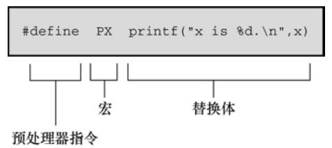
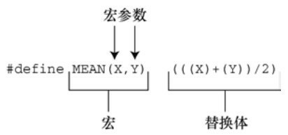
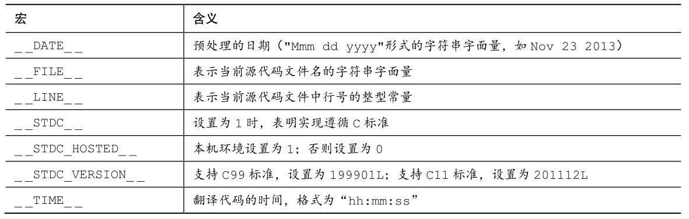
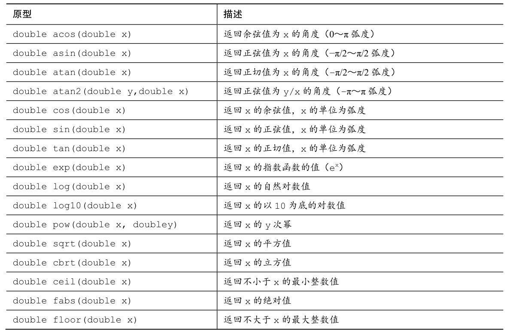
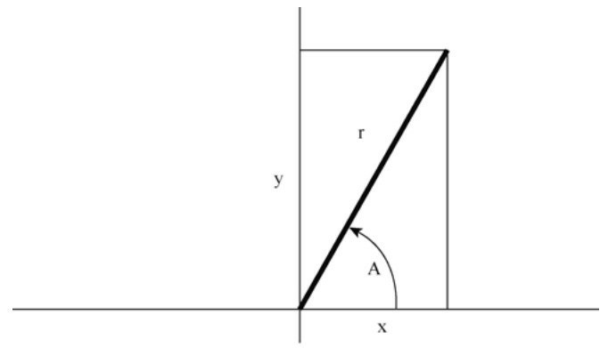

# 第16章 C预处理器和C库
本章介绍以下内容：

* 预处理指令：#define、#include、#ifdef、#else、#endif、#ifndef、#if、#elif、#line、#error、#pragma
* 关键字：_Generic、_Noreturn、_Static_assert
* 函数/宏：sqrt()、atan()、atan2()、exit()、atexit()、assert()、memcpy()、memmove()、va_start()、va_arg()、va_copy()、va_end()
* C预处理器的其他功能
* 通用选择表达式
* 内联函数
* C库概述和一些特殊用途的方便函数

C语言建立在适当的关键字、表达式、语句以及使用它们的规则上。然
而，C标准不仅描述C语言，还描述如何执行C预处理器、C标准库有哪些函
数，以及详述这些函数的工作原理。本章将介绍C预处理器和C库，我们先
从C预处理器开始。

C预处理器在程序执行之前查看程序（故称之为预处理器）。根据程序
中的预处理器指令，预处理器把符号缩写替换成其表示的内容。预处理器可
以包含程序所需的其他文件，可以选择让编译器查看哪些代码。预处理器并
不知道 C。基本上它的工作是把一些文本转换成另外一些文本。这样描述预
处理器无法体现它的真正效用和价值，我们将在本章举例说明。前面的程序
示例中也有很多#define和#include的例子。下面，我们先总结一下已学过的
预处理指令，再介绍一些新的知识点。

## 16.1 翻译程序的第一步
在预处理之前，编译器必须对该程序进行一些翻译处理。首先，编译器
把源代码中出现的字符映射到源字符集。该过程处理多字节字符和三字符序
列——字符扩展让C更加国际化（详见附录B“参考资料VII，扩展字符支
持”）。

第二，编译器定位每个反斜杠后面跟着换行符的实例，并删除它们。也
就是说，把下面两个物理行（physical line）：
```c
printf("That's wond\
erful!\n");
```

转换成一个逻辑行（logical line）：
```c
printf("That's wonderful\n!");
```

注意，在这种场合中，“换行符”的意思是通过按下Enter键在源代码文件
中换行所生成的字符，而不是指符号表征\n。

由于预处理表达式的长度必须是一个逻辑行，所以这一步为预处理器做
好了准备工作。一个逻辑行可以是多个物理行。

第三，编译器把文本划分成预处理记号序列、空白序列和注释序列（记
号是由空格、制表符或换行符分隔的项，详见16.2.1）。这里要注意的是，
编译器将用一个空格字符替换每一条注释。因此，下面的代码：
```c
int/* 这看起来并不像一个空格*/fox;
```

将变成：
```c
int fox;
```

而且，实现可以用一个空格替换所有的空白字符序列（不包括换行
符）。最后，程序已经准备好进入预处理阶段，预处理器查找一行中以#号
开始的预处理指令。

## 16.2 明示常量：#define
#define预处理器指令和其他预处理器指令一样，以#号作为一行的开
始。ANSI和后来的标准都允许#号前面有空格或制表符，而且还允许在#和
指令的其余部分之间有空格。但是旧版本的C要求指令从一行最左边开始，
而且#和指令其余部分之间不能有空格。指令可以出现在源文件的任何地
方，其定义从指令出现的地方到该文件末尾有效。我们大量使用#define指令
来定义明示常量（manifest constant）（也叫做符号常量），但是该指令还有
许多其他用途。程序清单16.1演示了#define指令的一些用法和属性。

预处理器指令从#开始运行，到后面的第1个换行符为止。也就是说，指
令的长度仅限于一行。然而，前面提到过，在预处理开始前，编译器会把多
行物理行处理为一行逻辑行。

程序清单16.1 preproc.c程序
```c
/* preproc.c -- 简单的预处理示例 */
#include <stdio.h>
#define TWO 2   /* 可以使用注释 */
#define OW "Consistency is the last refuge of the unimagina\
tive.- Oscar Wilde" /* 反斜杠把该定义延续到下一行 */
#define FOUR TWO*TWO
#define PX printf("X is %d.\n", x)
#define FMT "X is %d.\n"
int main(void)
{
int x = TWO;
PX;
x = FOUR;
printf(FMT, x);
printf("%s\n", OW);
printf("TWO: OW\n");
return 0;
}
```

每行#define（逻辑行）都由3部分组成。第1部分是#define指令本身。第
2部分是选定的缩写，也称为宏。有些宏代表值（如本例），这些宏被称为
类对象宏（object-like macro）。C 语言还有类函数宏（function-like
macro），稍后讨论。宏的名称中不允许有空格，而且必须遵循C变量的命
名规则：只能使用字符、数字和下划线（_）字符，而且首字符不能是数
字。第3部分（指令行的其余部分）称为替换列表或替换体（见图16.1）。
一旦预处理器在程序中找到宏的示实例后，就会用替换体代替该宏（也有例
外，稍后解释）。从宏变成最终替换文本的过程称为宏展开（macro
expansion）。注意，可以在#define行使用标准C注释。如前所述，每条注释
都会被一个空格代替。



运行该程序示例后，输出如下:
```c
X is 2.
X is 4.
Consistency is the last refuge of the unimaginative.- Oscar Wilde
TWO: OW
```

下面分析具体的过程。下面的语句：
```c
int x = TWO;
```

变成了：
```c
int x = 2;
```

2代替了TWO。而语句：
```c
PX;
```

变成了：
```c
printf("X is %d.\n", x);
```

这里同样进行了替换。这是一个新用法，到目前为止我们只是用宏来表
示明示常量。从该例中可以看出，宏可以表示任何字符串，甚至可以表示整
个 C 表达式。但是要注意，虽然 PX 是一个字符串常量，它只打印一个名为
x的变量。

下一行也是一个新用法。读者可能认为FOUR被替换成4，但是实际的
过程是：
```c
x = FOUR;
```

变成了：
```c
x = TWO*TWO;
```

即是：
```c
x = 2*2;
```

宏展开到此处为止。由于编译器在编译期对所有的常量表达式（只包含
常量的表达式）求值，所以预处理器不会进行实际的乘法运算，这一过程在
编译时进行。预处理器不做计算，不对表达式求值，它只进行替换。

注意，宏定义还可以包含其他宏（一些编译器不支持这种嵌套功能）。

程序中的下一行：
```c
printf (FMT, x);
```

变成了：
```c
printf("X is %d.\n",x);
```

相应的字符串替换了 FMT。如果要多次使用某个冗长的字符串，这种
方法比较方便。另外，也可以用下面的方法：
```c
const char * fmt = "X is %d.\n";
```

然后可以把fmt作为printf()的格式字符串。

下一行中，用相应的字符串替换OW。双引号使替换的字符串成为字符
串常量。编译器把该字符串储存在以空字符结尾的数组中。因此，下面的指
令定义了一个字符常量：
```c
#define HAL 'Z'
```

而下面的指令则定义了一个字符串（Z\0）：
```c
#define HAP "Z"
```

在程序示例16.1中，我们在一行的结尾加一个反斜杠字符使该行扩展至
下一行：
```c
#define OW "Consistency is the last refuge of the unimagina\
tive.- Oscar Wilde"
```

注意，第2行要与第1行左对齐。如果这样做：
```c
#define OW "Consistency is the last refuge of the unimagina\
tive.- Oscar Wilde"
```

那么输出的内容是：
```c
Consistency is the last refuge of the unimagina tive.- Oscar Wilde
```

第2行开始到tive之间的空格也算是字符串的一部分。

一般而言，预处理器发现程序中的宏后，会用宏等价的替换文本进行替
换。如果替换的字符串中还包含宏，则继续替换这些宏。唯一例外的是双引
号中的宏。因此，下面的语句：
```c
printf("TWO: OW");
```

打印的是TWO: OW，而不是打印：
```c
2: Consistency is the last refuge of the unimaginative.- Oscar Wilde
```

要打印这行，应该这样写：
```c
printf("%d: %s\n", TWO, OW);
```

这行代码中，宏不在双引号内。

那么，何时使用字符常量？对于绝大部分数字常量，应该使用字符常
量。如果在算式中用字符常量代替数字，常量名能更清楚地表达该数字的含
义。如果是表示数组大小的数字，用符号常量后更容易改变数组的大小和循
环次数。如果数字是系统代码（如，EOF），用符号常量表示的代码更容易
移植（只需改变EOF的定义）。助记、易更改、可移植，这些都是符号常量
很有价值的特性。

C语言现在也支持const关键字，提供了更灵活的方法。用const可以创建
在程序运行过程中不能改变的变量，可具有文件作用域或块作用域。另一方
面，宏常量可用于指定标准数组的大小和const变量的初始值。
```c
#define LIMIT 20
const int LIM = 50;
static int data1[LIMIT];    // 有效
static int data2[LIM];     // 无效
const int LIM2 = 2 * LIMIT;  // 有效
const int LIM3 = 2 * LIM;   // 无效
```

这里解释一下上面代码中的“无效”注释。在C中，非自动数组的大小应
该是整型常量表达式，这意味着表示数组大小的必须是整型常量的组合（如
5）、枚举常量和sizeof表达式，不包括const声明的值（这也是C++和C的区
别之一，在C++中可以把const值作为常量表达式的一部分）。但是，有的实
现可能接受其他形式的常量表达式。例如，GCC 4.7.3不允许data2的声明，
但是Clang 4.6允许。

### 16.2.1 记号
从技术角度来看，可以把宏的替换体看作是记号（token）型字符串，
而不是字符型字符串。C预处理器记号是宏定义的替换体中单独的“词”。用
空白把这些词分开。例如：
```c
#define FOUR 2*2
```

该宏定义有一个记号：2*2序列。但是，下面的宏定义中：
```c
#define SIX 2 * 3
```

有3个记号：2、*、3。

替换体中有多个空格时，字符型字符串和记号型字符串的处理方式不
同。考虑下面的定义：
```c
#define EIGHT 4 * 8
```

如果预处理器把该替换体解释为字符型字符串，将用4 * 8替换EIGHT。
即，额外的空格是替换体的一部分。如果预处理器把该替换体解释为记号型
字符串，则用3个的记号4 * 8（分别由单个空格分隔）来替换EIGHT。换而
言之，解释为字符型字符串，把空格视为替换体的一部分；解释为记号型字
符串，把空格视为替换体中各记号的分隔符。在实际应用中，一些C编译器
把宏替换体视为字符串而不是记号。在比这个例子更复杂的情况下，两者的
区别才有实际意义。

顺带一提，C编译器处理记号的方式比预处理器复杂。由于编译器理解
C语言的规则，所以不要求代码中用空格来分隔记号。例如，C编译器可以
把2*2直接视为3个记号，因为它可以识别2是常量，*是运算符。

### 16.2.2 重定义常量
假设先把LIMIT定义为20，稍后在该文件中又把它定义为25。这个过程
称为重定义常量。不同的实现采用不同的重定义方案。除非新定义与旧定义
相同，否则有些实现会将其视为错误。另外一些实现允许重定义，但会给出
警告。ANSI标准采用第1种方案，只有新定义和旧定义完全相同才允许重定
义。

具有相同的定义意味着替换体中的记号必须相同，且顺序也相同。因
此，下面两个定义相同：
```c
#define SIX 2 * 3
#define SIX 2 * 3
```

这两条定义都有 3 个相同的记号，额外的空格不算替换体的一部分。而
下面的定义则与上面两条宏定义不同：
```c
#define SIX 2*3
```

这条宏定义中只有一个记号，因此与前两条定义不同。如果需要重定义
宏，使用#undef 指令（稍后讨论）。

如果确实需要重定义常量，使用const关键字和作用域规则更容易些。

## 16.3 在#define中使用参数
在#define中使用参数可以创建外形和作用与函数类似的类函数宏。带有
参数的宏看上去很像函数，因为这样的宏也使用圆括号。类函数宏定义的圆
括号中可以有一个或多个参数，随后这些参数出现在替换体中，如图16.2所
示。



下面是一个类函数宏的示例：
```c
#define SQUARE(X) X*X
```

在程序中可以这样用：
```c
z = SQUARE(2);
```

这看上去像函数调用，但是它的行为和函数调用完全不同。程序清单
16.2演示了类函数宏和另一个宏的用法。该示例中有一些陷阱，请读者仔细
阅读序。

程序清单16.2 mac_arg.c程序
```c
/* mac_arg.c -- 带参数的宏 */
#include <stdio.h>
#define SQUARE(X) X*X
#define PR(X)  printf("The result is %d.\n", X)
int main(void)
{
int x = 5;
int z;
printf("x = %d\n", x);
z = SQUARE(x);
printf("Evaluating SQUARE(x): ");
PR(z);
z = SQUARE(2);
printf("Evaluating SQUARE(2): ");
PR(z);
printf("Evaluating SQUARE(x+2): ");
PR(SQUARE(x + 2));
printf("Evaluating 100/SQUARE(2): ");
PR(100 / SQUARE(2));
printf("x is %d.\n", x);
printf("Evaluating SQUARE(++x): ");
PR(SQUARE(++x));
printf("After incrementing, x is %x.\n", x);
return 0;
}
```

SQUARE宏的定义如下：
```c
#define SQUARE(X) X*X
```

这里，SQUARE 是宏标识符，SQUARE(X)中的 X 是宏参数，X*X 是替
换列表。程序清单 16.2 中出现SQUARE(X)的地方都会被X*X替换。这与前
面的示例不同，使用该宏时，既可以用X，也可以用其他符号。宏定义中的
X由宏调用中的符号代替。因此，SQUARE(2)替换为2*2，X实际上起到参数
的作用。

然而，稍后你将看到，宏参数与函数参数不完全相同。下面是程序的输
出。注意有些内容可能与我们的预期不符。实际上，你的编译器输出甚至与
下面的结果完全不同。
```c
x = 5
Evaluating SQUARE(x): The result is 25.
Evaluating SQUARE(2): The result is 4.
Evaluating SQUARE(x+2): The result is 17.
Evaluating 100/SQUARE(2): The result is 100.
x is 5.
Evaluating SQUARE(++x): The result is 42.
After incrementing, x is 7.
```

前两行与预期相符，但是接下来的结果有点奇怪。程序中设置x的值为
5，你可能认为SQUARE(x+2)应该是 7*7，即 49。但是，输出的结果是 17，
这不是一个平方值！导致这样结果的原因是，我们前面提到过，预处理器不
做计算、不求值，只替换字符序列。预处理器把出现x的地方都替换成x+2。
因此，x*x变成了x+2*x+2。如果x为5，那么该表达式的值为：
```c
5+2*5+2 = 5 + 10 + 2 = 17
```

该例演示了函数调用和宏调用的重要区别。函数调用在程序运行时把参
数的值传递给函数。宏调用在编译之前把参数记号传递给程序。这两个不同
的过程发生在不同时期。是否可以修改宏定义让SQUARE(x+2)得36？当然
可以，要多加几个圆括号：
```c
#define SQUARE(x) (x)*(x)
```

现在SQUARE(x+2)变成了(x+2)*(x+2)，在替换字符串中使用圆括号就得
到符合预期的乘法运算。

但是，这并未解决所有的问题。下面的输出行：
```c
100/SQUARE(2)
```

将变成：
```c
100/2*2
```

根据优先级规则，从左往右对表达式求值：(100/2)*2，即50*2，得
100。把SQUARE(x)定义为下面的形式可以解决这种混乱：
```c
#define SQUARE(x) (x*x)
```

这样修改定义后得100/(2*2)，即100/4，得25。

要处理前面的两种情况，要这样定义：
```c
#define SQUARE(x) ((x)*(x))
```

因此，必要时要使用足够多的圆括号来确保运算和结合的正确顺序。

尽管如此，这样做还是无法避免程序中最后一种情况的问题。
SQUARE(++x)变成了++x*++x，递增了两次x，一次在乘法运算之前，一次
在乘法运算之后：
```c
++x*++x = 6*7 = 42
```

由于标准并未对这类运算规定顺序，所以有些编译器得 7*6。而有些编
译器可能在乘法运算之前已经递增了x，所以7*7得49。在C标准中，对该表
达式求值的这种情况称为未定义行为。无论哪种情况，x的开始值都是5，虽
然从代码上看只递增了一次，但是x的最终值是7。

解决这个问题最简单的方法是，避免用++x 作为宏参数。一般而言，不
要在宏中使用递增或递减运算符。但是，++x可作为函数参数，因为编译器
会对++x求值得5后，再把5传递给函数。

### 16.3.1 用宏参数创建字符串：#运算符
下面是一个类函数宏：
```c
#define PSQR(X) printf("The square of X is %d.\n", ((X)*(X)));
```

假设这样使用宏：
```c
PSQR(8);
```

输出为：
```c
The square of X is 64.
```

注意双引号字符串中的X被视为普通文本，而不是一个可被替换的记
号。

C允许在字符串中包含宏参数。在类函数宏的替换体中，#号作为一个
预处理运算符，可以把记号转换成字符串。例如，如果x是一个宏形参，那
么#x就是转换为字符串"x"的形参名。这个过程称为字符串化
（stringizing）。程序清单16.3演示了该过程的用法。

程序清单16.3 subst.c程序
```c
/* subst.c -- 在字符串中替换 */
#include <stdio.h>
#define PSQR(x) printf("The square of " #x " is %d.\n",((x)*(x)))
int main(void)
{
int y = 5;
PSQR(y);
PSQR(2 + 4);
return 0;
}
```

该程序的输出如下：
```c
The square of y is 25.
The square of 2 + 4 is 36.
```

调用第1个宏时，用"y"替换#x。调用第2个宏时，用"2 + 4"替换#x。
ANSI C字符串的串联特性将这些字符串与printf()语句的其他字符串组合，生
成最终的字符串。例如，第1次调用变成：
```c
printf("The square of " "y" " is %d.\n",((y)*(y)));
```

然后，字符串串联功能将这3个相邻的字符串组合成一个字符串：
```c
"The square of y is %d.\n"
```

### 16.3.2 预处理器黏合剂：##运算符
与#运算符类似，##运算符可用于类函数宏的替换部分。而且，##还可
用于对象宏的替换部分。##运算符把两个记号组合成一个记号。例如，可以
这样做：
```c
#define XNAME(n) x ## n
```

然后，宏XNAME(4)将展开为x4。程序清单16.4演示了##作为记号粘合
剂的用法。

程序清单16.4 glue.c程序
```c
// glue.c -- 使用##运算符
#include <stdio.h>
#define XNAME(n) x ## n
#define PRINT_XN(n) printf("x" #n " = %d\n", x ## n);
int main(void)
{
int XNAME(1) = 14;   // 变成 int x1 = 14;
int XNAME(2) = 20;  // 变成 int x2 = 20;
int x3 = 30;
PRINT_XN(1);      // 变成 printf("x1 = %d\n", x1);
PRINT_XN(2);      // 变成 printf("x2 = %d\n", x2);
PRINT_XN(3);      // 变成 printf("x3 = %d\n", x3);
return 0;
}
```

该程序的输出如下：
```c
x1 = 14
x2 = 20
x3 = 30
```

注意，PRINT_XN()宏用#运算符组合字符串，##运算符把记号组合为一
个新的标识符。

### 16.3.3 变参宏：...和_ _VA_ARGS_ _
一些函数（如 printf()）接受数量可变的参数。stdvar.h 头文件（本章后
面介绍）提供了工具，让用户自定义带可变参数的函数。C99/C11也对宏提
供了这样的工具。虽然标准中未使用“可变”（variadic）这个词，但是它已
成为描述这种工具的通用词（虽然，C标准的索引添加了字符串化
(stringizing)词条，但是，标准并未把固定参数的函数或宏称为固定函数和不
变宏）。

通过把宏参数列表中最后的参数写成省略号（即，3个点...）来实现这
一功能。这样，预定义宏

_ _VA_ARGS_ _可用在替换部分中，表明省略号代表什么。例如，下面
的定义：
```c
#define PR(...) printf(_ _VA_ARGS_ _)
```

假设稍后调用该宏：
```c
PR("Howdy");
PR("weight = %d, shipping = $%.2f\n", wt, sp);
```

对于第1次调用，_ _VA_ARGS_ _展开为1个参数："Howdy"。

对于第2次调用，_ _VA_ARGS_ _展开为3个参数："weight = %d,
shipping = $%.2f\n"、wt、sp。

因此，展开后的代码是：
```c
printf("Howdy");
printf("weight = %d, shipping = $%.2f\n", wt, sp);
```

程序清单16.5演示了一个示例，该程序使用了字符串的串联功能和#运
算符。

程序清单16.5 variadic.c程序
```c
// variadic.c -- 变参宏
#include <stdio.h>
#include <math.h>
#define PR(X, ...) printf("Message " #X ": " __VA_ARGS__)
int main(void)
{
double x = 48;
double y;
y = sqrt(x);
PR(1, "x = %g\n", x);
PR(2, "x = %.2f, y = %.4f\n", x, y);
return 0;
}
```

第1个宏调用，X的值是1，所以#X变成"1"。展开后成为：
```c
print("Message " "1" ": " "x = %g\n", x);
```

然后，串联4个字符，把调用简化为：
```c
print("Message 1: x = %g\n", x);
```

下面是该程序的输出：
```c
Message 1: x = 48
Message 2: x = 48.00, y = 6.9282
```

记住，省略号只能代替最后的宏参数：
```c
#define WRONG(X, ..., Y) #X #_ _VA_ARGS_ _ #y //不能这样做
```

## 16.4 宏和函数的选择
有些编程任务既可以用带参数的宏完成，也可以用函数完成。应该使用
宏还是函数？这没有硬性规定，但是可以参考下面的情况。

使用宏比使用普通函数复杂一些，稍有不慎会产生奇怪的副作用。一些
编译器规定宏只能定义成一行。不过，即使编译器没有这个限制，也应该这
样做。

宏和函数的选择实际上是时间和空间的权衡。宏生成内联代码，即在程
序中生成语句。如果调用20次宏，即在程序中插入20行代码。如果调用函数
20次，程序中只有一份函数语句的副本，所以节省了空间。然而另一方面，
程序的控制必须跳转至函数内，随后再返回主调程序，这显然比内联代码花
费更多的时间。

宏的一个优点是，不用担心变量类型（这是因为宏处理的是字符串，而
不是实际的值）。因此，只要能用int或float类型都可以使用SQUARE(x)宏。

C99提供了第3种可替换的方法——内联函数。本章后面将介绍。

对于简单的函数，程序员通常使用宏，如下所示：
```c
#define MAX(X,Y) ((X) > (Y) ? (X) : (Y))
#define ABS(X) ((X) < 0 ? -(X) : (X))
#define ISSIGN(X) ((X) == '+' || (X) == '-' ? 1 : 0)
```

（如果x是一个代数符号字符，最后一个宏的值为1，即为真。）

要注意以下几点。

记住宏名中不允许有空格，但是在替换字符串中可以有空格。ANSI C
允许在参数列表中使用空格。

用圆括号把宏的参数和整个替换体括起来。这样能确保被括起来的部分
在下面这样的表达式中正确地展开：
```c
forks = 2 * MAX(guests + 3, last);
```

用大写字母表示宏函数的名称。该惯例不如用大写字母表示宏常量应用
广泛。但是，大写字母可以提醒程序员注意，宏可能产生的副作用。

如果打算使用宏来加快程序的运行速度，那么首先要确定使用宏和使用
函数是否会导致较大差异。在程序中只使用一次的宏无法明显减少程序的运
行时间。在嵌套循环中使用宏更有助于提高效率。许多系统提供程序分析器
以帮助程序员压缩程序中最耗时的部分。

假设你开发了一些方便的宏函数，是否每写一个新程序都要重写这些
宏？如果使用#include指令，就不用这样做了。

## 16.5 文件包含：#include
当预处理器发现#include 指令时，会查看后面的文件名并把文件的内容
包含到当前文件中，即替换源文件中的#include指令。这相当于把被包含文
件的全部内容输入到源文件#include指令所在的位置。#include指令有两种形
式：
```c
#include <stdio.h>     ←文件名在尖括号中
#include "mystuff.h"   ←文件名在双引号中
```

在 UNIX 系统中，尖括号告诉预处理器在标准系统目录中查找该文件。
双引号告诉预处理器首先在当前目录中（或文件名中指定的其他目录）查找
该文件，如果未找到再查找标准系统目录：
```c
#include <stdio.h>     ←查找系统目录
#include "hot.h"      ←查找当前工作目录
#include "/usr/biff/p.h" ←查找/usr/biff目录
```

集成开发环境（IDE）也有标准路径或系统头文件的路径。许多集成开
发环境提供菜单选项，指定用尖括号时的查找路径。在 UNIX 中，使用双引
号意味着先查找本地目录，但是具体查找哪个目录取决于编译器的设定。有
些编译器会搜索源代码文件所在的目录，有些编译器则搜索当前的工作目
录，还有些搜索项目文件所在的目录。

ANSI C不为文件提供统一的目录模型，因为不同的计算机所用的系统
不同。一般而言，命名文件的方法因系统而异，但是尖括号和双引号的规则
与系统无关。

为什么要包含文件？因为编译器需要这些文件中的信息。例如，stdio.h
文件中通常包含EOF、NULL、getchar()和 putchar()的定义。getchar()和
putchar()被定义为宏函数。此外，该文件中还包含C的其他I/O函数。

C语言习惯用.h后缀表示头文件，这些文件包含需要放在程序顶部的信
息。头文件经常包含一些预处理器指令。有些头文件（如stdio.h）由系统提
供，当然你也可以创建自己的头文件。

包含一个大型头文件不一定显著增加程序的大小。在大部分情况下，头
文件的内容是编译器生成最终代码时所需的信息，而不是添加到最终代码中
的材料。

### 16.5.1 头文件示例
假设你开发了一个存放人名的结构，还编写了一些使用该结构的函数。
可以把不同的声明放在头文件中。程序清单16.6演示了一个这样的例子。

程序清单16.6 names_st.h头文件
```c
// names_st.h -- names_st 结构的头文件
// 常量
#include <string.h>
#define SLEN 32
// 结构声明
struct names_st
{
char first[SLEN];
char last[SLEN];
};
// 类型定义
typedef struct names_st names;
// 函数原型
void get_names(names *);
void show_names(const names *);
char * s_gets(char * st, int n);
```

该头文件包含了一些头文件中常见的内容：#define指令、结构声明、
typedef和函数原型。注意，这些内容是编译器在创建可执行代码时所需的信
息，而不是可执行代码。为简单起见，这个特殊的头文件过于简单。通常，
应该用#ifndef和#define防止多重包含头文件。我们稍后介绍这些内容。

可执行代码通常在源代码文件中，而不是在头文件中。例如，程序清单
16.7中有头文件中函数原型的定义。该程序包含了names_st.h头文件，所以
编译器知道names类型。

程序清单16.7 name_st.c源文件
```c
// names_st.c -- 定义 names_st.h中的函数
#include <stdio.h>
#include "names_st.h"  // 包含头文件
// 函数定义
void get_names(names * pn)
{
printf("Please enter your first name: ");
s_gets(pn->first, SLEN);
printf("Please enter your last name: ");
s_gets(pn->last, SLEN);
}
void show_names(const names * pn)
{
printf("%s %s", pn->first, pn->last);
}
char * s_gets(char * st, int n)
{
char * ret_val;
char * find;
ret_val = fgets(st, n, stdin);
if (ret_val)
{
find = strchr(st, '\n');  // 查找换行符
if (find)          // 如果地址不是NULL，
*find = '\0';     // 在此处放置一个空字符
else
while (getchar() != '\n')
continue;   // 处理输入行中的剩余字符
}
return ret_val;
}
```

get_names()函数通过s_gets()函数调用了fgets()函数，避免了目标数组溢
出。程序清单16.8使用了程序清单16.6的头文件和程序清单16.7的源文件。

程序清单16.8 useheader.c程序
```c
// useheader.c -- 使用 names_st 结构
#include <stdio.h>
#include "names_st.h"
// 记住要链接 names_st.c
int main(void)
{
names candidate;
get_names(&candidate);
printf("Let's welcome ");
show_names(&candidate);
printf(" to this program!\n");
return 0;
}
```

下面是该程序的输出：
```c
Please enter your first name: Ian
Please enter your last name: Smersh
Let's welcome Ian Smersh to this program!
```

该程序要注意下面几点。

两个源代码文件都使用names_st类型结构，所以它们都必须包含
names_st.h头文件。

必须编译和链接names_st.c和useheader.c源代码文件。

声明和指令放在nems_st.h头文件中，函数定义放在names_st.c源代码文
件中。

### 16.5.2 使用头文件
浏览任何一个标准头文件都可以了解头文件的基本信息。头文件中最常
用的形式如下。

明示常量——例如，stdio.h中定义的EOF、NULL和BUFSIZE（标准I/O
缓冲区大小）。

宏函数——例如，getc(stdin)通常用getchar()定义，而getc()经常用于定
义较复杂的宏，头文件ctype.h通常包含ctype系列函数的宏定义。

函数声明——例如，string.h头文件（一些旧的系统中是strings.h）包含
字符串函数系列的函数声明。在ANSI C和后面的标准中，函数声明都是函
数原型形式。

结构模版定义——标准I/O函数使用FILE结构，该结构中包含了文件和
与文件缓冲区相关的信息。FILE结构在头文件stdio.h中。

类型定义——标准 I/O 函数使用指向 FILE 的指针作为参数。通常，
stdio.h 用#define 或typedef把FILE定义为指向结构的指针。类似地，size_t和
time_t类型也定义在头文件中。

许多程序员都在程序中使用自己开发的标准头文件。如果开发一系列相
关的函数或结构，那么这种方法特别有价值。

另外，还可以使用头文件声明外部变量供其他文件共享。例如，如果已
经开发了共享某个变量的一系列函数，该变量报告某种状况（如，错误情
况），这种方法就很有效。这种情况下，可以在包含这些函数声明的源代码
文件定义一个文件作用域的外部链接变量：
```c
int status = 0;    // 该变量具有文件作用域，在源代码文件
```

然后，可以在与源代码文件相关联的头文件中进行引用式声明：
```c
extern int status;   // 在头文件中
```

这行代码会出现在包含了该头文件的文件中，这样使用该系列函数的文
件都能使用这个变量。虽然源代码文件中包含该头文件后也包含了该声明，
但是只要声明的类型一致，在一个文件中同时使用定义式声明和引用式声明
没问题。

需要包含头文件的另一种情况是，使用具有文件作用域、内部链接和
const 限定符的变量或数组。const 防止值被意外修改，static 意味着每个包含
该头文件的文件都获得一份副本。因此，不需要在一个文件中进行定义式声
明，在其他文件中进行引用式声明。

#include和#define指令是最常用的两个C预处理器特性。接下来，我们介
绍一些其他指令。

## 16.6 其他指令
程序员可能要为不同的工作环境准备C程序和C库包。不同的环境可能
使用不同的代码类型。预处理器提供一些指令，程序员通过修改#define的值
即可生成可移植的代码。#undef指令取消之前的#define定义。#if、#ifdef、
#ifndef、#else、#elif和#endif指令用于指定什么情况下编写哪些代码。#line
指令用于重置行和文件信息，#error指令用于给出错误消息，#pragma指令用
于向编译器发出指令。

### 16.6.1 #undef指令
#undef指令用于“取消”已定义的#define指令。也就是说，假设有如下定
义：
```c
#define LIMIT 400
```

然后，下面的指令:
```c
#undef LIMIT
```

将移除上面的定义。现在就可以把LIMIT重新定义为一个新值。即使原
来没有定义LIMIT，取消LIMIT的定义仍然有效。如果想使用一个名称，又
不确定之前是否已经用过，为安全起见，可以用#undef 指令取消该名字的定
义。

### 16.6.2 从C预处理器角度看已定义
处理器在识别标识符时，遵循与C相同的规则：标识符可以由大写字
母、小写字母、数字和下划线字符组成，且首字符不能是数字。当预处理器
在预处理器指令中发现一个标识符时，它会把该标识符当作已定义的或未定
义的。这里的已定义表示由预处理器定义。如果标识符是同一个文件中由前
面的#define指令创建的宏名，而且没有用#undef 指令关闭，那么该标识符是
已定义的。如果标识符不是宏，假设是一个文件作用域的C变量，那么该标
识符对预处理器而言就是未定义的。

已定义宏可以是对象宏，包括空宏或类函数宏：
```c
#define LIMIT 1000     // LIMIT是已定义的
#define GOOD        // GOOD 是已定义的
#define A(X) ((-(X))*(X)) // A 是已定义的
int q;           // q 不是宏，因此是未定义的
#undef GOOD        // GOOD 取消定义，是未定义的
```

注意，#define宏的作用域从它在文件中的声明处开始，直到用#undef指
令取消宏为止，或延伸至文件尾（以二者中先满足的条件作为宏作用域的结
束）。另外还要注意，如果宏通过头文件引入，那么#define在文件中的位置
取决于#include指令的位置。

稍后将介绍几个预定义宏，如__DATE__和__FILE__。这些宏一定是已
定义的，而且不能取消定义。

### 16.6.3 条件编译
可以使用其他指令创建条件编译（conditinal compilation）。也就是说，
可以使用这些指令告诉编译器根据编译时的条件执行或忽略信息（或代码）
块。

1. #ifdef、#else和#endif指令

我们用一个简短的示例来演示条件编译的情况。考虑下面的代码：
```c
#ifdef MAVIS
#include "horse.h"// 如果已经用#define定义了 MAVIS，则执行下面的指令
#define STABLES 5
#else
#include "cow.h"    //如果没有用#define定义 MAVIS，则执行下面的指令
#define STABLES 15
#endif
```

这里使用的较新的编译器和 ANSI 标准支持的缩进格式。如果使用旧的
编译器，必须左对齐所有的指令或至少左对齐#号，如下所示：
```c
#ifdef MAVIS
#include "horse.h"     // 如果已经用#define定义了 MAVIS，则执行
下面的指令
#define STABLES 5
#else
#include "cow.h"      //如果没有用#define定义 MAVIS，则执行下面的指令
#define STABLES 15
#endif
```

#ifdef指令说明，如果预处理器已定义了后面的标识符（MAVIS），则
执行#else或#endif指令之前的所有指令并编译所有C代码（先出现哪个指令
就执行到哪里）。如果预处理器未定义MAVIS，且有 #else指令，则执行
#else和#endif指令之间的所有代码。

#ifdef #else很像C的if else。两者的主要区别是，预处理器不识别用于标
记块的花括号（{}），因此它使用#else（如果需要）和#endif（必须存在）
来标记指令块。这些指令结构可以嵌套。也可以用这些指令标记C语句块，
如程序清单16.9所示。

程序清单16.9 ifdef.c程序
```c
/* ifdef.c -- 使用条件编译 */
#include <stdio.h>
#define JUST_CHECKING
#define LIMIT 4
int main(void)
{
int i;
int total = 0;
for (i = 1; i <= LIMIT; i++)
{
total += 2 * i*i + 1;
#ifdef JUST_CHECKING
printf("i=%d, running total = %d\n", i, total);
#endif
}
printf("Grand total = %d\n", total);
return 0;
}
```

编译并运行该程序后，输出如下：
```c
i=1, running total = 3
i=2, running total = 12
i=3, running total = 31
i=4, running total = 64
Grand total = 64
```

如果省略JUST_CHECKING定义（把它放在C注释中，或者使用#undef指
令取消它的定义）并重新编译该程序，只会输出最后一行。可以用这种方法
在调试程序。定义JUST_CHECKING并合理使用#ifdef，编译器将执行用于
调试的程序代码，打印中间值。调试结束后，可移除JUST_CHECKING定义
并重新编译。如果以后还需要使用这些信息，重新插入定义即可。这样做省
去了再次输入额外打印语句的麻烦。#ifdef还可用于根据不同的C实现选择合
适的代码块。

2. #ifndef指令

#ifndef指令与#ifdef指令的用法类似，也可以和#else、#endif一起使用，
但是它们的逻辑相反。#ifndef指令判断后面的标识符是否是未定义的，常用
于定义之前未定义的常量。如下所示：
```c
/* arrays.h */
#ifndef SIZE
#define SIZE 100
#endif
```

（旧的实现可能不允许使用缩进的#define）

通常，包含多个头文件时，其中的文件可能包含了相同宏定义。#ifndef
指令可以防止相同的宏被重复定义。在首次定义一个宏的头文件中用#ifndef
指令激活定义，随后在其他头文件中的定义都被忽略。

#ifndef指令还有另一种用法。假设有上面的arrays.h头文件，然后把下面
一行代码放入一个头文件中：
```c
#include "arrays.h"
```

SIZE被定义为100。但是，如果把下面的代码放入该头文件：
```c
#define SIZE 10
#include "arrays.h"
```

SIZE则被设置为10。这里，当执行到#include "arrays.h"这行，处理
array.h中的代码时，由于SIZE是已定义的，所以跳过了#define SIZE 100这行
代码。鉴于此，可以利用这种方法，用一个较小的数组测试程序。测试完毕
后，移除#define SIZE 10并重新编译。这样，就不用修改头文件数组本身
了。

#ifndef指令通常用于防止多次包含一个文件。也就是说，应该像下面这
样设置头文件：
```c
/* things.h */
#ifndef THINGS_H_
#define THINGS_H_
/* 省略了头文件中的其他内容*/
#endif
```

假设该文件被包含了多次。当预处理器首次发现该文件被包含时，
THINGS_H_是未定义的，所以定义了THINGS_H_，并接着处理该文件的其
他部分。当预处理器第2次发现该文件被包含时，THINGS_H_是已定义的，
所以预处理器跳过了该文件的其他部分。

为何要多次包含一个文件？最常见的原因是，许多被包含的文件中都包
含着其他文件，所以显式包含的文件中可能包含着已经包含的其他文件。这
有什么问题？在被包含的文件中有某些项（如，一些结构类型的声明）只能
在一个文件中出现一次。C标准头文件使用#ifndef技巧避免重复包含。但
是，这存在一个问题：如何确保待测试的标识符没有在别处定义。通常，实
现的供应商使用这些方法解决这个问题：用文件名作为标识符、使用大写字
母、用下划线字符代替文件名中的点字符、用下划线字符做前缀或后缀（可
能使用两条下划线）。例如，查看stdio.h头文件，可以发现许多类似的代
码：
```c
#ifndef _STDIO_H
#define _STDIO_H
// 省略了文件的内容
#endif
```

你也可以这样做。但是，由于标准保留使用下划线作为前缀，所以在自
己的代码中不要这样写，避免与标准头文件中的宏发生冲突。程序清单
16.10修改了程序清单16.6中的头文件，使用#ifndef避免文件被重复包含。

程序清单16.10 names.c程序
```c
// names.h --修订后的 names_st 头文件，避免重复包含
#ifndef NAMES_H_
#define NAMES_H_
// 明示常量
#define SLEN 32
// 结构声明
struct names_st
{
char first[SLEN];
char last[SLEN];
};
// 类型定义
typedef struct names_st names;
// 函数原型
void get_names(names *);
void show_names(const names *);
char * s_gets(char * st, int n);
#endif
```

用程序清单16.11的程序测试该头文件没问题，但是如果把清单16.10中
的#ifndef保护删除后，程序就无法通过编译。

程序清单16.11 doubincl.c程序
```c
// doubincl.c -- 包含头文件两次
#include <stdio.h>
#include "names.h"
#include "names.h"  // 不小心第2次包含头文件
int main()
{
names winner = { "Less", "Ismoor" };
printf("The winner is %s %s.\n", winner.first,
winner.last);
return 0;
}
```

3. #if和#elif指令

#if指令很像C语言中的if。#if后面跟整型常量表达式，如果表达式为非
零，则表达式为真。可以在指令中使用C的关系运算符和逻辑运算符：
```c
#if SYS == 1
#include "ibm.h"
#endif
```

可以按照if else的形式使用#elif（早期的实现不支持#elif）。例如，可
以这样写：
```c
#if SYS == 1
#include "ibmpc.h"
#elif SYS == 2
#include "vax.h"
#elif SYS == 3
#include "mac.h"
#else
#include "general.h"
#endif
```

较新的编译器提供另一种方法测试名称是否已定义，即用#if defined
(VAX)代替#ifdef VAX。

这里，defined是一个预处理运算符，如果它的参数是用#defined定义
过，则返回1；否则返回0。这种新方法的优点是，它可以和#elif一起使用。
下面用这种形式重写前面的示例：
```c
#if defined (IBMPC)
#include "ibmpc.h"
#elif defined (VAX)
#include "vax.h"
#elif defined (MAC)
#include "mac.h"
#else
#include "general.h"
#endif
```

如果在VAX机上运行这几行代码，那么应该在文件前面用下面的代码定
义VAX：
```c
#define VAX
```

条件编译还有一个用途是让程序更容易移植。改变文件开头部分的几个
关键的定义，即可根据不同的系统设置不同的值和包含不同的文件。

### 16.6.4 预定义宏
C标准规定了一些预定义宏，如表16.1所列。

表16.1 预 定 义 宏



C99 标准提供一个名为_ _func_ _的预定义标识符，它展开为一个代表
函数名的字符串（该函数包含该标识符）。那么，_ _func_ _必须具有函数
作用域，而从本质上看宏具有文件作用域。因此，_ _func_ _是C语言的预定
义标识符，而不是预定义宏。

程序清单16.12 中使用了一些预定义宏和预定义标识符。注意，其中一
些是C99 新增的，所以不支持C99的编译器可能无法识别它们。如果使用
GCC，必须设置-std=c99或-std=c11。

程序清单16.12 predef.c程序
```c
// predef.c -- 预定义宏和预定义标识符
#include <stdio.h>
void why_me();
int main()
{
printf("The file is %s.\n", __FILE__);
printf("The date is %s.\n", __DATE__);
printf("The time is %s.\n", __TIME__);
printf("The version is %ld.\n", __STDC_VERSION__);
printf("This is line %d.\n", __LINE__);
printf("This function is %s\n", __func__);
why_me();
return 0;
}
void why_me()
{
printf("This function is %s\n", __func__);
printf("This is line %d.\n", __LINE__);
}
```

下面是该程序的输出：
```c
The file is predef.c.
The date is Sep 23 2013.
The time is 22:01:09.
The version is 201112.
This is line 11.
This function is main
This function is why_me
This is line 21.
```

### 16.6.5 #line和#error
#line指令重置_ _LINE_ _和_ _FILE_ _宏报告的行号和文件名。可以这
样使用#line：
```c
#line 1000       // 把当前行号重置为1000
#line 10 "cool.c"   // 把行号重置为10，把文件名重置为cool.c
#error 指令让预处理器发出一条错误消息，该消息包含指令中的文本。如果可能的话，编译过程应该中断。可以这样使用#error指令：
#if _ _STDC_VERSION_ _ != 201112L
#error Not C11
#endif
```

编译以上代码生成后，输出如下：
```c
$ gcc newish.c
newish.c:14:2: error: #error Not C11
$ gcc -std=c11 newish.c
$
```

如果编译器只支持旧标准，则会编译失败，如果支持C11标准，就能成
功编译。

### 16.6.6 #pragma
在现在的编译器中，可以通过命令行参数或IDE菜单修改编译器的一些
设置。#pragma把编译器指令放入源代码中。例如，在开发C99时，标准被
称为C9X，可以使用下面的编译指示（pragma）让编译器支持C9X：
```c
#pragma c9x on
```

一般而言，编译器都有自己的编译指示集。例如，编译指示可能用于控
制分配给自动变量的内存量，或者设置错误检查的严格程度，或者启用非标
准语言特性等。C99 标准提供了 3 个标准编译指示，但是超出了本书讨论的
范围。

C99还提供_Pragma预处理器运算符，该运算符把字符串转换成普通的
编译指示。例如：
```c
_Pragma("nonstandardtreatmenttypeB on")
```

等价于下面的指令：
```c
#pragma nonstandardtreatmenttypeB on
```

由于该运算符不使用#符号，所以可以把它作为宏展开的一部分：
```c
#define PRAGMA(X) _Pragma(#X)
#define LIMRG(X) PRAGMA(STDC CX_LIMITED_RANGE X)
```

然后，可以使用类似下面的代码：
```c
LIMRG ( ON )
```

顺带一提，下面的定义看上去没问题，但实际上无法正常运行：
```c
#define LIMRG(X) _Pragma(STDC CX_LIMITED_RANGE #X)
```

问题在于这行代码依赖字符串的串联功能，而预处理过程完成之后才会
串联字符串。

_Pragma 运算符完成“解字符串”（destringizing）的工作，即把字符串中
的转义序列转换成它所代表的字符。因此，
```c
_Pragma("use_bool \"true \"false")
```

变成了：
```c
#pragma use_bool "true "false
```

### 16.6.7 泛型选择（C11）
在程序设计中，泛型编程（generic programming）指那些没有特定类
型，但是一旦指定一种类型，就可以转换成指定类型的代码。例如，C++在
模板中可以创建泛型算法，然后编译器根据指定的类型自动使用实例化代
码。C没有这种功能。然而，C11新增了一种表达式，叫作泛型选择表达式
（generic selection expression），可根据表达式的类型（即表达式的类型是
int、double 还是其他类型）选择一个值。泛型选择表达式不是预处理器指
令，但是在一些泛型编程中它常用作#define宏定义的一部分。

下面是一个泛型选择表达式的示例：
```c
_Generic(x, int: 0, float: 1, double: 2, default: 3)
```

_Generic是C11的关键字。_Generic后面的圆括号中包含多个用逗号分隔
的项。第1个项是一个表达式，后面的每个项都由一个类型、一个冒号和一
个值组成，如float: 1。第1个项的类型匹配哪个标签，整个表达式的值是该
标签后面的值。例如，假设上面表达式中x是int类型的变量，x的类型匹配
int:标签，那么整个表达式的值就是0。如果没有与类型匹配的标签，表达式
的值就是default:标签后面的值。泛型选择语句与 switch 语句类似，只是前
者用表达式的类型匹配标签，而后者用表达式的值匹配标签。

下面是一个把泛型选择语句和宏定义组合的例子：
```c
#define MYTYPE(X) _Generic((X),\
int: "int",\
float : "float",\
double: "double",\
default: "other"\
)
```

宏必须定义为一条逻辑行，但是可以用\把一条逻辑行分隔成多条物理
行。在这种情况下，对泛型选择表达式求值得字符串。例如，对
MYTYPE(5)求值得"int"，因为值5的类型与int:标签匹配。程序清单16.13演
示了这种用法。

程序清单16.13 mytype.c程序
```c
// mytype.c
#include <stdio.h>
#define MYTYPE(X) _Generic((X),\
int: "int",\
float : "float",\
double: "double",\
default: "other"\
)
int main(void)
{
int d = 5;
printf("%s\n", MYTYPE(d));   // d 是int类型
printf("%s\n", MYTYPE(2.0*d)); // 2.0 * d 是double类型
printf("%s\n", MYTYPE(3L));   // 3L 是long类型
printf("%s\n", MYTYPE(&d));  // &d 的类型是 int *
return 0;
}
```

下面是该程序的输出：
```c
int
double
other
other
```

MYTYPE()最后两个示例所用的类型与标签不匹配，所以打印默认的字
符串。可以使用更多类型标签来扩展宏的能力，但是该程序主要是为了演示
_Generic的基本工作原理。

对一个泛型选择表达式求值时，程序不会先对第一个项求值，它只确定
类型。只有匹配标签的类型后才会对表达式求值。

可以像使用独立类型（“泛型”）函数那样使用_Generic 定义宏。本章后
面介绍 math 库时会给出一个示例。

## 16.7 内联函数（C99）
通常，函数调用都有一定的开销，因为函数的调用过程包括建立调用、
传递参数、跳转到函数代码并返回。使用宏使代码内联，可以避免这样的开
销。C99还提供另一种方法：内联函数（inline function）。读者可能顾名思
义地认为内联函数会用内联代码替换函数调用。其实C99和C11标准中叙述
的是：“把函数变成内联函数建议尽可能快地调用该函数，其具体效果由实
现定义”。因此，把函数变成内联函数，编译器可能会用内联代码替换函数
调用，并（或）执行一些其他的优化，但是也可能不起作用。

创建内联函数的定义有多种方法。标准规定具有内部链接的函数可以成
为内联函数，还规定了内联函数的定义与调用该函数的代码必须在同一个文
件中。因此，最简单的方法是使用函数说明符 inline 和存储类别说明符
static。通常，内联函数应定义在首次使用它的文件中，所以内联函数也相
当于函数原型。如下所示：
```c
#include <stdio.h>
inline static void eatline()  // 内联函数定义/原型
{
while (getchar() != '\n')
continue;
}
int main()
{
...
eatline();       // 函数调用
...
}
```

编译器查看内联函数的定义（也是原型），可能会用函数体中的代码替
换 eatline()函数调用。也就是说，效果相当于在函数调用的位置输入函数体
中的代码：
```c
#include <stdio.h>
inline static void eatline() //内联函数定义/原型
{
while (getchar() != '\n')
continue;
}
int main()
{
...
while (getchar() != '\n') //替换函数调用
continue;
...
}
```

由于并未给内联函数预留单独的代码块，所以无法获得内联函数的地址
（实际上可以获得地址，不过这样做之后，编译器会生成一个非内联函
数）。另外，内联函数无法在调试器中显示。

内联函数应该比较短小。把较长的函数变成内联并未节约多少时间，因
为执行函数体的时间比调用函数的时间长得多。

编译器优化内联函数必须知道该函数定义的内容。这意味着内联函数定
义与函数调用必须在同一个文件中。鉴于此，一般情况下内联函数都具有内
部链接。因此，如果程序有多个文件都要使用某个内联函数，那么这些文件
中都必须包含该内联函数的定义。最简单的做法是，把内联函数定义放入头
文件，并在使用该内联函数的文件中包含该头文件即可。
```c
// eatline.h
#ifndef EATLINE_H_
#define EATLINE_H_
inline static void eatline()
{
while (getchar() != '\n')
continue;
}
#endif
```

一般都不在头文件中放置可执行代码，内联函数是个特例。因为内联函
数具有内部链接，所以在多个文件中定义同一个内联函数不会产生什么问
题。

与C++不同的是，C还允许混合使用内联函数定义和外部函数定义（具
有外部链接的函数定义）。例如，一个程序中使用下面3个文件：
```c
//file1.c
...
inline static double square(double);
double square(double x) { return x * x; }
int main()
{
double q = square(1.3);
...
//file2.c
...
double square(double x) { return (int) (x*x); }
void spam(double v)
{
double kv = square(v);
...
//file3.c
...
inline double square(double x) { return (int) (x * x + 0.5); }
void masp(double w)
{
double kw = square(w);
...
```

如上述代码所示，3个文件中都定义了square()函数。file1.c文件中是
inline static定义；file2.c 文件中是普通的函数定义（因此具有外部链接）；
file3.c 文件中是 inline 定义，省略了static。

3个文件中的函数都调用了square()函数，这会发生什么情况？。file1.c
文件中的main()使用square()的局部static定义。由于该定义也是inline定义，
所以编译器有可能优化代码，也许会内联该函数。file2.c 文件中，spam()函
数使用该文件中 square()函数的定义，该定义具有外部链接，其他文件也可
见。file3.c文件中，编译器既可以使用该文件中square()函数的内联定义，也
可以使用file2.c文件中的外部链接定义。如果像file3.c那样，省略file1.c文件
inline定义中的static，那么该inline定义被视为可替换的外部定义。

注意GCC在C99之前就使用一些不同的规则实现了内联函数，所以GCC
可以根据当前编译器的标记来解释inline。

## 16.8 _Noreturn函数（C11）
C99新增inline关键字时，它是唯一的函数说明符（关键字extern和static
是存储类别说明符，可应用于数据对象和函数）。C11新增了第2个函数说
明符_Noreturn，表明调用完成后函数不返回主调函数。exit()函数是
_Noreturn 函数的一个示例，一旦调用exit()，它不会再返回主调函数。注
意，这与void返回类型不同。void类型的函数在执行完毕后返回主调函数，
只是它不提供返回值。

_Noreturn的目的是告诉用户和编译器，这个特殊的函数不会把控制返回
主调程序。告诉用户以免滥用该函数，通知编译器可优化一些代码。

## 16.9 C库
最初，并没有官方的C库。后来，基于UNIX的C实现成为了标准。ANSI
C委员会主要以这个标准为基础，开发了一个官方的标准库。在意识到C语
言的应用范围不断扩大后，该委员会重新定义了这个库，使之可以应用于其
他系统。

我们讨论过一些标准库中的 I/O 函数、字符函数和字符串函数。本章将
介绍更多函数。不过，首先要学习如何使用库。

### 16.9.1 访问C库
如何访问C库取决于实现，因此你要了解当前系统的一般情况。首先，
可以在多个不同的位置找到库函数。例如，getchar()函数通常作为宏定义在
stdio.h头文件中，而strlen()通常在库文件中。其次，不同的系统搜索这些函
数的方法不同。下面介绍3种可能的方法。

1. 自动访问

在一些系统中，只需编译程序，就可使用一些常用的库函数。

记住，在使用函数之前必须先声明函数的类型，通过包含合适的头文件
即可完成。在描述库函数的用户手册中，会指出使用某函数时应包含哪个头
文件。但是在一些旧系统上，可能必须自己输入函数声明。再次提醒读者，
用户手册中指明了函数类型。另外，附录B“参考资料”中根据头文件分组，
总结了ANSI C库函数。

过去，不同的实现使用的头文件名不同。ANSI C标准把库函数分为多
个系列，每个系列的函数原型都放在一个特定的头文件中。

2. 文件包含

如果函数被定义为宏，那么可以通过#include 指令包含定义宏函数的文
件。通常，类似的宏都放在合适名称的头文件中。例如，许多系统（包括所
有的ANSI C系统）都有ctype.h文件，该文件中包含了一些确定字符性质（如
大写、数字等）的宏。

3. 库包含

在编译或链接程序的某些阶段，可能需要指定库选项。即使在自动检查
标准库的系统中，也会有不常用的函数库。必须通过编译时选项显式指定这
些库。注意，这个过程与包含头文件不同。头文件提供函数声明或原型，而
库选项告诉系统到哪里查找函数代码。虽然这里无法涉及所有系统的细节，
但是可以提醒读者应该注意什么。

### 16.9.2 使用库描述
篇幅有限，我们无法讨论完整的库。但是，可以看几个具有代表性的示
例。首先，了解函数文档。

可以在多个地方找到函数文档。你所使用的系统可能有在线手册，集成
开发环境通常都有在线帮助。C实现的供应商可能提供描述库函数的纸质版
用户手册，或者把这些材料放在CD-ROM中或网上。有些出版社也出版C库
函数的参考手册。这些材料中，有些是一般材料，有些则是针对特定实现
的。本书附录B中提供了一个库函数的总结。

阅读文档的关键是看懂函数头。许多内容随时间变化而变化。下面是旧
的UNIX文档中，关于fread()的描述：
```c
#include <stdio.h>
fread(ptr, sizeof(*ptr), nitems, stream)
FILE *stream;
```

首先，给出了应该包含的文件，但是没有给出fread()、ptr、sizeof(*ptr)
或nitems的类型。过去，默认类型都是int，但是从描述中可以看出ptr是一个
指针（在早期的C中，指针被作为整数处理）。参数stream声明为指向FILE
的指针。上面的函数声明中的第2个参数看上去像是sizeof运算符，而实际上
这个参数的值应该是ptr所指向对象的大小。虽然用sizeof作为参数没什么问
题，但是用int类型的值作为参数更符合语法。

后来，上面的描述变成了：
```c
#include <stdio.h>
int fread(ptr, size, nitems, stream;)
char *ptr;
int size, nitems;
FILE *stream;
```

现在，所有的类型都显式说明，ptr作为指向char的指针。

ANSI C90标准提供了下面的描述：
```c
#include <stdio.h>
size_t fread(void *ptr, size_t size, size_t nmemb, FILE *stream);
```

首先，使用了新的函数原型格式。其次，改变了一些类型。size_t 类型
被定义为 sizeof 运算符的返回值类型——无符号整数类型，通常是unsigned
int或unsigned long。stddef.h文件中包含了size_t类型的typedef或#define定义。
其他文件（包括stdio.h）通过包含stddef.h来包含这个定义。许多函数（包括
fread()）的实际参数中都要使用sizeof运算符，形式参数的size_t类型中正好
匹配这种常见的情况。

另外，ANSI C把指向void的指针作为一种通用指针，用于指针指向不同
类型的情况。例如，fread()的第1个参数可能是指向一个double类型数组的指
针，也可能是指向其他类型结构的指针。如果假设实际参数是一个指向内含
20个double类型元素数组的指针，且形式参数是指向void的指针，那么编译
器会选用合适的类型，不会出现类型冲突的问题。

C99/C11标准在以上的描述中加入了新的关键字restric：
```c
#include <stdio.h>
size_t fread(void * restrict ptr, size_t size,size_t nmemb, FILE * restrict stream);
```

接下来，我们讨论一些特殊的函数。

## 16.10 数学库
数学库中包含许多有用的数学函数。math.h头文件提供这些函数的原
型。表16.2中列出了一些声明在 math.h 中的函数。注意，函数中涉及的角度
都以弧度为单位（1 弧度=180/π=57.296 度）。参考资料 V“新增C99和C11标
准的ANSI C库”列出了C99和C11标准的所有函数。

表16.2 ANSI C标准的一些数学函数



### 16.10.1 三角问题
我们可以使用数学库解决一些常见的问题：把x/y坐标转换为长度和角
度。例如，在网格上画了一条线，该线条水平穿过了4个单元（x的值），垂
直穿过了3个单元（y的值）。那么，该线的长度（量）和方向是什么？根据
数学的三角公式可知：
```c
大小 =square root (x2+y2)
角度 = arctan(y/x)
```

数学库提供平方根函数和一对反正切函数，所以可以用C程序表示这个
问题。平方根函数是sqrt()，接受一个double类型的参数，并返回参数的平方
根，也是double类型。

atan()函数接受一个double类型的参数（即正切值），并返回一个角度
（该角度的正切值就是参数值）。但是，当线的x值和y值均为-5时，atan()
函数产生混乱。因为(-5)/(-5)得1，所以atan()返回45°，该值与x和y均为5时的
返回值相同。也就是说，atan()无法区分角度相同但反向相反的线（实际
上，atan()返回值的单位是弧度而不是度，稍后介绍两者的转换）。

当然，C库还提供了atan2()函数。它接受两个参数：x的值和y的值。这
样，通过检查x和y的正负号就可以得出正确的角度值。atan2()和 atan()均返
回弧度值。把弧度转换为度，只需将弧度值乘以180，再除以pi即可。pi的
值通过计算表达式4*atan(1)得到。程序清单16.13演示了这些步骤。另外，学
习该程序还复习了结构和typedef相关的知识。

程序清单16.14 rect_pol.c程序
```c
/* rect_pol.c -- 把直角坐标转换为极坐标 */
#include <stdio.h>
#include <math.h>
#define RAD_TO_DEG (180/(4 * atan(1)))
typedef struct polar_v {
double magnitude;
double angle;
} Polar_V;
typedef struct rect_v {
double x;
double y;
} Rect_V;
Polar_V rect_to_polar(Rect_V);
int main(void)
{
Rect_V input;
Polar_V result;
puts("Enter x and y coordinates; enter q to quit:");
while (scanf("%lf %lf", &input.x, &input.y) == 2)
{
result = rect_to_polar(input);
printf("magnitude = %0.2f, angle = %0.2f\n",
result.magnitude, result.angle);
}
puts("Bye.");
return 0;
}
Polar_V rect_to_polar(Rect_V rv)
{
Polar_V pv;
pv.magnitude = sqrt(rv.x * rv.x + rv.y * rv.y);
if (pv.magnitude == 0)
pv.angle = 0.0;
else
pv.angle = RAD_TO_DEG * atan2(rv.y, rv.x);
return pv;
}
```

下面是运行该程序后的一个输出示例：
```c
Enter x and y coordinates; enter q to quit:
10 10
magnitude = 14.14, angle = 45.00
-12 -5
magnitude = 13.00, angle = -157.38
q
Bye.
```

如果编译时出现下面的消息：
```c
Undefined: _sqrt
```

或
```c
'sqrt': unresolved external
```

或者其他类似的消息，表明编译器链接器没有找到数学库。UNIX系统
会要求使用-lm标记（flag）指示链接器搜索数学库：
```c
cc rect_pol.c –lm
```

注意，-lm标记在命令行的末尾。因为链接器在编译器编译C文件后才开
始处理。在Linux中使用GCC编译器可能要这样写：
```c
gcc rect_pol.c -lm
```

### 16.10.2 类型变体
基本的浮点型数学函数接受double类型的参数，并返回double类型的
值。当然，也可以把float或 long double 类型的参数传递给这些函数，它们仍
然能正常工作，因为这些类型的参数会被转换成double类型。这样做很方
便，但并不是最好的处理方式。如果不需要双精度，那么用float类型的单精
度值来计算会更快些。而且把long double类型的值传递给double类型的形参
会损失精度，形参获得的值可能不是原来的值。为了解决这些潜在的问题，
C标准专门为float类型和long double类型提供了标准函数，即在原函数名前
加上f或l前缀。因此，sqrtf()是sqrt()的float版本，sqrtl()是sqrt()的long double
版本。

利用C11 新增的泛型选择表达式定义一个泛型宏，根据参数类型选择最
合适的数学函数版本。程序清单16.15演示了两种方法。

程序清单16.15 generic.c程序
```c
// generic.c -- 定义泛型宏
#include <stdio.h>
#include <math.h>
#define RAD_TO_DEG (180/(4 * atanl(1)))
// 泛型平方根函数
#define SQRT(X) _Generic((X),\
long double: sqrtl, \
default: sqrt, \
float: sqrtf)(X)
// 泛型正弦函数，角度的单位为度
#define SIN(X) _Generic((X),\
long double: sinl((X)/RAD_TO_DEG),\
default:  sin((X)/RAD_TO_DEG),\
float:   sinf((X)/RAD_TO_DEG)\
)
int main(void)
{
float x = 45.0f;
double xx = 45.0;
long double xxx = 45.0L;
long double y = SQRT(x);
long double yy = SQRT(xx);
long double yyy = SQRT(xxx);
printf("%.17Lf\n", y);   // 匹配 float
printf("%.17Lf\n", yy);  // 匹配 default
printf("%.17Lf\n", yyy);  // 匹配 long double
int i = 45;
yy = SQRT(i);        // 匹配 default
printf("%.17Lf\n", yy);
yyy = SIN(xxx);       // 匹配 long double
printf("%.17Lf\n", yyy);
return 0;
}
```

下面是该程序的输出：
```c
6.70820379257202148
6.70820393249936942
6.70820393249936909
6.70820393249936942
0.70710678118654752
```

如上所示，SQRT(i)和SQRT(xx)的返回值相同，因为它们的参数类型分
别是int和double，所以只能与default标签对应。

有趣的一点是，如何让_Generic 宏的行为像一个函数。SIN()的定义也
许提供了一个方法：每个带标号的值都是函数调用，所以_Generic表达式的
值是一个特定的函数调用，如sinf((X)/RAD_TO_DEG)，用传入SIN()的参数
替换X。

SQRT()的定义也许更简洁。_Generic表达式的值就是函数名，如sinf。
函数的地址可以代替该函数名，所以_Generic表达式的值是一个指向函数的
指针。然而，紧随整个_Generic表达式之后的是(X)，函数指针(参数)表示函
数指针。因此，这是一个带指定的参数的函数指针。

简而言之，对于 SIN()，函数调用在泛型选择表达式内部；而对于
SQRT()，先对泛型选择表达式求值得一个指针，然后通过该指针调用它所
指向的函数。

### 16.10.3 tgmath.h库（C99）
C99标准提供的tgmath.h头文件中定义了泛型类型宏，其效果与程序清单
16.15类似。如果在math.h中为一个函数定义了3种类型（float、double和long
double）的版本，那么tgmath.h文件就创建一个泛型类型宏，与原来 double
版本的函数名同名。例如，根据提供的参数类型，定义 sqrt()宏展开为
sqrtf()、sqrt()或 sqrtl()函数。换言之，sqrt()宏的行为和程序清单 16.15 中的
SQRT()宏类似。

如果编译器支持复数运算，就会支持complex.h头文件，其中声明了与
复数运算相关的函数。例如，声明有 csqrtf()、csqrt()和 csqrtl()，这些函数
分别返回 float complex、double complex和long double complex类型的复数平
方根。如果提供这些支持，那么tgmath.h中的sqrt()宏也能展开为相应的复数
平方根函数。

如果包含了tgmath.h，要调用sqrt()函数而不是sqrt()宏，可以用圆括号把
被调用的函数名括起来：
```c
#include <tgmath.h>
...
float x = 44.0;
double y;
y = sqrt(x);    // 调用宏，所以是 sqrtf(x)
y = (sqrt)(x);  // 调用函数 sqrt()
```

这样做没问题，因为类函数宏的名称必须用圆括号括起来。圆括号只会
影响操作顺序，不会影响括起来的表达式，所以这样做得到的仍然是函数调
用的结果。实际上，在讨论函数指针时提到过，由于C语言奇怪而矛盾的函
数指针规则，还也可以使用(*sqrt)()的形式来调用sqrt()函数。

不借助C标准以外的机制，C11新增的_Generic表达式是实现tgmath.h最
简单的方式。

## 16.11 通用工具库
通用工具库包含各种函数，包括随机数生成器、查找和排序函数、转换
函数和内存管理函数。第12章介绍过rand()、srand()、malloc()和free()函数。
在ANSI C标准中，这些函数的原型都在stdlib.h头文件中。附录B参考资料V
列出了该系列的所有函数。现在，我们来进一步讨论其中的几个函数。

### 16.11.1 exit()和atexit()函数
在前面的章节中我们已经在程序示例中用过 exit()函数。而且，在
main()返回系统时将自动调用exit()函数。ANSI 标准还新增了一些不错的功
能，其中最重要的是可以指定在执行 exit()时调用的特定函数。atexit()函数
通过退出时注册被调用的函数提供这种功能，atexit()函数接受一个函数指针
作为参数。程序清单16.16演示了它的用法。

程序清单16.16 byebye.c程序
```c
/* byebye.c -- atexit()示例 */
#include <stdio.h>
#include <stdlib.h>
void sign_off(void);
void too_bad(void);
int main(void)
{
int n;
atexit(sign_off);   /* 注册 sign_off()函数 */
puts("Enter an integer:");
if (scanf("%d", &n) != 1)
{
puts("That's no integer!");
atexit(too_bad); /* 注册 too_bad()函数 */
exit(EXIT_FAILURE);
}
printf("%d is %s.\n", n, (n % 2 == 0) ? "even" : "odd");
return 0;
}
void sign_off(void)
{
puts("Thus terminates another magnificent program from");
puts("SeeSaw Software!");
}
void too_bad(void)
{
puts("SeeSaw Software extends its heartfelt condolences");
puts("to you upon the failure of your program.");
}
```

下面是该程序的一个运行示例：
```c
Enter an integer:
212
212 is even.
Thus terminates another magnificent program from
SeeSaw Software!
```

如果在IDE中运行，可能看不到最后两行。下面是另一个运行示例：
```c
Enter an integer:
what?
That's no integer!
SeeSaw Software extends its heartfelt condolences
to you upon the failure of your program.
Thus terminates another magnificent program from
SeeSaw Software!
```

在IDE中运行，可能看不到最后4行。

接下来，我们讨论atexit()和exit()的参数。

1. atexit()函数的用法

这个函数使用函数指针。要使用 atexit()函数，只需把退出时要调用的
函数地址传递给 atexit()即可。函数名作为函数参数时相当于该函数的地
址，所以该程序中把sign_off或too_bad作为参数。然后，atexit()注册函数列
表中的函数，当调用exit()时就会执行这些函数。ANSI保证，在这个列表中
至少可以放 32 个函数。最后调用 exit()函数时，exit()会执行这些函数（执
行顺序与列表中的函数顺序相反，即最后添加的函数最先执行）。

注意，输入失败时，会调用sign_off()和too_bad()函数；但是输入成功时
只会调用sign_off()。因为只有输入失败时，才会进入if语句中注册
too_bad()。另外还要注意，最先调用的是最后一个被注册的函数。

atexit()注册的函数（如sign_off()和too_bad()）应该不带任何参数且返回
类型为void。通常，这些函数会执行一些清理任务，例如更新监视程序的文
件或重置环境变量。

注意，即使没有显式调用exit()，还是会调用sign_off()，因为main()结束
时会隐式调用exit()。

2. exit()函数的用法

exit()执行完atexit()指定的函数后，会完成一些清理工作：刷新所有输出
流、关闭所有打开的流和关闭由标准I/O函数tmpfile()创建的临时文件。然后
exit()把控制权返回主机环境，如果可能的话，向主机环境报告终止状态。
通常，UNIX程序使用0表示成功终止，用非零值表示终止失败。UNIX返回
的代码并不适用于所有的系统，所以ANSI C为了可移植性的要求，定义了
一个名为EXIT_FAILURE的宏表示终止失败。类似地，ANSI C还定义了
EXIT_SUCCESS表示成功终止。不过，exit()函数也接受0表示成功终止。在
ANSI C中，在非递归的main()中使用exit()函数等价于使用关键字return。尽
管如此，在main()以外的函数中使用exit()也会终止整个程序。

### 16.11.2 qsort()函数
对较大型的数组而言，“快速排序”方法是最有效的排序算法之一。该算
法由C.A.R.Hoare于1962年开发。它把数组不断分成更小的数组，直到变成
单元素数组。首先，把数组分成两部分，一部分的值都小于另一部分的值。
这个过程一直持续到数组完全排序好为止。

快速排序算法在C实现中的名称是qsort()。qsort()函数排序数组的数据
对象，其原型如下：
```c
void qsort(void *base, size_t nmemb, size_t size,
int (*compar)(const void *, const void *));
```

第1个参数是指针，指向待排序数组的首元素。ANSI C允许把指向任何
数据类型的指针强制转换成指向void的指针，因此，qsort()的第1个实际参数
可以引用任何类型的数组。

第2个参数是待排序项的数量。函数原型把该值转换为size_t类型。前面
提到过，size_t定义在标准头文件中，是sizeof运算符返回的整数类型。

由于qsort()把第1个参数转换为void指针，所以qsort()不知道数组中每个
元素的大小。为此，函数原型用第 3 个参数补偿这一信息，显式指明待排序
数组中每个元素的大小。例如，如果排序 double类型的数组，那么第3个参
数应该是sizeof(double)。

最后，qsort()还需要一个指向函数的指针，这个被指针指向的比较函数
用于确定排序的顺序。该函数应接受两个参数：分别指向待比较两项的指
针。如果第1项的值大于第2项，比较函数则返回正数；如果两项相同，则返
回0；如果第1项的值小于第2项，则返回负数。qsort()根据给定的其他信息
计算出两个指针的值，然后把它们传递给比较函数。

qsort()原型中的第4个函数确定了比较函数的形式：
```c
int (*compar)(const void *, const void *)
```

这表明 qsort()最后一个参数是一个指向函数的指针，该函数返回 int 类
型的值且接受两个指向const void的指针作为参数，这两个指针指向待比较项。

程序清单16.17和后面的讨论解释了如何定义一个比较函数，以及如何
使用qsort()。该程序创建了一个内含随机浮点值的数组，并排序了这个数
组。

程序清单16.17 qsorter.c程序
```c
/* qsorter.c -- 用 qsort()排序一组数字 */
#include <stdio.h>
#include <stdlib.h>
#define NUM 40
void fillarray(double ar [], int n);
void showarray(const double ar [], int n);
int mycomp(const void * p1, const void * p2);
int main(void)
{
double vals[NUM];
fillarray(vals, NUM);
puts("Random list:");
showarray(vals, NUM);
qsort(vals, NUM, sizeof(double), mycomp);
puts("\nSorted list:");
showarray(vals, NUM);
return 0;
}
void fillarray(double ar [], int n)
{
int index;
for (index = 0; index < n; index++)
ar[index] = (double) rand() / ((double) rand() + 0.1);
}
void showarray(const double ar [], int n)
{
int index;
for (index = 0; index < n; index++)
{
printf("%9.4f ", ar[index]);
if (index % 6 == 5)
putchar('\n');
}
if (index % 6 != 0)
putchar('\n');
}
/* 按从小到大的顺序排序 */
int mycomp(const void * p1, const void * p2)
{
/* 要使用指向double的指针来访问这两个值 */
const double * a1 = (const double *) p1;
const double * a2 = (const double *) p2;
if (*a1 < *a2)
return -1;
else if (*a1 == *a2)
return 0;
else
return 1;
}
```

下面是该程序的运行示例:
```c
Random list:
0.0001  1.6475  2.4332  0.0693  0.7268  0.7383
24.0357 0.1009  87.1828 5.7361  0.6079  0.6330
1.6058  0.1406  0.5933  1.1943  5.5295  2.2426
0.8364  2.7127  0.2514  0.9593  8.9635  0.7139
0.6249  1.6044  0.8649  2.1577  0.5420  15.0123
1.7931  1.6183  1.9973  2.9333  12.8512 1.3034
0.3032  1.1406  18.7880 0.9887
Sorted list:
0.0001  0.0693  0.1009  0.1406  0.2514  0.3032
0.5420  0.5933  0.6079  0.6249  0.6330  0.7139
0.7268  0.7383  0.8364  0.8649  0.9593  0.9887
1.1406  1.1943  1.3034  1.6044  1.6058  1.6183
1.6475  1.7931  1.9973  2.1577  2.2426  2.4332
2.7127  2.9333  5.5295  5.7361  8.9635  12.8512
15.0123 18.7880 24.0357 87.1828
```

接下来分析两点：qsort()的用法和mycomp()的定义。

1. qsort()的用法

qsort()函数排序数组的数据对象。该函数的ANSI原型如下：
```c
void qsort (void *base, size_t nmemb, size_t size,
int (*compar)(const void *, const void *));
```

第1个参数值指向待排序数组首元素的指针。在该程序中，实际参数是
double类型的数组名vals，因此指针指向该数组的首元素。根据该函数的原
型，参数 vals 会被强制转换成指向 void 的指针。由于ANSI C允许把指向任
何数据类型的指针强制转换成指向void的指针，所以qsort()的第1个实际参数
可以引用任何类型的数组。

第2个参数是待排序项的数量。在程序清单16.17中是NUM，即数组元素
的数量。函数原型把该值转换为size_t类型。

第3个参数是数组中每个元素占用的空间大小，本例中为
sizeof(double)。

最后一个参数是mycomp，这里函数名即是函数的地址，该函数用于比
较元素。

2. mycomp()的定义

前面提到过，qsort()的原型中规定了比较函数的形式：
```c
int (*compar)(const void *, const void *)
```

这表明 qsort()最后一个参数是一个指向函数的指针，该函数返回 int 类
型的值且接受两个指向const void的指针作为参数。程序中mycomp()使用的
就是这个原型：
```c
int mycomp(const void * p1, const void * p2);
```

记住，函数名作为参数时即是指向该函数的指针。因此，mycomp与
compar原型相匹配。

qsort()函数把两个待比较元素的地址传递给比较函数。在该程序中，把
待比较的两个double类型值的地址赋给p1和p2。注意，qsort()的第1个参数引
用整个数组，比较函数中的两个参数引用数组中的两个元素。这里存在一个
问题。为了比较指针所指向的值，必须解引用指针。因为值是 double 类
型，所以要把指针解引用为 double 类型的值。然而，qsort()要求指针指向
void。要解决这个问题，必须在比较函数的内部声明两个类型正确的指针，
并初始化它们分别指向作为参数传入的值：
```c
/* 按从小到大的顺序排序值 */
int mycomp(const void * p1, const void * p2)
{
/* 使用指向double类型的指针访问值 */
const double * a1 = (const double *) p1;
const double * a2 = (const double *) p2;
if (*a1 < *a2)
return -1;
else if (*a1 == *a2)
return 0;
else
return 1;
}
```

简而言之，为了让该方法具有通用性，qsort()和比较函数使用了指向
void 的指针。因此，必须把数组中每个元素的大小明确告诉qsort()，并且在
比较函数的定义中，必须把该函数的指针参数转换为对具体应用而言类型正
确的指针。

注意C和C++中的void*

C和C++对待指向void的指针有所不同。在这两种语言中，都可以把任
何类型的指针赋给void类型的指针。例如，程序清单16.17中，qsort()的函数
调用中把double*指针赋给void*指针。但是，C++要求在把void*指针赋给任
何类型的指针时必须进行强制类型转换。而C没有这样的要求。例如，程序
清单16.17中的mycomp()函数，就使用了这样的强制类型转换：
```c
const double * a1 = (const double *) p1;
```

这种强制类型转换，在C中是可选的，但在C++中是必须的。因为两种
语言都使用强制类型转换，所以遵循C++的要求也无不妥。将来如果要把该
程序转成C++，就不必更改这部分的代码。

下面再来看一个比较函数的例子。假设有下面的声明：
```c
struct names {
char first[40];
char last[40];
};
struct names staff[100];
```

如何调用qsort()？模仿程序清单16.17中qsort()的函数调用，应该是这
样：
```c
qsort(staff, 100, sizeof(struct names), comp);
```

这里 comp 是比较函数的函数名。那么，应如何编写这个函数？假设要
先按姓排序，如果同姓再按名排序，可以这样编写该函数：
```c
#include <string.h>
int comp(const void * p1, const void * p2) /* 该函数的形式必须是这样 */
{
/* 得到正确类型的指针 */
const struct names *ps1 = (const struct names *) p1;
const struct names *ps2 = (const struct names *) p2;
int res;
res = strcmp(ps1->last, ps2->last); /* 比较姓 */
if (res != 0)
return res;
else /* 如果同姓，则比较名 */
return strcmp(ps1->first, ps2->first);
}
```

该函数使用 strcmp()函数进行比较。strcmp()的返回值与比较函数的要求
相匹配。注意，通过指针访问结构成员时必须使用->运算符。

## 16.12 断言库
assert.h 头文件支持的断言库是一个用于辅助调试程序的小型库。它由
assert()宏组成，接受一个整型表达式作为参数。如果表达式求值为假（非
零），assert()宏就在标准错误流（stderr）中写入一条错误信息，并调用
abort()函数终止程序（abort()函数的原型在stdlib.h头文件中）。assert()宏是
为了标识出程序中某些条件为真的关键位置，如果其中的一个具体条件为
假，就用 assert()语句终止程序。通常，assert()的参数是一个条件表达式或
逻辑表达式。如果 assert()中止了程序，它首先会显示失败的测试、包含测
试的文件名和行号。

### 16.12.1 assert的用法
程序清单16.18演示了一个使用assert的小程序。在求平方根之前，该程
序断言z是否大于或等于0。程序还错误地减去一个值而不是加上一个值，故
意让z得到不合适的值。

程序清单16.18 assert.c程序
```c
/* assert.c -- 使用 assert() */
#include <stdio.h>
#include <math.h>
#include <assert.h>
int main()
{
double x, y, z;
puts("Enter a pair of numbers (0 0 to quit): ");
while (scanf("%lf%lf", &x, &y) == 2
&& (x != 0 || y != 0))
{
z = x * x - y * y; /* 应该用 + */
assert(z >= 0);
printf("answer is %f\n", sqrt(z));
puts("Next pair of numbers: ");
}
puts("Done");
return 0;
}
```

下面是该程序的运行示例：
```c
Enter a pair of numbers (0 0 to quit):
4 3
answer is 2.645751
Next pair of numbers:
5 3
answer is 4.000000
Next pair of numbers:
3 5
Assertion failed: (z >= 0), function main, file /Users/assert.c, line 14.
```

具体的错误提示因编译器而异。让人困惑的是，这条消息可能不是指明
z >= 0，而是指明没有满足z >=0的条件。

用if语句也能完成类似的任务：
```c
if (z < 0)
{
puts("z less than 0");
abort();
}
```

但是，使用 assert()有几个好处：它不仅能自动标识文件和出问题的行
号，还有一种无需更改代码就能开启或关闭 assert()的机制。如果认为已经
排除了程序的 bug，就可以把下面的宏定义写在包含assert.h的位置前面：
```c
#define NDEBUG
```

并重新编译程序，这样编译器就会禁用文件中的所有 assert()语句。如
果程序又出现问题，可以移除这条#define指令（或者把它注释掉），然后重
新编译程序，这样就重新启用了assert()语句。

### 16.12.2 _Static_assert（C11）
assert()表达式是在运行时进行检查。C11新增了一个特性：
_Static_assert声明，可以在编译时检查assert()表达式。因此，assert()可以导
致正在运行的程序中止，而_Static_assert()可以导致程序无法通过编译。
_Static_assert()接受两个参数。第1个参数是整型常量表达式，第2个参数是
一个字符串。如果第 1 个表达式求值为 0（或_False），编译器会显示字符
串，而且不编译该程序。看看程序清单16.19的小程序，然后查看assert()和
_Static_assert()的区别。

程序清单16.19 statasrt.c程序
```c
// statasrt.c
#include <stdio.h>
#include <limits.h>
_Static_assert(CHAR_BIT == 16, "16-bit char falsely assumed");
int main(void)
{
puts("char is 16 bits.");
return 0;
}
```

下面是在命令行编译的示例：
```c
$ clang statasrt.c
statasrt.c:4:1: error: static_assert failed "16-bit char falsely assumed"
_Static_assert(CHAR_BIT == 16, "16-bit char falsely assumed");
^        ～～～～～～～～～～～～～～
1 error generated.
$
```

根据语法，_Static_assert()被视为声明。因此，它可以出现在函数中，
或者在这种情况下出现在函数的外部。

_Static_assert要求它的第1个参数是整型常量表达式，这保证了能在编
译期求值（sizeof表达式被视为整型常量）。不能用程序清单16.18中的assert
代替_Static_assert，因为assert中作为测试表达式的z > 0不是常量表达式，要
到程序运行时才求值。当然，可以在程序清单16.19的main()函数中使用
assert(CHAR_BIT == 16)，但这会在编译和运行程序后才生成一条错误信
息，很没效率。

## 16.13 string.h库中的memcpy()和memmove()
不能把一个数组赋给另一个数组，所以要通过循环把数组中的每个元素
赋给另一个数组相应的元素。有一个例外的情况是：使用strcpy()和strncpy()
函数来处理字符数组。memcpy()和memmove()函数提供类似的方法处理任意
类型的数组。下面是这两个函数的原型：
```c
void *memcpy(void * restrict s1, const void * restrict s2, size_t n);
void *memmove(void *s1, const void *s2, size_t n);
```

这两个函数都从 s2 指向的位置拷贝 n 字节到 s1 指向的位置，而且都返
回 s1 的值。所不同的是， memcpy()的参数带关键字restrict，即memcpy()假
设两个内存区域之间没有重叠；而memmove()不作这样的假设，所以拷贝过
程类似于先把所有字节拷贝到一个临时缓冲区，然后再拷贝到最终目的地。
如果使用 memcpy()时，两区域出现重叠会怎样？其行为是未定义的，这意
味着该函数可能正常工作，也可能失败。编译器不会在本不该使用
memcpy()时禁止你使用，作为程序员，在使用该函数时有责任确保两个区域
不重叠。

由于这两个函数设计用于处理任何数据类型，所有它们的参数都是两个
指向 void 的指针。C 允许把任何类型的指针赋给void *类型的指针。如此宽
容导致函数无法知道待拷贝数据的类型。因此，这两个函数使用第 3 个参数
指明待拷贝的字节数。注意，对数组而言，字节数一般与元素个数不同。如
果要拷贝数组中10个double类型的元素，要使用10*sizeof(double)，而不是
10。

程序清单16.20中的程序使用了这两个函数。该程序假设double类型是int
类型的两倍大小。另外，该程序还使用了C11的_Static_assert特性测试断
言。

程序清单16.20 mems.c程序
```c
// mems.c -- 使用 memcpy() 和 memmove()
#include <stdio.h>
#include <string.h>
#include <stdlib.h>
#define SIZE 10
void show_array(const int ar [], int n);
// 如果编译器不支持C11的_Static_assert，可以注释掉下面这行
_Static_assert(sizeof(double) == 2 * sizeof(int), "double not twice int size");
int main()
{
int values[SIZE] = { 1, 2, 3, 4, 5, 6, 7, 8, 9, 10 };
int target[SIZE];
double curious[SIZE / 2] = { 2.0, 2.0e5, 2.0e10, 2.0e20, 5.0e30 };
puts("memcpy() used:");
puts("values (original data): ");
show_array(values, SIZE);
memcpy(target, values, SIZE * sizeof(int));
puts("target (copy of values):");
show_array(target, SIZE);
puts("\nUsing memmove() with overlapping ranges:");
memmove(values + 2, values, 5 * sizeof(int));
puts("values -- elements 0-4 copied to 2-6:");
show_array(values, SIZE);
puts("\nUsing memcpy() to copy double to int:");
memcpy(target, curious, (SIZE / 2) * sizeof(double));
puts("target -- 5 doubles into 10 int positions:");
show_array(target, SIZE / 2);
show_array(target + 5, SIZE / 2);
return 0;
}
void show_array(const int ar [], int n)
{
int i;
for (i = 0; i < n; i++)
printf("%d ", ar[i]);
putchar('\n');
}
```

下面是该程序的输出：
```c
memcpy() used:
values (original data):
1 2 3 4 5 6 7 8 9 10
target (copy of values):
1 2 3 4 5 6 7 8 9 10
Using memmove() with overlapping ranges:
values -- elements 0-4 copied to 2-6:
1 2 1 2 3 4 5 8 9 10
Using memcpy() to copy double to int:
target -- 5 doubles into 10 int positions:
0 1073741824 0 1091070464 536870912
1108516959 2025163840 1143320349 -2012696540 1179618799
```

程序中最后一次调用 memcpy()从 double 类型数组中把数据拷贝到 int 类
型数组中，这演示了memcpy()函数不知道也不关心数据的类型，它只负责从
一个位置把一些字节拷贝到另一个位置（例如，从结构中拷贝数据到字符数
组中）。而且，拷贝过程中也不会进行数据转换。如果用循环对数组中的每
个元素赋值，double类型的值会在赋值过程被转换为int类型的值。这种情况
下，按原样拷贝字节，然后程序把这些位组合解释成int类型。

## 16.14 可变参数：stdarg.h
本章前面提到过变参宏，即该宏可以接受可变数量的参数。stdarg.h 头
文件为函数提供了一个类似的功能，但是用法比较复杂。必须按如下步骤进
行：

1. 提供一个使用省略号的函数原型；
2. 在函数定义中创建一个va_list类型的变量；
3. 用宏把该变量初始化为一个参数列表；
4. 用宏访问参数列表；
5. 用宏完成清理工作。

接下来详细分析这些步骤。这种函数的原型应该有一个形参列表，其中
至少有一个形参和一个省略号：
```c
void f1(int n, ...);        // 有效
int f2(const char * s, int k, ...); // 有效
char f3(char c1, ..., char c2);// 无效，省略号不在最后
double f3(...);           // 无效，没有形参
```

最右边的形参（即省略号的前一个形参）起着特殊的作用，标准中用
parmN这个术语来描述该形参。在上面的例子中，第1行f1()中parmN为n，第
2行f2()中parmN为k。传递给该形参的实际参数是省略号部分代表的参数数
量。例如，可以这样使用前面声明的f1()函数：
```c
f1(2, 200, 400);      // 2个额外的参数
f1(4, 13, 117, 18, 23);  // 4个额外的参数
```

接下来，声明在stdarg.h中的va_list类型代表一种用于储存形参对应的形
参列表中省略号部分的数据对象。变参函数的定义起始部分类似下面这样：
```c
double sum(int lim,...)
{
va_list ap;  //声明一个储存参数的对象
```

在该例中，lim是parmN形参，它表明变参列表中参数的数量。

然后，该函数将使用定义在stdarg.h中的va_start()宏，把参数列表拷贝到
va_list类型的变量中。该宏有两个参数：va_list类型的变量和parmN形参。
接着上面的例子讨论，va_list类型的变量是ap，parmN形参是lim。所以，应
这样调用它：
```c
va_start(ap, lim); // 把ap初始化为参数列表
```

下一步是访问参数列表的内容，这涉及使用另一个宏va_arg()。该宏接
受两个参数：一个va_list类型的变量和一个类型名。第1次调用va_arg()时，
它返回参数列表的第1项；第2次调用时返回第2项，以此类推。表示类型的
参数指定了返回值的类型。例如，如果参数列表中的第1个参数是double类
型，第2个参数是int类型，可以这样做：
```c
double tic;
int toc;
...
tic = va_arg(ap, double); // 检索第1个参数
toc = va_arg(ap, int);   //检索第2个参数
```

注意，传入的参数类型必须与宏参数的类型相匹配。如果第1个参数是
10.0，上面tic那行代码可以正常工作。但是如果参数是10，这行代码可能会
出错。这里不会像赋值那样把double类型自动转换成int类型。

最后，要使用va_end()宏完成清理工作。例如，释放动态分配用于储存
参数的内存。该宏接受一个va_list类型的变量：
```c
va_end(ap); // 清理工作
```

调用va_end(ap)后，只有用va_start重新初始化ap后，才能使用变量ap。

因为va_arg()不提供退回之前参数的方法，所以有必要保存va_list类型
变量的副本。C99新增了一个宏用于处理这种情况：va_copy()。该宏接受两
个va_list类型的变量作为参数，它把第2个参数拷贝给第1个参数：
```c
va_list ap;
va_list apcopy;
double
double tic;
int toc;
...
va_start(ap, lim);     // 把ap初始化为一个参数列表
va_copy(apcopy, ap);    // 把apcopy作为ap的副本
tic = va_arg(ap, double); // 检索第1个参数
toc = va_arg(ap, int);   // 检索第2个参数
```

此时，即使删除了ap，也可以从apcopy中检索两个参数。

程序清单 16.21 中的程序示例中演示了如何创建这样的函数，该函数对
可变参数求和。sum()的第 1个参数是待求和项的数目。

程序清单16.21 varargs.c程序
```c
//varargs.c -- use variable number of arguments
#include <stdio.h>
#include <stdarg.h>
double sum(int, ...);
int main(void)
{
double s, t;
s = sum(3, 1.1, 2.5, 13.3);
t = sum(6, 1.1, 2.1, 13.1, 4.1, 5.1, 6.1);
printf("return value for "
"sum(3, 1.1, 2.5, 13.3):       %g\n", s);
printf("return value for "
"sum(6, 1.1, 2.1, 13.1, 4.1, 5.1, 6.1): %g\n", t);
return 0;
}
double sum(int lim, ...)
{
va_list ap;           // 声明一个对象储存参数
double tot = 0;
int i;
va_start(ap, lim);     // 把ap初始化为参数列表
for (i = 0; i < lim; i++)
tot += va_arg(ap, double); // 访问参数列表中的每一项
va_end(ap);           // 清理工作
return tot;
}
```

下面是该程序的输出：
```c
return value for sum(3, 1.1, 2.5, 13.3):         16.9
return value for sum(6, 1.1, 2.1, 13.1, 4.1, 5.1, 6.1):  31.6
```

查看程序中的运算可以发现，第1次调用sum()时对3个数求和，第2次调
用时对6个数求和。

总而言之，使用变参函数比使用变参宏更复杂，但是函数的应用范围更
广。

## 16.15 关键概念
C标准不仅描述C语言，还描述了组成C语言的软件包、C预处理器和C
标准库。通过预处理器可以控制编译过程、列出要替换的内容、指明要编译
的代码行和影响编译器其他方面的行为。C库扩展了C语言的作用范围，为
许多编程问题提供现成的解决方案。

## 16.16 本章小结
C预处理器和C库是C语言的两个重要的附件。C预处理器遵循预处理器
指令，在编译源代码之前调整源代码。C 库提供许多有助于完成各种任务的
函数，包括输入、输出、文件处理、内存管理、排序与搜索、数学运算、字
符串处理等。附录B的参考资料V中列出了完整的ANSI C库。

## 16.17 复习题
1. 下面的几组代码由一个或多个宏组成，其后是使用宏的源代码。在每
种情况下代码的结果是什么？这些代码是否是有效代码？（假设其中的变量
已声明）
```c
a.
#define FPM 5280 /*每英里的英尺数*/
dist = FPM * miles;
b.
#define FEET 4
#define POD FEET + FEET
plort = FEET * POD;
c.
#define SIX = 6;
nex = SIX;
d.
#define NEW(X) X + 5
y = NEW(y);
berg = NEW(berg) * lob;
est = NEW(berg) / NEW(y);
nilp = lob * NEW(-berg);
```

2. 修改复习题1中d部分的定义，使其更可靠。

3. 定义一个宏函数，返回两值中的较小值。

4. 定义EVEN_GT(X, Y)宏，如果X为偶数且大于Y，该宏返回1。

5. 定义一个宏函数，打印两个表达式及其值。例如，若参数为3+4和
4*12，则打印：
```c
3+4 is 7 and 4*12 is 48
```

6. 创建#define指令完成下面的任务。
```c
a.创建一个值为25的命名常量。
b.SPACE表示空格字符。
c.PS()代表打印空格字符。
d.BIG(X)代表X的值加3。
e.SUMSQ(X, Y)代表X和Y的平方和。
```

7. 定义一个宏，以下面的格式打印名称、值和int类型变量的地址：
```c
name: fop; value: 23; address: ff464016
```

8. 假设在测试程序时要暂时跳过一块代码，如何在不移除这块代码的前
提下完成这项任务？

9. 编写一段代码，如果定义了PR_DATE宏，则打印预处理的日期。

10. 内联函数部分讨论了3种不同版本的square()函数。从行为方面看，
这3种版本的函数有何不同？

11. 创建一个使用泛型选择表达式的宏，如果宏参数是_Bool类型，
对"boolean"求值，否则对"not boolean"求值。

12. 下面的程序有什么错误？
```c
#include <stdio.h>
int main(int argc, char argv[])
{
printf("The square root of %f is %f\n", argv[1],sqrt(argv[1]) );
}
```

13. 假设 scores 是内含 1000 个 int 类型元素的数组，要按降序排序该数
组中的值。假设你使用qsort()和comp()比较函数。
```c
a.如何正确调用qsort()？
b.如何正确定义comp()？
```

14. 假设data1是内含100个double类型元素的数组，data2是内含300个
double类型元素的数组。
```c
a.编写memcpy()的函数调用，把data2中的前100个元素拷贝到data1中。
b.编写memcpy()的函数调用，把data2中的后100个元素拷贝到data1中。
```

## 16.18 编程练习
1. 开发一个包含你需要的预处理器定义的头文件。

2. 两数的调和平均数这样计算：先得到两数的倒数，然后计算两个倒数
的平均值，最后取计算结果的倒数。使用#define指令定义一个宏“函数”，执
行该运算。编写一个简单的程序测试该宏。

3. 极坐标用向量的模（即向量的长度）和向量相对x轴逆时针旋转的角
度来描述该向量。直角坐标用向量的x轴和y轴的坐标来描述该向量（见图
16.3）。编写一个程序，读取向量的模和角度（单位：度），然后显示x轴
和y轴的坐标。相关方程如下：
```c
x = r*cos A y = r*sin A
```

需要一个函数来完成转换，该函数接受一个包含极坐标的结构，并返回
一个包含直角坐标的结构（或返回指向该结构的指针）。



4. ANSI库这样描述clock()函数的特性：
```c
#include <time.h>
clock_t clock (void);
```

这里，clock_t是定义在time.h中的类型。该函数返回处理器时间，其单
位取决于实现（如果处理器时间不可用或无法表示，该函数将返回-1）。然
而，CLOCKS_PER_SEC（也定义在time.h中）是每秒处理器时间单位的数
量。因此，两个 clock()返回值的差值除以 CLOCKS_PER_SEC得到两次调用
之间经过的秒数。在进行除法运算之前，把值的类型强制转换成double类
型，可以将时间精确到小数点以后。编写一个函数，接受一个double类型的
参数表示时间延迟数，然后在这段时间运行一个循环。编写一个简单的程序
测试该函数。

5. 编写一个函数接受这些参数：内含int类型元素的数组名、数组的大小
和一个代表选取次数的值。该函数从数组中随机选择指定数量的元素，并打
印它们。每个元素只能选择一次（模拟抽奖数字或挑选陪审团成员）。另
外，如果你的实现有time()（第12章讨论过）或类似的函数，可在srand()中
使用这个函数的输出来初始化随机数生成器rand()。编写一个简单的程序测
试该函数。

6. 修改程序清单16.17，使用struct names元素（在程序清单16.17后面的
讨论中定义过），而不是double类型的数组。使用较少的元素，并用选定的
名字显式初始化数组。

7. 下面是使用变参函数的一个程序段：
```c
#include <stdio.h>
#include <stdlib.h>
#include <stdarg.h>
void show_array(const double ar[], int n);
double * new_d_array(int n, ...);
int main()
{
double * p1;
double * p2;
p1 = new_d_array(5, 1.2, 2.3, 3.4, 4.5, 5.6);
p2 = new_d_array(4, 100.0, 20.00, 8.08, -1890.0);
show_array(p1, 5);
show_array(p2, 4);
free(p1);
free(p2);
return 0;
}
```

new_d_array()函数接受一个int类型的参数和double类型的参数。该函数
返回一个指针，指向由malloc()分配的内存块。int类型的参数指定了动态数
组中的元素个数，double类型的值用于初始化元素（第1个值赋给第1个元
素，以此类推）。编写show_array()和new_d_array()函数的代码，完成这个
程序。


