# 第17章高级数据表示
本章介绍以下内容：

* 函数：进一步学习malloc()
* 使用C表示不同类型的数据
* 新的算法，从概念上增强开发程序的能力
* 抽象数据类型（ADT）

学习计算机语言和学习音乐、木工或工程学一样。首先，要学会使用工
具：学习如何演奏音阶、如何使用锤子等，然后解决各种问题，如降落、滑
行以及平衡物体之类。到目前为止，读者一直在本书中学习和练习各种编程
技能，如创建变量、结构、函数等。然而，如果想提高到更高层次时，工具
是次要的，真正的挑战是设计和创建一个项目。本章将重点介绍这个更高的
层次，教会读者如何把项目看作一个整体。本章涉及的内容可能比较难，但
是这些内容非常有价值，将帮助读者从编程新手成长为老手。

我们先从程序设计的关键部分，即程序表示数据的方式开始。通常，程
序开发最重要的部分是找到程序中表示数据的好方法。正确地表示数据可以
更容易地编写程序其余部分。到目前为止，读者应该很熟悉C的内置类型：
简单变量、数组、指针、结构和联合。

然而，找出正确的数据表示不仅仅是选择一种数据类型，还要考虑必须
进行哪些操作。也就是说，必须确定如何储存数据，并且为数据类型定义有
效的操作。例如，C实现通常把int类型和指针类型都储存为整数，但是这两
种类型的有效操作不相同。例如，两个整数可以相乘，但是两个指针不能相
乘；可以用*运算符解引用指针，但是对整数这样做毫无意义。C 语言为它
的基本类型都定义了有效的操作。但是，当你要设记数据表示的方案时，你
可能需要自己定义有效操作。在C语言中，可以把所需的操作设计成C函数
来表示。简而言之，设计一种数据类型包括设计如何储存该数据类型和设计
一系列管理该数据的函数。

本章还会介绍一些算法（algorithm），即操控数据的方法。作为一名程
序员，应该掌握这些可以反复解决类似问题的处理方法。

本章将进一步研究设计数据类型的过程，这是一个把算法和数据表示相
匹配的过程。期间会用到一些常见的数据形式，如队列、列表和二叉树。

本章还将介绍抽象数据类型（ADT）的概念。抽象数据类型以面向问题
而不是面向语言的方式，把解决问题的方法和数据表示结合起来。设计一个
ADT后，可以在不同的环境中复用。理解ADT可以为将来学习面向对象程序
设计（OOP）以及C++语言做好准备。

## 17.1 研究数据表示
我们先从数据开始。假设要创建一个地址簿程序。应该使用什么数据形
式储存信息？由于储存的每一项都包含多种信息，用结构来表示每一项很合
适。如何表示多个项？是否用标准的结构数组？还是动态数组？还是一些其
他形式？各项是否按字母顺序排列？是否要按照邮政编码（或地区编码）查
找各项？需要执行的行为将影响如何储存信息？简而言之，在开始编写代码
之前，要在程序设计方面做很多决定。

如何表示储存在内存中的位图图像？位图图像中的每个像素在屏幕上都
单独设置。在以前黑白屏的年代，可以使用一个计算机位（1 或 0）来表示
一个像素点（开或闭），因此称之为位图。对于彩色显示器而言，如果8位
表示一个像素，可以得到256种颜色。现在行业标准已发展到65536色（每像
素16位）、16777216色（每像素24位）、2147483色（每像素32位），甚至
更多。如果有32位色，且显示器有2560×1440的分辨率，则需要将近1.18亿
位（14M）来表示一个屏幕的位图图像。是用这种方法表示，还是开发一种
压缩信息的方法？是有损压缩（丢失相对次要的数据）还是无损压缩（没有
丢失数据）？再次提醒读者注意，在开始编写代码之前，需要做很多程序设
计方面的决定。

我们来处理一个数据表示的示例。假设要编写一个程序，让用户输入一
年内看过的所有电影（包括DVD和蓝光光碟）。要储存每部影片的各种信
息，如片名、发行年份、导演、主演、片长、影片的种类（喜剧、科幻、爱
情等）、评级等。建议使用一个结构储存每部电影，一个数组储存一年内看
过的电影。为简单起见，我们规定结构中只有两个成员：片名和评级（0～
10）。程序清单17.1演示了一个基本的实现。

程序清单17.1 films1.c程序
```c
/* films1.c -- 使用一个结构数组 */
#include <stdio.h>
#include <string.h>
#define TSIZE   45 /* 储存片名的数组大小 */
#define FMAX   5  /* 影片的最大数量 */
struct film {
char title[TSIZE];
int rating;
};
char * s_gets(char str[], int lim);
int main(void)
{
struct film movies[FMAX];
int i = 0;
int j;
puts("Enter first movie title:");
while (i < FMAX && s_gets(movies[i].title, TSIZE) != 
NULL &&
movies[i].title[0] != '\0')
{
puts("Enter your rating <0-10>:");
scanf("%d", &movies[i++].rating);
while (getchar() != '\n')
continue;
puts("Enter next movie title (empty line to stop):");
}
if (i == 0)
printf("No data entered. ");
else
printf("Here is the movie list:\n");
for (j = 0; j < i; j++)
printf("Movie: %s  Rating: %d\n", movies[j].title,movies[j].rating);
printf("Bye!\n");
return 0;
}
char * s_gets(char * st, int n)
{
char * ret_val;
char * find;
ret_val = fgets(st, n, stdin);
if (ret_val)
{
find = strchr(st, '\n');  // 查找换行符
if (find)           // 如果地址不是 NULL,
*find = '\0';     // 在此处放置一个空字符
else
while (getchar() != '\n')
continue;      // 处理剩余输入行
}
return ret_val;
}
```

该程序创建了一个结构数组，然后把用户输入的数据储存在数组中。直
到数组已满（用 FMAX 进行判断）或者到达文件结尾（用NULL进行判
断），或者用户在首行按下Enter键（用'\0'进行判断），输入才会终止。

这样设计程序有点问题。首先，该程序很可能会浪费许多空间，因为大
部分的片名都不会超过40个字符。但是，有些片名的确很长，如The
Discreet Charm of the Bourgeoisie和Won Ton Ton, The Dog Who Saved
Hollywood。其次，许多人会觉得每年5部电影的限制太严格了。当然，也可
以放宽这个限制，但是，要多大才合适？有些人每年可以看500部电影，因
此可以把FMAX改为500。但是，对有些人而言，这可能仍然不够，而对有
些人而言一年根本看不了这么多部电影，这样就浪费了大量的内存。另外，
一些编译器对自动存储类别变量（如 movies）可用的内存数量设置了一个
默认的限制，如此大型的数组可能会超过默认设置的值。可以把数组声明为
静态或外部数组，或者设置编译器使用更大的栈来解决这个问题。但是，这
样做并不能根本解决问题。

该程序真正的问题是，数据表示太不灵活。程序在编译时确定所需内存
量，其实在运行时确定会更好。要解决这个问题，应该使用动态内存分配来
表示数据。可以这样做：
```c
#define TSIZE 45 /*储存片名的数组大小*/
struct film {
char title[TSIZE];
int rating;
};
...
int n, i;
struct film * movies; /* 指向结构的指针 */
...
printf("Enter the maximum number of movies you'll enter:\n");
scanf("%d", &n);
movies = (struct film *) malloc(n * sizeof(struct film));
```

第12章介绍过，可以像使用数组名那样使用指针movies。
```c
while (i < FMAX && s_gets(movies[i].title, TSIZE) != NULL
&&movies[i].title[0] != '\0')
```

使用malloc()，可以推迟到程序运行时才确定数组中的元素数量。所
以，如果只需要20个元素，程序就不必分配存放500个元素的空间。但是，
这样做的前提是，用户要为元素个数提供正确的值。

## 17.2 从数组到链表
理想的情况是，用户可以不确定地添加数据（或者不断添加数据直到用
完内存量），而不是先指定要输入多少项，也不用让程序分配多余的空间。
这可以通过在输入每一项后调用 malloc()分配正好能储存该项的空间。如果
用户输入3部影片，程序就调用malloc()3次；如果用户输入300部影片，程序
就调用malloc()300次。

不过，我们又制造了另一个麻烦。比较一下，一种方法是调用malloc()
一次，为300个filem结构请求分配足够的空间；另一种方法是调用
malloc()300次，分别为每个file结构请求分配足够的空间。前者分配的是连
续的内存块，只需要一个单独的指向struct变量（film）的指针，该指针指向
已分配块中的第1个结构。简单的数组表示法让指针访问块中的每个结构，
如前面代码段所示。第2种方法的问题是，无法保证每次调用malloc()都能分
配到连续的内存块。这意味着结构不一定被连续储存（见图17.1）。因此，
与第1种方法储存一个指向300个结构块的指针相比，你需要储存300个指
针，每个指针指向一个单独储存的结构。

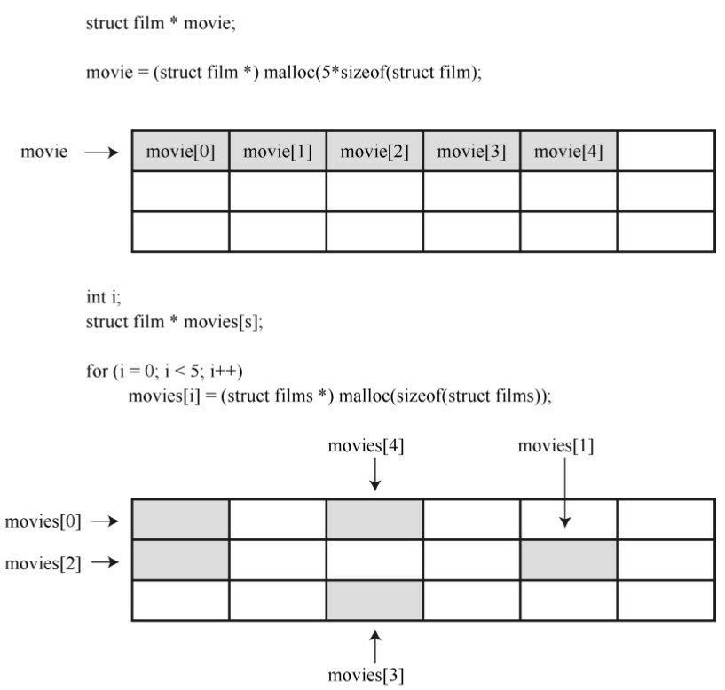

一种解决方法是创建一个大型的指针数组，并在分配新结构时逐个给这
些指针赋值，但是我们不打算使用这种方法：
```c
#define TSIZE 45 /*储存片名的数组大小*/
#define FMAX 500 /*影片的最大数量*/
struct film {
char title[TSIZE];
int rating;
};
...
struct film * movies[FMAX]; /* 结构指针数组 */
int i;
...
movies[i] = (struct film *) malloc (sizeof (struct film));
```

如果用不完500个指针，这种方法节约了大量的内存，因为内含500个指
针的数组比内含500个结构的数组所占的内存少得多。尽管如此，如果用不
到 500 个指针，还是浪费了不少空间。而且，这样还是有500个结构的限
制。

还有一种更好的方法。每次使用 malloc()为新结构分配空间时，也为新
指针分配空间。但是，还得需要另一个指针来跟踪新分配的指针，用于跟踪
新指针的指针本身，也需要一个指针来跟踪，以此类推。要重新定义结构才
能解决这个潜在的问题，即每个结构中包含指向 next 结构的指针。然后，
当创建新结构时，可以把该结构的地址储存在上一个结构中。简而言之，可
以这样定义film结构：
```c
#define TSIZE 45 /* 储存片名的数组大小*/
struct film {
char title[TSIZE];
int rating;
struct film * next;
};
```

虽然结构不能含有与本身类型相同的结构，但是可以含有指向同类型结
构的指针。这种定义是定义链表（linked list）的基础，链表中的每一项都包
含着在何处能找到下一项的信息。

在学习链表的代码之前，我们先从概念上理解一个链表。假设用户输入
的片名是Modern Times，等级为10。程序将为film类型的结构分配空间，把
字符串Modern Times拷贝到结构中的title成员中，然后设置rating成员为10。
为了表明该结构后面没有其他结构，程序要把next成员指针设置为
NULL（NULL是一个定义在stdio.h头文件中的符号常量，表示空指针）。当
然，还需要一个单独的指针储存第1个结构的地址，该指针被称为头指针
（head pointer）。头指针指向链表中的第1项。图17.2演示了这种结构（为
节约图片空间，压缩了title成员中的空白）。

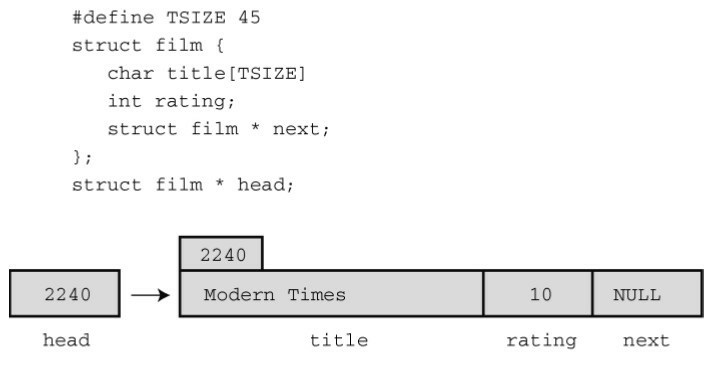

现在，假设用户输入第2部电影及其评级，如Midnight in Paris和8。程序
为第2个film类型结构分配空间，把新结构的地址储存在第1个结构的next成
员中（擦写了之前储存在该成员中的NULL），这样链表中第1个结构中的
next指针指向第2个结构。然后程序把Midnight in Paris和8拷贝到新结构中，
并把第2个结构中的next成员设置为NULL，表明该结构是链表中的最后一个
结构。图17.3演示了这两个项。

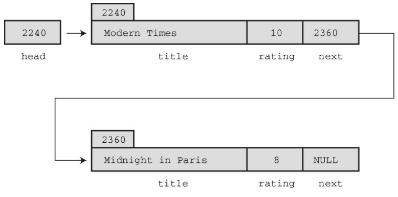

每加入一部新电影，就以相同的方式来处理。新结构的地址将储存在上
一个结构中，新信息储存在新结构中，而且新结构中的next成员设置为
NULL。从而建立起如图17.4所示的链表。

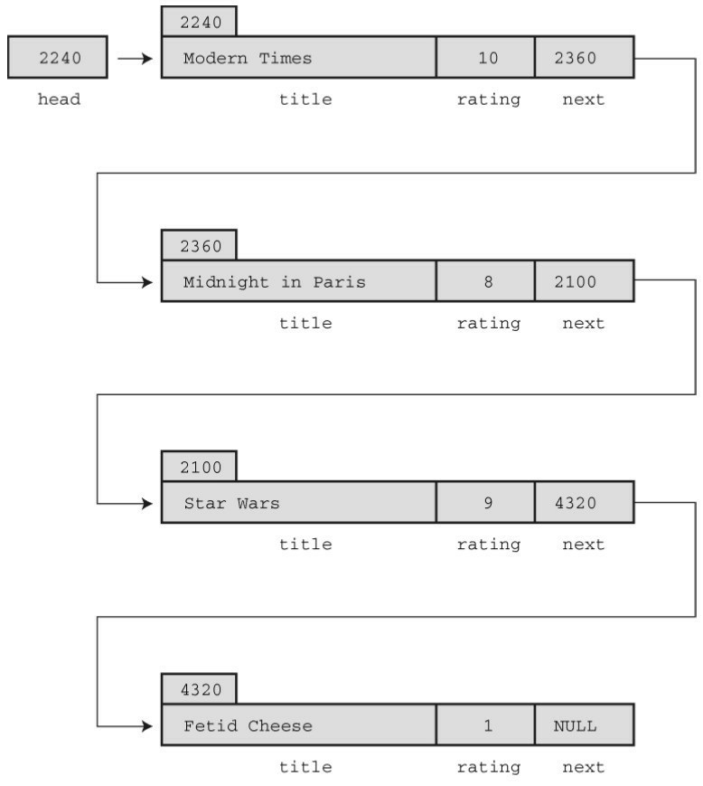

假设要显示这个链表，每显示一项，就可以根据该项中已储存的地址来
定位下一个待显示的项。然而，这种方案能正常运行，还需要一个指针储存
链表中第1项的地址，因为链表中没有其他项储存该项的地址。此时，头指
针就派上了用场。

## 17.2.1 使用链表
从概念上了解了链表的工作原理，接着我们来实现它。程序清单17.2修
改了程序清单17.1，用链表而不是数组来储存电影信息。

程序清单17.2 films2.c程序
```c
/* films2.c -- 使用结构链表 */
#include <stdio.h>
#include <stdlib.h>    /* 提供malloc()原型 */
#include <string.h>    /* 提供strcpy()原型 */
#define TSIZE  45    /* 储存片名的数组大小 */
struct film {
char title[TSIZE];
int rating;
struct film * next;  /* 指向链表中的下一个结构 */
};
char * s_gets(char * st, int n);
int main(void)
{
struct film * head = NULL;
struct film * prev, *current;
char input[TSIZE];
/* 收集并储存信息 */
puts("Enter first movie title:");
while (s_gets(input, TSIZE) != NULL && input[0] != '\0')
{
current = (struct film *) malloc(sizeof(struct film));
if (head == NULL)   /* 第1个结构 */
head = current;
else          /* 后续的结构 */
prev->next = current;
current->next = NULL;
strcpy(current->title, input);
puts("Enter your rating <0-10>:");
scanf("%d", &current->rating);
while (getchar() != '\n')
continue;
puts("Enter next movie title (empty line to stop):");
prev = current;
}
/* 显示电影列表 */
if (head == NULL)
printf("No data entered. ");
else
printf("Here is the movie list:\n");
current = head;
while (current != NULL)
{
printf("Movie: %s  Rating: %d\n",
current->title, current->rating);
current = current->next;
}
/* 完成任务，释放已分配的内存 */
current = head;
while (current != NULL)
{
current = head;
head = current->next;
free(current);
}
printf("Bye!\n");
return 0;
}
char * s_gets(char * st, int n)
{
char * ret_val;
char * find;
ret_val = fgets(st, n, stdin);
if (ret_val)
{
find = strchr(st, '\n');  // 查找换行符
if (find)        // 如果地址不是 NULL，
*find = '\0';     // 在此处放置一个空字符
else
while (getchar() != '\n')
continue;    // 处理剩余输入行
}
return ret_val;
}
```

该程序用链表执行两个任务。第 1 个任务是，构造一个链表，把用户输
入的数据储存在链表中。第 2个任务是，显示链表。显示链表的任务比较简
单，所以我们先来讨论它。

1. 显示链表

显示链表从设置一个指向第1个结构的指针（名为current）开始。由于
头指针（名为head）已经指向链表中的第1个结构，所以可以用下面的代码
来完成：
```c
current = head;
```

然后，可以使用指针表示法访问结构的成员：
```c
printf("Movie: %s Rating: %d\n", current->title, current->rating);
```

下一步是根据储存在该结构中next成员中的信息，重新设置current指针
指向链表中的下一个结构。代码如下：
```c
current = current->next;
```

完成这些之后，再重复整个过程。当显示到链表中最后一个项时，
current 将被设置为 NULL，因为这是链表最后一个结构中next成员的值。
```c
while (current != NULL)
{
printf("Movie: %s Rating: %d\n", current->title, current->rating);
current = current->next;
}
```

遍历链表时，为何不直接使用head指针，而要重新创建一个新指针
（current）？因为如果使用head会改变head中的值，程序就找不到链表的开
始处。

2. 创建链表

创建链表涉及下面3步：

* （1）使用malloc()为结构分配足够的空间；
* （2）储存结构的地址；
* （3）把当前信息拷贝到结构中。

如无必要不用创建一个结构，所以程序使用临时存储区（input数组）获
取用户输入的电影名。如果用户通过键盘模拟EOF或输入一行空行，将退出
下面的循环：
```c
while (s_gets(input, TSIZE) != NULL && input[0] != '\0')
```

如果用户进行输入，程序就分配一个结构的空间，并将其地址赋给指针
变量current:
```c
current = (struct film *) malloc(sizeof(struct film));
```

链表中第1 个结构的地址应储存在指针变量head中。随后每个结构的地
址应储存在其前一个结构的next成员中。因此，程序要知道它处理的是否是
第1个结构。最简单的方法是在程序开始时，把head指针初始化为NULL。然
后，程序可以使用head的值进行判断：
```c
if (head == NULL) /* 第1个结构*/
head = current;
else /* subsequent structures */
prev->next = current;
```

在上面的代码中，指针prev指向上一次分配的结构。

接下来，必须为结构成员设置合适的值。尤其是，把next成员设置为
NULL，表明当前结构是链表的最后一个结构。还要把input数组中的电影名
拷贝到title成员中，而且要给rating成员提供一个值。如下代码所示：
```c
current->next = NULL;
strcpy(current->title, input);
puts("Enter your rating <0-10>:");
scanf("%d", &current->rating);
```

由于s_gets()限制了只能输入TSIZE-1个字符，所以用strcpy()函数把input
数组中的字符串拷贝到title成员很安全。

最后，要为下一次输入做好准备。尤其是，要设置 prev 指向当前结
构。因为在用户输入下一部电影且程序为新结构分配空间后，当前结构将成
为新结构的上一个结构，所以程序在循环末尾这样设置该指针：
```c
prev = current;
```

程序是否能正常运行？下面是该程序的一个运行示例：
```c
Enter first movie title:
Spirited Away
Enter your rating <0-10>:
9
Enter next movie title (empty line to stop):
The Duelists
Enter your rating <0-10>:
8
Enter next movie title (empty line to stop):
Devil Dog: The Mound of Hound
Enter your rating <0-10>:
1
Enter next movie title (empty line to stop):
Here is the movie list:
Movie: Spirited Away Rating: 9
Movie: The Duelists Rating: 8
Movie: Devil Dog: The Mound of Hound Rating: 1
Bye!
```

3. 释放链表

在许多环境中，程序结束时都会自动释放malloc()分配的内存。但是，
最好还是成对调用malloc()和free()。因此，程序在清理内存时为每个已分配
的结构都调用了free()函数：
```c
current = head;
while (current != NULL)
{
current = head;
head = current->next;
free(current);
}
```

### 17.2.2 反思
films2.c 程序还有些不足。例如，程序没有检查 malloc()是否成功请求
到内存，也无法删除链表中的项。这些不足可以弥补。例如，添加代码检查
malloc()的返回值是否是NULL（返回NULL说明未获得所需内存）。如果程
序要删除链表中的项，还要编写更多的代码。

这种用特定方法解决特定问题，并且在需要时才添加相关功能的编程方
式通常不是最好的解决方案。另一方面，通常都无法预料程序要完成的所有
任务。随着编程项目越来越大，一个程序员或编程团队事先计划好一切模
式，越来越不现实。很多成功的大型程序都是由成功的小型程序逐步发展而
来。

如果要修改程序，首先应该强调最初的设计，并简化其他细节。程序清
单 17.2 中的程序示例没有遵循这个原则，它把概念模型和代码细节混在一
起。例如，该程序的概念模型是在一个链表中添加项，但是程序却把一些细
节（如，malloc()和 current->next 指针）放在最明显的位置，没有突出接
口。如果程序能以某种方式强调给链表添加项，并隐藏具体的处理细节（如
调用内存管理函数和设置指针）会更好。把用户接口和代码细节分开的程
序，更容易理解和更新。学习下面的内容就可以实现这些目标。

## 17.3 抽象数据类型（ADT）
在编程时，应该根据编程问题匹配合适的数据类型。例如，用int类型代
表你有多少双鞋，用float或 double 类型代表每双鞋的价格。在前面的电影示
例中，数据构成了链表，每个链表项由电影名（C 字符串）和评级（一个int
类型值）。C中没有与之匹配的基本类型，所以我们定义了一个结构代表单
独的项，然后设计了一些方法把一系列结构构成一个链表。本质上，我们使
用 C语言的功能设计了一种符合程序要求的新数据类型。但是，我们的做法
并不系统。现在，我们用更系统的方法来定义数据类型。

什么是类型？类型特指两类信息：属性和操作。例如，int 类型的属性
是它代表一个整数值，因此它共享整数的属性。允许对int类型进行算术操作
是：改变int类型值的符号、两个int类型值相加、相减、相乘、相除、求模。
当声明一个int类型的变量时，就表明了只能对该变量进行这些操作。

注意 整数属性

C的int类型背后是一个更抽象的整数概念。数学家已经用正式的抽象方
式定义了整数的属性。例如，假设N和M是整数，那么N+M=M+N；假设S、
Q也是整数，如果N+M=S，而且N+Q=S，那么M=Q。可以认为数学家提供
了整数的抽象概念，而C则实现了这一抽象概念。注意，实现整数的算术运
算是表示整数必不可少的部分。如果只是储存值，并未在算术表达式中使
用，int类型就没那么有用了。还要注意的是，C并未很好地实现整数。例
如，整数是无穷大的数，但是2字节的int类型只能表示65536个整数。因此，
不要混淆抽象概念和具体的实现。

假设要定义一个新的数据类型。首先，必须提供储存数据的方法，例如
设计一个结构。其次，必须提供操控数据的方法。例如，考虑films2.c程序
（程序清单17.2）。该程序用链接的结构来储存信息，而且通过代码实现了
如何添加和显示信息。尽管如此，该程序并未清楚地表明正在创建一个新类
型。我们应该怎么做？

计算机科学领域已开发了一种定义新类型的好方法，用3个步骤完成从
抽象到具体的过程。

1. 提供类型属性和相关操作的抽象描述。这些描述既不能依赖特定的实
现，也不能依赖特定的编程语言。这种正式的抽象描述被称为抽象数据类型
（ADT）。

2. 开发一个实现 ADT 的编程接口。也就是说，指明如何储存数据和执
行所需操作的函数。例如在 C中，可以提供结构定义和操控该结构的函数原
型。这些作用于用户定义类型的函数相当于作用于 C基本类型的内置运算
符。需要使用该新类型的程序员可以使用这个接口进行编程。

3. 编写代码实现接口。这一步至关重要，但是使用该新类型的程序员无
需了解具体的实现细节。

我们再次以前面的电影项目为例来熟悉这个过程，并用新方法重新完成
这个示例。

### 17.3.1 建立抽象
从根本上看，电影项目所需的是一个项链表。每一项包含电影名和评
级。你所需的操作是把新项添加到链表的末尾和显示链表中的内容。我们把
需要处理这些需求的抽象类型叫作链表。链表具有哪些属性？首先，链表应
该能储存一系列的项。也就是说，链表能储存多个项，而且这些项以某种方
式排列，这样才能描述链表的第1项、第2项或最后一项。其次，链表类型应
该提供一些操作，如在链表中添加新项。下面是链表的一些有用的操作：
```c
初始化一个空链表；
在链表末尾添加一个新项；
确定链表是否为空；
确定链表是否已满；
确定链表中的项数；
访问链表中的每一项执行某些操作，如显示该项。
```

对该电影项目而言，暂时不需要其他操作。但是一般的链表还应包含以
下操作：
```c
在链表的任意位置插入一个项；
移除链表中的一个项；
在链表中检索一个项（不改变链表）；
用另一个项替换链表中的一个项；
在链表中搜索一个项。
```

非正式但抽象的链表定义是：链表是一个能储存一系列项且可以对其进
行所需操作的数据对象。该定义既未说明链表中可以储存什么项，也未指定
是用数组、结构还是其他数据形式来储存项，而且并未规定用什么方法来实
现操作（如，查找链表中元素的个数）。这些细节都留给实现完成。

为了让示例尽量简单，我们采用一种简化的链表作为抽象数据类型。它
只包含电影项目中的所需属性。该类型总结如下：
```c
类型名：    简单链表
类型属性：    可以储存一系列项
类型操作：    初始化链表为空
确定链表为空
确定链表已满
确定链表中的项数
在链表末尾添加项
遍历链表，处理链表中的项
清空链表
下一步是为开发简单链表ADT开发一个C接口。
```

### 17.3.2 建立接口
这个简单链表的接口有两个部分。第1部分是描述如何表示数据，第2部
分是描述实现ADT操作的函数。例如，要设计在链表中添加项的函数和报告
链表中项数的函数。接口设计应尽量与ADT的描述保持一致。因此，应该用
某种通用的Item类型而不是一些特殊类型，如int或struct film。可以用C的
typedef功能来定义所需的Item类型：
```c
#define TSIZE 45 /* 储存电影名的数组大小 */
struct film
{
char title[TSIZE];
int rating;
};
typedef struct film Item;
```

然后，就可以在定义的其余部分使用 Item 类型。如果以后需要其他数
据形式的链表，可以重新定义Item类型，不必更改其余的接口定义。

定义了 Item 之后，现在必须确定如何储存这种类型的项。实际上这一
步属于实现步骤，但是现在决定好可以让示例更简单些。在films2.c程序中
用链接的结构处理得很好，所以，我们在这里也采用相同的方法：
```c
typedef struct node
{
Item item;
struct node * next;
} Node;
typedef Node * List;
```

在链表的实现中，每一个链节叫作节点（node）。每个节点包含形成链
表内容的信息和指向下一个节点的指针。为了强调这个术语，我们把node作
为节点结构的标记名，并使用typedef把Node作为struct node结构的类型名。
最后，为了管理链表，还需要一个指向链表开始处的指针，我们使用typedef
把List作为该类型的指针名。因此，下面的声明：
```c
List movies;
```

创建了该链表所需类型的指针movies。

这是否是定义List类型的唯一方法？不是。例如，还可以添加一个变量
记录项数：
```c
typedef struct list
{
Node * head; /* 指向链表头的指针 */
int size;   /* 链表中的项数 */
} List;      /* List的另一种定义 */
```

可以像稍后的程序示例中那样，添加第2 个指针储存链表的末尾。现
在，我们还是使用 List类型的第1种定义。这里要着重理解下面的声明创建
了一个链表，而不一个指向节点的指针或一个结构：
```c
List movies;
```

movies代表的确切数据应该是接口层次不可见的实现细节。

例如，程序启动后应把头指针初始化为NULL。但是，不要使用下面这
样的代码：
```c
movies = NULL;
```

为什么？因为稍后你会发现List类型的结构实现更好，所以应这样初始
化：
```c
movies.next = NULL;
movies.size = 0;
```

使用List的人都不用担心这些细节，只要能使用下面的代码就行：
```c
InitializeList(movies);
```

使用该类型的程序员只需知道用InitializeList()函数来初始化链表，不必
了解List类型变量的实现细节。这是数据隐藏的一个示例，数据隐藏是一种
从编程的更高层次隐藏数据表示细节的艺术。

为了指导用户使用，可以在函数原型前面提供以下注释：
```c
/* 操作：初始化一个链表      */
/* 前提条件：plist指向一个链表*/
/* 后置条件：该链表初始化为空    */
void InitializeList(List * plist);
```

这里要注意3点。第1，注释中的“前提条件”（precondition）是调用该函
数前应具备的条件。例如，需要一个待初始化的链表。第2，注释中的“后置
条件”（postcondition）是执行完该函数后的情况。第3，该函数的参数是一
个指向链表的指针，而不是一个链表。所以应该这样调用该函数：
```c
InitializeList(&movies);
```

由于按值传递参数，所以该函数只能通过指向该变量的指针才能更改主
调程序传入的变量。这里，由于语言的限制使得接口和抽象描述略有区别。

C 语言把所有类型和函数的信息集合成一个软件包的方法是：把类型定
义和函数原型（包括前提条件和后置条件注释）放在一个头文件中。该文件
应该提供程序员使用该类型所需的所有信息。程序清单 17.3给出了一个简单
链表类型的头文件。该程序定义了一个特定的结构作为Item类型，然后根据
Item定义了Node，再根据Node定义了List。然后，把表示链表操作的函数设
计为接受Item类型和List类型的参数。如果函数要修改一个参数，那么该参
数的类型应是指向相应类型的指针，而不是该类型。在头文件中，把组成函
数名的每个单词的首字母大写，以这种方式表明这些函数是接口包的一部
分。另外，该文件使用第16章介绍的#ifndef指令，防止多次包含一个文件。
如果编译器不支持C99的bool类型，可以用下面的代码：
```c
enum bool {false, true}; /* 把bool定义为类型，false和true是该类型的值 */
```

替换下面的头文件：
```c
#include <stdbool.h> /* C99特性 */
```

程序清单17.3 list.h接口头文件
```c
/* list.h -- 简单链表类型的头文件 */
#ifndef LIST_H_
#define LIST_H_
#include <stdbool.h> /* C99特性      */
/* 特定程序的声明 */
#define TSIZE   45 /* 储存电影名的数组大小  */
struct film
{
char title[TSIZE];
int rating;
};
/* 一般类型定义 */
typedef struct film Item;
typedef struct node
{
Item item;
struct node * next;
} Node;
typedef Node * List;
/* 函数原型 */
/* 操作：   初始化一个链
表                       */
/* 前提条件：  plist指向一个链
表                     */
/* 后置条件：  链表初始化为
空                       */
void InitializeList(List * plist);
/* 操作：   确定链表是否为空定义，plist指向一个已初始化的链
表        */
/* 后置条件：  如果链表为空，该函数返回true；否则返回
false         */
bool ListIsEmpty(const List *plist);
/* 操作：   确定链表是否已满，plist指向一个已初始化的链
表         */
/* 后置条件：  如果链表已满，该函数返回真；否则返回
假             */
bool ListIsFull(const List *plist);
/* 操作：   确定链表中的项数, plist指向一个已初始化的链
表         */
/* 后置条件：  该函数返回链表中的项
数                   */
unsigned int ListItemCount(const List *plist);
/* 操作：   在链表的末尾添加
项                     */
/* 前提条件：  item是一个待添加至链表的项, plist指向一个已初始化
的链表    */
/* 后置条件：  如果可以，该函数在链表末尾添加一个项，且返回
true；否则返回false */
bool AddItem(Item item, List * plist);
/* 操作：   把函数作用于链表中的每一
项                  */
/*      plist指向一个已初始化的链
表                 */
/*      pfun指向一个函数，该函数接受一个Item类型的参数，
且无返回值   */
/* 后置条件：  pfun指向的函数作用于链表中的每一项一
次            */
void Traverse(const List *plist, void(*pfun)(Item item));
/* 操作：   释放已分配的内存（如果有的
话）                */
/*      plist指向一个已初始化的链
表                 */
/* 后置条件：  释放了为链表分配的所有内存，链表设置为
空            */
void EmptyTheList(List * plist);
#endif
```

只有InitializeList()、AddItem()和EmptyTheList()函数要修改链表，因此从
技术角度看，这些函数需要一个指针参数。然而，如果某些函数接受 List 类
型的变量作为参数，而其他函数却接受 List类型的地址作为参数，用户会很
困惑。因此，为了减轻用户的负担，所有的函数均使用指针参数。

头文件中的一个函数原型比其他原型复杂：
```c
/* 操作：   把函数作用于链表中的每一
项               */
/*      plist指向一个已初始化的链
表              */
/*      pfun指向一个函数，该函数接受一个Item类型的参数，
且无返回值 */
/* 后置条件：  pfun指向的函数作用于链表中的每一项一
次          */
void Traverse(const List *plist, void(*pfun)(Item item));
```

参数pfun是一个指向函数的指针，它指向的函数接受item值且无返回
值。第14章中介绍过，可以把函数指针作为参数传递给另一个函数，然后该
函数就可以使用这个被指针指向的函数。例如，该例中可以让pfun指向显示
链表项的函数。然后把Traverse()函数把该函数作用于链表中的每一项，显
示链表中的内容。

### 17.3.3 使用接口
我们的目标是，使用这个接口编写程序，但是不必知道具体的实现细节
（如，不知道函数的实现细节）。在编写具体函数之前，我们先编写电影程
序的一个新版本。由于接口要使用List和Item类型，所以该程序也应使用这
些类型。下面是编写该程序的一个伪代码方案。
```c
创建一个List类型的变量。
创建一个Item类型的变量。
初始化链表为空。
当链表未满且有输入时：
把输入读取到Item类型的变量中。
在链表末尾添加项。
访问链表中的每个项并显示它们。
```

程序清单 17.4 中的程序按照以上伪代码来编写，其中还加入了一些错
误检查。注意该程序利用了list.h（程序清单 17.3）中描述的接口。另外，还
需注意，链表中含有 showmovies()函数的代码，它与Traverse()的原型一
致。因此，程序可以把指针showmovies传递给Traverse()，这样Traverse()可
以把showmovies()函数应用于链表中的每一项（回忆一下，函数名是指向该
函数的指针）。

程序清单17.4 films3.c程序
```c
/* films3.c -- 使用抽象数据类型（ADT）风格的链表 */
/* 与list.c一起编译           */
#include <stdio.h>
#include <stdlib.h>  /* 提供exit()的原型 */
#include "list.h"   /* 定义List、Item */
void showmovies(Item item);
char * s_gets(char * st, int n);
int main(void)
{
List movies;
Item temp;
/* 初始化   */
InitializeList(&movies);
if (ListIsFull(&movies))
{
fprintf(stderr, "No memory available! Bye!\n");
exit(1);
}
/* 获取用户输入并储存 */
puts("Enter first movie title:");
while (s_gets(temp.title, TSIZE) != NULL && 
temp.title[0] != '\0')
{
puts("Enter your rating <0-10>:");
scanf("%d", &temp.rating);
while (getchar() != '\n')
continue;
if (AddItem(temp, &movies) == false)
{
fprintf(stderr, "Problem allocating memory\n");
break;
}
if (ListIsFull(&movies))
{
puts("The list is now full.");
break;
}
puts("Enter next movie title (empty line to stop):");
}
/* 显示    */
if (ListIsEmpty(&movies))
printf("No data entered. ");
else
{
printf("Here is the movie list:\n");
Traverse(&movies, showmovies);
}
printf("You entered %d movies.\n", ListItemCount(&movies));
/* 清理    */
EmptyTheList(&movies);
printf("Bye!\n");
return 0;
}
void showmovies(Item item)
{
printf("Movie: %s  Rating: %d\n", item.title,
item.rating);
}
char * s_gets(char * st, int n)
{
char * ret_val;
char * find;
ret_val = fgets(st, n, stdin);
if (ret_val)
{
find = strchr(st, '\n');  // 查找换行符
if (find)           // 如果地址不是NULL，
*find = '\0';     // 在此处放置一个空字符
else
while (getchar() != '\n')
continue;      // 处理输入行的剩余内容
}
return ret_val;
}
```

### 17.3.4 实现接口
当然，我们还是必须实现List接口。C方法是把函数定义统一放在list.c
文件中。然后，整个程序由 list.h（定义数据结构和提供用户接口的原
型）、list.c（提供函数代码实现接口）和 films3.c （把链表接口应用于特定
编程问题的源代码文件）组成。程序清单17.5演示了list.c的一种实现。要运
行该程序，必须把films3.c和list.c一起编译和链接（可以复习一下第9章关于
编译多文件程序的内容）。list.h、list.c和films3.c组成了整个程序（见图
17.5）。

程序清单17.5 list.c实现文件
```c
/* list.c -- 支持链表操作的函数 */
#include <stdio.h>
#include <stdlib.h>
#include "list.h"
/* 局部函数原型 */
static void CopyToNode(Item item, Node * pnode);
/* 接口函数 */
/* 把链表设置为空 */
void InitializeList(List * plist)
{
*plist = NULL;
}
/* 如果链表为空，返回true */
bool ListIsEmpty(const List * plist)
{
if (*plist == NULL)
return true;
else
return false;
}
/* 如果链表已满，返回true */
bool ListIsFull(const List * plist)
{
Node * pt;
bool full;
pt = (Node *)malloc(sizeof(Node));
if (pt == NULL)
full = true;
else
full = false;
free(pt);
return full;
}
/* 返回节点的数量 */
unsigned int ListItemCount(const List * plist)
{
unsigned int count = 0;
Node * pnode = *plist;  /* 设置链表的开始 */
while (pnode != NULL)
{
++count;
pnode = pnode->next; /* 设置下一个节点 */
}
return count;
}
/* 创建储存项的节点，并将其添加至由plist指向的链表末尾（较慢的实
现） */
bool AddItem(Item item, List * plist)
{
Node * pnew;
Node * scan = *plist;
pnew = (Node *) malloc(sizeof(Node));
if (pnew == NULL)
return false;  /* 失败时退出函数 */
CopyToNode(item, pnew);
pnew->next = NULL;
if (scan == NULL)    /* 空链表，所以把 */
*plist = pnew;    /* pnew放在链表的开头 */
else
{
while (scan->next != NULL)
scan = scan->next; /* 找到链表的末尾 */
scan->next = pnew;   /* 把pnew添加到链表的末尾 */
}
return true;
}
/* 访问每个节点并执行pfun指向的函数 */
void Traverse(const List * plist, void(*pfun)(Item item))
{
Node * pnode = *plist;  /* 设置链表的开始 */
while (pnode != NULL)
{
(*pfun)(pnode->item); /* 把函数应用于链表中的项 */
pnode = pnode->next; /* 前进到下一项 */
}
}
/* 释放由malloc()分配的内存 */
/* 设置链表指针为NULL   */
void EmptyTheList(List * plist)
{
Node * psave;
while (*plist != NULL)
{
psave = (*plist)->next;  /* 保存下一个节点的地址  */
free(*plist);       /* 释放当前节点     */
*plist = psave;      /* 前进至下一个节点   */
}
}
/* 局部函数定义 */
/* 把一个项拷贝到节点中 */
static void CopyToNode(Item item, Node * pnode)
{
pnode->item = item; /* 拷贝结构 */
}
```

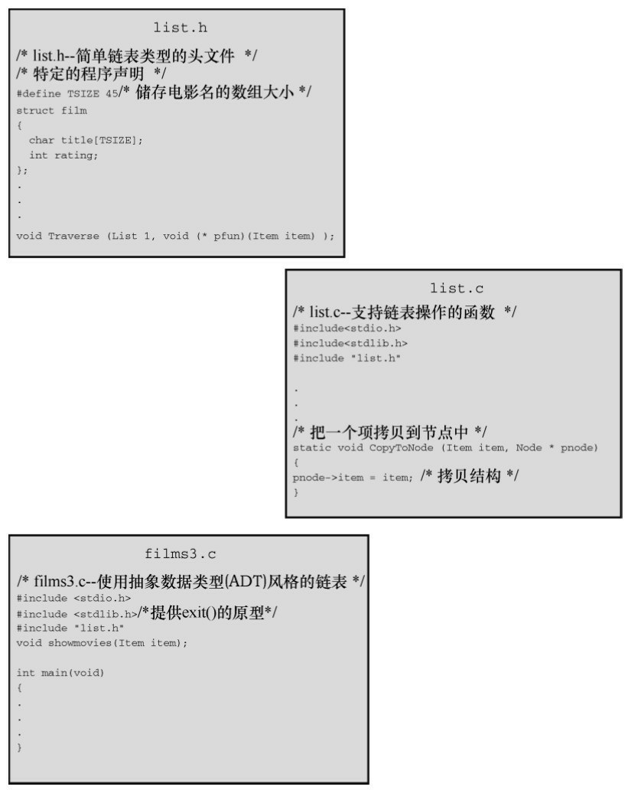

1. 程序的一些注释

list.c文件有几个需要注意的地方。首先，该文件演示了什么情况下使用
内部链接函数。如第12章所述，具有内部链接的函数只能在其声明所在的文
件夹可见。在实现接口时，有时编写一个辅助函数（不作为正式接口的一部
分）很方便。例如，使用CopyToNode()函数把一个Item类型的值拷贝到Item
类型的变量中。由于该函数是实现的一部分，但不是接口的一部分，所以我
们使用 static 存储类别说明符把它隐藏在list.c文件中。接下来，讨论其他函
数。

InitializeList()函数将链表初始化为空。在我们的实现中，这意味着把
List类型的变量设置为NULL。前面提到过，这要求把指向List类型变量的指
针传递给该函数。

ListIsEmpty()函数很简单，但是它的前提条件是，当链表为空时，链表
变量被设置为NULL。因此，在首次调用 ListIsEmpty()函数之前初始化链表
非常重要。另外，如果要扩展接口添加删除项的功能，那么当最后一个项被
删除时，应该确保该删除函数重置链表为空。对链表而言，链表的大小取决
于可用内存量。ListIsFull()函数尝试为新项分配空间。如果分配失败，说明
链表已满；如果分配成功，则必须释放刚才分配的内存供真正的项所用。

ListItemCount()函数使用常用的链表算法遍历链表，同时统计链表中的
项：
```c
unsigned int ListItemCount(const List * plist)
{
unsigned int count = 0;
Node * pnode = *plist;  /* 设置链表的开始 */
while (pnode != NULL)
{
++count;
pnode = pnode->next; /* 设置下一个节点 */
}
return count;
}
```

AddItem()函数是这些函数中最复杂的：
```c
bool AddItem(Item item, List * plist)
{
Node * pnew;
Node * scan = *plist;
pnew = (Node *) malloc(sizeof(Node));
if (pnew == NULL)
return false;       /* 失败时退出函数 */
CopyToNode(item, pnew);
pnew->next = NULL;
if (scan == NULL)       /* 空链表，所以把 */
*plist = pnew;       /* pnew放在链表的开头 */
else
{
while (scan->next != NULL)
scan = scan->next; /* 找到链表的末尾 */
scan->next = pnew;   /* 把pnew添加到链表的末尾 */
}
return true;
}
```

AddItem()函数首先为新节点分配空间。如果分配成功，该函数使用
CopyToNode()把项拷贝到新节点中。然后把该节点的next成员设置为NULL。
这表明该节点是链表中的最后一个节点。最后，完成创建节点并为其成员赋
正确的值之后，该函数把该节点添加到链表的末尾。如果该项是添加到链表
的第 1 个项，需要把头指针设置为指向第1项（记住，头指针的地址是传递
给AddItem()函数的第2个参数，所以*plist就是头指针的值）。否则，代码继
续在链表中前进，直到发现被设置为NULL的next成员。此时，该节点就是
当前的最后一个节点，所以，函数重置它的next成员指向新节点。

要养成良好的编程习惯，给链表添加项之前应调用ListIsFull()函数。但
是，用户可能并未这样做，所以在AddItem()函数内部检查malloc()是否分配
成功。而且，用户还可能在调用ListIsFull()和调用AddItem()函数之间做其他
事情分配了内存，所以最好还是检查malloc()是否分配成功。

Traverse()函数与ListItemCount()函数类似，不过它还把一个指针函数作
用于链表中的每一项。
```c
void Traverse (const List * plist, void (* pfun)(Item item) )
{
Node * pnode = *plist; /* 设置链表的开始 */
while (pnode != NULL)
{
(*pfun)(pnode->item); /* 把函数应用于该项*/
pnode = pnode->next;  /* 前进至下一个项 */
}
}
```

pnode->item代表储存在节点中的数据，pnode->next标识链表中的下一个
节点。如下函数调用：
```c
Traverse(movies, showmovies);
```

把showmovies()函数应用于链表中的每一项。

最后，EmptyTheList()函数释放了之前malloc()分配的内存：
```c
void EmptyTheList(List * plist)
{
Node * psave;
while (*plist != NULL)
{
psave = (*plist)->next;  /* 保存下一个节点的地址  */
free(*plist);       /* 释放当前节点     */
*plist = psave;      /* 前进至下一个节点   */
}
}
```

该函数的实现通过把List类型的变量设置为NULL来表明一个空链表。因
此，要把List类型变量的地址传递给该函数，以便函数重置。由于List已经是
一个指针，所以plist是一个指向指针的指针。因此，在上面的代码中，*plist
是指向Node的指针。当到达链表末尾时，*plist为NULL，表明原始的实际参
数现在被设置为NULL。

代码中要保存下一节点的地址，因为原则上调用了free()会使当前节点
（即*plist指向的节点）的内容不可用。

提示 const的限制

多个处理链表的函数都把const List * plist作为形参，表明这些函数不会
更改链表。这里， const确实提供了一些保护。它防止了*plist（即plist所指
向的量）被修改。在该程序中，plist指向movies，所以const防止了这些函数
修改movies。因此，在ListItemCount()中，不允许有类似下面的代码：
```c
*plist = (*plist)->next; // 如果*plist是const，不允许这样做
```

因为改变*plist就改变了movies，将导致程序无法跟踪数据。然而，
*plist和movies都被看作是const并不意味着*plist或movies指向的数据是
const。例如，可以编写下面的代码：
```c
(*plist)->item.rating = 3; // 即使*plist是const，也可以这样做
```

因为上面的代码并未改变*plist，它改变的是*plist指向的数据。由此可
见，不要指望const能捕获到意外修改数据的程序错误。

2. 考虑你要做的

现在花点时间来评估ADT方法做了什么。首先，比较程序清单17.2和程
序清单17.4。这两个程序都使用相同的内存分配方法（动态分配链接的结
构）解决电影链表的问题，但是程序清单17.2暴露了所有的编程细节，把
malloc()和prev->next这样的代码都公之于众。而程序清单17.4隐藏了这些细
节，并用与任务直接相关的方式表达程序。也就是说，该程序讨论的是创建
链表和向链表中添加项，而不是调用内存函数或重置指针。简而言之，程序
清单17.4是根据待解决的问题来表达程序，而不是根据解决问题所需的具体
工具来表达程序。ADT版本可读性更高，而且针对的是最终的用户所关心的
问题。

其次，list.h 和 list.c 文件一起组成了可复用的资源。如果需要另一个简
单的链表，也可以使用这些文件。假设你需要储存亲戚的一些信息：姓名、
关系、地址和电话号码，那么先要在 list.h 文件中重新定义Item类型：
```c
typedef struct itemtag
{
char fname[14];
char lname [24];
char relationship[36];
char address [60];
char phonenum[20];
} Item;
```

然后„„只需要做这些就行了。因为所有处理简单链表的函数都与Item类
型有关。根据不同的情况，有时还要重新定义CopyToNode()函数。例如，当
项是一个数组时，就不能通过赋值来拷贝。

另一个要点是，用户接口是根据抽象链表操作定义的，不是根据某些特
定的数据表示和算法来定义。这样，不用重写最后的程序就能随意修改实
现。例如，当前使用的AddItem()函数效率不高，因为它总是从链表第 1 个
项开始，然后搜索至链表末尾。可以通过保存链表结尾处的地址来解决这个
问题。例如，可以这样重新定义List类型：
```c
typedef struct list
{
Node * head; /* 指向链表的开头 */
Node * end;  /* 指向链表的末尾 */
} List;
```

当然，还要根据新的定义重写处理链表的函数，但是不用修改程序清单
17.4中的内容。对大型编程项目而言，这种把实现和最终接口隔离的做法相
当有用。这称为数据隐藏，因为对终端用户隐藏了数据表示的细节。

注意，这种特殊的ADT甚至不要求以链表的方式实现简单链表。下面是
另一种方法：
```c
#define MAXSIZE 100
typedef struct list
{
Item entries[MAXSIZE]; /* 项数组 */
int items;         /* 其中的项数 */
} List;
```

这样做也需要重写list.c文件，但是使用list的程序不用修改。

最后，考虑这种方法给程序开发过程带来了哪些好处。如果程序运行出
现问题，可以把问题定位到具体的函数上。如果想用更好的方法来完成某个
任务（如，添加项），只需重写相应的函数即可。如果需要新功能，可以添
加一个新的函数。如果觉得数组或双向链表更好，可以重写实现的代码，不
用修改使用实现的程序。

## 17.4 队列ADT
在C语言中使用抽象数据类型方法编程包含以下3个步骤。

1. 以抽象、通用的方式描述一个类型，包括该类型的操作。
2. 设计一个函数接口表示这个新类型。
3. 编写具体代码实现这个接口。

前面已经把这种方法应用到简单链表中。现在，把这种方法应用于更复
杂的数据类型：队列。

### 17.4.1 定义队列抽象数据类型
队列（queue）是具有两个特殊属性的链表。第一，新项只能添加到链
表的末尾。从这方面看，队列与简单链表类似。第二，只能从链表的开头移
除项。可以把队列想象成排队买票的人。你从队尾加入队列，买完票后从队
首离开。队列是一种“先进先出”（first in,first out，缩写为FIFO）的数据形
式，就像排队买票的队伍一样（前提是没有人插队）。接下来，我们建立一
个非正式的抽象定义：
```c
类型名：    队列
类型属性：    可以储存一系列项
类型操作：    初始化队列为空
确定队列为空
确定队列已满
确定队列中的项数
在队列末尾添加项
在队列开头删除或恢复项
清空队列
```

### 17.4.2 定义一个接口
接口定义放在queue.h文件中。我们使用C的typedef工具创建两个类型
名：Item和Queue。相应结构的具体实现应该是queue.h文件的一部分，但是
从概念上来看，应该在实现阶段才设计结构。现在，只是假定已经定义了这
些类型，着重考虑函数的原型。

首先，考虑初始化。这涉及改变Queue类型，所以该函数应该以Queue的
地址作为参数：
```c
void InitializeQueue (Queue * pq);
```

接下来，确定队列是否为空或已满的函数应返回真或假值。这里，假设
C99的stdbool.h头文件可用。如果该文件不可用，可以使用int类型或自己定
义bool类型。由于该函数不更改队列，所以接受Queue类型的参数。但是，
传递Queue的地址更快，更节省内存，这取决于Queue类型的对象大小。这次
我们尝试这种方法。这样做的好处是，所有的函数都以地址作为参数，而不
像 List 示例那样。为了表明这些函数不更改队列，可以且应该使用const限
定符：
```c
bool QueueIsFull(const Queue * pq);
bool QueueIsEmpty (const Queue * pq);
```

指针pq指向Queue数据对象，不能通过pq这个代理更改数据。可以定义
一个类似该函数的原型，返回队列的项数：
```c
int QueueItemCount(const Queue * pq);
```

在队列末尾添加项涉及标识项和队列。这次要更改队列，所以有必要
（而不是可选）使用指针。该函数的返回类型可以是void，或者通过返回值
来表示是否成功添加项。我们采用后者：
```c
bool EnQueue(Item item, Queue * pq);
```

最后，删除项有多种方法。如果把项定义为结构或一种基本类型，可以
通过函数返回待删除的项。函数的参数可以是Queue类型或指向Queue的指
针。因此，可能是下面这样的原型：
```c
Item DeQueue(Queue q);
```

然而，下面的原型会更合适一些：
```c
bool DeQueue(Item * pitem, Queue * pq);
```

从队列中待删除的项储存在pitem指针指向的位置，函数的返回值表明
是否删除成功。

清空队列的函数所需的唯一参数是队列的地址，可以使用下面的函数原
型：
```c
void EmptyTheQueue(Queue * pq);
```

### 17.4.3 实现接口数据表示
第一步是确定在队列中使用何种C数据形式。有可能是数组。数组的优
点是方便使用，而且向数组的末尾添加项很简单。问题是如何从队列的开头
删除项。类比于排队买票的队列，从队列的开头删除一个项包括拷贝数组首
元素的值和把数组剩余各项依次向前移动一个位置。编程实现这个过程很简
单，但是会浪费大量的计算机时间（见图17.6）。

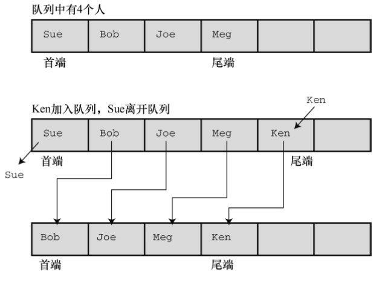

第二种解决数组队列删除问题的方法是改变队列首端的位置，其余元素
不动（见图17.7）。

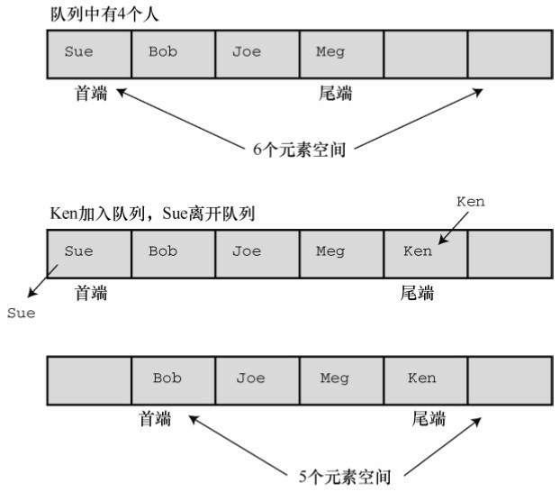

解决这种问题的一个好方法是，使队列成为环形。这意味着把数组的首
尾相连，即数组的首元素紧跟在最后一个元素后面。这样，当到达数组末尾
时，如果首元素空出，就可以把新添加的项储存到这些空出的元素中（见图
17.8）。可以想象在一张条形的纸上画出数组，然后把数组的首尾粘起来形
成一个环。当然，要做一些标记，以免尾端超过首端。

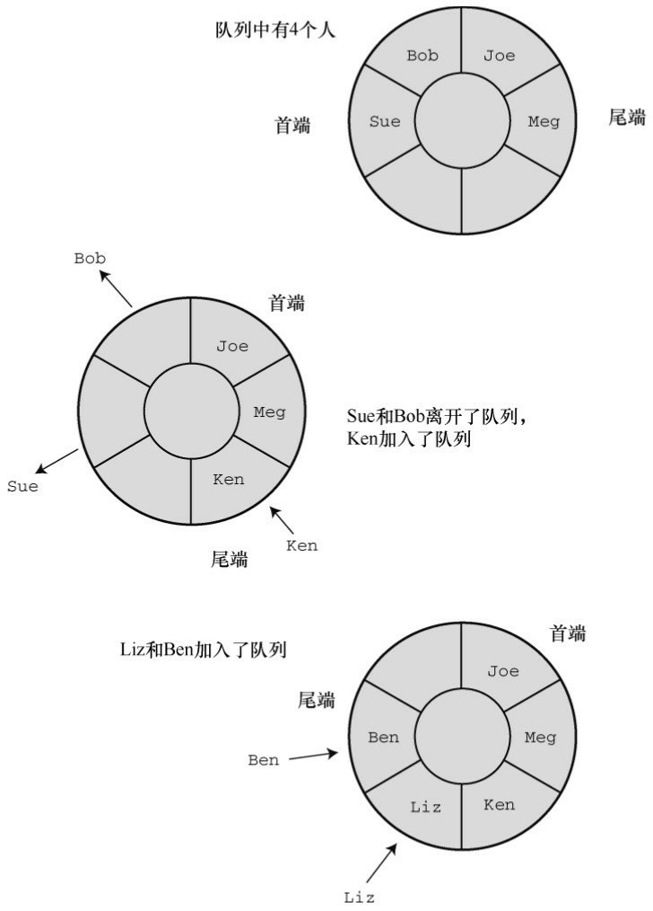

另一种方法是使用链表。使用链表的好处是删除首项时不必移动其余元
素，只需重置头指针指向新的首元素即可。由于我们已经讨论过链表，所以
采用这个方案。我们用一个整数队列开始测试：
```c
typedef int Item;
```

链表由节点组成，所以，下一步是定义节点：
```c
typedef struct node
{
Item item;
struct node * next;
} Node;
```

对队列而言，要保存首尾项，这可以使用指针来完成。另外，可以用一
个计数器来记录队列中的项数。因此，该结构应由两个指针成员和一个int类
型的成员构成：
```c
typedef struct queue
{
Node * front; /* 指向队列首项的指针 */
Node * rear; /*指向队列尾项的指针*/
int items;    /* 队列中的项数*/
} Queue;
```

注意，Queue是一个内含3个成员的结构，所以用指向队列的指针作为参
数比直接用队列作为参数节约了时间和空间。

接下来，考虑队列的大小。对链表而言，其大小受限于可用的内存量，
因此链表不要太大。例如，可能使用一个队列模拟飞机等待在机场着陆。如
果等待的飞机数量太多，新到的飞机就应该改到其他机场降落。我们把队列
的最大长度设置为10。程序清单17.6包含了队列接口的原型和定义。Item类
型留给用户定义。使用该接口时，可以根据特定的程序插入合适的定义。

程序清单17.6 queue.h接口头文件
```c
/* queue.h -- Queue的接口 */
#ifndef _QUEUE_H_
#define _QUEUE_H_
#include <stdbool.h>
// 在这里插入Item类型的定义，例如
typedef int Item;   // 用于use_q.c
// 或者 typedef struct item {int gumption; int charisma;} Item;
#define MAXQUEUE 10
typedef struct node
{
Item item;
struct node * next;
} Node;
typedef struct queue
{
Node * front; /* 指向队列首项的指针  */
Node * rear; /* 指向队列尾项的指针  */
int items;  /* 队列中的项数     */
} Queue;
/* 操作：   初始化队列                  */
/* 前提条件：  pq 指向一个队列                */
/* 后置条件：  队列被初始化为空               */
void InitializeQueue(Queue * pq);
/* 操作：   检查队列是否已满               */
/* 前提条件：  pq 指向之前被初始化的队列           
*/
/* 后置条件：  如果队列已满则返回true，否则返回false     */
bool QueueIsFull(const Queue * pq);
/* 操作：   检查队列是否为空               */
/* 前提条件：  pq 指向之前被初始化的队列           
*/
/* 后置条件：  如果队列为空则返回true，否则返回false     */
bool QueueIsEmpty(const Queue *pq);
/* 操作：   确定队列中的项数               */
/* 前提条件：  pq 指向之前被初始化的队列           
*/
/* 后置条件：  返回队列中的项数               */
int QueueItemCount(const Queue * pq);
/* 操作：   在队列末尾添加项               */
/* 前提条件：  pq 指向之前被初始化的队列           
*/
/*      item是要被添加在队列末尾的项          */
/* 后置条件：  如果队列不为空，item将被添加在队列的末
尾，    */
/*      该函数返回true；否则，队列不改变，该函数返回false*/
bool EnQueue(Item item, Queue * pq);
/* 操作：   从队列的开头删除项              */
/* 前提条件：  pq 指向之前被初始化的队列           
*/
/* 后置条件：  如果队列不为空，队列首端的item将被拷贝到*pitem中
*/
/*      并被删除，且函数返回true；           */
/*      如果该操作使得队列为空，则重置队列为
空      */
/*      如果队列在操作前为空，该函数返回false      
*/
bool DeQueue(Item *pitem, Queue * pq);
/* 操作：   清空队列                   */
/* 前提条件：  pq 指向之前被初始化的队列           
*/
/* 后置条件：  队列被清空                  */
void EmptyTheQueue(Queue * pq);
#endif
```

1. 实现接口函数

接下来，我们编写接口代码。首先，初始化队列为空，这里“空”的意思
是把指向队列首项和尾项的指针设置为NULL，并把项数（items成员）设置
为0：
```c
void InitializeQueue(Queue * pq)
{
pq->front = pq->rear = NULL;
pq->items = 0;
}
```

这样，通过检查items的值可以很方便地了解到队列是否已满、是否为
空和确定队列的项数：
```c
bool QueueIsFull(const Queue * pq)
{
return pq->items == MAXQUEUE;
}
bool QueueIsEmpty(const Queue * pq)
{
return pq->items == 0;
}
int QueueItemCount(const Queue * pq)
{
return pq->items;
}
```

把项添加到队列中，包括以下几个步骤：
```c
（1）创建一个新节点；
（2）把项拷贝到节点中；
（3）设置节点的next指针为NULL，表明该节点是最后一个节点；
（4）设置当前尾节点的next指针指向新节点，把新节点链接到队列中；
（5）把rear指针指向新节点，以便找到最后的节点；
（6）项数加1。
```

函数还要处理两种特殊情况。第一种情况，如果队列为空，应该把front
指针设置为指向新节点。因为如果队列中只有一个节点，那么这个节点既是
首节点也是尾节点。第二种情况是，如果函数不能为节点分配所需内存，则
必须执行一些动作。因为大多数情况下我们都使用小型队列，这种情况很少
发生，所以，如果程序运行的内存不足，我们只是通过函数终止程序。
EnQueue()的代码如下：
```c
bool EnQueue(Item item, Queue * pq)
{
Node * pnew;
if (QueueIsFull(pq))
return false;
pnew = (Node *)malloc( sizeof(Node));
if (pnew == NULL)
{
fprintf(stderr,"Unable to allocate memory!\n");
exit(1);
}
CopyToNode(item, pnew);
pnew->next = NULL;
if (QueueIsEmpty(pq))
pq->front = pnew;   /* 项位于队列首端    */
else
pq->rear->next = pnew; /* 链接到队列尾端    */
pq->rear = pnew;      /* 记录队列尾端的位置  */
pq->items++;        /* 队列项数加1     */
return true;
}
```

CopyToNode()函数是静态函数，用于把项拷贝到节点中：
```c
static void CopyToNode(Item item, Node * pn)
{
pn->item = item;
}
```

从队列的首端删除项，涉及以下几个步骤：
```c
（1）把项拷贝到给定的变量中；
（2）释放空出的节点使用的内存空间；
（3）重置首指针指向队列中的下一个项；
（4）如果删除最后一项，把首指针和尾指针都重置为NULL；
（5）项数减1。
```

下面的代码完成了这些步骤：
```c
bool DeQueue(Item * pitem, Queue * pq)
{
Node * pt;
if (QueueIsEmpty(pq))
return false;
CopyToItem(pq->front, pitem);
pt = pq->front;
pq->front = pq->front->next;
free(pt);
pq->items--;
if (pq->items == 0)
pq->rear = NULL;
return true;
}
```

关于指针要注意两点。第一，删除最后一项时，代码中并未显式设置
front指针为NULL，因为已经设置front指针指向被删除节点的next指针。如果
该节点不是最后一个节点，那么它的next指针就为NULL。第二，代码使用
临时指针（pt）储存待删除节点的位置。因为指向首节点的正式指针（pt-
>front）被重置为指向下一个节点，所以如果没有临时指针，程序就不知道
该释放哪块内存。

我们使用DeQueue()函数清空队列。循环调用DeQueue()函数直到队列为
空：
```c
void EmptyTheQueue(Queue * pq)
{
Item dummy;
while (!QueueIsEmpty(pq))
DeQueue(&dummy, pq);
}
```

注意 保持纯正的ADT

定义ADT接口后，应该只使用接口函数处理数据类型。例如，
Dequeue()依赖EnQueue()函数来正确设置指针和把rear节点的next指针设置为
NULL。如果在一个使用ADT的程序中，决定直接操控队列的某些部分，有
可能破坏接口包中函数之间的协作关系。

程序清单17.7演示了该接口中的所有函数，包括EnQueue()函数中用到的
CopyToItem()函数。

程序清单17.7 queue.c实现文件
```c
/* queue.c -- Queue类型的实现 */
#include <stdio.h>
#include <stdlib.h>
#include "queue.h"
/* 局部函数 */
static void CopyToNode(Item item, Node * pn);
static void CopyToItem(Node * pn, Item * pi);
void InitializeQueue(Queue * pq)
{
pq->front = pq->rear = NULL;
pq->items = 0;
}
bool QueueIsFull(const Queue * pq)
{
return pq->items == MAXQUEUE;
}
bool QueueIsEmpty(const Queue * pq)
{
return pq->items == 0;
}
int QueueItemCount(const Queue * pq)
{
return pq->items;
}
bool EnQueue(Item item, Queue * pq)
{
Node * pnew;
if (QueueIsFull(pq))
return false;
pnew = (Node *) malloc(sizeof(Node));
if (pnew == NULL)
{
fprintf(stderr, "Unable to allocate memory!\n");
exit(1);
}
CopyToNode(item, pnew);
pnew->next = NULL;
if (QueueIsEmpty(pq))
pq->front = pnew;     /* 项位于队列的首端   */
else
pq->rear->next = pnew;   /* 链接到队列的尾端   */
pq->rear = pnew;        /* 记录队列尾端的位置  */
pq->items++;          /* 队列项数加1     */
return true;
}
bool DeQueue(Item * pitem, Queue * pq)
{
Node * pt;
if (QueueIsEmpty(pq))
return false;
CopyToItem(pq->front, pitem);
pt = pq->front;
pq->front = pq->front->next;
free(pt);
pq->items--;
if (pq->items == 0)
pq->rear = NULL;
return true;
}
/* 清空队列 */
void EmptyTheQueue(Queue * pq)
{
Item dummy;
while (!QueueIsEmpty(pq))
DeQueue(&dummy, pq);
}
/* 局部函数 */
static void CopyToNode(Item item, Node * pn)
{
pn->item = item;
}
static void CopyToItem(Node * pn, Item * pi)
{
*pi = pn->item;
}
```

### 17.4.4 测试队列
在重要程序中使用一个新的设计（如，队列包）之前，应该先测试该设
计。测试的一种方法是，编写一个小程序。这样的程序称为驱动程序
（driver），其唯一的用途是进行测试。例如，程序清单17.8使用一个添加
和删除整数的队列。在运行该程序之前，要确保queue.h中包含下面这行代
码：
```c
typedef int item;
```

记住，还必须链接queue.c和use_q.c。

程序清单17.8 use_q.c程序
```c
/* use_q.c -- 驱动程序测试 Queue 接口 */
/* 与 queue.c 一起编译          */
#include <stdio.h>
#include "queue.h" /* 定义Queue、Item  */
int main(void)
{
Queue line;
Item temp;
char ch;
InitializeQueue(&line);
puts("Testing the Queue interface. Type a to add a value,");
puts("type d to delete a value, and type q to quit.");
while ((ch = getchar()) != 'q')
{
if (ch != 'a' && ch != 'd') /* 忽略其他输出 */
continue;
if (ch == 'a')
{
printf("Integer to add: ");
scanf("%d", &temp);
if (!QueueIsFull(&line))
{
printf("Putting %d into queue\n", temp);
EnQueue(temp, &line);
}
else
puts("Queue is full!");
}
else
{
if (QueueIsEmpty(&line))
puts("Nothing to delete!");
else
{
DeQueue(&temp, &line);
printf("Removing %d from queue\n", temp);
}
}
printf("%d items in queue\n", QueueItemCount(&line));
puts("Type a to add, d to delete, q to quit:");
}
EmptyTheQueue(&line);
puts("Bye!");
return 0;
}
```

下面是一个运行示例。除了这样测试，还应该测试当队列已满后，实现
是否能正常运行。
```c
Testing the Queue interface. Type a to add a value,
type d to delete a value, and type q to quit.
a
Integer to add: 40
Putting 40 into queue
1 items in queue
Type a to add, d to delete, q to quit:
a
Integer to add: 20
Putting 20 into queue
2 items in queue
Type a to add, d to delete, q to quit:
a
Integer to add: 55
Putting 55 into queue
3 items in queue
Type a to add, d to delete, q to quit:
d
Removing 40 from queue
2 items in queue
Type a to add, d to delete, q to quit:
d
Removing 20 from queue
1 items in queue
Type a to add, d to delete, q to quit:
d
Removing 55 from queue
0 items in queue
Type a to add, d to delete, q to quit:
d
Nothing to delete!
0 items in queue
Type a to add, d to delete, q to quit:
q
Bye!
```

## 17.5 用队列进行模拟
经过测试，队列没问题。现在，我们用它来做一些有趣的事情。许多现
实生活的情形都涉及队列。例如，在银行或超市的顾客队列、机场的飞机队
列、多任务计算机系统中的任务队列等。我们可以用队列包来模拟这些情
形。

假设Sigmund Landers在商业街设置了一个提供建议的摊位。顾客可以购
买1分钟、2分钟或3分钟的建议。为确保交通畅通，商业街规定每个摊位前
排队等待的顾客最多为10人（相当于程序中的最大队列长度）。假设顾客都
是随机出现的，并且他们花在咨询上的时间也是随机选择的（1分钟、2分
钟、3分钟）。那么 Sigmund 平均每小时要接待多少名顾客？每位顾客平均
要花多长时间？排队等待的顾客平均有多少人？队列模拟能回答类似的问
题。

首先，要确定在队列中放什么。可以根据顾客加入队列的时间和顾客咨
询时花费的时间来描述每一位顾客。因此，可以这样定义Item类型。
```c
typedef struct item
{
long arrive;   /* 一位顾客加入队列的时间 */
int processtime; /* 该顾客咨询时花费的时间 */
} Item;
```

要用队列包来处理这个结构，必须用typedef定义的Item替换上一个示例
的int类型。这样做就不用担心队列的具体工作机制，可以集中精力分析实际
问题，即模拟咨询Sigmund的顾客队列。

这里有一种方法，让时间以1分钟为单位递增。每递增1分钟，就检查是
否有新顾客到来。如果有一位顾客且队列未满，将该顾客添加到队列中。这
涉及把顾客到来的时间和顾客所需的咨询时间记录在Item类型的结构中，然
后在队列中添加该项。然而，如果队列已满，就让这位顾客离开。为了做统
计，要记录顾客的总数和被拒顾客（队列已满不能加入队列的人）的总数。

接下来，处理队列的首端。也就是说，如果队列不为空且前面的顾客没
有在咨询 Sigmund，则删除队列首端的项。记住，该项中储存着这位顾客加
入队列的时间，把该时间与当前时间作比较，就可得出该顾客在队列中等待
的时间。该项还储存着这位顾客需要咨询的分钟数，即还要咨询 Sigmund多
长时间。因此还要用一个变量储存这个时长。如果Sigmund 正忙，则不用让
任何人离开队列。尽管如此，记录等待时间的变量应该递减1。

核心代码类似下面这样，每一轮迭代对应1分钟的行为：
```c
for (cycle = 0; cycle < cyclelimit; cycle++)
{
if (newcustomer(min_per_cust))
{
if (QueueIsFull(&line))
turnaways++;
else
{
customers++;
temp = customertime(cycle);
EnQueue(temp, &line);
}
}
if (wait_time <= 0 && !QueueIsEmpty(&line))
{
DeQueue(&temp, &line);
wait_time = temp.processtime;
line_wait += cycle - temp.arrive;
served++;
}
if (wait_time > 0)
wait_time––;
sum_line += QueueItemCount(&line);
}
```

注意，时间的表示比较粗糙（1分钟），所以一小时最多60位顾客。下
面是一些变量和函数的含义。
```c
min_per_cus是顾客到达的平均间隔时间。
newcustomer()使用C的rand()函数确定在特定时间内是否有顾客到来。
turnaways是被拒绝的顾客数量。
customers是加入队列的顾客数量。
temp是表示新顾客的Item类型变量。
customertime()设置temp结构中的arrive和processtime成员。
wait_time是Sigmund完成当前顾客的咨询还需多长时间。
line_wait是到目前为止队列中所有顾客的等待总时间。
served是咨询过Sigmund的顾客数量。
sum_line是到目前为止统计的队列长度。
```

如果到处都是malloc()、free()和指向节点的指针，整个程序代码会非常
混乱和晦涩。队列包让你把注意力集中在模拟问题上，而不是编程细节上。

程序清单 17.9 演示了模拟商业街咨询摊位队列的完整代码。根据第 12
章介绍的方法，使用标准函数rand()、srand()和 time()来产生随机数。另外要
特别注意，必须用下面的代码更新 queue.h 中的Item，该程序才能正常工
作：
```c
typedef struct item
{
long arrive;    //一位顾客加入队列的时间
int processtime;  //该顾客咨询时花费的时间
} Item;
```

记住，还要把mall.c和queue.c一起链接。

程序清单17.9 mall.c程序
```c
// mall.c -- 使用 Queue 接口
// 和 queue.c 一起编译
#include <stdio.h>
#include <stdlib.h>       // 提供 rand() 和 srand() 的原型
#include <time.h>         // 提供 time() 的原型
#include "queue.h"        // 更改 Item 的 typedef
#define MIN_PER_HR 60.0
bool newcustomer(double x);   // 是否有新顾客到来？
Item customertime(long when);  // 设置顾客参数
int main(void)
{
Queue line;
Item temp;          // 新的顾客数据
int hours;          // 模拟的小时数
int perhour;         // 每小时平均多少位顾客
long cycle, cyclelimit;   // 循环计数器、计数器的上限
long turnaways = 0;     // 因队列已满被拒的顾客数量
long customers = 0;     // 加入队列的顾客数量
long served = 0;       // 在模拟期间咨询过Sigmund的顾客数量
long sum_line = 0;      // 累计的队列总长
int wait_time = 0;      // 从当前到Sigmund空闲所需的时间
double min_per_cust;    // 顾客到来的平均时间
long line_wait = 0;     // 队列累计的等待时间
InitializeQueue(&line);
srand((unsigned int) time(0)); // rand() 随机初始化
puts("Case Study: Sigmund Lander's Advice Booth");
puts("Enter the number of simulation hours:");
scanf("%d", &hours);
cyclelimit = MIN_PER_HR * hours;
puts("Enter the average number of customers per hour:");
scanf("%d", &perhour);
min_per_cust = MIN_PER_HR / perhour;
for (cycle = 0; cycle < cyclelimit; cycle++)
{
if (newcustomer(min_per_cust))
{
if (QueueIsFull(&line))
turnaways++;
else
{
customers++;
temp = customertime(cycle);
EnQueue(temp, &line);
}
}
if (wait_time <= 0 && !QueueIsEmpty(&line))
{
DeQueue(&temp, &line);
wait_time = temp.processtime;
line_wait += cycle - temp.arrive;
served++;
}
if (wait_time > 0)
wait_time--;
sum_line += QueueItemCount(&line);
}
if (customers > 0)
{
printf("customers accepted: %ld\n", customers);
printf("  customers served: %ld\n", served);
printf("     turnaways: %ld\n", turnaways);
printf("average queue size: %.2f\n",
(double) sum_line / cyclelimit);
printf(" average wait time: %.2f minutes\n",
(double) line_wait / served);
}
else
puts("No customers!");
EmptyTheQueue(&line);
puts("Bye!");
return 0;
}
// x是顾客到来的平均时间（单位：分钟）
// 如果1分钟内有顾客到来，则返回true
bool newcustomer(double x)
{
if (rand() * x / RAND_MAX < 1)
return true;
else
return false;
}
// when是顾客到来的时间
// 该函数返回一个Item结构，该顾客到达的时间设置为when，
// 咨询时间设置为1～3的随机值
Item customertime(long when)
{
Item cust;
cust.processtime = rand() % 3 + 1;
cust.arrive = when;
return cust;
}
```

该程序允许用户指定模拟运行的小时数和每小时平均有多少位顾客。模
拟时间较长得出的值较为平均，模拟时间较短得出的值随时间的变化而随机
变化。下面的运行示例解释了这一点（先保持每小时的顾客平均数量不
变）。注意，在模拟80小时和800小时的情况下，平均队伍长度和等待时间
基本相同。但是，在模拟 1 小时的情况下这两个量差别很大，而且与长时间
模拟的情况差别也很大。这是因为小数量的统计样本往往更容易受相对变化
的影响。
```c
Case Study: Sigmund Lander's Advice Booth
Enter the number of simulation hours:
80
Enter the average number of customers per hour:
20
customers accepted: 1633
customers served: 1633
turnaways: 0
average queue size: 0.46
average wait time: 1.35 minutes
Case Study: Sigmund Lander's Advice Booth
Enter the number of simulation hours:
800
Enter the average number of customers per hour:
20
customers accepted: 16020
customers served: 16019
turnaways: 0
average queue size: 0.44
average wait time: 1.32 minutes
Case Study: Sigmund Lander's Advice Booth
Enter the number of simulation hours:
1
Enter the average number of customers per hour:
20
customers accepted: 20
customers served: 20
turnaways: 0
average queue size: 0.23
average wait time: 0.70 minutes
Case Study: Sigmund Lander's Advice Booth
Enter the number of simulation hours:
1
Enter the average number of customers per hour:
20
customers accepted: 22
customers served: 22
turnaways: 0
average queue size: 0.75
average wait time: 2.05 minutes
```

然后保持模拟的时间不变，改变每小时的顾客平均数量：
```c
Case Study: Sigmund Lander's Advice Booth
Enter the number of simulation hours:
80
Enter the average number of customers per hour:
25
customers accepted: 1960
customers served: 1959
turnaways: 3
average queue size: 1.43
average wait time: 3.50 minutes
Case Study: Sigmund Lander's Advice Booth
Enter the number of simulation hours:
80
Enter the average number of customers per hour:
30
customers accepted: 2376
customers served: 2373
turnaways: 94
average queue size: 5.85
average wait time: 11.83 minutes
```

注意，随着每小时顾客平均数量的增加，顾客的平均等待时间迅速增
加。在每小时20位顾客（80小时模拟时间）的情况下，每位顾客的平均等待
时间是1.35分钟；在每小时25位顾客的情况下，平均等待时间增加至3.50分
钟；在每小时30位顾客的情况下，该数值攀升至11.83分钟。而且，这3种情
况下被拒顾客分别从0位增加至3位最后陡增至94位。Sigmund可以根据程序
模拟的结果决定是否要增加一个摊位。

## 17.6 链表和数组
许多编程问题，如创建一个简单链表或队列，都可以用链表（指的是动
态分配结构的序列链）或数组来处理。每种形式都有其优缺点，所以要根据
具体问题的要求来决定选择哪一种形式。表17.1总结了链表和数组的性质。

表17.1 比较数组和链表

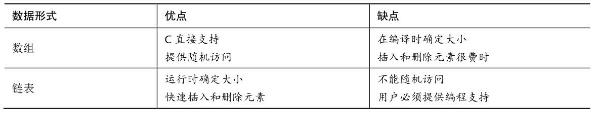

接下来，详细分析插入和删除元素的过程。在数组中插入元素，必须移
动其他元素腾出空位插入新元素，如图17.9所示。新插入的元素离数组开头
越近，要被移动的元素越多。然而，在链表中插入节点，只需给两个指针赋
值，如图17.10所示。类似地，从数组中删除一个元素，也要移动许多相关
的元素。但是从链表中删除节点，只需重新设置一个指针并释放被删除节点
占用的内存即可。

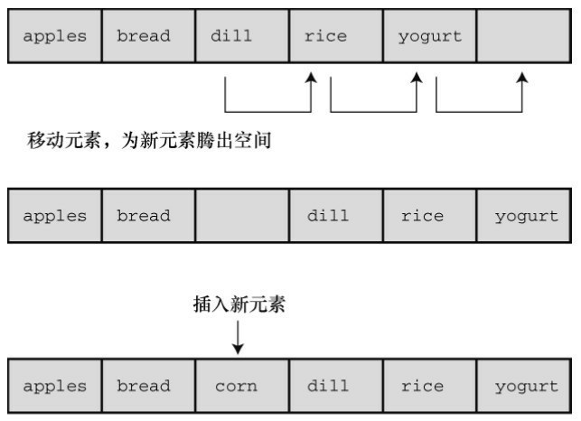

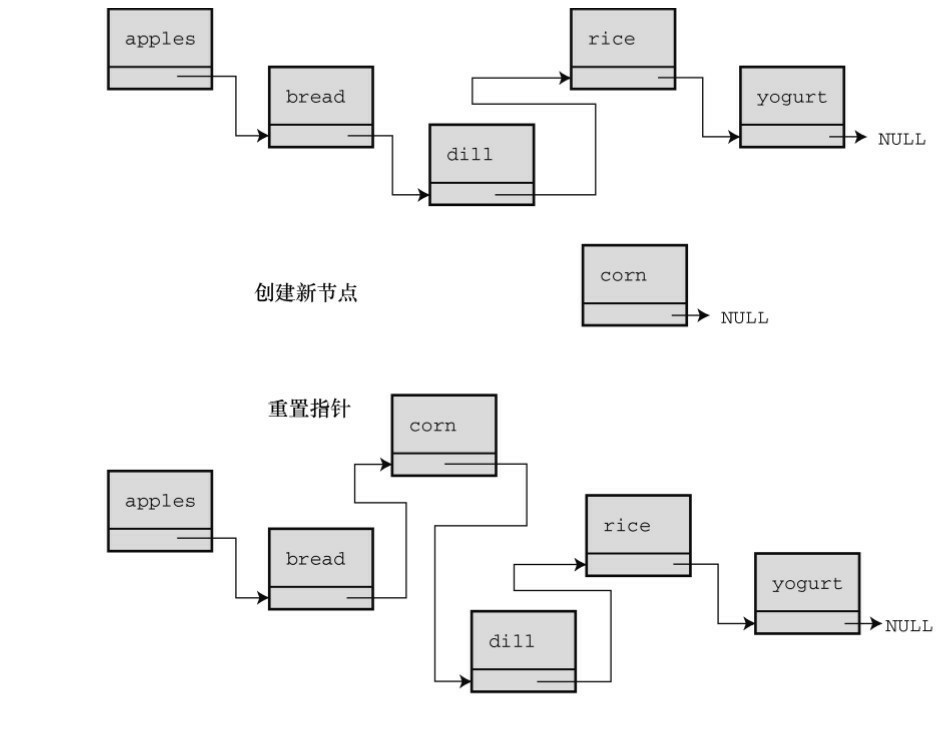

接下来，考虑如何访问元素。对数组而言，可以使用数组下标直接访问
该数组中的任意元素，这叫做随机访问（random access）。对链表而言，必
须从链表首节点开始，逐个节点移动到要访问的节点，这叫做顺序访问
（sequential access）。当然，也可以顺序访问数组。只需按顺序递增数组下
标即可。在某些情况下，顺序访问足够了。例如，显示链表中的每一项，顺
序访问就不错。其他情况用随机访问更合适。

假设要查找链表中的特定项。一种算法是从列表的开头开始按顺序查
找，这叫做顺序查找（sequential search）。如果项并未按某种顺序排列，则
只能顺序查找。如果待查找的项不在链表里，必须查找完所有的项才知道该
项不在链表中（在这种情况下可以使用并发编程，同时查找列表中的不同部
分）。

我们可以先排序列表，以改进顺序查找。这样，就不必查找排在待查找
项后面的项。例如，假设在一个按字母排序的列表中查找Susan。从开头开
始查找每一项，直到Sylvia都没有查找到Susan。这时就可以退出查找，因为
如果Susan在列表中，应该排在Sylvia前面。平均下来，这种方法查找不在列
表中的项的时间减半。

对于一个排序的列表，用二分查找（binary search）比顺序查找好得
多。下面分析二分查找的原理。首先，把待查找的项称为目标项，而且假设
列表中的各项按字母排序。然后，比较列表的中间项和目标项。如果两者相
等，查找结束；假设目标项在列表中，如果中间项排在目标项前面，则目标
项一定在后半部分项中；如果中间项在目标项后面，则目标项一定在前半部
分项中。无论哪种情况，两项比较的结果都确定了下次查找的范围只有列表
的一半。接着，继续使用这种方法，把需要查找的剩下一半的中间项与目标
项比较。同样，这种方法会确定下一次查找的范围是当前查找范围的一半。
以此类推，直到找到目标项或最终发现列表中没有目标项（见图17.11）。
这种方法非常有效率。假如有127个项，顺序查找平均要进行64次比较才能
找到目标项或发现不在其中。但是二分查找最多只用进行7次比较。第1次比
较剩下63项进行比较，第2次比较剩下31项进行比较，以此类推，第6次剩下
最后1项进行比较，第7次比较确定剩下的这个项是否是目标项。一般而言，
n 次比较能处理有 2n-1 个元素的数组。所以项数越多，越能体现二分查找的
优势。

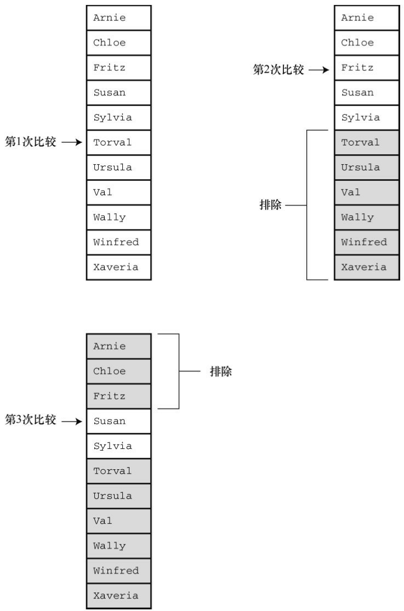

用数组实现二分查找很简单，因为可以使用数组下标确定数组中任意部
分的中点。只要把数组的首元素和尾元素的索引相加，得到的和再除以2 即
可。例如，内含100 个元素的数组，首元素下标是0，尾元素下标是99，那
么用于首次比较的中间项的下标应为(0+99)/2，得49（整数除法）。如果比
较的结果是下标为49的元素在目标项的后面，那么目标项的下标应在0～48
的范围内。所以，第2次比较的中间项的下标应为(0+48)/2，得24。如果中
间项与目标项的比较结果是，中间项在目标项前面，那么第3次比较的中间
项下标应为(25+48)/2，得 36。这体现了随机访问的特性，可以从一个位置
跳至另一个位置，不用一次访问两位置之间的项。但是，链表只支持顺序访
问，不提供跳至中间节点的方法。所以在链表中不能使用二分查找。

如前所述，选择何种数据类型取决于具体的问题。如果因频繁地插入和
删除项导致经常调整大小，而且不需要经常查找，选择链表会更好。如果只
是偶尔插入或删除项，但是经常进行查找，使用数组会更好。

如果需要一种既支持频繁插入和删除项又支持频繁查找的数据形式，数
组和链表都无法胜任，怎么办？这种情况下应该选择二叉查找树。

## 17.7 二叉查找树
二叉查找树是一种结合了二分查找策略的链接结构。二叉树的每个节点
都包含一个项和两个指向其他节点（称为子节点）的指针。图17.12演示了
二叉查找树中的节点是如何链接的。二叉树中的每个节点都包含两个子节点
——左节点和右节点，其顺序按照如下规定确定：左节点的项在父节点的项
前面，右节点的项在父节点的项后面。这种关系存在于每个有子节点的节点
中。进一步而言，所有可以追溯其祖先回到一个父节点的左节点的项，都在
该父节点项的前面；所有以一个父节点的右节点为祖先的项，都在该父节点
项的后面。图17.12中的树以这种方式储存单词。有趣的是，与植物学的树
相反，该树的顶部被称为根（root）。树具有分层组织，所以以这种方式储
存的数据也以等级或层次组织。一般而言，每级都有上一级和下一级。如果
二叉树是满的，那么每一级的节点数都是上一级节点数的两倍。

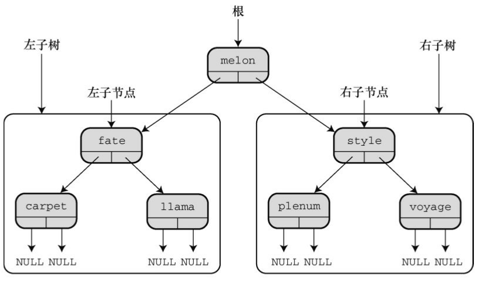

二叉查找树中的每个节点是其后代节点的根，该节点与其后代节点构成
称了一个子树（subtree）。如图 17.12 所示，包含单词fate、carpet和llama的
节点构成了整个二叉树的左子树，而单词 voyage是style-plenum-voyage子树
的右子树。

假设要在二叉树中查找一个项（即目标项）。如果目标项在根节点项的
前面，则只需查找左子树；如果目标项在根节点项的后面，则只需查找右子
树。因此，每次比较就排除半个树。假设查找左子树，这意味着目标项与左
子节点项比较。如果目标项在左子节点项的前面，则只需查找其后代节点的
左半部分，以此类推。与二分查找类似，每次比较都能排除一半的可能匹配
项。

我们用这种方法来查找puppy是否在图17.12的二叉树中。比较puppy和
melon（根节点项），如果puppy在该树中，一定在右子树中。因此，在右子
树中比较puppy和style，发现puppy在style前面，所以必须链接到其左节点。
然后发现该节点是plenum，在puppy前面。现在要向下链接到该节点的右子
节点，但是没有右子节点了。所以经过3次比较后发现puppy不在该树中。

二叉查找树在链式结构中结合了二分查找的效率。但是，这样编程的代
价是构建一个二叉树比创建一个链表更复杂。下面我们在下一个ADT项目中
创建一个二叉树。

### 17.7.1 二叉树ADT
和前面一样，先从概括地定义二叉树开始。该定义假设树不包含相同的
项。许多操作与链表相同，区别在于数据层次的安排。下面建立一个非正式
的树定义：
```c
类型名：    二叉查找树
类型属性：    二叉树要么是空节点的集合（空树），要么是有一个根节点的节点集合
每个节点都有两个子树，叫做左子树和右子树
每个子树本身也是一个二叉树，也有可能是空树
二叉查找树是一个有序的二叉树，每个节点包含一个项，
```

左子树的所有项都在根节点项的前面，右子树的所有项都在根节点项的
后面
```c
类型操作：    初始化树为空
确定树是否为空
确定树是否已满
确定树中的项数
在树中添加一个项
在树中删除一个项
在树中查找一个项
在树中访问一个项
清空树
```

### 17.7.2 二叉查找树接口
原则上，可以用多种方法实现二叉查找树，甚至可以通过操控数组下标
用数组来实现。但是，实现二叉查找树最直接的方法是通过指针动态分配链
式节点。因此我们这样定义：
```c
typedef SOMETHING Item;
typedef struct trnode
{
Item item;
struct trnode * left;
struct trnode * right;
} Trn;
typedef struct tree
{
Trnode * root;
int size;
} Tree;
```

每个节点包含一个项、一个指向左子节点的指针和一个指向右子节点的
指针。可以把 Tree 定义为指向 Trnode 的指针类型，因为只需要知道根节点
的位置就可访问整个树。然而，使用有成员大小的结构能很方便地记录树的
大小。

我们要开发一个维护 Nerfville 宠物俱乐部的花名册，每一项都包含宠
物名和宠物的种类。程序清单17.10就是该花名册的接口。我们把树的大小
限制为10，较小的树便于在树已满时测试程序的行为是否正确。当然，你也
可以把MAXITEMS设置为更大的值。

程序清单17.10 tree.h接口头文件
```c
/* tree.h -- 二叉查找数     */
/*      树种不允许有重复的项 */
#ifndef _TREE_H_
#define _TREE_H_
#include <stdbool.h>
/* 根据具体情况重新定义 Item */
#define SLEN 20
typedef struct item
{
char petname[SLEN];
char petkind[SLEN];
} Item;
#define MAXITEMS 10
typedef struct trnode
{
Item item;
struct trnode * left;   /* 指向左分支的指针 */
struct trnode * right; /* 指向右分支的指针 */
} Trnode;
typedef struct tree
{
Trnode * root;/* 指向根节点的指针     */
int size;   /* 树的项数         */
} Tree;
/* 函数原型 */
/* 操作：   把树初始化为空*/
/* 前提条件：  ptree指向一个树   */
/* 后置条件：  树被初始化为空  */
void InitializeTree(Tree * ptree);
/* 操作：   确定树是否为空            */
/* 前提条件：  ptree指向一个树           */
/* 后置条件：  如果树为空，该函数返回true      */
/*        否则，返回false         */
bool TreeIsEmpty(const Tree * ptree);
/* 操作：   确定树是否已满            */
/* 前提条件：  ptree指向一个树           */
/* 后置条件：  如果树已满，该函数返回true      */
/*        否则，返回false         */
bool TreeIsFull(const Tree * ptree);
/* 操作：   确定树的项数             */
/* 前提条件：  ptree指向一个树           */
/* 后置条件：  返回树的项数             */
int TreeItemCount(const Tree * ptree);
/* 操作：   在树中添加一个项           */
/* 前提条件：  pi是待添加项的地址          */
/*        ptree指向一个已初始化的树    */
/* 后置条件：  如果可以添加，该函数将在树中添加一个项  */
/*        并返回true；否则，返回false   */
bool AddItem(const Item * pi, Tree * ptree);
/* 操作：   在树中查找一个项           */
/* 前提条件：  pi指向一个项            */
/*        ptree指向一个已初始化的树    */
/* 后置条件：  如果在树中添加一个项，该函数返回true  */
/*        否则，返回false         */
bool InTree(const Item * pi, const Tree * ptree);
/* 操作：   从树中删除一个项           */
/* 前提条件：  pi是删除项的地址           */
/*        ptree指向一个已初始化的树    */
/* 后置条件：  如果从树中成功删除一个项，该函数返回true*/
/*        否则，返回false         */
bool DeleteItem(const Item * pi, Tree * ptree);
/* 操作：   把函数应用于树中的每一项        */
/* 前提条件：  ptree指向一个树           */
/*        pfun指向一个函数，       */
/*        该函数接受一个Item类型的参数，并无返回值*/
/* 后置条件：  pfun指向的这个函数为树中的每一项执行一次*/
void Traverse(const Tree * ptree, void(*pfun)(Item item));
/* 操作：   删除树中的所有内容          */
/* 前提条件：  ptree指向一个已初始化的树       */
/* 后置条件：  树为空               */
void DeleteAll(Tree * ptree);
#endif
```

### 17.7.3 二叉树的实现
接下来，我们要实现tree.h中的每个函数。InitializeTree()、
EmptyTree()、FullTree()和TreeItems()函数都很简单，与链表ADT、队列ADT
类似，所以下面着重讲解其他函数。

1. 添加项

在树中添加一个项，首先要检查该树是否有空间放得下一个项。由于我
们定义二叉树时规定其中的项不能重复，所以接下来要检查树中是否有该
项。通过这两步检查后，便可创建一个新节点，把待添加项拷贝到该节点
中，并设置节点的左指针和右指针都为NULL。这表明该节点没有子节点。
然后，更新Tree结构的 size 成员，统计新增了一项。接下来，必须找出应该
把这个新节点放在树中的哪个位置。如果树为空，则应设置根节点指针指向
该新节点。否则，遍历树找到合适的位置放置该节点。AddItem()函数就根
据这个思路来实现，并把一些工作交给几个尚未定义的函数：SeekItem()、
MakeNode()和AddNode()。
```c
bool AddItem(const Item * pi, Tree * ptree)
{
Trnode * new_node;
if (TreeIsFull(ptree))
{
fprintf(stderr, "Tree is full\n");
return false;     /* 提前返回  */
}
if (SeekItem(pi, ptree).child != NULL)
{
fprintf(stderr, "Attempted to add duplicate item\n");
return false;     /* 提前返回  */
}
new_node = MakeNode(pi);  /* 指向新节点 */
if (new_node == NULL)
{
fprintf(stderr, "Couldn't create node\n");
return false;     /* 提前返回  */
}
/* 成功创建了一个新节点 */
ptree->size++;
if (ptree->root == NULL)      /* 情况1：树为空    */
ptree->root = new_node;     /* 新节点是根节点    */
else                /* 情况2：树不为空   */
AddNode(new_node, ptree->root);/* 在树中添加一个节点*/
return true; /* 成功返回 */
}
```

SeekItem()、MakeNode()和 AddNode()函数不是 Tree 类型公共接口的一
部分。它们是隐藏在tree.c文件中的静态函数，处理实现的细节（如节点、
指针和结构），不属于公共接口。

MakeNode()函数相当简单，它处理动态内存分配和初始化节点。该函
数的参数是指向新项的指针，其返回值是指向新节点的指针。如果 malloc()
无法分配所需的内存，则返回空指针。只有成功分配了内存，MakeNode()
函数才会初始化新节点。下面是MakeNode()的代码：
```c
static Trnode * MakeNode(const Item * pi)
{
Trnode * new_node;
new_node = (Trnode *) malloc(sizeof(Trnode));
if (new_node != NULL)
{
new_node->item = *pi;
new_node->left = NULL;
new_node->right = NULL;
}
return new_node;
}
```

AddNode()函数是二叉查找树包中最麻烦的第2个函数。它必须确定新
节点的位置，然后添加新节点。具体来说，该函数要比较新项和根项，以确
定应该把新项放在左子树还是右子树中。如果新项是一个数字，则使用<和
>进行比较；如果新项是一个字符串，则使用strcmp()函数来比较。但是，该
项是内含两个字符串的结构，所以，必须自定义用于比较的函数。如果新项
应放在左子树中，ToLeft()函数（稍后定义）返回true；如果新项应放在右子
树中，ToRight()函数（稍后定义）返回true。这两个函数分别相当于<和>。
假设把新项放在左子树中。如果左子树为空，AddNode()函数只需让左子节
点指针指向新项即可。如果左子树不为空怎么办？此时，AddNode()函数应
该把新项和左子节点中的项做比较，以确定新项应该放在该子节点的左子树
还是右子树。这个过程一直持续到函数发现一个空子树为止，并在此此处添
加新节点。递归是一种实现这种查找过程的方法，即把AddNode()函数应用
于子节点，而不是根节点。当左子树或右子树为空时，即当root->left或root-
>right为NULL时，函数的递归调用序列结束。记住，root是指向当前子树顶
部的指针，所以每次递归调用它都指向一个新的下一级子树（递归详见第9
章）。
```c
static void AddNode(Trnode * new_node, Trnode * root)
{
if (ToLeft(&new_node->item, &root->item))
{
if (root->left == NULL)       /* 空子树 */
root->left = new_node;     /* 所以，在此处添加节点 */
else
AddNode(new_node, root->left); /* 否则，处理该子树*/
}
else if (ToRight(&new_node->item, &root->item))
{
if (root->right == NULL)
root->right = new_node;
else
AddNode(new_node, root->right);
}
else                  /* 不应含有重复的项 */
{
fprintf(stderr, "location error in AddNode()\n");
exit(1);
}
}
```

ToLeft()和ToRight()函数依赖于Item类型的性质。Nerfville宠物俱乐部的
成员名按字母排序。如果两个宠物名相同，按其种类排序。如果种类也相
同，这两项属于重复项，根据该二叉树的定义，这是不允许的。回忆一下，
如果标准C库函数strcmp()中的第1个参数表示的字符串在第2个参数表示的字
符串前面，该函数则返回负数；如果两个字符串相同，该函数则返回0；如
果第1个字符串在第2个字符串后面，该函数则返回正数。ToRight()函数的实
现代码与该函数类似。通过这两个函数完成比较，而不是直接在AddNode()
函数中直接比较，这样的代码更容易适应新的要求。当需要比较不同的数据
形式时，就不必重写整个AddNode()函数，只需重写Toleft()和ToRight()即
可。
```c
static bool ToLeft(const Item * i1, const Item * i2)
{
int comp1;
if ((comp1 = strcmp(i1->petname, i2->petname)) < 0)
return true;
else if (comp1 == 0 &&
strcmp(i1->petkind, i2->petkind) < 0)
return true;
else
return false;
}
```

2. 查找项

3个接口函数都要在树中查找特定项：AddItem()、InItem()和
DeleteItem()。这些函数的实现中使用SeekItem()函数进行查找。DeleteItem()
函数有一个额外的要求：该函数要知道待删除项的父节点，以便在删除子节
点后更新父节点指向子节点的指针。因此，我们设计SeekItem()函数返回的
结构包含两个指针：一个指针指向包含项的节点（如果未找到指定项则为
NULL）；一个指针指向父节点（如果该节点为根节点，即没有父节点，则
为NULL）。这个结构类型的定义如下：
```c
typedef struct pair {
Trnode * parent;
Trnode * child;
} Pair;
```

SeekItem()函数可以用递归的方式实现。但是，为了给读者介绍更多编
程技巧，我们这次使用while循环处理树中从上到下的查找。和AddNode()一
样，SeekItem()也使用ToLeft()和ToRight()在树中导航。开始时，SeekItem()设
置look.child指针指向该树的根节点，然后沿着目标项应在的路径重置
look.child指向后续的子树。同时，设置look.parent指向后续的父节点。如果
没有找到匹配的项， look.child则被设置为NULL。如果在根节点找到匹配的
项，则设置look.parent为NULL，因为根节点没有父节点。下面是SeekItem()
函数的实现代码：
```c
static Pair SeekItem(const Item * pi, const Tree * ptree)
{
Pair look;
look.parent = NULL;
look.child = ptree->root;
if (look.child == NULL)
return look; /* 提前退出 */
while (look.child != NULL)
{
if (ToLeft(pi, &(look.child->item)))
{
look.parent = look.child;
look.child = look.child->left;
}
else if (ToRight(pi, &(look.child->item)))
{
look.parent = look.child;
look.child = look.child->right;
}
else     /* 如果前两种情况都不满足，则必定是相等的情况 */
break;    /* look.child 目标项的节点 */
}
return look;   /* 成功返回 */
}
```

注意，如果 SeekItem()函数返回一个结构，那么该函数可以与结构成员
运算符一起使用。例如， AddItem()函数中有如下的代码：
```c
if (SeekItem(pi, ptree).child != NULL)
```

有了SeekItem()函数后，编写InTree()公共接口函数就很简单了：
```c
bool InTree(const Item * pi, const Tree * ptree)
{
return (SeekItem(pi, ptree).child == NULL) ? false : true;
}
```

3. 考虑删除项

删除项是最复杂的任务，因为必须重新连接剩余的子树形成有效的树。
在准备编写这部分代码之前，必须明确需要做什么。

图17.13演示了最简单的情况。待删除的节点没有子节点，这样的节点
被称为叶节点（leaf）。这种情况只需把父节点中的指针重置为NULL，并使
用free()函数释放已删除节点所占用的内存。

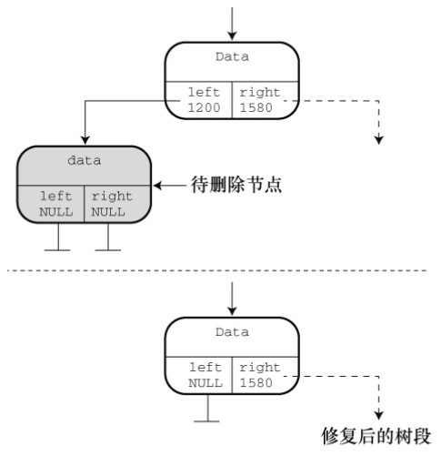

删除带有一个子节点的情况比较复杂。删除该节点会导致其子树与其他
部分分离。为了修正这种情况，要把被删除节点父节点中储存该节点的地址
更新为该节点子树的地址（见图17.14）。

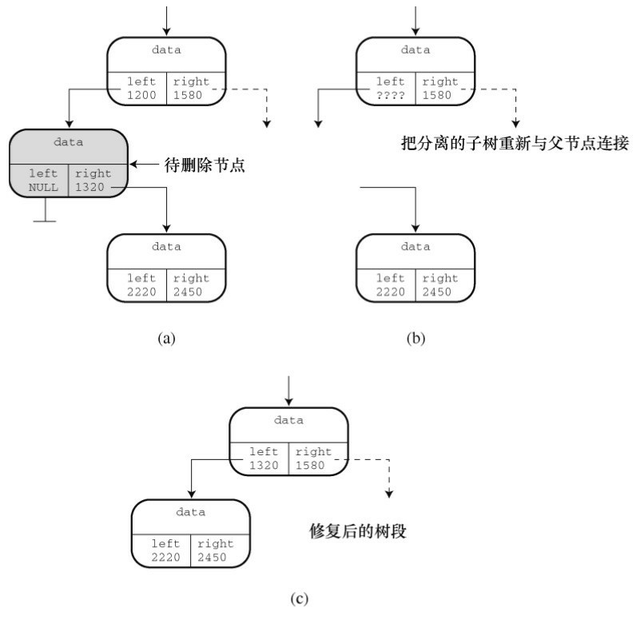

最后一种情况是删除有两个子树的节点。其中一个子树（如左子树）可
连接在被删除节点之前连接的位置。但是，另一个子树怎么处理？牢记树的
基本设计：左子树的所有项都在父节点项的前面，右子树的所有项都在父节
点项的后面。也就是说，右子树的所有项都在左子树所有项的后面。而且，
因为该右子树曾经是被删除节点的父节点的左子树的一部分，所以该右节点
中的所有项在被删除节点的父节点项的前面。想像一下如何在树中从上到下
查找该右子树的头所在的位置。它应该在被删除节点的父节点的前面，所以
要沿着父节点的左子树向下找。但是，该右子树的所有项又在被删除节点左
子树所有项的后面。因此要查看左子树的右支是否有新节点的空位。如果没
有，就要沿着左子树的右支向下找，一直找到一个空位为止。图17.15演示
了这种方法。

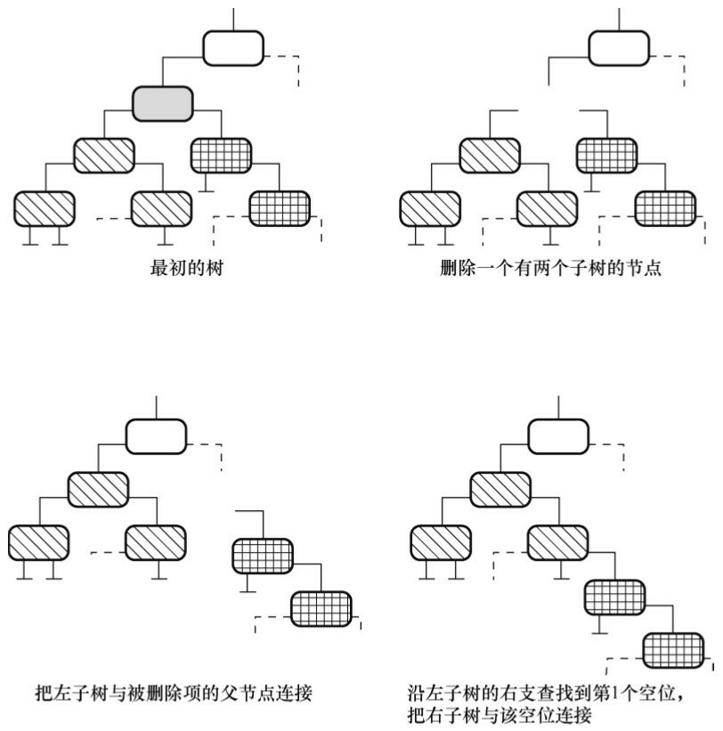

① 删除一个节点

现在可以设计所需的函数了，可以分成两个任务：第一个任务是把特定
项与待删除节点关联；第二个任务是删除节点。无论哪种情况都必须修改待
删除项父节点的指针。因此，要注意以下两点。

该程序必须标识待删除节点的父节点。

为了修改指针，代码必须把该指针的地址传递给执行删除任务的函数。

第一点稍后讨论，下面先分析第二点。要修改的指针本身是Trnode *类
型，即指向Trnode的指针。由于该函数的参数是该指针的地址，所以参数的
类型是Trnode **，即指向指针（该指针指向Trnode）的指针。假设有合适的
地址可用，可以这样编写执行删除任务的函数：
```c
static void DeleteNode(Trnode **ptr)
/* ptr 是指向目标节点的父节点指针成员的地址 */
{
Trnode * temp;
if ((*ptr)->left == NULL)
{
temp = *ptr;
*ptr = (*ptr)->right;
free(temp);
}
else if ((*ptr)->right == NULL)
{
temp = *ptr;
*ptr = (*ptr)->left;
free(temp);
}
else /* 被删除的节点有两个子节点 */
{
/* 找到重新连接右子树的位置 */
for (temp = (*ptr)->left; temp->right != NULL;
temp = temp->right)
continue;
temp->right = (*ptr)->right;
temp = *ptr;
*ptr = (*ptr)->left;
free(temp);
}
}
```

该函数显式处理了 3 种情况：没有左子节点的节点、没有右子节点的节
点和有两个子节点的节点。无子节点的节点可作为无左子节点的节点的特
例。如果该节点没有左子节点，程序就将右子节点的地址赋给其父节点的指
针。如果该节点也没有右子节点，则该指针为NULL。这就是无子节点情况
的值。

注意，代码中用临时指针记录被删除节点的地址。被删除节点的父节点
指针（*ptr）被重置后，程序会丢失被删除节点的地址，但是free()函数需要
这个信息。所以，程序把*ptr的原始值储存在temp中，然后用free()函数使用
temp来释放被删除节点所占用的内存。

有两个子节点的情况，首先在for循环中通过temp指针从左子树的右半
部分向下查找一个空位。找到空位后，把右子树连接于此。然后，再用
temp 保存被删除节点的位置。接下来，把左子树连接到被删除节点的父节
点上，最后释放temp指向的节点。

注意，由于ptr的类型是Trnode **，所以*ptr的类型是Trnode *，与temp的
类型相同。

② 删除一个项

剩下的问题是把一个节点与特定项相关联。可以使用SeekItem()函数来
完成。回忆一下，该函数返回一个结构（内含两个指针，一个指针指向父节
点，一个指针指向包含特定项的节点）。然后就可以通过父节点的指针获得
相应的地址传递给DeleteNode()函数。根据这个思路，DeleteNode()函数的定
义如下：
```c
bool DeleteItem(const Item * pi, Tree * ptree)
{
Pair look;
look = SeekItem(pi, ptree);
if (look.child == NULL)
return false;
if (look.parent == NULL)  /* 删除根节点 */
DeleteNode(&ptree->root);
else if (look.parent->left == look.child)
DeleteNode(&look.parent->left);
else
DeleteNode(&look.parent->right);
ptree->size--;
return true;
}
```

首先，SeekItem()函数的返回值被赋给look类型的结构变量。如果
look.child是NULL，表明未找到指定项，DeleteItem()函数退出，并返回
false。如果找到了指定的Item，该函数分3种情况来处理。第一种情况是，
look.parent的值为NULL，这意味着该项在根节点中。在这情况下，不用更新
父节点，但是要更新Tree结构中根节点的指针。因此，函数该函数把该指针
的地址传递给DeleteNode()函数。否则（即剩下两种情况），程序判断待删
除节点是其父节点的左子节点还是右子节点，然后传递合适指针的地址。

注意，公共接口函数（DeleteItem()）处理的是最终用户所关心的问题
（项和树），而隐藏的DeleteNode()函数处理的是与指针相关的实质性任
务。

4. 遍历树

遍历树比遍历链表更复杂，因为每个节点都有两个分支。这种分支特性
很适合使用分而制之的递归（详见第9章）来处理。对于每一个节点，执行
遍历任务的函数都要做如下的工作：
```c
处理节点中的项；
处理左子树（递归调用）；
处理右子树（递归调用）。
```

可以把遍历分成两个函数来完成：Traverse()和InOrder()。注意，
InOrder()函数处理左子树，然后处理项，最后处理右子树。这种遍历树的顺
序是按字母排序进行。如果你有时间，可以试试用不同的顺序，比如，项-
左子树-右子树或者左子树-右子树-项，看看会发生什么。
```c
void Traverse(const Tree * ptree, void(*pfun)(Item item))
{
if (ptree != NULL)
InOrder(ptree->root, pfun);
}
static void InOrder(const Trnode * root, void(*pfun)(Item item))
{
if (root != NULL)
{
InOrder(root->left, pfun);
(*pfun)(root->item);
InOrder(root->right, pfun);
}
}
```

5. 清空树

清空树基本上和遍历树的过程相同，即清空树的代码也要访问每个节
点，而且要用 free()函数释放内存。除此之外，还要重置Tree类型结构的成
员，表明该树为空。DeleteAll()函数负责处理Tree类型的结构，把释放内存
的任务交给 DeleteAllNode()函数。DeleteAllNode()与 InOrder()函数的构造相
同，它储存了指针的值root->right，使其在释放根节点后仍然可用。下面是
这两个函数的代码：
```c
void DeleteAll(Tree * ptree)
{
if (ptree != NULL)
DeleteAllNodes(ptree->root);
ptree->root = NULL;
ptree->size = 0;
}
static void DeleteAllNodes(Trnode * root)
{
Trnode * pright;
if (root != NULL)
{
pright = root->right;
DeleteAllNodes(root->left);
free(root);
DeleteAllNodes(pright);
}
}
```

6. 完整的包

程序清单17.11演示了整个tree.c的代码。tree.h和tree.c共同组成了树的程
序包。

程序清单17.11 tree.c程序
```c
/* tree.c -- 树的支持函数 */
#include <string.h>
#include <stdio.h>
#include <stdlib.h>
#include "tree.h"
/* 局部数据类型 */
typedef struct pair {
Trnode * parent;
Trnode * child;
} Pair;
/* 局部函数的原型 */
static Trnode * MakeNode(const Item * pi);
static bool ToLeft(const Item * i1, const Item * i2);
static bool ToRight(const Item * i1, const Item * i2);
static void AddNode(Trnode * new_node, Trnode * root);
static void InOrder(const Trnode * root, void(*pfun)(Item item));
static Pair SeekItem(const Item * pi, const Tree * ptree);
static void DeleteNode(Trnode **ptr);
static void DeleteAllNodes(Trnode * ptr);
/* 函数定义 */
void InitializeTree(Tree * ptree)
{
ptree->root = NULL;
ptree->size = 0;
}
bool TreeIsEmpty(const Tree * ptree)
{
if (ptree->root == NULL)
return true;
else
return false;
}
bool TreeIsFull(const Tree * ptree)
{
if (ptree->size == MAXITEMS)
return true;
else
return false;
}
int TreeItemCount(const Tree * ptree)
{
return ptree->size;
}
bool AddItem(const Item * pi, Tree * ptree)
{
Trnode * new_node;
if (TreeIsFull(ptree))
{
fprintf(stderr, "Tree is full\n");
return false;     /* 提前返回  */
}
if (SeekItem(pi, ptree).child != NULL)
{
fprintf(stderr, "Attempted to add duplicate item\n");
return false;     /* 提前返回  */
}
new_node = MakeNode(pi);  /* 指向新节点 */
if (new_node == NULL)
{
fprintf(stderr, "Couldn't create node\n");
return false;     /* 提前返回  */
}
/* 成功创建了一个新节点 */
ptree->size++;
if (ptree->root == NULL)      /* 情况1：树为空    */
ptree->root = new_node;     /* 新节点为树的根节点  */
else                /* 情况2：树不为空   */
AddNode(new_node, ptree->root);/* 在树中添加新节点   */
return true;            /* 成功返回      */
}
bool InTree(const Item * pi, const Tree * ptree)
{
return (SeekItem(pi, ptree).child == NULL) ? false : true;
}
bool DeleteItem(const Item * pi, Tree * ptree)
{
Pair look;
look = SeekItem(pi, ptree);
if (look.child == NULL)
return false;
if (look.parent == NULL)      /* 删除根节点项     */
DeleteNode(&ptree->root);
else if (look.parent->left == look.child)
DeleteNode(&look.parent->left);
else
DeleteNode(&look.parent->right);
ptree->size--;
return true;
}
void Traverse(const Tree * ptree, void(*pfun)(Item item))
{
if (ptree != NULL)
InOrder(ptree->root, pfun);
}
void DeleteAll(Tree * ptree)
{
if (ptree != NULL)
DeleteAllNodes(ptree->root);
ptree->root = NULL;
ptree->size = 0;
}
/* 局部函数 */
static void InOrder(const Trnode * root, void(*pfun)(Item item))
{
if (root != NULL)
{
InOrder(root->left, pfun);
(*pfun)(root->item);
InOrder(root->right, pfun);
}
}
static void DeleteAllNodes(Trnode * root)
{
Trnode * pright;
if (root != NULL)
{
pright = root->right;
DeleteAllNodes(root->left);
free(root);
DeleteAllNodes(pright);
}
}
static void AddNode(Trnode * new_node, Trnode * root)
{
if (ToLeft(&new_node->item, &root->item))
{
if (root->left == NULL)       /* 空子树       */
root->left = new_node;     /* 把节点添加到此处   */
else
AddNode(new_node, root->left); /* 否则处理该子树    */
}
else if (ToRight(&new_node->item, &root->item))
{
if (root->right == NULL)
root->right = new_node;
else
AddNode(new_node, root->right);
}
else                  /* 不允许有重复项   
*/
{
fprintf(stderr, "location error in AddNode()\n");
exit(1);
}
}
static bool ToLeft(const Item * i1, const Item * i2)
{
int comp1;
if ((comp1 = strcmp(i1->petname, i2->petname)) < 0)
return true;
else if (comp1 == 0 &&strcmp(i1->petkind, i2->petkind) < 0)
return true;
else
return false;
}
static bool ToRight(const Item * i1, const Item * i2)
{
int comp1;
if ((comp1 = strcmp(i1->petname, i2->petname)) > 0)
return true;
else if (comp1 == 0 &&
strcmp(i1->petkind, i2->petkind) > 0)
return true;
else
return false;
}
static Trnode * MakeNode(const Item * pi)
{
Trnode * new_node;
new_node = (Trnode *) malloc(sizeof(Trnode));
if (new_node != NULL)
{
new_node->item = *pi;
new_node->left = NULL;
new_node->right = NULL;
}
return new_node;
}
static Pair SeekItem(const Item * pi, const Tree * ptree)
{
Pair look;
look.parent = NULL;
look.child = ptree->root;
if (look.child == NULL)
return look;          /* 提前返回  */
while (look.child != NULL)
{
if (ToLeft(pi, &(look.child->item)))
{
look.parent = look.child;
look.child = look.child->left;
}
else if (ToRight(pi, &(look.child->item)))
{
look.parent = look.child;
look.child = look.child->right;
}
else       /* 如果前两种情况都不满足，则必定是相等的情
况   */
break;    /* look.child 目标项的节点          */
}
return look;          /* 成功返回 */
}
static void DeleteNode(Trnode **ptr)
/* ptr 是指向目标节点的父节点指针成员的地址 */
{
Trnode * temp;
if ((*ptr)->left == NULL)
{
temp = *ptr;
*ptr = (*ptr)->right;
free(temp);
}
else if ((*ptr)->right == NULL)
{
temp = *ptr;
*ptr = (*ptr)->left;
free(temp);
}
else  /* 被删除的节点有两个子节点 */
{
/* 找到重新连接右子树的位置 */
for (temp = (*ptr)->left; temp->right != NULL;temp = temp->right)
continue;
temp->right = (*ptr)->right;
temp = *ptr;
*ptr = (*ptr)->left;
free(temp);
}
}
```

### 17.7.4 使用二叉树
现在，有了接口和函数的实现，就可以使用它们了。程序清单17.12中
的程序以菜单的方式提供选择：向俱乐部成员花名册添加宠物、显示成员列
表、报告成员数量、核实成员及退出。main()函数很简单，主要提供程序的
大纲。具体工作主要由支持函数来完成。

程序清单17.12 petclub.c程序
```c
/* petclub.c -- 使用二叉查找数 */
#include <stdio.h>
#include <string.h>
#include <ctype.h>
#include "tree.h"
char menu(void);
void addpet(Tree * pt);
void droppet(Tree * pt);
void showpets(const Tree * pt);
void findpet(const Tree * pt);
void printitem(Item item);
void uppercase(char * str);
char * s_gets(char * st, int n);
int main(void)
{
Tree pets;
char choice;
InitializeTree(&pets);
while ((choice = menu()) != 'q')
{
switch (choice)
{
case 'a':  addpet(&pets);
break;
case 'l':  showpets(&pets);
break;
case 'f':  findpet(&pets);
break;
case 'n':  printf("%d pets in club\n",
TreeItemCount(&pets));
break;
case 'd':  droppet(&pets);
break;
default:  puts("Switching error");
}
}
DeleteAll(&pets);
puts("Bye.");
return 0;
}
char menu(void)
{
int ch;
puts("Nerfville Pet Club Membership Program");
puts("Enter the letter corresponding to your choice:");
puts("a) add a pet       l) show list of pets");
puts("n) number of pets   f) find pets");
puts("d) delete a pet     q) quit");
while ((ch = getchar()) != EOF)
{
while (getchar() != '\n') /* 处理输入行的剩余内容 */
continue;
ch = tolower(ch);
if (strchr("alrfndq", ch) == NULL)
puts("Please enter an a, l, f, n, d, or q:");
else
break;
}
if (ch == EOF)   /* 使程序退出 */
ch = 'q';
return ch;
}
void addpet(Tree * pt)
{
Item temp;
if (TreeIsFull(pt))
puts("No room in the club!");
else
{
puts("Please enter name of pet:");
s_gets(temp.petname, SLEN);
puts("Please enter pet kind:");
s_gets(temp.petkind, SLEN);
uppercase(temp.petname);
uppercase(temp.petkind);
AddItem(&temp, pt);
}
}
void showpets(const Tree * pt)
{
if (TreeIsEmpty(pt))
puts("No entries!");
else
Traverse(pt, printitem);
}
void printitem(Item item)
{
printf("Pet: %-19s  Kind: %-19s\n", item.petname,item.petkind);
}
void findpet(const Tree * pt)
{
Item temp;
if (TreeIsEmpty(pt))
{
puts("No entries!");
return;  /* 如果树为空，则退出该函数 */
}
puts("Please enter name of pet you wish to find:");
s_gets(temp.petname, SLEN);
puts("Please enter pet kind:");
s_gets(temp.petkind, SLEN);
uppercase(temp.petname);
uppercase(temp.petkind);
printf("%s the %s ", temp.petname, temp.petkind);
if (InTree(&temp, pt))
printf("is a member.\n");
else
printf("is not a member.\n");
}
void droppet(Tree * pt)
{
Item temp;
if (TreeIsEmpty(pt))
{
puts("No entries!");
return;  /* 如果树为空，则退出该函数 */
}
puts("Please enter name of pet you wish to delete:");
s_gets(temp.petname, SLEN);
puts("Please enter pet kind:");
s_gets(temp.petkind, SLEN);
uppercase(temp.petname);
uppercase(temp.petkind);
printf("%s the %s ", temp.petname, temp.petkind);
if (DeleteItem(&temp, pt))
printf("is dropped from the club.\n");
else
printf("is not a member.\n");
}
void uppercase(char * str)
{
while (*str)
{
*str = toupper(*str);
str++;
}
}
char * s_gets(char * st, int n)
{
char * ret_val;
char * find;
ret_val = fgets(st, n, stdin);
if (ret_val)
{
find = strchr(st, '\n');  // 查找换行符
if (find)        // 如果地址不是 NULL，
*find = '\0';     // 在此处放置一个空字符
else
while (getchar() != '\n')
continue;    // 处理输入行的剩余内容
}
return ret_val;
}
```

该程序把所有字母都转换为大写字母，所以SNUFFY、Snuffy和snuffy都
被视为相同。下面是该程序的一个运行示例：
```c
Nerfville Pet Club Membership Program
Enter the letter corresponding to your choice:
a) add a pet        l) show list of pets
n) number of pets     f) find pets
q) quit
a
Please enter name of pet:
Quincy
Please enter pet kind:
pig
Nerfville Pet Club Membership Program
Enter the letter corresponding to your choice:
a) add a pet        l) show list of pets
n) number of pets     f) find pets
q) quit
a
Please enter name of pet:
Bennie Haha
Please enter pet kind:
parrot
Nerfville Pet Club Membership Program
Enter the letter corresponding to your choice:
a) add a pet        l) show list of pets
n) number of pets     f) find pets
q) quit
a
Please enter name of pet:
Hiram Jinx
Please enter pet kind:
domestic cat
Nerfville Pet Club Membership Program
Enter the letter corresponding to your choice:
a) add a pet        l) show list of pets
n) number of pets     f) find pets
q) quit
n
3 pets in club
Nerfville Pet Club Membership Program
Enter the letter corresponding to your choice:
a) add a pet        l) show list of pets
n) number of pets     f) find pets
q) quit
l
Pet: BENNIE HAHA         Kind: PARROT
Pet: HIRAM JINX          Kind: DOMESTIC CAT
Pet: QUINCY             Kind: PIG
Nerfville Pet Club Membership Program
Enter the letter corresponding to your choice:
a) add a pet        l) show list of pets
n) number of pets     f) find pets
q) quit
q
Bye.
```

### 17.7.5 树的思想
二叉查找树也有一些缺陷。例如，二叉查找树只有在满员（或平衡）时
效率最高。假设要储存用户随机输入的单词。该树的外观应如图17.12所
示。现在，假设用户按字母顺序输入数据，那么每个新节点应该被添加到右
边，该树的外观应如图17.16所示。图17.12所示是平衡的树，图17.16所示是
不平衡的树。查找这种树并不比查找链表要快。

避免串状树的方法之一是在创建树时多加注意。如果树或子树的一边或
另一边太不平衡，就需要重新排列节点使之恢复平衡。与此类似，可能在进
行删除操作后要重新排列树。俄国数学家Adel’son-Vel’skii和Landis发明了一
种算法来解决这个问题。根据他们的算法创建的树称为AVL树。因为要重
构，所以创建一个平衡的树所花费的时间更多，但是这样的树可以确保最大
化搜索效率。

你可能需要一个能储存相同项的二叉查找树。例如，在分析一些文本
时，统计某个单词在文本中出现的次数。一种方法是把 Item 定义成包含一
个单词和一个数字的结构。第一次遇到一个单词时，将其添加到树中，并且
该单词的数量加 1。下一次遇到同样的单词时，程序找到包含该单词的节
点，并递增表示该单词数量的值。把基本二叉查找树修改成具有这一特性，
不费多少工夫。

考虑Nerfville宠物俱乐部的示例，有另一种情况。示例中的树根据宠物
的名字和种类进行排列，所以，可以把名为Sam的猫储存在一个节点中，把
名为Sam的狗储存在另一节点中，把名为Sam的山羊储存在第3个节点中。但
是，不能储存两只名为Sam的猫。另一种方法是以名字来排序，但是这样做
只能储存一个名为Sam的宠物。还需要把Item定义成多个结构，而不是一个
结构。第一次出现Sally时，程序创建一个新的节点，并创建一个新的列
表，然后把Sally及其种类添加到列表中。下一次出现Sally时，程序将定位
到之前储存Sally的节点，并把新的数据添加到结构列表中。

提示 插件库

读者可能意识到实现一个像链表或树这样的ADT比较困难，很容易犯
错。插件库提供了一种可选的方法：让其他人来完成这些工作和测试。在学
完本章这两个相对简单的例子后，读者应该能很好地理解和认识这样的库。

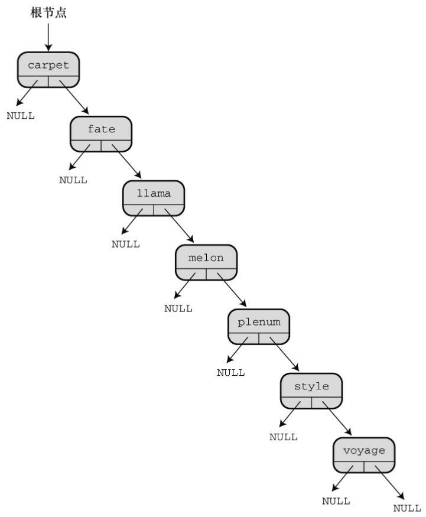

## 17.8 其他说明
本书中，我们涵盖了C语言的基本特性，但是只是简要介绍了库。ANSI
C库中包含多种有用的函数。绝大部分实现都针对特定的系统提供扩展库。
基于Windows的编译器支持Windows图形接口。Macintosh C编译器提供访问
Macintosh 工具箱的函数，以便编写具有标准 Macintosh 接口或 iOS 系统的程
序产品，如iPhone或iPad。与此类似，还有一些工具用于创建Linux程序的图
形接口。花时间查看你的系统提供什么。如果没有你想要的工具，就自己编
写函数。这是C的一部分。如果认为自己能编写一个更好的（如，输入函
数），那就去做！随着你不断练习并提高自己的编程技术，会从一名新手成
为经验丰富的资深程序员。

如果对链表、队列和树的相关概念感兴趣或觉得很有用，可以阅读其他
相关的书籍，学习高级编程技巧。计算机科学家在开发和分析算法以及如何
表示数据方面投入了大量的时间和精力。也许你会发现已经有人开发了你正
需要的工具。

学会C语言后，你可能想研究C++、Objectiv C或Java。这些都是以C为
基础的面向对象（object-oriented）语言。C已经涵盖了从简单的char类型变
量到大型且复杂的结构在内的数据对象。面向对象语言更进一步发展了对象
的观点。例如，对象的性质不仅包括它所储存的信息类型，而且还包括了对
其进行的操作类型。本章介绍的ADT就遵循了这种模式。而且，对象可以继
承其他对象的属性。OOP提供比C更高级的抽象，很适合编写大型程序。

请参阅附录B中的参考资料I“补充阅读”中找到你感兴趣的书籍。

## 17.9 关键概念
一种数据类型通过以下几点来表征：如何构建数据、如何储存数据、有
哪些可能的操作。抽象数据类型（ADT）以抽象的方式指定构成某种类型特
征的属性和操作。从概念上看，可以分两步把ADT翻译成一种特定的编程语
言。第1步是定义编程接口。在C中，通过使用头文件定义类型名，并提供
与允许的操作相应的函数原型来实现。第2步是实现接口。在C中，可以用
源代码文件提供与函数原型相应的函数定义来实现。

## 17.10 本章小结
链表、队列和二叉树是ADT在计算机程序设计中常用的示例。通常用动
态内存分配和链式结构来实现它们，但有时用数组来实现会更好。

当使用一种特定类型（如队列或树）进行编程时，要根据类型接口来编
写程序。这样，在修改或改进实现时就不用更改使用接口的那些程序。

## 17.11 复习题
1. 定义一种数据类型涉及哪些内容？

2. 为什么程序清单17.2 只能沿一个方向遍历链表？如何修改struct film定
义才能沿两个方向遍历链表？

3. 什么是ADT？

4. QueueIsEmpty()函数接受一个指向queue结构的指针作为参数，但是也
可以将其编写成接受一个queue结构作为参数。这两种方式各有什么优缺
点？

5. 栈（stack）是链表系列的另一种数据形式。在栈中，只能在链表的一
端添加和删除项，项被“压入”栈和“弹出”栈。因此，栈是一种LIFO（即后进
先出last in,first out）结构。
```c
a.设计一个栈ADT
b.为栈设计一个C编程接口，例如stack.h头文件
```

6. 在一个含有3个项的分类列表中，判断一个特定项是否在该列表中，
用顺序查找和二叉查找方法分别需要最多多少次？当列表中有1023个项时分
别是多少次？65535个项是分别是多少次？

7. 假设一个程序用本章介绍的算法构造了一个储存单词的二叉查找树。
假设根据下面所列的顺序输入

单词，请画出每种情况的树：
```c
a.nice food roam dodge gate office wave
b.wave roam office nice gate food dodge
c.food dodge roam wave office gate nice
d.nice roam office food wave gate dodge
```

8. 考虑复习题7构造的二叉树，根据本章的算法，删除单词food之后，
各树是什么样子？

## 17.12 编程练习
1. 修改程序清单17.2，让该程序既能正序也能逆序显示电影列表。一种
方法是修改链表的定义，可以双向遍历链表。另一种方法是用递归。

2. 假设list.h（程序清单17.3）使用下面的list定义：
```c
typedef struct list
{
Node * head;  /* 指向list的开头 */
Node * end;/* 指向list的末尾 */
} List;
```

重写 list.c（程序清单 17.5）中的函数以适应新的定义，并通过
films.c（程序清单 17.4）测试最终的代码。

3. 假设list.h（程序清单17.3）使用下面的list定义：
```c
#define MAXSIZE 100
typedef struct list
{
Item entries[MAXSIZE]; /* 内含项的数组 */
int items;       /* list中的项数 */
} List;
```

重写 list.c（程序清单 17.5）中的函数以适应新的定义，并通过
films.c（程序清单 17.4）测试最终的代码。

4. 重写mall.c（程序清单17.7），用两个队列模拟两个摊位。

5. 编写一个程序，提示用户输入一个字符串。然后该程序把该字符串的
字符逐个压入一个栈（参见复习题5），然后从栈中弹出这些字符，并显示
它们。结果显示为该字符串的逆序。

6. 编写一个函数接受 3 个参数：一个数组名（内含已排序的整数）、该
数组的元素个数和待查找的整数。如果待查找的整数在数组中，那么该函数
返回 1；如果该数不在数组中，该函数则返回 0。用二分查找法实现。

7. 编写一个程序，打开和读取一个文本文件，并统计文件中每个单词出
现的次数。用改进的二叉查找树储存单词及其出现的次数。程序在读入文件
后，会提供一个有3个选项的菜单。第1个选项是列出所有的单词和出现的次
数。第2个选项是让用户输入一个单词，程序报告该单词在文件中出现的次
数。第3个选项是退出。

8. 修改宠物俱乐部程序，把所有同名的宠物都储存在同一个节点中。当
用户选择查找宠物时，程序应询问用户该宠物的名字，然后列出该名字的所
有宠物（及其种类）。


