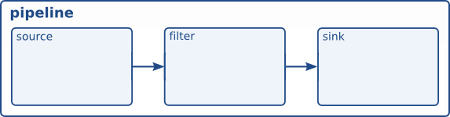
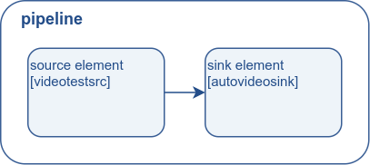

# 基础教程 2：GStreamer 概念

## 目标

上一篇教程演示了如何自动构建管道。现在我们将手动构建管道，方法是实例化每个元素并将它们全部连接起来。在此过程中，我们将学习：

- 什么是 GStreamer 元素以及如何创建 GStreamer 元素。

- 如何将各个元素连接起来。

- 如何自定义元素的行为。

- 如何监控总线上的错误情况并从 GStreamer 消息中提取信息。

## 手动 Hello World

将此代码复制到名为（或在您的 GStreamer 安装目录中查找）的文本文件中。basic-tutorial-2.c

基础教程-2.c

```c
#include <gst/gst.h>

#ifdef __APPLE__
#include <TargetConditionals.h>
#endif

int
tutorial_main (int argc, char *argv[])
{
  GstElement *pipeline, *source, *sink;
  GstBus *bus;
  GstMessage *msg;
  GstStateChangeReturn ret;

  /* Initialize GStreamer */
  gst_init (&argc, &argv);

  /* Create the elements */
  source = gst_element_factory_make ("videotestsrc", "source");
  sink = gst_element_factory_make ("autovideosink", "sink");

  /* Create the empty pipeline */
  pipeline = gst_pipeline_new ("test-pipeline");

  if (!pipeline || !source || !sink) {
    g_printerr ("Not all elements could be created.\n");
    return -1;
  }

  /* Build the pipeline */
  gst_bin_add_many (GST_BIN (pipeline), source, sink, NULL);
  if (gst_element_link (source, sink) != TRUE) {
    g_printerr ("Elements could not be linked.\n");
    gst_object_unref (pipeline);
    return -1;
  }

  /* Modify the source's properties */
  g_object_set (source, "pattern", 0, NULL);

  /* Start playing */
  ret = gst_element_set_state (pipeline, GST_STATE_PLAYING);
  if (ret == GST_STATE_CHANGE_FAILURE) {
    g_printerr ("Unable to set the pipeline to the playing state.\n");
    gst_object_unref (pipeline);
    return -1;
  }

  /* Wait until error or EOS */
  bus = gst_element_get_bus (pipeline);
  msg =
      gst_bus_timed_pop_filtered (bus, GST_CLOCK_TIME_NONE,
      GST_MESSAGE_ERROR | GST_MESSAGE_EOS);

  /* Parse message */
  if (msg != NULL) {
    GError *err;
    gchar *debug_info;

    switch (GST_MESSAGE_TYPE (msg)) {
      case GST_MESSAGE_ERROR:
        gst_message_parse_error (msg, &err, &debug_info);
        g_printerr ("Error received from element %s: %s\n",
            GST_OBJECT_NAME (msg->src), err->message);
        g_printerr ("Debugging information: %s\n",
            debug_info ? debug_info : "none");
        g_clear_error (&err);
        g_free (debug_info);
        break;
      case GST_MESSAGE_EOS:
        g_print ("End-Of-Stream reached.\n");
        break;
      default:
        /* We should not reach here because we only asked for ERRORs and EOS */
        g_printerr ("Unexpected message received.\n");
        break;
    }
    gst_message_unref (msg);
  }

  /* Free resources */
  gst_object_unref (bus);
  gst_element_set_state (pipeline, GST_STATE_NULL);
  gst_object_unref (pipeline);
  return 0;
}

int
main (int argc, char *argv[])
{
#if defined(__APPLE__) && TARGET_OS_MAC && !TARGET_OS_IPHONE
  return gst_macos_main ((GstMainFunc) tutorial_main, argc, argv, NULL);
#else
  return tutorial_main (argc, argv);
#endif
}
```

    需要帮助吗？
    如果您在编译此代码时需要帮助，请参阅 适用于您平台（Linux、Mac OS X或Windows）的“构建教程”部分，或者在 Linux 上使用以下特定命令：
    gcc basic-tutorial-2.c -o basic-tutorial-2 `pkg-config --cflags --libs gstreamer-1.0`
    如果您需要帮助运行此代码，请参阅适用于您平台的“运行教程”部分： Linux、Mac OS X [ 2 ] 或Windows。
    本教程会打开一个窗口并显示测试图案，但没有音频。
    所需库：gstreamer-1.0

## 攻略

这些 elements 是 GStreamer 的基本构建模块。它们处理从 source elements (data producers) 向下游流向  sink elements (data consumers) 的数据，数据在流经过程中会经过 filter elements 。



### elements 创建

我们将跳过 GStreamer 初始化步骤，因为它与之前的教程相同：

```c
  /* Create the elements */
  source = gst_element_factory_make ("videotestsrc", "source");
  sink = gst_element_factory_make ("autovideosink", "sink");
```

如本代码所示，可以使用`gst_element_factory_make ()` 创建新元素。第一个参数是要创建的元素类型（基础教程 14：实用元素展示了一些常见类型，基础教程 10：GStreamer 工具展示了如何获取所有可用类型的列表）。第二个参数是我们要为该特定实例指定的名称。给元素命名有助于在未保留指针的情况下稍后检索它们（并且有助于生成更有意义的调试输出）。但是，如果将名称设置为NULL ，GStreamer 将为您分配一个唯一的名称。

本教程中，我们将创建两个元素：videotestsrc和autovideosink。没有过滤器元素。因此，管道结构如下所示：



videotestsrc是一个源元素（它产生数据），用于创建测试视频模式。该元素用于调试（和教程），通常在实际应用程序中不会出现。

autovideosink是一个接收器元素（它接收数据），会将接收到的图像显示在窗口中。根据操作系统不同，存在多种视频接收器，功能也各不相同。autovideosink 会自动选择并实例化最佳的接收器，因此您无需担心细节，代码也更具平台无关性。

### pipeline 创建

```c
  /* Create the empty pipeline */
  pipeline = gst_pipeline_new ("test-pipeline");
```

GStreamer 中的所有 elements 通常必须先包含在管道中才能使用，因为它负责处理一些时钟和消息传递功能。我们使用gst_pipeline_new () 创建管道。

```c
  /* Build the pipeline */
  gst_bin_add_many (GST_BIN (pipeline), source, sink, NULL);
  if (gst_element_link (source, sink) != TRUE) {
    g_printerr ("Elements could not be linked.\n");
    gst_object_unref (pipeline);
    return -1;
  }
```

pipeline 是一种特殊的容器，用于容纳其他元素。因此，适用于容器的所有方法也适用于 pipeline 。

在本例中，我们调用`gst_bin_add_many ()` 函数将 elements 添加到 pipeline 中（注意类型转换）。该函数接受一个待添加 elements 的列表，列表末尾为`NULL` 。可以使用`gst_bin_add ()`函数添加单个 elements 。

然而，这些元素之间尚未建立链接。为此，我们需要使用`gst_element_link ()` 函数。它的第一个参数是源 elements ，第二个参数是目标 elements 。顺序很重要，因为链接必须按照数据流的方向建立（即从源 elements 到目标 elements ）。请记住，只有位于同一容器中的 elements 才能链接在一起，因此请务必在尝试链接之前将它们添加到 pipeline 中！

### 特性

GStreamer elements 都是GObject的一种特殊类型，GObject 是提供属性功能的实体。

大多数 GStreamer elements 都有可自定义的属性：可以修改的命名属性，用于改变 elements 的行为（可写属性），或者可以查询以了解 elements 的内部状态（可读属性）。

使用g_object_get ()读取属性，使用g_object_set ()写入属性。

g_object_set () 接受以NULL结尾的属性名称、属性值对列表，因此可以一次性更改多个属性。

这就是为什么属性处理方法带有g_前缀的原因。

回到上面的例子，

```c
  /* Modify the source's properties */
  g_object_set (source, "pattern", 0, NULL);
```

上面的代码行更改了videotestsrc的“pattern”属性，该属性控制 elements 输出的测试视频类型。尝试不同的值！

可以使用基本教程 10：GStreamer 工具中描述的 gst-inspect-1.0 工具来查找 elements 公开的所有属性的名称和可能的值，或者也可以在该 elements 的文档中找到（这里以 videotestsrc 为例）。

### 错误检查

至此，我们已经构建并设置好了整个流程，本教程的其余部分与前面的部分非常相似，但我们将添加更多的错误检查：

```c
  /* Start playing */
  ret = gst_element_set_state (pipeline, GST_STATE_PLAYING);
  if (ret == GST_STATE_CHANGE_FAILURE) {
    g_printerr ("Unable to set the pipeline to the playing state.\n");
    gst_object_unref (pipeline);
    return -1;
  }
```

我们调用gst_element_set_state () 函数，但这次我们会检查其返回值是否存在错误。状态更改是一个精细的过程，更多细节请参见基础教程 3：动态管道。

```c
  /* Wait until error or EOS */
  bus = gst_element_get_bus (pipeline);
  msg =
      gst_bus_timed_pop_filtered (bus, GST_CLOCK_TIME_NONE,
      GST_MESSAGE_ERROR | GST_MESSAGE_EOS);

  /* Parse message */
  if (msg != NULL) {
    GError *err;
    gchar *debug_info;

    switch (GST_MESSAGE_TYPE (msg)) {
      case GST_MESSAGE_ERROR:
        gst_message_parse_error (msg, &err, &debug_info);
        g_printerr ("Error received from element %s: %s\n",
            GST_OBJECT_NAME (msg->src), err->message);
        g_printerr ("Debugging information: %s\n",
            debug_info ? debug_info : "none");
        g_clear_error (&err);
        g_free (debug_info);
        break;
      case GST_MESSAGE_EOS:
        g_print ("End-Of-Stream reached.\n");
        break;
      default:
        /* We should not reach here because we only asked for ERRORs and EOS */
        g_printerr ("Unexpected message received.\n");
        break;
    }
    gst_message_unref (msg);
  }
```

`gst_bus_timed_pop_filtered ()` 会等待执行结束并返回一个我们之前忽略的GstMessage 。我们要求`gst_bus_timed_pop_filtered ()` 在 GStreamer 遇到错误或EOS时返回，因此我们需要检查发生了什么，并在屏幕上打印一条消息（您的应用程序可能需要执行更复杂的操作）。

GstMessage是一种非常通用的数据结构，几乎可以传递任何类型的信息。幸运的是，GStreamer 为每种类型的消息都提供了一系列解析函数。

在这种情况下，一旦我们确定消息包含错误（通过使用 GST_MESSAGE_TYPE () 宏），我们就可以使用 gst_message_parse_error () 函数，该函数会返回一个 GLib GError错误结构体和一个用于调试的字符串。请查看代码，了解这些资源是如何被使用和释放的。

### GStreamer bus

此时有必要更正式地介绍一下 GStreamer bus。它负责将 elements 生成的GstMessage按顺序传递给应用程序线程。最后一点很重要，因为实际的媒体流传输是在应用程序线程之外的另一个线程中完成的。

可以使用`gst_bus_timed_pop_filtered ()` 及其类似函数同步地从总线中提取消息 ，也可以使用信号异步提取（将在下一个教程中介绍）。您的应用程序应始终监控 bus ，以便及时收到错误和其他播放相关问题的通知。

其余代码是清理序列，与基础教程 1：Hello world! 中的清理序列相同。

## 锻炼

如果你想练习一下，可以试试这个练习：在这个 pipeline 的源和接收器之间添加一个视频滤镜元素。使用 VertigoTV可以获得不错的效果。你需要创建这个滤镜，将其添加到 pipeline 中，并将其与其他 elements 链接起来。

根据您的平台和可用插件，您可能会遇到“协商”错误，因为接收器无法理解过滤器生成的内容（有关协商的更多信息，请参阅基础教程 6：媒体格式和 Pad 功能）。在这种情况下，请尝试在过滤器后添加一个名为videoconvert 的 elements （即，构建一个包含 4 个 elements 的管道。有关 videoconvert 的更多信息，请参阅基础教程 14：实用 elements ）。

## 结论

本教程展示了：

- 如何使用gst_element_factory_make ()创建 elements

- 如何使用gst_pipeline_new ()创建一个空 pipeline

- 如何使用gst_bin_add_many ()向 pipeline 添加 elements

- 如何使用gst_element_link ()将 elements 彼此链接起来？

至此，关于 GStreamer 基本概念的两篇教程中的第一篇就结束了。第二篇教程将在下文中介绍。

请记住，本页面附有教程的完整源代码以及构建教程所需的任何辅助文件。

很高兴您能来，期待很快再见到您！


