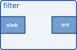
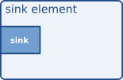

# 基础教程3：动态管道

## 目标

本教程展示了使用 GStreamer 所需的其余基本概念，它允许在信息可用时“动态”构建 pipeline ，而不是在应用程序开始时定义一个整体 pipeline 。

完成本教程后，您将具备开始学习 回放教程所需的知识。本教程将涵盖以下要点：

- 如何在链接 elements 时实现更精细的控制。

- 如何及时收到有关有趣事件的通知，以便及时做出反应。

- elements 可以处于的各种状态。

## 介绍

正如你即将看到的，本教程中的 pipeline 在设置为播放状态之前并未完全构建完成。这没关系。如果我们不采取进一步措施，数据将到达 pipeline 末端， pipeline 将产生错误消息并停止运行。但我们将采取进一步措施……

在这个例子中，我们打开的是一个多路复用（或混合）文件，也就是说，音频和视频被一起存储在一个容器文件中。负责打开这种容器的组件称为 demuxers ，一些常见的容器格式包括 Matroska (MKV)、QuickTime (QT、MOV)、Ogg 或 Advanced Systems Format (ASF、WMV、WMA)。

如果容器嵌入了多个流（例如，一个视频流和两个音频流）， demuxers 会将它们分离并通过不同的输出端口输出。这样，就可以在 pipeline 中创建不同的分支，分别处理不同类型的数据。

GStreamer elements 之间通信所用的端口称为 pad（[GstPad]）。Pad 分为 sink pad 和 source pad，数据通过 sink pad 进入 elements ，数据通过 source pad 离开 elements 。因此， source elements 只包含 source pad， sink elements 只包含 elements pad，而 filter elements 则同时包含 sink pad 和 source pad。






demuxers 包含一个 sink pad （用于接收复用数据）和多个 source pad ，容器中的每个数据流对应一个 source pad ：


为了完整起见，这里提供了一个简化的 pipeline ，其中包含一个 demuxers 和两个分支，分别用于音频和视频。但这 并非本示例中将要构建的 pipeline ：


处理 demuxers 时的主要难点在于，它们必须先接收到一些数据，并有机会查看容器内部的内容，才能生​​成任何信息。也就是说， demuxers 启动时没有任何源数据位，其他 elements 无法与之连接，因此 pipeline 必须在它们处终止。

解决方案是从源端到 demuxers 构建 pipeline ，并将其设置为运行（播放）。当 demuxers 接收到足够的信息，能够识别容器中的流的数量和类型时，它将开始创建源数据块。此时，我们可以完成 demuxers 的构建，并将其连接到新添加的 demuxers 数据块。

为简单起见，本例中我们只连接音频面板，忽略视频。

## 动态 Hello World

将此代码复制到名为（或在您的 GStreamer 安装目录中查找）的文本文件中。basic-tutorial-3.c

基础教程-3.c

```c
#include <gst/gst.h>

#ifdef __APPLE__
#include <TargetConditionals.h>
#endif

/* Structure to contain all our information, so we can pass it to callbacks */
typedef struct _CustomData
{
  GstElement *pipeline;
  GstElement *source;
  GstElement *convert;
  GstElement *resample;
  GstElement *sink;
} CustomData;

/* Handler for the pad-added signal */
static void pad_added_handler (GstElement * src, GstPad * pad,
    CustomData * data);

int
tutorial_main (int argc, char *argv[])
{
  CustomData data;
  GstBus *bus;
  GstMessage *msg;
  GstStateChangeReturn ret;
  gboolean terminate = FALSE;

  /* Initialize GStreamer */
  gst_init (&argc, &argv);

  /* Create the elements */
  data.source = gst_element_factory_make ("uridecodebin", "source");
  data.convert = gst_element_factory_make ("audioconvert", "convert");
  data.resample = gst_element_factory_make ("audioresample", "resample");
  data.sink = gst_element_factory_make ("autoaudiosink", "sink");

  /* Create the empty pipeline */
  data.pipeline = gst_pipeline_new ("test-pipeline");

  if (!data.pipeline || !data.source || !data.convert || !data.resample
      || !data.sink) {
    g_printerr ("Not all elements could be created.\n");
    return -1;
  }

  /* Build the pipeline. Note that we are NOT linking the source at this
   * point. We will do it later. */
  gst_bin_add_many (GST_BIN (data.pipeline), data.source, data.convert,
      data.resample, data.sink, NULL);
  if (!gst_element_link_many (data.convert, data.resample, data.sink, NULL)) {
    g_printerr ("Elements could not be linked.\n");
    gst_object_unref (data.pipeline);
    return -1;
  }

  /* Set the URI to play */
  g_object_set (data.source, "uri",
      "https://gstreamer.freedesktop.org/data/media/sintel_trailer-480p.webm",
      NULL);

  /* Connect to the pad-added signal */
  g_signal_connect (data.source, "pad-added", G_CALLBACK (pad_added_handler),
      &data);

  /* Start playing */
  ret = gst_element_set_state (data.pipeline, GST_STATE_PLAYING);
  if (ret == GST_STATE_CHANGE_FAILURE) {
    g_printerr ("Unable to set the pipeline to the playing state.\n");
    gst_object_unref (data.pipeline);
    return -1;
  }

  /* Listen to the bus */
  bus = gst_element_get_bus (data.pipeline);
  do {
    msg = gst_bus_timed_pop_filtered (bus, GST_CLOCK_TIME_NONE,
        GST_MESSAGE_STATE_CHANGED | GST_MESSAGE_ERROR | GST_MESSAGE_EOS);

    /* Parse message */
    if (msg != NULL) {
      GError *err;
      gchar *debug_info;

      switch (GST_MESSAGE_TYPE (msg)) {
        case GST_MESSAGE_ERROR:
          gst_message_parse_error (msg, &err, &debug_info);
          g_printerr ("Error received from element %s: %s\n",
              GST_OBJECT_NAME (msg->src), err->message);
          g_printerr ("Debugging information: %s\n",
              debug_info ? debug_info : "none");
          g_clear_error (&err);
          g_free (debug_info);
          terminate = TRUE;
          break;
        case GST_MESSAGE_EOS:
          g_print ("End-Of-Stream reached.\n");
          terminate = TRUE;
          break;
        case GST_MESSAGE_STATE_CHANGED:
          /* We are only interested in state-changed messages from the pipeline */
          if (GST_MESSAGE_SRC (msg) == GST_OBJECT (data.pipeline)) {
            GstState old_state, new_state, pending_state;
            gst_message_parse_state_changed (msg, &old_state, &new_state,
                &pending_state);
            g_print ("Pipeline state changed from %s to %s:\n",
                gst_state_get_name (old_state), gst_state_get_name (new_state));
          }
          break;
        default:
          /* We should not reach here */
          g_printerr ("Unexpected message received.\n");
          break;
      }
      gst_message_unref (msg);
    }
  } while (!terminate);

  /* Free resources */
  gst_object_unref (bus);
  gst_element_set_state (data.pipeline, GST_STATE_NULL);
  gst_object_unref (data.pipeline);
  return 0;
}

/* This function will be called by the pad-added signal */
static void
pad_added_handler (GstElement * src, GstPad * new_pad, CustomData * data)
{
  GstPad *sink_pad = gst_element_get_static_pad (data->convert, "sink");
  GstPadLinkReturn ret;
  GstCaps *new_pad_caps = NULL;
  GstStructure *new_pad_struct = NULL;
  const gchar *new_pad_type = NULL;

  g_print ("Received new pad '%s' from '%s':\n", GST_PAD_NAME (new_pad),
      GST_ELEMENT_NAME (src));

  /* If our converter is already linked, we have nothing to do here */
  if (gst_pad_is_linked (sink_pad)) {
    g_print ("We are already linked. Ignoring.\n");
    goto exit;
  }

  /* Check the new pad's type */
  new_pad_caps = gst_pad_get_current_caps (new_pad);
  new_pad_struct = gst_caps_get_structure (new_pad_caps, 0);
  new_pad_type = gst_structure_get_name (new_pad_struct);
  if (!g_str_has_prefix (new_pad_type, "audio/x-raw")) {
    g_print ("It has type '%s' which is not raw audio. Ignoring.\n",
        new_pad_type);
    goto exit;
  }

  /* Attempt the link */
  ret = gst_pad_link (new_pad, sink_pad);
  if (GST_PAD_LINK_FAILED (ret)) {
    g_print ("Type is '%s' but link failed.\n", new_pad_type);
  } else {
    g_print ("Link succeeded (type '%s').\n", new_pad_type);
  }

exit:
  /* Unreference the new pad's caps, if we got them */
  if (new_pad_caps != NULL)
    gst_caps_unref (new_pad_caps);

  /* Unreference the sink pad */
  gst_object_unref (sink_pad);
}

int
main (int argc, char *argv[])
{
#if defined(__APPLE__) && TARGET_OS_MAC && !TARGET_OS_IPHONE
  return gst_macos_main ((GstMainFunc) tutorial_main, argc, argv, NULL);
#else
  return tutorial_main (argc, argv);
#endif
}
```

    需要帮助吗？
    如果您在编译此代码时需要帮助，请参阅 适用于您平台（Linux、Mac OS X或Windows）的“构建教程”部分，或者在 Linux 上使用以下特定命令： gcc basic-tutorial-3.c -o basic-tutorial-3 `pkg-config --cflags --libs gstreamer-1.0`
    如果您在运行此代码时需要帮助，请参阅适用于您平台的“运行教程”部分： Linux、Mac OS X或Windows。
    本教程仅播放音频。媒体文件从互联网下载，因此可能需要几秒钟才能开始播放，具体时间取决于您的网络连接速度。
    所需库：gstreamer-1.0

## 攻略

```c
#include <TargetConditionals.h>
#endif

/* Structure to contain all our information, so we can pass it to callbacks */
typedef struct _CustomData
{
  GstElement *pipeline;
  GstElement *source;
```

到目前为止，我们一直将所需的所有信息（基本上是指向 [GstElement] 的指针）保存为局部变量。由于本教程（以及大多数实际应用）都涉及回调函数，我们将把所有数据组织到一个结构体中，以便于管理。

```c
  GstElement *convert;
  GstElement *resample;
  GstElement *sink;
} CustomData;
```

这是前向引用，稍后会用到。

```c
  /* Initialize GStreamer */
  gst_init (&argc, &argv);

  /* Create the elements */
```

我们照常创建 elements 。[uridecodebin] 会在内部实例化所有必要的 elements （源、解复用器和解码器），将 URI 转换为原始音频和/或视频流。它的工作量只有 [playbin] 的一半。由于它包含 demuxers ，因此其 source pad 最初不可用，我们需要动态地链接到它们。

[audioconvert] 可用于在不同的音频格式之间进行转换，确保此示例可在任何平台上运行，因为音频解码器生成的格式可能与音频接收器所期望的格式不同。

[audioresample] 可用于在不同的音频采样率之间进行转换，同样地，确保此示例可在任何平台上运行，因为音频解码器生成的音频采样率可能不是音频接收器支持的采样率。

[autoaudiosink] 的作用与上一个教程中提到的 [autovideosink] 类似，但用于音频处理。它会将音频流渲染到声卡。

```c
    g_printerr ("Not all elements could be created.\n");
    return -1;
  }

  /* Build the pipeline. Note that we are NOT linking the source at this
   * point. We will do it later. */
  gst_bin_add_many (GST_BIN (data.pipeline), data.source, data.convert,
      data.resample, data.sink, NULL);
  if (!gst_element_link_many (data.convert, data.resample, data.sink, NULL)) {
```

这里我们将元素转换器、重采样器和接收器连接起来，但不会将它们与源连接，因为此时源不包含任何源数据点。我们暂时保持此分支（转换器 + 接收器）未连接状态，稍后再进行连接。

```c
    gst_object_unref (data.pipeline);
    return -1;
  }
```

我们通过属性设置要播放的文件的 URI，就像我们在之前的教程中所做的那样。

### 信号

```c
  /* Set the URI to play */
  g_object_set (data.source, "uri",
      "http://109.123.92.78:8088/sintel_trailer-480p.webm",
      NULL);

  /* Connect to the pad-added signal */
  g_signal_connect (data.source, "pad-added", G_CALLBACK (pad_added_handler),
      &data);
```

[GSignals] 是 GStreamer 中的关键组件。它们允许你在发生重要事件时收到通知（通过回调）。 Signals 由名称标识，每个 [GObject] 都有自己的 Signals 。

在这一行代码中，我们连接到源（一个 [uridecodebin] 元素）的“pad-added”信号。为此，我们使用 [g_signal_connect]() 并提供要使用的回调函数 ([pad_added_handler])。

以及一个数据指针。GStreamer 不会对这个数据指针做任何操作，它只是将其转发给回调函数，以便我们能够与之共享信息。在本例中，我们传递的是一个指向CustomData我们专门为此目的构建的结构的指针。

[GstElement] 生成的信号可以在其文档中找到，或者gst-inspect-1.0按照基本教程 10：GStreamer 工具中所述使用该工具。

现在一切就绪！只需将管道设置为该PLAYING状态，然后开始监听总线上的重要消息（例如ERROR或EOS），就像之前的教程中那样。

### 回调

当我们的源元素最终获得足够的信息开始生成数据时，它会创建源填充，并触发“填充添加”信号。此时，我们的回调函数将被调用：

```c
/* This function will be called by the pad-added signal */
static void
pad_added_handler (GstElement * src, GstPad * new_pad, CustomData * data)
{
```

src是触发信号的 [GstElement]。在本例中，它只能是 [uridecodebin]，因为这是我们唯一附加的信号。信号处理程序的第一个参数始终是触发该信号的对象。

new_pad这是刚刚添加到src元素中的 [GstPad]。这通常是我们要链接的 pad。

data是我们附加到信号时提供的指针。在本例中，我们用它来传递CustomData指针。

从中CustomData提取转换器元件。

然后使用 `[gst_element_get_static_pad]()` 获取其接收器 pad。这就是我们要链接的 pad new_pad。在之前的教程中，我们将元素与元素链接起来，并让 GStreamer 选择合适的 pad。现在我们将直接链接 pad。

```c
  g_print ("Received new pad '%s' from '%s':\n", GST_PAD_NAME (new_pad),
      GST_ELEMENT_NAME (src));

  /* If our converter is already linked, we have nothing to do here */
  if (gst_pad_is_linked (sink_pad)) {
```

[uridecodebin] 可以根据需要创建任意数量的 pad，并且对于每个 pad，都会调用此回调函数。这些代码可以防止我们在已经连接过一个 pad 后尝试连接到新的 pad。

```c
    goto exit;
  }

  /* Check the new pad's type */
  new_pad_caps = gst_pad_get_current_caps (new_pad);
  new_pad_struct = gst_caps_get_structure (new_pad_caps, 0);
  new_pad_type = gst_structure_get_name (new_pad_struct);
  if (!g_str_has_prefix (new_pad_type, "audio/x-raw")) {
    g_print ("It has type '%s' which is not raw audio. Ignoring.\n",
```

现在我们要检查这个新面板将输出的数据类型，因为我们只对产生音频的面板感兴趣。我们之前创建了一段处理音频的管道（一个[audioconvert]连接到一个[audioresample]和一个[autoaudiosink]），但我们无法将其连接到例如产生视频的面板。

`[gst_pad_get_current_caps]()` 函数用于检索 pad 的当前功能（即它当前输出的数据类型），并将其封装在 `[GstCaps]` 结构中。可以使用 `[gst_pad_query_caps]()` 函数查询 pad 支持的所有功能。一个 pad 可以提供多种功能，因此 `[G​​stCaps]` 可以包含多个 `[GstStructure]`，每个 `[GstStructure]` 代表一种不同的功能。pad 的当前功能始终只有一个 `[GstStructure]`，并且代表一种媒体格式；如果当前没有功能，则NULL返回空值。

由于我们知道所需的垫子只有一种功能（音频），因此我们使用 [gst_caps_get_structure]() 获取第一个 [GstStructure]。

最后，通过 [gst_structure_get_name]()，我们可以恢复结构的名称，其中包含格式的主要描述（实际上是其媒体类型）。

如果名称不是audio/x-raw，则这不是解码后的音频垫，我们对此不感兴趣。

否则，请尝试以下链接：

```c
    goto exit;
  }

  /* Attempt the link */
  ret = gst_pad_link (new_pad, sink_pad);
  if (GST_PAD_LINK_FAILED (ret)) {
    g_print ("Type is '%s' but link failed.\n", new_pad_type);
```

[gst_pad_link]() 尝试连接两个 pad。与 [gst_element_link]() 一样，链接必须从源指向目标，并且两个 pad 必须由位于同一 bin（或管道）中的元素拥有。

好了，大功告成！当出现正确类型的 pad 时，它将被连接到音频处理流程的其余部分，并继续执行，直到出现 ERROR 或 EOS 为止。不过，为了丰富本教程的内容，我们还将介绍状态的概念。

### GStreamer States

我们之前已经简单讨论过状态，提到只有当流水线进入特定状态时，播放才会开始PLAYING。这里我们将介绍其余的状态及其含义。GStreamer 中有 4 种状态：

<table>
<thead>
<tr>
<th><font dir="auto" style="vertical-align: inherit;"><font dir="auto" style="vertical-align: inherit;">状态</font></font></th>
<th><font dir="auto" style="vertical-align: inherit;"><font dir="auto" style="vertical-align: inherit;">描述</font></font></th>
</tr>
</thead>
<tbody>
<tr>
<td> <code>NULL</code>
</td>
<td><font dir="auto" style="vertical-align: inherit;"><font dir="auto" style="vertical-align: inherit;">元素的 NULL 状态或初始状态。</font></font></td>
</tr>
<tr>
<td> <code>READY</code>
</td>
<td><font dir="auto" style="vertical-align: inherit;"><font dir="auto" style="vertical-align: inherit;">该元素已准备好进入暂停状态。</font></font></td>
</tr>
<tr>
<td> <code>PAUSED</code>
</td>
<td><font dir="auto" style="vertical-align: inherit;"><font dir="auto" style="vertical-align: inherit;">该元素已暂停，准备接收和处理数据。但接收器元素每次只接收一个缓冲区，然后就会阻塞。</font></font></td>
</tr>
<tr>
<td> <code>PLAYING</code>
</td>
<td><font dir="auto" style="vertical-align: inherit;"><font dir="auto" style="vertical-align: inherit;">元素正在播放，时钟正在运行，数据正在流动。</font></font></td>
</tr>
</tbody>
</table>

你只能在相邻状态之间移动，也就是说，你不能直接从NULL 一个状态跳转到另一个状态PLAYING，必须经过中间READY状态PAUSED 。不过，如果你将管道设置为PLAYING，GStreamer 会自动为你完成中间转换。

```c
        case GST_MESSAGE_EOS:
          g_print ("End-Of-Stream reached.\n");
          terminate = TRUE;
          break;
        case GST_MESSAGE_STATE_CHANGED:
          /* We are only interested in state-changed messages from the pipeline */
          if (GST_MESSAGE_SRC (msg) == GST_OBJECT (data.pipeline)) {
            GstState old_state, new_state, pending_state;
            gst_message_parse_state_changed (msg, &old_state, &new_state,
                &pending_state);
            g_print ("Pipeline state changed from %s to %s:\n",

```

我们添加了这段代码，用于监听总线上关于状态变化的消息，并将它们打印到屏幕上，以帮助您理解状态转换。每个元素都会在总线上发送关于其当前状态的消息，因此我们会过滤掉这些消息，只监听来自管道的消息。

大多数应用程序只需要担心执行以下操作：开始PLAYING播放、PAUSED暂停，以及NULL在程序退出时返回以释放所有资源。

## 锻炼

动态视频接口链接一直是许多程序员的难题。为了证明你已经掌握了这项技术，请实例化一个 `[autovideosink]` 对象（可能需要在其前面加上一个 `[videoconvert]` 函数），并在正确的视频接口出现时将其链接到解复用器。提示：你已经在屏幕上打印了视频接口的类型。

现在你应该能看到（并听到）与基础教程 1：Hello world!中相同的视频。在该教程中，你使用了 [playbin]，这是一个方便的元素，可以自动为你处理所有的解复用和垫片链接。大多数播放教程都围绕 [playbin] 展开。

## 结论

在本教程中，你学习了：

- 如何使用 [GSignals] 接收事件通知

- 如何直接连接 [GstPad] 而不是它们的父元素。

- GStreamer元素的各种状态。

您还将这些项目组合起来，构建了一个动态管道，该管道并非在项目开始时定义，而是随着有关媒体的信息可用而创建的。

现在您可以继续学习基础教程，并在基础教程 4：时间管理中学习如何执行查找和与时间相关的查询，或者转到播放教程，深入了解 [playbin] 元素。

请记住，本页面附件中包含教程的完整源代码以及构建教程所需的所有辅助文件。很高兴您能来这里，期待下次再见！


