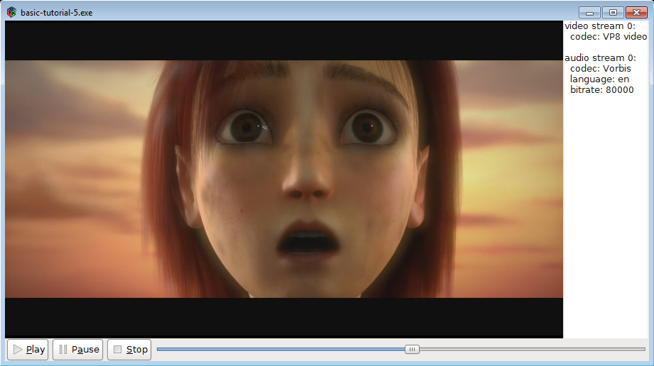

# 基础教程 5：GUI 工具包集成

## 目标

本教程演示如何将 GStreamer 集成到GTK+等图形用户界面 (GUI) 工具包中。简而言之，GStreamer 负责媒体播放，而 GUI 工具包负责用户交互。其中最有趣的部分是两个库需要交互的部分：指示 GStreamer 将视频输出到 GTK+ 窗口以及将用户操作转发给 GStreamer。

具体来说，您将学习到：

- 如何让 GStreamer 将视频输出到特定窗口（而不是创建自己的窗口）。
- 如何利用 GS​​treamer 提供的信息持续刷新 GUI。
- 如何从 GStreamer 的多个线程更新 GUI，这是大多数 GUI 工具包禁止的操作。
- 一种机制，允许您只订阅自己感兴趣的消息，而不是接收所有消息的通知。

## 介绍

我们将使用 [GTK+](https://www.gtk.org/) 工具包构建一个媒体播放器，但其中的概念也适用于其他工具包，例如Qt 。具备GTK+的基本知识将有助于理解本教程。

关键是要告诉 GStreamer 将视频输出到我们选择的窗口中。

一个常见的问题是，GUI 工具包通常只允许通过主线程（或应用程序线程）操作图形“控件”，而 GStreamer 通常会生成多个线程来处理不同的任务。在回调函数中调用GTK+函数通常会失败，因为回调函数会在调用线程中执行，而调用线程不一定是主线程。这个问题可以通过在回调函数中向 GStreamer bus 发送消息来解决：主线程会接收到这些消息，并做出相应的响应。

最后，到目前为止，我们注册了一个handle_message函数，每次 bus 上出现消息时都会调用该函数，这迫使我们解析每条消息，以确定它是否与我们相关。在本教程中，我们使用了一种不同的方法，为每种类型的消息注册一个回调函数，这样可以减少解析工作量，从而减少代码总量。

## GTK+ 中的媒体播放器

让我们用 playbin 编写一个非常简单的媒体播放器，这次还要加上图形用户界面！

basic-tutorial-5.c将此代码复制到名为（或在您的 GStreamer 安装目录中查找）的文本文件中。

基础教程-5.c

```c
#include <string.h>

#include <gtk/gtk.h>
#include <gst/gst.h>
#include <gdk/gdk.h>

/* Structure to contain all our information, so we can pass it around */
typedef struct _CustomData {
  GstElement *playbin;           /* Our one and only pipeline */

  GtkWidget *sink_widget;         /* The widget where our video will be displayed */
  GtkWidget *slider;              /* Slider widget to keep track of current position */
  GtkWidget *streams_list;        /* Text widget to display info about the streams */
  gulong slider_update_signal_id; /* Signal ID for the slider update signal */

  GstState state;                 /* Current state of the pipeline */
  gint64 duration;                /* Duration of the clip, in nanoseconds */
} CustomData;

/* This function is called when the PLAY button is clicked */
static void play_cb (GtkButton *button, CustomData *data) {
  gst_element_set_state (data->playbin, GST_STATE_PLAYING);
}

/* This function is called when the PAUSE button is clicked */
static void pause_cb (GtkButton *button, CustomData *data) {
  gst_element_set_state (data->playbin, GST_STATE_PAUSED);
}

/* This function is called when the STOP button is clicked */
static void stop_cb (GtkButton *button, CustomData *data) {
  gst_element_set_state (data->playbin, GST_STATE_READY);
}

/* This function is called when the main window is closed */
static void delete_event_cb (GtkWidget *widget, GdkEvent *event, CustomData *data) {
  stop_cb (NULL, data);
  gtk_main_quit ();
}

/* This function is called when the slider changes its position. We perform a seek to the
 * new position here. */
static void slider_cb (GtkRange *range, CustomData *data) {
  gdouble value = gtk_range_get_value (GTK_RANGE (data->slider));
  gst_element_seek_simple (data->playbin, GST_FORMAT_TIME, GST_SEEK_FLAG_FLUSH | GST_SEEK_FLAG_KEY_UNIT,
      (gint64)(value * GST_SECOND));
}

/* This creates all the GTK+ widgets that compose our application, and registers the callbacks */
static void create_ui (CustomData *data) {
  GtkWidget *main_window;  /* The uppermost window, containing all other windows */
  GtkWidget *main_box;     /* VBox to hold main_hbox and the controls */
  GtkWidget *main_hbox;    /* HBox to hold the video sink and the stream info text widget */
  GtkWidget *controls;     /* HBox to hold the buttons and the slider */
  GtkWidget *play_button, *pause_button, *stop_button; /* Buttons */

  main_window = gtk_window_new (GTK_WINDOW_TOPLEVEL);
  g_signal_connect (G_OBJECT (main_window), "delete-event", G_CALLBACK (delete_event_cb), data);

  play_button = gtk_button_new_from_icon_name ("media-playback-start", GTK_ICON_SIZE_SMALL_TOOLBAR);
  g_signal_connect (G_OBJECT (play_button), "clicked", G_CALLBACK (play_cb), data);

  pause_button = gtk_button_new_from_icon_name ("media-playback-pause", GTK_ICON_SIZE_SMALL_TOOLBAR);
  g_signal_connect (G_OBJECT (pause_button), "clicked", G_CALLBACK (pause_cb), data);

  stop_button = gtk_button_new_from_icon_name ("media-playback-stop", GTK_ICON_SIZE_SMALL_TOOLBAR);
  g_signal_connect (G_OBJECT (stop_button), "clicked", G_CALLBACK (stop_cb), data);

  data->slider = gtk_scale_new_with_range (GTK_ORIENTATION_HORIZONTAL, 0, 100, 1);
  gtk_scale_set_draw_value (GTK_SCALE (data->slider), 0);
  data->slider_update_signal_id = g_signal_connect (G_OBJECT (data->slider), "value-changed", G_CALLBACK (slider_cb), data);

  data->streams_list = gtk_text_view_new ();
  gtk_text_view_set_editable (GTK_TEXT_VIEW (data->streams_list), FALSE);

  controls = gtk_box_new (GTK_ORIENTATION_HORIZONTAL, 0);
  gtk_box_pack_start (GTK_BOX (controls), play_button, FALSE, FALSE, 2);
  gtk_box_pack_start (GTK_BOX (controls), pause_button, FALSE, FALSE, 2);
  gtk_box_pack_start (GTK_BOX (controls), stop_button, FALSE, FALSE, 2);
  gtk_box_pack_start (GTK_BOX (controls), data->slider, TRUE, TRUE, 2);

  main_hbox = gtk_box_new (GTK_ORIENTATION_HORIZONTAL, 0);
  gtk_box_pack_start (GTK_BOX (main_hbox), data->sink_widget, TRUE, TRUE, 0);
  gtk_box_pack_start (GTK_BOX (main_hbox), data->streams_list, FALSE, FALSE, 2);

  main_box = gtk_box_new (GTK_ORIENTATION_VERTICAL, 0);
  gtk_box_pack_start (GTK_BOX (main_box), main_hbox, TRUE, TRUE, 0);
  gtk_box_pack_start (GTK_BOX (main_box), controls, FALSE, FALSE, 0);
  gtk_container_add (GTK_CONTAINER (main_window), main_box);
  gtk_window_set_default_size (GTK_WINDOW (main_window), 640, 480);

  gtk_widget_show_all (main_window);
}

/* This function is called periodically to refresh the GUI */
static gboolean refresh_ui (CustomData *data) {
  gint64 current = -1;

  /* We do not want to update anything unless we are in the PAUSED or PLAYING states */
  if (data->state < GST_STATE_PAUSED)
    return TRUE;

  /* If we didn't know it yet, query the stream duration */
  if (!GST_CLOCK_TIME_IS_VALID (data->duration)) {
    if (!gst_element_query_duration (data->playbin, GST_FORMAT_TIME, &data->duration)) {
      g_printerr ("Could not query current duration.\n");
    } else {
      /* Set the range of the slider to the clip duration, in SECONDS */
      gtk_range_set_range (GTK_RANGE (data->slider), 0, (gdouble)data->duration / GST_SECOND);
    }
  }

  if (gst_element_query_position (data->playbin, GST_FORMAT_TIME, &current)) {
    /* Block the "value-changed" signal, so the slider_cb function is not called
     * (which would trigger a seek the user has not requested) */
    g_signal_handler_block (data->slider, data->slider_update_signal_id);
    /* Set the position of the slider to the current pipeline position, in SECONDS */
    gtk_range_set_value (GTK_RANGE (data->slider), (gdouble)current / GST_SECOND);
    /* Re-enable the signal */
    g_signal_handler_unblock (data->slider, data->slider_update_signal_id);
  }
  return TRUE;
}

/* This function is called when new metadata is discovered in the stream */
static void tags_cb (GstElement *playbin, gint stream, CustomData *data) {
  /* We are possibly in a GStreamer working thread, so we notify the main
   * thread of this event through a message in the bus */
  gst_element_post_message (playbin,
    gst_message_new_application (GST_OBJECT (playbin),
      gst_structure_new_empty ("tags-changed")));
}

/* This function is called when an error message is posted on the bus */
static void error_cb (GstBus *bus, GstMessage *msg, CustomData *data) {
  GError *err;
  gchar *debug_info;

  /* Print error details on the screen */
  gst_message_parse_error (msg, &err, &debug_info);
  g_printerr ("Error received from element %s: %s\n", GST_OBJECT_NAME (msg->src), err->message);
  g_printerr ("Debugging information: %s\n", debug_info ? debug_info : "none");
  g_clear_error (&err);
  g_free (debug_info);

  /* Set the pipeline to READY (which stops playback) */
  gst_element_set_state (data->playbin, GST_STATE_READY);
}

/* This function is called when an End-Of-Stream message is posted on the bus.
 * We just set the pipeline to READY (which stops playback) */
static void eos_cb (GstBus *bus, GstMessage *msg, CustomData *data) {
  g_print ("End-Of-Stream reached.\n");
  gst_element_set_state (data->playbin, GST_STATE_READY);
}

/* This function is called when the pipeline changes states. We use it to
 * keep track of the current state. */
static void state_changed_cb (GstBus *bus, GstMessage *msg, CustomData *data) {
  GstState old_state, new_state, pending_state;
  gst_message_parse_state_changed (msg, &old_state, &new_state, &pending_state);
  if (GST_MESSAGE_SRC (msg) == GST_OBJECT (data->playbin)) {
    data->state = new_state;
    g_print ("State set to %s\n", gst_element_state_get_name (new_state));
    if (old_state == GST_STATE_READY && new_state == GST_STATE_PAUSED) {
      /* For extra responsiveness, we refresh the GUI as soon as we reach the PAUSED state */
      refresh_ui (data);
    }
  }
}

/* Extract metadata from all the streams and write it to the text widget in the GUI */
static void analyze_streams (CustomData *data) {
  gint i;
  GstTagList *tags;
  gchar *str, *total_str;
  guint rate;
  gint n_video, n_audio, n_text;
  GtkTextBuffer *text;

  /* Clean current contents of the widget */
  text = gtk_text_view_get_buffer (GTK_TEXT_VIEW (data->streams_list));
  gtk_text_buffer_set_text (text, "", -1);

  /* Read some properties */
  g_object_get (data->playbin, "n-video", &n_video, NULL);
  g_object_get (data->playbin, "n-audio", &n_audio, NULL);
  g_object_get (data->playbin, "n-text", &n_text, NULL);

  for (i = 0; i < n_video; i++) {
    tags = NULL;
    /* Retrieve the stream's video tags */
    g_signal_emit_by_name (data->playbin, "get-video-tags", i, &tags);
    if (tags) {
      total_str = g_strdup_printf ("video stream %d:\n", i);
      gtk_text_buffer_insert_at_cursor (text, total_str, -1);
      g_free (total_str);
      gst_tag_list_get_string (tags, GST_TAG_VIDEO_CODEC, &str);
      total_str = g_strdup_printf ("  codec: %s\n", str ? str : "unknown");
      gtk_text_buffer_insert_at_cursor (text, total_str, -1);
      g_free (total_str);
      g_free (str);
      gst_tag_list_free (tags);
    }
  }

  for (i = 0; i < n_audio; i++) {
    tags = NULL;
    /* Retrieve the stream's audio tags */
    g_signal_emit_by_name (data->playbin, "get-audio-tags", i, &tags);
    if (tags) {
      total_str = g_strdup_printf ("\naudio stream %d:\n", i);
      gtk_text_buffer_insert_at_cursor (text, total_str, -1);
      g_free (total_str);
      if (gst_tag_list_get_string (tags, GST_TAG_AUDIO_CODEC, &str)) {
        total_str = g_strdup_printf ("  codec: %s\n", str);
        gtk_text_buffer_insert_at_cursor (text, total_str, -1);
        g_free (total_str);
        g_free (str);
      }
      if (gst_tag_list_get_string (tags, GST_TAG_LANGUAGE_CODE, &str)) {
        total_str = g_strdup_printf ("  language: %s\n", str);
        gtk_text_buffer_insert_at_cursor (text, total_str, -1);
        g_free (total_str);
        g_free (str);
      }
      if (gst_tag_list_get_uint (tags, GST_TAG_BITRATE, &rate)) {
        total_str = g_strdup_printf ("  bitrate: %d\n", rate);
        gtk_text_buffer_insert_at_cursor (text, total_str, -1);
        g_free (total_str);
      }
      gst_tag_list_free (tags);
    }
  }

  for (i = 0; i < n_text; i++) {
    tags = NULL;
    /* Retrieve the stream's subtitle tags */
    g_signal_emit_by_name (data->playbin, "get-text-tags", i, &tags);
    if (tags) {
      total_str = g_strdup_printf ("\nsubtitle stream %d:\n", i);
      gtk_text_buffer_insert_at_cursor (text, total_str, -1);
      g_free (total_str);
      if (gst_tag_list_get_string (tags, GST_TAG_LANGUAGE_CODE, &str)) {
        total_str = g_strdup_printf ("  language: %s\n", str);
        gtk_text_buffer_insert_at_cursor (text, total_str, -1);
        g_free (total_str);
        g_free (str);
      }
      gst_tag_list_free (tags);
    }
  }
}

/* This function is called when an "application" message is posted on the bus.
 * Here we retrieve the message posted by the tags_cb callback */
static void application_cb (GstBus *bus, GstMessage *msg, CustomData *data) {
  if (g_strcmp0 (gst_structure_get_name (gst_message_get_structure (msg)), "tags-changed") == 0) {
    /* If the message is the "tags-changed" (only one we are currently issuing), update
     * the stream info GUI */
    analyze_streams (data);
  }
}

int main(int argc, char *argv[]) {
  CustomData data;
  GstStateChangeReturn ret;
  GstBus *bus;
  GstElement *gtkglsink, *videosink;

  /* Initialize GTK */
  gtk_init (&argc, &argv);

  /* Initialize GStreamer */
  gst_init (&argc, &argv);

  /* Initialize our data structure */
  memset (&data, 0, sizeof (data));
  data.duration = GST_CLOCK_TIME_NONE;

  /* Create the elements */
  data.playbin = gst_element_factory_make ("playbin", "playbin");
  videosink = gst_element_factory_make ("glsinkbin", "glsinkbin");
  gtkglsink = gst_element_factory_make ("gtkglsink", "gtkglsink");

  /* Here we create the GTK Sink element which will provide us with a GTK widget where
   * GStreamer will render the video at and we can add to our UI.
   * Try to create the OpenGL version of the video sink, and fallback if that fails */
  if (gtkglsink != NULL && videosink != NULL) {
    g_printerr ("Successfully created GTK GL Sink");

    g_object_set (videosink, "sink", gtkglsink, NULL);

    /* The gtkglsink creates the gtk widget for us. This is accessible through a property.
     * So we get it and use it later to add it to our gui. */
    g_object_get (gtkglsink, "widget", &data.sink_widget, NULL);
  } else {
    g_printerr ("Could not create gtkglsink, falling back to gtksink.\n");

    videosink = gst_element_factory_make ("gtksink", "gtksink");
    g_object_get (videosink, "widget", &data.sink_widget, NULL);
  }

  if (!data.playbin || !videosink) {
    g_printerr ("Not all elements could be created.\n");
    return -1;
  }

  /* Set the URI to play */
  g_object_set (data.playbin, "uri", "https://gstreamer.freedesktop.org/data/media/sintel_trailer-480p.webm", NULL);

  /* Set the video-sink  */
  g_object_set (data.playbin, "video-sink", videosink, NULL);

  /* Connect to interesting signals in playbin */
  g_signal_connect (G_OBJECT (data.playbin), "video-tags-changed", (GCallback) tags_cb, &data);
  g_signal_connect (G_OBJECT (data.playbin), "audio-tags-changed", (GCallback) tags_cb, &data);
  g_signal_connect (G_OBJECT (data.playbin), "text-tags-changed", (GCallback) tags_cb, &data);

  /* Create the GUI */
  create_ui (&data);

  /* Instruct the bus to emit signals for each received message, and connect to the interesting signals */
  bus = gst_element_get_bus (data.playbin);
  gst_bus_add_signal_watch (bus);
  g_signal_connect (G_OBJECT (bus), "message::error", (GCallback)error_cb, &data);
  g_signal_connect (G_OBJECT (bus), "message::eos", (GCallback)eos_cb, &data);
  g_signal_connect (G_OBJECT (bus), "message::state-changed", (GCallback)state_changed_cb, &data);
  g_signal_connect (G_OBJECT (bus), "message::application", (GCallback)application_cb, &data);
  gst_object_unref (bus);

  /* Start playing */
  ret = gst_element_set_state (data.playbin, GST_STATE_PLAYING);
  if (ret == GST_STATE_CHANGE_FAILURE) {
    g_printerr ("Unable to set the pipeline to the playing state.\n");
    gst_object_unref (data.playbin);
    gst_object_unref (videosink);
    return -1;
  }

  /* Register a function that GLib will call every second */
  g_timeout_add_seconds (1, (GSourceFunc)refresh_ui, &data);

  /* Start the GTK main loop. We will not regain control until gtk_main_quit is called. */
  gtk_main ();

  /* Free resources */
  gst_element_set_state (data.playbin, GST_STATE_NULL);
  gst_object_unref (data.playbin);
  gst_object_unref (videosink);

  return 0;
}
```

    信息需要帮助吗？
    如果您在编译此代码时需要帮助，请参阅 适用于您平台（Linux、Mac OS X或Windows）的“构建教程”部分，或者在 Linux 上使用以下特定命令：
    gcc basic-tutorial-5.c -o basic-tutorial-5 `pkg-config --cflags --libs gtk+-3.0 gstreamer-1.0`
    如果您在运行此代码时需要帮助，请参阅适用于您平台的“运行教程”部分： Linux、Mac OS X或Windows。
    本教程将打开一个 GTK+ 窗口并显示一段视频及其音频。由于媒体文件来自互联网，窗口可能需要几秒钟才能加载完毕，具体时间取决于您的网络连接速度。窗口包含一些 GTK+ 按钮，用于暂停、停止和播放视频，还有一个滑块显示视频流的当前位置，您可以拖动滑块来更改位置。此外，窗口右侧边缘的列中还会显示有关视频流的信息。
    请注意，本视频没有延迟管理（缓冲）机制，因此在网络连接速度较慢的情况下，影片可能会在几秒钟后停止播放。请参阅基础教程 12：流媒体播放，了解如何解决此问题。
    所需库：gtk+-3.0 gstreamer-1.0

## 攻略

关于本教程的结构，我们将不再使用前向函数定义：函数将在使用前定义。此外，为了便于解释，代码片段的呈现顺序可能与程序实际运行顺序不完全一致。请使用行号在完整代码中查找相应的代码片段。

本教程主要由回调函数组成，这些函数将从 GStreamer 或 GTK+ 调用，因此让我们回顾一下main注册所有这些回调的函数。

```c
int main(int argc, char *argv[]) {
  CustomData data;
  GstStateChangeReturn ret;
  GstBus *bus;
  GstElement *gtkglsink, *videosink;

  /* Initialize GTK */
  gtk_init (&argc, &argv);

  /* Initialize GStreamer */
  gst_init (&argc, &argv);

  /* Initialize our data structure */
  memset (&data, 0, sizeof (data));
  data.duration = GST_CLOCK_TIME_NONE;

  /* Create the elements */
  data.playbin = gst_element_factory_make ("playbin", "playbin");
  videosink = gst_element_factory_make ("glsinkbin", "glsinkbin");
  gtkglsink = gst_element_factory_make ("gtkglsink", "gtkglsink");

  /* Here we create the GTK Sink element which will provide us with a GTK widget where
   * GStreamer will render the video at and we can add to our UI.
   * Try to create the OpenGL version of the video sink, and fallback if that fails */
  if ((gtkglsink) && (videosink)) {
    g_printerr ("Successfully created GTK GL Sink");

    g_object_set (videosink, "sink", gtkglsink, NULL);

    /* The gtkglsink creates the gtk widget for us. This is accessible through a property.
     * So we get it and use it later to add it to our gui. */
    g_object_get (gtkglsink, "widget", &data.sink_widget, NULL);
  } else {
    g_printerr ("Could not create gtkglsink, falling back to gtksink.\n");

    videosink = gst_element_factory_make ("gtksink", "gtksink");
    g_object_get (videosink, "widget", &data.sink_widget, NULL);
  }

  if ((!data.playbin) || (!videosink)) {
    g_printerr ("Not all elements could be created.\n");
    return -1;
  }

  /* Set the URI to play */
  g_object_set (data.playbin, "uri", "https://gstreamer.freedesktop.org/data/media/sintel_trailer-480p.webm", NULL);

  /* Set the video-sink  */
  g_object_set (data.playbin, "video-sink", videosink, NULL);
```

标准的 GStreamer 初始化和 playbin 管道创建，以及 GTK 初始化。我们还创建了视频接收器元素，它将渲染到 GTK Widget 中。稍后我们将在 UI 中使用此 Widget。

```c
  /* Connect to interesting signals in playbin */
  g_signal_connect (G_OBJECT (data.playbin), "video-tags-changed", (GCallback) tags_cb, &data);
  g_signal_connect (G_OBJECT (data.playbin), "audio-tags-changed", (GCallback) tags_cb, &data);
  g_signal_connect (G_OBJECT (data.playbin), "text-tags-changed", (GCallback) tags_cb, &data);
```

我们希望在流中出现新标签（元数据）时收到通知。为简单起见，我们将使用同一个回调函数处理所有类型的标签（视频、音频和文本）tags_cb。

```c
/* Create the GUI */
create_ui (&data);
```

所有 GTK+ 组件的创建和信号注册都在此函数中完成。它只包含与 GTK 相关的函数调用，因此我们将略过其定义。它注册的信号用于传递用户命令，如下面的回调函数所示。

```c
  /* Instruct the bus to emit signals for each received message, and connect to the interesting signals */
  bus = gst_element_get_bus (data.playbin);
  gst_bus_add_signal_watch (bus);
  g_signal_connect (G_OBJECT (bus), "message::error", (GCallback)error_cb, &data);
  g_signal_connect (G_OBJECT (bus), "message::eos", (GCallback)eos_cb, &data);
  g_signal_connect (G_OBJECT (bus), "message::state-changed", (GCallback)state_changed_cb, &data);
  g_signal_connect (G_OBJECT (bus), "message::application", (GCallback)application_cb, &data);
  gst_object_unref (bus);
```

在Playback 教程 1：Playbin 用法中， `Playbin`gst_bus_add_watch()用于注册一个函数，该函数接收发送到 GStreamer 总线的每条消息。我们可以使用信号来实现更精细的控制，信号允许我们只注册我们感兴趣的消息。通过调用 `Playbin`，gst_bus_add_signal_watch()我们指示总线在每次收到消息时发出一个信号。该信号的名称为 ` <message_name>`，message::detail其中detail`<message_name>` 是触发信号发出的消息。例如，当总线收到 EOS 消息时，它会发出一个名为 `<message_name>` 的信号message::eos。

本教程使用Signals's 的详细信息仅注册我们关心的消息。如果我们注册了message信号，我们将收到每条消息的通知，就像 gst_bus_add_watch()那样。

请注意，为了使总线监视器（无论是 A gst_bus_add_watch()还是 B gst_bus_add_signal_watch()）正常工作，必须Main Loop运行 GLib。在本例中，它隐藏在 GTK+主循环中。

```c
/* Register a function that GLib will call every second */
g_timeout_add_seconds (1, (GSourceFunc)refresh_ui, &data);
```

在将控制权移交给 GTK+ 之前，我们还会g_timeout_add_seconds ()注册另一个回调函数，这次设置了超时时间，使其每秒调用一次。我们将使用它来刷新 GUI refresh_ui。

至此，设置完成，我们可以启动 GTK+ 主循环了。当发生重要事件时，我们将通过回调函数重新获得控制权。让我们回顾一下回调函数。每个回调函数都有不同的签名，具体取决于调用者。您可以在信号的文档中查找签名（参数和返回值的含义）。

```c
/* This function is called when the PLAY button is clicked */
static void play_cb (GtkButton *button, CustomData *data) {
  gst_element_set_state (data->playbin, GST_STATE_PLAYING);
}

/* This function is called when the PAUSE button is clicked */
static void pause_cb (GtkButton *button, CustomData *data) {
  gst_element_set_state (data->playbin, GST_STATE_PAUSED);
}

/* This function is called when the STOP button is clicked */
static void stop_cb (GtkButton *button, CustomData *data) {
  gst_element_set_state (data->playbin, GST_STATE_READY);
}
```

这三个回调函数分别与图形用户界面中的播放、暂停和停止按钮相关联。它们的作用是将管道设置为相应的状态。请注意，在停止状态下，我们将管道设置为“停止” READY。我们本可以将管道一直设置为“停止 NULL”状态，但那样转换速度会稍慢一些，因为需要释放并重新获取一些资源（例如音频设备）。

```c
/* This function is called when the main window is closed */
static void delete_event_cb (GtkWidget *widget, GdkEvent *event, CustomData *data) {
  stop_cb (NULL, data);
  gtk_main_quit ();
}
```

gtk_main_quit()最终会调用 `to` 函数gtk_main_run() 来main终止程序，在本例中，这将结束程序。这里，我们在主窗口关闭后、停止管道后调用它（只是为了代码整洁）。

```c
/* This function is called when the slider changes its position. We perform a seek to the
 * new position here. */
static void slider_cb (GtkRange *range, CustomData *data) {
  gdouble value = gtk_range_get_value (GTK_RANGE (data->slider));
  gst_element_seek_simple (data->playbin, GST_FORMAT_TIME, GST_SEEK_FLAG_FLUSH | GST_SEEK_FLAG_KEY_UNIT,
      (gint64)(value * GST_SECOND));
}
```

这是一个示例，展示了如何借助 GStreamer 和 GTK+ 的协作，轻松实现像进度条（或允许进度移动的滑块）这样复杂的 GUI 元素。如果滑块被拖动到新的位置，则指示 GStreamer 跳转到该位置（如基础教程 4：时间管理gst_element_seek_simple()中所述）。滑块的值已设置为表示秒。

值得一提的是，通过进行一些限流操作可以提升性能（和响应速度），也就是说，并非响应用户的每一个搜索请求。由于搜索操作必然需要一些时间，因此在一次搜索后等待半秒钟（例如）再允许下一次搜索会更好。否则，如果用户疯狂拖动滑块，应用程序可能会显得无响应，因为在新的搜索请求排队之前，任何一次搜索都无法完成。

```c
/* This function is called periodically to refresh the GUI */
static gboolean refresh_ui (CustomData *data) {
  gint64 current = -1;

  /* We do not want to update anything unless we are in the PAUSED or PLAYING states */
  if (data->state < GST_STATE_PAUSED)
    return TRUE;
```

此函数会移动滑块以反映媒体的当前位置。首先，如果我们不在当前PLAYING状态下，则无需执行任何操作（此外，位置和持续时间查询通常会失败）。

```c
/* If we didn't know it yet, query the stream duration */
if (!GST_CLOCK_TIME_IS_VALID (data->duration)) {
  if (!gst_element_query_duration (data->playbin, GST_FORMAT_TIME, &data->duration)) {
    g_printerr ("Could not query current duration.\n");
  } else {
    /* Set the range of the slider to the clip duration, in SECONDS */
    gtk_range_set_range (GTK_RANGE (data->slider), 0, (gdouble)data->duration / GST_SECOND);
  }
}
```

如果我们不知道片段的持续时间，我们会恢复它，以便我们可以设置滑块的范围。

```c
if (gst_element_query_position (data->playbin, GST_FORMAT_TIME, &current)) {
  /* Block the "value-changed" signal, so the slider_cb function is not called
   * (which would trigger a seek the user has not requested) */
  g_signal_handler_block (data->slider, data->slider_update_signal_id);
  /* Set the position of the slider to the current pipeline position, in SECONDS */
  gtk_range_set_value (GTK_RANGE (data->slider), (gdouble)current / GST_SECOND);
  /* Re-enable the signal */
  g_signal_handler_unblock (data->slider, data->slider_update_signal_id);
}
return TRUE;
```

我们查询当前流水线位置，并据此设置滑块的位置。这将触发信号的发出 ，我们利用该信号来判断用户何时拖动滑块。由于我们不希望在用户未请求的情况下进行寻道操作，因此我们在此操作期间使用 ` and` value-changed禁用信号的发出。value-changedg_signal_handler_block()g_signal_handler_unblock()

从该函数返回TRUE将使其在以后持续被调用。如果我们返回 null FALSE，计时器将被移除。

```c
/* This function is called when new metadata is discovered in the stream */
static void tags_cb (GstElement *playbin, gint stream, CustomData *data) {
  /* We are possibly in a GStreamer working thread, so we notify the main
   * thread of this event through a message in the bus */
  gst_element_post_message (playbin,
    gst_message_new_application (GST_OBJECT (playbin),
      gst_structure_new_empty ("tags-changed")));
}
```

这是本教程的关键点之一。当媒体中发现新标签时，该函数将从流式线程（即应用​​程序线程或主线程之外的线程）中调用。我们想要做的是更新 GTK+ 小部件以反映这些新信息，但GTK+ 不允许从主线程之外的线程进行操作。

解决方案是playbin在总线上发布一条消息，然后返回到调用线程。在适当的时候，主线程会接收到这条消息并更新 GTK。

gst_element_post_message()使 GStreamer 元素将给定消息发布到总线。gst_message_new_application()创建一个新类型的消息APPLICATION。GStreamer 消息有不同的类型，而这种特定类型是应用程序保留的：它将直接通过总线，不受 GStreamer 的影响。类型列表可在文档中找到GstMessageType。

消息可以通过其嵌入的 `<Message>` 结构传递附加信息 GstStructure，`<Message>` 是一个非常灵活的数据容器。这里，我们创建了一个新的结构gst_structure_new()，并将其命名为 `<Message>` tags-changed，以避免在需要发送其他应用程序消息时产生混淆。

稍后，一旦进入主线程，总线将接收到此消息并发出message::application我们已与该 application_cb函数关联的信号：

```c
/* This function is called when an "application" message is posted on the bus.
 * Here we retrieve the message posted by the tags_cb callback */
static void application_cb (GstBus *bus, GstMessage *msg, CustomData *data) {
  if (g_strcmp0 (gst_structure_get_name (gst_message_get_structure (msg)), "tags-changed") == 0) {
    /* If the message is the "tags-changed" (only one we are currently issuing), update
     * the stream info GUI */
    analyze_streams (data);
  }
}
```

确认tags-changed消息无误后，我们调用该 analyze_streams函数。该函数在“播放教程 1：Playbin 使用”中也有详细介绍。它主要从流中提取标签，并将其写入 GUI 中的文本控件。

，和其实没有必要解释，因为它们与之前所有教程中error_cb的功能相同，只是现在由它们自己的函数实现。eos_cbstate_changed_cb

就是这样！本教程中的代码量可能看起来有点大，但所需的概念并不多，也很容易理解。如果您已经学习过之前的教程，并且对 GTK 有一些了解，那么您应该已经理解了，现在就可以享受您自己的媒体播放器了！



## 锻炼

如果这个媒体播放器不够好用，可以尝试将显示流信息的文本控件更改为合适的列表视图（或树状视图）。然后，当用户选择不同的流时，让 GStreamer 切换流！要切换流，您需要阅读播放教程 1：Playbin 的使用。

## 结论

本教程已演示：

- 如何使用 Element 将视频输出到特定的 GTK Widget gtksink。
- 如何通过注册超时回调来定期刷新 GUI g_timeout_add_seconds ()。
- 如何通过总线以应用程序消息的方式将信息传递给主线程gst_element_post_message()。
- 如何通过让总线发出信号gst_bus_add_signal_watch()并利用信号细节区分所有消息类型，从而只收到感兴趣的消息通知。

这样你就可以构建一个功能较为完整的媒体播放器，并具有合适的图形用户界面。

以下基础教程将继续侧重于其他 GStreamer 主题。

很高兴您能来，期待很快再见到您！


