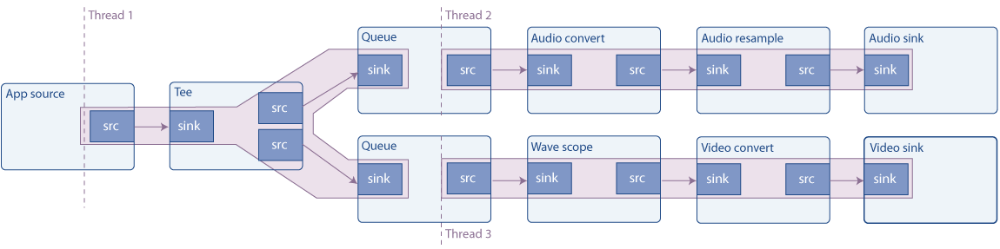

# 基础教程 7：多线程和 Pad 可用性

## 目标

GStreamer 会自动处理多线程，但在某些情况下，您可能需要手动解耦线程。本教程将演示如何操作，并补充说明 Pad 可用性的相关内容。更具体地说，本文档解释了：

- 如何为管道的某些部分创建新的执行线程
- 垫子供应情况如何？
- 如何复制流媒体

## 介绍

### 多线程

GStreamer 是一个多线程框架。这意味着它会在内部根据需要创建和销毁线程，例如，将流媒体处理与应用程序线程解耦。此外，插件也可以自由创建线程来进行自身的处理，例如，视频解码器可以创建 4 个线程来充分利用 4 核 CPU 的性能。

除此之外，在构建管道时，应用程序可以明确指定一个分支（管道的一部分）在不同的线程上运行（例如，让音频和视频解码器同时执行）。

这是通过 ` queue element ` 实现的，其工作原理如下：sink pad 元素仅将数据入队并返回控制权。在另一个线程中，数据被出队并推送到下游。正如后续流式处理教程中所述，该元素也用于缓冲。队列的大小可以通过属性进行控制。

### 示例管道

此示例构建了以下管道：



信号源是一个合成音频信号（连续音调），它通过一个tee元件进行分割（元件会将接收到的所有信号通过其源焊盘发送出去）。其中一条分支将信号发送到声卡，另一条分支则渲染波形视频并将其发送到屏幕。

如图所示，队列会创建一个新线程，因此该流水线由 3 个线程运行。具有多个接收器的流水线通常需要多线程，因为为了实现同步，接收器通常会阻塞执行，直到所有其他接收器都准备就绪；如果只有一个线程，则其他接收器无法准备就绪，因为它会被第一个接收器阻塞。

### 请求垫

在基础教程 3：动态管道中，我们看到一个元素（uridecodebin），它最初没有任何填充（pad），随着数据开始流动，元素学习到媒体信息，填充才会出现。这些填充被称为“有时填充”（Sometimes Pads） ，与始终可用的常规填充（Always Pads）形成对比。

第三种类型的填充是请求填充（Request Pad），它是按需创建的。一个经典的例子是tee元素，它只有一个接收填充（sink pad），没有初始的源填充（source pad）：源填充需要被请求后才能 tee添加。这样，输入流就可以被复制任意次数。缺点是，使用请求填充链接元素不如链接始终填充（Always Pad）那样自动，正如本示例的演示所示。

PLAYING此外，在 ` on` 或 ` on` 状态下请求（或释放）焊盘时PAUSED，需要采取一些额外的预防措施（焊盘阻塞），这些措施在本教程中并未提及。不过，在 `on`NULL或 ` READYon` 状态下请求（或释放）焊盘是安全的。

事不宜迟，让我们来看代码。

## 简单的多线程示例

basic-tutorial-7.c将此代码复制到名为（或在您的 GStreamer 安装目录中查找）的文本文件中。

基础教程-7.c

```c
#include <gst/gst.h>

int main(int argc, char *argv[]) {
  GstElement *pipeline, *audio_source, *tee, *audio_queue, *audio_convert, *audio_resample, *audio_sink;
  GstElement *video_queue, *visual, *video_convert, *video_sink;
  GstBus *bus;
  GstMessage *msg;
  GstPad *tee_audio_pad, *tee_video_pad;
  GstPad *queue_audio_pad, *queue_video_pad;

  /* Initialize GStreamer */
  gst_init (&argc, &argv);

  /* Create the elements */
  audio_source = gst_element_factory_make ("audiotestsrc", "audio_source");
  tee = gst_element_factory_make ("tee", "tee");
  audio_queue = gst_element_factory_make ("queue", "audio_queue");
  audio_convert = gst_element_factory_make ("audioconvert", "audio_convert");
  audio_resample = gst_element_factory_make ("audioresample", "audio_resample");
  audio_sink = gst_element_factory_make ("autoaudiosink", "audio_sink");
  video_queue = gst_element_factory_make ("queue", "video_queue");
  visual = gst_element_factory_make ("wavescope", "visual");
  video_convert = gst_element_factory_make ("videoconvert", "csp");
  video_sink = gst_element_factory_make ("autovideosink", "video_sink");

  /* Create the empty pipeline */
  pipeline = gst_pipeline_new ("test-pipeline");

  if (!pipeline || !audio_source || !tee || !audio_queue || !audio_convert || !audio_resample || !audio_sink ||
      !video_queue || !visual || !video_convert || !video_sink) {
    g_printerr ("Not all elements could be created.\n");
    return -1;
  }

  /* Configure elements */
  g_object_set (audio_source, "freq", 215.0f, NULL);
  g_object_set (visual, "shader", 0, "style", 1, NULL);

  /* Link all elements that can be automatically linked because they have "Always" pads */
  gst_bin_add_many (GST_BIN (pipeline), audio_source, tee, audio_queue, audio_convert, audio_resample, audio_sink,
      video_queue, visual, video_convert, video_sink, NULL);
  if (gst_element_link_many (audio_source, tee, NULL) != TRUE ||
      gst_element_link_many (audio_queue, audio_convert, audio_resample, audio_sink, NULL) != TRUE ||
      gst_element_link_many (video_queue, visual, video_convert, video_sink, NULL) != TRUE) {
    g_printerr ("Elements could not be linked.\n");
    gst_object_unref (pipeline);
    return -1;
  }

  /* Manually link the Tee, which has "Request" pads */
  tee_audio_pad = gst_element_request_pad_simple (tee, "src_%u");
  g_print ("Obtained request pad %s for audio branch.\n", gst_pad_get_name (tee_audio_pad));
  queue_audio_pad = gst_element_get_static_pad (audio_queue, "sink");
  tee_video_pad = gst_element_request_pad_simple (tee, "src_%u");
  g_print ("Obtained request pad %s for video branch.\n", gst_pad_get_name (tee_video_pad));
  queue_video_pad = gst_element_get_static_pad (video_queue, "sink");
  if (gst_pad_link (tee_audio_pad, queue_audio_pad) != GST_PAD_LINK_OK ||
      gst_pad_link (tee_video_pad, queue_video_pad) != GST_PAD_LINK_OK) {
    g_printerr ("Tee could not be linked.\n");
    gst_object_unref (pipeline);
    return -1;
  }
  gst_object_unref (queue_audio_pad);
  gst_object_unref (queue_video_pad);

  /* Start playing the pipeline */
  gst_element_set_state (pipeline, GST_STATE_PLAYING);

  /* Wait until error or EOS */
  bus = gst_element_get_bus (pipeline);
  msg = gst_bus_timed_pop_filtered (bus, GST_CLOCK_TIME_NONE, GST_MESSAGE_ERROR | GST_MESSAGE_EOS);

  /* Release the request pads from the Tee, and unref them */
  gst_element_release_request_pad (tee, tee_audio_pad);
  gst_element_release_request_pad (tee, tee_video_pad);
  gst_object_unref (tee_audio_pad);
  gst_object_unref (tee_video_pad);

  /* Free resources */
  if (msg != NULL)
    gst_message_unref (msg);
  gst_object_unref (bus);
  gst_element_set_state (pipeline, GST_STATE_NULL);

  gst_object_unref (pipeline);
  return 0;
}
```

    需要帮助吗？
    如果您在编译此代码时需要帮助，请参阅 适用于您平台（Linux、Mac OS X或Windows）的“构建教程”部分，或者在 Linux 上使用以下特定命令：
    gcc basic-tutorial-7.c -o basic-tutorial-7 `pkg-config --cflags --libs gstreamer-1.0`
    如果您在运行此代码时需要帮助，请参阅适用于您平台的“运行教程”部分： Linux、Mac OS X或Windows。
    本教程会通过声卡播放一个音频信号，并打开一个窗口显示该信号波形。波形应该是正弦波，但由于窗口刷新，可能显示不完全如此。
    所需库：gstreamer-1.0

## 攻略

```c
/* Create the elements */
audio_source = gst_element_factory_make ("audiotestsrc", "audio_source");
tee = gst_element_factory_make ("tee", "tee");
audio_queue = gst_element_factory_make ("queue", "audio_queue");
audio_convert = gst_element_factory_make ("audioconvert", "audio_convert");
audio_resample = gst_element_factory_make ("audioresample", "audio_resample");
audio_sink = gst_element_factory_make ("autoaudiosink", "audio_sink");
video_queue = gst_element_factory_make ("queue", "video_queue");
visual = gst_element_factory_make ("wavescope", "visual");
video_convert = gst_element_factory_make ("videoconvert", "video_convert");
video_sink = gst_element_factory_make ("autovideosink", "video_sink");
```

上图中所有元素均在此处实例化：

audiotestsrc产生合成音调。wavescope接收音频信号并渲染波形，就像一台（价格低廉的）示波器。我们已经使用过它autoaudiosink和 autovideosink。

转换元件（audioconvert、audioresample和 videoconvert）对于确保管道能够连接至关重要。实际上，音频和视频接收器的性能取决于硬件，在设计时无法确定它们是否与和产生的性能相匹配audiotestsrc。wavescope但是，如果性能匹配，这些元件将以“直通”模式运行，不会修改信号，因此对性能的影响可以忽略不计。

```c
/* Configure elements */
g_object_set (audio_source, "freq", 215.0f, NULL);
g_object_set (visual, "shader", 0, "style", 1, NULL);
```

为了更好地演示，我们做了一些小调整：“freq”属性 audiotestsrc控制波的频率（215Hz 会使波在窗口中看起来几乎静止不动），而此样式和着色器则 wavescope使波保持连续。请使用基础教程 10：GStreamer 工具gst-inspect-1.0中介绍的工具来了解这些元素的全部属性。

```c
/* Link all elements that can be automatically linked because they have "Always" pads */
gst_bin_add_many (GST_BIN (pipeline), audio_source, tee, audio_queue, audio_convert, audio_sink,
    video_queue, visual, video_convert, video_sink, NULL);
if (gst_element_link_many (audio_source, tee, NULL) != TRUE ||
    gst_element_link_many (audio_queue, audio_convert, audio_sink, NULL) != TRUE ||
    gst_element_link_many (video_queue, visual, video_convert, video_sink, NULL) != TRUE) {
  g_printerr ("Elements could not be linked.\n");
  gst_object_unref (pipeline);
  return -1;
}
```

此代码块将所有元素添加到管道中，然后链接可以自动链接的元素（如注释中所述，带有 Always Pads 的元素）。

    警告gst_element_link_many()实际上，它可以将元素与请求垫 (Request Pad) 连接起来。它会在内部请求这些垫子，因此您无需担心被链接的元素是否同时拥有 Always Pad 和 Request Pad。虽然这看起来可能很奇怪，但实际上却很不方便，因为您之后仍然需要释放已请求的垫子，而且，如果垫子是由自动请求的gst_element_link_many()，则很容易忘记。为了避免这种情况，请始终手动请求请求垫，如下面的代码块所示。

```c
/* Manually link the Tee, which has "Request" pads */
tee_audio_pad = gst_element_request_pad_simple (tee, "src_%u");
g_print ("Obtained request pad %s for audio branch.\n", gst_pad_get_name (tee_audio_pad));
queue_audio_pad = gst_element_get_static_pad (audio_queue, "sink");
tee_video_pad = gst_element_request_pad_simple (tee, "src_%u");
g_print ("Obtained request pad %s for video branch.\n", gst_pad_get_name (tee_video_pad));
queue_video_pad = gst_element_get_static_pad (video_queue, "sink");
if (gst_pad_link (tee_audio_pad, queue_audio_pad) != GST_PAD_LINK_OK ||
    gst_pad_link (tee_video_pad, queue_video_pad) != GST_PAD_LINK_OK) {
  g_printerr ("Tee could not be linked.\n");
  gst_object_unref (pipeline);
  return -1;
}
gst_object_unref (queue_audio_pad);
gst_object_unref (queue_video_pad);
```

要链接请求垫，需要通过向元素“请求”来获取它们。一个元素可以生成不同类型的请求垫，因此，在请求它们时，必须提供所需的垫模板名称。在元素的文档中，tee我们看到它有两个垫模板，分别名为“sink”（用于其接收器垫）和“src_%u”（用于请求垫）。我们使用 . 向 tee 请求两个垫（分别用于音频和视频分支）gst_element_request_pad_simple()。

然后，我们从下游元素获取需要与这些请求垫关联的垫。这些是普通的始终垫，因此我们使用gst_element_get_static_pad().

最后，我们将焊盘与 . 连接起来。这是和内部使用的gst_pad_link()函数。gst_element_link()gst_element_link_many()

我们已获得的水槽垫需要释放 gst_object_unref()。请求垫将在项目结束时，当我们不再需要它们时释放。

然后我们将管道设置为正常播放，并等待直到产生错误消息或 EOS（结束信号）。剩下的唯一工作就是清理请求的 Pad：

```c
/* Release the request pads from the Tee, and unref them */
gst_element_release_request_pad (tee, tee_audio_pad);
gst_element_release_request_pad (tee, tee_video_pad);
gst_object_unref (tee_audio_pad);
gst_object_unref (tee_video_pad);
```

gst_element_release_request_pad()从 中释放 pad tee，但仍然需要用 取消引用（释放）gst_object_unref()。

## 结论

本教程已演示：

- 如何使用 queue元素使管道的不同部分在不同的线程上运行。

- 什么是请求面板以及如何将元素与请求面板、和gst_element_request_pad_simple()链接起来gst_pad_link()。 gst_element_release_request_pad()

- 如何使用 tee元素在不同的分支中提供相同的流。

下一个教程将在此教程的基础上，展示如何手动将数据注入到正在运行的管道中以及从中提取数据。

很高兴您能来，期待很快再见到您！


