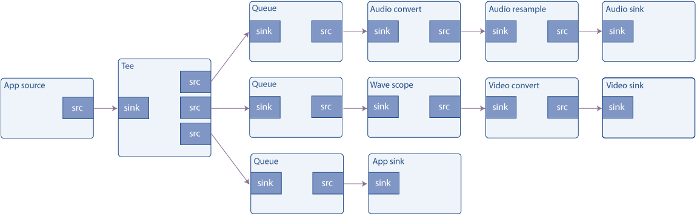

# 基础教程 8：简化流程

## 目标

使用 GStreamer 构建的管道无需完全封闭。数据可以随时以多种方式注入管道或从中提取。本教程将展示：

- 如何将外部数据注入到通用的 GStreamer 管道中。
- 如何从通用的 GStreamer 管道中提取数据。
- 如何访问和操作这些数据。

回放教程 3：简化流程，讲解如何在基于 playbin 的流程中实现相同的目标。

## 介绍

应用程序可以通过多种方式与流经 GStreamer 管道的数据进行交互。本教程将介绍最简单的一种方式，因为它使用了专门为此目的创建的元素。

用于将应用程序数据注入 GStreamer 管道的元素是 `<source>` appsrc，而用于将 GStreamer 数据提取回应用程序的对应元素是 `<sink>` appsink。为了避免混淆名称，请从 GStreamer 的角度来理解它们：` appsrc<source>` 只是一个普通的数据源，它提供从天而降的数据（实际上是由应用程序提供的）。` appsink<sink>` 是一个普通的接收器，流经 GStreamer 管道的数据最终会到达这里（实际上是由应用程序回收的）。

appsrc它们功能非常强大，甚至appsink提供了自己的 API（参见其文档），可以通过链接库来访问 gstreamer-app。不过，在本教程中，我们将采用更简单的方法，通过信号来控制它们。

appsrc它可以以多种模式运行：在拉取模式下，它会在每次需要数据时向应用程序请求数据；在推送模式下，应用程序会按照自己的节奏推送数据。此外，在推送模式下，应用程序可以选择在数据量充足时阻塞在推送函数中，或者监听 ` enough-dataand`need-data信号来控制数据流。本示例实现了后一种方法。有关其他方法的更多信息，请参阅文档appsrc。

### 缓冲区

数据以称为缓冲区的块的形式在 GStreamer 管道中传输。由于此示例会生成和使用数据，因此我们需要了解 GstBuffer缓冲区。

源 Pad 生成缓冲区，这些缓冲区被接收器 Pad 消耗；GStreamer 获取这些缓冲区并将它们从一个元素传递到另一个元素。

缓冲区仅代表一个数据单元，不要假设所有缓冲区的大小都相同，或者代表相同的时间长度。同样，也不要假设如果一个缓冲区进入元素，就会有一个缓冲区输出。元素可以自由地处理接收到的缓冲区。GstBuffer元素还可以包含多个实际的内存缓冲区。实际的内存缓冲区通过 GstMemory对象进行抽象，一个元素GstBuffer可以包含多个GstMemory对象。

每个缓冲区都附带时间戳和持续时间信息，用于描述缓冲区内容应在何时进行解码、渲染或显示。时间戳是一个非常复杂且精细的主题，但目前这种简化的描述应该足够了。

例如，一个filesrc读取文件的 GStreamer 元素会生成具有“ANY”权限且不包含时间戳信息的缓冲区。解复用后（参见基础教程 3：动态管道），缓冲区可以具有一些特定的权限，例如“video/x-h264”。解码后，每个缓冲区将包含一个具有原始权限（“video/x-raw,format=...”）的视频帧，以及非常精确的时间戳，指示何时显示该帧。

### 本教程

本教程在基础教程 7：多线程和 Pad 可用性的基础上，从两个方面进行了扩展：首先，audiotestsrc将原有的函数替换为一个appsrc用于生成音频数据的函数。其次，在函数中添加了一个新分支， tee以便将输入到音频接收器的数据和波形显示也复制到另一个函数中appsink。该函数appsink将信息上传回应用程序，应用程序随后会通知用户已收到数据，但显然它也可以执行更复杂的任务。



## 简易波形发生器

basic-tutorial-8.c将此代码复制到名为（或在您的 GStreamer 安装目录中查找）的文本文件中。

```c
#include <gst/gst.h>
#include <gst/audio/audio.h>
#include <string.h>

#ifdef __APPLE__
#include <TargetConditionals.h>
#endif

#define CHUNK_SIZE 1024         /* Amount of bytes we are sending in each buffer */
#define SAMPLE_RATE 44100       /* Samples per second we are sending */

/* Structure to contain all our information, so we can pass it to callbacks */
typedef struct _CustomData
{
  GstElement *pipeline, *app_source, *tee, *audio_queue, *audio_convert1,
      *audio_resample, *audio_sink;
  GstElement *video_queue, *audio_convert2, *visual, *video_convert,
      *video_sink;
  GstElement *app_queue, *app_sink;

  guint64 num_samples;          /* Number of samples generated so far (for timestamp generation) */
  gfloat a, b, c, d;            /* For waveform generation */

  guint sourceid;               /* To control the GSource */

  GMainLoop *main_loop;         /* GLib's Main Loop */
} CustomData;

/* This method is called by the idle GSource in the mainloop, to feed CHUNK_SIZE bytes into appsrc.
 * The idle handler is added to the mainloop when appsrc requests us to start sending data (need-data signal)
 * and is removed when appsrc has enough data (enough-data signal).
 */
static gboolean
push_data (CustomData * data)
{
  GstBuffer *buffer;
  GstFlowReturn ret;
  int i;
  GstMapInfo map;
  gint16 *raw;
  gint num_samples = CHUNK_SIZE / 2;    /* Because each sample is 16 bits */
  gfloat freq;

  /* Create a new empty buffer */
  buffer = gst_buffer_new_and_alloc (CHUNK_SIZE);

  /* Set its timestamp and duration */
  GST_BUFFER_TIMESTAMP (buffer) =
      gst_util_uint64_scale (data->num_samples, GST_SECOND, SAMPLE_RATE);
  GST_BUFFER_DURATION (buffer) =
      gst_util_uint64_scale (num_samples, GST_SECOND, SAMPLE_RATE);

  /* Generate some psychodelic waveforms */
  gst_buffer_map (buffer, &map, GST_MAP_WRITE);
  raw = (gint16 *) map.data;
  data->c += data->d;
  data->d -= data->c / 1000;
  freq = 1100 + 1000 * data->d;
  for (i = 0; i < num_samples; i++) {
    data->a += data->b;
    data->b -= data->a / freq;
    raw[i] = (gint16) (500 * data->a);
  }
  gst_buffer_unmap (buffer, &map);
  data->num_samples += num_samples;

  /* Push the buffer into the appsrc */
  g_signal_emit_by_name (data->app_source, "push-buffer", buffer, &ret);

  /* Free the buffer now that we are done with it */
  gst_buffer_unref (buffer);

  if (ret != GST_FLOW_OK) {
    /* We got some error, stop sending data */
    return FALSE;
  }

  return TRUE;
}

/* This signal callback triggers when appsrc needs data. Here, we add an idle handler
 * to the mainloop to start pushing data into the appsrc */
static void
start_feed (GstElement * source, guint size, CustomData * data)
{
  if (data->sourceid == 0) {
    g_print ("Start feeding\n");
    data->sourceid = g_idle_add ((GSourceFunc) push_data, data);
  }
}

/* This callback triggers when appsrc has enough data and we can stop sending.
 * We remove the idle handler from the mainloop */
static void
stop_feed (GstElement * source, CustomData * data)
{
  if (data->sourceid != 0) {
    g_print ("Stop feeding\n");
    g_source_remove (data->sourceid);
    data->sourceid = 0;
  }
}

/* The appsink has received a buffer */
static GstFlowReturn
new_sample (GstElement * sink, CustomData * data)
{
  GstSample *sample;

  /* Retrieve the buffer */
  g_signal_emit_by_name (sink, "pull-sample", &sample);
  if (sample) {
    /* The only thing we do in this example is print a * to indicate a received buffer */
    g_print ("*");
    gst_sample_unref (sample);
    return GST_FLOW_OK;
  }

  return GST_FLOW_FLUSHING;
}

/* This function is called when an error message is posted on the bus */
static void
error_cb (GstBus * bus, GstMessage * msg, CustomData * data)
{
  GError *err;
  gchar *debug_info;

  /* Print error details on the screen */
  gst_message_parse_error (msg, &err, &debug_info);
  g_printerr ("Error received from element %s: %s\n",
      GST_OBJECT_NAME (msg->src), err->message);
  g_printerr ("Debugging information: %s\n", debug_info ? debug_info : "none");
  g_clear_error (&err);
  g_free (debug_info);

  g_main_loop_quit (data->main_loop);
}

int
tutorial_main (int argc, char *argv[])
{
  CustomData data;
  GstPad *tee_audio_pad, *tee_video_pad, *tee_app_pad;
  GstPad *queue_audio_pad, *queue_video_pad, *queue_app_pad;
  GstAudioInfo info;
  GstCaps *audio_caps;
  GstBus *bus;

  /* Initialize cumstom data structure */
  memset (&data, 0, sizeof (data));
  data.b = 1;                   /* For waveform generation */
  data.d = 1;

  /* Initialize GStreamer */
  gst_init (&argc, &argv);

  /* Create the elements */
  data.app_source = gst_element_factory_make ("appsrc", "audio_source");
  data.tee = gst_element_factory_make ("tee", "tee");
  data.audio_queue = gst_element_factory_make ("queue", "audio_queue");
  data.audio_convert1 =
      gst_element_factory_make ("audioconvert", "audio_convert1");
  data.audio_resample =
      gst_element_factory_make ("audioresample", "audio_resample");
  data.audio_sink = gst_element_factory_make ("autoaudiosink", "audio_sink");
  data.video_queue = gst_element_factory_make ("queue", "video_queue");
  data.audio_convert2 =
      gst_element_factory_make ("audioconvert", "audio_convert2");
  data.visual = gst_element_factory_make ("wavescope", "visual");
  data.video_convert =
      gst_element_factory_make ("videoconvert", "video_convert");
  data.video_sink = gst_element_factory_make ("autovideosink", "video_sink");
  data.app_queue = gst_element_factory_make ("queue", "app_queue");
  data.app_sink = gst_element_factory_make ("appsink", "app_sink");

  /* Create the empty pipeline */
  data.pipeline = gst_pipeline_new ("test-pipeline");

  if (!data.pipeline || !data.app_source || !data.tee || !data.audio_queue
      || !data.audio_convert1 || !data.audio_resample || !data.audio_sink
      || !data.video_queue || !data.audio_convert2 || !data.visual
      || !data.video_convert || !data.video_sink || !data.app_queue
      || !data.app_sink) {
    g_printerr ("Not all elements could be created.\n");
    return -1;
  }

  /* Configure wavescope */
  g_object_set (data.visual, "shader", 0, "style", 0, NULL);

  /* Configure appsrc */
  gst_audio_info_set_format (&info, GST_AUDIO_FORMAT_S16, SAMPLE_RATE, 1, NULL);
  audio_caps = gst_audio_info_to_caps (&info);
  g_object_set (data.app_source, "caps", audio_caps, "format", GST_FORMAT_TIME,
      NULL);
  g_signal_connect (data.app_source, "need-data", G_CALLBACK (start_feed),
      &data);
  g_signal_connect (data.app_source, "enough-data", G_CALLBACK (stop_feed),
      &data);

  /* Configure appsink */
  g_object_set (data.app_sink, "emit-signals", TRUE, "caps", audio_caps, NULL);
  g_signal_connect (data.app_sink, "new-sample", G_CALLBACK (new_sample),
      &data);
  gst_caps_unref (audio_caps);

  /* Link all elements that can be automatically linked because they have "Always" pads */
  gst_bin_add_many (GST_BIN (data.pipeline), data.app_source, data.tee,
      data.audio_queue, data.audio_convert1, data.audio_resample,
      data.audio_sink, data.video_queue, data.audio_convert2, data.visual,
      data.video_convert, data.video_sink, data.app_queue, data.app_sink, NULL);
  if (gst_element_link_many (data.app_source, data.tee, NULL) != TRUE
      || gst_element_link_many (data.audio_queue, data.audio_convert1,
          data.audio_resample, data.audio_sink, NULL) != TRUE
      || gst_element_link_many (data.video_queue, data.audio_convert2,
          data.visual, data.video_convert, data.video_sink, NULL) != TRUE
      || gst_element_link_many (data.app_queue, data.app_sink, NULL) != TRUE) {
    g_printerr ("Elements could not be linked.\n");
    gst_object_unref (data.pipeline);
    return -1;
  }

  /* Manually link the Tee, which has "Request" pads */
  tee_audio_pad = gst_element_request_pad_simple (data.tee, "src_%u");
  g_print ("Obtained request pad %s for audio branch.\n",
      gst_pad_get_name (tee_audio_pad));
  queue_audio_pad = gst_element_get_static_pad (data.audio_queue, "sink");
  tee_video_pad = gst_element_request_pad_simple (data.tee, "src_%u");
  g_print ("Obtained request pad %s for video branch.\n",
      gst_pad_get_name (tee_video_pad));
  queue_video_pad = gst_element_get_static_pad (data.video_queue, "sink");
  tee_app_pad = gst_element_request_pad_simple (data.tee, "src_%u");
  g_print ("Obtained request pad %s for app branch.\n",
      gst_pad_get_name (tee_app_pad));
  queue_app_pad = gst_element_get_static_pad (data.app_queue, "sink");
  if (gst_pad_link (tee_audio_pad, queue_audio_pad) != GST_PAD_LINK_OK ||
      gst_pad_link (tee_video_pad, queue_video_pad) != GST_PAD_LINK_OK ||
      gst_pad_link (tee_app_pad, queue_app_pad) != GST_PAD_LINK_OK) {
    g_printerr ("Tee could not be linked\n");
    gst_object_unref (data.pipeline);
    return -1;
  }
  gst_object_unref (queue_audio_pad);
  gst_object_unref (queue_video_pad);
  gst_object_unref (queue_app_pad);

  /* Instruct the bus to emit signals for each received message, and connect to the interesting signals */
  bus = gst_element_get_bus (data.pipeline);
  gst_bus_add_signal_watch (bus);
  g_signal_connect (G_OBJECT (bus), "message::error", (GCallback) error_cb,
      &data);
  gst_object_unref (bus);

  /* Start playing the pipeline */
  gst_element_set_state (data.pipeline, GST_STATE_PLAYING);

  /* Create a GLib Main Loop and set it to run */
  data.main_loop = g_main_loop_new (NULL, FALSE);
  g_main_loop_run (data.main_loop);

  /* Release the request pads from the Tee, and unref them */
  gst_element_release_request_pad (data.tee, tee_audio_pad);
  gst_element_release_request_pad (data.tee, tee_video_pad);
  gst_element_release_request_pad (data.tee, tee_app_pad);
  gst_object_unref (tee_audio_pad);
  gst_object_unref (tee_video_pad);
  gst_object_unref (tee_app_pad);

  /* Free resources */
  gst_element_set_state (data.pipeline, GST_STATE_NULL);
  gst_object_unref (data.pipeline);
  return 0;
}

int
main (int argc, char *argv[])
{
#if defined(__APPLE__) && TARGET_OS_MAC && !TARGET_OS_IPHONE
  return gst_macos_main ((GstMainFunc) tutorial_main, argc, argv, NULL);
#else
  return tutorial_main (argc, argv);
#endif
}

```

    需要帮助吗？
    如果您在编译此代码时需要帮助，请参阅 适用于您平台（Linux、Mac OS X或Windows）的“构建教程”部分，或者在 Linux 上使用以下特定命令：
    gcc basic-tutorial-8.c -o basic-tutorial-8 `pkg-config --cflags --libs gstreamer-1.0 gstreamer-audio-1.0`
    如果您在运行此代码时需要帮助，请参阅适用于您平台的“运行教程”部分： Linux、Mac OS X或Windows。
    本教程通过声卡播放不同频率的音频信号，并打开一个窗口显示该信号波形。波形应为正弦波，但由于窗口刷新，可能并非如此显示。
    所需库：gstreamer-1.0

## 攻略

创建管道的代码（第 131 行至第 205 行）是基础教程 7：多线程和 Pad 可用性的扩展版本。它涉及实例化所有元素，将元素与 Always Pad 连接起来，并手动连接元素的 Request Pad tee。

appsrc关于和元素的配置appsink：

```c
/* Configure appsrc */
gst_audio_info_set_format (&info, GST_AUDIO_FORMAT_S16, SAMPLE_RATE, 1, NULL);
audio_caps = gst_audio_info_to_caps (&info);
g_object_set (data.app_source, "caps", audio_caps, NULL);
g_signal_connect (data.app_source, "need-data", G_CALLBACK (start_feed), &data);
g_signal_connect (data.app_source, "enough-data", G_CALLBACK (stop_feed), &data);
```

需要设置的第一个属性是 `type` appsrc。caps它指定元素将生成的数据类型，以便 GStreamer 可以检查是否可以与下游元素链接（即下游元素是否能够理解这种数据类型）。此属性必须是一个GstCaps对象，可以使用 `.` 轻松地从字符串构建该对象gst_caps_from_string()。

然后，我们连接到 `start`need-data和 `stop`信号。当内部数据队列接近满时，分别enough-data触发这两个信号。我们将使用这些信号来启动和停止（分别）我们的信号生成过程。appsrc

```c
/* Configure appsink */
g_object_set (data.app_sink, "emit-signals", TRUE, "caps", audio_caps, NULL);
g_signal_connect (data.app_sink, "new-sample", G_CALLBACK (new_sample), &data);
gst_caps_unref (audio_caps);
```

关于appsink配置方面，我们需要连接到 new-sample接收器每次接收到缓冲区数据时都会发出的信号。此外，还需要通过 emit-signals属性启用信号发射，因为默认情况下它是禁用的。

启动管道、等待消息和最终清理工作照常进行。让我们回顾一下刚刚注册的回调函数：

```c
/* This signal callback triggers when appsrc needs data. Here, we add an idle handler
 * to the mainloop to start pushing data into the appsrc */
static void start_feed (GstElement *source, guint size, CustomData *data) {
  if (data->sourceid == 0) {
    g_print ("Start feeding\n");
    data->sourceid = g_idle_add ((GSourceFunc) push_data, data);
  }
}
```

当内部队列appsrc即将耗尽（数据耗尽）时，会调用此函数。这里我们所做的只是注册一个 GLib 空闲函数，g_idle_add()该函数会持续向队列提供数据，appsrc直到队列再次填满。GLib 空闲函数是 GLib 在其主循环中“空闲”时（即没有更高优先级的任务要执行时）会调用的方法。显然，这需要 GLibGMainLoop实例化并正在运行。

这只是多种实现方式中的一种appsrc。尤其值得一提的是，无需appsrc使用 GLib 从主线程向缓冲区输入数据，也无需使用 ` need-dataand` enough-data信号进行同步appsrc（尽管据说这是最方便的方式）。

我们会记下返回的 sourceid g_idle_add()，以便稍后禁用它。

```c
/* This callback triggers when appsrc has enough data and we can stop sending.
 * We remove the idle handler from the mainloop */
static void stop_feed (GstElement *source, CustomData *data) {
  if (data->sourceid != 0) {
    g_print ("Stop feeding\n");
    g_source_remove (data->sourceid);
    data->sourceid = 0;
  }
}
```

当内部队列appsrc已满，停止推送数据时，将调用此函数。这里我们只需使用g_source_remove()（空闲函数实现为 GSource）来移除空闲函数。

```c
/* This method is called by the idle GSource in the mainloop, to feed CHUNK_SIZE bytes into appsrc.
 * The ide handler is added to the mainloop when appsrc requests us to start sending data (need-data signal)
 * and is removed when appsrc has enough data (enough-data signal).
 */
static gboolean push_data (CustomData *data) {
  GstBuffer *buffer;
  GstFlowReturn ret;
  GstMapInfo map;
  int i;
  gint num_samples = CHUNK_SIZE / 2; /* Because each sample is 16 bits */
  gfloat freq;

  /* Create a new empty buffer */
  buffer = gst_buffer_new_and_alloc (CHUNK_SIZE);

  /* Set its timestamp and duration */
  GST_BUFFER_TIMESTAMP (buffer) = gst_util_uint64_scale (data->num_samples, GST_SECOND, SAMPLE_RATE);
  GST_BUFFER_DURATION (buffer) = gst_util_uint64_scale (num_samples, GST_SECOND, SAMPLE_RATE);

  /* Generate some psychodelic waveforms */
  if (gst_buffer_map (buf, &map, GST_MAP_READ)) {
    gint16 *raw = (gint16 *) map.data;

    /* create samples here */

    /* unmap buffer when done */
    gst_buffer_unmap (buf, &map);
  }
```

这是提供数据馈送的函数appsrc。GLib 会在我们无法控制的时间和频率调用它，但我们知道，当它完成任务（队列appsrc满时）时，我们会禁用它。

它的第一个任务是创建一个具有给定大小的新缓冲区（在本例中，任意设置为 1024 字节） gst_buffer_new_and_alloc()。

我们使用该变量统计目前为止生成的样本数量 ，以便可以使用宏为该CustomData.num_samples缓冲区添加时间戳。GST_BUFFER_TIMESTAMPGstBuffer

由于我们生成的缓冲区大小相同，因此它们的持续时间相同，并且使用GST_BUFFER_DURATIONin设置GstBuffer。

gst_util_uint64_scale()是一个实用函数，可以缩放（乘以和除以）可能很大的数字，而不用担心溢出。

要访问缓冲区内存，首先需要使用 `map` 函数将其映射 gst_buffer_map()，这将返回一个指针和一个指向缓冲区大小的 GstMapInfo结构体，该结构gst_buffer_map()体会在映射成功后填充数据。注意不要写入缓冲区末尾之外的数据：缓冲区是你自己分配的，所以你知道它的大小（以字节和采样点为单位）。

我们将跳过波形生成部分，因为它超出了本教程的范围（它只是生成相当迷幻的波形的一种有趣的方法）。

```c
/* Push the buffer into the appsrc */
g_signal_emit_by_name (data->app_source, "push-buffer", buffer, &ret);

/* Free the buffer now that we are done with it */
gst_buffer_unref (buffer);
```

请注意，库中还gst_app_src_push_buffer()包含 gstreamer-app-1.0一个函数，它或许比上面的信号发射更适合将缓冲区推送到 appsrc 中，因为它具有正确的类型签名，因此更不容易出错。但是，请注意，如果您使用gst_app_src_push_buffer()它，它将接管传递的缓冲区的所有权，因此在这种情况下，推送后无需取消引用。

一旦缓冲区准备就绪，我们就将其appsrc通过 操作信号传递给（参见播放教程 1：Playbin 用法push-buffer末尾的信息框），然后将 其删除，因为我们不再需要它了。gst_buffer_unref()

```c
/* The appsink has received a buffer */
static GstFlowReturn new_sample (GstElement *sink, CustomData *data) {
  GstSample *sample;
  /* Retrieve the buffer */
  g_signal_emit_by_name (sink, "pull-sample", &sample);
  if (sample) {
    /* The only thing we do in this example is print a * to indicate a received buffer */
    g_print ("*");
    gst_sample_unref (sample);
    return GST_FLOW_OK;
  }
  return GST_FLOW_FLUSHING;
}
```

appsink最后，这是接收到缓冲区时调用的函数 。我们使用pull-sample动作信号来检索缓冲区，然后在屏幕上打印一些指示信息。

gst_app_src_pull_sample()请注意，库中 还有gstreamer-app-1.0一个函数，它或许比上面的信号发射更适合从 appsink 中提取样本/缓冲区，因为它具有正确的类型签名，因此更不容易出错。

为了获取数据指针，我们需要gst_buffer_map()像上面那样操作，这将填充一个GstMapInfo辅助结构体，其中包含指向数据的指针和数据大小（以字节为单位）。gst_buffer_unmap() 处理完数据后，不要忘记再次清空缓冲区。

请记住，此缓冲区不必与我们在push_data函数中生成的缓冲区匹配，路径中的任何元素都可能以任何方式更改缓冲区（在本例中不是这样：tee路径中只有appsrc和之间有一个appsink，并且tee不会更改缓冲区的内容）。

然后我们gst_sample_unref()提取了样本，本教程就完成了。

## 结论

本教程演示了应用程序如何：

- 使用该元素将数据注入管道appsrc。
- 使用元素从管道中检索数据appsink。
- 通过访问以下数据来操作这些数据GstBuffer：

在基于 playbin 的流水线中，实现相同目标的方式略有不同。“回放教程 3：简化流水线”展示了具体操作方法。

很高兴您能来，期待很快再见到您！


