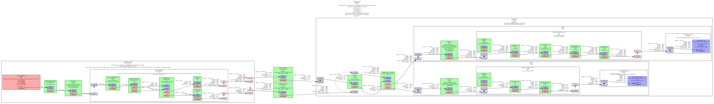

# 基础教程 11：调试工具

## 目标

有时事情不会按预期进行，从总线上获取的错误信息（如果有的话）也无法提供足够的信息。幸运的是，GStreamer 自带大量的调试信息，这些信息通常可以提示问题所在。本教程将展示：

- 如何从 GStreamer 获取更多调试信息。
- 如何将您自己的调试信息打印到 GStreamer 日志中。
- 如何获取管道图

## 打印调试信息

### 调试日志

GStreamer 及其插件充满了调试跟踪信息，也就是说，代码中会将一些特别有趣的信息打印到控制台，同时还会打印时间戳、进程、类别、源代码文件、函数和元素信息。

调试输出由环境变量控制GST_DEBUG。以下是一个示例GST_DEBUG=2：

```json5
0:00:00.868050000  1592   09F62420 WARN                 filesrc gstfilesrc.c:1044:gst_file_src_start:<filesrc0> error: No such file "non-existing-file.webm"
```

如您所见，信息量相当大。事实上，GStreamer 调试日志非常冗长，如果完全启用，可能会导致应用程序无响应（因为控制台会滚动显示），或者占用数兆字节的文本文件空间（因为日志会被重定向到文件）。因此，日志会被分类，您很少需要同时启用所有类别。

第一类是调试级别，它是一个数字，用于指定所需的输出量：

```json5
| # | Name    | Description                                                    |
|---|---------|----------------------------------------------------------------|
| 0 | none    | No debug information is output.                                |
| 1 | ERROR   | Logs all fatal errors. These are errors that do not allow the  |
|   |         | core or elements to perform the requested action. The          |
|   |         | application can still recover if programmed to handle the      |
|   |         | conditions that triggered the error.                           |
| 2 | WARNING | Logs all warnings. Typically these are non-fatal, but          |
|   |         | user-visible problems are expected to happen.                  |
| 3 | FIXME   | Logs all "fixme" messages. Those typically that a codepath that|
|   |         | is known to be incomplete has been triggered. It may work in   |
|   |         | most cases, but may cause problems in specific instances.      |
| 4 | INFO    | Logs all informational messages. These are typically used for  |
|   |         | events in the system that only happen once, or are important   |
|   |         | and rare enough to be logged at this level.                    |
| 5 | DEBUG   | Logs all debug messages. These are general debug messages for  |
|   |         | events that happen only a limited number of times during an    |
|   |         | object's lifetime; these include setup, teardown, change of    |
|   |         | parameters, etc.                                               |
| 6 | LOG     | Logs all log messages. These are messages for events that      |
|   |         | happen repeatedly during an object's lifetime; these include   |
|   |         | streaming and steady-state conditions. This is used for log    |
|   |         | messages that happen on every buffer in an element for example.|
| 7 | TRACE   | Logs all trace messages. Those are message that happen very    |
|   |         | very often. This is for example is each time the reference     |
|   |         | count of a GstMiniObject, such as a GstBuffer or GstEvent, is  |
|   |         | modified.                                                      |
| 9 | MEMDUMP | Logs all memory dump messages. This is the heaviest logging and|
|   |         | may include dumping the content of blocks of memory.           |
+------------------------------------------------------------------------------+
```

要启用调试输出，请将GST_DEBUG环境变量设置为所需的调试级别。所有低于该级别的信息也将显示（例如，如果您设置了 `--debug-level` GST_DEBUG=2，您将同时看到 `--debug-level`ERROR和 `--debug- WARNINGlevel` 消息）。

此外，GStreamer 的每个插件或组件都定义了自己的类别，因此您可以为每个类别指定调试级别。例如，`<plugin>`GST_DEBUG=2,audiotestsrc:6元素将使用调试级别 6 audiotestsrc，而所有其他元素将使用调试级别 2。

因此，环境变量GST_DEBUG是一个以逗号分隔的 category : level对列表，开头有一个可选的level ，表示所有类别的默认调试级别。

也可以使用通配符'*'。例如，`.` GST_DEBUG=2,audio*:6将对所有以单词开头的类别使用调试级别 6，audio这GST_DEBUG=*:2等同于 GST_DEBUG=2`.`

用于gst-launch-1.0 --gst-debug-help获取所有已注册分类的列表。请注意，每个插件都会注册自己的分类，因此，安装或移除插件后，此列表可能会发生变化。

GST_DEBUG当 GStreamer 总线上发布的错误信息无法帮助您确定问题所在时，可以使用此方法。通常的做法是将输出日志重定向到一个文件，然后稍后检查该文件，查找特定的消息。

GStreamer 允许自定义调试信息处理程序，但使用默认处理程序时，调试输出中每一行的内容如下所示：

```json5
0:00:00.868050000  1592   09F62420 WARN                 filesrc gstfilesrc.c:1044:gst_file_src_start:<filesrc0> error: No such file "non-existing-file.webm"
```

信息格式如下：

```json5
| Example          | Explained                                                 |
|------------------|-----------------------------------------------------------|
|0:00:00.868050000 | Time stamp in HH:MM:SS.sssssssss format since the start of|
|                  | the program.                                              |
|1592              | Process ID from which the message was issued. Useful when |
|                  | your problem involves multiple processes.                 |
|09F62420          | Thread ID from which the message was issued. Useful when  |
|                  | your problem involves multiple threads.                   |
|WARN              | Debug level of the message.                               |
|filesrc           | Debug Category of the message.                            |
|gstfilesrc.c:1044 | Source file and line in the GStreamer source code where   |
|                  | this message was issued.                                  |
|gst_file_src_start| Function that issued the message.                         |
|<filesrc0>        | Name of the object that issued the message. It can be an  |
|                  | element, a pad, or something else. Useful when you have   |
|                  | multiple elements of the same kind and need to distinguish|
|                  | among them. Naming your elements with the name property   |
|                  | makes this debug output more readable but GStreamer       |
|                  | assigns each new element a unique name by default.        |
| error: No such   |                                                           |
| file ....        | The actual message.                                       |
+------------------------------------------------------------------------------+
```

### 添加您自己的调试信息

在代码中与 GStreamer 交互的部分，使用 GStreamer 的调试功能会很有帮助。这样，所有调试输出都会保存在同一个文件中，并且不同消息之间的时间关系也能得以保留。

为此，请使用GST_ERROR()、GST_WARNING()、GST_INFO()和 宏。它们接受GST_LOG()与GST_DEBUG()相同的参数 printf，并且使用default类别（default将在输出日志中显示为调试类别）。

要将类别更改为更有意义的内容，请在代码顶部添加以下两行：

```c
GST_DEBUG_CATEGORY_STATIC (my_category);
#define GST_CAT_DEFAULT my_category
```

然后，在您使用以下命令初始化 GStreamer 之后 gst_init()：

```c
GST_DEBUG_CATEGORY_INIT (my_category, "my category", 0, "This is my very own");
```

这将注册一个新的类别（该类别仅在您的应用程序运行期间有效，不会存储在任何文件中），并将其设置为代码的默认类别。请参阅相关文档GST_DEBUG_CATEGORY_INIT()。

### 获取管道图

当你的管道规模过大，导致你难以追踪各个环节之间的连接关系时，GStreamer 可以输出图形文件。这些文件可以使用GraphViz.dot等免费程序读取，它们描述了管道的拓扑结构以及每个环节中协商的流量上限。

playbin 当使用像 `<all-one> ` 或 ` <all-one>` 这样的一体化元素时uridecodebin，这也非常方便，因为它们会在内部实例化多个元素。使用这些.dot文件可以了解它们内部创建的管道（并在此过程中学习一些 GStreamer 知识）。

要获取.dot文件，只需设置GST_DEBUG_DUMP_DOT_DIR环境变量，指向您希望存放文件的文件夹即可。系统gst-launch-1.0会.dot在每次状态更改时创建一个文件，以便您可以查看权限协商的演变过程。取消设置该变量即可禁用此功能。在您的应用程序中，您可以使用 ` GST_DEBUG_BIN_TO_DOT_FILE()and` 宏随时GST_DEBUG_BIN_TO_DOT_FILE_WITH_TS()生成文件。.dot

这里展示了 playbin 生成的管道示例。它非常复杂，因为playbin它可以处理许多不同的情况：通常情况下，您的手动管道不需要这么长。如果您的手动管道开始变得非常庞大，请考虑使用 playbin playbin。



要下载完整尺寸的图片，请使用此页面顶部的附件链接（图标为回形针）。

## 结论

本教程已演示：

- 如何使用 GST_DEBUG环境变量从 GStreamer 获取更多调试信息。
- 如何使用宏及其相关函数将您自己的调试信息打印到 GStreamer 日志中GST_ERROR()。
- 如何使用 GST_DEBUG_DUMP_DOT_DIR环境变量获取管道图。

很高兴您能来，期待很快再见到您！


