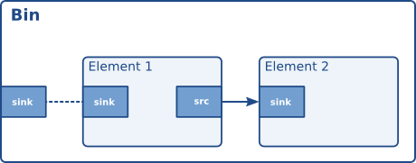

# 播放教程 7：自定义播放容器

## 目标

playbin还可以通过手动选择音频和视频接收器进行进一步自定义。这使得应用程序可以依赖它playbin来检索和解码媒体，然后自行管理最终的渲染/显示。本教程将演示：

- 如何更换选定的水槽playbin。
- 如何将复杂的管道用作接收器。

## 介绍

有两个属性playbin允许选择所需的音频和视频接收器：`audio_sink`audio-sink和`video_sink` video-sink（分别对应这两个属性）。应用程序只需实例化相应的接收器GstElement，并通过这些属性将其传递给 `apply_sink` 即可 playbin。

然而，这种方法只允许使用单个 Element 作为接收器。如果需要更复杂的管道，例如均衡器加音频接收器，则需要将其封装在 Bin 中，使其看起来 playbin像是一个单独的 Element。

Bin（GstBin）是一个容器，它封装了部分管道，以便将它们作为单个元素进行管理。例如， GstPipeline我们在所有教程中使用的 Bin 就是一种 Bin GstBin，它不与外部元素交互。Bin 内部的元素通过 Ghost Pad（GstGhostPad）连接到外部元素。Ghost Pad 是 Bin 表面的 Pad，它负责将数据从外部 Pad 转发到内部元素上的指定 Pad。



GstBins 也是一种类型GstElement，因此可以在任何需要 Element 的地方使用它们，特别是作为接收器playbin（它们就被称为接收器箱）。

## 一名实力相当的球员

将此代码复制到名为 . 的文本文件中playback-tutorial-7.c。

播放教程7.c

```c
#include <gst/gst.h>

#ifdef __APPLE__
#include <TargetConditionals.h>
#endif

int
tutorial_main (int argc, char *argv[])
{
  GstElement *pipeline, *bin, *equalizer, *convert, *sink;
  GstPad *pad, *ghost_pad;
  GstBus *bus;
  GstMessage *msg;

  /* Initialize GStreamer */
  gst_init (&argc, &argv);

  /* Build the pipeline */
  pipeline =
      gst_parse_launch
      ("playbin uri=https://gstreamer.freedesktop.org/data/media/sintel_trailer-480p.webm",
      NULL);

  /* Create the elements inside the sink bin */
  equalizer = gst_element_factory_make ("equalizer-3bands", "equalizer");
  convert = gst_element_factory_make ("audioconvert", "convert");
  sink = gst_element_factory_make ("autoaudiosink", "audio_sink");
  if (!equalizer || !convert || !sink) {
    g_printerr ("Not all elements could be created.\n");
    return -1;
  }

  /* Create the sink bin, add the elements and link them */
  bin = gst_bin_new ("audio_sink_bin");
  gst_bin_add_many (GST_BIN (bin), equalizer, convert, sink, NULL);
  gst_element_link_many (equalizer, convert, sink, NULL);
  pad = gst_element_get_static_pad (equalizer, "sink");
  ghost_pad = gst_ghost_pad_new ("sink", pad);
  gst_pad_set_active (ghost_pad, TRUE);
  gst_element_add_pad (bin, ghost_pad);
  gst_object_unref (pad);

  /* Configure the equalizer */
  g_object_set (G_OBJECT (equalizer), "band1", (gdouble) - 24.0, NULL);
  g_object_set (G_OBJECT (equalizer), "band2", (gdouble) - 24.0, NULL);

  /* Set playbin2's audio sink to be our sink bin */
  g_object_set (GST_OBJECT (pipeline), "audio-sink", bin, NULL);

  /* Start playing */
  gst_element_set_state (pipeline, GST_STATE_PLAYING);

  /* Wait until error or EOS */
  bus = gst_element_get_bus (pipeline);
  msg =
      gst_bus_timed_pop_filtered (bus, GST_CLOCK_TIME_NONE,
      GST_MESSAGE_ERROR | GST_MESSAGE_EOS);

  /* Free resources */
  if (msg != NULL)
    gst_message_unref (msg);
  gst_object_unref (bus);
  gst_element_set_state (pipeline, GST_STATE_NULL);
  gst_object_unref (pipeline);
  return 0;
}

int
main (int argc, char *argv[])
{
#if defined(__APPLE__) && TARGET_OS_MAC && !TARGET_OS_IPHONE
  return gst_macos_main ((GstMainFunc) tutorial_main, argc, argv, NULL);
#else
  return tutorial_main (argc, argv);
#endif
}
```

    如果您在编译此代码时需要帮助，请参阅 适用于您平台（Mac或 Windows）的“构建教程”部分，或者在 Linux 上使用以下特定命令：
    gcc playback-tutorial-7.c -o playback-tutorial-7 `pkg-config --cflags --libs gstreamer-1.0`
    如果您在运行此代码时需要帮助，请参阅适用于您平台的“运行教程”部分： Mac OS X、Windows、 iOS或android。
    本教程会打开一个窗口并显示一段视频，视频配有相应的音频。媒体文件来自互联网，因此窗口可能需要几秒钟才能显示，具体时间取决于您的网络连接速度。高频部分已被衰减，因此视频声音的低音部分应该更强劲。
    所需库：gstreamer-1.0

## 攻略

```c
/* Create the elements inside the sink bin */
equalizer = gst_element_factory_make ("equalizer-3bands", "equalizer");
convert = gst_element_factory_make ("audioconvert", "convert");
sink = gst_element_factory_make ("autoaudiosink", "audio_sink");
if (!equalizer || !convert || !sink) {
  g_printerr ("Not all elements could be created.\n");
  return -1;
}
```

构成我们接收器容器的所有元素都已实例化。我们使用了一个 `<a>` equalizer-3bands和一个 `<b>` autoaudiosink，audioconvert中间用一个 `<a>` 连接，因为我们不确定音频接收器的功能（因为它们依赖于硬件）。

```c
/* Create the sink bin, add the elements and link them */
bin = gst_bin_new ("audio_sink_bin");
gst_bin_add_many (GST_BIN (bin), equalizer, convert, sink, NULL);
gst_element_link_many (equalizer, convert, sink, NULL);
```

这会将新元素添加到容器中，并像我们在管道中那样将它们链接起来。

```c
pad = gst_element_get_static_pad (equalizer, "sink");
ghost_pad = gst_ghost_pad_new ("sink", pad);
gst_pad_set_active (ghost_pad, TRUE);
gst_element_add_pad (bin, ghost_pad);
gst_object_unref (pad);
```

现在我们需要创建一个 Ghost Pad，以便将 Bin 内部的这个部分管道连接到外部。这个 Ghost Pad 将连接到某个内部元素（均衡器的接收器 Pad）中的一个 Pad，因此我们需要使用 . 来检索这个 Pad gst_element_get_static_pad()。回想一下基础教程 7：多线程和 Pad 可用性，如果这是一个请求 Pad 而不是始终 Pad，我们需要使用 gst_element_request_pad().

gst_ghost_pad_new()使用（指向我们刚刚获取的内部 Pad）创建 Ghost Pad ，并使用激活gst_pad_set_active()。然后使用将其添加到 Bin gst_element_add_pad()，将 Ghost Pad 的所有权转移到 Bin，这样我们就不必担心释放它。

最后，我们需要用以下方式释放从均衡器获得的下沉垫gst_object_unref()。

至此，我们已经有了一个功能齐全的接收器，可以将其用作音频接收器playbin。我们只需要指示程序playbin如何使用它：

```c
/* Set playbin's audio sink to be our sink bin */
g_object_set (GST_OBJECT (pipeline), "audio-sink", bin, NULL);
```

只需将该audio-sink属性设置playbin到新创建的接收器上即可。

```c
/* Configure the equalizer */
g_object_set (G_OBJECT (equalizer), "band1", (gdouble)-24.0, NULL);
g_object_set (G_OBJECT (equalizer), "band2", (gdouble)-24.0, NULL);
```

最后一步是配置均衡器。在这个例子中，两个较高频段的衰减值设置为最大，因此低音得到了增强。您可以尝试调整这些数值，感受一下区别（equalizer-3bands有关允许的数值范围，请参阅该元素的文档）。

## 锻炼

使用 GStreamer 提供的众多有趣的视频滤镜之一（例如 `<video> solarize` vertigotv或插件中的任何元素） ，创建一个视频容器而不是音频容器。如果由于功能不兼容导致管道连接失败，effectv请记住使用色彩空间转换元素。videoconvert

## 结论

本教程已演示：

- playbin如何使用 audio-sink 和 video-sink 属性设置自己的接收器。
- 如何将一段管道包裹起来，GstBin以便它可以被用作接收器playbin。

很高兴您能来，期待很快再见到您！


