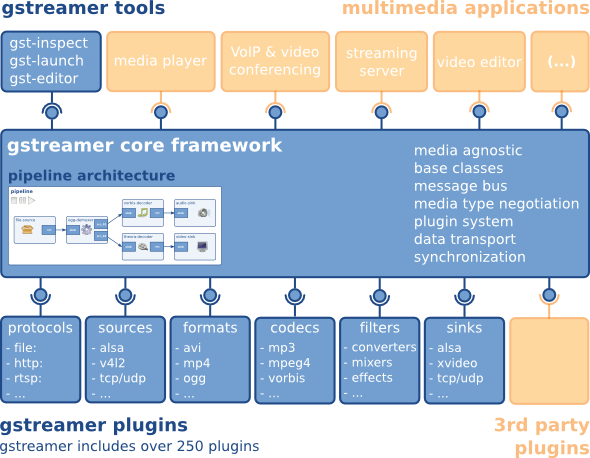

# GStreamer是什么？

GStreamer 是一个用于创建流媒体应用程序的框架。其基本设计源自俄勒冈研究生院的视频管道，并借鉴了 DirectShow 的一些理念。

GStreamer 的开发框架使得编写任何类型的流媒体应用程序成为可能。GStreamer 框架旨在简化音频、视频或两者兼具的应用程序的编写。它不仅限于音频和视频，还可以处理任何类型的数据流。其管道设计旨在最大限度地减少应用滤波器带来的额外开销。这使得 GStreamer 成为设计对延迟要求极高的高端音频应用程序的理想框架。

GStreamer 最显而易见的用途之一是构建媒体播放器。GStreamer 本身就包含构建媒体播放器所需的组件，能够支持多种格式，包括 MP3、Ogg/Vorbis、MPEG-1/2、AVI、QuickTime、MOD 等等。然而，GStreamer 的功能远不止于此。它的主要优势在于其可插拔组件可以自由组合，构建任意的管道，从而能够编写功能齐全的视频或音频编辑应用程序。

该框架基于插件，这些插件提供各种编解码器和其他功能。插件可以链接并排列成管道。该管道定义了数据的流向。管道还可以使用图形用户界面编辑器进行编辑，并保存为 XML 文件，从而可以轻松创建管道库。

GStreamer 的核心功能是为插件、数据流和媒体类型处理/协商提供框架。它还提供了一个 API，用于编写使用各种插件的应用程序。

**具体来说，GStreamer 提供**

- 多媒体应用程序的 API
- 插件架构
- 管道架构
- 媒体类型处理/协商机制
- 一种同步机制
- 超过 250 个插件，提供 1000 多个元素
- 一套工具

**GStreamer插件可以分为以下几类：**

- 协议处理
- 来源：音频和视频（涉及协议插件）
- 格式：解析器、格式化器、复用器、解复用器、元数据、字幕
- 编解码器：编码器和解码器
- 滤波器：转换器、混音器、效果器……
- 接收器：用于音频和视频（涉及协议插件）

**GStreamer 被打包成**

- gstreamer：核心包
- gst-plugins-base：一套必要的示例元素
- gst-plugins-good：一套基于 LGPL 协议的高质量插件。
- gst-plugins-ugly：一套高质量插件，但可能存在分发问题。
- gst-plugins-bad：一组需要提高质量的插件
- gst-libav：一组用于解码和编码 libav 的插件。
- 还有一些其他的包裹

