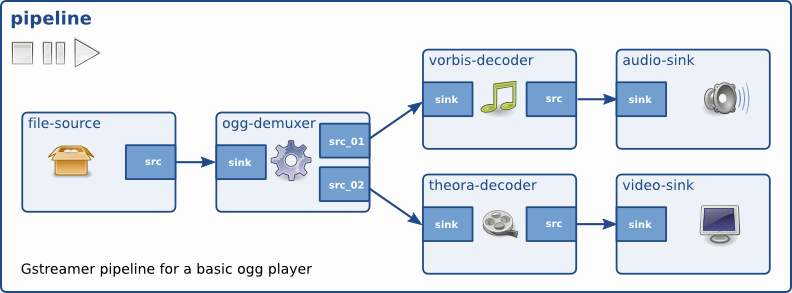

# 基础

本章将介绍 GStreamer 的基本概念。理解这些概念对于阅读本指南的其余部分至关重要，因为所有后续章节都假定读者已理解这些基本概念。

## Elements

在 GStreamer 中，元素是最重要的对象类别。通常，你会创建一系列相互连接的元素，并让数据流经这些元素。每个元素都具有一个特定的功能，例如从文件中读取数据、解码数据或将数据输出到声卡（或其他设备）。通过将多个这样的元素连接起来，你可以创建一个管道来执行特定任务，例如媒体播放或捕获。GStreamer 默认提供了大量的元素，这使得开发各种媒体应用程序成为可能。如有需要，你也可以编写新的元素。关于这方面的详细说明，请参阅《GStreamer 插件编写指南》。

## Pads

垫片是元素的输入和输出，用于连接其他元素。它们用于在 GStreamer 中协商元素之间的链接和数据流。垫片可以看作是元素上的“插头”或“端口”，可以与其他元素建立链接，数据也可以通过这些链接流入或流出这些元素。垫片具有特定的数据处理能力：垫片可以限制流经它的数据类型。只有当两个垫片的允许数据类型（能力）兼容时，才允许在它们之间建立链接。垫片之间的数据类型通过称为能力协商的过程进行协商。数据类型由……描述GstCaps。

这里用个类比或许更有帮助。Pad 类似于物理设备上的插头或插孔。例如，考虑一个家庭影院系统，它由音频放大器、DVD 播放器和（无声）投影仪组成。DVD 播放器和放大器可以连接，因为这两个设备都有音频插孔；投影仪和 DVD 播放器也可以连接，因为这两个设备都有兼容的视频插孔。但是，投影仪和放大器之间不能连接，因为它们的插孔类型不同。GStreamer 中的 Pad 的作用与家庭影院系统中的插孔相同。

在 GStreamer 中，大部分数据都是通过元素之间的链接单向流动的。数据从一个元素经由一个或多个 源 pad流出，而元素则通过一个或多个接收器 pad接收传入的数据 。源元素和接收器元素分别只有源 pad 和接收器 pad。数据通常指的是缓冲区（由 GstBuffer 对象描述）和事件（由 GstEvent 对象描述）。

## Bins and pipelines

容器（bin）是用于存放元素集合的容器。由于容器本身是元素的子类，因此您可以像控制元素一样控制容器，从而为应用程序简化许多复杂性。例如，您可以通过更改容器自身的状态来更改其中所有元素的状态。容器还会转发来自其子元素的总线消息（例如错误消息、标签消息或 EOS消息）。

管道是一个顶层容器。它为应用程序提供总线，并管理其子进程的同步。当您将其设置为启用 或禁用状态时，数据流将启动并进行媒体处理。管道启动后，将在单独的线程中运行，直到您停止它或到达数据流的末尾。PAUSEDPLAYING

## Communication

GStreamer 提供了多种机制，用于应用程序和管道之间的通信和数据交换。

- 缓冲区是用于在管道中各个元素之间传递流式数据的对象。缓冲区的数据总是从源流向接收器（下游）。
- 事件是指在元素之间或从应用程序发送到元素的对象。事件可以向上游和下游传递。下游事件可以与数据流同步。
- 消息是由管道中的元素发布到消息总线上的对象，它们将被保存在消息总线上，等待应用程序收集。消息可以从发布消息的元素所在的流线程上下文中同步拦截，但通常由应用程序在其主线程中异步处理。消息用于以线程安全的方式将错误、标签、状态更改、缓冲状态、重定向等信息从元素传输到应用程序。
- 查询允许应用程序从管道中请求诸如时长或当前播放位置之类的信息。查询始终同步响应。元素也可以使用查询从其对等元素请求信息（例如文件大小或时长）。查询在管道中可以双向使用，但上游查询更为常见。

