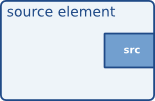
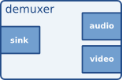

# Elements

对于应用程序员来说，GStreamer 中最重要的对象是 ` GstElement <MediaPile>` 对象。`<MediaPile>` 元素是媒体管道的基本构建块。您将使用的所有不同的高级组件都派生自 `<MediaPile>` GstElement。每个解码器、编码器、解复用器、视频或音频输出实际上都是一个 `<MediaPile>`。GstElement

## What are elements?

对于应用程序员来说，最好将元素想象成黑盒子。在一端，您可以输入数据，元素对其进行处理，然后从另一端输出结果。例如，对于解码器元素，您可以输入编码后的数据，元素会输出解码后的数据。在下一章（参见“填充和功能”）中，您将了解更多关于元素的数据输入和输出，以及如何在应用程序中进行设置。

## Source elements

源元素生成供管道使用的数据，例如从磁盘或声卡读取数据。源元素的可视化展示了我们将如何呈现该元素。我们始终在元素右侧绘制一个源区域。



源元素不接收数据，它们只生成数据。如图所示，图中只有一个源焊盘（位于右侧）。源焊盘只能生成数据。

## Filters, convertors, demuxers, muxers and codecs

滤波器和类似滤波器的元件都具有输入和输出引脚。它们处理从输入（接收器）引脚接收的数据，并将数据输出到输出（源）引脚。此类元件的例子包括音量元件（滤波器）、视频缩放器（转换器）、Ogg 解复用器或 Vorbis 解码器。

类似滤波器的元件可以拥有任意数量的源引脚或接收器引脚。例如，视频解复用器会有一个接收器引脚和若干个（1-N）源引脚，每个源引脚对应容器格式中包含的一个基本流。而解码器则只有一个源引脚和一个接收器引脚。


滤波器元件的可视化 展示了我们将如何可视化一个类似滤波器的元件。这个特定的元件包含一个源焊盘和一个接收器焊盘。接收器焊盘用于接收输入数据，位于元件的左侧；源焊盘仍然位于右侧。



可视化具有多个输出端口的滤波器元素 ，可以看到另一个类似滤波器的元素，该元素具有多个输出（源）端口。例如，一个用于处理包含音频和视频的 Ogg 流的 Ogg 解复用器就是这样的元素。一个源端口包含基本视频流，另一个源端口包含基本音频流。解复用器通常会在创建新端口时触发信号。应用程序员随后可以在信号处理程序中处理新的基本流。

## Sink elements

接收器元素是媒体管道中的端点。它们接收数据，但不产生任何输出。磁盘写入、声卡播放和视频输出等操作都由接收器元素实现。接收器元素的可视化图展示了接收器元素的示意图。


## 创建一个GstElement

创建元素的最简单方法是使用 `createElement` gst_element_factory_make ()函数。该函数接受一个工厂名称和一个元素名称，用于指定新创建的元素。元素名称可用于后续在 bin 中查找元素，例如。该名称也会用于调试输出。您可以将 `default`NULL作为名称参数传递，以获取唯一的默认名称。

当您不再需要某个元素时，需要使用 `unref` 方法来取消引用它 gst_object_unref ()。这会将该元素的引用计数减 1。元素在创建时引用计数为 1。当引用计数减至 0 时，该元素将被彻底销毁。

以下示例[1]展示了如何使用 名为fakesrc 的元素工厂创建名为source的元素。它会检查创建是否成功。检查成功后，它会取消对该元素的引用。

```c
#include <gst/gst.h>

int
main (int   argc,
      char *argv[])
{
  GstElement *element;

  /* init GStreamer */
  gst_init (&argc, &argv);

  /* create element */
  element = gst_element_factory_make ("fakesrc", "source");
  if (!element) {
    g_print ("Failed to create element of type 'fakesrc'\n");
    return -1;
  }

  gst_object_unref (GST_OBJECT (element));

  return 0;
}
```

gst_element_factory_make实际上，它是两个函数组合的简写。 对象由工厂创建。要创建元素，您必须 使用唯一的工厂名称 GstElement 访问对象 。这是通过 `.` 完成的。GstElementFactorygst_element_factory_find ()

以下代码片段用于获取一个工厂，该工厂可用于创建fakesrc元素，即一个模拟数据源。该函数 gst_element_factory_create () 将使用该元素工厂创建一个具有给定名称的元素。

## 使用元素作为GObject

A GstElement 可以拥有多个属性，这些属性使用标准属性实现 。因此，支持查询、设置和获取属性值的GObject常用方法。GObjectGParamSpecs

每个元素都GstElement至少继承其父元素的一个属性 ：“name”属性。这是您提供给函数或函数的GstObject名称。您可以使用函数 或函数获取和设置此属性，也可以使用 如下所示的属性机制。gst_element_factory_make ()gst_element_factory_create ()gst_object_set_namegst_object_get_nameGObject

```c
#include <gst/gst.h>

int
main (int   argc,
      char *argv[])
{
  GstElement *element;
  gchar *name;

  /* init GStreamer */
  gst_init (&argc, &argv);

  /* create element */
  element = gst_element_factory_make ("fakesrc", "source");

  /* get name */
  g_object_get (G_OBJECT (element), "name", &name, NULL);
  g_print ("The name of the element is '%s'.\n", name);
  g_free (name);

  gst_object_unref (GST_OBJECT (element));

  return 0;
}
```

大多数插件都提供额外的属性，以便提供有关其配置的更多信息或配置元素。`gst-inspect`gst-inspect是一个用于查询特定元素属性的实用工具，它还会使用属性自省来简要说明属性的功能以及它支持的参数类型和范围。有关 `gst-inspect` 的详细信息，请参阅附录中的`gst-inspect`gst-inspect。

有关GObject属性的更多信息，我们建议您阅读GObject 手册和Glib 对象系统简介。

A GstElement 还提供了各种GObject信号，可用作灵活的回调机制。同样，您也可以使用此gst-inspect功能来查看特定元素支持哪些信号。信号和属性共同构成了元素和应用程序交互的最基本方式。

## 关于元素工厂的更多信息

在上一节中，我们 GstElementFactory 已经简要介绍了对象，它是一种创建元素实例的方法。然而，元素工厂的功能远不止于此。元素工厂是从 GStreamer 注册表中检索的基本类型，它们描述了 GStreamer 可以创建的所有插件和元素。这意味着元素工厂对于自动元素实例化（例如自动插件器所做的工作）以及创建可用元素列表都非常有用。

### 使用工厂获取有关元素的信息

类似这样的工具gst-inspect会提供一些关于元素的通用信息，例如插件的作者、描述性名称（以及简称）、等级和类别。类别可用于获取使用此元素工厂可以创建的元素类型。类别示例包括Codec/Decoder/Video（视频解码器）、Codec/Encoder/Video（视频编码器）、Source/Video（视频生成器）、Sink/Video（视频输出），当然，所有这些类别也适用于音频。此外，还有Codec/Demuxer和Codec/Muxer 以及更多其他信息。gst-inspect会列出所有工厂，并gst-inspect <factory-name>列出上述所有信息以及更多内容。

```c
#include <gst/gst.h>

int
main (int   argc,
      char *argv[])
{
  GstElementFactory *factory;

  /* init GStreamer */
  gst_init (&argc, &argv);

  /* get factory */
  factory = gst_element_factory_find ("fakesrc");
  if (!factory) {
    g_print ("You don't have the 'fakesrc' element installed!\n");
    return -1;
  }

  /* display information */
  g_print ("The '%s' element is a member of the category %s.\n"
           "Description: %s\n",
           gst_plugin_feature_get_name (GST_PLUGIN_FEATURE (factory)),
           gst_element_factory_get_metadata (factory, GST_ELEMENT_METADATA_KLASS),
           gst_element_factory_get_metadata (factory, GST_ELEMENT_METADATA_DESCRIPTION));

  gst_object_unref (GST_OBJECT (factory));

  return 0;
}
```

你可以使用它gst_registry_pool_feature_list (GST_TYPE_ELEMENT_FACTORY) 来获取 GStreamer 所知道的所有元素工厂的列表。

### 找出元素可以包含哪些填充。

元素工厂最强大的功能或许在于，它们包含了元素可以生成的 pad 的完整描述，以及这些 pad 的功能（通俗地说：哪些类型的媒体可以通过这些 pad 流式传输），而无需将这些插件加载到内存中。这可以用于为编码器提供编解码器选择列表，也可以用于媒体播放器的自动插拔。目前所有基于 GStreamer 的媒体播放器和自动插拔器都采用这种方式。我们将在下一章“Pad 和功能”中更详细地了解GstPad 这些GstCaps特性。

## 连接元素

通过将源元素与零个或多个类似过滤器的元素以及最终的接收器元素连接起来，即可建立媒体管道。数据将流经这些元素。这是 GStreamer 中媒体处理的基本概念。


通过连接这三个元素，我们创建了一个非常简单的元素链。其效果是，源元素的输出将作为类似过滤器的元素的输入。类似过滤器的元素将对数据进行处理，并将结果发送到最终的接收器元素。

可以将上图想象成一个简单的 Ogg/Vorbis 音频解码器。源端是磁盘，它从磁盘读取文件。第二个元件是 Ogg/Vorbis 音频解码器。接收器元件是你的声卡，它播放解码后的音频数据。我们将在本手册的后续部分使用这个简单的图来构建一个 Ogg/Vorbis 播放器。

上述图表的代码写法如下：

```c
#include <gst/gst.h>

int
main (int   argc,
      char *argv[])
{
  GstElement *pipeline;
  GstElement *source, *filter, *sink;

  /* init */
  gst_init (&argc, &argv);

  /* create pipeline */
  pipeline = gst_pipeline_new ("my-pipeline");

  /* create elements */
  source = gst_element_factory_make ("fakesrc", "source");
  filter = gst_element_factory_make ("identity", "filter");
  sink = gst_element_factory_make ("fakesink", "sink");

  /* must add elements to pipeline before linking them */
  gst_bin_add_many (GST_BIN (pipeline), source, filter, sink, NULL);

  /* link */
  if (!gst_element_link_many (source, filter, sink, NULL)) {
    g_warning ("Failed to link elements!");
  }

[..]

}
```

gst_element_link ()要实现更具体的行为，还可以使用 `and`和 `.`函数 gst_element_link_pads ()。您还可以获取对单个 pad 的引用，并使用各种 gst_pad_link_* ()函数将它们链接起来。有关更多详细信息，请参阅 API 文档。

重要提示：必须先将元素添加到容器或管道中，然后才能进行链接，因为向容器中添加元素会断开所有已存在的链接。此外，您不能直接链接不在同一个容器或管道中的元素；如果要链接不同层级的元素或工作区，则需要使用虚拟工作区（稍后会详细介绍 虚拟工作区）。

## Element States

元素创建后，实际上并不会执行任何操作。你需要改变元素的状态才能让它执行某些操作。GStreamer 支持四种元素状态，每种状态都有其特定的含义。这四种状态是：

- GST_STATE_NULL这是默认状态。此状态下未分配任何资源，因此，转换到此状态将释放所有资源。当元素的引用计数达到 0 并被释放时，该元素必须处于此状态。
- GST_STATE_READY在就绪状态下，元素已分配了所有全局资源，即可以保存在流中的资源。例如，可以考虑打开设备、分配缓冲区等等。但是，在此状态下流并未打开，因此流的位置会自动归零。如果流之前已打开，则在此状态下应将其关闭，并重置位置、属性等信息。
- GST_STATE_PAUSED在此状态下，元素已打开流，但并未主动处理流内容。元素可以修改流的位置、读取和处理数据等，以便在状态变为 PAUSED 后立即进行播放准备，但不能播放 会使时钟运行的数据。总之，PAUSED 状态与 PLAYING 状态相同，只是没有运行时钟。进入该PAUSED状态的元素应尽快做好转换准备PLAYING。例如，视频或音频输出会等待数据到达并将其排队，以便在状态改变后立即播放。此外，视频接收器可以提前播放第一帧（因为这不会影响时钟）。自动插拔器可以利用此状态转换预先连接管道。然而，大多数其他元素（例如编解码器或滤波器）在此状态下无需显式执行任何操作。
- GST_STATE_PLAYING在该PLAYING状态下，元素与在PAUSED状态中执行完全相同的操作，只是现在时钟在运行。

你可以使用函数来改变元素的状态 gst_element_set_state ()。如果你将一个元素的状态设置为另一个状态，GStreamer 会在内部遍历所有中间状态。因此，如果你将一个元素的状态从 `0` 设置为 ` NULL1` PLAYING，GStreamer 会在内部将该元素的状态设置为 `0`READY以及PAUSED介于两者之间的状态。

迁移到 GStreamer 后GST_STATE_PLAYING，管道将自动处理数据，无需任何形式的迭代。GStreamer 内部会启动线程来处理这些任务。此外，GStreamer 还会使用 GStreamer 总线将消息从管道线程切换到应用程序自身的线程。 GstBus详情请参阅GStreamer总线文档。

当您将 bin 或 pipeline 设置为某个目标状态时，它通常会自动将状态更改传播到 bin 或 pipeline 中的所有元素，因此通常只需要设置顶层 pipeline 的状态即可启动或关闭 pipeline。但是，当动态地向已运行的 pipeline 添加元素时（例如，从“pad-added”信号回调中），您需要使用 `setState` 或 `setState` 手动将其设置为所需的目标gst_element_set_state ()状态gst_element_sync_state_with_parent ()。

本示例的代码是从文档中自动提取的，并构建tests/examples/manual在 GStreamer tarball 中。


