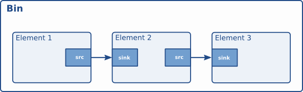

# Bins

容器（bin）是一种容器元素。您可以向容器中添加元素。由于容器本身也是一个元素，因此可以像处理其他任何元素一样处理容器。所以，上一章（元素）的内容也同样适用于容器。

## 什么是 Bins ？

容器（Bin）允许您将一组相互关联的元素合并成一个逻辑元素。您不再需要处理单个元素，而只需处理一个元素，即容器本身。我们将看到，在构建复杂的管道时，这非常强大，因为它允许您将管道拆分成更小的块。

该容器还将管理其中包含的元素。它将对元素执行状态更改，并收集和转发总线消息。



GStreamer 程序员可以使用一种特殊的 bin 类型：

- 管道：一种通用容器，用于管理其中包含的元素的同步和总线消息。顶层 bin 必须是一个管道，因此每个应用程序至少需要一个这样的管道。

## 创建 Bins

容器的创建方式与其他元素相同，即使用元素工厂。此外，还有一些便捷函数（`addElement`gst_bin_new ()和 `removeElement` gst_pipeline_new ()）。要向容器添加元素或从容器中移除元素，可以使用 `addElement`gst_bin_add ()和 `removeElement` gst_bin_remove ()。请注意，添加元素的容器将拥有该元素的所有权。如果销毁容器，该元素将被容器取消引用。如果从容器中移除元素，该元素将被自动取消引用。

```c
#include <gst/gst.h>

int
main (int   argc,
      char *argv[])
{
  GstElement *bin, *pipeline, *source, *sink;

  /* init */
  gst_init (&argc, &argv);

  /* create */
  pipeline = gst_pipeline_new ("my_pipeline");
  bin = gst_bin_new ("my_bin");
  source = gst_element_factory_make ("fakesrc", "source");
  sink = gst_element_factory_make ("fakesink", "sink");

  /* First add the elements to the bin */
  gst_bin_add_many (GST_BIN (bin), source, sink, NULL);
  /* add the bin to the pipeline */
  gst_bin_add (GST_BIN (pipeline), bin);

  /* link the elements */
  gst_element_link (source, sink);

[..]

}
```

有多种函数可以查找 bin 中的元素。最常用的是 `getElements()`gst_bin_get_by_name ()和 `getElements() gst_bin_get_by_interface ()`。您还可以使用 `items()` 函数遍历 bin 中包含的所有元素gst_bin_iterate_elements ()。有关详细信息，请参阅 API 文档 GstBin 。

## 定制 Bins

应用程序员可以创建自定义容器，将各种元素打包其中，以执行特定任务。例如，这允许您仅使用以下几行代码编写 Ogg/Vorbis 解码器：

```c
int
main (int   argc,
      char *argv[])
{
  GstElement *player;

  /* init */
  gst_init (&argc, &argv);

  /* create player */
  player = gst_element_factory_make ("oggvorbisplayer", "player");

  /* set the source audio file */
  g_object_set (player, "location", "helloworld.ogg", NULL);

  /* start playback */
  gst_element_set_state (GST_ELEMENT (player), GST_STATE_PLAYING);
[..]
}
```

（当然，这只是一个简单的例子，实际上已经存在一个功能更强大、用途更广泛的自定义 bin：playbin 元素。）

自定义存储桶可以通过插件或应用程序创建。有关创建自定义存储桶的更多信息，请参阅《插件编写者指南》。

例如， gst-plugins-base中的 playbin 和 uridecodebin 元素就是此类自定义 bin 的示例。

## Bins 管理其子的状态

容器（Bin）管理其中包含的所有元素的状态。如果您使用 `setState` 将容器（或管道，管道是一种特殊的顶级容器）设置为某个目标状态gst_element_set_state ()，它将确保其中包含的所有元素也设置为该状态。这意味着通常只需设置顶级管道的状态即可启动或关闭管道。

容器会对其所有子元素执行状态更改，从接收元素到源元素。这确保当上游元素变为PAUSED 或时，下游元素已准备好接收数据PLAYING。类似地，在关闭时，接收元素会首先被设置为READY或NULL，这将导致上游元素收到FLUSHING错误并停止流线程，然后再将元素设置为READY或NULL状态。

但请注意，如果向正在运行的 bin 或 pipeline 中添加元素（例如，通过“pad-added”信号回调），则元素的状态不会自动与添加元素的 bin 或 pipeline 的当前状态或目标状态保持一致。相反，您需要 在向已运行的 pipeline 添加元素时，gst_element_set_state ()使用`setState` 或 `setState` 手动将其设置为所需的目标状态。gst_element_sync_state_with_parent ()


