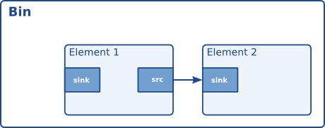

# Pads and capabilities

正如我们在“元素”部分所看到的，数据位是元素与外部世界的接口。数据流从一个元素的源数据位流向另一个元素的接收数据位。元素可以处理的具体媒体类型由数据位的功能决定。我们将在本章后面详细讨论功能（参见“数据位的功能”）。

## Pads

填充类型由两个属性定义：方向和可用性。如前所述，GStreamer 定义了两种填充方向：源填充和接收填充。这种术语是从元素内部的角度定义的：元素在其接收填充上接收数据，在其源填充上生成数据。示意图中，接收填充绘制在元素的左侧，而源填充绘制在元素的右侧。在这样的图中，数据从左向右流动。[1]

与 Pad 的可用性相比，Pad 的方向非常简单。Pad 可以有三种可用性：始终存在、有时存在和按需存在。这三种类型的含义正如其字面意思：始终存在的 Pad 始终存在；有时存在的 Pad 仅在特定情况下存在（并且可能随机消失）；按需存在的 Pad 仅在应用程序明确请求时才会出现。

## 动态（或有时）pads

有些元素在创建时可能并非拥有全部的填充（pad）。例如，Ogg 解复用器元素就可能出现这种情况。该元素会读取 Ogg 流，并在检测到 Ogg 流中包含的 Vorbis、Theora 等基本流时，为其创建动态填充。同样，当流结束时，它会删除相应的填充。这种机制对于解复用器元素来说非常有用。

运行后gst-inspect-1.0 oggdemux会发现该元素只有一个 pad：一个名为“sink”的接收器 pad。其他 pad 处于“休眠”状态。您可以在 pad 模板中看到这一点，因为其中有一个“Availability: Sometimes”属性。根据您播放的 Ogg 文件类型，会创建相应的 pad。我们将看到，这在创建动态管道时非常重要。您可以为元素附加一个信号处理程序，以便在元素根据其“sometimes” pad 模板创建新 pad 时收到通知。以下代码片段展示了如何实现此功能：

```c
#include <gst/gst.h>

static void
cb_new_pad (GstElement *element,
        GstPad     *pad,
        gpointer    data)
{
  gchar *name;

  name = gst_pad_get_name (pad);
  g_print ("A new pad %s was created\n", name);
  g_free (name);

  /* here, you would setup a new pad link for the newly created pad */
[..]

}

int
main (int   argc,
      char *argv[])
{
  GstElement *pipeline, *source, *demux;
  GMainLoop *loop;

  /* init */
  gst_init (&argc, &argv);

  /* create elements */
  pipeline = gst_pipeline_new ("my_pipeline");
  source = gst_element_factory_make ("filesrc", "source");
  g_object_set (source, "location", argv[1], NULL);
  demux = gst_element_factory_make ("oggdemux", "demuxer");

  /* you would normally check that the elements were created properly */

  /* put together a pipeline */
  gst_bin_add_many (GST_BIN (pipeline), source, demux, NULL);
  gst_element_link_pads (source, "src", demux, "sink");

  /* listen for newly created pads */
  g_signal_connect (demux, "pad-added", G_CALLBACK (cb_new_pad), NULL);

  /* start the pipeline */
  gst_element_set_state (GST_ELEMENT (pipeline), GST_STATE_PLAYING);
  loop = g_main_loop_new (NULL, FALSE);
  g_main_loop_run (loop);

[..]

}
```

仅在“pad-added”回调函数中向管道添加元素的情况并不少见。如果这样做，请不要忘记使用 gst_element_set_state ()或将新添加元素的状态设置为管道的目标状态gst_element_sync_state_with_parent ()。

## Request pads

元素还可以拥有请求垫。这些垫不会自动创建，而是按需创建。这对于多路复用器、聚合器和 T 型元素非常有用。聚合器会将多个输入流的内容合并成一个输出流。T 型元素则相反：它们只有一个输入流，并将该流复制到每个按需创建的输出垫。每当应用程序需要该流的另一个副本时，只需向 T 型元素请求一个新的输出垫即可。

以下代码片段展示了如何从“tee”元素请求新的输出焊盘：

```c
static void
some_function (GstElement * tee)
{
  GstPad *pad;
  gchar *name;

  pad = gst_element_request_pad_simple (tee, "src%d");
  name = gst_pad_get_name (pad);
  g_print ("A new pad %s was created\n", name);
  g_free (name);

  /* here, you would link the pad */

  /* [..] */

  /* and, after doing that, free our reference */
  gst_object_unref (GST_OBJECT (pad));
}
```

该gst_element_request_pad_simple ()方法可用于根据 pad 模板名称从元素中获取 pad。它还可以请求与另一个 pad 模板兼容的 pad。如果您想将某个元素链接到多路复用器元素，并且需要请求一个兼容的 pad，这将非常有用。 gst_element_get_compatible_pad ()如下例所示，该方法可用于请求兼容的 pad。它将从任何输入的 Ogg 多路复用器请求一个兼容的 pad。

```c
static void
link_to_multiplexer (GstPad * tolink_pad, GstElement * mux)
{
  GstPad *pad;
  gchar *srcname, *sinkname;

  srcname = gst_pad_get_name (tolink_pad);
  pad = gst_element_get_compatible_pad (mux, tolink_pad, NULL);
  gst_pad_link (tolink_pad, pad);
  sinkname = gst_pad_get_name (pad);
  gst_object_unref (GST_OBJECT (pad));

  g_print ("A new pad %s was created and linked to %s\n", sinkname, srcname);
  g_free (sinkname);
  g_free (srcname);
}
```

## Capabilities of a pad

由于 pad 在元素如何被外部世界感知方面起着至关重要的作用，因此实现了一种机制，即使用 capabilities 来描述可以或当前流经 pad 的数据。本文将简要介绍 capabilities 的概念及其使用方法，以便您理解其含义。如需深入了解 capabilities 以及 GStreamer 中定义的所有 capabilities 列表，请参阅插件编写者指南。

功能附加到 pad 模板和 pad 上。对于 pad 模板，功能描述了可以通过该模板创建的 pad 传输的媒体类型。对于 pad，功能可以是可能的 caps 列表（通常是 pad 模板功能的副本），在这种情况下，pad 尚未协商；也可以是当前通过该 pad 传输的媒体类型，在这种情况下，pad 已经协商完成。

## Dissecting capabilities

一个存储垫的功能在一个对象中描述GstCaps。在内部，一个 GstCaps 存储垫包含一个或多个 GstStructure 结构，用于描述一种媒体类型。协商后的存储垫的功能集仅包含一个结构。此外，该结构仅包含固定值。这些限制不适用于未协商的存储垫或存储垫模板。

例如，下面是“vorbisdec”元素的功能概览，您可以通过运行命令获取gst-inspect vorbisdec。您会看到两个接口：源接口和接收器接口。这两个接口始终可用，并且都附加了相应的功能。接收器接口接收媒体类型为“audio/x-vorbis”的Vorbis编码音频数据。源接口用于将原始（解码后的）音频样本发送到下一个元素，媒体类型为原始音频（在本例中为“audio/x-raw”）。源接口还包含音频采样率和声道数等属性，以及一些您目前无需关注的其他属性。

```json5
Pad Templates:
  SRC template: 'src'
    Availability: Always
    Capabilities:
      audio/x-raw
                 format: F32LE
                   rate: [ 1, 2147483647 ]
               channels: [ 1, 256 ]

  SINK template: 'sink'
    Availability: Always
    Capabilities:
      audio/x-vorbis
```

## Properties and values

属性用于描述功能的额外信息。属性由键（字符串）和值组成。可以使用不同的值类型：

基本类型，几乎可以是任何已GType在 Glib 中注册的类型。这些属性指示此属性的特定、非动态值。例如：

整数值（G_TYPE_INT）：该属性具有此确切值。

布尔值（G_TYPE_BOOLEAN）：该属性为真TRUE 或假FALSE。

浮点值（G_TYPE_FLOAT）：该属性具有此精确的浮点值。

字符串值（G_TYPE_STRING）：该属性包含一个 UTF-8 字符串。

分数（GST_TYPE_FRACTION）：包含一个由整数分子和整数分母表示的分数。

范围类型GType由 GStreamer 注册，用于指示可能的值范围。它们用于指示允许的音频采样率值或支持的视频尺寸。GStreamer 中定义的两种类型是：

整数范围值（GST_TYPE_INT_RANGE）：该属性表示一个可能的整数范围，具有下限和上限。例如，“vorbisdec”元素的 rate 属性值介于 8000 和 50000 之间。

浮点数范围值（GST_TYPE_FLOAT_RANGE）：该属性表示可能的浮点数值范围，具有下限和上限。

分数范围值（GST_TYPE_FRACTION_RANGE）：该属性表示可能的分数值范围，具有下限和上限。

列表值（GST_TYPE_LIST）：该属性可以取此列表中给出的基本值列表中的任何值。

例如：表示支持 44100 Hz 采样率和 48000 Hz 采样率的 caps 将使用整数值列表，其中一个值为 44100，另一个值为 48000。

数组值（GST_TYPE_ARRAY）：该属性是一个值数组。数组中的每个值本身也是一个完整的值。数组中的所有值必须是同一种基本类型。这意味着数组可以包含整数、整数列表、整数范围的任意组合，也可以包含浮点数或字符串，但不能同时包含浮点数和整数。

例如：对于涉及两个以上声道的音频，需要指定声道布局（对于单声道和双声道音频，除非在功能描述中另有说明，否则声道布局是隐式的）。因此，声道布局将是一个整数枚举值数组，其中每个枚举值代表一个扬声器位置。与 `a` 不同GST_TYPE_LIST，数组中的值将被作为一个整体进行解释。

## 哪些功能用于

功能（简称：caps）描述了两个垫片之间传输的数据类型，或者一个垫片（模板）支持的数据类型。这使得它们在各种用途中都非常有用：

- 自动插拔：根据面板的功能自动查找要链接到面板的元素。所有自动插拔器都使用此方法。

- 兼容性检测：当两个 PAD 连接时，GStreamer 可以验证这两个 PAD 是否在传输相同的媒体类型。连接两个 PAD 并检查它们是否兼容的过程称为“功能协商”。

- 元数据：通过读取平板电脑的功能，应用程序可以提供有关正在通过平板电脑传输的媒体类型的信息，即有关当前正在播放的流的信息。

- 过滤：应用程序可以使用功能来限制两个接口之间可传输的媒体类型，使其仅限于其支持的流类型的特定子集。例如，应用程序可以使用“过滤后的容量”来设置两个接口之间传输的特定（固定或非固定）视频尺寸。您将在本手册后面的“手动向管道添加或删除数据”部分看到过滤后的容量示例。您可以通过在管道中插入一个 `capsfilter` 元素并设置其 `caps` 属性来进行容量过滤。容量过滤器通常放置在 `audioconvert`、`audioresample`、`videoconvert` 或 `videoscale` 等转换器元素之后，以强制这些转换器在流的特定位置将数据转换为特定的输出格式

## 利用元数据功能

一个 pad 可以附加一组（即一个或多个）功能。功能（GstCaps）表示为一个或多个 GstStructures 的数组，每个 s都是一个字段数组，其中每个字段由字段名称字符串（例如“width”）和类型值（例如或）GstStructure组成。G_TYPE_INTGST_TYPE_INT_RANGE

请注意， pad 的可能 功能（即通常您在 gst-inspect 中看到的 pad 模板的功能）、 pad 的允许功能（可以与 pad 的模板功能相同，也可以是其子集，具体取决于对等 pad 的可能功能）以及最后协商的 功能（这些功能描述了流或缓冲区的确切格式，并且包含一个结构，没有像范围或列表这样的可变位，即它们是固定功能）之间存在明显的区别。

您可以通过查询单个结构的各个属性来获取一组能力中属性的值。您可以使用 `get_properties()` 从能力集中获取结构，并使用`get_properties()` 获取gst_caps_get_structure ()结构的数量 。GstCapsgst_caps_get_size ()

当大写字母仅包含一个结构时， 称为简单大写字母；当大写字母仅包含一个结构且不包含任何可变字段类型（例如范围或可能值的列表）时，称为固定大写字母。另外两种特殊类型的大写字母是任意大写字母和空大写字母。

以下示例演示如何从一组固定的视频截图中提取宽度和高度：

```c
static void
read_video_props (GstCaps *caps)
{
  gint width, height;
  const GstStructure *str;

  g_return_if_fail (gst_caps_is_fixed (caps));

  str = gst_caps_get_structure (caps, 0);
  if (!gst_structure_get_int (str, "width", &width) ||
      !gst_structure_get_int (str, "height", &height)) {
    g_print ("No width/height available\n");
    return;
  }

  g_print ("The video size of this set of capabilities is %dx%d\n",
       width, height);
}
```

## Creating capabilities for filtering

虽然功能主要用于插件内部，用来描述垫子的媒体类型，但应用程序员通常也需要对功能有基本的了解才能与插件进行交互，尤其是在使用过滤功能时。使用过滤功能或固定功能时，您实际上是将两个垫子之间可以传输的媒体类型限制为它们支持的媒体类型的子集。您可以通过capsfilter管道中的元素来实现这一点。为此，您还需要创建自己的元素GstCaps。最简单的方法是使用便捷函数gst_caps_new_simple ()：

```c
static gboolean
link_elements_with_filter (GstElement *element1, GstElement *element2)
{
  gboolean link_ok;
  GstCaps *caps;

  caps = gst_caps_new_simple ("video/x-raw",
          "format", G_TYPE_STRING, "I420",
          "width", G_TYPE_INT, 384,
          "height", G_TYPE_INT, 288,
          "framerate", GST_TYPE_FRACTION, 25, 1,
          NULL);

  link_ok = gst_element_link_filtered (element1, element2, caps);
  gst_caps_unref (caps);

  if (!link_ok) {
    g_warning ("Failed to link element1 and element2!");
  }

  return link_ok;
}
```

这将强制这两个元素之间的数据流符合特定的视频格式、宽度、高度和帧速率（如果相关元素的上下文无法满足此要求，则链接将失败）。请记住，使用gst_element_link_filtered ()此方法时，系统会自动为您创建一个 capsfilter元素，并将其插入到您要连接的两个元素之间的素材箱或管道中（如果您以后想要断开这些元素，这一点很重要，因为届时您必须将这两个元素都从 capsfilter 中断开）。

在某些情况下，您可能需要创建更复杂的功能集来过滤两个垫子之间的链接。这时，此函数就过于简单，您需要使用以下方法gst_caps_new_full ()：

```c
static gboolean
link_elements_with_filter (GstElement *element1, GstElement *element2)
{
  gboolean link_ok;
  GstCaps *caps;

  caps = gst_caps_new_full (
      gst_structure_new ("video/x-raw",
             "width", G_TYPE_INT, 384,
             "height", G_TYPE_INT, 288,
             "framerate", GST_TYPE_FRACTION, 25, 1,
             NULL),
      gst_structure_new ("video/x-bayer",
             "width", G_TYPE_INT, 384,
             "height", G_TYPE_INT, 288,
             "framerate", GST_TYPE_FRACTION, 25, 1,
             NULL),
      NULL);

  link_ok = gst_element_link_filtered (element1, element2, caps);
  gst_caps_unref (caps);

  if (!link_ok) {
    g_warning ("Failed to link element1 and element2!");
  }

  return link_ok;
}
```

GstStructure 有关和 的 完整 API，请参阅 API 参考文档 GstCaps。

## Ghost pads

从没有“幽灵垫片”的 GstBin 元素可视化图中可以看出，一个 bin 本身没有任何垫片。这就是“幽灵垫片”发挥作用的地方。



幽灵填充（ghost pad）是指从 bin 元素中直接访问的一个填充（pad）。它类似于 UNIX 文件系统中的符号链接。通过在 bin 上使用幽灵填充，bin 本身也拥有一个填充，并且可以透明地作为代码其他部分的元素使用。


带有幽灵垫的 GstBin 元素的可视化表示了幽灵垫的存在。元素一的接收器垫现在也成为了该容器的垫。由于幽灵垫的外观和功能与其他垫相同，因此它们可以添加到任何类型的元素，而不仅仅是GstBin普通垫。

使用以下函数创建 ghostpad gst_ghost_pad_new ()：

```c
#include <gst/gst.h>

int
main (int   argc,
      char *argv[])
{
  GstElement *bin, *sink;
  GstPad *pad;

  /* init */
  gst_init (&argc, &argv);

  /* create element, add to bin */
  sink = gst_element_factory_make ("fakesink", "sink");
  bin = gst_bin_new ("mybin");
  gst_bin_add (GST_BIN (bin), sink);

  /* add ghostpad */
  pad = gst_element_get_static_pad (sink, "sink");
  gst_element_add_pad (bin, gst_ghost_pad_new ("sink", pad));
  gst_object_unref (GST_OBJECT (pad));

[..]

}
```

在上面的例子中，容器现在也多了一个“垫片”：即给定元素的“接收器”垫片。从现在开始，容器可以作为接收器元素的替代品。例如，您可以将另一个元素链接到容器。

- 实际上，数据从源焊盘流向上游元件（图中位于该元件左侧）的接收焊盘并无不妥。但是，数据总是会从一个元件的源焊盘流向另一个元件的接收焊盘。


