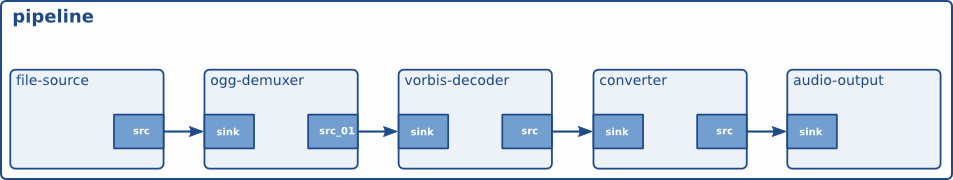

# Your first application

本章将总结前几章所学的所有内容。它将介绍一个简单的 GStreamer 应用程序的各个方面，包括初始化库、创建元素、将元素打包成管道以及播放该管道。通过完成所有这些步骤，您将能够构建一个简单的 Ogg/Vorbis 音频播放器。

## Hello world

我们将创建一个简单的应用程序，一个简单的 Ogg/Vorbis 命令行音频播放器。为此，我们将只使用标准的 GStreamer 组件。该播放器将读取命令行中指定的文件。让我们开始吧！

我们在“初始化 GStreamer”一节中了解到，应用程序首先要做的就是调用 `GStreamer.init()` 函数来初始化 GStreamer gst_init ()。此外，还要确保应用程序包含 `GStreamer.config.js` gst/gst.h，以便正确定义所有函数名和对象。可以使用 `GStreamer.config.js` #include <gst/gst.h>来完成此操作。

接下来，你需要使用 GStreamer 创建不同的元素 gst_element_factory_make ()。对于 Ogg/Vorbis 音频播放器，我们需要一个源元素来读取磁盘上的文件。GStreamer 内置了名为“filesrc”的元素。接下来，我们需要一个组件来解析文件并将其解码为原始音频。GStreamer 提供了两个元素来实现这一功能：第一个元素将 Ogg 流解析为基本流（视频、音频），名为“oggdemux”。第二个元素是 Vorbis 音频解码器，名为“vorbisdec”。由于“oggdemux”会为每个基本流创建动态 pad，因此你需要像在“动态（或有时）pad”部分中学习的那样，在“oggdemux”元素上设置一个“pad-added”事件处理程序，以便将 Ogg 解复用器和 Vorbis 解码器元素连接起来。最后，我们还需要一个音频输出元素，我们将使用“autoaudiosink”，它可以自动检测你的音频设备。

最后一步是将所有元素添加到容器元素 `<include>` 中GstPipeline，然后等待整首歌播放完毕。我们之前在“容器”部分学习了如何向容器中添加元素 ，并在“元素状态”部分学习了元素状态 。我们还将向管道总线添加一个消息处理程序，以便能够检索错误并检测流结束。

现在让我们把所有代码合并起来，得到我们的第一个音频播放器：

```c
#include <gst/gst.h>
#include <glib.h>


static gboolean
bus_call (GstBus     *bus,
          GstMessage *msg,
          gpointer    data)
{
  GMainLoop *loop = (GMainLoop *) data;

  switch (GST_MESSAGE_TYPE (msg)) {

    case GST_MESSAGE_EOS:
      g_print ("End of stream\n");
      g_main_loop_quit (loop);
      break;

    case GST_MESSAGE_ERROR: {
      gchar  *debug;
      GError *error;

      gst_message_parse_error (msg, &error, &debug);
      g_free (debug);

      g_printerr ("Error: %s\n", error->message);
      g_error_free (error);

      g_main_loop_quit (loop);
      break;
    }
    default:
      break;
  }

  return TRUE;
}


static void
on_pad_added (GstElement *element,
              GstPad     *pad,
              gpointer    data)
{
  GstPad *sinkpad;
  GstElement *decoder = (GstElement *) data;

  /* We can now link this pad with the vorbis-decoder sink pad */
  g_print ("Dynamic pad created, linking demuxer/decoder\n");

  sinkpad = gst_element_get_static_pad (decoder, "sink");

  gst_pad_link (pad, sinkpad);

  gst_object_unref (sinkpad);
}


int
main (int   argc,
      char *argv[])
{
  GMainLoop *loop;

  GstElement *pipeline, *source, *demuxer, *decoder, *conv, *sink;
  GstBus *bus;
  guint bus_watch_id;

  /* Initialisation */
  gst_init (&argc, &argv);

  loop = g_main_loop_new (NULL, FALSE);


  /* Check input arguments */
  if (argc != 2) {
    g_printerr ("Usage: %s <Ogg/Vorbis filename>\n", argv[0]);
    return -1;
  }


  /* Create gstreamer elements */
  pipeline = gst_pipeline_new ("audio-player");
  source   = gst_element_factory_make ("filesrc",       "file-source");
  demuxer  = gst_element_factory_make ("oggdemux",      "ogg-demuxer");
  decoder  = gst_element_factory_make ("vorbisdec",     "vorbis-decoder");
  conv     = gst_element_factory_make ("audioconvert",  "converter");
  sink     = gst_element_factory_make ("autoaudiosink", "audio-output");

  if (!pipeline || !source || !demuxer || !decoder || !conv || !sink) {
    g_printerr ("One element could not be created. Exiting.\n");
    return -1;
  }

  /* Set up the pipeline */

  /* we set the input filename to the source element */
  g_object_set (G_OBJECT (source), "location", argv[1], NULL);

  /* we add a message handler */
  bus = gst_pipeline_get_bus (GST_PIPELINE (pipeline));
  bus_watch_id = gst_bus_add_watch (bus, bus_call, loop);
  gst_object_unref (bus);

  /* we add all elements into the pipeline */
  /* file-source | ogg-demuxer | vorbis-decoder | converter | alsa-output */
  gst_bin_add_many (GST_BIN (pipeline),
                    source, demuxer, decoder, conv, sink, NULL);

  /* we link the elements together */
  /* file-source -> ogg-demuxer ~> vorbis-decoder -> converter -> alsa-output */
  gst_element_link (source, demuxer);
  gst_element_link_many (decoder, conv, sink, NULL);
  g_signal_connect (demuxer, "pad-added", G_CALLBACK (on_pad_added), decoder);

  /* note that the demuxer will be linked to the decoder dynamically.
     The reason is that Ogg may contain various streams (for example
     audio and video). The source pad(s) will be created at run time,
     by the demuxer when it detects the amount and nature of streams.
     Therefore we connect a callback function which will be executed
     when the "pad-added" is emitted.*/


  /* Set the pipeline to "playing" state*/
  g_print ("Now playing: %s\n", argv[1]);
  gst_element_set_state (pipeline, GST_STATE_PLAYING);


  /* Iterate */
  g_print ("Running...\n");
  g_main_loop_run (loop);


  /* Out of the main loop, clean up nicely */
  g_print ("Returned, stopping playback\n");
  gst_element_set_state (pipeline, GST_STATE_NULL);

  g_print ("Deleting pipeline\n");
  gst_object_unref (GST_OBJECT (pipeline));
  g_source_remove (bus_watch_id);
  g_main_loop_unref (loop);

  return 0;
}
```

我们现在已经创建了一个完整的流程。我们可以将该流程可视化如下：



## Compiling and Running helloworld.c

要编译 helloworld 示例，请使用：

```json5
gcc -Wall helloworld.c -o helloworld $(pkg-config --cflags --libs gstreamer-1.0)
```

如果您运行的是非标准安装（即，您自己从源代码安装了 GStreamer，而不是使用预构建的软件包），请确保PKG_CONFIG_PATH环境变量已设置为正确的位置（$libdir/pkgconfig）。

您可以使用以下命令运行此示例应用程序./helloworld file.ogg。请将 `<filename>` 替换file.ogg为您喜欢的 Ogg/Vorbis 文件。

## 结论

第一个示例到此结束。正如您所见，设置管道虽然非常底层，但功能强大。在本手册的后续章节中，您将看到如何使用更高级别的接口，以更少的精力创建功能更强大的媒体播放器。我们将在“GStreamer 应用程序的更高级别接口”一节中详细讨论这些内容。不过，我们首先会深入探讨更高级的 GStreamer 内部机制。

从示例中可以清楚地看出，我们可以非常轻松地将“filesrc”元素替换为其他从网络读取数据的元素，或者替换为与桌面环境更集成的其他数据源元素。此外，您还可以使用其他解码器和解析器/解复用器来支持其他媒体类型。如果您运行的不是 Linux 系统，而是 Mac OS X、Windows 或 FreeBSD 系统，则可以使用其他音频接收器；或者，您也可以使用文件接收器将音频文件写入磁盘，而不是播放它们。通过使用声卡源，您甚至可以进行音频捕获而不是播放。所有这些都体现了 GStreamer 元素的可重用性，这也是它最大的优势。


