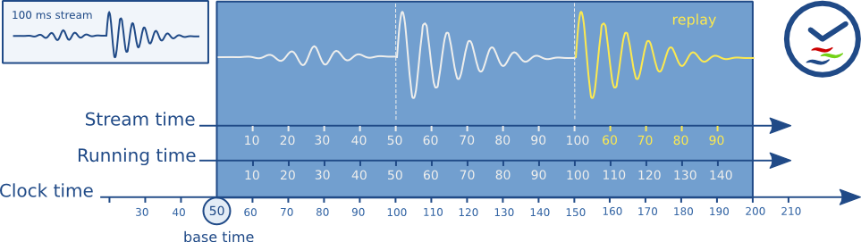

# GStreamer 中的时钟和同步

播放复杂媒体时，每个声音和视频样本都必须按照特定顺序在特定时间播放。为此，GStreamer 提供了一种同步机制。

GStreamer 支持以下使用场景：

- 非实时源，访问速度快于播放速度。这种情况是指从文件中读取媒体并以同步方式播放。此时，需要同步多个流，例如音频、视频和字幕。
- 从多个实时源捕获并同步混合媒体。这是一个典型的应用场景，即录制来自麦克风/摄像头的音频和视频，并将它们混合到一个文件中进行存储。
- 从（速度较慢的）网络流进行流媒体播放，会出现缓冲现象。这是典型的网络流媒体播放场景，即使用 HTTP 协议从流媒体服务器访问内容。
- 从实时源捕获画面并以可配置的延迟进行回放。例如，当从摄像机捕获画面、应用特效并显示结果时，就会用到此功能。此外，当使用 UDP 协议通过网络传输低延迟内容时，也会用到此功能。
- 实时录制和播放预录制内容。这项技术应用于音频录制场景，例如播放先前录制的音频并录制新的音频样本，目的是使新录制的音频与先前录制的数据完美同步。

GStreamer 使用GstClock对象、缓冲区时间戳和SEGMENT 事件来同步管道中的流，我们将在下一节中看到这一点。

## 时钟运行时间

在典型的计算机中，有很多可以作为时间源的来源，例如系统时间、声卡时间、CPU性能计数器等等。因此，GStreamer提供了多种GstClock实现方式。需要注意的是，时钟时间不必从0或其他已知值开始。有些时钟从特定的起始日期开始计数，有些则从上次重启开始，等等。

AGstClock返回该时钟的 绝对时间gst_clock_get_time ()。时钟的绝对时间（或时钟时间）是单调递增的。

运行时间是指先前绝对时间的快照（称为基准时间）与任何其他绝对时间之间的差异 。

```c
running-time = absolute-time - base-time
```

GStreamerGstPipeline对象在进入特定状态时会维护一个GstClock对象和一个基准时间PLAYING。管道会将选定的句柄GstClock连同选定的基准时间一起传递给管道中的每个元素。管道会选择一个基准时间，使得运行时间能够反映在特定状态下花费的总时间PLAYING 。因此，当管道处于特定状态时PAUSED，运行时间将保持不变。

因为流水线中的所有对象都具有相同的时钟和基准时间，所以它们都可以根据流水线时钟计算运行时间。

## 缓冲区运行时间

要计算缓冲区运行时间，我们需要缓冲区时间戳和 SEGMENT缓冲区之前的事件。首先，我们可以将 SEGMENT事件转换为GstSegment对象，然后使用该 gst_segment_to_running_time ()函数来计算缓冲区运行时间。

同步现在指的是确保当时钟达到相同的运行时间时，播放具有特定运行时间的缓冲区。通常，这项任务由接收器元件执行。这些元件还必须考虑配置的流水线的延迟，并在与流水线时钟同步之前将其添加到缓冲区运行时间中。

非活动源会为缓冲区添加时间戳，运行时间从 0 开始。刷新查找后，它们会再次从运行时间 0 开始生成缓冲区。

实时源需要为缓冲区添加时间戳，时间戳的运行时间应与捕获缓冲区第一个字节时的管道运行时间相匹配。

## 缓冲流时间

缓冲区流时间（也称为流中的位置）是一个介于 0 和媒体总持续时间之间的值，它是根据缓冲区时间戳和前一个SEGMENT事件计算出来的。

流时间用于：

- 使用查询语句报告流中的当前位置POSITION。
- 在搜索事件和查询中使用的位置。
- 用于同步受控值的位置。

流时间永远不会用于同步流，同步流只能使用运行时间。

## 时间概览

以下是 GStreamer 中使用的各种时间线的概述。

下图表示播放 100 毫秒的样本并重复 50 毫秒到 100 毫秒之间的部分时，管道中的不同时间。



你可以看到缓冲区运行时间始终随时钟时间单调递增。当缓冲区运行时间等于时钟时间减去基准时间时，缓冲区将被播放。流时间表示流中的位置，重复播放时会向后跳转。

## 时钟提供商

时钟提供程序是管道中的一个元素，它可以提供一个 GstClock时钟对象。当元素处于特定PLAYING 状态时，时钟对象需要报告一个单调递增的绝对时间。允许在元素处于特定状态时暂停时钟PAUSED。

时钟提供商之所以存在，是因为它们以一定的速率播放媒体，而这个速率并不一定与系统时钟速率相同。例如，声卡可能以 44.1 kHz 的采样率播放，但这并不意味着按照系统时钟，1 秒后声卡正好播放了 44100 个采样点。这只是一个近似值。实际上，音频设备有一个基于已播放采样点数的内部时钟，我们可以将其暴露出来。

如果一个带有内部时钟的元件需要同步，它需要根据内部时钟估算流水线时钟对应的时间点何时发生。为了进行估算，它需要将自身的时钟与流水线时钟同步。

如果流水线时钟与某个元件的内部时钟完全一致，则该元件可以跳过从属步骤，直接使用流水线时钟来调度播放。这样速度更快，精度更高。因此，通常情况下，像音频输入或输出设备这类具有内部时钟的元件会作为流水线的时钟提供者。

当管道进入该PLAYING状态时，它会遍历管道中从接收器到源的所有元素，并询问每个元素是否可以提供时钟信号。最后一个能够提供时钟信号的元素将被用作管道中的时钟提供者。该算法在典型的播放管道中优先选择来自音频接收器的时钟信号，而在典型的捕获管道中优先选择来自源元素的时钟信号。

有一些总线消息用于告知您管道中的时钟和时钟提供程序。您可以通过查看NEW_CLOCK总线上的消息来了解管道中选择了哪个时钟。当从管道中移除某个时钟提供程序时，CLOCK_LOST会发布一条消息，应用程序需要返回PAUSED并重新PLAYING选择新的时钟。

## 延迟

延迟是指从时间戳 X 捕获的样本到接收器到达目标设备所需的时间。该时间以流水线中的时钟为基准进行测量。对于只有接收器与时钟同步的流水线，延迟始终为 0，因为没有其他元素会延迟缓冲区。

对于包含实时源的管道，会引入延迟，这主要是由于实时源的工作方式所致。以音频源为例，它会在时间 0 开始采集第一个样本。如果该源以 44100Hz 的频率每次推送包含 44100 个样本的缓冲区，那么它会在第 1 秒采集到该缓冲区。由于缓冲区的时间戳为 0，而时钟时间此时为>= 11 秒，接收器会丢弃该缓冲区，因为它太晚了。如果没有接收器进行任何延迟补偿，所有缓冲区都将被丢弃。

### 延迟补偿

在管道进入该PLAYING状态之前，除了选择时钟和计算基准时间之外，它还会计算管道中的延迟。这是通过查询LATENCY管道中的所有接收器来实现的。然后，管道会选择管道中的最大延迟，并将其配置到一个LATENCY事件中。

所有接收器元素都会根据事件中的值延迟播放LATENCY。由于所有接收器延迟的时间相同，因此它们将相对同步。

### 动态延迟

在管道中添加/移除元素或更改元素属性会改变管道的延迟。元素可以通过LATENCY在总线上发布消息来请求更改管道中的延迟。应用程序随后可以决定是否查询并重新分配新的延迟。更改管道中的延迟可能会导致视觉或听觉上的故障，因此只有在允许的情况下，应用程序才能执行此操作。


