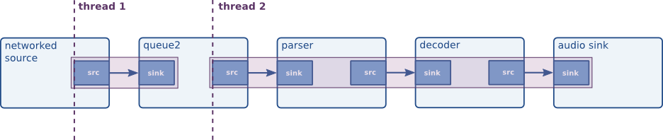
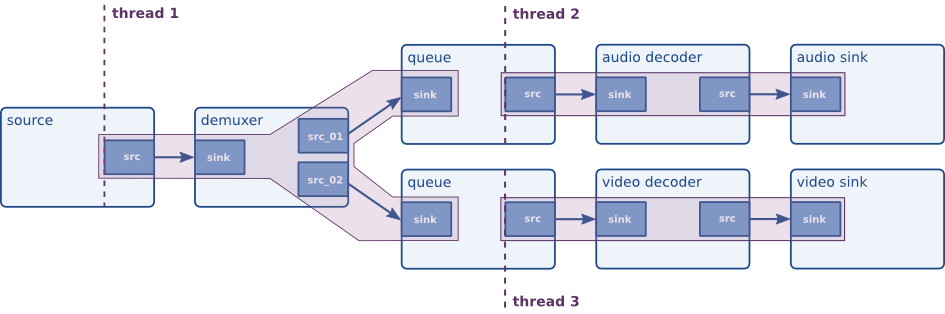

# 线程

GStreamer 本身是多线程的，并且完全线程安全。大多数线程内部机制对应用程序是隐藏的，这应该能简化应用程序的开发。然而，在某些情况下，应用程序可能希望控制其中的某些部分。GStreamer 允许应用程序强制管道的某些部分使用多线程。请参阅“何时需要强制使用线程？”。

GStreamer 还可以在线程创建时通知您，以便您可以配置线程优先级或要使用的线程池等设置。请参阅GStreamer 中的线程配置。

## GStreamer中的调度

GStreamer 流水线中的每个元素都可以自行决定其调度方式。元素可以选择其数据位（pad）的调度方式，是推送式（push-based）还是拉取式（pull-based）。例如，元素可以选择启动一个线程，从接收端（sink pad）拉取数据，或者/并且从源端（source pad）推送数据。元素还可以选择分别在推送模式和拉取模式下使用上游线程或下游线程进行数据处理。GStreamer 对元素的调度方式没有任何限制。更多详情请参阅插件编写指南。

无论如何，某些元素都会启动一个线程来进行数据处理，称为“流式线程”。当元素需要创建流式线程时，GstTask就会创建这些流式线程（或对象）GstTaskPool。下一节我们将了解如何接收任务和线程池的通知。

## 在 GStreamer 中配置线程

公交车上会张贴一条STREAM_STATUS消息，告知您流媒体线程的状态。您将从消息中获取以下信息：

- 当即将创建新线程时，您会收到类型通知GST_STREAM_STATUS_TYPE_CREATE。之后，您可以配置自定义任务GstTaskPool池GstTask。自定义任务池将为任务提供自定义线程，以实现流式线程。

    如果要配置自定义任务池，则必须同步处理此消息。如果在收到此消息时未在任务上配置任务池，则任务将使用其默认任务池。

- 当线程被加入或退出时，您可以配置线程优先级。此外，当线程被销毁时，您也会收到通知。

- 当线程启动、暂停和停止时，您会收到消息。这可用于在图形用户界面应用程序中可视化流式线程的状态。

接下来我们将通过一些例子来说明这个问题。

### 提升线程优先级

```json5
.----------.    .----------.
| fakesrc  |    | fakesink |
|         src->sink        |
'----------'    '----------'
```

让我们来看一下上面的简单管道。我们希望提高流式线程的优先级。`fakesrc` 元素会启动流式线程，生成虚假数据并将其推送到对等的 `fakesink`。更改优先级的流程如下：

- 当从某个状态切换READY到PAUSED另一个状态时，fakesrc 需要一个流式线程来向 fakesink 推送数据。它会发布一条 STREAM_STATUS消息，表明它需要流式线程。

- STREAM_STATUS应用程序将使用同步总线处理程序响应消息。然后，它会GstTaskPool在GstTask消息内部配置一个自定义任务池。自定义任务池负责创建线程。在本例中，我们将创建一个优先级更高的线程。

- 或者，由于同步消息是在线程上下文中调用的，因此您可以使用线程ENTER/LEAVE通知来更改当前线程的优先级或调度策略。

首先，我们需要实现一个GstTaskPool可针对任务进行配置的自定义线程。以下是GstTaskPool 使用 pthreads 创建SCHED_RR实时线程的子类的实现。请注意，创建实时线程可能需要额外的权限。

```c
#include <pthread.h>

typedef struct
{
  pthread_t thread;
} TestRTId;

G_DEFINE_TYPE (TestRTPool, test_rt_pool, GST_TYPE_TASK_POOL);

static void
default_prepare (GstTaskPool * pool, GError ** error)
{
  /* we don't do anything here. We could construct a pool of threads here that
   * we could reuse later but we don't */
}

static void
default_cleanup (GstTaskPool * pool)
{
}

static gpointer
default_push (GstTaskPool * pool, GstTaskPoolFunction func, gpointer data,
    GError ** error)
{
  TestRTId *tid;
  gint res;
  pthread_attr_t attr;
  struct sched_param param;

  tid = g_new0 (TestRTId, 1);

  pthread_attr_init (&attr);
  if ((res = pthread_attr_setschedpolicy (&attr, SCHED_RR)) != 0)
    g_warning ("setschedpolicy: failure: %p", g_strerror (res));

  param.sched_priority = 50;
  if ((res = pthread_attr_setschedparam (&attr, &param)) != 0)
    g_warning ("setschedparam: failure: %p", g_strerror (res));

  if ((res = pthread_attr_setinheritsched (&attr, PTHREAD_EXPLICIT_SCHED)) != 0)
    g_warning ("setinheritsched: failure: %p", g_strerror (res));

  res = pthread_create (&tid->thread, &attr, (void *(*)(void *)) func, data);

  if (res != 0) {
    g_set_error (error, G_THREAD_ERROR, G_THREAD_ERROR_AGAIN,
        "Error creating thread: %s", g_strerror (res));
    g_free (tid);
    tid = NULL;
  }

  return tid;
}

static void
default_join (GstTaskPool * pool, gpointer id)
{
  TestRTId *tid = (TestRTId *) id;

  pthread_join (tid->thread, NULL);

  g_free (tid);
}

static void
test_rt_pool_class_init (TestRTPoolClass * klass)
{
  GstTaskPoolClass *gsttaskpool_class;

  gsttaskpool_class = (GstTaskPoolClass *) klass;

  gsttaskpool_class->prepare = default_prepare;
  gsttaskpool_class->cleanup = default_cleanup;
  gsttaskpool_class->push = default_push;
  gsttaskpool_class->join = default_join;
}

static void
test_rt_pool_init (TestRTPool * pool)
{
}

GstTaskPool *
test_rt_pool_new (void)
{
  GstTaskPool *pool;

  pool = g_object_new (TEST_TYPE_RT_POOL, NULL);

  return pool;
}
```

编写任务池时，需要实现的关键函数是“push”函数。该函数的实现应该启动一个线程来调用指定的函数。更复杂的实现可能需要在任务池中保留一些线程，因为创建和销毁线程并非总是最快的操作。

下一步，我们需要在 fakesrc 需要时实际配置自定义任务池。为此，我们STREAM_STATUS使用同步处理程序拦截消息。

```c
static GMainLoop* loop;

static void
on_stream_status (GstBus     *bus,
                  GstMessage *message,
                  gpointer    user_data)
{
  GstStreamStatusType type;
  GstElement *owner;
  const GValue *val;
  GstTask *task = NULL;

  gst_message_parse_stream_status (message, &type, &owner);

  val = gst_message_get_stream_status_object (message);

  /* see if we know how to deal with this object */
  if (G_VALUE_TYPE (val) == GST_TYPE_TASK) {
    task = g_value_get_object (val);
  }

  switch (type) {
    case GST_STREAM_STATUS_TYPE_CREATE:
      if (task) {
        GstTaskPool *pool;

        pool = test_rt_pool_new();

        gst_task_set_pool (task, pool);
      }
      break;
    default:
      break;
  }
}

static void
on_error (GstBus     *bus,
          GstMessage *message,
          gpointer    user_data)
{
  g_message ("received ERROR");
  g_main_loop_quit (loop);
}

static void
on_eos (GstBus     *bus,
        GstMessage *message,
        gpointer    user_data)
{
  g_main_loop_quit (loop);
}

int
main (int argc, char *argv[])
{
  GstElement *bin, *fakesrc, *fakesink;
  GstBus *bus;
  GstStateChangeReturn ret;

  gst_init (&argc, &argv);

  /* create a new bin to hold the elements */
  bin = gst_pipeline_new ("pipeline");
  g_assert (bin);

  /* create a source */
  fakesrc = gst_element_factory_make ("fakesrc", "fakesrc");
  g_assert (fakesrc);
  g_object_set (fakesrc, "num-buffers", 50, NULL);

  /* and a sink */
  fakesink = gst_element_factory_make ("fakesink", "fakesink");
  g_assert (fakesink);

  /* add objects to the main pipeline */
  gst_bin_add_many (GST_BIN (bin), fakesrc, fakesink, NULL);

  /* link the elements */
  gst_element_link (fakesrc, fakesink);

  loop = g_main_loop_new (NULL, FALSE);

  /* get the bus, we need to install a sync handler */
  bus = gst_pipeline_get_bus (GST_PIPELINE (bin));
  gst_bus_enable_sync_message_emission (bus);
  gst_bus_add_signal_watch (bus);

  g_signal_connect (bus, "sync-message::stream-status",
      (GCallback) on_stream_status, NULL);
  g_signal_connect (bus, "message::error",
      (GCallback) on_error, NULL);
  g_signal_connect (bus, "message::eos",
      (GCallback) on_eos, NULL);

  /* start playing */
  ret = gst_element_set_state (bin, GST_STATE_PLAYING);
  if (ret != GST_STATE_CHANGE_SUCCESS) {
    g_message ("failed to change state");
    return -1;
  }

  /* Run event loop listening for bus messages until EOS or ERROR */
  g_main_loop_run (loop);

  /* stop the bin */
  gst_element_set_state (bin, GST_STATE_NULL);
  gst_object_unref (bus);
  g_main_loop_unref (loop);

  return 0;
}
```

请注意，此程序可能需要 root 权限才能创建实时线程。如果无法创建线程，状态更改函数将失败，我们在上面的应用程序中捕获了此错误。

当管道中存在多个线程时，您会收到多条STREAM_STATUS消息。您应该使用消息的所有者（通常是 pad 或启动线程的元素）来确定此线程在应用程序上下文中的功能。

## 什么时候需要强制执行某个线程？

我们已经看到线程是由元素创建的，但也可以将元素插入管道，其唯一目的是为了强制管道中创建一个新线程。

强制使用线程的原因有很多。但是，出于性能考虑，你永远不应该为每个元素都使用一个线程，因为这会增加一些开销。现在让我们列举一些线程特别有用的场景：

- 例如，在处理网络流或录制来自视频或音频卡等实时流的数据时，需要进行数据缓冲。管道中其他环节的短暂中断不会导致数据丢失。另请参阅关于使用 queue2 进行网络缓冲的流缓冲部分。



- 例如，在播放包含视频和音频数据的流时，需要同步输出设备。通过使用线程分别处理两个输出，它们将独立运行，从而提高同步效果。



前面我们已经多次提到“队列”元素。队列是线程边界元素，通过它可以强制使用线程。它采用经典的提供者/消费者模型，这种模型在世界各地的大学线程课程中都有教授。这样一来，队列既可以确保线程间的数据吞吐量是线程安全的，也可以充当缓冲区。队列有多个 GObject属性可供配置，以满足特定用途。例如，您可以为队列设置下限和上限阈值。如果数据量少于下限阈值（默认值：禁用），则会阻止输出。如果数据量多于上限阈值，则会阻止输入，或者（如果已配置）丢弃数据。

要使用队列（从而强制管道中使用两个不同的线程），只需创建一个“队列”元素并将其添加到管道中即可。GStreamer 会在内部处理所有线程细节。


