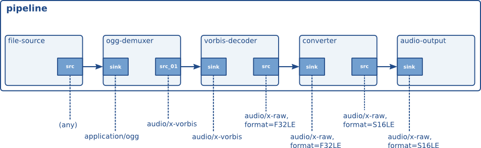

# 自动插拔

在你的第一个应用程序中，你学习了如何构建一个简单的 Ogg/Vorbis 文件播放器。通过使用替代元素，你可以构建其他媒体类型的播放器，例如 Ogg/Speex、MP3 甚至视频格式。然而，你可能更希望构建一个能够自动检测流的媒体类型，并通过检查系统中所有可用元素自动生成最佳管道的应用程序。这个过程称为自动插拔，GStreamer 包含高质量的自动插拔器。如果你正在寻找自动插拔器，请直接跳转到 “播放组件”部分。本章将解释自动插拔和类型识别的概念。它将解释 GStreamer 包含哪些系统来动态检测媒体流的类型，以及如何生成解码器元素管道来播放该媒体。同样的原理也适用于转码。由于这一概念具有完全的动态性，GStreamer 可以自动扩展以支持新的媒体类型，而无需对其自动插拔器进行任何修改。

我们将首先介绍媒体类型这一概念，它是一种动态且可扩展的媒体流识别方式。之后，我们将介绍类型查找的概念，用于确定媒体流的类型。最后，我们将解释如何使用自动插拔和 GStreamer 注册表来搭建一个管道，该管道可以将媒体从一种媒体类型转换为另一种媒体类型，例如用于媒体解码。

## 媒体类型作为识别信息流的一种方法

我们之前引入了“功能”的概念，它允许元素（或者更准确地说，是 pad）在数据流传输过程中就媒体类型达成一致（参见pad 的功能）。我们解释过，功能是媒体类型和一组属性的组合。对于大多数容器格式（也就是您硬盘上的文件；例如，Ogg 就是一种容器格式），描述数据流不需要任何属性，只需要媒体类型即可。完整的媒体类型及其对应属性列表可以在《插件编写指南》中找到。

当一个元素加载到系统中时，它必须为其源和目标接口关联媒体类型。GStreamer 通过其注册表了解不同的元素及其期望和发送的数据类型。正如我们将看到的，这使得元素的创建能够非常动态且可扩展。

在你的第一个应用程序中，我们学习了如何构建一个用于播放 Ogg/Vorbis 文件的音乐播放器。现在让我们来看看这个流程中每个 pad 所关联的媒体类型。“Hello world”流程及其媒体类型展示了该流程中每个 pad 所属的媒体类型。



现在我们已经了解了 GStreamer 如何识别已知的媒体流，接下来我们可以看看 GStreamer 用于设置媒体处理管道和媒体类型检测的方法。

## 媒体流类型检测

通常情况下，加载媒体流时，流的类型是未知的。这意味着在选择解码流的管道之前，我们需要先检测流的类型。GStreamer 使用类型查找（typefinding）的概念来实现这一点。类型查找是管道的常规组成部分，它会在流的类型未知期间持续读取数据。在此期间，它会将数据提供给所有实现了类型查找器的插件。当某个类型查找器识别出流的类型时，类型查找组件会发出一个信号，并从此作为直通模块继续运行。如果未找到类型，则会发出错误，并且后续的媒体处理将停止。

一旦 typefind 元素找到类型，应用程序就可以使用该类型来构建管道，从而解码媒体流。这将在下一节中讨论。

如前所述，GStreamer 中的插件可以实现类型查找功能。实现此功能的插件会提交一个媒体类型（可选）、一组该媒体类型常用的文件扩展名以及一个类型查找函数。插件内部的类型查找函数被调用后，会检查此媒体流中的数据是否与标记该媒体类型的特定模式匹配。如果匹配，插件会将此结果通知类型查找元素，说明识别出的媒体类型以及确定此流确实是该媒体类型的概率。所有实现类型查找功能的插件完成此操作后，类型查找元素会将它认为识别出的媒体流类型告知应用程序。

以下代码将解释如何使用 typefind 元素。它会打印检测到的媒体类型，或者提示未找到该媒体类型。下一节将介绍更多实用功能，例如如何搭建解码管道。

```c
#include <gst/gst.h>

[.. my_bus_callback goes here ..]

static gboolean
idle_exit_loop (gpointer data)
{
  g_main_loop_quit ((GMainLoop *) data);

  /* once */
  return FALSE;
}

static void
cb_typefound (GstElement *typefind,
          guint       probability,
          GstCaps    *caps,
          gpointer    data)
{
  GMainLoop *loop = data;
  gchar *type;

  type = gst_caps_to_string (caps);
  g_print ("Media type %s found, probability %d%%\n", type, probability);
  g_free (type);

  /* since we connect to a signal in the pipeline thread context, we need
   * to set an idle handler to exit the main loop in the mainloop context.
   * Normally, your app should not need to worry about such things. */
  g_idle_add (idle_exit_loop, loop);
}

gint
main (gint   argc,
      gchar *argv[])
{
  GMainLoop *loop;
  GstElement *pipeline, *filesrc, *typefind, *fakesink;
  GstBus *bus;

  /* init GStreamer */
  gst_init (&argc, &argv);
  loop = g_main_loop_new (NULL, FALSE);

  /* check args */
  if (argc != 2) {
    g_print ("Usage: %s <filename>\n", argv[0]);
    return -1;
  }

  /* create a new pipeline to hold the elements */
  pipeline = gst_pipeline_new ("pipe");

  bus = gst_pipeline_get_bus (GST_PIPELINE (pipeline));
  gst_bus_add_watch (bus, my_bus_callback, NULL);
  gst_object_unref (bus);

  /* create file source and typefind element */
  filesrc = gst_element_factory_make ("filesrc", "source");
  g_object_set (G_OBJECT (filesrc), "location", argv[1], NULL);
  typefind = gst_element_factory_make ("typefind", "typefinder");
  g_signal_connect (typefind, "have-type", G_CALLBACK (cb_typefound), loop);
  fakesink = gst_element_factory_make ("fakesink", "sink");

  /* setup */
  gst_bin_add_many (GST_BIN (pipeline), filesrc, typefind, fakesink, NULL);
  gst_element_link_many (filesrc, typefind, fakesink, NULL);
  gst_element_set_state (GST_ELEMENT (pipeline), GST_STATE_PLAYING);
  g_main_loop_run (loop);

  /* unset */
  gst_element_set_state (GST_ELEMENT (pipeline), GST_STATE_NULL);
  gst_object_unref (GST_OBJECT (pipeline));

  return 0;
}
```

一旦检测到媒体类型，就可以将一个元素（例如解复用器或解码器）连接到 typefind 元素的源焊盘，媒体流的解码将立即开始。

## 动态自动插拔管道

请参阅“播放组件”以了解如何使用可用于动态构建管道的高级对象。


