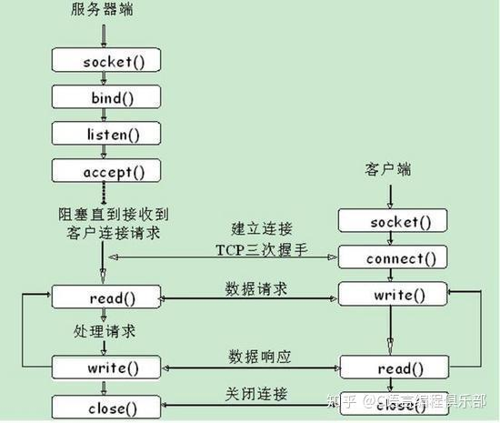
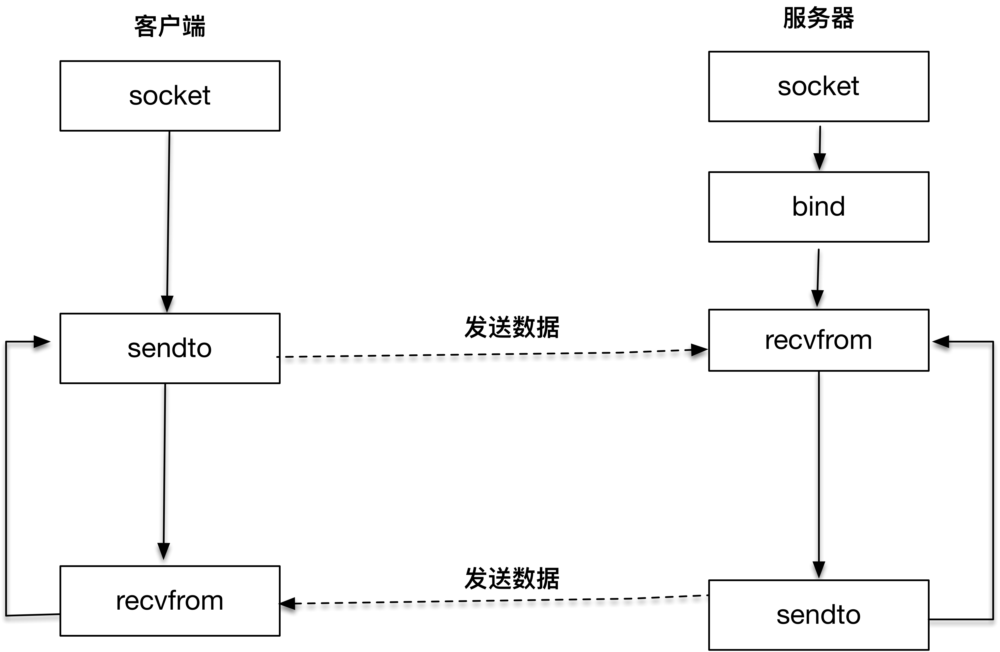

# 网络编程入门

## 1、网络编程基础概念

### 1.1、什么是网络编程

1. 网络编程的本质是让不同计算机上的进程通过网络交换数据。

2. 网络编程是指通过计算机网络实现程序间通信的技术。它允许应用程序通过网络协议（如 TCP/IP、HTTP、FTP）进行数据交换，从而实现远程访问、分布式计算、实时通信等功能。

### 1.2、核心概念

1. **IP地址**：唯一标识网络中的设备（如&nbsp;192.168.1.1）。

2. **端口号**：标识设备上运行的特定服务（如 HTTP 服务默认使用&nbsp;80&nbsp;端口）。

3. **协议**： 

计算机网络通过分层协议实现通信，实际应用中以TCP/IP四层模型为核心：

    - 链路层：处理硬件设备（如网卡）的物理数据传输（如以太网帧）。

    - 网络层：负责跨网络的数据包路由（核心协议：IP协议，定义数据包格式和地址）。

    - 传输层：提供端到端的通信服务（核心协议：TCP、UDP）。

    - 应用层：定义具体业务规则（如HTTP、FTP，由开发者实现）。

Socket接口主要工作在传输层和网络层，屏蔽了底层硬件和路由细节，让开发者可直接通过“端口+IP”定位目标进程。

4. **核心协议：TCP与UDP**

传输层的两个核心协议决定了通信方式的差异：

    - TCP（传输控制协议）：

      - 面向连接：通信前需通过“三次握手”建立连接，结束后“四次挥手”释放连接。

      - 可靠传输：通过确认机制、重传机制、流量控制保证数据不丢失、不重复、按序到达。

      - 字节流：数据以连续字节流形式传输（无边界）。

      - 适用场景：文件传输、网页访问等需可靠数据的场景。

    - UDP（用户数据报协议）：

      - 无连接：直接发送数据，无需建立连接。

      - 不可靠传输：不保证数据到达，可能丢失、乱序。

      - 数据报：数据以独立“数据包”形式传输（有边界）。

      - 适用场景：视频通话、实时游戏等对延迟敏感的场景。

5. **Socket（套接字）**

Socket是操作系统提供的网络通信抽象，本质是一个“文件描述符”（类似文件句柄），通过它可读写网络数据。

    - 每个Socket绑定一个IP地址+端口号，唯一标识网络中的一个进程（IP定位计算机，端口定位进程）。

    - 分类：根据传输层协议，分为流式套接字（SOCK_STREAM，基于TCP） 和数据报套接字（SOCK_DGRAM，基于UDP）。

## 2、核心预备知识

在编写代码前，需掌握两个关键技术点：**地址结构**和**字节序转换**。

1. 网络地址结构

Socket通过结构体描述网络地址，最常用的是IPv4地址结构sockaddr_in（定义在<netinet/in.h>）：

```c
struct sockaddr_in {
    sa_family_t     sin_family;   // 地址族：必须为AF_INET（IPv4）
    in_port_t       sin_port;     // 端口号（网络字节序）
    struct in_addr  sin_addr;     // IP地址（网络字节序）
    unsigned char   sin_zero[8];  // 填充字段，必须为0（与sockaddr兼容）
};

struct in_addr {
    in_addr_t s_addr;  // 32位IPv4地址（网络字节序）
};
```

通用地址结构sockaddr（长度固定，用于函数参数统一）：

```c
struct sockaddr {
    sa_family_t sa_family;  // 地址族
    char        sa_data[14]; // 地址数据（含端口+IP，长度可变）
};
```

使用时需将sockaddr_in*强制转换为sockaddr*传给函数（如bind、connect）。

2. 字节序转换

网络中数据传输必须使用**网络字节序（大端字节序）**，而主机可能是大端或小端（取决于CPU），因此需通过函数转换：

  - htons()：主机字节序 → 网络字节序（16位，用于端口号）。

  - htonl()：主机字节序 → 网络字节序（32位，用于IP地址）。

  - ntohs()：网络字节序 → 主机字节序（16位）。

  - ntohl()：网络字节序 → 主机字节序（32位）。

**示例**：将端口号8080转换为网络字节序：

```c
uint16_t port = htons(8080); // 关键：端口必须转换，否则可能解析错误
```

3. IP地址转换

需将“点分十进制字符串”（如"192.168.1.1"）与32位整数（网络字节序）互转：

推荐使用兼容IPv4/IPv6的函数：

  - inet_pton()：字符串 → 网络字节序整数（presentation → network）。

  - inet_ntop()：网络字节序整数 → 字符串（network → presentation）。

示例：

```c
struct sockaddr_in addr;
// 字符串IP → 网络字节序
inet_pton(AF_INET, "127.0.0.1", &addr.sin_addr); 
// 网络字节序 → 字符串
char ip_str[INET_ADDRSTRLEN]; // INET_ADDRSTRLEN：IPv4字符串最大长度（16）
inet_ntop(AF_INET, &addr.sin_addr, ip_str, INET_ADDRSTRLEN);
```

## 3、TCP编程（面向连接）

TCP通信需先建立连接（三次握手），再传输数据，最后释放连接（四次挥手）。



1. TCP服务器编程步骤

| 步骤 | 函数 | 作用 |
| :--- | :--- | :--- |
| 1. 创建socket | int socket(int domain, int type, int protocol); | 创建套接字描述符（文件句柄） |
| 2. 绑定地址 | int bind(int sockfd, const struct sockaddr* addr, socklen_t addrlen); | 将socket与IP+端口绑定 |
| 3. 监听连接 | int listen(int sockfd, int backlog); | 转为被动监听状态，等待客户端连接 |
| 4. 接受连接 | int accept(int sockfd, struct sockaddr* addr, socklen_t* addrlen); | 阻塞等待并接受客户端连接，返回新socket |
| 5. 收发数据 | ssize_t recv(int sockfd, void* buf, size_t len, int flags); / ssize_t send(int sockfd, const void* buf, size_t len, int flags); | 与客户端交换数据 |
| 6. 关闭连接 | int close(int fd); | 释放资源 |

函数参数说明：

- socket()：domain=AF_INET（IPv4），type=SOCK_STREAM（TCP），protocol=0（默认协议）。

- bind()：addrlen为sockaddr_in的长度（sizeof(struct sockaddr_in)）。

- listen()：backlog为等待队列最大长度（超过则拒绝新连接）。

- accept()：addr用于存储客户端地址，addrlen需传入地址长度的指针（入参为缓冲区大小，出参为实际长度）。

- recv()/send()：flags=0为默认模式（阻塞）；recv返回接收字节数（0表示对方关闭，-1表示错误）；send返回发送字节数（-1表示错误）。

2. TCP客户端编程步骤

| 步骤 | 函数 | 作用 |
| :--- | :--- | :--- |
| 1. 创建socket | socket() | 同服务器 |
| 2. 连接服务器 | int connect(int sockfd, const struct sockaddr* addr, socklen_t addrlen); | 与服务器建立TCP连接 |
| 3. 收发数据 | recv()/send() | 同服务器 |
| 4. 关闭连接 | close() | 同服务器 |

3. TCP实战：回显服务器与客户端

- 服务器代码（tcp_server.c）：

```c
#include <stdio.h>
#include <stdlib.h>
#include <string.h>
#include <unistd.h>
#include <sys/socket.h>
#include <netinet/in.h>
#include <arpa/inet.h>

#define PORT 8080
#define BUF_SIZE 1024

int main() {
    // 1. 创建TCP socket
    int listen_fd = socket(AF_INET, SOCK_STREAM, 0);
    if (listen_fd == -1) {
        perror("socket failed");
        exit(EXIT_FAILURE);
    }

    // 2. 绑定地址（IP+端口）
    struct sockaddr_in serv_addr;
    memset(&serv_addr, 0, sizeof(serv_addr));
    serv_addr.sin_family = AF_INET;
    serv_addr.sin_addr.s_addr = INADDR_ANY; // 绑定所有本地IP
    serv_addr.sin_port = htons(PORT);       // 端口转换为网络字节序

    if (bind(listen_fd, (struct sockaddr*)&serv_addr, sizeof(serv_addr)) == -1) {
        perror("bind failed");
        close(listen_fd);
        exit(EXIT_FAILURE);
    }

    // 3. 监听连接（等待队列长度为5）
    if (listen(listen_fd, 5) == -1) {
        perror("listen failed");
        close(listen_fd);
        exit(EXIT_FAILURE);
    }
    printf("Server listening on port %d...\n", PORT);

    // 4. 接受客户端连接（循环处理单客户端，实际需并发）
    struct sockaddr_in client_addr;
    socklen_t client_len = sizeof(client_addr);
    int conn_fd = accept(listen_fd, (struct sockaddr*)&client_addr, &client_len);
    if (conn_fd == -1) {
        perror("accept failed");
        close(listen_fd);
        exit(EXIT_FAILURE);
    }

    // 打印客户端信息
    char client_ip[INET_ADDRSTRLEN];
    inet_ntop(AF_INET, &client_addr.sin_addr, client_ip, INET_ADDRSTRLEN);
    printf("Accepted connection from %s:%d\n", client_ip, ntohs(client_addr.sin_port));

    // 5. 回显数据（接收后原样返回）
    char buf[BUF_SIZE];
    ssize_t n;
    while ((n = recv(conn_fd, buf, BUF_SIZE-1, 0)) > 0) {
        buf[n] = '\0'; // 确保字符串结束
        printf("Received: %s", buf);
        send(conn_fd, buf, n, 0); // 回显
    }

    if (n == -1) perror("recv failed");
    printf("Client disconnected\n");

    // 6. 关闭连接
    close(conn_fd);
    close(listen_fd);
    return 0;
}
```

- 客户端代码（tcp_client.c）：

```c
#include <stdio.h>
#include <stdlib.h>
#include <string.h>
#include <unistd.h>
#include <sys/socket.h>
#include <netinet/in.h>
#include <arpa/inet.h>

#define PORT 8080
#define BUF_SIZE 1024

int main() {
    // 1. 创建TCP socket
    int sock_fd = socket(AF_INET, SOCK_STREAM, 0);
    if (sock_fd == -1) {
        perror("socket failed");
        exit(EXIT_FAILURE);
    }

    // 2. 连接服务器
    struct sockaddr_in serv_addr;
    memset(&serv_addr, 0, sizeof(serv_addr));
    serv_addr.sin_family = AF_INET;
    serv_addr.sin_port = htons(PORT);
    // 转换服务器IP（此处为本地回环地址）
    if (inet_pton(AF_INET, "127.0.0.1", &serv_addr.sin_addr) <= 0) {
        perror("invalid address");
        close(sock_fd);
        exit(EXIT_FAILURE);
    }

    if (connect(sock_fd, (struct sockaddr*)&serv_addr, sizeof(serv_addr)) == -1) {
        perror("connect failed");
        close(sock_fd);
        exit(EXIT_FAILURE);
    }
    printf("Connected to server\n");

    // 3. 发送数据并接收回显
    char buf[BUF_SIZE];
    while (1) {
        printf("Enter message (q to quit): ");
        fgets(buf, BUF_SIZE, stdin); // 从键盘输入
        if (buf[0] == 'q' && (buf[1] == '\n' || buf[1] == '\0')) break;

        send(sock_fd, buf, strlen(buf), 0);
        ssize_t n = recv(sock_fd, buf, BUF_SIZE-1, 0);
        if (n <= 0) {
            perror("recv failed");
            break;
        }
        buf[n] = '\0';
        printf("Echo: %s", buf);
    }

    // 4. 关闭连接
    close(sock_fd);
    return 0;
}
```

编译命令

```shell
服务器：
gcc tcp_server.c -o tcp_server
客户端：
gcc tcp_client.c -o tcp_client
```

## 4、UDP编程（无连接）

UDP无需建立连接，直接发送“数据报”，适用于实时性要求高的场景（如视频、游戏）。



1. UDP编程步骤（服务器与客户端）

UDP服务器与客户端流程更简单，核心差异在于收发数据时需指定对方地址。

服务器

    1. 创建socket（socket(AF_INET, SOCK_DGRAM, 0)）

    2. 绑定地址（bind()）

    3. 接收数据（recvfrom()）

    4. 发送数据（sendto()）

    5. 关闭（close()）

客户端

    1. 创建socket
    
    2. 直接sendto()发送数据（需指定服务器地址）
    
    3. recvfrom()接收数据
    
    4. 关闭

2. 核心函数：recvfrom()与sendto()

```c
// 接收数据（同时获取发送方地址）
ssize_t recvfrom(int sockfd, void* buf, size_t len, int flags,
                 struct sockaddr* src_addr, socklen_t* addrlen);

// 发送数据（需指定接收方地址）
ssize_t sendto(int sockfd, const void* buf, size_t len, int flags,
               const struct sockaddr* dest_addr, socklen_t addrlen);
```

参数与recv/send类似，多了src_addr（接收方地址）和dest_addr（发送目标地址）。

3. UDP实战：回显服务器与客户端

- 服务器代码（udp_server.c）：

```c
#include <stdio.h>
#include <stdlib.h>
#include <string.h>
#include <unistd.h>
#include <sys/socket.h>
#include <netinet/in.h>
#include <arpa/inet.h>

#define PORT 8080
#define BUF_SIZE 1024

int main() {
    // 1. 创建UDP socket
    int sock_fd = socket(AF_INET, SOCK_DGRAM, 0);
    if (sock_fd == -1) {
        perror("socket failed");
        exit(EXIT_FAILURE);
    }

    // 2. 绑定地址
    struct sockaddr_in serv_addr;
    memset(&serv_addr, 0, sizeof(serv_addr));
    serv_addr.sin_family = AF_INET;
    serv_addr.sin_addr.s_addr = INADDR_ANY;
    serv_addr.sin_port = htons(PORT);

    if (bind(sock_fd, (struct sockaddr*)&serv_addr, sizeof(serv_addr)) == -1) {
        perror("bind failed");
        close(sock_fd);
        exit(EXIT_FAILURE);
    }
    printf("UDP server listening on port %d...\n", PORT);

    // 3. 接收并回显数据
    char buf[BUF_SIZE];
    struct sockaddr_in client_addr;
    socklen_t client_len = sizeof(client_addr);

    while (1) {
        // 接收客户端数据
        ssize_t n = recvfrom(sock_fd, buf, BUF_SIZE-1, 0,
                             (struct sockaddr*)&client_addr, &client_len);
        if (n == -1) {
            perror("recvfrom failed");
            continue;
        }
        buf[n] = '\0';

        // 打印客户端信息
        char client_ip[INET_ADDRSTRLEN];
        inet_ntop(AF_INET, &client_addr.sin_addr, client_ip, INET_ADDRSTRLEN);
        printf("Received from %s:%d: %s", client_ip, ntohs(client_addr.sin_port), buf);

        // 回显数据
        sendto(sock_fd, buf, n, 0, (struct sockaddr*)&client_addr, client_len);
    }

    // 4. 关闭（实际需信号处理退出）
    close(sock_fd);
    return 0;
}
```

- 客户端代码（udp_client.c）：

```c
#include <stdio.h>
#include <stdlib.h>
#include <string.h>
#include <unistd.h>
#include <sys/socket.h>
#include <netinet/in.h>
#include <arpa/inet.h>

#define PORT 8080
#define BUF_SIZE 1024

int main() {
    // 1. 创建UDP socket
    int sock_fd = socket(AF_INET, SOCK_DGRAM, 0);
    if (sock_fd == -1) {
        perror("socket failed");
        exit(EXIT_FAILURE);
    }

    // 服务器地址
    struct sockaddr_in serv_addr;
    memset(&serv_addr, 0, sizeof(serv_addr));
    serv_addr.sin_family = AF_INET;
    serv_addr.sin_port = htons(PORT);
    inet_pton(AF_INET, "127.0.0.1", &serv_addr.sin_addr);
    socklen_t serv_len = sizeof(serv_addr);

    // 2. 发送数据并接收回显
    char buf[BUF_SIZE];
    while (1) {
        printf("Enter message (q to quit): ");
        fgets(buf, BUF_SIZE, stdin);
        if (buf[0] == 'q' && (buf[1] == '\n' || buf[1] == '\0')) break;

        // 发送到服务器
        sendto(sock_fd, buf, strlen(buf), 0, (struct sockaddr*)&serv_addr, serv_len);

        // 接收回显
        ssize_t n = recvfrom(sock_fd, buf, BUF_SIZE-1, 0, NULL, NULL);
        if (n == -1) {
            perror("recvfrom failed");
            break;
        }
        buf[n] = '\0';
        printf("Echo: %s", buf);
    }

    // 3. 关闭
    close(sock_fd);
    return 0;
}
```

编译命令

```shell
服务器：
gcc udp_server.c -o udp_server
客户端：
gcc udp_client.c -o udp_client
```

## 5、高级主题

1. 并发处理（TCP服务器）

单个TCP服务器默认只能处理一个客户端，需通过以下方式实现并发：

- 多进程：fork()子进程处理新连接（父进程继续accept）。

- 多线程：pthread_create()创建线程处理连接。

- IO多路复用：select()/poll()/epoll()（Linux）同时监控多个socket，高效处理高并发。

2. IO多路复用（以select()为例）

select()可同时监控多个文件描述符（如socket），当有数据可读/可写时通知程序：

```c
fd_set readfds;          // 可读文件描述符集合
FD_ZERO(&readfds);       // 初始化
FD_SET(listen_fd, &readfds); // 添加监听socket
int max_fd = listen_fd;

while (1) {
    fd_set tmp = readfds; // 每次需重置（select会修改集合）
    // 阻塞等待，超时返回0
    int activity = select(max_fd + 1, &tmp, NULL, NULL, NULL);
    if (activity == -1) { perror("select"); break; }

    // 检查监听socket是否有新连接
    if (FD_ISSET(listen_fd, &tmp)) {
        // accept新连接，添加到readfds
    }

    // 检查已连接socket是否有数据
    for (int i = 0; i <= max_fd; i++) {
        if (FD_ISSET(i, &tmp) && i != listen_fd) {
            // recv数据并处理
        }
    }
}
```

3. 错误处理与调试

所有Socket函数需检查返回值（-1表示错误），用perror()打印错误信息。

端口占用：bind失败可能是端口被占用，可通过sudo lsof -i :端口号查看进程并杀死，或设置SO_REUSEADDR选项允许端口复用：

```c
int opt = 1;
setsockopt(sock_fd, SOL_SOCKET, SO_REUSEADDR, &opt, sizeof(opt));
```

## 6、总结

C语言网络编程的核心是Socket接口，需重点掌握：

- TCP与UDP的差异（连接 vs 无连接，可靠 vs 高效）。

- 地址结构（sockaddr_in）、字节序转换（htons等）、IP转换（inet_pton）。

- 核心函数的参数与返回值（尤其是错误处理）。

通过实战代码练习（如回显服务器），可快速掌握基础；深入学习并发与IO多路复用，可应对高复杂场景。


