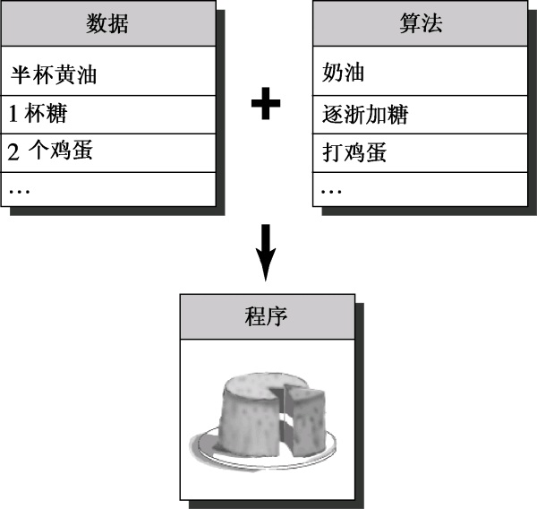
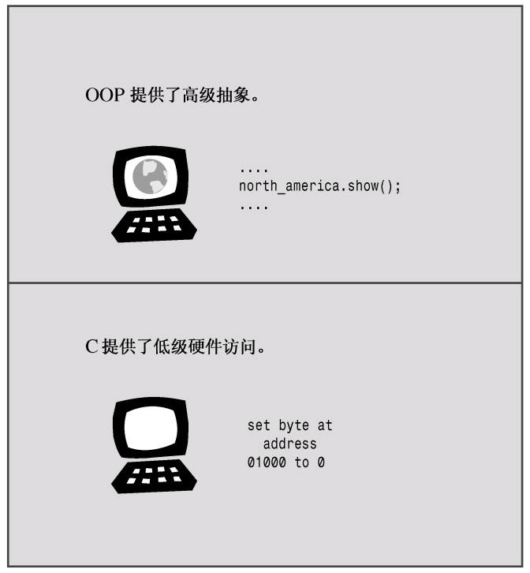
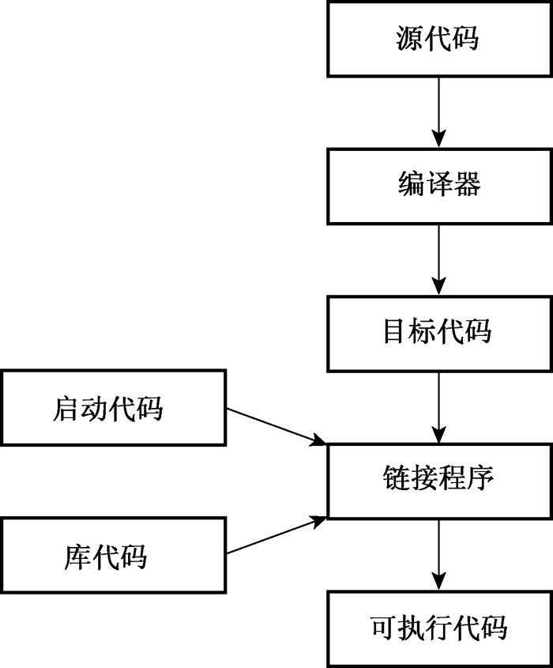
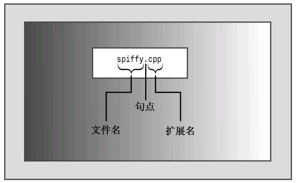

# 第1章 预备知识
本章内容包括：

* C语言和C++的发展历史和基本原理。
* 过程性编程和面向对象编程。
* C++是如何在C语言的基础上添加面向对象概念的。
* C++是如何在C语言的基础上添加泛型编程概念的。
* 编程语言标准。
* 创建程序的技巧。

欢迎进入C++世界！这是一种令人兴奋的语言，它在C语言的基础上添加了对面向对象编程和泛型编程的支持，在20世纪90年代便是最重要的编程语言之一，并在21世纪仍保持强劲势头。C++继承了C语言高效、简洁、快速和可移植性的传统。C++面向对象的特性带来了全新的编程方法，这种方法是为应付复杂程度不断提高的现代编程任务而设计的。C++的模板特性提供了另一种全新的编程方法——泛型编程。这三件法宝既是福也是祸，一方面让C++语言功能强大，另一方面则意味着有更多的东西需要学习。

本章首先介绍C++的背景，然后介绍创建C++程序的一些基本原则。本书其他章节将讲述如何使用C++语言，从最浅显的基本知识开始，到面向对象的编程（OOP）及其支持的新术语——对象、类、封装、数据隐藏、多态和继承等，然后介绍它对泛型编程的支持（当然，随着您对C++的学习，这些词汇将从花里胡哨的词语变为论述中必不可少的术语）。

## 1.1 C++简介
C++融合了3种不同的编程方式：**C语言代表的过程性语言**、**C++在C语言基础上添加的类代表的面向对象语言**、**C++模板支持的泛型编程**。本章将简要介绍这些传统。不过首先，我们来看看这种传统对于学习C++来说意味着什么。使用C++的原因之一是为了利用其面向对象的特性。要利用这种特性，必须对标准C语言知识有较深入的了解，因为它提供了基本类型、运算符、控制结构和语法规则。所以，如果已经对C有所了解，便可以学习C++了，但这并不仅仅是学习更多的关键字和结构，从C过渡到C++的学习量就像从头学习C语言一样大。另外，如果先掌握了C语言，则在过渡到C++时，必须摈弃一些编程习惯。如果不了解C语言，则学习C++时需要掌握C语言的知识、OOP知识以及泛型编程知识，但无需摈弃任何编程习惯。如果您认为学习C++可能需要扩展思维，这就对了。本书将以清晰的、帮助的方式，引导读者一步一个脚印地学习，因此扩展思维的过程是温和的，不至于让您的大脑接受不了。

本书通过传授C语言基础知识和C++新增的内容，带您步入C++的世界，因此不要求读者具备C语言知识。首先学习C++与C语言共有的一些特性。即使已经了解C语言，也会发现阅读本书的这一部分是一次很好的复习。另外，本章还介绍了一些对后面的学习十分重要的概念，指出了C++和C之间的区别。在牢固地掌握了C语言的基础知识后，就可以在此基础上学习C++方面的知识了。那时将学习对象和类以及C++是如何实现它们的，另外还将学习模板。

本书不是完整的C++参考手册，不会探索该语言的每个细节，但将介绍所有的重要特性，包括模板、异常和名称空间等。

下面简要地介绍一下C++的背景知识。

## 1.2 C++简史
在过去的几十年，计算机技术以令人惊讶的速度发展着，当前，笔记本电脑的计算速度和存储信息的能力超过了20世纪60年代的大型机。很多程序员可能还记得，将数叠穿孔卡片提交给充斥整个房间的大型计算机系统的时代，而这种系统只有100KB的内存，比当今智能手机的内存都少得多。计算机语言也得到了发展，尽管变化可能不是天翻地覆的，但也是非常重要的。体积更大、功能更强的计算机引出了更大、更复杂的程序，而这些程序在程序管理和维护方面带来了新的问题。

在20世纪70年代，C和Pascal这样的语言引领人们进入了结构化编程时代，这种机制把秩序和规程带进了迫切需要这种性质的领域中。除了提供结构化编程工具外，C还能生成简洁、快速运行的程序，并提供了处理硬件问题的能力，如管理通信端口和磁盘驱动器。这些因素使C语言成为20世纪80年代占统治地位的编程语言。同时，20世纪80年代，人们也见证了一种新编程模式的成长：面向对象编程（OOP）。SmallTalk和C++语言具备这种功能。下面更深入地介绍C和OOP。

### 1.2.1 C语言
20世纪70年代早期，贝尔实验室的Dennis Ritchie致力于开发UNIX操作系统（操作系统是能够管理计算机资源、处理计算机与用户之间交互的一组程序。例如，操作系统将系统提示符显示在屏幕上以提供终端式界面、提供管理窗口和鼠标的图形界面以及运行程序）。为完成这项工作，Ritchie需要一种语言，它必须简洁，能够生成简洁、快速的程序，并能有效地控制硬件。

传统上，程序员使用汇编语言来满足这些需求，汇编语言依赖于计算机的内部机器语言。然而，汇编语言是低级（low-level）语言，即直接操作硬件，如直接访问CPU寄存器和内存单元。因此汇编语言针对于特定的计算机处理器，要将汇编程序移植到另一种计算机上，必须使用不同的汇编语言重新编写程序。这有点像每次购买新车时，都发现设计人员改变了控制系统的位置和功能，客户不得不重新学习驾驶。

然而，UNIX是为在不同的计算机（或平台）上工作而设计的，这意味着它是一种高级语言。高级（high-level）语言致力于解决问题，而不针对特定的硬件。一种被称为编译器的特殊程序将高级语言翻译成特定计算机的内部语言。这样，就可以通过对每个平台使用不同的编译器来在不同的平台上使用同一个高级语言程序了。Ritchie希望有一种语言能将低级语言的效率、硬件访问能力和高级语言的通用性、可移植性融合在一起，于是他在旧语言的基础上开发了C语言。

### 1.2.2 C语言编程原理
由于C++在C语言的基础上移植了新的编程理念，因此我们首先来看一看C所遵循的旧的理念。一般来说，计算机语言要处理两个概念——数据和算法。数据是程序使用和处理的信息，而算法是程序使用的方法（参见图1.1）。C语言与当前最主流的语言一样，在最初面世时也是过程性（procedural）语言，这意味着它强调的是编程的算法方面。从概念上说，过程化编程首先要确定计算机应采取的操作，然后使用编程语言来实现这些操作。程序命令计算机按一系列流程生成特定的结果，就像菜谱指定了厨师做蛋糕时应遵循的一系列步骤一样。

随着程序规模的扩大，早期的程序语言（如FORTRAN和BASIC）都会遇到组织方面的问题。例如，程序经常使用分支语句，根据某种测试的结果，执行一组或另一组指令。很多旧式程序的执行路径很混乱（被称为“意大利面条式编程”），几乎不可能通过阅读程序来理解它，修改这种程序简直是一场灾难。为了解决这种问题，计算机科学家开发了一种更有序的编程方法——结构化编程（structured programming）。C语言具有使用这种方法的特性。例如，结构化编程将分支（决定接下来应执行哪个指令）限制为一小组行为良好的结构。C语言的词汇表中就包含了这些结构（for循环、while循环、do while循环和if else语句）。

另一个新原则是自顶向下（top-down）的设计。在C语言中，其理念是将大型程序分解成小型、便于管理的任务。如果其中的一项任务仍然过大，则将它分解为更小的任务。这一过程将一直持续下去，直到将程序划分为小型的、易于编写的模块（整理一下书房。先整理桌子、桌面、档案柜，然后整理书架。好，先从桌子开始，然后整理每个抽屉，从中间的那个抽屉开始整理。也许我都可以管理这项任务）。C语言的设计有助于使用这种方法，它鼓励程序员开发程序单元（函数）来表示各个任务模块。如上所述，结构化编程技术反映了过程性编程的思想，根据执行的操作来构思一个程序。



### 1.2.3 面向对象编程
虽然结构化编程的理念提高了程序的清晰度、可靠性，并使之便于维护，但它在编写大型程序时，仍面临着挑战。为应付这种挑战，OOP提供了一种新方法。与强调算法的过程性编程不同的是，OOP强调的是数据。OOP不像过程性编程那样，试图使问题满足语言的过程性方法，而是试图让语言来满足问题的要求。其理念是设计与问题的本质特性相对应的数据格式。

在C++中，类是一种规范，它描述了这种新型数据格式，对象是根据这种规范构造的特定数据结构。例如，类可以描述公司管理人员的基本特征（姓名、头衔、工资、特长等），而对象则代表特定的管理人员（Guilford Sheepblat、副总裁、$925 000、知道如何恢复Windows注册表）。通常，类规定了可使用哪些数据来表示对象以及可以对这些数据执行哪些操作。例如，假设正在开发一个能够绘制矩形的计算机绘图程序，则可以定义一个描述矩形的类。定义的数据部分应包括顶点的位置、长和宽、4条边的颜色和样式、矩形内部的填充颜色和图案等；定义的操作部分可以包括移动、改变大小、旋转、改变颜色和图案、将矩形复制到另一个位置上等操作。这样，当使用该程序来绘制矩形时，它将根据类定义创建一个对象。该对象保存了描述矩形的所有数据值，因此可以使用类方法来修改该矩形。如果绘制两个矩形，程序将创建两个对象，每个矩形对应一个。

OOP程序设计方法首先设计类，它们准确地表示了程序要处理的东西。例如，绘图程序可能定义表示矩形、直线、圆、画刷、画笔的类。类定义描述了对每个类可执行的操作，如移动圆或旋转直线。然后您便可以设计一个使用这些类的对象的程序。从低级组织（如类）到高级组织（如程序）的处理过程叫做自下向上（bottom-up）的编程。

OOP编程并不仅仅是将数据和方法合并为类定义。例如，OOP还有助于创建可重用的代码，这将减少大量的工作。信息隐藏可以保护数据，使其免遭不适当的访问。多态让您能够为运算符和函数创建多个定义，通过编程上下文来确定使用哪个定义。继承让您能够使用旧类派生出新类。正如接下来将看到的那样，OOP引入了很多新的理念，使用的编程方法不同于过程性编程。它不是将重点放在任务上，而是放在表示概念上。有时不一定使用自上向下的编程方法，而是使用自下向上的编程方法。本书将通过大量易于掌握的示例帮助读者理解这些要点。

设计有用、可靠的类是一项艰巨的任务，幸运的是，OOP语言使程序员在编程中能够轻松地使用已有的类。厂商提供了大量有用的类库，包括设计用于简化Windows或Macintosh环境下编程的类库。C++真正的优点之一是：可以方便地重用和修改现有的、经过仔细测试的代码。

### 1.2.4 C++和泛型编程
泛型编程（generic programming）是C++支持的另一种编程模式。它与OOP的目标相同，即使重用代码和抽象通用概念的技术更简单。不过OOP强调的是编程的数据方面，而泛型编程强调的是独立于特定数据类型。它们的侧重点不同。OOP是一个管理大型项目的工具，而泛型编程提供了执行常见任务（如对数据排序或合并链表）的工具。术语泛型（generic）指的是创建独立于类型的代码。C++的数据表示有多种类型——整数、小数、字符、字符串、用户定义的、由多种类型组成的复合结构。例如，要对不同类型的数据进行排序，通常必须为每种类型创建一个排序函数。泛型编程需要对语言进行扩展，以便可以只编写一个泛型（即不是特定类型的）函数，并将其用于各种实际类型。C++模板提供了完成这种任务的机制。

### 1.2.5 C++的起源
与C语言一样，C++也是在贝尔实验室诞生的，Bjarne Stroustrup于20世纪80年代在这里开发出了这种语言。用他自己的话来说，“C++主要是为了我的朋友和我不必再使用汇编语言、C语言或其他现代高级语言来编程而设计的。它的主要功能是可以更方便地编写出好程序，让每个程序员更加快乐”。

> **Bjarne Stroustrup的主页** 
>
> Bjarne Stroustrup设计并实现了C++编程语言，他是权威参考手册《The C++ Programming Language》和《The design and Evolution of C++》的作者。读者应将他位于AT&T Labs Research上的个人网站作为首选的C++书签：
> 
> [http：//www.research.att.com/-bs/](http：//www.research.att.com/-bs/)
>
> 该网站包括了C++语言有趣的发展历史、Bjarne的传记材料和C++ FAQ。Bjarne被问得最多的问题是：Bjarne Stroustrup应该如何读。您可以访问Stroustrup的网站，阅读FAQ部分并下载.WAV文件，亲自听一听。

Stroustrup比较关心的是让C++更有用，而不是实施特定的编程原理或风格。在确定C++语言特性方面，真正的编程需要比纯粹的原理更重要。Stroupstrup之所以在C的基础上创建C++，是因为C语言简洁、适合系统编程、使用广泛且与UNIX操作系统联系紧密。C++的OOP方面是受到了计算机模拟语言Simula67的启发。Stroustrup加入了OOP特性和对C的泛型编程支持，但并没有对C的组件作很大的改动。因此，C++是C语言的超集，这意味着任何有效的C程序都是有效的C++程序。它们之间有些细微的差异，但无足轻重。C++程序可以使用已有的C软件库。库是编程模块的集合，可以从程序中调用它们。库对很多常见的编程问题提供了可靠的解决方法，因此能节省程序员大量的时间和工作量。这也有助于C++的广泛传播。

名称C++来自C语言中的递增运算符++，该运算符将变量加1。名称C++表明，它是C的扩充版本。

计算机程序将实际问题转换为计算机能够执行的一系列操作。OOP部分赋予了C++语言将问题所涉及的概念联系起来的能力，C部分则赋予了C++语言紧密联系硬件的能力（参见图1.2），这种能力上的结合成就了C++的广泛传播。从程序的一个方面转到另一个方面时，思维方式也要跟着转换（确实，有些OOP正统派把为C添加OOP特性看作是为猪插上翅膀，虽然这是头瘦骨嶙峋、非常能干的猪）。另外，C++是在C语言的基础上添加OOP特性，您可以忽略C++的面向对象特性，但将错过很多有用的东西。

在C++获得一定程度的成功后，Stroustrup才添加了模板，这使得进行泛型编程成为可能。在模板特性被使用和改进后，人们才逐渐认识到，它们和OOP同样重要——甚至比OOP还重要，但有些人不这么认为。C++融合了OOP、泛型编程和传统的过程性方法，这表明C++强调的是实用价值，而不是意识形态方法，这也是该语言获得成功的原因之一。



## 1.3 可移植性和标准
假设您为运行Windows 2000的老式奔腾PC编写了一个很好用的C++程序，而管理人员决定用使用不同操作系统（如Mac OS X或Linux）和处理器（如SPARC处理器）的计算机替换它。该程序是否可以在新平台上运行呢？当然，必须使用为新平台设计的C++编译器对程序重新编译。但是否需要修改编写好的代码呢？如果在不修改代码的情况下，重新编译程序后，程序将运行良好，则该程序是可移植的。

在可移植性方面存在两个障碍，其中的一个是硬件。硬件特定的程序是不可移植的。例如，直接控制IBM PC 视频卡的程序在涉及Sun时将“胡言乱语”（将依赖于硬件的部分放在函数模块中可以最大限度地降低可移植性问题；这样只需重新编写这些模块即可）。本书将避免这种编程。

可移植性的第二个障碍是语言上的差异。口语确实可能产生问题。约克郡的人对某个事件的描述，布鲁克林人可能就听不明白，虽然这两个地方的人都说英语。计算机语言也可能出现方言。Windows XP C++的实现与Red Hat Linux或Macintosh OS X实现相同吗？虽然多数实现都希望其C++版本与其他版本兼容，但如果没有准确描述语言工作方式的公开标准，这将很难做到。因此，美国国家标准局（American National Standards Institute，ANSI）在1990年设立了一个委员会（ANSI X3J16），专门负责制定C++标准（ANSI制定了C语言标准）。国际标准化组织（ISO）很快通过自己的委员会（ISO-WG-21）加入了这个行列，创建了联合组织ANSI/ISO，致力于制定C++标准。

经过多年的努力，制定出了一个国际标准ISO/IEC 14882:1998，并于1998年获得了ISO、IEC（International Electrotechnical Committee，国际电工技术委员会）和ANSI的批准。该标准常被称为C++98，它不仅描述了已有的C++特性，还对该语言进行了扩展，添加了异常、运行阶段类型识别（RTTI）、模板和标准模板库（STL）。2003年，发布了C++标准第二版（IOS/IEC 14882:2003）；这个新版本是一次技术性修订，这意味着它对第一版进行了整理——修订错误、减少多义性等，但没有改变语言特性。这个版本常被称为C++03。由于C++03没有改变语言特性，因此我们使用C++98表示C++98/C++2003。

C++在不断发展。ISO标准委员会于2001年8月批准了新标准ISO/IEC 14882:2011，该标准以前称为C++11。与C++98一样，C++11也新增了众多特性。另外，其目标是消除不一致性，让C++学习和使用起来更容易。该标准还曾被称为C++0x，最初预期x为7或8，但标准制定工作是一个令人疲惫的缓慢过程。所幸的是，可将0x视为十六进制数，这意味着委员会只需在2015年前完成这项任务即可。根据这个度量标准，委员会还是提前完成了任务。

ISO C++标准还吸收了ANSI C语言标准，因为C++应尽量是C语言的超集。这意味着在理想情况下，任何有效的C程序都应是有效的C++程序。ANSI C与对应的C++规则之间存在一些差别，但这种差别很小。实际上，ANSI C加入了C++首次引入的一些特性，如函数原型和类型限定符const。

在ANSI C出现之前，C语言社区遵循一种事实标准，该标准基于Kernighan和Ritchie编写的《The C Programming Language》一书，通常被称为K&R C；ANSI C出现后，更简单的K&R C有时被称为经典C（Classic C）。

ANSI C标准不仅定义了C语言，还定义了一个ANSI C实现必须支持的标准C库。C++也使用了这个库；本书将其称为标准C库或标准库。另外，ANSI/ISO C++标准还提供了一个C++标准类库。

最新的C标准为C99，ISO和ANSI分别于1999年和2000年批准了该标准。该标准在C语言中添加了一些C++编译器支持的特性，如新的整型。

### 1.3.1 C++的发展
Stroustrup编写的《The Programming Language》包含65页的参考手册，它成了最初的C++事实标准。

下一个事实标准是Ellis和Stroustrup编写的《The Annotated C++ Reference Manual》。

C++98标准新增了大量特性，其篇幅将近800页，且包含的说明很少。

C++11标准的篇幅长达1350页，对旧标准做了大量的补充。

### 1.3.2 本书遵循的C++标准
当代的编译器都对C++98提供了很好的支持。编写本书期间，有些编译器还支持一些C++特性；随着新标准获批，对这些特性的支持将很快得到提高。本书反映了当前的情形，详尽地介绍了C++98，并涵盖了C++11新增的一些特性。在探讨相关的C++98主题时顺便介绍了一些C++新特性，而第18章专门介绍新特性，它总结了本书前面提到的一些特性，并介绍了其他特性。

在编写本书期间，对C++11的支持还不全面，因此难以全面介绍C++11新增的所有特性。考虑到篇幅限制，即使这个新标准获得了全面支持，也无法在一本书中全面介绍它。本书重点介绍大多数编译器都支持的特性，并简要地总结其他特性。

详细介绍C++之前，先介绍一些有关程序创建的基本知识。

## 1.4 程序创建的技巧
假设您编写了一个C++程序。如何让它运行起来呢？具体的步骤取决于计算机环境和使用的C++编译器，但大体如下（参见图1.3）。

1. 使用文本编辑器编写程序，并将其保存到文件中，这个文件就是程序的源代码。
2. 编译源代码。这意味着运行一个程序，将源代码翻译为主机使用的内部语言——机器语言。包含了翻译后的程序的文件就是程序的目标代码（object code）。
3. 将目标代码与其他代码链接起来。例如，C++程序通常使用库。C++库包含一系列计算机例程（被称为函数）的目标代码，这些函数可以执行诸如在屏幕上显示信息或计算平方根等任务。链接指的是将目标代码同使用的函数的目标代码以及一些标准的启动代码（startup code）组合起来，生成程序的运行阶段版本。包含该最终产品的文件被称为可执行代码。



本书将不断使用术语源代码，请记住该术语。

本书的程序都是通用的，可在任何支持C++98的系统中运行；但第18章的程序要求系统支持C++11。编写本书期间，有些编译器要求您使用特定的标记，让其支持部分C++11特性。例如，从4.3版起，g++要求您编译源代码文件时使用标记-std=c++xx：
```shell
g++ -std=c++11 use_auto.cpp
```

创建程序的步骤可能各不相同，下面深入介绍这些步骤。

### 1.4.1 创建源代码文件
本书余下的篇幅讨论源代码文件中的内容；本节讨论创建源代码文件的技巧。有些C++实现（如Microsoft Visual C++、Embarcadero C++ Builder、Apple Xcode、Open Watcom C++、Digital Mars C++和Freescale CodeWarrior）提供了集成开发环境（integrated development environments，IDE），让您能够在主程序中管理程序开发的所有步骤，包括编辑。有些实现（如用于UNIX和Linux的GNU C++、用于AIX的IBM XL C/C++、Embarcadero分发的Borland 5.5免费版本以及Digital Mars编译器）只能处理编译和链接阶段，要求在系统命令行输入命令。在这种情况下，可以使用任何文本编辑器来创建和修改源代码。例如，在UNIX系统上，可以使用vi、ed、ex或emacs；在以命令提示符模式运行的Windows系统上，可以使用edlin、edit或任何程序编辑器。如果将文件保存为标准ASCII文本文件（而不是特殊的字处理器格式），甚至可以使用字处理器。另外，还可能有IDE选项，让您能够使用这些命令行编译器。

给源文件命名时，必须使用正确的后缀，将文件标识为C++文件。这不仅告诉您该文件是C++源代码，还将这种信息告知编译器（如果UNIX编译器显示信息“bad magic number”，则表明后缀不正确）。后缀由一个句点和一个或多个字符组成，这些字符被称作扩展名（参见图1.4）。



使用什么扩展名取决于C++实现，表1.1列出了一些常用的扩展名。例如，spiffy.C是有效的UNIX C++源代码文件名。注意，UNIX区分大小写，这意味着应使用大写的C字符。实际上，小写c扩展名也有效，但标准C才使用小写的c。因此，为避免在UNIX系统上发生混淆，对于C程序应使用c，而对于C++程序则请使用C。如果不在乎多输入一两个字符，则对于某些UNIX系统，也可以使用扩展名cc和cxx。DOS比UNIX稍微简单一点，不区分大小写，因此DOS实现使用额外的字母（如表1.1所示）来区别C和C++程序。

表1.1 源代码文件的扩展名

| C++实现 | 源代码文件的扩展名 |
| :--- | :--- |
| UNIX | C、cc、cxx、c |
| GNU C++ | C、cc、cxx、cpp、c++ |
| Digital Mars | cpp、cxx |
| Borland C++ | cpp |
| Watcom | cpp |
| Microsoft Visual C++ | cpp、cxx、cc |
| Freestyle CodeWarrior | cp、cpp、cc、cxx、c++ |

### 1.4.2 编译和链接
最初，Stroustrup实现C++时，使用了一个C++到C的编译器程序，而不是开发直接的C++到目标代码的编译器。前者叫做cfront（表示C前端，C front end），它将C++源代码翻译成C源代码，然后使用一个标准C编译器对其进行编译。这种方法简化了向C的领域引入C++的过程。其他实现也采用这种方法将C++引入到其他平台。随着C++的日渐普及，越来越多的实现转向创建C++编译器，直接将C++源代码生成目标代码。这种直接方法加速了编译过程，并强调C++是一种独立（虽然有些相似）的语言。

编译的机理取决于实现，接下来的几节将介绍一些常见的形式。这些总结概括了基本步骤，但对于具体步骤，必须查看系统文档。

1. UNIX编译和链接

最初，UNIX命令CC调用cfront，但cfront未能紧跟C++的发展步伐，其最后一个版本发布于1993年。当今的UNIX计算机可能没有编译器、有专用编译器或第三方编译器，这些编译器可能是商业的，也可能是自由软件，如GNU g++编译器。如果UNIX计算机上有C++编译器，很多情况下命令CC仍然管用，只是启动的编译器随系统而异。出于简化的目的，读者应假设命令CC可用，但必须认识到这一点，即对于下述讨论中的CC，可能必须使用其他命令来代替。

请用CC命令来编译程序。名称采用大写字母，这样可以将它与标准UNIX C编译器cc区分开来。CC编译器是命令行编译器，这意味着需要在UNIX命令行上输入编译命令。

例如，要编译C++源代码文件spiffy.C，则应在UNIX提示符下输入如下命令：
```shell
CC spiffy.C
```

如果由于技巧、努力或是幸运的因素，程序没有错误，编译器将生成一个扩展名为o的目标代码文件。在这个例子中，编译器将生成文件spiffy.o。

接下来，编译器自动将目标代码文件传递给系统链接程序，该程序将代码与库代码结合起来，生成一个可执行文件。在默认情况下，可执行文件为a.out。如果只使用一个源文件，链接程序还将删除spiffy.o文件，因为这个文件不再需要了。要运行该程序，只要输入可执行文件的文件名即可：
```shell
a.out
```

注意，如果编译新程序，新的可执行文件a.out将覆盖已有的a.out（这是因为可执行文件占据了大量空间，因此覆盖旧的可执行文件有助于降低存储需求）。然而，如果想保留可执行文件，只需使用UNIX的mv命令来修改可执行文件的文件名即可。

与在C语言中一样，在C++中，程序也可以包含多个文件（本书第8 ~ 第16章的很多程序都是这样）。在这种情况下，可以通过在命令行上列出全部文件来编译程序：
```shell
CC my.C precious.C
```

如果有多个源代码文件，则编译器将不会删除目标代码文件。这样，如果只修改了my.C文件，则可以用下面的命令重新编译该程序：
```shell
CC my.C precious.o
```

这将重新编译my.C文件，并将它与前面编译的precious.o文件链接起来。

可能需要显式地指定一些库。例如，要访问数学库中定义的函数，必须在命令行中加上-lm标记：
```shell
CC usingmath.C -lm
```

2. Linux编译和链接

Linux系统中最常用的编译器是g++，这是来自Free Software Foundation的GNU C++编译器。Linux的多数版本都包括该编译器，但并不一定总会安装它。g++编译器的工作方式很像标准UNIX编译器。例如，下面的命令将生成可执行文件a.out
```shell
g++ spiffy.cxx
```

有些版本可能要求链接C++库：
```shell
g++ spiffy.cxx -lg++
```

要编译多个源文件，只需将它们全部放到命令行中即可：
```shell
g++ my.cxx precious.cxx
```

这将生成一个名为a.out的可执行文件和两个目标代码文件my.o和precious.o。如果接下来修改了其中的某个源代码文件，如mu.cxx，则可以使用my.cxx和precious.o来重新编译：
```shell
g++ my.cxx precious.o
```

GNU编译器可以在很多平台上使用，包括基于Windows的PC和在各种平台上运行的UNIX系统。

3. Windows命令行编译器

要在Windows PC上编译C++程序，最便宜的方法是下载一个在Windows命令提示符模式（在这种模式下，将打开一个类似于MS-DOS的窗口）下运行的免费命令行编译器。Cygwin和MinGW都包含编译器GNU C++，且可免费下载；它们使用的编译器名为g++。

要使用g++编译器，首先需要打开一个命令提示符窗口。启动程序Cygwin和MinGW时，它们将自动为您打开一个命令提示符窗口。要编译名为great.cpp的源代码文件，请在提示符下输入如下命令：
```c
g++ great.cpp
```

如果程序编译成功，则得到的可执行文件名为a.exe。

4. Windows编译器

Windows产品很多且修订频繁，无法对它们分别进行介绍。当前，最流行是Microsoft Visual C++ 2010，可通过免费的Microsoft Visual C++ 2010学习版获得。虽然设计和目标不同，但大多数基于Windows的C++编译器都有一些相同的功能。

通常，必须为程序创建一个项目，并将组成程序的一个或多个文件添加到该项目中。每个厂商提供的IDE（集成开发环境）都包含用于创建项目的菜单选项（可能还有自动帮助）。必须确定的非常重要的一点是，需要创建的是什么类型的程序。通常，编译器提供了很多选择，如Windows应用程序、MFC Windows应用程序、动态链接库、ActiveX控件、DOS或字符模式的可执行文件、静态库或控制台应用程序等。其中一些可能既有32位版本，又有64位版本。

由于本书的程序都是通用的，因此应当避免要求平台特定代码的选项，如Windows应用程序。相反，应让程序以字符模式运行。具体选项取决于编译器。一般而言，应选择包含字样“控制台”、“字符模式”或“DOS可执行文件”等选项。例如，在Microsoft Visual C++ 2010中，应选择Win32 Console Application（控制台应用程序）选项，单击Application Settings（应用程序设置），并选择Empty Project（空项目）。在C++ Builder中，应从C++ Builder Projects（C++ Builder项目）中选择Console Application（控制台应用程序）。

创建好项目后，需要对程序进行编译和链接。IDE通常提供了多个菜单项，如Compile（编译）、Build（建立）、Make（生成）、BuildAll（全部建立）、Link（链接）、Execute（执行）、Run（运行）和Debug（调试），不过同一个IDE中，不一定包含所有这些选项。

* Compile通常意味着对当前打开的文件中的代码进行编译。
* Build和Make通常意味着编译项目中所有源代码文件的代码。这通常是一个递增过程，也就是说，如果项目包含3个文件，而只有其中一个文件被修改，则只重新编译该文件。
* Build All通常意味着重新编译所有的源代码文件。
* Link意味着（如前所述）将编译后的源代码与所需的库代码组合起来。
* Run或Execute意味着运行程序。通常，如果您还没有执行前面的步骤，Run将在运行程序之前完成这些步骤。
* Debug意味着以步进方式执行程序。
* 编译器可能让您选择要生成调试版还是发布版。调试版包含额外的代码，这会增大程序、降低执行速度，但可提供详细的调试信息。

如果程序违反了语言规则，编译器将生成错误消息，指出存在问题的行。遗憾的是，如果不熟悉语言，将难以理解这些消息的含义。有时，真正的问题可能在标识行之前；有时，一个错误可能引发一连串的错误消息。

> **提示：**
> 
> 改正错误时，应首先改正第一个错误。如果在标识为有错误的那一行上找不到错误，请查看前一行。

需要注意的是，程序能够通过某个编译器的编译并不意味着它是合法的C++程序；同样，程序不能通过某个编译器的编译也并不意味着它是非法的C++程序。与几年前相比，现在的编译器更严格地遵循了C++标准。另外，编译器通常提供了可用于控制严格程度的选项。

> **提示：**
> 
> 有时，编译器在不完全地构建程序后将出现混乱，它显示无法改正的、无意义的错误消息。在这种情况下，可以选择Build All，重新编译整个程序，以清除这些错误消息。遗憾的是，这种情况和那些更常见的情况（即错误消息只是看上去无意义，实际上有意义）很难区分。

通常，IDE允许在辅助窗口中运行程序。程序执行完毕后，有些IDE将关闭该窗口，而有些IDE不关闭。如果编译器关闭窗口，将难以看到程序输出，除非您眼疾手快、过目不忘。为查看输出，必须在程序的最后加上一些代码：
```c++
    cin.get();  // add this statement
    cin.get();  // and maybe this, too
    return 0;
```

cin.get( )语句读取下一次键击，因此上述语句让程序等待，直到按下了Enter键（在按下Enter键之前，键击将不被发送给程序，因此按其他键都不管用）。如果程序在其常规输入后留下一个没有被处理的键击，则第二条语句是必需的。例如，如果要输入一个数字，则需要输入该数字，然后按Enter键。程序将读取该数字，但Enter键不被处理，这样它将被第一个cin.get( )读取。

5. Macintosh上的C++

当前，Apple随操作系统Mac OS X提供了开发框架Xcode，该框架是免费的，但通常不会自动安装。要安装它，可使用操作系统安装盘，也可从Apple网站免费下载（但需要注意的是，它超过4GB）。Xcode不仅提供了支持多种语言的IDE，还自带了两个命令行编译器（g++和clang），可在UNIX模式下运行它们。而要进入UNIX模式，可通过实用程序Terminal。

> 提示：
> 
> 为节省时间，可对所有示例程序使用同一个项目。方法是从项目列表中删除前一个示例程序的源代码文件，并添加当前的源代码。这样可节省时间、工作量和磁盘空间。

## 1.5 总结
随着计算机的功能越来越强大，计算机程序越来越庞大而复杂。为应对这种挑战，计算机语言也得到了改进，以便编程过程更为简单。C语言新增了诸如控制结构和函数等特性，以便更好地控制程序流程，支持结构化和模块化程度更高的方法；而C++增加了对面向对象编程和泛型编程的支持，这有助于提高模块化和创建可重用代码，从而节省编程时间并提高程序的可靠性。

C++的流行导致大量用于各种计算平台的C++实现得以面世；而ISOC++标准（C++98/03和C++11）为确保众多实现的相互兼容提供了基础。这些标准规定了语言必须具备的特性、语言呈现出的行为、标准库函数、类和模板，旨在实现该语言在不同计算平台和实现之间的可移植性。

要创建C++程序，可创建一个或多个源代码文件，其中包含了以C++语言表示的程序。这些文件是文本文件，它们经过编译和链接后将得到机器语言文件，后者构成了可执行的程序。上述任务通常是在IDE中完成的，IDE提供了用于创建源代码文件的文本编辑器、用于生成可执行文件的编译器和链接器以及其他资源，如项目管理和调试功能。然而，这些任务也可以在命令行环境中通过调用合适的工具来完成。


