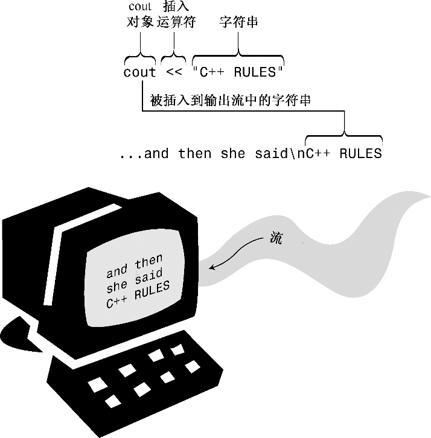
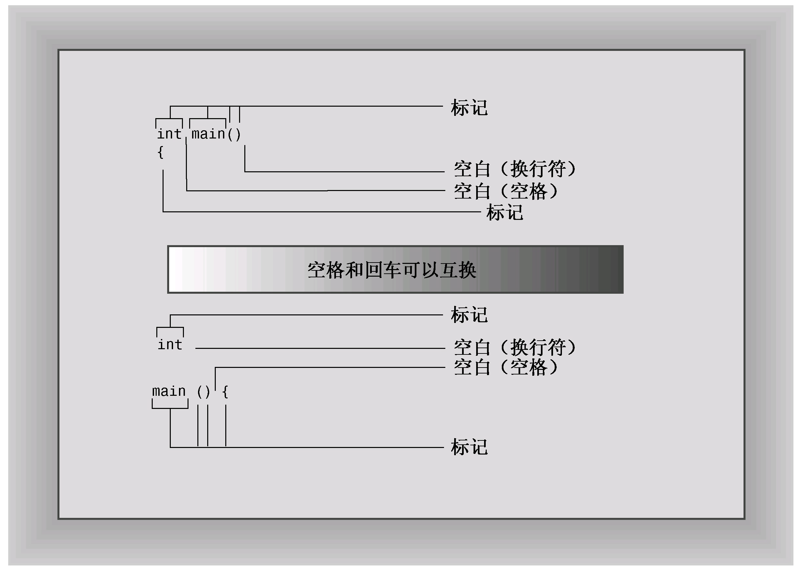
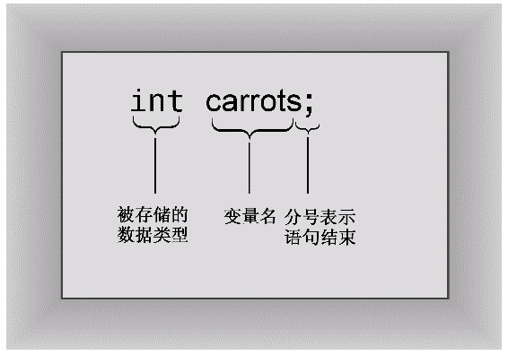
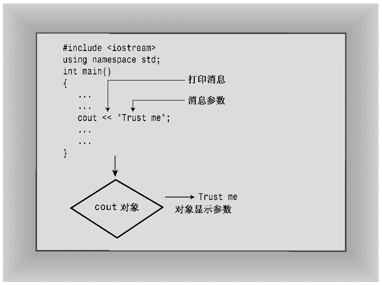
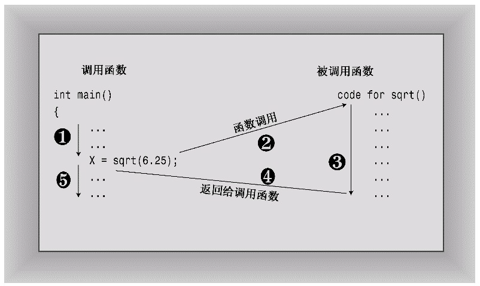
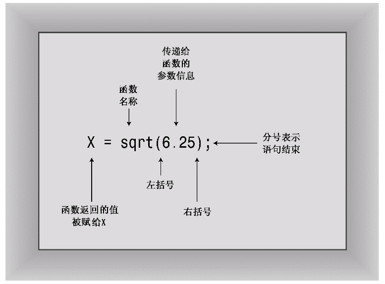
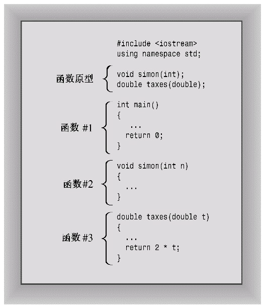
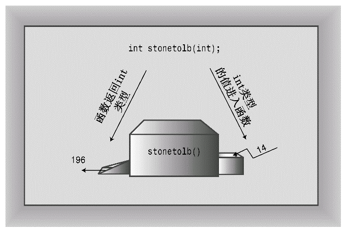

# 第2章 开始学习C++
本章内容包括：

* 创建C++程序。
* C++程序的一般格式。
* ＃include编译指令。
* main( )函数。
* 使用cout对象进行输出。
* 在C++程序中加入注释。
* 何时以及如何使用endl。
* 声明和使用变量。
* 使用cin对象进行输入。
* 定义和使用简单函数。

要建造简单的房屋，首先要打地基、搭框架。如果一开始没有牢固的结构，后面就很难建造窗子、门框、圆屋顶和镶木地板的舞厅等。同样，学习计算机语言时，应从程序的基本结构开始学起。只有这样，才能一步一步了解其具体细节，如循环和对象等。本章对C++程序的基本结构做一概述，并预览后面将介绍的主题，如函数和类。（这里的理念是，先介绍一些基本概念，这样可以激发读者接下去学习的兴趣。）

## 2.1 进入C++
首先介绍一个显示消息的简单C++程序。程序清单2.1使用C++工具cout生成字符输出。源代码中包含一些供读者阅读的注释，这些注释都以//打头，编译器将忽略它们。C++对大小写敏感，也就是说区分大写字符和小写字符。这意味着大小写必须与示例中相同。例如，该程序使用的是cout，如果将其替换为Cout或COUT，程序将无法通过编译，并且编译器将指出使用了未知的标识符（编译器也是对拼写敏感的，因此请不要使用kout或coot）。文件扩展名cpp是一种表示C++程序的常用方式，您可能需要使用第1章介绍的其他扩展名。

程序清单2.1 myfirst.cpp
```c++
// myfirst.cpp--displays a message

#include <iostream>                           // a PREPROCESSOR directive
int main()                                    // function header
{                                             // start of function body
    using namespace std;                      // make definitions visible
    cout << "Come up and C++ me some time.";  // message
    cout << endl;                             // start a new line
    cout << "You won't regret it!" << endl;   // more output
    return 0;                                 // terminate main()
}                                             // end of function body
```

> **程序调整**
> 
> 要在自己的系统上运行本书的示例，可能需要对其进行修改。有些窗口环境在独立的窗口中运行程序，并在程序运行完毕后自动关闭该窗口。正如第1章讨论的，要让窗口一直打开，直到您按任何键，可在return语句前添加如下语句：
> ```c++
> cin.get()
> ```
> 
> 对于有些程序，要让窗口一直打开，直到您按任何键，必须添加两条这样的语句。第4章将更详细地介绍cin.get( )。
> 
> 如果您使用的系统很旧，它可能不支持C++98新增的特性。
> 
> 有些程序要求编译器对C++11标准提供一定的支持。对于这样的程序，将明确的指出这一点，并在可能的情况下提供非C++11代码。

将该程序复制到您选择的编辑器中（或使用本书配套网站的源代码，详情请参阅封底）后，便可以C++编译器创建可执行代码了（参见第1章的介绍）。下面是运行编译后的程序时得到的输出：
```c++
Come up and C++ me some time.
You won't regret it!
```

> **C语言输入和输出**
> 
> 如果已经使用过C语言进行编程，则看到cout函数（而不是printf( )函数）时可能会小吃一惊。事实上，C++能够使用printf( )、scanf( )和其他所有标准C输入和输出函数，只需要包含常规C语言的stdio.h文件。不过本书介绍的是C++，所以将使用C++的输入工具，它们在C版本的基础上作了很多改进。

您使用函数来创建C++程序。通常，先将程序组织为主要任务，然后设计独立的函数来处理这些任务。程序清单2.1中的示例非常简单，只包含一个名为main( )的函数。myfirst.cpp示例包含下述元素。

* 注释，由前缀//标识。
* 预处理器编译指令#include。
* 函数头：int main( )。
* 编译指令using namespace。
* 函数体，用{和}括起。
* 使用C++的cout工具显示消息的语句。
* 结束main( )函数的return语句。

下面详细介绍这些元素。先来看看main( )函数，因为了解了main( )的作用后，main( )前面的一些特性（如预处理器编译指令）将更易于理解。

### 2.1.1 main( )函数
去掉修饰后，程序清单2.1中的示例程序的基本结构如下：
```c++
int main()
{
    statements;
    return 0;
}
```

这几行表明有一个名为main( )的函数，并描述了该函数的行为。这几行代码构成了函数定义（function definition）。该定义由两部分组成：第一行int main( )叫函数头（function heading），花括号({和})中包括的部分叫函数体。图2.1对main( )函数做了说明。函数头对函数与程序其他部分之间的接口进行了总结；函数体是指出函数应做什么的计算机指令。在C++中，每条完整的指令都称为语句。所有的语句都以分号结束，因此在输入示例代码时，请不要省略分号。

函数.png)

main( )中最后一条语句叫做返回语句（return statement），它结束该函数。本章将讲述有关返回语句的更多知识。

> **语句和分号**
> 
> 语句是要执行的操作。为理解源代码，编译器需要知道一条语句何时结束，另一条语句何时开始。有些语言使用语句分隔符。例如，FORTRAN通过行尾将语句分隔开来，Pascal使用分号分隔语句。在Pascal中，有些情况下可以省略分号，例如END前的语句后面，这种情况下，实际上并没有将两条语句分开。不过C++与C一样，也使用终止符（terminator），而不是分隔符。终止符是一个分号，它是语句的结束标记，是语句的组成部分，而不是语句之间的标记。结论是：在C++中，不能省略分号。

1. 作为接口的函数头

就目前而言，需要记住的主要一点是，C++句法要求main( )函数的定义以函数头int main( )开始。本章后面的“函数”一节将详细讨论函数头句法，然而，为满足读者的好奇心，下面先预览一下。

通常，C++函数可被其他函数激活或调用，函数头描述了函数与调用它的函数之间的接口。位于函数名前面的部分叫做函数返回类型，它描述的是从函数返回给调用它的函数的信息。函数名后括号中的部分叫做形参列表（argument list）或参数列表（parameter list）；它描述的是从调用函数传递给被调用的函数的信息。这种通用格式用于main( )时让人感到有些迷惑，因为通常并不从程序的其他部分调用main( )。

然而，通常，main( )被启动代码调用，而启动代码是由编译器添加到程序中的，是程序和操作系统（UNIX、Windows 7或其他操作系统）之间的桥梁。事实上，该函数头描述的是main( )和操作系统之间的接口。

来看一下main( )的接口描述，该接口从int开始。C++函数可以给调用函数返回一个值，这个值叫做返回值（return value）。在这里，从关键字int可知，main( )返回一个整数值。接下来，是空括号。通常，C++函数在调用另一个函数时，可以将信息传递给该函数。括号中的函数头部分描述的就是这种信息。在这里，空括号意味着main( )函数不接受任何信息，或者main( )不接受任何参数。（main( )不接受任何参数并不意味着main( )是不讲道理的、发号施令的函数。相反，术语参数（argument）只是计算机人员用来表示从一个函数传递给另一个函数的信息）。

简而言之，下面的函数头表明main( )函数可以给调用它的函数返回一个整数值，且不从调用它的函数那里获得任何信息：
```c++
int main()
```

很多现有的程序都使用经典C函数头：
```c++
main()    // original C style
```

在C语言中，省略返回类型相当于说函数的类型为int。然而，C++逐步淘汰了这种用法。

也可以使用下面的变体：
```c++
int main(void)    // very explicit style
```

在括号中使用关键字void明确地指出，函数不接受任何参数。在C++（不是C）中，让括号空着与在括号中使用void等效（在C中，让括号空着意味着对是否接受参数保持沉默）。

有些程序员使用下面的函数头，并省略返回语句：
```c++
void main()
```

这在逻辑上是一致的，因为void返回类型意味着函数不返回任何值。该变体适用于很多系统，但由于它不是当前标准强制的一个选项，因此在有些系统上不能工作。因此，读者应避免使用这种格式，而应使用C++标准格式，这不需要做太多的工作就能完成。

最后，ANSI/ISO C++标准对那些抱怨必须在main( )函数最后包含一条返回语句过于繁琐的人做出了让步。如果编译器到达main( )函数末尾时没有遇到返回语句，则认为main( )函数以如下语句结尾：
```c++
return 0;
```

这条隐含的返回语句只适用于main( )函数，而不适用于其他函数。

2. 为什么main( )不能使用其他名称

之所以将myfirst.cpp程序中的函数命名为main( )，原因是必须这样做。通常，C++程序必须包含一个名为main( )的函数（不是Main( )、MAIN( )或mane( )。记住，大小写和拼写都要正确）。由于myfirst.cpp程序只有一个函数，因此该函数必须担负起main( )的责任。在运行C++程序时，通常从main( )函数开始执行。因此，如果没有main( )，程序将不完整，编译器将指出未定义main( )函数。

存在一些例外情况。例如，在Windows编程中，可以编写一个动态链接库（DLL）模块，这是其他Windows程序可以使用的代码。由于DLL模块不是独立的程序，因此不需要main( )。用于专用环境的程序—如机器人中的控制器芯片—可能不需要main( )。有些编程环境提供一个框架程序，该程序调用一些非标准函数，如_tmain( )。在这种情况下，有一个隐藏的main( )，它调用_tmain( )。但常规的独立程序都需要main( )，本书讨论的都是这种程序。

### 2.1.2 C++注释
C++注释以双斜杠（//）打头。注释是程序员为读者提供的说明，通常标识程序的一部分或解释代码的某个方面。编译器忽略注释，毕竟，它对C++的了解至少和程序员一样，在任何情况下，它都不能理解注释。对编译器而言，程序清单2.1就像没有注释一样：
```c
#include <iostream>
int main()
{
    using namespace std;
    cout << "Come up and C++ me some time.";
    cout << endl;
    cout << "You won't regret it!" << endl;
    return 0;
}
```

C++注释以//打头，到行尾结束。注释可以位于单独的一行上，也可以和代码位于同一行。请注意程序清单2.1的第一行：
```c++
// myfirst.cpp--displays a message
```

本书所有的程序都以注释开始，这些注释指出了源代码的文件名并简要地总结了该程序。在第1章中介绍过，源代码的文件扩展名取决于所用的C++系统。在其他系统中，文件名可能为myfirst.C或myfirst.cxx。

> **提示：**
> 
> 应使用注释来说明程序。程序越复杂，注释的价值越大。注释不仅有助于他人理解这些代码，也有助于程序员自己理解代码，特别是隔了一段时间没有接触该程序的情况下。

> **C-风格注释**
> 
> C++也能够识别C注释，C注释包括在符号/和/之间：
> ```c++
> #include <iostream>  /* a C-style comment */
> ```
> 
> 由于C-风格注释以*/结束，而不是到行尾结束，因此可以跨越多行。可以在程序中使用C或C++风格的注释，也可以同时使用这两种注释。但应尽量使用C++注释，因为这不涉及到结尾符号与起始符号的正确配对，所以它产生问题的可能性很小。事实上，C99标准也在C语言中添加了//注释。

### 2.1.3 C++预处理器和iostream文件
下面简要介绍一下需要知道的一些知识。如果程序要使用C++输入或输出工具，请提供这样两行代码：
```c++
#include <iostream>
using namespace std;
```

可使用其他代码替换第2行，这里使用这行代码旨在简化该程序（如果编译器不接受这几行代码，则说明它没有遵守标准C++98，使用它来编译本书的示例时，将出现众多其他的问题）。为使程序正常工作，只需要知道这些。下面更深入地介绍一下这些内容。

C++和C一样，也使用一个预处理器，该程序在进行主编译之前对源文件进行处理（第1章介绍过，有些C++实现使用翻译器程序将C++程序转换为C程序。虽然翻译器也是一种预处理器，但这里不讨论这种预处理器，而只讨论这样的预处理器，即它处理名称以#开头的编译指令）。不必执行任何特殊的操作来调用该预处理器，它会在编译程序时自动运行。

程序清单2.1使用了#include编译指令：
```c++
#include <iostream>                           // a PREPROCESSOR directive
```

该编译指令导致预处理器将iostream文件的内容添加到程序中。这是一种典型的预处理器操作：在源代码被编译之前，替换或添加文本。

这提出了一个问题：为什么要将iostream文件的内容添加到程序中呢？答案涉及程序与外部世界之间的通信。iostream中的io指的是输入（进入程序的信息）和输出（从程序中发送出去的信息）。C++的输入/输出方案涉及iostream文件中的多个定义。为了使用cout来显示消息，第一个程序需要这些定义。#include编译指令导致iostream文件的内容随源代码文件的内容一起被发送给编译器。实际上，iostream文件的内容将取代程序中的代码行#include <iostream>。原始文件没有被修改，而是将源代码文件和iostream组合成一个复合文件，编译的下一阶段将使用该文件。

> **注意：**
> 
> 使用cin和cout进行输入和输出的程序必须包含文件iostream。

### 2.1.4 头文件名
像iostream这样的文件叫做包含文件（include file）—由于它们被包含在其他文件中；也叫头文件（header file）—由于它们被包含在文件起始处。C++编译器自带了很多头文件，每个头文件都支持一组特定的工具。C语言的传统是，头文件使用扩展名h，将其作为一种通过名称标识文件类型的简单方式。例如，头文件math.h支持各种C语言数学函数，但C++的用法变了。现在，对老式C的头文件保留了扩展名h（C++程序仍可以使用这种文件），而C++头文件则没有扩展名。有些C头文件被转换为C++头文件，这些文件被重新命名，去掉了扩展名 h（使之成为C++风格的名称），并在文件名称前面加上前缀c（表明来自C语言）。例如，C++版本的math.h为cmath。有时C头文件的C版本和C++版本相同，而有时候新版本做了一些修改。对于纯粹的C++头文件（如iostream）来说，去掉h不只是形式上的变化，没有h的头文件也可以包含名称空间—本章的下一个主题。表2.1对头文件的命名约定进行了总结。

表2.1 头文件命名约定

| 头文件类型 | 约定 | 示例 | 说明 |
| :--- | :--- | :--- | :--- |
| C++旧式风格 | 以.h结尾 | iostream.h | C++程序可以使用 |
| C旧式风格 | 以.h结尾 | math.h | C、C++程序可以使用 |
| C++新式风格 | 没有扩展名 | iostream | C++程序可以使用，使用namespace std |
| 转换后的C | 加上前缀c，没有扩展名 | cmath | C++程序可以使用，可以使用不是C的特性，如namespace std |

由于C使用不同的文件扩展名来表示不同文件类型，因此用一些特殊的扩展名（如.hpp或.hxx）表示C++头文件是有道理的，ANSI/ISO委员会也这样认为。问题在于究竟使用哪种扩展名，因此最终他们一致同意不使用任何扩展名。

### 2.1.5 名称空间
如果使用iostream，而不是iostream.h，则应使用下面的名称空间编译指令来使iostream中的定义对程序可用：
```c++
using namespace std;
```

这叫做using编译指令。最简单的办法是，现在接受这个编译指令，以后再考虑它（例如，到第9章再考虑它）。但这里还是简要地介绍它，以免您一头雾水。

名称空间支持是一项C++特性，旨在让您编写大型程序以及将多个厂商现有的代码组合起来的程序时更容易，它还有助于组织程序。一个潜在的问题是，可能使用两个已封装好的产品，而它们都包含一个名为wanda( )的函数。这样，使用wanda( )函数时，编译器将不知道指的是哪个版本。名称空间让厂商能够将其产品封装在一个叫做名称空间的单元中，这样就可以用名称空间的名称来指出想使用哪个厂商的产品。因此，Microflop Industries可以将其定义放到一个名为Microflop的名称空间中。这样，其wanda( )函数的全称为Microflop::wanda( )；同样，Piscine公司的wanda( )版本可以表示为Piscine::wanda( )。这样，程序就可以使用名称空间来区分不同的版本了：
```c++
Microflop::wanda("go dancing?");         // use Microflop namespace version
Piscine::wanda("a fish named Desire");   // use Piscine namespace version
```

按照这种方式，类、函数和变量便是C++编译器的标准组件，它们现在都被放置在名称空间std中。仅当头文件没有扩展名h时，情况才是如此。这意味着在iostream中定义的用于输出的cout变量实际上是std::cout，而endl实际上是std::endl。因此，可以省略编译指令using，以下述方式进行编码：
```c++
cout << "Come up and C++ me some time.";
cout << std::endl;
```

然而，多数用户并不喜欢将引入名称空间之前的代码（使用iostream.h和cout）转换为名称空间代码（使用iostream和std::cout），除非他们可以不费力地完成这种转换。于是，using编译指令应运而生。下面的一行代码表明，可以使用std名称空间中定义的名称，而不必使用std::前缀：
```c++
using namespace std;
```

这个using编译指令使得std名称空间中的所有名称都可用。这是一种偷懒的做法，在大型项目中一个潜在的问题。更好的方法是，只使所需的名称可用，这可以通过使用using声明来实现：
```c++
using std::cout;    //make cout available
using std::endl;    //make endl available
using std::cin;     //make cin available
```

用这些编译指令替换下述代码后，便可以使用cin和cout，而不必加上std::前缀：
```c++
using namespace std;  //lazy approach, all names available
```

然而，要使用iostream中的其他名称，必须将它们分别加到using列表中。本书首先采用这种偷懒的方法，其原因有两个。首先，对于简单程序而言，采用何种名称空间管理方法无关紧要；其次，本书的重点是介绍C++的基本方面。本书后面将采用其他名称空间管理技术。

### 2.1.6 使用cout进行C++输出
现在来看一看如何显示消息。myfirst.cpp程序使用下面的C++语句：
```c++
cout << "Come up and C++ me some time.";
```

双引号括起的部分是要打印的消息。在C++中，用双引号括起的一系列字符叫做字符串，因为它是由若干字符组合而成的。<<符号表示该语句将把这个字符串发送给cout；该符号指出了信息流动的路径。cout是什么呢？它是一个预定义的对象，知道如何显示字符串、数字和单个字符等（第1章介绍过，对象是类的特定实例，而类定义了数据的存储和使用方式）。

马上就使用对象可能有些困难，因为几章后才会介绍对象。实际上，这演示了对象的长处之一—不用了解对象的内部情况，就可以使用它。只需要知道它的接口，即如何使用它。cout对象有一个简单的接口，如果string是一个字符串，则下面的代码将显示该字符串：
```c++
cout << string;
```

对于显示字符串而言，只需知道这些即可。然而，现在来看看C++从概念上如何解释这个过程。从概念上看，输出是一个流，即从程序流出的一系列字符。cout对象表示这种流，其属性是在iostream文件中定义的。cout的对象属性包括一个插入运算符（<<），它可以将其右侧的信息插入到流中。请看下面的语句（注意结尾的分号）：
```c++
cout << "Come up and C++ me some time.";
```

它将字符串“Come up and C++ me some time.”插入到输出流中。因此，与其说程序显示了一条消息，不如说它将一个字符串插入到了输出流中。不知道为什么，后者听起来更好一点（参见图2.2）。



> **初识运算符重载**
> 
> 如果熟悉C后才开始学习C++，则可能注意到了，插入运算符（<<）看上去就像按位左移运算符（<<），这是一个运算符重载的例子，通过重载，同一个运算符将有不同的含义。编译器通过上下文来确定运算符的含义。C本身也有一些运算符重载的情况。例如，&符号既表示地址运算符，又表示按位AND运算符；* 既表示乘法，又表示对指针解除引用。这里重要的不是这些运算符的具体功能，而是同一个符号可以有多种含义，而编译器可以根据上下文来确定其含义（这和确定“sound card”中的“sound”与“sound financial basic”中的“sound”的含义是一样的）。C++扩展了运算符重载的概念，允许为用户定义的类型（类）重新定义运算符的含义。

1. 控制符endl

现在来看看程序清单2.1中第二个输出流中看起来有些古怪的符号：
```c++
cout << endl;
```

endl是一个特殊的C++符号，表示一个重要的概念：重起一行。在输出流中插入endl将导致屏幕光标移到下一行开头。诸如endl等对于cout来说有特殊含义的特殊符号被称为控制符（manipulator）。和cout一样，endl也是在头文件iostream中定义的，且位于名称空间std中。

打印字符串时，cout不会自动移到下一行，因此在程序清单2.1中，第一条cout语句将光标留在输出字符串的后面。每条cout语句的输出从前一个输出的末尾开始，因此如果省略程序清单2.1中的endl，得到的输出将如下：
```c++
Come up and C++ me some time.You won't regret it!
```

从上述输出可知，Y紧跟在句点后面。下面来看另一个例子，假设有如下代码：
```c++
cout << "The Good, the";
cout << "Bad, ";
cout << "and the Ukulele";
cout << endl;
```

其输出将如下：
```c++
The Good, theBad, and the Ukulele
```

同样，每个字符串紧接在前一个字符串的后面。如果要在两个字符串之间留一个空格，必须将空格包含在字符串中。注意，要尝试上述输出示例，必须将代码放到完整的程序中，该程序包含一个main( )函数头以及起始和结束花括号。

2. 换行符

C++还提供了另一种在输出中指示换行的旧式方法：C语言符号\n：
```c++
cout << "What's next?\n";    // \n means start a new line
```

\n被视为一个字符，名为换行符。

显示字符串时，在字符串中包含换行符，而不是在末尾加上endl，可减少输入量：
```c++
cout << "Pluto is a dwarf planet.\n";        // show text, go to next line
cout << "Pluto is a dwarf planet." << endl;  // show text, go to next line
```

另一方面，如果要生成一个空行，则两种方法的输入量相同，但对大多数人而言，输入endl更为方便：
```c++
cout << "\n";     // start a new line
cout << endl;     // start a new line
```

本书中显示用引号括起的字符串时，通常使用换行符\n，在其他情况下则使用控制符endl。一个差别是，endl确保程序继续运行前刷新输出（将其立即显示在屏幕上）；而使用“\n”不能提供这样的保证，这意味着在有些系统中，有时可能在您输入信息后才会出现提示。

换行符是一种被称为“转义序列”的按键组合，转义序列将在第3章做更详细的讨论。

### 2.1.7 C++源代码的格式化
有些语言（如FORTRAN）是面向行的，即每条语句占一行。对于这些语言来说，回车的作用是将语句分开。然而，在C++中，分号标示了语句的结尾。因此，在C++中，回车的作用就和空格或制表符相同。也就是说，在C++中，通常可以在能够使用回车的地方使用空格，反之亦然。这说明既可以把一条语句放在几行上，也可以把几条语句放在同一行上。例如，可以将myfirst.cpp重新格式化为如下所示：
```c++
#include <iostream>
     int
main
(){    using
   namespace 
        std; cout 
        <<
   "Come up and C++ me some time."
   ;   cout <<
    endl; cout <<
    "You won't regret it!" <<
     endl; return 0;
}
```

这样虽然不太好看，但仍然是合法的代码。必须遵守一些规则，具体地说，在C和C++中，不能把空格、制表符或回车放在元素（比如名称）中间，也不能把回车放在字符串中间。下面是一个不能这样做的例子：
```c++
int ma  in()    // INVALID    --    space in name
re
turn 0;         // INVALID     --     carriage return in word
cout << "Behold the Beans
of Beauty!";    // INVALID     --     carriage return in string
```

然而，C++11新增的原始（raw）字符串可包含回车，这将在第4章简要地讨论。

1. 源代码中的标记和空白

一行代码中不可分割的元素叫做标记（token，参见图2.3）。通常，必须用空格、制表符或回车将两个标记分开，空格、制表符和回车统称为空白（white space）。有些字符（如括号和逗号）是不需要用空白分开的标记。下面的一些示例说明了什么情况下可以使用空白，什么情况下可以省略：



```c++
return0;        // INVALID, must be return 0;
return(0);      // VALID, white space omitted
return (0);     // VALID, white space used
intmain();      // INVALID, white space omitted
int main();     // VALID, white space omitted in ()
int main ( );   // ALSO VALID, white space used in ()
```

2. C++源代码风格

虽然C++在格式方面赋予了您很大的自由，但如果遵循合理的风格，程序将更便于阅读。有效但难看的代码不会令人满意。多数程序员都使用程序清单2.1所示的风格，它遵循了下述规则。

* 每条语句占一行。
* 每个函数都有一个开始花括号和一个结束花括号，这两个花括号各占一行。
* 函数中的语句都相对于花括号进行缩进。
* 与函数名称相关的圆括号周围没有空白。

前三条规则旨在确保代码清晰易读；第四条规则帮助区分函数和一些也使用圆括号的C++内置结构（如循环）。在涉及其他指导原则时，本书将提醒读者。

## 2.2 C++语句
C++程序是一组函数，而每个函数又是一组语句。C++有好几种语句，下面介绍其中的一些。程序清单2.2提供了两种新的语句。声明语句创建变量，赋值语句给该变量提供一个值。另外，该程序还演示了cout的新功能。

程序清单2.2 carrot.cpp
```c++
// carrots.cpp -- food processing program
// uses and displays a variable

#include <iostream>

int main()
{
    using namespace std;

    int carrots;            // declare an integer variable

    carrots = 25;            // assign a value to the variable
    cout << "I have ";
    cout << carrots;        // display the value of the variable
    cout << " carrots.";
    cout << endl;
    carrots = carrots - 1;  // modify the variable
    cout << "Crunch, crunch. Now I have " << carrots << " carrots." << endl;
    return 0;
}
```

空行将声明语句与程序的其他部分分开。这是C常用的方法，但在C++中不那么常见。下面是该程序的输出：
```c++
I have 25 carrots.
Crunch, crunch. Now I have 24 carrots.
```

下面探讨这个程序。

### 2.2.1 声明语句和变量
计算机是一种精确的、有条理的机器。要将信息项存储在计算机中，必须指出信息的存储位置和所需的内存空间。在C++中，完成这种任务的一种相对简便的方法，是使用声明语句来指出存储类型并提供位置标签。例如，程序清单2.2中包含这样一条声明语句（注意其中的分号）：
```c++
int carrots;
```

这条语句提供了两项信息：需要的内存以及该内存单元的名称。具体地说，这条语句指出程序需要足够的存储空间来存储一个整数，在C++中用int表示整数。编译器负责分配和标记内存的细节。C++可以处理多种类型的数据，而int是最基本的数据类型。它表示整数—没有小数部分的数字。C++的int类型可以为正，也可以为负，但是大小范围取决于实现。第3章将详细介绍int和其他基本类型。

完成的第二项任务是给存储单元指定名称。在这里，该声明语句指出，此后程序将使用名称carrots来标识存储在该内存单元中的值。carrots被称为变量，因为它的值可以修改。在C++中，所有变量都必须声明。如果省略了carrots.cpp中的声明，则当程序试图使用carrots时，编译器将指出错误。事实上，程序员尝试省略声明，可能只是为了看看编译器的反应。这样，以后看到这样的反应时，便知道应检查是否省略了声明。

> 为什么变量必须声明？
> 
> 有些语言（最典型的是BASIC）在使用新名称时创建新的变量，而不用显式地进行声明。这看上去对用户比较友好，事实上从短期上说确实如此。问题是，如果错误地拼写了变量名，将在不知情的情况下创建一个新的变量。在BASIC中，ss程序员可能编写如下语句：
> ```c++
> CastleDark = 34
> ...
> CastleDank = CastleDark + MoreGhosts
> ...
> PRINT CastleDark
> ```
> 
> 由于CastleDank是拼写错误（将r拼成了n），因此所作的修改实际上并没有修改CastleDark。这种错误很难发现，因为它没有违反BASIC中的任何规则。然而，在C++中，将声明CastleDark，但不会声明被错误拼写的CastleDank，因此对应的C++代码将违反“使用变量前必须声明它”的规则，因此编译器将捕获这种错误，发现潜在的问题。

因此，声明通常指出了要存储的数据类型和程序对存储在这里的数据使用的名称。在这个例子中，程序将创建一个名为carrots的变量，它可以存储整数（参见图2.4）。



程序中的声明语句叫做定义声明（defining declaration）语句，简称为定义（definition）。这意味着它将导致编译器为变量分配内存空间。在较为复杂的情况下，还可能有引用声明（reference declaration）。这些声明命令计算机使用在其他地方定义的变量。通常，声明不一定是定义，但在这个例子中，声明是定义。

如果您熟悉C语言或Pascal，就一定熟悉变量声明。不过C++中的变量声明也可能让人小吃一惊。在C和Pascal中，所有的变量声明通常都位于函数或过程的开始位置，但C++没有这种限制。实际上，C++通常的做法是，在首次使用变量前声明它。这样，就不必在程序中到处查找，以了解变量的类型。本章后面将有一个这样的例子。这种风格也有缺点，它没有把所有的变量名放在一起，因此无法对函数使用了哪些变量一目了然（C99标准使C声明规则与C++非常相似）。

> **提示：**
> 
> 对于声明变量，C++的做法是尽可能在首次使用变量前声明它。

### 2.2.2 赋值语句
赋值语句将值赋给存储单元。例如，下面的语句将整数25赋给变量carrots表示的内存单元：
```c++
carrots = 25;
```

符号=叫做赋值运算符。C++（和C）有一项不寻常的特性—可以连续使用赋值运算符。例如，下面的代码是合法的：
```c++
int steinway;
int baldwin;
int yamaha;
yamaha = baldwin = steinway = 88;
```

赋值将从右向左进行。首先，88被赋给steinway；然后，steinway的值（现在是88）被赋给baldwin；然后baldwin的值88被赋给yamaha（C++遵循C的爱好，允许外观奇怪的代码）。

程序清单2.2中的第二条赋值语句表明，可以对变量的值进行修改：
```c++
carrots = carrots - 1;  // modify the variable
```

赋值运算符右边的表达式carrots – 1是一个算术表达式。计算机将变量carrots的值25减去1，得到24。然后，赋值运算符将这个新值存储到变量carrots对应的内存单元中。

### 2.2.3 cout的新花样
到目前为止，本章的示例都使用cout来打印字符串，程序清单2.2使用cout来打印变量，该变量的值是一个整数：
```c++
cout << carrots;
```

程序没有打印“carrots”，而是打印存储在carrots中的整数值，即25。实际上，这将两个操作合而为一了。首先，cout将carrots替换为其当前值25；然后，把值转换为合适的输出字符。

如上所示，cout可用于数字和字符串。这似乎没有什么不同寻常的地方，但别忘了，整数25与字符串“25”有天壤之别。该字符串存储的是书写该数字时使用的字符，即字符3和8。程序在内部存储的是字符3和字符8的编码。要打印字符串，cout只需打印字符串中各个字符即可。但整数25被存储为数值，计算机不是单独存储每个数字，而是将25存储为二进制数（附录A讨论了这种表示法）。这里的要点是，在打印之前，cout必须将整数形式的数字转换为字符串形式。另外，cout很聪明，知道carrots是一个需要转换的整数。

与老式C语言的区别在于cout的聪明程度。在C语言中，要打印字符串“25”和整数25，可以使用C语言的多功能输出函数printf( )：
```c++
printf("Printing a string: %s\n", "25");
printf("Printing an integer: %d\n", 25);
```

撇开printf( )的复杂性不说，必须用特殊代码（%s和%d）来指出是要打印字符串还是整数。如果让printf( )打印字符串，但又错误地提供了一个整数，由于printf( )不够精密，因此根本发现不了错误。它将继续处理，显示一堆乱码。

cout的智能行为源自C++的面向对象特性。实际上，C++插入运算符（<<）将根据其后的数据类型相应地调整其行为，这是一个运算符重载的例子。在后面的章节中学习函数重载和运算符重载时，将知道如何实现这种智能设计。

> cout和printf( )
> 
> 如果已经习惯了C语言和printf( )，可能觉得cout看起来很奇怪。程序员甚至可能固执地坚持使用printf( )。但与使用所有转换说明的printf( )相比，cout的外观一点也不奇怪。更重要的是，cout还有明显的优点。它能够识别类型的功能表明，其设计更灵活、更好用。另外，它是可扩展的（extensible）。也就是说，可以重新定义<<运算符，使cout能够识别和显示所开发的新数据类型。如果喜欢printf( )提供的细致的控制功能，可以使用更高级的cout来获得相同的效果（参见第17章）。

## 2.3 其他C++语句
再来看几个C++语句的例子。程序清单2.3中的程序对前一个程序进行了扩展，要求在程序运行时输入一个值。为实现这项任务，它使用了cin，这是与cout对应的用于输入的对象。另外，该程序还演示了cout对象的多功能性。

程序清单2.3 getinfo.cpp
```c++
// getinfo.cpp -- input and output
#include <iostream>

int main()
{
    using namespace std;

    int carrots;

    cout << "How many carrots do you have?" << endl;
    cin >> carrots;                // C++ input
    cout << "Here are two more. ";
    carrots = carrots + 2;
    // the next line concatenates output
    cout << "Now you have " << carrots << " carrots." << endl;
    return 0;
}
```

> **程序调整**
> 
> 如果您发现在以前的程序清单中需要添加cin.get( )，则在这个程序清单中，需要添加两条cin.get( )语句，这样才能在屏幕上看到输出。第一条cin.get( )语句在您输入数字并按Enter键时读取输入，而第二条cin.get( )语句让程序暂停，直到您按Enter键。

下面是该程序的运行情况：
```c++
How many carrots do you have?
12
Here are two more. Now you have 14 carrots.
```

该程序包含两项新特性：用cin来读取键盘输入以及将四条输出语句组合成一条。下面分别介绍它们。

### 2.3.1 使用cin
上面的输出表明，从键盘输入的值（12）最终被赋给变量carrots。下面就是执行这项功能的语句：
```c++
cin >> carrots;
```

从这条语句可知，信息从cin流向carrots。显然，对这一过程有更为正式的描述。就像C++将输出看作是流出程序的字符流一样，它也将输入看作是流入程序的字符流。iostream文件将cin定义为一个表示这种流的对象。输出时，<<运算符将字符串插入到输出流中；输入时，cin使用>>运算符从输入流中抽取字符。通常，需要在运算符右侧提供一个变量，以接收抽取的信息（符号<<和>>被选择用来指示信息流的方向）。

与cout一样，cin也是一个智能对象。它可以将通过键盘输入的一系列字符（即输入）转换为接收信息的变量能够接受的形式。在这个例子中，程序将carrots声明为一个整型变量，因此输入被转换为计算机用来存储整数的数字形式。

### 2.3.2 使用cout进行拼接
getinfo.cpp中的另一项新特性是将4条输出语句合并为一条。iostream文件定义了<<运算符，以便可以像下面这样合并（拼接）输出：
```c++
cout << "Now you have " << carrots << " carrots." << endl;
```

这样能够将字符串输出和整数输出合并为一条语句。得到的输出与下述代码生成的相似：
```c++
cout << "Now you have ";
cout << carrots;
cout << " carrots.";
cout << endl;
```

根据有关cout的建议，也可以按照这样的方式重写拼接版本，即将一条语句放在4行上：
```c++
cout << "Now you have "
     << carrots
     << " carrots."
     << endl;
```

这是由于C++的自由格式规则将标记间的换行符和空格看作是可相互替换的。当代码行很长，限制输出的显示风格时，最后一种技术很方便。

需要注意的另一点是：
```c++
Now you have 14 carrots.
```

和
```c++
Here are two more.
```

在同一行中。

这是因为前面指出过的，cout语句的输出紧跟在前一条cout语句的输出后面。即使两条cout语句之前有其他语句，情况也将如此。

### 2.3.3 类简介
看了足够多的cin和cout示例后，可以学习有关对象的知识了。具体地说，本节将进一步介绍有关类的知识。正如第1章指出的，类是C++中面向对象编程（OOP）的核心概念之一。

类是用户定义的一种数据类型。要定义类，需要描述它能够表示什么信息和可对数据执行哪些操作。类之于对象就像类型之于变量。也就是说，类定义描述的是数据格式及其用法，而对象则是根据数据格式规范创建的实体。换句话说，如果说类就好比所有著名演员，则对象就好比某个著名的演员，如蛙人Kermit。我们来扩展这种类比，表示演员的类中包括该类可执行的操作的定义，如念某一角色的台词，表达悲伤、威胁恫吓，接受奖励等。如果了解其他OOP术语，就知道C++类对应于某些语言中的对象类型，而C++对象对应于对象实例或实例变量。

下面更具体一些。前文讲述过下面的变量声明：
```c++
int carrots;
```

上面的代码将创建一个类型为int的变量（carrots）。也就是说，carrots可以存储整数，可以按特定的方式使用—例如，用于加和减。现在来看cout。它是一个ostream类对象。ostream类定义（iostream文件的另一个成员）描述了ostream对象表示的数据以及可以对它执行的操作，如将数字或字符串插入到输出流中。同样，cin是一个istream类对象，也是在iostream中定义的。

> **注意：**
> 
> 类描述了一种数据类型的全部属性（包括可使用它执行的操作），对象是根据这些描述创建的实体。

知道类是用户定义的类型，但作为用户，并没有设计ostream和istream类。就像函数可以来自函数库一样，类也可以来自类库。ostream和istream类就属于这种情况。从技术上说，它们没有被内置到C++语言中，而是语言标准指定的类。这些类定义位于iostream文件中，没有被内置到编译器中。如果愿意，程序员甚至可以修改这些类定义，虽然这不是一个好主意（准确地说，这个主意很糟）。iostream系列类和相关的fstream（或文件I/O）系列类是早期所有的实现都自带的唯一两组类定义。然而，ANSI/ISO C++委员会在C++标准中添加了其他一些类库。另外，多数实现都在软件包中提供了其他类定义。事实上，C++当前之所以如此有吸引力，很大程度上是由于存在大量支持UNIX、Macintosh和Windows编程的类库。

类描述指定了可对类对象执行的所有操作。要对特定对象执行这些允许的操作，需要给该对象发送一条消息。例如，如果希望cout对象显示一个字符串，应向它发送一条消息，告诉它，“对象！显示这些内容！”C++提供了两种发送消息的方式：一种方式是使用类方法（本质上就是稍后将介绍的函数调用）；另一种方式是重新定义运算符，cin和cout采用的就是这种方式。因此，下面的语句使用重新定义的<<运算符将“显示消息”发送给cout：
```c++
cout << "I am not a crook";
```

在这个例子中，消息带一个参数—要显示的字符串（参见图2.5）。



## 2.4 函数
由于函数用于创建C++程序的模块，对C++的OOP定义至关重要，因此必须熟悉它。函数的某些方面属于高级主题，将在第7章和第8章重点讨论函数。然而，现在了解函数的一些基本特征，将使得在以后的函数学习中更加得心应手。本章剩余的内容将介绍函数的一些基本知识。

C++函数分两种：有返回值的和没有返回值的。在标准C++函数库中可以找到这两类函数的例子，您也可以自己创建这两种类型的函数。下面首先来看一个有返回值的库函数，然后介绍如何编写简单的函数。

### 2.4.1 使用有返回值的函数
有返回值的函数将生成一个值，而这个值可赋给变量或在其他表达式中使用。例如，标准C/C++库包含一个名为sqrt( )的函数，它返回平方根。假设要计算6.25的平方根，并将这个值赋给变量x，则可以在程序中使用下面的语句：
```c++
x = sqrt(6.25);  // return the value 2.5 and assigns it to x
```

表达式sqrt(6.25)将调用sqrt( )函数。表达式sqrt(6.25)被称为函数调用，被调用的函数叫做被调用函数（called function），包含函数调用的函数叫做调用函数（calling function，参见图2.6）。

圆括号中的值（这里为6.25）是发送给函数的信息，这被称为传递给函数。以这种方式发送给函数的值叫做参数。（参见图2.7。）函数sqrt( )得到的结果为2.5，并将这个值发送给调用函数；发送回去的值叫做函数的返回值（return value）。可以这么认为，函数执行完毕后，语句中的函数调用部分将被替换为返回的值。因此，这个例子将返回值赋给变量x。简而言之，参数是发送给函数的信息，返回值是从函数中发送回去的值。





情况基本上就是这样，只是在使用函数之前，C++编译器必须知道函数的参数类型和返回值类型。也就是说，函数是返回整数、字符、小数、有罪裁决还是别的什么东西？如果缺少这些信息，编译器将不知道如何解释返回值。C++提供这种信息的方式是使用函数原型语句。

> **注意：**
> 
> C++程序应当为程序中使用的每个函数提供原型。

函数原型之于函数就像变量声明之于变量—指出涉及的类型。例如，C++库将sqrt( )函数定义成将一个（可能）带小数部分的数字（如6.25）作为参数，并返回一个相同类型的数字。有些语言将这种数字称为实数，但是C++将这种类型称为double（将在第3章介绍）。sqrt( )的函数原型像这样：
```c++
double sqrt(double);    // function prototype
```

第一个double意味着sqrt( )将返回一个double值。括号中的double意味着sqrt( )需要一个double参数。因此该原型对sqrt( )的描述和下面代码中使用的函数相同：
```c++
double x;    // declare x as a type double variable
x = sqrt(6.25);
```

原型结尾的分号表明它是一条语句，这使得它是一个原型，而不是函数头。如果省略分号，编译器将把这行代码解释为一个函数头，并要求接着提供定义该函数的函数体。

在程序中使用sqrt( )时，也必须提供原型。可以用两种方法来实现：

* 在源代码文件中输入函数原型；
* 包含头文件cmath（老系统为math.h），其中定义了原型。

第二种方法更好，因为头文件更有可能使原型正确。对于C++库中的每个函数，都在一个或多个头文件中提供了其原型。请通过手册或在线帮助查看函数描述来确定应使用哪个头文件。例如，sqrt( )函数的说明将指出，应使用cmath头文件。（同样，可能必须使用老式的头文件math.h，它可用于C和C++程序中。）

不要混淆函数原型和函数定义。可以看出，原型只描述函数接口。也就是说，它描述的是发送给函数的信息和返回的信息。而定义中包含了函数的代码，如计算平方根的代码。C和C++将库函数的这两项特性（原型和定义）分开了。库文件中包含了函数的编译代码，而头文件中则包含了原型。

应在首次使用函数之前提供其原型。通常的做法是把原型放到main( )函数定义的前面。程序清单2.4演示了库函数sqrt( )的用法，它通过包含cmath文件来提供该函数的原型：

程序清单2.4 sqrt.cpp
```c++
// sqrt.cpp -- using the sqrt() function

#include <iostream>
#include <cmath>    // or math.h

int main()
{
    using namespace std;

    double area;
    cout << "Enter the floor area, in square feet, of your home: ";
    cin >> area;
    double side;
    side = sqrt(area);
    cout << "That's the equivalent of a square " << side 
         << " feet to the side." << endl;
    cout << "How fascinating!" << endl;
    return 0;
}
```

> **注意：**
> 
> 如果使用的是老式编译器，则必须在程序清单2.4中使用#include <math.h>，而不是#include<cmath>。

> **使用库函数**
> 
> C++库函数存储在库文件中。编译器编译程序时，它必须在库文件搜索您使用的函数。至于自动搜索哪些库文件，将因编译器而异。如果运行程序清单2.4时，将得到一条消息，指出_sqrt是一个没有定义的外部函数（似乎应当避免），则很可能是由于编译器不能自动搜索数学库（编译器倾向于给函数名添加下划线前缀—提示它们对程序具有最后的发言权）。如果在UNIX实现中遇到这样的消息，可能需要在命令行结尾使用-lm选项：
> ```c++
> CC sqrt.C -lm
> ```
> 
> 在Linux系统中，有些版本的Gnu编译器与此类似：
> ```c++
> g++ sqrt.C -lm
> ```
> 只包含cmath头文件可以提供原型，但不一定会导致编译器搜索正确的库文件。

下面是该程序的运行情况：
```c++
Enter the floor area, in square feet, of your home: 1536
That's the equivalent of a square 39.1918 feet to the side.
How fascinating!
```

由于sqrt( )处理的是double值，因此这里将变量声明为这种类型。声明double变量的句法与声明int变量相同：
```c++
type-name variable-name;
```

double类型使得变量area和side能够存储带小数的值，如1 536.0和39.191 8。将看起来是整数（如1536）的值赋给double变量时，将以实数形式存储它，其中的小数部分为.0。在第3章将指出，double类型覆盖的范围要比int类型大得多。

C++允许在程序的任何地方声明新变量，因此sqrt.cpp在要使用side时才声明它。C++还允许在创建变量时对它进行赋值，因此也可以这样做：
```c++
double side = sqrt(area);
```

这个过程叫做初始化（initialization），将在第3章更详细地介绍。

cin知道如何将输入流中的信息转换为double类型，cout知道如何将double类型插入到输出流中。前面讲过，这些对象都很智能化。

### 2.4.2 函数变体
有些函数需要多项信息。这些函数使用多个参数，参数间用逗号分开。例如，数学函数pow( )接受两个参数，返回值为以第一个参数为底，第二个参数为指数的幂。该函数的原型如下：
```c++
double pow(double, double);  // prototype of a function with two arguments
```

要计算5的8次方，可以这样使用该函数：
```c++
answer = pow(5.0, 8.0);  // function call with a list of arguments
```

另外一些函数不接受任何参数。例如，有一个C库（与cstdlib或stdlib.h头文件相关的库）包含一个rand( )函数，该函数不接受任何参数，并返回一个随机整数。该函数的原型如下：
```c++
int rand(void);    // prototype of a function that takes no arguments
```

关键字void明确指出，该函数不接受任何参数。如果省略void，让括号为空，则C++将其解释为一个不接受任何参数的隐式声明。可以这样使用该函数：
```c++
myGuess = rand();    // function call with no arguments
```

注意，与其他一些计算机语言不同，在C++中，函数调用中必须包括括号，即使没有参数。

还有一些函数没有返回值。例如，假设编写了一个函数，它按美元、美分格式显示数字。当向它传递参数23.5时，它将在屏幕上显示$23.50。由于这个函数把值发送给屏幕，而不是调用程序，因此不需要返回值。可以在原型中使用关键字void来指定返回类型，以指出函数没有返回值：
```c++
void bucks(double);    // prototype for function with no return value
```

由于它不返回值，因此不能将该函数调用放在赋值语句或其他表达式中。相反，应使用一条纯粹的函数调用语句：
```c++
bucks(1234.56);    // function call, no return value
```

在有些语言中，有返回值的函数被称为函数（function）；没有返回值的函数被称为过程（procedure）或子程序（subroutine）。但C++与C一样，这两种变体都被称为函数。

### 2.4.3 用户定义的函数
标准C库提供了140多个预定义的函数。如果其中的函数能满足要求，则应使用它们。但用户经常需要编写自己的函数，尤其是在设计类的时候。无论如何，设计自己的函数很有意思，下面来介绍这一过程。前面已经使用过好几个用户定义的函数，它们都叫main( )。每个C++程序都必须有一个main( )函数，用户必须对它进行定义。假设需要添加另一个用户定义的函数。和库函数一样，也可以通过函数名来调用用户定义的函数。对于库函数，在使用之前必须提供其原型，通常把原型放到main( )定义之前。但现在您必须提供新函数的源代码。最简单的方法是，将代码放在main( )的后面。程序清单2.5演示了这些元素。

程序清单2.5 ourfunc.cpp
```c++
// ourfunc.cpp -- defining your own function
#include <iostream>
void simon(int);    // function prototype for simon()

int main()
{
    using namespace std;
    simon(3);       // call the simon() function
    cout << "Pick an integer: ";
    int count;
    cin >> count;
    simon(count);   // call it again
    cout << "Done!" << endl;
    return 0;
}

void simon(int n)   // define the simon() function
{
    using namespace std;

    cout << "Simon says touch your toes " << n << " times." << endl;
}                   // void functions don't need return statements
```

main( )函数两次调用simon( )函数，一次的参数为3，另一次的参数为变量count。在这两次调用之间，用户输入一个整数，用来设置count的值。这个例子没有在cout提示消息中使用换行符。这样将导致用户输入与提示出现在同一行中。下面是运行情况：
```c++
Simon says touch your toes 3 times.
Pick an integer: 512
Simon says touch your toes 512 times.
Done!
```

1. 函数格式

在程序清单2.5中，simon( )函数的定义与main( )的定义采用的格式相同。首先，有一个函数头；然后是花括号中的函数体。可以把函数的格式统一为如下的情形：
```c++
type functionname(argumentlist)
{
    statements
}
```

注意，定义simon( )的源代码位于main( )的后面。和C一样（但不同于Pascal），C++不允许将函数定义嵌套在另一个函数定义中。每个函数定义都是独立的，所有函数的创建都是平等的（参见图2.8）。

2. 函数头

在程序清单2.5中，simon( )函数的函数头如下：
```c++
void simon(int n)
```

开头的void表明simon( )没有返回值，因此调用simon( )不会生成可在main( )中将其赋给变量的数字。因此，第一个函数调用方式如下：
```c++
simon(3);    // ok for void functions
```

由于simon( )没有返回值，因此不能这样使用它：
```c++
simple = simon(3);    // not allowed for void functions
```



括号中的int n表明，使用simon( )时，应提供一个int参数。n是一个新的变量，函数调用时传递的值将被赋给它。因此，下面的函数调用将3赋给simon( )函数头中定义的变量n：
```c++
simon(3);
```

当函数体中的cout语句使用n时，将使用函数调用时传递的值。这就是为什么simon（3）在输出中显示3的原因所在。在示例运行中，函数调用simon(count)导致函数显示512，因为这正是赋给count的值。简而言之，simon( )的函数头表明，该函数接受一个int参数，不返回任何值。

下面复习一下main( )的函数头：
```c++
int main()
```

开头的int表明，main( )返回一个整数值；空括号（其中可以包含void）表明，main( )没有参数。对于有返回值的函数，应使用关键字return来提供返回值，并结束函数。这就是为什么要在main( )结尾使用下述语句的原因：
```c++
return 0;
```

这在逻辑上是一致的：main( )返回一个int值，而程序员要求它返回整数0。但可能会产生疑问，将这个值返回到哪里了呢？毕竟，程序中没有哪个地方可以看出对main( )的调用：
```c++
squeeze = main();    // absent from our programs
```

答案是，可以将计算机操作系统（如UNIX或Windows）看作调用程序。因此，main( )的返回值并不是返回给程序的其他部分，而是返回给操作系统。很多操作系统都可以使用程序的返回值。例如，UNIX外壳脚本和Windows命令行批处理文件都被设计成运行程序，并测试它们的返回值（通常叫做退出值）。通常的约定是，退出值为0则意味着程序运行成功，为非零则意味着存在问题。因此，如果C++程序无法打开文件，可以将它设计为返回一个非零值。然后，便可以设计一个外壳脚本或批处理文件来运行该程序，如果该程序发出指示失败的消息，则采取其他措施。

> **关键字**
> 
> 关键字是计算机语言中的词汇。本章使用了4个C++关键字：int、void、return和double。由于这些关键字都是C++专用的，因此不能用作他用。也就是说，不能将return用作变量名，也不能把double用作函数名。不过可以把它们用作名称的一部分，如painter（其中包含int）或return_aces。附录B提供了C++关键字的完整列表。另外，main不是关键字，由于它不是语言的组成部分。然而，它是一个必不可少的函数的名称。可以把main用作变量名（在一些很神秘的以致于无法在这里介绍的情况中，将main用作变量名会引发错误，由于它在任何情况下都是容易混淆的，因此最好不要这样做）。同样，其他函数名和对象名也都不能是关键字。然而，在程序中将同一个名称（比如cout）用作对象名和变量名会把编译器搞糊涂。也就是说，在不使用cout对象进行输出的函数中，可以将cout用作变量名，但不能在同一个函数中同时将cout用作对象名和变量名。

### 2.4.4 用户定义的有返回值的函数
我们再深入一步，编写一个使用返回语句的函数。main( )函数已经揭示了有返回值的函数的格式：在函数头中指出返回类型，在函数体结尾处使用return。可以用这种形式为在英国观光的人解决重量的问题。在英国，很多浴室都以英石（stone）为单位，不像美国以磅或公斤为单位。一英石等于14磅，程序清单2.6使用一个函数来完成这样的转换。

程序清单2.6 convert.cpp
```c++
// convert.cpp -- converts stone to pounds
#include <iostream>
int stonetolb(int);     // function prototype
int main()
{
    using namespace std;
    int stone;
    cout << "Enter the weight in stone: ";
    cin >> stone;
    int pounds = stonetolb(stone);
    cout << stone << " stone = ";
    cout << pounds << " pounds." << endl;
    return 0;
}

int stonetolb(int sts)
{
     return 14 * sts;
}
```

下面是该程序的运行情况：
```c++
Enter the weight in stone: 15
15 stone = 210 pounds.
```

在main( )中，程序使用cin来给整型变量stone提供一个值。这个值被作为参数传递给stonetolb( )函数，在该函数中，这个值被赋给变量sts。然后，stonetolb( )用关键字return将14*sts返回给main( )。这表明return后面并非一定得跟一个简单的数字。这里通过使用较为复杂的表达式，避免了创建一个新变量，将结果赋给该变量，然后将它返回。程序将计算表达式的值（这里为210），并将其返回。如果返回表达式的值很麻烦，可以采取更复杂的方式：
```c++
int stonetolb(int sts)
{
    int pounds = 14 * sts;
    return pounds;
}
```

这两个版本返回的结果相同，但第二个版本更容易理解和修改，因为它将计算和返回分开了。

通常，在可以使用一个简单常量的地方，都可以使用一个返回值类型与该常量相同的函数。例如，stonetolb( )返回一个int值，这意味着可以以下面的方式使用该函数：
```c++
int aunt = stonetolb(20);
int aunts = aunt + stonetolb(10);
cout << "Ferdie weight " << stonetolb(16) << " pounds." << endl;
```

在上述任何一种情况下，程序都将计算返回值，然后在语句中使用这个值。

这些例子表明，函数原型描述了函数接口，即函数如何与程序的其他部分交互。参数列表指出了何种信息将被传递给函数，函数类型指出了返回值的类型。程序员有时将函数比作一个由出入它们的信息所指定的黑盒子（black boxes）（电工用语）。函数原型将这种观点诠释得淋漓尽致（参见图2.9）。



函数stonetolb( )短小、简单，但包含了全部的函数特性：

* 有函数头和函数体；
* 接受一个参数；
* 返回一个值；
* 需要一个原型。

可以把stonetolb( )看作函数设计的标准格式。第7章和第8章将更详细地介绍函数。而本章的内容让读者能够很好地了解函数的工作方式及其如何与C++匹配。

### 2.4.5 在多函数程序中使用using编译指令
在程序清单2.5中，两个函数中都包含下面一条using编译指令：
```c++
using namespace std;
```

这是因为每个函数都使用了cout，因此需要能够访问位于名称空间std中的cout定义。

在程序清单2.5中，可以采用另一种方法让两个函数都能够访问名称空间std，即将编译指令放在函数的外面，且位于两个函数的前面：
```c++
// ourfunc1.cpp -- repositioning the using directive
#include <iostream>

using namespace std;  // affects all function definitions in this file
void simon(int);

int main()
{
    simon(3);
    cout << "Pick an integer: ";
    int count;
    cin >> count;
    simon(count);
    cout << "Done!" << endl;
    return 0;
}

void simon(int n)
{
    cout << "Simon says touch your toes " << n << " times." << endl;
}
```

当前通行的理念是，只让需要访问名称空间std的函数访问它是更好的选择。例如，在程序清单2.6中，只有main( )函数使用cout，因此没有必要让函数stonetolb( )能够访问名称空间std。因此编译指令using被放在函数main( )中，使得只有该函数能够访问名称空间std。

总之，让程序能够访问名称空间std的方法有多种，下面是其中的4种。

* 将using namespace std；放在函数定义之前，让文件中所有的函数都能够使用名称空间std中所有的元素。
* 将using namespace std；放在特定的函数定义中，让该函数能够使用名称空间std中的所有元素。
* 在特定的函数中使用类似using std::cout;这样的编译指令，而不是using namespace std;，让该函数能够使用指定的元素，如cout。
* 完全不使用编译指令using，而在需要使用名称空间std中的元素时，使用前缀std::，如下所示：
```c++
std::cout << "I'm using cout and endl form the std namespace" << std::endl;
```

> **命名约定**
> 
> C++程序员给函数、类和变量命名时，可以有很多种选择。程序员对风格的观点五花八门，这些看法有时就像公共论坛上的圣战。就函数名称而言，程序员有以下选择：
> ```c++
> Myfunction( )
> myfunction( )
> myFunction( )
> my_function( )
> my_funct( )
> ```
> 
> 选择取决于开发团体、使用的技术或库以及程序员个人的品位和喜好。因此凡是符合第3章将介绍的C++规则的风格都是正确的，都可以根据个人的判断而使用。
> 
> 撇开语言是否允许不谈，个人的命名风格也是值得注意的—它有助于保持一致性和精确性。精确、让人一目了然的个人命名约定是良好的软件工程的标志，它在整个编程生涯中都会起到很好的作用。

## 2.5 总结
C++程序由一个或多个被称为函数的模块组成。程序从main( )函数（全部小写）开始执行，因此该函数必不可少。函数由函数头和函数体组成。函数头指出函数的返回值（如果有的话）的类型和函数期望通过参数传递给它的信息的类型。函数体由一系列位于花括号（{}）中的C++语句组成。

有多种类型的C++语句，包括下述6种。

* 声明语句：定义函数中使用的变量的名称和类型。
* 赋值语句：使用赋值运算符（=）给变量赋值。
* 消息语句：将消息发送给对象，激发某种行动。
* 函数调用：执行函数。被调用的函数执行完毕后，程序返回到函数调用语句后面的语句。
* 函数原型：声明函数的返回类型、函数接受的参数数量和类型。
* 返回语句：将一个值从被调用的函数那里返回到调用函数中。

类是用户定义的数据类型规范，它详细描述了如何表示信息以及可对数据执行的操作。对象是根据类规范创建的实体，就像简单变量是根据数据类型描述创建的实体一样。

C++提供了两个用于处理输入和输出的预定义对象（cin和cout），它们是istream和ostream类的实例，这两个类是在iostream文件中定义的。为ostream类定义的插入运算符（<<）使得将数据插入到输出流成为可能；为istream类定义的抽取运算符（>>）能够从输入流中抽取信息。cin和cout都是智能对象，能够根据程序上下文自动将信息从一种形式转换为另一种形式。

C++可以使用大量的C库函数。要使用库函数，应当包含提供该函数原型的头文件。

至此，读者对简单的C++程序有了大致的了解，可以进入下一章，了解程序的细节。

## 2.6 复习题
在附录J中可以找到所有复习题的答案。

1. C++程序的模块叫什么？

2. 下面的预处理器编译指令是做什么用的？
```c++
#include <iostream>
```

3. 下面的语句是做什么用的？
```c++
using namespace std;
```

4. 什么语句可以用来打印短语“Hello，world”，然后开始新的一行？

5. 什么语句可以用来创建名为cheeses的整数变量？

6. 什么语句可以用来将值32赋给变量cheeses？

7. 什么语句可以用来将从键盘输入的值读入变量cheeses中？

8. 什么语句可以用来打印“We have X varieties of cheese,”，其中X为变量cheeses的当前值。

9. 下面的函数原型指出了关于函数的哪些信息？
```c++
int froop(double t);
void rattle(int n);
int prune(void);
```

10. 定义函数时，在什么情况下不必使用关键字return？

11. 假设您编写的main( )函数包含如下代码：
```c++
cout << "Please enter your PIN:";
```

而编译器指出cout是一个未知标识符。导致这种问题的原因很可能是什么？指出3种修复这种问题的方法。

## 2.7 编程练习
1. 编写一个C++程序，它显示您的姓名和地址。

2. 编写一个C++程序，它要求用户输入一个以long为单位的距离，然后将它转换为码（一long等于220码）。

3. 编写一个C++程序，它使用3个用户定义的函数（包括main()），并生成下面的输出：
```c++
Three blind mice
Three blind mice
See how they run
See how they run
```

其中一个函数要调用两次，该函数生成前两行；另一个函数也被调用两次，并生成其余的输出。

4. 编写一个程序，让用户输入其年龄，然后显示该年龄包含多少个月，如下所示：
```c++
Enter your age: 29
Enter the number of hours:9
Enter the number of minutes:28
Time:9:28
```

5. 编写一个程序，其中的main( )调用一个用户定义的函数（以摄氏温度值为参数，并返回相应的华氏温度值）。该程序按下面的格式要求用户输入摄氏温度值，并显示结果：
```c++
Please enter a Celsius value:20
20 degrees Celsius is 68 degrees Fahrenheit.
```

下面是转换公式：
```c++
华氏温度 = 1.8×摄氏温度 + 32.0
```

6. 编写一个程序，其main( )调用一个用户定义的函数（以光年值为参数，并返回对应天文单位的值）。该程序按下面的格式要求用户输入光年值，并显示结果：
```c++
Enter the number of light years:4.2
4.2 light years = 265608 astronomical units.
```

天文单位是从地球到太阳的平均距离（约150000000公里或93000000英里），光年是光一年走的距离（约10万亿公里或6万亿英里）（除太阳外，最近的恒星大约离地球4.2光年）。请使用double类型（参见程序清单2.4），转换公式为：
```c++
1光年=63240天文单位
```

7. 编写一个程序，要求用户输入小时数和分钟数。在main( )函数中，将这两个值传递给一个void函数，后者以下面这样的格式显示这两个值：
```c++
Enter the number of hours:9
Enter the number of minutes:28
Time:9:28
```

