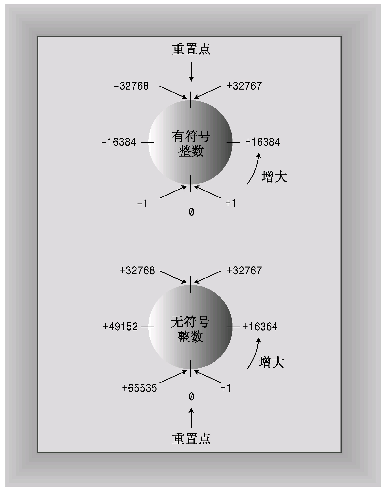
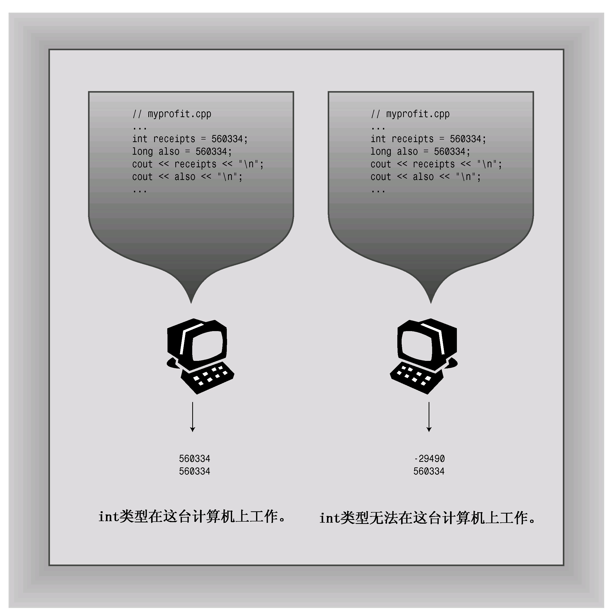
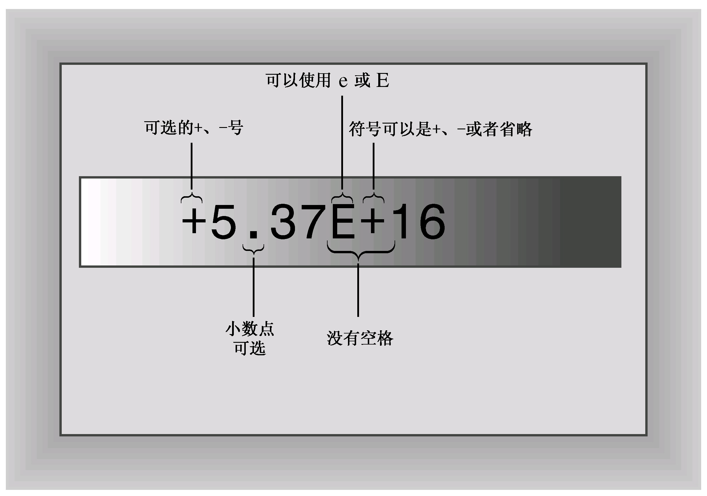
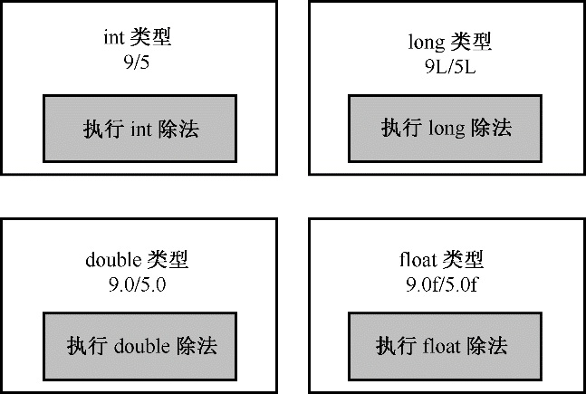

# 第3章 处理数据
本章内容包括：

* C++变量的命名规则。
* C++内置的整型——unsigned long、long、unsigned int、int、unsigned short、short、char、unsigned char、signed char和bool。
* C++11新增的整型：unsigned long long和long long。
* 表示各种整型的系统限制的climits文件。
* 各种整型的数字字面值（常量）。
* 使用const限定符来创建符号常量。
* C++内置的浮点类型：float、double和long double。
* 表示各种浮点类型的系统限制的cfloat文件。
* 各种浮点类型的数字字面值。
* C++的算术运算符。
* 自动类型转换。
* 强制类型转换。

面向对象编程（OOP）的本质是设计并扩展自己的数据类型。设计自己的数据类型就是让类型与数据匹配。如果正确做到了这一点，将会发现以后使用数据时会容易得多。然而，在创建自己的类型之前，必须了解并理解C++内置的类型，因为这些类型是创建自己类型的基本组件。

内置的C++类型分两组：基本类型和复合类型。本章将介绍基本类型，即整数和浮点数。似乎只有两种类型，但C++知道，没有任何一种整型和浮点型能够满足所有的编程要求，因此对于这两种数据，它提供了多种变体。第4章将介绍在基本类型的基础上创建的复合类型，包括数组、字符串、指针和结构。

当然，程序还需要一种标识存储的数据的方法，本章将介绍这样一种方法—使用变量；然后介绍如何在C++中进行算术运算；最后，介绍C++如何将值从一种类型转换为另一种类型。

## 3.1 简单变量
程序通常都需要存储信息—如Google股票当前的价格、纽约市8月份的平均湿度、美国宪法中使用最多的字母及其相对使用频率或猫王模仿者的数目。为把信息存储在计算机中，程序必须记录3个基本属性：

* 信息将存储在哪里；
* 要存储什么值；
* 存储何种类型的信息。

到目前为止，本书的示例采取的策略都是声明一个变量。声明中使用的类型描述了信息的类型和通过符号来表示其值的变量名。例如，假设实验室首席助理Igor使用了下面的语句：
```c++
int braincount;
braincount = 5;
```

这些语句告诉程序，它正在存储整数，并使用名称braincount来表示该整数的值（这里为5）。实际上，程序将找到一块能够存储整数的内存，将该内存单元标记为braincount，并将5复制到该内存单元中；然后，您可在程序中使用braincount来访问该内存单元。这些语句没有告诉您，这个值将存储在内存的什么位置，但程序确实记录了这种信息。实际上，可以使用&运算符来检索braincount的内存地址。下一章介绍另一种标识数据的方法（使用指针）时，将介绍这个运算符。

### 3.1.1 变量名
C++提倡使用有一定含义的变量名。如果变量表示差旅费，应将其命名为cost_of_trip或costOfTrip，而不要将其命名为x或cot。必须遵循几种简单的C++命名规则。

* 在名称中只能使用字母字符、数字和下划线_。
* 名称的第一个字符不能是数字。
* 区分大写字符与小写字符。
* 不能将C++关键字用作名称。
* 以两个下划线或下划线和大写字母打头的名称被保留给实现（编译器及其使用的资源）使用。以一个下划线开头的名称被保留给实现，用作全局标识符。
* C++对于名称的长度没有限制，名称中所有的字符都有意义，但有些平台有长度限制。

倒数第二点与前面几点有些不同，因为使用像_time_stop或_Donut这样的名称不会导致编译器错误，而会导致行为的不确定性。换句话说，不知道结果将是什么。不出现编译器错误的原因是，这样的名称不是非法的，但要留给实现使用。全局名称指的是名称被声明的位置，这将在第4章讨论。

最后一点使得C++与ANSI C（C99标准）有所区别，后者只保证名称中的前63个字符有意义（在ANSI C中，前63个字符相同的名称被认为是相同的，即使第64个字符不同）。

下面是一些有效和无效的C++名称：
```c++
int poodle;    // valid
int Poodle;    // valid and distinct for poodle
int POODLE;    // valid and even more distinct
Int terrier;   // invalid -- has to be int, not Int
int my_stars3; // valid
int _MyStars3; // valid but reserved -- starts with underscore
int 4ever;     // invalid because starts with a digit
int double;    // invalid -- double is a C++ keyword
int begin;     // valid -- begin is a Pascal keyword
int __fools;   // valid but reserved -- starts with two underscores
int the_very_best_variable_i_can_be_version_112;  // valid
int honky-tonk;  // invalid -- no hyphens allowed
```

如果想用两个或更多的单词组成一个名称，通常的做法是用下划线字符将单词分开，如my_onions；或者从第二个单词开始将每个单词的第一个字母大写，如myEyeTooth。（C程序员倾向于按C语言的方式使用下划线，而Pascal程序员喜欢采用大写方式。）这两种形式都很容易将单词区分开，如carDrip和cardRip或boat_sport和boats_port。

> **命名方案**
> 
> 变量命名方案和函数命名方案一样，也有很多话题可供讨论。确实，该主题会引发一些最尖锐的反对意见。同样，和函数名称一样，只要变量名合法，C++编译器就不会介意，但是一致、精确的个人命名约定是很有帮助的。
> 
> 与函数命名一样，大写在变量命名中也是一个关键问题（参见第2章的注释“命名约定”），但很多程序员可能会在变量名中加入其他的信息，即描述变量类型或内容的前缀。例如，可以将整型变量myWeight命名为nMyWeight，其中前缀n用来表示整数值，在阅读代码或变量定义不是十分清楚的情况下，前缀很有用。另外，这个变量也可以叫做intMyWeight，这将更精确，而且容易理解，不过它多了几个字母（对于很多程序员来说，这是非常讨厌的事）。常以这种方式使用的其他前缀有：str或sz（表示以空字符结束的字符串）、b（表示布尔值）、p（表示指针）和c（表示单个字符）。
> 
> 随着对C++的逐步了解，将发现很多有关前缀命名风格的示例（包括漂亮的m_lpctstr前缀—这是一个类成员值，其中包含了指向常量的长指针和以空字符结尾的字符串），还有其他更奇异、更违反直觉的风格，采不采用这些风格，完全取决于程序员。在C++所有主观的风格中，一致性和精度是最重要的。请根据自己的需要、喜好和个人风格来使用变量名（或必要时，根据雇主的需要、喜好和个人风格来选择变量名）。

### 3.1.2 整型
整数就是没有小数部分的数字，如2、98、-5286和0。整数有很多，如果将无限大的整数看作很大，则不可能用有限的计算机内存来表示所有的整数。因此，语言只能表示所有整数的一个子集。有些语言只提供一种整型（一种类型满足所有要求！），而C++则提供好几种，这样便能够根据程序的具体要求选择最合适的整型。

不同C++整型使用不同的内存量来存储整数。使用的内存量越大，可以表示的整数值范围也越大。另外，有的类型（符号类型）可表示正值和负值，而有的类型（无符号类型）不能表示负值。术语宽度（width）用于描述存储整数时使用的内存量。使用的内存越多，则越宽。C++的基本整型（按宽度递增的顺序排列）分别是char、short、int、long和C++11新增的long long，其中每种类型都有符号版本和无符号版本，因此总共有10种类型可供选择。下面更详细地介绍这些整数类型。由于char类型有一些特殊属性（它最常用来表示字符，而不是数字），因此本章将首先介绍其他类型。

### 3.1.3 整型short、int、long和long long
计算机内存由一些叫做位（bit）的单元组成（参见本章后面的旁注“位与字节”）。C++的short、int、long和long long类型通过使用不同数目的位来存储值，最多能够表示4种不同的整数宽度。如果在所有的系统中，每种类型的宽度都相同，则使用起来将非常方便。例如，如果short总是16位，int总是32位，等等。不过生活并非那么简单，没有一种选择能够满足所有的计算机设计要求。C++提供了一种灵活的标准，它确保了最小长度（从C语言借鉴而来），如下所示：

* short至少16位；
* int至少与short一样长；
* long至少32位，且至少与int一样长；
* long long至少64位，且至少与long一样长。

> **位与字节**
> 
> 计算机内存的基本单元是位（bit）。可以将位看作电子开关，可以开，也可以关。关表示值0，开表示值1。8位的内存块可以设置出256种不同的组合，因为每一位都可以有两种设置，所以8位的总组合数为2×2×2×2×2×2×2×2，即256。因此，8位单元可以表示0-255或者-128到127。每增加一位，组合数便加倍。这意味着可以把16位单元设置成65 536个不同的值，把32位单元设置成4 294 672 296个不同的值，把64位单元设置为18 446 744 073 709 551 616个不同的值。作为比较，unsigned long存储不了地球上当前的人数和银河系的星星数，而long long能够。
> 
> 字节（byte）通常指的是8位的内存单元。从这个意义上说，字节指的就是描述计算机内存量的度量单位，1KB等于1024字节，1MB等于1024KB。然而，C++对字节的定义与此不同。C++字节由至少能够容纳实现的基本字符集的相邻位组成，也就是说，可能取值的数目必须等于或超过字符数目。在美国，基本字符集通常是ASCII和EBCDIC字符集，它们都可以用8位来容纳，所以在使用这两种字符集的系统中，C++字节通常包含8位。然而，国际编程可能需要使用更大的字符集，如Unicode，因此有些实现可能使用16位甚至32位的字节。有些人使用术语八位组（octet）表示8位字节。

当前很多系统都使用最小长度，即short为16位，long为32位。这仍然为int提供了多种选择，其宽度可以是16位、24位或32位，同时又符合标准；甚至可以是64位，因为long和long long至少长64位。通常，在老式IBM PC的实现中，int的宽度为16位（与short相同），而在WindowsXP、Windows Vista、Windows 7、Macintosh OS X、VAX和很多其他微型计算机的实现中，为32位（与long相同）。有些实现允许选择如何处理int。（读者所用的实现使用的是什么？下面的例子将演示如何在不打开手册的情况下，确定系统的限制。）类型的宽度随实现而异，这可能在将C++程序从一种环境移到另一种环境（包括在同一个系统中使用不同编译器）时引发问题。但只要小心一点（如本章后面讨论的那样），就可以最大限度地减少这种问题。

可以像使用int一样，使用这些类型名来声明变量：
```c++
short score;        // creates a type short integer variable
int temperature;    // creates a type int integer variable
long position;      // creates a type long integer variable
```

实际上，short是short int的简称，而long是long int的简称，但是程序设计者们几乎都不使用比较长的形式。

这4种类型（int、short、long和long long）都是符号类型，这意味着每种类型的取值范围中，负值和正值几乎相同。例如，16位的int的取值范围为-32768到+32767。

要知道系统中整数的最大长度，可以在程序中使用C++工具来检查类型的长度。首先，sizeof运算符返回类型或变量的长度，单位为字节（运算符是内置的语言元素，对一个或多个数据进行运算，并生成一个值。例如，加号运算符+将两个值相加）。前面说过，“字节”的含义依赖于实现，因此在一个系统中，两字节的int可能是16位，而在另一个系统中可能是32位。其次，头文件climits（在老式实现中为limits.h）中包含了关于整型限制的信息。具体地说，它定义了表示各种限制的符号名称。例如，INT_MAX为int的最大取值，CHAR_BIT为字节的位数。程序清单3.1演示了如何使用这些工具。该程序还演示如何初始化，即使用声明语句将值赋给变量。

程序清单3.1 limits.cpp
```c++
// limits.cpp -- some integer limits
#include <iostream>
#include <climits>              // use limits.h for older systems
int main()
{
    using namespace std;
    int n_int = INT_MAX;        // initialize n_int to max int value
    short n_short = SHRT_MAX;   // symbols defined in climits file
    long n_long = LONG_MAX;
    long long n_llong = LLONG_MAX;

    // sizeof operator yields size of type or of variable
    cout << "int is " << sizeof (int) << " bytes." << endl;
    cout << "short is " << sizeof n_short << " bytes." << endl;
    cout << "long is " << sizeof n_long << " bytes." << endl;
    cout << "long long is " << sizeof n_llong << " bytes." << endl;
    cout << endl;

    cout << "Maximum values:" << endl;
    cout << "int: " << n_int << endl;
    cout << "short: " << n_short << endl;
    cout << "long: " << n_long << endl;
    cout << "long long: " << n_llong << endl << endl;

    cout << "Minimum int value = " << INT_MIN << endl;
    cout << "Bits per byte = " << CHAR_BIT << endl;

    return 0;
}
```

> **注意：**
> 
> 如果您的系统不支持类型long long，应删除使用该类型的代码行。

下面是程序清单3.1中程序的输出：
```c++
int is 4 bytes.
short is 2 bytes.
long is 8 bytes.
long long is 8 bytes.

Maximum values:
int: 2147483647
short: 32767
long: 9223372036854775807
long long: 9223372036854775807

Minimum int value = -2147483648
Bits per byte = 8
```

这些输出来自运行64位Windows 7的系统。

我们来看一下该程序的主要编程特性。

1. 运算符sizeof和头文件limits

sizeof运算符指出，在使用8位字节的系统中，int的长度为4个字节。可对类型名或变量名使用sizeof运算符。对类型名（如int）使用sizeof运算符时，应将名称放在括号中；但对变量名（如n_short）使用该运算符，括号是可选的：
```c++
cout << "int is " << sizeof (int) << " bytes.\n";
cout << "short is " << sizeof n_short << " bytes.\n";
```

头文件climits定义了符号常量（参见本章后面的旁注“符号常量—预处理器方式”）来表示类型的限制。如前所述，INT_MAX表示类型int能够存储的最大值，对于Windows 7系统，为2 147 483 647。编译器厂商提供了climits文件，该文件指出了其编译器中的值。例如，在使用16位int的老系统中，climits文件将INT_MAX定义为32 767。表3.1对该文件中定义的符号常量进行了总结，其中的一些符号常量与还没有介绍过的类型相关。

表3.1 climits中的符号常量

| 符 号 常 量 | 表 示 |
| :--- | :--- |
| CHAR_BIT | char的位数 |
| CHAR_MAX | char的最大值 |
| CHAR_MIN | char的最小值 |
| SCHAR_MAX | signed char的最大值 |
| SCHAR_MIN | signed char的最小值 |
| UCHAR_MAX | unsigned char的最大值 |
| SHRT_MAX | short的最大值 |
| SHRT_MIN | short的最小值 |
| USHRT_MAX | unsigned short的最大值 |
| INT_MAX | int的最大值 |
| INT_MIN | int的最小值 |
| UNIT_MAX | unsigned int的最大值 |
| LONG_MAX | long的最大值 |
| LONG_MIN | long的最小值 |
| ULONG_MAX | unsigned long的最大值 |
| LLONG_MAX | long long的最大值 |
| LLONG_MIN | long long的最小值 |
| ULLONG_MAX | unsigned long long的最大值 |

> **符号常量—预处理器方式**
> 
> climits文件中包含与下面类似的语句行：
> ```c++
> #define INT_MAX 32767
> ```
> 
> 在C++编译过程中，首先将源代码传递给预处理器。在这里，#define和#include一样，也是一个预处理器编译指令。该编译指令告诉预处理器：在程序中查找INT_MAX，并将所有的INT_MAX都替换为32767。因此#define编译指令的工作方式与文本编辑器或字处理器中的全局搜索并替换命令相似。修改后的程序将在完成这些替换后被编译。预处理器查找独立的标记（单独的单词），跳过嵌入的单词。也就是说，预处理器不会将PINT_MAXTM替换为P32767IM。也可以使用#define来定义自己的符号常量（参见程序清单3.2）。然而，#define编译指令是C语言遗留下来的。C++有一种更好的创建符号常量的方法（使用关键字const，将在后面的一节讨论），所以不会经常使用#define。然而，有些头文件，尤其是那些被设计成可用于C和C++中的头文件，必须使用#define。

2. 初始化

初始化将赋值与声明合并在一起。例如，下面的语句声明了变量n_int，并将int的最大取值赋给它：
```c++
int n_int = INT_MAX;
```

也可以使用字面值常量来初始化。可以将变量初始化为另一个变量，条件是后者已经定义过。甚至可以使用表达式来初始化变量，条件是当程序执行到该声明时，表达式中所有的值都是已知的：
```c++
int uncles = 5;                   // initialize uncles to 5
int aunts = uncles;               // initialize aunts to 5
int chairs = aunts + uncles + 4;  // initialize chairs to 14
```

如果将uncles的声明移到语句列表的最后，则另外两条初始化语句将非法，因为这样当程序试图对其他变量进行初始化时，uncles的值是未知的。

前面的初始化语法来自C语言，C++还有另一种C语言没有的初始化语法：
```c++
int owls = 101;    // traditional C initialization, sets owls to 101
int wrens(432);    // alternative C++ syntax, set wrens to 432
```

> **警告：**
> 
> 如果不对函数内部定义的变量进行初始化，该变量的值将是不确定的。这意味着该变量的值将是它被创建之前，相应内存单元保存的值。

如果知道变量的初始值应该是什么，则应对它进行初始化。将变量声明和赋值分开，可能会带来瞬间悬而未决的问题：
```c++
short year;     // what could it be ?
year = 1492;    // oh
```

然而，在声明变量时对它进行初始化，可避免以后忘记给它赋值的情况发生。

3. C++11初始化方式

还有另一种初始化方式，这种方式用于数组和结构，但在C++98中，也可用于单值变量：
```c++
int hamhurgers = {24};    // set hamhurgers to 24
```

将大括号初始化器用于单值变量的情形还不多，但C++11标准使得这种情形更多了。首先，采用这种方式时，可以使用等号（=），也可以不使用：
```c++
int emus{7};      // set emus to 5
int rheas = {12}; // set rheas to 12
```

其次，大括号内可以不包含任何东西。在这种情况下，变量将被初始化为零：
```c++
int rocs = {};    // set rocs to 0
int psychics{};   // set psychics to 0
```

第三，这有助于更好地防范类型转换错误，这个主题将在本章末尾讨论。

为何需要更多的初始化方法？有充分的理由吗？原因是让新手更容易学习C++，这可能有些奇怪。以前，C++使用不同的方式来初始化不同的类型：初始化类变量的方式不同于初始化常规结构的方式，而初始化常规结构的方式又不同于初始化简单变量的方式；通过使用C++新增的大括号初始化器，初始化常规变量的方式与初始化类变量的方式更像。C++11使得可将大括号初始化器用于任何类型（可以使用等号，也可以不使用），这是一种通用的初始化语法。以后，教材可能介绍使用大括号进行初始化的方式，并出于向后兼容的考虑，顺便提及其他初始化方式。

### 3.1.4 无符号类型
前面介绍的4种整型都有一种不能存储负数值的无符号变体，其优点是可以增大变量能够存储的最大值。例如，如果short表示的范围为−32768到+32767，则无符号版本的表示范围为0-65535。当然，仅当数值不会为负时才应使用无符号类型，如人口、粒数等。要创建无符号版本的基本整型，只需使用关键字unsigned来修改声明即可：
```c++
unsigned short change;        // unsigned short type
unsigned int rovert;          // unsigned int type
unsigned quarterback;         // also unsigned int
unsigned long gone;           // unsigned long type
unsigned long long lang;      // unsigned long long type
```

注意，unsigned本身是unsigned int的缩写。

程序清单3.2演示了如何使用无符号类型，并说明了程序试图超越整型的限制时将产生的后果。最后，再看一看预处理器语句#define。

程序清单3.2 exceed.cpp
```c++
// exceed.cpp -- exceeding some integer limits
#include <iostream>
#define ZERO 0      // makes ZERO symbol for 0 value
#include <climits>  // defines INT_MAX as largest int value
int main()
{
    using namespace std;
    short sam = SHRT_MAX;     // initialize a variable to max value
    unsigned short sue = sam;// okay if variable sam already defined

    cout << "Sam has " << sam << " dollars and Sue has " << sue;
    cout << " dollars deposited." << endl
         << "Add $1 to each account." << endl << "Now ";
    sam = sam + 1;
    sue = sue + 1; 
    cout << "Sam has " << sam << " dollars and Sue has " << sue;
    cout << " dollars deposited.\nPoor Sam!" << endl;
    sam = ZERO;
    sue = ZERO;
    cout << "Sam has " << sam << " dollars and Sue has " << sue;
    cout << " dollars deposited." << endl;
    cout << "Take $1 from each account." << endl << "Now ";
    sam = sam - 1;
    sue = sue - 1;
    cout << "Sam has " << sam << " dollars and Sue has " << sue;
    cout << " dollars deposited." << endl << "Lucky Sue!" << endl;

    return 0; 
}
```

下面是该程序的输出：
```c++
Sam has 32767 dollars and Sue has 32767 dollars deposited.
Add $1 to each account.
Now Sam has -32768 dollars and Sue has 32768 dollars deposited.
Poor Sam!
Sam has 0 dollars and Sue has 0 dollars deposited.
Take $1 from each account.
Now Sam has -1 dollars and Sue has 65535 dollars deposited.
Lucky Sue!
```

该程序将一个short变量（sam）和一个unsigned short变量（sue）分别设置为最大的short值，在我们的系统上，是32767。然后，将这些变量的值都加1。这对于sue来说没有什么问题，因为新值仍比无符号整数的最大值小得多；但sam的值从32767变成了−32768！同样，对于sam，将其设置为0并减去1，也不会有问题；但对于无符号变量sue，将其设置为0并减去后，它变成了65535。可以看出，这些整型变量的行为就像里程表。如果超越了限制，其值将为范围另一端的取值（参见图3.1）。C++确保了无符号类型的这种行为；但C++并不保证符号整型超越限制（上溢和下溢）时不出错，而这正是当前实现中最为常见的行为。



### 3.1.5 选择整型类型
C++提供了大量的整型，应使用哪种类型呢？通常，int被设置为对目标计算机而言最为“自然”的长度。自然长度（natural size）指的是计算机处理起来效率最高的长度。如果没有非常有说服力的理由来选择其他类型，则应使用int。

现在来看看可能使用其他类型的原因。如果变量表示的值不可能为负，如文档中的字数，则可以使用无符号类型，这样变量可以表示更大的值。

如果知道变量可能表示的整数值大于16位整数的最大可能值，则使用long。即使系统上int为32位，也应这样做。这样，将程序移植到16位系统时，就不会突然无法正常工作（参见图3.2）。如果要存储的值超过20亿，可使用long long。



如果short比int小，则使用short可以节省内存。通常，仅当有大型整型数组时，才有必要使用short。（数组是一种数据结构，在内存中连续存储同类型的多个值。）如果节省内存很重要，则应使用short而不是使用int，即使它们的长度是一样的。例如，假设要将程序从int为16位的系统移到int为32位的系统，则用于存储int数组的内存量将加倍，但short数组不受影响。请记住，节省一点就是赢得一点。

如果只需要一个字节，可使用char，这将稍后介绍。

### 3.1.6 整型字面值
整型字面值（常量）是显式地书写的常量，如212或1776。与C相同，C++能够以三种不同的计数方式来书写整数：基数为10、基数为8（老式UNIX版本）和基数为16（硬件黑客的最爱）。附录A介绍了这几种计数系统；这里将介绍C++表示法。C++使用前一（两）位来标识数字常量的基数。如果第一位为1～9，则基数为10（十进制）；因此93是以10为基数的。如果第一位是0，第二位为1～7，则基数为8（八进制）；因此042的基数是8，它相当于十进制数34。如果前两位为0x或0X，则基数为16（十六进制）；因此0x42为十六进制数，相当于十进制数66。对于十六进制数，字符a～f和A～F表示了十六进制位，对应于10～15。0xF为15，0xA5为165（10个16加5个1）。程序清单3.3演示了这三种基数。

程序清单3.3 hexoct.cpp
```c++
// hexoct1.cpp -- shows hex and octal literals
#include <iostream>
int main()
{
    using namespace std;
    int chest = 42;     // decimal integer literal
    int waist = 0x42;   // hexadecimal integer literal
    int inseam = 042;   // octal integer literal

    cout << "Monsieur cuts a striking figure!\n";
    cout << "chest = " << chest << " (42 in decimal)\n";
    cout << "waist = " << waist << " (0x42 in hex)\n";
    cout << "inseam = " << inseam << " (042 in octal)\n";

    return 0;
}
```

在默认情况下，cout以十进制格式显示整数，而不管这些整数在程序中是如何书写的，如下面的输出所示：
```c++
Monsieur cuts a striking figure!
chest = 42 (42 in decimal)
waist = 66 (0x42 in hex)
inseam = 34 (042 in octal)
```

记住，这些表示方法仅仅是为了表达上的方便。例如，如果CGA视频内存段为十六进制B000，则不必在程序中使用之前将它转换为十进制数45056，而只需使用0xB000即可。但是，不管把值书写为10、012还是0xA，都将以相同的方式存储在计算机中—被存储为二进制数（以2为基数）。

顺便说一句，如果要以十六进制或八进制方式显示值，则可以使用cout的一些特殊特性。前面指出过，头文件iostream提供了控制符endl，用于指示cout重起一行。同样，它还提供了控制符dec、hex和oct，分别用于指示cout以十进制、十六进制和八进制格式显示整数。程序清单3.4使用了hex和oct以上述三种格式显示十进制值42。默认格式为十进制，在修改格式之前，原来的格式将一直有效。

程序清单3.4 hexoct2.cpp
```c++
// hexoct2.cpp -- display values in hex and octal
#include <iostream>
using namespace std;
int main()
{
    using namespace std;
    int chest = 42;
    int waist = 42; 
    int inseam = 42;

    cout << "Monsieur cuts a striking figure!"  << endl;
    cout << "chest = " << chest << " (decimal for 42)" << endl;
    cout << hex;      // manipulator for changing number base
    cout << "waist = " << waist << " (hexadecimal for 42)" << endl;
    cout << oct;      // manipulator for changing number base
    cout << "inseam = " << inseam << " (octal for 42)" << endl;

    return 0; 
}
```

下面是运行该程序时得到的输出：
```c++
Monsieur cuts a striking figure!
chest = 42 (decimal for 42)
waist = 2a (hexadecimal for 42)
inseam = 52 (octal for 42)
```

诸如`cout<<hex;`等代码不会在屏幕上显示任何内容，而只是修改cout显示整数的方式。因此，控制符hex实际上是一条消息，告诉cout采取何种行为。另外，由于标识符hex位于名称空间std中，而程序使用了该名称空间，因此不能将hex用作变量名。然而，如果省略编译指令using，而使用std::cout、std::endl、std::hex和std::oct，则可以将hex用作变量名。

### 3.1.7 C++如何确定常量的类型
程序的声明将特定的整型变量的类型告诉了C++编译器，但编译器是如何知道常量的类型呢？假设在程序中使用常量表示一个数字：
```c++
cout << "Year = " << 1492 << "\n";
```

程序将把1492存储为int、long还是其他整型呢？答案是，除非有理由存储为其他类型（如使用了特殊的后缀来表示特定的类型，或者值太大，不能存储为int），否则C++将整型常量存储为int类型。

首先来看看后缀。后缀是放在数字常量后面的字母，用于表示类型。整数后面的l或L后缀表示该整数为long常量，u或U后缀表示unsigned int常量，ul（可以采用任何一种顺序，大写小写均可）表示unsigned long常量（由于小写l看上去像1，因此应使用大写L作后缀）。例如，在int为16位、long为32位的系统上，数字22022被存储为int，占16位，数字22022L被存储为long，占32位。同样，22022LU和22022UL都被存储为unsigned long。C++11提供了用于表示类型long long的后缀ll和LL，还提供了用于表示类型unsigned long long的后缀ull、Ull、uLL和ULL。

接下来考察长度。在C++中，对十进制整数采用的规则，与十六进制和八进制稍微有些不同。对于不带后缀的十进制整数，将使用下面几种类型中能够存储该数的最小类型来表示：int、long或long long。在int为16位、long为32位的计算机系统上，20000被表示为int类型，40000被表示为long类型，3000000000被表示为long long类型。对于不带后缀的十六进制或八进制整数，将使用下面几种类型中能够存储该数的最小类型来表示：int、unsigned int long、unsigned long、long long或unsigned long long。在将40000表示为long的计算机系统中，十六进制数0x9C40（40000）将被表示为unsigned int。这是因为十六进制常用来表示内存地址，而内存地址是没有符号的，因此，usigned int比long更适合用来表示16位的地址。

### 3.1.8 char类型：字符和小整数
下面介绍最后一种整型：char类型。顾名思义，char类型是专为存储字符（如字母和数字）而设计的。现在，存储数字对于计算机来说算不了什么，但存储字母则是另一回事。编程语言通过使用字母的数值编码解决了这个问题。因此，char类型是另一种整型。它足够长，能够表示目标计算机系统中的所有基本符号—所有的字母、数字、标点符号等。实际上，很多系统支持的字符都不超过128个，因此用一个字节就可以表示所有的符号。因此，虽然char最常被用来处理字符，但也可以将它用做比short更小的整型。

在美国，最常用的符号集是ASCII字符集（参见附录C）。字符集中的字符用数值编码（ASCII码）表示。例如，字符A的编码为65，字母M的编码为77。为方便起见，本书在示例中使用的是ASCII码。然而，C++实现使用的是其主机系统的编码—例如，IBM大型机使用EBCDIC编码。ASCII和EBCDIC都不能很好地满足国际需要，C++支持的宽字符类型可以存储更多的值，如国际Unicode字符集使用的值。本章稍后将介绍wchar_t类型。

程序清单3.5使用了char类型。

程序清单3.5 chartype.cpp
```c++
// chartype.cpp -- the char type
#include <iostream>
int main( )
{
    using namespace std;
    char ch;        // declare a char variable

    cout << "Enter a character: " << endl;
    cin >> ch;
    cout << "Hola! ";
    cout << "Thank you for the " << ch << " character." << endl;

    return 0;
}
```

同样，\n在C++中表示换行符。下面是该程序的输出：
```c++
Enter a character:
M
Hola! Thank you for the M character.
```

有趣的是，程序中输入的是M，而不是对应的字符编码77。另外，程序将打印M，而不是77。通过查看内存可以知道，77是存储在变量ch中的值。这种神奇的力量不是来自char类型，而是来自cin和cout，这些工具为您完成了转换工作。输入时，cin将键盘输入的M转换为77；输出时，cout将值77转换为所显示的字符M；cin和cout的行为都是由变量类型引导的。如果将77存储在int变量中，则cout将把它显示为77（也就是说，cout显示两个字符7）。程序清单3.6说明了这一点，该程序还演示了如何在C++中书写字符字面值：将字符用单引号括起，如'M'（注意，示例中没有使用双引号。C++对字符用单引号，对字符串使用双引号。cout对象能够处理这两种情况，但正如第4章将讨论的，这两者有天壤之别）。最后，程序引入了cout的一项特性—cout.put( )函数，该函数显示一个字符。

程序清单3.6 morechar.cpp
```c++
// morechar.cpp -- the char type and int type contrasted
#include <iostream>
int main()
{
    using namespace std;
    char ch = 'M';       // assign ASCII code for M to ch
    int i = ch;          // store same code in an int
    cout << "The ASCII code for " << ch << " is " << i << endl;

    cout << "Add one to the character code:" << endl;
    ch = ch + 1;          // change character code in ch
    i = ch;               // save new character code in i
    cout << "The ASCII code for " << ch << " is " << i << endl;

    // using the cout.put() member function to display a char
    cout << "Displaying char ch using cout.put(ch): ";
    cout.put(ch);

    // using cout.put() to display a char constant
    cout.put('!');

    cout << endl << "Done" << endl;

    return 0;
}
```

下面是程序清单3.6中程序的输出：
```c++
The ASCII code for M is 77
Add one to the character code:
The ASCII code for N is 78
Displaying char ch using cout.put(ch): N!
Done
```

1. 程序说明

在程序清单3.6中，‘M’表示字符M的数值编码，因此将char变量ch初始化为‘M’，将把c设置为77。然后，程序将同样的值赋给int变量i，这样ch和i的值都是77。接下来，cout把ch显示为M，而把i显示为77。如前所述，值的类型将引导cout选择如何显示值—这是智能对象的另一个例子。

由于ch实际上是一个整数，因此可以对它使用整数操作，如加1，这将把ch的值变为78。然后，程序将i重新设置为新的值（也可以将i加1）。cout再次将这个值的char版本显示为字符，将int版本显示为数字。

C++将字符表示为整数提供了方便，使得操纵字符值很容易。不必使用笨重的转换函数在字符和ASCII码之间来回转换。

即使通过键盘输入的数字也被视为字符。请看下面的代码：
```c++
char ch;
cin >> ch;
```

如果您输入5并按回车键，上述代码将读取字符“5”，并将其对应的字符编码（ASCII编码53）存储到变量ch中。请看下面的代码：
```c++
int n;
cin >> n;
```

如果您也输入5并按回车键，上述代码将读取字符“5”，将其转换为相应的数字值5，并存储到变量n中。

最后，该程序使用函数cout.put( )显示变量ch和一个字符常量。

2. 成员函数cout.put( )

cout.put( )到底是什么东西？其名称中为何有一个句点？函数cout.put( )是一个重要的C++ OOP概念—成员函数—的第一个例子。类定义了如何表示和控制数据。成员函数归类所有，描述了操纵类数据的方法。例如类ostream有一个put( )成员函数，用来输出字符。只能通过类的特定对象（例如这里的cout对象）来使用成员函数。要通过对象（如cout）使用成员函数，必须用句点将对象名和函数名称（put( )）连接起来。句点被称为成员运算符。cout.put( )的意思是，通过类对象cout来使用函数put( )。第10章介绍类时将更详细地介绍这一点。现在，您接触的类只有istream和ostream，可以通过使用它们的成员函数来熟悉这一概念。

cout.put( )成员函数提供了另一种显示字符的方法，可以替代<<运算符。现在读者可能会问，为何需要cout.put( )。答案与历史有关。在C++的Release 2.0之前，cout将字符变量显示为字符，而将字符常量（如‘M’和‘N’）显示为数字。问题是，C++的早期版本与C一样，也将把字符常量存储为int类型。也就是说，‘M’的编码77将被存储在一个16位或32位的单元中。而char变量一般占8位。下面的语句从常量‘M’中复制8位（左边的8位）到变量ch中：
```c++
char ch = 'M';
```

遗憾的是，这意味着对cout来说，‘M’和ch看上去有天壤之别，虽然它们存储的值相同。因此，下面的语句将打印$字符的ASCII码，而不是字符$：
```c++
cout << '$';
```

但下面的语句将打印字符$：
```c++
cout.put('$');
```

在Release 2.0之后，C++将字符常量存储为char类型，而不是int类型。这意味着cout现在可以正确处理字符常量了。

cin对象有几种不同的方式可以读取输入的字符。通过使用一个利用循环来读取几个字符的程序，读者可以更容易地领会到这一点。因此在第5章介绍了循环后再来讨论这个主题。

3. char字面值

在C++中，书写字符常量的方式有多种。对于常规字符（如字母、标点符号和数字），最简单的方法是将字符用单引号括起。这种表示法代表的是字符的数值编码。例如，ASCII系统中的对应情况如下：

* 'A'为65，即字符A的ASCII码；
* 'a'为97，即字符a的ASCII码；
* '5'为53，即数字5的ASCII码；
* ' '为32，即空格字符的ASCII码；
* '!'为33，即惊叹号的ASCII码。

这种表示法优于数值编码，它更加清晰，且不需要知道编码方式。如果系统使用的是EBCDIC，则A的编码将不是65，但是'A'表示的仍然是字符A。

有些字符不能直接通过键盘输入到程序中。例如，按回车键并不能使字符串包含一个换行符；相反，程序编辑器将把这种键击解释为在源代码中开始新的一行。其他一些字符也无法从键盘输入，因为C++语言赋予了它们特殊的含义。例如，双引号字符用来分隔字符串字面值，因此不能把双引号放在字符串字面值中。对于这些字符，C++提供了一种特殊的表示方法—转义序列，如表3.2所示。例如，\a表示振铃字符，它可以使终端扬声器振铃。转义序列n\表示换行符，\”将双引号作为常规字符，而不是字符串分隔符。可以在字符串或字符常量中使用这些表示法，如下例所示：
```c++
char alarm = '\a';
cout << alarm << "Don't do that again!\a\n";
cout << "Ben \"Buggsie\" Hacker\nwas here!\n";
```

最后一行的输出如下：
```c++
Ben "Buggsie" Hacker
was here!
```

表3.2 C++转义序列的编码

| 字 符 名 称 | ASCII符号 | C++代码 | 十进制ASCII码 | 十六进制ASCII码 |
| :--- | :--- | :--- | :--- | :--- |
| 换行符 | NL (LF) | \n | 10 | 0xA |
| 水平制表符 | HT | \t | 9 | 0x9 |
| 垂直制表符 | VT | \v | 11 | 0xB |
| 退格 | BS | \b | 8 | 0x8 |
| 回车 | CR | \r | 13 | 0xD |
| 振铃 | BEL | \a | 7 | 0x7 |
| 反斜杠 | \ | \ | 92 | 0x5C |
| 问号 | ? | \? | 63 | 0x3F |
| 单引号 | ' | \' | 39 | 0x27 |
| 双引号 | " | \" | 34 | 0x22 |

注意，应该像处理常规字符（如Q）那样处理转义序列（如\n）。也就是说，将它们作为字符常量时，应用单引号括起；将它们放在字符串中时，不要使用单引号。

转义序列的概念可追溯到使用电传打字机与计算机通信的时代，现代系统并非都支持所有的转义序列。例如，输入振铃字符时，有些系统保持沉默。

换行符可替代endl，用于在输出中重起一行。可以以字符常量表示法（‘\n’）或字符串方式（“n”）使用换行符。下面三行代码都将光标移到下一行开头：
```c++
cout << endl;     // using the endl manipulator
cout << '\n';     // using a character constant
cout << "\n";     // using a string
```

可以将换行符嵌入到较长的字符串中，这通常比使用endl方便。例如，下面两条cout语句的输出相同：
```c++
cout << endl << endl << "What next?" << endl << "Enter a number:" <<endl;
cout << "\n\nWhat next?\nEnter a number:\n";
```

显示数字时，使用endl比输入“\n”或‘\n’更容易些，但显示字符串时，在字符串末尾添加一个换行符所需的输入量要少些：
```c++
cout << x << endl;    // easier than cout << x << "\n";
cout << "The Dr, X.\n";   // easier than cout << "The Dr, X." << endl;
```

最后，可以基于字符的八进制和十六进制编码来使用转义序列。例如，Ctr+Z的ASCII码为26，对应的八进制编码为032，十六进制编码为0x1a。可以用下面的转义序列来表示该字符：\032或\x1a。将这些编码用单引号括起，可以得到相应的字符常量，如'\032'，也可以将它们放在字符串中，如"hi\x1a there"。

> **提示：**
> 
> 在可以使用数字转义序列或符号转义序列（如\0x8和\b）时，应使用符号序列。数字表示与特定的编码方式（如ASCII码）相关，而符号表示适用于任何编码方式，其可读性也更强。

程序清单3.7演示了一些转义序列。它使用振铃字符来提请注意，使用换行符使光标前进，使用退格字符使光标向左退一格（Houdini曾经在只使用转义序列的情况下，绘制了一幅哈得逊河图画；他无疑是一位转义序列艺术大师）。

程序清单3.7 bondini.cpp
```c++
// bondini.cpp -- using escape sequences
#include <iostream>
int main()
{
    using namespace std;
    cout << "\aOperation \"HyperHype\" is now activated!\n";
    cout << "Enter your agent code:________\b\b\b\b\b\b\b\b";
    long code;
    cin >> code;
    cout << "\aYou entered " << code << "...\n";
    cout << "\aCode verified! Proceed with Plan Z3!\n";

    return 0; 
}
```

> **注意：**
> 
> 有些基于ANSI C之前的编译器的C++系统不能识别\a。对于使用ASCII字符集的系统，可以用\007替换\a。有些系统的行为可能有所不同，例如可能将\b显示为一个小矩形，而不是退格，或者在退格时删除，还可能忽略\a。

运行程序清单3.7中的程序时，将在屏幕上显示下面的文本：
```c++
Operation "HyperHype" is now activated!
Enter your agent code:________
```

打印下划线字符后，程序使用退格字符将光标退到第一个下划线处。读者可以输入自己的密码，并继续。下面是完整的运行情况：
```c++
Operation "HyperHype" is now activated!
Enter your agent code:42007007
You entered 42007007...
Code verified! Proceed with Plan Z3!
```

4. 通用字符名

C++实现支持一个基本的源字符集，即可用来编写源代码的字符集。它由标准美国键盘上的字符（大写和小写）和数字、C语言中使用的符号（如{和=}以及其他一些字符（如换行符和空格）组成。还有一个基本的执行字符集，它包括在程序执行期间可处理的字符（如可从文件中读取或显示到屏幕上的字符）。它增加了一些字符，如退格和振铃。C++标准还允许实现提供扩展源字符集和扩展执行字符集。另外，那些被作为字母的额外字符也可用于标识符名称中。也就是说，德国实现可能允许使用日耳曼语的元音变音，而法国实现则允许使用重元音。C++有一种表示这种特殊字符的机制，它独立于任何特定的键盘，使用的是通用字符名（universal character name）。

通用字符名的用法类似于转义序列。通用字符名可以以\u或\U打头。\u后面是8个十六进制位，\U后面则是16个十六进制位。这些位表示的是字符的ISO 10646码点（ISO 10646是一种正在制定的国际标准，为大量的字符提供了数值编码，请参见本章后面的“Unicode和ISO10646”）。

如果所用的实现支持扩展字符，则可以在标识符（如字符常量）和字符串中使用通用字符名。例如，请看下面的代码：
```c++
int k\u00F6rper;
cout << "Let them eat g\u00E2teau.\n";
```

ö的ISO 10646码点为00F6，而â的码点为00E2。因此，上述C++代码将变量名设置为körper，并显示下面的输出：
```c++
Let them eat gâteau.
```

如果系统不支持ISO 10646，它将显示其他字符或gu00E2teau，而不是â。

实际上，从易读性的角度看，在变量名中使用\u00F6没有多大意义，但如果实现的扩展源字符集包含ö，它可能允许您从键盘输入该字符。

请注意，C++使用术语“通用编码名”，而不是“通用编码”，这是因为应将\u00F6解释为“Unicode码点为U-00F6的字符”。支持Unicode的编译器知道，这表示字符ö，但无需使用内部编码00F6。无论计算机使用是ASCII还是其他编码系统，都可在内部表示字符T；同样，在不同的系统中，将使用不同的编码来表示字符ö。在源代码中，可使用适用于所有系统的通用编码名，而编译器将根据当前系统使用合适的内部编码来表示它。

> **Unicode和ISO 10646**
> 
> Unicode提供了一种表示各种字符集的解决方案—为大量字符和符号提供标准数值编码，并根据类型将它们分组。例如，ASCII码为Unicode的子集，因此在这两种系统中，美国的拉丁字符（如A和Z）的表示相同。然而，Unicode还包含其他拉丁字符，如欧洲语言使用的拉丁字符、来自其他语言（如希腊语、西里尔语、希伯来语、切罗基语、阿拉伯语、泰语和孟加拉语）中的字符以及象形文字（如中国和日本的文字）。到目前为止，Unicode可以表示109000多种符号和90多个手写符号（script），它还在不断发展中。
> 
> Unicode给每个字符指定一个编号—码点。Unicode码点通常类似于下面这样：U-222B。其中U表示这是一个Unicode字符，而222B是该字符（积分正弦符号）的十六进制编号。
> 
> 国际标准化组织（ISO）建立了一个工作组，专门开发ISO 10646—这也是一个对多种语言文本进行编码的标准。ISO 10646小组和Unicode小组从1991年开始合作，以确保他们的标准同步。

5. signed char和unsigned char

与int不同的是，char在默认情况下既不是没有符号，也不是有符号。是否有符号由C++实现决定，这样编译器开发人员可以最大限度地将这种类型与硬件属性匹配起来。如果char有某种特定的行为对您来说非常重要，则可以显式地将类型设置为signed char 或unsigned char：
```c++
char fodo;          // may be signed, may be unsigned
unsigned char bar;  // definitely unsigned
signed char snark;  // definitely signed
```

如果将char用作数值类型，则unsigned char和signed char之间的差异将非常重要。unsigned char类型的表示范围通常为0～255，而signed char的表示范围为−128到127。例如，假设要使用一个char变量来存储像200这样大的值，则在某些系统上可以，而在另一些系统上可能不可以。但使用unsigned char可以在任何系统上达到这种目的。另一方面，如果使用char变量来存储标准ASCII字符，则char有没有符号都没关系，在这种情况下，可以使用char。

6. wcha_t

程序需要处理的字符集可能无法用一个8位的字节表示，如日文汉字系统。对于这种情况，C++的处理方式有两种。首先，如果大型字符集是实现的基本字符集，则编译器厂商可以将char定义为一个16位的字节或更长的字节。其次，一种实现可以同时支持一个小型基本字符集和一个较大的扩展字符集。8位char可以表示基本字符集，另一种类型wchar_t（宽字符类型）可以表示扩展字符集。wchar_t类型是一种整数类型，它有足够的空间，可以表示系统使用的最大扩展字符集。这种类型与另一种整型（底层（underlying）类型）的长度和符号属性相同。对底层类型的选择取决于实现，因此在一个系统中，它可能是unsigned short，而在另一个系统中，则可能是int。

cin和cout将输入和输出看作是char流，因此不适于用来处理wchar_t类型。iostream头文件的最新版本提供了作用相似的工具—wcin和wcout，可用于处理wchar_t流。另外，可以通过加上前缀L来指示宽字符常量和宽字符串。下面的代码将字母P的wchar_t版本存储到变量bob中，并显示单词tall的wchar_t版本：
```c++
wchar_t bob = L'P';       // a wide-characher constant
wcout << L"tail" <<endl;  // outputting a wide-character string
```

在支持两字节wchar_t的系统中，上述代码将把每个字符存储在一个两个字节的内存单元中。本书不使用宽字符类型，但读者应知道有这种类型，尤其是在进行国际编程或使用Unicode或ISO 10646时。

7. C++11新增的类型：char16_t和char32_t

随着编程人员日益熟悉Unicode，类型wchar_t显然不再能够满足需求。事实上，在计算机系统上进行字符和字符串编码时，仅使用Unicode码点并不够。具体地说，进行字符串编码时，如果有特定长度和符号特征的类型，将很有帮助，而类型wchar_t的长度和符号特征随实现而已。因此，C++11新增了类型char16_t和char32_t，其中前者是无符号的，长16位，而后者也是无符号的，但长32位。C++11使用前缀u表示char16_t字符常量和字符串常量，如u‘C’和u“be good”；并使用前缀U表示char32_t常量，如U‘R’和U“dirty rat”。类型char16_t与/u00F6形式的通用字符名匹配，而类型char32_t与/U0000222B形式的通用字符名匹配。前缀u和U分别指出字符字面值的类型为char16_t和char32_t：
```c++
char16_t ch1 = u'q';            // basic character in 16-bit form
char32_t ch2 = U'\U0000222B';   // universal character in 32-bit form
```

与wchar_t一样，char16_t和char32_t也都有底层类型—一种内置的整型，但底层类型可能随系统而已。

### 3.1.9 bool类型
ANSI/ISO C++标准添加了一种名叫bool的新类型（对C++来说是新的）。它的名称来源于英国数学家George Boole，是他开发了逻辑律的数学表示法。在计算中，布尔变量的值可以是true或false。过去，C++和C一样，也没有布尔类型。在第5章和第6章中将会看到，C++将非零值解释为true，将零解释为false。然而，现在可以使用bool类型来表示真和假了，它们分别用预定义的字面值true和false表示。也就是说，可以这样编写语句：
```c++
bool is_ready = true;
```

字面值true和false都可以通过提升转换为int类型，true被转换为1，而false被转换为0：
```c++
int ans = true;       // ans assigned 1
int promise = false;  // promise assigned 0
```

另外，任何数字值或指针值都可以被隐式转换（即不用显式强制转换）为bool值。任何非零值都被转换为true，而零被转换为false：
```c++
bool start = -100;    // start assigned true
bool stop = 0;        // stop assigned false
```

在第6章介绍if语句后，示例中将经常使用数据类型bool。

## 3.2 const限定符
现在回过头来介绍常量的符号名称。符号名称指出了常量表示的内容。另外，如果程序在多个地方使用同一个常量，则需要修改该常量时，只需修改一个符号定义即可。本章前面关于#define语句的说明（旁注“符号常量—预处理器方法”）指出过，C++有一种更好的处理符号常量的方法，这种方法就是使用const关键字来修改变量声明和初始化。例如，假设需要一个表示一年中月份数的符号常量，请在程序中输入下面这行代码：
```c++
const int Months = 12;    // Months is symbolic constant for 12
```

这样，便可以在程序中使用Months，而不是12了（在程序中，12可能表示一英尺有多少英寸或一打面包圈是多少个，而名称Months指出了值12表示的是什么）。常量（如Months）被初始化后，其值就被固定了，编译器将不允许再修改该常量的值。如果您这样做，g++将指出程序试图给一个只读变量赋值。关键字const叫做限定符，因为它限定了声明的含义。

一种常见的做法是将名称的首字母大写，以提醒您Months是个常量。这决不是一种通用约定，但在阅读程序时有助于区分常量和变量。另一种约定是将整个名称大写，使用#define创建常量时通常使用这种约定。还有一种约定是以字母k打头，如kmonths。当然，还有其他约定。很多组织都有特殊的编码约定，要求其程序员遵守。

创建常量的通用格式如下：
```c++
const type name = value;
```

注意，应在声明中对const进行初始化。下面的代码不好：
```c++
const int toes;     // value of toes undefined at this point
toes = 10;          // to late!
```

如果在声明常量时没有提供值，则该常量的值将是不确定的，且无法修改。

如果以前使用过C语言，您可能觉得前面讨论的#define语句已经足够完成这样的工作了。但const比#defien好。首先，它能够明确指定类型。其次，可以使用C++的作用域规则将定义限制在特定的函数或文件中（作用域规则描述了名称在各种模块中的可知程度，将在第9章讨论）。第三，可以将const用于更复杂的类型，如第4章将介绍的数组和结构。

> **提示：**
> 
> 如果读者在学习C++之前学习过C语言，并打算使用#define来定义符号常量，请不要这样做，而应使用const。

ANSI C也使用const限定符，这是从C++借鉴来的。如果熟悉ANSI C版本，则应注意，C++版本稍微有些不同。区别之一是作用域规则，这将在第9章讨论；另一个主要的区别是，在C++（而不是C）中可以用const值来声明数组长度，第4章将介绍一些这样的例子。

## 3.3 浮点数
了解各种C++整型后，来看看浮点类型，它们是C++的第二组基本类型。浮点数能够表示带小数部分的数字，如M1油箱的汽油里程数（0.56MPG），它们提供的值范围也更大。如果数字很大，无法表示为long类型，如人体的细菌数（估计超过100兆），则可以使用浮点类型来表示。

使用浮点类型可以表示诸如2.5、3.14159和122442.32这样的数字，即带小数部分的数字。计算机将这样的值分成两部分存储。一部分表示值，另一部分用于对值进行放大或缩小。下面打个比方。对于数字34.1245和34124.5，它们除了小数点的位置不同外，其他都是相同的。可以把第一个数表示为0.341245（基准值）和100（缩放因子），而将第二个数表示为0.341245（基准值相同）和10000（缩放因子更大）。缩放因子的作用是移动小数点的位置，术语浮点因此而得名。C++内部表示浮点数的方法与此相同，只不过它基于的是二进制数，因此缩放因子是2的幂，不是10的幂。幸运的是，程序员不必详细了解内部表示。重要的是，浮点数能够表示小数值、非常大和非常小的值，它们的内部表示方法与整数有天壤之别。

### 3.3.1 书写浮点数
C++有两种书写浮点数的方式。第一种是使用常用的标准小数点表示法：
```c++
12.34         // floating-point
939001.32     // floating-point
0.00023       // floating-point
8.0           // still floating-point
```

即使小数部分为0（如8.0），小数点也将确保该数字以浮点格式（而不是整数格式）表示。（C++标准允许实现表示不同的区域；例如，提供了使用欧洲方法的机制，即将逗号而不是句点用作小数点。然而，这些选项控制的是数字在输入和输出中的外观，而不是数字在代码中的外观。）

第二种表示浮点值的方法叫做E表示法，其外观是像这样的：3.45E6，这指的是3.45与1000000相乘的结果；E6指的是10的6次方，即1后面6个0。因此，3.45E6表示的是3450000，6被称为指数，3.45被称为尾数。下面是一些例子：
```c++
2.52e+8       // can use E or e, + is optional
8.33E-4       // exponent can be negative
7E5           // same as 7.0E+05
-18.32e13     // can have + or - sign in front
1.69e12       // 2010 Brazilian public debt in reais
5.98E24       // mass of earth in kilograms
9.11e-31      // mass of an electron in kilograms
```

读者可能注意到了，E表示法最适合于非常大和非常小的数。

E表示法确保数字以浮点格式存储，即使没有小数点。注意，既可以使用E也可以使用e，指数可以是正数也可以是负数。（参见图3.3。）然而，数字中不能有空格，因此7.2 E6是非法的。

指数为负数意味着除以10的乘方，而不是乘以10的乘方。因此，8.33E～4表示8.33/10^4，即0.000833。同样，电子质量9.11e～31 kg表示0.000000000000000000000000000000911 kg。可以按照自己喜欢的方式表示数字（911在美国是报警电话，而电话信息通过电子传输，这是巧合还是科学阴谋呢？读者可以自己作出评判）。注意，−8.33E4指的是−83300。前面的符号用于数值，而指数的符号用于缩放。

> **记住：**
> 
> d.dddE+n指的是将小数点向右移n位，而d.dddE～n指的是将小数点向左移n位。之所以称为“浮点”，就是因为小数点可移动。



### 3.3.2 浮点类型
和ANSI C一样，C++也有3种浮点类型：float、double和long double。这些类型是按它们可以表示的有效数位和允许的指数最小范围来描述的。有效位（significant figure）是数字中有意义的位。例如，加利福尼亚的Shasta山脉的高度为14179英尺，该数字使用了5个有效位，指出了最接近的英尺数。然而，将Shasta山脉的高度写成约14000英尺时，有效位数为2位，因为结果经过四舍五入精确到了千位。在这种情况下，其余的3位只不过是占位符而已。有效位数不依赖于小数点的位置。例如，可以将高度写成14.162千英尺。这样仍有5个有效位，因为这个值精确到了第5位。

事实上，C和C++对于有效位数的要求是，float至少32位，double至少48位，且不少于float，long double至少和double一样多。这三种类型的有效位数可以一样多。然而，通常，float为32位，double为64位，long double为80、96或128位。另外，这3种类型的指数范围至少是−37到37。可以从头文件cfloat或float.h中找到系统的限制。（cfloat是C语言的float.h文件的C++版本。）下面是Borland C++ Builder的float.h文件中的一些批注项：
```c++
// the following are the minimum number of significant digits
#define DBL_DIG 15        // double
#define FLT_DIG 6         // float
#define LDBL_DIG 18       // long double

// the following are the number of bits used to represent the mantissa
#define DBL_MANT_DIG    53
#define FLT_MANT_DIG    24
#define LDBL_MANT_DIG   64

// the following are the maximum and minimum exponent values
#define DBL_MAC_10_EXP    +308
#define FLT_MAC_10_EXP    +38
#define LDBL_MAC_10_EXP   +4932

#define DBL_MIN_10_EXP    -307
#define FLT_MIN_10_EXP    -37
#define LDBL_MIN_10_EXP   -4931
```

> **注意：**
> 
> 有些C++实现尚未添加头文件cfloat，有些基于ANSI C之前的编译器的C++实现没有提供头文件float.h。

程序清单3.8演示了float和double类型及它们表示数字时在精度方面的差异（即有效位数）。该程序预览了将在第17章介绍的ostream方法setf( )。这种调用迫使输出使用定点表示法，以便更好地了解精度，它防止程序把较大的值切换为E表示法，并使程序显示到小数点后6位。参数ios_base::fixed和ios_base::floatfield是通过包含iostream来提供的常量。

程序清单3.8 floatnum.cpp
```c++
// floatnum.cpp -- floating-point types
#include <iostream>
int main()
{
    using namespace std; 
    cout.setf(ios_base::fixed, ios_base::floatfield); // fixed-point
    float tub = 10.0 / 3.0;     // good to about 6 places
    double mint = 10.0 / 3.0;   // good to about 15 places
    const float million = 1.0e6;

    cout << "tub = " << tub;
    cout << ", a million tubs = " << million * tub;
    cout << ",\nand ten million tubs = ";
    cout << 10 * million * tub << endl;

    cout << "mint = " << mint << " and a million mints = ";
    cout << million * mint << endl;

    return 0;
}
```

下面是该程序的输出：
```c++
tub = 3.333333, a million tubs = 3333333.250000,
and ten million tubs = 33333332.000000
mint = 3.333333 and a million mints = 3333333.333333
```

1. 程序说明

通常cout会删除结尾的零。例如，将3333333.250000显示为3333333.25。调用cout.setf( )将覆盖这种行为，至少在新的实现中是这样的。这里要注意的是，为何float的精度比double低。tub和mint都被初始化为10.0/3.0—3.333333333333333333……由于cout打印6位小数，因此tub和mint都是精确的。但当程序将每个数乘以一百万后，tub在第7个3之后就与正确的值有了误差。tub在7位有效位上还是精确的（该系统确保float至少有6位有效位，但这是最糟糕的情况）。然而，double类型的变量显示了13个3，因此它至少有13位是精确的。由于系统确保15位有效位，因此这就没有什么好奇怪的了。另外，将tub乘以一百万，再乘以10后，得到的结果不正确，这再一次指出了float的精度限制。

cout所属的ostream类有一个类成员函数，能够精确地控制输出的格式—字段宽度、小数位数、采用小数格式还是E格式等。第17章将介绍这些选项。为简单起见，本书的例子通常只使用<<运算符。有时候，这种方法显示的位数比需要的位数多，但这只会影响美观。如果您介意这种问题，可以浏览第17章，了解如何使用格式化方法。然而，在这里就不作过多的解释了。

> **读取包含文件**
> 
> C++源文件开头的包含编译指令总是有一种魔咒的力量，新手C++程序员通过阅读和体验来了解哪个头文件添加哪些功能，再一一包含它们，以便程序能够运行。不要将包含文件作为神秘的知识而依赖；可以随便打开、阅读它们。它们都是文本文件，因此可以很轻松地阅读它们。被包含在程序中的所有文件都存在于计算机中，或位于计算机可以使用的地方。找到那些要使用的包含文件，看看它们包含的内容。您将会很快地知道，所使用的源文件和头文件都是知识和信息的很好来源—在有些情况下，它们都是最好的文档。当使用更复杂的包含文件，并开始在应用程序中使用其他非标准库时，这种习惯将非常有帮助。

### 3.3.3 浮点常量
在程序中书写浮点常量的时候，程序将把它存储为哪种浮点类型呢？在默认情况下，像8.24和2.4E8这样的浮点常量都属于double类型。如果希望常量为float类型，请使用f或F后缀。对于long double类型，可使用l或L后缀（由于l看起来像数字1，因此L是更好的选择）。下面是一些示例：
```c++
1.234f        // a float constant
2.45E20F      // a float constant
2.345324E28   // a double constant
2.2L          // a long double constant
```

### 3.3.4 浮点数的优缺点
与整数相比，浮点数有两大优点。首先，它们可以表示整数之间的值。其次，由于有缩放因子，它们可以表示的范围大得多。另一方面，浮点运算的速度通常比整数运算慢，且精度将降低。程序清单3.9说明了最后一点。

程序清单3.9 fltadd.cpp
```c++
// fltadd.cpp -- precision problems with float
#include <iostream>
int main()
{
    using namespace std;
    float a = 2.34E+22f;
    float b = a + 1.0f;

    cout << "a = " << a << endl;
    cout << "b - a = " << b - a << endl;

    return 0; 
}
```

> **注意：**
> 
> 有些基于ANSI C之前的编译器的老式C++实现不支持浮点常量后缀f。如果出现这样的问题，可以用2.34E+22代替2.34E+22f，用(float) 1.0代替1.0f。

该程序将数字加1，然后减去原来的数字。结果应该为1。下面是在某个系统上运行时该程序的输出：
```c++
a = 2.34e+22
b - a = 0
```

问题在于，2.34E+22是一个小数点左边有23位的数字。加上1，就是在第23位加1。但float类型只能表示数字中的前6位或前7位，因此修改第23位对这个值不会有任何影响。

> **将类型分类**
> 
> C++对基本类型进行分类，形成了若干个族。类型signed char、short、int和long统称为符号整型；它们的无符号版本统称为无符号整型；C++11新增了long long。bool、char、wchar_t、符号整数和无符号整型统称为整型；C++11新增了char16_t和char32_t。float、double和long double统称为浮点型。整数和浮点型统称算术（arithmetic）类型。

## 3.4 C++算术运算符
读者可能还对学校里作的算术练习记忆犹新，在计算机上也能够获得同样的乐趣。C++使用运算符来运算。它提供了几种运算符来完成5种基本的算术计算：加法、减法、乘法、除法以及求模。每种运算符都使用两个值（操作数）来计算结果。运算符及其操作数构成了表达式。例如，在下面的语句中：
```c++
int wheels = 4 + 2;
```

4和2都是操作数，+是加法运算符，4+2则是一个表达式，其值为6。

下面是5种基本的C++算术运算符。

* +运算符对操作数执行加法运算。例如，4+20等于24。
* −运算符从第一个数中减去第二个数。例如，12−3等于9。
* *运算符将操作数相乘。例如，28 * 4等于112。
* /运算符用第一个数除以第二个数。例如，1000/5等于200。如果两个操作数都是整数，则结果为商的整数部分。例如，17/3等于5，小数部分被丢弃。
* %运算符求模。也就是说，它生成第一个数除以第二个数后的余数。例如，19%6为1，因为19是6的3倍余1。两个操作数必须都是整型，将该运算符用于浮点数将导致编译错误。如果其中一个是负数，则结果的符号满足如下规则：(a/b)*b + a%b ＝ a。

当然，变量和常量都可以用作操作数，程序清单3.10说明了这一点。由于%的操作数只能是整数，因此将在后面的例子中讨论它。

程序清单3.10 arith.cpp
```c++
// arith.cpp -- some C++ arithmetic
#include <iostream>
int main()
{
    using namespace std;
    float hats, heads;

    cout.setf(ios_base::fixed, ios_base::floatfield); // fixed-point
    cout << "Enter a number: ";
    cin >> hats;
    cout << "Enter another number: ";
    cin >> heads;

    cout << "hats = " << hats << "; heads = " << heads << endl;
    cout << "hats + heads = " << hats + heads << endl;
    cout << "hats - heads = " << hats - heads << endl;
    cout << "hats * heads = " << hats * heads << endl;
    cout << "hats / heads = " << hats / heads << endl;

    return 0;
}
```

下面是该程序的输出，从中可知C++能够完成简单的算术运算：
```c++
Enter a number: 50.25
Enter another number: 11.17
hats = 50.250000; heads = 11.170000
hats + heads = 61.419998
hats - heads = 39.080002
hats * heads = 561.292480
hats / heads = 4.498657
```

也许读者对得到的结果心存怀疑。11.17加上50.25应等于61.42，但是输出中却是61.419998。这不是运算问题；而是由于float类型表示有效位数的能力有限。记住，对于float，C++只保证6位有效位。如果将61.419998四舍五入成6位，将得到61.4200，这是保证精度下的正确值。如果需要更高的精度，请使用double或long double。

### 3.4.1 运算符优先级和结合性
读者是否委托C++来完成复杂的算术运算？是的，但必须知道C++使用的规则。例如，很多表达式都包含多个运算符。这样将产生一个问题：究竟哪个运算符最先被使用呢？例如，请看下面的语句：
```c++
int flyingpigs = 3 + 4 * 5; // 35 or 23?
```

操作数4旁边有两个运算符：+和*。当多个运算符可用于同一个操作数时，C++使用优先级规则来决定首先使用哪个运算符。算术运算符遵循通常的代数优先级，先乘除，后加减。因此3+45指的是3+（45），而不是（3+4）5，结果为23，而不是35。当然，可以使用括号来执行自己定义的优先级。附录D介绍了所有C++运算符的优先级。其中，*、/和%位于同一行，这说明它们的优先级相同。同样，加和减的优先级也相同，但比乘除低。

有时，优先级列表并不够用。请看下面的语句：
```c++
float logs = 120 / 4 * 5;   // 150 or 6 ?
```

操作数4也位于两个运算符中间，但运算符/和*的优先级相同，因此优先级本身并不能指出程序究竟是先计算120除以4，还是先计算4乘以5。因为第一种选择得到的结果是150，而第二种选择的结果是6，因此选择十分重要。当两个运算符的优先级相同时，C++将看操作数的结合性（associativity）是从左到右，还是从右到左。从左到右的结合性意味着如果两个优先级相同的运算符被同时用于同一个操作数，则首先应用左侧的运算符。从右到左的结合性则首先应用右侧的运算符。附录D也列出了结合性方面的信息。从中可以看出，乘除都是从左到右结合的。这说明应当先对4使用左侧的运算符。也就是说，用120除以4，得到的结果为30，然后再乘以5，结果为150。

注意，仅当两个运算符被用于同一个操作数时，优先级和结合性规则才有效。请看下面的表达式：
```c++
int dues = 20 * 5 + 24 * 6;
```

运算符优先级表明了两点：程序必须在做加法之前计算205，必须在做加法之前计算246。但优先级和结合性都没有指出应先计算哪个乘法。读者可能认为，结合性表明应先做左侧的乘法，但是在这种情况下，两个*运算符并没有用于同一个操作数，所以该规则不适用。事实上，C++把这个问题留给了实现，让它来决定在系统中的最佳顺序。对于这个例子来说，两种顺序的结果是一样的，但是也有两种顺序结果不同的情况。在第5章讨论递增运算符时，将介绍一个这样的例子。

### 3.4.2 除法分支
除法运算符（/）的行为取决于操作数的类型。如果两个操作数都是整数，则C++将执行整数除法。这意味着结果的小数部分将被丢弃，使得最后的结果是一个整数。如果其中有一个（或两个）操作数是浮点值，则小数部分将保留，结果为浮点数。程序清单3.11演示了C++除法如何处理不同类型的值。和程序清单3.10一样，该程序也调用setf( )成员函数来修改结果的显示方式。

程序清单3.11 divide.cpp
```c++
// divide.cpp -- integer and floating-point division
#include <iostream>
int main()
{
    using namespace std;
    cout.setf(ios_base::fixed, ios_base::floatfield);
    cout << "Integer division: 9/5 = " << 9 / 5  << endl;
    cout << "Floating-point division: 9.0/5.0 = ";
    cout << 9.0 / 5.0 << endl;
    cout << "Mixed division: 9.0/5 = " << 9.0 / 5  << endl;
    cout << "double constants: 1e7/9.0 = ";
    cout << 1.e7 / 9.0 <<  endl;
    cout << "float constants: 1e7f/9.0f = ";
    cout << 1.e7f / 9.0f <<  endl;

    return 0;
}
```

> **注意：**
> 
> 如果编译器不接受setf( )中的ios_base，请使用ios。
> 
> 有些基于ANSI C之前的编译器的C++实现不支持浮点常量的f后缀。如果面临这样的问题，可以用(float) 1.e7 / (float) 9.0代替1.e7f / 9.0f。
> 
> 有些实现会删除结尾的零。

下面使用某种实现时，程序清单3.11中程序的输出：
```c++
Integer division: 9/5 = 1
Floating-point division: 9.0/5.0 = 1.800000
Mixed division: 9.0/5 = 1.800000
double constants: 1e7/9.0 = 1111111.111111
float constants: 1e7f/9.0f = 1111111.125000
```

从第一行输出可知，整数9除以5的结果为整数1。4/5的小数部分（或0.8）被丢弃。在本章后面学习求模运算符时，将会看到这种除法的实际应用。接下来的两行表明，当至少有一个操作数是浮点数时，结果为1.8。实际上，对不同类型进行运算时，C++将把它们全部转换为同一类型。本章稍后将介绍这种自动转换。最后两行的相对精度表明，如果两个操作数都是double类型，则结果为double类型；如果两个操作数都是float类型，则结果为float类型。记住，浮点常量在默认情况下为double类型。

> **运算符重载简介**
> 
> 在程序清单3.11中，除法运算符表示了3种不同的运算：int除法、float除法和double除法。C++根据上下文（这里是操作数的类型）来确定运算符的含义。使用相同的符号进行多种操作叫做运算符重载（operator overloading）。C++有一些内置的重载示例。C++还允许扩展运算符重载，以便能够用于用户定义的类，因此在这里看到的是一个重要的OOP属性（参见图3.4）。



### 3.4.3 求模运算符
比起求模运算符来说，多数人更熟悉加、减、乘、除，因此这里花些时间介绍这种运算符。求模运算符返回整数除法的余数。它与整数除法相结合，尤其适用于解决要求将一个量分成不同的整数单元的问题，例如将英寸转换为英尺和英寸，或者将美元转换为元、角、分、厘。第2章的程序清单2.6将重量单位英石转换为磅。程序清单3.12则将磅转换为英石。记住，一英石等于14磅，多数英国浴室都使用这种单位。该程序使用整数除法来计算合多少英石，再用求模运算符来计算余下多少磅。

程序清单3.12 modulus.cpp
```c++
// modulus.cpp -- uses % operator to convert lbs to stone
#include <iostream>
int main()
{
    using namespace std;
    const int Lbs_per_stn = 14;
    int lbs;

    cout << "Enter your weight in pounds: ";
    cin >> lbs;
    int stone = lbs / Lbs_per_stn;      // whole stone
    int pounds = lbs % Lbs_per_stn;     // remainder in pounds
    cout << lbs << " pounds are " << stone
         << " stone, " << pounds << " pound(s).\n";

    return 0; 
}
```

下面是该程序的运行情况：
```c++
Enter your weight in pounds: 181
181 pounds are 12 stone, 13 pound(s).
```

在表达式lbs/Lbs_per_stn中，两个操作数的类型都是int，所以计算机执行整数除法。lbs的值为181，所以表达式的值为12。12和14的乘积是168，所以181与14相除的余数是9，这就是lbs % Lbs_per_stn的值。现在即使在感情上还没有适应英国的质量单位，但在技术上也做好了去英国旅游时解决质量单位转换问题的准备。

### 3.4.4 类型转换
C++丰富的类型允许根据需求选择不同的类型，这也使计算机的操作更复杂。例如，将两个short值相加涉及到的硬件编译指令可能会与将两个long值相加不同。由于有11种整型和3种浮点类型，因此计算机需要处理大量不同的情况，尤其是对不同的类型进行运算时。为处理这种潜在的混乱，C++自动执行很多类型转换：

* 将一种算术类型的值赋给另一种算术类型的变量时，C++将对值进行转换；
* 表达式中包含不同的类型时，C++将对值进行转换；
* 将参数传递给函数时，C++将对值进行转换。

如果不知道进行这些自动转换时将发生的情况，将无法理解一些程序的结果，因此下面详细地介绍这些规则。

1. 初始化和赋值进行的转换

C++允许将一种类型的值赋给另一种类型的变量。这样做时，值将被转换为接收变量的类型。例如，假设so_long的类型为long，thirty的类型为short，而程序中包含这样的语句：
```c++
so_long = thirty;           // assigning a short to a long
```

则进行赋值时，程序将thirty的值（通常是16位）扩展为long值（通常为32位）。扩展后将得到一个新值，这个值被存储在so_long中，而thirty的内容不变。

将一个值赋给值取值范围更大的类型通常不会导致什么问题。例如，将short值赋给long变量并不会改变这个值，只是占用的字节更多而已。然而，将一个很大的long值（如2111222333）赋给float变量将降低精度。因为float只有6位有效数字，因此这个值将被四舍五入为2.11122E9。因此，有些转换是安全的，有些则会带来麻烦。表3.3列出了一些可能出现的转换问题。

表3.3潜在的数值转换问题

| 转换 | 换潜在的问题 |
| :--- | :--- |
| 将较大的浮点类型转换为较小的浮点类型，如将double转换为float | 精度（有效数位）降低，值可能超出目标类型的取值范围，在这种情况下，结果将是不确定的 |
| 将浮点类型转换为整型 | 小数部分丢失，原来的值可能超出目标类型的取值范围，在这种情况下，结果将是不确定的 |
| 将较大的整型转换为较小的整型，如将long转换为short | 原来的值可能超出目标类型的取值范围，通常只复制右边的字节 |

将0赋给bool变量时，将被转换为false；而非零值将被转换为true。

将浮点值赋给整型将导致两个问题。首先，将浮点值转换为整型会将数字截短（除掉小数部分）。其次，float值对于int变量来说可能太大了。在这种情况下，C++并没有定义结果应该是什么；这意味着不同的实现的反应可能不同。

传统初始化的行为与赋值相同，程序清单3.13演示了一些初始化进行的转换。

程序清单3.13 assign.cpp
```c++
// assign.cpp -- type changes on assignment
#include <iostream>
int main()
{
    using namespace std;
    cout.setf(ios_base::fixed, ios_base::floatfield);
    float tree = 3;     // int converted to float
    int guess = 3.9832; // float converted to int
    int debt = 7.2E12;  // result not defined in C++
    cout << "tree = " << tree << endl;
    cout << "guess = " << guess << endl;
    cout << "debt = " << debt << endl;

    return 0;
}
```

下面是该程序在某个系统中的输出：
```c++
tree = 3.000000
guess = 3
debt = 2147483647
```

在这个程序中，将浮点值3.0赋给了tree。将3.9832赋给int变量guess导致这个值被截取为3。将浮点型转换为整型时，C++采取截取（丢弃小数部分）而不是四舍五入（查找最接近的整数）。最后，int变量debt无法存储3.0E12，这导致C++没有对结果进行定义的情况发生。在这种系统中，debt的结果为1634811904，或大约1.6E09。

当您将整数变量初始化为浮点值时，有些编译器将提出警告，指出这可能丢掉数据。另外，对于debt变量，不同编译器显示的值也可能不同。例如，在另一个系统上运行该程序时，得到的值为2147483647。

2. 以{ }方式初始化时进行的转换（C++11）

C++11将使用大括号的初始化称为列表初始化（listinitialization），因为这种初始化常用于给复杂的数据类型提供值列表。与程序清单13.3所示的初始化方式相比，它对类型转换的要求更严格。具体地说，列表初始化不允许缩窄（narrowing），即变量的类型可能无法表示赋给它的值。例如，不允许将浮点型转换为整型。在不同的整型之间转换或将整型转换为浮点型可能被允许，条件是编译器知道目标变量能够正确地存储赋给它的值。例如，可将long变量初始化为int值，因为long总是至少与int一样长；相反方向的转换也可能被允许，只要int变量能够存储赋给它的long常量：
```c++
const int code = 66;
int x = 66;
char c1 {31325};       // narrowing, not allowed
char c2 = {66};        // allowed because char can hold 66
char c3 {code};        // ditto
char c4 = {x};         // not allowed, x is not constant
x = 31325;
char c5 = x;           // allowed by this form of initialization
```

在上述代码中，初始化c4时，您知道x的值为66，但在编译器看来，x是一个变量，其值可能很大。编译器不会跟踪下述阶段可能发生的情况：从x被初始化到它被用来初始化c4。

3. 表达式中的转换

当同一个表达式中包含两种不同的算术类型时，将出现什么情况呢？在这种情况下，C++将执行两种自动转换：首先，一些类型在出现时便会自动转换；其次，有些类型在与其他类型同时出现在表达式中时将被转换。

先来看看自动转换。在计算表达式时，C++将bool、char、unsigned char、signed char和short值转换为int。具体地说，true被转换为1，false被转换为0。这些转换被称为整型提升（integral promotion）。例如，请看下面的语句：
```c++
short chickens = 20;            // line 1
short ducks = 35;               // line 2
short fowl = chickens + ducks   // line 3
```

为执行第3行语句，C++程序取得chickens和ducks的值，并将它们转换为int。然后，程序将结果转换为short类型，因为结果将被赋给一个short变量。这种说法可能有点拗口，但是情况确实如此。通常将int类型选择为计算机最自然的类型，这意味着计算机使用这种类型时，运算速度可能最快。

还有其他一些整型提升：如果short比int短，则unsigned short类型将被转换为int；如果两种类型的长度相同，则unsigned short类型将被转换为unsigned int。这种规则确保了在对unsigned short进行提升时不会损失数据。

同样，wchar_t被提升成为下列类型中第一个宽度足够存储wchar_t取值范围的类型：int、unsigned int、long或unsigned long。

将不同类型进行算术运算时，也会进行一些转换，例如将int和float相加时。当运算涉及两种类型时，较小的类型将被转换为较大的类型。例如，程序清单3.11中的程序用9.0除以5。由于9.0的类型为double，因此程序在用5除之前，将5转换为double类型。总之，编译器通过校验表来确定在算术表达式中执行的转换。C++11对这个校验表稍做了修改，下面是C++11版本的校验表，编译器将依次查阅该列表。

* （1）如果有一个操作数的类型是long double，则将另一个操作数转换为long double。
* （2）否则，如果有一个操作数的类型是double，则将另一个操作数转换为double。
* （3）否则，如果有一个操作数的类型是float，则将另一个操作数转换为float。
* （4）否则，说明操作数都是整型，因此执行整型提升。
* （5）在这种情况下，如果两个操作数都是有符号或无符号的，且其中一个操作数的级别比另一个低，则转换为级别高的类型。
* （6）如果一个操作数为有符号的，另一个操作数为无符号的，且无符号操作数的级别比有符号操作数高，则将有符号操作数转换为无符号操作数所属的类型。
* （7）否则，如果有符号类型可表示无符号类型的所有可能取值，则将无符号操作数转换为有符号操作数所属的类型。
* （8）否则，将两个操作数都转换为有符号类型的无符号版本。

ANSI C遵循的规则与ISO 2003 C++相同，这与前述规则稍有不同；而传统K&R C的规则又与ANSI C稍有不同。例如，传统C语言总是将float提升为double，即使两个操作数都是float。

前面的列表谈到了整型级别的概念。简单地说，有符号整型按级别从高到低依次为long long、long、int、short和signed char。无符号整型的排列顺序与有符号整型相同。类型char、signed char和unsigned char的级别相同。类型bool的级别最低。wchar_t、char16_t和char32_t的级别与其底层类型相同。

4. 传递参数时的转换

正如第7章将介绍的，传递参数时的类型转换通常由C++函数原型控制。然而，也可以取消原型对参数传递的控制，尽管这样做并不明智。在这种情况下，C++将对char和short类型（signed和unsigned）应用整型提升。另外，为保持与传统C语言中大量代码的兼容性，在将参数传递给取消原型对参数传递控制的函数时，C++将float参数提升为double。

5. 强制类型转换

C++还允许通过强制类型转换机制显式地进行类型转换。（C++认识到，必须有类型规则，而有时又需要推翻这些规则。）强制类型转换的格式有两种。例如，为将存储在变量thorn中的int值转换为long类型，可以使用下述表达式中的一种：
```c++
(long) thorn    // returns a type long conversion of thorn
long (thorn)    // returns a type long conversion of thorn
```

强制类型转换不会修改thorn变量本身，而是创建一个新的、指定类型的值，可以在表达式中使用这个值。
```c++
cout << int('Q');   // displays the integer code for 'Q'
```

强制转换的通用格式如下：
```c++
(typeName) value    // converts value to typeName type
typeName (value)    // converts value to typeName type
```

第一种格式来自C语言，第二种格式是纯粹的C++。新格式的想法是，要让强制类型转换就像是函数调用。这样对内置类型的强制类型转换就像是为用户定义的类设计的类型转换。

C++还引入了4个强制类型转换运算符，对它们的使用要求更为严格，这将在第15章介绍。在这四个运算符中，static_cast<>可用于将值从一种数值类型转换为另一种数值类型。例如，可以像下面这样将thorn转换为long类型：
```c++
static_cast<long> (thorn)   // returns a type long conversion of thorn
```

推而广之，可以这样做：
```c++
static_cast<typeName> (value)   // converts value to typeName type
```

Stroustrup认为，C语言式的强制类型转换由于有过多的可能性而极其危险，这将在第15章更深入地讨论。运算符static_cast<>比传统强制类型转换更严格。

程序清单3.14演示了这两种基本的强制类型转换和static_cast<>。可以将该程序第一部分想象为一个功能强大的生态模拟程序的一部分，该程序执行浮点计算，结果被转换为鸟和动物的数目。得到的结果取决于何时进行转换。计算auks时，首先将浮点值相加，然后在赋值时，将总数转换为int。但计算bats和coots时，首先通过强制类型转换将浮点值转换为int，然后计算总和。程序的最后一部分演示了如何通过强制类型转换来显示char值的ASCII码。

程序清单3.14 typecast.cpp
```c++
// typecast.cpp -- forcing type changes
#include <iostream>
int main()
{
    using namespace std;
    int auks, bats, coots;

    // the following statement adds the values as double,
    // then converts the result to int
    auks = 19.99 + 11.99;

    // these statements add values as int
    bats = (int) 19.99 + (int) 11.99;   // old C syntax
    coots = int (19.99) + int (11.99);  // new C++ syntax
    cout << "auks = " << auks << ", bats = " << bats;
    cout << ", coots = " << coots << endl;

    char ch = 'Z';
    cout << "The code for " << ch << " is ";    // print as char
    cout << int(ch) << endl;                    // print as int
    cout << "Yes, the code is ";
    cout << static_cast<int>(ch) << endl;       // using static_cast

    return 0; 
}
```

下面是该程序的运行结果：
```c++
auks = 31, bats = 30, coots = 30
The code for Z is 90
Yes, the code is 90
```

首先，将19.99和11.99相加，结果为31.98。将这个值赋给int变量auks时，它被截短为31。但在进行加法运算之前使用强制类型转换时，这两个值将被截短为19和11，因此bats和coots的值都为30。接下来，两条cout语句使用强制类型转换将char类型的值转换为int，再显示它。这些转换导致cout将值打印为整数，而不是字符。

该程序指出了使用强制类型转换的两个原因。首先，可能有一些值被存储为double类型，但要使用它们来计算得到一个int类型的值。例如，可能要用浮点数来对齐网格或者模拟整数值（如人口）。程序员可能希望在计算时将值视为int，强制类型转换允许直接这样做。注意，将值转换为int，然后相加得到的结果，与先将值相加，然后转换为int是不同的，至少对于这些值来说是不同的。

程序的第二部分指出了最常见的使用强制类型转换的原因—使一种格式的数据能够满足不同的期望。例如，在程序清单3.14中，char变量ch存储的是字母Z的编码。将cout用于ch将显示字符Z，因为ch的类型为char。但通过将ch强制转换为int类型，cout将采用int模式，从而打印存储在ch中的ASCII码。

### 3.4.5 C++11中的auto声明
C++11新增了一个工具，让编译器能够根据初始值的类型推断变量的类型。为此，它重新定义了auto的含义。auto是一个C语言关键字，但很少使用，有关其以前的含义，请参阅第9章。在初始化声明中，如果使用关键字auto，而不指定变量的类型，编译器将把变量的类型设置成与初始值相同：
```c++
auto n = 100;       // n is int
auto x = 1.5;       // x is double
auto y = 1.3e12L;   // y is long double
```

然而，自动推断类型并非为这种简单情况而设计的；事实上，如果将其用于这种简单情形，甚至可能让您误入歧途。例如，假设您要将x、y和z都指定为double类型，并编写了如下代码：
```c++
auto x = 0.0;     // ok, x is double because 0.0 is double
double y = 0;     // ok, 0 automatically converted to 0.0
auto z = 0;       // oops, z is int because 0 is int
```

显式地声明类型时，将变量初始化0（而不是0.0）不会导致任何问题，但采用自动类型推断时，这却会导致问题。

处理复杂类型，如标准模块库（STL）中的类型时，自动类型推断的有时才能显现出来。例如，对于下述C++98代码：
```c++
std::vector<double> scores;
std::vector<double>::iterator pv = scores.begin();
```

C++11允许您将其重写为下面这样：
```c++
std::vector<double> scores;
auto pv = scores.begin();
```

本书后面讨论相关的主题时，将再次提到auto的这种新含义。

## 3.5 总结
C++的基本类型分为两组：一组由存储为整数的值组成，另一组由存储为浮点格式的值组成。整型之间通过存储值时使用的内存量及有无符号来区分。整型从最小到最大依次是：bool、char、signed char、unsigned char、short、unsigned short、int、unsigned int、long、unsigned long以及C++11新增的long long和unsigned long long。还有一种wchar_t类型，它在这个序列中的位置取决于实现。C++11新增了类型char16_t和char32_t，它们的宽度足以分别存储16和32位的字符编码。C++确保了char足够大，能够存储系统基本字符集中的任何成员，而wchar_t则可以存储系统扩展字符集中的任意成员，short至少为16位，而int至少与short一样长，long至少为32位，且至少和int一样长。确切的长度取决于实现。

字符通过其数值编码来表示。I/O系统决定了编码是被解释为字符还是数字。

浮点类型可以表示小数值以及比整型能够表示的值大得多的值。3种浮点类型分别是float、double和long double。C++确保float不比double长，而double不比long double长。通常，float使用32位内存，double使用64位，long double使用80到128位。

通过提供各种长度不同、有符号或无符号的类型，C++使程序员能够根据特定的数据要求选择合适的类型。

C++使用运算符来提供对数字类型的算术运算：加、减、乘、除和求模。当两个运算符对同一个操作数进行操作时，C++的优先级和结合性规则可以确定先执行哪种操作。

对变量赋值、在运算中使用不同类型、使用强制类型转换时，C++将把值从一种类型转换为另一种类型。很多类型转换都是“安全的”，即可以在不损失和改变数据的情况下完成转换。例如，可以把int值转换为long值，而不会出现任何问题。对于其他一些转换，如将浮点类型转换为整型，则需要更加小心。

开始，读者可能觉得大量的C++基本类型有些多余，尤其是考虑到各种转换规则时。但是很可能最终将发现，某些时候，只有一种类型是需要的，此时您将感谢C++提供了这种类型。

## 3.6 复习题
1. 为什么C++有多种整型？

2. 声明与下述描述相符的变量。
```c++
a. short整数，值为80
b. unsigned int整数，值为42110
c. 值为3000000000的整数
```

3. C++提供了什么措施来防止超出整型的范围？

4. 33L与33之间有什么区别？

5. 下面两条C++语句是否等价？
```c++
char grade = 65;
char grade = 'A';
```

6. 如何使用C++来找出编码88表示的字符？指出至少两种方法。

7. 将long值赋给float变量会导致舍入误差，将long值赋给double变量呢？将long long值赋给double变量呢？

8. 下列C++表达式的结果分别是多少？
```c++
a. 8 * 9 + 2
b. 6 * 3 / 4
c. 3 / 4 * 6
d. 6.0 * 3 / 4
e. 15 % 4
```

9. 假设x1和x2是两个double变量，您要将它们作为整数相加，再将结果赋给一个整型变量。请编写一条完成这项任务的C++语句。如果要将它们作为double值相加并转换为int呢？

10. 下面每条语句声明的变量都是什么类型？
```c++
a. auto cars = 15;
b. auto iou = 150.37f;
c. auto level = 'B';
d. auto crat = U'/U00002155';
e. auto fract = 8.25f/2.5;
```

## 3.7 编程练习
1. 编写一个小程序，要求用户使用一个整数指出自己的身高（单位为英寸），然后将身高转换为英尺和英寸。该程序使用下划线字符来指示输入位置。另外，使用一个const符号常量来表示转换因子。

2. 编写一个小程序，要求以几英尺几英寸的方式输入其身高，并以磅为单位输入其体重。（使用3个变量来存储这些信息。）该程序报告其BMI（Body Mass Index，体重指数）。为了计算BMI，该程序以英寸的方式指出用户的身高（1英尺为12英寸），并将以英寸为单位的身高转换为以米为单位的身高（1英寸=0.0254米）。然后，将以磅为单位的体重转换为以千克为单位的体重（1千克=2.2磅）。最后，计算相应的BMI—体重（千克）除以身高（米）的平方。用符号常量表示各种转换因子。

3. 编写一个程序，要求用户以度、分、秒的方式输入一个纬度，然后以度为单位显示该纬度。1度为60分，1分等于60秒，请以符号常量的方式表示这些值。对于每个输入值，应使用一个独立的变量存储它。下面是该程序运行时的情况：
```c++
Enter a latitude in degrees, minutes, and seconds:
First, enter the degrees: 37
Next, enter the minutes of arc: 51
Finally, enter the seconds of arc: 19
37 degrees, 51 minutes, 19 seconds = 37.8553 degrees
```

4. 编写一个程序，要求用户以整数方式输入秒数（使用long或long long变量存储），然后以天、小时、分钟和秒的方式显示这段时间。使用符号常量来表示每天有多少小时、每小时有多少分钟以及每分钟有多少秒。该程序的输出应与下面类似：
```c++
Enter the number of seconds: 31600000
31600000 seconds = 365 days, 17 hours, 46 minutes, 40 seconds
```

5. 编写一个程序，要求用户输入全球当前的人口和美国当前的人口（或其他国家的人口）。将这些信息存储在long long变量中，并让程序显示美国（或其他国家）的人口占全球人口的百分比。该程序的输出应与下面类似：
```c++
Enter the world's population : 6898758899
Enter the population of the US : 310783781
The population of the US is 4.50492% of the world population.
```

6. 编写一个程序，要求用户输入驱车里程（英里）和使用汽油量（加仑），然后指出汽车耗油量为一加仑的里程。如果愿意，也可以让程序要求用户以公里为单位输入距离，并以升为单位输入汽油量，然后指出欧洲风格的结果—即每100公里的耗油量（升）。

7. 编写一个程序，要求用户按欧洲风格输入汽车的耗油量（每100公里消耗的汽油量（升）），然后将其转换为美国风格的耗油量—每加仑多少英里。注意，除了使用不同的单位计量外，美国方法（距离/燃料）与欧洲方法（燃料/距离）相反。100公里等于62.14英里，1加仑等于3.875升。因此，19mpg大约合12.4l/100km，l27mpg大约合8.71/100km。


