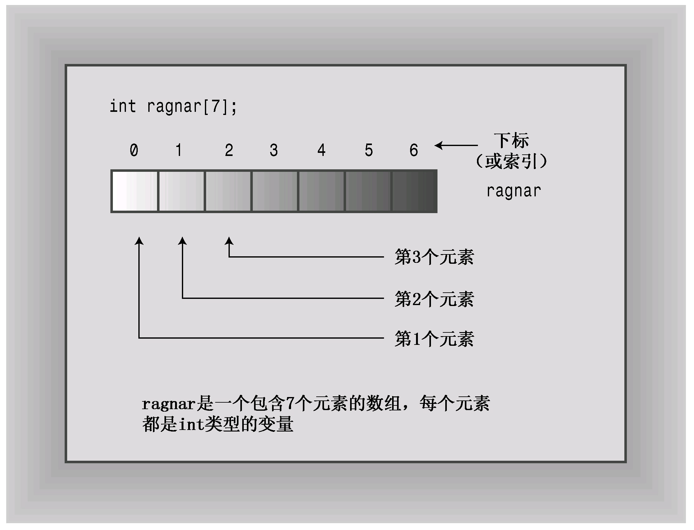
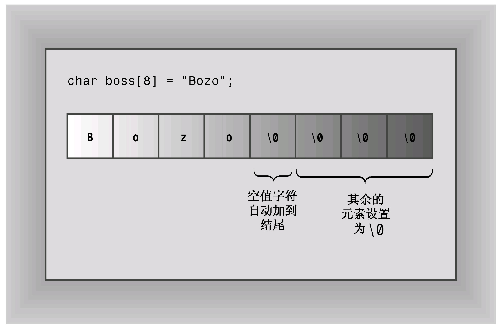
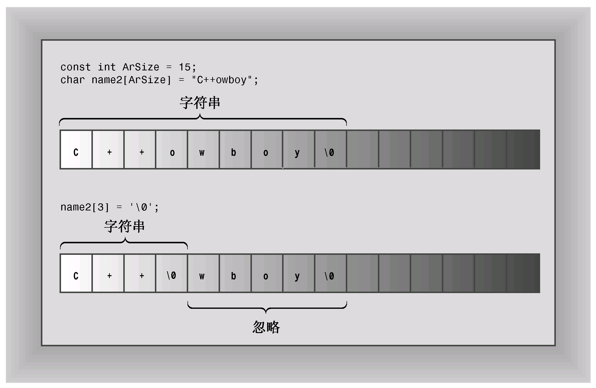
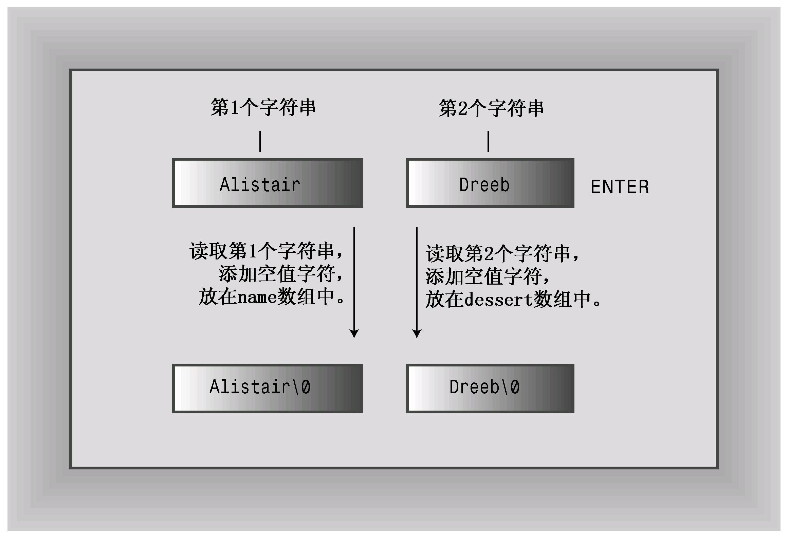
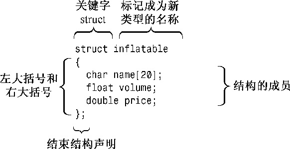
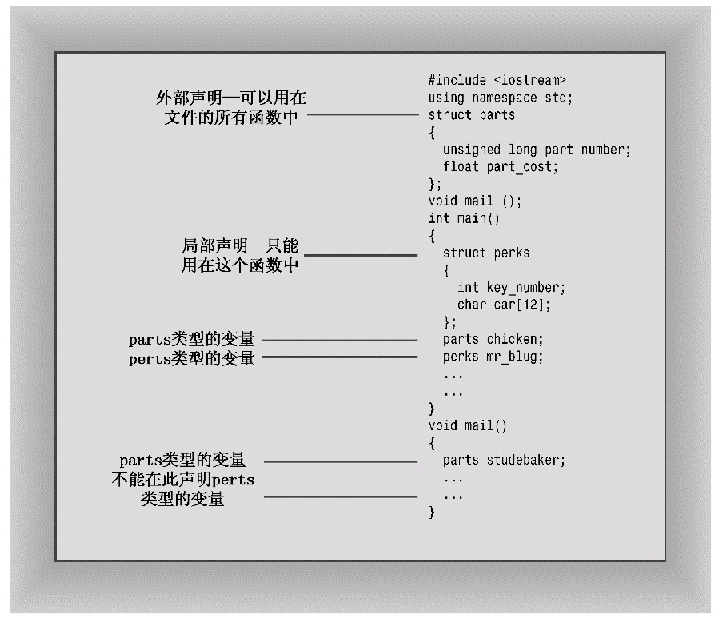
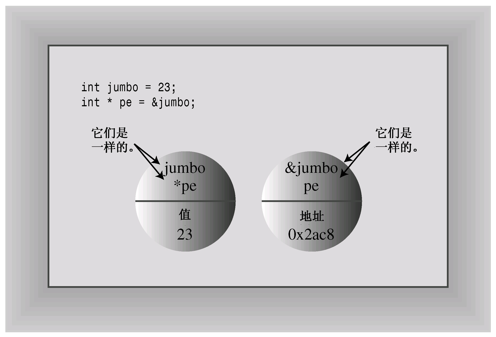
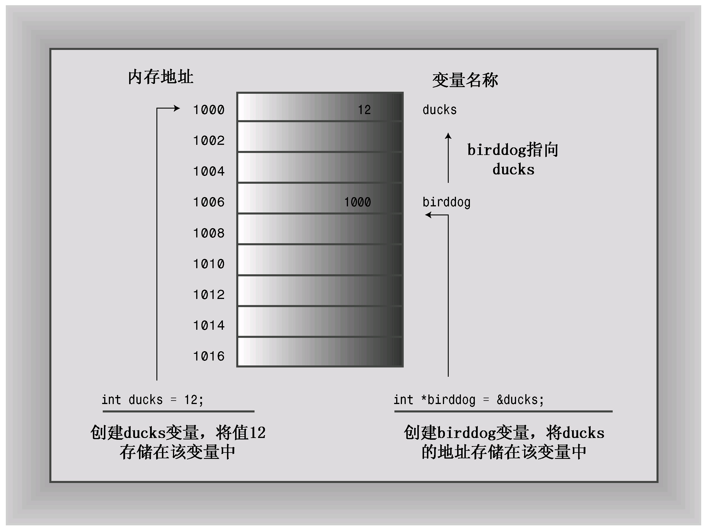
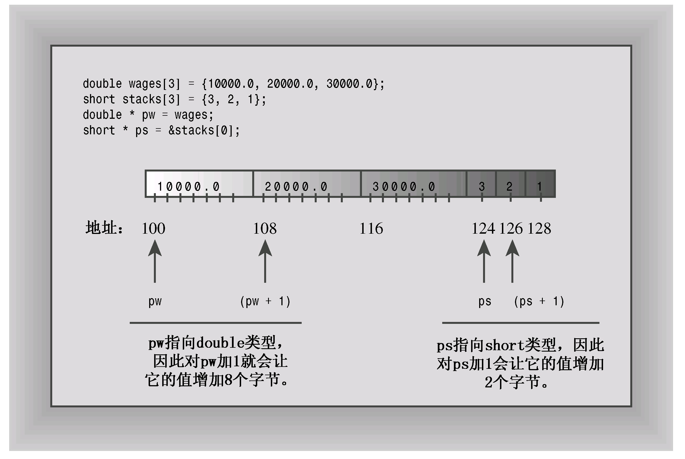
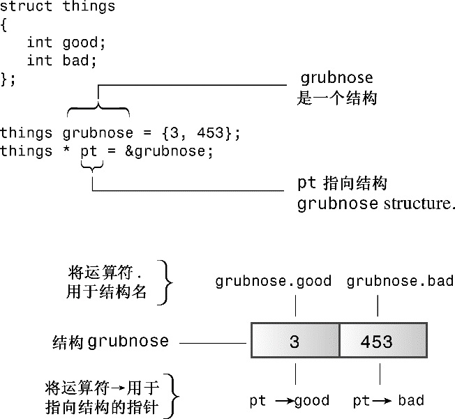

# 第4章 复合类型
本章内容包括：

* 创建和使用数组。
* 创建和使用C-风格字符串。
* 创建和使用string类字符串。
* 使用方法getline( )和get( )读取字符串。
* 混合输入字符串和数字。
* 创建和使用结构。
* 创建和使用共用体。
* 创建和使用枚举。
* 创建和使用指针。
* 使用new和delete管理动态内存。
* 创建动态数组。
* 创建动态结构。
* 自动存储、静态存储和动态存储。
* vector和array类简介。

假设您开发了一个名叫User-Hostile的计算机游戏，玩家需要用智慧来应对一个神秘、险恶的计算机界面。现在，必须编写一个程序来跟踪5年来游戏每月的销售量，或者希望盘点一下与黑客英雄累积的较量回合。您很快发现，需要一些比C++的简单基本类型更复杂的东西，才能满足这些数据的要求，C++也提供了这样的东西—复合类型。这种类型是基于基本整型和浮点类型创建的。影响最为深远的复合类型是类，它是将学习的OOP的堡垒。然而，C++还支持几种更普通的复合类型，它们都来自C语言。例如，数组可以存储多个同类型的值。一种特殊的数组可以存储字符串（一系列字符）。结构可以存储多个不同类型的值。而指针则是一种将数据所处位置告诉计算机的变量。本章将介绍所有这些复合类型（类除外），还将介绍new和delete及如何使用它们来管理数据。另外，还将简要地介绍string类，它提供了另一种处理字符串的途径。

## 4.1 数组
数组（array）是一种数据格式，能够存储多个同类型的值。例如，数组可以存储60个int类型的值（这些值表示游戏5年来的销售量）、12个short值（这些值表示每个月的天数）或365个float值（这些值指出一年中每天在食物方面的开销）。每个值都存储在一个独立的数组元素中，计算机在内存中依次存储数组的各个元素。

要创建数组，可使用声明语句。数组声明应指出以下三点：

* 存储在每个元素中的值的类型；
* 数组名；
* 数组中的元素数。

在C++中，可以通过修改简单变量的声明，添加中括号（其中包含元素数目）来完成数组声明。例如，下面的声明创建一个名为months的数组，该数组有12个元素，每个元素都可以存储一个short类型的值：
```c++
short months[12];       // creates array of 12 short
```

事实上，可以将数组中的每个元素看作是一个简单变量。

声明数组的通用格式如下：
```c++
typeName arrayName[arraySize];
```

表达式arraySize指定元素数目，它必须是整型常数（如10）或const值，也可以是常量表达式（如8 \* sizeof（int）），即其中所有的值在编译时都是已知的。具体地说，arraySize不能是变量，变量的值是在程序运行时设置的。然而，本章稍后将介绍如何使用new运算符来避开这种限制。

> **作为复合类型的数组**
> 
> 数组之所以被称为复合类型，是因为它是使用其他类型来创建的（C语言使用术语“派生类型”，但由于C++对类关系使用术语“派生”，所以它必须创建一个新术语）。不能仅仅将某种东西声明为数组，它必须是特定类型的数组。没有通用的数组类型，但存在很多特定的数组类型，如char数组或long数组。例如，请看下面的声明：
> ```c++
> float loans[20];
> ```
> 
> loans的类型不是“数组”，而是“float数组”。这强调了loans数组是使用float类型创建的。

数组的很多用途都是基于这样一个事实：可以单独访问数组元素。方法是使用下标或索引来对元素进行编号。C++数组从0开始编号（这没有商量的余地，必须从0开始。Pascal和BASIC用户必须调整习惯）。C++使用带索引的方括号表示法来指定数组元素。例如，months[0]是months数组的第一个元素，months[11]是最后一个元素。注意，最后一个元素的索引比数组长度小1（参见图4.1）。因此，数组声明能够使用一个声明创建大量的变量，然后便可以用索引来标识和访问各个元素。



> **有效下标值的重要性**
> 
> 编译器不会检查使用的下标是否有效。例如，如果将一个值赋给不存在的元素months[101]，编译器并不会指出错误。但是程序运行后，这种赋值可能引发问题，它可能破坏数据或代码，也可能导致程序异常终止。所以必须确保程序只使用有效的下标值。

程序清单4.1中的马铃薯分析程序说明了数组的一些属性，包括声明数组、给数组元素赋值以及初始化数组。

程序清单4.1 arrayone.cpp
```c++
// arrayone.cpp -- small arrays of integers
#include <iostream>
int main()
{
    using namespace std;
    int yams[3];    // creates array with three elements
    yams[0] = 7;    // assign value to first element
    yams[1] = 8;
    yams[2] = 6;

    int yamcosts[3] = {20, 30, 5}; // create, initialize array
// NOTE: If your C++ compiler or translator can't initialize
// this array, use static int yamcosts[3] instead of
// int yamcosts[3]

    cout << "Total yams = ";
    cout << yams[0] + yams[1] + yams[2] << endl;
    cout << "The package with " << yams[1] << " yams costs ";
    cout << yamcosts[1] << " cents per yam.\n";
    int total = yams[0] * yamcosts[0] + yams[1] * yamcosts[1];
    total = total + yams[2] * yamcosts[2];
    cout << "The total yam expense is " << total << " cents.\n";

    cout << "\nSize of yams array = " << sizeof yams;
    cout << " bytes.\n";
    cout << "Size of one element = " << sizeof yams[0];
    cout << " bytes.\n";

    return 0; 
}
```

下面是该程序的输出：
```c++
Total yams = 21
The package with 8 yams costs 30 cents per yam.
The total yam expense is 410 cents.

Size of yams array = 12 bytes.
Size of one element = 4 bytes.
```

### 4.1.1 程序说明
该程序首先创建一个名为yams的包含3个元素的数组。由于yams有3个元素，它们的编号为0～2，因此arrayone.cpp使用索引0～2分别给这三个元素赋值。Yam的每个元素都是int，都有int类型的权力和特权，因此arrayone.cpp能够将值赋给元素、将元素相加和相乘，并显示它们。

程序给yam的元素赋值时，绕了一个大弯。C++允许在声明语句中初始化数组元素。程序清单4.1使用这种捷径来给yamcosts数组赋值：
```c++
int yamcosts[3] = {20, 30, 5};
```

只需提供一个用逗号分隔的值列表（初始化列表），并将它们用花括号括起即可。列表中的空格是可选的。如果没有初始化函数中定义的数组，则其元素值将是不确定的，这意味着元素的值为以前驻留在该内存单元中的值。

接下来，程序使用数组值进行一些计算。程序的这部分由于包含了下标和括号，所以看上去有些混乱。第5章将介绍for循环，它可以提供一种功能强大的方法来处理数组，因而不用显式地书写每个索引。同时，我们仍然坚持使用小型数组。

您可能还记得，sizeof运算符返回类型或数据对象的长度（单位为字节）。注意，如果将sizeof运算符用于数组名，得到的将是整个数组中的字节数。但如果将sizeof用于数组元素，则得到的将是元素的长度（单位为字节）。这表明yams是一个数组，而yams[1]只是一个int变量。

### 4.1.2 数组的初始化规则
C++有几条关于初始化数组的规则，它们限制了初始化的时刻，决定了数组的元素数目与初始化器中值的数目不相同时将发生的情况。我们来看看这些规则。

只有在定义数组时才能使用初始化，此后就不能使用了，也不能将一个数组赋给另一个数组：
```c++
int cards[4] = {3, 6, 8, 10};       // okay
int hand[4];                        // okay
hand[4] = {5, 6, 7, 8};             // not allowed
hand = cards;                       // not allowed
```

然而，可以使用下标分别给数组中的元素赋值。

初始化数组时，提供的值可以少于数组的元素数目。例如，下面的语句只初始化hotelTips的前两个元素：
```c++
float hotelTips[5] = {5.0, 2.5};
```

如果只对数组的一部分进行初始化，则编译器将把其他元素设置为0。因此，将数组中所有的元素都初始化为0非常简单—只要显式地将第一个元素初始化为0，然后让编译器将其他元素都初始化为0即可：
```c++
long totals[500] = {0};
```

如果初始化为{1}而不是{0}，则第一个元素被设置为1，其他元素都被设置为0。

如果初始化数组时方括号内（[ ]）为空，C++编译器将计算元素个数。例如，对于下面的声明：
```c++
short things[] = {1, 5, 3, 8};
```

编译器将使things数组包含4个元素。

> **让编译器去做**
> 
> 通常，让编译器计算元素个数是种很糟的做法，因为其计数可能与您想象的不一样。例如，您可能不小心在列表中遗漏了一个值。然而，这种方法对于将字符数组初始化为一个字符串来说比较安全，很快您将明白这一点。如果主要关心的问题是程序，而不是自己是否知道数组的大小，则可以这样做：
> ```c++
> short things[] = {1, 5, 3, 8};
> int num_elements = sizeof things / sizeof (short);
> ```
> 
> 这样做是有用还是偷懒取决于具体情况。

### 4.1.3 C++11数组初始化方法
第3章说过，C++11将使用大括号的初始化（列表初始化）作为一种通用初始化方式，可用于所有类型。数组以前就可使用列表初始化，但C++11中的列表初始化新增了一些功能。

首先，初始化数组时，可省略等号（=）：
```c++
double earnings[4] {1.2e4, 1.6e4, 1.1e4, 1.7e4};    // okay with C++11
```

其次，可不在大括号内包含任何东西，这将把所有元素都设置为零：
```c++
unsigned int counts[10] = {};     // all elements set to 0
float balances[100] {};           // all elements set to 0
```

第三，列表初始化禁止缩窄转换，这在第3章介绍过：
```c++
long plifs[] = {25, 92, 3.0};             // not allowed
char slifs[4] {'h', 'i', 1122911, '\0'};  // not allowed
char tlifs[4] {'h', 'i', 112, '\0'};      // allowed
```

在上述代码中，第一条语句不能通过编译，因为将浮点数转换为整型是缩窄操作，即使浮点数的小数点后面为零。第二条语句也不能通过编译，因为1122011超出了char变量的取值范围（这里假设char变量的长度为8位）。第三条语句可通过编译，因为虽然112是一个int值，但它在char变量的取值范围内。

C++标准模板库（STL）提供了一种数组替代品—模板类vector，而C++11新增了模板类array。这些替代品比内置复合类型数组更复杂、更灵活，本章将简要地讨论它们，而第16章将更详细地讨论它们。

## 4.2 字符串
字符串是存储在内存的连续字节中的一系列字符。C++处理字符串的方式有两种。第一种来自C语言，常被称为C-风格字符串（C-style string）。本章将首先介绍它，然后介绍另一种基于string类库的方法。

存储在连续字节中的一系列字符意味着可以将字符串存储在char数组中，其中每个字符都位于自己的数组元素中。字符串提供了一种存储文本信息的便捷方式，如提供给用户的消息（“请告诉我您的瑞士银行账号”）或来自用户的响应（“您肯定在开玩笑”）。C-风格字符串具有一种特殊的性质：以空字符（null character）结尾，空字符被写作\0，其ASCII码为0，用来标记字符串的结尾。例如，请看下面两个声明：
```c++
char dog[8] = {'b', 'e', 'a', 'u', 'x', ' ', 'I', 'I'};       // not a string!
char cat[8] = {'f', 'a', 't', 'e', 's', 's', 'a', '\0'};      // a string!
```

这两个数组都是char数组，但只有第二个数组是字符串。空字符对C-风格字符串而言至关重要。例如，C++有很多处理字符串的函数，其中包括cout使用的那些函数。它们都逐个地处理字符串中的字符，直到到达空字符为止。如果使用cout显示上面的cat这样的字符串，则将显示前7个字符，发现空字符后停止。但是，如果使用cout显示上面的dog数组（它不是字符串），cout将打印出数组中的8个字母，并接着将内存中随后的各个字节解释为要打印的字符，直到遇到空字符为止。由于空字符（实际上是被设置为0的字节）在内存中很常见，因此这一过程将很快停止。但尽管如此，还是不应将不是字符串的字符数组当作字符串来处理。

在cat数组示例中，将数组初始化为字符串的工作看上去冗长乏味—使用大量单引号，且必须记住加上空字符。不必担心，有一种更好的、将字符数组初始化为字符串的方法—只需使用一个用引号括起的字符串即可，这种字符串被称为字符串常量（string constant）或字符串字面值（string literal），如下所示：
```c++
char bird[11] = "Mr.Cheeps";        // the \0 is understood
char fish[] = "Bubbles";            // let the compiler count
```

用引号括起的字符串隐式地包括结尾的空字符，因此不用显式地包括它（参见图4.2）。另外，各种C++输入工具通过键盘输入，将字符串读入到char数组中时，将自动加上结尾的空字符（如果在运行程序清单4.1中的程序时发现，必须使用关键字static来初始化数组，则初始化上述char数组时也必须使用该关键字）。

当然，应确保数组足够大，能够存储字符串中所有字符—包括空字符。使用字符串常量初始化字符数组是这样的一种情况，即让编译器计算元素数目更为安全。让数组比字符串长没有什么害处，只是会浪费一些空间而已。这是因为处理字符串的函数根据空字符的位置，而不是数组长度来进行处理。C++对字符串长度没有限制。

> **警告：**
> 
> 在确定存储字符串所需的最短数组时，别忘了将结尾的空字符计算在内。



注意，字符串常量（使用双引号）不能与字符常量（使用单引号）互换。字符常量（如'S'）是字符串编码的简写表示。在ASCII系统上，'S'只是83的另一种写法，因此，下面的语句将83赋给shirt_size：
```c++
char shirt_size = 'S';      // this is fine
```

但"S"不是字符常量，它表示的是两个字符（字符S和\0）组成的字符串。更糟糕的是，"S"实际上表示的是字符串所在的内存地址。因此下面的语句试图将一个内存地址赋给shirt_size：
```c++
char shirt_size = "S";      // illegal type mismatch
```

由于地址在C++中是一种独立的类型，因此C++编译器不允许这种不合理的做法（本章后面讨论指针后，将回过头来讨论这个问题）。

### 4.2.1 拼接字符串常量
有时候，字符串很长，无法放到一行中。C++允许拼接字符串字面值，即将两个用引号括起的字符串合并为一个。事实上，任何两个由空白（空格、制表符和换行符）分隔的字符串常量都将自动拼接成一个。因此，下面所有的输出语句都是等效的：
```c++
cout << "I'd give my right arm to be" " a great violinist.\n";
cout << "I'd give my right arm to be a great violinist.\n";
cout << "I'd give my right ar"
"m to be a great violinist.\n";
```

注意，拼接时不会在被连接的字符串之间添加空格，第二个字符串的第一个字符将紧跟在第一个字符串的最后一个字符（不考虑\0）后面。第一个字符串中的\0字符将被第二个字符串的第一个字符取代。

### 4.2.2 在数组中使用字符串
要将字符串存储到数组中，最常用的方法有两种—将数组初始化为字符串常量、将键盘或文件输入读入到数组中。程序清单4.2演示了这两种方法，它将一个数组初始化为用引号括起的字符串，并使用cin将一个输入字符串放到另一个数组中。该程序还使用了标准C语言库函数strlen( )来确定字符串的长度。标准头文件cstring（老式实现为string.h）提供了该函数以及很多与字符串相关的其他函数的声明。

程序清单4.2 string.cpp
```c++
// strings.cpp -- storing strings in an array
#include <iostream>
#include <cstring>  // for the strlen() function
int main()
{
    using namespace std;
    const int Size = 15;
    char name1[Size];               // empty array
    char name2[Size] = "C++owboy";  // initialized array
    // NOTE: some implementations may require the static keyword
    // to initialize the array name2

    cout << "Howdy! I'm " << name2;
    cout << "! What's your name?\n";
    cin >> name1;
    cout << "Well, " << name1 << ", your name has ";
    cout << strlen(name1) << " letters and is stored\n";
    cout << "in an array of " << sizeof(name1) << " bytes.\n";
    cout << "Your initial is " << name1[0] << ".\n";
    name2[3] = '\0';                // set to null character
    cout << "Here are the first 3 characters of my name: ";
    cout << name2 << endl;

    return 0;
}
```

下面是该程序的运行情况：
```c++
Howdy! I'm C++owboy! What's your name?
Basicman
Well, Basicman, your name has 8 letters and is stored
in an array of 15 bytes.
Your initial is B.
Here are the first 3 characters of my name: C++
```

> **程序说明**
> 
> 从程序清单4.2中可以学到什么呢？首先，sizeof运算符指出整个数组的长度：15字节，但strlen( )函数返回的是存储在数组中的字符串的长度，而不是数组本身的长度。另外，strlen( )只计算可见的字符，而不把空字符计算在内。因此，对于Basicman，返回的值为8，而不是9。如果cosmic是字符串，则要存储该字符串，数组的长度不能短于strlen（cosmic）+1。
> 
> 由于name1和name2是数组，所以可以用索引来访问数组中各个字符。例如，该程序使用name1[0]找到数组的第一个字符。另外，该程序将name2[3]设置为空字符。这使得字符串在第3个字符后即结束，虽然数组中还有其他的字符（参见图4.3）。

该程序使用符号常量来指定数组的长度。程序常常有多条语句使用了数组长度。使用符号常量来表示数组长度后，当需要修改程序以使用不同的数组长度时，工作将变得更简单—只需在定义符号常量的地方进行修改即可。



### 4.2.3 字符串输入
程序strings.cpp有一个缺陷，这种缺陷通过精心选择输入被掩盖掉了。程序清单4.3揭开了它的面纱，揭示了字符串输入的技巧。

程序清单4.3 instr1.cpp
```c++
// instr1.cpp -- reading more than one string
#include <iostream>
int main()
{
    using namespace std;
    const int ArSize = 20;
    char name[ArSize];
    char dessert[ArSize];

    cout << "Enter your name:\n";
    cin >> name;
    cout << "Enter your favorite dessert:\n";
    cin >> dessert;
    cout << "I have some delicious " << dessert;
    cout << " for you, " << name << ".\n";

    return 0; 
}
```

该程序的意图很简单：读取来自键盘的用户名和用户喜欢的甜点，然后显示这些信息。下面是该程序的运行情况：
```c++
Enter your name:
Alistair Dreeb
Enter your favorite dessert:
I have some delicious Dreeb for you, Alistair.
```

我们甚至还没有对“输入甜点的提示”作出反应，程序便把它显示出来了，然后立即显示最后一行。

cin是如何确定已完成字符串输入呢？由于不能通过键盘输入空字符，因此cin需要用别的方法来确定字符串的结尾位置。cin使用空白（空格、制表符和换行符）来确定字符串的结束位置，这意味着cin在获取字符数组输入时只读取一个单词。读取该单词后，cin将该字符串放到数组中，并自动在结尾添加空字符。

这个例子的实际结果是，cin把Alistair作为第一个字符串，并将它放到name数组中。这把Dreeb留在输入队列中。当cin在输入队列中搜索用户喜欢的甜点时，它发现了Dreeb，因此cin读取Dreeb，并将它放到dessert数组中（参见图4.4）。



另一个问题是，输入字符串可能比目标数组长（运行中没有揭示出来）。像这个例子一样使用cin，确实不能防止将包含30个字符的字符串放到20个字符的数组中的情况发生。

很多程序都依赖于字符串输入，因此有必要对该主题做进一步探讨。我们必须使用cin的较高级特性，这将在第17章介绍。

### 4.2.4 每次读取一行字符串输入
每次读取一个单词通常不是最好的选择。例如，假设程序要求用户输入城市名，用户输入New York或Sao Paulo。您希望程序读取并存储完整的城市名，而不仅仅是New或Sao。要将整条短语而不是一个单词作为字符串输入，需要采用另一种字符串读取方法。具体地说，需要采用面向行而不是面向单词的方法。幸运的是，istream中的类（如cin）提供了一些面向行的类成员函数：getline( )和get( )。这两个函数都读取一行输入，直到到达换行符。然而，随后getline( )将丢弃换行符，而get( )将换行符保留在输入序列中。下面详细介绍它们，首先介绍getline( )。

1. 面向行的输入：getline( )

getline( )函数读取整行，它使用通过回车键输入的换行符来确定输入结尾。要调用这种方法，可以使用cin.getline( )。该函数有两个参数。第一个参数是用来存储输入行的数组的名称，第二个参数是要读取的字符数。如果这个参数为20，则函数最多读取19个字符，余下的空间用于存储自动在结尾处添加的空字符。getline( )成员函数在读取指定数目的字符或遇到换行符时停止读取。

例如，假设要使用getline( )将姓名读入到一个包含20个元素的name数组中。可以使用这样的函数调用：
```c++
cin.getline(name, 20);
```

这将把一行读入到name数组中—如果这行包含的字符不超过19个。（getline( )成员函数还可以接受第三个可选参数，这将在第17章讨论。）

程序清单4.4将程序清单4.3修改为使用cin.getline( )，而不是简单的cin。除此之外，该程序没有做其他修改。

程序清单4.4 instr2.cpp
```c++
// instr2.cpp -- reading more than one word with getline
#include <iostream>
int main()
{
    using namespace std;
    const int ArSize = 20;
    char name[ArSize];
    char dessert[ArSize];

    cout << "Enter your name:\n";
    cin.getline(name, ArSize);  // reads through newline
    cout << "Enter your favorite dessert:\n";
    cin.getline(dessert, ArSize);
    cout << "I have some delicious " << dessert;
    cout << " for you, " << name << ".\n";

    return 0; 
}
```

下面是该程序的输出：
```c++
Enter your name:
Dirk Hammernose
Enter your favorite dessert:
Radish Torte
I have some delicious Radish Torte for you, Dirk Hammernose.
```

该程序现在可以读取完整的姓名以及用户喜欢的甜点！getline( )函数每次读取一行。它通过换行符来确定行尾，但不保存换行符。相反，在存储字符串时，它用空字符来替换换行符（参见图4.5）。

读取并替换换行符.png)

2. 面向行的输入：get( )

我们来试试另一种方法。istream类有另一个名为get( )的成员函数，该函数有几种变体。其中一种变体的工作方式与getline( )类似，它们接受的参数相同，解释参数的方式也相同，并且都读取到行尾。但get并不再读取并丢弃换行符，而是将其留在输入队列中。假设我们连续两次调用get( )：
```c++
cin.get(name, ArSize);
cin.get(dessert, ArSize);     // a problem
```

由于第一次调用后，换行符将留在输入队列中，因此第二次调用时看到的第一个字符便是换行符。因此get( )认为已到达行尾，而没有发现任何可读取的内容。如果不借助于帮助，get( )将不能跨过该换行符。

幸运的是，get( )有另一种变体。使用不带任何参数的cin.get( )调用可读取下一个字符（即使是换行符），因此可以用它来处理换行符，为读取下一行输入做好准备。也就是说，可以采用下面的调用序列：
```c++
cin.get(name, ArSize);        // read first line
cin.get();                    // read newline
cin.get(dessert, ArSize);     // read second line
```

另一种使用get( )的方式是将两个类成员函数拼接起来（合并），如下所示：
```c++
cin.get(name, ArSize).get();    // concatenate member functions
```

之所以可以这样做，是由于cin.get（name，ArSize）返回一个cin对象，该对象随后将被用来调用get( )函数。同样，下面的语句将把输入中连续的两行分别读入到数组name1和name2 中，其效果与两次调用cin.getline( )相同：
```c++
cin.getline(name1, ArSize).getline(name2, ArSize);
```

程序清单4.5采用了拼接方式。第11章将介绍如何在类定义中使用这项特性。

程序清单4.5 instr3.cpp
```c++
// instr3.cpp -- reading more than one word with get() & get()
#include <iostream>
int main()
{
    using namespace std;
    const int ArSize = 20;
    char name[ArSize];
    char dessert[ArSize];

    cout << "Enter your name:\n";
    cin.get(name, ArSize).get();    // read string, newline
    cout << "Enter your favorite dessert:\n";
    cin.get(dessert, ArSize).get();
    cout << "I have some delicious " << dessert;
    cout << " for you, " << name << ".\n";

    return 0; 
}
```

下面是程序清单4.5中程序的运行情况：
```c++
Enter your name:
Mai Parfait
Enter your favorite dessert:
Chocolate Mousse
I have some delicious Chocolate Mousse for you, Mai Parfait.
```

需要指出的一点是，C++允许函数有多个版本，条件是这些版本的参数列表不同。如果使用的是cin.get（name，ArSize），则编译器知道是要将一个字符串放入数组中，因而将使用适当的成员函数。如果使用的是cin.get( )，则编译器知道是要读取一个字符。第8章将探索这种特性—函数重载。

为什么要使用get( )，而不是getline( )呢？首先，老式实现没有getline( )。其次，get( )使输入更仔细。例如，假设用get( )将一行读入数组中。如何知道停止读取的原因是由于已经读取了整行，而不是由于数组已填满呢？查看下一个输入字符，如果是换行符，说明已读取了整行；否则，说明该行中还有其他输入。第17章将介绍这种技术。总之，getline( )使用起来简单一些，但get( )使得检查错误更简单些。可以用其中的任何一个来读取一行输入；只是应该知道，它们的行为稍有不同。

3. 空行和其他问题

当getline( )或get( )读取空行时，将发生什么情况？最初的做法是，下一条输入语句将在前一条getline( )或get( )结束读取的位置开始读取；但当前的做法是，当get( )（不是getline( )）读取空行后将设置失效位（failbit）。这意味着接下来的输入将被阻断，但可以用下面的命令来恢复输入：
```c++
cin.clear();
```

另一个潜在的问题是，输入字符串可能比分配的空间长。如果输入行包含的字符数比指定的多，则getline( )和get( )将把余下的字符留在输入队列中，而getline( )还会设置失效位，并关闭后面的输入。

第5、6章和第17章将介绍这些属性，并探讨程序如何避免这些问题。

### 4.2.5 混合输入字符串和数字
混合输入数字和面向行的字符串会导致问题。请看程序清单4.6中的简单程序。

程序清单4.6 numstr.cpp
```c++
// numstr.cpp -- following number input with line input
#include <iostream>
int main()
{
    using namespace std;
    cout << "What year was your house built?\n";
    int year;
    cin >> year;

    cout << "What is its street address?\n";
    char address[80];
    cin.getline(address, 80);
    cout << "Year built: " << year << endl;
    cout << "Address: " << address << endl;
    cout << "Done!\n";

    return 0; 
}
```

该程序的运行情况如下：
```c++
What year was your house built?
1966
What is its street address?
Year built: 1966
Address:
Done!
```

用户根本没有输入地址的机会。问题在于，当cin读取年份，将回车键生成的换行符留在了输入队列中。后面的cin.getline( )看到换行符后，将认为是一个空行，并将一个空字符串赋给address数组。解决之道是，在读取地址之前先读取并丢弃换行符。这可以通过几种方法来完成，其中包括使用没有参数的get( )和使用接受一个char参数的get( )，如前面的例子所示。可以单独进行调用：
```c++
cin >> year;
cin.get();    // or cin.get(ch);
```

也可以利用表达式cin>>year返回cin对象，将调用拼接起来：
```c++
(cin >> year).get();    // or (cin >> year).get(ch);
```

按上述任何一种方法修改程序清单4.6后，它便可以正常工作：
```c++
What year was your house built?
1966
What is its street address?
43821 Unsigned Short Street
Year built: 1966
Address: 43821 Unsigned Short Street
Done!
```

C++程序常使用指针（而不是数组）来处理字符串。我们将在介绍指针后，再介绍字符串这个方面的特性。下面介绍一种较新的处理字符串的方式：C++ string类。

## 4.3 string类简介
ISO/ANSI C++98标准通过添加string类扩展了C++库，因此现在可以string类型的变量（使用C++的话说是对象）而不是字符数组来存储字符串。您将看到，string类使用起来比数组简单，同时提供了将字符串作为一种数据类型的表示方法。

要使用string类，必须在程序中包含头文件string。string类位于名称空间std中，因此您必须提供一条using编译指令，或者使用std::string来引用它。string类定义隐藏了字符串的数组性质，让您能够像处理普通变量那样处理字符串。程序清单4.7说明了string对象与字符数组之间的一些相同点和不同点。

程序清单4.7 strtype1.cpp
```c++
// strtype1.cpp -- using the C++ string class
#include <iostream>
#include <string>               // make string class available
int main()
{
    using namespace std;
    char charr1[20];            // create an empty array
    char charr2[20] = "jaguar"; // create an initialized array
    string str1;                // create an empty string object
    string str2 = "panther";    // create an initialized string

    cout << "Enter a kind of feline: ";
    cin >> charr1;
    cout << "Enter another kind of feline: ";
    cin >> str1;                // use cin for input
    cout << "Here are some felines:\n";
    cout << charr1 << " " << charr2 << " "
         << str1 << " " << str2 // use cout for output
         << endl;
    cout << "The third letter in " << charr2 << " is "
         << charr2[2] << endl;
    cout << "The third letter in " << str2 << " is "
         << str2[2] << endl;    // use array notation

    return 0; 
}
```

下面是该程序的运行情况：
```c++
Enter a kind of feline: ocelot
Enter another kind of feline: tiger
Here are some felines:
ocelot jaguar tiger panther
The third letter in jaguar is g
The third letter in panther is n
```

从这个示例可知，在很多方面，使用string对象的方式与使用字符数组相同。

* 可以使用C-风格字符串来初始化string对象。
* 可以使用cin来将键盘输入存储到string对象中。
* 可以使用cout来显示string对象。
* 可以使用数组表示法来访问存储在string对象中的字符。

程序清单4.7表明，string对象和字符数组之间的主要区别是，可以将string对象声明为简单变量，而不是数组：
```c++
string str1;                // create an empty string object
string str2 = "panther";    // create an initialized string
```

类设计让程序能够自动处理string的大小。例如，str1的声明创建一个长度为0的string对象，但程序将输入读取到str1中时，将自动调整str1的长度：
```c++
cin >> str1;      // str1 resized to fit input
```

这使得与使用数组相比，使用string对象更方便，也更安全。从理论上说，可以将char数组视为一组用于存储一个字符串的char存储单元，而string类变量是一个表示字符串的实体。

### 4.3.1 C++11字符串初始化
正如您预期的，C++11也允许将列表初始化用于C-风格字符串和string对象：
```c++
char first_date[] = {"Le Chapon Dodu"};
char second_date[] {"The Elegant Plate"};
string third_date = {"The Bread Bowl"};
string fourth_date {"Hank's Fine Eats"};
```

### 4.3.2 赋值、拼接和附加
使用string类时，某些操作比使用数组时更简单。例如，不能将一个数组赋给另一个数组，但可以将一个string对象赋给另一个string对象：
```c++
char charr1[20];                      // create an empty array
char charr2[20] = "jaguar";           // create an initialized array
string str1;                          // create an empty string object
string str2 = "panther";              // create an initialized string
charr1 = charr2;                      // INVALID, no array assignment
str1 = str2;                          // VALID, object assignment ok
```

string类简化了字符串合并操作。可以使用运算符+将两个string对象合并起来，还可以使用运算符+=将字符串附加到string对象的末尾。继续前面的代码，您可以这样做：
```c++
string str3;
str3 = str1 + str2;     // assign str3 the joined strings
str1 += str2;           // add str2 to the end of str1
```

程序清单4.8演示了这些用法。可以将C-风格字符串或string对象与string对象相加，或将它们附加到string对象的末尾。

程序清单4.8 strtype2.cpp
```c++
// strtype2.cpp –- assigning, adding, and appending
#include <iostream>
#include <string>               // make string class available
int main()
{
    using namespace std;
    string s1 = "penguin";
    string s2, s3;

    cout << "You can assign one string object to another: s2 = s1\n";
    s2 = s1;
    cout << "s1: " << s1 << ", s2: " << s2 << endl;
    cout << "You can assign a C-style string to a string object.\n";
    cout << "s2 = \"buzzard\"\n";
    s2 = "buzzard";
    cout << "s2: " << s2 << endl;
    cout << "You can concatenate strings: s3 = s1 + s2\n";
    s3 = s1 + s2;
    cout << "s3: " << s3 << endl;
    cout << "You can append strings.\n";
    s1 += s2;
    cout <<"s1 += s2 yields s1 = " << s1 << endl;
    s2 += " for a day";
    cout <<"s2 += \" for a day\" yields s2 = " << s2 << endl;

    return 0; 
}
```

转义序列\"表示双引号，而不是字符串结尾。该程序的输出如下：
```c++
You can assign one string object to another: s2 = s1
s1: penguin, s2: penguin
You can assign a C-style string to a string object.
s2 = "buzzard"
s2: buzzard
You can concatenate strings: s3 = s1 + s2
s3: penguinbuzzard
You can append strings.
s1 += s2 yields s1 = penguinbuzzard
s2 += " for a day" yields s2 = buzzard for a day
```

### 4.3.3 string类的其他操作
在C++新增string类之前，程序员也需要完成诸如给字符串赋值等工作。对于C-风格字符串，程序员使用C语言库中的函数来完成这些任务。头文件cstring（以前为string.h）提供了这些函数。例如，可以使用函数strcpy( )将字符串复制到字符数组中，使用函数strcat( )将字符串附加到字符数组末尾：
```c++
strcpy(charr1, charr2);     // copy charr2 to charr1
strcat(charr1, charr2);     // append contents of charr2 to char1
```

程序清单4.9对用于string对象的技术和用于字符数组的技术进行了比较。

程序清单4.9 strtype3.cpp
```c++
// strtype3.cpp -- more string class features
#include <iostream>
#include <string>               // make string class available
#include <cstring>              // C-style string library
int main()
{
    using namespace std;
    char charr1[20]; 
    char charr2[20] = "jaguar"; 
    string str1;  
    string str2 = "panther";

    // assignment for string objects and character arrays
    str1 = str2;                // copy str2 to str1
    strcpy(charr1, charr2);     // copy charr2 to charr1
 
    // appending for string objects and character arrays
    str1 += " paste";           // add paste to end of str1
    strcat(charr1, " juice");   // add juice to end of charr1

    // finding the length of a string object and a C-style string
    int len1 = str1.size();     // obtain length of str1
    int len2 = strlen(charr1);  // obtain length of charr1
 
    cout << "The string " << str1 << " contains "
         << len1 << " characters.\n";
    cout << "The string " << charr1 << " contains "
         << len2 << " characters.\n";

    return 0; 
}
```

下面是该程序的输出：
```c++
The string panther paste contains 13 characters.
The string jaguar juice contains 12 characters.
```

处理string对象的语法通常比使用C字符串函数简单，尤其是执行较为复杂的操作时。例如，对于下述操作：
```c++
str3 = str1 + str2;
```

使用C-风格字符串时，需要使用的函数如下：
```c++
strcpy(charr3, charr1);
strcat(charr3, charr1);
```

另外，使用字符数组时，总是存在目标数组过小，无法存储指定信息的危险，如下面的示例所示：
```c++
char site[10] = "house";
strcat(site, " of pancakes");    // memory problem
```

函数strcat( )试图将全部12个字符复制到数组site中，这将覆盖相邻的内存。这可能导致程序终止，或者程序继续运行，但数据被损坏。string类具有自动调整大小的功能，从而能够避免这种问题发生。C函数库确实提供了与strcat( )和strcpy( )类似的函数—strncat( )和strncpy( )，它们接受指出目标数组最大允许长度的第三个参数，因此更为安全，但使用它们进一步增加了编写程序的复杂度。

下面是两种确定字符串中字符数的方法：
```c++
int len1 = str1.size();       // obtain length of str1
int len2 = strlen(charr1);    // obtain length of charr1
```

函数strlen( )是一个常规函数，它接受一个C-风格字符串作为参数，并返回该字符串包含的字符数。函数size( )的功能基本上与此相同，但句法不同：str1不是被用作函数参数，而是位于函数名之前，它们之间用句点连接。与第3章介绍的put( )方法相同，这种句法表明，str1是一个对象，而size( )是一个类方法。方法是一个函数，只能通过其所属类的对象进行调用。在这里，str1是一个string对象，而size( )是string类的一个方法。总之，C函数使用参数来指出要使用哪个字符串，而C++ string类对象使用对象名和句点运算符来指出要使用哪个字符串。

### 4.3.4 string类I/O
正如您知道的，可以使用cin和运算符<<来将输入存储到string对象中，使用cout和运算符<<来显示string对象，其句法与处理C-风格字符串相同。但每次读取一行而不是一个单词时，使用的句法不同，程序清单4.10说明了这一点。

程序清单4.10 strtype4.cpp
```c++
// strtype4.cpp -- line input
#include <iostream>
#include <string>               // make string class available
#include <cstring>              // C-style string library
int main()
{
    using namespace std;
    char charr[20]; 
    string str;

    cout << "Length of string in charr before input: " 
         << strlen(charr) << endl;
    cout << "Length of string in str before input: "
         << str.size() << endl;
    cout << "Enter a line of text:\n";
    cin.getline(charr, 20);     // indicate maximum length
    cout << "You entered: " << charr << endl;
    cout << "Enter another line of text:\n";
    getline(cin, str);          // cin now an argument; no length specifier
    cout << "You entered: " << str << endl;
    cout << "Length of string in charr after input: " 
         << strlen(charr) << endl;
    cout << "Length of string in str after input: "
         << str.size() << endl;

    return 0; 
}
```

下面是一个运行该程序时的输出示例：
```c++
Length of string in charr before input: 27
Length of string in str before input: 0
Enter a line of text:
peanut butter
You entered: peanut butter
Enter another line of text:
blueberry jam
You entered: blueberry jam
Length of string in charr after input: 13
Length of string in str after input: 13
```

在用户输入之前，该程序指出数组charr中的字符串长度为27，这比该数组的长度要大。这里要两点需要说明。首先，为初始化的数组的内容是未定义的；其次，函数strlen( )从数组的第一个元素开始计算字节数，直到遇到空字符。在这个例子中，在数组末尾的几个字节后才遇到空字符。对于未被初始化的数据，第一个空字符的出现位置是随机的，因此您在运行该程序时，得到的数组长度很可能与此不同。

另外，用户输入之前，str中的字符串长度为0。这是因为未被初始化的string对象的长度被自动设置为0。

下面是将一行输入读取到数组中的代码：
```c++
cin.getline(charr, 20);
```

这种句点表示法表明，函数getline( )是istream类的一个类方法（还记得吗，cin是一个istream对象）。正如前面指出的，第一个参数是目标数组；第二个参数数组长度，getline( )使用它来避免超越数组的边界。

下面是将一行输入读取到string对象中的代码：
```c++
getline(cin, str);
```

这里没有使用句点表示法，这表明这个getline( )不是类方法。它将cin作为参数，指出到哪里去查找输入。另外，也没有指出字符串长度的参数，因为string对象将根据字符串的长度自动调整自己的大小。

那么，为何一个getline( )是istream的类方法，而另一个不是呢？在引入string类之前很久，C++就有istream类。因此istream的设计考虑到了诸如double和int等基本C++数据类型，但没有考虑string类型，所以istream类中，有处理double、int和其他基本类型的类方法，但没有处理string对象的类方法。

由于istream类中没有处理string对象的类方法，因此您可能会问，下述代码为何可行呢？
```c++
cin >> str;     // read a word into the str string object
```

像下面这样的代码使用istream类的一个成员函数：
```c++
cin >> x;       // read a value into a basic C++ type
```

但前面处理string对象的代码使用string类的一个友元函数。有关友元函数及这种技术为何可行，将在第11章介绍。另外，您可以将cin和cout用于string对象，而不用考虑其内部工作原理。

### 4.3.5 其他形式的字符串字面值
本书前面说过，除char类型外，C++还有类型wchar_t；而C++11新增了类型char16_t和char32_t。可创建这些类型的数组和这些类型的字符串字面值。对于这些类型的字符串字面值，C++分别使用前缀L、u和U表示，下面是一个如何使用这些前缀的例子：
```c++
wchar_t title[] = L"Chief Astrogator";      // wchar_t string
char16_t name[] = u"Felonia Ripova";        // char16_t string
char32_t car[] = U"Humber Super Snipe";     // char32_t string
```

C++11还支持Unicode字符编码方案UTF-8。在这种方案中，根据编码的数字值，字符可能存储为1～4个八位组。C++使用前缀u8来表示这种类型的字符串字面值。

C++11新增的另一种类型是原始（raw）字符串。在原始字符串中，字符表示的就是自己，例如，序列\n不表示换行符，而表示两个常规字符—斜杠和n，因此在屏幕上显示时，将显示这两个字符。另一个例子是，可在字符串中使用"，而无需像程序清单4.8中那样使用繁琐的\"。当然，既然可在字符串字面量包含"，就不能再使用它来表示字符串的开头和末尾。因此，原始字符串将"(和)"用作定界符，并使用前缀R来标识原始字符串：
```c++
cout << R"(Jim "King" Tutt uses "\n" instead of endl.)" << '\n';
```

上述代码将显示如下内容：
```c++
Jim "King" Tutt uses "\n" instead of endl.
```

如果使用标准字符串字面值，将需编写如下代码：
```c++
cout << "Jim \"King\" Tutt uses \"\\n\" instead of endl." << '\n';
```

在上述代码中，使用了\来显示\，因为单个\表示转义序列的第一个字符。

输入原始字符串时，按回车键不仅会移到下一行，还将在原始字符串中添加回车字符。

如果要在原始字符串中包含)"，该如何办呢？编译器见到第一个)"时，会不会认为字符串到此结束？会的。但原始字符串语法允许您在表示字符串开头的"和(之间添加其他字符，这意味着表示字符串结尾的"和)之间也必须包含这些字符。因此，使用R"+*(标识原始字符串的开头时，必须使用)+*"标识原始字符串的结尾。因此，下面的语句：
```c++
cout << R"+*("(Who would't?)", she whispered.)+*" << endl;
```

将显示如下内容：
```c++
"(Who would't?)", she whispered.
```

总之，这使用"+\*(和)+\*"替代了默认定界符"(和)"。自定义定界符时，在默认定界符之间添加任意数量的基本字符，但空格、左括号、右括号、斜杠和控制字符（如制表符和换行符）除外。

可将前缀R与其他字符串前缀结合使用，以标识wchar_t等类型的原始字符串。可将R放在前面，也可将其放在后面，如Ru、UR等。

下面介绍另一种复合类型—结构。

## 4.4 结构简介
假设要存储有关篮球运动员的信息，则可能需要存储他（她）的姓名、工资、身高、体重、平均得分、命中率、助攻次数等。希望有一种数据格式可以将所有这些信息存储在一个单元中。数组不能完成这项任务，因为虽然数组可以存储多个元素，但所有元素的类型必须相同。也就是说，一个数组可以存储20个int，另一个数组可以存储10个float，但同一个数组不能在一些元素中存储int，在另一些元素中存储float。

C++中的结构的可以满足要求（存储篮球运动员的信息）。结构是一种比数组更灵活的数据格式，因为同一个结构可以存储多种类型的数据，这使得能够将有关篮球运动员的信息放在一个结构中，从而将数据的表示合并到一起。如果要跟踪整个球队，则可以使用结构数组。结构也是C++ OOP堡垒（类）的基石。学习有关结构的知识将使我们离C++的核心OOP更近。

结构是用户定义的类型，而结构声明定义了这种类型的数据属性。定义了类型后，便可以创建这种类型的变量。因此创建结构包括两步。首先，定义结构描述—它描述并标记了能够存储在结构中的各种数据类型。然后按描述创建结构变量（结构数据对象）。

例如，假设Bloataire公司要创建一种类型来描述其生产线上充气产品的成员。具体地说，这种类型应存储产品名称、容量（单位为立方英尺）和售价。下面的结构描述能够满足这些要求：
```c++
struct inflatable   // structure declaration
{
    char name[20];
    float volume;
    double price;
}
```

关键字struct表明，这些代码定义的是一个结构的布局。标识符inflatable是这种数据格式的名称，因此新类型的名称为inflatable。这样，便可以像创建char或int类型的变量那样创建inflatable类型的变量了。接下来的大括号中包含的是结构存储的数据类型的列表，其中每个列表项都是一条声明语句。这个例子使用了一个适合用于存储字符串的char数组、一个float和一个double。列表中的每一项都被称为结构成员，因此infatable结构有3个成员（参见图4.6）。总之，结构定义指出了新类型（这里是inflatable）的特征。



定义结构后，便可以创建这种类型的变量了：
```c++
inflatable hat;             // hat is a structure variable of type inflatable
inflatable woopie_cushion;  // type inflatable variable
inflatable mainframe;       // type inflatable variable
```

如果您熟悉C语言中的结构，则可能已经注意到了，C++允许在声明结构变量时省略关键字struct：
```c++
struct inflatable goose;    // keyword struct required in C
inflatable vincent;         // keyword struct not required in C++
```

在C++中，结构标记的用法与基本类型名相同。这种变化强调的是，结构声明定义了一种新类型。在C++中，省略struct不会出错。

由于hat的类型为inflatable，因此可以使用成员运算符（.）来访问各个成员。例如，hat.volume指的是结构的volume成员，hat.price指的是price成员。同样，vincent.price是vincent变量的price成员。总之，通过成员名能够访问结构的成员，就像通过索引能够访问数组的元素一样。由于price成员被声明为double类型，因此hat.price和vincent.price相当于是double类型的变量，可以像使用常规double变量那样来使用它们。总之，hat是一个结构，而hat.price是一个double变量。顺便说一句，访问类成员函数（如cin.getline( )）的方式是从访问结构成员变量（如vincent.price）的方式衍生而来的。

### 4.4.1 在程序中使用结构
介绍结构的主要特征后，下面在一个使用结构的程序中使用这些概念。程序清单4.11说明了有关结构的这些问题，还演示了如何初始化结构。

程序清单4.11 structur.cpp
```c++
// structur.cpp -- a simple structure
#include <iostream>
struct inflatable   // structure declaration
{
    char name[20];
    float volume;
    double price;
};

int main()
{
    using namespace std;
    inflatable guest =
    {
        "Glorious Gloria",  // name value
        1.88,               // volume value
        29.99               // price value
    };  // guest is a structure variable of type inflatable
// It's initialized to the indicated values
    inflatable pal =
    {
        "Audacious Arthur",
        3.12,
        32.99
    };  // pal is a second variable of type inflatable
// NOTE: some implementations require using
// static inflatable guest =

    cout << "Expand your guest list with " << guest.name;
    cout << " and " << pal.name << "!\n";
// pal.name is the name member of the pal variable
    cout << "You can have both for $";
    cout << guest.price + pal.price << "!\n";

    return 0; 
}
```

下面是该程序的输出：
```c++
Expand your guest list with Glorious Gloria and Audacious Arthur!
You can have both for $62.98!
```

程序说明

结构声明的位置很重要。对于structur.cpp而言，有两种选择。可以将声明放在main( )函数中，紧跟在开始括号的后面。另一种选择是将声明放到main( )的前面，这里采用的便是这种方式，位于函数外面的声明被称为外部声明。对于这个程序来说，两种选择之间没有实际区别。但是对于那些包含两个或更多函数的程序来说，差别很大。外部声明可以被其后面的任何函数使用，而内部声明只能被该声明所属的函数使用。通常应使用外部声明，这样所有函数都可以使用这种类型的结构（参见图4.7）。



变量也可以在函数内部和外部定义，外部变量由所有的函数共享（这将在第9章做更详细的介绍）。C++不提倡使用外部变量，但提倡使用外部结构声明。另外，在外部声明符号常量通常更合理。

接下来，请注意初始化方式：
```c++
inflatable guest =
{
    "Glorious Gloria",  // name value
    1.88,               // volume value
    29.99               // price value
};
```

和数组一样，使用由逗号分隔值列表，并将这些值用花括号括起。在该程序中，每个值占一行，但也可以将它们全部放在同一行中。只是应用逗号将它们分开：
```c++
inflatable duck = {"Daphne", 0.12, 9.98};
```

可以将结构的每个成员都初始化为适当类型的数据。例如，name成员是一个字符数组，因此可以将其初始化为一个字符串。

可将每个结构成员看作是相应类型的变量。因此，pal.price是一个double变量，而pal.name是一个char数组。当程序使用cout显示pal.name时，将把该成员显示为字符串。另外，由于pal.name是一个字符数组，因此可以用下标来访问其中的各个字符。例如，pal.name[0]是字符A。不过pal[0]没有意义，因为pal是一个结构，而不是数组。

### 4.4.2 C++11结构初始化
与数组一样，C++11也支持将列表初始化用于结构，且等号（=）是可选的：
```c++
inflatable duck {"Daphne", 0.12, 9.98};   // can omit the = in C++11
```

其次，如果大括号内未包含任何东西，各个成员都将被设置为零。例如，下面的声明导致mayor.volume和mayor.price被设置为零，且mayor.name的每个字节都被设置为零：
```c++
inflatable mayor {};
```

最后，不允许缩窄转换。

### 4.4.3 结构可以将string类作为成员吗
可以将成员name指定为string对象而不是字符数组吗？即可以像下面这样声明结构吗？
```c++
#include <string>
struct inflatable   // structure declaration
{
    std::string name;
    float volume;
    double price;
};
```

答案是肯定的，只要您使用的编译器支持对以string对象作为成员的结构进行初始化。

一定要让结构定义能够访问名称空间std。为此，可以将编译指令using移到结构定义之前；也可以像前面那样，将name的类型声明为std::string。

### 4.4.4 其他结构属性
C++使用户定义的类型与内置类型尽可能相似。例如，可以将结构作为参数传递给函数，也可以让函数返回一个结构。另外，还可以使用赋值运算符（=）将结构赋给另一个同类型的结构，这样结构中每个成员都将被设置为另一个结构中相应成员的值，即使成员是数组。这种赋值被称为成员赋值（memberwise assignment），将在第7章讨论函数时再介绍如何传递和返回结构。下面简要地介绍一下结构赋值，程序清单4.12是一个这样的示例。

程序清单4.12 assgn_st.cpp
```c++
// assgn_st.cpp -- assigning structures
#include <iostream>
struct inflatable
{
    char name[20];
    float volume;
    double price;
};
int main()
{
    using namespace std;
    inflatable bouquet =
    {
        "sunflowers",
        0.20,
        12.49
    };
    inflatable choice;
    cout << "bouquet: " << bouquet.name << " for $";
    cout << bouquet.price << endl;

    choice = bouquet;  // assign one structure to another
    cout << "choice: " << choice.name << " for $";
    cout << choice.price << endl;

    return 0; 
}
```

下面是该程序的输出：
```c++
bouquet: sunflowers for $12.49
choice: sunflowers for $12.49
```

从中可以看出，成员赋值是有效的，因为choice结构的成员值与bouquet结构中存储的值相同。

可以同时完成定义结构和创建结构变量的工作。为此，只需将变量名放在结束括号的后面即可：
```c++
struct perks
{
    int key_number;
    char car[12];
} mr_smith, ms_jones;   // two perks variables
```

甚至可以初始化以这种方式创建的变量：
```c++
struct perks
{
    int key_number;
    char car[12];
} mr_glitz = 
{
    7,        // value for mr_glitz.key_number member
    "Packard" // value for mr_glitz.car member
}
```

然而，将结构定义和变量声明分开，可以使程序更易于阅读和理解。

还可以声明没有名称的结构类型，方法是省略名称，同时定义一种结构类型和一个这种类型的变量：
```c++
struct      // no tag
{
    int x;  // 2 members
    int y;
} position; // a structure variable
```

这样将创建一个名为position的结构变量。可以使用成员运算符来访问它的成员（如position.x），但这种类型没有名称，因此以后无法创建这种类型的变量。本书将不使用这种形式的结构。

除了C++程序可以使用结构标记作为类型名称外，C结构具有到目前为止讨论的C++结构的所有特性（C++11特性除外），但C++结构的特性更多。例如，与C结构不同，C++结构除了成员变量之外，还可以有成员函数。但这些高级特性通常被用于类中，而不是结构中，因此将在讨论类的时候（从第10章开始）介绍它们。

### 4.4.5 结构数组
inflatable结构包含一个数组（name）。也可以创建元素为结构的数组，方法和创建基本类型数组完全相同。例如，要创建一个包含100个inflatable结构的数组，可以这样做：
```c++
inflatable gifts[100];    // array of 100 inflatable structures
```

这样，gifts将是一个inflatable数组，其中的每个元素（如gifts[0]或gifts[99]）都是inflatable对象，可以与成员运算符一起使用：
```c++
cin >> gifts[0].volume;           // use volume member of first struct
cout << gifts[99].price << endl;  // display price member of last struct
```

记住，gifts本身是一个数组，而不是结构，因此像gifts.price这样的表述是无效的。

要初始化结构数组，可以结合使用初始化数组的规则（用逗号分隔每个元素的值，并将这些值用花括号括起）和初始化结构的规则（用逗号分隔每个成员的值，并将这些值用花括号括起）。由于数组中的每个元素都是结构，因此可以使用结构初始化的方式来提供它的值。因此，最终结果为一个被括在花括号中、用逗号分隔的值列表，其中每个值本身又是一个被括在花括号中、用逗号分隔的值列表：
```c++
inflatable guests[2] =                  // initializing an array of structs
{
    {"Bambi", 0.5, 21.99},              // first structure in array
    {"Godzilla", 2000, 565.99}          // next structure in array
}
```

可以按自己喜欢的方式来格式化它们。例如，两个初始化位于同一行，而每个结构成员的初始化各占一行。

程序清单4.13是一个使用结构数组的简短示例。由于guests是一个inflatable数组，因此guests[0]的类型为inflatable，可以使用它和句点运算符来访问相应inflatable结构的成员。

程序清单4.13 arrstruc.cpp
```c++
// arrstruc.cpp -- an array of structures
#include <iostream>
struct inflatable
{
    char name[20];
    float volume;
    double price;
};
int main()
{
    using namespace std;
    inflatable guests[2] =          // initializing an array of structs
    {
        {"Bambi", 0.5, 21.99},      // first structure in array
        {"Godzilla", 2000, 565.99}  // next structure in array
    };

    cout << "The guests " << guests[0].name << " and " << guests[1].name
         << "\nhave a combined volume of "
         << guests[0].volume + guests[1].volume << " cubic feet.\n";

    return 0; 
}
```

下面是该程序的输出：
```c++
The guests Bambi and Godzilla
have a combined volume of 2000.5 cubic feet.
```

### 4.4.6 结构中的位字段
与C语言一样，C++也允许指定占用特定位数的结构成员，这使得创建与某个硬件设备上的寄存器对应的数据结构非常方便。字段的类型应为整型或枚举（稍后将介绍），接下来是冒号，冒号后面是一个数字，它指定了使用的位数。可以使用没有名称的字段来提供间距。每个成员都被称为位字段（bit field）。下面是一个例子：
```c++
struct torgle_register
{
    unsigned int SN:4;    // 4 bits for SN value
    unsigned int :4;      // 4 bits unused
    bool goodIn:1;        // valid input (1 bit)
    bool goodTorgle:1;    // successful torgling
}
```

可以像通常那样初始化这些字段，还可以使用标准的结构表示法来访问位字段：
```c++
torgle_register tr = {14, true, false};
...
if (tr.goodIn)    // if statement covered in Chapter 6
...
```

位字段通常用在低级编程中。一般来说，可以使用整型和附录E介绍的按位运算符来代替这种方式。

## 4.5 共用体
共用体（union）是一种数据格式，它能够存储不同的数据类型，但只能同时存储其中的一种类型。也就是说，结构可以同时存储int、long和double，共用体只能存储int、long或double。共用体的句法与结构相似，但含义不同。例如，请看下面的声明：
```c++
union one4all
{
    int int_val;
    long long_val;
    double double_val;
};
```

可以使用one4all变量来存储int、long或double，条件是在不同的时间进行：
```c++
one4all pail;
pail.int_val = 15;          // store an int
cout << pail.int_val;
pail.double_val = 1.38;     // store a double, int value is lost
cout << pail.double_val;
```

因此，pail有时可以是int变量，而有时又可以是double变量。成员名称标识了变量的容量。由于共用体每次只能存储一个值，因此它必须有足够的空间来存储最大的成员，所以，共用体的长度为其最大成员的长度。

共用体的用途之一是，当数据项使用两种或更多种格式（但不会同时使用）时，可节省空间。例如，假设管理一个小商品目录，其中有一些商品的ID为整数，而另一些的ID为字符串。在这种情况下，可以这样做：
```c++
struct widget
{
    char brand[20];
    int type;
    union id                // format depends on widget type
    {
        long id_num;        // type 1 widgets
        char id_char[20];   // other widgets
    }id_val;
};
...
widget prize;
...
if (prize.type == 1)              // if-else statement (Chapter 6)
    cin >> prize.id_val.id_num;   // use member name to indicate mode
else
    cin >> prize.id_val.id_char;
```

匿名共用体（anonymous union）没有名称，其成员将成为位于相同地址处的变量。显然，每次只有一个成员是当前的成员：
```c++
struct widget
{
    char brand[20];
    int type;
    union                   // anonymous union
    {
        long id_num;        // type 1 widgets
        char id_char[20];   // other widgets
    }id_val;
};
...
widget prize;
...
if (prize.type == 1)
    cin >> prize.id_num;
else
    cin >> prize.id_char;
```

由于共用体是匿名的，因此id_num和id_char被视为prize的两个成员，它们的地址相同，所以不需要中间标识符id_val。程序员负责确定当前哪个成员是活动的。

共用体常用于（但并非只能用于）节省内存。当前，系统的内存多达数GB甚至数TB，好像没有必要节省内存，但并非所有的C++程序都是为这样的系统编写的。C++还用于嵌入式系统编程，如控制烤箱、MP3播放器或火星漫步者的处理器。对这些应用程序来说，内存可能非常宝贵。另外，共用体常用于操作系统数据结构或硬件数据结构。

## 4.6 枚举
C++的enum工具提供了另一种创建符号常量的方式，这种方式可以代替const。它还允许定义新类型，但必须按严格的限制进行。使用enum的句法与使用结构相似。例如，请看下面的语句：
```c++
enum spectrum {red, orange, yellow, green, blue, violet, indigo, ultraviolet};
```

这条语句完成两项工作。

* 让spectrum成为新类型的名称；spectrum被称为枚举（enumeration），就像struct变量被称为结构一样。
* 将red、orange、yellow等作为符号常量，它们对应整数值0～7。这些常量叫作枚举量（enumerator）。

在默认情况下，将整数值赋给枚举量，第一个枚举量的值为0，第二个枚举量的值为1，依次类推。可以通过显式地指定整数值来覆盖默认值，本章后面将介绍如何做。

可以用枚举名来声明这种类型的变量：
```c++
spectrum band;    // band a variable of type spectrum
```

枚举变量具有一些特殊的属性，下面来看一看。

在不进行强制类型转换的情况下，只能将定义枚举时使用的枚举量赋给这种枚举的变量，如下所示：
```c++
band = blue;    // valid, bule is an enumerator
band = 2000;    // invalid, 2000 not an enumerator
```

因此，spectrum变量受到限制，只有8个可能的值。如果试图将一个非法值赋给它，则有些编译器将出现编译器错误，而另一些则发出警告。为获得最大限度的可移植性，应将把非enum值赋给enum变量视为错误。

对于枚举，只定义了赋值运算符。具体地说，没有为枚举定义算术运算：
```c++
band = orange;            // valid
++band;                   // not valid, ++ discussed in Chapter 5
band = orange + red;      // not valid, but a little tricky
...
```

虽然在这个例子中，3对应的枚举量是green，但将3赋给band将导致类型错误。不过将green赋给band是可以的，因为它们都是spectrum类型。同样，有些实现方法没有这种限制。表达式3 + red中的加法并非为枚举量定义，但red被转换为int类型，因此结果的类型也是int。由于在这种情况下，枚举将被转换为int，因此可以在算术表达式中同时使用枚举和常规整数，尽管并没有为枚举本身定义算术运算。

前面示例：
```c++
band = orange + red;        // not valid, but a little tricky
```

非法的原因有些复杂。确实没有为枚举定义运算符+，但用于算术表达式中时，枚举将被转换为整数，因此表达式orange + red将被转换为1 + 0。这是一个合法的表达式，但其类型为int，不能将其赋给类型为spectrum的变量band。

如果int值是有效的，则可以通过强制类型转换，将它赋给枚举变量：
```c++
band = spectrum(3);       // typecast 3 to type spectrum
```

如果试图对一个不适当的值进行强制类型转换，将出现什么情况呢？结果是不确定的，这意味着这样做不会出错，但不能依赖得到的结果：
```c++
band = spectrum(40003);   // undefined
```

请参阅本章后面的“枚举的取值范围”一节，以了解一下哪些值合适，哪些值不合适。

正如您看到的那样，枚举的规则相当严格。实际上，枚举更常被用来定义相关的符号常量，而不是新类型。例如，可以用枚举来定义switch语句中使用的符号常量（有关示例见第6章）。如果打算只使用常量，而不创建枚举类型的变量，则可以省略枚举类型的名称，如下面的例子所示：
```c++
enum {red, orange, yellow, green, blue, violet, indigo, ultraviolet};
```

### 4.6.1 设置枚举量的值
可以使用赋值运算符来显式地设置枚举量的值：
```c++
enum bits{one = 1, two = 2, four = 4, eight = 8};
```

指定的值必须是整数。也可以只显式地定义其中一些枚举量的值：
```c++
enum bigstep{first, second = 100, third};
```

这里，first在默认情况下为0。后面没有被初始化的枚举量的值将比其前面的枚举量大1。因此，third的值为101。

最后，可以创建多个值相同的枚举量：
```c++
enum {zero, null = 0, one, numero_uno = 1};
```

其中，zero和null都为0，one和umero_uno都为1。在C++早期的版本中，只能将int值（或提升为int的值）赋给枚举量，但这种限制取消了，因此可以使用long甚至long long类型的值。

### 4.6.2 枚举的取值范围
最初，对于枚举来说，只有声明中指出的那些值是有效的。然而，C++现在通过强制类型转换，增加了可赋给枚举变量的合法值。每个枚举都有取值范围（range），通过强制类型转换，可以将取值范围中的任何整数值赋给枚举变量，即使这个值不是枚举值。例如，假设bits和myflag的定义如下：
```c++
enum bits{one = 1, two = 2, four = 4, eight = 8};
bits myflag;
```

则下面的代码将是合法的：
```c++
myflag = bits(6);     // valid because 6 is in bits range
```

其中6不是枚举值，但它位于枚举定义的取值范围内。

取值范围的定义如下。首先，要找出上限，需要知道枚举量的最大值。找到大于这个最大值的、最小的2的幂，将它减去1，得到的便是取值范围的上限。例如，前面定义的bigstep的最大值枚举值是101。在2的幂中，比这个数大的最小值为128，因此取值范围的上限为127。要计算下限，需要知道枚举量的最小值。如果它不小于0，则取值范围的下限为0；否则，采用与寻找上限方式相同的方式，但加上负号。例如，如果最小的枚举量为−6，而比它小的、最大的2的幂是−8（加上负号），因此下限为−7。

选择用多少空间来存储枚举由编译器决定。对于取值范围较小的枚举，使用一个字节或更少的空间；而对于包含long类型值的枚举，则使用4个字节。

C++11扩展了枚举，增加了作用域内枚举（scoped enumeration），第10章的“类作用域”一节将简要地介绍这种枚举。

## 4.7 指针和自由存储空间
在第3章的开头，提到了计算机程序在存储数据时必须跟踪的3种基本属性。为了方便，这里再次列出了这些属性：

* 信息存储在何处；
* 存储的值为多少；
* 存储的信息是什么类型。

您使用过一种策略来达到上述目的：定义一个简单变量。声明语句指出了值的类型和符号名，还让程序为值分配内存，并在内部跟踪该内存单元。

下面来看一看另一种策略，它在开发C++类时非常重要。这种策略以指针为基础，指针是一个变量，其存储的是值的地址，而不是值本身。在讨论指针之前，我们先看一看如何找到常规变量的地址。只需对变量应用地址运算符（&），就可以获得它的位置；例如，如果home是一个变量，则&home是它的地址。程序清单4.14演示了这个运算符的用法。

程序清单4.14 address.cpp
```c++
// address.cpp -- using the & operator to find addresses
#include <iostream>
int main()
{
    using namespace std;
    int donuts = 6;
    double cups = 4.5;

    cout << "donuts value = " << donuts;
    cout << " and donuts address = " << &donuts << endl;
// NOTE: you may need to use unsigned (&donuts)
// and unsigned (&cups)
    cout << "cups value = " << cups;
    cout << " and cups address = " << &cups << endl;

    return 0; 
}
```

下面是该程序在某个系统上的输出：
```c++
donuts value = 6 and donuts address = 0x7ffd8b9d123c
cups value = 4.5 and cups address = 0x7ffd8b9d1240
```

显示地址时，该实现的cout使用十六进制表示法，因为这是常用于描述内存的表示法（有些实现可能使用十进制表示法）。在该实现中，donuts的存储位置比cups要低。两个地址的差为0x0065fd44 – 0x0065fd40（即4）。这是有意义的，因为donuts的类型为int，而这种类型使用4个字节。当然，不同系统给定的地址值可能不同。有些系统可能先存储cups，再存储donuts，这样两个地址值的差将为8个字节，因为cups的类型为double。另外，在有些系统中，可能不会将这两个变量存储在相邻的内存单元中。

使用常规变量时，值是指定的量，而地址为派生量。下面来看看指针策略，它是C++内存管理编程理念的核心（参见旁注“指针与C++基本原理”）。

> **指针与C++基本原理**
> 
> 面向对象编程与传统的过程性编程的区别在于，OOP强调的是在运行阶段（而不是编译阶段）进行决策。运行阶段指的是程序正在运行时，编译阶段指的是编译器将程序组合起来时。运行阶段决策就好比度假时，选择参观哪些景点取决于天气和当时的心情；而编译阶段决策更像不管在什么条件下，都坚持预先设定的日程安排。
> 
> 运行阶段决策提供了灵活性，可以根据当时的情况进行调整。例如，考虑为数组分配内存的情况。传统的方法是声明一个数组。要在C++中声明数组，必须指定数组的长度。因此，数组长度在程序编译时就设定好了；这就是编译阶段决策。您可能认为，在80%的情况下，一个包含20个元素的数组足够了，但程序有时需要处理200个元素。为了安全起见，使用了一个包含200个元素的数组。这样，程序在大多数情况下都浪费了内存。OOP通过将这样的决策推迟到运行阶段进行，使程序更灵活。在程序运行后，可以这次告诉它只需要20个元素，而还可以下次告诉它需要205个元素。
> 
> 总之，使用OOP时，您可能在运行阶段确定数组的长度。为使用这种方法，语言必须允许在程序运行时创建数组。稍后您看会到，C++采用的方法是，使用关键字new请求正确数量的内存以及使用指针来跟踪新分配的内存的位置。
> 
> 在运行阶段做决策并非OOP独有的，但使用C++编写这样的代码比使用C语言简单。

处理存储数据的新策略刚好相反，将地址视为指定的量，而将值视为派生量。一种特殊类型的变量—指针用于存储值的地址。因此，指针名表示的是地址。&#42;运算符被称为间接值（indirect velue）或解除引用（dereferencing）运算符，将其应用于指针，可以得到该地址处存储的值（这和乘法使用的符号相同；C++根据上下文来确定所指的是乘法还是解除引用）。例如，假设manly是一个指针，则manly表示的是一个地址，而&#42;manly表示存储在该地址处的值。&#42;manly与常规int变量等效。程序清单4.15说明了这几点，它还演示了如何声明指针。

程序清单4.15 pointer.cpp
```c++
// pointer.cpp -- our first pointer variable
#include <iostream>
int main()
{
    using namespace std;
    int updates = 6;        // declare a variable
    int * p_updates;        // declare pointer to an int

    p_updates = &updates;   // assign address of int to pointer

// express values two ways
    cout << "Values: updates = " << updates;
    cout << ", *p_updates = " << *p_updates << endl;

// express address two ways
    cout << "Addresses: &updates = " << &updates;
    cout << ", p_updates = " << p_updates << endl;

// use pointer to change value
    *p_updates = *p_updates + 1;
    cout << "Now updates = " << updates << endl;

    return 0; 
}
```

下面是该程序的输出：
```c++
Values: updates = 6, *p_updates = 6
Addresses: &updates = 0x7ffe4875252c, p_updates = 0x7ffe4875252c
Now updates = 7
```

从中可知，int变量updates和指针变量p_updates只不过是同一枚硬币的两面。变量updates表示值，并使用&运算符来获得地址；而变量p_updates表示地址，并使用&#42;运算符来获得值（参见图4.8）。由于p_updates指向updates，因此&#42;p_updates和updates完全等价。可以像使用int变量那样使用&#42;p_updates。正如程序清单4.15表明的，甚至可以将值赋给&#42;p_updates。这样做将修改指向的值，即updates。



### 4.7.1 声明和初始化指针
我们来看看如何声明指针。计算机需要跟踪指针指向的值的类型。例如，char的地址与double的地址看上去没什么两样，但char和double使用的字节数是不同的，它们存储值时使用的内部格式也不同。因此，指针声明必须指定指针指向的数据的类型。

例如，前一个示例包含这样的声明：
```c++
int * p_updates;
```

这表明，&#42; p_updates的类型为int。由于&#42;运算符被用于指针，因此p_updates变量本身必须是指针。我们说p_updates指向int类型，我们还说p_updates的类型是指向int的指针，或int&#42;。可以这样说，p_updates是指针（地址），而&#42;p_updates是int，而不是指针（见图4.9）。



顺便说一句，&#42;运算符两边的空格是可选的。传统上，C程序员使用这种格式：
```c++
int *ptr;
```

这强调&#42;ptr是一个int类型的值。而很多C++程序员使用这种格式：
```c++
int* ptr;
```

这强调的是：int&#42;是一种类型—指向int的指针。在哪里添加空格对于编译器来说没有任何区别，您甚至可以这样做：
```c++
int*ptr;
```

但要知道的是，下面的声明创建一个指针（p1）和一个int变量（p2）：
```c++
int* p1, p2;
```

对每个指针变量名，都需要使用一个&#42;。

> **注意：**
> 
> 在C++中，int &#42;是一种复合类型，是指向int的指针。

可以用同样的句法来声明指向其他类型的指针：
```c++
double * tax_ptr;   // tax_ptr points to type double
char * str;         // str points to type char
```

由于已将tax_ptr声明为一个指向double的指针，因此编译器知道&#42;tax_ptr是一个double类型的值。也就是说，它知道&#42;tax_ptr是一个以浮点格式存储的值，这个值（在大多数系统上）占据8个字节。指针变量不仅仅是指针，而且是指向特定类型的指针。tax_ptr的类型是指向double的指针（或double &#42;类型），str是指向char的指针类型（或char &#42;）。尽管它们都是指针，却是不同类型的指针。和数组一样，指针都是基于其他类型的。

虽然tax_ptr和str指向两种长度不同的数据类型，但这两个变量本身的长度通常是相同的。也就是说，char的地址与double的地址的长度相同，这就好比1016可能是超市的街道地址，而1024可以是小村庄的街道地址一样。地址的长度或值既不能指示关于变量的长度或类型的任何信息，也不能指示该地址上有什么建筑物。一般来说，地址需要2个还是4个字节，取决于计算机系统（有些系统可能需要更大的地址，系统可以针对不同的类型使用不同长度的地址）。

可以在声明语句中初始化指针。在这种情况下，被初始化的是指针，而不是它指向的值。也就是说，下面的语句将pt（而不是&#42;pt）的值设置为&higgens：
```c++
int higgens = 5;
int * pt = &higgens;
```

程序清单4.16演示了如何将指针初始化为一个地址。

程序清单4.16 init_ptr.cpp
```c++
// init_ptr.cpp -- initialize a pointer
#include <iostream>
int main()
{
    using namespace std;
    int higgens = 5;
    int * pt = &higgens;

    cout << "Value of higgens = " << higgens
         << "; Address of higgens = " << &higgens << endl;
    cout << "Value of *pt = " << *pt
         << "; Value of pt = " << pt << endl;

    return 0; 
}
```

下面是该程序的示例输出：
```c++
Value of higgens = 5; Address of higgens = 0x7ffd4746f11c
Value of *pt = 5; Value of pt = 0x7ffd4746f11c
```

从中可知，程序将pi（而不是&#42;pi）初始化为higgens的地址。在您的系统上，显示的地址可能不同，显示格式也可能不同。

### 4.7.2 指针的危险
危险更易发生在那些使用指针不仔细的人身上。极其重要的一点是：在C++中创建指针时，计算机将分配用来存储地址的内存，但不会分配用来存储指针所指向的数据的内存。为数据提供空间是一个独立的步骤，忽略这一步无疑是自找麻烦，如下所示：
```c++
long * fellow;        // create a pointer-to-long
*fellow = 223323;     // place a value in never-never land
```

fellow确实是一个指针，但它指向哪里呢？上述代码没有将地址赋给fellow。那么223323将被放在哪里呢？我们不知道。由于fellow没有被初始化，它可能有任何值。不管值是什么，程序都将它解释为存储223323的地址。如果fellow的值碰巧为1200，计算机将把数据放在地址1200上，即使这恰巧是程序代码的地址。fellow指向的地方很可能并不是所要存储223323的地方。这种错误可能会导致一些最隐匿、最难以跟踪的bug。

> **警告：**
> 
> 一定要在对指针应用解除引用运算符（&#42;）之前，将指针初始化为一个确定的、适当的地址。这是关于使用指针的金科玉律。

### 4.7.3 指针和数字
指针不是整型，虽然计算机通常把地址当作整数来处理。从概念上看，指针与整数是截然不同的类型。整数是可以执行加、减、除等运算的数字，而指针描述的是位置，将两个地址相乘没有任何意义。从可以对整数和指针执行的操作上看，它们也是彼此不同的。因此，不能简单地将整数赋给指针：
```c++
int * pt;
pt = 0xB8000000;    // type mismatch
```

在这里，左边是指向int的指针，因此可以把它赋给地址，但右边是一个整数。您可能知道，0xB8000000是老式计算机系统中视频内存的组合段偏移地址，但这条语句并没有告诉程序，这个数字就是一个地址。在C99标准发布之前，C语言允许这样赋值。但C++在类型一致方面的要求更严格，编译器将显示一条错误消息，通告类型不匹配。要将数字值作为地址来使用，应通过强制类型转换将数字转换为适当的地址类型：
```c++
int * pt;
pt = (int *) 0xB8000000;    // type now match
```

这样，赋值语句的两边都是整数的地址，因此这样赋值有效。注意，pt是int值的地址并不意味着pt本身的类型是int。例如，在有些平台中，int类型是个2字节值，而地址是个4字节值。

指针还有其他一些有趣的特性，这将在合适的时候讨论。下面看看如何使用指针来管理运行阶段的内存空间分配。

### 4.7.4 使用new来分配内存
对指针的工作方式有一定了解后，来看看它如何实现在程序运行时分配内存。前面我们都将指针初始化为变量的地址；变量是在编译时分配的有名称的内存，而指针只是为可以通过名称直接访问的内存提供了一个别名。指针真正的用武之地在于，在运行阶段分配未命名的内存以存储值。在这种情况下，只能通过指针来访问内存。在C语言中，可以用库函数malloc( )来分配内存；在C++中仍然可以这样做，但C++还有更好的方法—new运算符。

下面来试试这种新技术，在运行阶段为一个int值分配未命名的内存，并使用指针来访问这个值。这里的关键所在是C++的new运算符。程序员要告诉new，需要为哪种数据类型分配内存；new将找到一个长度正确的内存块，并返回该内存块的地址。程序员的责任是将该地址赋给一个指针。下面是一个这样的示例：
```c++
int * pn = new int;
```

new int告诉程序，需要适合存储int的内存。new运算符根据类型来确定需要多少字节的内存。然后，它找到这样的内存，并返回其地址。接下来，将地址赋给pn，pn是被声明为指向int的指针。现在，pn是地址，而&#42;pn是存储在那里的值。将这种方法与将变量的地址赋给指针进行比较：
```c++
int higgens;
int * pt = &higgens;
```

在这两种情况（pn和pt）下，都是将一个int变量的地址赋给了指针。在第二种情况下，可以通过名称higgens来访问该int，在第一种情况下，则只能通过该指针进行访问。这引出了一个问题：pn指向的内存没有名称，如何称呼它呢？我们说pn指向一个数据对象，这里的“对象”不是“面向对象编程”中的对象，而是一样“东西”。术语“数据对象”比“变量”更通用，它指的是为数据项分配的内存块。因此，变量也是数据对象，但pn指向的内存不是变量。乍一看，处理数据对象的指针方法可能不太好用，但它使程序在管理内存方面有更大的控制权。

为一个数据对象（可以是结构，也可以是基本类型）获得并指定分配内存的通用格式如下：
```c++
typeName * pointer_name = new typeName;
```

需要在两个地方指定数据类型：用来指定需要什么样的内存和用来声明合适的指针。当然，如果已经声明了相应类型的指针，则可以使用该指针，而不用再声明一个新的指针。程序清单4.17演示了如何将new用于两种不同的类型。

程序清单4.17 use_new.cpp
```c++
// use_new.cpp -- using the new operator
#include <iostream>
int main()
{
    using namespace std;
    int nights = 1001;
    int * pt = new int;         // allocate space for an int
    *pt = 1001;                 // store a value there

    cout << "nights value = ";
    cout << nights << ": location " << &nights << endl;
    cout << "int ";
    cout << "value = " << *pt << ": location = " << pt << endl;

    double * pd = new double;   // allocate space for a double
    *pd = 10000001.0;           // store a double there

    cout << "double ";
    cout << "value = " << *pd << ": location = " << pd << endl;
    cout << "location of pointer pd: " << &pd << endl;
    cout << "size of pt = " << sizeof(pt);
    cout << ": size of *pt = " << sizeof(*pt) << endl;
    cout << "size of pd = " << sizeof pd;
    cout << ": size of *pd = " << sizeof(*pd) << endl;

    return 0;
}
```

下面是该程序的输出：
```c++
nights value = 1001: location 0x7ffeece20a04
int value = 1001: location = 0x55c16783aeb0
double value = 1e+07: location = 0x55c16783b2e0
location of pointer pd: 0x7ffeece20a08
size of pt = 8: size of *pt = 4
size of pd = 8: size of *pd = 8
```

当然，内存位置的准确值随系统而异。

程序说明

该程序使用new分别为int类型和double类型的数据对象分配内存。这是在程序运行时进行的。指针pt和pd指向这两个数据对象，如果没有它们，将无法访问这些内存单元。有了这两个指针，就可以像使用变量那样使用&#42;pt和&#42;pd了。将值赋给&#42;pt和&#42;pd，从而将这些值赋给新的数据对象。同样，可以通过打印&#42;pt和&#42;pd来显示这些值。

该程序还指出了必须声明指针所指向的类型的原因之一。地址本身只指出了对象存储地址的开始，而没有指出其类型（使用的字节数）。从这两个值的地址可以知道，它们都只是数字，并没有提供类型或长度信息。另外，指向int的指针的长度与指向double的指针相同。它们都是地址，但由于use_new.cpp声明了指针的类型，因此程序知道&#42;pd是8个字节的double值，&#42;pt是4个字节的int值。use_new.cpp打印&#42;pd的值时，cout知道要读取多少字节以及如何解释它们。

对于指针，需要指出的另一点是，new分配的内存块通常与常规变量声明分配的内存块不同。变量nights和pd的值都存储在被称为栈（stack）的内存区域中，而new从被称为堆（heap）或自由存储区（free store）的内存区域分配内存。第9章将更详细地讨论这一点。

> **内存被耗尽？**
> 
> 计算机可能会由于没有足够的内存而无法满足new的请求。在这种情况下，new通常会引发异常—一种将在第15章讨论的错误处理技术；而在较老的实现中，new将返回0。在C++中，值为0的指针被称为空指针（null pointer）。C++确保空指针不会指向有效的数据，因此它常被用来表示运算符或函数失败（如果成功，它们将返回一个有用的指针）。将在第6章讨论的if语句可帮助您处理这种问题；就目前而言，您只需如下要点：C++提供了检测并处理内存分配失败的工具。

### 4.7.5 使用delete释放内存
当需要内存时，可以使用new来请求，这只是C++内存管理数据包中有魅力的一个方面。另一个方面是delete运算符，它使得在使用完内存后，能够将其归还给内存池，这是通向最有效地使用内存的关键一步。归还或释放（free）的内存可供程序的其他部分使用。使用delete时，后面要加上指向内存块的指针（这些内存块最初是用new分配的）：
```c++
int * ps = new int;   // allocate memory with new
...                   // use the memory
delete ps;            // free memory with delete when done
```

这将释放ps指向的内存，但不会删除指针ps本身。例如，可以将ps重新指向另一个新分配的内存块。一定要配对地使用new和delete；否则将发生内存泄漏（memory leak），也就是说，被分配的内存再也无法使用了。如果内存泄漏严重，则程序将由于不断寻找更多内存而终止。

不要尝试释放已经释放的内存块，C++标准指出，这样做的结果将是不确定的，这意味着什么情况都可能发生。另外，不能使用delete来释放声明变量所获得的内存：
```c++
int * ps = new int;     // ok
delete ps;              // ok
delete ps;              // not ok now
int jugs = 5;           // ok
int * pi = &jugs;       // ok
delete pi;              // not allowed, memory not allocated by new
```

> **警告：**
> 
> 只能用delete来释放使用new分配的内存。然而，对空指针使用delete是安全的。

注意，使用delete的关键在于，将它用于new分配的内存。这并不意味着要使用用于new的指针，而是用于new的地址：
```c++
int * ps = new int;   // allocate memory
int * pq = ps;        // set second pointer to same block
delete pq;            // delete with second pointer
```

一般来说，不要创建两个指向同一个内存块的指针，因为这将增加错误地删除同一个内存块两次的可能性。但稍后您会看到，对于返回指针的函数，使用另一个指针确实有道理。

### 4.7.6 使用new来创建动态数组
如果程序只需要一个值，则可能会声明一个简单变量，因为对于管理一个小型数据对象来说，这样做比使用new和指针更简单，尽管给人留下的印象不那么深刻。通常，对于大型数据（如数组、字符串和结构），应使用new，这正是new的用武之地。例如，假设要编写一个程序，它是否需要数组取决于运行时用户提供的信息。如果通过声明来创建数组，则在程序被编译时将为它分配内存空间。不管程序最终是否使用数组，数组都在那里，它占用了内存。在编译时给数组分配内存被称为静态联编（static binding），意味着数组是在编译时加入到程序中的。但使用new时，如果在运行阶段需要数组，则创建它；如果不需要，则不创建。还可以在程序运行时选择数组的长度。这被称为动态联编（dynamic binding），意味着数组是在程序运行时创建的。这种数组叫作动态数组（dynamic array）。使用静态联编时，必须在编写程序时指定数组的长度；使用动态联编时，程序将在运行时确定数组的长度。

下面来看一下关于动态数组的两个基本问题：如何使用C++的new运算符创建数组以及如何使用指针访问数组元素。

1. 使用new创建动态数组

在C++中，创建动态数组很容易；只要将数组的元素类型和元素数目告诉new即可。必须在类型名后加上方括号，其中包含元素数目。例如，要创建一个包含10个int元素的数组，可以这样做：
```c++
int * psome = new int [10];   // get a block of 10 ints
```

new运算符返回第一个元素的地址。在这个例子中，该地址被赋给指针psome。

当程序使用完new分配的内存块时，应使用delete释放它们。然而，对于使用new创建的数组，应使用另一种格式的delete来释放：
```c++
delete [] psome;            // free a dynamic array
```

方括号告诉程序，应释放整个数组，而不仅仅是指针指向的元素。请注意delete和指针之间的方括号。如果使用new时，不带方括号，则使用delete时，也不应带方括号。如果使用new时带方括号，则使用delete时也应带方括号。C++的早期版本无法识别方括号表示法。然而，对于ANSI/ISO标准来说，new与delete的格式不匹配导致的后果是不确定的，这意味着程序员不能依赖于某种特定的行为。下面是一个例子：
```c++
int * pt = new int;
short * ps = new short [500];
delete [] pt;     // effect is undefined, don't do it
delete ps;        // effect is undefined, don't do it
```

总之，使用new和delete时，应遵守以下规则。

* 不要使用delete来释放不是new分配的内存。
* 不要使用delete释放同一个内存块两次。
* 如果使用new [ ]为数组分配内存，则应使用delete [ ]来释放。
* 如果使用new [ ]为一个实体分配内存，则应使用delete（没有方括号）来释放。
* 对空指针应用delete是安全的。

现在我们回过头来讨论动态数组。psome是指向一个int（数组第一个元素）的指针。您的责任是跟踪内存块中的元素个数。也就是说，由于编译器不能对psome是指向10个整数中的第1个这种情况进行跟踪，因此编写程序时，必须让程序跟踪元素的数目。

实际上，程序确实跟踪了分配的内存量，以便以后使用delete [ ]运算符时能够正确地释放这些内存。但这种信息不是公用的，例如，不能使用sizeof运算符来确定动态分配的数组包含的字节数。

为数组分配内存的通用格式如下：
```c++
type_name * pointer_name = new type_name [num_elements];
```

使用new运算符可以确保内存块足以存储num_elements个类型为type_name的元素，而pointer_name将指向第1个元素。下面将会看到，可以以使用数组名的方式来使用pointer_name。

2. 使用动态数组

创建动态数组后，如何使用它呢？首先，从概念上考虑这个问题。下面的语句创建指针psome，它指向包含10个int值的内存块中的第1个元素：
```c++
int * psome = new int [10];   // get a block of 10 ints
```

可以将它看作是一根指向该元素的手指。假设int占4个字节，则将手指沿正确的方向移动4个字节，手指将指向第2个元素。总共有10个元素，这就是手指的移动范围。因此，new语句提供了识别内存块中每个元素所需的全部信息。

现在从实际角度考虑这个问题。如何访问其中的元素呢？第一个元素不成问题。由于psome指向数组的第1个元素，因此&#42;psome是第1个元素的值。这样，还有9个元素。如果没有使用过C语言，下面这种最简单的方法可能会令您大吃一惊：只要把指针当作数组名使用即可。也就是说，对于第1个元素，可以使用psome[0]，而不是&#42;psome；对于第2个元素，可以使用psome[1]，依此类推。这样，使用指针来访问动态数组就非常简单了，虽然还不知道为何这种方法管用。可以这样做的原因是，C和C++内部都使用指针来处理数组。数组和指针基本等价是C和C++的优点之一（这在有时候也是个问题，但这是另一码事）。稍后将更详细地介绍这种等同性。首先，程序清单4.18演示了如何使用new来创建动态数组以及使用数组表示法来访问元素；它还指出了指针和真正的数组名之间的根本差别。

程序清单4.18 arraynew.cpp
```c++
// arraynew.cpp -- using the new operator for arrays
#include <iostream>
int main()
{
    using namespace std;
    double * p3 = new double [3]; // space for 3 doubles
    p3[0] = 0.2;                  // treat p3 like an array name
    p3[1] = 0.5;
    p3[2] = 0.8;
    cout << "p3[1] is " << p3[1] << ".\n";
    p3 = p3 + 1;                  // increment the pointer
    cout << "Now p3[0] is " << p3[0] << " and ";
    cout << "p3[1] is " << p3[1] << ".\n";
    p3 = p3 - 1;                  // point back to beginning
    delete [] p3;                 // free the memory

    return 0; 
}
```

下面是该程序的输出：
```c++
p3[1] is 0.5.
Now p3[0] is 0.5 and p3[1] is 0.8.
```

从中可知，arraynew.cpp将指针p3当作数组名来使用，p3[0]为第1个元素，依次类推。下面的代码行指出了数组名和指针之间的根本差别：
```c++
p3 = p3 + 1;    // okay for pointers, wrong for array names
```

不能修改数组名的值。但指针是变量，因此可以修改它的值。请注意将p3加1的效果。表达式p3[0]现在指的是数组的第2个值。因此，将p3加1导致它指向第2个元素而不是第1个。将它减1后，指针将指向原来的值，这样程序便可以给delete[ ]提供正确的地址。

相邻的int地址通常相差2个字节或4个字节，而将p3加1后，它将指向下一个元素的地址，这表明指针算术有一些特别的地方。情况确实如此。

## 4.8 指针、数组和指针算术
指针和数组基本等价的原因在于指针算术（pointer arithmetic）和C++内部处理数组的方式。首先，我们来看一看算术。将整数变量加1后，其值将增加1；但将指针变量加1后，增加的量等于它指向的类型的字节数。将指向double的指针加1后，如果系统对double使用8个字节存储，则数值将增加8；将指向short的指针加1后，如果系统对short使用2个字节存储，则指针值将增加2。程序清单4.19演示了这种令人吃惊的现象，它还说明了另一点：C++将数组名解释为地址。

程序清单4.19 addpntrs.cpp
```c++
// addpntrs.cpp -- pointer addition
#include <iostream>
int main()
{
    using namespace std;
    double wages[3] = {10000.0, 20000.0, 30000.0};
    short stacks[3] = {3, 2, 1};

// Here are two ways to get the address of an array
    double * pw = wages;     // name of an array = address
    short * ps = &stacks[0]; // or use address operator
// with array element
    cout << "pw = " << pw << ", *pw = " << *pw << endl;
    pw = pw + 1;
    cout << "add 1 to the pw pointer:\n";
    cout << "pw = " << pw << ", *pw = " << *pw << "\n\n";

    cout << "ps = " << ps << ", *ps = " << *ps << endl;
    ps = ps + 1;
    cout << "add 1 to the ps pointer:\n";
    cout << "ps = " << ps << ", *ps = " << *ps << "\n\n";

    cout << "access two elements with array notation\n";
    cout << "stacks[0] = " << stacks[0] 
         << ", stacks[1] = " << stacks[1] << endl;
    cout << "access two elements with pointer notation\n";
    cout << "*stacks = " << *stacks
         << ", *(stacks + 1) =  " << *(stacks + 1) << endl;

    cout << sizeof(wages) << " = size of wages array\n";
    cout << sizeof(pw) << " = size of pw pointer\n";

    return 0; 
}
```

下面是该程序的输出：
```c++
pw = 0x7ffefbbcde10, *pw = 10000
add 1 to the pw pointer:
pw = 0x7ffefbbcde18, *pw = 20000

ps = 0x7ffefbbcde0a, *ps = 3
add 1 to the ps pointer:
ps = 0x7ffefbbcde0c, *ps = 2

access two elements with array notation
stacks[0] = 3, stacks[1] = 2
access two elements with pointer notation
*stacks = 3, *(stacks + 1) =  2
24 = size of wages array
8 = size of pw pointer
```

### 4.8.1 程序说明
在多数情况下，C++将数组名解释为数组第1个元素的地址。因此，下面的语句将pw声明为指向double类型的指针，然后将它初始化为wages—wages数组中第1个元素的地址：
```c++
double * pw = wages;
```

和所有数组一样，wages也存在下面的等式：
```c++
wages = &wages[0] = address of first element of array
```

为表明情况确实如此，该程序在表达式&stacks[0]中显式地使用地址运算符来将ps指针初始化为stacks数组的第1个元素。

接下来，程序查看pw和&#42;pw的值。前者是地址，后者是存储在该地址中的值。由于pw指向第1个元素，因此&#42;pw显示的值为第1个元素的值，即10000。接着，程序将pw加1。正如前面指出的，这样数字地址值将增加8，这使得pw的值为第2个元素的地址。因此，&#42;pw现在的值是20000—第2个元素的值（参见图4.10，为使改图更为清晰，对其中的地址值做了调整）。



此后，程序对ps执行相同的操作。这一次由于ps指向的是short类型，而short占用2个字节，因此将指针加1时，其值将增加2。结果是，指针也指向数组中下一个元素。

> **注意：**
> 
> 将指针变量加1后，其增加的值等于指向的类型占用的字节数。

现在来看一看数组表达式stacks[1]。C++编译器将该表达式看作是&#42;（stacks + 1），这意味着先计算数组第2个元素的地址，然后找到存储在那里的值。最后的结果便是stacks [1]的含义（运算符优先级要求使用括号，如果不使用括号，将给&#42;stacks加1，而不是给stacks加1）。

从该程序的输出可知，&#42;（stacks + 1）和stacks[1]是等价的。同样，&#42;（stacks + 2）和stacks[2]也是等价的。通常，使用数组表示法时，C++都执行下面的转换：
```c++
arrayname[i] becomes *(arrayname + i)
```

如果使用的是指针，而不是数组名，则C++也将执行同样的转换：
```c++
pointername[i] becomes *(pointername + i)
```

因此，在很多情况下，可以相同的方式使用指针名和数组名。对于它们，可以使用数组方括号表示法，也可以使用解除引用运算符（&#42;）。在多数表达式中，它们都表示地址。区别之一是，可以修改指针的值，而数组名是常量：
```c++
pointername = pointername + 1;    // valid
arrayname = arrayname + 1;        // not allowed
```

另一个区别是，对数组应用sizeof运算符得到的是数组的长度，而对指针应用sizeof得到的是指针的长度，即使指针指向的是一个数组。例如，在程序清单4.19中，pw和wages指的是同一个数组，但对它们应用sizeof运算符得到的结果如下：
```c++
24 = size of wages array << displaying sizeof wages
4 = size of pw pointer << displaying sizeof pw
```

这种情况下，C++不会将数组名解释为地址。

> **数组的地址**
> 
> 对数组取地址时，数组名也不会被解释为其地址。等等，数组名难道不被解释为数组的地址吗？不完全如此：数组名被解释为其第一个元素的地址，而对数组名应用地址运算符时，得到的是整个数组的地址：
> ```c++
> short tell[10];         // tell an array of 20 bytes
> cout << tell << endl;   // displays &tell[0]
> cout << &tell << endl;  // displays address of whole array
> ```
> 
> 从数字上说，这两个地址相同；但从概念上说，&tell[0]（即tell）是一个2字节内存块的地址，而&tell是一个20字节内存块的地址。因此，表达式tell + 1将地址值加2，而表达式&tell+ 2将地址加20。换句话说，tell是一个short指针（&#42; short），而&tell是一个这样的指针，即指向包含20个元素的short数组（short (&#42;) [20]）。
> 
> 您可能会问，前面有关&tell的类型描述是如何来的呢？首先，您可以这样声明和初始化这种指针：
> ```c++
> short (*pas)[20] = &tell;   // pas points to array of 20 shorts
> ```
> 
> 如果省略括号，优先级规则将使得pas先与[20]结合，导致pas是一个short指针数组，它包含20个元素，因此括号是必不可少的。其次，如果要描述变量的类型，可将声明中的变量名删除。因此，pas的类型为short (&#42;) [20]。另外，由于pas被设置为&tell，因此&#42;pas与tell等价，所以(&#42;pas) [0]为tell数组的第一个元素。

总之，使用new来创建数组以及使用指针来访问不同的元素很简单。只要把指针当作数组名对待即可。然而，要理解为何可以这样做，将是一种挑战。要想真正了解数组和指针，应认真复习它们的相互关系。

### 4.8.2 指针小结
刚才已经介绍了大量指针的知识，下面对指针和数组做一总结。

1. 声明指针

要声明指向特定类型的指针，请使用下面的格式：
```c++
typeName * pointerName;
```

下面是一些示例：
```c++
double * pn;        // pn can point to a double value
char * pc;          // pc can point to a char value
```

其中，pn和pc都是指针，而double &#42;和char &#42;是指向double的指针和指向char的指针。

2. 给指针赋值

应将内存地址赋给指针。可以对变量名应用&运算符，来获得被命名的内存的地址，new运算符返回未命名的内存的地址。

下面是一些示例：
```c++
double * pn;          // pn can point to a double value
double * pa;          // so can pa
char * pc;            // pc can point to a char value
double bubble = 3.2;
pn = &bubble;         // assign address of bubble to pn
pc = new char;        // assign address of newly allocated char memory to pc
pa = new double[20];  // assign address of 1st element of array of 30 double to pa
```

3. 对指针解除引用

对指针解除引用意味着获得指针指向的值。对指针应用解除引用或间接值运算符（&#42;）来解除引用。因此，如果像上面的例子中那样，pn是指向bubble的指针，则&#42;pn是指向的值，即3.2。

下面是一些示例：
```c++
cout << *pn;    // print the value of bubble
*pc = 'S';      // place 'S' into the memory location whose address is pc
```

另一种对指针解除引用的方法是使用数组表示法，例如，pn[0]与&#42;pn是一样的。决不要对未被初始化为适当地址的指针解除引用。

4. 区分指针和指针所指向的值

如果pt是指向int的指针，则&#42;pt不是指向int的指针，而是完全等同于一个int类型的变量。pt才是指针。

下面是一些示例：
```c++
int * pt = new int;     // assigns an address to zhe pointer pt
*pt = 5;                // stores the value 5 at that address
```

5. 数组名

在多数情况下，C++将数组名视为数组的第一个元素的地址。

下面是一个示例：
```c++
int tacos[10];      // now tacos is the same sa &tacos[0]
```

一种例外情况是，将sizeof运算符用于数组名用时，此时将返回整个数组的长度（单位为字节）。

6. 指针算术

C++允许将指针和整数相加。加1的结果等于原来的地址值加上指向的对象占用的总字节数。还可以将一个指针减去另一个指针，获得两个指针的差。后一种运算将得到一个整数，仅当两个指针指向同一个数组（也可以指向超出结尾的一个位置）时，这种运算才有意义；这将得到两个元素的间隔。

下面是一些示例：
```c++
int tacos[10] = {5, 2, 8, 4, 1, 2, 2, 4, 6, 8};
int * pt = tacos;       // suppose pf and tacos are the address 3000
pt = pt + 1;            // now pt is 3004 if a int is 4 bytes
int * pe = &tacos[9];   // pe is 3036 if a int is 4 bytes
pe = pe -1;             // now pe is 3032, the address of tacos[8]
int diff = pe - pt;     // diff is 7, the separation between tacos[8] and tacos[1]
```

7. 数组的动态联编和静态联编

使用数组声明来创建数组时，将采用静态联编，即数组的长度在编译时设置：
```c++
int tacos[10];      // static binding, size fixed at compile time
```

使用new[ ]运算符创建数组时，将采用动态联编（动态数组），即将在运行时为数组分配空间，其长度也将在运行时设置。使用完这种数组后，应使用delete [ ]释放其占用的内存：
```c++
int size;
cin >> size;
int * pz = new int[size];     // dynamic binding, size set at run time
...
delete [] pz;                 // free memory when finished
```

8. 数组表示法和指针表示法

使用方括号数组表示法等同于对指针解除引用：
```c++
tacos[0] means *tacos means the value at address tacos
tacos[3] means *(tacos + 3) means the value at address tacos + 3
```

数组名和指针变量都是如此，因此对于指针和数组名，既可以使用指针表示法，也可以使用数组表示法。

下面是一些示例：
```c++
int * pt = new int[10];     // pt points to block of 10 ints
*pt = 5;                    // set element number 0 to 5
pt[0] = 6;                  // reset element number 0 to 6
pt[9] = 44;                 // set tenth element (element number 9) to 44
int coats[10];
*(coats + 4) = 12;          // set coats[4] to 12
```

### 4.8.3 指针和字符串
数组和指针的特殊关系可以扩展到C-风格字符串。请看下面的代码：
```c++
char flower[10] = "rose";
cout << flower << "s are red\n";
```

数组名是第一个元素的地址，因此cout语句中的flower是包含字符r的char元素的地址。cout对象认为char的地址是字符串的地址，因此它打印该地址处的字符，然后继续打印后面的字符，直到遇到空字符（\0）为止。总之，如果给cout提供一个字符的地址，则它将从该字符开始打印，直到遇到空字符为止。

这里的关键不在于flower是数组名，而在于flower是一个char的地址。这意味着可以将指向char的指针变量作为cout的参数，因为它也是char的地址。当然，该指针指向字符串的开头，稍后将核实这一点。

前面的cout语句中最后一部分的情况如何呢？如果flower是字符串第一个字符的地址，则表达式“s are red\n”是什么呢？为了与cout对字符串输出的处理保持一致，这个用引号括起的字符串也应当是一个地址。在C++中，用引号括起的字符串像数组名一样，也是第一个元素的地址。上述代码不会将整个字符串发送给cout，而只是发送该字符串的地址。这意味着对于数组中的字符串、用引号括起的字符串常量以及指针所描述的字符串，处理的方式是一样的，都将传递它们的地址。与逐个传递字符串中的所有字符相比，这样做的工作量确实要少。

> **注意：**
> 
> 在cout和多数C++表达式中，char数组名、char指针以及用引号括起的字符串常量都被解释为字符串第一个字符的地址。

程序清单4.20演示了如何使用不同形式的字符串。它使用了两个字符串库中的函数。函数strlen( )我们以前用过，它返回字符串的长度。函数strcpy( )将字符串从一个位置复制到另一个位置。这两个函数的原型都位于头文件cstring（在不太新的实现中，为string.h）中。该程序还通过注释指出了应尽量避免的错误使用指针的方式。

程序清单4.20 ptrstr.cpp
```c++
// ptrstr.cpp -- using pointers to strings
#include <iostream>
#include <cstring>              // declare strlen(), strcpy()
int main()
{
    using namespace std;
    char animal[20] = "bear";   // animal holds bear
    const char * bird = "wren"; // bird holds address of string
    char * ps;                  // uninitialized

    cout << animal << " and ";  // display bear
    cout << bird << "\n";       // display wren
    // cout << ps << "\n";      //may display garbage, may cause a crash

    cout << "Enter a kind of animal: ";
    cin >> animal;              // ok if input < 20 chars
    // cin >> ps; Too horrible a blunder to try; ps doesn't
    //            point to allocated space

    ps = animal;                // set ps to point to string
    cout << ps << "!\n";       // ok, same as using animal
    cout << "Before using strcpy():\n";
    cout << animal << " at " << (int *) animal << endl;
    cout << ps << " at " << (int *) ps << endl;

    ps = new char[strlen(animal) + 1];  // get new storage
    strcpy(ps, animal);         // copy string to new storage
    cout << "After using strcpy():\n";
    cout << animal << " at " << (int *) animal << endl;
    cout << ps << " at " << (int *) ps << endl;
    delete [] ps;

    return 0; 
}
```

下面是该程序的运行情况：
```c++
bear and wren
Enter a kind of animal: fox
fox!
Before using strcpy():
fox at 0x7ffd91cace80
fox at 0x7ffd91cace80
After using strcpy():
fox at 0x7ffd91cace80
fox at 0x564584e5a6d0
```

程序说明

程序清单4.20中的程序创建了一个char数组（animal）和两个指向char的指针变量（bird和ps）。该程序首先将animal数组初始化为字符串“bear”，就像初始化数组一样。然后，程序执行了一些新的操作，将char指针初始化为指向一个字符串：
```c++
const char * bird = "wren";     // bird holds address of string
```

记住，“wren”实际表示的是字符串的地址，因此这条语句将“wren”的地址赋给了bird指针。（一般来说，编译器在内存留出一些空间，以存储程序源代码中所有用引号括起的字符串，并将每个被存储的字符串与其地址关联起来。）这意味着可以像使用字符串“wren”那样使用指针bird，如下面的示例所示：
```c++
cout << "A concerned " << bird << " speaks\n";
```

字符串字面值是常量，这就是为什么代码在声明中使用关键字const的原因。以这种方式使用const意味着可以用bird来访问字符串，但不能修改它。第7章将详细介绍const指针。最后，指针ps未被初始化，因此不指向任何字符串（正如您知道的，这通常是个坏主意，这里也不例外）。

接下来，程序说明了这样一点，即对于cout来说，使用数组名animal和指针bird是一样的。毕竟，它们都是字符串的地址，cout将显示存储在这两个地址上的两个字符串（“bear”和“wren”）。如果激活错误地显示ps的代码，则将可能显示一个空行、一堆乱码，或者程序将崩溃。创建未初始化的指针有点像签发空头支票：无法控制它将被如何使用。

对于输入，情况有点不同。只要输入比较短，能够被存储在数组中，则使用数组animal进行输入将是安全的。然而，使用bird来进行输入并不合适：

* 有些编译器将字符串字面值视为只读常量，如果试图修改它们，将导致运行阶段错误。在C++中，字符串字面值都将被视为常量，但并不是所有的编译器都对以前的行为做了这样的修改。
* 有些编译器只使用字符串字面值的一个副本来表示程序中所有的该字面值。

下面讨论一下第二点。C++不能保证字符串字面值被唯一地存储。也就是说，如果在程序中多次使用了字符串字面值“wren”，则编译器将可能存储该字符串的多个副本，也可能只存储一个副本。如果是后面一种情况，则将bird设置为指向一个“wren”，将使它只是指向该字符串的唯一一个副本。将值读入一个字符串可能会影响被认为是独立的、位于其他地方的字符串。无论如何，由于bird指针被声明为const，因此编译器将禁止改变bird指向的位置中的内容。

试图将信息读入ps指向的位置将更糟。由于ps没有被初始化，因此并不知道信息将被存储在哪里，这甚至可能改写内存中的信息。幸运的是，要避免这种问题很容易—只要使用足够大的char数组来接收输入即可。请不要使用字符串常量或未被初始化的指针来接收输入。为避免这些问题，也可以使用std::string对象，而不是数组。

> **警告：**
> 
> 在将字符串读入程序时，应使用已分配的内存地址。该地址可以是数组名，也可以是使用new初始化过的指针。

接下来，请注意下述代码完成的工作：
```c++
ps = animal;                // set ps to point to string
...
cout << animal << " at " << (int *) animal << endl;
cout << ps << " at " << (int *) ps << endl;
```

它将生成下面的输出：
```c++
fox at 0x0065fd30
fox at 0x0065fd30
```

一般来说，如果给cout提供一个指针，它将打印地址。但如果指针的类型为char &#42;，则cout将显示指向的字符串。如果要显示的是字符串的地址，则必须将这种指针强制转换为另一种指针类型，如int &#42;（上面的代码就是这样做的）。因此，ps显示为字符串“fox”，而（int &#42;）ps显示为该字符串的地址。注意，将animal赋给ps并不会复制字符串，而只是复制地址。这样，这两个指针将指向相同的内存单元和字符串。

要获得字符串的副本，还需要做其他工作。首先，需要分配内存来存储该字符串，这可以通过声明另一个数组或使用new来完成。后一种方法使得能够根据字符串的长度来指定所需的空间：
```c++
ps = new char[strlen(animal) + 1];    // get new storage
```

字符串“fox”不能填满整个animal数组，因此这样做浪费了空间。上述代码使用strlen( )来确定字符串的长度，并将它加1来获得包含空字符时该字符串的长度。随后，程序使用new来分配刚好足够存储该字符串的空间。

接下来，需要将animal数组中的字符串复制到新分配的空间中。将animal赋给ps是不可行的，因为这样只能修改存储在ps中的地址，从而失去程序访问新分配内存的唯一途径。需要使用库函数strcpy( )：
```c++
strcpy(ps, animal);       // copy string to new storage
```

strcpy( )函数接受2个参数。第一个是目标地址，第二个是要复制的字符串的地址。您应确定，分配了目标空间，并有足够的空间来存储副本。在这里，我们用strlen( )来确定所需的空间，并使用new获得可用的内存。

通过使用strcpy( )和new，将获得“fox”的两个独立副本：
```c++
fox at 0x0065fd30
fox at 0x004301c8
```

另外，new在离animal数组很远的地方找到了所需的内存空间。

经常需要将字符串放到数组中。初始化数组时，请使用=运算符；否则应使用strcpy( )或strncpy( )。strcpy( )在前面已经介绍过，其工作原理如下：
```c++
char food[20] = "carrots";    // initialization
strcpy(food, "flan");         // otherwise
```

注意，类似下面这样的代码可能导致问题，因为food数组比字符串小：
```c++
strcpy(food, "a picnic basket filled with many goodies");
```

在这种情况下，函数将字符串中剩余的部分复制到数组后面的内存字节中，这可能会覆盖程序正在使用的其他内存。要避免这种问题，请使用strncpy( )。该函数还接受第3个参数—要复制的最大字符数。然而，要注意的是，如果该函数在到达字符串结尾之前，目标内存已经用完，则它将不会添加空字符。因此，应该这样使用该函数：
```c++
strncpy(food, "a picnic basket filled with many goodies", 19);
food[19] = '\0';
```

这样最多将19个字符复制到数组中，然后将最后一个元素设置成空字符。如果该字符串少于19个字符，则strncpy( )将在复制完该字符串之后加上空字符，以标记该字符串的结尾。

> **警告：**
> 
> 应使用strcpy( )或strncpy( )，而不是赋值运算符来将字符串赋给数组。

您对使用C-风格字符串和cstring库的一些方面有了了解后，便可以理解为何使用C++ string类型更为简单了：您不用担心字符串会导致数组越界，并可以使用赋值运算符而不是函数strcpy( )和strncpy( )。

### 4.8.4 使用new创建动态结构
在运行时创建数组优于在编译时创建数组，对于结构也是如此。需要在程序运行时为结构分配所需的空间，这也可以使用new运算符来完成。通过使用new，可以创建动态结构。同样，“动态”意味着内存是在运行时，而不是编译时分配的。由于类与结构非常相似，因此本节介绍的有关结构的技术也适用于类。

将new用于结构由两步组成：创建结构和访问其成员。要创建结构，需要同时使用结构类型和new。例如，要创建一个未命名的inflatable类型，并将其地址赋给一个指针，可以这样做：
```c++
inflatable * ps = new inflatable;
```

这将把足以存储inflatable结构的一块可用内存的地址赋给ps。这种句法和C++的内置类型完全相同。

比较棘手的一步是访问成员。创建动态结构时，不能将成员运算符句点用于结构名，因为这种结构没有名称，只是知道它的地址。C++专门为这种情况提供了一个运算符：箭头成员运算符（−>）。该运算符由连字符和大于号组成，可用于指向结构的指针，就像点运算符可用于结构名一样。例如，如果ps指向一个inflatable结构，则ps−>price是被指向的结构的price成员（参见图4.11）。



> **提示：**
> 
> 有时，C++新手在指定结构成员时，搞不清楚何时应使用句点运算符，何时应使用箭头运算符。规则非常简单。如果结构标识符是结构名，则使用句点运算符；如果标识符是指向结构的指针，则使用箭头运算符。

另一种访问结构成员的方法是，如果ps是指向结构的指针，则&#42;ps就是被指向的值—结构本身。由于&#42;ps是一个结构，因此（&#42;ps）.price是该结构的price成员。C++的运算符优先规则要求使用括号。

程序清单4.21使用new创建一个未命名的结构，并演示了两种访问结构成员的指针表示法。

程序清单4.21 newstrct.cpp
```c++
// newstrct.cpp -- using new with a structure
#include <iostream>
struct inflatable   // structure definition
{
    char name[20];
    float volume;
    double price;
};
int main()
{
    using namespace std;
    inflatable * ps = new inflatable; // allot memory for structure
    cout << "Enter name of inflatable item: ";
    cin.get(ps->name, 20);            // method 1 for member access
    cout << "Enter volume in cubic feet: ";
    cin >> (*ps).volume;              // method 2 for member access
    cout << "Enter price: $";
    cin >> ps->price;
    cout << "Name: " << (*ps).name << endl;              // method 2
    cout << "Volume: " << ps->volume << " cubic feet\n"; // method 1
    cout << "Price: $" << ps->price << endl;             // method 1
    delete ps;                        // free memory used by structure

    return 0; 
}
```

下面是该程序的运行情况：
```c++
Enter name of inflatable item: Fabulous Frodo
Enter volume in cubic feet: 1.4
Enter price: $27.99
Name: Fabulous Frodo
Volume: 1.4 cubic feet
Price: $27.99
```

1. 一个使用new和delete的示例

下面介绍一个使用new和delete来存储通过键盘输入的字符串的示例。程序清单4.22定义了一个函数getname( )，该函数返回一个指向输入字符串的指针。该函数将输入读入到一个大型的临时数组中，然后使用new [ ]创建一个刚好能够存储该输入字符串的内存块，并返回一个指向该内存块的指针。对于读取大量字符串的程序，这种方法可以节省大量内存（实际编写程序时，使用string类将更容易，因为这样可以使用内置的new和delete）。

假设程序要读取100个字符串，其中最大的字符串包含79个字符，而大多数字符串都短得多。如果用char数组来存储这些字符串，则需要1000个数组，其中每个数组的长度为80个字符。这总共需要80000个字节，而其中的很多内存没有被使用。另一种方法是，创建一个数组，它包含1000个指向char的指针，然后使用new根据每个字符串的需要分配相应数量的内存。这将节省几万个字节。是根据输入来分配内存，而不是为每个字符串使用一个大型数组。另外，还可以使用new根据需要的指针数量来分配空间。就目前而言，这有点不切实际，即使是使用1000个指针的数组也是这样，不过程序清单4.22还是演示了一些技巧。另外，为演示delete是如何工作的，该程序还用它来释放内存以便能够重新使用。

程序清单4.22 delete.cpp
```c++
// delete.cpp -- using the delete operator
#include <iostream>
#include <cstring>      // or string.h
using namespace std;
char * getname(void);   // function prototype
int main()
{
    char * name;        // create pointer but no storage

    name = getname();   // assign address of string to name
    cout << name << " at " << (int *) name << "\n";
    delete [] name;     // memory freed

    name = getname();   // reuse freed memory
    cout << name << " at " << (int *) name << "\n";
    delete [] name;     // memory freed again

    return 0;
}

char * getname()        // return pointer to new string
{
    char temp[80];      // temporary storage
    cout << "Enter last name: ";
    cin >> temp;
    char * pn = new char[strlen(temp) + 1];
    strcpy(pn, temp);   // copy string into smaller space

    return pn;          // temp lost when function ends
}
```

下面是该程序的运行情况：
```c++
Enter last name: Fredeldumpkin
Fredeldumpkin at 0x55c7c85946d0
Enter last name: pook
pook at 0x55c7c85946d0
```

2. 程序说明

来看一下程序清单4.22中的函数getname( )。它使用cin将输入的单词放到temp数组中，然后使用new分配新内存，以存储该单词。程序需要strle（temp）+ 1个字符（包括空字符）来存储该字符串，因此将这个值提供给new。获得空间后，getname( )使用标准库函数strcpy( )将temp中的字符串复制到新的内存块中。该函数并不检查内存块是否能够容纳字符串，但getname( )通过使用new请求合适的字节数来完成了这样的工作。最后，函数返回pn，这是字符串副本的地址。

在main( )中，返回值（地址）被赋给指针name。该指针是在main( )中定义的，但它指向getname( )函数中分配的内存块。然后，程序打印该字符串及其地址。

接下来，在释放name指向的内存块后，main( )再次调用getname( )。C++不保证新释放的内存就是下一次使用new时选择的内存，从程序运行结果可知，确实不是。

在这个例子中，getname( )分配内存，而main( )释放内存。将new和delete放在不同的函数中通常并不是个好办法，因为这样很容易忘记使用delete。不过这个例子确实把new和delete分开放置了，只是为了说明这样做也是可以的。

为了解该程序的一些更为微妙的方面，需要知道一些有关C++是如何处理内存的知识。下面介绍一些这样的知识，这些知识将在第9章做全面介绍。

### 4.8.5 自动存储、静态存储和动态存储
根据用于分配内存的方法，C++有3种管理数据内存的方式：自动存储、静态存储和动态存储（有时也叫作自由存储空间或堆）。在存在时间的长短方面，以这3种方式分配的数据对象各不相同。下面简要地介绍每种类型（C++11新增了第四种类型—线程存储，这将在第9章简要地讨论）。

1. 自动存储

在函数内部定义的常规变量使用自动存储空间，被称为自动变量（automatic variable），这意味着它们在所属的函数被调用时自动产生，在该函数结束时消亡。例如，程序清单4.22中的temp数组仅当getname( )函数活动时存在。当程序控制权回到main( )时，temp使用的内存将自动被释放。如果getname( )返回temp的地址，则main( )中的name指针指向的内存将很快得到重新使用。这就是在getname( )中使用new的原因之一。

实际上，自动变量是一个局部变量，其作用域为包含它的代码块。代码块是被包含在花括号中的一段代码。到目前为止，我们使用的所有代码块都是整个函数。然而，在下一章将会看到，函数内也可以有代码块。如果在其中的某个代码块定义了一个变量，则该变量仅在程序执行该代码块中的代码时存在。

自动变量通常存储在栈中。这意味着执行代码块时，其中的变量将依次加入到栈中，而在离开代码块时，将按相反的顺序释放这些变量，这被称为后进先出（LIFO）。因此，在程序执行过程中，栈将不断地增大和缩小。

2. 静态存储

静态存储是整个程序执行期间都存在的存储方式。使变量成为静态的方式有两种：一种是在函数外面定义它；另一种是在声明变量时使用关键字static：
```c++
static double fee = 56.50;
```

在K&R C中，只能初始化静态数组和静态结构，而C++ Release 2.0（及后续版本）和ANSI C中，也可以初始化自动数组和自动结构。然而，一些您可能已经发现，有些C++实现还不支持对自动数组和自动结构的初始化。

第9章将详细介绍静态存储。自动存储和静态存储的关键在于：这些方法严格地限制了变量的寿命。变量可能存在于程序的整个生命周期（静态变量），也可能只是在特定函数被执行时存在（自动变量）。

3. 动态存储

new和delete运算符提供了一种比自动变量和静态变量更灵活的方法。它们管理了一个内存池，这在C++中被称为自由存储空间（free store）或堆（heap）。该内存池同用于静态变量和自动变量的内存是分开的。程序清单4.22表明，new和delete让您能够在一个函数中分配内存，而在另一个函数中释放它。因此，数据的生命周期不完全受程序或函数的生存时间控制。与使用常规变量相比，使用new和delete让程序员对程序如何使用内存有更大的控制权。然而，内存管理也更复杂了。在栈中，自动添加和删除机制使得占用的内存总是连续的，但new和delete的相互影响可能导致占用的自由存储区不连续，这使得跟踪新分配内存的位置更困难。

> **栈、堆和内存泄漏**
> 
> 如果使用new运算符在自由存储空间（或堆）上创建变量后，没有调用delete，将发生什么情况呢？如果没有调用delete，则即使包含指针的内存由于作用域规则和对象生命周期的原因而被释放，在自由存储空间上动态分配的变量或结构也将继续存在。实际上，将会无法访问自由存储空间中的结构，因为指向这些内存的指针无效。这将导致内存泄漏。被泄漏的内存将在程序的整个生命周期内都不可使用；这些内存被分配出去，但无法收回。极端情况（不过不常见）是，内存泄漏可能会非常严重，以致于应用程序可用的内存被耗尽，出现内存耗尽错误，导致程序崩溃。另外，这种泄漏还会给一些操作系统或在相同的内存空间中运行的应用程序带来负面影响，导致它们崩溃。
> 
> 即使是最好的程序员和软件公司，也可能导致内存泄漏。要避免内存泄漏，最好是养成这样一种习惯，即同时使用new和delete运算符，在自由存储空间上动态分配内存，随后便释放它。C++智能指针有助于自动完成这种任务，这将在第16章介绍。

> **注意：**
> 
> 指针是功能最强大的C++工具之一，但也最危险，因为它们允许执行对计算机不友好的操作，如使用未经初始化的指针来访问内存或者试图释放同一个内存块两次。另外，在通过实践习惯指针表示法和指针概念之前，指针是容易引起迷惑的。由于指针是C++编程的重要组成部分，本书后面将更详细地讨论它。本书多次对指针进行了讨论，就是希望您能够越来越熟悉它。

## 4.9 类型组合
本章介绍了数组、结构和指针。可以各种方式组合它们，下面介绍其中的一些，从结构开始：
```c++
struct antarctica_years_end
{
    int year;
    /* some really interesting data, etc. */
}
```

可以创建这种类型的变量：
```c++
antarctica_years_end s01, s02, s03;   // s01, s02, s03 are structures
```

然后使用成员运算符访问其成员：
```c++
s01.year = 1998;
```

可创建指向这种结构的指针：
```c++
antarctica_years_end * pa = &s02;
```

将该指针设置为有效地址后，就可使用间接成员运算符来访问成员：
```c++
pa->year = 1999;
```

可创建结构数组：
```c++
antarctica_years_end trio[3];     // array of 3 structures
```

然后，可以使用成员运算符访问元素的成员：
```c++
trio[0].year = 2003;    // trio[0] is a structure
```

其中trio是一个数组，trio[0]是一个结构，而trio[0].year是该结构的一个成员。由于数组名是一个指针，因此也可使用间接成员运算符：
```c++
(trio + 1)->year = 2004;    // same sa trio[1].year = 2004;
```

可创建指针数组：
```c++
const antarctica_years_end * arp[3] = {&s01, &s02, &s03};
```

咋一看，这有点复杂。如何使用该数组来访问数据呢？既然arp是一个指针数组，arp[1]就是一个指针，可将间接成员运算符应用于它，以访问成员：
```c++
std::cout << arp[1]->year << std::endl;
```

可创建指向上述数组的指针：
```c++
const antarctica_years_end ** ppa = arp;
```

其中arp是一个数组的名称，因此它是第一个元素的地址。但其第一个元素为指针，因此ppa是一个指针，指向一个指向const antarctica_years_end的指针。这种声明很容易容错。例如，您可能遗漏const，忘记&#42;，搞错顺序或结构类型。下面的示例演示了C++11版本的auto提供的方便。编译器知道arp的类型，能够正确地推断出ppb的类型：
```c++
auto ppb = arp;   // C++11 automatic type deduction
```

在以前，编译器利用它推断的类型来指出声明错误，而现在，您可利用它的这种推断能力。

如何使用ppa来访问数据呢？由于ppa是一个指向结构指针的指针，因此*ppa是一个结构指针，可将间接成员运算符应用于它：
```c++
std::cout << (*ppb)->year << std::endl;
std::cout << (*(ppb + 1))->year << std::endl;
```

由于ppa指向arp的第一个元素，因此&#42;ppa为第一个元素，即&s01。所以，(&#42;ppa)->year为s01的year成员。在第二条语句中，ppb+1指向下一个元素arp[1]，即&s02。其中的括号必不可少，这样才能正确地结合。例如，&#42;ppa->year试图将运算符*应用于ppa->year，这将导致错误，因为成员year不是指针。

上面所有的说法都对吗？程序清单4.23将这些语句放到了一个简短的程序中。

程序清单4.23 mixtypes.cpp
```c++
// mixtypes.cpp --some type combinations
#include <iostream>

struct antarctica_years_end
{
    int year;
 /* some really interesting data, etc. */
};

int main()
{
    antarctica_years_end s01, s02, s03; 
    s01.year = 1998;
    antarctica_years_end * pa = &s02;
    pa->year = 1999;
    antarctica_years_end trio[3]; // array of 3 structures
    trio[0].year = 2003;
    std::cout << trio->year << std::endl;
    const antarctica_years_end * arp[3] = {&s01, &s02, &s03};
    std::cout << arp[1]->year << std::endl;
    const antarctica_years_end ** ppa = arp; 
    auto ppb = arp; // C++0x automatic type deduction
// or else use const antarctica_years_end ** ppb = arp; 
    std::cout << (*ppa)->year << std::endl;
    std::cout << (*(ppb+1))->year << std::endl;

    return 0;
}
```

该程序的输出如下：
```c++
2003
1999
1998
1999
```

该程序通过了编译，并向前面介绍的那样运行。

## 4.10 数组的替代品
本章前面说过，模板类vector和array是数组的替代品。下面简要地介绍它们的用法以及使用它们带来的一些好处。

### 4.10.1 模板类vector
模板类vector类似于string类，也是一种动态数组。您可以在运行阶段设置vector对象的长度，可在末尾附加新数据，还可在中间插入新数据。基本上，它是使用new创建动态数组的替代品。实际上，vector类确实使用new和delete来管理内存，但这种工作是自动完成的。

这里不深入探讨模板类意味着什么，而只介绍一些基本的实用知识。首先，要使用vector对象，必须包含头文件vector。其次，vector包含在名称空间std中，因此您可使用using编译指令、using声明或std::vector。第三，模板使用不同的语法来指出它存储的数据类型。第四，vector类使用不同的语法来指定元素数。下面是一些示例：
```c++
#include <vector>
...
using namespace std;
vector<int> vi;           // create a zero-size array of int
int n;
cin >> n;
vector<double> vd(n);     // create an array of n doubles
```

其中，vi是一个vector&lt;int&gt;对象，vd是一个vector&lt;double&gt;对象。由于vector对象在您插入或添加值时自动调整长度，因此可以将vi的初始长度设置为零。但要调整长度，需要使用vector包中的各种方法。

一般而言，下面的声明创建一个名为vt的vector对象，它可存储n_elem个类型为typeName的元素：
```c++
vector<typeName> vt(n_elem);
```

其中参数n_elem可以是整型常量，也可以是整型变量。

### 4.10.2 模板类array（C++11）
vector类的功能比数组强大，但付出的代价是效率稍低。如果您需要的是长度固定的数组，使用数组是更佳的选择，但代价是不那么方便和安全。有鉴于此，C++11新增了模板类array，它也位于名称空间std中。与数组一样，array对象的长度也是固定的，也使用栈（静态内存分配），而不是自由存储区，因此其效率与数组相同，但更方便，更安全。要创建array对象，需要包含头文件array。array对象的创建语法与vector稍有不同：
```c++
#include <array>
...
using namespace std;
array<int 5> ai;      // create array object of 5 ints
array<double, 4> ad = {1.2, 2.1, 3.43, 4.3};
```

推而广之，下面的声明创建一个名为arr的array对象，它包含n_elem个类型为typename的元素：
```c++
array<typeName, n_elem> arr;
```

与创建vector对象不同的是，n_elem不能是变量。

在C++11中，可将列表初始化用于vector和array对象，但在C++98中，不能对vector对象这样做。

### 4.10.3 比较数组、vector对象和array对象
要了解数组、vector对象和array对象的相似和不同之处，最简单的方式可能是看一个使用它们的简单示例，如程序清单4.24所示。

程序清单4.24 choices.cpp
```c++
// choices.cpp -- array variations
#include <iostream>
#include <vector>   // STL C++98
#include <array>    // C++0x
int main()
{
    using namespace std;
// C, original C++
    double a1[4] = {1.2, 2.4, 3.6, 4.8};
// C++98 STL
    vector<double> a2(4);   // create vector with 4 elements
// no simple way to initialize in C98
    a2[0] = 1.0/3.0;
    a2[1] = 1.0/5.0;
    a2[2] = 1.0/7.0;
    a2[3] = 1.0/9.0;
// C++0x -- create and initialize array object
    array<double, 4> a3 = {3.14, 2.72, 1.62, 1.41};  
    array<double, 4> a4;
    a4 = a3;     // valid for array objects of same size
// use array notation
    cout << "a1[2]: " << a1[2] << " at " << &a1[2] << endl;
    cout << "a2[2]: " << a2[2] << " at " << &a2[2] << endl;
    cout << "a3[2]: " << a3[2] << " at " << &a3[2] << endl;
    cout << "a4[2]: " << a4[2] << " at " << &a4[2] << endl;
// misdeed
    a1[-2] = 20.2;
    cout << "a1[-2]: " << a1[-2] <<" at " << &a1[-2] << endl;
    cout << "a3[2]: " << a3[2] << " at " << &a3[2] << endl;
    cout << "a4[2]: " << a4[2] << " at " << &a4[2] << endl;

    return 0;
}
```

下面是该程序的输出示例：
```c++
a1[2]: 3.6 at 0x7ffe3c553fc0
a2[2]: 0.142857 at 0x55df3b49cec0
a3[2]: 1.62 at 0x7ffe3c553fe0
a4[2]: 1.62 at 0x7ffe3c554000
a1[-2]: 20.2 at 0x7ffe3c553fa0
a3[2]: 1.62 at 0x7ffe3c553fe0
a4[2]: 1.62 at 0x7ffe3c554000
```

程序说明

首先，注意到无论是数组、vector对象还是array对象，都可使用标准数组表示法来访问各个元素。其次，从地址可知，array对象和数组存储在相同的内存区域（即栈）中，而vector对象存储在另一个区域（自由存储区或堆）中。第三，注意到可以将一个array对象赋给另一个array对象；而对于数组，必须逐元素复制数据。

接下来，下面一行代码需要特别注意：
```c++
a1[-2] = 20.2;
```

索引-2是什么意思呢？本章前面说过，这将被转换为如下代码：
```c++
*(a1-2) = 20.2;
```

其含义如下：找到a1指向的地方，向前移两个double元素，并将20.2存储到目的地。也就是说，将信息存储到数组的外面。与C语言一样，C++也不检查这种超界错误。在这个示例中，这个位置位于array对象a3中。其他编译器可能将20.2放在a4中，甚至做出更糟糕的选择。这表明数组的行为是不安全的。

vector和array对象能够禁止这种行为吗？如果您让它们禁止，它们就能禁止。也就是说，您仍可编写不安全的代码，如下所示：
```c++
a2[-2] = .5;        // still allowed
a2[200] = 1.4;
```

然而，您还有其他选择。一种选择是使用成员函数at()。就像可以使用cin对象的成员函数getline()一样，您也可以使用vector和array对象的成员函数at()：
```c++
a2.at(1) = 2.3;     // assign 2.3 to a2[1]
```

中括号表示法和成员函数at()的差别在于，使用at()时，将在运行期间捕获非法索引，而程序默认将中断。这种额外检查的代价是运行时间更长，这就是C++让允许您使用任何一种表示法的原因所在。另外，这些类还让您能够降低意外超界错误的概率。例如，它们包含成员函数begin()和end()，让您能够确定边界，以免无意间超界，这将在第16章讨论。

## 4.11 总结
数组、结构和指针是C++的3种复合类型。数组可以在一个数据对象中存储多个同种类型的值。通过使用索引或下标，可以访问数组中各个元素。

结构可以将多个不同类型的值存储在同一个数据对象中，可以使用成员关系运算符（.）来访问其中的成员。使用结构的第一步是创建结构模板，它定义结构存储了哪些成员。模板的名称将成为新类型的标识符，然后就可以声明这种类型的结构变量。

共用体可以存储一个值，但是这个值可以是不同的类型，成员名指出了使用的模式。

指针是被设计用来存储地址的变量。我们说，指针指向它存储的地址。指针声明指出了指针指向的对象的类型。对指针应用解除引用运算符，将得到指针指向的位置中的值。

字符串是以空字符为结尾的一系列字符。字符串可用引号括起的字符串常量表示，其中隐式包含了结尾的空字符。可以将字符串存储在char数组中，可以用被初始化为指向字符串的char指针表示字符串。函数strlen( )返回字符串的长度，其中不包括空字符。函数strcpy( )将字符串从一个位置复制到另一个位置。在使用这些函数时，应当包含头文件cstring或string.h。

头文件string支持的C++ string类提供了另一种对用户更友好的字符串处理方法。具体地说，string对象将根据要存储的字符串自动调整其大小，用户可以使用赋值运算符来复制字符串。

new运算符允许在程序运行时为数据对象请求内存。该运算符返回获得内存的地址，可以将这个地址赋给一个指针，程序将只能使用该指针来访问这块内存。如果数据对象是简单变量，则可以使用解除引用运算符（*）来获得其值；如果数据对象是数组，则可以像使用数组名那样使用指针来访问元素；如果数据对象是结构，则可以用指针解除引用运算符（->）来访问其成员。

指针和数组紧密相关。如果ar是数组名，则表达式ar[i]被解释为&#42;（ar + i），其中数组名被解释为数组第一个元素的地址。这样，数组名的作用和指针相同。反过来，可以使用数组表示法，通过指针名来访问new分配的数组中的元素。

运算符new和delete允许显式控制何时给数据对象分配内存，何时将内存归还给内存池。自动变量是在函数中声明的变量，而静态变量是在函数外部或者使用关键字static声明的变量，这两种变量都不太灵活。自动变量在程序执行到其所属的代码块（通常是函数定义）时产生，在离开该代码块时终止。静态变量在整个程序周期内都存在。

C++98新增的标准模板库（STL）提供了模板类vector，它是动态数组的替代品。C++11提供了模板类array，它是定长数组的替代品。

## 4.12 复习题
1. 如何声明下述数据？
```c++
a．actor是由30个char组成的数组。
b．betsie是由100个short组成的数组。
c．chuck是由13个float组成的数组。
d．dipsea是由64个long double组成的数组。
```

2. 使用模板类array而不是数组来完成问题1。

3. 声明一个包含5个元素的int数组，并将它初始化为前5个正奇数。

4. 编写一条语句，将问题3中数组第一个元素和最后一个元素的和赋给变量even。

5. 编写一条语句，显示float数组ideas中的第2个元素的值。

6. 声明一个char的数组，并将其初始化为字符串“cheeseburger”。

7. 声明一个string对象，并将其初始化为字符串“Waldorf Salad”。

8. 设计一个描述鱼的结构声明。结构中应当包括品种、重量（整数，单位为盎司）和长度（英寸，包括小数）。

9. 声明一个问题8中定义的结构的变量，并对它进行初始化。

10. 用enum定义一个名为Response的类型，它包含Yes、No和Maybe等枚举量，其中Yes的值为1，No为0，Maybe为2。

11. 假设ted是一个double变量，请声明一个指向ted的指针，并使用该指针来显示ted的值。

12. 假设treacle是一个包含10个元素的float数组，请声明一个指向treacle的第一个元素的指针，并使用该指针来显示数组的第一个元素和最后一个元素。

13. 编写一段代码，要求用户输入一个正整数，然后创建一个动态的int数组，其中包含的元素数目等于用户输入的值。首先使用new来完成这项任务，再使用vector对象来完成这项任务。

14. 下面的代码是否有效？如果有效，它将打印出什么结果？
```c++
cout << (int *) "Home of the jolly bytes";
```

15. 编写一段代码，给问题8中描述的结构动态分配内存，再读取该结构的成员的值。

16. 程序清单4.6指出了混合输入数字和一行字符串时存储的问题。如果将下面的代码：
```c++
cin.getline(address, 80);
```

替换为：
```c++
cin >> address;
```

将对程序的运行带来什么影响？

17. 声明一个vector对象和一个array对象，它们都包含10个string对象。指出所需的头文件，但不要使用using。使用const来指定要包含的string对象数。


## 4.13 编程练习
1. 编写一个C++程序，如下述输出示例所示的那样请求并显示信息：
```c++
What is your first name? Betty Sue
What is your last name? Yewe
What letter grade do you deserve? B
What is your age? 22
Name Yewe, Betty Sue
Grade: C
Age: 22
```

注意，该程序应该接受的名字包含多个单词。另外，程序将向下调整成绩，即向上调一个字母。假设用户请求A、B或C，所以不必担心D和F之间的空档。

2. 修改程序清单4.4，使用C++ string类而不是char数组。

3. 编写一个程序，它要求用户首先输入其名，然后输入其姓；然后程序使用一个逗号和空格将姓和名组合起来，并存储和显示组合结果。请使用char数组和头文件cstring中的函数。下面是该程序运行时的情形：
```c++
Enter your first name: Flip
Enter your last name: Fleming
Here's the information in a single string: Fleming, Flip
```

4. 编写一个程序，它要求用户首先输入其名，再输入其姓；然后程序使用一个逗号和空格将姓和名组合起来，并存储和显示组合结果。请使用string对象和头文件string中的函数。下面是该程序运行时的情形：
```c++
Enter your first name: Flip
Enter your last name: Fleming
Here's the information in a single string: Fleming, Flip
```

5. 结构CandyBar包含3个成员。第一个成员存储了糖块的品牌；第二个成员存储糖块的重量（可以有小数）；第三个成员存储了糖块的卡路里含量（整数）。请编写一个程序，声明这个结构，创建一个名为snack的CandyBar变量，并将其成员分别初始化为“Mocha Munch”、2.3和350。初始化应在声明snack时进行。最后，程序显示snack变量的内容。

6. 结构CandyBar包含3个成员，如编程练习5所示。请编写一个程序，创建一个包含3个元素的CandyBar数组，并将它们初始化为所选择的值，然后显示每个结构的内容。

7. William Wingate从事比萨饼分析服务。对于每个披萨饼，他都需要记录下列信息：

* 披萨饼公司的名称，可以有多个单词组成。
* 披萨饼的直径。
* 披萨饼的重量。

请设计一个能够存储这些信息的结构，并编写一个使用这种结构变量的程序。程序将请求用户输入上述信息，然后显示这些信息。请使用cin（或它的方法）和cout。

8. 完成编程练习7，但使用new来为结构分配内存，而不是声明一个结构变量。另外，让程序在请求输入比萨饼公司名称之前输入比萨饼的直径。

9. 完成编程练习6，但使用new来动态分配数组，而不是声明一个包含3个元素的CandyBar数组。

10. 编写一个程序，让用户输入三次40码跑的成绩（如果您愿意，也可让用户输入40米跑的成绩），并显示次数和平均成绩。请使用一个array对象来存储数据（如果编译器不支持array类，请使用数组）。


