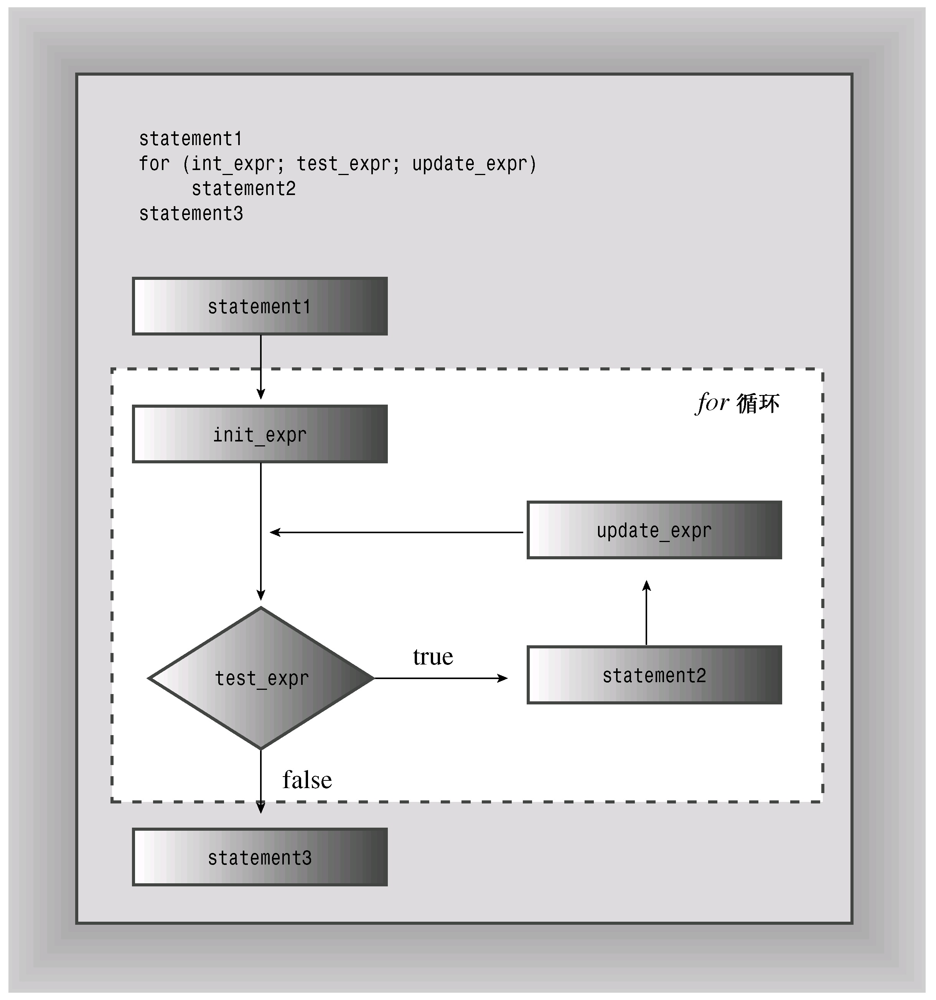
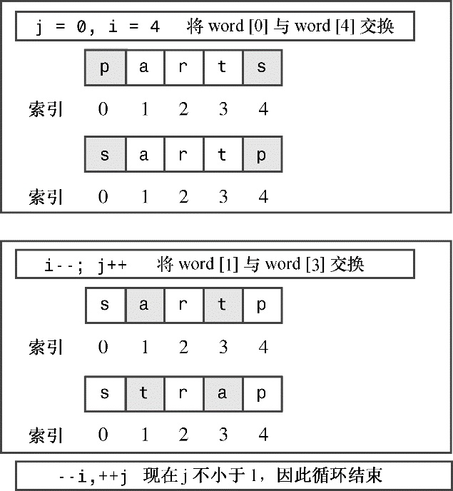
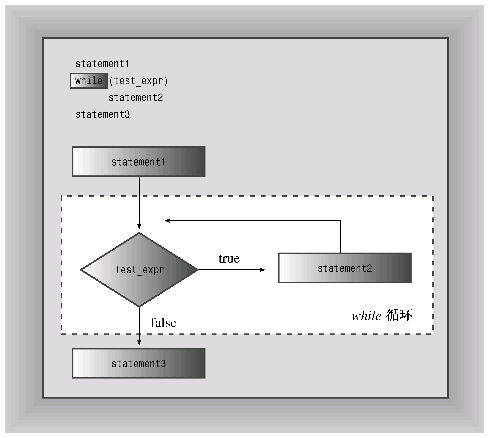
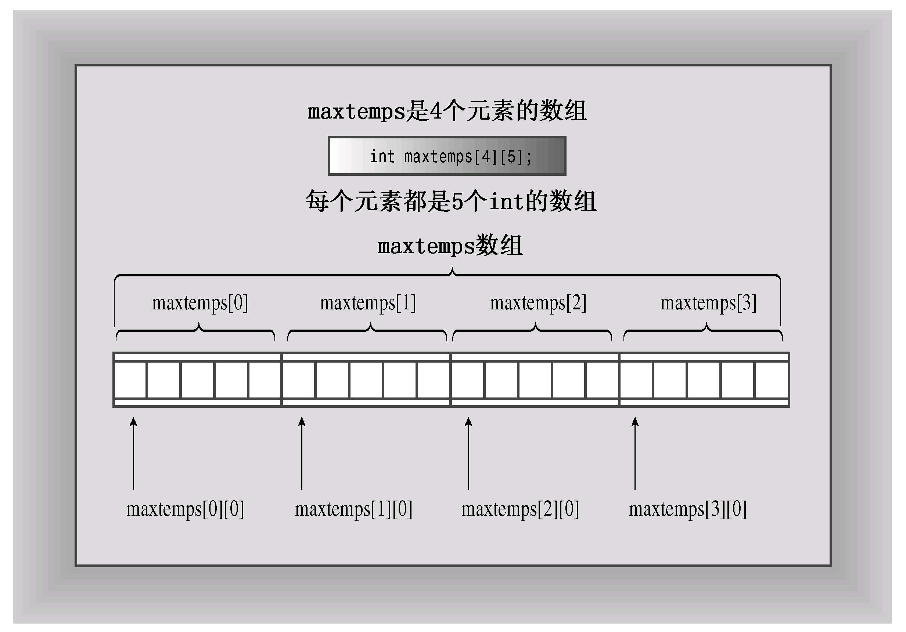
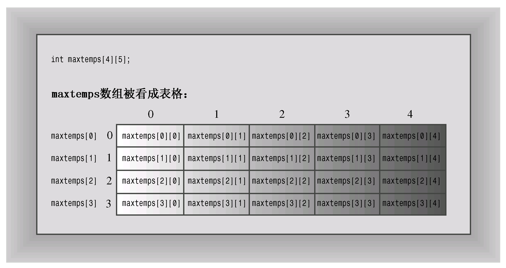

# 第5章 循环和关系表达式
本章内容包括：

* for循环。
* 表达式和语句。
* 递增运算符和递减运算符：++和−−。
* 组合赋值运算符。
* 复合语句（语句块）。
* 逗号运算符。
* 关系运算符：>、>=、= =、<=、<和!=。
* while循环。
* typedef工具。
* do while循环。
* 字符输入方法get( )。
* 文件尾条件。
* 嵌套循环和二维数组。

计算机除了存储数据外，还可以做很多其他的工作。可以对数据进行分析、合并、重组、抽取、修改、推断、合成以及其他操作。有时甚至会歪曲和破坏数据，不过我们应当尽量防止这种行为的发生。为了发挥其强大的操控能力，程序需要有执行重复的操作和进行决策的工具。当然，C++提供了这样的工具。事实上，它使用与常规C语言相同的for循环、while循环、do while循环、if语句和switch语句，如果读者熟悉C语言，可粗略地浏览本章和第6章；但浏览速度不要过快，否则会错过cin如何处理字符输入。这些程序控制语句通常都使用关系表达式和逻辑表达式来控制其行为。本章将讨论循环和关系表达式，第6章将介绍分支语句和逻辑表达式。

## 5.1 for循环
很多情况下都需要程序执行重复的任务，如将数组中的元素累加起来或将歌颂生产的赞歌打印20份，C++中的for循环可以轻松地完成这种任务。我们来看看程序清单5.1中，以了解for循环所做的工作，然后讨论它是如何工作的。

程序清单5.1 forloop.cpp
```c++
// forloop.cpp -- introducing the for loop
#include <iostream>
int main()
{
    using namespace std;
    int i;  // create a counter
//   initialize; test ; update
    for (i = 0; i < 5; i++)
        cout << "C++ knows loops.\n";
    cout << "C++ knows when to stop.\n";

    return 0;
}
```

下面是该程序的输出：
```c++
C++ knows loops.
C++ knows loops.
C++ knows loops.
C++ knows loops.
C++ knows loops.
C++ knows when to stop.
```

该循环首先将整数变量i设置为0：
```c++
i = 0;
```

这是循环的初始化（loop initialization）部分。然后，循环测试（loop test）部分检查i是否小于5：
```c++
i < 5;
```

如果确实小于5，则程序将执行接下来的语句—循环体（loop body）：
```c++
cout << "C++ knows loops.\n";
```

然后，程序使用循环更新（loop update）部分将i加1：
```c++
i++
```

这里使用了++运算符—递增运算符（increment operator），它将操作数的值加1。递增运算符并不仅限于用于for循环。例如，在程序中，可以使用i++;来替换语句i = i + 1;。将i加1后，便结束了循环的第一个周期。

接下来，循环开始了新的周期，将新的i值与5进行比较。由于新值（1）也小于5，因此循环打印另一行，然后再次将i加1，从而结束这一周期。这样又进入了新的一轮测试、执行语句和更新i的值。这一过程将一直进行下去，直到循环将i更新为5为止。这样，接下来的测试失败，程序将接着执行循环后的语句。

### 5.1.1 for循环的组成部分
for循环为执行重复的操作提供了循序渐进的步骤。我们来具体看一看它是如何工作的。for循环的组成部分完成下面这些步骤。

1. 设置初始值。
2. 执行测试，看看循环是否应当继续进行。
3. 执行循环操作。
4. 更新用于测试的值。

C++循环设计中包括了这些要素，很容易识别。初始化、测试和更新操作构成了控制部分，这些操作由括号括起。其中每部分都是一个表达式，彼此由分号隔开。控制部分后面的语句叫作循环体，只要测试表达式为true，它便被执行：
```c++
for (initialization; test-expression; update-expression)
    body
```

C++语法将整个for看作一条语句—虽然循环体可以包含一条或多条语句。（包含多条语句时，需要使用复合语句或代码块，这将在本章后面进行讨论。）

循环只执行一次初始化。通常，程序使用该表达式将变量设置为起始值，然后用该变量计算循环周期。

test-expression（测试表达式）决定循环体是否被执行。通常，这个表达式是关系表达式，即对两个值进行比较。这个例子将i的值同5进行比较，看i是否小于5。如果比较结果为真，则程序将执行循环体。实际上，C++并没有将test-expression的值限制为只能为真或假。可以使用任意表达式，C++将把结果强制转换为bool类型。因此，值为0的表达式将被转换为bool值false，导致循环结束。如果表达式的值为非零，则被强制转换为bool值true，循环将继续进行。程序清单5.2通过将表达式i用作测试条件来演示了这一特点。更新部分的i−−与i++相似，只是每使用一次，i值就减1。

程序清单5.2 num_test.cpp
```c++
// num_test.cpp -- use numeric test in for loop
#include <iostream>
int main()
{
    using namespace std;
    cout << "Enter the starting countdown value: ";
    int limit;
    cin >> limit;
    int i;
    for (i = limit; i; i--)     // quits when i is 0
        cout << "i = " << i << "\n";
    cout << "Done now that i = " << i << "\n";

    return 0;
}
```

下面是该程序的输出：
```c++
Enter the starting countdown value: 4
i = 4
i = 3
i = 2
i = 1
Done now that i = 0
```

注意，循环在i变为0后结束。

关系表达式（如i<5）是如何得到循环终止值0的呢？在引入bool类型之前，如果关系表达式为true，则被判定为1；如果为false，则被判定为0。因此，表达式3<5的值为1，而5<5的值为0。然而，C++添加了bool类型后，关系表达式就判定为bool字面值true和false，而不是1和0了。这种变化不会导致不兼容的问题，因为C++程序在需要整数值的地方将把true和false分别转换为1和0，而在需要bool值的地方将把0转换为false，非0转换为true。

for循环是入口条件（entry-condition）循环。这意味着在每轮循环之前，都将计算测试表达式的值，当测试表达式为false时，将不会执行循环体。例如，假设重新运行程序清单5.2中的程序，但将起始值设置为0，则由于测试条件在首次被判定时便为false，循环体将不被执行：
```c++
Enter the starting countdown value: 0
Done now that i = 0
```

这种在循环之前进行检查的方式可避免程序遇到麻烦。

update-expression（更新表达式）在每轮循环结束时执行，此时循环体已经执行完毕。通常，它用来对跟踪循环轮次的变量的值进行增减。然而，它可以是任何有效的C++表达式，还可以是其他控制表达式。这使for循环的功能不仅仅是从0数到5（这是第一个循环示例所做的工作），稍后将介绍一些例子。

for循环体由一条语句组成，不过很快将介绍如何扩展这条规则。图5.1对for循环设计进行了总结。

for语句看上去有些像函数调用，因为它使用一个后面跟一对括号的名称。然而，for是一个C++关键字，因此编译器不会将for视为一个函数，这还将防止将函数命名为for。



> **提示：**
> 
> C++常用的方式是，在for和括号之间加上一个空格，而省略函数名与括号之间的空格。
> ```c++
> for (i = 6; i < 10; i++)
>     smart_function(i);
> ```
> 
> 对于其他控制语句（如if和while），处理方式与for相似。这样从视觉上强化了控制语句和函数调用之间的区别。另外，常见的做法是缩进for语句体，使它看上去比较显著。

1. 表达式和语句

for语句的控制部分使用3个表达式。由于其自身强加的句法限制，C++成为非常具有表现力的语言。任何值或任何有效的值和运算符的组合都是表达式。例如，10是值为10的表达式（一点都不奇怪），28 * 20是值为560的表达式。在C++中，每个表达式都有值。通常值是很明显的。例如，下面的表达式由两个值和一个加号组成，它的值为49：
```c++
22 + 27
```

有时值不这么明显，例如，下面是一个表达式，因为它由两个值和一个赋值运算符组成：
```c++
x = 20
```

C++将赋值表达式的值定义为左侧成员的值，因此这个表达式的值为20。由于赋值表达式有值，因此可以编写下面这样的语句：
```c++
maids = (cooks = 4) + 3;
```

表达式cooks = 4的值为4，因此maids的值为7。然而，C++虽然允许这样做，但并不意味着应鼓励这种做法。允许存在上述语句存在的原则也允许编写如下的语句：
```c++
x = y = z = 0;
```

这种方法可以快速地将若干个变量设置为相同的值。优先级表（见附录D）表明，赋值运算符是从右向左结合的，因此首先将0赋给z，然后将z = 0赋给y，依此类推。

最后，正如前面指出的，像x < y这样的关系表达式将被判定为bool值true或false。程序清单5.3中的小程序指出了有关表达式值的一些重要方面。<<运算符的优先级比表达式中使用的运算符高，因此代码使用括号来获得正确的运算顺序。

程序清单5.3 express.cpp
```c++
// express.cpp -- values of expressions
#include <iostream>
int main()
{
    using namespace std;
    int x;

    cout << "The expression x = 100 has the value ";
    cout << (x = 100) << endl;
    cout << "Now x = " << x << endl;
    cout << "The expression x < 3 has the value ";
    cout << (x < 3) << endl;
    cout << "The expression x > 3 has the value ";
    cout << (x > 3) << endl;
    cout.setf(ios_base::boolalpha);   //a newer C++ feature
    cout << "The expression x < 3 has the value ";
    cout << (x < 3) << endl;
    cout << "The expression x > 3 has the value ";
    cout << (x > 3) << endl;

    return 0; 
}
```

> **注意：**
> 
> 老式C++实现可能要求使用ios：boolalpha，而不是ios_base：：boolalpha来作为cout.setf( )的参数。有些老式实现甚至无法识别这两种形式。

下面是该程序的输出：
```c++
The expression x = 100 has the value 100
Now x = 100
The expression x < 3 has the value 0
The expression x > 3 has the value 1
The expression x < 3 has the value false
The expression x > 3 has the value true
```

通常，cout在显示bool值之前将它们转换为int，但cout.setf（ios：：boolalpha）函数调用设置了一个标记，该标记命令cout显示true和false，而不是1和0。

> **注意：**
> 
> C++表达式是值或值与运算符的组合，每个C++表达式都有值。

为判定表达式x = 100，C++必须将100赋给x。当判定表达式的值这种操作改变了内存中数据的值时，我们说表达式有副作用（side effect）。因此，判定赋值表达式会带来这样的副作用，即修改被赋值者的值。有可能把赋值看作预期的效果，但从C++的构造方式这个角度来看，判定表达式才是主要作用。并不是所有的表达式都有副作用。例如，判定x + 15将计算出一个新的值，但不会修改x的值。然而，判定++x + 15就有副作用，因为它将x加1。

从表达式到语句的转变很容易，只要加分号即可。因此下面是一个表达式：
```c++
age = 100
```

而下面是一条语句：
```c++
age = 100;
```

更准确地说，这是一条表达式语句。只要加上分号，所有的表达式都可以成为语句，但不一定有编程意义。例如，如果rodents是个变量，则下面就是一条有效的C++语句：
```c++
rodents + 6;    // valid, but useless, statement
```

编译器允许这样的语句，但它没有完成任何有用的工作。程序仅仅是计算和，而没有使用得到的结果，然后便进入下一条语句（智能编译器甚至可能跳过这条语句）。

2. 非表达式和语句

有些概念对于理解C++至关重要，如了解for循环的结构。不过句法中也有一些相对次要的内容，让认为自己理解语言的人突然觉得不知所措。下面来看看这样的内容。

对任何表达式加上分号都可以成为语句，但是这句话反过来说就不对了。也就是说，从语句中删除分号，并不一定能将它转换为表达式。就我们目前使用的语句而言，返回语句、声明语句和for语句都不满足“语句=表达式+分号”这种模式。例如，下面是一条语句：
```c++
int toad;
```

但int toad并不是表达式，因为它没有值。因此，下面的代码是非法的：
```c++
eggs = int toad * 1000;     // invalid, not an expression
cin >> int toad;            // can't combine declaration with cin
```

同样，不能把for循环赋给变量。在下面的示例中，for循环不是表达式，因此没有值，也不能给它赋值：
```c++
int fx = for (i = 0; i < 4; i++)
cout >> i;    // not possible
```

3. 修改规则

C++在C循环的基础上添加了一项特性，要求对for循环句法做一些微妙的调整。

这是原来的句法：
```c++
for (expression; expression; expression)
    statement
```

具体地说，正如本章前面指出的，for结构的控制部分由3个表达式组成，它们由分号分隔。然而，C++循环允许像下面这样做：
```c++
for (int i = 0; i < 5; i++)
```

也就是说，可以在for循环的初始化部分中声明变量。这很方便，但并不适用于原来的句法，因为声明不是表达式。这种一度是非法的行为最初是通过定义一种新的表达式—声明语句表达式（declarationstatement expression）—来合法化的，声明语句表达式不带分号声明，只能出现在for语句中。然而，这种调整已经被取消了，代之以将for语句的句法修改成下面这样：
```c++
for (for-init-statement condition; expression)
    statement
```

乍一看很奇怪，因为这里只有一个分号（而不是两个分号）。但是这是允许的，因为for-init-statement被视为一条语句，而语句有自己的分号。对于for-init-statement来说，它既可以是表达式语句，也可以是声明。这种句法规则用语句替换了后面跟分号的表达式，语句本身有自己的分号。总之，C++程序员希望能够在for循环初始化部分中声明和初始化变量，他们会做C++句法需要和英语所允许的工作。

在for-init-statement中声明变量还有其实用的一面，这也是应该知道的。这种变量只存在于for语句中，也就是说，当程序离开循环后，这种变量将消失：
```c++
for (int i = 0; i < 5; i++)
    cout << "C++ konws loops.\n";
cout << i <<endl;   // oops! i no longer defined
```

您还应知道的一点是，有些较老的C++实现遵循以前的规则，对于前面的循环，将把i视为是在循环之前声明的，因此在循环结束后，i仍可用。

### 5.1.2 回到for循环
下面使用for循环完成更多的工作。程序清单5.4使用循环来计算并存储前16个阶乘。阶乘的计算方式如下：零阶乘写作0!，被定义为1。1!是1&#42;0!，即1。2!为2&#42;1!，即2。3!为3&#42;2!，即6，依此类推。每个整数的阶乘都是该整数与前一个阶乘的乘积（钢琴家Victor Borge最著名的独白以其语音标点为特色，其中，惊叹号的发音就像phffft pptz，带有濡湿的口音。然而，刚才提到的“!”读作“阶乘”）。该程序用一个循环来计算连续阶乘的值，并将这些值存储在数组中。然后，用另一个循环来显示结果。另外，该程序还在外部声明了一些值。

程序清单5.4 formore.cpp
```c++
// formore.cpp -- more looping with for
#include <iostream>
const int ArSize = 16;      // example of external declaration
int main()
{
    long long factorials[ArSize];
    factorials[1] = factorials[0] = 1LL;
    for (int i = 2; i < ArSize; i++)
        factorials[i] = i * factorials[i-1];
    for (int i = 0; i < ArSize; i++)
        std::cout << i << "! = " << factorials[i] << std::endl;

    return 0;
}
```

下面是该程序的输出：
```c++
0! = 1
1! = 1
2! = 2
3! = 6
4! = 24
5! = 120
6! = 720
7! = 5040
8! = 40320
9! = 362880
10! = 3628800
11! = 39916800
12! = 479001600
13! = 6227020800
14! = 87178291200
15! = 1307674368000
```

阶乘增加得很快！

> **注意：**
> 
> 这个程序清单使用了类型long long。如果您的系统不支持这种类型，可使用double。然而，整型使得阶乘的增大方式看起来更明显。

程序说明

该程序创建了一个数组来存储阶乘值。元素0存储0!，元素1存储1!，依此类推。由于前两个阶乘都等于1，因此程序将factorials数组的前两个元素设置为1（记住，数组第一个元素的索引值为0）。然后，程序用循环将每个阶乘设置为索引号与前一个阶乘的乘积。该循环表明，可以在循环体中使用循环计数。

该程序演示了for循环如何通过提供一种访问每个数组成员的方便途径来与数组协同工作。另外，formore.cpp还使用const创建了数组长度的符号表示（ArSize）。然后，它在需要数组长度的地方使用ArSize，如定义数组以及限制循环如何处理数组时。现在，如果要将程序扩展成处理20个阶乘，则只需要将ArSize设置为20并重新编译程序即可。通过使用符号常量，就可以避免将所有的10修改为20。

> **提示：**
> 
> 通常，定义一个const值来表示数组中的元素个数是个好办法。在声明数组和引用数组长度时（如在for循环中），可以使用const值。

表达式i < ArSize反映了这样一个事实，包含ArSize个元素的数组的下标从0到ArSize – 1，因此数组索引应在ArSize减1的位置停止。也可以使用i <= ArSize –1，但它看上去没有前面的表达式好。

该程序在main( )的外面声明const int变量ArSize。第4章末尾提到过，这样可以使ArSize成为外部数据。以这种方式声明ArSize的两种后果是，ArSize在整个程序周期内存在、程序文件中所有的函数都可以使用它。在这个例子中，程序只有一个函数，因此在外部声明ArSize几乎没有任何实际用处，但包含多个函数的程序常常会受益于共享外部常量，因此我们现在就开始练习使用外部变量。

另外，这个示例还提醒您，可使用std::而不是编译指令using来让选定的标准名称可用。

### 5.1.3 修改步长
到现在为止，循环示例每一轮循环都将循环计数加1或减1。可以通过修改更新表达式来修改步长。例如，程序清单5.5中的程序按照用户选择的步长值将循环计数递增。它没有将i++用作更新表达式，而是使用表达式i = i + by，其中by是用户选择的步长值。

程序清单5.5 bigstep.cpp
```c++
// bigstep.cpp -- count as directed
#include <iostream>
int main()
{
	using std::cout;    // a using declaration
    using std::cin;
    using std::endl;;
    cout << "Enter an integer: ";
    int by;
    cin >> by;
    cout << "Counting by " << by << "s:\n";
    for (int i = 0; i < 100; i = i + by)
        cout << i << endl;

    return 0;
}
```

下面是该程序的运行情况：
```c++
Enter an integer: 17
Counting by 17s:
0
17
34
51
68
85
```

当i的值到达102时，循环终止。这里的重点是，更新表达式可以是任何有效的表达式。例如，如果要求每轮递增以i的平方加10，则可以使用表达式i = i &#42; i + 10。

需要指出的另一点是，检测不等通常比检测相等好。例如，在这里使用条件i == 100不可行，因为i的取值不会为100。

最后，这个示例使用了using声明，而不是using编译指令。

### 5.1.4 使用for循环访问字符串
for循环提供了一种依次访问字符串中每个字符的方式。例如，程序清单5.6让用户能够输入一个字符串，然后按相反的方向逐个字符地显示该字符串。在这个例子中，可以使用string对象，也可以使用char数组，因为它们都让您能够使用数组表示法来访问字符串中的字符。程序清单5.6使用的是string对象。string类的size( )获得字符串中的字符数；循环在其初始化表达式中使用这个值，将i设置为字符串中最后一个字符的索引（不考虑空值字符）。为了反向计数，程序使用递减运算符（− −），在每轮循环后将数组下标减1。另外，程序清单5.6使用关系运算符大于或等于（>=）来测试循环是否到达第一个元素。稍后我们将对所有的关系运算符做一总结。

程序清单5.6 forstr1.cpp
```c++
// forstr1.cpp -- using for with a string
#include <iostream>
#include <string>
int main()
{
    using namespace std;
    cout << "Enter a word: ";
    string word;
    cin >> word;

    // display letters in reverse order
    for (int i = word.size() - 1; i >= 0; i--)
        cout << word[i];
    cout << "\nBye.\n";

    return 0; 
}
```

> **注意：**
> 
> 如果所用的实现没有添加新的头文件，则必须使用string.h，而不是cstring。

下面是该程序的运行情况：
```c++
Enter a word: animal
lamina
Bye.
```

程序成功地按相反的方向打印了animal；与回文rotator、redder或stats相比，animal能更清晰地说明这个程序的作用。

### 5.1.5 递增运算符（++）和递减运算符（−−）
C++中有多个常被用在循环中的运算符，因此我们花一点时间来讨论它们。前面已经介绍了两个这样的运算符：递增运算符（++）（名称C++由此得到）和递减运算符（−−）。这两个运算符执行两种极其常见的循环操作：将循环计数加1或减1。然而，它们还有很多特点不为读者所知。这两个运算符都有两种变体。前缀（prefix）版本位于操作数前面，如++x；后缀（postfix）版本位于操作数后面，如x++。两个版本对操作数的影响是一样的，但是影响的时间不同。这就像对于钱包来说，清理草坪之前付钱和清理草坪之后付钱的最终结果是一样的，但支付钱的时间不同。程序清单5.7演示递增运算符的这种差别。

程序清单5.7 plus_one.cpp
```c++
// plus_one.cpp -- the increment operator
#include <iostream>
int main()
{
    using std::cout;
    int a = 20;
    int b = 20;

    cout << "a   = " << a << ":   b = " << b << "\n";
    cout << "a++ = " << a++ << ": ++b = " << ++b << "\n";
    cout << "a   = " << a << ":   b = " << b << "\n";

    return 0;
}
```

下面是该程序的输出：
```c++
a   = 20:   b = 20
a++ = 20: ++b = 21
a   = 21:   b = 21
```

粗略地讲，a++意味着使用a的当前值计算表达式，然后将a的值加1；而++b的意思是先将b的值加1，然后使用新的值来计算表达式。例如，我们有下面这样的关系：
```c++
int x = 6;
int y = ++x;      // change x, then assion to y
                  // y is 6, x is 6

int z = 5;
int y = z++;      // assign to y, then change z
                  // y is 5, z is 6
```

递增和递减运算符是处理将值加减1这种常见任务的一种简约、方便的方法。

递增运算符和递减运算符都是漂亮的小型运算符，不过千万不要失去控制，在同一条语句对同一个值递增或递减多次。问题在于，规则“使用后修改”和“修改后使用”可能会变得模糊不清。也就是说，下面这条语句在不同的系统上将生成不同的结果：
```c++
x = 2 * x++ * (3 - ++x);    // don't do it except as an experiment
```

对这种语句，C++没有定义正确的行为。

### 5.1.6 副作用和顺序点
下面更详细地介绍C++就递增运算符何时生效的哪些方面做了规定，哪些方面没有规定。首先，副作用（side effect）指的是在计算表达式时对某些东西（如存储在变量中的值）进行了修改；顺序点（sequence point）是程序执行过程中的一个点，在这里，进入下一步之前将确保对所有的副作用都进行了评估。在C++中，语句中的分号就是一个顺序点，这意味着程序处理下一条语句之前，赋值运算符、递增运算符和递减运算符执行的所有修改都必须完成。本章后面将讨论的有些操作也有顺序 点。另外，任何完整的表达式末尾都是一个顺序点。

何为完整表达式呢？它是这样一个表达式：不是另一个更大表达式的子表达式。完整表达式的例子有：表达式语句中的表达式部分以及用作while循环中检测条件的表达式。

顺序点有助于阐明后缀递增何时进行。例如，请看下面的代码：
```c++
while (guests++ < 10)
    cout << guests <<endl;
```

while循环将在本章后面讨论，它类似于只有测试表达式的for循环。在这里，C++新手可能认为“使用值，然后递增”意味着先在cout语句中使用guests的值，再将其值加1。然而，表达式guests++ < 10是一个完整表达式，因为它是一个while循环的测试条件，因此该表达式的末尾是一个顺序点。所以，C++确保副作用（将guests加1）在程序进入cout之前完成。然而，通过使用后缀格式，可确保将guests同10进行比较后再将其值加1。

现在来看下面的语句：
```c++
y = (4 + x++) + (6 + x++);
```

表达式4 + x++不是一个完整表达式，因此，C++不保证x的值在计算子表达式4 + x++后立刻增加1。在这个例子中，整条赋值语句是一个完整表达式，而分号标示了顺序点，因此C++只保证程序执行到下一条语句之前，x的值将被递增两次。C++没有规定是在计算每个子表达式之后将x的值递增，还是在整个表达式计算完毕后才将x的值递增，有鉴于此，您应避免使用这样的表达式。

在C++11文档中，不再使用术语“顺序点”了，因为这个概念难以用于讨论多线程执行。相反，使用了术语“顺序”，它表示有些事件在其他事件前发生。这种描述方法并非要改变规则，而旨在更清晰地描述多线程编程。

### 5.1.7 前缀格式和后缀格式
显然，如果变量被用于某些目的（如用作函数参数或给变量赋值），使用前缀格式和后缀格式的结果将不同。然而，如果递增表达式的值没有被使用，情况又如何呢？例如，下面两条语句的作用是否不同？
```c++
x++;
++x;
```

下面两条语句的作用是否不同？
```c++
for (n = 1im; n > 0; --n)
    ...;
```

和
```c++
for (n = 1im; n > 0; n--)
    ...;
```

从逻辑上说，在上述两种情形下，使用前缀格式和后缀格式没有任何区别。表达式的值未被使用，因此只存在副作用。在上面的例子中，使用这些运算符的表达式为完整表达式，因此将x加1和n减1的副作用将在程序进入下一步之前完成，前缀格式和后缀格式的最终效果相同。

然而，虽然选择使用前缀格式还是后缀格式对程序的行为没有影响，但执行速度可能有细微的差别。对于内置类型和当代的编译器而言，这看似不是什么问题。然而，C++允许您针对类定义这些运算符，在这种情况下，用户这样定义前缀函数：将值加1，然后返回结果；但后缀版本首先复制一个副本，将其加1，然后将复制的副本返回。因此，对于类而言，前缀版本的效率比后缀版本高。

总之，对于内置类型，采用哪种格式不会有差别；但对于用户定义的类型，如果有用户定义的递增和递减运算符，则前缀格式的效率更高。

### 5.1.8 递增/递减运算符和指针
可以将递增运算符用于指针和基本变量。本书前面介绍过，将递增运算符用于指针时，将把指针的值增加其指向的数据类型占用的字节数，这种规则适用于对指针递增和递减：
```c++
double arr[5] = {21.1, 32.8, 23.4, 45.2, 37.4};
double *pt = arr;   // pt points to arr[0], i.e. to 21.1
++pt;               // pt points to arr[1], i.e. to 32.8
```

也可以结合使用这些运算符和&#42;运算符来修改指针指向的值。将&#42;和++同时用于指针时提出了这样的问题：将什么解除引用，将什么递增。这取决于运算符的位置和优先级。前缀递增、前缀递减和解除引用运算符的优先级相同，以从右到左的方式进行结合。后缀递增和后缀递减的优先级相同，但比前缀运算符的优先级高，这两个运算符以从左到右的方式进行结合。

前缀运算符的从右到到结合规则意味着&#42;++pt的含义如下：现将++应用于pt（因为++位于&#42;的右边），然后将&#42;应用于被递增后的pt：
```c++
double x = *++pt;     // increment pointer, take the value; i.e., arr[2], or 23.4
```

另一方面，++&#42;pt意味着先取得pt指向的值，然后将这个值加1：
```c++
++*pt;      // increment the pointed to value; i.e., change 23.4 to 24.4
```

在这种情况下，pt仍然指向arr[2]。

接下来，请看下面的组合：
```c++
(*pt)++;    // increment pointed to value
```

圆括号指出，首先对指针解除引用，得到24.4。然后，运算符++将这个值递增到25.4，pt仍然指向arr[2]。

最后，来看看下面的组合：
```c++
x = *pt++;      // dereference original location, then increment pointer
```

后缀运算符++的优先级更高，这意味着将运算符用于pt，而不是&#42;pt，因此对指针递增。然而后缀运算符意味着将对原来的地址（&arr[2]）而不是递增后的新地址解除引用，因此&#42;pt++的值为arr[2]，即25.4，但该语句执行完毕后，pt的值将为arr[3]的地址。

> **注意：**
> 
> 指针递增和递减遵循指针算术规则。因此，如果pt指向某个数组的第一个元素，++pt将修改pt，使之指向第二个元素。

### 5.1.9 组合赋值运算符
程序清单5.5使用了下面的表达式来更新循环计数：
```c++
i = i + by
```

C++有一种合并了加法和赋值操作的运算符，能够更简洁地完成这种任务：
```c++
i += by
```

+=运算符将两个操作数相加，并将结果赋给左边的操作数。这意味着左边的操作数必须能够被赋值，如变量、数组元素、结构成员或通过对指针解除引用来标识的数据：
```c++
int k = 5;
k += 3;                 // ok, k set to 8
int *pa = new int[10];  // pa points to pa[0]
pa[4] = 12;
pa[4] += 6;             // ok, pa[4] set to 18
*(pa + 4) += 7;         // ok, pa[4] set to 25
pa += 2;                // ok, pa points to the former pa[2]
34 += 10;               // quite wrong
```

每个算术运算符都有其对应的组合赋值运算符，表5.1对它们进行了总结。其中每个运算符的工作方式都和+=相似。因此，下面的语句将k与10相乘，再将结果赋给k：
```c++
k *= 10;
```

表5.1 组合赋值运算符

| 操 作 符 | 作用（L为左操作数，R为右操作数） |
| :--- | :--- |
| += | 将L+R赋给L |
| -= | 将L-R赋给L |
| *= | 将L*R赋给L |
| /= | 将L/R赋给L |
| %= | 将L%R赋给L |

### 5.1.10 复合语句（语句块）
编写C++for语句的格式（或句法）看上去可能比较严格，因为循环体必须是一条语句。如果要在循环体中包含多条语句，这将很不方便。所幸的是，C++提供了避开这种限制的方式，通过这种方式可以在循环体中包含任意多条语句。方法是用两个花括号来构造一条复合语句（代码块）。代码块由一对花括号和它们包含的语句组成，被视为一条语句，从而满足句法的要求。例如，程序清单5.8中的程序使用花括号将3条语句合并为一个代码块。这样，循环体便能够提示用户、读取输入并进行计算。该程序计算用户输入的数字的和，因此有机会使用+=运算符。

程序清单5.8 block.cpp
```c++
// block.cpp -- use a block statement
#include <iostream>
int main()
{
    using namespace std;
    cout << "The Amazing Accounto will sum and average ";
    cout << "five numbers for you.\n";
    cout << "Please enter five values:\n";
    double number;
    double sum = 0.0;
    for (int i = 1; i <= 5; i++)
    {                                   // block starts here
        cout << "Value " << i << ": ";
        cin >> number;
        sum += number;
    }                                   // block ends here
    cout << "Five exquisite choices indeed! ";
    cout << "They sum to " << sum << endl;
    cout << "and average to " << sum / 5 << ".\n";
    cout << "The Amazing Accounto bids you adieu!\n";

    return 0; 
}
```

下面是该程序的运行情况：
```c++
The Amazing Accounto will sum and average five numbers for you.
Please enter five values:
Value 1: 1942
Value 2: 1948
Value 3: 1957
Value 4: 1974
Value 5: 1980
Five exquisite choices indeed! They sum to 9801
and average to 1960.2.
The Amazing Accounto bids you adieu!
```

假设对循环体进行了缩进，但省略了花括号：
```c++
for (int i = 1; i <= 5; i++)
    cout << "Value " << i << ": ";    // loop ends here
    cin >> number;                    // after the loop
    sum += number;
cout << "Five exquisite choices indeed! ";
```

编译器将忽略缩进，因此只有第一条语句位于循环中。因此，该循环将只打印出5条提示，而不执行其他操作。循环结束后，程序移到后面几行执行，只读取和计算一个数字。

复合语句还有一种有趣的特性。如果在语句块中定义一个新的变量，则仅当程序执行该语句块中的语句时，该变量才存在。执行完该语句块后，变量将被释放。这表明此变量仅在该语句块中才是可用的：
```c++
#include <iostream>
int main()
{
    using namespace std;
    int x = 20;
    {                         // block starts
        int y = 100;
        cout << x << endl;    // ok
        cout << y << endl;    // ok
    }                         // block ends
    cout << x << endl;        // ok
    cout << y << endl;        // invalid, won't compile
    return 0;
}
```

注意，在外部语句块中定义的变量在内部语句块中也是被定义了的。

如果在一个语句块中声明一个变量，而外部语句块中也有一个这种名称的变量，情况将如何呢？在声明位置到内部语句块结束的范围之内，新变量将隐藏旧变量；然后就变量再次可见，如下例所示：
```c++
#include <iostream>
int main()
{
    using std::cout;
    using std::endl;
    int x = 20;                         // original x
    {                                   // block starts
        cout << x << endl;              // use original x
        int x = 100;                    // new x
        cout << x << endl;              // use new x
    }
    cout << x << endl;                  // use original x
    return 0;
}
```

### 5.1.11 其他语法技巧—逗号运算符
正如读者看到的，语句块允许把两条或更多条语句放到按C++句法只能放一条语句的地方。逗号运算符对表达式完成同样的任务，允许将两个表达式放到C++句法只允许放一个表达式的地方。例如，假设有一个循环，每轮都将一个变量加1，而将另一个变量减1。在for循环控制部分的更新部分中完成这两项工作将非常方便，但循环句法只允许这里包含一个表达式。在这种情况下，可以使用逗号运算符将两个表达式合并为一个：
```c++
++j, --i    // two expressions count as one for syntax purposes
```

逗号并不总是逗号运算符。例如，下面这个声明中的逗号将变量列表中相邻的名称分开：
```c++
int i, j;   // comma is a separator here, not an operator
```

程序清单5.9在一个程序中使用了两次逗号运算符，该程序将一个string类对象的内容反转。也可以使用char数组来编写该程序，但可输入的单词长度将受char数组大小的限制。注意，程序清单5.6按相反的顺序显示数组的内容，而程序清单5.9将数组中的字符顺序反转。该程序还使用了语句块将几条语句组合成一条。

程序清单5.9 forstr2.cpp
```c++
// forstr2.cpp -- reversing an array
#include <iostream>
#include <string>
int main()
{
    using namespace std;
    cout << "Enter a word: ";
    string word;
    cin >> word;

    // physically modify string object
    char temp;
    int i, j;
    for (j = 0, i = word.size() - 1; j < i; --i, ++j)
    {                       // start block
        temp = word[i];
        word[i] = word[j];
        word[j] = temp;
    }                       // end block
    cout << word << "\nDone\n";

    return 0; 
}
```

下面是该程序运行情况：
```c++
Enter a word: stressed
desserts
Done
```

顺便说一句，在反转字符串方面，string类提供了更为简洁的方式，这将在第16章介绍。

1. 程序说明

来看程序清单5.9中的for循环控制部分。

首先，它使用逗号运算符将两个初始化操作放进控制部分第一部分的表达式中。然后，再次使用逗号运算符将两个更新合并到控制部分最后一部分的表达式中。

接下来看循环体。程序用括号将几条语句合并为一个整体。在循环体中，程序将数组第一个元素和最后一个元素调换，从而将单词反转过来。然后，它将j加1，将i减1，让它们分别指向第二个元素和倒数第二个元素，然后将这两个元素调换。注意，测试条件 j < i 使得到达数组的中间时，循环将停止。如果过了这一点后，循环仍继续下去，则便开始将交换后的元素回到原来的位置（参见图5.2）。



需要注意的另一点是，声明变量temp、i、j的位置。代码在循环之前声明i和j，因为不能用逗号运算符将两个声明组合起来。这是因为声明已经将逗号用于其他用途—分隔列表中的变量。也可以使用一个声明语句表达式来创建并初始化两个变量，但是这样看起来有些乱：
```c++
int j = 0, i = word.size() - 1;
```

在这种情况下，逗号只是一个列表分隔符，而不是逗号运算符，因此该表达式对j和i进行声明和初始化。然而，看上去好像只声明了j。

另外，可以在for循环内部声明temp：
```c++
int temp = word[i];
```

这样，temp在每轮循环中都将被分配和释放。这比在循环前声明temp的速度要慢一些。另一方面，如果在循环内部声明temp，则它将在循环结束后被丢弃。

2. 逗号运算符花絮

到目前为止，逗号运算符最常见的用途是将两个或更多的表达式放到一个for循环表达式中。不过C++还为这个运算符提供了另外两个特性。首先，它确保先计算第一个表达式，然后计算第二个表达式（换句话说，逗号运算符是一个顺序点）。如下所示的表达式是安全的：
```c++
i = 20, j = 2 * i     // i set to 20, then j set to 40
```

其次，C++规定，逗号表达式的值是第二部分的值。例如，上述表达式的值为40，因为j = 2 * i的值为40。

在所有运算符中，逗号运算符的优先级是最低的。例如，下面的语句：
```c++
cata = 17, 240;
```

被解释为：
```c++
(cata = 17), 240;
```

也就是说，将cats设置为17，240不起作用。然而，由于括号的优先级最高，下面的表达式将把cats设置为240—逗号右侧的表达式值：
```c++
cata = (17, 240);
```

### 5.1.12 关系表达式
计算机不只是机械的数字计数器。它能够对值进行比较，这种能力是计算机决策的基础。在C++中，关系运算符是这种能力的体现。C++提供了6种关系运算符来对数字进行比较。由于字符用其ASCII码表示，因此也可以将这些运算符用于字符。不能将它们用于C-风格字符串，但可用于string类对象。对于所有的关系表达式，如果比较结果为真，则其值将为true，否则为false，因此可将其用作循环测试表达式。（老式实现认为结果为true的关系表达式的值为1，而结果为false的关系表达式为0。）表5.2对这些运算符进行了总结。

表5.2 关系运算符

| 操 作 符 | 含 义 |
| :--- | :--- |
| < | 小于 |
| <= | 小于或等于 |
| == | 等于 |
| > | 大于 |
| >= | 大于或等于 |
| != | 不等于 |

这6种关系运算符可以在C++中完成对数字的所有比较。如果要对两个值进行比较，看看哪个值更漂亮或者更幸运，则这里的运算符就派不上用场了。

下面是一些测试示例：
```c++
for (x = 20; x > 5; x==)    // continue while x is greater than 5
for (x = 1; y != x; ++x)    // continue while y is not equal to x
for (cin >> x; x == 0; cin >> x)  // continue while x is 0
```

关系运算符的优先级比算术运算符低。这意味着表达式：
```c++
x + 3 > y -2      // Expression 1
```

对应于：
```c++
(x + 3) > (y -2)  // Expression 2
```

而不是：
```c++
x + (3 > y) -2    // Expression 3
```

由于将bool值提升为int后，表达式(3>y)要么为1，要么为0，因此第二个和第三个表达式都是有效的。不过我们更希望第一个表达式等价于第二个表达式，而C++正是这样做的。

### 5.1.13 赋值、比较和可能犯的错误
不要混淆等于运算符（==）与赋值运算符（=）。下面的表达式问了一个音乐问题—musicians是否等于4？
```c++
musicians == 4      // comparison
```

该表达式的值为true或false。下面的表达式将4赋给musicians：
```c++
musicians = 4       // assignment
```

在这里，整个表达式的值为4，因为该表达式左边的值为4。

for循环的灵活设计让用户很容易出错。如果不小心遗漏了==运算符中的一个等号，则for循环的测试部分将是一个赋值表达式，而不是关系表达式，此时代码仍是有效的。这是因为可以将任何有效的C++表达式用作for循环的测试条件。别忘了，非零值为true，零值为false。将4赋给musicians的表达式的值为4，因此被视为true。如果以前使用过用=判断是否相等的语言，如Pascal或BASIC，则尤其可能出现这样的错误。

程序清单5.10中指出了可能出现这种错误的情况。该程序试图检查一个存储了测验成绩的数组，在遇到第一个不为20的成绩时停止。该程序首先演示了一个正确进行比较的循环，然后是一个在测试条件中错误地使用了赋值运算符的循环。该程序还有另一个重大的设计错误，稍后将介绍如何修复（应从错误中吸取教训，而程序清单5.10在这方面很有帮助）。

程序清单5.10 equal.cpp
```c++
// equal.cpp -- equality vs assignment
#include <iostream>
int main()
{
    using namespace std;
    int quizscores[10] =
        { 20, 20, 20, 20, 20, 19, 20, 18, 20, 20};

    cout << "Doing it right:\n";
    int i;
    for (i = 0; quizscores[i] == 20; i++)
        cout << "quiz " << i << " is a 20\n";
// Warning: you may prefer reading about this program
// to actually running it.
    cout << "Doing it dangerously wrong:\n";
    for (i = 0; quizscores[i] = 20; i++)
        cout << "quiz " << i << " is a 20\n";

    return 0;
}
```

由于这个程序存在一个严重的问题，读者可能希望了解它，以便真正运行它。下面是该程序的一些输出：
```c++
Doing it right:
quiz 0 is a 20
quiz 1 is a 20
quiz 2 is a 20
quiz 3 is a 20
quiz 4 is a 20
Doing it dangerously wrong:
quiz 0 is a 20
quiz 1 is a 20
quiz 2 is a 20
quiz 3 is a 20
quiz 4 is a 20
quiz 5 is a 20
quiz 6 is a 20
quiz 7 is a 20
quiz 8 is a 20
quiz 9 is a 20
quiz 10 is a 20
quiz 11 is a 20
quiz 12 is a 20
quiz 13 is a 20
...
```

第一个循环在显示了前5个测验成绩后正确地终止，但第二个循环显示整个数组。更糟糕的是，显示的每个值都是20。更加糟糕的是，它到了数组末尾还不停止。最糟糕的是，该程序可能导致其他应用程序无法运行，您必须重新启动计算机。

当然，错误出在下面的测试表达式中：
```c++
quizscores[i] = 20
```

首先，由于它将一个非零值赋给数组元素，因此表达式始终为非零，所以始终为true。其次，由于表达式将值赋给数组元素，它实际上修改了数据。第三，由于测试表达式一直为true，因此程序在到达数组结尾后，仍不断修改数据。它把一个又一个20放入内存中！这会带来不好的影响。

发现这种错误的困难之处在于，代码在语法上是正确的，因此编译器不会将其视为错误（然而，由于C和C++程序员频繁地犯这种错误，因此很多编译器都会发出警告，询问这是否是设计者的真正意图）。

> **警告：**
> 
> 不要使用=来比较两个量是否相等，而要使用==。

和C语言一样，C++比起大多数编程语言来说，赋予程序员更大的自由。这种自由以程序员应付的更大责任为代价。只有良好的规划才能避免程序超出标准C++数组的边界。然而，对于C++类，可以设计一种保护数组类型来防止这种错误，第13章提供一个这样的例子。另外，应在需要的时候在程序中加入保护措施。例如，在程序清单5.10的循环中，应包括防止超出最后一个成员的测试，这甚至对于“好”的循环来说也是必要的。如果所有的成绩都是20，“好”的循环也会超出数组边界。总之，循环需要测试数组的值和索引的值。第6章将介绍如何使用逻辑运算符将两个这样的测试合并为一个条件。

### 5.1.14 C-风格字符串的比较
假设要知道字符数组中的字符串是不是mate。如果word是数组名，下面的测试可能并不能像我们预想的那样工作：
```c++
word == "mate"
```

请记住，数组名是数组的地址。同样，用引号括起的字符串常量也是其地址。因此，上面的关系表达式不是判断两个字符串是否相同，而是查看它们是否存储在相同的地址上。两个字符串的地址是否相同呢？答案是否定的，虽然它们包含相同的字符。

由于C++将C-风格字符串视为地址，因此如果使用关系运算符来比较它们，将无法得到满意的结果。相反，应使用C-风格字符串库中的strcmp( )函数来比较。该函数接受两个字符串地址作为参数。这意味着参数可以是指针、字符串常量或字符数组名。如果两个字符串相同，该函数将返回零；如果第一个字符串按字母顺序排在第二个字符串之前，则strcmp( )将返回一个负数值；如果第一个字符串按字母顺序排在第二个字符串之后，则strcpm( )将返回一个正数值。实际上，“按系统排列顺序”比“按字母顺序”更准确。这意味着字符是根据字符的系统编码来进行比较的。例如，使用ASCII码时，所有大写字母的编码都比小写字母小，所以按排列顺序，大写字母将位于小写字母之前。因此，字符串“Zoo”在字符串“aviary”之前。根据编码进行比较还意味着大写字母和小写字母是不同的，因此字符串“FOO”和字符串“foo”不同。

在有些语言（如BASIC和标准Pascal）中，存储在不同长度的数组中的字符串彼此不相等。但是C-风格字符串是通过结尾的空值字符定义的，而不是由其所在数组的长度定义的。这意味着两个字符串即使被存储在长度不同的数组中，也可能是相同的：
```c++
char big[80] = "Daffy";         // 5 letters plus \0
char little[6] = "Daffy";       // 5 letters plus \0
```

顺便说一句，虽然不能用关系运算符来比较字符串，但却可以用它们来比较字符，因为字符实际上是整型。因此下面的代码可以用来显示字母表中的字符，至少对于ASCII字符集和Unicode字符集来说是有效的：
```c++
for (ch = 'a'; ch <= 'z'; ch++)
    cout << ch;
```

程序清单5.11在for循环的测试条件中使用了strcmp( )。该程序显示一个单词，修改其首字母，然后再次显示这个单词，这样循环往复，直到strcmp( )确定该单词与字符串“mate”相同为止。注意，该程序清单包含了文件cstring，因为它提供了strcmp( )的函数原型。

程序清单5.11 compstr1.cpp
```c++
// compstr1.cpp -- comparing strings using arrays
#include <iostream>
#include <cstring>     // prototype for strcmp()
int main()
{
    using namespace std;
    char word[5] = "?ate";

    for (char ch = 'a'; strcmp(word, "mate"); ch++)
    {
        cout << word << endl;
        word[0] = ch;
    }
    cout << "After loop ends, word is " << word << endl;

    return 0; 
}
```

下面是该程序的输出：
```c++
?ate
aate
bate
cate
date
eate
fate
gate
hate
iate
jate
kate
late
After loop ends, word is mate
```

程序说明

该程序有几个有趣的地方。其中之一当然是测试。我们希望只要word不是mate，循环就继续进行。也就是说，我们希望只要strcmp( )判断出两个字符串不相同，测试就继续进行。最显而易见的测试是这样的：
```c++
strcmp(word, "mate") != 0     // strings are not the same
```

如果字符串不相等，则该语句的值为1（true），如果字符串相等，则该语句的值为0（false）。但使用strcmp（word，"mate"）本身将如何呢？如果字符串不相等，则它的值为非零（true）；如果字符串相等，则它的值为零（false）。实际上，如果字符串不同，该返回true，否则返回false。因此，可以只用这个函数，而不是整个关系表达式。这样得到的结果将相同，还可以少输入几个字符。另外，C和C++程序员传统上就是用这种方式使用strcmp( )的。

> **检测相等或排列顺序：**
> 
> 可以使用strcmp( )来测试C-风格字符串是否相等（排列顺序）。如果str1和str2相等，则下面的表达式为true：
> ```c++
> strcmp(str1, str2) == 0
> ```
> 
> 如果str1和str2不相等，则下面两个表达式都为true：
> ```c++
> strcmp(str1, str2) != 0
> strcmp(str1, str2)
> ```
> 
> 如果str1在str2的前面，则下面的表达式为true：
> ```c++
> strcmp(str1, str2) < 0
> ```
> 
> 如果str1在str2的后面，则下面的表达式为true：
> ```c++
> strcmp(str1, str2) > 0
> ```
> 
> 因此，根据要如何设置测试条件，strcmp( )可以扮演= =、!=、<和>运算符的角色。

接下来，compstr1.cpp使用递增运算符使变量ch遍历字母表：
```c++
ch++
```

可以对字符变量使用递增运算符和递减运算符，因为char类型实际上是整型，因此这种操作实际上将修改存储在变量中的整数编码。另外，使用数组索引可使修改字符串中的字符更为简单：
```c++
word[0] = ch;
```

### 5.1.15 比较string类字符串
如果使用string类字符串而不是C-风格字符串，比较起来将简单些，因为类设计让您能够使用关系运算符进行比较。这之所以可行，是因为类函数重载（重新定义）了这些运算符。第12章将介绍如何将这种特性加入到类设计中，但从应用的角度说，读者现在只需知道可以将关系运算符用于string对象即可。程序清单5.12是在程序清单5.11的基础上修改而成的，它使用的是string对象而不是char数组。

程序清单5.12 compstr2.cpp
```c++
// compstr2.cpp -- comparing strings using arrays
#include <iostream>
#include <string>     // string class
int main()
{
    using namespace std;
    string word = "?ate";

    for (char ch = 'a'; word != "mate"; ch++)
    {
        cout << word << endl;
        word[0] = ch;
    }
    cout << "After loop ends, word is " << word << endl;

    return 0; 
}
```

该程序的输出与程序清单5.11相同。

程序说明

在程序清单5.12中，下面的测试条件使用了一个关系运算符，该运算符的左边是一个string对象，右边是一个C-风格字符串：
```c++
word != "mate"
```

string类重载运算符!=的方式让您能够在下述条件下使用它：至少有一个操作数为string对象，另一个操作数可以是string对象，也可以是C-风格字符串。

string类的设计让您能够将string对象作为一个实体（在关系型测试表达式中），也可以将其作为一个聚合对象，从而使用数组表示法来提取其中的字符。

正如您看到的，使用C-风格字符串和string对象可获得相同的结果，但使用string对象更简单、更直观。

最后，和前面大多数for循环不同，此循环不是计数循环。也就是说，它并不对语句块执行指定的次数。相反，此循环将根据情况（word为“mate”）来确定是否停止。对于这种测试，C++程序通常使用while循环，下面来看看这种循环。

## 5.2 while循环
while循环是没有初始化和更新部分的for循环，它只有测试条件和循环体：
```c++
while (test-condition)
    body
```

首先，程序计算圆括号内的测试条件（test-condition）表达式。如果该表达式为true，则执行循环体中的语句。与for循环一样，循环体也由一条语句或两个花括号定义的语句块组成。执行完循环体后，程序返回测试条件，对它进行重新评估。如果该条件为非零，则再次执行循环体。测试和执行将一直进行下去，直到测试条件为false为止（参见图5.3）。显然，如果希望循环最终能够结束，循环体中的代码必须完成某种影响测试条件表达式的操作。例如，循环可以将测试条件中使用的变量加1或从键盘输入读取一个新值。和for循环一样，while循环也是一种入口条件循环。因此，如果测试条件一开始便为false，则程序将不会执行循环体。

程序清单5.13使用了一个while循环。该循环遍历字符串，并显示其中的字符及其ASCII码。循环在遇到空值字符时停止。这种逐字符遍历字符串直到遇到空值字符的技术是C++处理C-风格字符串的标准方法。由于字符串中包含了结尾标记，因此程序通常不需要知道字符串的长度。

程序清单5.13 while.cpp
```c++
// while.cpp -- introducing the while loop
#include <iostream>
const int ArSize = 20;
int main()
{
    using namespace std;
    char name[ArSize];

    cout << "Your first name, please: ";
    cin >> name;
    cout << "Here is your name, verticalized and ASCIIized:\n";
    int i = 0;                  // start at beginning of string
    while (name[i] != '\0')     // process to end of string
    {
        cout << name[i] << ": " << int(name[i]) << endl;
        i++;                    // don't forget this step
    }

    return 0; 
}
```



下面是该程序的运行情况：
```c++
Your first name, please: Muffy
Here is your name, verticalized and ASCIIized:
M: 77
u: 117
f: 102
f: 102
y: 121
```

verticalized和ASCIIized并不是真正的单词，甚至将来也不会是单词。不过它们确实在输出中添加了一种“可爱”的氛围。

程序说明

程序清单5.13中的while条件像这样：
```c++
while (name[i] != '\0')
```

它可以测试数组中特定的字符是不是空值字符。为使该测试最终能够成功，循环体必须修改i的值，这是通过在循环体结尾将i加1来实现的。省略这一步将导致循环停留在同一个数组元素上，打印该字符及其编码，直到强行终止该程序。导致死循环是循环最常见的问题之一。通常，在循环体中忘记更新某个值时，便会出现这种情况。

可以这样修改while行：
```c++
while (name[i])
```

经过这种修改后，程序的工作方式将不变。这是由于name[i]是常规字符，其值为该字符的编码—非零值或true。然而，当name[i]为空值字符时，其编码将为0或false。这种表示法更为简洁（也更常用），但没有程序清单5.13中的表示法清晰。对于后一种情况，“笨拙”的编译器生成的代码的速度将更快，“聪明”的编译器对于这两个版本生成的代码将相同。

要打印字符的ASCII码，必须通过强制类型转换将name[i]转换为整型。这样，cout将把值打印成整数，而不是将它解释为字符编码。

不同于C-风格字符串，string对象不使用空字符来标记字符串末尾，因此要将程序清单5.13转换为使用string类的版本，只需用string对象替换char数组即可。第16章将讨论可用于标识string对象中最后一个字符的技术。

### 5.2.1 for与while
在C++中，for和while循环本质上是相同的。例如，下面的for循环：
```c++
for (init-expression; test-expression; update-expression)
{
    statement(s)
}
```

可以改写成这样：
```c++
init-expression;
while (test-expression;)
{
    statement(s)
    update-expression
}
```

同样，下面的while循环：
```c++
while (test-expression)
    body
```

可以改写成这样：
```c++
for ( ; test-expression; )
    body
```

for循环需要3个表达式（从技术的角度说，它需要1条后面跟两个表达式的语句），不过它们可以是空表达式（语句），只有两个分号是必需的。另外，省略for循环中的测试表达式时，测试结果将为true，因此下面的循环将一直运行下去：
```c++
for ( ; ; )
    body
```

由于for循环和while循环几乎是等效的，因此究竟使用哪一个只是风格上的问题。它们之间存在三个差别。首先，在for循环中省略了测试条件时，将认为条件为true；其次，在for循环中，可使用初始化语句声明一个局部变量，但在while循环中不能这样做；最后，如果循环体中包括continue语句，情况将稍有不同，continue语句将在第6章讨论。通常，程序员使用for循环来为循环计数，因为for循环格式允许将所有相关的信息—初始值、终止值和更新计数器的方法—放在同一个地方。在无法预先知道循环将执行的次数时，程序员常使用while循环。

> **提示：**
> 
> 在设计循环时，请记住下面几条指导原则。
> 
> * 指定循环终止的条件。
> * 在首次测试之前初始化条件。
> * 在条件被再次测试之前更新条件。
> 
> for循环的一个优点是，其结构提供了一个可实现上述3条指导原则的地方，因此有助于程序员记住应该这样做。但这些指导原则也适用于while循环。

> **错误的标点符号**
> 
> for循环和while循环都由用括号括起的表达式和后面的循环体（包含一条语句）组成。前面讲过，这条语句可以是语句块，其中包含多条语句。记住，语句块是由花括号，而不是由缩进定义的。例如，请看下面的循环：
> ```c++
> i = 0;
> while (name[i] != '\0')
>     cout << name[i] << endl;
>     i++;
> cout << "Done\n";
> ```
> 
> 缩进表明，该程序的作者希望i++；语句是循环体的组成部分。然而，由于没有花括号，因此编译器认为循环体仅由最前面的cout语句组成。因此，该循环将不断地打印数组的第一个字符。该程序不会执行i++；语句，因为它在循环的外面。
> 
> 下面的例子说明了另一个潜在的缺陷：
> ```c++
> i = 0;
> while (name[i] != '\0')
> {
>     cout << name[i] << endl;
>     i++;
> }
> cout << "Done\n";
> ```
> 
> 这一次，代码正确地使用了花括号，但还插入了一个分号。记住，分号结束语句，因此该分号将结束while循环。换句话说，循环体为空语句，也就是说，分号后面没有任何内容。这样，花括号中所有的代码现在位于循环的后面，永远不会被执行。该循环不执行任何操作，是一个死循环。请注意这种分号。

### 5.2.2 等待一段时间：编写延时循环
有时候，让程序等待一段时间很有用。例如，读者可能遇到过这样的程序，它在屏幕上显示一条消息，而还没来得及阅读之前，又出现了其他内容。这样读者将担心自己错过了重要的、无法恢复的消息。如果程序在显示其他内容之前等待5秒钟，情况将会好得多。while循环可用于这种目的。一种用于个人计算机的早期技术是，让计算机进行计数，以等待一段时间：
```c++
long wait = 0;
while (wait < 10000)
    wait++;       // counting silently
```

这种方法的问题是，当计算机处理器的速度发生变化时，必须修改计数限制。例如，有些为IBM PC编写的游戏在速度更快的机器上运行时，其速度将快得无法控制；另外，有些编译器可能修改上述代码，将wait设置为10000，从而跳过该循环。更好的方法是让系统时钟来完成这种工作。

ANSI C和C++库中有一个函数有助于完成这样的工作。这个函数名为clock( )，返回程序开始执行后所用的系统时间。这有两个复杂的问题：首先，clock( )返回时间的单位不一定是秒；其次，该函数的返回类型在某些系统上可能是long，在另一些系统上可能是unsigned long或其他类型。

但头文件ctime（较早的实现中为time.h）提供了这些问题的解决方案。首先，它定义了一个符号常量—CLOCKS_PER_SEC，该常量等于每秒钟包含的系统时间单位数。因此，将系统时间除以这个值，可以得到秒数。或者将秒数乘以CLOCK_PER_SEC，可以得到以系统时间单位为单位的时间。其次，ctime将clock_t作为clock( )返回类型的别名（参见本章后面的注释“类型别名”），这意味着可以将变量声明为clock_t类型，编译器将把它转换为long、unsigned int或适合系统的其他类型。

程序清单5.14演示了如何使用clock( )和头文件ctime来创建延迟循环。

程序清单5.14 waiting.cpp
```c++
// waiting.cpp -- using clock() in a time-delay loop
#include <iostream>
#include <ctime> // describes clock() function, clock_t type
int main()
{
    using namespace std;
    cout << "Enter the delay time, in seconds: ";
    float secs;
    cin >> secs;
    clock_t delay = secs * CLOCKS_PER_SEC;  // convert to clock ticks
    cout << "starting\a\n";
    clock_t start = clock();
    while (clock() - start < delay )        // wait until time elapses
        ;                                   // note the semicolon
    cout << "done \a\n";

    return 0; 
}
```

该程序以系统时间单位为单位（而不是以秒为单位）计算延迟时间，避免了在每轮循环中将系统时间转换为秒。

> **类型别名**
> 
> C++为类型建立别名的方式有两种。一种是使用预处理器：
> ```c++
> #define BYTE char   // preprocessor replaces BYTE with char
> ```
> 
> 这样，预处理器将在编译程序时用char替换所有的BYTE，从而使BYTE成为char的别名。
> 
> 第二种方法是使用C++（和C）的关键字typedef来创建别名。例如，要将byte作为char的别名，可以这样做：
> ```c++
> typedef char byte;    // makes bytes an alias for char
> ```
> 
> 下面是通用格式：
> ```c++
> typedef typeName aliasName;
> ```
> 
> 换句话说，如果要将aliasName作为某种类型的别名，可以声明aliasName，如同将aliasName声明为这种类型的变量那样，然后在声明的前面加上关键字typedef。例如，要让byte_pointer成为char指针的别名，可将byte_pointer声明为char指针，然后在前面加上typedef：
> ```c++
> typedef char * byte_pointer;    // pointer to char type
> ```
> 
> 也可以使用#define，不过声明一系列变量时，这种方法不适用。例如，请看下面的代码：
> ```c++
> #define FLOAT_POINTER float *
> FLOAT_POINTER pa, pb;
> ```
> 
> 预处理器置换将该声明转换为这样：
> ```c++
> float * pa, pb;     // pa a pointer to float, pb just a float
> ```
> 
> typedef方法不会有这样的问题。它能够处理更复杂的类型别名，这使得与使用#define相比，使用typedef是一种更佳的选择—有时候，这也是唯一的选择。
> 
> 注意，typedef不会创建新类型，而只是为已有的类型建立一个新名称。如果将word作为int的别名，则cout将把word类型的值视为int类型。

## 5.3 do while循环
前面已经学习了for循环和while循环。第3种C++循环是do while，它不同于另外两种循环，因为它是出口条件（exit condition）循环。这意味着这种循环将首先执行循环体，然后再判定测试表达式，决定是否应继续执行循环。如果条件为false，则循环终止；否则，进入新一轮的执行和测试。这样的循环通常至少执行一次，因为其程序流必须经过循环体后才能到达测试条件。下面是其句法：
```c++
do
    body
while (test-expression);
```

循环体是一条语句或用括号括起的语句块。图5.4总结了do while循环的程序流程。


通常，入口条件循环比出口条件循环好，因为入口条件循环在循环开始之前对条件进行检查。例如，假设程序清单5.13使用do while（而不是while），则循环将打印空值字符及其编码，然后才发现已到达字符串结尾。但是有时do while测试更合理。例如，请求用户输入时，程序必须先获得输入，然后对它进行测试。程序清单5.15演示了如何在这种情况下使用do while。

程序清单5.15 dowhile.cpp
```c++
// dowhile.cpp -- exit-condition loop
#include <iostream>
int main()
{
    using namespace std;
    int n;

    cout << "Enter numbers in the range 1-10 to find ";
    cout << "my favorite number\n";
    do
    {
        cin >> n;       // execute body
    } while (n != 7);   // then test
    cout << "Yes, 7 is my favorite.\n" ;

    return 0; 
}
```

下面是该程序的运行情况：
```c++
Enter numbers in the range 1-10 to find my favorite number
9
4
7
Yes, 7 is my favorite.
```

> **奇特的for循环**
> 
> 虽然不是很常见，但有时出现下面这样的代码，：
> ```c++
> int I = 0;
> for ( ; ;)    // sometimes called a "forever lopp"
> {
>     I++;
>     // do something ...
>     if (30 >= I)  break;    // if statement and break (Chapter 6)
> }
> 
> 或另一种变体：
> ```c++
> int I = 0;
> for ( ; ;I++;)    // sometimes called a "forever lopp"
> {
>     if (30 >= I)  break;    // if statement and break (Chapter 6)
>     // do something ...
> }
> 
> 上述代码基于这样一个事实：for循环中的空测试条件被视为true。这些例子既不易于阅读，也不能用作编写循环的通用模型。第一个例子的功能在do while循环中将表达得更清晰：
> ```c++
> int I = 0;
> do {
>     I++;
>     // do something;
> }while(30 > I);
> 
> 同样，第二个例子使用while循环可以表达得更清晰：
> ```c++
> while (I < 30)
> {
>     // do something
>     I++;
> }
> 
> 通常，编写清晰、容易理解的代码比使用语言的晦涩特性来显示自己的能力更为有用。

## 5.4 基于范围的for循环（C++11）
C++11新增了一种循环：基于范围（range-based）的for循环。这简化了一种常见的循环任务：对数组（或容器类，如vector和array）的每个元素执行相同的操作，如下例所示：
```c++
double prices[5] = {4.99, 10.99, 6.87, 7.99, 8.49};
for (double x : prices)
    cout << x << std::endl;
```

其中，x最初表示数组prices的第一个元素。显示第一个元素后，不断执行循环，而x依次表示数组的其他元素。因此，上述代码显示全部5个元素，每个元素占据一行。总之，该循环显示数组中的每个值。

要修改数组的元素，需要使用不同的循环变量语法：
```c++
for (double &x : prices)
    x = x * 0.80;       // 20% off sale
```

符号&表明x是一个引用变量，这个主题将在第8章讨论。就这里而言，这种声明让接下来的代码能够修改数组的内容，而第一种语法不能。

还可结合使用基于范围的for循环和初始化列表：
```c++
for (int x : {3, 5, 2, 8, 6})
    cout << x << " ";
cout << '\n';
```

然而，这种循环主要用于第16章将讨论的各种模板容器类。

## 5.5 循环和文本输入
知道循环的工作原理后，来看一看循环完成的一项最常见、最重要的任务：逐字符地读取来自文件或键盘的文本。例如，读者可能想编写一个能够计算输入中的字符数、行数和字数的程序。传统上，C++和C语言一样，也使用while循环来完成这类任务。下面介绍这是如何完成的。即使熟悉C语言，也不要太快地浏览本节和下一节。尽管C++中的while循环与C语言中的while循环一样，但C++的I/O工具不同，这使得C++循环看起来与C语言循环有些不同。事实上，cin对象支持3种不同模式的单字符输入，其用户接口各不相同。下面介绍如何在while循环中使用这三种模式。

### 5.5.1 使用原始的cin进行输入
如果程序要使用循环来读取来自键盘的文本输入，则必须有办法知道何时停止读取。如何知道这一点呢？一种方法是选择某个特殊字符—有时被称为哨兵字符（sentinel character），将其作为停止标记。例如，程序清单5.16在遇到#字符时停止读取输入。该程序计算读取的字符数，并回显这些字符，即在屏幕上显示读取的字符。按下键盘上的键不能自动将字符显示到屏幕上，程序必须通过回显输入字符来完成这项工作。通常，这种任务由操作系统处理。运行完毕后，该程序将报告处理的总字符数。程序清单5.16列出了该程序的代码。

程序清单5.16 textin1.cpp
```c++
// textin1.cpp -- reading chars with a while loop
#include <iostream>
int main()
{
    using namespace std;
    char ch;
    int count = 0;      // use basic input
    cout << "Enter characters; enter # to quit:\n";
    cin >> ch;          // get a character
    while (ch != '#')   // test the character
    {
        cout << ch;     // echo the character
        ++count;        // count the character
        cin >> ch;      // get the next character
    }
    cout << endl << count << " characters read\n";
// get rid of rest of line
     // while (cin.get() != '\n')
        // ;

    return 0; 
}
```

下面是该程序的运行情况：
```c++
Enter characters; enter # to quit:
see ken run#really fast
seekenrun
9 characters read
```

程序说明

请注意该程序的结构。该程序在循环之前读取第一个输入字符，这样循环可以测试第一个字符。这很重要，因为第一个字符可能是#。由于textin1.cpp使用的是入口条件循环，因此在这种情况下，能够正确地跳过整个循环。由于前面已经将变量count设置为0，因此count的值也是正确的。

如果读取的第一个字符不是#，则程序进入该循环，显示字符，增加计数，然后读取下一个字符。最后一步是极为重要的，没有这一步，循环将反复处理第一个输入字符，一直进行下去。有了这一步后，程序就可以处理到下一个字符。

注意，该循环设计遵循了前面指出的几条指导原则。结束循环的条件是最后读取的一个字符是#。该条件是通过在循环之前读取一个字符进行初始化的，而通过循环体结尾读取下一个字符进行更新。

上面的做法合情合理。但为什么程序在输出时省略了空格呢？原因在cin。读取char值时，与读取其他基本类型一样，cin将忽略空格和换行符。因此输入中的空格没有被回显，也没有被包括在计数内。

更为复杂的是，发送给cin的输入被缓冲。这意味着只有在用户按下回车键后，他输入的内容才会被发送给程序。这就是在运行该程序时，可以在#后面输入字符的原因。按下回车键后，整个字符序列将被发送给程序，但程序在遇到#字符后将结束对输入的处理。

### 5.5.2 使用cin.get(char)进行补救
通常，逐个字符读取输入的程序需要检查每个字符，包括空格、制表符和换行符。cin所属的istream类（在iostream中定义）中包含一个能够满足这种要求的成员函数。具体地说，成员函数cin.get(ch)读取输入中的下一个字符（即使它是空格），并将其赋给变量ch。使用这个函数调用替换cin>>ch，可以修补程序清单5.16的问题。程序清单5.17列出了修改后的代码。

程序清单5.17 textin2.cpp
```c++
// textin2.cpp -- using cin.get(char)
#include <iostream>
int main()
{
    using namespace std;
    char ch;
    int count = 0;

    cout << "Enter characters; enter # to quit:\n";
    cin.get(ch);        // use the cin.get(ch) function
    while (ch != '#')
    {
        cout << ch;
        ++count;
        cin.get(ch);    // use it again
    }
    cout << endl << count << " characters read\n";
// get rid of rest of line
    // while (cin.get() != '\n')
    //    ;

    return 0; 
}
```

下面是该程序的运行情况：
```c++
Enter characters; enter # to quit:
Did you use a #2 pencil?
Did you use a
14 characters read
```

现在，该程序回显了每个字符，并将全部字符计算在内，其中包括空格。输入仍被缓冲，因此输入的字符个数仍可能比最终到达程序的要多。

如果熟悉C语言，可能以为这个程序存在严重的错误！cin.get(ch)调用将一个值放在ch变量中，这意味着将修改该变量的值。在C语言中，要修改变量的值，必须将变量的地址传递给函数。但程序清单5.17调用cin.get( )时，传递的是ch，而不是&ch。在C语言中，这样的代码无效，但在C++中有效，只要函数将参数声明为引用即可。引用是C++在C语言的基础上新增的一种类型。头文件iostream将cin.get(ch)的参数声明为引用类型，因此该函数可以修改其参数的值。我们将在第8章中详细介绍。同时，C语言行家可以松一口气了—通常，在C++中传递的参数的工作方式与在C语言中相同。然而，cin.get(ch)不是这样。

### 5.5.3 使用哪一个cin.get( )
在第4章的程序清单4.5中，使用了这样的代码：
```c++
char name[ArSize];
...
cout << "Enter your name:\n";
cin.get(name, ArSize).get();
```

最后一行相当于两个连续的函数调用：
```c++
cin.get(name, ArSize);
cin.get();
```

cin.get( )的一个版本接受两个参数：数组名（字符串（char&#42;类型）的地址）和ArSize（int类型的整数）。（记住，数组名是其第一个元素的地址，因此字符数组名的类型为char&#42;。）接下来，程序使用了不接受任何参数的cin.get( )。而最近，我们这样使用过cin.get( )：
```c++
char ch;
cin.get(ch);
```

这里cin.get接受一个char参数。

看到这里，熟悉C语言的读者将再次感到兴奋或困惑。在C语言中，如果函数接受char指针和int参数，则使用该函数时，不能只传递一个参数（类型不同）。但在C++中，可以这样做，因为该语言支持被称为函数重载的OOP特性。函数重载允许创建多个同名函数，条件是它们的参数列表不同。例如，如果在C++中使用cin.get（name，ArSize），则编译器将找到使用char*和int作为参数的cin.get( )版本；如果使用cin.get（ch），则编译器将使用接受一个char参数的版本；如果没有提供参数，则编译器将使用不接受任何参数的cin.get( )版本。函数重载允许对多个相关的函数使用相同的名称，这些函数以不同方式或针对不同类型执行相同的基本任务。第8章将讨论该主题。另外，通过使用istream类中的get( )示例，读者将逐渐习惯函数重载。为区分不同的函数版本，我们在引用它们时提供参数列表。因此，cin.get( )指的是不接受任何参数的版本，而cin.get(char)则指的是接受一个参数的版本。

### 5.5.4 文件尾条件
程序清单5.17表明，使用诸如#等符号来表示输入结束很难令人满意，因为这样的符号可能就是合法输入的组成部分，其他符号（如@和%）也如此。如果输入来自于文件，则可以使用一种功能更强大的技术—检测文件尾（EOF）。C++输入工具和操作系统协同工作，来检测文件尾并将这种信息告知程序。

乍一看，读取文件中的信息似乎同cin和键盘输入没什么关系，但其实存在两个相关的地方。首先，很多操作系统（包括Unix、Linux和Windows命令提示符模式）都支持重定向，允许用文件替换键盘输入。例如，假设在Windows中有一个名为gofish.exe的可执行程序和一个名为fishtale的文本文件，则可以在命令提示符模式下输入下面的命令：
```c++
gofish < fishtale
```

这样，程序将从fishtale文件（而不是键盘）获取输入。<符号是Unix和Windows命令提示符模式的重定向运算符。

其次，很多操作系统都允许通过键盘来模拟文件尾条件。在Unix中，可以在行首按下Ctrl+D来实现；在Windows命令提示符模式下，可以在任意位置按Ctrl+Z和Enter。有些C++实现支持类似的行为，即使底层操作系统并不支持。键盘输入的EOF概念实际上是命令行环境遗留下来的。然而，用于Mac的Symantec C++模拟了UNIX，将Ctrl+D视为仿真的EOF。Metrowerks Codewarrior能够在Macintosh和Windows环境下识别Ctrl+Z。用于PC的Microsoft Visual C++、Borland C++ 5.5和GNU C++ 都能够识别行首的Ctrl + Z，但用户必须随后按下回车键。总之，很多PC编程环境都将Ctrl+Z视为模拟的EOF，但具体细节（必须在行首还是可以在任何位置，是否必须按下回车键等）各不相同。

如果编程环境能够检测EOF，可以在类似于程序清单5.17的程序中使用重定向的文件，也可以使用键盘输入，并在键盘输入中模拟EOF。这一点似乎很有用，因此我们来看看究竟如何做。

检测到EOF后，cin将两位（eofbit和failbit）都设置为1。可以通过成员函数eof( )来查看eofbit是否被设置；如果检测到EOF，则cin.eof( )将返回bool值true，否则返回false。同样，如果eofbit或failbit被设置为1，则fail( )成员函数返回true，否则返回false。注意，eof( )和fail( )方法报告最近读取的结果；也就是说，它们在事后报告，而不是预先报告。因此应将cin.eof( )或cin.fail( )测试放在读取后，程序清单5.18中的设计体现了这一点。它使用的是fail( )，而不是eof( )，因为前者可用于更多的实现中。

> **注意：**
> 
> 有些系统不支持来自键盘的模拟EOF；有些系统对其支持不完善。cin.get( )可以用来锁住屏幕，直到可以读取为止，但是这种方法在这里并不适用，因为检测EOF时将关闭对输入的进一步读取。然而，可以使用程序清单5.14中那样的计时循环来使屏幕在一段时间内是可见的。也可使用cin.clear( )来重置输入流，这将在第6章和第17章介绍。

程序清单5.18 textin3.cpp
```c++
// textin3.cpp -- reading chars to end of file
#include <iostream>
int main()
{
    using namespace std;
    char ch;
    int count = 0;
    cin.get(ch);        // attempt to read a char
    while (cin.fail() == false)  // test for EOF
    {
        cout << ch;     // echo character
        ++count;
        cin.get(ch);    // attempt to read another char
    }
    cout << endl << count << " characters read\n";
    return 0; 
}
```

下面是该程序的运行情况：
```c++
The green bird sings in the winter.<ENTER>
The green bird sings in the winter.
Yes, but the crow files in the dawn.<ENTER>
Yes, but the crow files in the dawn.
<CTRL>+<Z><ENTER>
73 characters read
```

这里在Windows 7系统上运行该程序，因此可以按下Ctrl+Z和回车键来模拟EOF条件。请注意，在Unix和类Unix（包括Linux和Cygwin）系统中，用户应按Ctrl+Z组合键将程序挂起，而命令fg恢复执行程序。

通过使用重定向，可以用该程序来显示文本文件，并报告它包含的字符数。下面，我们在Unix系统运行该程序，并对一个两行的文件进行读取、回显和计算字数（$是Unix提示符）：
```c++
$ textin3 < stuff
I am a Unix file. Iam proud
to be a Unix file.
48 characters read
$
```

1. EOF结束输入

前面指出过，cin方法检测到EOF时，将设置cin对象中一个指示EOF条件的标记。设置这个标记后，cin将不读取输入，再次调用cin也不管用。对于文件输入，这是有道理的，因为程序不应读取超出文件尾的内容。然而，对于键盘输入，有可能使用模拟EOF来结束循环，但稍后要读取其他输入。cin.clear( )方法可能清除EOF标记，使输入继续进行。这将在第17章详细介绍。不过要记住的是，在有些系统中，按Ctrl+Z实际上将结束输入和输出，而cin.clear( )将无法恢复输入和输出。

2. 常见的字符输入做法

每次读取一个字符，直到遇到EOF的输入循环的基本设计如下：
```c++
cin.get(ch);        // attemt to read a char
while (cin.fail() == false)   // test for EOF
{
    ...             // do stuff
    cin.get(ch);    // attemt to read another char
}
```

可以在上述代码中使用一些简捷方式。第6章将介绍的!运算符可以将true切换为false或将false切换为true。可以使用此运算符将上述while测试改写成这样：
```c++
while (!cin.fail())   // while input has not failed
```

方法cin.get(char)的返回值是一个cin对象。然而，istream类提供了一个可以将istream对象（如cin）转换为bool值的函数；当cin出现在需要bool值的地方（如在while循环的测试条件中）时，该转换函数将被调用。另外，如果最后一次读取成功了，则转换得到的bool值为true；否则为false。这意味着可以将上述while测试改写为这样：
```c++
while (cin)     // while input is successful
```

这比! cin.fail( )或!cin.eof( )更通用，因为它可以检测到其他失败原因，如磁盘故障。

最后，由于cin.get(char)的返回值为cin，因此可以将循环精简成这种格式：
```c++
while (cin.get(ch))     // while input is successful
{
    ...   // do stuff
}
```

这样，cin.get(char)只被调用一次，而不是两次：循环前一次、循环结束后一次。为判断循环测试条件，程序必须首先调用cin.get(ch)。如果成功，则将值放入ch中。然后，程序获得函数调用的返回值，即cin。接下来，程序对cin进行bool转换，如果输入成功，则结果为true，否则为false。三条指导原则（确定结束条件、对条件进行初始化以及更新条件）全部被放在循环测试条件中。

### 5.5.5 另一个cin.get( )版本
“怀旧”的C语言用户可能喜欢C语言中的字符I/O函数—getchar( )和putchar( )，它们仍然适用，只要像在C语言中那样包含头文件stdio.h（或新的cstdio）即可。也可以使用istream和ostream类中类似功能的成员函数，来看看这种方式。

不接受任何参数的cin.get( )成员函数返回输入中的下一个字符。也就是说，可以这样使用它：
```c++
ch = cin.get();
```

该函数的工作方式与C语言中的getchar( )相似，将字符编码作为int值返回；而cin.get(ch)返回一个对象，而不是读取的字符。同样，可以使用cout.put( )函数（参见第3章）来显示字符：
```c++
cin.put(ch);
```

该函数的工作方式类似C语言中的putchar( )，只不过其参数类型为char，而不是int。

> **注意：**
> 
> 最初，put( )成员只有一个原型—put(char)。可以传递一个int参数给它，该参数将被强制转换为char。C++标准还要求只有一个原型。然而，有些C++实现都提供了3个原型：put(char)、put(signed char)和put(unsigned char)。在这些实现中，给put( )传递一个int参数将导致错误消息，因为转换int的方式不止一种。使用显式强制类型转换的原型（如cin.put(char(ch))）可使用int参数。

为成功地使用cin.get( )，需要知道其如何处理EOF条件。当该函数到达EOF时，将没有可返回的字符。相反，cin.get( )将返回一个用符号常量EOF表示的特殊值。该常量是在头文件iostream中定义的。EOF值必须不同于任何有效的字符值，以便程序不会将EOF与常规字符混淆。通常，EOF被定义为值−1，因为没有ASCII码为−1的字符，但并不需要知道实际的值，而只需在程序中使用EOF即可。例如，程序清单5.18的核心是这样：
```c++
char ch;
cin.get(ch);
while (cin.fail() == false)   // test for EOF
{
    cout << ch;
    ++count;
    cin.get(ch);
}
```

可以使用int ch，并用cin.get( )代替cin.get(char)，用cout.put( )代替cout，用EOF测试代替cin.fail( )测试：
```c++
int ch;             // for compatibility with EOF valu
ch = cin.get();
while (ch != EOF)
{
    cout.put(ch);     // cout.put(char(ch)) for some implementations
    ++count;
    ch = cin.get();
}
```

如果ch是一个字符，则循环将显示它。如果ch为EOF，则循环将结束。

> **提示：**
> 
> 需要知道的是，EOF不表示输入中的字符，而是指出没有字符。

除了当前所做的修改外，关于使用cin.get( )还有一个微妙而重要的问题。由于EOF表示的不是有效字符编码，因此可能不与char类型兼容。例如，在有些系统中，char类型是没有符号的，因此char变量不可能为EOF值（−1）。由于这种原因，如果使用cin.get( )（没有参数）并测试EOF，则必须将返回值赋给int变量，而不是char变量。另外，如果将ch的类型声明为int，而不是char，则必须在显示ch时将其强制转换为char类型。

程序清单5.19将程序清单5.18进行了修改，使用了cin.get( )方法。它还通过将字符输入与while循环测试合并在一起，使代码更为简洁。

程序清单5.19 textin4.cpp
```c++
// textin4.cpp -- reading chars with cin.get()
#include <iostream>
int main(void)
{
    using namespace std;
    int ch;                         // should be int, not char
    int count = 0;

    while ((ch = cin.get()) != EOF) // test for end-of-file
    {
        cout.put(char(ch));
        ++count;
    }
    cout << endl << count << " characters read\n";

    return 0; 
}
```

> **注意：**
> 
> 有些系统要么不支持来自键盘的模拟EOF，要么支持地不完善，在这种情况下，上述示例将无法正常运行。如果使用cin.get( )来锁住屏幕直到可以阅读它，这将不起作用，因为检测EOF时将禁止进一步读取输入。然而，可以使用程序清单5.14那样的计时循环来使屏幕停留一段时间。还可使用第17章将介绍的cin.clear( )来重置输入流。

下面是该程序的运行情况：
```c++
The sullen mackerel sulks in the shadowy shallows.<ENTER>
The sullen mackerel sulks in the shadowy shallows.
Yes, but the blue bird of happiness harbors secrets.<ENTER>
Yes, but the blue bird of happiness harbors secrets.
<CTRL>+<Z><ENTER>
104 characters read
```

下面分析一下循环条件：
```c++
while ((ch = cin.get()) != EOF)
```

子表达式ch=cin.get( )两端的括号导致程序首先计算该表达式。为此，程序必须首先调用cin.get( )函数，然后将该函数的返回值赋给ch。由于赋值语句的值为左操作数的值，因此整个子表达式变为ch的值。如果这个值是EOF，则循环将结束，否则继续。该测试条件中所有的括号都是必不可少的。如果省略其中的一些括号：
```c++
while (ch = cin.get() != EOF)
```

由于!=运算符的优先级高于=，因此程序将首先对cin.get( )的返回值和EOF进行比较。比较的结果为false或true，而这些bool值将被转换为0或1，并本质赋给ch。

另一方面，使用cin.get(ch)（有一个参数）进行输入时，将不会导致任何类型方面的问题。前面讲过，cin.get(char)函数在到达EOF时，不会将一个特殊值赋给ch。事实上，在这种情况下，它不会将任何值赋给ch。ch不会被用来存储非char值。表5.3总结了cin.get(char)和cin.get( )之间的差别。

表5.3 cin.get(ch)与cin.get( )

| 属 性 | cin.get(ch) | ch=cin.get( ) |
| :--- | :--- | :--- |
| 传递输入字符的方式 | 赋给参数ch | 将函数返回值赋给ch |
| 用于字符输入时函数的返回值 | istream对象（执行bool转换后为true） | int类型的字符编码 |
| 到达EOF时函数的返回值 | istream对象（执行bool转换后为false） | EOF |

那么应使用cin.get( )还是cin.get(char)呢？使用字符参数的版本更符合对象方式，因为其返回值是istream对象。这意味着可以将它们拼接起来。例如，下面的代码将输入中的下一个字符读入到ch1中，并将接下来的一个字符读入到ch2中：
```c++
cin.get(ch1).get(ch2);
```

这是可行的，因为函数调用cin.get(ch1)返回一个cin对象，然后便可以通过该对象调用get(ch2)。

get( )的主要用途是能够将stdio.h的getchar( )和putchar( )函数转换为iostream的cin.get( )和cout.put( )方法。只要用头文件iostream替换stdio.h，并用作用相似的方法替换所有的getchar( )和putchar( )即可。（如果旧的代码使用int变量进行输入，而所用的实现包含put( )的多个原型，则必须做进一步的调整。）

## 5.6 嵌套循环和二维数组
如本章前面所述，for循环是一种处理数组的工具。下面进一步讨论如何使用嵌套for循环中来处理二维数组。

首先，介绍一下什么是二维数组。到目前为止，本章使用的数组都是一维数组，因为每个数组都可以看作是一行数据。二维数组更像是一个表格—既有数据行又有数据列。例如，可以用二维数组来表示6个不同地区每季度的销售额，每一个地区占一行数据。也可以用二维数组来表示RoboDork在计算机游戏板上的位置。

C++没有提供二维数组类型，但用户可以创建每个元素本身都是数组的数组。例如，假设要存储5个城市在4年间的最高温度。在这种情况下，可以这样声明数组：
```c++
int maxtemps[4][5];
```

该声明意味着maxtemps是一个包含4个元素的数组，其中每个元素都是一个由5个整数组成的数组（参见图5.5）。可以将maxtemps数组看作由4行组成，其中每一行有5个温度值。



表达式maxtemps[0]是maxtemps数组的第一个元素，因此maxtemps[0]本身就是一个由5个int组成的数组。maxtemps[0] 数组的第一个元素是maxtemps [0] [0]，该元素是一个int。因此，需要使用两个下标来访问int元素。可以认为第一个下标表示行，第二个下标表示列（参见图5.6）。



假设要打印数组所有的内容，可以用一个for循环来改变行，用另一个被嵌套的for循环来改变列：
```c++
for (int row = 0; row < 4; row++)
{
    for (int col = 0; col < 5; ++col)
        cout << maxtemps[row][col] << "\t";
    cout << endl;
}
```

对于每个row值，内部的for循环将遍历所有的col值。这个示例在每个值之后打印一个制表符（使用C++转义字符表示时为\t），打印完每行后，打印一个换行符。

### 5.6.1 初始化二维数组
创建二维数组时，可以初始化其所有元素。这项技术建立在一维数组初始化技术的基础之上：提供由逗号分隔的用花括号括起的值列表：
```c++
// initializing a one-dimensional array
int btus[5] = {23, 26, 24, 31, 28};
```

对于二维数组来说，由于每个元素本身就是一个数组，因此可以使用与上述代码类似的格式来初始化每一个元素。因此，初始化由一系列逗号分隔的一维数组初始化（用花括号括起）组成：
```c++
int maxtemps[4][5] =    // 2-D array
{
    {96, 100, 87, 101, 105},  // values for maxtemps[0]
    {96, 98, 91, 107, 104},   // values for maxtemps[1]
    {97, 101, 93, 108, 107},  // values for maxtemps[2]
    {98, 103, 95, 109, 108}   // values for maxtemps[3]
};
```

可将数组maxtemps包含4行，每行包含5个数字。{94, 98, 87, 103, 101}初始化第一行，即maxtemps [0]。作为一种风格，如果可能的话，每行数据应各占一行，这样阅读起来将更容易。

### 5.6.2 使用二维数组
程序清单5.20初始化了一个二维数组，并使用了一个嵌套循环。这一次，循环的顺序相反，将列循环（城市索引）放在外面，将行循环（年份索引）放在内面。另外，它还采用了C++常用的做法，将一个指针数组初始化为一组字符串常量。也就是说，将cities声明为一个char指针数组。这使得每个元素（如cities [0]）都是一个char指针，可被初始化为一个字符串的地址。程序将cities [0]初始化为字符串“Gribble City”的地址，等等。因此，该指针数组的行为与字符串数组类似。

程序清单5.20 nested.cpp
```c++
// nested.cpp -- nested loops and 2-D array
#include <iostream>
const int Cities = 5;
const int Years = 4;
int main()
{
    using namespace std;
    const char * cities[Cities] =   // array of pointers
    {                               // to 5 strings
        "Gribble City",
        "Gribbletown",
        "New Gribble",
        "San Gribble",
        "Gribble Vista"
    };

    int maxtemps[Years][Cities] =   // 2-D array
    {
        {96, 100, 87, 101, 105},   // values for maxtemps[0]
        {96, 98, 91, 107, 104},   // values for maxtemps[1]
        {97, 101, 93, 108, 107}, // values for maxtemps[2]
        {98, 103, 95, 109, 108}   // values for maxtemps[3]
    };

    cout << "Maximum temperatures for 2008 - 2011\n\n";
    for (int city = 0; city < Cities; ++city)
    {
        cout << cities[city] << ":\t";
        for (int year = 0; year < Years; ++year)
            cout << maxtemps[year][city] << "\t";
        cout << endl;
    }

    return 0;
}
```

下面是该程序的输出：
```c++
Maximum temperatures for 2008 - 2011

Gribble City:   96      96      97      98
Gribbletown:    100     98      101     103
New Gribble:    87      91      93      95
San Gribble:    101     107     108     109
Gribble Vista:  105     104     107     108
```

在输出中使用制表符比使用空格可使数据排列更有规则。然而，制表符设置不相同，因此输出的外观将随系统而异。第17章将介绍更精确的、更复杂的、对输出进行格式化的方法。

在这个例子中，可以使用char数组的数组，而不是字符串指针数组。在这种情况下，声明如下：
```c++
char cities[Cities][25] =     // array of 5 arrays of 25 char
{
    "Gribble City",
    "Gribbletown",
    "New Gribble",
    "San Gribble",
    "Gribble Vista"
};
```

上述方法将全部5个字符串的最大长度限制为24个字符。指针数组存储5个字符串的地址，而使用char数组的数组时，将5个字符串分别复制到5个包含25个元素的char数组中。因此，从存储空间的角度说，使用指针数组更为经济；然而，如果要修改其中的任何一个字符串，则二维数组是更好的选择。令人惊讶的是，这两种方法使用相同的初始化列表，显示字符串的for循环代码页相同。

另外，还可以使用string对象数组，而不是字符串指针数组。在这种情况下，声明如下：
```c++
const string cities[Cities] =     // array of 5 strings
{
    "Gribble City",
    "Gribbletown",
    "New Gribble",
    "San Gribble",
    "Gribble Vista"
};
```

如果希望字符串是可修改的，则应省略限定符const。使用string对象数组时，初始化列表和用于显示字符串的for循环代码与前两种方法中相同。在希望字符串是可修改的情况下，string类自动调整大小的特性将使这种方法比使用二维数组更为方便。

## 5.7 总结
C++提供了3种循环：for循环、while循环和do while循环。如果循环测试条件为true或非零，则循环将重复执行一组指令；如果测试条件为false或0，则结束循环。for循环和while循环都是入口条件循环，这意味着程序将在执行循环体中的语句之前检查测试条件。do while循环是出口条件循环，这意味着其将在执行循环体中的语句之后检查条件。

每种循环的句法都要求循环体由一条语句组成。然而，这条语句可以是复合语句，也可以是语句块（由花括号括起的多条语句）。

关系表达式对两个值进行比较，常被用作循环测试条件。关系表达式是通过使用6种关系运算符之一构成的：<、<=、= =、>=、>或! =。关系表达式的结果为bool类型，值为true或false。

许多程序都逐字节地读取文本输入或文本文件，istream类提供了多种可完成这种工作的方法。如果ch是一个char变量，则下面的语句将输入中的下一个字符读入到ch中：
```c++
cin >> ch;
```

然而，它将忽略空格、换行符和制表符。下面的成员函数调用读取输入中的下一个字符（而不管该字符是什么）并将其存储到ch中：
```c++
cin.get(ch);
```

成员函数调用cin.get( )返回下一个输入字符—包括空格、换行符和制表符，因此，可以这样使用它：
```c++
ch = cin.get();
```

cin.get（char）成员函数调用通过返回转换为false的bool值来指出已到达EOF，而cin.get( )成员函数调用则通过返回EOF值来指出已到达EOF，EOF是在文件iostream中定义的。

嵌套循环是循环中的循环，适合用于处理二维数组。

## 5.8 复习题
1. 入口条件循环和出口条件循环之间的区别是什么？各种C++循环分别属于其中的哪一种？

2. 如果下面的代码片段是有效程序的组成部分，它将打印什么内容？
```c++
int i;
for (i = 0; i < 5; i++)
    cout << i;
    cout << endl;
```

3. 如果下面的代码片段是有效程序的组成部分，它将打印什么内容？
```c++
int j;
for (j = 0; j < 11; j += 3)
    cout << j;
cout << endl << j <<endl;
```

4. 如果下面的代码片段是有效程序的组成部分，它将打印什么内容？
```c++
int j = 5;
while ( ++j < 9)
    cout << j++ << endl;
```

5. 如果下面的代码片段是有效程序的组成部分，它将打印什么内容？
```c++
int k = 8;
do
    cout << " k = " << k << endl;
while (k++ < 5)
```

6. 编写一个打印1、2、4、8、16、32、64的for循环，每轮循环都将计数变量的值乘以2。

7. 如何在循环体中包括多条语句？

8. 下面的语句是否有效？如果无效，原因是什么？如果有效，它将完成什么工作？
```c++
int x = (1, 024);
```

下面的语句又如何呢？
```c++
int y;
y = 1, 024;
```

9. 在查看输入方面，cin >>ch同cin.get(ch)和ch=cin.get( )有什么不同？

## 5.9 编程练习
1. 编写一个要求用户输入两个整数的程序。该程序将计算并输出这两个整数之间（包括这两个整数）所有整数的和。这里假设先输入较小的整数。例如，如果用户输入的是2和9，则程序将指出2～9之间所有整数的和为44。

2. 使用array对象（而不是数组）和long double（而不是long long）重新编写程序清单5.4，并计算100!的值。

3. 编写一个要求用户输入数字的程序。每次输入后，程序都将报告到目前为止，所有输入的累计和。当用户输入0时，程序结束。

4. Daphne以10%的单利投资了100美元。也就是说，每一年的利润都是投资额的10%，即每年10美元：
```c++
利息 = 0.10×原始存款
```

而Cleo以5%的复利投资了100美元。也就是说，利息是当前存款（包括获得的利息）的5%，：
```c++
利息 = 0.05×当前存款
```

Cleo在第一年投资100美元的盈利是5%—得到了105美元。下一年的盈利是105美元的5%—即5.25美元，依此类推。请编写一个程序，计算多少年后，Cleo的投资价值才能超过Daphne的投资价值，并显示此时两个人的投资价值。

5. 假设要销售《C++ For Fools》一书。请编写一个程序，输入全年中每个月的销售量（图书数量，而不是销售额）。程序通过循环，使用初始化为月份字符串的char &#42;数组（或string对象数组）逐月进行提示，并将输入的数据储存在一个int数组中。然后，程序计算数组中各元素的总数，并报告这一年的销售情况。

6. 完成编程练习5，但这一次使用一个二维数组来存储输入—3年中每个月的销售量。程序将报告每年销售量以及三年的总销售量。

7. 设计一个名为car的结构，用它存储下述有关汽车的信息：生产商（存储在字符数组或string对象中的字符串）、生产年份（整数）。编写一个程序，向用户询问有多少辆汽车。随后，程序使用new来创建一个由相应数量的car结构组成的动态数组。接下来，程序提示用户输入每辆车的生产商（可能由多个单词组成）和年份信息。请注意，这需要特别小心，因为它将交替读取数值和字符串（参见第4章）。最后，程序将显示每个结构的内容。该程序的运行情况如下：
```c++
How many cars do you wish to catalog? 2
Car #1:
Please enter the make: Hudson Hornet
Please enter the year made: 1952
Car #2:
Please enter the make: Kaiser
Please enter the year made: 1951
Here is your collection:
1952 Hudson Hornet
1951 Kaiser
```

8. 编写一个程序，它使用一个char数组和循环来每次读取一个单词，直到用户输入done为止。随后，该程序指出用户输入了多少个单词（不包括done在内）。下面是该程序的运行情况：
```c++
Enter words (to stop, type the word done):
anteater birthday category dumpster
envy finagle geometry done for sure
You entered a total of 7 words.
```

您应在程序中包含头文件cstring，并使用函数strcmp( )来进行比较测试。

9. 编写一个满足前一个练习中描述的程序，但使用string对象而不是字符数组。请在程序中包含头文件string，并使用关系运算符来进行比较测试。

10. 编写一个使用嵌套循环的程序，要求用户输入一个值，指出要显示多少行。然后，程序将显示相应行数的星号，其中第一行包括一个星号，第二行包括两个星号，依此类推。每一行包含的字符数等于用户指定的行数，在星号不够的情况下，在星号前面加上句点。该程序的运行情况如下：
```c++
Enter number of rows: 5
....*
...**
..***
.****
*****
```


