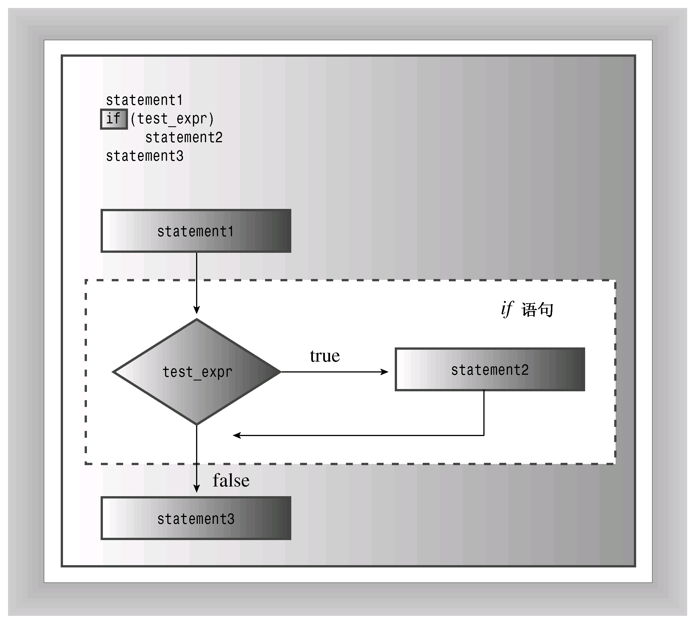
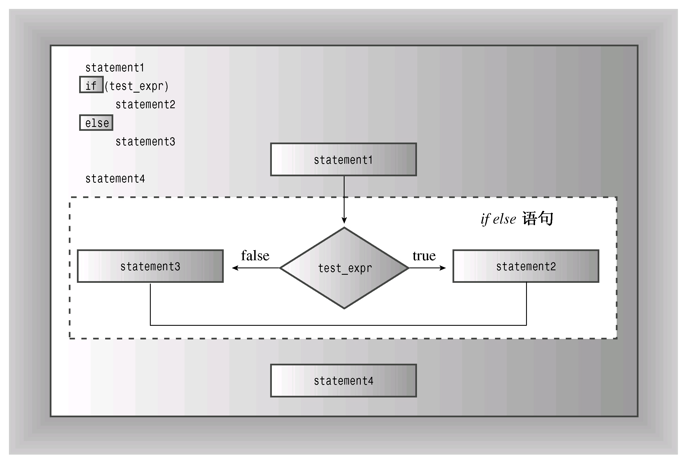
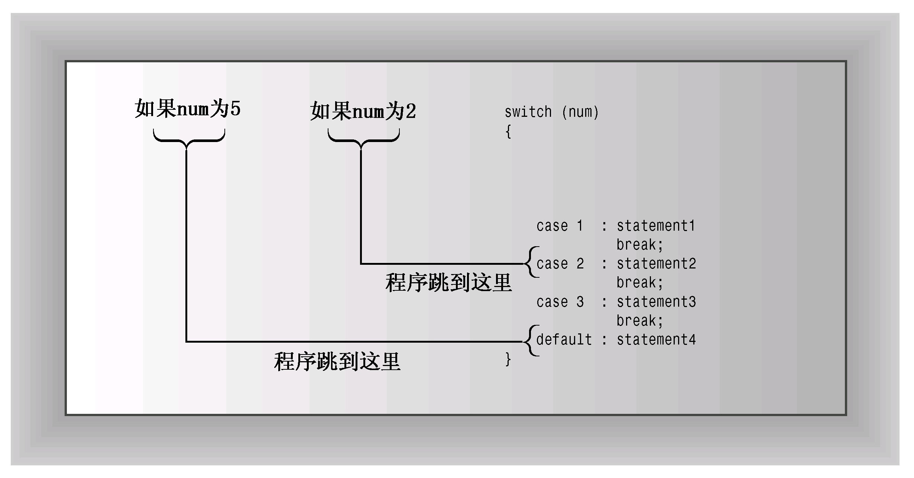
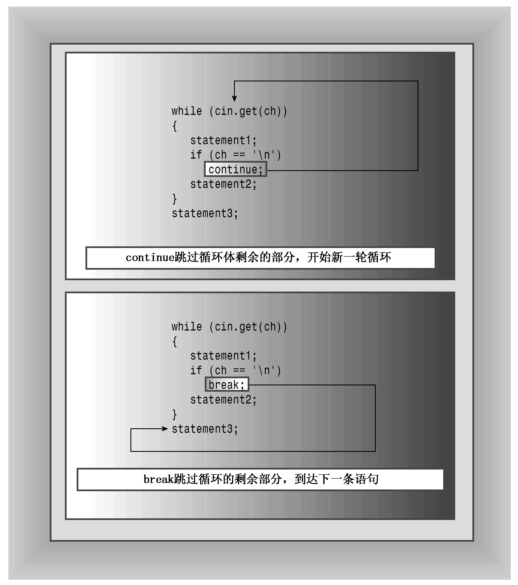

# 第6章 分支语句和逻辑运算符
本章内容包括：

* if语句。
* if else语句。
* 逻辑运算符：&&、||和!。
* cctype字符函数库。
* 条件运算符：?:。
* switch语句。
* continue和break语句。
* 读取数字的循环。
* 基本文件输入/输出。

设计智能程序的一个关键是使程序具有决策能力。第5章介绍了一种决策方式——循环，在循环中，程序决定是否继续循环。现在，来研究一下C++是如何使用分支语句在可选择的操作中做出决定的。程序应使用哪一种防止吸血鬼的方案（大蒜还是十字架）呢？用户选择了哪个菜单选项呢？用户是否输入了0？C++提供了if和switch语句来进行决策，它们是本章的主要主题。另外，还将介绍条件运算符和逻辑运算符，前者提供了另一种决策方式，而后者允许将两个测试组合在一起。最后，本章将首次介绍文件输入/输出。

## 6.1 if语句
当C++程序必须决定是否执行某个操作时，通常使用if语句来实现选择。if有两种格式：if和if else。首先看一看简单的if，它模仿英语，如“If you have a Captain Cookie card, you get a free cookie（如果您有一张Captain Cookie卡，就可获得免费的小甜饼）”。如果测试条件为rue，则if语句将引导程序执行语句或语句块；如果条件是false，程序将跳过这条语句或语句块。因此，if语句让程序能够决定是否应执行特定的语句。

if语句的语法与while相似：
```c++
if (test-condition)
    statement
```

如果test-condition（测试条件）为true，则程序将执行statement（语句），后者既可以是一条语句，也可以是语句块。如果测试条件为false，则程序将跳过语句（参见图6.1）。和循环测试条件一样，if测试条件也将被强制转换为bool值，因此0将被转换为false，非零为true。整个if语句被视为一条语句。

通常情况下，测试条件都是关系表达式，如那些用来控制循环的表达式。例如，假设读者希望程序计算输入中的空格数和字符总数，则可以在while循环中使用cin.get（char）来读取字符，然后使用if语句识别空格字符并计算其总数。程序清单6.1完成了这项工作，它使用句点（.）来确定句子的结尾。



程序清单6.1 if.cpp
```c++
// if.cpp -- using the if statement
#include <iostream>
int main()
{
    using std::cin;     // using declarations
	using std::cout;
    char ch;
    int spaces = 0;
    int total = 0;
    cin.get(ch);
    while (ch != '.')   // quit at end of sentence
    {
        if (ch == ' ')  // check if ch is a space
            ++spaces;
        ++total;        // done every time
        cin.get(ch);
    }
    cout << spaces << " spaces, " << total;
    cout << " characters total in sentence\n";

    return 0;
}
```

下面是该程序的输出：
```c++
The balloonist was an airhead
with lofty goals.
6 spaces, 46 characters total in sentence
```

正如程序中的注释指出的，仅当ch为空格时，语句++spaces;才被执行。因为语句++tota;位于if语句的外面，因此在每轮循环中都将被执行。注意，字符总数中包括按回车键生成的换行符。

### 6.1.1 if else语句
if语句让程序决定是否执行特定的语句或语句块，而if else语句则让程序决定执行两条语句或语句块中的哪一条，这种语句对于选择其中一种操作很有用。C++的if else语句模仿了简单的英语，如“If you have a Captain Cookie card, you get a Cookie Plus Plus, else you just get a Cookie d'Ordinaire（如果您拥有Captain Cookie卡，将可获得Cookie Plus Plus，否则只能获得Cookie d'Ordinaire）”。if else语句的通用格式如下：
```c++
if (test-condition)
    statement1
else
    statement2
```

如果测试条件为true或非零，则程序将执行statement1，跳过statement2；如果测试条件为false或0，则程序将跳过statement1，执行statement2。因此，如果answer是1492，则下面的代码片段将打印第一条信息，否则打印第二条信息：
```c++
if (answer == 1492)
    cout << "That's right!\n";
else
    cout << "You'd better review Chapter 1 again.\n";
```

每条语句都既可以是一条语句，也可以是用大括号括起的语句块（参见图6.2）。从语法上看，整个if else结构被视为一条语句。



例如，假设要通过对字母进行加密编码来修改输入的文本（换行符不变）。这样，每个输入行都被转换为一行输出，且长度不变。这意味着程序对换行符采用一种操作，而对其他字符采用另一种操作。正如程序清单6.2所表明的，if else使得这项工作非常简单。该程序清单还演示了限定符std::，这是编译指令using的替代品之一。

程序清单6.2 ifelse.cpp
```c++
// ifelse.cpp -- using the if else statement
#include <iostream>
int main()
{
    char ch;

    std::cout << "Type, and I shall repeat.\n";
    std::cin.get(ch);
    while (ch != '.')
    {
        if (ch == '\n')
            std::cout << ch;     // done if newline
        else
            std::cout << ++ch;   // done otherwise
        std::cin.get(ch);
    }
// try ch + 1 instead of ++ch for interesting effect
    std::cout << "\nPlease excuse the slight confusion.\n";
    // std::cin.get();
    // std::cin.get();
    return 0;
}
```

下面是该程序的运行情况：
```c++
Type, and I shall repeat.
An ineffable joy suffused me sa I beheld
Bo!jofggbcmf!kpz!tvggvtfe!nf!tb!J!cfifme
the wonders of modern computing.
uif!xpoefst!pg!npefso!dpnqvujoh
Please excuse the slight confusion.
```

注意，程序清单6.2中的注释之一指出，将++ch改为ch+1将产生一种有趣的效果。能推断出它是什么吗？如果不能，就试验一下，然后看看是否可以解释发生的情况（提示：想一想cout是如何处理不同的类型的）。

### 6.1.2 格式化if else语句
if else中的两种操作都必须是一条语句。如果需要多条语句，需要用大括号将它们括起来，组成一个块语句。和有些语言（如BASIC和FORTRAN）不同的是，由于C++不会自动将if和else之间的所有代码视为一个代码块，因此必须使用大括号将这些语句组合成一个语句块。例如，下面的代码将出现编译器错误：
```c++
if (ch == 'Z')
    zorro++;      // if ends here
    cout << "Another Zorro candidate\n";
else              // wrong
    dull++;
    cout << "Not a Zorro candidate\n";
```

编译器把它看作是一条以zorro ++;语句结尾的简单if语句，接下来是一条cout语句。到目前为止，一切正常。但之后编译器发现一个独立的else，这被视为语法错误。

请添加大括号，将语句组合成一个语句块：
```c++
if (ch == 'Z')
{                   // if true block
    zorro++;
    cout << "Another Zorro candidate\n";
}
else
{                   // if false block
    dull++;
    cout << "Not a Zorro candidate\n";
}
```

由于C++是自由格式语言，因此只要使用大括号将语句括起，对大括号的位置没有任何限制。上述代码演示了一种流行的格式，下面是另一种流行的格式：
```c++
if (ch == 'Z') {                   // if true block
    zorro++;
    cout << "Another Zorro candidate\n";
    }
else {                   // if false block
    dull++;
    cout << "Not a Zorro candidate\n";
    }
```

第一种格式强调的是语句的块结构，第二种格式则将语句块与关键字if和else更紧密地结合在一起。这两种风格清晰、一致，应该能够满足要求；然而，可能会有老师或雇主在这个问题上的观点强硬而固执。

### 6.1.3 if else if else结构
与实际生活中发生的情况类似，计算机程序也可能提供两个以上的选择。可以将C++的if else语句进行扩展来满足这种需求。正如读者知道的，else之后应是一条语句，也可以是语句块。由于if else语句本身是一条语句，所以可以放在else的后面：
```c++
if (ch == 'A')
    a_grade++;              // alternative # 1
else
    if (ch == 'B')          // alternative # 2
        b_grade++;          // subalternative # 2a
    else
        soso++;             //  subalternative # 2b
```

如果ch不是'A'，则程序将执行else。执行到那里，另一个if else又提供了两种选择。C++的自由格式允许将这些元素排列成便于阅读的格式：
```c++
if (ch == 'A')
    a_grade++;              // alternative # 1
else if (ch == 'B')          
    b_grade++;              // alternative # 2
else
    soso++;                 // alternative # 3
```

这看上去像是一个新的控制结构——if else if else结构。但实际上，它只是一个if else被包含在另一个if else中。修订后的格式更为清晰，使程序员通过浏览代码便能确定不同的选择。整个构造仍被视为一条语句。

程序清单6.3使用这种格式创建了一个小型测验程序。

程序清单6.3 ifelseif.cpp
```c++
// ifelseif.cpp -- using if else if else
#include <iostream>
const int Fave = 27;
int main()
{
    using namespace std;
    int n;

    cout << "Enter a number in the range 1-100 to find ";
    cout << "my favorite number: ";
    do
    {
        cin >> n;
        if (n < Fave)
            cout << "Too low -- guess again: ";
        else if (n > Fave)
            cout << "Too high -- guess again: ";
        else
            cout << Fave << " is right!\n";
    } while (n != Fave);

    return 0;
}
```

下面是该程序的输出：
```c++
Enter a number in the range 1-100 to find my favorite number: 50
Too high -- guess again: 25
Too low -- guess again: 37
Too high -- guess again: 31
Too high -- guess again: 28
Too high -- guess again: 27
27 is right!
```

> **条件运算符和错误防范**
> 
> 许多程序员将更直观的表达式variable = =value反转为value = =variable，以此来捕获将相等运算符误写为赋值运算符的错误。例如，下述条件有效，可以正常工作：
> ```c++
> if (3 == myNumber)
> ```
> 
> 但如果错误地使用下面的条件，编译器将生成错误消息，因为它以为程序员试图将一个值赋给一个字面值（3总是等于3，而不能将另一个值赋给它）：
> ```c++
> if (3 = myNumber)
> ```
> 
> 假设犯了类似的错误，但使用的是前一种表示方法：
> ```c++
> if (myNumber = 3)
> ```
> 
> 编译器将只是把3赋给myNumber，而if中的语句块将包含非常常见的、而又非常难以发现的错误（然而，很多编译器会发出警告，因此注意警告是明智的）。一般来说，编写让编译器能够发现错误的代码，比找出导致难以理解的错误的原因要容易得多。

## 6.2 逻辑表达式
经常需要测试多种条件。例如，字符要是小写，其值就必须大于或等于'a'，且小于或等于'z'。如果要求用户使用y或n进行响应，则希望用户无论输入大写（Y和N）或小写都可以。为满足这种需要，C++提供了3种逻辑运算符，来组合或修改已有的表达式。这些运算符分别是逻辑OR（||）、逻辑AND（&&）和逻辑NOT（!）。下面介绍这些运算符。

### 6.2.1 逻辑OR运算符：||
在英语中，当两个条件中有一个或全部满足某个要求时，可以用单词or来指明这种情况。例如，如果您或您的配偶在MegaMicro公司工作，您就可以参加MegaMicro公司的野餐会。C++可以采用逻辑OR运算符（||），将两个表达式组合在一起。如果原来表达式中的任何一个或全部都为true（或非零），则得到的表达式的值为true；否则，表达式的值为false。下面是一些例子：
```c++
5 == 5 || 5 == 9    // true because first expression is true
5 > 3 || 5 > 10     // true because first expression is true
5 > 8 || 5 < 10     // true because second expression is true
5 < 8 || 5 > 2      // true because both expression are true
5 > 8 || 5 < 2      // false because both expression are false
```

由于||的优先级比关系运算符低，因此不需要在这些表达式中使用括号。表6.1总结了||的工作原理。

C++规定，||运算符是个顺序点（sequence point）。也是说，先修改左侧的值，再对右侧的值进行判定（C++11的说法是，运算符左边的子表达式先于右边的子表达式）。例如，请看下面的表达式：
```c++
i++ < 6 || i == j
```

假设i原来的值为10，则在对i和j进行比较时，i的值将为11。另外，如果左侧的表达式为true，则C++将不会去判定右侧的表达式，因为只要一个表达式为true，则整个逻辑表达式为true（读者可能还记得，冒号和逗号运算符也是顺序点）。

程序清单6.4在一条if语句中使用||运算符来检查某个字符的大写或小写。另外，它还使用了C++字符串的拼接特性（参见第4章）将一个字符串分布在3行中。

**表6.1 ||运算符**

| | expr1 &#124;&#124; expr2的值 | |
| :--- | :--- | :--- |
| | expr1 == true | expr1 == false |
| expr2 == true | true | true |
| expr2 == false | true | false |

程序清单6.4 or.cpp
```c++
// or.cpp -- using the logical OR operator
#include <iostream>
int main()
{
    using namespace std;
    cout << "This program may reformat your hard disk\n"
            "and destroy all your data.\n"
            "Do you wish to continue? <y/n> ";
    char ch;
    cin >> ch;
    if (ch == 'y' || ch == 'Y')             // y or Y
        cout << "You were warned!\a\a\n";
    else if (ch == 'n' || ch == 'N')        // n or N
        cout << "A wise choice ... bye\n";
    else
        cout << "That wasn't a y or n! Apparently you "
                "can't follow\ninstructions, so "
                "I'll trash your disk anyway.\a\a\a\n";

    return 0;
}
```

该程序不会带来任何威胁，下面是其运行情况：
```c++
This program may reformat your hard disk
and destroy all your data.
Do you wish to continue? <y/n> n
A wise choice ... bye
```

由于程序只读取一个字符，因此只读取响应的第一个字符。这意味着用户可以用NO!（而不是N）进行回答，程序将只读取N。然而，如果程序后面再读取输入时，将从O开始读取。

### 6.2.2 逻辑AND运算符：&&
逻辑AND运算符（&&），也是将两个表达式组合成一个表达式。仅当原来的两个表达式都为true时，得到的表达式的值才为true。下面是一些例子：
```c++
5 == 5 && 4 == 4      // true beacause both expressions are true
5 == 3 && 4 == 4      // false beacause first expressions is false
5 > 3 && 5 > 10       // false beacause second expressions is false
5 > 8 && 5 < 10       // false beacause first expressions is false
5 < 8 && 5 > 2        // true beacause both expressions are true
5 > 8 && 5 < 2        // false beacause both expressions are false
```

由于&&的优先级低于关系运算符，因此不必在这些表达式中使用括号。和||运算符一样，&&运算符也是顺序点，因此将首先判定左侧，并且在右侧被判定之前产生所有的副作用。如果左侧为false，则整个逻辑表达式必定为false，在这种情况下，C++将不会再对右侧进行判定。表6.2总结了&&运算符的工作方式。

**表6.2 &&运算符**

| | expr1 &#38;&#38; expr2的值 | |
| :--- | :--- | :--- |
| | expr1 == true | expr1 == false |
| expr2 == true | true | false |
| expr2 == false | false | false |

程序清单6.5演示了如何用&&来处理一种常见的情况——由于两种不同的原因而结束while循环。在这个程序清单中，一个while循环将值读入到数组。一个测试（i < ArSize）在数组被填满时循环结束，另一个测试（temp>=0）让用户通过输入一个负值来提前结束循环。该程序使用&&运算符将两个测试组合成一个条件。该程序还使用了两条if语句、一条if else语句和一个for循环，因此它演示了本章和第5章的多个主题。

程序清单6.5 and.cpp
```c++
// and.cpp -- using the logical AND operator
#include <iostream>
const int ArSize = 6;
int main()
{
    using namespace std;
    float naaq[ArSize];
    cout << "Enter the NAAQs (New Age Awareness Quotients) "
         << "of\nyour neighbors. Program terminates "
         << "when you make\n" << ArSize << " entries "
         << "or enter a negative value.\n";

    int i = 0;
    float temp;
    cout << "First value: ";
    cin >> temp;
    while (i < ArSize && temp >= 0) // 2 quitting criteria
    {
        naaq[i] = temp;
        ++i;
        if (i < ArSize)             // room left in the array,
        {
            cout << "Next value: ";
            cin >> temp;            // so get next value
        }
    }
    if (i == 0)
        cout << "No data--bye\n";
    else
    {
        cout << "Enter your NAAQ: ";
        float you;
        cin >> you;
        int count = 0;
        for (int j = 0; j < i; j++)
            if (naaq[j] > you)
                ++count;
        cout << count;
        cout << " of your neighbors have greater awareness of\n"
             << "the New Age than you do.\n";
    }

    return 0; 
}
```

注意，该程序将输入放在临时变量temp中。在核实输入有效后，程序才将这个值赋给数组。

下面是该程序的两次运行情况。一次在输入6个值后结束：
```c++
Enter the NAAQs (New Age Awareness Quotients) of
your neighbors. Program terminates when you make
6 entries or enter a negative value.
First value: 28
Next value: 72
Next value: 15
Next value: 6
Next value: 130
Next value: 145
Enter your NAAQ: 50
3 of your neighbors have greater awareness of
the New Age than you do.
```

另一次在输入负值后结束：
```c++
Enter the NAAQs (New Age Awareness Quotients) of
your neighbors. Program terminates when you make
6 entries or enter a negative value.
First value: 123
Next value: 119
Next value: 4
Next value: 89
Next value: -1
Enter your NAAQ: 123.031
0 of your neighbors have greater awareness of
the New Age than you do.
```

程序说明

来看看该程序的输入部分：
```c++
while (i < ArSize && temp >= 0) // 2 quitting criteria
{
    naaq[i] = temp;
    ++i;
    if (i < ArSize)             // room left in the array,
    {
        cout << "Next value: ";
        cin >> temp;            // so get next value
    }
}
```

该程序首先将第一个输入值读入到临时变量（temp）中。然后，while测试条件查看数组中是否还有空间（i < ArSize）以及输入值是否为非负（temp >=0）。如果满足条件，则将temp的值复制到数组中，并将数组索引加1。此时，由于数组下标从0开始，因此i指示输入了多少个值。也是说，如果i从0开始，则第一轮循环将一个值赋给naaq[0]，然后将i设置为1。

当数组被填满或用户输入了负值时，循环将结束。注意，仅当i小于ArSize时，即数组中还有空间时，循环才将另外一个值读入到temp中。

获得数据后，如果没有输入任何数据（即第一次输入的是一个负数），程序将使用if else语句指出这一点，如果存在数据，就对数据进行处理。

### 6.2.3 用&&来设置取值范围
&&运算符还允许建立一系列if else if else语句，其中每种选择都对应于一个特定的取值范围。程序清单6.6演示了这种方法。另外，它还演示了一种用于处理一系列消息的技术。与char指针变量可以通过指向一个字符串的开始位置来标识该字符串一样，char指针数组也可以标识一系列字符串，只要将每一个字符串的地址赋给各个数组元素即可。程序清单6.6使用qualify数组来存储4个字符串的地址，例如，qualify [1]存储字符串“mud tug-of-war\n”的地址。然后，程序便能够将cout、strlen( )或strcmp( )用于qualify [1]，就像用于其他字符串指针一样。使用const限定符可以避免无意间修改这些字符串。

程序清单6.6 more_and.cpp
```c++
// more_and.cpp -- using the logical AND operator
#include <iostream>
const char * qualify[4] =       // an array of pointers*/
{                               // to strings
    "10,000-meter race.\n",
    "mud tug-of-war.\n",
    "masters canoe jousting.\n",
    "pie-throwing festival.\n"
};
int main()
{
    using namespace std;
    int age;
    cout << "Enter your age in years: ";
    cin >> age;
    int index;

    if (age > 17 && age < 35)
        index = 0;
    else if (age >= 35 && age < 50)
        index = 1;
    else if (age >= 50 && age < 65)
        index = 2;
    else
        index = 3;

    cout << "You qualify for the " << qualify[index]; 
    // cin.get();
    // cin.get();
    return 0;
}
```

下面是该程序的运行情况：
```c++
Enter your age in years: 87
You qualify for the pie-throwing festival.
```

由于输入的年龄不与任何测试取值范围匹配，因此程序将索引设置为3，然后打印相应的字符串。

程序说明

在程序清单6.6中，表达式age > 17 && age < 35测试年龄是否位于两个值之间，即年龄是否在18岁到34岁之间。表达式age >= 35 && age < 50使用<=运算符将35包括在取值范围内。如果程序使用age > 35 && age < 50，则35将被所有的测试忽略。在使用取值范围测试时，应确保取值范围之间既没有缝隙，又没有重叠。另外，应确保正确设置每个取值范围（参见本节后面的旁注“取值范围测试”）。

if else语句用来选择数组索引，而索引则标识特定的字符串。

> **取值范围测试**
> 
> 取值范围测试的每一部分都使用AND运算符将两个完整的关系表达式组合起来：
> ```c++
> if (age > 17 && age <35)    // ok
> ```
> 
> 不要使用数学符号将其表示为：
> ```c++
> if (17 < age <35)           // Don't do this!
> ```
> 
> 编译器不会捕获这种错误，因为它仍然是有效的C++语法。< 运算符从左向右结合，因此上述表达式的含义如下：
> ```c++
> if ((17 < age) < 35)
> ```
> 
> 但17 < age的值要么为true（1），要么为false（0）。不管是哪种情况，表达式17 < age的值都小于35，因此整个测试的结果总是true！

### 6.2.4 逻辑NOT运算符：!
!运算符将它后面的表达式的真值取反。也是说，如果expression为true，则!expression是false；如果expression为false，则!expression是true。更准确地说，如果expression为true或非零，则!expression为false。

通常，不使用这个运算符可以更清楚地表示关系：
```c++
if (!(x > 5))     // if (x <= 5) is clearer
```

然而，!运算符对于返回true-false值或可以被解释为true-false值的函数来说很有用。例如，如果C-风格字符串s1和s2不同，则strcmp(s1, s2)将返回非零（true）值，否则返回0。这意味着如果这两个字符串相同，则!strcmp(s1, s2)为true。

程序清单6.7使用这种技术（将!运算符用于函数返回值）来筛选可赋给int变量的数字输入。如果用户定义的函数is_int( )（稍后将详细介绍）的参数位于int类型的取值范围内，则它将返回true。然后，程序使用while(!is-int(num))测试来拒绝不在该取值范围内的值。

程序清单6.7 not.cpp
```c++
// not.cpp -- using the not operator
#include <iostream>
#include <climits>
bool is_int(double); 
int main()
{
    using namespace std;
    double num;

    cout << "Yo, dude! Enter an integer value: ";
    cin >> num;
    while (!is_int(num))    // continue while num is not int-able
    {
        cout << "Out of range -- please try again: ";
        cin >> num;
    }
    int val = int (num);    // type cast
    cout << "You've entered the integer " << val << "\nBye\n";
    // cin.get();
    // cin.get();
    return 0;
}

bool is_int(double x)
{
    if (x <= INT_MAX && x >= INT_MIN)   // use climits values
        return true;
    else
        return false; 
}
```

下面是该程序在int占32位的系统上的运行情况：
```c++
Yo, dude! Enter an integer value: 6234128679
Out of range -- please try again: -8000222333
Out of range -- please try again: 99999
You've entered the integer 99999
Bye
```

程序说明

如果给读取int值的程序输入一个过大的值，很多C++实现只是将这个值截短为合适的大小，并不会通知丢失了数据。程序清单6.7中的程序避免了这样的问题，它首先将可能的int值作为double值来读取。double类型的精度足以存储典型的int值，且取值范围更大。另一种选择是，使用long long来存储输入的值，因为其取值范围比int大。

布尔函数is_int( )使用了climits文件（第3章讨论过）中定义的两个符号常量（INT_MAX和INT_MIN）来确定其参数是否位于适当的范围内。如果是，该函数将返回true，否则返回false。

main( )程序使用while循环来拒绝无效输入，直到用户输入有效的值为止。可以在输入超出取值范围时显示int的界限，这样程序将更为友好。确认输入有效后，程序将其赋给一个int变量。

### 6.2.5 逻辑运算符细节
正如本章前面指出的，C++逻辑OR和逻辑AND运算符的优先级都低于关系运算符。这意味着下面的表达式
```c++
x > 5 && x < 10
```

将被解释为：
```c++
(x > 5) && (x < 10)
```

另一方面，!运算符的优先级高于所有的关系运算符和算术运算符。因此，要对表达式求反，必须用括号将其括起，如下所示：
```c++
!(x > 5)      // is it false that x is greater than 5
!x > 5        // is !x greater than 5
```

第二个表达式总是为false，因为!x的值只能为true或false，而它们将被转换为1或0。

逻辑AND运算符的优先级高于逻辑OR运算符。因此，表达式：
```c++
age > 30 && age < 45 || weight > 300
```

被解释为：
```c++
(age > 30 && age < 45) || weight > 300
```

也是说，一个条件是age位于31～44，另一个条件是weight大于300。如果这两个条件中的一个或全部都为true，则整个表达式为true。

当然，还可以用括号将所希望的解释告诉程序。例如，假设要用&&将age大于50或weight大于300的条件与donation大于1000的条件组合在一起，则必须使用括号将OR部分括起：
```c++
(age > 50 || weight > 300) && donation > 1000
```

否则，编译器将把weight条件与donation条件（而不是age条件）组合在一起。

虽然C++运算符的优先级规则常可能不使用括号便可以编写复合比较的语句，但最简单的方法还是用括号将测试进行分组，而不管是否需要括号。这样代码容易阅读，避免读者查看不常使用的优先级规则，并减少由于没有准确记住所使用的规则而出错的可能性。

C++确保程序从左向右进行计算逻辑表达式，并在知道答案后立刻停止。例如，假设有下面的条件：
```c++
x != 0 && 1.0 / x > 100.0
```

如果第一个条件为false，则整个表达式肯定为false。这是因为要使整个表达式为true，每个条件都必须为true。知道第一个条件为false后，程序将不判定第二个条件。这个例子非常幸运，因为计算第二个条件将导致被0除，这是计算机没有定义的操作。

### 6.2.6 其他表示方式
并不是所有的键盘都提供了用作逻辑运算符的符号，因此C++标准提供了另一种表示方式，如表6.3所示。标识符and、or和not都是C++保留字，这意味着不能将它们用作变量名等。它们不是关键字，因为它们都是已有语言特性的另一种表示方式。另外，它们并不是C语言中的保留字，但C语言程序可以将它们用作运算符，只要在程序中包含了头文件iso646.h。C++不要求使用头文件。

**表6.3 逻辑运算符：另一种表示方式**

| 运算符 | 另一种表示方式 |
| :--- | :--- |
| && | and |
| &#124;&#124; | or |
| ! | not |

## 6.3 字符函数库cctype
C++从C语言继承了一个与字符相关的、非常方便的函数软件包，它可以简化诸如确定字符是否为大写字母、数字、标点符号等工作，这些函数的原型是在头文件cctype（老式的风格中为ctype.h）中定义的。例如，如果ch是一个字母，则isalpha（ch）函数返回一个非零值，否则返回0。同样，如果ch是标点符号（如逗号或句号），函数ispunct（ch）将返回true。（这些函数的返回类型为int，而不是bool，但通常bool转换让您能够将它们视为bool类型。）

使用这些函数比使用AND和OR运算符更方便。例如，下面是使用AND和OR来测试字符ch是不是字母字符的代码：
```c++
if ((ch >= 'a' && ch <= 'z') || (ch >= 'A' && ch <= 'Z'))
```

与使用isalpha( )相比：
```c++
if (isalpha(ch))
```

isalpha( )不仅更容易使用，而且更通用。AND/OR格式假设A-Z的字符编码是连续的，其他字符的编码不在这个范围内。这种假设对于ASCII码来说是成立的，但通常并非总是如此。

程序清单6.8演示一些ctype库函数。具体地说，它使用isalpha( )来检查字符是否为字母字符，使用isdigits( )来测试字符是否为数字字符，如3，使用isspace( )来测试字符是否为空白，如换行符、空格和制表符，使用ispunct( )来测试字符是否为标点符号。该程序还复习了if else if结构，并在一个while循环中使用了cin.get（char）。

程序清单6.8 cctypes.cpp
```c++
// cctypes.cpp -- using the ctype.h library
#include <iostream>
#include <cctype>              // prototypes for character functions
int main()
{
    using namespace std;
    cout << "Enter text for analysis, and type @"
            " to terminate input.\n";
    char ch;  
    int whitespace = 0;
    int digits = 0;
    int chars = 0;
    int punct = 0;
    int others = 0;

    cin.get(ch);                // get first character
    while (ch != '@')            // test for sentinel
    {
        if(isalpha(ch))         // is it an alphabetic character?
            chars++;
        else if(isspace(ch))    // is it a whitespace character?
            whitespace++;
        else if(isdigit(ch))    // is it a digit?
            digits++;
        else if(ispunct(ch))    // is it punctuation?
            punct++;
        else
            others++;
        cin.get(ch);            // get next character
    }
    cout << chars << " letters, "
         << whitespace << " whitespace, "
         << digits << " digits, "
         << punct << " punctuations, "
         << others << " others.\n";
    // cin.get();
    // cin.get();
    return 0; 
}
```

下面是该程序的运行情况。注意，空白字符计数中包括换行符：
```c++
Enter text for analysis, and type @ to terminate input.
AdrenalVison International producer Adrienne Vismonger
announced production of their new 3-D film, a remake of
"My Dinner with Andre," scheduled for 2013. "Wait until
you see the the new scene with an enraged Collossipede!"@
176 letters, 34 whitespace, 5 digits, 9 punctuations, 0 others.
```

表6.4对cctype软件包中的函数进行了总结。有些系统可能没有表中列出的一些函数，也可能还有在表中没有列出的一些函数。

**表6.4 cctype中的字符函数**

| 函 数 名 称 | 返 回 值 |
| :--- | :--- |
| isalnum( ) | 如果参数是字母数字，即字母或数字，该函数返回true |
| isalpha( ) | 如果参数是字母，该函数返回true |
| iscntrl( ) | 如果参数是控制字符，该函数返回true |
| isdigit( ) | 如果参数是数字（0～9），该函数返回true |
| isgraph( ) | 如果参数是除空格之外的打印字符，该函数返回true |
| islower( ) | 如果参数是小写字母，该函数返回true |
| isprint( ) | 如果参数是打印字符（包括空格），该函数返回true |
| ispunct( ) | 如果参数是标点符号，该函数返回true |
| isspace( ) | 如果参数是标准空白字符，如空格、进纸、换行符、回车、水平制表符或者垂直制表符，该函数返回true |
| isupper( ) | 如果参数是大写字母，该函数返回true |
| isxdigit( ) | 如果参数是十六进制数字，即0～9、a～f或A～F，该函数返回true |
| tolower( ) | 如果参数是大写字符，则返回其小写，否则返回该参数 |
| toupper( ) | 如果参数是小写字符，则返回其大写，否则返回该参数 |

## 6.4 ?:运算符
C++有一个常被用来代替if else语句的运算符，这个运算符被称为条件运算符（?:），它是C++中唯一一个需要3个操作数的运算符。该运算符的通用格式如下：
```c++
expression1 ? expression2 : expression3
```

如果expression1为true，则整个条件表达式的值为expression2的值；否则，整个表达式的值为expression3的值。下面的两个示例演示了该运算符是如何工作的：
```c++
5 > 3 ? 10 : 12       // 5 > 3 is true, so expression value is 10
3 == 9 ? 25 : 18      // 3 == 9 is false, so expression value is 18
```

可以这样解释第一个示例：如果5大于3，则整个表达式的值为10，否则为12。当然，在实际的编程中，这些表达式中将包含变量。

程序清单6.9使用条件运算符来确定两个值中较大的一个。

程序清单6.9 condit.cpp
```c++
// condit.cpp -- using the conditional operator
#include <iostream>
int main()
{
    using namespace std;
    int a, b;
    cout << "Enter two integers: ";
    cin >> a >> b;
    cout << "The larger of " << a << " and " << b;
    int c = a > b ? a : b;   // c = a if a > b, else c = b
    cout << " is " << c << endl;
    // cin.get();
    // cin.get();
	return 0; 
}
```

下面是该程序的运行情况：
```c++
Enter two integers: 25 28
The larger of 25 and 28 is 28
```

该程序的关键部分是下面的语句：
```c++
int c = a > b ? a : b;
```

它与下面的语句等效：
```c++
int c;
if (a > b)
    c = a;
else
    c = b;
```

与if else序列相比，条件运算符更简洁，但第一次遇到时不那么容易理解。这两种方法之间的区别是，条件运算符生成一个表达式，因此是一个值，可以将其赋给变量或将其放到一个更大的表达式中，程序清单6.9中的程序正是这样做的，它将条件表达式的值赋给变量c。条件运算符格式简洁、语法奇特、外观与众不同，因此在欣赏这些特点的程序员中广受欢迎。其中一个技巧（它完成一个应被谴责的任务——隐藏代码）是将条件表达式嵌套在另一个条件表达式中，如下所示：
```c++
const char x[2][20] = {"Jason", "at your service\n"};
const char * y = "Quillstone";

for (int i = 0; i < 3; i++)
    cout << ((i < 2) ? !i ? x[i] : y : x[1]);
```

这是一种费解的方式（但绝不是最难理解的），它按下面的顺序打印3个字符串：
```c++
Jason Quillstone at your service
```

从可读性来说，条件运算符最适合于简单关系和简单表达式的值：
```c++
x = (x > y) ? x: y;
```

当代码变得更复杂时，使用if else语句来表达可能更为清晰。

## 6.5 switch语句
假设要创建一个屏幕菜单，要求用户从5个选项中选择一个，例如，便宜、适中、昂贵、奢侈、过度。虽然可以扩展if else if else序列来处理这5种情况，但C++的switch语句能够更容易地从大型列表中进行选择。下面是switch语句的通用格式：
```c++
switch statement:
switch (integer-expression)
{
    case label1: statement(s)
    case label2: statement(s)
    ...
    default: statement(s)
}
```

C++的switch语句就像指路牌，告诉计算机接下来应执行哪行代码。执行到switch语句时，程序将跳到使用integer-expression的值标记的那一行。例如，如果integer-expression的值为4，则程序将执行标签为case 4：那一行。顾名思义，integer-expression必须是一个结果为整数值的表达式。另外，每个标签都必须是整数常量表达式。最常见的标签是int或char常量（如1或'q'），也可以是枚举量。如果integer-expression不与任何标签匹配，则程序将跳到标签为default的那一行。Default标签是可选的，如果被省略，而又没有匹配的标签，则程序将跳到switch后面的语句处执行（参见图6.3）。

switch语句与Pascal等语言中类似的语句之间存在重大的差别。C++中的case标签只是行标签，而不是选项之间的界线。也是说，程序跳到switch中特定代码行后，将依次执行之后的所有语句，除非有明确的其他指示。程序不会在执行到下一个case处自动停止，要让程序执行完一组特定语句后停止，必须使用break语句。这将导致程序跳到switch后面的语句处执行。

程序清单6.10演示了如何使用switch和break来让用户选择简单菜单。该程序使用showmenu( )函数显示一组选项，然后使用switch语句，根据用户的反应执行相应的操作。



> **注意：**
> 
> 有些硬件/操作系统组合不会将（程序清单6.10的case 1中使用的）转义序列\a解释为振铃。

程序清单6.10 switch.cpp
```c++
// switch.cpp -- using the switch statement
#include <iostream>
using namespace std;
void showmenu();   // function prototypes
void report();
void comfort();
int main()
{
    showmenu();
    int choice;
    cin >> choice;
    while (choice != 5)
    {
        switch(choice)
        {
            case 1  :   cout << "\a\n";
                        break;
            case 2  :   report();
                        break;
            case 3  :   cout << "The boss was in all day.\n";
                        break;
            case 4  :   comfort();
                        break;
            default :   cout << "That's not a choice.\n";
        }
        showmenu();
        cin >> choice;
    }
    cout << "Bye!\n";
    // cin.get();
    // cin.get();
    return 0;
}

void showmenu()
{
    cout << "Please enter 1, 2, 3, 4, or 5:\n"
            "1) alarm           2) report\n"
            "3) alibi           4) comfort\n"
            "5) quit\n";
}
void report()
{
    cout << "It's been an excellent week for business.\n"
        "Sales are up 120%. Expenses are down 35%.\n";
}
void comfort()
{
    cout << "Your employees think you are the finest CEO\n"
        "in the industry. The board of directors think\n"
        "you are the finest CEO in the industry.\n";
}
```

下面是该程序的运行情况：
```c++
Please enter 1, 2, 3, 4, or 5:
1) alarm           2) report
3) alibi           4) comfort
5) quit
4
Your employees think you are the finest CEO
in the industry. The board of directors think
you are the finest CEO in the industry.
Please enter 1, 2, 3, 4, or 5:
1) alarm           2) report
3) alibi           4) comfort
5) quit
2
It's been an excellent week for business.
Sales are up 120%. Expenses are down 35%.
Please enter 1, 2, 3, 4, or 5:
1) alarm           2) report
3) alibi           4) comfort
5) quit
6
That's not a choice.
Please enter 1, 2, 3, 4, or 5:
1) alarm           2) report
3) alibi           4) comfort
5) quit
5
Bye!
```

当用户输入了5时，while循环结束。输入1到4将执行switch列表中相应的操作，输入6将执行默认语句。

为让这个程序正确运行，输入必须是整数。例如，如果输入一个字母，输入语句将失效，导致循环不断运行，直到您终止程序。为应对不按指示办事的用户，最好使用字符输入。

如前所述，该程序需要break语句来确保只执行switch语句中的特定部分。为检查情况是否如此，可以删除程序清单6.10中的break语句，然后看看其运行情况。例如，读者将发现，输入2后，将执行case标签为2、3、4和defualt中的所有语句。C++之所以这样，是由于这种行为很有用。例如，它使得使用多个标签很简单。例如，假设重新编写程序清单6.10，使用字符（而不是整数）作为菜单选项和switch标签，则可以为大写标签和小写标签提供相同的语句：
```c++
char choice;
cin >> choice;
while (choice != 'Q' && choice != 'q')
{
    switch (choice)
    {
        case 'a':
        case 'A': cout << "\a\n";
                  break;
        case 'r':
        case 'R': report();
                  break;
        case 'l':
        case 'L': cout << "The boss was in all day.\n";
                  break;
        case 'c':
        case 'C': comfort();
                  break;
        default: cout << "That's not a choice.\n";
    }
    showmenu();
    cin >> choice;
}
```

由于case 'a'后面没有break语句，因此程序将接着执行下一行 —— case 'A'后面的语句。

### 6.5.1 将枚举量用作标签
程序清单6.11使用enum定义了一组相关的常量，然后在switch语句中使用这些常量。通常，cin无法识别枚举类型（它不知道程序员是如何定义它们的），因此该程序要求用户选择选项时输入一个整数。当switch语句将int值和枚举量标签进行比较时，将枚举量提升为int。另外，在while循环测试条件中，也会将枚举量提升为int类型。

程序清单6.11 enum.cpp
```c++
// enum.cpp -- using enum
#include <iostream>
// create named constants for 0 - 6
enum {red, orange, yellow, green, blue, violet, indigo};

int main()
{
    using namespace std;
    cout << "Enter color code (0-6): ";
    int code;
    cin >> code;
    while (code >= red && code <= indigo)
    {
        switch (code)
        {
            case red     : cout << "Her lips were red.\n"; break;
            case orange  : cout << "Her hair was orange.\n"; break;
            case yellow  : cout << "Her shoes were yellow.\n"; break;
            case green   : cout << "Her nails were green.\n"; break;
            case blue    : cout << "Her sweatsuit was blue.\n"; break;
            case violet  : cout << "Her eyes were violet.\n"; break;
            case indigo  : cout << "Her mood was indigo.\n"; break;
        }
        cout << "Enter color code (0-6): ";
        cin >> code;
    }
    cout << "Bye\n";
    // cin.get();
    // cin.get();
    return 0; 
}
```

下面是该程序的输出：
```c++
Enter color code (0-6): 3
Her nails were green.
Enter color code (0-6): 5
Her eyes were violet.
Enter color code (0-6): 2
Her shoes were yellow.
Enter color code (0-6): 8
Bye
```

### 6.5.2 switch和if else
switch语句和if else语句都允许程序从选项中进行选择。相比之下，if else更通用。例如，它可以处理取值范围，如下所示：
```c++
if (age > 17 && age < 35)
    index = 0;
else if (age >= 35 && age < 50)
    index = 1;
else if (age >= 50 && age < 65)
    index = 2;
else
    index = 3;
```

然而，switch并不是为处理取值范围而设计的。switch语句中的每一个case标签都必须是一个单独的值。另外，这个值必须是整数（包括char），因此switch无法处理浮点测试。另外case标签值还必须是常量。如果选项涉及取值范围、浮点测试或两个变量的比较，则应使用if else语句。

然而，如果所有的选项都可以使用整数常量来标识，则可以使用switch语句或if else语句。由于switch语句是专门为这种情况设计的，因此，如果选项超过两个，则就代码长度和执行速度而言，switch语句的效率更高。

> **提示：**
> 
> 如果既可以使用if else if语句，也可以使用switch语句，则当选项不少于3个时，应使用switch语句。

## 6.6 break和continue语句
break和continue语句都使程序能够跳过部分代码。可以在switch语句或任何循环中使用break语句，使程序跳到switch或循环后面的语句处执行。continue语句用于循环中，让程序跳过循环体中余下的代码，并开始新一轮循环（参见图6.4）。



程序清单6.12演示了这两条语句是如何工作的。该程序让用户输入一行文本。循环将回显每个字符，如果该字符为句点，则使用break结束循环。这表明，可以在某种条件为true时，使用break来结束循环。接下来，程序计算空格数，但不计算其他字符。当字符不为空格时，循环使用continue语句跳过计数部分。

程序清单6.12 jump.cpp
```c++
// jump.cpp -- using continue and break
#include <iostream>
const int ArSize = 80;
int main()
{
    using namespace std;
    char line[ArSize];
    int spaces = 0; 

    cout << "Enter a line of text:\n";
    cin.get(line, ArSize);
    cout << "Complete line:\n" << line << endl;
    cout << "Line through first period:\n";
    for (int i = 0; line[i] != '\0'; i++)
    {
        cout << line[i];    // display character
        if (line[i] == '.') // quit if it's a period
            break;
        if (line[i] != ' ') // skip rest of loop
            continue;
        spaces++;
    }
    cout << "\n" << spaces << " spaces\n";
    cout << "Done.\n";
    // cin.get();
    // cin.get();
    return 0;
}
```

下面是该程序的运行情况：
```c++
Enter a line of text:
Let's do lunch today. You can pay!
Complete line:
Let's do lunch today. You can pay!
Line through first period:
Let's do lunch today.
3 spaces
Done.
```

程序说明

虽然continue语句导致该程序跳过循环体的剩余部分，但不会跳过循环的更新表达式。在for循环中，continue语句使程序直接跳到更新表达式处，然后跳到测试表达式处。然而，对于while循环来说，continue将使程序直接跳到测试表达式处，因此while循环体中位于continue之后的更新表达式都将被跳过。在某些情况下，这可能是一个问题。

该程序可以不使用continue语句，而使用下面的代码：
```c++
if (line[i] == ' ')
    spaces++;
```

然而，当continue之后有多条语句时，continue语句可以提高程序的可读性。这样，就不必将所有这些语句放在if语句中。

和C语言一样，C++也有goto语句。下面的语句将跳到使用paris:作为标签的位置：
```c++
goto paris;
```

也就是说，可以有下面这样的代码：
```c++
char ch;
cin >> ch;
if (ch == 'P')
    goto paris;
cout << ...
...
paris: cout << "You've just arrived at paris.\n";
```

在大多数情况下（有些人认为，在任何情况下），使用goto语句不好，而应使用结构化控制语句（如if else、switch、continue等）来控制程序的流程。

## 6.7 读取数字的循环
假设要编写一个将一系列数字读入到数组中的程序，并允许用户在数组填满之前结束输入。一种方法是利用cin。请看下面的代码：
```c++
int n;
cin >> n;
```

如果用户输入一个单词，而不是一个数字，情况将如何呢？发生这种类型不匹配的情况时，将发生4种情况：

* n的值保持不变；
* 不匹配的输入将被留在输入队列中；
* cin对象中的一个错误标记被设置；
* 对cin方法的调用将返回false（如果被转换为bool类型）。

方法返回false意味着可以用非数字输入来结束读取数字的循环。非数字输入设置错误标记意味着必须重置该标记，程序才能继续读取输入。clear( )方法重置错误输入标记，同时也重置文件尾（EOF条件，参见第5章）。输入错误和EOF都将导致cin返回false，第17章将讨论如何区分这两种情况。下面来看两个演示这些技术的示例。

假设要编写一个程序，来计算平均每天捕获的鱼的重量。这里假设每天最多捕获5条鱼，因此一个包含5个元素的数组将足以存储所有的数据，但也可能没有捕获这么多鱼。在程序清单6.13中，如果数组被填满或者输入了非数字输入，循环将结束。

程序清单6.13 cinfish.cpp
```c++
// cinfish.cpp -- non-numeric input terminates loop
#include <iostream>
const int Max = 5;
int main()
{
    using namespace std;
// get data
    double fish[Max];
    cout << "Please enter the weights of your fish.\n";
    cout << "You may enter up to " << Max
            << " fish <q to terminate>.\n";
    cout << "fish #1: ";
    int i = 0;
    while (i < Max && cin >> fish[i]) {
        if (++i < Max)
            cout << "fish #" << i+1 << ": ";
    }
// calculate average
    double total = 0.0;
    for (int j = 0; j < i; j++)
        total += fish[j];
// report results
    if (i == 0)
        cout << "No fish\n";
    else
        cout << total / i << " = average weight of "
            << i << " fish\n";
    cout << "Done.\n";
// code to keep VC execution window open if q is entered
//	if (!cin)  // input terminated by non-numeric response
//	{
//	    cin.clear();  // reset input
//	    cin.get();    // read q
//	}
//	cin.get();    // read end of line after last input
//	cin.get();    // wait for user to press <Enter>
    return 0; 
}
```

> **注意：**
> 
> 本书前面说过，在有些执行环境中，为让窗口打开以便能够看到输出，需要添加额外的代码。在这个示例中，由于输入‘q’结束输入，处理起来更复杂些：
> ```c++
> if (!cin)             // input terminated by non-numeric response
> {
>     cin.clear();      // reset input
>     cin.get();        // read q
> }
> cin.get();            // read end of line after last input
> cin.get();            // wait for user to press <Enter>
> ```
> 
> 在程序清单6.13中，如果要让程序在结束循环后接收输入，也可使用类似的代码。
> 
> 程序清单6.14更进了一步，它使用cin来返回值并重置cin。

程序清单6.13中的表达式cin>>fish [i]实际上一个是cin方法函数调用，该函数返回cin。如果cin位于测试条件中，则将被转换为bool类型。如果输入成功，则转换后的值为true，否则为false。如果表达式的值为false，则循环结束。下面是该程序的运行情况：
```c++
Please enter the weights of your fish.
You may enter up to 5 fish <q to terminate>.
fish #1: 30
fish #2: 35
fish #3: 25
fish #4: 40
fish #5: q
32.5 = average weight of 4 fish
Done.
```

请注意下面的代码行：
```c++
while (i < Max && cin >> fish[i]) {
```

前面讲过，如果逻辑AND表达式的左侧为false，则C++将不会判断右侧的表达式。在这里，对右侧的表达式进行判定意味着用cin将输入放到数组中。如果i等于Max，则循环将结束，而不会将一个值读入到数组后面的位置中。

当用户输入的不是数字时，该程序将不再读取输入。下面来看一个继续读取的例子。假设程序要求用户提供5个高尔夫得分，以计算平均成绩。如果用户输入非数字输入，程序将拒绝，并要求用户继续输入数字。可以看到，可以使用cin输入表达式的值来检测输入是不是数字。程序发现用户输入了错误内容时，应采取3个步骤。

1. 重置cin以接受新的输入。

2. 删除错误输入。

3. 提示用户再输入。

请注意，程序必须先重置cin，然后才能删除错误输入。程序清单6.14演示了如何完成这些工作。

程序清单6.14 cingolf.cpp
```c++
// cingolf.cpp -- non-numeric input skipped
#include <iostream>
const int Max = 5;
int main()
{
    using namespace std;
// get data
    int golf[Max];
    cout << "Please enter your golf scores.\n";
    cout << "You must enter " << Max << " rounds.\n";
    int i;
    for (i = 0; i < Max; i++)
    {
        cout << "round #" << i+1 << ": ";
        while (!(cin >> golf[i])) {
            cin.clear();     // reset input
            while (cin.get() != '\n')
                continue;    // get rid of bad input
            cout << "Please enter a number: ";
        }
    }
// calculate average
    double total = 0.0;
    for (i = 0; i < Max; i++)
        total += golf[i];
// report results
    cout << total / Max << " = average score "
            << Max << " rounds\n";
    // cin.get();
    // cin.get();
    return 0; 
}
```

下面是该程序的运行情况：
```c++
Please enter your golf scores.
You must enter 5 rounds.
round #1: 88
round #2: 87
round #3: must i?
Please enter a number: 103
round #4: 94
round #5: 86
91.6 = average score 5 rounds
```

程序说明

在程序清单6.14中，错误处理代码的关键部分如下：
```c++
while (!(cin >> golf[i])) {
            cin.clear();     // reset input
            while (cin.get() != '\n')
                continue;    // get rid of bad input
            cout << "Please enter a number: ";
        }
```

如果用户输入88，则cin表达式将为true，因此将一个值放到数组中；而表达式!(cin >> golf [i])为false，因此结束内部循环。然而，如果用户输入must i?，则cin表达式将为false，因此不会将任何值放到数组中；而表达式!(cin >> golf [i])将为true，因此进入内部的while循环。该循环的第一条语句使用clear( )方法重置输入，如果省略这条语句，程序将拒绝继续读取输入。接下来，程序在while循环中使用cin.get( )来读取行尾之前的所有输入，从而删除这一行中的错误输入。另一种方法是读取到下一个空白字符，这样将每次删除一个单词，而不是一次删除整行。最后，程序告诉用户，应输入一个数字。

## 6.8 简单文件输入/输出
有时候，通过键盘输入并非最好的选择。例如，假设您编写了一个股票分析程序，并下载了一个文件，其中包含1000种股票的价格。在这种情况下，让程序直接读取文件，而不是手工输入文件中所有的值，将方便得多。同样，让程序将输出写入到文件将更为方便，这样可得到有关结果的永久性记录。

幸运的是，C++使得将读取键盘输入和在屏幕上显示输出（统称为控制台输入/输出）的技巧用于文件输入/输出（文件I/O）非常简单。第17章将更详细地讨论这些主题，这里只介绍简单的文本文件I/O。

### 6.8.1 文本I/O和文本文件
这里再介绍一下文本I/O的概念。使用cin进行输入时，程序将输入视为一系列的字节，其中每个字节都被解释为字符编码。不管目标数据类型是什么，输入一开始都是字符数据——文本数据。然后，cin对象负责将文本转换为其他类型。为说明这是如何完成的，来看一些处理同一个输入行的代码。

假设有如下示例输入行：
```c++
38.5 19.2
```

来看一下使用不同数据类型的变量来存储时，cin是如何处理该输入行的。首先，来看使用char数据类型的情况：
```c++
char ch;
cin >> ch;
```

输入行中的第一个字符被赋给ch。在这里，第一个字符是数字3，其字符编码（二进制）被存储在变量ch中。输入和目标变量都是字符，因此不需要进行转换。注意，这里存储的数值3，而是字符3的编码。执行上述输入语句后，输入队列中的下一个字符为字符8，下一个输入操作将对其进行处理。

接下来看看int类型：
```c++
int n;
cin >> n;
```

在这种情况下，cin将不断读取，直到遇到非数字字符。也就是说，它将读取3和8，这样句点将成为输入队列中的下一个字符。cin通过计算发现，这两个字符对应数值38，因此将38的二进制编码复制到变量n中。

接下来看看double类型：
```c++
double x;
cin >> x;
```

在这种情况下，cin将不断读取，直到遇到第一个不属于浮点数的字符。也就是说，cin读取3、8、句点和5，使得空格成为输入队列中的下一个字符。cin通过计算发现，这四个字符对应于数值38.5，因此将38.5的二进制编码（浮点格式）复制到变量x中。

接下来看看char数组的情况：
```c++
char word[50];
cin >> word;
```

在这种情况下，cin将不断读取，直到遇到空白字符。也就是说，它读取3、8、句点和5，使得空格成为输入队列中的下一个字符。然后，cin将这4个字符的字符编码存储到数组word中，并在末尾加上一个空字符。这里不需要进行任何转换。

最后，来看一下另一种使用char数组来存储输入的情况：
```c++
char word[50];
cin.getline(word, 50);
```

在这种情况下，cin将不断读取，直到遇到换行符（示例输入行少于50个字符）。所有字符都将被存储到数组word中，并在末尾加上一个空字符。换行符被丢弃，输入队列中的下一个字符是下一行中的第一个字符。这里不需要进行任何转换。

对于输入，将执行相反的转换。即整数被转换为数字字符序列，浮点数被转换为数字字符和其他字符组成的字符序列（如284.53或−1.58E+06）。字符数据不需要做任何转换。

这里的要点是，输入一开始为文本。因此，控制台输入的文件版本是文本文件，即每个字节都存储了一个字符编码的文件。并非所有的文件都是文本文件，例如，数据库和电子表格以数值格式（即二进制整数或浮点格式）来存储数值数据。另外，字处理文件中可能包含文本信息，但也可能包含用于描述格式、字体、打印机等的非文本数据。

本章讨论的文件I/O相当于控制台I/O，因此仅适用于文本文件。要创建文本文件，用于提供输入，可使用文本编译器，如DOS中的EDIT、Windows中的“记事本”和UNIX/Linux系统中的vi或emacs。也可以使用字处理程序来创建，但必须将文件保存为文本格式。IDE中的源代码编辑器生成的也是文本文件，事实上，源代码文件就属于文本文件。同样，可以使用文本编辑器来查看通过文本输出创建的文件。

### 6.8.2 写入到文本文件中
对于文件输入，C++使用类似于cout的东西。下面来复习一些有关将cout用于控制台输出的基本事实，为文件输出做准备。

* 必须包含头文件iostream。
* 头文件iostream定义了一个用处理输出的ostream类。
* 头文件iostream声明了一个名为cout的ostream变量（对象）。
* 必须指明名称空间std；例如，为引用元素cout和endl，必须使用编译指令using或前缀std::。
* 可以结合使用cout和运算符<<来显示各种类型的数据。

文件输出与此极其相似。

* 必须包含头文件fstream。
* 头文件fstream定义了一个用于处理输出的ofstream类。
* 需要声明一个或多个ofstream变量（对象），并以自己喜欢的方式对其进行命名，条件是遵守常用的命名规则。
* 必须指明名称空间std；例如，为引用元素ofstream，必须使用编译指令using或前缀std::。
* 需要将ofstream对象与文件关联起来。为此，方法之一是使用open( )方法。
* 使用完文件后，应使用方法close( )将其关闭。
* 可结合使用ofstream对象和运算符<<来输出各种类型的数据。

注意，虽然头文件iostream提供了一个预先定义好的名为cout的ostream对象，但您必须声明自己的ofstream对象，为其命名，并将其同文件关联起来。下面演示了如何声明这种对象：
```c++
ofstream outFile;     // outFile an ofstream object
ofstream fout;        // fout an ofstream object
```

下面演示了如何将这种对象与特定的文件关联起来：
```c++
outFile.open("fish.txt");   // outFile used to write to the fish.txt file
char filename[50];
cin >> filename;            // user specifies a name
fout.open(filename);        // fout used to read specified file
```

注意，方法open( )接受一个C-风格字符串作为参数，这可以是一个字面字符串，也可以是存储在数组中的字符串。

下面演示了如何使用这种对象：
```c++
double wt = 125.8;
outFile << wt;        // write a number to fish.txt
char line[81] = "Objects are closer than they appear.";
fout << line <<endl;  // write a line of text
```

重要的是，声明一个ofstream对象并将其同文件关联起来后，便可以像使用cout那样使用它。所有可用于cout的操作和方法（如<<、endl和setf( )）都可用于ofstream对象（如前述示例中的outFile和fout）。

总之，使用文件输出的主要步骤如下。

1. 包含头文件fstream。

2. 创建一个ofstream对象。

3. 将该ofstream对象同一个文件关联起来。

4. 就像使用cout那样使用该ofstream对象。

程序清单6.15中的程序演示了这种方法。它要求用户输入信息，然后将信息显示到屏幕上，再将这些信息写入到文件中。读者可以使用文本编辑器来查看该输出文件的内容。

程序清单6.15 outfile.cpp
```c++
// outfile.cpp -- writing to a file
#include <iostream>
#include <fstream>                  // for file I/O

int main()
{
    using namespace std;

    char automobile[50];
    int year;
    double a_price;
    double d_price;

    ofstream outFile;               // create object for output
    outFile.open("carinfo.txt");    // associate with a file

    cout << "Enter the make and model of automobile: ";
    cin.getline(automobile, 50);
    cout << "Enter the model year: ";
    cin >> year;
    cout << "Enter the original asking price: ";
    cin >> a_price;
    d_price = 0.913 * a_price;

// display information on screen with cout

    cout << fixed;
    cout.precision(2);
    cout.setf(ios_base::showpoint);
    cout << "Make and model: " << automobile << endl;
    cout << "Year: " << year << endl;
    cout << "Was asking $" << a_price << endl;
    cout << "Now asking $" << d_price << endl;

// now do exact same things using outFile instead of cout

    outFile << fixed;
    outFile.precision(2);
    outFile.setf(ios_base::showpoint);
    outFile << "Make and model: " << automobile << endl;
    outFile << "Year: " << year << endl;
    outFile << "Was asking $" << a_price << endl;
    outFile << "Now asking $" << d_price << endl;
    
    outFile.close();                // done with file
    // cin.get();
    // cin.get();
    return 0;
}
```

该程序的最后一部分与cout部分相同，只是将cout替换为outFile而已。下面是该程序的运行情况：
```c++
Enter the make and model of automobile: Flitz Perky
Enter the model year: 2009
Enter the original asking price: 13500
Make and model: Flitz Perky
Year: 2009
Was asking $13500.00
Now asking $12325.50
```

屏幕输出是使用cout的结果。如果您查看该程序的可执行文件所在的目录，将看到一个名为carinfo.txt的新文件（根据编译器的配置，该文件也可能位于其他文件夹），其中包含使用outFile生成的输出。如果使用文本编辑器打开该文件，将发现其内容如下：
```c++
Make and model: Flitz Perky
Year: 2009
Was asking $13500.00
Now asking $12325.50
```

正如读者看到的，outFile将cout显示到屏幕上的内容写入到了文件carinfo.txt中。

程序说明

在程序清单6.15的程序中，声明一个ofstream对象后，便可以使用方法open( )将该对象特定文件关联起来：
```c++
ofstream outFile;               // create object for output
outFile.open("carinfo.txt");    // associate with a file
```

程序使用完该文件后，应该将其关闭：
```c++
outFile.close();
```

注意，方法close( )不需要使用文件名作为参数，这是因为outFile已经同特定的文件关联起来。如果您忘记关闭文件，程序正常终止时将自动关闭它。

outFile可使用cout可使用的任何方法。它不但能够使用运算符<<，还可以使用各种格式化方法，如setf( )和precision( )。这些方法只影响调用它们的对象。例如，对于不同的对象，可以提供不同的值：
```c++
cout.precision(2);      // use a percision of 2 for the display
outFile.precision(4);   // use a percision of 4 for file output
```

读者需要记住的重点是，创建好ofstream对象（如outFile）后，便可以像使用cout那样使用它。

回到open( )方法：
```c++
outFile.open("carinfo.txt");
```

在这里，该程序运行之前，文件carinfo.txt并不存在。在这种情况下，方法open( )将新建一个名为carinfo.txt的文件。如果在此运行该程序，文件carinfo.txt将存在，此时情况将如何呢？默认情况下，open( )将首先截断该文件，即将其长度截短到零——丢其原有的内容，然后将新的输出加入到该文件中。第17章将介绍如何修改这种默认行为。

> **警告：**
> 
> 打开已有的文件，以接受输出时，默认将它其长度截短为零，因此原来的内容将丢失。

打开文件用于接受输入时可能失败。例如，指定的文件可能已经存在，但禁止对其进行访问。因此细心的程序员将检查打开文件的操作是否成功，这将在下一个例子中介绍。

### 6.8.3 读取文本文件
接下来介绍文本文件输入，它是基于控制台输入的。控制台输入涉及多个方面，下面首先总结这些方面。

* 必须包含头文件iostream。
* 头文件iostream定义了一个用处理输入的istream类。
* 头文件iostream声明了一个名为cin的istream变量（对象）。
* 必须指明名称空间std；例如，为引用元素cin，必须使用编译指令using或前缀std::。
* 可以结合使用cin和运算符>>来读取各种类型的数据。
* 可以使用cin和get( )方法来读取一个字符，使用cin和getline( )来读取一行字符。
* 可以结合使用cin和eof( )、fail( )方法来判断输入是否成功。
* 对象cin本身被用作测试条件时，如果最后一个读取操作成功，它将被转换为布尔值true，否则被转换为false。

文件输出与此极其相似：

* 必须包含头文件fstream。
* 头文件fstream定义了一个用于处理输入的ifstream类。
* 需要声明一个或多个ifstream变量（对象），并以自己喜欢的方式对其进行命名，条件是遵守常用的命名规则。
* 必须指明名称空间std；例如，为引用元素ifstream，必须使用编译指令using或前缀std::。
* 需要将ifstream对象与文件关联起来。为此，方法之一是使用open( )方法。
* 使用完文件后，应使用close( )方法将其关闭。
* 可结合使用ifstream对象和运算符>>来读取各种类型的数据。
* 可以使用ifstream对象和get( )方法来读取一个字符，使用ifstream对象和getline( )来读取一行字符。
* 可以结合使用ifstream和eof( )、fail( )等方法来判断输入是否成功。
* ifstream对象本身被用作测试条件时，如果最后一个读取操作成功，它将被转换为布尔值true，否则被转换为false。

注意，虽然头文件iostream提供了一个预先定义好的名为cin的istream对象，但您必须声明自己的ifstream对象，为其命名，并将其同文件关联起来。下面演示了如何声明这种对象：
```c++
ifstream inFile;      // inFile an ifstream object
ifstream fin;         // fin an ifstream object
```

下面演示了如何将这种对象与特定的文件关联起来：
```c++
inFile.open("bowling.txt");     // inFile used to read bowling.txt file
char filename[50];
cin >> filename;                // user specifies a name
fin.open(filename);             // fin used to read specified file
```

注意，方法open( )接受一个C-风格字符串作为参数，这可以是一个字面字符串，也可以是存储在数组中的字符串。

下面演示了如何使用这种对象：
```c++
double wt;
inFile >> wt;           // read a number for bowling.txt
char line[81];
fin.getline(line, 81);  // read a line of text
```

重要的是，声明一个ifstream对象并将其同文件关联起来后，便可以像使用cin那样使用它。所有可用于cin的操作和方法都可用于ifstream对象（如前述示例中的inFile和fin）。

如果试图打开一个不存在的文件用于输入，情况将如何呢？这种错误将导致后面使用ifstream对象进行输入时失败。检查文件是否被成功打开的首先方法是使用方法is_open( )，为此，可以使用类似于下面的代码：
```c++
inFile.open("bowling.txt");
if (!inFile.is_open())
{
    exit(EXIT_FAILURE);
}
```

如果文件被成功地打开，方法is_open( )将返回true；因此如果文件没有被打开，表达式!inFile.isopen( )将为true。函数exit( )的原型是在头文件cstdlib中定义的，在该头文件中，还定义了一个用于同操作系统通信的参数值EXIT_FAILURE。函数exit( )终止程序。

方法is_open( )是C++中相对较新的内容。如果读者的编译器不支持它，可使用较老的方法good( )来代替。正如第17章将讨论的，方法good( )在检查可能存在的问题方面，没有is_open( )那么广泛。

程序清单6.16中的程序打开用户指定的文件，读取其中的数字，然后指出文件中包含多少个值以及它们的和与平均值。正确地设计输入循环至关重要，详细请参阅后面的“程序说明”。注意，通过使用了if语句，该程序受益匪浅。

程序清单6.16 sumafile.cpp
```c++
// sumafile.cpp -- functions with an array argument
#include <iostream>
#include <fstream>          // file I/O support
#include <cstdlib>          // support for exit()
const int SIZE = 60;
int main()
{
    using namespace std;
    char filename[SIZE];
    ifstream inFile;        // object for handling file input

    cout << "Enter name of data file: ";
    cin.getline(filename, SIZE);
    inFile.open(filename);  // associate inFile with a file
    if (!inFile.is_open())  // failed to open file
    {
        cout << "Could not open the file " << filename << endl;
        cout << "Program terminating.\n";
        // cin.get();    // keep window open
        exit(EXIT_FAILURE);
    }
    double value;
    double sum = 0.0;
    int count = 0;          // number of items read

    inFile >> value;        // get first value
    while (inFile.good())   // while input good and not at EOF
    {
        ++count;            // one more item read
        sum += value;       // calculate running total
        inFile >> value;    // get next value
    }
    if (inFile.eof())
        cout << "End of file reached.\n";
    else if (inFile.fail())
        cout << "Input terminated by data mismatch.\n";
    else
        cout << "Input terminated for unknown reason.\n";
    if (count == 0)
        cout << "No data processed.\n";
    else
    {
        cout << "Items read: " << count << endl;
        cout << "Sum: " << sum << endl;
        cout << "Average: " << sum / count << endl;
    }
    inFile.close();         // finished with the file
    // cin.get();
    return 0;
}
```

要运行程序清单6.16中的程序，首先必须创建一个包含数字的文本文件。为此，可以使用文本编辑器（如用于编写源代码的文本编辑器）。假设该文件名为scores.txt，包含的内容如下：
```c++
18 19 18.5 13.5 14
16 19.5 20 18 12 18.5
17.5
```

程序还必须能够找到这个文件。通常，除非在输入的文件名中包含路径，否则程序将在可执行文件所属的文件夹中查找。

> **警告：**
> 
> Windows文本文件的每行都以回车字符和换行符结尾；通常情况下，C++在读取文件时将这两个字符转换为换行符，并在写入文件时执行相反的转换。有些文本编辑器（如Metrowerks CodeWarrior IDE编辑器），不会自动在最后一行末尾加上换行符。因此，如果读者使用的是这种编辑器，请在输入最后的文本后按下回车键，然后再保存文件。

下面是该程序的运行情况：
```c++
Enter name of data file: scores.txt
End of file reached.
Items read: 12
Sum: 204.5
Average: 17.0417
```

程序说明

该程序没有使用硬编码文件名，而是将用户提供的文件名存储到字符数组filename中，然后将该数组用作open( )的参数：
```c++
inFile.open(filename);
```

正如本章前面讨论的，检查文件是否被成功打开至关重要。下面是一些可能出问题的地方：指定的文件可能不存在；文件可能位于另一个目录（文件夹）中；访问可能被拒绝；用户可能输错了文件名或省略了文件扩展名。很多初学者花了大量的时间检查文件读取循环的哪里出了问题后，最终却发现问题在于程序没有打开文件。检查文件是否被成功打开可避免将这种将精力放在错误地方的情况发生。

读者需要特别注意的是文件读取循环的正确设计。读取文件时，有几点需要检查。首先，程序读取文件时不应超过EOF。如果最后一次读取数据时遇到EOF，方法eof( )将返回true。其次，程序可能遇到类型不匹配的情况。例如，程序清单6.16期望文件中只包含数字。如果最后一次读取操作中发生了类型不匹配的情况，方法fail( )将返回true（如果遇到了EOF，该方法也将返回true）。最后，可能出现意外的问题，如文件受损或硬件故障。如果最后一次读取文件时发生了这样的问题，方法bad( )将返回true。不要分别检查这些情况，一种更简单的方法是使用good( )方法，该方法在没有发生任何错误时返回true：
```c++
while (inFile.good())   // while input good and not at EOF
{
    ...
}
```

然后，如果愿意，可以使用其他方法来确定循环终止的真正原因：
```c++
if (inFile.eof())
    cout << "End of file reached.\n";
else if (inFile.fail())
    cout << "Input terminated by data mismatch.\n";
else
    cout << "Input terminated for unknown reason.\n";
```

这些代码紧跟在循环的后面，用于判断循环为何终止。由于eof( )只能判断是否到达EOF，而fail( )可用于检查EOF和类型不匹配，因此上述代码首先判断是否到达EOF。这样，如果执行到了else if测试，便可排除EOF，因此，如果fail( )返回true，便可断定导致循环终止的原因是类型不匹配。

方法good( )指出最后一次读取输入的操作是否成功，这一点至关重要。这意味着应该在执行读取输入的操作后，立刻应用这种测试。为此，一种标准方法是，在循环之前（首次执行循环测试前）放置一条输入语句，并在循环的末尾（下次执行循环测试之前）放置另一条输入语句：
```c++
// standard file-reading loop design
inFile >> value;        // get first value
while (inFile.good())   // while input good and not at EOF
{
    // loop body goes here
    inFile >> value;    // get next value
}
```

鉴于以下事实，可以对上述代码进行精简：表达式inFile >> value的结果为inFile，而在需要一个bool值的情况下，inFile的结果为inFile.good( )，即true或false。

因此，可以将两条输入语句用一条用作循环测试的输入语句代替。也就是说，可以将上述循环结构替换为如下循环结构：
```c++
// abbreviated file-reading loop design
// omit pre-loop input
while (inFile >> value)   // read and test for success
{
    // loop body goes here
    // omit end-of-loop input
}
```

这种设计仍然遵循了在测试之前进行读取的规则，因为要计算表达式inFile >> value的值，程序必须首先试图将一个数字读取到value中。

至此，读者对文件I/O有了初步的认识。

## 6.9 总结
使用引导程序选择不同操作的语句后，程序和编程将更有趣（这是否也能引起程序员们的兴趣，我没有做过研究）。C++提供了if语句、if else语句和switch语句来管理选项。if语句使程序有条件地执行语句或语句块，也就是说，如果满足特定的条件，程序将执行特定的语句或语句块。if else语句程序选择执行两个语句或语句块之一。可以在这条语句后再加上if else，以提供一系列的选项。switch语句引导程序执行一系列选项之一。

C++还提供了帮助决策的运算符。第5章讨论了关系表达式，这种表达式对两个值进行比较。if和if else语句通常使用关系表达式作为测试条件。通过使用逻辑运算符（&&、||和!），可以组合或修改关系表达式，创建更细致的测试。条件运算符（?:）提供了一种选择两个值之一的简洁方式。

cctype字符函数库提供了一组方便的、功能强大的工具，可用于分析字符输入。

对于文件I/O来说，循环和选择语句是很有用的工具；文件I/O与控制台I/O极其相似。声明ifstream和ofstream对象，并将它们同文件关联起来后，便可以像使用cin和cout那样使用这些对象。

使用循环和决策语句，便可以编写有趣的、智能的、功能强大的程序。不过我们刚开始涉足C++的强大功能，下一章将介绍函数。

## 6.10 复习题
1. 请看下面两个计算空格和换行符数目的代码片段：
```c++
// Version 1
while (cin.get(ch))   // quit on eof
{
    if (ch == ' ')
        spaces++;
    if (ch == '\n')
        newlines++;
}

// Version 2
while (cin.get(ch))   // quit on eof
{
    if (ch == ' ')
        spaces++;
    else if (ch == '\n')
        newlines++;
}
```

第二种格式比第一种格式好在哪里呢？

2. 在程序清单6.2中，用ch+1替换++ch将发生什么情况呢？

3. 请认真考虑下面的程序：
```c++
#include <iostream>
using namespace std;
int main()
{
    char ch;
    int ct1, ct2;

    ct1 = ct2 = 0;
    while ((ch = cin.get()) != '$')
    {
        cout << ch;
        ct1++;
        if (ch = '$')
            ct2++;
        cout << ch;
    }
    cout << "ct1 = " << ct1 << ", ct2 = " << ct2 << "\n";
    return 0;
}
```

假设输入如下（请在每行末尾按回车键）：
```c++
Hi!
Send $10 or $20 now!
```

则输出将是什么（还记得吗，输入被缓冲）？

4. 创建表示下述条件的逻辑表达式：
```c++
a．weight大于或等于115，但小于125。
b．ch为q或Q。
c．x为偶数，但不是26。
d．x为偶数，但不是26的倍数。
e．donation为1000-2000或guest为1。
f．ch是小写字母或大写字母（假设小写字母是依次编码的，大写字母也是依次编码的，但在大小写字母间编码不是连续的）。
```

5. 在英语中，“I will not not speak（我不会不说）”的意思与“I will speak（我要说）”相同。在C++中，!!x是否与x相同呢？

6. 创建一个条件表达式，其值为变量的绝对值。也是说，如果变量x为正，则表达式的值为x；但如果x为负，则表达式的值为−x——这是一个正值。

7. 用switch改写下面的代码片段：
```c++
if (ch == 'A')
    a_grade++;
else if (ch == 'B')
    b_grade++;
else if (ch == 'C')
    c_grade++;
else if (ch == 'D')
    d_grade++;
else
    f_grade++;
```

8. 对于程序清单6.10，与使用数字相比，使用字符（如a和c）表示菜单选项和case标签有何优点呢？（提示：想想用户输入q和输入5的情况。）

9. 请看下面的代码片段：
```c++
int line = 0;
char ch;
while (cin.get(ch))
{
    if (ch == 'Q')
        break;
    if (ch != '\n')
        continue;
    line++;
}
```

## 6.11 编程练习
1. 编写一个程序，读取键盘输入，直到遇到@符号为止，并回显输入（数字除外），同时将大写字符转换为小写，将小写字符转换为大写（别忘了cctype函数系列）。

2. 编写一个程序，最多将10个donation值读入到一个double数组中（如果您愿意，也可使用模板类array）。程序遇到非数字输入时将结束输入，并报告这些数字的平均值以及数组中有多少个数字大于平均值。

3. 编写一个菜单驱动程序的雏形。该程序显示一个提供4个选项的菜单——每个选项用一个字母标记。如果用户使用有效选项之外的字母进行响应，程序将提示用户输入一个有效的字母，直到用户这样做为止。然后，该程序使用一条switch语句，根据用户的选择执行一个简单操作。该程序的运行情况如下：
```c++
Please enter one of the following choices:
c) carnivore          p) pianist
t) tree               g) game
f
Please enter a c, p, t, or g: q
Please enter a c, p, t, or g: t
A maple is a tree.
```

4. 加入Benevolent Order of Programmer后，在BOP大会上，人们便可以通过加入者的真实姓名、头衔或秘密BOP姓名来了解他（她）。请编写一个程序，可以使用真实姓名、头衔、秘密姓名或成员偏好来列出成员。编写该程序时，请使用下面的结构：
```c++
// Benevolent Order of Programmers name structure
struct bop {
    char fullname[strsize];   // real name
    char title[strsize];      // job name
    char bopname[strsize];    // secret BOP name
    int preference;           // 0 = fullname, 1 = title, 2 = bopname
};
```

该程序创建一个由上述结构组成的小型数组，并将其初始化为适当的值。另外，该程序使用一个循环，让用户在下面的选项中进行选择：
```c++
a. display by name          b. display by title
c. display by bopname       d. display by preference
q. quit
```

注意，“display by preference”并不意味着显示成员的偏好，而是意味着根据成员的偏好来列出成员。例如，如果偏好号为1，则选择d将显示程序员的头衔。该程序的运行情况如下：
```c++
Benevolent Order of Programmers Report
a. display by name          b. display by title
c. display by bopname       d. display by preference
q. quit
Enter your choice: a
Wimp Macho
Raki Rhodes
Celia Laiter
Hoppy Hipman
Pat Hand
Next choice: d
Wimp Macho
Junior Programmer
MIPS
Analyst Trainee
LOOPY
Next choice: q
Bye!
```

5. 在Neutronia王国，货币单位是tvarp，收入所得税的计算方式如下：
```c++
5000 tvarps：不收税
5001～15000 tvarps：10%
15001～35000 tvarps：15%
35000 tvarps以上：20%
```

例如，收入为38000 tvarps时，所得税为5000 0.00 + 10000 0.10 + 20000 0.15 + 3000 0.20，即4600 tvarps。请编写一个程序，使用循环来要求用户输入收入，并报告所得税。当用户输入负数或非数字时，循环将结束。

6. 编写一个程序，记录捐助给“维护合法权利团体”的资金。该程序要求用户输入捐献者数目，然后要求用户输入每一个捐献者的姓名和款项。这些信息被储存在一个动态分配的结构数组中。每个结构有两个成员：用来储存姓名的字符数组（或string对象）和用来存储款项的double成员。读取所有的数据后，程序将显示所有捐款超过10000的捐款者的姓名及其捐款数额。该列表前应包含一个标题，指出下面的捐款者是重要捐款人（Grand Patrons）。然后，程序将列出其他的捐款者，该列表要以Patrons开头。如果某种类别没有捐款者，则程序将打印单词“none”。该程序只显示这两种类别，而不进行排序。

7. 编写一个程序，它每次读取一个单词，直到用户只输入q。然后，该程序指出有多少个单词以元音打头，有多少个单词以辅音打头，还有多少个单词不属于这两类。为此，方法之一是，使用isalpha( )来区分以字母和其他字符打头的单词，然后对于通过了isalpha( )测试的单词，使用if或switch语句来确定哪些以元音打头。该程序的运行情况如下：
```c++
Enter words (q to quit):
The 12 awesome oxen ambled
quietly across 15 meters of lawn, q
5 words beginning with vowels
4 words beginning with consonants
2 others
```

8. 编写一个程序，它打开一个文件文件，逐个字符地读取该文件，直到到达文件末尾，然后指出该文件中包含多少个字符。

9. 完成编程练习6，但从文件中读取所需的信息。该文件的第一项应为捐款人数，余下的内容应为成对的行。在每一对中，第一行为捐款人姓名，第二行为捐款数额。即该文件类似于下面：
```c++
4
Sam Stone
2000
Freida Flass
100500
Tammy Tubbs
5000
Rich Raptor
55000
```


