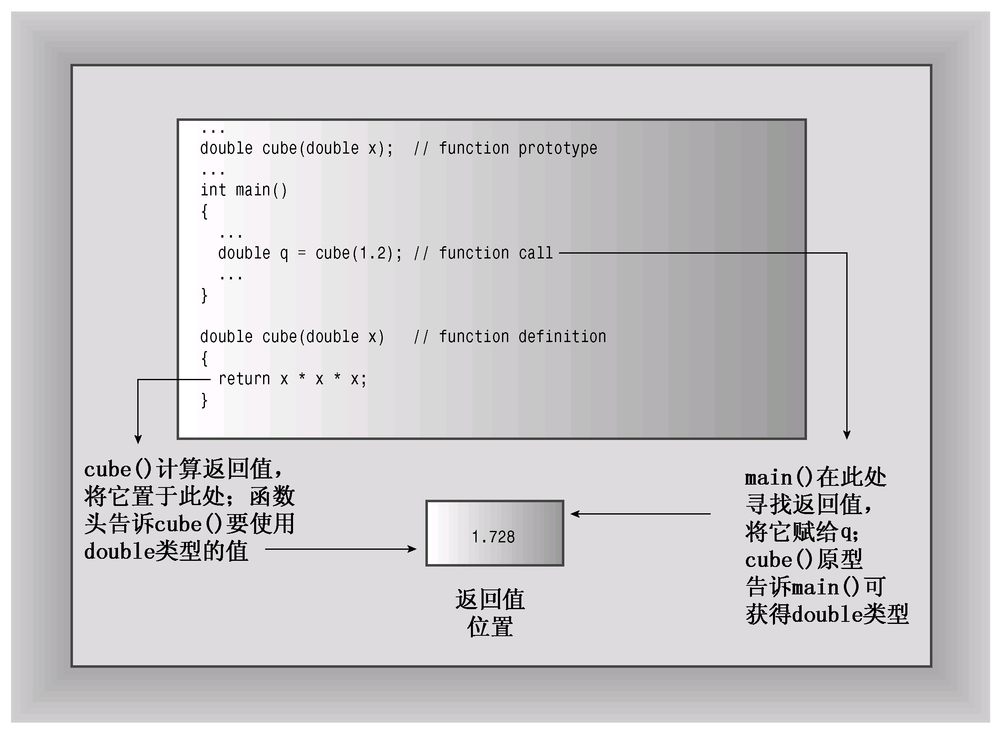
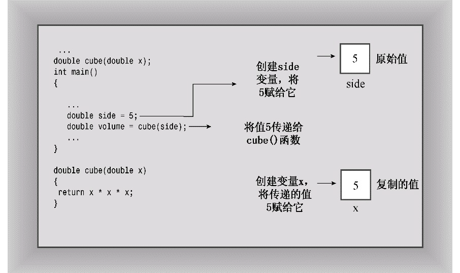
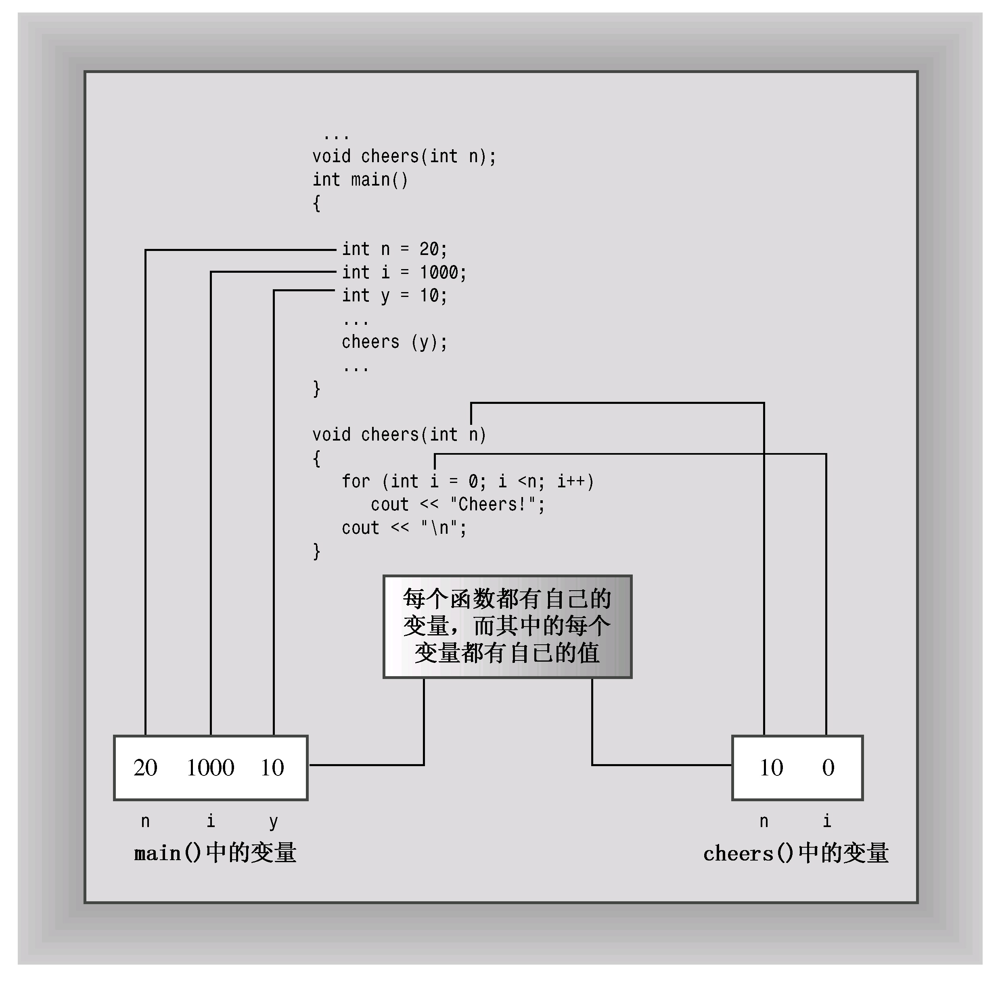
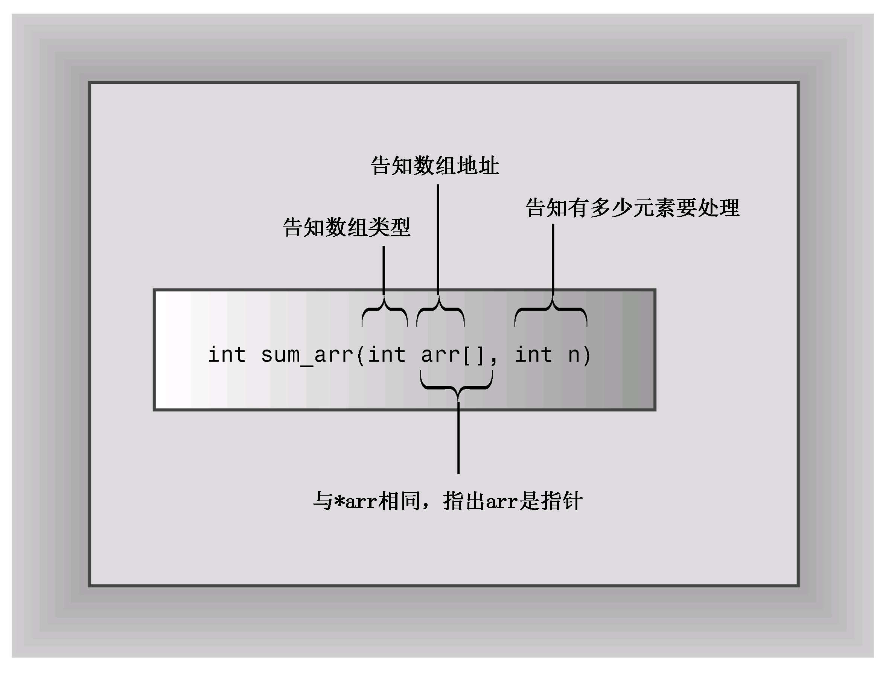
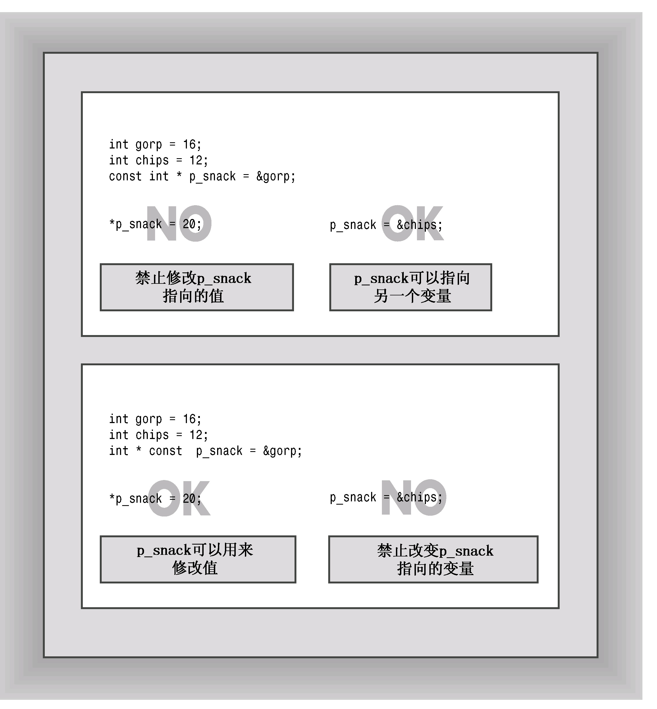
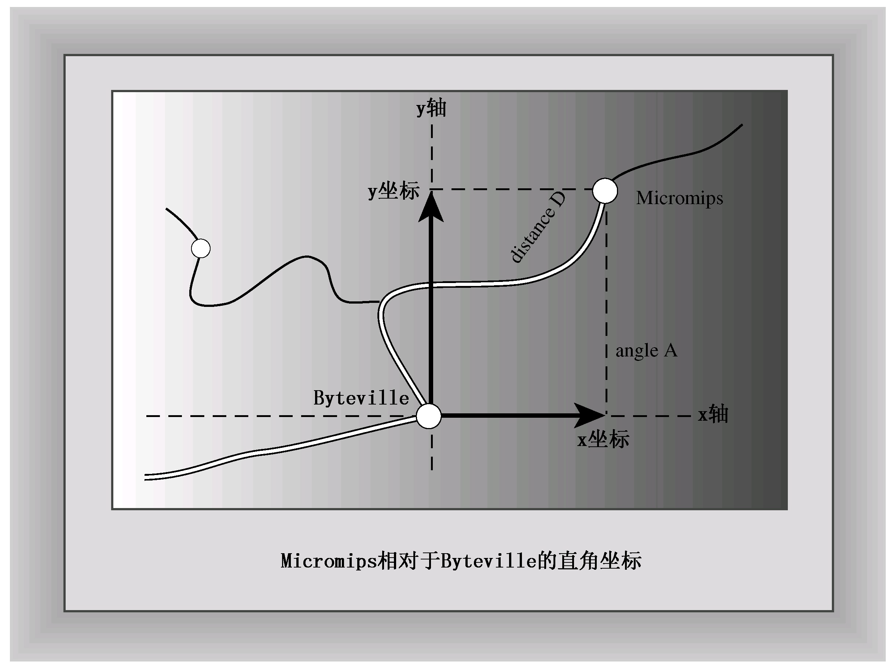
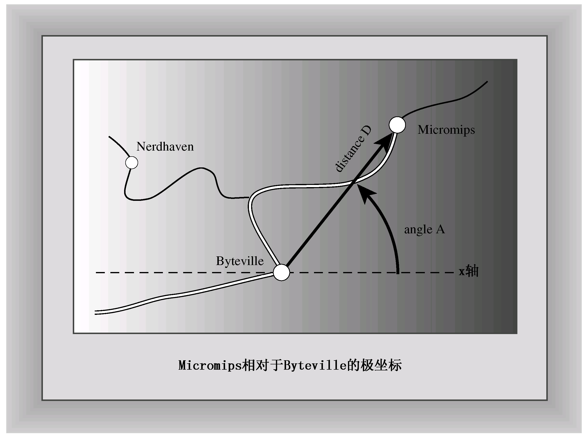

# 第7章 函数——C++的编程模块
本章内容包括：

* 函数基本知识。
* 函数原型。
* 按值传递函数参数。
* 设计处理数组的函数。
* 使用const指针参数。
* 设计处理文本字符串的函数。
* 设计处理结构的函数。
* 设计处理string对象的函数。
* 调用自身的函数（递归）。
* 指向函数的指针。

乐趣在于发现。仔细研究，读者将在函数中找到乐趣。C++自带了一个包含函数的大型库（标准ANSI库加上多个C++类），但真正的编程乐趣在于编写自己的函数；另一方面，要提高编程效率，可更深入地学习STL和BOOST C++提供的功能。本章和第8章介绍如何定义函数、给函数传递信息以及从函数那里获得信息。本章首先复习函数是如何工作的，然后着重介绍如何使用函数来处理数组、字符串和结构，最后介绍递归和函数指针。如果读者熟悉C语言，将发现本章的很多内容是熟悉的。然而，不要因此而掉以轻心，产生错误认识。在函数方面，C++在C语言的基础上新增了一些功能，这将在第8章介绍。现在，把注意力放在基础知识上。

## 7.1 复习函数的基本知识
来复习一下介绍过的有关函数的知识。要使用C++函数，必须完成如下工作：

* 提供函数定义；
* 提供函数原型；
* 调用函数。

库函数是已经定义和编译好的函数，同时可以使用标准库头文件提供其原型，因此只需正确地调用这种函数即可。本书前面的示例已经多次这样做了。例如，标准C库中有一个strlen( )函数，可用来确定字符串的长度。相关的标准头文件cstring包含了strlen( )和其他一些与字符串相关的函数的原型。这些预备工作使程序员能够在程序中随意使用strlen( )函数。

然而，创建自己的函数时，必须自行处理这3个方面——定义、提供原型和调用。程序清单7.1用一个简短的示例演示了这3个步骤。

程序清单7.1 calling.cpp
```c++
// calling.cpp -- defining, prototyping, and calling a function
#include <iostream>

void simple();    // function prototype

int main()
{
    using namespace std;
    cout << "main() will call the simple() function:\n";
    simple();     // function call
	cout << "main() is finished with the simple() function.\n";
    // cin.get();
    return 0;
}

// function definition
void simple()
{
    using namespace std;
    cout << "I'm but a simple function.\n";
}
```

下面是该程序的输出：
```c++
main() will call the simple() function:
I'm but a simple function.
main() is finished with the simple() function.
```

执行函数simple()时，将暂停执行main( )中的代码；等函数simple()执行完毕后，继续执行main()中的代码。在每个函数定义中，都使用了一条using编译指令，因为每个函数都使用了cout。另一种方法是，在函数定义之前放置一条using编译指令或在函数中使用std::cout。

下面详细介绍这3个步骤。

### 7.1.1 定义函数
可以将函数分成两类：没有返回值的函数和有返回值的函数。没有返回值的函数被称为void函数，其通用格式如下：
```c++
void functionName(parameterList)
{
    statement(s)
    return;       // optional
}
```

其中，parameterList指定了传递给函数的参数类型和数量，本章后面将更详细地介绍该列表。可选的返回语句标记了函数的结尾；否则，函数将在右花括号处结束。void函数相当于Pascal中的过程、FORTRAN中的子程序和现代BASIC中的子程序过程。通常，可以用void函数来执行某种操作。例如，将Cheers!打印指定次数（n）的函数如下：
```c++
void cheers(int n)          // no return value
{
    for (int i = 0; i < n; i++)
        std::cout << "Cheers! ";
    std::cout << std::endl;
}
```

参数列表int n意味着调用函数cheers( )时，应将一个int值作为参数传递给它。

有返回值的函数将生成一个值，并将它返回给调用函数。换句话来说，如果函数返回9.0的平方根（sqrt（9.0）），则该函数调用的值为3.0。这种函数的类型被声明为返回值的类型，其通用格式如下：
```c++
typeName functionName(parameterList)
{
    statements
    return value;     // value is type cast to type typeName
}
```

对于有返回值的函数，必须使用返回语句，以便将值返回给调用函数。值本身可以是常量、变量，也可以是表达式，只是其结果的类型必须为typeName类型或可以被转换为typeName（例如，如果声明的返回类型为double，而函数返回一个int表达式，则该int值将被强制转换为double类型）。然后，函数将最终的值返回给调用函数。C++对于返回值的类型有一定的限制：不能是数组，但可以是其他任何类型——整数、浮点数、指针，甚至可以是结构和对象！（有趣的是，虽然C++函数不能直接返回数组，但可以将数组作为结构或对象组成部分来返回。）

作为一名程序员，并不需要知道函数是如何返回值的，但是对这个问题有所了解将有助于澄清概念。（另外，还有助于与朋友和家人交换意见。）通常，函数通过将返回值复制到指定的CPU寄存器或内存单元中来将其返回。随后，调用程序将查看该内存单元。返回函数和调用函数必须就该内存单元中存储的数据的类型达成一致。函数原型将返回值类型告知调用程序，而函数定义命令被调用函数应返回什么类型的数据（参见图7.1）。在原型中提供与定义中相同的信息似乎有些多余，但这样做确实有道理。要让信差从办公室的办公桌上取走一些物品，则向信差和办公室中的同事交代自己的意图，将提高信差顺利完成这项工作的概率。



函数在执行返回语句后结束。如果函数包含多条返回语句（例如，它们位于不同的if else选项中），则函数在执行遇到的第一条返回语句后结束。例如，在下面的例子中，else并不是必需的，但可帮助马虎的读者理解程序员的意图：
```c++
int bigger(int a, int b)
{
    if (a > b)
        return a;     // if a > b, function terminates here
    else
        return b;     // otherwise, function terminates here
}
```

如果函数包含多条返回语句，通常认为它会令人迷惑，有些编译器将针对这一点发出警告。然而，这里的代码很简单，很容易理解。

有返回值的函数与Pascal、FORTRAN和BASIC中的函数相似，它们向调用程序返回一个值，然后调用程序可以将其赋给变量、显示或将其用于别的用途。下面是一个简单的例子，函数返回double值的立方：
```c++
double cude(double x)       // x times x times x
{
    return x * x * x;       // a type double value
}
```

例如，函数调用cube(1.2)将返回1.728。请注意，上述返回语句使用了一个表达式，函数将计算该表达式的值（这里为1.728），并将其返回。

### 7.1.2 函数原型和函数调用
至此，读者已熟悉了函数调用，但对函数原型可能不太熟悉，因为它经常隐藏在include文件中。程序清单7.2在一个程序中使用了函数cheer( )和cube( )。请留意其中的函数原型。

程序清单7.2 protos.cpp
```c++
// protos.cpp -- using prototypes and function calls
#include <iostream>
void cheers(int);       // prototype: no return value
double cube(double x);  // prototype: returns a double
int main()
{
    using namespace std;
    cheers(5);          // function call
    cout << "Give me a number: ";
    double side;
    cin >> side;
    double volume = cube(side);    // function call
    cout << "A " << side <<"-foot cube has a volume of ";
    cout << volume << " cubic feet.\n";
    cheers(cube(2));    // prototype protection at work
    // cin.get();
    // cin.get();
    return 0;
}

void cheers(int n)
{
    using namespace std;
    for (int i = 0; i < n; i++)
        cout << "Cheers! ";
    cout << endl;
}

double cube(double x)
{
    return x * x * x; 
}
```

在程序清单7.2的程序中，只需要使用名称空间std中成员的函数中使用了编译指令using。下面是该程序的运行情况：
```c++
Cheers! Cheers! Cheers! Cheers! Cheers!
Give me a number: 5
A 5-foot cube has a volume of 125 cubic feet.
Cheers! Cheers! Cheers! Cheers! Cheers! Cheers! Cheers! Cheers!
```

main( )使用函数名和参数（后面跟一个分号）来调用void类型的函数：cheers（5）；，这是一个函数调用语句。但由于cube( )有返回值，因此main( )可以将其用在赋值语句中：
```c++
double volume = cube(side);
```

但正如前面指出的，读者应将重点放在原型上。那么，应了解有关原型的哪些内容呢？首先，需要知道C++要求提供原型的原因。其次，由于C++要求提供原型，因此还应知道正确的语法。最后，应当感谢原型所做的一切。下面依次介绍这几点，将程序清单7.2作为讨论的基础。

1. 为什么需要原型

原型描述了函数到编译器的接口，也就是说，它将函数返回值的类型（如果有的话）以及参数的类型和数量告诉编译器。例如，请看原型将如何影响程序清单7.2中下述函数调用：
```c++
double volume = cube(side);
```

首先，原型告诉编译器，cube( )有一个double参数。如果程序没有提供这样的参数，原型将让编译器能够捕获这种错误。其次，cube( )函数完成计算后，将把返回值放置在指定的位置——可能是CPU寄存器，也可能是内存中。然后调用函数（这里为main( )）将从这个位置取得返回值。由于原型指出了cube( )的类型为double，因此编译器知道应检索多少个字节以及如何解释它们。如果没有这些信息，编译器将只能进行猜测，而编译器是不会这样做的。

读者可能还会问，为何编译器需要原型，难道它就不能在文件中进一步查找，以了解函数是如何定义的吗？这种方法的一个问题是效率不高。编译器在搜索文件的剩余部分时将必须停止对main( )的编译。一个更严重的问题是，函数甚至可能并不在文件中。C++允许将一个程序放在多个文件中，单独编译这些文件，然后再将它们组合起来。在这种情况下，编译器在编译main( )时，可能无权访问函数代码。如果函数位于库中，情况也将如此。避免使用函数原型的唯一方法是，在首次使用函数之前定义它，但这并不总是可行的。另外，C++的编程风格是将main( )放在最前面，因为它通常提供了程序的整体结构。

2. 原型的语法

函数原型是一条语句，因此必须以分号结束。获得原型最简单的方法是，复制函数定义中的函数头，并添加分号。对于cube( )，程序清单7.2中的程序正是这样做的：
```c++
double cube(double x);  // prototype: returns a double
```

然而，函数原型不要求提供变量名，有类型列表就足够了。对于cheer( )的原型，该程序只提供了参数类型：
```c++
void cheers(int);       // prototype: no return value
```

通常，在原型的参数列表中，可以包括变量名，也可以不包括。原型中的变量名相当于占位符，因此不必与函数定义中的变量名相同。

> **C++原型与ANSI原型**
> 
> ANSI C借鉴了C++中的原型，但这两种语言还是有区别的。其中最重要的区别是，为与基本C兼容，ANSI C中的原型是可选的，但在C++中，原型是必不可少的。例如，请看下面的函数声明：
> ```c++
> void say_hi();
> ```
> 
> 在C++中，括号为空与在括号中使用关键字void是等效的——意味着函数没有参数。在ANSI C中，括号为空意味着不指出参数——这意味着将在后面定义参数列表。在C++中，不指定参数列表时应使用省略号：
> ```c++
> void say_bye(...);      // C++ abdication of responsibility
> ```
> 
> 通常，仅当与接受可变参数的C函数（如printf( )）交互时才需要这样做。

3. 原型的功能

正如您看到的，原型可以帮助编译器完成许多工作；但它对程序员有什么帮助呢？它们可以极大地降低程序出错的几率。具体来说，原型确保以下几点：

* 编译器正确处理函数返回值；
* 编译器检查使用的参数数目是否正确；
* 编译器检查使用的参数类型是否正确。如果不正确，则转换为正确的类型（如果可能的话）。

前面已经讨论了如何正确处理返回值。下面来看一看参数数目不对时将发生的情况。例如，假设进行了如下调用：
```c++
double z = cube();
```

如果没有函数原型，编译器将允许它通过。当函数被调用时，它将找到cube( )调用存放值的位置，并使用这里的值。这正是ANSIC从C++借鉴原型之前，C语言的工作方式。由于对于ANSI C来说，原型是可选的，因此有些C语言程序正是这样工作的。但在C++中，原型不是可选的，因此可以确保不会发生这类错误。

接下来，假设提供了一个参数，但其类型不正确。在C语言中，这将造成奇怪的错误。例如，如果函数需要一个int值（假设占16位），而程序员传递了一个double值（假设占64位），则函数将只检查64位中的前16位，并试图将它们解释为一个int值。但C++自动将传递的值转换为原型中指定的类型，条件是两者都是算术类型。例如，程序清单7.2将能够应付下述语句中两次出现的类型不匹配的情况：
```c++
cheers(cube(2));
```

首先，程序将int的值2传递给cube( )，而后者期望的是double类型。编译器注意到，cube( )原型指定了一个double类型参数，因此将2转换为2.0——一个double值。接下来，cube( )返回一个double值（8.0），这个值被用作cheer( )的参数。编译器将再一次检查原型，并发现cheer( )要求一个int参数，因此它将返回值转换为整数8。通常，原型自动将被传递的参数强制转换为期望的类型。（但第8章将介绍的函数重载可能导致二义性，因此不允许某些自动强制类型转换。）

自动类型转换并不能避免所有可能的错误。例如，如果将8.33E27传递给期望一个int值的函数，则这样大的值将不能被正确转换为int值。当较大的类型被自动转换为较小的类型时，有些编译器将发出警告，指出这可能会丢失数据。

仅当有意义时，原型化才会导致类型转换。例如，原型不会将整数转换为结构或指针。

在编译阶段进行的原型化被称为静态类型检查（static type checking）。可以看出，静态类型检查可捕获许多在运行阶段非常难以捕获的错误。

## 7.2 函数参数和按值传递
下面详细介绍一下函数参数。C++通常按值传递参数，这意味着将数值参数传递给函数，而后者将其赋给一个新的变量。例如，程序清单7.2包含下面的函数调用：
```c++
double volume = cube(side);
```

其中，side是一个变量，在前面的程序运行中，其值为5。cube( )的函数头如下：
```c++
double cube(double x)
```

被调用时，该函数将创建一个新的名为x的double变量，并将其初始化为5。这样，cube( )执行的操作将不会影响main( )中的数据，因为cube( )使用的是side的副本，而不是原来的数据。稍后将介绍一个实现这种保护的例子。用于接收传递值的变量被称为形参。传递给函数的值被称为实参。出于简化的目的，C++标准使用参数（argument）来表示实参，使用参量（parameter）来表示形参，因此参数传递将参量赋给参数（参见图7.2）。



在函数中声明的变量（包括参数）是该函数私有的。在函数被调用时，计算机将为这些变量分配内存；在函数结束时，计算机将释放这些变量使用的内存（有些C++文献将分配和释放内存称为创建和毁坏变量，这样似乎更激动人心）。这样的变量被称为局部变量，因为它们被限制在函数中。前面提到过，这样做有助于确保数据的完整性。这还意味着，如果在main( )中声明了一个名为x的变量，同时在另一个函数中也声明了一个名为x的变量，则它们将是两个完全不同的、毫无关系的变量，这与加利福尼亚州的Albany与纽约的Albany是两个完全不同的地方是一样的道理（参见图7.3）。这样的变量也被称为自动变量，因为它们是在程序执行过程中自动被分配和释放的。



### 7.2.1 多个参数
函数可以有多个参数。在调用函数时，只需使用逗号将这些参数分开即可：
```c++
n_chars('R', 25);
```

上述函数调用将两个参数传递给函数n_chars( )，我们将稍后定义该函数。

同样，在定义函数时，也在函数头中使用由逗号分隔的参数声明列表：
```c++
void n_chars(char c, int n)   // two arguments
```

该函数头指出，函数n_char( )接受一个char参数和一个int参数。传递给函数的值被赋给参数c和n。如果函数的两个参数的类型相同，则必须分别指定每个参数的类型，而不能像声明常规变量那样，将声明组合在一起：
```c++
void fifi(float a, float b)     // declare each variable separately
void fufu(float a, b)           // NOT acceptable
```

和其他函数一样，只需添加分号就可以得到该函数的原型：
```c++
void n_chars(char c, int n);    // prototype, style 1
```

和一个参数的情况一样，原型中的变量名不必与定义中的变量名相同，而且可以省略：
```c++
void n_chars(char, int);    // prototype, style 2
```

然而，提供变量名将使原型更容易理解，尤其是两个参数的类型相同时。这样，变量名可以提醒参量和参数间的对应关系：
```c++
double melon_density(double weight, double volume);
```

程序清单7.3演示了一个接受两个参数的函数，它还表明，在函数中修改形参的值不会影响调用程序中的数据。

程序清单7.3 twoarg.cpp
```c++
// twoarg.cpp -- a function with 2 arguments
#include <iostream>
using namespace std;
void n_chars(char, int);
int main()
{
    int times;
    char ch;

    cout << "Enter a character: ";
    cin >> ch;
    while (ch != 'q')        // q to quit
    {
        cout << "Enter an integer: ";
        cin >> times;
        n_chars(ch, times); // function with two arguments
        cout << "\nEnter another character or press the"
                " q-key to quit: ";
           cin >> ch;
    }
    cout << "The value of times is " << times << ".\n";
    cout << "Bye\n";
    // cin.get();
    // cin.get();
    return 0;
}

void n_chars(char c, int n) // displays c n times
{
    while (n-- > 0)         // continue until n reaches 0
        cout << c;
}
```

在程序清单7.3的程序中，将编译指令using放在函数定义的前面，而不是函数中。下面是该程序的运行情况：
```c++
Enter a character: W
Enter an integer: 50
WWWWWWWWWWWWWWWWWWWWWWWWWWWWWWWWWWWWWWWWWWWWWWWWWW
Enter another character or press the q-key to quit: a
Enter an integer: 20
aaaaaaaaaaaaaaaaaaaa
Enter another character or press the q-key to quit: q
The value of times is 20.
Bye
```

程序说明

程序清单7.3中的main( )函数使用一个while循环提供重复输入（并让读者温习使用循环的技巧），它使用cin>>ch，而不是cin.get（ch）或ch = cin.get( )来读取一个字符。这样做是有原因的。前面讲过，这两个cin.get( )函数读取所有的输入字符，包括空格和换行符，而cin>>跳过空格和换行符。当用户对程序提示作出响应时，必须在每行的最后按Enter键，以生成换行符。cin>>ch方法可以轻松地跳过这些换行符，但当输入的下一个字符为数字时，cin.get( )将读取后面的换行符。可以通过编程来避开这种麻烦，但比较简便的方法是像该程序那样使用cin。

n_char( )函数接受两个参数：一个是字符c，另一个是整数n。然后，它使用循环来显示该字符，显示次数为n：
```c++
while (n-- > 0)         // continue until n reaches 0
    cout << c;
```

程序通过将n变量递减来计数，其中n是参数列表的形参，main( )中times变量的值被赋给该变量。然后，while循环将n递减到0，但前面的运行情况表明，修改n的值对times没有影响。即使您在函数main( )中使用名称n而不是times，在函数n_chars()中修改n的值时，也不会影响函数main( )中n的值。

### 7.2.2 另外一个接受两个参数的函数
下面创建另一个功能更强大的函数，它执行重要的计算任务。另外，该函数将演示局部变量的用法，而不是形参的用法。

目前，美国许多州都采用某种纸牌游戏的形式来发行彩票，让参与者从卡片中选择一定数目的选项。例如，从51个数字中选取6个。随后，彩票管理者将随机抽取6个数。如果参与者选择的数字与这6个完全相同，将赢得大约几百万美元的奖金。我们的函数将计算中奖的几率。（是的，能够成功预测获奖号码的函数将更有用，但虽然C++的功能非常强大，目前还不具备超自然能力。）

首先，需要一个公式。假设必须从51个数中选取6个，而获奖的概率为1/R，则R的计算公式如下：
```c++
R = (51 * 50 * 49 * 48 * 47 * 46) / (6 * 5 * 4 * 3 * 2 * 1)
```

选择6个数时，分母为前6个整数的乘积或6的阶乘。分子也是6个连续整数的乘积，从51开始，依次减1。推而广之，如果从numbers个数中选取picks个数，则分母是picks的阶乘，分子为numbers开始向前的picks个整数的乘积。可以用for循环进行计算：
```c++
long double result = 1.0;
for (n = numbers, p = picks; p > 0; n--, p--)
    result = result * n / p;
```

循环不是首先将所有的分子项相乘，而是首先将1.0与第一个分子项相乘，然后除以第一个分母项。然后下一轮循环乘以第二个分子项，并除以第二个分母项。这样得到的乘积将比先进行乘法运算得到的小。例如，对于(10 &#42; 9)/(2 &#42; 1)和(10 / 2) &#42; (9 / 1)，前者将计算90/2，得到45，后者将计算为5 &#42; 9，得到45。这两种方法得到的结果相同，但前者的中间值（90）大于后者。因子越多，中间值的差别就越大。当数字非常大时，这种交替进行乘除运算的策略可以防止中间结果超出最大的浮点数。

程序清单7.4在probability( )函数中使用了这个公式。由于选择的数目和总数目都为正，因此该程序将这些变量声明为unsigned .int类型（简称unsigned）。将若干整数相乘可以得到相当大的结果，因此lotto.cpp将该函数的返回值声明为long double类型。另外，如果使用整型，则像49/6这样的运算将出现舍入误差。

> **注意：**
> 
> 有些C++实现不支持long double类型，如果所用的C++实现是这样的，请使用double类型。

程序清单7.4 lotto.cpp
```c++
// lotto.cpp -- probability of winning
#include <iostream>
// Note: some implementations require double instead of long double
long double probability(unsigned numbers, unsigned picks);
int main()
{
    using namespace std;
    double total, choices;
    cout << "Enter the total number of choices on the game card and\n"
            "the number of picks allowed:\n";
    while ((cin >> total >> choices) && choices <= total)
    {
        cout << "You have one chance in ";
        cout << probability(total, choices);      // compute the odds
        cout << " of winning.\n";
        cout << "Next two numbers (q to quit): ";
    }
    cout << "bye\n";
    // cin.get();
    // cin.get();
    return 0;
}

// the following function calculates the probability of picking picks
// numbers correctly from numbers choices
long double probability(unsigned numbers, unsigned picks)
{
    long double result = 1.0;  // here come some local variables
    long double n;
    unsigned p;

    for (n = numbers, p = picks; p > 0; n--, p--)
        result = result * n / p ; 
    return result;
}
```

下面是该程序的运行情况：
```c++
Enter the total number of choices on the game card and
the number of picks allowed:
49 6
You have one chance in 1.39838e+07 of winning.
Next two numbers (q to quit): 51 6
You have one chance in 1.80095e+07 of winning.
Next two numbers (q to quit): 38 6
You have one chance in 2.76068e+06 of winning.
Next two numbers (q to quit): q
bye
```

请注意，增加游戏卡中可供选择的数字数目，获奖的可能性将急剧降低。

程序说明

程序清单7.4中的probability( )函数演示了可以在函数中使用的两种局部变量。首先是形参（number和picks），这是在左括号前面的函数头中声明的；其次是其他局部变量（result、n和p），它们是在将函数定义括起的括号内声明的。形参与其他局部变量的主要区别是，形参从调用probability( )的函数那里获得自己的值，而其他变量是从函数中获得自己的值。

## 7.3 函数和数组
到目前为止，本书的函数示例都很简单，参数和返回值的类型都是基本类型。但是，函数是处理更复杂的类型（如数组和结构）的关键。下面来如何将数组和函数结合在一起。

假设使用一个数组来记录家庭野餐中每人吃了多少个甜饼（每个数组索引都对应一个人，元素值对应于这个人所吃的甜饼数量）。现在想知道总数。这很容易，只需使用循环将所有数组元素累积起来即可。将数组元素累加是一项非常常见的任务，因此设计一个完成这项工作的函数很有意义。这样就不必在每次计算数组总和时都编写新的循环了。

考虑函数接口所涉及的内容。由于函数计算总数，因此应返回答案。如果不分吃甜饼，则可以让函数的返回类型为int。另外，函数需要知道要对哪个数组进行累计，因此需要将数组名作为参数传递给它。为使函数通用，而不限于特定长度的数组，还需要传递数组长度。这里唯一的新内容是，需要将一个形参声明为数组名。下面来看一看函数头及其其他部分：
```c++
int sum_arr(int arr[], int n)   // arr = array name, n = size
```

这看起来似乎合理。方括号指出arr是一个数组，而方括号为空则表明，可以将任何长度的数组传递给该函数。但实际情况并非如此：arr实际上并不是数组，而是一个指针！好消息是，在编写函数的其余部分时，可以将arr看作是数组。首先，通过一个示例验证这种方法可行，然后看看它为什么可行。

程序清单7.5演示如同使用数组名那样使用指针的情况。程序将数组初始化为某些值，并使用sum_arr( )函数计算总数。注意到sum_arr( )函数使用arr时，就像是使用数组名一样。

程序清单7.5 arrfun1.cpp
```c++
// arrfun1.cpp -- functions with an array argument
#include <iostream>
const int ArSize = 8;
int sum_arr(int arr[], int n);        // prototype
int main()
{
    using namespace std;
    int cookies[ArSize] = {1,2,4,8,16,32,64,128};
// some systems require preceding int with static to
// enable array initialization

    int sum = sum_arr(cookies, ArSize);
    cout << "Total cookies eaten: " << sum <<  "\n";
    // cin.get();
    return 0;
}

// return the sum of an integer array
int sum_arr(int arr[], int n)
{
    int total = 0;

    for (int i = 0; i < n; i++)
        total = total + arr[i];
    return total; 
}
```

下面是该程序的输出：
```c++
Total cookies eaten: 255
```

从中可知，该程序管用。下面讨论为何该程序管用。

### 7.3.1 函数如何使用指针来处理数组
在大多数情况下，C++和C语言一样，也将数组名视为指针。第4章介绍过，C++将数组名解释为其第一个元素的地址：
```c++
cookies == &cookies[0]    // array name is address of first element
```

该规则有一些例外。首先，数组声明使用数组名来标记存储位置；其次，对数组名使用sizeof将得到整个数组的长度（以字节为单位）；第三，正如第4章指出的，将地址运算符&用于数组名时，将返回整个数组的地址，例如&cookies将返回一个32字节内存块的地址（如果int长4字节）。

程序清单7.5执行下面的函数调用：
```c++
int sum = sum_arr(cookies, ArSize);
```

其中，cookies是数组名，而根据C++规则，cookies是其第一个元素的地址，因此函数传递的是地址。由于数组的元素的类型为int，因此cookies的类型必须是int指针，即int *。这表明，正确的函数头应该是这样的：
```c++
int sum_arr(int * arr, int n)   // arr = array name, n = size
```

其中用int &#42; arr替换了int arr [ ]。这证明这两个函数头都是正确的，因为在C++中，当（且仅当）用于函数头或函数原型中，int &#42;arr和int arr[ ]的含义才是相同的。它们都意味着arr是一个int指针。然而，数组表示法（int arr[ ]）提醒用户，arr不仅指向int，还指向int数组的第一个int。当指针指向数组的第一个元素时，本书使用数组表示法；而当指针指向一个独立的值时，使用指针表示法。别忘了，在其他的上下文中，int &#42;arr和int arr [ ]的含义并不相同。例如，不能在函数体中使用int tip[ ]来声明指针。

鉴于变量arr实际上就是一个指针，函数的其余部分是合理的。第4章在介绍动态数组时指出过，同数组名或指针一样，也可以用方括号数组表示法来访问数组元素。无论arr是指针还是数组名，表达式arr [3]都指的是数组的第4个元素。就目前而言，提请读者记住下面两个恒等式，将不会有任何坏处：
```c++
arr[i] == *(arr + i)     // values in two notations
&arr[i] == arr + i       // addresses in two notations
```

记住，将指针（包括数组名）加1，实际上是加上了一个与指针指向的类型的长度（以字节为单位）相等的值。对于遍历数组而言，使用指针加法和数组下标时等效的。

### 7.3.2 将数组作为参数意味着什么
我们来看一看程序清单7.5暗示了什么。函数调用sum_arr(coolies, ArSize)将cookies数组第一个元素的地址和数组中的元素数目传递给sum_arr( )函数。sum_arr( )函数将cookies的地址赋给指针变量arr，将ArSize赋给int变量n。这意味着，程序清单7.5实际上并没有将数组内容传递给函数，而是将数组的位置（地址）、包含的元素种类（类型）以及元素数目（n变量）提交给函数（参见图7.4）。有了这些信息后，函数便可以使用原来的数组。传递常规变量时，函数将使用该变量的拷贝；但传递数组时，函数将使用原来的数组。实际上，这种区别并不违反C++按值传递的方法，sum_arr( )函数仍传递了一个值，这个值被赋给一个新变量，但这个值是一个地址，而不是数组的内容。



数组名与指针对应是好事吗？确实是一件好事。将数组地址作为参数可以节省复制整个数组所需的时间和内存。如果数组很大，则使用拷贝的系统开销将非常大；程序不仅需要更多的计算机内存，还需要花费时间来复制大块的数据。另一方面，使用原始数据增加了破坏数据的风险。在经典的C语言中，这确实是一个问题，但ANSI C和C++中的const限定符提供了解决这种问题的办法。稍后将介绍一个这样的示例，但先来修改程序清单7.5，以演示数组函数是如何运作的。程序清单7.6表明，cookies和arr的值相同。它还演示了指针概念如何使sum_arr函数比以前更通用。该程序使用限定符std::而不是编译指令using来提供对cout和endl的访问权。

程序清单7.6 arrfun2.cpp
```c++
// arrfun2.cpp -- functions with an array argument
#include <iostream>
const int ArSize = 8;
int sum_arr(int arr[], int n);
// use std:: instead of using directive
int main()
{
    int cookies[ArSize] = {1,2,4,8,16,32,64,128};
//  some systems require preceding int with static to
//  enable array initialization

    std::cout << cookies << " = array address, ";
//  some systems require a type cast: unsigned (cookies)

    std::cout << sizeof cookies << " = sizeof cookies\n";
    int sum = sum_arr(cookies, ArSize);
    std::cout << "Total cookies eaten: " << sum <<  std::endl;
    sum = sum_arr(cookies, 3);        // a lie
    std::cout << "First three eaters ate " << sum << " cookies.\n";
    sum = sum_arr(cookies + 4, 4);    // another lie
    std::cout << "Last four eaters ate " << sum << " cookies.\n";
    // std::cin.get();
	return 0;
}

// return the sum of an integer array
int sum_arr(int arr[], int n)
{
    int total = 0;
    std::cout << arr << " = arr, ";
// some systems require a type cast: unsigned (arr)

    std::cout << sizeof arr << " = sizeof arr\n";
    for (int i = 0; i < n; i++)
        total = total + arr[i];
    return total; 
}
```

下面是该程序的输出（地址值和数组的长度将随系统而异）：
```c++
0x7ffe6293d490 = array address, 32 = sizeof cookies
0x7ffe6293d490 = arr, 8 = sizeof arr
Total cookies eaten: 255
0x7ffe6293d490 = arr, 8 = sizeof arr
First three eaters ate 7 cookies.
0x7ffe6293d4a0 = arr, 8 = sizeof arr
Last four eaters ate 240 cookies.
```

注意，地址值和数组的长度随系统而异。另外，有些C++实现以十进制而不是十六进制格式显示地址，还有些编译器以十六进制显示地址时，会加上前缀0x。

程序说明

程序清单7.6说明了数组函数的一些有趣的地方。首先，cookies和arr指向同一个地址。但sizeof cookies的值为32，而sizeof arr为4。这是由于sizeof cookies是整个数组的长度，而sizeof arr只是指针变量的长度（上述程序运行结果是从一个使用4字节地址的系统中获得的）。顺便说一句，这也是必须显式传递数组长度，而不能在sum_arr( )中使用sizeof arr的原因；指针本身并没有指出数组的长度。

由于sum_arr( )只能通过第二个参数获知数组中的元素数量，因此可以对函数“说谎”。例如，程序第二次使用该函数时，这样调用它：
```c++
sum = sum_arr(cookies, 3);
```

通过告诉该函数cookies有3个元素，可以让它计算前3个元素的总和。

为什么在这里停下了呢？还可以提供假的数组起始位置：
```c++
sum = sum_arr(cookies + 4, 4);
```

由于cookies是第一个元素的地址，因此cookies + 4是第5个元素的地址。这条语句将计算数组第5、6、7、8个元素的总和。请注意输出中第三次函数调用选择将不同于前两个调用的地址赋给arr的。是的，可以将&cookies[4]，而不是cookies + 4作为参数；它们的含义是相同的。

> **注意：**
> 
> 为将数组类型和元素数量告诉数组处理函数，请通过两个不同的参数来传递它们：
> ```c++
> void fillArray(int arr[], int size);    // prototype
> ```
> 
> 而不要试图使用方括号表示法来传递数组长度：
> ```c++
> void fillArray(int arr[size]);    // NO -- bad prototype
> ```

### 7.3.3 更多数组函数示例
选择使用数组来表示数据时，实际上是在进行一次设计方面的决策。但设计决策不仅仅是确定数据的存储方式，还涉及到如何使用数据。程序员常会发现，编写特定的函数来处理特定的数据操作是有好处的（这里讲的好处指的是程序的可靠性更高、修改和调试更为方便）。另外，构思程序时将存储属性与操作结合起来，便是朝OOP思想迈进了重要的一步；以后将证明这是很有好处的。

来看一个简单的案例。假设要使用一个数组来记录房地产的价值（假设拥有房地产）。在这种情况下，程序员必须确定要使用哪种类型。当然，double的取值范围比int和long大，并且提供了足够多的有效位数来精确地表示这些值。接下来必须决定数组元素的数目。（对于使用new创建的动态数组来说，可以稍后再决定，但我们希望使事情简单一点）。如果房地产数目不超过5个，则可以使用一个包含5个元素的double数组。

现在，考虑要对房地产数组执行的操作。两个基本的操作分别是，将值读入到数组中和显示数组内容。我们再添加另一个操作：重新评估每种房地产的值。为简单起见，假设所有房地产都以相同的比率增加或者减少。（别忘了，这是一本关于C++的书，而不是关于房地产管理的书。）接下来，为每项操作编写一个函数，然后编写相应的代码。下面首先介绍这些步骤，然后将其用于一个完整的示例中。

1. 填充数组

由于接受数组名参数的函数访问的是原始数组，而不是其副本，因此可以通过调用该函数将值赋给数组元素。该函数的一个参数是要填充的数组的名称。通常，程序可以管理多个人的投资，因此需要多个数组，因此不能在函数中设置数组长度，而要将数组长度作为第二个参数传递，就像前一个示例那样。另外，用户也可能希望在数组被填满之前停止读取数据，因此需要在函数中建立这种特性。由于用户输入的元素数目可能少于数组的长度，因此函数应返回实际输入的元素数目。因此，该函数的原型如下：
```c++
int fill_array(double arr[], int limit);
```

该函数接受两个参数，一个是数组名，另一个指定了要读取的最大元素数；该函数返回实际读取的元素数。例如，如果使用该函数来处理一个包含5个元素的数组，则将5作为第二个参数。如果只输入3个值，则该函数将返回3。

可以使用循环连续地将值读入到数组中，但如何提早结束循环呢？一种方法是，使用一个特殊值来指出输入结束。由于所有的属性都不为负，因此可以使用负数来指出输入结束。另外，该函数应对错误输入作出反应，如停止输入等。这样，该函数的代码如下所示：
```c++
int fill_array(double arr[], int limit)
{
    using namespace std;
    double temp;
    int i;
    for (i = 0; i < limit; i++)
    {
        cout << "Enter value #" << (i + 1) << ": ";
        cin >> temp;
        if (!cin)     // bad input
        {
            cin.clear();
            while(cin.get() != '\n')
                continue;
            cout << "Bad input; input process terminated.\n";
            break;
        }
        else if (temp < 0)    // signal to terminate
            break;
        arr[i] = temp;
    }
    return i;
}
```

注意，代码中包含了对用户的提示。如果用户输入的是非负值，则这个值将被赋给数组，否则循环结束。如果用户输入的都是有效值，则循环将在读取最大数目的值后结束。循环完成的最后一项工作是将i加1，因此循环结束后，i将比最后一个数组索引大1，即等于填充的元素数目。然后，函数返回这个值。

2. 显示数组及用const保护数组

创建显示数组内容的函数很简单。只需将数组名和填充的元素数目传递给函数，然后该函数使用循环来显示每个元素。然而，还有另一个问题——确保显示函数不修改原始数组。除非函数的目的就是修改传递给它的数据，否则应避免发生这种情况。使用普通参数时，这种保护将自动实现，这是由于C++按值传递数据，而且函数使用数据的副本。然而，接受数组名的函数将使用原始数据，这正是fill_array( )函数能够完成其工作的原因。为防止函数无意中修改数组的内容，可在声明形参时使用关键字const（参见第3章）：
```c++
void show_array(const double ar[], int n);
```

该声明表明，指针ar指向的是常量数据。这意味着不能使用ar修改该数据，也就是说，可以使用像ar[0]这样的值，但不能修改。注意，这并不是意味着原始数组必须是常量，而只是意味着不能在show_array( )函数中使用ar来修改这些数据。因此，show_array( )将数组视为只读数据。假设无意间在show_array( )函数中执行了下面的操作，从而违反了这种限制：
```c++
ar[0] += 10;
```

编译器将禁止这样做。例如，Borland C++将给出一条错误消息，如下所示（稍作了编辑）：
```c++
Cannot modify a const object in function
    show_array(const double *, int)
```

其他编译器可能用其他措词表示其不满。

这条消息提醒用户，C++将声明const double ar [ ]解释为const double &#42;ar。因此，该声明实际上是说，ar指向的是一个常量值。结束这个例子后，我们将详细讨论这个问题。下面是show_array( )函数的代码：
```c++
void show_array(const double ar[], int n)
{
    using namespace std;
    for(int i = 0; i < n; i++)
    {
        cout << "Property #" << (i + 1) << ": $";
        cout << ar[i] << endl;
    }
}
```

3. 修改数组

在这个例子中，对数组进行的第三项操作是将每个元素与同一个重新评估因子相乘。需要给函数传递3个参数：因子、数组和元素数目。该函数不需要返回值，因此其代码如下：
```c++
void revalue(double r, double ar[], int n)
{
    for (int i = 0; i < n; i++)
        ar[i] *= r;
}
```

由于这个函数将修改数组的值，因此在声明ar时，不能使用const。

4. 将上述代码组合起来

至此，您根据数据的存储方式（数组）和使用方式（3个函数）定义了数据的类型，因此可以将它们组合成一个程序。由于已经建立了所有的数组处理工具，因此main( )的编程工作非常简单。该程序检查用户输入的是否是数字，如果不是，则要求用户这样做。余下的大部分编程工作只是让main( )调用前面开发的函数。程序清单7.7列出了最终的代码，它将编译指令using放在那些需要iostream工具的函数中。

程序清单7.7 arrfun3.cpp
```c++
// arrfun3.cpp -- array functions and const
#include <iostream>
const int Max = 5;

// function prototypes
int fill_array(double ar[], int limit);
void show_array(const double ar[], int n);  // don't change data
void revalue(double r, double ar[], int n);

int main()
{
    using namespace std;
    double properties[Max];

    int size = fill_array(properties, Max);
    show_array(properties, size);
    if (size > 0)
    {
        cout << "Enter revaluation factor: ";
        double factor;
        while (!(cin >> factor))    // bad input
        {
            cin.clear();
            while (cin.get() != '\n')
                continue;
           cout << "Bad input; Please enter a number: ";
        }
        revalue(factor, properties, size);
        show_array(properties, size);
    }
    cout << "Done.\n";
    // cin.get();
    // cin.get();
    return 0;
}

int fill_array(double ar[], int limit)
{
    using namespace std;
    double temp;
    int i;
    for (i = 0; i < limit; i++)
    {
        cout << "Enter value #" << (i + 1) << ": ";
        cin >> temp;
        if (!cin)    // bad input
        {
            cin.clear();
            while (cin.get() != '\n')
                continue;
           cout << "Bad input; input process terminated.\n";
           break;
        }
        else if (temp < 0)     // signal to terminate
            break;
        ar[i] = temp;
    }
    return i;
}

// the following function can use, but not alter,
// the array whose address is ar
void show_array(const double ar[], int n)
{
    using namespace std;
    for (int i = 0; i < n; i++)
    {
        cout << "Property #" << (i + 1) << ": $";
        cout << ar[i] << endl;
    }
}

// multiplies each element of ar[] by r
void revalue(double r, double ar[], int n)
{
    for (int i = 0; i < n; i++)
        ar[i] *= r;
}
```

下面两次运行该程序时的输出：
```c++
Enter value #1: 100000
Enter value #2: 80000
Enter value #3: 222000
Enter value #4: 240000
Enter value #5: 118000
Property #1: $100000
Property #2: $80000
Property #3: $222000
Property #4: $240000
Property #5: $118000
Enter revaluation factor: 0.8
Property #1: $80000
Property #2: $64000
Property #3: $177600
Property #4: $192000
Property #5: $94400
Done.
```

```c++
Enter value #1: 200000
Enter value #2: 84000
Enter value #3: 160000
Enter value #4: -2
Property #1: $200000
Property #2: $84000
Property #3: $160000
Enter revaluation factor: 1.2
Property #1: $240000
Property #2: $100800
Property #3: $192000
Done.
```

函数fill_array( )指出，当用户输入5项房地产值或负值后，将结束输入。第一次运行演示了输入5项房地产值的情况，第二次运行演示了输入负值的情况。

5. 程序说明

前面已经讨论了与该示例相关的重要编程细节，因此这里回顾一下整个过程。我们首先考虑的是通过数据类型和设计适当的函数来处理数据，然后将这些函数组合成一个程序。有时也称为自下而上的程序设计（bottom-up programming），因为设计过程从组件到整体进行。这种方法非常适合于OOP——它首先强调的是数据表示和操纵。而传统的过程性编程倾向于从上而下的程序设计（top-down programming），首先指定模块化设计方案，然后再研究细节。这两种方法都很有用，最终的产品都是模块化程序。

6. 数组处理函数的常用编写方式

假设要编写一个处理double数组的函数。如果该函数要修改数组，其原型可能类似于下面这样：
```c++
void f_modify(double ar[], int n);
```

如果函数不修改数组，其原型可能类似于下面这样：
```c++
void _f_no_change(const double ar[], int n);
```

当然，在函数原型中可以省略变量名，也可将返回类型指定为类型。这里的要点是，ar实际上是一个指针，指向传入的数组的第一个元素；另外，由于通过参数传递了元素数，这两个函数都可使用任何长度的数组，只要数组的类型为double：
```c++
double rewards[1000];
double faults[50];
...
f_modify(rewards, 1000);
f_modify(faults, 50);
```

这种做法是通过传递两个数字（数组地址和元素数）实现的。正如您看到的，函数缺少一些有关原始数组的知识；例如，它不能使用sizeof来获悉原始数组的长度，而必须依赖于程序员传入正确的元素数。

### 7.3.4 使用数组区间的函数
正如您看到的，对于处理数组的C++函数，必须将数组中的数据种类、数组的起始位置和数组中元素数量提交给它；传统的C/C++方法是，将指向数组起始处的指针作为一个参数，将数组长度作为第二个参数（指针指出数组的位置和数据类型），这样便给函数提供了找到所有数据所需的信息。

还有另一种给函数提供所需信息的方法，即指定元素区间（range），这可以通过传递两个指针来完成：一个指针标识数组的开头，另一个指针标识数组的尾部。例如，C++标准模板库（STL，将在第16章介绍）将区间方法广义化了。STL方法使用“超尾”概念来指定区间。也就是说，对于数组而言，标识数组结尾的参数将是指向最后一个元素后面的指针。例如，假设有这样的声明：
```c++
double ebbuod[20];
```

则指针elboud和elboud + 20定义了区间。首先，数组名elboub指向第一个元素。表达式elboud + 19指向最后一个元素（即elboud[19]），因此，elboud + 20指向数组结尾后面的一个位置。将区间传递给函数将告诉函数应处理哪些元素。程序清单7.8对程序清单7.6做了修改，使用两个指针来指定区间。

程序清单7.8 arrfun4.cpp
```c++
// arrfun4.cpp -- functions with an array range
#include <iostream>
const int ArSize = 8;
int sum_arr(const int * begin, const int * end);
int main()
{
    using namespace std;
    int cookies[ArSize] = {1,2,4,8,16,32,64,128};
//  some systems require preceding int with static to
//  enable array initialization

    int sum = sum_arr(cookies, cookies + ArSize);
    cout << "Total cookies eaten: " << sum <<  endl;
    sum = sum_arr(cookies, cookies + 3);        // first 3 elements
    cout << "First three eaters ate " << sum << " cookies.\n";
    sum = sum_arr(cookies + 4, cookies + 8);    // last 4 elements
    cout << "Last four eaters ate " << sum << " cookies.\n";
    // cin.get();
    return 0;
}

// return the sum of an integer array
int sum_arr(const int * begin, const int * end)
{
    const int * pt;
    int total = 0;

    for (pt = begin; pt != end; pt++)
        total = total + *pt;
    return total; 
}
```

下面是该程序的输出：
```c++
Total cookies eaten: 255
First three eaters ate 7 cookies.
Last four eaters ate 240 cookies.
```

程序说明

请注意程序清单7.8中sum_array( )函数中的for循环：
```c++
for (pt = begin; pt != end; pt++)
    total = total + *pt;
```

它将pt设置为指向要处理的第一个元素（begin指向的元素）的指针，并将 &#42;pt（元素的值）加入到total中。然后，循环通过递增操作来更新pt，使之指向下一个元素。只要pt不等于end，这一过程就将继续下去。当pt等于end时，它将指向区间中最后一个元素后面的一个位置，此时循环将结束。

其次，请注意不同的函数调用是如何指定数组中不同的区间的：
```c++
int sum = sum_arr(cookies, cookies + ArSize);
...
sum = sum_arr(cookies, cookies + 3);        // first 3 elements
...
sum = sum_arr(cookies + 4, cookies + 8);    // last 4 elements
```

指针cookies + ArSize指向最后一个元素后面的一个位置（数组有ArSize个元素，因此cookies[ArSize − 1]是最后一个元素，其地址为cookies + ArSize – 1）。因此，区间[cookies，cookies + ArSize]指定的是整个数组。同样，cookies，cookies + 3指定了前3个元素，依此类推。

请注意，根据指针减法规则，在sum_arr( )中，表达式end – begin是一个整数值，等于数组的元素数目。

另外，必须按正确的顺序传递指针，因为这里的代码假定begin在前面，end在后面。

### 7.3.5 指针和const
将const用于指针有一些很微妙的地方（指针看起来总是很微妙），我们来详细探讨一下。可以用两种不同的方式将const关键字用于指针。第一种方法是让指针指向一个常量对象，这样可以防止使用该指针来修改所指向的值，第二种方法是将指针本身声明为常量，这样可以防止改变指针指向的位置。下面来看细节。

首先，声明一个指向常量的指针pt：
```c++
int age = 39;
const int * pt = &age;
```

该声明指出，pt指向一个const int（这里为39），因此不能使用pt来修改这个值。换句话来说，*pt的值为const，不能被修改：
```c++
*pt += 1;       // INVALID because pt points to a const int
cin >> *pt;     // INVALID for the same reason
```

现在来看一个微妙的问题。pt的声明并不意味着它指向的值实际上就是一个常量，而只是意味着对pt而言，这个值是常量。例如，pt指向age，而age不是const。可以直接通过age变量来修改age的值，但不能使用pt指针来修改它：
```c++
*pt = 20;   // INVALID because pt points to a const int
age = 20;   // VALID beacuse age is not declared to be const
```

以前我们将常规变量的地址赋给常规指针，而这里将常规变量的地址赋给指向const的指针。因此还有两种可能：将const变量的地址赋给指向const的指针、将const的地址赋给常规指针。这两种操作都可行吗？第一种可行，但第二种不可行：
```c++
const float g_earth = 9.80;
const float * pe = &g_earth;    // VALID

const float g_moon = 1.63;
float * pm = &g_moon;           // INVALID
```

对于第一种情况来说，既不能使用g_earth来修改值9.80，也不能使用pe来修改。C++禁止第二种情况的原因很简单——如果将g_moon的地址赋给pm，则可以使用pm来修改g_moon的值，这使得g_moon的const状态很荒谬，因此C++禁止将const的地址赋给非const指针。如果读者非要这样做，可以使用强制类型转换来突破这种限制，详情请参阅第15章中对运算符const_cast的讨论。

如果将指针指向指针，则情况将更复杂。前面讲过，假如涉及的是一级间接关系，则将非const指针赋给const指针是可以的：
```c++
int age = 39;         // age++ is a valid operation
int * pd = &age;      // *pd = 41 is a valid operation
const int * pt = pd;  // *pt = 42 is an invalid operation
```

然而，进入两级间接关系时，与一级间接关系一样将const和非const混合的指针赋值方式将不再安全。如果允许这样做，则可以编写这样的代码：
```c++
const int **pp2;
int *p1;
const int n = 13;
pp2 = &p1;    // not allowed, but suppose it were
*pp2 = &n;    // valid, both const, but sets p1 to point at n
*p1 = 10;     // valid, but changes const n
```

上述代码将非const地址（&pl）赋给了const指针（pp2），因此可以使用pl来修改const数据。因此，仅当只有一层间接关系（如指针指向基本数据类型）时，才可以将非const地址或指针赋给const指针。

> **注意：**
> 
> 如果数据类型本身并不是指针，则可以将const数据或非const数据的地址赋给指向const的指针，但只能将非const数据的地址赋给非const指针。

假设有一个由const数据组成的数组：
```c++
const int months[12] = {31,28,31,30,31,30,31,31,30,31,30,31};
```

则禁止将常量数组的地址赋给非常量指针将意味着不能将数组名作为参数传递给使用非常量形参的函数：
```c++
int sum(int arr[], int n);    // should have been const int arr[]
...
int j = sum(months, 12);      // not allowed
```

上述函数调用试图将const指针（months）赋给非const指针（arr），编译器将禁止这种函数调用。

> **尽可能使用const**
> 
> 将指针参数声明为指向常量数据的指针有两条理由：
> 
> * 这样可以避免由于无意间修改数据而导致的编程错误；
> * 使用const使得函数能够处理const和非const实参，否则将只能接受非const数据。
>
> 如果条件允许，则应将指针形参声明为指向const的指针。

为说明另一个微妙之处，请看下面的声明：
```c++
int age = 39;
const int * pt = &age;
```

第二个声明中的const只能防止修改pt指向的值（这里为39），而不能防止修改pt的值。也就是说，可以将一个新地址赋给pt：
```c++
int sage = 80;
pt = &sage;     // okay to point to another location
```

但仍然不能使用pt来修改它指向的值（现在为80）。

第二种使用const的方式使得无法修改指针的值：
```c++
int sloth = 3;
const int * ps = &sloth;      // a pointer to const int 
int * const finger = &sloth;  // a const pointer to int
```

在最后一个声明中，关键字const的位置与以前不同。这种声明格式使得finger只能指向sloth，但允许使用finger来修改sloth的值。中间的声明不允许使用ps来修改sloth的值，但允许将ps指向另一个位置。简而言之，finger和*ps都是const，而*finger和ps不是（参见图7.5）。



如果愿意，还可以声明指向const对象的const指针：
```c++
double trouble = 2.0E30;
const double * const stick = &trouble;
```

其中，stick 只能指向 trouble，而 stick 不能用来修改 trouble 的值。简而言之，stick 和*stick 都是const。

通常，将指针作为函数参数来传递时，可以使用指向const的指针来保护数据。例如，程序清单7.5中的show_array( )的原型：
```c++
void show_array(const double ar[], int n);
```

在该声明中使用const意味着show_array( )不能修改传递给它的数组中的值。只要只有一层间接关系，就可以使用这种技术。例如，这里的数组元素是基本类型，但如果它们是指针或指向指针的指针，则不能使用const。

## 7.4 函数和二维数组
为编写将二维数组作为参数的函数，必须牢记，数组名被视为其地址，因此，相应的形参是一个指针，就像一维数组一样。比较难处理的是如何正确地声明指针。例如，假设有下面的代码：
```c++
int data[3][4] = {{1, 2, 3, 4}, {9, 8, 7, 6}, {2, 4, 6, 8}};
int total = sum(data, 3);
```

则sum( )的原型是什么样的呢？函数为何将行数（3）作为参数，而将列数（4）作为参数呢？

data是一个数组名，该数组有3个元素。第一个元素本身是一个数组，有4个int值组成。因此data的类型是指向由4个int组成的数组的指针，因此正确的原型如下：
```c++
int sum(int (*ar2)[4], int size);
```

其中的括号是必不可少的，因为下面的声明将声明一个由4个指向int的指针组成的数组，而不是由一个指向由4个int组成的数组的指针；另外，函数参数不能是数组：
```c++
int *ar2[4]
```

还有另外一种格式，这种格式与上述原型的含义完全相同，但可读性更强：
```c++
int sum(int ar2[][4], int size);
```

上述两个原型都指出，ar2是指针而不是数组。还需注意的是，指针类型指出，它指向由4个int组成的数组。因此，指针类型指定了列数，这就是没有将列数作为独立的函数参数进行传递的原因。

由于指针类型指定了列数，因此sum( )函数只能接受由4列组成的数组。但长度变量指定了行数，因此sum( )对数组的行数没有限制：
```c++
int a[100][4];
int b[6][4];
...
int total1 = sum(a, 100);       // sum all of a
int total2 = sum(b, 6);         // sum all of b
int total3 = sum(a, 10);        // sum first 10 rows of a
int total4 = sum(a + 10, 20);   // sum next 20 rows of a
```

由于参数ar2是指向数组的指针，那么我们如何在函数定义中使用它呢？最简单的方法是将ar2看作是一个二维数组的名称。下面是一个可行的函数定义：
```c++
int sum(int ar2[][4], int size)
{
    int total = 0;
    for (int r = 0; r < size; r++)
        for (int c = 0; c < 4; c++)
            total += ar2[r][c];
    return total;
}
```

同样，行数被传递给size参数，但无论是参数ar2的声明或是内部for循环中，列数都是固定的——4列。

可以使用数组表示法的原因如下。由于ar2指向数组（它的元素是由4个int组成的数组）的第一个元素（元素0），因此表达式ar2 + r指向编号为r的元素。因此ar2[r]是编号为r的元素。由于该元素本身就是一个由4个int组成的数组，因此ar2[r]是由4个int组成的数组的名称。将下标用于数组名将得到一个数组元素，因此ar2[r][c]是由4个int组成的数组中的一个元素，是一个int值。必须对指针ar2执行两次解除引用，才能得到数据。最简单的方法是使用方括号两次：ar2[r][c]。然而，如果不考虑难看的话，也可以使用运算符&#42;两次：
```c++
ar2[r][c] == *(*(ar2 + r) + c)    // same thing
```

为理解这一点，读者可以从内向外解析各个子表达式的含义：
```c++
ar2                 // pointer to first row of an array of 4 int
ar2 + r             // pointer to row r (an array of 4 int)
*(ar2 + r)          // row r (an array of 4 int, hence the name of an array,
                    // thus a pointer to the first int in the row, i.e., ar2[r]

*(ar2 + r) + c      // pointer int number c in row r, i.e., ar2[r] + c
*(*(ar2 + r) + c)   // value of int number c in row r, i.e., ar2[r][c]
```

sum( )的代码在声明参数ar2时，没有使用const，因为这种技术只能用于指向基本类型的指针，而ar2是指向指针的指针。

## 7.5 函数和C-风格字符串
C-风格字符串由一系列字符组成，以空值字符结尾。前面介绍的大部分有关设计数组函数的知识也适用于字符串函数。

例如，将字符串作为参数时意味着传递的是地址，但可以使用const来禁止对字符串参数进行修改。然而，下面首先介绍一些有关字符串的特殊知识。

### 7.5.1 将C-风格字符串作为参数的函数
假设要将字符串作为参数传递给函数，则表示字符串的方式有三种：

* char数组；
* 用引号括起的字符串常量（也称字符串字面值）；
* 被设置为字符串的地址的char指针。

但上述3种选择的类型都是char指针（准确地说是char*），因此可以将其作为字符串处理函数的参数：
```c++
char ghost[15] = "galloping";
char *str = "galumphing";
int n1 = strlen(ghost);           // ghost is &ghost[0]
int n2 = strlen(str);             // pointer to char
int n3 = strlen("gamboling");     // address of string
```

可以说是将字符串作为参数来传递，但实际传递的是字符串第一个字符的地址。这意味着字符串函数原型应将其表示字符串的形参声明为char &#42;类型。

C-风格字符串与常规char数组之间的一个重要区别是，字符串有内置的结束字符（前面讲过，包含字符，但不以空值字符结尾的char数组只是数组，而不是字符串）。这意味着不必将字符串长度作为参数传递给函数，而函数可以使用循环依次检查字符串中的每个字符，直到遇到结尾的空值字符为止。程序清单7.9演示了这种方法，使用一个函数来计算特定的字符在字符串中出现的次数。由于该程序不需要处理负数，因此它将计数变量的类型声明为unsigned int。

程序清单7.9 strgfun.cpp
```c++
// strgfun.cpp -- functions with a string argument
#include <iostream>
unsigned int c_in_str(const char * str, char ch);
int main()
{
    using namespace std;
    char mmm[15] = "minimum";    // string in an array
// some systems require preceding char with static to
// enable array initialization

    char *wail = "ululate";    // wail points to string

    unsigned int ms = c_in_str(mmm, 'm');
    unsigned int us = c_in_str(wail, 'u');
    cout << ms << " m characters in " << mmm << endl;
    cout << us << " u characters in " << wail << endl;
    // cin.get();
    return 0;
}

// this function counts the number of ch characters
// in the string str
unsigned int c_in_str(const char * str, char ch)
{
    unsigned int count = 0;

    while (*str)        // quit when *str is '\0'
    {
        if (*str == ch)
            count++;
        str++;        // move pointer to next char
    }
    return count; 
}
```

下面是该程序的输出：
```c++
3 m characters in minimum
2 u characters in ululate
```

程序说明

由于程序清单7.9中的c_int_str( )函数不应修改原始字符串，因此它在声明形参str时使用了限定符const。这样，如果错误地址函数修改了字符串的内容，编译器将捕获这种错误。当然，可以在函数头中使用数组表示法，而不声明str：
```c++
unsigned int c_in_str(const char str[], char ch)    // also okay
```

然而，使用指针表示法提醒读者注意，参数不一定必须是数组名，也可以是其他形式的指针。

该函数本身演示了处理字符串中字符的标准方式：
```c++
while (*str)
{
    statements
    str++;
}
```

str最初指向字符串的第一个字符，因此&#42;str表示的是第一个字符。例如，第一次调用该函数后，&#42;str的值将为m——“minimum”的第一个字符。只要字符不为空值字符（\0），&#42;str就为非零值，因此循环将继续。在每轮循环的结尾处，表达式str++将指针增加一个字节，使之指向字符串中的下一个字符。最终，str将指向结尾的空值字符，使得&#42;str等于0——空值字符的数字编码，从而结束循环。

### 7.5.2 返回C-风格字符串的函数
现在，假设要编写一个返回字符串的函数。是的，函数无法返回一个字符串，但可以返回字符串的地址，这样做的效率更高。例如，程序清单7.10定义了一个名为buildstr( )的函数，该函数返回一个指针。该函数接受两个参数：一个字符和一个数字。函数使用new创建一个长度与数字参数相等的字符串，然后将每个元素都初始化为该字符。然后，返回指向新字符串的指针。

程序清单7.10 strgback.cpp
```c++
// strgback.cpp -- a function that returns a pointer to char
#include <iostream>
char * buildstr(char c, int n);     // prototype
int main()
{
    using namespace std;
    int times;
    char ch;

    cout << "Enter a character: ";
    cin >> ch;
    cout << "Enter an integer: ";
    cin >> times;
    char *ps = buildstr(ch, times);
    cout << ps << endl;
    delete [] ps;                   // free memory
    ps = buildstr('+', 20);         // reuse pointer
    cout << ps << "-DONE-" << ps << endl;
    delete [] ps;                   // free memory
    // cin.get();
    // cin.get();
    return 0;
}

// builds string made of n c characters
char * buildstr(char c, int n)
{
    char * pstr = new char[n + 1];
    pstr[n] = '\0';         // terminate string
    while (n-- > 0)
        pstr[n] = c;        // fill rest of string
    return pstr; 
}
```

下面是该程序的运行情况：
```c++
Enter a character: V
Enter an integer: 46
VVVVVVVVVVVVVVVVVVVVVVVVVVVVVVVVVVVVVVVVVVVVVV
++++++++++++++++++++-DONE-++++++++++++++++++++
```

程序说明

要创建包含n个字符的字符串，需要能够存储n + 1个字符的空间，以便能够存储空值字符。因此，程序清单7.10中的函数请求分配n + 1个字节的内存来存储该字符串，并将最后一个字节设置为空值字符，然后从后向前对数组进行填充。在程序清单7.10中，下面的循环将循环n次，直到n减少到0，这将填充n个元素：
```c++
while (n-- > 0)
    pstr[n] = c;
```

在最后一轮循环开始时，n的值为1。由于n−−意味着先使用这个值，然后将其递减，因此while循环测试条件将对1和0进行比较，发现测试为true，循环继续。测试后，函数将n减为0，因此pstr[0]是最后一个被设置为c的元素。之所以从后向前（而不是从前向后）填充字符串，是为了避免使用额外的变量。从前向后填充的代码将与下面类似：
```c++
int i = 0;
while (i < n)
    pstr[i++] = c;
```

注意，变量pstr的作用域为buildstr函数内，因此该函数结束时，pstr（而不是字符串）使用的内存将被释放。但由于函数返回了pstr的值，因此程序仍可以通过main( )中的指针ps来访问新建的字符串。

当该字符串不再需要时，程序清单7.10中的程序使用delete释放该字符串占用的内存。然后，将ps指向为下一个字符串分配的内存块，然后释放它们。这种设计（让函数返回一个指针，该指针指向new分配的内存）的缺点是，程序员必须记住使用delete。在第12章中，读者将知道C++类如何使用构造函数和析构函数负责为您处理这些细节。

## 7.6 函数和结构
现在将注意力从数组转到结构。为结构编写函数比为数组编写函数要简单得多。虽然结构变量和数组一样，都可以存储多个数据项，但在涉及到函数时，结构变量的行为更接近于基本的单值变量。也就是说，与数组不同，结构将其数据组合成单个实体或数据对象，该实体被视为一个整体。前面讲过，可以将一个结构赋给另外一个结构。同样，也可以按值传递结构，就像普通变量那样。在这种情况下，函数将使用原始结构的副本。另外，函数也可以返回结构。与数组名就是数组第一个元素的地址不同的是，结构名只是结构的名称，要获得结构的地址，必须使用地址运算符&。在C语言和C++中，都使用符号&来表示地址运算符；另外，C++还使用该运算符来表示引用变量，这将在第8章讨论。

使用结构编程时，最直接的方式是像处理基本类型那样来处理结构；也就是说，将结构作为参数传递，并在需要时将结构用作返回值使用。然而，按值传递结构有一个缺点。如果结构非常大，则复制结构将增加内存要求，降低系统运行的速度。出于这些原因（同时由于最初C语言不允许按值传递结构），许多C程序员倾向于传递结构的地址，然后使用指针来访问结构的内容。C++提供了第三种选择——按引用传递（将在第8章介绍）。下面介绍其他两种传递方式，首先介绍传递和返回整个结构。

### 7.6.1 传递和返回结构
当结构比较小时，按值传递结构最合理，下面来看两个使用这种技术的示例。第一个例子处理行程时间。有些地图指出，从Thunder Falls到Bingo城需要3小时50分钟，而从Bingo城到Gotesquo需要1小时25分钟。对于这种时间，可以使用结构来表示——一个成员表示小时值，另一个成员表示分钟值。将两个时间加起来需要一些技巧，因为可能需要将分钟值转换为小时。例如，前面列出的两个时间的总和为4小时75分钟，应将它转换为5小时15分钟。下面开发用于表示时间值的结构，然后再开发一个函数，它接受两个这样的结构为参数，并返回表示参数的和的结构。

定义结构的工作很简单：
```c++
struct travel_time
{
    int hours;
    int mins;
};
```

接下来，看一下返回两个这种结构的总和的sum( )函数的原型。返回值的类型应为travel_time，两个参数也应为这种类型。因此，原型应如下所示：
```c++
travel_time sum(travel_time t1, travel_time t2);
```

要将两个时间相加，应首先将分钟成员相加。然后通过整数除法（除数为60）得到小时值，通过求模运算符（%）得到剩余的分钟数。程序清单7.11在sum( )函数中使用了这种计算方式，并使用show_time( )函数显示travel_time结构的内容。

程序清单7.11 travel.cpp
```c++
// travel.cpp -- using structures with functions
#include <iostream>
struct travel_time
{
    int hours;
    int mins;
};
const int Mins_per_hr = 60;

travel_time sum(travel_time t1, travel_time t2);
void show_time(travel_time t);

int main()
{
    using namespace std;
    travel_time day1 = {5, 45};    // 5 hrs, 45 min
    travel_time day2 = {4, 55};    // 4 hrs, 55 min

    travel_time trip = sum(day1, day2);
    cout << "Two-day total: ";
    show_time(trip);

    travel_time day3= {4, 32};
    cout << "Three-day total: ";
    show_time(sum(trip, day3));
    // cin.get();

    return 0;
}

travel_time sum(travel_time t1, travel_time t2)
{
    travel_time total;

    total.mins = (t1.mins + t2.mins) % Mins_per_hr;
    total.hours = t1.hours + t2.hours +
                 (t1.mins + t2.mins) / Mins_per_hr;
    return total;
}

void show_time(travel_time t)
{
    using namespace std;
    cout << t.hours << " hours, "
         << t.mins << " minutes\n";
}
```

其中，travel_time就像是一个标准的类型名，可被用来声明变量、函数的返回类型和函数的参数类型。由于total和t1变量是travel_time结构，因此可以对它们使用句点成员运算符。由于sum( )函数返回travel_time结构，因此可以将其用作show_time( )函数的参数。由于在默认情况下，C++函数按值传递参数，因此函数调用show_time(sum(trip, day3))将执行函数调用sum(trip, day3)，以获得其返回值。然后，show_time( )调用将sum( )的返回值（而不是函数自身）传递给show_time( )。下面是该程序的输出：
```c++
Two-day total: 10 hours, 40 minutes
Three-day total: 15 hours, 12 minutes
```

### 7.6.2 另一个处理结构的函数示例
前面介绍的有关函数和C++结构的大部分知识都可用于C++类中，因此有必要介绍另一个示例。这次要处理的是空间，而不是时间。具体地说，这个例子将定义两个结构，用于表示两种不同的描述位置的方法，然后开发一个函数，将一种格式转换为另一种格式，并显示结果。这个例子用到的数学知识比前一个要多，但并不需要像学习数学那样学习C++。

假设要描述屏幕上某点的位置，或地图上某点相对于原点的位置，则一种方法是指出该点相对于原点的水平偏移量和垂直偏移量。传统上，数学家使用x表示水平偏移量，使用y表示垂直偏移量（参见图7.6）。x和y一起构成了直角坐标（rectangular coordinates）。可以定义由两个坐标组成的结构来表示位置：



```c++
struct rect
{
    double x;   // horizontal distance from origin
    double y;   // vertical distance from origin
}
```

另一种描述点的位置的方法是，指出它偏离原点的距离和方向（例如，东偏北40度）。传统上，数学家从正水平轴开始按逆时针方向度量角度（参见图7.7）。距离和角度一起构成了极坐标（polar coordinates）。可以定义另一个结构来表示这种位置：
```c++
struct polar
{
    double distance;    // distance from origin
    double angle;       // direction from origin
};
```



下面来创建一个显示polar结构的内容的函数。C++库（从C语言借鉴而来）中的数学函数假设角度的单位为弧度，因此应以弧度为单位来测量角度。但为了便于显示，我们将弧度值转换为角度值。这意味着需要将弧度值乘以180/——约为57.29577951。该函数的代码如下：
```c++
// show polar coordinates, converting angle to degress
void show_polar(polar dapos)
{
    using namespace std;
    const double Rad_to_deg = 57.29577951;

    cout << "distance = " << dapos.distance;
    cout << ", angle = " << dapos.angle * Rad_to_deg;
    cout << " degrees\n";
}
```

请注意，形参的类型为polar。将一个polar结构传递给该函数时，该结构的内容将被复制到dapos结构中，函数随后将使用该拷贝完成工作。由于dapos是一个结构，因此该函数使用成员运算符句点（参见第4章）来标识结构成员。

接下来，让我们试着再前进一步，编写一个将直角坐标转换为极坐标的函数。该函数接受一个rect参数，并返回一个polar结构。这需要使用数学库中的函数，因此程序必须包含头文件cmath（在较旧的系统中为math.h）。另外，在有些系统中，还必须命令编译器载入数学库（参见第1章）。可以根据毕达哥拉斯定理，使用水平和垂直坐标来计算距离：
```c++
distance = sqrt(x*x + y*y)
```

数学库中的atan2( )函数可根据x和y的值计算角度：
```c++
angle = atan2(y, x)
```

还有一个atan( )函数，但它不能区分180度之内和之外的角度。在数学函数中，这种不确定性与在生存手册中一样不受人欢迎。

有了这些公式后，便可以这样编写该函数：
```c++
// convert rectangular to polar coordinates
polar rect_to_polar(rect xypos)
{
    using namespace std;
    polar answer;

    answer.distance =
        sqrt( xypos.x * xypos.x + xypos.y * xypos.y);
    answer.angle = atan2(xypos.y, xypos.x);
    return answer;      // returns a polar structure
}
```

编写好函数后，程序的其他部分编写起来就非常简单了。程序清单7.12列出了程序的代码。

程序清单7.12 strctfun.cpp
```c++
// strctfun.cpp -- functions with a structure argument
#include <iostream>
#include <cmath>

// structure declarations
struct polar
{
    double distance;      // distance from origin
    double angle;         // direction from origin
};
struct rect
{
    double x;             // horizontal distance from origin
    double y;             // vertical distance from origin
};

// prototypes
polar rect_to_polar(rect xypos);
void show_polar(polar dapos);

int main()
{
    using namespace std;
    rect rplace;
    polar pplace;

    cout << "Enter the x and y values: ";
    while (cin >> rplace.x >> rplace.y)  // slick use of cin
    {
        pplace = rect_to_polar(rplace);
        show_polar(pplace);
        cout << "Next two numbers (q to quit): ";
    }
    cout << "Done.\n";
    return 0;
}

// convert rectangular to polar coordinates
polar rect_to_polar(rect xypos)
{
    using namespace std;
    polar answer;

    answer.distance =
        sqrt( xypos.x * xypos.x + xypos.y * xypos.y);
    answer.angle = atan2(xypos.y, xypos.x);
    return answer;      // returns a polar structure
}

// show polar coordinates, converting angle to degrees
void show_polar (polar dapos)
{
    using namespace std;
    const double Rad_to_deg = 57.29577951;

    cout << "distance = " << dapos.distance;
    cout << ", angle = " << dapos.angle * Rad_to_deg;
    cout << " degrees\n";
}
```

> **注意：**
> 
> 有些编译器仅当被明确指示后，才会搜索数学库。例如，较早的g++版本使用下面这样的命令行：
> ```c++
> g++ structfun.cpp -lm
> ```

下面是该程序的运行情况：
```c++
Enter the x and y values: 30 40
distance = 50, angle = 53.1301 degrees
Next two numbers (q to quit): -100 100
distance = 141.421, angle = 135 degrees
Next two numbers (q to quit): q
Done.
```

程序说明

程序清单7.12中的两个函数已经在前面讨论了，因此下面复习一下该程序如何使用cin来控制while循环：
```c++
while (cin >> rplace.x >> rplace.y)
```

前面讲过，cin是istream类的一个对象。抽取运算符（>>）被设计成使得cin>>rplace.x也是一个istream对象。正如第11章将介绍的，类运算符是使用函数实现的。使用cin>>rplace.x时，程序将调用一个函数，该函数返回一个istream值。将抽取运算符用于cin>>rplace.x对象（就像cin>>rplace.x>>rplace.y这样），也将获得一个istream对象。因此，整个while循环的测试表达式的最终结果为cin，而cin被用于测试表达式中时，将根据输入是否成功，被转换为bool值true或false。例如，在程序清单7.12中的循环中，cin期望用户输入两个数字，如果用户输入了q（前面的输出示例就是这样做的），cin>>将知道q不是数字，从而将q留在输入队列中，并返回一个将被转换为fasle的值，导致循环结束。

请将这种读取数字的方法与下面更为简单的方法进行比较：
```c++
for (int i = 0; i < limit; i++)
{
    cout << "Enter value #" << (i + 1) << ": ";
    cin >> temp;
    if (temp < 0)
        break;
    ar[i] = temp;
}
```

要提早结束该循环，可以输入一个负值。这将输入限制为非负值。这种限制符合某些程序的需要，但通常需要一种不会将某些数值排除在外的、终止循环的方式。将cin>>用作测试条件消除了这种限制，因为它接受任何有效的数字输入。在需要使用循环来输入数字时，别忘了考虑使用这种方式。另外请记住，非数字输入将设置一个错误条件，禁止进一步读取输入。如果程序在输入循环后还需要进行输入，则必须使用cin.clear( )重置输入，然后还可能需要通过读取不合法的输入来丢弃它们。程序清单7.7演示了这些技术。

### 7.6.3 传递结构的地址
假设要传递结构的地址而不是整个结构以节省时间和空间，则需要重新编写前面的函数，使用指向结构的指针。首先来看一看如何重新编写show_polar( )函数。需要修改三个地方：

* 调用函数时，将结构的地址（&pplace）而不是结构本身（pplace）传递给它；
* 将形参声明为指向polar的指针，即polar &#42;类型。由于函数不应该修改结构，因此使用了const修饰符；
* 由于形参是指针而不是结构，因此应间接成员运算符（->），而不是成员运算符（句点）。

完成上述修改后，该函数如下所示：
```c++
// show polar coordinates, converting angle to degrees
void show_polar (polar dapos)
{
    using namespace std;
    const double Rad_to_deg = 57.29577951;

    cout << "distance = " << dapos.distance;
    cout << ", angle = " << dapos.angle * Rad_to_deg;
    cout << " degrees\n";
}
```

接下来对rect_to_polar进行修改。由于原来的rect_to_polar函数返回一个结构，因此修改工作更复杂些。为了充分利用指针的效率，应使用指针，而不是返回值。为此，需要将两个指针传递给该函数。第一个指针指向要转换的结构，第二个指针指向存储转换结果的结构。函数不返回一个新的结构，而是修改调用函数中已有的结构。因此，虽然第一个参数是const指针，但第二个参数却不是。也可以像修改函数show_polar( ) 修改这个函数。程序清单7.13列出了修改后的程序。

程序清单7.13 strctptr.cpp
```c++
// strctptr.cpp -- functions with pointer to structure arguments
#include <iostream>
#include <cmath>

// structure templates
struct polar
{
    double distance;      // distance from origin
    double angle;         // direction from origin
};
struct rect
{
    double x;             // horizontal distance from origin
    double y;             // vertical distance from origin
};

// prototypes
void rect_to_polar(const rect * pxy, polar * pda);
void show_polar (const polar * pda);

int main()
{
    using namespace std;
    rect rplace;
    polar pplace;

    cout << "Enter the x and y values: ";
    while (cin >> rplace.x >> rplace.y)
    {
        rect_to_polar(&rplace, &pplace);    // pass addresses
        show_polar(&pplace);        // pass address
        cout << "Next two numbers (q to quit): ";
    }
    cout << "Done.\n";
    return 0;
}

// show polar coordinates, converting angle to degrees
void show_polar (const polar * pda)
{
    using namespace std;
    const double Rad_to_deg = 57.29577951;

    cout << "distance = " << pda->distance;
    cout << ", angle = " << pda->angle * Rad_to_deg;
    cout << " degrees\n";
}

// convert rectangular to polar coordinates
void rect_to_polar(const rect * pxy, polar * pda)
{
    using namespace std;
    pda->distance =
        sqrt(pxy->x * pxy->x + pxy->y * pxy->y);
    pda->angle = atan2(pxy->y, pxy->x); 
}
```

> **注意：**
> 
> 有些编译器需要明确指示，才会搜索数学库。例如，较早的g++版本使用下面这样的命令行：
> ```c++
> g++ structfun.cpp -lm
> ```

从用户的角度来说，程序清单7.13的行为与程序清单7.12相同。它们之间的差别在于，程序清单7.12使用的是结构副本，而程序清单7.13使用的是指针，让函数能够对原始结构进行操作。

## 7.7 函数和string对象
虽然C-风格字符串和string对象的用途几乎相同，但与数组相比，string对象与结构的更相似。例如，可以将一个结构赋给另一个结构，也可以将一个对象赋给另一个对象。可以将结构作为完整的实体传递给函数，也可以将对象作为完整的实体进行传递。如果需要多个字符串，可以声明一个string对象数组，而不是二维char数组。

程序清单7.14提供了一个小型示例，它声明了一个string对象数组，并将该数组传递给一个函数以显示其内容。

程序清单7.14 topfive.cpp
```c++
// topfive.cpp -- handling an array of string objects
#include <iostream>
#include <string>
using namespace std;
const int SIZE = 5;
void display(const string sa[], int n);
int main()
{
    string list[SIZE];     // an array holding 5 string object
    cout << "Enter your " << SIZE << " favorite astronomical sights:\n";
    for (int i = 0; i < SIZE; i++)
    {
        cout << i + 1 << ": ";
        getline(cin,list[i]);
    }

    cout << "Your list:\n";
    display(list, SIZE);
    // cin.get();

	return 0; 
}

void display(const string sa[], int n)
{
    for (int i = 0; i < n; i++)
        cout << i + 1 << ": " << sa[i] << endl;
}
```

下面是该程序的运行情况：
```c++
Enter your 5 favorite astronomical sights:
1: Orion Nebula
2: M13
3: Saturn
4: Jupiter
5: Moon
Your list:
1: Orion Nebula
2: M13
3: Saturn
4: Jupiter
5: Moon
```

对于该示例，需要指出的一点是，除函数getline( )外，该程序像对待内置类型（如int）一样对待string对象。如果需要string数组，只需使用通常的数组声明格式即可：
```c++
string list[SIZE];    // an array holding 5 string object
```

这样，数组list的每个元素都是一个string对象，可以像下面这样使用它：
```c++
getline(cin, list[i]);
```

同样，形参sa是一个指向string对象的指针，因此sa[i]是一个string对象，可以像下面这样使用它：
```c++
cout << i + 1 << ": " << sa[i] << endl;
```

## 7.8 函数与array对象
在C++中，类对象是基于结构的，因此结构编程方面的有些考虑因素也适用于类。例如，可按值将对象传递给函数，在这种情况下，函数处理的是原始对象的副本。另外，也可传递指向对象的指针，这让函数能够操作原始对象。下面来看一个使用C++11模板类array的例子。

假设您要使用一个array对象来存储一年四个季度的开支：
```c++
std::array<double, 4> expenses;
```

本书前面说过，要使用array类，需要包含头文件array，而名称array位于名称空间std中。如果函数来显示expenses的内容，可按值传递expenses：
```c++
show(expenses);
```

但如果函数要修改对象expenses，则需将该对象的地址传递给函数（下一章将讨论另一种方法——使用引用）：
```c++
fill(&expenses);
```

这与程序清单7.13处理结构时使用的方法相同。

如何声明这两个函数呢？expenses的类型为 array<double, 4>，因此必须在函数原型中指定这种类型：
```c++
void show(std::array<double, 4> da);    // da an object
void fill(std::array<double, 4> *pa);   // pa a pointer to an object
```

这些考虑因素是这个示例程序的核心。该程序还包含其他一些功能。首先，它用符号常量替换了4：
```c++
const int Seasons = 4;
```

其次，它使用了一个const array对象，该对象包含4个string对象，用于表示几个季度：
```c++
const std::array<std::string, Seasons> Snames = {"Spring", "Summer", "Fall", "Winter"};
```

请注意，模板array并非只能存储基本数据类型，它还可存储类对象。程序清单7.15列出了该程序的完整代码。

程序清单7.15 arrobj.cpp
```c++
//arrobj.cpp -- functions with array objects
#include <iostream>
#include <array>
#include <string>
const int Seasons = 4;
const std::array<std::string, Seasons> Snames =
    {"Spring", "Summer", "Fall", "Winter"};

void fill(std::array<double, Seasons> * pa);
void show(std::array<double, Seasons> da);
int main()
{
    std::array<double, 4> expenses;
    fill(&expenses);
    show(expenses);
    // std::cin.get();
    // std::cin.get();
    return 0;
}

void fill(std::array<double, Seasons> * pa)
{
    for (int i = 0; i < Seasons; i++)
    {
        std::cout << "Enter " << Snames[i] << " expenses: ";
        std::cin >> (*pa)[i];
    }
}

void show(std::array<double, Seasons> da)
{
    double total = 0.0;
    std::cout << "\nEXPENSES\n";
    for (int i = 0; i < Seasons; i++)
    {
        std::cout << Snames[i] << ": $" << da[i] << '\n';
        total += da[i];
    }
    std::cout << "Total: $" << total << '\n';
}
```

下面是该程序的运行情况：
```c++
Enter Spring expenses: 212
Enter Summer expenses: 256
Enter Fall expenses: 208
Enter Winter expenses: 244

EXPENSES
Spring: $212
Summer: $256
Fall: $208
Winter: $244
Total: $920
```

程序说明

由于const array对象Snames是在所有函数之前声明的，因此可后面的任何函数定义中使用它。与const Seasons一样，Snames也有整个源代码文件共享。这个程序没有使用编译指令using，因此必须使用std::限定array和string。为简化程序，并将重点放在函数可如何使用对象上，函数fill()没有检查输入是否有效。

函数fill()和show()都有缺点。函数show()存在的问题是，expenses存储了四个double值，而创建一个新对象并将expenses的值复制到其中的效率太低。如果修改该程序，使其处理每月甚至每日的开支，这种问题将更严重。

函数fill()使用指针来直接处理原始对象，这避免了上述效率低下的问题，但代价是代码看起来更复杂：
```c++
fill(&expenses);    // don't forget the &
...
cin >> (*pa)[i];
```

在最后一条语句中，pa是一个指向array<double, 4>对象的指针，因此&#42;pa为这种对象，而(&#42;pa) [i]是该对象的一个元素。由于运算符优先级的影响，其中的括号必不可少。这里的逻辑很简单，但增加了犯错的机会。

使用第8章将讨论的引用可解决效率和表示法两方面的问题。

## 7.9 递归
下面介绍一些完全不同的内容。C++函数有一种有趣的特点——可以调用自己（然而，与C语言不同的是，C++不允许main( )调用自己），这种功能被称为递归。尽管递归在特定的编程（例如人工智能）中是一种重要的工具，但这里只简单地介绍一下它是如何工作的。

### 7.9.1 包含一个递归调用的递归
如果递归函数调用自己，则被调用的函数也将调用自己，这将无限循环下去，除非代码中包含终止调用链的内容。通常的方法将递归调用放在if语句中。例如，void类型的递归函数recurs( )的代码如下：
```c++
void recurs(argumentlist)
{
    statements1
    if (test)
        recurs(argumentlist)
    statements2
}
```

test最终将为false，调用链将断开。

递归调用将导致一系列有趣的事件。只要if语句为true，每个recurs( )调用都将执行statements 1，然后再调用recurs( )，而不会执行statements2。当if语句为false时，当前调用将执行statements2。当前调用结束后，程序控制权将返回给调用它的recurs( )，而该recurs( )将执行其stataments2部分，然后结束，并将控制权返回给前一个调用，依此类推。因此，如果recurs( )进行了5次递归调用，则第一个statements1部分将按函数调用的顺序执行5次，然后statements2部分将以与函数调用相反的顺序执行5次。进入5层递归后，程序将沿进入的路径返回。程序清单7.16演示了这种行为。

程序清单7.16 recur.cpp
```c++
// recur.cpp -- using recursion
#include <iostream>
void countdown(int n);

int main()
{
    countdown(4);           // call the recursive function
    // std::cin.get();
    return 0;
}

void countdown(int n)
{
    using namespace std;
    cout << "Counting down ... " << n << endl;
    if (n > 0)
        countdown(n-1);     // function calls itself
    cout << n << ": Kaboom!\n";
}
```

下面是该程序的输出：
```c++
Counting down ... 4
Counting down ... 3
Counting down ... 2
Counting down ... 1
Counting down ... 0
0: Kaboom!
1: Kaboom!
2: Kaboom!
3: Kaboom!
4: Kaboom!
```

注意，每个递归调用都创建自己的一套变量，因此当程序到达第5次调用时，将有5个独立的n变量，其中每个变量的值都不同。为验证这一点，读者可以修改程序清单7.16，使之显示n的地址和值：
```c++
cout << "Counting down ... " << n << "(n at " << &n << ")"<<endl;
...
cout << n << ": Kaboom!         " << "(n at " << &n << ")"<<endl;
```

经过上述修改后，该程序的输出将与下面类似：
```c++
Counting down ... 4(n at 0x7ffd40c50c3c)
Counting down ... 3(n at 0x7ffd40c50c1c)
Counting down ... 2(n at 0x7ffd40c50bfc)
Counting down ... 1(n at 0x7ffd40c50bdc)
Counting down ... 0(n at 0x7ffd40c50bbc)
0: Kaboom!         (n at 0x7ffd40c50bbc)
1: Kaboom!         (n at 0x7ffd40c50bdc)
2: Kaboom!         (n at 0x7ffd40c50bfc)
3: Kaboom!         (n at 0x7ffd40c50c1c)
4: Kaboom!         (n at 0x7ffd40c50c3c)
```

注意，在一个内存单元（内存地址为0012FE0C），存储的n值为4；在另一个内存单元（内存地址为0012FD34），存储的n值为3；等等。另外，注意到在Counting down阶段和Kaboom阶段的相同层级，n的地址相同。

### 7.9.2 包含多个递归调用的递归
在需要将一项工作不断分为两项较小的、类似的工作时，递归非常有用。例如，请考虑使用这种方法来绘制标尺的情况。标出两端，找到中点并将其标出。然后将同样的操作用于标尺的左半部分和右半部分。如果要进一步细分，可将同样的操作用于当前的每一部分。递归方法有时被称为分而治之策略（divide-and-conquer strategy）。程序清单7.17使用递归函数subdivide( )演示了这种方法，该函数使用一个字符串，该字符串除两端为 | 字符外，其他全部为空格。main函数使用循环调用subdivide( )函数6次，每次将递归层编号加1，并打印得到的字符串。这样，每行输出表示一层递归。该程序使用限定符std::而不是编译指令using，以提醒读者还可以采取这种方式。

程序清单7.17 ruler.cpp
```c++
// ruler.cpp -- using recursion to subdivide a ruler
#include <iostream>
const int Len = 66;
const int Divs = 6;
void subdivide(char ar[], int low, int high, int level);
int main()
{
    char ruler[Len];
    int i;
    for (i = 1; i < Len - 2; i++)
        ruler[i] = ' ';
    ruler[Len - 1] = '\0';
    int max = Len - 2;
    int min = 0;
    ruler[min] = ruler[max] = '|';
    std::cout << ruler << std::endl;
    for (i = 1; i <= Divs; i++)
    {
        subdivide(ruler,min,max, i);
        std::cout << ruler << std::endl;
        for (int j = 1; j < Len - 2; j++)
            ruler[j] = ' ';  // reset to blank ruler
    }
    // std::cin.get();

    return 0;
}

void subdivide(char ar[], int low, int high, int level)
{
    if (level == 0)
        return;
    int mid = (high + low) / 2;
    ar[mid] = '|';
    subdivide(ar, low, mid, level - 1);
    subdivide(ar, mid, high, level - 1); 
}
```

下面是程序清单7.17中程序的输出：
```c++
|                                                               |
|                               |                               |
|               |               |               |               |
|       |       |       |       |       |       |       |       |
|   |   |   |   |   |   |   |   |   |   |   |   |   |   |   |   |
| | | | | | | | | | | | | | | | | | | | | | | | | | | | | | | | |
|||||||||||||||||||||||||||||||||||||||||||||||||||||||||||||||||
```

程序说明

在程序清单7.17中，subdivide( )函数使用变量level来控制递归层。函数调用自身时，将把level减1，当level为0时，该函数将不再调用自己。注意，subdivide( )调用自己两次，一次针对左半部分，另一次针对右半部分。最初的中点被用作一次调用的右端点和另一次调用的左端点。请注意，调用次数将呈几何级数增长。也就是说，调用一次导致两个调用，然后导致4个调用，再导致8个调用，依此类推。这就是6层调用能够填充64个元素的原因（2^6=64）。这将不断导致函数调用数（以及存储的变量数）翻倍，因此如果要求的递归层次很多，这种递归方式将是一种糟糕的选择；然而，如果递归层次较少，这将是一种精致而简单的选择。

## 7.10 函数指针
如果未提到函数指针，则对C或C++函数的讨论将是不完整的。我们将大致介绍一下这个主题，将完整的介绍留给更高级的图书。

与数据项相似，函数也有地址。函数的地址是存储其机器语言代码的内存的开始地址。通常，这些地址对用户而言，既不重要，也没有什么用处，但对程序而言，却很有用。例如，可以编写将另一个函数的地址作为参数的函数。这样第一个函数将能够找到第二个函数，并运行它。与直接调用另一个函数相比，这种方法很笨拙，但它允许在不同的时间传递不同函数的地址，这意味着可以在不同的时间使用不同的函数。

### 7.10.1 函数指针的基础知识
首先通过一个例子来阐释这一过程。假设要设计一个名为estimate( )的函数，估算编写指定行数的代码所需的时间，并且希望不同的程序员都将使用该函数。对于所有的用户来说，estimate( )中一部分代码都是相同的，但该函数允许每个程序员提供自己的算法来估算时间。为实现这种目标，采用的机制是，将程序员要使用的算法函数的地址传递给estimate( )。为此，必须能够完成下面的工作：

* 获取函数的地址；
* 声明一个函数指针；
* 使用函数指针来调用函数。

1. 获取函数的地址

获取函数的地址很简单：只要使用函数名（后面不跟参数）即可。也就是说，如果think( )是一个函数，则think就是该函数的地址。要将函数作为参数进行传递，必须传递函数名。一定要区分传递的是函数的地址还是函数的返回值：
```c++
process(think);     // passes address of think() to process()
thought(think());   // passes return value of think() to thought()
```

process( )调用使得process( )函数能够在其内部调用think( )函数。thought( )调用首先调用think( )函数，然后将think( )的返回值传递给thought( )函数。

2. 声明函数指针

声明指向某种数据类型的指针时，必须指定指针指向的类型。同样，声明指向函数的指针时，也必须指定指针指向的函数类型。这意味着声明应指定函数的返回类型以及函数的特征标（参数列表）。也就是说，声明应像函数原型那样指出有关函数的信息。例如，假设Pam leCoder编写了一个估算时间的函数，其原型如下：
```c++
double pam(int);    // prototype
```

则正确的指针类型声明如下：
```c++
double (*pf)(int);    // pf points to a function that takes
                      // one int agrument and that
                      // returns type double
```

这与pam( )声明类似，这是将pam替换为了（&#42;pf）。由于pam是函数，因此（&#42;pf）也是函数。而如果（&#42;pf）是函数，则pf就是函数指针。

> **提示：**
> 
> 通常，要声明指向特定类型的函数的指针，可以首先编写这种函数的原型，然后用（*pf）替换函数名。这样pf就是这类函数的指针。

为提供正确的运算符优先级，必须在声明中使用括号将&#42;pf括起。括号的优先级比&#42;运算符高，因此&#42;pf（int）意味着pf( )是一个返回指针的函数，而（&#42;pf）（int）意味着pf是一个指向函数的指针：
```c++
double (*pf)(int);    // pf points to a function that returns double
double *pf(int);      // pf() a function that returns a pointer-to-double
```

正确地声明pf后，便可以将相应函数的地址赋给它：
```c++
double pam(int);
double (*pf)(int);
pf = pam;         // pf now points to the pam() function
```

注意，pam( )的特征标和返回类型必须与pf相同。如果不相同，编译器将拒绝这种赋值：
```c++
double ned(double);
int ted(int);
double (*pf)(int);
pf = ned;     // invalid -- mismatched signature
pf = ted;     // invalid -- mismatched return types
```

现在回过头来看一下前面提到的estimate( )函数。假设要将将要编写的代码行数和估算算法（如pam( )函数）的地址传递给它，则其原型将如下：
```c++
void estimate(int lines, double (*pf)(int));
```

上述声明指出，第二个参数是一个函数指针，它指向的函数接受一个int参数，并返回一个double值。要让estimate( )使用pam( )函数，需要将pam( )的地址传递给它：
```c++
estimate(50, pam);    // function call telling estimate() to use pam()
```

显然，使用函数指针时，比较棘手的是编写原型，而传递地址则非常简单。

3. 使用指针来调用函数

现在进入最后一步，即使用指针来调用被指向的函数。线索来自指针声明。前面讲过，（&#42;pf）扮演的角色与函数名相同，因此使用（&#42;pf）时，只需将它看作函数名即可：
```c++
double pam(int);
double (*pf)(int);
pf = pam;             // pf now points to the pam() function
double x = pam(4);    // call pam() using the function name
double y = (*pf)(5);  // call pam() using the pointer pf
```

实际上，C++也允许像使用函数名那样使用pf：
```c++
double y = pf(5);     // also call pam() using the pointer pf
```

第一种格式虽然不太好看，但它给出了强有力的提示——代码正在使用函数指针。

> **历史与逻辑**
> 
> 真是非常棒的语法！为何pf和（&#42;pf）等价呢？一种学派认为，由于pf是函数指针，而&#42;pf是函数，因此应将（&#42;pf）( )用作函数调用。另一种学派认为，由于函数名是指向该函数的指针，指向函数的指针的行为应与函数名相似，因此应将pf( )用作函数调用使用。C++进行了折衷——这2种方式都是正确的，或者至少是允许的，虽然它们在逻辑上是互相冲突的。在认为这种折衷粗糙之前，应该想到，容忍逻辑上无法自圆其说的观点正是人类思维活动的特点。

### 7.10.2 函数指针示例
程序清单7.18演示了如何使用函数指针。它两次调用estimate( )函数，一次传递betsy( )函数的地址，另一次则传递pam( )函数的地址。在第一种情况下，estimate( )使用betsy( )计算所需的小时数；在第二种情况下，estimate( )使用pam( )进行计算。这种设计有助于今后的程序开发。当Ralph为估算时间而开发自己的算法时，将不需要重新编写estimate( )。相反，他只需提供自己的ralph( )函数，并确保该函数的特征标和返回类型正确即可。当然，重新编写estimate( )也并不是一件非常困难的工作，但同样的原则也适用于更复杂的代码。另外，函数指针方式使得Ralph能够修改estimate( )的行为，虽然他接触不到estimate( )的源代码。

程序清单7.18 fun_ptr.cpp
```c++
// fun_ptr.cpp -- pointers to functions
#include <iostream>
double betsy(int);
double pam(int);

// second argument is pointer to a type double function that
// takes a type int argument
void estimate(int lines, double (*pf)(int));

int main()
{
    using namespace std;
    int code;

    cout << "How many lines of code do you need? ";
    cin >> code;
    cout << "Here's Betsy's estimate:\n";
    estimate(code, betsy);
    cout << "Here's Pam's estimate:\n";
    estimate(code, pam);
    // cin.get();
    // cin.get();
    return 0;
}

double betsy(int lns)
{
    return 0.05 * lns;
}

double pam(int lns)
{
    return 0.03 * lns + 0.0004 * lns * lns;
}

void estimate(int lines, double (*pf)(int))
{
    using namespace std;
    cout << lines << " lines will take ";
    cout << (*pf)(lines) << " hour(s)\n";
}
```

下面是运行该程序的情况：
```c++
How many lines of code do you need? 30
Here's Betsy's estimate:
30 lines will take 1.5 hour(s)
Here's Pam's estimate:
30 lines will take 1.26 hour(s)
```

下面是再次运行该程序的情况：
```c++
How many lines of code do you need? 100
Here's Betsy's estimate:
100 lines will take 5 hour(s)
Here's Pam's estimate:
100 lines will take 7 hour(s)
```

### 7.10.3 深入探讨函数指针
函数指针的表示可能非常恐怖。下面通过一个示例演示使用函数指针时面临的一些挑战。首先，下面是一些函数的原型，它们的特征标和返回类型相同：
```c++
const double * f1 (const double ar[], int n);
const double * f2 (const double [], int);
const double * f3 (const double *, int n);
```

这些函数的特征标看似不同，但实际上相同。首先，前面说过，在函数原型中，参数列表const double ar [ ]与const double &#42; ar的含义完全相同。其次，在函数原型中，可以省略标识符。因此，const double ar [ ]可简化为const double [ ]，而const double &#42; ar可简化为const double &#42;。因此，上述所有函数特征标的含义都相同。另一方面，函数定义必须提供标识符，因此需要使用const double ar [ ]或const double &#42; ar。

接下来，假设要声明一个指针，它可指向这三个函数之一。假定该指针名为pa，则只需将目标函数原型中的函数名替换为(&#42;pa)：
```c++
const double * (*p1)(const double *, int);
```

可在声明的同时进行初始化：
```c++
const double * (*p1)(const double *, int) = f1;
```

使用C++11的自动类型推断功能时，代码要简单得多：
```c++
auto p2 = f2;   // C++11 automatic type deduction
```

现在来看下面的语句：
```c++
cout << (*p1)(av, 3) << ": " << *(*p1)(av, 3) << endl;
cout << p2(av, 3) << ": " << *p2(av, 3) << endl;
```

根据前面介绍的知识可知，(&#42;p1) (av, 3)和p2(av, 3)都调用指向的函数（这里为f1()和f2()），并将av和3作为参数。因此，显示的是这两个函数的返回值。返回值的类型为const double &#42;（即double值的地址），因此在每条cout语句中，前半部分显示的都是一个double值的地址。为查看存储在这些地址处的实际值，需要将运算符&#42;应用于这些地址，如表达式&#42;(&#42;p1)(av,3)和&#42;p2(av,3)所示。

鉴于需要使用三个函数，如果有一个函数指针数组将很方便。这样，将可使用for循环通过指针依次调用每个函数。如何声明这样的数组呢？显然，这种声明应类似于单个函数指针的声明，但必须在某个地方加上[3]，以指出这是一个包含三个函数指针的数组。问题是在什么地方加上[3]，答案如下（包含初始化）：
```c++
const double * (*pa[3])(const double *, int) = {f1, f2, f3};
```

为何将[3]放在这个地方呢？pa是一个包含三个元素的数组，而要声明这样的数组，首先需要使用pa[3]。该声明的其他部分指出了数组包含的元素是什么样的。运算符[]的优先级高于*，因此&#42;pa[3]表明pa是一个包含三个指针的数组。上述声明的其他部分指出了每个指针指向的是什么：特征标为const double &#42;, int，且返回类型为const double &#42;的函数。因此，pa是一个包含三个指针的数组，其中每个指针都指向这样的函数，即将const double &#42;和int作为参数，并返回一个const double &#42;。

这里能否使用auto呢？不能。自动类型推断只能用于单值初始化，而不能用于初始化列表。但声明数组pa后，声明同样类型的数组就很简单了：
```c++
auto pb = pa;
```

本书前面说过，数组名是指向第一个元素的指针，因此pa和pb都是指向函数指针的指针。

如何使用它们来调用函数呢？pa[i]和pb[i]都表示数组中的指针，因此可将任何一种函数调用表示法用于它们：
```c++
const double * px = pa[0](av, 3);
const double * py = (*pb[1])(av, 3);
```

要获得指向的double值，可使用运算符&#42;：
```c++
double x = *pa[0](av, 3);
double y = *(*pb[1])(av, 3);
```

可做的另一件事是创建指向整个数组的指针。由于数组名pa是指向函数指针的指针，因此指向数组的指针将是这样的指针，即它指向指针的指针。这听起来令人恐怖，但由于可使用单个值对其进行初始化，因此可使用auto：
```c++
auto pc = &pa;    // C++11 automatic type deduction
```

如果您喜欢自己声明，该如何办呢？显然，这种声明应类似于pa的声明，但由于增加了一层间接，因此需要在某个地方添加一个&#42;。具体地说，如果这个指针名为pd，则需要指出它是一个指针，而不是数组。这意味着声明的核心部分应为(&#42;pd)[3]，其中的括号让标识符pd与&#42;先结合：
```c++
*pd[3]      // an array of 3 pointers
(*pd)[3]    // a pointer to an array of 3 elements
```

换句话说，pd是一个指针，它指向一个包含三个元素的数组。这些元素是什么呢？由pa的声明的其他部分描述，结果如下：
```c++
const double *(*(*pd)[3])(const double *, int) = &pa;
```

要调用函数，需认识到这样一点：既然pd指向数组，那么&#42;pd就是数组，而(&#42;pd)[i]是数组中的元素，即函数指针。因此，较简单的函数调用是(&#42;pd)i，而&#42;(&#42;pd)i是返回的指针指向的值。也可以使用第二种使用指针调用函数的语法：使用(&#42;(&#42;pd)[i])(av,3)来调用函数，而&#42;(&#42;(&#42;pd)[i])(av,3)是指向的double值。

请注意pa（它是数组名，表示地址）和&pa之间的差别。正如您在本书前面看到的，在大多数情况下，pa都是数组第一个元素的地址，即&pa[0]。因此，它是单个指针的地址。但&pa是整个数组（即三个指针块）的地址。从数字上说，pa和&pa的值相同，但它们的类型不同。一种差别是，pa+1为数组中下一个元素的地址，而&pa+1为数组pa后面一个12字节内存块的地址（这里假定地址为4字节）。另一个差别是，要得到第一个元素的值，只需对pa解除一次引用，但需要对&pa解除两次引用：
```c++
**&pa == *pa == pa[0]
```

程序清单7.19使用了这里讨论的知识。出于演示的目的，函数f1()等都非常简单。正如注释指出的，这个程序演示了auto的C++98替代品。

程序清单7.19 arfupt.cpp
```c++
// arfupt.cpp -- an array of function pointers
#include <iostream>
// various notations, same signatures
const double * f1(const double ar[], int n);
const double * f2(const double [], int);
const double * f3(const double *, int);

int main()
{
    using namespace std;
    double av[3] = {1112.3, 1542.6, 2227.9};

    // pointer to a function
    const double *(*p1)(const double *, int) = f1;
    auto p2 = f2;  // C++0x automatic type deduction
    // pre-C++0x can use the following code instead
    // const double *(*p2)(const double *, int) = f2;
     cout << "Using pointers to functions:\n";
    cout << " Address  Value\n";
    cout <<  (*p1)(av,3) << ": " << *(*p1)(av,3) << endl;
    cout << p2(av,3) << ": " << *p2(av,3) << endl;

    // pa an array of pointers
    // auto doesn't work with list initialization
    const double *(*pa[3])(const double *, int) = {f1,f2,f3};
    // but it does work for initializing to a single value
    // pb a pointer to first element of pa
    auto pb = pa;
    // pre-C++0x can use the following code instead
    // const double *(**pb)(const double *, int) = pa;
    cout << "\nUsing an array of pointers to functions:\n";
    cout << " Address  Value\n";
    for (int i = 0; i < 3; i++)
        cout << pa[i](av,3) << ": " << *pa[i](av,3) << endl;
    cout << "\nUsing a pointer to a pointer to a function:\n";
    cout << " Address  Value\n";
    for (int i = 0; i < 3; i++)
        cout << pb[i](av,3) << ": " << *pb[i](av,3) << endl;

    // what about a pointer to an array of function pointers
    cout << "\nUsing pointers to an array of pointers:\n";
    cout << " Address  Value\n";
    // easy way to declare pc 
    auto pc = &pa; 
     // pre-C++0x can use the following code instead
    // const double *(*(*pc)[3])(const double *, int) = &pa;
   cout << (*pc)[0](av,3) << ": " << *(*pc)[0](av,3) << endl;
    // hard way to declare pd
    const double *(*(*pd)[3])(const double *, int) = &pa;
    // store return value in pdb
    const double * pdb = (*pd)[1](av,3);
    cout << pdb << ": " << *pdb << endl;
    // alternative notation
    cout << (*(*pd)[2])(av,3) << ": " << *(*(*pd)[2])(av,3) << endl;
    // cin.get();
    return 0;
}

// some rather dull functions

const double * f1(const double * ar, int n)
{
    return ar;
}
const double * f2(const double ar[], int n)
{
    return ar+1;
}
const double * f3(const double ar[], int n)
{
    return ar+2;
}
```

该程序的输出如下：
```c++
Using pointers to functions:
 Address  Value
0x7ffeed1d7840: 1112.3
0x7ffeed1d7848: 1542.6

Using an array of pointers to functions:
 Address  Value
0x7ffeed1d7840: 1112.3
0x7ffeed1d7848: 1542.6
0x7ffeed1d7850: 2227.9

Using a pointer to a pointer to a function:
 Address  Value
0x7ffeed1d7840: 1112.3
0x7ffeed1d7848: 1542.6
0x7ffeed1d7850: 2227.9

Using pointers to an array of pointers:
 Address  Value
0x7ffeed1d7840: 1112.3
0x7ffeed1d7848: 1542.6
0x7ffeed1d7850: 2227.9
```

显示的地址为数组av中double值的存储位置。

这个示例可能看起来比较深奥，但指向函数指针数组的指针并不少见。实际上，类的虚方法实现通常都采用了这种技术（参见第13章）。所幸的是，这些细节由编译器处理。

> **感谢auto**
> 
> C++11的目标之一是让C++更容易使用，从而让程序员将主要精力放在设计而不是细节上。程序清单7.19演示了这一点：
> ```c++
> auto pc = &pa;                                          // C++11 automatic type deduction
> const double *(*(*pd)[3])(const double *, int) = &pa;   // C++98, do it yourself
> ```
> 
> 自动类型推断功能表明，编译器的角色发生了改变。在C++98中，编译器利用其知识帮助您发现错误，而在C++11中，编译器利用其知识帮助您进行正确的声明。
> 
> 存在一个潜在的缺点。自动类型推断确保变量的类型与赋给它的初值的类型一致，但您提供的初值的类型可能不对：
> ```c++
> auto pc = *pa;    // oops! used *pa instead of &pa
> ```
> 
> 上述声明导致pc的类型与*pa一致，在程序清单7.19中，后面使用它时假定其类型与&pa相同，这将导致编译错误。

### 7.10.4 使用typedef进行简化
除auto外，C++还提供了其他简化声明的工具。您可能还记得，第5章说过，关键字typedef让您能够创建类型别名：
```c++
typedef double real;    // makes real another name for double
```

这里采用的方法是，将别名当做标识符进行声明，并在开头使用关键字typedef。因此，可将p_fun声明为程序清单7.19使用的函数指针类型的别名：
```c++
typedef const double *(*p_fun)(const double *, int);  // p_fun now a type name
p_fun p1 = f1;    // p1 points to the f1() function
```

然后使用这个别名来简化代码：
```c++
p_fun pa[3] = {f1, f2, f3};   // pa an array of 3 function pointers
p_fun (*pd)[3] = &pa;         // pd points to an array of 3 function pointers
```

使用typedef可减少输入量，让您编写代码时不容易犯错，并让程序更容易理解。

## 7.11 总结
函数是C++的编程模块。要使用函数，必须提供定义和原型，并调用该函数。函数定义是实现函数功能的代码；函数原型描述了函数的接口：传递给函数的值的数目和种类以及函数的返回类型。函数调用使得程序将参数传递给函数，并执行函数的代码。

在默认情况下，C++函数按值传递参数。这意味着函数定义中的形参是新的变量，它们被初始化为函数调用所提供的值。因此，C++函数通过使用拷贝，保护了原始数据的完整性。

C++将数组名参数视为数组第一个元素的地址。从技术上讲，这仍然是按值传递的，因为指针是原始地址的拷贝，但函数将使用指针来访问原始数组的内容。当且仅当声明函数的形参时，下面两个声明才是等价的：
```c++
typeName arr[];
typeName * arr;
```

这两个声明都表明，arr是指向typeName的指针，但在编写函数代码时，可以像使用数组名那样使用arr来访问元素：arr[i]。即使在传递指针时，也可以将形参声明为const指针，来保护原始数据的完整性。由于传递数据的地址时，并不会传输有关数组长度的信息，因此通常将数组长度作为独立的参数来传递。另外，也可传递两个指针（其中一个指向数组开头，另一个指向数组末尾的下一个元素），以指定一个范围，就像STL使用的算法一样。

C++提供了3种表示C-风格字符串的方法：字符数组、字符串常量和字符串指针。它们的类型都是char&#42;（char指针），因此被作为char&#42;类型参数传递给函数。C++使用空值字符（\0）来结束字符串，因此字符串函数检测空值字符来确定字符串的结尾。

C++还提供了string类，用于表示字符串。函数可以接受string对象作为参数以及将string对象作为返回值。string类的方法size( )可用于判断其存储的字符串的长度。

C++处理结构的方式与基本类型完全相同，这意味着可以按值传递结构，并将其用作函数返回类型。然而，如果结构非常大，则传递结构指针的效率将更高，同时函数能够使用原始数据。这些考虑因素也适用于类对象。

C++函数可以是递归的，也就是说，函数代码中可以包括对函数本身的调用。

C++函数名与函数地址的作用相同。通过将函数指针作为参数，可以传递要调用的函数的名称。

## 7.12 复习题
1. 使用函数的3个步骤是什么？

2. 请创建与下面的描述匹配的函数原型。
```c++
a．igor( )没有参数，且没有返回值。
b．tofu( )接受一个int参数，并返回一个float。
c．mpg( )接受两个double参数，并返回一个double。
d．summation( )将long数组名和数组长度作为参数，并返回一个long值。
e．doctor( )接受一个字符串参数（不能修改该字符串），并返回一个double值。
f．ofcourse( )将boss结构作为参数，不返回值。
g．plot( )将map结构的指针作为参数，并返回一个字符串。
```

3. 编写一个接受3个参数的函数：int数组名、数组长度和一个int值，并将数组的所有元素都设置为该int值。

4. 编写一个接受3个参数的函数：指向数组区间中第一个元素的指针、指向数组区间最后一个元素后面的指针以及一个int值，并将数组中的每个元素都设置为该int值。

5. 编写将double数组名和数组长度作为参数，并返回该数组中最大值的函数。该函数不应修改数组的内容。

6. 为什么不对类型为基本类型的函数参数使用const限定符？

7. C++程序可使用哪3种C-风格字符串格式？

8. 编写一个函数，其原型如下：
```c++
int replace(char * str, char c1, char c2);
```

该函数将字符串中所有的c1都替换为c2，并返回替换次数。

9. 表达式&#42;"pizza"的含义是什么？"taco" [2]呢？

10. C++允许按值传递结构，也允许传递结构的地址。如果glitz是一个结构变量，如何按值传递它？如何传递它的地址？这两种方法有何利弊？

11. 函数judge( )的返回类型为int，它将这样一个函数的地址作为参数：将const char指针作为参数，并返回一个int值。请编写judge( )函数的原型。

12. 假设有如下结构声明：
```c++
struct applicant {
    char name[30];
    int credit_ratings[3];
};
```

a．编写一个函数，它将application结构作为参数，并显示该结构的内容。

b．编写一个函数，它将application结构的地址作为参数，并显示该参数指向的结构的内容。

13. 假设函数f1()和f2()的原型如下：
```c++
void f1(applicant *a);
const char * f2(const applicant * a1, const applicant * a2);
```

请将p1和p2分别声明为指向f1和f2的指针；将ap声明为一个数组，它包含5个类型与p1相同的指针；将pa声明为一个指针，它指向的数组包含10个类型与p2相同的指针。使用typedef来帮助完成这项工作。

## 7.13 编程练习
1. 编写一个程序，不断要求用户输入两个数，直到其中的一个为0。对于每两个数，程序将使用一个函数来计算它们的调和平均数，并将结果返回给main( )，而后者将报告结果。调和平均数指的是倒数平均值的倒数，计算公式如下：
```c++
调和平均数=2.0 * x * y / (x + y)
```

2. 编写一个程序，要求用户输入最多10个高尔夫成绩，并将其存储在一个数组中。程序允许用户提早结束输入，并在一行上显示所有成绩，然后报告平均成绩。请使用3个数组处理函数来分别进行输入、显示和计算平均成绩。

3. 下面是一个结构声明：
```c++
struct box
{
    char maker[40];
    float height;
    float width;
    float length;
    float volume;
};
```

a．编写一个函数，按值传递box结构，并显示每个成员的值。

b．编写一个函数，传递box结构的地址，并将volume成员设置为其他三维长度的乘积。

c．编写一个使用这两个函数的简单程序。

4. 许多州的彩票发行机构都使用如程序清单7.4所示的简单彩票玩法的变体。在这些玩法中，玩家从一组被称为域号码（field number）的号码中选择几个。例如，可以从域号码1～47中选择5个号码；还可以从第二个区间（如1～27）选择一个号码（称为特选号码）。要赢得头奖，必须正确猜中所有的号码。中头奖的几率是选中所有域号码的几率与选中特选号码几率的乘积。例如，在这个例子中，中头奖的几率是从47个号码中正确选取5个号码的几率与从27个号码中正确选择1个号码的几率的乘积。请修改程序清单7.4，以计算中得这种彩票头奖的几率。

5. 定义一个递归函数，接受一个整数参数，并返回该参数的阶乘。前面讲过，3的阶乘写作3!，等于3&#42;2!，依此类推；而0!被定义为1。通用的计算公式是，如果n大于零，则n!=n&#42;（n−1）!。在程序中对该函数进行测试，程序使用循环让用户输入不同的值，程序将报告这些值的阶乘。

6. 编写一个程序，它使用下列函数：

Fill_array( )将一个double数组的名称和长度作为参数。它提示用户输入double值，并将这些值存储到数组中。当数组被填满或用户输入了非数字时，输入将停止，并返回实际输入了多少个数字。

Show_array( )将一个double数组的名称和长度作为参数，并显示该数组的内容。

Reverse-array( )将一个double数组的名称和长度作为参数，并将存储在数组中的值的顺序反转。

程序将使用这些函数来填充数组，然后显示数组；反转数组，然后显示数组；反转数组中除第一个和最后一个元素之外的所有元素，然后显示数组。

7. 修改程序清单7.7中的3个数组处理函数，使之使用两个指针参数来表示区间。fill_array( )函数不返回实际读取了多少个数字，而是返回一个指针，该指针指向最后被填充的位置；其他的函数可以将该指针作为第二个参数，以标识数据结尾。

8. 在不使用array类的情况下完成程序清单7.15所做的工作。编写两个这样的版本：

a．使用const char &#42;数组存储表示季度名称的字符串，并使用double数组存储开支。

b．使用const char &#42;数组存储表示季度名称的字符串，并使用一个结构，该结构只有一个成员——一个用于存储开支的double数组。这种设计与使用array类的基本设计类似。

9. 这个练习让您编写处理数组和结构的函数。下面是程序的框架，请提供其中描述的函数，以完成该程序。
```c++
#include <iostream>
using namespace std;

const int SLEN = 30;
struct student {
    char fullname[SLEN];
    char hobby[SLEN];
    int ooplevel;
};

// getinfo() has two arguments: a pointer to the first element of
// an array of student structures and an int representing the
// number of elements of the array. The function solicits and
// stores data about students. It terminates input upon filling
// the array or upon encountering a blank line for the student
// name. The function return the actual number of array elements
// filled.
int getinfo(student pa[], int n);

// display1() takes a student structure as an argument
// and displays its contents
void display1(student st);

// display2() takes the address of student structure as an
// argument and displays the structure's contents
void display2(const student *ps);

// display3() takes the address of the first element of an array
// of student structures and the number of array elements as
// arguments and displays the contents of the structures
void display3(const student pa[], int m);

int main()
{
    cout << "Enter class size:";
    int class_size;
    cin >> class_size;
    while (cin.get() != '\n')
        continue;

    student * ptr_stu = new student[class_size];
    int entered = getinfo(ptr_stu, class_size);
    for (int i = 0; i < entered; i++)
    {
        display1(ptr_stu[i]);
        display2(&ptr_stu[i]);
    }

    display3(ptr_stu, entered);
    delete [] ptr_stu;
    cout << "Done\n";
    return 0;
}
```

10. 设计一个名为calculate( )的函数，它接受两个double值和一个指向函数的指针，而被指向的函数接受两个double参数，并返回一个double值。calculate( )函数的类型也是double，并返回被指向的函数使用calculate( )的两个double参数计算得到的值。例如，假设add( )函数的定义如下：
```c++
double add(double x, double y)
{
    return x + y;
}
```

则下述代码中的函数调用将导致calculate( )把2.5和10.4传递给add( )函数，并返回add( )的返回值（12.9）：
```c++
double q = calculate(2.5, 10.4, add);
```

请编写一个程序，它调用上述两个函数和至少另一个与add( )类似的函数。该程序使用循环来让用户成对地输入数字。对于每对数字，程序都使用calculate( )来调用add( )和至少一个其他的函数。如果读者爱冒险，可以尝试创建一个指针数组，其中的指针指向add( )样式的函数，并编写一个循环，使用这些指针连续让calculate( )调用这些函数。提示：下面是声明这种指针数组的方式，其中包含三个指针：
```c++
double (*pf[3])(double , double);
```

可以采用数组初始化语法，并将函数名作为地址来初始化这样的数组。


