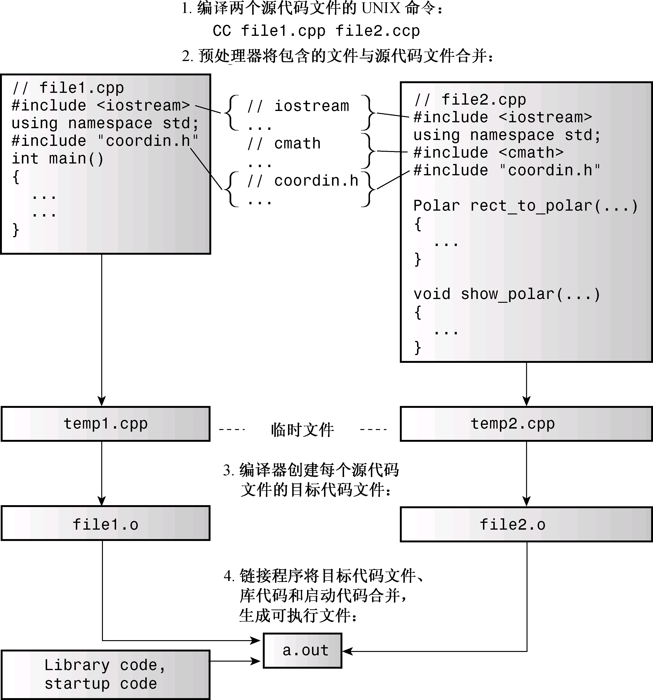
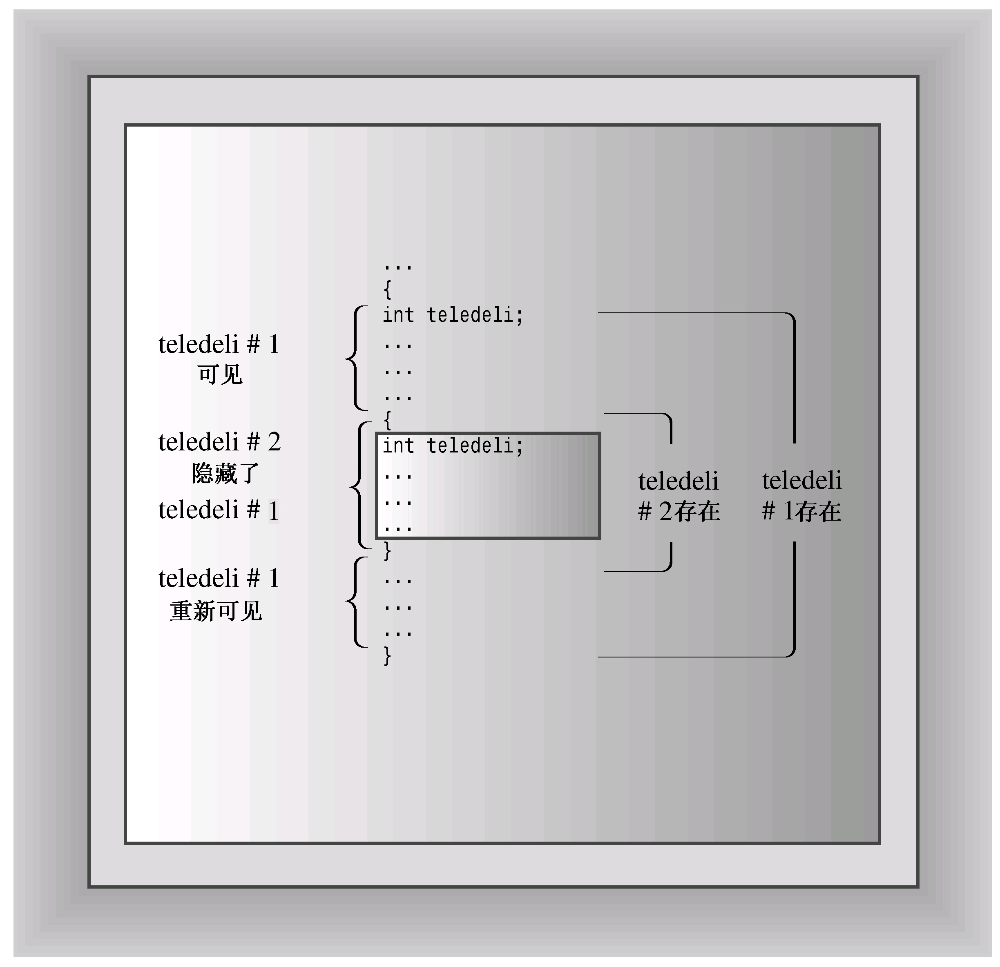
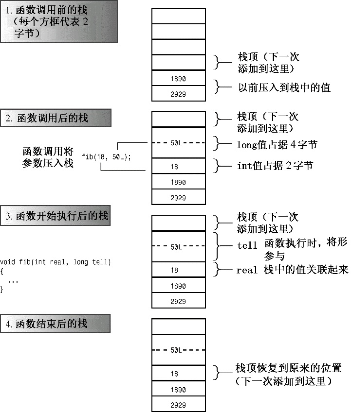
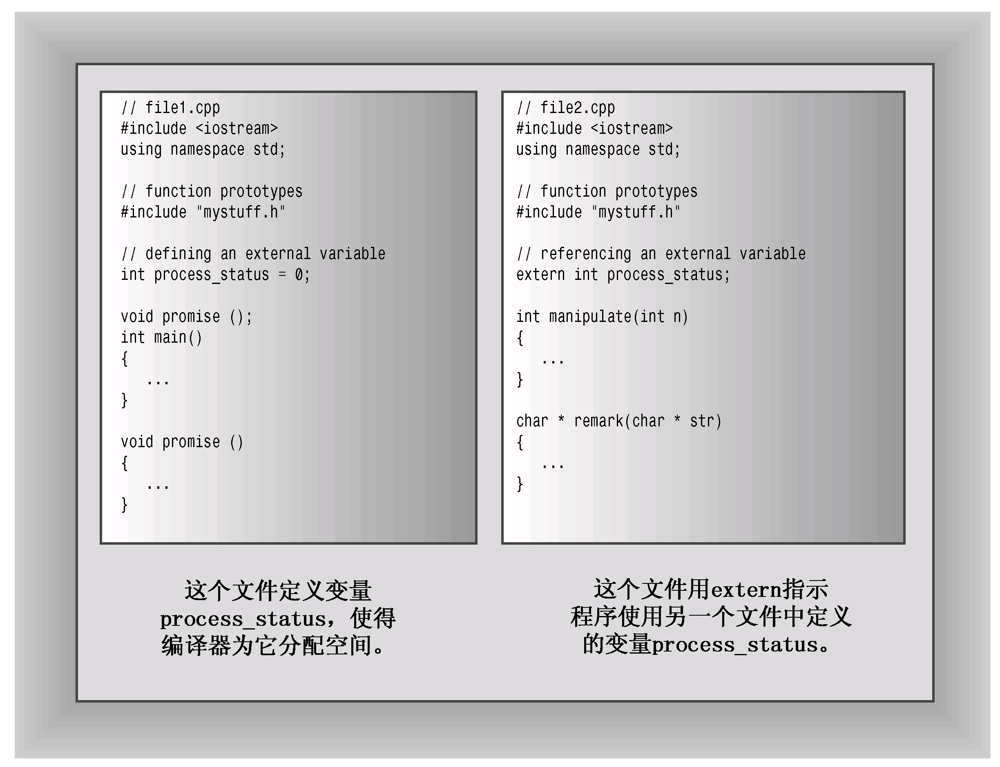
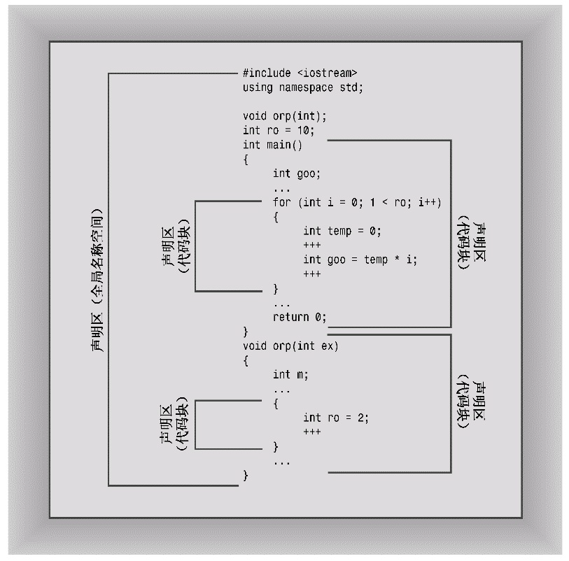
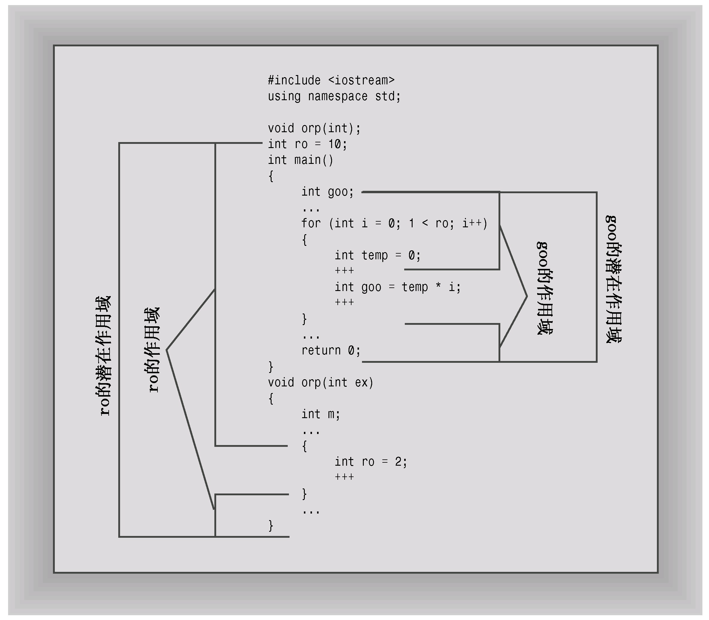

# 第9章 内存模型和名称空间
本章内容包括：

* 单独编译。
* 存储持续性、作用域和链接性。
* 定位（placement）new运算符。
* 名称空间。

C++为在内存中存储数据方面提供了多种选择。可以选择数据保留在内存中的时间长度（存储持续性）以及程序的哪一部分可以访问数据（作用域和链接）等。可以使用new来动态地分配内存，而定位new运算符提供了这种技术的一种变种。C++名称空间是另一种控制访问权的方式。通常，大型程序都由多个源代码文件组成，这些文件可能共享一些数据。这样的程序涉及到程序文件的单独编译，本章将首先介绍这个主题。

## 9.1 单独编译
和C语言一样，C++也允许甚至鼓励程序员将组件函数放在独立的文件中。第1章介绍过，可以单独编译这些文件，然后将它们链接成可执行的程序。（通常，C++编译器既编译程序，也管理链接器。）如果只修改了一个文件，则可以只重新编译该文件，然后将它与其他文件的编译版本链接。这使得大程序的管理更便捷。另外，大多数C++环境都提供了其他工具来帮助管理。例如，UNIX和Linux系统都具有make程序，可以跟踪程序依赖的文件以及这些文件的最后修改时间。运行make时，如果它检测到上次编译后修改了源文件，make将记住重新构建程序所需的步骤。大多数集成开发环境（包括Embarcadero C++ Builder、Microsoft Visual C++、Apple Xcode和Freescale CodeWarrior）都在Project菜单中提供了类似的工具。

现在看一个简单的示例。我们不是要从中了解编译的细节（这取决于实现），而是要重点介绍更通用的方面，如设计。

例如，假设程序员决定分解程序清单7.12中的程序，将支持函数放在一个独立的文件中。清单7.12将直角坐标转换为极坐标，然后显示结果。不能简单地以main( )之后的虚线为界，将原来的文件分为两个。问题在于，main( )和其他两个函数使用了同一个结构声明，因此两个文件都应包含该声明。简单地将它们输入进去无疑是自找麻烦。即使正确地复制了结构声明，如果以后要作修改，则必须记住对这两组声明都进行修改。简而言之，将一个程序放在多个文件中将引出新的问题。

谁希望出现更多的问题呢？C和C++的开发人员都不希望，因此他们提供了#include来处理这种情况。与其将结构声明加入到每一个文件中，不如将其放在头文件中，然后在每一个源代码文件中包含该头文件。这样，要修改结构声明时，只需在头文件中做一次改动即可。另外，也可以将函数原型放在头文件中。因此，可以将原来的程序分成三部分。

* 头文件：包含结构声明和使用这些结构的函数的原型。
* 源代码文件：包含与结构有关的函数的代码。
* 源代码文件：包含调用与结构相关的函数的代码。

这是一种非常有用的组织程序的策略。例如，如果编写另一个程序时，也需要使用这些函数，则只需包含头文件，并将函数文件添加到项目列表或make列表中即可。另外，这种组织方式也与OOP方法一致。一个文件（头文件）包含了用户定义类型的定义；另一个文件包含操纵用户定义类型的函数的代码。这两个文件组成了一个软件包，可用于各种程序中。

请不要将函数定义或变量声明放到头文件中。这样做对于简单的情况可能是可行的，但通常会引来麻烦。例如，如果在头文件包含一个函数定义，然后在其他两个文件（属于同一个程序）中包含该头文件，则同一个程序中将包含同一个函数的两个定义，除非函数是内联的，否则这将出错。下面列出了头文件中常包含的内容。

* 函数原型。
* 使用#define或const定义的符号常量。
* 结构声明。
* 类声明。
* 模板声明。
* 内联函数。

将结构声明放在头文件中是可以的，因为它们不创建变量，而只是在源代码文件中声明结构变量时，告诉编译器如何创建该结构变量。同样，模板声明不是将被编译的代码，它们指示编译器如何生成与源代码中的函数调用相匹配的函数定义。被声明为const的数据和内联函数有特殊的链接属性（稍后将介绍），因此可以将其放在头文件中，而不会引起问题。

程序清单9.1、程序清单9.2和程序清单9.3是将程序清单7.12分成几个独立部分后得到的结果。注意，在包含头文件时，我们使用“coordin.h”，而不是<coodin.h>。如果文件名包含在尖括号中，则C++编译器将在存储标准头文件的主机系统的文件系统中查找；但如果文件名包含在双引号中，则编译器将首先查找当前的工作目录或源代码目录（或其他目录，这取决于编译器）。如果没有在那里找到头文件，则将在标准位置查找。因此在包含自己的头文件时，应使用引号而不是尖括号。

图9.1简要地说明了在UNIX系统中将该程序组合起来的步骤。注意，只需执行编译命令CC即可，其他步骤将自动完成。g++和gpp命令行编译器以及Borland C++命令行编译器（bcc32.exe）的行为类似。Apple Xcode、Embarcadero C++ Builderr和Microsoft Visual C++基本上执行同样的步骤，但正如第1章介绍的，启动这个过程的方式不同——使用能够创建项目并将其与源代码文件关联起来的菜单。注意，只需将源代码文件加入到项目中，而不用加入头文件。这是因为#include指令管理头文件。另外，不要使用#include来包含源代码文件，这样做将导致多重声明。

> **警告：**
> 
> 在IDE中，不要将头文件加入到项目列表中，也不要在源代码文件中使用#include来包含其他源代码文件。

程序清单9.1 coordin.h
```c++
// coordin.h -- structure templates and function prototypes
// structure templates
#ifndef COORDIN_H_
#define COORDIN_H_

struct polar
{
    double distance;    // distance from origin
    double angle;        // direction from origin
};
struct rect
{
    double x;        // horizontal distance from origin
    double y;        // vertical distance from origin
};

// prototypes
polar rect_to_polar(rect xypos);
void show_polar(polar dapos); 

#endif
```



> **头文件管理**
> 
> 在同一个文件中只能将同一个头文件包含一次。记住这个规则很容易，但很可能在不知情的情况下将头文件包含多次。例如，可能使用包含了另外一个头文件的头文件。有一种标准的C/C++技术可以避免多次包含同一个头文件。它是基于预处理器编译指令#ifndef（即if not defined）的。下面的代码片段意味着仅当以前没有使用预处理器编译指令#define定义名称COORDINH时，才处理#ifndef和#endif之间的语句：
> ```c++
> #ifndef COORDIN_H_
> ...
> #endif
> ```
> 
> 通常，使用#define语句来创建符号常量，如下所示：
> ```c++
> #define MAXIMUM 4096
> ```
> 
> 但只要将#define用于名称，就足以完成该名称的定义，如下所示：
> ```c++
> #define COORDIN_H_
> ```
> 
> 程序清单9.1使用这种技术是为了将文件内容包含在#ifndef中：
> ```c++
> #ifndef COORDIN_H_
> #define COORDIN_H_
> // place include file contents here
> #endif
> ```
> 
> 编译器首次遇到该文件时，名称COORDINH没有定义（我们根据include文件名来选择名称，并加上一些下划线，以创建一个在其他地方不太可能被定义的名称）。在这种情况下，编译器将查看#ifndef和#endif之间的内容（这正是我们希望的），并读取定义COORDINH的一行。如果在同一个文件中遇到其他包含coordin.h的代码，编译器将知道COORDINH已经被定义了，从而跳到#endfi后面的一行上。注意，这种方法并不能防止编译器将文件包含两次，而只是让它忽略除第一次包含之外的所有内容。大多数标准C和C++头文件都使用这种防护（guarding）方案。否则，可能在一个文件中定义同一个结构两次，这将导致编译错误。

程序清单9.2 file1.cpp
```c++
// file1.cpp -- example of a three-file program
#include <iostream>
#include "coordin.h" // structure templates, function prototypes
using namespace std;
int main()
{
    rect rplace;
    polar pplace;

    cout << "Enter the x and y values: ";
    while (cin >> rplace.x >> rplace.y)  // slick use of cin
    {
        pplace = rect_to_polar(rplace);
        show_polar(pplace);
        cout << "Next two numbers (q to quit): ";
    }
    cout << "Bye!\n";
// keep window open in MSVC++
/*
    cin.clear();
    while (cin.get() != '\n')
        continue;
    cin.get();
*/
    return 0; 
}
```

程序清单9.3 file2.cpp
```c++
// file2.cpp -- contains functions called in file1.cpp
#include <iostream>
#include <cmath>
#include "coordin.h" // structure templates, function prototypes

// convert rectangular to polar coordinates
polar rect_to_polar(rect xypos)
{
    using namespace std;
    polar answer;

    answer.distance =
        sqrt( xypos.x * xypos.x + xypos.y * xypos.y);
    answer.angle = atan2(xypos.y, xypos.x);
    return answer;      // returns a polar structure
}

// show polar coordinates, converting angle to degrees
void show_polar (polar dapos)
{
    using namespace std;
    const double Rad_to_deg = 57.29577951;

    cout << "distance = " << dapos.distance;
    cout << ", angle = " << dapos.angle * Rad_to_deg;
    cout << " degrees\n";
}
```

将这两个源代码文件和新的头文件一起进行编译和链接，将生成一个可执行程序。下面是该程序的运行情况：
```c++
Enter the x and y values: 120 80
distance = 144.222, angle = 33.6901 degrees
Next two numbers (q to quit): 120 50
distance = 130, angle = 22.6199 degrees
Next two numbers (q to quit): q
Bye!
```

顺便说一句，虽然我们讨论的是根据文件进行单独编译，但为保持通用性，C++标准使用了术语翻译单元（translation unit），而不是文件；文件并不是计算机组织信息时的唯一方式。出于简化的目的，本书使用术语文件，您可将其解释为翻译单元。

> **多个库的链接**
> 
> C++标准允许每个编译器设计人员以他认为合适的方式实现名称修饰（参见第8章的旁注“什么是名称修饰”），因此由不同编译器创建的二进制模块（对象代码文件）很可能无法正确地链接。也就是说，两个编译器将为同一个函数生成不同的修饰名称。名称的不同将使链接器无法将一个编译器生成的函数调用与另一个编译器生成的函数定义匹配。在链接编译模块时，请确保所有对象文件或库都是由同一个编译器生成的。如果有源代码，通常可以用自己的编译器重新编译源代码来消除链接错误。

## 9.2 存储持续性、作用域和链接性
介绍过多文件程序后，接下来扩展第4章对内存方案的讨论，即存储类别如何影响信息在文件间的共享。现在读者阅读第4章已经有一段时间了，因此先复习一下有关内存的知识。C++使用三种（在C++11中是四种）不同的方案来存储数据，这些方案的区别就在于数据保留在内存中的时间。

* 自动存储持续性：在函数定义中声明的变量（包括函数参数）的存储持续性为自动的。它们在程序开始执行其所属的函数或代码块时被创建，在执行完函数或代码块时，它们使用的内存被释放。C++有两种存储持续性为自动的变量。
* 静态存储持续性：在函数定义外定义的变量和使用关键字static定义的变量的存储持续性都为静态。它们在程序整个运行过程中都存在。C++有3种存储持续性为静态的变量。
* 线程存储持续性（C++11）：当前，多核处理器很常见，这些CPU可同时处理多个执行任务。这让程序能够将计算放在可并行处理的不同线程中。如果变量是使用关键字thread_local声明的，则其生命周期与所属的线程一样长。本书不探讨并行编程。
* 动态存储持续性：用new运算符分配的内存将一直存在，直到使用delete运算符将其释放或程序结束为止。这种内存的存储持续性为动态，有时被称为自由存储（free store）或堆（heap）。

下面介绍其他内容，包括关于各种变量何时在作用域内或可见（可被程序使用）以及链接性的细节。链接性决定了哪些信息可在文件间共享。

### 9.2.1 作用域和链接
作用域（scope）描述了名称在文件（翻译单元）的多大范围内可见。例如，函数中定义的变量可在该函数中使用，但不能在其他函数中使用；而在文件中的函数定义之前定义的变量则可在所有函数中使用。链接性（linkage）描述了名称如何在不同单元间共享。链接性为外部的名称可在文件间共享，链接性为内部的名称只能由一个文件中的函数共享。自动变量的名称没有链接性，因为它们不能共享。

C++变量的作用域有多种。作用域为局部的变量只在定义它的代码块中可用。代码块是由花括号括起的一系列语句。例如函数体就是代码块，但可以在函数体中嵌入其他代码块。作用域为全局（也叫文件作用域）的变量在定义位置到文件结尾之间都可用。自动变量的作用域为局部，静态变量的作用域是全局还是局部取决于它是如何被定义的。在函数原型作用域（function prototype scope）中使用的名称只在包含参数列表的括号内可用（这就是为什么这些名称是什么以及是否出现都不重要的原因）。在类中声明的成员的作用域为整个类（参见第10章）。在名称空间中声明的变量的作用域为整个名称空间（由于名称空间已经引入到C++语言中，因此全局作用域是名称空间作用域的特例）。

C++函数的作用域可以是整个类或整个名称空间（包括全局的），但不能是局部的（因为不能在代码块内定义函数，如果函数的作用域为局部，则只对它自己是可见的，因此不能被其他函数调用。这样的函数将无法运行）。

不同的C++存储方式是通过存储持续性、作用域和链接性来描述的。下面来看看各种C++存储方式的这些特征。首先介绍引入名称空间之前的情况，然后看一看名称空间带来的影响。

### 9.2.2 自动存储持续性
在默认情况下，在函数中声明的函数参数和变量的存储持续性为自动，作用域为局部，没有链接性。也就是说，如果在main( )中声明了一个名为texas的变量，并在函数oil( )中也声明了一个名为texas变量，则创建了两个独立的变量——只有在定义它们的函数中才能使用它们。对oil( )中的texas执行的任何操作都不会影响main( )中的texas，反之亦然。另外，当程序开始执行这些变量所属的代码块时，将为其分配内存；当函数结束时，这些变量都将消失（注意，执行到代码块时，将为变量分配内存，但其作用域的起点为其声明位置）。

如果在代码块中定义了变量，则该变量的存在时间和作用域将被限制在该代码块内。例如，假设在main( )的开头定义了一个名为teledeli的变量，然后在main( )中开始一个新的代码块，并其中定义了一个新的变量websight，则teledeli在内部代码块和外部代码块中都是可见的，而websight就只在内部代码块中可见，它的作用域是从定义它的位置到该代码块的结尾：
```c++
int main()
{
    int teledeli = 5;
    {                       // websight allocated
        cout << "Hello\n";
        int websight = -2;  // websight scope begins
        cout << websight << ' ' << teledeli << endl;
    }                       // websight expires
    cout << teledeli << endl;
}   // teledeli expires
```

然而，如果将内部代码块中的变量命名为teledeli，而不是websight，使得有两个同名的变量（一个位于外部代码块中，另一个位于内部代码块中），情况将如何呢？在这种情况下，程序执行内部代码块中的语句时，将teledeli解释为局部代码块变量。我们说，新的定义隐藏了（hide）以前的定义，新定义可见，旧定义暂时不可见。在程序离开该代码块时，原来的定义又重新可见（参见图9.2）。



程序清单9.4表明，自动变量只在包含它们的函数或代码块中可见。

程序清单9.4 auto.cpp
```c++
// autoscp.cpp -- illustrating scope of automatic variables
#include <iostream>
void oil(int x);
int main()
{
    using namespace std;

    int texas = 31;
    int year = 2011;
    cout << "In main(), texas = " << texas << ", &texas = ";
    cout << &texas << endl;
    cout << "In main(), year = " << year << ", &year = ";
    cout << &year << endl;
    oil(texas);
    cout << "In main(), texas = " << texas << ", &texas = ";
    cout << &texas << endl;
    cout << "In main(), year = " << year << ", &year = ";
    cout << &year << endl;
	// cin.get();
    return 0;
}

void oil(int x)
{
    using namespace std;
    int texas = 5;

    cout << "In oil(), texas = " << texas << ", &texas = ";
    cout << &texas << endl;
    cout << "In oil(), x = " << x << ", &x = ";
    cout << &x << endl;
    {                               // start a block
        int texas = 113;
        cout << "In block, texas = " << texas;
        cout << ", &texas = " << &texas << endl;
                cout << "In block, x = " << x << ", &x = ";
        cout << &x << endl;
    }                               // end a block
    cout << "Post-block texas = " << texas;
    cout << ", &texas = " << &texas << endl;
}
```

下面是该程序的输出：
```c++
In main(), texas = 31, &texas = 0x7ffde34ecb20
In main(), year = 2011, &year = 0x7ffde34ecb24
In oil(), texas = 5, &texas = 0x7ffde34ecb00
In oil(), x = 31, &x = 0x7ffde34ecafc
In block, texas = 113, &texas = 0x7ffde34ecb04
In block, x = 31, &x = 0x7ffde34ecafc
Post-block texas = 5, &texas = 0x7ffde34ecb00
In main(), texas = 31, &texas = 0x7ffde34ecb20
In main(), year = 2011, &year = 0x7ffde34ecb24
```

在程序清单9.4中，3个texas变量的地址各不相同，而程序使用当前可见的那个变量，因此将113赋给oil( )中的内部代码块中的texas，对其他同名变量没有影响。同样，实际的地址值和地址格式随系统而异。

现在总结一下整个过程。执行到main( )时，程序为texas和year分配空间，使得这些变量可见。当程序调用oil( )时，这些变量仍留在内存中，但不可见。为两个新变量（x和texas）分配内存，从而使它们可见。在程序执行到oil( )中的内部代码块时，新的texas将不可见，它被一个更新的定义代替。然而，变量x仍然可见，这是因为该代码块没有定义x变量。当程序流程离开该代码块时，将释放最新的texas使用的内存，而第二个texas再次可见。当oil( )函数结束时，texas和x都将过期，而最初的texas和year再次变得可见。

> **使用C++11中的auto**
> 
> 在C++11中，关键字auto用于自动类型推断，这在第3、7和8章介绍过。但在C语言和以前的C++版本中，auto的含义截然不同，它用于显式地指出变量为自动存储：
> ```c++
> int froob(int n)
> {
>     auto float ford;    // ford has automatic storage
>     ...
> }
> 
> 由于只能将关键字auto用于默认为自动的变量，因此程序员几乎不使用它。它的主要用途是指出当前变量为局部自动变量。
> 
> 在C++11中，这种用法不再合法。制定标准的人不愿引入新关键字，因为这样做可能导致将该关键字用于其他目的的代码非法。考虑到auto的老用法很少使用，因此赋予其新含义比引入新关键字是更好的选择。

1. 自动变量的初始化

可以使用任何在声明时其值为已知的表达式来初始化自动变量，下面的示例初始化变量x、y和z：
```c++
int w;            // value of w is indeterminate
int x = 5;        // initialized with a numeric literal
int big = INT_MAX - 1;  // initialized with a constant expression
int y = 2 * x;    // use previously determined value of x
cin >> w;
int z = 3 * w;    // use new value of w
```

2. 自动变量和栈

了解典型的C++编译器如何实现自动变量有助于更深入地了解自动变量。由于自动变量的数目随函数的开始和结束而增减，因此程序必须在运行时对自动变量进行管理。常用的方法是留出一段内存，并将其视为栈，以管理变量的增减。之所以被称为栈，是由于新数据被象征性地放在原有数据的上面（也就是说，在相邻的内存单元中，而不是在同一个内存单元中），当程序使用完后，将其从栈中删除。栈的默认长度取决于实现，但编译器通常提供改变栈长度的选项。程序使用两个指针来跟踪栈，一个指针指向栈底——栈的开始位置，另一个指针指向堆顶——下一个可用内存单元。当函数被调用时，其自动变量将被加入到栈中，栈顶指针指向变量后面的下一个可用的内存单元。函数结束时，栈顶指针被重置为函数被调用前的值，从而释放新变量使用的内存。

栈是LIFO（后进先出）的，即最后加入到栈中的变量首先被弹出。这种设计简化了参数传递。函数调用将其参数的值放在栈顶，然后重新设置栈顶指针。被调用的函数根据其形参描述来确定每个参数的地址。例如，图9.3表明，函数fib( )被调用时，传递一个2字节的int和一个4字节的long。这些值被加入到栈中。当fib( )开始执行时，它将名称real和tell同这两个值关联起来。当fib( )结束时，栈顶指针重新指向以前的位置。新值没有被删除，但不再被标记，它们所占据的空间将被下一个将值加入到栈中的函数调用所使用（图9.3做了简化，因为函数调用可能传递其他信息，如返回地址）。



3. 寄存器变量

关键字register最初是由C语言引入的，它建议编译器使用CPU寄存器来存储自动变量：
```c++
register int count_fast;    // request for a register variable
```

这旨在提高访问变量的速度。

在C++11之前，这个关键字在C++中的用法始终未变，只是随着硬件和编译器变得越来越复杂，这种提示表明变量用得很多，编译器可对其做特殊处理。在C++11中，这种提示作用也失去了，关键字register只是显式地指出变量是自动的。鉴于关键字register只能用于原本就是自动的变量，使用它的唯一原因是，指出程序员想使用一个自动变量，这个变量的名称可能与外部变量相同。这与auto以前的用途完全相同。然而，保留关键字register的重要原因是，避免使用了该关键字的现有代码非法。

### 9.2.3 静态持续变量
和C语言一样，C++也为静态存储持续性变量提供了3种链接性：外部链接性（可在其他文件中访问）、内部链接性（只能在当前文件中访问）和无链接性（只能在当前函数或代码块中访问）。这3种链接性都在整个程序执行期间存在，与自动变量相比，它们的寿命更长。由于静态变量的数目在程序运行期间是不变的，因此程序不需要使用特殊的装置（如栈）来管理它们。编译器将分配固定的内存块来存储所有的静态变量，这些变量在整个程序执行期间一直存在。另外，如果没有显式地初始化静态变量，编译器将把它设置为0。在默认情况下，静态数组和结构将每个元素或成员的所有位都设置为0。

> **注意：**
> 
> 传统的K&R C不允许初始化自动数组和结构，但允许初始化静态数组和结构。ANSI C和C++允许对这两种数组和结构进行初始化，但有些旧的C++翻译器使用与ANSI C不完全兼容的C编译器。如果使用的是这样的实现，则可能需要使用这3种静态存储类型之一，以初始化数组和结构。

下面介绍如何创建这3种静态持续变量，然后介绍它们的特点。要想创建链接性为外部的静态持续变量，必须在代码块的外面声明它；要创建链接性为内部的静态持续变量，必须在代码块的外面声明它，并使用static限定符；要创建没有链接性的静态持续变量，必须在代码块内声明它，并使用static限定符。下面的代码片段说明这3种变量：
```c++
...
int global = 1000;        // static duration, external linkage
static int one_file = 50; // static duration, internal linkage
int main()
{
...
}
void funct1(int n)
{
    static int count = 0; // static duration, no linkage
    int llama = 0;
    ...
}
void funct2(int q)
{
    ...
}
```

正如前面指出的，所有静态持续变量（上述示例中的global、one_file和count）在整个程序执行期间都存在。在funct1( )中声明的变量count的作用域为局部，没有链接性，这意味着只能在funct1( )函数中使用它，就像自动变量llama一样。然而，与llama不同的是，即使在funct1( )函数没有被执行时，count也留在内存中。global和one_file的作用域都为整个文件，即在从声明位置到文件结尾的范围内都可以被使用。具体地说，可以在main( )、funct1( )和funct2( )中使用它们。由于one_file的链接性为内部，因此只能在包含上述代码的文件中使用它；由于global的链接性为外部，因此可以在程序的其他文件中使用它。

所有的静态持续变量都有下述初始化特征：未被初始化的静态变量的所有位都被设置为0。这种变量被称为零初始化的（zeroinitialized）。

表9.1总结了引入名称空间之前使用的存储特性。下面详细介绍各种静态持续性。

表9.1指出了关键字static的两种用法，但含义有些不同：用于局部声明，以指出变量是无链接性的静态变量时，static表示的是存储持续性；而用于代码块外的声明时，static表示内部链接性，而变量已经是静态持续性了。有人称之为关键字重载，即关键字的含义取决于上下文。

表9.1 5种变量储存方式

| 存 储 描 述 | 持 续 性 | 作 用 域 | 链 接 性 | 如 何 声 明 |
| :--- | :--- | :--- | :--- | :--- |
| 自动 | 自动 | 代码块 | 无 | 在代码块中 |
| 寄存器 | 自动 | 代码块 | 无 | 在代码块中，使用关键字register |
| 静态，无链接性 | 静态 | 代码块 | 无 | 在代码块中，使用关键字static |
| 静态，外部链接性 | 静态 | 文件 | 外部 | 不在任何函数内 |
| 静态，内部链接性 | 静态 | 文件 | 外部 | 不在任何函数内，使用关键字static |

静态变量的初始化

除默认的零初始化外，还可对静态变量进行常量表达式初始化和动态初始化。您可能猜到了，零初始化意味着将变量设置为零。对于标量类型，零将被强制转换为合适的类型。例如，在C++代码中，空指针用0表示，但内部可能采用非零表示，因此指针变量将被初始化相应的内部表示。结构成员被零初始化，且填充位都被设置为零。

零初始化和常量表达式初始化被统称为静态初始化，这意味着在编译器处理文件（翻译单元）时初始化变量。动态初始化意味着变量将在编译后初始化。

那么初始化形式由什么因素决定呢？首先，所有静态变量都被零初始化，而不管程序员是否显式地初始化了它。接下来，如果使用常量表达式初始化了变量，且编译器仅根据文件内容（包括被包含的头文件）就可计算表达式，编译器将执行常量表达式初始化。必要时，编译器将执行简单计算。如果没有足够的信息，变量将被动态初始化。请看下面的代码：
```c++
#include <cmath>
int x;                                // zero-initialization
int y = 5;                            // constant-expression initialization
long z = 13 * 13;                     // constant-expression initialization
const double pi = 4.0 * antan(1.0);   // dynamic initialization
```

首先，x、y、z和pi被零初始化。然后，编译器计算常量表达式，并将y和z分别初始化为5和169。但要初始化pi，必须调用函数atan()，这需要等到该函数被链接且程序执行时。

常量表达式并非只能是使用字面常量的算术表达式。例如，它还可使用sizeof运算符：
```c++
int enough = 2 * sizeof(long) + 1;    // constant-expression initialization
```

C++11新增了关键字constexpr，这增加了创建常量表达式的方式。但本书不会更详细地介绍C++11新增的这项新功能。

### 9.2.4 静态持续性、外部链接性
链接性为外部的变量通常简称为外部变量，它们的存储持续性为静态，作用域为整个文件。外部变量是在函数外部定义的，因此对所有函数而言都是外部的。例如，可以在main( )前面或头文件中定义它们。可以在文件中位于外部变量定义后面的任何函数中使用它，因此外部变量也称全局变量（相对于局部的自动变量）。

1. 单定义规则

一方面，在每个使用外部变量的文件中，都必须声明它；另一方面，C++有“单定义规则”（One Definition Rule，ODR），该规则指出，变量只能有一次定义。为满足这种需求，C++提供了两种变量声明。一种是定义声明（defining declaration）或简称为定义（definition），它给变量分配存储空间；另一种是引用声明（referencing declaration）或简称为声明（declaration），它不给变量分配存储空间，因为它引用已有的变量。

引用声明使用关键字extern，且不进行初始化；否则，声明为定义，导致分配存储空间：
```c++
double up;            // definition, up is 0
extern int blem;      // blem defined elsewhere
extern char gr = 'z'; // definition because initialized
```

如果要在多个文件中使用外部变量，只需在一个文件中包含该变量的定义（单定义规则），但在使用该变量的其他所有文件中，都必须使用关键字extern声明它：
```c++
// file01.cpp
extern int cats = 20;   // definition because of initialization
int dogs = 22;          // also a definition
int fleas;              // also a definition
...
// file02.cpp
// use cats and dogs from file01.cpp
extern int cats;        // not definitions because they use
extern int dogs;        // extern and have no initialization
...
// file98.cpp
// use cats, dogs, and fleas from file01.cpp
extern int cats;
extern int dogs;
extern int fleas;
...
```

在这里，所有文件都使用了在file01.cpp中定义的变量cats和dogs，但file02.cpp没有重新声明变量fleas，因此无法访问它。在文件file01.cpp中，关键字extern并非必不可少的，因为即使省略它，效果也相同（参见图9.4）



请注意，单定义规则并非意味着不能有多个变量的名称相同。例如，在不同函数中声明的同名自动变量是彼此独立的，它们都有自己的地址。另外，正如后面的示例将表明的，局部变量可能隐藏同名的全局变量。然而，虽然程序中可包含多个同名的变量，但每个变量都只有一个定义。

如果在函数中声明了一个与外部变量同名的变量，结果将如何呢？这种声明将被视为一个自动变量的定义，当程序执行自动变量所属的函数时，该变量将位于作用域内。程序清单9.5和程序清单9.6在两个文件中使用了一个外部变量，还演示了自动变量将隐藏同名的全局变量。它还演示了如何使用关键字extern来重新声明以前定义过的外部变量，以及如何使用C++的作用域解析运算符来访问被隐藏的外部变量。

程序清单9.5 external.cpp
```c++
// external.cpp -- external variable
// compile with support.cpp
#include <iostream>
// external variable
double warming = 0.3;       // warming defined

// function prototypes
void update(double dt);
void local();

int main()                  // uses global variable
{
    using namespace std;
    cout << "Global warming is " << warming << " degrees.\n";
    update(0.1);            // call function to change warming
    cout << "Global warming is " << warming << " degrees.\n";
    local();                // call function with local warming
    cout << "Global warming is " << warming << " degrees.\n";
    // cin.get();
    return 0;
}
```

程序清单9.6 support.cpp
```c++
// support.cpp -- use external variable
// compile with external.cpp
#include <iostream>
extern double warming;  // use warming from another file

// function prototypes
void update(double dt);
void local();

using std::cout;
void update(double dt)      // modifies global variable
{
    extern double warming;  // optional redeclaration
    warming += dt;          // uses global warming
    cout << "Updating global warming to " << warming;
    cout << " degrees.\n";
}

void local()                // uses local variable
{
    double warming = 0.8;   // new variable hides external one

    cout << "Local warming = " << warming << " degrees.\n";
        // Access global variable with the
        // scope resolution operator
    cout << "But global warming = " << ::warming;
    cout << " degrees.\n";
}
```

下面是该程序的输出：
```c++
Global warming is 0.3 degrees.
Updating global warming to 0.4 degrees.
Global warming is 0.4 degrees.
Local warming = 0.8 degrees.
But global warming = 0.4 degrees.
Global warming is 0.4 degrees.
```

2. 程序说明

程序清单9.5和程序清单9.6所示程序的输出表明，main( )和update( )都可以访问外部变量warming。注意，update( )修改了warming，这种修改在随后使用该变量时显现出来了。

在程序清单9.5中，warming的定义如下：
```c++
double warming = 0.3;       // warming defined
```

在程序清单9.6中，使用关键字extern声明变量warming，让该文件中的函数能够使用它：
```c++
extern double warming;  // use warming from another file
```

正如注释指出的，该声明的的意思是，使用外部定义的变量warming。

另外，函数update()使用关键字extern重新声明了变量warming，这个关键字的意思是，通过这个名称使用在外部定义的变量。由于即使省略该声明，update( )的功能也相同，因此该声明是可选的。它指出该函数被设计成使用外部变量。

local( )函数表明，定义与全局变量同名的局部变量后，局部变量将隐藏全局变量。例如，local( )函数显示warming的值时，将使用warming的局部定义。

C++比C语言更进了一步——它提供了作用域解析运算符（::）。放在变量名前面时，该运算符表示使用变量的全局版本。因此，local( )将warming显示为0.8，但将::warming显示为0.4。后面介绍名称空间和类时，将再次介绍该运算符。从清晰和避免错误的角度说，相对于使用warming并依赖于作用域规则，在函数update()中使用::warming是更好的选择，也更安全。

> **全局变量和局部变量**
> 
> 既然可以选择使用全局变量或局部变量，那么到底应使用哪种呢？首先，全局变量很有吸引力——因为所有的函数能访问全局变量，因此不用传递参数。但易于访问的代价很大——程序不可靠。计算经验表明，程序越能避免对数据进行不必要的访问，就越能保持数据的完整性。通常情况下，应使用局部变量，应在需要知晓时才传递数据，而不应不加区分地使用全局变量来使数据可用。读者将会看到，OOP在数据隔离方面又向前迈进了一步。
> 
> 然而，全局变量也有它们的用处。例如，可以让多个函数可以使用同一个数据块（如月份名数组或原子量数组）。外部存储尤其适于表示常量数据，因为这样可以使用关键字const来防止数据被修改。
> ```c++
> const char * const months[12] = 
> {
>     "January", "February", "March", "April", "May",
>     "June", "July", "August", "September", "October",
>     "November", "December"
> };
> 
> 在上述示例中，第一个const防止字符串被修改，第二个const确保数组中每个指针始终指向它最初指向的字符串。

### 9.2.5 静态持续性、内部链接性
将static限定符用于作用域为整个文件的变量时，该变量的链接性将为内部的。在多文件程序中，内部链接性和外部链接性之间的差别很有意义。链接性为内部的变量只能在其所属的文件中使用；但常规外部变量都具有外部链接性，即可以在其他文件中使用，如前面的示例所示。

如果要在其他文件中使用相同的名称来表示其他变量，该如何办呢？只需省略关键字extern即可吗？
```c++
// file1
int errors = 20;        // external declaration
...
--------------------------------------------------------------
// file2
int errors = 5;         // ??known to file2 only??
void froobish()
{
    cout << errors;     // fails
    ...
```

这种做法将失败，因为它违反了单定义规则。file2中的定义试图创建一个外部变量，因此程序将包含errors的两个定义，这是错误。

但如果文件定义了一个静态外部变量，其名称与另一个文件中声明的常规外部变量相同，则在该文件中，静态变量将隐藏常规外部变量：
```c++
// file1
int errors = 20;        // external declaration
...
--------------------------------------------------------------
// file2
static int errors = 5;         // known to file2 only
void froobish()
{
    cout << errors;     // uses errors defined in file2
    ...
```

这没有违反单定义规则，因为关键字static指出标识符errors的链接性为内部，因此并非要提供外部定义。

> **注意：**
> 
> 在多文件程序中，可以在一个文件（且只能在一个文件）中定义一个外部变量。使用该变量的其他文件必须使用关键字extern声明它。

可使用外部变量在多文件程序的不同部分之间共享数据；可使用链接性为内部的静态变量在同一个文件中的多个函数之间共享数据（名称空间提供了另外一种共享数据的方法）。另外，如果将作用域为整个文件的变量变为静态的，就不必担心其名称与其他文件中的作用域为整个文件的变量发生冲突。

程序清单9.7和程序清单9.8演示了C++如何处理链接性为外部和内部的变量。程序清单9.7（twofile1.cpp）定义了外部变量tom和dick以及静态外部变量harry。这个文件中的main( )函数显示这3个变量的地址，然后调用remote_access( )函数，该函数是在另一个文件中定义的。程序清单9.8（twofile2.cpp）列出了该文件。除定义remote_access( )外，该文件还使用extern关键字来与第一个文件共享tom。接下来，该文件定义一个名为dick的静态变量。static限定符使该变量被限制在这个文件内，并覆盖相应的全局定义。然后，该文件定义了一个名为harry的外部变量，这不会与第一个文件中的harry发生冲突，因为后者的链接性为内部的。随后，remote-access( )函数显示这3个变量的地址，以便于将它们与第一个文件中相应变量的地址进行比较。别忘了编译这两个文件，并将它们链接起来，以得到完整的程序。

程序清单9.7 twofile1.cpp
```c++
// twofile1.cpp -- variables with external and internal linkage
#include <iostream>     // to be compiled with two file2.cpp
int tom = 3;            // external variable definition
int dick = 30;          // external variable definition
static int harry = 300; // static, internal linkage
// function prototype
void remote_access();

int main()
{
    using namespace std;
    cout << "main() reports the following addresses:\n";
    cout << &tom << " = &tom, " << &dick << " = &dick, ";
    cout << &harry << " = &harry\n";
    remote_access();
    // cin.get();
    return 0; 
}
```

程序清单9.8 twofile2.cpp
```c++
// twofile2.cpp -- variables with internal and external linkage
#include <iostream>
extern int tom;         // tom defined elsewhere
static int dick = 10;   // overrides external dick
int harry = 200;        // external variable definition,
                        // no conflict with twofile1 harry

void remote_access()
{
    using namespace std;
		
    cout << "remote_access() reports the following addresses:\n";
    cout << &tom << " = &tom, " << &dick << " = &dick, ";
    cout << &harry << " = &harry\n";
}
```

下面是编译程序清单9.7和程序清单9.8生成的程序的输出：
```c++
main() reports the following addresses:
0x557ea4af8010 = &tom, 0x557ea4af8014 = &dick, 0x557ea4af8018 = &harry
remote_access() reports the following addresses:
0x557ea4af8010 = &tom, 0x557ea4af801c = &dick, 0x557ea4af8020 = &harry
```

从上述地址可知，这两个文件使用了同一个tom变量，但使用了不同的dick和harry变量。具体的地址和格式可能随系统而异，但两个tom变量的地址将相同，而两个dick和harry变量的地址不同。

### 9.2.6 静态存储持续性、无链接性
至此，介绍了链接性分别为内部和外部、作用域为整个文件的变量。接下来介绍静态持续家族中的第三个成员——无链接性的局部变量。这种变量是这样创建的，将static限定符用于在代码块中定义的变量。在代码块中使用static时，将导致局部变量的存储持续性为静态的。这意味着虽然该变量只在该代码块中可用，但它在该代码块不处于活动状态时仍然存在。因此在两次函数调用之间，静态局部变量的值将保持不变。（静态变量适用于再生——可以用它们将瑞士银行的秘密账号传递到下一个要去的地方）。另外，如果初始化了静态局部变量，则程序只在启动时进行一次初始化。以后再调用函数时，将不会像自动变量那样再次被初始化。程序清单9.9说明了这几点。

程序清单9.9 static.cpp
```c++
// static.cpp -- using a static local variable
#include <iostream>
// constants
const int ArSize = 10;

// function prototype
void strcount(const char * str);

int main()
{
    using namespace std;
    char input[ArSize];
    char next;

    cout << "Enter a line:\n";
    cin.get(input, ArSize);
    while (cin)
    {
        cin.get(next);
        while (next != '\n')    // string didn't fit!
            cin.get(next);      // dispose of remainder
        strcount(input);
        cout << "Enter next line (empty line to quit):\n";
        cin.get(input, ArSize);
    }
    cout << "Bye\n";
// code to keep window open for MSVC++
/*
cin.clear();
    while (cin.get() != '\n')
        continue;
    cin.get();
*/
    return 0;
}

void strcount(const char * str)
{
    using namespace std;
    static int total = 0;        // static local variable
    int count = 0;               // automatic local variable

    cout << "\"" << str <<"\" contains ";
    while (*str++)               // go to end of string
        count++;
    total += count;
    cout << count << " characters\n";
    cout << total << " characters total\n";
}
```

顺便说一句，该程序演示了一种处理行输入可能长于目标数组的方法。本书前面讲过，方法cin.get(input, ArSize)将一直读取输入，直到到达行尾或读取了ArSize-1个字符为止。它把换行符留在输入队列中。该程序使用cin.get(next)读取行输入后的字符。如果next是换行符，则说明cin.get(input, ArSize)读取了整行；否则说明行中还有字符没有被读取。随后，程序使用一个循环来丢弃余下的字符，不过读者可以修改代码，让下一轮输入读取行中余下的字符。该程序还利用了这样一个事实，即试图使用get(char *, int)读取空行将导致cin为false。

下面是该程序的输出：
```c++
Enter a line:
nice pants
"nice pant" contains 9 characters
9 characters total
Enter next line (empty line to quit):
thanks
"thanks" contains 6 characters
15 characters total
Enter next line (empty line to quit):
parting is such sweet sorrow
"parting i" contains 9 characters
24 characters total
Enter next line (empty line to quit):
ok
"ok" contains 2 characters
26 characters total
Enter next line (empty line to quit):

Bye
```

注意，由于数组长度为10，因此程序从每行读取的字符数都不超过9个。另外还需要注意的是，每次函数被调用时，自动变量count都被重置为0。然而，静态变量total只在程序运行时被设置为0，以后在两次函数调用之间，其值将保持不变，因此能够记录读取的字符总数。

### 9.2.7 说明符和限定符
有些被称为存储说明符（storage class specifier）或cv-限定符（cvqualifier）的C++关键字提供了其他有关存储的信息。下面是存储说明符：

* auto（在C++11中不再是说明符）；
* register；
* static；
* extern；
* thread_local（C++11新增的）；
* mutable。

其中的大部分已经介绍过了，在同一个声明中不能使用多个说明符，但thread_local除外，它可与static或extern结合使用。前面讲过，在C++11之前，可以在声明中使用关键字auto指出变量为自动变量；但在C++11中，auto用于自动类型推断。关键字register用于在声明中指示寄存器存储，而在C++11中，它只是显式地指出变量是自动的。关键字static被用在作用域为整个文件的声明中时，表示内部链接性；被用于局部声明中，表示局部变量的存储持续性为静态的。关键字extern表明是引用声明，即声明引用在其他地方定义的变量。关键字thread_local指出变量的持续性与其所属线程的持续性相同。thread_local变量之于线程，犹如常规静态变量之于整个程序。关键字mutable的含义将根据const来解释，因此先来介绍cv-限定符，然后再解释它。

1. cv-限定符

下面就是cv限定符：

* const；
* volatile。

（读者可能猜到了，cv表示const和volatile）。最常用的cv-限定符是const，而读者已经知道其用途。它表明，内存被初始化后，程序便不能再对它进行修改。稍后再回过头来介绍它。

关键字volatile表明，即使程序代码没有对内存单元进行修改，其值也可能发生变化。听起来似乎很神秘，实际上并非如此。例如，可以将一个指针指向某个硬件位置，其中包含了来自串行端口的时间或信息。在这种情况下，硬件（而不是程序）可能修改其中的内容。或者两个程序可能互相影响，共享数据。该关键字的作用是为了改善编译器的优化能力。例如，假设编译器发现，程序在几条语句中两次使用了某个变量的值，则编译器可能不是让程序查找这个值两次，而是将这个值缓存到寄存器中。这种优化假设变量的值在这两次使用之间不会变化。如果不将变量声明为volatile，则编译器将进行这种优化；将变量声明为volatile，相当于告诉编译器，不要进行这种优化。

2. mutable

现在回到mutable。可以用它来指出，即使结构（或类）变量为const，其某个成员也可以被修改。例如，请看下面的代码：
```c++
struct data
{
    char name[30];
    mutable int accesses;
    ...
};
const data veep = {"Claybourne Clodde", 0, ... };
strcpy(veep.name, "Joye Joux");   // not allowed
veep.accesses++;                  // allowed
```

veep的const限定符禁止程序修改veep的成员，但access成员的mutable说明符使得access不受这种限制。

本书不使用volatile或mutable，但将进一步介绍const。

3. 再谈const

在C++（但不是在C语言）中，const限定符对默认存储类型稍有影响。在默认情况下全局变量的链接性为外部的，但const全局变量的链接性为内部的。也就是说，在C++看来，全局const定义（如下述代码段所示）就像使用了static说明符一样。
```c++
const int fingers = 10;   // same as static const int fingers = 10;
int main(void)
{
    ...
```

C++修改了常量类型的规则，让程序员更轻松。例如，假设将一组常量放在头文件中，并在同一个程序的多个文件中使用该头文件。那么，预处理器将头文件的内容包含到每个源文件中后，所有的源文件都将包含类似下面这样的定义：
```c++
const int fingers = 10;
const char * warning = "Wak!";
```

如果全局const声明的链接性像常规变量那样是外部的，则根据单定义规则，这将出错。也就是说，只能有一个文件可以包含前面的声明，而其他文件必须使用extern关键字来提供引用声明。另外，只有未使用extern关键字的声明才能进行初始化：
```c++
// extern would be required if const had external linkage
extern const int fingers;     // can't be initialized
extern const char * warning;
```

因此，需要为某个文件使用一组定义，而其他文件使用另一组声明。然而，由于外部定义的const数据的链接性为内部的，因此可以在所有文件中使用相同的声明。

内部链接性还意味着，每个文件都有自己的一组常量，而不是所有文件共享一组常量。每个定义都是其所属文件私有的，这就是能够将常量定义放在头文件中的原因。这样，只要在两个源代码文件中包括同一个头文件，则它们将获得同一组常量。

如果出于某种原因，程序员希望某个常量的链接性为外部的，则可以使用extern关键字来覆盖默认的内部链接性：
```c++
extern const int states = 50;   // definition with external linkage
```

在这种情况下，必须在所有使用该常量的文件中使用extern关键字来声明它。这与常规外部变量不同，定义常规外部变量时，不必使用extern关键字，但在使用该变量的其他文件中必须使用extern。然而，请记住，鉴于单个const在多个文件之间共享，因此只有一个文件可对其进行初始化。

在函数或代码块中声明const时，其作用域为代码块，即仅当程序执行该代码块中的代码时，该常量才是可用的。这意味着在函数或代码块中创建常量时，不必担心其名称与其他地方定义的常量发生冲突。

### 9.2.8 函数和链接性
和变量一样，函数也有链接性，虽然可选择的范围比变量小。和C语言一样，C++不允许在一个函数中定义另外一个函数，因此所有函数的存储持续性都自动为静态的，即在整个程序执行期间都一直存在。在默认情况下，函数的链接性为外部的，即可以在文件间共享。实际上，可以在函数原型中使用关键字extern来指出函数是在另一个文件中定义的，不过这是可选的（要让程序在另一个文件中查找函数，该文件必须作为程序的组成部分被编译，或者是由链接程序搜索的库文件）。还可以使用关键字static将函数的链接性设置为内部的，使之只能在一个文件中使用。必须同时在原型和函数定义中使用该关键字：
```c++
static int private(double x);
...
static int private(double x)
{
    ...
}
```

这意味着该函数只在这个文件中可见，还意味着可以在其他文件中定义同名的的函数。和变量一样，在定义静态函数的文件中，静态函数将覆盖外部定义，因此即使在外部定义了同名的函数，该文件仍将使用静态函数。

单定义规则也适用于非内联函数，因此对于每个非内联函数，程序只能包含一个定义。对于链接性为外部的函数来说，这意味着在多文件程序中，只能有一个文件（该文件可能是库文件，而不是您提供的）包含该函数的定义，但使用该函数的每个文件都应包含其函数原型。

内联函数不受这项规则的约束，这允许程序员能够将内联函数的定义放在头文件中。这样，包含了头文件的每个文件都有内联函数的定义。然而，C++要求同一个函数的所有内联定义都必须相同。

> **C++在哪里查找函数**
> 
> 假设在程序的某个文件中调用一个函数，C++将到哪里去寻找该函数的定义呢？如果该文件中的函数原型指出该函数是静态的，则编译器将只在该文件中查找函数定义；否则，编译器（包括链接程序）将在所有的程序文件中查找。如果找到两个定义，编译器将发出错误消息，因为每个外部函数只能有一个定义。如果在程序文件中没有找到，编译器将在库中搜索。这意味着如果定义了一个与库函数同名的函数，编译器将使用程序员定义的版本，而不是库函数（然而，C++保留了标准库函数的名称，即程序员不应使用它们）。有些编译器-链接程序要求显式地指出要搜索哪些库。

### 9.2.9 语言链接性
另一种形式的链接性——称为语言链接性（language linking）也对函数有影响。首先介绍一些背景知识。链接程序要求每个不同的函数都有不同的符号名。在C语言中，一个名称只对应一个函数，因此这很容易实现。为满足内部需要，C语言编译器可能将spiff这样的函数名翻译为_spiff。这种方法被称为C语言链接性（C language linkage）。但在C++中，同一个名称可能对应多个函数，必须将这些函数翻译为不同的符号名称。因此，C++编译器执行名称矫正或名称修饰（参见第8章），为重载函数生成不同的符号名称。例如，可能将spiff（int）转换为_spoff_i，而将spiff（double，double）转换为_spiff_d_d。这种方法被称为C++语言链接（C++ language linkage）。

链接程序寻找与C++函数调用匹配的函数时，使用的方法与C语言不同。但如果要在C++程序中使用C库中预编译的函数，将出现什么情况呢？例如，假设有下面的代码：
```c++
spiff(22);    // want spiff(int) from a C library
```

它在C库文件中的符号名称为_spiff，但对于我们假设的链接程序来说，C++查询约定是查找符号名称_spiff_i。为解决这种问题，可以用函数原型来指出要使用的约定：
```c++
extern "C" void spiff(int);     // usc C protocol for name look-up
extern void spoff(int);         // use C++ protocol for name look-up
extern "C++" void spaff(int);   // use C++ protocol for name look-up
```

第一个原型使用C语言链接性；而后面的两个使用C++语言链接性。第二个原型是通过默认方式指出这一点的，而第三个显式地指出了这一点。

C和C++链接性是C++标准指定的说明符，但实现可提供其他语言链接性说明符。

### 9.2.10 存储方案和动态分配
前面介绍C++用来为变量（包括数组和结构）分配内存的5种方案（线程内存除外），它们不适用于使用C++运算符new（或C函数malloc( )）分配的内存，这种内存被称为动态内存。第4章介绍过，动态内存由运算符new和delete控制，而不是由作用域和链接性规则控制。因此，可以在一个函数中分配动态内存，而在另一个函数中将其释放。与自动内存不同，动态内存不是LIFO，其分配和释放顺序要取决于new和delete在何时以何种方式被使用。通常，编译器使用三块独立的内存：一块用于静态变量（可能再细分），一块用于自动变量，另外一块用于动态存储。

虽然存储方案概念不适用于动态内存，但适用于用来跟踪动态内存的自动和静态指针变量。例如，假设在一个函数中包含下面的语句：
```c++
float * p_fees = new float [20];
```

由new分配的80个字节（假设float为4个字节）的内存将一直保留在内存中，直到使用delete运算符将其释放。但当包含该声明的语句块执行完毕时，p_fees指针将消失。如果希望另一个函数能够使用这80个字节中的内容，则必须将其地址传递或返回给该函数。另一方面，如果将p_fees的链接性声明为外部的，则文件中位于该声明后面的所有函数都可以使用它。另外，通过在另一个文件中使用下述声明，便可在其中使用该指针：
```c++
extern float * p_fees;
```

> **注意：**
> 
> 在程序结束时，由new分配的内存通常都将被释放，不过情况也并不总是这样。例如，在不那么健壮的操作系统中，在某些情况下，请求大型内存块将导致该代码块在程序结束不会被自动释放。最佳的做法是，使用delete来释放new分配的内存。

1. 使用new运算符初始化

如果要初始化动态分配的变量，该如何办呢？在C++98中，有时候可以这样做，C++11增加了其他可能性。下面先来看看C++98提供的可能性。

如果要为内置的标量类型（如int或double）分配存储空间并初始化，可在类型名后面加上初始值，并将其用括号括起：
```c++
int * pi = new int (6);   // *pi set to 6
double * pd = new double (99.99);   // *pd set to 99.99
```

这种括号语法也可用于有合适构造函数的类，这将在本书后面介绍。

然而，要初始化常规结构或数组，需要使用大括号的列表初始化，这要求编译器支持C++11。C++11允许您这样做：
```c++
struct where {double x; double y; double z;};
where * one = new where {2.5, 5.3, 7.2};  // C++11
int * ar = new int [4] {2, 4, 6, 7};      // C++11
```

在C++11中，还可将列表初始化用于单值变量：
```c++
int * pi = new int {6};   // *pi set to 6
double * pd = new double {99.99};   // *pd set to 99.99
```

2. new失败时

new可能找不到请求的内存量。在最初的10年中，C++在这种情况下让new返回空指针，但现在将引发异常std::bad_alloc。第15章通过一些简单的示例演示了这两种方法的工作原理。

3. new：运算符、函数和替换函数

运算符new和new []分别调用如下函数：
```c++
void * operator new(std::size_t);     // used by new
void * operator new[](std::size_t);  // used by new[]
```

这些函数被称为分配函数（alloction function），它们位于全局名称空间中。同样，也有由delete和delete []调用的释放函数（deallocation function）：
```c++
void operator delete(void *);
void operator delete[](void *);
```

它们使用第11章将讨论的运算符重载语法。std::size_t是一个typedef，对应于合适的整型。对于下面这样的基本语句：
```c++
int * pi = new int;
```

将被转换为下面这样：
```c++
int * pi = new(sizeof(int));
```

而下面的语句：
```c++
int * pa = new int[40];
```

将被转换为下面这样：
```c++
int * pa = new(40 * sizeof(int));
```

正如您知道的，使用运算符new的语句也可包含初始值，因此，使用new运算符时，可能不仅仅是调用new()函数。

同样，下面的语句：
```c++
delete pi;
```

将转换为如下函数调用：
```c++
delete(pi);
```

有趣的是，C++将这些函数称为可替换的（replaceable）。这意味着如果您有足够的知识和意愿，可为new和delete提供替换函数，并根据需要对其进行定制。例如，可定义作用域为类的替换函数，并对其进行定制，以满足该类的内存分配需求。在代码中，仍将使用new运算符，但它将调用您定义的new()函数。

4. 定位new运算符

通常，new负责在堆（heap）中找到一个足以能够满足要求的内存块。new运算符还有另一种变体，被称为定位（placement）new运算符，它让您能够指定要使用的位置。程序员可能使用这种特性来设置其内存管理规程、处理需要通过特定地址进行访问的硬件或在特定位置创建对象。

要使用定位new特性，首先需要包含头文件new，它提供了这种版本的new运算符的原型；然后将new运算符用于提供了所需地址的参数。除需要指定参数外，句法与常规new运算符相同。具体地说，使用定位new运算符时，变量后面可以有方括号，也可以没有。下面的代码段演示了new运算符的4种用法：
```c++
#include <new>
struct chaff
{
    char dross[20];
    int slag;
};
char buffer1[50];
char buffer2[500];
int main()
{
    chaff *p1, *p2;
    int *p3, *p4;
// first, the regular forms of new
    p1 = new chaff;   // place structure in heap
    p3 = new int[20]; // place int array in heap
// now, the two forms of placement new
    p2 = new (buffer1) chaff;     // place structure in buffer1
    p4 = new (buffer2) int [20];  // place int array in buffer1
...
```

出于简化的目的，这个示例使用两个静态数组来为定位new运算符提供内存空间。因此，上述代码从buffer1中分配空间给结构chaff，从buffer2中分配空间给一个包含20个元素的int数组。

熟悉定位new运算符后，来看一个示例程序。程序清单9.10使用常规new运算符和定位new运算符创建动态分配的数组。该程序说明了常规new运算符和定位new运算符之间的一些重要差别，在查看该程序的输出后，将对此进行讨论。

程序清单9.10 newplace.cpp
```c++
// newplace.cpp -- using placement new
#include <iostream>
#include <new> // for placement new
const int BUF = 512;
const int N = 5;
char buffer[BUF];      // chunk of memory
int main()
{
    using namespace std;

    double *pd1, *pd2;
    int i;
    cout << "Calling new and placement new:\n";
    pd1 = new double[N];           // use heap
    pd2 = new (buffer) double[N];  // use buffer array
    for (i = 0; i < N; i++)
        pd2[i] = pd1[i] = 1000 + 20.0 * i;
    cout << "Memory addresses:\n" << "  heap: " << pd1
        << "  static: " <<  (void *) buffer  <<endl;
    cout << "Memory contents:\n";
    for (i = 0; i < N; i++)
    {
        cout << pd1[i] << " at " << &pd1[i] << "; ";
        cout << pd2[i] << " at " << &pd2[i] << endl;
    }

    cout << "\nCalling new and placement new a second time:\n";
    double *pd3, *pd4;
    pd3= new double[N];            // find new address
    pd4 = new (buffer) double[N];  // overwrite old data
    for (i = 0; i < N; i++)
        pd4[i] = pd3[i] = 1000 + 40.0 * i;
    cout << "Memory contents:\n";
    for (i = 0; i < N; i++)
    {
        cout << pd3[i] << " at " << &pd3[i] << "; ";
        cout << pd4[i] << " at " << &pd4[i] << endl;
    }

    cout << "\nCalling new and placement new a third time:\n";
    delete [] pd1;
    pd1= new double[N];
    pd2 = new (buffer + N * sizeof(double)) double[N]; 
    for (i = 0; i < N; i++)
        pd2[i] = pd1[i] = 1000 + 60.0 * i;
    cout << "Memory contents:\n";
    for (i = 0; i < N; i++)
    {
        cout << pd1[i] << " at " << &pd1[i] << "; ";
        cout << pd2[i] << " at " << &pd2[i] << endl;
    }
    delete [] pd1;
    delete [] pd3;
    // cin.get();
    return 0;
}
```

下面是该程序在某个系统上运行时的输出：
```c++
Calling new and placement new:
Memory addresses:
  heap: 0x55b5f8b142c0  static: 0x55b5cb20a160
Memory contents:
1000 at 0x55b5f8b142c0; 1000 at 0x55b5cb20a160
1020 at 0x55b5f8b142c8; 1020 at 0x55b5cb20a168
1040 at 0x55b5f8b142d0; 1040 at 0x55b5cb20a170
1060 at 0x55b5f8b142d8; 1060 at 0x55b5cb20a178
1080 at 0x55b5f8b142e0; 1080 at 0x55b5cb20a180

Calling new and placement new a second time:
Memory contents:
1000 at 0x55b5f8b142f0; 1000 at 0x55b5cb20a160
1040 at 0x55b5f8b142f8; 1040 at 0x55b5cb20a168
1080 at 0x55b5f8b14300; 1080 at 0x55b5cb20a170
1120 at 0x55b5f8b14308; 1120 at 0x55b5cb20a178
1160 at 0x55b5f8b14310; 1160 at 0x55b5cb20a180

Calling new and placement new a third time:
Memory contents:
1000 at 0x55b5f8b142c0; 1000 at 0x55b5cb20a188
1060 at 0x55b5f8b142c8; 1060 at 0x55b5cb20a190
1120 at 0x55b5f8b142d0; 1120 at 0x55b5cb20a198
1180 at 0x55b5f8b142d8; 1180 at 0x55b5cb20a1a0
1240 at 0x55b5f8b142e0; 1240 at 0x55b5cb20a1a8
```

5. 程序说明

有关程序清单9.10，首先要指出的一点是，定位new运算符确实将数组p2放在了数组buffer中，p2和buffer的地址都是00FD9138。然而，它们的类型不同，p1是double指针，而buffer是char指针（顺便说一句，这也是程序使用(void *)对buffer进行强制转换的原因，如果不这样做，cout将显示一个字符串）同时，常规new将数组p1放在很远的地方，其地址为006E4AB0，位于动态管理的堆中。

需要指出的第二点是，第二个常规new运算符查找一个新的内存块，其起始地址为006E4B68；但第二个定位new运算符分配与以前相同的内存块：起始地址为00FD9138的内存块。定位new运算符使用传递给它的地址，它不跟踪哪些内存单元已被使用，也不查找未使用的内存块。这将一些内存管理的负担交给了程序员。例如，在第三次调用定位new运算符时，提供了一个从数组buffer开头算起的偏移量，因此将分配新的内存：
```c++
pd2 = new (buffer + N * sizeof(double)) double[N];    // offset of 40 bytes
```

第三点差别是，是否使用delete来释放内存。对于常规new运算符，下面的语句释放起始地址为006E4AB0的内存块，因此接下来再次调用new运算符时，该内存块是可用的：
```c++
delete [] pd1;
```

然而，程序清单9.10中的程序没有使用delete来释放使用定位new运算符分配的内存。事实上，在这个例子中不能这样做。buffer指定的内存是静态内存，而delete只能用于这样的指针：指向常规new运算符分配的堆内存。也就是说，数组buffer位于delete的管辖区域之外，下面的语句将引发运行阶段错误：
```c++
delete [] pd2;
```

另一方面，如果buffer是使用常规new运算符创建的，便可以使用常规delete运算符来释放整个内存块。

定位new运算符的另一种用法是，将其与初始化结合使用，从而将信息放在特定的硬件地址处。

您可能想知道定位new运算符的工作原理。基本上，它只是返回传递给它的地址，并将其强制转换为void *，以便能够赋给任何指针类型。但这说的是默认定位new函数，C++允许程序员重载定位new函数。

将定位new运算符用于类对象时，情况将更复杂，这将在第12章介绍。

6. 定位new的其他形式

就像常规new调用一个接收一个参数的new()函数一样，标准定位new调用一个接收两个参数的new()函数：
```c++
int * p1 = new int;               // invokes new(sizeof(int))
int * p2 = new(buffer) int;       // invokes new(sizeof(int), buffer)
int * p3 = new(buffer) int[40];   // invokes new(40*sizeof(int), buffer)
```

定位new函数不可替换，但可重载。它至少需要接收两个参数，其中第一个总是std::size_t，指定了请求的字节数。这样的重载函数都被称为定义new，即使额外的参数没有指定位置。

## 9.3 名称空间
在C++中，名称可以是变量、函数、结构、枚举、类以及类和结构的成员。当随着项目的增大，名称相互冲突的可能性也将增加。使用多个厂商的类库时，可能导致名称冲突。例如，两个库可能都定义了名为List、Tree和Node的类，但定义的方式不兼容。用户可能希望使用一个库的List类，而使用另一个库的Tree类。这种冲突被称为名称空间问题。

C++标准提供了名称空间工具，以便更好地控制名称的作用域。经过了一段时间后，编译器才支持名称空间，但现在这种支持很普遍。

### 9.3.1 传统的C++名称空间
介绍C++中新增的名称空间特性之前，先复习一下C++中已有的名称空间属性，并介绍一些术语，让读者熟悉名称空间的概念。

第一个需要知道的术语是声明区域（declaration region）。声明区域是可以在其中进行声明的区域。例如，可以在函数外面声明全局变量，对于这种变量，其声明区域为其声明所在的文件。对于在函数中声明的变量，其声明区域为其声明所在的代码块。

第二个需要知道的术语是潜在作用域（potential scope）。变量的潜在作用域从声明点开始，到其声明区域的结尾。因此潜在作用域比声明区域小，这是由于变量必须定义后才能使用。

然而，变量并非在其潜在作用域内的任何位置都是可见的。例如，它可能被另一个在嵌套声明区域中声明的同名变量隐藏。例如，在函数中声明的局部变量（对于这种变量，声明区域为整个函数）将隐藏在同一个文件中声明的全局变量（对于这种变量，声明区域为整个文件）。变量对程序而言可见的范围被称为作用域（scope），前面正是以这种方式使用该术语的。图9.5和图9.6对术语声明区域、潜在作用域和作用域进行了说明。

C++关于全局变量和局部变量的规则定义了一种名称空间层次。每个声明区域都可以声明名称，这些名称独立于在其他声明区域中声明的名称。在一个函数中声明的局部变量不会与在另一个函数中声明的局部变量发生冲突。





### 9.3.2 新的名称空间特性
C++新增了这样一种功能，即通过定义一种新的声明区域来创建命名的名称空间，这样做的目的之一是提供一个声明名称的区域。一个名称空间中的名称不会与另外一个名称空间的相同名称发生冲突，同时允许程序的其他部分使用该名称空间中声明的东西。例如，下面的代码使用新的关键字namespace创建了两个名称空间：Jack和Jill。
```c++
namespace Jack {
    double pail;          // variable declaration
    void fetch();         // function prototype
    int pal;              // variable declaration
    struct Well { ... };  // structure declaration
}
namespace Jill {
    double bucket(double n) { ... }   // function definition
    double fetch;                     // variable declaration
    int pal;                          // variable declaration
    struct Hill { ... };              // structure declaration
}
```

名称空间可以是全局的，也可以位于另一个名称空间中，但不能位于代码块中。因此，在默认情况下，在名称空间中声明的名称的链接性为外部的（除非它引用了常量）。

除了用户定义的名称空间外，还存在另一个名称空间——全局名称空间（global namespace）。它对应于文件级声明区域，因此前面所说的全局变量现在被描述为位于全局名称空间中。

任何名称空间中的名称都不会与其他名称空间中的名称发生冲突。因此，Jack中的fetch可以与Jill中的fetch共存，Jill中的Hill可以与外部Hill共存。名称空间中的声明和定义规则同全局声明和定义规则相同。

名称空间是开放的（open），即可以把名称加入到已有的名称空间中。例如，下面这条语句将名称goose添加到Jill中已有的名称列表中：
```c++
namespace Jill {
    char * goose(const char *);
}
```

同样，原来的Jack名称空间为fetch( )函数提供了原型。可以在该文件后面（或另外一个文件中）再次使用Jack名称空间来提供该函数的代码：
```c++
namespace Jack {
    void fetch()
    {
        ...
    }
}
```

当然，需要有一种方法来访问给定名称空间中的名称。最简单的方法是，通过作用域解析运算符::，使用名称空间来限定该名称：
```c++
Jack::pail = 12.34;   // use a variable
Jill::Hill mole;      // create a type Hill structure
Jack::fetch();        // use a function
```

未被装饰的名称（如pail）称为未限定的名称（unqualified name）；包含名称空间的名称（如Jack::pail）称为限定的名称（qualified name）。

1. using声明和using编译指令

我们并不希望每次使用名称时都对它进行限定，因此C++提供了两种机制（using声明和using编译指令）来简化对名称空间中名称的使用。using声明使特定的标识符可用，using编译指令使整个名称空间可用。

using声明由被限定的名称和它前面的关键字using组成：
```c++
using Jill::fetch;    // a using declaration
```

using声明将特定的名称添加到它所属的声明区域中。例如main( )中的using声明Jill::fetch将fetch添加到main( )定义的声明区域中。完成该声明后，便可以使用名称fetch代替Jill::fetch。下面的代码段说明了这几点：
```c++
namespace Jill {
    double bucket(double n) { ... }
    double fetch;
    struct Hill { ... };
}
char fetch;
int main()
{
    using Jill::fetch;  // put fetch into local namespace
    double fetch;       // Error! Already have a local fetch
    cin >> fetch;       // read a value into Jill::fetch
    cin >> ::fetch;     // read a value into global fetch
    ...
}
```

由于using声明将名称添加到局部声明区域中，因此这个示例避免了将另一个局部变量也命名为fetch。另外，和其他局部变量一样，fetch也将覆盖同名的全局变量。

在函数的外面使用using声明时，将把名称添加到全局名称空间中：
```c++
void other();
namespace Jill {
    double bucket(double n) { ... }
    double fetch;
    struct Hill { ... };    
}
using Jill::fetch;    // put fetch into global namespace
int main()
{
    cin >> fetch;     // read a value into Jill::fetch
    other();
    ...
}

void other()
{
    cout << fetch;    // display Jill::fetch
    ...
}
```

using声明使一个名称可用，而using编译指令使所有的名称都可用。using编译指令由名称空间名和它前面的关键字using namespace组成，它使名称空间中的所有名称都可用，而不需要使用作用域解析运算符：
```c++
using namespace Jack;   // make all the names in Jack available
```

在全局声明区域中使用using编译指令，将使该名称空间的名称全局可用。这种情况已出现过多次：
```c++
#include <iostream>   // places names in namespace std
using namespace std;  // make names available globally
```

在函数中使用using编译指令，将使其中的名称在该函数中可用，下面是一个例子：
```c++
int main()
{
    using namespace jack;   // make names available in vorn()
    ...
}
```

在本书前面中，经常将这种格式用于名称空间std。

有关using编译指令和using声明，需要记住的一点是，它们增加了名称冲突的可能性。也就是说，如果有名称空间jack和jill，并在代码中使用作用域解析运算符，则不会存在二义性：
```c++
jack::pal = 3;
jill::pal = 10;
```

变量jack::pal和jill::pal是不同的标识符，表示不同的内存单元。然而，如果使用using声明，情况将发生变化：
```c++
using jack::pal;
using jill::pal;
pal = 4;    // which one? now have a confilict
```
事实上，编译器不允许您同时使用上述两个using声明，因为这将导致二义性。

2. using编译指令和using声明之比较

使用using编译指令导入一个名称空间中所有的名称与使用多个using声明是不一样的，而更像是大量使用作用域解析运算符。使用using声明时，就好像声明了相应的名称一样。如果某个名称已经在函数中声明了，则不能用using声明导入相同的名称。然而，使用using编译指令时，将进行名称解析，就像在包含using声明和名称空间本身的最小声明区域中声明了名称一样。在下面的示例中，名称空间为全局的。如果使用using编译指令导入一个已经在函数中声明的名称，则局部名称将隐藏名称空间名，就像隐藏同名的全局变量一样。不过仍可以像下面的示例中那样使用作用域解析运算符：
```c++
namespace Jill {
    double bucket(double n) { ... }
    double fetch;
    struct Hill { ... };
}
char fetch;                   // global namespace
int main()
{
    using namespace Jill;     // import all namespace names
    Hill Thrill;              // create a type Jill::Hill structure
    double water = bucket(2); // use Jill::bucket();
    double fetch;             // not an error; hides Jill::fetch
    cin >> fetch;             // read a value into the local fetch
    cin >> ::fetch;           // read a value into global fetch
    cin >> Jill::fetch;       // read a value into Jill::fetch
    ...
}

int foom()
{
    Hill top;                 // ERROR
    Jill::Hill crest;         // valid
}
```

在main( )中，名称Jill::fetch被放在局部名称空间中，但其作用域不是局部的，因此不会覆盖全局的fetch。然而，局部声明的fetch将隐藏Jill::fetch和全局fetch。然而，如果使用作用域解析运算符，则后两个fetch变量都是可用的。读者应将这个示例与前面使用using声明的示例进行比较。

需要指出的另一点是，虽然函数中的using编译指令将名称空间的名称视为在函数之外声明的，但它不会使得该文件中的其他函数能够使用这些名称。因此，在前一个例子中，foom( )函数不能使用未限定的标识符Hill。

> **注意：**
> 
> 假设名称空间和声明区域定义了相同的名称。如果试图使用using声明将名称空间的名称导入该声明区域，则这两个名称会发生冲突，从而出错。如果使用using编译指令将该名称空间的名称导入该声明区域，则局部版本将隐藏名称空间版本。

一般说来，使用using声明比使用using编译指令更安全，这是由于它只导入指定的名称。如果该名称与局部名称发生冲突，编译器将发出指示。using编译指令导入所有名称，包括可能并不需要的名称。如果与局部名称发生冲突，则局部名称将覆盖名称空间版本，而编译器并不会发出警告。另外，名称空间的开放性意味着名称空间的名称可能分散在多个地方，这使得难以准确知道添加了哪些名称。

下面是本书的大部分示例采用的方法：
```c++
#include <iostream>
int main()
{
    using namespace std;
```

首先，#include语句将头文件iostream放到名称空间std中。然后，using编译指令是该名称空间在main( )函数中可用。有些示例采取下述方式：
```c++
#include <iostream>
using namespace std;
int main()
{
```

这将名称空间std中的所有内容导出到全局名称空间中。使用这种方法的主要原因是方便。它易于完成，同时如果系统不支持名称空间，可以将前两行替换为：
```c++
#include <iostream.h>
```

然而，名称空间的支持者希望有更多的选择，既可以使用解析运算符，也可以使用using声明。也就是说，不要这样做：
```c++
using namespace std;    // avoid as too indiscriminate
```

而应这样做：
```c++
int x;
std::cin >> x;
std:: cout << x << std::endl;
```

或者这样做：
```c++
using std::cin;
using std::cout;
using std::endl;
int x;
cin >> x;
cout << x << endl;
```

可以用嵌套式名称空间（将在下一节介绍）来创建一个包含常用using声明的名称空间。

3. 名称空间的其他特性

可以将名称空间声明进行嵌套：
```c++
namespace elements
{
    namespace fire
    {
        int flame;
        ...
    }
    float water;
}
```

这里，flame指的是element::fire::flame。同样，可以使用下面的using编译指令使内部的名称可用：
```c++
using namespace elements::fire;
```

另外，也可以在名称空间中使用using编译指令和using声明，如下所示：
```c++
namespace myth
{
    using Jill::fetch;
    using namespace elements;
    using std::cout;
    using std::cin;
}
```

假设要访问Jill::fetch。由于Jill::fetch现在位于名称空间myth（在这里，它被叫做fetch）中，因此可以这样访问它：
```c++
std::cin >> myth::fetch;
```

当然，由于它也位于Jill名称空间中，因此仍然可以称作Jill::fetch：
```c++
Jill::fetch;
std::cout << Jill::fetch;   // display value read into myth::fetch
```

如果没有与之冲突的局部变量，则也可以这样做：
```c++
using namespace myth;
cin >> fetch;       // really std::cin and Jill::fetch
```

现在考虑将using编译指令用于myth名称空间的情况。using编译指令是可传递的。如果A op B且B op C，则A op C，则说操作op是可传递的。例如，>运算符是可传递的（也就是说，如果A>B且B>C，则A>C）。在这个情况下，下面的语句将导入名称空间myth和elements：
```c++
using namespace myth;
```

这条编译指令与下面两条编译指令等价：
```c++
using namespace myth;
using namespace elements;
```

可以给名称空间创建别名。例如，假设有下面的名称空间：
```c++
namespace my_very_favorite_things { ... };
```

则可以使用下面的语句让mvft成为my_very_favorite_things的别名：
```c++
namespace myft = my_very_favorite_things;
```

可以使用这种技术来简化对嵌套名称空间的使用：
```c++
namespace MEF = myth::elements::fire;
using MEF::flame;
```

4. 未命名的名称空间

可以通过省略名称空间的名称来创建未命名的名称空间：
```c++
namespace         // unnamed namespace
{
    int ice;
    int bandycoot;
}
```

这就像后面跟着using编译指令一样，也就是说，在该名称空间中声明的名称的潜在作用域为：从声明点到该声明区域末尾。从这个方面看，它们与全局变量相似。然而，由于这种名称空间没有名称，因此不能显式地使用using编译指令或using声明来使它在其他位置都可用。具体地说，不能在未命名名称空间所属文件之外的其他文件中，使用该名称空间中的名称。这提供了链接性为内部的静态变量的替代品。例如，假设有这样的代码：
```c++
static int counts;    // static storage, internal linkage
int other();
int main()
{
    ...
}
int other()
{
    ...
}
```

采用名称空间的方法如下：
```c++
namespace
{
    int counts;   // static storage, internal linkage
}
int other();
int main()
{
    ...
}
int other()
{
    ...
}
```

### 9.3.3 名称空间示例
现在来看一个多文件示例，该示例说明了名称空间的一些特性。该程序的第一个文件（参见程序清单9.11）是头文件，其中包含头文件中常包含的内容：常量、结构定义和函数原型。在这个例子中，这些内容被放在两个名称空间中。第一个名称空间叫做pers，其中包含Person结构的定义和两个函数的原型——一个函数用人名填充结构，另一个函数显示结构的内容；第二个名称空间叫做debts，它定义了一个结构，该结构用来存储人名和金额。该结构使用了Person结构，因此，debts名称空间使用一条using编译指令，让pers中的名称在debts名称空间可用。debts名称空间也包含一些原型。

程序清单9.11 namesp.h
```c++
// namesp.h
#include <string>
// create the pers and debts namespaces
namespace pers
{
    struct Person
    { 
        std::string fname;
        std::string lname;
     };
    void getPerson(Person &);
    void showPerson(const Person &);
}

namespace debts
{
    using namespace pers;
    struct Debt
    {
        Person name;
        double amount;
    };
    
    void getDebt(Debt &);
    void showDebt(const Debt &);
    double sumDebts(const Debt ar[], int n); 
}
```

第二个文件（见程序清单9.12）是源代码文件，它提供了头文件中的函数原型对应的定义。在名称空间中声明的函数名的作用域为整个名称空间，因此定义和声明必须位于同一个名称空间中。这正是名称空间的开放性发挥作用的地方。通过包含namesp.h（参见程序清单9.11）导入了原来的名称空间。然后该文件将函数定义添加入到两个名称空间中，如程序清单9.12所示。另外，文件names.cpp演示了如何使用using声明和作用域解析运算符来使名称空间std中的元素可用。

程序清单9.12 namesp.cpp
```c++
// namesp.cpp -- namespaces
#include <iostream>
#include "namesp.h"

namespace pers
{
    using std::cout;
    using std::cin;
    void getPerson(Person & rp)
    {
        cout << "Enter first name: ";
        cin >> rp.fname;
        cout << "Enter last name: ";
        cin >> rp.lname;
    }
    
    void showPerson(const Person & rp)
    {
        std::cout << rp.lname << ", " << rp.fname;
    }
}

namespace debts
{
    void getDebt(Debt & rd)
    {
        getPerson(rd.name);
        std::cout << "Enter debt: ";
        std::cin >> rd.amount;
    }
    
    void showDebt(const Debt & rd)
    {
        showPerson(rd.name);
        std::cout <<": $" << rd.amount << std::endl;
    }
    
    double sumDebts(const Debt ar[], int n)
    {
        double total = 0;
        for (int i = 0; i < n; i++)
            total += ar[i].amount;
        return total;
    }
}
```

最后，该程序的第三个文件（参见程序清单9.13）是一个源代码文件，它使用了名称空间中声明和定义的结构和函数。程序清单9.13演示了多种使名称空间标识符可用的方法。

程序清单9.13 namessp.cpp
```c++
// usenmsp.cpp -- using namespaces
#include <iostream>
#include "namesp.h"

void other(void);
void another(void);
int main(void)
{
    using debts::Debt;
    using debts::showDebt;
    Debt golf = { {"Benny", "Goatsniff"}, 120.0 };
    showDebt(golf);
    other();
    another(); 
	// std::cin.get();
	// std::cin.get();
    return 0;
}

void other(void)
{
    using std::cout;
    using std::endl;
    using namespace debts;
    Person dg = {"Doodles", "Glister"};
    showPerson(dg);
    cout << endl;
    Debt zippy[3];
    int i;
    
    for (i = 0; i < 3; i++)
        getDebt(zippy[i]);

    for (i = 0; i < 3; i++)
        showDebt(zippy[i]);
    cout << "Total debt: $" << sumDebts(zippy, 3) << endl;
    
    return;
}

void another(void)
{
    using pers::Person;;
    
    Person collector = { "Milo", "Rightshift" };
    pers::showPerson(collector);
    std::cout << std::endl; 
}
```

在程序清单9.13中，main( )函数首先使用了两个using声明：
```c++
using debts::Debt;        // makes the Debt structure definition available
using debts::showDebt;    // makes the showDebt function available
```

注意，using声明只使用了名称，例如，第二个using声明没有描述showDebt的返回类型或函数特征标，而只给出了名称；因此，如果函数被重载，则一个using声明将导入所有的版本。另外，虽然Debt和showDebt都使用了Person类型，但不必导入任何Person名称，因为debt名称空间有一条包含pers名称空间的using编译指令。

接下来，other( )函数采用了一种不太好的方法，即使用一条using编译指令导入整个名称空间：
```c++
using namespace debts;    // make all debts and pers names available to others()
```

由于debts中的using编译指令导入了pers名称空间，因此other( )函数可以使用Person类型和showPerson( )函数。

最后，another( )函数使用using声明和作用域解析运算符来访问具体的名称：
```c++
using pers::Person;
pers::showPerson(collector);
```

下面是程序清单9.11～程序清单9.13组成的程序的运行情况：
```c++
Goatsniff, Benny: $120
Glister, Doodles
Enter first name: Arabella
Enter last name: Binx
Enter debt: 100
Enter first name: Cleve
Enter last name: Delaproux
Enter debt: 120
Enter first name: Eddie
Enter last name: Fiotox
Enter debt: 200
Binx, Arabella: $100
Delaproux, Cleve: $120
Fiotox, Eddie: $200
Total debt: $420
Rightshift, Milo
```

### 9.3.4 名称空间及其前途
随着程序员逐渐熟悉名称空间，将出现统一的编程理念。下面是当前的一些指导原则。

* 使用在已命名的名称空间中声明的变量，而不是使用外部全局变量。
* 使用在已命名的名称空间中声明的变量，而不是使用静态全局变量。
* 如果开发了一个函数库或类库，将其放在一个名称空间中。事实上，C++当前提倡将标准函数库放在名称空间std中，这种做法扩展到了来自C语言中的函数。例如，头文件math.h是与C语言兼容的，没有使用名称空间，但C++头文件cmath应将各种数学库函数放在名称空间std中。实际上，并非所有的编译器都完成了这种过渡。
* 仅将编译指令using作为一种将旧代码转换为使用名称空间的权宜之计。
* 不要在头文件中使用using编译指令。首先，这样做掩盖了要让哪些名称可用；另外，包含头文件的顺序可能影响程序的行为。如果非要使用编译指令using，应将其放在所有预处理器编译指令#include之后。
* 导入名称时，首选使用作用域解析运算符或using声明的方法。
* 对于using声明，首选将其作用域设置为局部而不是全局。

别忘了，使用名称空间的主旨是简化大型编程项目的管理工作。对于只有一个文件的简单程序，使用using编译指令并非什么大逆不道的事。

正如前面指出的，头文件名的变化反映了这些变化。老式头文件（如iostream.h）没有使用名称空间，但新头文件iostream使用了std名称空间。

## 9.4 总结
C++鼓励程序员在开发程序时使用多个文件。一种有效的组织策略是，使用头文件来定义用户类型，为操纵用户类型的函数提供函数原型；并将函数定义放在一个独立的源代码文件中。头文件和源代码文件一起定义和实现了用户定义的类型及其使用方式。最后，将main( )和其他使用这些函数的函数放在第三个文件中。

C++的存储方案决定了变量保留在内存中的时间（储存持续性）以及程序的哪一部分可以访问它（作用域和链接性）。自动变量是在代码块（如函数体或函数体中的代码块）中定义的变量，仅当程序执行到包含定义的代码块时，它们才存在，并且可见。自动变量可以通过使用存储类型说明符register或根本不使用说明符来声明，没有使用说明符时，变量将默认为自动的。register说明符提示编译器，该变量的使用频率很高，但C++11摒弃了这种用法。

静态变量在整个程序执行期间都存在。对于在函数外面定义的变量，其所属文件中位于该变量的定义后面的所有函数都可以使用它（文件作用域），并可在程序的其他文件中使用（外部链接性）。另一个文件要使用这种变量，必须使用extern关键字来声明它。对于文件间共享的变量，应在一个文件中包含其定义声明（无需使用extern，但如果同时进行初始化，也可使用它），并在其他文件中包含引用声明（使用extern且不初始化）。在函数的外面使用关键字static定义的变量的作用域为整个文件，但是不能用于其他文件（内部链接性）。在代码块中使用关键字static定义的变量被限制在该代码块内（局部作用域、无链接性），但在整个程序执行期间，它都一直存在并且保持原值。

在默认情况下，C++函数的链接性为外部，因此可在文件间共享；但使用关键字static限定的函数的链接性为内部的，被限制在定义它的文件中。

动态内存分配和释放是使用new和delete进行的，它使用自由存储区或堆来存储数据。调用new占用内存，而调用delete释放内存。程序使用指针来跟踪这些内存单元。

名称空间允许定义一个可在其中声明标识符的命名区域。这样做的目的是减少名称冲突，尤其当程序非常大，并使用多个厂商的代码时。可以通过使用作用域解析运算符、using声明或using编译指令，来使名称空间中的标识符可用。

## 9.5 复习题
1. 对于下面的情况，应使用哪种存储方案？
```c++
a．homer是函数的形参。
b．secret变量由两个文件共享。
c．topsecret变量由一个文件中的所有函数共享，但对于其他文件来说是隐藏的。
d．beencalled记录包含它的函数被调用的次数。
```

2. using声明和using编译指令之间有何区别？

3. 重新编写下面的代码，使其不使用using声明和using编译指令。
```c++
#include <iostream>
using namespace std;
int main()
{
    double x;
    cout << "Enter value: ";
    while (!(cin >> x))
    {
        cout << "Bad input. Please enter a number: ";
        cin.clear();
        while (cin.get() != '\n')
            continue;
    }
    cout << "Value = " << x << endl;
    return 0;
}
```

4. 重新编写下面的代码，使之使用using声明，而不是using编译指令。
```c++
#include <iostream>
using namespace std;
int main()
{
    double x;
    cout << "Enter value: ";
    while (!(cin >> x))
    {
        cout << "Bad input. Please enter a number: ";
        cin.clear();
        while (cin.get() != '\n')
            continue;
    }
    cout << "Value = " << x << endl;
    return 0;
}
```

5. 在一个文件中调用average(3, 6)函数时，它返回两个int参数的int平均值，在同一个程序的另一个文件中调用时，它返回两个int参数的double平均值。应如何实现？

6. 下面的程序由两个文件组成，该程序显示什么内容？
```c++
// file1.cpp
#include <iostream>
using namespace std;
void other();
void another();
int x = 10;
int y;

int main()
{
    cout << x << endl;
    {
        int x = 4;
        cout << x << endl;
        cout << y << endl;
    }
    other();
    another();
    return 0;
}

void other()
{
    int y = 1;
    cout << "Other: " << x << ", " << y << endl;
}
```

```c++
// file2.cpp
#include <iostream>
using namespace std;
extern int x;
namespace
{
    int y = -4;
}

void another()
{
    cout << "another(): " << x << ", " << y << endl;
}
```

7. 下面的代码将显示什么内容？
```c++
// file1.cpp
#include <iostream>
using namespace std;
void other();
namespace n1
{
    int x = 1;
}

namespace n2
{
    int x = 2;
}

int main()
{
    using namespace n1;
    cout << x << endl;
    {
        int x = 4;
        cout << x << ", " << n1::x << ", " << n2::x << endl;
    }
    using n2::x;
    cout << x << endl;
    other();
    return 0;
}

void other()
{
    using namespace n2;
    cout << x << endl;
    {
        int x = 4;
        cout << x << ", " << n1::x << ", " << n2::x << endl;
    }
    using n2::x;
    cout << x << endl;
}
```

## 9.6 编程练习
1. 下面是一个头文件：
```c++
// golf.h -- for pe9-1.cpp

const int Len = 40;
struct golf
{
    char fullname[Len];
    int handicap;
};

// non-interactive version:
// function sets golf structure to provided name, handicap
// using values passed as arguments to the function
void setgolf(golf & g, const char * name, int hc);

// interactive version:
// function solicits name and handicap from user
// and sets the members of g to the values entered
// returns 1 if name is entered, 0 if name is empty string
int setgolf(golf & g);

// function resets handicap to new value
void handicap(golf & g, int hc);

// funciton displays contents of golf structure
void showgolf(const golf & g);
```

注意到setgolf( )被重载，可以这样使用其第一个版本：
```c++
golf ann;
setgolf(ann, "Ann Birdfree", 24);
```

上述函数调用提供了存储在ann结构中的信息。可以这样使用其第二个版本：
```c++
golf andy;
setgolf(andy);
```

上述函数将提示用户输入姓名和等级，并将它们存储在andy结构中。这个函数可以（但是不一定必须）在内部使用第一个版本。

根据这个头文件，创建一个多文件程序。其中的一个文件名为golf.cpp，它提供了与头文件中的原型匹配的函数定义；另一个文件应包含main( )，并演示原型化函数的所有特性。例如，包含一个让用户输入的循环，并使用输入的数据来填充一个由golf结构组成的数组，数组被填满或用户将高尔夫选手的姓名设置为空字符串时，循环将结束。main( )函数只使用头文件中原型化的函数来访问golf结构。

2. 修改程序清单9.9：用string对象代替字符数组。这样，该程序将不再需要检查输入的字符串是否过长，同时可以将输入字符串同字符串“”进行比较，以判断是否为空行。

3. 下面是一个结构声明：
```c++
struct chaff
{
    char dross[20];
    int slag;
};
```

编写一个程序，使用定位new运算符将一个包含两个这种结构的数组放在一个缓冲区中。然后，给结构的成员赋值（对于char数组，使用函数strcpy( )），并使用一个循环来显示内容。一种方法是像程序清单9.10那样将一个静态数组用作缓冲区；另一种方法是使用常规new运算符来分配缓冲区。

4. 请基于下面这个名称空间编写一个由3个文件组成的程序：
```c++
namespace SALES
{
    const int QUARTERS = 4;
    struct Sales
    {
        double sales[QUARTERS];
        double average;
        double max;
        double min;
    };
    // copies the lesser of 4 or n items from the array ar
    // to the sales member of s and computes and stores the
    // average, maximum, and minimum values of the entered items;
    // remaining elements of sales, if any, set to 0
    void setSales(Sales & s, const double ar[], int n);
    // gathers sales for 4 quarters interactively, stores them
    // in the sales member of s and computes and stores the
    // average, maximum, and minimum values
    void setSales(Sales & s);
    // display all information in structure s
    void showSales(const Sales & s);
}
```

第一个文件是一个头文件，其中包含名称空间；第二个文件是一个源代码文件，它对这个名称空间进行扩展，以提供这三个函数的定义；第三个文件声明两个Sales对象，并使用setSales( )的交互式版本为一个结构提供值，然后使用setSales( )的非交互式版本为另一个结构提供值。另外它还使用showSales( )来显示这两个结构的内容。


