# 第12章 类和动态内存分配
本章内容包括：

* 对类成员使用动态内存分配。
* 隐式和显式复制构造函数。
* 隐式和显式重载赋值运算符。
* 在构造函数中使用new所必须完成的工作。
* 使用静态类成员。
* 将定位new运算符用于对象。
* 使用指向对象的指针。
* 实现队列抽象数据类型（ADT）。

本章将介绍如何对类使用new和delete以及如何处理由于使用动态内存而引起的一些微妙的问题。这里涉及的主题好像不多，但它们将影响构造函数和析构函数的设计以及运算符的重载。

来看一个具体的例子——C++如何增加内存负载。假设要创建一个类，其一个成员表示某人的姓。最简单的方法是使用字符数组成员来保存姓，但这种方法有一些缺陷。开始也许会使用一个14个字符的数组，然后发现数组太小，更保险的方法是，使用一个40个字符的数组。然而，如果创建包含2000个这种对象的数组，就会由于字符数组只有部分被使用而浪费大量的内存（在这种情况下，增加了计算机的内存负载）。但可以采取另一种方法。

通常，最好是在程序运行时（而不是编译时）确定诸如使用多少内存等问题。对于在对象中保存姓名来说，通常的C++方法是，在类构造函数中使用new运算符在程序运行时分配所需的内存。为此，通常的方法是使用string类，它将为您处理内存管理细节。但这样您就没有机会更深入地学习内存管理了，因此这里将直接对问题发起攻击。除非同时执行一系列额外步骤，如扩展类析构函数、使所有的构造函数与new析构函数协调一致、编写额外的类方法来帮助正确完成初始化和赋值（当然，本章将介绍这些步骤），否则，在类构造函数中使用new将导致新问题。

## 12.1 动态内存和类
您希望下个月的早餐、午餐和晚餐吃些什么？在第三天的晚餐喝多少盎司的牛奶？在第15天的早餐中需要在谷类食品添加多少葡萄干？如果您与大多数人一样，就会等到进餐时再做决定。C++在分配内存时采取的部分策略与此相同，让程序在运行时决定内存分配，而不是在编译时决定。这样，可根据程序的需要，而不是根据一系列严格的存储类型规则来使用内存。C++使用new和delete运算符来动态控制内存。遗憾的是，在类中使用这些运算符将导致许多新的编程问题。在这种情况下，析构函数将是必不可少的，而不再是可有可无的。有时候，还必须重载赋值运算符，以保证程序正常运行。下面来看一看这些问题。

### 12.1.1 复习示例和静态类成员
我们已经有一段时间没有使用new和delete了，所以这里使用一个小程序来复习它们。这个程序使用了一个新的存储类型：静态类成员。首先设计一个StringBad类，然后设计一个功能稍强的String类（本书前面介绍过C++标准string类，第16章将更深入地讨论它；而本章的StringBad和String类将介绍这个类的底层结构，提供这种友好的接口涉及大量的编程技术）。

StringBad和String类对象将包含一个字符串指针和一个表示字符串长度的值。这里使用StringBad和String类，主要是为了深入了解new、delete和静态类成员的工作原理。因此，构造函数和析构函数调用时将显示一些消息，以便您能够按照提示来完成操作。另外，将省略一些有用的成员和友元函数，如重载的++和>>运算符以及转换函数，以简化类接口（但本章的复习题将要求您添加这些函数）。程序清单12.1列出了这个类的声明。

为什么将它命名为StringBad呢？这是为了表示提醒，StringBad是一个还没有开发好的示例。这是使用动态内存分配来开发类的第一步，它正确地完成了一些显而易见的工作，例如，它在构造函数和析构函数中正确地使用了new和delete。它其实不会执行有害的操作，但省略了一些有益的功能，这些功能是必需的，但却不是显而易见的。通过说明这个类存在的问题，有助于在稍后将它转换为一个功能更强的String类时，理解和牢记所做的一些并不明显的修改。

程序清单12.1 strngbad.h
```c++
// strngbad.h -- flawed string class definition
#include <iostream>
#ifndef STRNGBAD_H_
#define STRNGBAD_H_
class StringBad
{
private:
    char * str;                // pointer to string
    int len;                   // length of string
    static int num_strings;    // number of objects
public:
    StringBad(const char * s); // constructor
    StringBad();               // default constructor
    ~StringBad();              // destructor
// friend function
    friend std::ostream & operator<<(std::ostream & os, 
                       const StringBad & st);
};
#endif
```

为何将这个类命名为StringBad呢？这旨在告诉您，这是一个不太完整的类。它是使用动态内存分配来开发类的第一个阶段，正确地完成了一些显而易见的工作，例如，在构造函数和析构函数中正确地使用了new和delete。这个类并没有什么错误，但忽略了一些不明显却必不可少的东西。通过了解这个类存在的问题，将有助于您理解并记住后面将其转换为功能更强大的String类时，所做的不明显的修改。

对这个声明，需要注意的有两点。首先，它使用char指针（而不是char数组）来表示姓名。这意味着类声明没有为字符串本身分配存储空间，而是在构造函数中使用new来为字符串分配空间。这避免了在类声明中预先定义字符串的长度。

其次，将num_strings成员声明为静态存储类。静态类成员有一个特点：无论创建了多少对象，程序都只创建一个静态类变量副本。也就是说，类的所有对象共享同一个静态成员，就像家中的电话可供全体家庭成员共享一样。假设创建了10个StringBad对象，将有10个str成员和10个len成员，但只有一个共享的num_strings成员（参见图12.1）。这对于所有类对象都具有相同值的类私有数据是非常方便的。例如，num_strings成员可以记录所创建的对象数目。

随便说一句，程序清单21.1使用num_strings成员，只是为了方便说明静态数据成员，并指出潜在的编程问题，字符串类通常并不需要这样的成员。

来看一看程序清单12.2中的类方法实现，它演示了如何使用指针和静态成员。

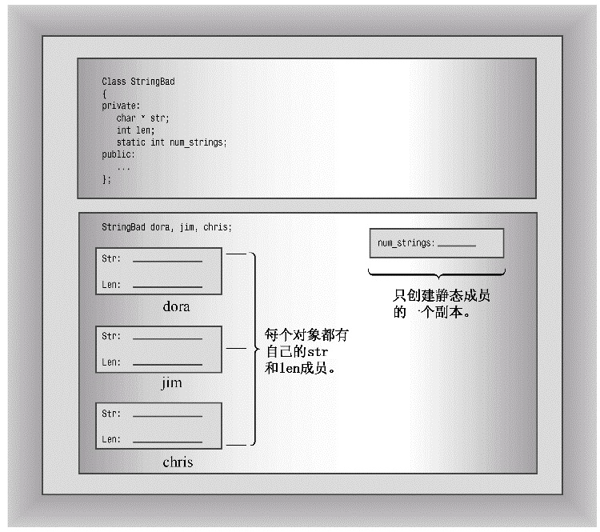

程序清单12.2 strngbad.cpp
```c++
// strngbad.cpp -- StringBad class methods
#include <cstring>                    // string.h for some
#include "strngbad.h"
using std::cout;

// initializing static class member
int StringBad::num_strings = 0;

// class methods

// construct StringBad from C string
StringBad::StringBad(const char * s)
{
    len = std::strlen(s);             // set size
    str = new char[len + 1];          // allot storage
    std::strcpy(str, s);              // initialize pointer
    num_strings++;                    // set object count
    cout << num_strings << ": \"" << str
         << "\" object created\n";    // For Your Information
}

StringBad::StringBad()                // default constructor
{
    len = 4;
    str = new char[4];
    std::strcpy(str, "C++");          // default string
    num_strings++;
    cout << num_strings << ": \"" << str
         << "\" default object created\n";  // FYI
}

StringBad::~StringBad()               // necessary destructor
{
    cout << "\"" << str << "\" object deleted, ";    // FYI
    --num_strings;                    // required
    cout << num_strings << " left\n"; // FYI
    delete [] str;                    // required
}

std::ostream & operator<<(std::ostream & os, const StringBad & st)
{
    os << st.str;
    return os; 
}
```

首先，请注意程序清单12.2中的下面一条语句：
```c++
int StringBad::num_strings = 0;
```

这条语句将静态成员num_strings的值初始化为零。请注意，不能在类声明中初始化静态成员变量，这是因为声明描述了如何分配内存，但并不分配内存。您可以使用这种格式来创建对象，从而分配和初始化内存。对于静态类成员，可以在类声明之外使用单独的语句来进行初始化，这是因为静态类成员是单独存储的，而不是对象的组成部分。请注意，初始化语句指出了类型，并使用了作用域运算符，但没有使用关键字static。

初始化是在方法文件中，而不是在类声明文件中进行的，这是因为类声明位于头文件中，程序可能将头文件包括在其他几个文件中。如果在头文件中进行初始化，将出现多个初始化语句副本，从而引发错误。

对于不能在类声明中初始化静态数据成员的一种例外情况（见第10章）是，静态数据成员为整型或枚举型const。

> **注意：**
> 
> 静态数据成员在类声明中声明，在包含类方法的文件中初始化。初始化时使用作用域运算符来指出静态成员所属的类。但如果静态成员是整型或枚举型const，则可以在类声明中初始化。

接下来，注意到每个构造函数都包含表达式num_strings++，这确保程序每创建一个新对象，共享变量num_strings的值都将增加1，从而记录String对象的总数。另外，析构函数包含表达式--num_strings，因此String类也将跟踪对象被删除的情况，从而使num_string成员的值是最新的。

现在来看程序清单12.2中的第一个构造函数，它使用一个常规C字符串来初始化String对象：
```c++
StringBad::StringBad(const char * s)
{
    len = std::strlen(s);             // set size
    str = new char[len + 1];          // allot storage
    std::strcpy(str, s);              // initialize pointer
    num_strings++;                    // set object count
    cout << num_strings << ": \"" << str
         << "\" object created\n";    // For Your Information
}
```

类成员str是一个指针，因此构造函数必须提供内存来存储字符串。初始化对象时，可以给构造函数传递一个字符串指针：
```c++
String boston("Boston");
```

构造函数必须分配足够的内存来存储字符串，然后将字符串复制到内存中。下面介绍其中的每一个步骤。

首先，使用strlen()函数计算字符串的长度，并对len成员进行初始化。接着，使用new分配足够的空间来保存字符串，然后将新内存的地址赋给str成员。（strlen()返回字符串长度，但不包括末尾的空字符，因此构造函数将len加1，使分配的内存能够存储包含空字符的字符串。）

接着，构造函数使用strcpy()将传递的字符串复制到新的内存中，并更新对象计数。最后，构造函数显示当前的对象数目和当前对象中存储的字符串，以助于掌握程序运行情况。稍后故意使Stringbad出错时，该特性将派上用场。

要理解这种方法，必须知道字符串并不保存在对象中。字符串单独保存在堆内存中，对象仅保存了指出到哪里去查找字符串的信息。

不能这样做：
```c++
str = s;    // not the way to go
```

这只保存了地址，而没有创建字符串副本。

默认构造函数与此相似，但它提供了一个默认字符串：“C++”。

析构函数中包含了示例中对处理类来说最重要的东西：
```c++
StringBad::~StringBad()               // necessary destructor
{
    cout << "\"" << str << "\" object deleted, ";    // FYI
    --num_strings;                    // required
    cout << num_strings << " left\n"; // FYI
    delete [] str;                    // required
}
```

该析构函数首先指出自己何时被调用。这部分包含了丰富的信息，但并不是必不可少的。然而，delete语句却是至关重要的。str成员指向new分配的内存。当StringBad对象过期时，str指针也将过期。但str指向的内存仍被分配，除非使用delete将其释放。删除对象可以释放对象本身占用的内存，但并不能自动释放属于对象成员的指针指向的内存。因此，必须使用析构函数。在析构函数中使用delete语句可确保对象过期时，由构造函数使用new分配的内存被释放。

> **警告：**
> 
> 在构造函数中使用new来分配内存时，必须在相应的析构函数中使用delete来释放内存。如果使用new[]（包括中括号）来分配内存，则应使用delete[]（包括中括号）来释放内存。

程序清单12.3是从处于开发阶段的Daily Vegetable程序中摘录出来的，演示了StringBad的构造函数和析构函数何时运行及如何运行。该程序将对象声明放在一个内部代码块中，因为析构函数将在定义对象的代码块执行完毕时调用。如果不这样做，析构函数将在main()函数执行完毕时调用，导致您无法在执行窗口关闭前看到析构函数显示的消息。请务必将程序清单12.2和程序清单12.3一起编译。

程序清单12.3 vegnews.cpp
```c++
// vegnews.cpp -- using new and delete with classes
// compile with strngbad.cpp
#include <iostream>
using std::cout;
#include "strngbad.h"

void callme1(StringBad &);  // pass by reference
void callme2(StringBad);    // pass by value

int main()
{
    using std::endl;
    {
        cout << "Starting an inner block.\n";
        StringBad headline1("Celery Stalks at Midnight");
        StringBad headline2("Lettuce Prey");
        StringBad sports("Spinach Leaves Bowl for Dollars");
        cout << "headline1: " << headline1 << endl;
        cout << "headline2: " << headline2 << endl;
        cout << "sports: " << sports << endl;
        callme1(headline1);
        cout << "headline1: " << headline1 << endl;
        callme2(headline2);
        cout << "headline2: " << headline2 << endl;
        cout << "Initialize one object to another:\n";
        StringBad sailor = sports;
        cout << "sailor: " << sailor << endl;
        cout << "Assign one object to another:\n";
        StringBad knot;
        knot = headline1;
        cout << "knot: " << knot << endl; 
        cout << "Exiting the block.\n";
    }
    cout << "End of main()\n";
    // std::cin.get();
    return 0;
}

void callme1(StringBad & rsb)
{
    cout << "String passed by reference:\n";
    cout << "    \"" << rsb << "\"\n";
}

void callme2(StringBad sb)
{
    cout << "String passed by value:\n";
    cout << "    \"" << sb << "\"\n";
}
```

> **注意：**
> 
> StringBad的第一个版本有许多故意留下的缺陷，这些缺陷使得输出是不确定的。例如，有些编译器无法编译它。虽然输出的具体内容有所差别，但基本问题和解决方法（稍后将介绍）是相同的。

下面是使用Borland C++5.5命令行编译器进行编译时，该程序的输出：
```c++
Starting an inner block.
1: "Celery Stalks at Midnight" object created
2: "Lettuce Prey" object created
3: "Spinach Leaves Bowl for Dollars" object created
headline1: Celery Stalks at Midnight
headline2: Lettuce Prey
sports: Spinach Leaves Bowl for Dollars
String passed by reference:
    "Celery Stalks at Midnight"
headline1: Celery Stalks at Midnight
String passed by value:
    "Lettuce Prey"
"Lettuce Prey" object deleted, 2 left
headline2:
Initialize one object to another:
sailor: Spinach Leaves Bowl for Dollars
Assign one object to another:
3: "C++" default object created
knot: Celery Stalks at Midnight
Exiting the block.
"Celery Stalks at Midnight" object deleted, 2 left
"Spinach Leaves Bowl for Dollars" object deleted, 1 left
"▒Rs▒U" object deleted, 0 left
free(): double free detected in tcache 2
Aborted (core dumped)
```

输出中出现的各种非标准字符随系统而异，这些字符表明，StringBad类名副其实（是一个糟糕的类）。另一种迹象是对象计数为负。在使用较新的编译器和操作系统的机器上运行时，该程序通常会在显示有关还有−1个对象的信息之前中断，而有些这样的机器将报告通用保护错误（GPF）。GPF表明程序试图访问禁止它访问的内存单元，这是另一种糟糕的信号。

程序说明

程序清单12.3中的程序开始时还是正常的，但逐渐变得异常，最终导致了灾难性结果。首先来看正常的部分。构造函数指出自己创建了3个StringBad对象，并为这些对象进行了编号，然后程序使用重载运算符>>列出了这些对象：
```c++
1: "Celery Stalks at Midnight" object created
2: "Lettuce Prey" object created
3: "Spinach Leaves Bowl for Dollars" object created
headline1: Celery Stalks at Midnight
headline2: Lettuce Prey
sports: Spinach Leaves Bowl for Dollars
```

然后，程序将headline1传递给callme1( )函数，并在调用后重新显示headline1。代码如下：
```c++
callm1(headline1);
cout << "headline1: " << headline1 << endl;
```

下面是运行结果：
```c++
String passed by reference:
    "Celery Stalks at Midnight"
headline1: Celery Stalks at Midnight
```

这部分代码看起来也正常。

但随后程序执行了如下代码：
```c++
callme2(headline2);
cout << "headline2: " << headline2 << endl;
```

这里，callme2()按值（而不是按引用）传递headline2，结果表明这是一个严重的问题！
```c++
cates a serious problem:
String passed by value:
    "Lettuce Prey"
"Lettuce Prey" object deleted, 2 left
headline2: ▒B
```

首先，将headline2作为函数参数来传递从而导致析构函数被调用。其次，虽然按值传递可以防止原始参数被修改，但实际上函数已使原始字符串无法识别，导致显示一些非标准字符（显示的文本取决于内存中包含的内容）。

请看输出结果，在为每一个创建的对象自动调用析构函数时，情况更糟糕：
```c++
Exiting the block.
"Celery Stalks at Midnight" object deleted, 2 left
"Spinach Leaves Bowl for Dollars" object deleted, 1 left
"Spinach Leaves Bowl for Doll8" object deleted, 0 left
"@g" object deleted, -1 left
"-l" object deleted, -2 left
End of main()
```

因为自动存储对象被删除的顺序与创建顺序相反，所以最先删除的3个对象是knots、sailor和sport。删除knots和sailor时是正常的，但在删除sport时，Dollars变成了Doll8。对于sport，程序只使用它来初始化sailor，但这种操作修改了sport。最后被删除的两个对象（headline2和headline1）已经无法识别。这些字符串在被删除之前，有些操作将它们搞乱了。另外，计数也很奇怪，如何会余下−2个对象呢？

实际上，计数异常是一条线索。因为每个对象被构造和析构一次，因此调用构造函数的次数应当与析构函数的调用次数相同。对象计数（num_strings）递减的次数比递增次数多2，这表明使用了不将num_string递增的构造函数创建了两个对象。类定义声明并定义了两个构造函数（这两个构造函数都使num_string递增），但结果表明程序使用了3个构造函数。例如，请看下面的代码：
```c++
StringBad sailor = sports;
```

这使用的是哪个构造函数呢？不是默认构造函数，也不是参数为const char *的构造函数。记住，这种形式的初始化等效于下面的语句：
```c++
StringBad sailor = StringBad(sports);   // constructor using sports
```

因为sports的类型为StringBad，因此相应的构造函数原型应该如下：
```c++
StringBad(const StringBad &);
```

当您使用一个对象来初始化另一个对象时，编译器将自动生成上述构造函数（称为复制构造函数，因为它创建对象的一个副本）。自动生成的构造函数不知道需要更新静态变量num_string，因此会将计数方案搞乱。实际上，这个例子说明的所有问题都是由编译器自动生成的成员函数引起的，下面介绍这个主题。

### 12.1.2 特殊成员函数
StringBad类的问题是由特殊成员函数引起的。这些成员函数是自动定义的，就StringBad而言，这些函数的行为与类设计不符。具体地说，C++自动提供了下面这些成员函数：

* 默认构造函数，如果没有定义构造函数；
* 默认析构函数，如果没有定义；
* 复制构造函数，如果没有定义；
* 赋值运算符，如果没有定义；
* 地址运算符，如果没有定义。

更准确地说，编译器将生成上述最后三个函数的定义——如果程序使用对象的方式要求这样做。例如，如果您将一个对象赋给另一个对象，编译器将提供赋值运算符的定义。

结果表明，StringBad类中的问题是由隐式复制构造函数和隐式赋值运算符引起的。

隐式地址运算符返回调用对象的地址（即this指针的值）。这与我们的初衷是一致的，在此不详细讨论该成员函数。默认析构函数不执行任何操作，因此这里也不讨论，但需要指出的是，这个类已经提供默认构造函数。至于其他成员函数还需要进一步讨论。

C++11提供了另外两个特殊成员函数：移动构造函数（move constructor）和移动赋值运算符（move assignment operator），这将在第18章讨论。

1. 默认构造函数

如果没有提供任何构造函数，C++将创建默认构造函数。例如，假如定义了一个Klunk类，但没有提供任何构造函数，则编译器将提供下述默认构造函数：
```c++
Klunk::Klunk() { }  // implicit default constructor
```

也就是说，编译器将提供一个不接受任何参数，也不执行任何操作的构造函数（默认的默认构造函数），这是因为创建对象时总是会调用构造函数：
```c++
Klunk lunk;   // invokes default constructor
```

默认构造函数使Lunk类似于一个常规的自动变量，也就是说，它的值在初始化时是未知的。

如果定义了构造函数，C++将不会定义默认构造函数。如果希望在创建对象时不显式地对它进行初始化，则必须显式地定义默认构造函数。这种构造函数没有任何参数，但可以使用它来设置特定的值：
```c++
Klunk::Klunk()    // explicit default constructor
{
    klunk_ct = 0;
    ...
}
```

带参数的构造函数也可以是默认构造函数，只要所有参数都有默认值。例如，Klunk类可以包含下述内联构造函数：
```c++
Klunk(int n = 0) { klunk_ct = n; }
```

但只能有一个默认构造函数。也就是说，不能这样做：
```c++
Klunk( ) { klunk_ct = 0; }            // constructor #1
Klunk(int n = 0) { klunk_ct = n; }    // ambiguous constructor #2
```

这为何有二义性呢？请看下面两个声明：
```c++
Klunk kar(10);    // clearly matches Klunk(int n)
Klunk bus;        // could match either constructor
```

第二个声明既与构造函数#1（没有参数）匹配，也与构造函数#2（使用默认参数0）匹配。这将导致编译器发出一条错误消息。

2. 复制构造函数

复制构造函数用于将一个对象复制到新创建的对象中。也就是说，它用于初始化过程中（包括按值传递参数），而不是常规的赋值过程中。类的复制构造函数原型通常如下：
```c++
Class_name(const Class_name &);
```

它接受一个指向类对象的常量引用作为参数。例如，String类的复制构造函数的原型如下：
```c++
StringBad(const StringBad &);
```

对于复制构造函数，需要知道两点：何时调用和有何功能。

3. 何时调用复制构造函数

新建一个对象并将其初始化为同类现有对象时，复制构造函数都将被调用。这在很多情况下都可能发生，最常见的情况是将新对象显式地初始化为现有的对象。例如，假设motto是一个StringBad对象，则下面4种声明都将调用复制构造函数：
```c++
StringBad ditto(motto);             // calls StringBad(const StringBad &)
StringBad metoo = motto;            // calls StringBad(const StringBad &)
StringBad also = StringBad(motto);  // calls StringBad(const StringBad &)
StringBad * pStringBad = new StringBad(motto);  // calls StringBad(const StringBad &)
```

其中中间的2种声明可能会使用复制构造函数直接创建metoo和also，也可能使用复制构造函数生成一个临时对象，然后将临时对象的内容赋给metoo和also，这取决于具体的实现。最后一种声明使用motto初始化一个匿名对象，并将新对象的地址赋给pstring指针。

每当程序生成了对象副本时，编译器都将使用复制构造函数。具体地说，当函数按值传递对象（如程序清单12.3中的callme2()）或函数返回对象时，都将使用复制构造函数。记住，按值传递意味着创建原始变量的一个副本。编译器生成临时对象时，也将使用复制构造函数。例如，将3个Vector对象相加时，编译器可能生成临时的Vector对象来保存中间结果。何时生成临时对象随编译器而异，但无论是哪种编译器，当按值传递和返回对象时，都将调用复制构造函数。具体地说，程序清单12.3中的函数调用将调用下面的复制构造函数：
```c++
callme2(headline2);
```

程序使用复制构造函数初始化sb——callme2()函数的StringBad型形参。

由于按值传递对象将调用复制构造函数，因此应该按引用传递对象。这样可以节省调用构造函数的时间以及存储新对象的空间。

4. 默认的复制构造函数的功能

默认的复制构造函数逐个复制非静态成员（成员复制也称为浅复制），复制的是成员的值。在程序清单12.3中，下述语句：
```c++
StringBad sailor = sports;
```

与下面的代码等效（只是由于私有成员是无法访问的，因此这些代码不能通过编译）：
```c++
StringBad sailor;
sailor.str = sports.str;
sailor.len = sports.len;
```

如果成员本身就是类对象，则将使用这个类的复制构造函数来复制成员对象。静态函数（如num_strings）不受影响，因为它们属于整个类，而不是各个对象。图12.2说明了隐式复制构造函数执行的操作。

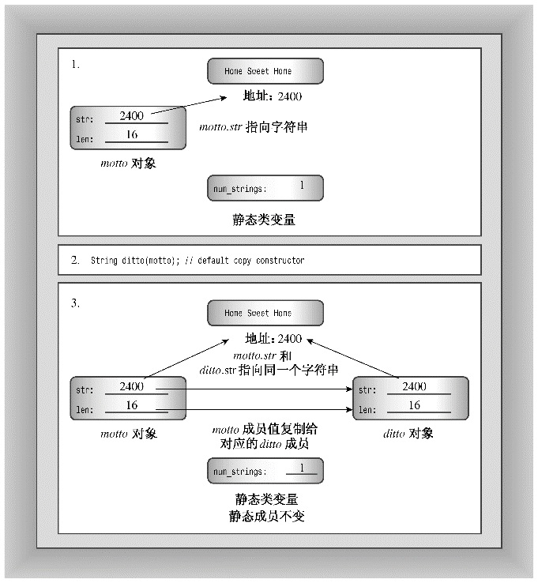

### 12.1.3 回到Stringbad：复制构造函数的哪里出了问题
现在介绍程序清单12.3的两个异常之处（假设输出为该程序清单后面列出的）。首先，程序的输出表明，析构函数的调用次数比构造函数的调用次数多2，原因可能是程序确实使用默认的复制构造函数另外创建了两个对象。当callme2()被调用时，复制构造函数被用来初始化callme2()的形参，还被用来将对象sailor初始化为对象sports。默认的复制构造函数不说明其行为，因此它不指出创建过程，也不增加计数器num_strings的值。但析构函数更新了计数，并且在任何对象过期时都将被调用，而不管对象是如何被创建的。这是一个问题，因为这意味着程序无法准确地记录对象计数。解决办法是提供一个对计数进行更新的显式复制构造函数：
```c++
StringBad::StringBad(const String & s)
{
    num_strings++;
    ...// important stuff to go here
}
```

> **提示：**
> 
> 如果类中包含这样的静态数据成员，即其值将在新对象被创建时发生变化，则应该提供一个显式复制构造函数来处理计数问题。

第二个异常之处更微妙，也更危险，其症状之一是字符串内容出现乱码：
```c++
headline2: Du*
```

原因在于隐式复制构造函数是按值进行复制的。例如，对于程序清单12.3，隐式复制构造函数的功能相当于：
```c++
sailor.str = sports.str;
```

这里复制的并不是字符串，而是一个指向字符串的指针。也就是说，将sailor初始化为sports后，得到的是两个指向同一个字符串的指针。当operator <<()函数使用指针来显示字符串时，这并不会出现问题。但当析构函数被调用时，这将引发问题。析构函数StringBad释放str指针指向的内存，因此释放sailor的效果如下：
```c++
delete [] sailor.str;   // delete the string that ditto.str points to
```

sailor.str指针指向“Spinach Leaves Bowl for Dollars”，因为它被赋值为sports.str，而sports.str指向的正是上述字符串。所以delete语句将释放字符串“Spinach Leaves Bowl for Dollars”占用的内存。

然后，释放sports的效果如下：
```c++
delete [] sports.str;   // effect is undefined
```

sports.str指向的内存已经被sailor的析构函数释放，这将导致不确定的、可能有害的后果。程序清单12.3中的程序生成受损的字符串，这通常是内存管理不善的表现。

另一个症状是，试图释放内存两次可能导致程序异常终止。例如，Microsoft Visual C++ 2010（调试模式）显示一个错误消息窗口，指出“Debug Assertion Failed!”；而在Linux中，g++ 4.4.1显示消息“double free or corruption”并终止程序运行。其他系统可能提供不同的消息，甚至不提供任何消息，但程序中的错误是相同的。

1. 定义一个显式复制构造函数以解决问题

解决类设计中这种问题的方法是进行深度复制（deep copy）。也就是说，复制构造函数应当复制字符串并将副本的地址赋给str成员，而不仅仅是复制字符串地址。这样每个对象都有自己的字符串，而不是引用另一个对象的字符串。调用析构函数时都将释放不同的字符串，而不会试图去释放已经被释放的字符串。可以这样编写String的复制构造函数：
```c++
StringBad::StringBad(const StringBad & st)
{
    num_strings++;              // handle static member update
    len = st.len;               // same length
    str = new char[len + 1];    // allot space
    std::strcpy(str, st.str);   // copy string to new location
    cout << num_strings << ": \"" << str
         << "\" object created\n";  // For Your Information
}
```

必须定义复制构造函数的原因在于，一些类成员是使用new初始化的、指向数据的指针，而不是数据本身。图12.3说明了深度复制。

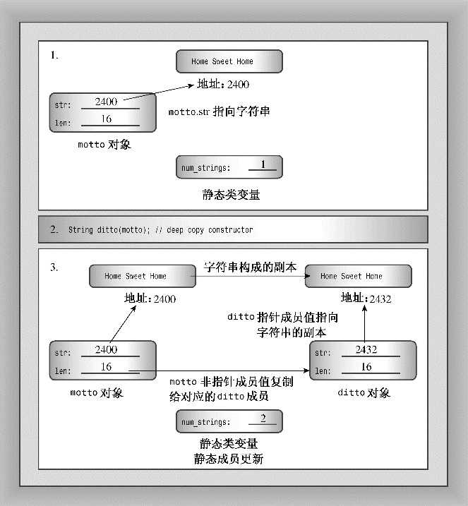

> **图12.3 深度复制**
> 
> 如果类中包含了使用new初始化的指针成员，应当定义一个复制构造函数，以复制指向的数据，而不是指针，这被称为深度复制。复制的另一种形式（成员复制或浅复制）只是复制指针值。浅复制仅浅浅地复制指针信息，而不会深入“挖掘”以复制指针引用的结构。

### 12.1.4 Stringbad的其他问题：赋值运算符
并不是程序清单12.3的所有问题都可以归咎于默认的复制构造函数，还需要看一看默认的赋值运算符。ANSI C允许结构赋值，而C++允许类对象赋值，这是通过自动为类重载赋值运算符实现的。这种运算符的原型如下：
```c++
Class_name & Class_name::operator=(const Class_name &);
```

它接受并返回一个指向类对象的引用。例如，StringBad类的赋值运算符的原型如下：
```c++
StringBad & StringBad::operator=(const StringBad &);
```

1. 赋值运算符的功能以及何时使用它

将已有的对象赋给另一个对象时，将使用重载的赋值运算符：
```c++
StringBad headline1("Celery Stalks at Midnight");
...
StringBad knot;
knot = headline1;   // assignment operator invoked
```

初始化对象时，并不一定会使用赋值运算符：
```c++
StringBad metoo = kont;   // use copy constructor, possibly assignment, too
```

这里，metoo是一个新创建的对象，被初始化为knot的值，因此使用复制构造函数。然而，正如前面指出的，实现时也可能分两步来处理这条语句：使用复制构造函数创建一个临时对象，然后通过赋值将临时对象的值复制到新对象中。这就是说，初始化总是会调用复制构造函数，而使用=运算符时也可能调用赋值运算符。

与复制构造函数相似，赋值运算符的隐式实现也对成员进行逐个复制。如果成员本身就是类对象，则程序将使用为这个类定义的赋值运算符来复制该成员，但静态数据成员不受影响。

2. 赋值的问题出在哪里

程序清单12.3将headline1赋给knot：
```c++
knot = headline1;
```

为knot调用析构函数时，将显示下面的消息：
```c++
"Celery Stalks at Midnight" object deleted, 2 left
```

为Headline1调用析构函数时，显示如下消息（有些实现方式在此之前就异常终止了）：
```c++
"-l" object deleted, -2 left
```

出现的问题与隐式复制构造函数相同：数据受损。这也是成员复制的问题，即导致headline1.str和knot.str指向相同的地址。因此，当对knot调用析构函数时，将删除字符串“Celery Stalks at Midnight”；当对headline1调用析构函数时，将试图删除前面已经删除的字符串。正如前面指出的，试图删除已经删除的数据导致的结果是不确定的，因此可能改变内存中的内容，导致程序异常终止。要指出的是，如果操作结果是不确定的，则执行的操作将随编译器而异，包括显示独立声明（Declaration of Independence）或释放隐藏文件占用的硬盘空间。当然，编译器开发人员通常不会花时间添加这样的行为。

3. 解决赋值的问题

对于由于默认赋值运算符不合适而导致的问题，解决办法是提供赋值运算符（进行深度复制）定义。其实现与复制构造函数相似，但也有一些差别。

* 由于目标对象可能引用了以前分配的数据，所以函数应使用delete[ ]来释放这些数据。
* 函数应当避免将对象赋给自身；否则，给对象重新赋值前，释放内存操作可能删除对象的内容。
* 函数返回一个指向调用对象的引用。

通过返回一个对象，函数可以像常规赋值操作那样，连续进行赋值，即如果S0、S1和S2都是StringBad对象，则可以编写这样的代码：
```c++
S0 = S1 = S2;
```

使用函数表示法时，上述代码为：
```c++
S0.operator=(S1.operator=(S2));
```

因此，S1.operator=（S2）的返回值是函数S0.operator=()的参数。

因为返回值是一个指向StringBad对象的引用，因此参数类型是正确的。

下面的代码说明了如何为StringBad类编写赋值运算符：
```c++
StringBad & StringBad::operator=(const StringBad & st)
{
    if (this == &st)        // object assigned to itself
        return *this;       // all done
    delete [] str;          // free old string
    len = st.len;
    str = new char [len + 1];   // get space for new string
    std::strcpy(str, st.str);   // copy the string
    return *this;               // return reference to invoking object
}
```

代码首先检查自我复制，这是通过查看赋值运算符右边的地址（&s）是否与接收对象（this）的地址相同来完成的。如果相同，程序将返回*this，然后结束。第10章介绍过，赋值运算符是只能由类成员函数重载的运算符之一。

如果地址不同，函数将释放str指向的内存，这是因为稍后将把一个新字符串的地址赋给str。如果不首先使用delete运算符，则上述字符串将保留在内存中。由于程序中不再包含指向该字符串的指针，因此这些内存被浪费掉。

接下来的操作与复制构造函数相似，即为新字符串分配足够的内存空间，然后将赋值运算符右边的对象中的字符串复制到新的内存单元中。

上述操作完成后，程序返回*this并结束。

赋值操作并不创建新的对象，因此不需要调整静态数据成员num_strings的值。

将前面介绍的复制构造函数和赋值运算符添加到StringBad类中后，所有的问题都解决了。例如，下面是在完成上述修改后，程序输出的最后几行：
```c++
End of main()
"Celery Stalks at Midnight" object deleted, 4 left
"Spinach Leaves Bowl for Dollars" object deleted, 3 left
"Spinach Leaves Bowl for Dollars" object deleted, 2 left
"Lettuce Prey" object deleted, 1 left
"Celery Stalks at Midnight" object deleted, 0 left
```

现在，对象计数是正确的，字符串也没有被损坏。

## 12.2 改进后的新String类
有了更丰富的知识后，可以对StringBad类进行修订，将它重命名为String了。首先，添加前面介绍过的复制构造函数和赋值运算符，使类能够正确管理类对象使用的内存。其次，由于您已经知道对象何时被创建和释放，因此可以让类构造函数和析构函数保持沉默，不再在每次被调用时都显示消息。另外，也不用再监视构造函数的工作情况，因此可以简化默认构造函数，使之创建一个空字符串，而不是“C++”。

接下来，可以在类中添加一些新功能。String类应该包含标准字符串函数库cstring的所有功能，才会比较有用，但这里只添加足以说明其工作原理的功能（注意，String类只是一个用作说明的示例，而C++标准string类的内容丰富得多）。具体地说，将添加以下方法：
```c++
int length () const { return len; }
friend bool operator<(const String &st, const String &st2);
friend bool operator>(const String &st, const String &st2);
friend bool operator==(const String &st, const String &st2);
friend operator>>(istream & is, String & st);
char & operator[](int i);
const char & operator[](int i) const;
static int HowMany();
```

第一个新方法返回被存储的字符串的长度。接下来的3个友元函数能够对字符串进行比较。Operator>>()函数提供了简单的输入功能；两个operator函数提供了以数组表示法访问字符串中各个字符的功能。静态类方法Howmany()将补充静态类数据成员num_string。下面来看一看具体情况。

### 12.2.1 修订后的默认构造函数
请注意新的默认构造函数，它与下面类似：
```c++
String::String()
{
    len = 0;
    str = new char[1];
    str[0] = '\0';      // default string
}
```

您可能会问，为什么代码为：
```c++
str = new char[1];
```

而不是：
```c++
str = new char;
```

上面两种方式分配的内存量相同，区别在于前者与类析构函数兼容，而后者不兼容。析构函数中包含如下代码：
```c++
delete [] str;
```

delete[]与使用new[]初始化的指针和空指针都兼容。因此对于下述代码：
```c++
str = new char[1];
str[0] = '\0';      // default string
```

可修改为：
```c++
str = 0;    // sets str to the null pointer
```

对于以其他方式初始化的指针，使用delete [ ]时，结果将是不确定的：
```c++
char words[15] = "bad idea";
char * p1 = words;
char * p2 = new char;
char * p3;
delete [] p1;   // undefined, so don't do it
delete [] p2;   // undefined, so don't do it
delete [] p3;   // undefined, so don't do it
```

> **C++11空指针**
> 
> 在C++98中，字面值0有两个含义：可以表示数字值零，也可以表示空指针，这使得阅读程序的人和编译器难以区分。有些程序员使用（void *） 0来标识空指针（空指针本身的内部表示可能不是零），还有些程序员使用NULL，这是一个表示空指针的C语言宏。C++11提供了更好的解决方案：引入新关键字nullptr，用于表示空指针。您仍可像以前一样使用0——否则大量现有的代码将非法，但建议您使用nullptr：
> ```c++
> str = nullptr;  // C++11 null pointer notation
> ```

### 12.2.2 比较成员函数
在String类中，执行比较操作的方法有3个。如果按字母顺序（更准确地说，按照机器排序序列），第一个字符串在第二个字符串之前，则Operator<( )函数返回true。要实现字符串比较函数，最简单的方法是使用标准的trcmp()函数，如果依照字母顺序，第一个参数位于第二个参数之前，则该函数返回一个负值；如果两个字符串相同，则返回0；如果第一个参数位于第二个参数之后，则返回一个正值。因此，可以这样使用strcmp()：
```c++
bool operator<(const String &st1, const String &st2)
{
    if (std::strcmp(str1.str, str2.str) < 0 )
        return true;
    else
        return false;
}
```

因为内置的>运算符返回的是一个布尔值，所以可以将代码进一步简化为：
```c++
bool operator<(const String &st1, const String &st2)
{
    return (std::strcmp(str1.str, str2.str) < 0);
}
```

同样，可以按照下面的方式来编写另外两个比较函数：
```c++
bool operator>(const String &st1, const String &st2)
{
    return st2 < st1;
}
bool operator==(const String &st1, const String &st2)
{
    return (std::strcmp(st1.str, str2.str) == 0);
}
```

第一个定义利用了<运算符来表示>运算符，对于内联函数，这是一种很好的选择。

将比较函数作为友元，有助于将String对象与常规的C字符串进行比较。例如，假设answer是String对象，则下面的代码：
```c++
if ("love" == answer)
```

将被转换为：
```c++
if (operator==("love", answer))
```

然后，编译器将使用某个构造函数将代码转换为：
```c++
if (operator==(String("love"), answer))
```

这与原型是相匹配的。

### 12.2.3 使用中括号表示法访问字符
对于标准C-风格字符串来说，可以使用中括号来访问其中的字符：
```c++
char city[40] = "Amsterdam";
cout << city[0] << endl;  // display the letter A
```

在C++中，两个中括号组成一个运算符——中括号运算符，可以使用方法operator 来重载该运算符。通常，二元C++运算符（带两个操作数）位于两个操作数之间，例如2 +5。但对于中括号运算符，一个操作数位于第一个中括号的前面，另一个操作数位于两个中括号之间。因此，在表达式city[0]中，city是第一个操作数，[]是运算符，0是第二个操作数。

假设opera是一个String对象：
```c++
String opera("The Magic Flute");
```

则对于表达式opera[4]，C++将查找名称和特征标与此相同的方法：
```c++
String::operator[](int i)
```

如果找到匹配的原型，编译器将使用下面的函数调用来替代表达式opera[4]：
```c++
opera.operator[](4)
```

opera对象调用该方法，数组下标4成为该函数的参数。

下面是该方法的简单实现：
```c++
char & String::operator[](int i)
{
    return str[i];
}
```

有了上述定义后，语句：
```c++
cout << opera[4];
```

将被转换为：
```c++
cout << opera.operator[4];
```

返回值是opera.str[4]（字符M）。由此，公有方法可以访问私有数据。

将返回类型声明为char &，便可以给特定元素赋值。例如，可以编写这样的代码：
```c++
String means("might");
means[0] = 'r';
```

第二条语句将被转换为一个重载运算符函数调用：
```c++
means.operator[][0] = 'r';
```

这里将r赋给方法的返回值，而函数返回的是指向means.str[0]的引用，因此上述代码等同于下面的代码：
```c++
means.str[0] = 'r';
```

代码的最后一行访问的是私有数据，但由于operator 是类的一个方法，因此能够修改数组的内容。最终的结果是“might”被改为“right”。

假设有下面的常量对象：
```c++
const String answer("futile");
```

如果只有上述operator 定义，则下面的代码将出错：
```c++
cout << answer[1];    // compile-time error
```

原因是answer是常量，而上述方法无法确保不修改数据（实际上，有时该方法的工作就是修改数据，因此无法确保不修改数据）。

但在重载时，C++将区分常量和非常量函数的特征标，因此可以提供另一个仅供const String对象使用的operator版本：
```c++
// for use with const String objects
const char & String::operator[](int i) const
{
    return str[i];
}
```

有了上述定义后，就可以读/写常规String对象了；而对于const String对象，则只能读取其数据：
```c++
String text("Once upon a time");
const String answer("futile");
cout << text[1];      // ok, uses non-const version of operator[]()
cout << answer[1];    // ok, uses const version of operator[]()
cin >> text[1];       // ok, uses non-const version of operator[]()
cin >> answer[1];     // compile-time error
```

### 12.2.4 静态类成员函数
可以将成员函数声明为静态的（函数声明必须包含关键字static，但如果函数定义是独立的，则其中不能包含关键字static），这样做有两个重要的后果。

首先，不能通过对象调用静态成员函数；实际上，静态成员函数甚至不能使用this指针。如果静态成员函数是在公有部分声明的，则可以使用类名和作用域解析运算符来调用它。例如，可以给String类添加一个名为HowMany( )的静态成员函数，方法是在类声明中添加如下原型/定义：
```c++
static int HowMany() { return num_strings; }
```

调用它的方式如下：
```c++
int count = String::HowMany();    // invoking a static member function
```

其次，由于静态成员函数不与特定的对象相关联，因此只能使用静态数据成员。例如，静态方法HowMany()可以访问静态成员num_string，但不能访问str和len。

同样，也可以使用静态成员函数设置类级（classwide）标记，以控制某些类接口的行为。例如，类级标记可以控制显示类内容的方法所使用的格式。

### 12.2.5 进一步重载赋值运算符
介绍针对String类的程序清单之前，先来考虑另一个问题。假设要将常规字符串复制到String对象中。例如，假设使用getline()读取了一个字符串，并要将这个字符串放置到String对象中，前面定义的类方法让您能够这样编写代码：
```c++
String name;
char temp[40];
cin.getline(temp, 40);
name = temp;    // use constructor to convert type
```

但如果经常需要这样做，这将不是一种理想的解决方案。为解释其原因，先来回顾一下最后一条语句是怎样工作的。

1. 程序使用构造函数String（const char *）来创建一个临时String对象，其中包含temp中的字符串副本。第11章介绍过，只有一个参数的构造函数被用作转换函数。

2. 本章后面的程序清单12.6中的程序使用String & String::operator=（const String &）函数将临时对象中的信息复制到name对象中。

3. 程序调用析构函数~String()删除临时对象。

为提高处理效率，最简单的方法是重载赋值运算符，使之能够直接使用常规字符串，这样就不用创建和删除临时对象了。下面是一种可能的实现：
```c++
String & String::operator=(const char *  s)
{
    delete [] str;
    len = std::strlen(s);
    str = new char[len + 1];
    std::strcpy(str, s);
    return *this;
}
```

一般说来，必须释放str指向的内存，并为新字符串分配足够的内存。

程序清单12.4列出了修订后的类声明。除了前面提到过的修改之外，这里还定义了一个CINLIM常量，用于实现operator>>()。

程序清单12.4 string1.h
```c++
// string1.h -- fixed and augmented string class definition

#ifndef STRING1_H_
#define STRING1_H_
#include <iostream>
using std::ostream;
using std::istream;

class String
{
private:
    char * str;             // pointer to string
    int len;                // length of string
    static int num_strings; // number of objects
    static const int CINLIM = 80;  // cin input limit
public:
// constructors and other methods
    String(const char * s); // constructor
    String();               // default constructor
    String(const String &); // copy constructor
    ~String();              // destructor
    int length () const { return len; }
// overloaded operator methods    
    String & operator=(const String &);
    String & operator=(const char *);
    char & operator[](int i);
    const char & operator[](int i) const;
// overloaded operator friends
    friend bool operator<(const String &st, const String &st2);
    friend bool operator>(const String &st1, const String &st2);
    friend bool operator==(const String &st, const String &st2);
    friend ostream & operator<<(ostream & os, const String & st);
    friend istream & operator>>(istream & is, String & st);
// static function
    static int HowMany();
};
#endif
```

程序清单12.5给出了修订后的方法定义。

程序清单12.5 string1.cpp
```c++
// string1.cpp -- String class methods
#include <cstring>                 // string.h for some
#include "string1.h"               // includes <iostream>
using std::cin;
using std::cout;

// initializing static class member

int String::num_strings = 0;

// static method
int String::HowMany()
{
    return num_strings;
}

// class methods
String::String(const char * s)     // construct String from C string
{
    len = std::strlen(s);          // set size
    str = new char[len + 1];       // allot storage
    std::strcpy(str, s);           // initialize pointer
    num_strings++;                 // set object count
}

String::String()                   // default constructor
{
    len = 4;
    str = new char[1];
    str[0] = '\0';                 // default string
    num_strings++;
}

String::String(const String & st)
{
    num_strings++;             // handle static member update
    len = st.len;              // same length
    str = new char [len + 1];  // allot space
    std::strcpy(str, st.str);  // copy string to new location
}

String::~String()                     // necessary destructor
{
    --num_strings;                    // required
    delete [] str;                    // required
}

// overloaded operator methods    

    // assign a String to a String
String & String::operator=(const String & st)
{
    if (this == &st)
        return *this;
    delete [] str;
    len = st.len;
    str = new char[len + 1];
    std::strcpy(str, st.str);
    return *this;
}

    // assign a C string to a String
String & String::operator=(const char * s)
{
    delete [] str;
    len = std::strlen(s);
    str = new char[len + 1];
    std::strcpy(str, s);
    return *this;
}

    // read-write char access for non-const String
char & String::operator[](int i)
{
    return str[i];
}

    // read-only char access for const String
const char & String::operator[](int i) const
{
    return str[i];
}

// overloaded operator friends

bool operator<(const String &st1, const String &st2)
{
    return (std::strcmp(st1.str, st2.str) < 0);
}

bool operator>(const String &st1, const String &st2)
{
    return st2 < st1;
}

bool operator==(const String &st1, const String &st2)
{
    return (std::strcmp(st1.str, st2.str) == 0);
}

    // simple String output
ostream & operator<<(ostream & os, const String & st)
{
    os << st.str;
    return os; 
}

    // quick and dirty String input
istream & operator>>(istream & is, String & st)
{
    char temp[String::CINLIM];
    is.get(temp, String::CINLIM);
    if (is)
        st = temp;
    while (is && is.get() != '\n')
        continue;
    return is; 
}
```

重载>>运算符提供了一种将键盘输入行读入到String对象中的简单方法。它假定输入的字符数不多于String::CINLIM的字符数，并丢弃多余的字符。在if条件下，如果由于某种原因（如到达文件尾或get（char *, int）读取的是一个空行）导致输入失败，istream对象的值将置为false。

程序清单12.6通过一个小程序来使用这个类，该程序允许输入几个字符串。程序首先提示用户输入，然后将用户输入的字符串存储到String对象中，并显示它们，最后指出哪个字符串最短、哪个字符串按字母顺序排在最前面。

程序清单12.6 sayings1.cpp
```c++
// sayings1.cpp -- using expanded String class
// compile with string1.cpp
#include <iostream>
#include "string1.h" 
const int ArSize = 10;
const int MaxLen =81;
int main()
{
    using std::cout;
    using std::cin;
    using std::endl;
    String name;
    cout <<"Hi, what's your name?\n>> ";
    cin >> name;

    cout << name << ", please enter up to " << ArSize
         << " short sayings <empty line to quit>:\n";
    String sayings[ArSize];     // array of objects
    char temp[MaxLen];          // temporary string storage
    int i;
    for (i = 0; i < ArSize; i++)
    {
        cout << i+1 << ": ";
        cin.get(temp, MaxLen);
        while (cin && cin.get() != '\n')
            continue;
        if (!cin || temp[0] == '\0')    // empty line?
            break;              // i not incremented
        else
            sayings[i] = temp;  // overloaded assignment
    }
    int total = i;              // total # of lines read

    if ( total > 0)
    {
        cout << "Here are your sayings:\n";
        for (i = 0; i < total; i++)
            cout << sayings[i][0] << ": " << sayings[i] << endl;

        int shortest = 0;
        int first = 0;
        for (i = 1; i < total; i++)
        {
            if (sayings[i].length() < sayings[shortest].length())
                shortest = i;
            if (sayings[i] < sayings[first])
                first = i;
        }
        cout << "Shortest saying:\n" << sayings[shortest] << endl;;
        cout << "First alphabetically:\n" << sayings[first] << endl;
        cout << "This program used "<< String::HowMany() 
             << " String objects. Bye.\n";
    }
    else
        cout << "No input! Bye.\n";
// keep window open 
/*    if (!cin)
        cin.clear();
    while (cin.get() != '\n')
        continue; */ 
   return 0; 
}
```

> **注意：**
> 
> 较早的get（char *, int）版本在读取空行后，返回的值不为false。然而，对于这些版本来说，如果读取了一个空行，则字符串中第一个字符将是一个空字符。这个示例使用了下述代码：
> ```c++
> if (!cin || temp[0] == '\0')    // empty line?
>     break;                      // i not incremented
> ```
> 
> 如果实现遵循了最新的C++标准，则if语句中的第一个条件将检测到空行，第二个条件用于旧版本实现中检测空行。

程序清单12.6中程序要求用户输入至多10条谚语。每条谚语都被读到一个临时字符数组，然后被复制到String对象中。如果用户输入空行，break语句将终止输入循环。显示用户的输入后，程序使用成员函数length()和operator <()来确定最短的字符串以及按字母顺序排列在最前面的字符串。程序还使用下标运算符（[]）提取每条谚语的第一个字符，并将其放在该谚语的最前面。下面是运行情况：
```c++
Hi, what's your name?
>> Misty Gutz
Misty Gutz, please enter up to 10 short sayings <empty line to quit>:
1: a fool and his money are soon parted
2: penny wise, pound foolish
3: the love of money is the root of much evil
4: out of sight, out of mind
5: absence makes the heart grow fonder
6: absinthe makes the hart grow fonder
7:
Here are your sayings:
a: a fool and his money are soon parted
p: penny wise, pound foolish
t: the love of money is the root of much evil
o: out of sight, out of mind
a: absence makes the heart grow fonder
a: absinthe makes the hart grow fonder
Shortest saying:
penny wise, pound foolish
First alphabetically:
a fool and his money are soon parted
This program used 11 String objects. Bye.
```

## 12.3 在构造函数中使用new时应注意的事项
至此，您知道使用new初始化对象的指针成员时必须特别小心。具体地说，应当这样做。

* 如果在构造函数中使用new来初始化指针成员，则应在析构函数中使用delete。
* new和delete必须相互兼容。new对应于delete，new[ ]对应于delete[ ]。
* 如果有多个构造函数，则必须以相同的方式使用new，要么都带中括号，要么都不带。因为只有一个析构函数，所有的构造函数都必须与它兼容。然而，可以在一个构造函数中使用new初始化指针，而在另一个构造函数中将指针初始化为空（0或C++11中的nullptr），这是因为delete（无论是带中括号还是不带中括号）可以用于空指针。
> NULL、0还是nullptr：以前，空指针可以用0或NULL（在很多头文件中，NULL是一个被定义为0的符号常量）来表示。C程序员通常使用NULL而不是0，以指出这是一个指针，就像使用‘\0’而不是0来表示空字符，以指出这是一个字符一样。然而，C++传统上更喜欢用简单的0，而不是等价的NULL。但正如前面指出的，C++11提供了关键字nullptr，这是一种更好的选择。
* 应定义一个复制构造函数，通过深度复制将一个对象初始化为另一个对象。通常，这种构造函数与下面类似。
> ```c++
> String::String(const String & st)
> {
>     num_strings++;            // handle static member update if necessary
>     len = st.len;             // same length as copied string
>     str = new char [len + 1]; // allot space
>     std::strcpy(str, st.str); // copy string to new location
> }
> ```
> 
> 具体地说，复制构造函数应分配足够的空间来存储复制的数据，并复制数据，而不仅仅是数据的地址。另外，还应该更新所有受影响的静态类成员。
* 应当定义一个赋值运算符，通过深度复制将一个对象复制给另一个对象。通常，该类方法与下面类似：
> ```c++
> String & String::operator=(const String & st)
> {
>     if (this == &st)        // object assigned to itself
>         return *this;       // all done
>     delete [] str;          // free old string
>     len = st.len;
>     str = new char[len + 1];  // get space for new string
>     std::strcpy(str, st.str); // copy the string
>     return *this;             // return reference to invoking object
> }
> ```
> 
> 具体地说，该方法应完成这些操作：检查自我赋值的情况，释放成员指针以前指向的内存，复制数据而不仅仅是数据的地址，并返回一个指向调用对象的引用。

### 12.3.1 应该和不应该
下面的摘要包含了两个不正确的示例（指出什么是不应当做的）以及一个良好的构造函数示例：
```c++
String::String()
{
    str = "default string";   // oops, no new []
    len = std::strlen(str);
}

String::String(const char * s)
{
    len = std::strlen(s);
    str = new char;           // oops, no []
    std::strcpy(str, s);      // oops, no room
}

String::String(const String & st)
{
    len = st.len;
    str = new char[len + 1];  // good, allocate space
    std::strcpy(str, st.str); // good, copy value
}
```

第一个构造函数没有使用new来初始化str。对默认对象调用析构函数时，析构函数使用delete来释放str。对不是使用new初始化的指针使用delete时，结果将是不确定的，并可能是有害的。可将该构造函数修改为下面的任何一种形式：
```c++
String::String()
{
    len = 0;
    str = new char[1];    // uses new with []
    str[0] = '\0';
}

String::String()
{
    len = 0;
    str = 0;  // or, with C++11, str = nullptr;
}

String::String()
{
    static const char * s = "C++";    // initialized just once
    len = std::strlen(s);
    str = new char[len + 1];          // uses new with []
    std::strcpy(str, s);
}
```

摘录中的第二个构造函数使用了new，但分配的内存量不正确。因此，new返回的内存块只能保存一个字符。试图将过长的字符串复制到该内存单元中，将导致内存问题。另外，这里使用的new不带中括号，这与另一个构造函数的正确格式不一致。

第三个构造函数是正确的。

最后，下面的析构函数无法与前面的构造函数正常地协同工作：
```c++
String::~String()
{
    delete str;   // oops, should be delete [] str;
}
```

该析构函数未能正确地使用delete。由于构造函数创建的是一个字符数组，因此析构函数应该删除一个数组。

### 12.3.2 包含类成员的类的逐成员复制
假设类成员的类型为String类或标准string类：
```c++
class Magazine
{
private:
    String title;
    string publisher;
    ...
};
```

String和string都使用动态内存分配，这是否意味着需要为Magazine类编写复制构造函数和赋值运算符？不，至少对这个类本身来说不需要。默认的逐成员复制和赋值行为有一定的智能。如果您将一个Magazine对象复制或赋值给另一个Magazine对象，逐成员复制将使用成员类型定义的复制构造函数和赋值运算符。也就是说，复制成员title时，将使用String的复制构造函数，而将成员title赋给另一个Magazine对象时，将使用String的赋值运算符，依此类推。然而，如果Magazine类因其他成员需要定义复制构造函数和赋值运算符，情况将更复杂；在这种情况下，这些函数必须显式地调用String和string的复制构造函数和赋值运算符，这将在第13章介绍。

## 12.4 有关返回对象的说明
当成员函数或独立的函数返回对象时，有几种返回方式可供选择。可以返回指向对象的引用、指向对象的const引用或const对象。到目前为止，介绍了前两种方式，但没有介绍最后一种方式，现在是复习这些方式的好时机。

### 12.4.1 返回指向const对象的引用
使用const引用的常见原因是旨在提高效率，但对于何时可以采用这种方式存在一些限制。如果函数返回（通过调用对象的方法或将对象作为参数）传递给它的对象，可以通过返回引用来提高其效率。例如，假设要编写函数Max()，它返回两个Vector对象中较大的一个，其中Vector是第11章开发的一个类。该函数将以下面的方式被使用：
```c++
Vector force1(50, 60);
Vector force2(10, 70);
Vector max;
max = Max(force1, force2);
```

下面两种实现都是可行的：
```c++
// version 1
Vector Max(const Vector & v1, const Vector & v2)
{
    if (v1.magval() > v2.magval())
        return v1;
    else
        return v2;
}

// version 2
const Vector & Max(const Vector & v1, const Vector & v2)
{
    if (v1.magval() > v2.magval())
        return v1;
    else
        return v2;
}
```

这里有三点需要说明。首先，返回对象将调用复制构造函数，而返回引用不会。因此，第二个版本所做的工作更少，效率更高。其次，引用指向的对象应该在调用函数执行时存在。在这个例子中，引用指向force1或force2，它们都是在调用函数中定义的，因此满足这种条件。第三，v1和v2都被声明为const引用，因此返回类型必须为const，这样才匹配。

### 12.4.2 返回指向非const对象的引用
两种常见的返回非const对象情形是，重载赋值运算符以及重载与cout一起使用的<<运算符。前者这样做旨在提高效率，而后者必须这样做。

operator=()的返回值用于连续赋值：
```c++
String s1("Good stuff");
String s2, s3;
s3 = s2 = s1;
```

在上述代码中，s2.operator=()的返回值被赋给s3。为此，返回String对象或String对象的引用都是可行的，但与Vector示例中一样，通过使用引用，可避免该函数调用String的复制构造函数来创建一个新的String对象。在这个例子中，返回类型不是const，因为方法operator=()返回一个指向s2的引用，可以对其进行修改。

Operator<<()的返回值用于串接输出：
```c++
String s1("Good stuff");
cout << s1 << "is coming!";
```

在上述代码中，operator<<（cout, s1）的返回值成为一个用于显示字符串“is coming!”的对象。返回类型必须是ostream &，而不能仅仅是ostream。如果使用返回类型ostream，将要求调用ostream类的复制构造函数，而ostream没有公有的复制构造函数。幸运的是，返回一个指向cout的引用不会带来任何问题，因为cout已经在调用函数的作用域内。

### 12.4.3 返回对象
如果被返回的对象是被调用函数中的局部变量，则不应按引用方式返回它，因为在被调用函数执行完毕时，局部对象将调用其析构函数。因此，当控制权回到调用函数时，引用指向的对象将不再存在。在这种情况下，应返回对象而不是引用。通常，被重载的算术运算符属于这一类。请看下述示例，它再次使用了Vector类：
```c++
Vector force1(50, 60);
Vector force2(10, 70);
Vector net;
net = force1 + force2;
```

返回的不是force1，也不是force2，force1和force2在这个过程中应该保持不变。因此，返回值不能是指向在调用函数中已经存在的对象的引用。相反，在Vector::operator+( )中计算得到的两个矢量的和被存储在一个新的临时对象中，该函数也不应返回指向该临时对象的引用，而应该返回实际的Vector对象，而不是引用：
```c++
Vector Vector::operator+(const Vector & b) const
{
    return Vector(x + b.x, y + b.y);
}
```

在这种情况下，存在调用复制构造函数来创建被返回的对象的开销，然而这是无法避免的。

在上述示例中，构造函数调用Vector（x + b.x，y + b.y）创建一个方法operator+()能够访问的对象；而返回语句引发的对复制构造函数的隐式调用创建一个调用程序能够访问的对象。

### 12.4.4 返回const对象
前面的Vector::operator+( )定义有一个奇异的属性，它旨在让您能够以下面这样的方式使用它：
```c++
net = force1 + force2;    // 1: three Vector objects
```

然而，这种定义也允许您这样使用它：
```c++
force1 + force2 = net;                            // 2: dyslectic programming
cout << (force1 + force2 = net).magval() << endl; // 3: demented programming
```

这提出了三个问题。为何编写这样的语句？这些语句为何可行？这些语句有何功能？

首先，没有要编写这种语句的合理理由，但并非所有代码都是合理的。即使是程序员也会犯错。例如，为Vector类定义operator==()时，您可能错误地输入这样的代码：
```c++
if (force1 + force2 = net)
```

而不是：
```c++
if (force1 + force2 == net)
```

另外，程序员通常很有创意，这可能导致错误。

其次，这种代码之所以可行，是因为复制构造函数将创建一个临时对象来表示返回值。因此，在前面的代码中，表达式force1 + force2的结果为一个临时对象。在语句1中，该临时对象被赋给net；在语句2和3中，net被赋给该临时对象。

第三，使用完临时对象后，将把它丢弃。例如，对于语句2，程序计算force1和force2之和，将结果复制到临时返回对象中，再用net的内容覆盖临时对象的内容，然后将该临时对象丢弃。原来的矢量全都保持不变。语句3显示临时对象的长度，然后将其删除。

如果您担心这种行为可能引发的误用和滥用，有一种简单的解决方案：将返回类型声明为const Vector。例如，如果Vector::operator+()的返回类型被声明为const Vector，则语句1仍然合法，但语句2和语句3将是非法的。

总之，如果方法或函数要返回局部对象，则应返回对象，而不是指向对象的引用。在这种情况下，将使用复制构造函数来生成返回的对象。如果方法或函数要返回一个没有公有复制构造函数的类（如ostream类）的对象，它必须返回一个指向这种对象的引用。最后，有些方法和函数（如重载的赋值运算符）可以返回对象，也可以返回指向对象的引用，在这种情况下，应首选引用，因为其效率更高。

## 12.5 使用指向对象的指针
C++程序经常使用指向对象的指针，因此，这里来练习一下。程序清单12.6使用数组索引值来跟踪最短的字符串和按字母顺序排在最前面的字符串。另一种方法是使用指针指向这些类别的开始位置，程序清单12.7使用两个指向String的指针实现了这种方法。最初，shortest指针指向数组中的第一个对象。每当程序找到比指向的字符串更短的对象时，就把shortest重新设置为指向该对象。同样，first指针跟踪按字母顺序排在最前面的字符串。这两个指针并不创建新的对象，而只是指向已有的对象。因此，这些指针并不要求使用new来分配内存。

除此之外，程序清单12.7中的程序还使用一个指针来跟踪新对象：
```c++
String * favorite = new String(sayings[choice]);
```

这里指针favorite指向new创建的未被命名对象。这种特殊的语法意味着使用对象saying [choice]来初始化新的String对象，这将调用复制构造函数，因为复制构造函数（const String &）的参数类型与初始化值（saying [choice]）匹配。程序使用srand( )、rand( )和time( )随机选择一个值。

程序清单12.7 sayings2.cpp
```c++
// sayings2.cpp -- using pointers to objects
// compile with string1.cpp
#include <iostream>
#include <cstdlib>      // (or stdlib.h) for rand(), srand()
#include <ctime>        // (or time.h) for time()
#include "string1.h"
const int ArSize = 10;
const int MaxLen = 81;
int main()
{
    using namespace std;
    String name;
    cout <<"Hi, what's your name?\n>> ";
    cin >> name;

    cout << name << ", please enter up to " << ArSize
         << " short sayings <empty line to quit>:\n";
    String sayings[ArSize];
    char temp[MaxLen];               // temporary string storage
    int i;
    for (i = 0; i < ArSize; i++)
    {
        cout << i+1 << ": ";
        cin.get(temp, MaxLen);
        while (cin && cin.get() != '\n')
            continue;
        if (!cin || temp[0] == '\0') // empty line?
            break;                   // i not incremented
        else
            sayings[i] = temp;       // overloaded assignment
    }
    int total = i;                   // total # of lines read

    if (total > 0)
    {
        cout << "Here are your sayings:\n";
        for (i = 0; i < total; i++)
            cout << sayings[i] << "\n";

    // use pointers to keep track of shortest, first strings
        String * shortest = &sayings[0]; // initialize to first object
        String * first = &sayings[0];
        for (i = 1; i < total; i++)
        {
            if (sayings[i].length() < shortest->length())
                shortest = &sayings[i];
            if (sayings[i] < *first)     // compare values
                first = &sayings[i];     // assign address
        }
        cout << "Shortest saying:\n" << * shortest << endl;
        cout << "First alphabetically:\n" << * first << endl;

        srand(time(0));
        int choice = rand() % total; // pick index at random
    // use new to create, initialize new String object
        String * favorite = new String(sayings[choice]);
        cout << "My favorite saying:\n" << *favorite << endl;
        delete favorite;
    }
    else
        cout << "Not much to say, eh?\n";
    cout << "Bye.\n";
// keep window open
/*    if (!cin)
        cin.clear();
    while (cin.get() != '\n')
        continue;
    cin.get();
*/
    return 0; 
}
```

> **使用new初始化对象**
> 
> 通常，如果Class_name是类，value的类型为Type_name，则下面的语句：
> ```c++
> Class_name * pclass = new Class_name(value);
> ```
> 
> 将调用如下构造函数：
> ```c++
> Class_name(Type_name);
> ```
> 
> 这里可能还有一些琐碎的转换，例如：
> ```c++
> Class_name(const Type_name &);
> ```
> 
> 另外，如果不存在二义性，则将发生由原型匹配导致的转换（如从int到double）。下面的初始化方式将调用默认构造函数：
> ```c++
> Class_name * ptr = new Class_name;
> ```

下面是程序清单12.7中程序的运行情况：
```c++
Hi, what's your name?
>> Kirt Rood
Kirt Rood, please enter up to 10 short sayings <empty line to quit>:
1: a friend in need is a friend indeed
2: neither a borrower nor a lender be
3: a stitch in time saves nine
4: a niche in time saves stine
5: it takes a crook to catch a crook
6: cold hands, warm heart
7:
Here are your sayings:
a friend in need is a friend indeed
neither a borrower nor a lender be
a stitch in time saves nine
a niche in time saves stine
it takes a crook to catch a crook
cold hands, warm heart
Shortest saying:
cold hands, warm heart
First alphabetically:
a friend in need is a friend indeed
My favorite saying:
neither a borrower nor a lender be
Bye.
```

由于该程序随机选择用户输入的格言，因此即使输入相同，显示的结果也可能不同。

### 12.5.1 再谈new和delete
程序清单12.4、程序清单12.5和程序清单12.7组成的程序在两个层次上使用了new和delete。首先，它使用new为创建的每一个对象的名称字符串分配存储空间，这是在构造函数中进行的，因此析构函数使用delete来释放这些内存。因为字符串是一个字符数组，所以析构函数使用的是带中括号的delete。这样，当对象被释放时，用于存储字符串内容的内存将被自动释放。其次，程序清单12.7中的代码使用new来为整个对象分配内存：
```c++
String * favorite = new String(sayings[choice]);
```

这不是为要存储的字符串分配内存，而是为对象分配内存；也就是说，为保存字符串地址的str指针和len成员分配内存（程序并没有给num_string成员分配内存，这是因为num_string成员是静态成员，它独立于对象被保存）。创建对象将调用构造函数，后者分配用于保存字符串的内存，并将字符串的地址赋给str。然后，当程序不再需要该对象时，使用delete删除它。对象是单个的，因此，程序使用不带中括号的delete。与前面介绍的相同，这将只释放用于保存str指针和len成员的空间，并不释放str指向的内存，而该任务将由析构函数来完成（参见图12.4）。

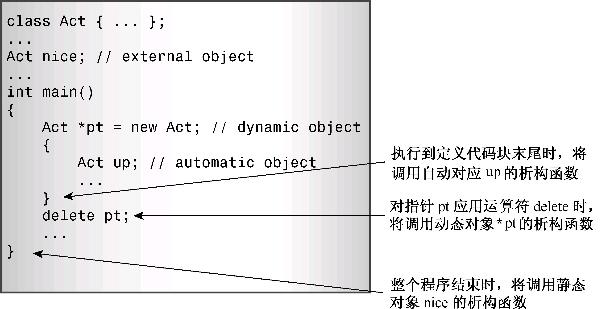

在下述情况下析构函数将被调用（参见图12.4）。

* 如果对象是动态变量，则当执行完定义该对象的程序块时，将调用该对象的析构函数。因此，在程序清单12.3中，执行完main()时，将调用headline[0]和headline[1]的析构函数；执行完callme1( )时，将调用grub的析构函数。
* 如果对象是静态变量（外部、静态、静态外部或来自名称空间），则在程序结束时将调用对象的析构函数。这就是程序清单12.3中sports对象所发生的情况。
* 如果对象是用new创建的，则仅当您显式使用delete删除对象时，其析构函数才会被调用。

### 12.5.2 指针和对象小结
使用对象指针时，需要注意几点（参见图12.5）：

* 使用常规表示法来声明指向对象的指针：
> ```c++
> String * glamour;
> ```
* 可以将指针初始化为指向已有的对象：
> ```c++
> String * first = &sayings[0];
> ```
* 可以使用new来初始化指针，这将创建一个新的对象（有关使用new初始化指针的细节，请参见图12.6）：
> ```c++
> String * favorite = new String(sayings[choice]);
> ```
* 对类使用new将调用相应的类构造函数来初始化新创建的对象：
> ```c++
> // invokes default constructor
> String * gleep = new String;
> 
> // invokes the String(const char *) constructor
> String * glop = new String("my my my");
> // invokes the String(const String &) constructor
> String * favorite = new String(sayings[choice]);
> ```

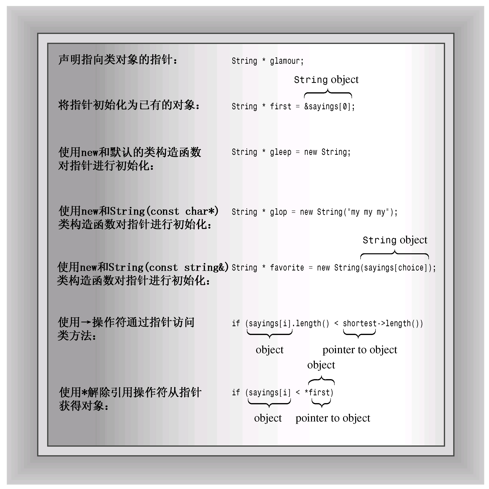

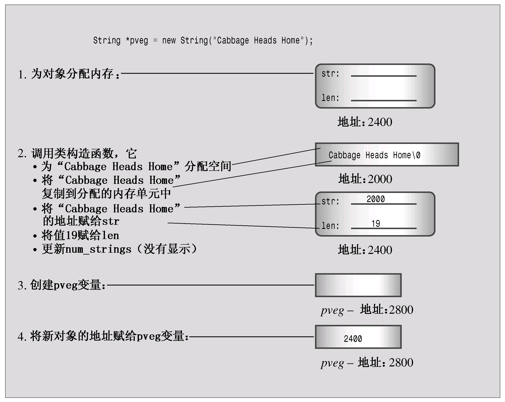

* 可以使用->运算符通过指针访问类方法：
> ```c++
> if (sayings[i].length() < shortest->length())
> ```
* 可以对对象指针应用解除引用运算符（*）来获得对象：
> ```c++
> if (sayings[i] < *first)    // compare object values
>     first = &sayings[i];    // assign object address
> ```

### 12.5.3 再谈定位new运算符
本书前面介绍过，定位new运算符让您能够在分配内存时能够指定内存位置。第9章从内置类型的角度讨论了定位new运算符，将这种运算符用于对象时情况有些不同，程序清单12.8使用了定位new运算符和常规new运算符给对象分配内存，其中定义的类的构造函数和析构函数都会显示一些信息，让用户能够了解对象的历史。

程序清单12.8 placenew1.cpp
```c++
// placenew1.cpp  -- new, placement new, no delete
#include <iostream>
#include <string>
#include <new>
using namespace std;
const int BUF = 512;

class JustTesting
{
private:
    string words;
    int number;
public:
    JustTesting(const string & s = "Just Testing", int n = 0) 
    {words = s; number = n; cout << words << " constructed\n"; }
    ~JustTesting() { cout << words << " destroyed\n";}
    void Show() const { cout << words << ", " << number << endl;}
};
int main()
{
    char * buffer = new char[BUF];       // get a block of memory

    JustTesting *pc1, *pc2;

    pc1 = new (buffer) JustTesting;      // place object in buffer
    pc2 = new JustTesting("Heap1", 20);  // place object on heap
    
    cout << "Memory block addresses:\n" << "buffer: "
        << (void *) buffer << "    heap: " << pc2 <<endl;
    cout << "Memory contents:\n";
    cout << pc1 << ": ";
    pc1->Show();
    cout << pc2 << ": ";
    pc2->Show();

    JustTesting *pc3, *pc4;
    pc3 = new (buffer) JustTesting("Bad Idea", 6);
    pc4 = new JustTesting("Heap2", 10);
    cout << "Memory contents:\n";
    cout << pc3 << ": ";
    pc3->Show();
    cout << pc4 << ": ";
    pc4->Show();
    
    delete pc2;                          // free Heap1         
    delete pc4;                          // free Heap2
    delete [] buffer;                    // free buffer
    cout << "Done\n";
    // std::cin.get();
    return 0;
}
```

该程序使用new运算符创建了一个512字节的内存缓冲区，然后使用new运算符在堆中创建两个JustTesting对象，并试图使用定位new运算符在内存缓冲区中创建两个JustTesting对象。最后，它使用delete来释放使用new分配的内存。下面是该程序的输出：
```c++
Just Testing constructed
Heap1 constructed
Memory block addresses:
buffer: 0x55c20c86eeb0    heap: 0x55c20c86f4d0
Memory contents:
0x55c20c86eeb0: Just Testing, 0
0x55c20c86f4d0: Heap1, 20
Bad Idea constructed
Heap2 constructed
Memory contents:
0x55c20c86eeb0: Bad Idea, 6
0x55c20c86f500: Heap2, 10
Heap1 destroyed
Heap2 destroyed
Done
```

和往常一样，内存地址的格式和值将随系统而异。

程序清单12.8在使用定位new运算符时存在两个问题。首先，在创建第二个对象时，定位new运算符使用一个新对象来覆盖用于第一个对象的内存单元。显然，如果类动态地为其成员分配内存，这将引发问题。

其次，将delete用于pc2和pc4时，将自动调用为pc2和pc4指向的对象调用析构函数；然而，将delete[]用于buffer时，不会为使用定位new运算符创建的对象调用析构函数。

这里的经验教训与第9章介绍的相同：程序员必须负责管用定位new运算符用从中使用的缓冲区内存单元。要使用不同的内存单元，程序员需要提供两个位于缓冲区的不同地址，并确保这两个内存单元不重叠。例如，可以这样做：
```c++
pc1 = new (buffer) JustTesting;
pc3 = new (buffer + sizeof (JustTesting)) JustTesting("Better Idea", 6);
```

其中指针pc3相对于pc1的偏移量为JustTesting对象的大小。

第二个教训是，如果使用定位new运算符来为对象分配内存，必须确保其析构函数被调用。但如何确保呢？对于在堆中创建的对象，可以这样做：
```c++
delete pc2;   // delete object pointed to by pc2
```

但不能像下面这样做：
```c++
delete pc1;   // delete object pointed to by pc1? NO!
delete pc3;   // delete object pointed to by pc3? NO!
```

原因在于delete可与常规new运算符配合使用，但不能与定位new运算符配合使用。例如，指针pc3没有收到new运算符返回的地址，因此delete pc3将导致运行阶段错误。在另一方面，指针pc1指向的地址与buffer相同，但buffer是使用new []初始化的，因此必须使用delete [ ]而不是delete来释放。即使buffer是使用new而不是new []初始化的，delete pc1也将释放buffer，而不是pc1。这是因为new/delete系统知道已分配的512字节块buffer，但对定位new运算符对该内存块做了何种处理一无所知。

该程序确实释放了buffer：
```c++
delete [] buffer;     // free buffer
```

正如上述注释指出的，delete [] buffer;释放使用常规new运算符分配的整个内存块，但它没有为定位new运算符在该内存块中创建的对象调用析构函数。您之所以知道这一点，是因为该程序使用了一个显示信息的析构函数，该析构函数宣布了“Heap1”和“Heap2”的死亡，但却没有宣布“Just Testing”和“Bad Idea”的死亡。

这种问题的解决方案是，显式地为使用定位new运算符创建的对象调用析构函数。正常情况下将自动调用析构函数，这是需要显式调用析构函数的少数几种情形之一。显式地调用析构函数时，必须指定要销毁的对象。由于有指向对象的指针，因此可以使用这些指针：
```c++
pc3->JustTesting();   // destory object pointed to by pc3
pc1->JustTesting();   // destory object pointed to by pc1
```

程序清单12.9对定位new运算符使用的内存单元进行管理，加入到合适的delete和显式析构函数调用，从而修复了程序清单12.8中的问题。需要注意的一点是正确的删除顺序。对于使用定位new运算符创建的对象，应以与创建顺序相反的顺序进行删除。原因在于，晚创建的对象可能依赖于早创建的对象。另外，仅当所有对象都被销毁后，才能释放用于存储这些对象的缓冲区。

程序清单12.9 placenew2.cpp
```c++
// placenew2.cpp  -- new, placement new, no delete
#include <iostream>
#include <string>
#include <new>
using namespace std;
const int BUF = 512;

class JustTesting
{
private:
    string words;
    int number;
public:
    JustTesting(const string & s = "Just Testing", int n = 0) 
    {words = s; number = n; cout << words << " constructed\n"; }
    ~JustTesting() { cout << words << " destroyed\n";}
    void Show() const { cout << words << ", " << number << endl;}
};
int main()
{
    char * buffer = new char[BUF];       // get a block of memory

    JustTesting *pc1, *pc2;

    pc1 = new (buffer) JustTesting;      // place object in buffer
    pc2 = new JustTesting("Heap1", 20);  // place object on heap
    
    cout << "Memory block addresses:\n" << "buffer: "
        << (void *) buffer << "    heap: " << pc2 <<endl;
    cout << "Memory contents:\n";
    cout << pc1 << ": ";
    pc1->Show();
    cout << pc2 << ": ";
    pc2->Show();

    JustTesting *pc3, *pc4;
// fix placement new location
    pc3 = new (buffer + sizeof (JustTesting))
                JustTesting("Better Idea", 6);
    pc4 = new JustTesting("Heap2", 10);
    
    cout << "Memory contents:\n";
    cout << pc3 << ": ";
    pc3->Show();
    cout << pc4 << ": ";
    pc4->Show();
    
    delete pc2;           // free Heap1         
    delete pc4;           // free Heap2
// explicitly destroy placement new objects
    pc3->~JustTesting();  // destroy object pointed to by pc3
    pc1->~JustTesting();  // destroy object pointed to by pc1
    delete [] buffer;     // free buffer
    // std::cin.get();
    return 0;
}
```

该程序的输出如下：
```c++
Just Testing constructed
Heap1 constructed
Memory block addresses:
buffer: 0x5638ccd12eb0    heap: 0x5638ccd134d0
Memory contents:
0x5638ccd12eb0: Just Testing, 0
0x5638ccd134d0: Heap1, 20
Better Idea constructed
Heap2 constructed
Memory contents:
0x5638ccd12ed8: Better Idea, 6
0x5638ccd13500: Heap2, 10
Heap1 destroyed
Heap2 destroyed
Better Idea destroyed
Just Testing destroyed
```

该程序使用定位new运算符在相邻的内存单元中创建两个对象，并调用了合适的析构函数。

## 12.6 复习各种技术
至此，介绍了多种用于处理各种与类相关的问题的编程技术。可能难以掌握这些技术，下面对它们进行总结，并介绍何时使用它们。

### 12.6.1 重载<<运算符
要重新定义 << 运算符，以便将它和cout一起用来显示对象的内容，请定义下面的友元运算符函数：
```c++
ostream & operator<<(ostream & os, const c_name & obj)
{
    os << ...;    // display object contents
    return os;
}
```

其中c_name是类名。如果该类提供了能够返回所需内容的公有方法，则可在运算符函数中使用这些方法，这样便不用将它们设置为友元函数了。

### 12.6.2 转换函数
要将单个值转换为类类型，需要创建原型如下所示的类构造函数：
```c++
c_name(type_name value);
```

其中c_name为类名，type_name是要转换的类型的名称。

要将类转换为其他类型，需要创建原型如下所示的类成员函数：
```c++
operator type_name();
```

虽然该函数没有声明返回类型，但应返回所需类型的值。

使用转换函数时要小心。可以在声明构造函数时使用关键字explicit，以防止它被用于隐式转换。

### 12.6.3 其构造函数使用new的类
如果类使用new运算符来分配类成员指向的内存，在设计时应采取一些预防措施（前面总结了这些预防措施，应牢记这些规则，这是因为编译器并不知道这些规则，因此无法发现错误）。

* 对于指向的内存是由new分配的所有类成员，都应在类的析构函数中对其使用delete，该运算符将释放分配的内存。
* 如果析构函数通过对指针类成员使用delete来释放内存，则每个构造函数都应当使用new来初始化指针，或将它设置为空指针。
* 构造函数中要么使用new []，要么使用new，而不能混用。如果构造函数使用的是new[]，则析构函数应使用delete []；如果构造函数使用的是new，则析构函数应使用delete。
* 应定义一个分配内存（而不是将指针指向已有内存）的复制构造函数。这样程序将能够将类对象初始化为另一个类对象。这种构造函数的原型通常如下：
> ```c++
> className(const className &)
> ```
* 应定义一个重载赋值运算符的类成员函数，其函数定义如下（其中c_pointer是c_name的类成员，类型为指向type_name的指针）。下面的示例假设使用new []来初始化变量c_pointer：
> ```c++
> c_name & c_name::operator=(const c_name &cn)
> {
>     if (this == &cn)
>         return *this;   // done if self-assignment
>     delete [] c_pointer;
>     // set size number of type_name units to be copied
>     c_pointer = new type_name[size];
>     // then copy data pointed to by cn.c_pointer to
>     // location pointed to by c_pointer
>     ...
>     return *this;
> }
> ```

## 12.7 队列模拟
进一步了解类后，可将这方面的知识用于解决编程问题。Heather银行打算在Food Heap超市开设一个自动柜员机（ATM）。Food Heap超市的管理者担心排队等待使用ATM的人流会干扰超市的交通，希望限制排队等待的人数。Heather银行希望对顾客排队等待的时间进行估测。要编写一个程序来模拟这种情况，让超市的管理者可以了解ATM可能造成的影响。

对于这种问题，最自然的方法是使用顾客队列。队列是一种抽象的数据类型（Abstract Data Type，ADT），可以存储有序的项目序列。新项目被添加在队尾，并可以删除队首的项目。队列有点像栈，但栈在同一端进行添加和删除。这使得栈是一种后进先出（LIFO，last-in，firstout）的结构，而队列是先进先出（FIFO，first-in，first-out）的。从概念上说，队列就好比是收款台或ATM前面排的队，所以对于上述问题，队列非常合适。因此，工程的任务之一是定义一个Queue类（第16章将介绍标准模板库类queue，也将介绍如何开发自己的类）。

队列中的项目是顾客。Heather银行的代表介绍：通常，三分之一的顾客只需要一分钟便可获得服务，三分之一的顾客需要两分钟，另外三分之一的顾客需要三分钟。另外，顾客到达的时间是随机的，但每个小时使用自动柜员机的顾客数量相当稳定。工程的另外两项任务是：设计一个表示顾客的类；编写一个程序来模拟顾客和队列之间的交互（参见图12.7）。

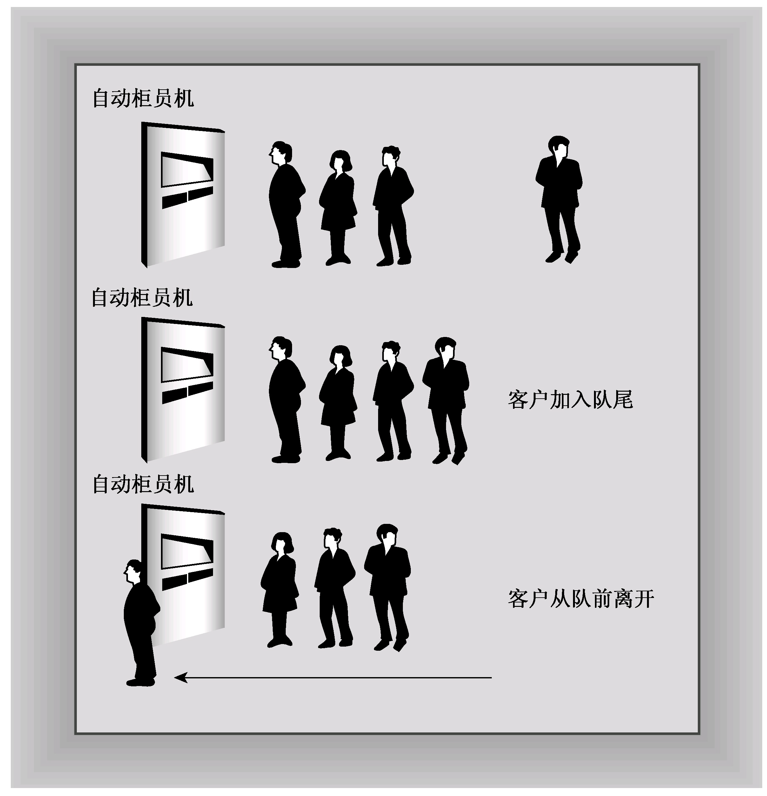

### 12.7.1 队列类
首先需要设计一个Queue类。这里先列出队列的特征：

* 队列存储有序的项目序列；
* 队列所能容纳的项目数有一定的限制；
* 应当能够创建空队列；
* 应当能够检查队列是否为空；
* 应当能够检查队列是否是满的；
* 应当能够在队尾添加项目；
* 应当能够从队首删除项目；
* 应当能够确定队列中项目数。

设计类时，需要开发公有接口和私有实现。

1. Queue类的接口

从队列的特征可知，Queue类的公有接口应该如下：
```c++
class Queue
{
    enum {Q_SIZE = 10};
private:
    // private representation to be developed later
public:
    Queue(int qs = Q_SIZE); // create queue with a qs limit
    ~Queue();
    bool isempty() const;
    bool isfull() const;
    int queuecount() const;
    bool enqueue(const Item &item);   // add item to end
    bool dequeue(Item &item);         // remove item from front
};
```

构造函数创建一个空队列。默认情况下，队列最多可存储10个项目，但是可以用显式初始化参数覆盖该默认值：
```c++
Queue line1;      // queue with 10-item limit
Queue line2(20);  // queue with 20-item limit
```

使用队列时，可以使用typedef来定义Item（第14章将介绍如何使用类模板）。

2. Queue类的实现

确定接口后，便可以实现它。首先，需要确定如何表示队列数据。一种方法是使用new动态分配一个数组，它包含所需的元素数。然而，对于队列操作而言，数组并不太合适。例如，删除数组的第一个元素后，需要将余下的所有元素向前移动一位；否则需要作一些更费力的工作，如将数组视为是循环的。然而，链表能够很好地满足队列的要求。链表由节点序列构成。每一个节点中都包含要保存到链表中的信息以及一个指向下一个节点的指针。对于这里的队列来说，数据部分都是一个Item类型的值，因此可以使用下面的结构来表示节点：
```c++
struct Node
{
    Item item;          // data stored in the node
    struct Node * next; // pointer to next node
};
```

图12.8说明了链表。

如图12.8所示是一个单向链表，因为每个节点都只包含一个指向其他节点的指针。知道第一个节点的地址后，就可以沿指针找到后面的每一个节点。通常，链表最后一个节点中的指针被设置为NULL（或0），以指出后面没有节点了。在C++11中，应使用新增的关键字nullptr。要跟踪链表，必须知道第一个节点的地址。可以让Queue类的一个数据成员指向链表的起始位置。具体地说，这是所需要的全部信息，有了这种信息后，就可以沿节点链找到任何节点。然而，由于队列总是将新项目添加到队尾，因此包含一个指向最后一个节点的数据成员将非常方便（参见图12.9）。此外，还可以使用数据成员来跟踪队列可存储的最大项目数以及当前的项目数。所以，类声明的私有部分与下面类似：

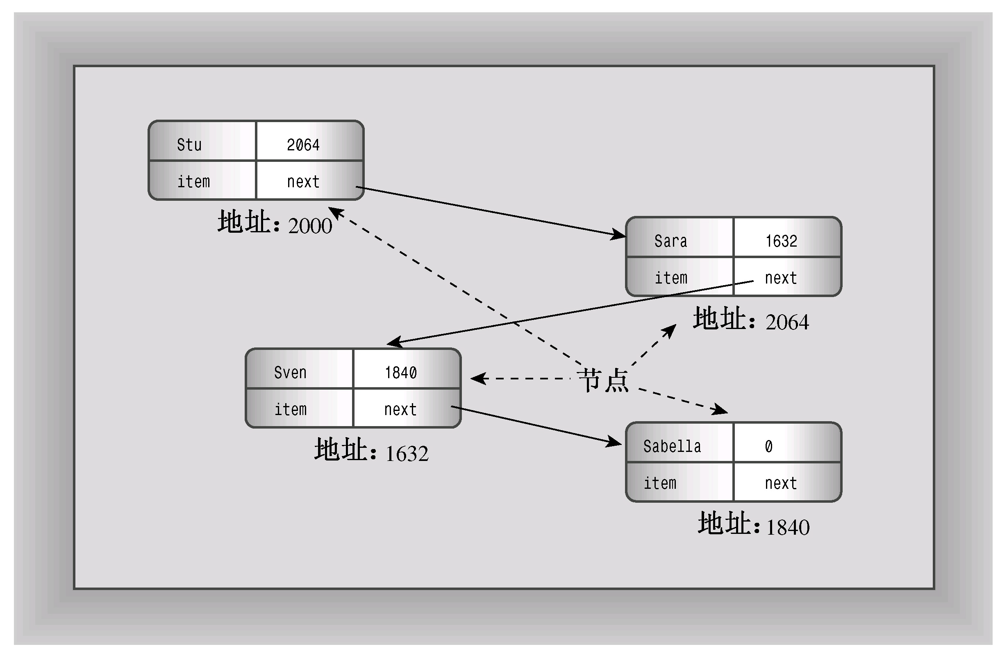

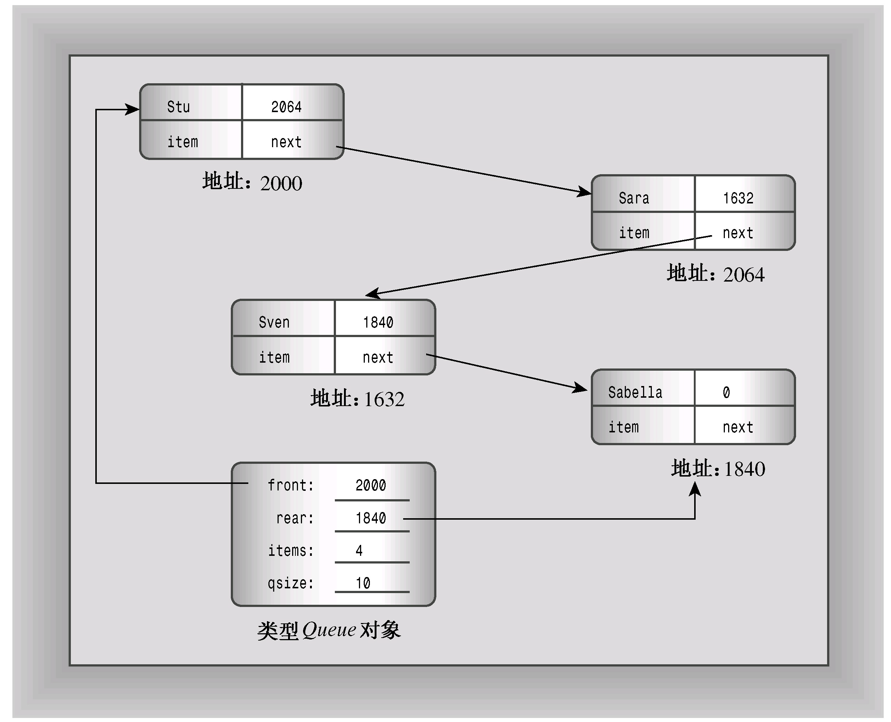

```c++
class Queue
{
private:
// class scope definitions
    // Node is a nested structure definition local to this class
    struct Node { Item item; struct Node * next; };
    enum {Q_SIZE = 10};
// private class members
    Node * front;       // pointer to front of Queue
    Node * rear;        // pointer to rear of Queue
    int items;          // current number of items in Queue
    const int qsize;    // maximux number of items in Queue
    ...
public:
// ...
};
```

上述声明使用了C++的一项特性：在类中嵌套结构或类声明。通过将Node声明放在Queue类中，可以使其作用域为整个类。也就是说，Node是这样一种类型：可以使用它来声明类成员，也可以将它作为类方法中的类型名称，但只能在类中使用。这样，就不必担心该Node声明与某些全局声明或其他类中声明的Node发生冲突。有些较老的编译器不支持嵌套的结构和类，如果您的编译器是这样的，则必须将Node结构定义为全局的，将其作用域设置为整个文件。

> **嵌套结构和类**
> 
> 在类声明中声明的结构、类或枚举被称为是被嵌套在类中，其作用域为整个类。这种声明不会创建数据对象，而只是指定了可以在类中使用的类型。如果声明是在类的私有部分进行的，则只能在这个类使用被声明的类型；如果声明是在公有部分进行的，则可以从类的外部通过作用域解析运算符使用被声明的类型。例如，如果Node是在Queue类的公有部分声明的，则可以在类的外面声明Queue::Node类型的变量。

设计好数据的表示方式后，接下来需要编写类方法。

3. 类方法

类构造函数应提供类成员的值。由于在这个例子中，队列最初是空的，因此队首和队尾指针都设置为NULL（0或nullptr），并将items设置为0。另外，还应将队列的最大长度qsize设置为构造函数参数qs的值。下面的实现方法无法正常运行：
```c++
Queue::Queue(int qs)
{
    front = rear = NULL;
    items = 0;
    qsize = qs;   // not acceptable!
}
```

问题在于qsize是常量，所以可以对它进行初始化，但不能给它赋值。从概念上说，调用构造函数时，对象将在括号中的代码执行之前被创建。因此，调用Queue（int qs）构造函数将导致程序首先给4个成员变量分配内存。然后，程序流程进入到括号中，使用常规的赋值方式将值存储到内存中。因此，对于const数据成员，必须在执行到构造函数体之前，即创建对象时进行初始化。C++提供了一种特殊的语法来完成上述工作，它叫做成员初始化列表（member initializer list）。成员初始化列表由逗号分隔的初始化列表组成（前面带冒号）。它位于参数列表的右括号之后、函数体左括号之前。如果数据成员的名称为mdata，并需要将它初始化为val，则初始化器为mdata（val）。使用这种表示法，可以这样编写Queue的构造函数：
```c++
Queue::Queue(int qs) : qsize(qs)    // initialize qsize to qs
{
    front = rear = NULL;
    items = 0;
}
```

通常，初值可以是常量或构造函数的参数列表中的参数。这种方法并不限于初始化常量，可以将Queue构造函数写成如下所示：
```c++
Queue::Queue(int qs) : qsize(qs), front(NULL), rear(NULL), items(0)
{
}
```

只有构造函数可以使用这种初始化列表语法。如上所示，对于const类成员，必须使用这种语法。另外，对于被声明为引用的类成员，也必须使用这种语法：
```c++
class Agency {...};
class Agent
{
private:
    Agency & belong;    // must use initializer list to initialize
    ...
};
Agent::Agent(Agency & a) : belong(a) {...}
```

这是因为引用与const数据类似，只能在被创建时进行初始化。对于简单数据成员（例如front和items），使用成员初始化列表和在函数体中使用赋值没有什么区别。然而，正如第14章将介绍的，对于本身就是类对象的成员来说，使用成员初始化列表的效率更高。

> **成员初始化列表的语法**
> 
> 如果Classy是一个类，而mem1、mem2和mem3都是这个类的数据成员，则类构造函数可以使用如下的语法来初始化数据成员：
> ```c++
> Classy::Classy(int n, int m) : mem1(n), mem2(0), mem3(n*m + 2)
> {
> // ...
> }
> ```
> 
> 上述代码将mem1初始化为n，将mem2初始化为0，将mem3初始化为n*m + 2。从概念上说，这些初始化工作是在对象创建时完成的，此时还未执行括号中的任何代码。请注意以下几点：
> 
> * 这种格式只能用于构造函数；
> * 必须用这种格式来初始化非静态const数据成员（至少在C++11之前是这样的）；
> * 必须用这种格式来初始化引用数据成员。
> 
> 数据成员被初始化的顺序与它们出现在类声明中的顺序相同，与初始化器中的排列顺序无关。
> 
> **警告：**
> 
> 不能将成员初始化列表语法用于构造函数之外的其他类方法。

成员初始化列表使用的括号方式也可用于常规初始化。也就是说，如果愿意，可以将下述代码：
```c++
int games = 162;
double talk = 2.71828;
```

替换为：
```c++
int games(162);
double talk(2.71828);
```

这使得初始化内置类型就像初始化类对象一样。

> **C++11的类内初始化**
> 
> C++11允许您以更直观的方式进行初始化：
> ```c++
> class Classy
> {
>     int mem1 = 10;        // in-class initialization
>     const int mem2 = 10;  // in-class initialization
> // ...
> };
> ```
> 
> 这与在构造函数中使用成员初始化列表等价：
> ```c++
> Classy::Classy() : mem1(10), mem2(20) {...}
> ```
> 
> 成员mem1和mem2将分别被初始化为10和20，除非调用了使用成员初始化列表的构造函数，在这种情况下，实际列表将覆盖这些默认初始值：
> ```c++
> Classy::Classy(int n) : mem1(n) {...}
> ```
> 
> 在这里，构造函数将使用n来初始化mem1，但mem2仍被设置为20。

isempty()、isfull()和queuecount()的代码都非常简单。如果items为0，则队列是空的；如果items等于qsize，则队列是满的。要知道队列中的项目数，只需返回items的值。后面的程序清单12.11列出了这些代码。

将项目添加到队尾（入队）比较麻烦。下面是一种方法：
```c++
bool Queue::enqueue(const Item & item)
{
    if (isfull())
        return false;
    Node * add = new Node;    // create node
// on failure, new throws std::bad_alloc exception
    add->item = item;         // set node pointers
    add->next = NULL;         // or nullptr;
    items++;
    if (front == NULL)        // if queue is empty,
        front = add;          // place item at front
    else
        rear->next = add;     // else place at rear
    rear = add;               // have rear point to new node
    return true;
}
```

总之，方法需要经过下面几个阶段（见图12.10）。

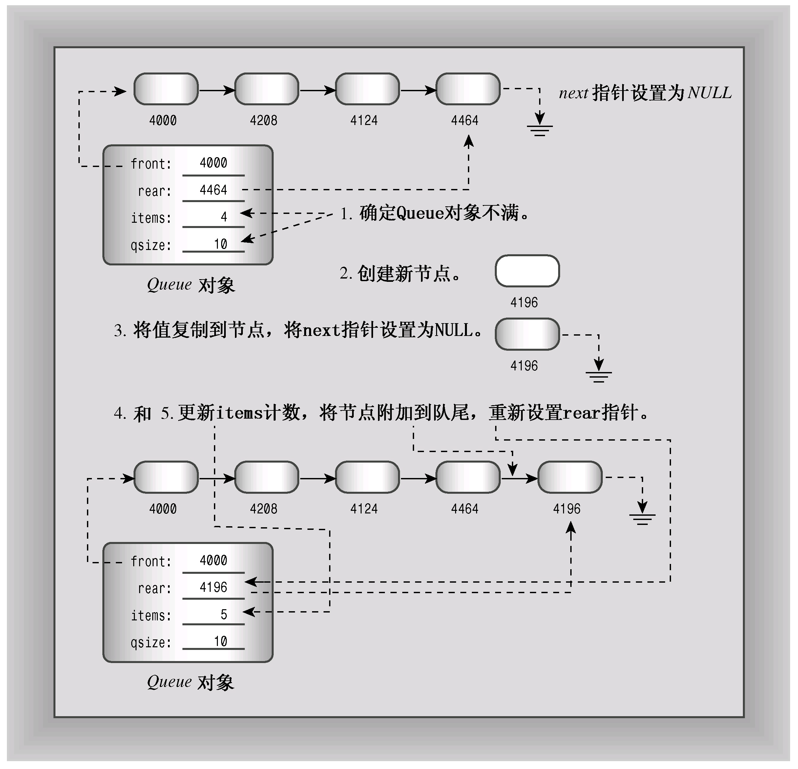

1. 如果队列已满，则结束（在这里的实现中，队列的最大长度由用户通过构造函数指定）。

2. 创建一个新节点。如果new无法创建新节点，它将引发异常，这个主题将在第15章介绍。最终的结果是，除非提供了处理异常的代码，否则程序将终止。

3. 在节点中放入正确的值。在这个例子中，代码将Item值复制到节点的数据部分，并将节点的next指针设置为NULL（0或C++11新增的nullptr）。这样就为将节点作为队列中的最后一个项目做好了准备。

4. 将项目计数（items）加1。

5. 将节点附加到队尾。这包括两个部分。首先，将节点与列表中的另一个节点连接起来。这是通过将当前队尾节点的next指针指向新的队尾节点来完成的。第二部分是将Queue的成员指针rear设置为指向新节点，使队列可以直接访问最后一个节点。如果队列为空，则还必须将front指针设置成指向新节点（如果只有一个节点，则它既是队首节点，也是队尾节点）。

删除队首项目（出队）也需要多个步骤才能完成。下面是一种方式：
```c++
bool Queue::dequeue(Item & item)
{
    if (front == NULL)
        return false;
    item = front->item;   // set item to first item in queue
    items--;
    Node * temp = front;  // save location of first item
    front = front->next;  // reset front to next item
    delete temp;          // delete former first item
    if (items == 0)
        rear = NULL;
    return true;
}
```

总之，需要经过下面几个阶段（参见图12.11）：

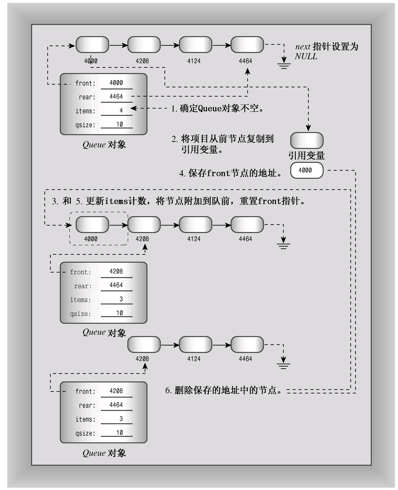

1. 如果队列为空，则结束。

2. 将队列的第一个项目提供给调用函数，这是通过将当前front节点中的数据部分复制到传递给方法的引用变量中来实现。

3. 将项目计数（items）减1。

4. 保存front节点的位置，供以后删除。

5. 让节点出队。这是通过将Queue成员指针front设置成指向下一个节点来完成的，该节点的位置由front->next提供。

6. 为节省内存，删除以前的第一个节点。

7. 如果链表为空，则将rear设置为NULL（在这个例子中，将front指针设置成front->next后，它已经是NULL了）。同样，可使用0而不是NULL，也可使用C++11新增的nullptr。

第4步是必不可少的，这是因为第5步将删除关于先前第一个节点位置的信息。

4. 是否需要其他类方法

是否需要其他方法呢？类构造函数没有使用new，所以乍一看，好像不用理会由于在构造函数中使用new给类带来的特殊要求。当然，这种印象是错误的，因为向队列中添加对象将调用new来创建新的节点。通过删除节点的方式，dequeue( )方法确实可以清除节点，但这并不能保证队列在到期时为空。因此，类需要一个显式析构函数——该函数删除剩余的所有节点。下面是一种实现，它从链表头开始，依次删除其中的每个节点：
```c++
Queue::~Queue()
{
    Node * temp;
    while (front != NULL)   // while queue is not yet empty
    {
        temp = front;         // save address of front item
        front = front->next;  // reset pointer to next item
        delete temp;          // delete former front
    }
}
```

您知道，使用new的类通常需要包含显式复制构造函数和执行深度复制的赋值运算符，这个例子也是如此吗？首先要回答的问题是，默认的成员复制是否合适？答案是否定的。复制Queue对象的成员将生成一个新的对象，该对象指向链表原来的头和尾。因此，将项目添加到复制的Queue对象中，将修改共享的链表。这样做将造成非常严重的后果。更糟的是，只有副本的尾指针得到了更新，从原始对象的角度看，这将损坏链表。显然，要克隆或复制队列，必须提供复制构造函数和执行深度复制的赋值构造函数。

当然，这提出了这样一个问题：为什么要复制队列呢？也许是希望在模拟的不同阶段保存队列的瞬像，也可能是希望为两个不同的策略提供相同的输入。实际上，拥有拆分队列的操作是非常有用的，超市在开设额外的收款台时经常这样做。同样，也可能希望将两个队列结合成一个或者截短一个队列。

但假设这里的模拟不实现上述功能。难道不能忽略这些问题，而使用已有的方法吗？当然可以。然而，在将来的某个时候，可能需要再次使用队列且需要复制。另外，您可能会忘记没有为复制提供适当的代码。在这种情况下，程序将能编译和运行，但结果却是混乱的，甚至会崩溃。因此，最好还是提供复制构造函数和赋值运算符，尽管目前并不需要它们。

幸运的是，有一种小小的技巧可以避免这些额外的工作，并确保程序不会崩溃。这就是将所需的方法定义为伪私有方法：
```c++
class Queue
{
private:
    Queue(const Queue &q) : qsize(0) { } // preemptice definition
    Queue & operator=(const Queue & q) { return *this; }
//...
};
```

这样做有两个作用：第一，它避免了本来将自动生成的默认方法定义。第二，因为这些方法是私有的，所以不能被广泛使用。也就是说，如果nip和tuck是Queue对象，则编译器就不允许这样做：
```c++
Queue snick(nip);   // not allowed
tuck = nip;         // not allowed
```

所以，与其将来面对无法预料的运行故障，不如得到一个易于跟踪的编译错误，指出这些方法是不可访问的。另外，在定义其对象不允许被复制的类时，这种方法也很有用。

C++11提供了另一种禁用方法的方式——使用关键字delete，这将在第18章介绍。

还有没有其他影响需要注意呢？当然有。当对象被按值传递（或返回）时，复制构造函数将被调用。然而，如果遵循优先采用按引用传递对象的惯例，将不会有任何问题。另外，复制构造函数还被用于创建其他的临时对象，但Queue定义中并没有导致创建临时对象的操作，例如重载加法运算符。

### 12.7.2 Customer类
接下来需要设计客户类。通常，ATM客户有很多属性，例如姓名、账户和账户结余。然而，这里的模拟需要使用的唯一一个属性是客户何时进入队列以及客户交易所需的时间。当模拟生成新客户时，程序将创建一个新的客户对象，并在其中存储客户的到达时间以及一个随机生成的交易时间。当客户到达队首时，程序将记录此时的时间，并将其与进入队列的时间相减，得到客户的等候时间。下面的代码演示了如何定义和实现Customer类：
```c++
class Customer
{
private:
    long arrive;      // arrival time for customer
    int processtime;  // processing time for customer
public:
    Customer() { arrive = processtime = 0; }
    void set(long when);
    long when() const { return arrive; }
    int ptime() const { return processtime; }
};
void Customer::set(long when)
{
    processtime = std::rand() % 3 + 1;
    arrive = when;
}
```

默认构造函数创建一个空客户。set()成员函数将到达时间设置为参数，并将处理时间设置为1～3中的一个随机值。

程序清单12.10将Queue和Customer类声明放到一起，而程序清单12.11列出了方法。

程序清单12.10 queue.h
```c++
// queue.h -- interface for a queue
#ifndef QUEUE_H_
#define QUEUE_H_
// This queue will contain Customer items
class Customer
{
private:
    long arrive;        // arrival time for customer
    int processtime;    // processing time for customer
public:
    Customer() : arrive(0), processtime (0){}
    void set(long when);
    long when() const { return arrive; }
    int ptime() const { return processtime; }
};

typedef Customer Item;

class Queue
{
private:
// class scope definitions
    // Node is a nested structure definition local to this class
    struct Node { Item item; struct Node * next;};
    enum {Q_SIZE = 10};
// private class members
    Node * front;       // pointer to front of Queue
    Node * rear;        // pointer to rear of Queue
    int items;          // current number of items in Queue
    const int qsize;    // maximum number of items in Queue
    // preemptive definitions to prevent public copying
    Queue(const Queue & q) : qsize(0) { }
    Queue & operator=(const Queue & q) { return *this;}
public:
    Queue(int qs = Q_SIZE); // create queue with a qs limit
    ~Queue();
    bool isempty() const;
    bool isfull() const;
    int queuecount() const;
    bool enqueue(const Item &item); // add item to end
    bool dequeue(Item &item);       // remove item from front
};
#endif
```

程序清单12.11 queue.cpp
```c++
// queue.cpp -- Queue and Customer methods
#include "queue.h"
#include <cstdlib>         // (or stdlib.h) for rand()

// Queue methods
Queue::Queue(int qs) : qsize(qs)
{
    front = rear = NULL;    // or nullptr
    items = 0;
}

Queue::~Queue()
{
    Node * temp;
    while (front != NULL)   // while queue is not yet empty
    {
        temp = front;       // save address of front item
        front = front->next;// reset pointer to next item
        delete temp;        // delete former front
    }
}

bool Queue::isempty() const
{
    return items == 0;
}

bool Queue::isfull() const
{
    return items == qsize;
}

int Queue::queuecount() const
{
    return items;
}

// Add item to queue
bool Queue::enqueue(const Item & item)
{
    if (isfull())
        return false;
    Node * add = new Node;  // create node
// on failure, new throws std::bad_alloc exception
    add->item = item;       // set node pointers
    add->next = NULL;       // or nullptr;
    items++;
    if (front == NULL)      // if queue is empty,
        front = add;        // place item at front
    else
        rear->next = add;   // else place at rear
    rear = add;             // have rear point to new node
    return true;
}

// Place front item into item variable and remove from queue
bool Queue::dequeue(Item & item)
{
    if (front == NULL)
        return false;
    item = front->item;     // set item to first item in queue
    items--;
    Node * temp = front;    // save location of first item
    front = front->next;    // reset front to next item
    delete temp;            // delete former first item
    if (items == 0)
        rear = NULL;
    return true;
}

// customer method

// when is the time at which the customer arrives
// the arrival time is set to when and the processing
// time set to a random value in the range 1 - 3
void Customer::set(long when)
{
    processtime = std::rand() % 3 + 1;
    arrive = when; 
}
```

### 12.7.3 ATM模拟
现在已经拥有模拟ATM所需的工具。程序允许用户输入3个数：队列的最大长度、程序模拟的持续时间（单位为小时）以及平均每小时的客户数。程序将使用循环——每次循环代表一分钟。在每分钟的循环中，程序将完成下面的工作。

1. 判断是否来了新的客户。如果来了，并且此时队列未满，则将它添加到队列中，否则拒绝客户入队。

2. 如果没有客户在进行交易，则选取队列的第一个客户。确定该客户的已等候时间，并将wait_time计数器设置为新客户所需的处理时间。

3. 如果客户正在处理中，则将wait_time计数器减1。

4. 记录各种数据，如获得服务的客户数目、被拒绝的客户数目、排队等候的累积时间以及累积的队列长度等。

当模拟循环结束时，程序将报告各种统计结果。

一个有趣的问题是，程序如何确定是否有新的客户到来。假设平均每小时有10名客户到达，则相当于每6分钟有一名客户。程序将计算这个值，并将它保存在min_per_cust变量中。然而，刚好每6分钟来一名客户不太现实，我们真正（至少在大部分时间内）希望的是一个更随机的过程——但平均每6分钟来一名客户。程序将使用下面的函数来确定是否在循环期间有客户到来：
```c++
bool newcustomer(double x)
{
    return (std::rand() * x / RAND_MAX < 1);
}
```

其工作原理如下：值RAND_MAX是在cstdlib文件（以前是stdlib.h）中定义的，是rand( )函数可能返回的最大值（0是最小值）。假设客户到达的平均间隔时间x为6，则rand( )* x /RAND_MAX的值将位于0到6之间。具体地说，平均每隔6次，这个值会有1次小于1。然而，这个函数可能会导致客户到达的时间间隔有时为1分钟，有时为20分钟。这种方法虽然很笨拙，但可使实际情况不同于有规则地每6分钟到来一个客户。如果客户到达的平均时间间隔少于1分钟，则上述方法将无效，但模拟并不是针对这种情况设计的。如果确实需要处理这种情况，最好提高时间分辨率，比如每次循环代表10秒钟。

程序清单12.12给出了模拟的细节。长时间运行该模拟程序，可以知道长期的平均值；短时间运行该模拟程序，将只能知道短期的变化。

程序清单12.12 bank.cpp
```c++
// bank.cpp -- using the Queue interface
// compile with queue.cpp
#include <iostream>
#include <cstdlib> // for rand() and srand()
#include <ctime>   // for time()
#include "queue.h"
const int MIN_PER_HR = 60;

bool newcustomer(double x); // is there a new customer?

int main()
{
    using std::cin;
    using std::cout;
    using std::endl;
    using std::ios_base;
// setting things up
    std::srand(std::time(0));    //  random initializing of rand()

    cout << "Case Study: Bank of Heather Automatic Teller\n";
    cout << "Enter maximum size of queue: ";
    int qs;
    cin >> qs;
    Queue line(qs);         // line queue holds up to qs people

    cout << "Enter the number of simulation hours: ";
    int hours;              //  hours of simulation
    cin >> hours;
    // simulation will run 1 cycle per minute
    long cyclelimit = MIN_PER_HR * hours; // # of cycles

    cout << "Enter the average number of customers per hour: ";
    double perhour;         //  average # of arrival per hour
    cin >> perhour;
    double min_per_cust;    //  average time between arrivals
    min_per_cust = MIN_PER_HR / perhour;

    Item temp;              //  new customer data
    long turnaways = 0;     //  turned away by full queue
    long customers = 0;     //  joined the queue
    long served = 0;        //  served during the simulation
    long sum_line = 0;      //  cumulative line length
    int wait_time = 0;      //  time until autoteller is free
    long line_wait = 0;     //  cumulative time in line


// running the simulation
    for (int cycle = 0; cycle < cyclelimit; cycle++)
    {
        if (newcustomer(min_per_cust))  // have newcomer
        {
            if (line.isfull())
                turnaways++;
            else
            {
                customers++;
                temp.set(cycle);    // cycle = time of arrival
                line.enqueue(temp); // add newcomer to line
            }
        }
        if (wait_time <= 0 && !line.isempty())
        {
            line.dequeue (temp);      // attend next customer
            wait_time = temp.ptime(); // for wait_time minutes
            line_wait += cycle - temp.when();
            served++;
        }
        if (wait_time > 0)
            wait_time--;
        sum_line += line.queuecount();
    }

// reporting results
    if (customers > 0)
    {
        cout << "customers accepted: " << customers << endl;
        cout << "  customers served: " << served << endl;
        cout << "         turnaways: " << turnaways << endl;
        cout << "average queue size: ";
        cout.precision(2);
        cout.setf(ios_base::fixed, ios_base::floatfield);
        cout << (double) sum_line / cyclelimit << endl;
        cout << " average wait time: "
             << (double) line_wait / served << " minutes\n";
    }
    else
        cout << "No customers!\n";
    cout << "Done!\n";
    // cin.get();
    // cin.get();
    return 0;
}

//  x = average time, in minutes, between customers
//  return value is true if customer shows up this minute
bool newcustomer(double x)
{
    return (std::rand() * x / RAND_MAX < 1); 
}
```

> **注意：**
> 
> 编译器如果没有实现bool，可以用int代替bool，用0代替false，用1代替true；还可能必须使用stdlib.h和time.h代替较新的cstdlib和ctime；另外可能必须自己来定义RAND_MAX。

下面是程序清单12.10-12.12组成的程序长时间运行的几个例子：
```c++
Case Study: Bank of Heather Automatic Teller
Enter maximum size of queue: 10
Enter the number of simulation hours: 100
Enter the average number of customers per hour: 15
customers accepted: 1527
  customers served: 1527
         turnaways: 0
average queue size: 0.18
 average wait time: 0.69 minutes
Done!


Case Study: Bank of Heather Automatic Teller
Enter maximum size of queue: 10
Enter the number of simulation hours: 100
Enter the average number of customers per hour: 30
customers accepted: 2869
  customers served: 2860
         turnaways: 74
average queue size: 3.92
 average wait time: 8.19 minutes
Done!


Case Study: Bank of Heather Automatic Teller
Enter maximum size of queue: 20
Enter the number of simulation hours: 100
Enter the average number of customers per hour: 30
customers accepted: 2929
  customers served: 2927
         turnaways: 49
average queue size: 8.80
 average wait time: 18.03 minutes
Done!
```

注意，每小时到达的客户从15名增加到30名时，等候时间并不是加倍，而是增加了15倍。如果允许队列更长，情况将更糟。然而，模拟没有考虑到这个事实——许多客户由于不愿意排很长的队而离开了。

下面是该程序的另外几个运行示例。从中可知，即使平均每小时到达的客户数不变，也会出现短期变化。

```c++
Case Study: Bank of Heather Automatic Teller
Enter maximum size of queue: 10
Enter the number of simulation hours: 4
Enter the average number of customers per hour: 30
customers accepted: 120
  customers served: 111
         turnaways: 0
average queue size: 4.68
 average wait time: 9.29 minutes
Done!


Case Study: Bank of Heather Automatic Teller
Enter maximum size of queue: 10
Enter the number of simulation hours: 4
Enter the average number of customers per hour: 30
customers accepted: 115
  customers served: 109
         turnaways: 1
average queue size: 3.25
 average wait time: 6.89 minutes
Done!


Case Study: Bank of Heather Automatic Teller
Enter maximum size of queue: 10
Enter the number of simulation hours: 4
Enter the average number of customers per hour: 30
customers accepted: 115
  customers served: 115
         turnaways: 0
average queue size: 4.71
 average wait time: 9.83 minutes
Done!
```

## 12.8 总结
本章介绍了定义和使用类的许多重要方面。其中的一些方面是非常微妙甚至很难理解的概念。如果其中的某些概念对于您来说过于复杂，也不用害怕——这些问题对于大多数C++的初学者来说都是很难的。通常，对于诸如复制构造函数等概念，都是在由于忽略它们而遇到了麻烦后逐步理解的。本章介绍的一些内容乍看起来非常难以理解，但是随着经验越来越丰富，对其理解也将越透彻。

在类构造函数中，可以使用new为数据分配内存，然后将内存地址赋给类成员。这样，类便可以处理长度不同的字符串，而不用在类设计时提前固定数组的长度。在类构造函数中使用new，也可能在对象过期时引发问题。如果对象包含成员指针，同时它指向的内存是由new分配的，则释放用于保存对象的内存并不会自动释放对象成员指针指向的内存。因此在类构造函数中使用new类来分配内存时，应在类析构函数中使用delete来释放分配的内存。这样，当对象过期时，将自动释放其指针成员指向的内存。

如果对象包含指向new分配的内存的指针成员，则将一个对象初始化为另一个对象，或将一个对象赋给另一个对象时，也会出现问题。在默认情况下，C++逐个对成员进行初始化和赋值，这意味着被初始化或被赋值的对象的成员将与原始对象完全相同。如果原始对象的成员指向一个数据块，则副本成员将指向同一个数据块。当程序最终删除这两个对象时，类的析构函数将试图删除同一个内存数据块两次，这将出错。解决方法是：定义一个特殊的复制构造函数来重新定义初始化，并重载赋值运算符。在上述任何一种情况下，新的定义都将创建指向数据的副本，并使新对象指向这些副本。这样，旧对象和新对象都将引用独立的、相同的数据，而不会重叠。由于同样的原因，必须定义赋值运算符。对于每一种情况，最终目的都是执行深度复制，也就是说，复制实际的数据，而不仅仅是复制指向数据的指针。

对象的存储持续性为自动或外部时，在它不再存在时将自动调用其析构函数。如果使用new运算符为对象分配内存，并将其地址赋给一个指针，则当您将delete用于该指针时将自动为对象调用析构函数。然而，如果使用定位new运算符（而不是常规new运算符）为类对象分配内存，则必须负责显式地为该对象调用析构函数，方法是使用指向该对象的指针调用析构函数方法。C++允许在类中包含结构、类和枚举定义。这些嵌套类型的作用域为整个类，这意味着它们被局限于类中，不会与其他地方定义的同名结构、类和枚举发生冲突。

C++为类构造函数提供了一种可用来初始化数据成员的特殊语法。这种语法包括冒号和由逗号分隔的初始化列表，被放在构造函数参数的右括号后，函数体的左括号之前。每一个初始化器都由被初始化的成员的名称和包含初始值的括号组成。从概念上来说，这些初始化操作是在对象创建时进行的，此时函数体中的语句还没有执行。语法如下：
```c++
queue(int qs) : qsize(qs), items(0), front(NULL), rear(NULL) { }
```

如果数据成员是非静态const成员或引用，则必须采用这种格式，但可将C++11新增的类内初始化用于非静态const成员。

C++11允许类内初始化，即在类定义中进行初始化：
```c++
class Queue
{
private:
    ...
    Node * front = NULL;
    enum { Q_SIZE = 10 };
    Node * rear = NULL;
    int items = 0;
    const int qsize = Q_SIZE;
    ...
};
```

这与使用成员初始化列表等价。然而，使用成员初始化列表的构造函数将覆盖相应的类内初始化。

您可能已经注意到，与简单的C结构相比，需要注意的类细节要多得多。作为回报，它们的功能也更强。

## 12.9 复习题
1. 假设String类有如下私有成员：
```c++
class String
{
private:
    char * str;   // points to string allocated by new
    int len;      // holds length of string
    // ...
};
a．下述默认构造函数有什么问题？
String::String() { }
b．下述构造函数有什么问题？
String::String(const char * s)
{
    str = s;
    len = strlen(s);
}
c．下述构造函数有什么问题？
String::String(const char * s)
{
    strcpy(str, s);
    len = strlen(s);
}
```

2. 如果您定义了一个类，其指针成员是使用new初始化的，请指出可能出现的3个问题以及如何纠正这些问题。

3. 如果没有显式提供类方法，编译器将自动生成哪些类方法？请描述这些隐式生成的函数的行为。

4. 找出并改正下述类声明中的错误：
```c++
class nitfy
{
    // data
    char personality[];
    int talents;
    //method
    nifty();
    nifty(char * s);
    ostream & operator<<(ostream & os, nifty & n);
}

nitfy::nitfy()
{
    personality = NULL;
    talents = 0;
}

nitfy:nitfy(char * s)
{
    personality = new char [strlen(s)];
    personality = s;
    talents = 0;
}

ostream & operator<<(ostream & os, nifty & n)
{
    os << n;
}
```

5. 对于下面的类声明：
```c++
class Golfer
{
private:
    char * fullname;    // points to string containing golfer's name
    int games;          // holds number of golf games played
public:
    Golfer();
    Golfer(const char * name, int g = 0);
    // creates empty dynamic array of g elements if g > 0
    Golfer(const Golfer & g);
    ~Golfer();
};
```

a．下列各条语句将调用哪些类方法？
```c++
Golfer nancy;                       // #1
Golfer lulu("Little Lulu");         // #2
Golfer roy("Roy Hobbs", 12);        // #3
Golfer * par = new Golfer;          // #4
Golfer next = lulu;                 // #5
Golfer hazzard = "Weed Thwacker";   // #6
*par = nancy;                       // #7
nancy = "Nancy Putter";             // #8
```

b．很明显，类需要有另外几个方法才能更有用，但是类需要那些方法才能防止数据被损坏呢？

## 12.10 编程练习
1. 对于下面的类声明：
```c++
class Cow {
    char name[20];
    char * hobby;
    double weight;
public:
    Cow();
    Cow(const char * nm, const char * ho, double wt);
    Cow(const Cow & c);
    ~Cow();
    Cow & operator=(const Cow & c);
    void ShowCow() const;   // display all cow data
};
```

给这个类提供实现，并编写一个使用所有成员函数的小程序。

2. 通过完成下面的工作来改进String类声明（即将String1.h升级为String2.h）。
```c++
a．对+运算符进行重载，使之可将两个字符串合并成1个。
b．提供一个Stringlow( )成员函数，将字符串中所有的字母字符转换为小写（别忘了cctype系列字符函数）。
c．提供String( )成员函数，将字符串中所有字母字符转换成大写。
d．提供一个这样的成员函数，它接受一个char参数，返回该字符在字符串中出现的次数。
```

使用下面的程序来测试您的工作：
```c++
// pe12_2.cpp
#include <iostream>
using namespace std;
#include "string2.h"
int main()
{
    String s1(" and I am a C++ student.");
    String s2 = "Please enter your name: ";
    String s3;
    cout << s2;               // overloaded << operator
    cin >> s3;                // overloaded >> operator
    s2 = "My name is " + s3;  // overloaded =, + operator
    cout << s2 << ".\n";
    s2 = s2 + s1;
    s2.stringup();            // converts string to uppercase
    cout << "The string\n" << s2 << "\ncontains " << s2.has('A')
         << " 'A' characters in it.\n";
    s1 = "red";       // String(const char *)
                      // then String & operator=(const String &)
    String rgb[3] = { String(s1), String("green"), String("blue") };
    cout << "Enter the name of a primary color for mixing light: ";
    String ans;
    bool success = false;
    while (cin >> ans)
    {
        ans.stringlow();      // converts string to lowercase
        for (int i = 0; i < 3; i++)
        {
            cout << "That's right!\n";
            success = true;
            break;
        }
        if (success)
            break;
        else
            cout << "Try again!\n";
    }
    cout << "Bye\n";
    return 0;
}
```

输出应与下面相似：
```c++
Please enter your name : Fretta Farbo
My name is Fretta Farbo.
The string
MY NAME IS FRETTA FARBO AND I AM A C++ STUDENT
contains 6 'A' characters in it.
Enter the name of a primary color for mixing light : yellow
Try again!
BLUE
That's right!
Bye
```

3. 新编写程序清单10.7和程序清单10.8描述的Stock类，使之使用动态分配的内存，而不是string类对象来存储股票名称。另外，使用重载的operator < <()定义代替show()成员函数。再使用程序清单10.9测试新的定义程序。

4. 请看下面程序清单10.10定义的Stack类的变量：
```c++
// stack.h -- class declaration for the stack ADT
typedef unsigned long Item;

class Stack
{
private:
    enum {MAX = 10};    // constant specific to class
    Item * pitems;      // holds stack items
    int size;           // number of elsments in stack
    int top;            // index for top stack item
public:
    Stack(int n = MAX); // creates stack with n elements
    Stack(const Stack & st);
    ~Stack();
    bool isempty() const;
    bool isfull() const;
    // push() returns false if stack already is full, true otherwise
    bool push(const Item & item); // add item to stack
    // pop() returns false if stack already is empty, true otherwise
    bool pop(Item & item);  // pop top into item
    Stack & operator=(const Stack & st);
};
```

正如私有成员表明的，这个类使用动态分配的数组来保存栈项。请重新编写方法，以适应这种新的表示法，并编写一个程序来演示所有的方法，包括复制构造函数和赋值运算符。

5. Heather银行进行的研究表明，ATM客户不希望排队时间不超过1分钟。使用程序清单12.10中的模拟，找出要使平均等候时间为1分钟，每小时到达的客户数应为多少（试验时间不短于100小时）？

6. Heather银行想知道，如果再开设一台ATM，情况将如何。请对模拟进行修改，以包含两个队列。假设当第一台ATM前的排队人数少于第二台ATM时，客户将排在第一队，否则将排在第二队。然后再找出要使平均等候时间为1分钟，每小时到达的客户数应该为多少（注意，这是一个非线性问题，即将ATM数量加倍，并不能保证每小时处理的客户数量也翻倍，并确保客户等候的时间少于1分钟）？


