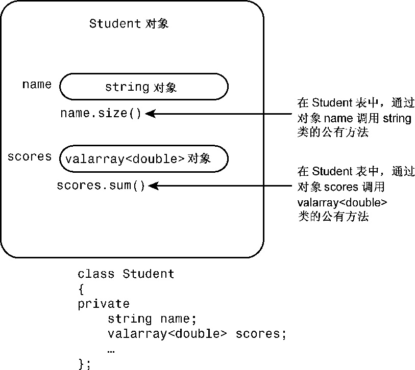
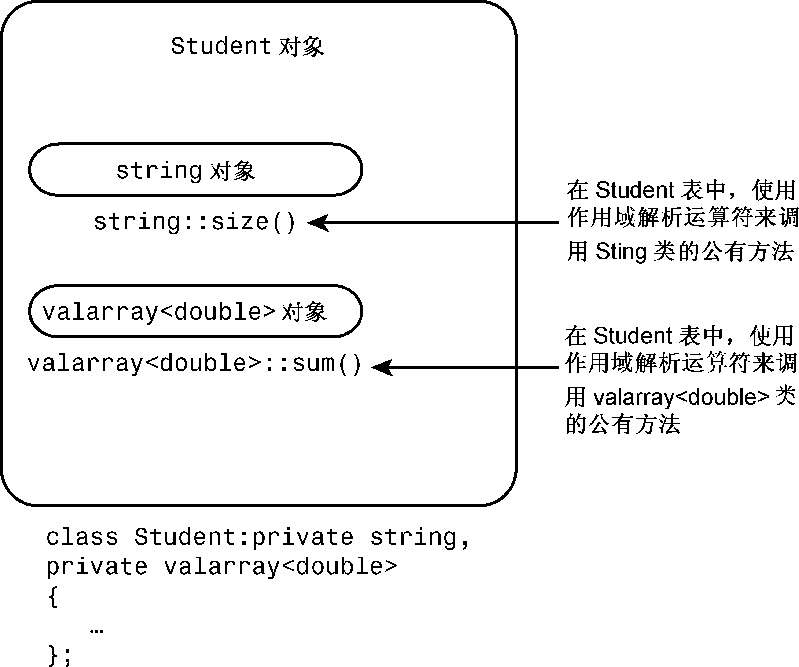
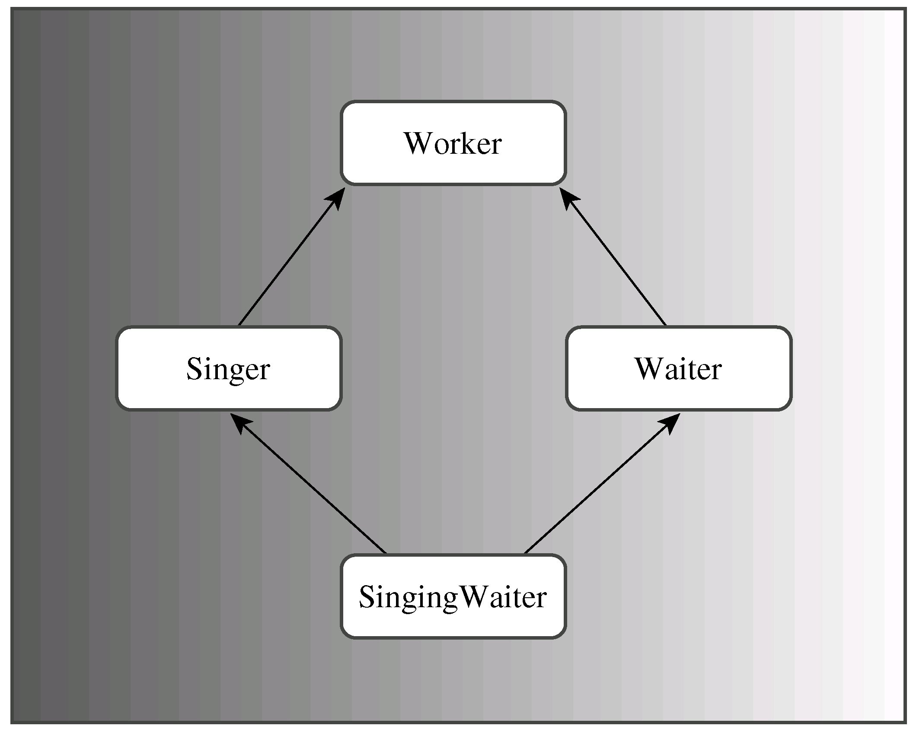
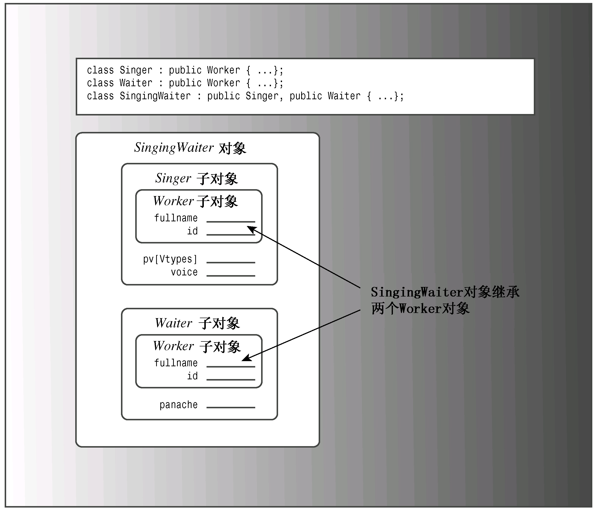
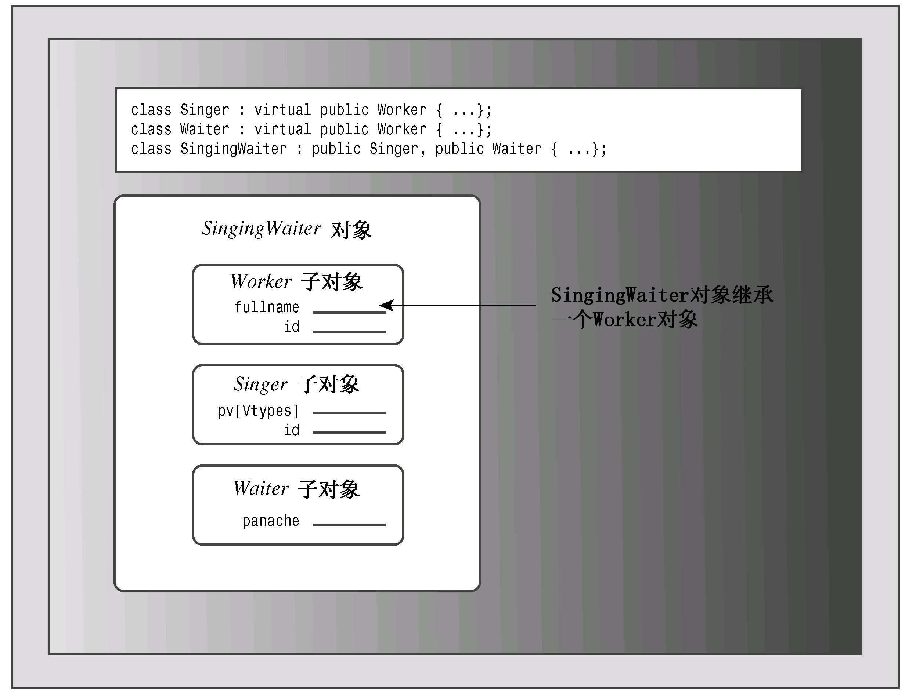
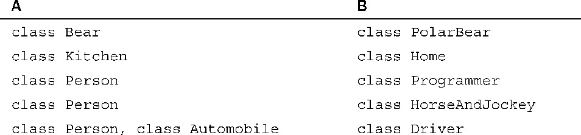

# 第14章 C++中的代码重用
本章内容包括：

* has-a关系。
* 包含对象成员的类。
* 模板类valarray。
* 私有和保护继承。
* 多重继承。
* 虚基类。
* 创建类模板。
* 使用类模板。
* 模板的具体化。

C++的一个主要目标是促进代码重用。公有继承是实现这种目标的机制之一，但并不是唯一的机制。本章将介绍其他方法，其中之一是使用这样的类成员：本身是另一个类的对象。这种方法称为包含（containment）、组合（composition）或层次化（layering）。另一种方法是使用私有或保护继承。通常，包含、私有继承和保护继承用于实现has-a关系，即新的类将包含另一个类的对象。例如，HomeTheater类可能包含一个BluRayPlayer对象。多重继承使得能够使用两个或更多的基类派生出新的类，将基类的功能组合在一起。

第10章介绍了函数模板，本章将介绍类模板——另一种重用代码的方法。类模板使我们能够使用通用术语定义类，然后使用模板来创建针对特定类型定义的特殊类。例如，可以定义一个通用的栈模板，然后使用该模板创建一个用于表示int值栈的类和一个用于表示double值栈的类，甚至可以创建一个这样的类，即用于表示由栈组成的栈。

## 14.1 包含对象成员的类
首先介绍包含对象成员的类。有一些类（如string类和第16章将介绍的标准C++类模板）为表示类中的组件提供了方便的途径。下面来看一个具体的例子。

学生是什么？入学者？参加研究的人？残酷现实社会的避难者？有姓名和一系列考试分数的人？显然，最后一个定义完全没有表示出人的特征，但非常适合于简单的计算机表示。因此，让我们根据该定义来开发Student类。

将学生简化成姓名和一组考试分数后，可以使用一个包含两个成员的类来表示它：一个成员用于表示姓名，另一个成员用于表示分数。对于姓名，可以使用字符数组来表示，但这将限制姓名的长度。当然，也可以使用char指针和动态内存分配，但正如第12章指出的，这将要求提供大量的支持代码。一种更好的方法是，使用一个由他人开发好的类的对象来表示。例如，可以使用一个String类（参见第12章）或标准C++string类的对象来表示姓名。较简单的选择是使用string类，因为C++库提供了这个类的所有实现代码，且其实现更完美。要使用String类，您必须在项目中包含实现文件string1.cpp。

对于考试分数，存在类似的选择。可以使用一个定长数组，这限制了数组的长度；可以使用动态内存分配并提供大量的支持代码；也可以设计一个使用动态内存分配的类来表示该数组；还可以在标准C++库中查找一个能够表示这种数据的类。

自己开发这样的类一点问题也没有。开发简单的版本并不那么难，因为double数组与char数组有很多相似之处，因此可以根据String类来设计表示double数组的类。事实上，本书以前的版本就这样做过。

当然，如果C++库提供了合适的类，实现起来将更简单。C++库确实提供了一个这样的类，它就是valarray。

### 14.1.1 valarray类简介
valarray类是由头文件valarray支持的。顾名思义，这个类用于处理数值（或具有类似特性的类），它支持诸如将数组中所有元素的值相加以及在数组中找出最大和最小的值等操作。valarray被定义为一个模板类，以便能够处理不同的数据类型。本章后面将介绍如何定义模板类，但就现在而言，您只需知道如何使用模板类即可。

模板特性意味着声明对象时，必须指定具体的数据类型。因此，使用valarray类来声明一个对象时，需要在标识符valarray后面加上一对尖括号，并在其中包含所需的数据类型：
```c++
valarray<int> q_values;     // an array of int
valarray<double> weights;   // an array of double
```

第4章介绍vector和array类时，您见过这种语法，它非常简单。这些类也可用于存储数字，但它们提供的算术支持没有valarray多。

这是您需要学习的唯一新语法，它非常简单。

类特性意味着要使用valarray对象，需要了解这个类的构造函数和其他类方法。下面是几个使用其构造函数的例子：
```c++
double gpa[5] = {3.1, 3.5, 3.8, 2.9, 3.3};
valarray<double> v1;          // an array of double, size 0
valarray<int> v2(8);          // an array of 8 int elements
valarray<int> v3(10, 8);      // an array of 8 int elements, each set to 10
valarray<double> v4(gpa, 4);  // an array of 4 elements
                              // initialized to the first 4 elements of gpa
```

从中可知，可以创建长度为零的空数组、指定长度的空数组、所有元素度被初始化为指定值的数组、用常规数组中的值进行初始化的数组。在C++11中，也可使用初始化列表：
```c++
valarray<int> v5 = {20, 32, 17, 9};       // C++11
```

下面是这个类的一些方法。

* operator ：让您能够访问各个元素。
* size( )：返回包含的元素数。
* sum( )：返回所有元素的总和。
* max( )：返回最大的元素。
* min( )：返回最小的元素。

还有很多其他的方法，其中的一些将在第16章介绍；但就这个例子而言，上述方法足够了。

### 14.1.2 Student类的设计
至此，已经确定了Student类的设计计划：使用一个string对象来表示姓名，使用一个valarray<double>来表示考试分数。那么如何设计呢？您可能想以公有的方式从这两个类派生出Student类，这将是多重公有继承，C++允许这样做，但在这里并不合适，因为学生与这些类之间的关系不是is-a模型。学生不是姓名，也不是一组考试成绩。这里的关系是has-a，学生有姓名，也有一组考试分数。通常，用于建立has-a关系的C++技术是组合（包含），即创建一个包含其他类对象的类。例如，可以将Student类声明为如下所示：
```c++
class Student
{
private:
    string name;              // use a string object for name
    valarray<double> scores;  // use a valarray<double> object for scores
    ...
};
```

同样，上述类将数据成员声明为私有的。这意味着Student类的成员函数可以使用string和valarray<double>类的公有接口来访问和修改name和scores对象，但在类的外面不能这样做，而只能通过Student类的公有接口访问name和score（请参见图14）。对于这种情况，通常被描述为Student类获得了其成员对象的实现，但没有继承接口。例如，Student对象使用string的实现，而不是char * name或char name [26]实现来保存姓名。但Student对象并不是天生就有使用函数string operator+=( )的能力。



> **接口和实现**
> 
> 使用公有继承时，类可以继承接口，可能还有实现（基类的纯虚函数提供接口，但不提供实现）。获得接口是is-a关系的组成部分。而使用组合，类可以获得实现，但不能获得接口。不继承接口是has-a关系的组成部分。

对于has-a关系来说，类对象不能自动获得被包含对象的接口是一件好事。例如，string类将+运算符重载为将两个字符串连接起来；但从概念上说，将两个Student对象串接起来是没有意义的。这也是这里不使用公有继承的原因之一。另一方面，被包含的类的接口部分对新类来说可能是有意义的。例如，可能希望使用string接口中的operator<( )方法将Student对象按姓名进行排序，为此可以定义Student::Operator<( )成员函数，它在内部使用函数string::Operator<( )。下面介绍一些细节。

### 14.1.3 Student类示例
现在需要提供Student类的定义，当然它应包含构造函数以及一些用作Student类接口的方法。程序清单14.1是Student类的定义，其中所有构造函数都被定义为内联的；它还提供了一些用于输入和输出的友元函数。

程序清单14.1 studentc.h
```c++
// studentc.h -- defining a Student class using containment
#ifndef STUDENTC_H_
#define STUDENTC_H_

#include <iostream>
#include <string>   
#include <valarray>
class Student
{   
private:
    typedef std::valarray<double> ArrayDb;
    std::string name;       // contained object
    ArrayDb scores;         // contained object
    // private method for scores output
    std::ostream & arr_out(std::ostream & os) const;
public:
    Student() : name("Null Student"), scores() {}
    explicit Student(const std::string & s)
        : name(s), scores() {}
    explicit Student(int n) : name("Nully"), scores(n) {}
    Student(const std::string & s, int n)
        : name(s), scores(n) {}
    Student(const std::string & s, const ArrayDb & a)
        : name(s), scores(a) {}
    Student(const char * str, const double * pd, int n)
        : name(str), scores(pd, n) {}
    ~Student() {}
    double Average() const;
    const std::string & Name() const;
    double & operator[](int i);
    double operator[](int i) const;
// friends
    // input
    friend std::istream & operator>>(std::istream & is,
                                     Student & stu);  // 1 word
    friend std::istream & getline(std::istream & is,
                                  Student & stu);     // 1 line
    // output
    friend std::ostream & operator<<(std::ostream & os,
                                     const Student & stu);
};

#endif
```

为简化表示，Student类的定义中包含下述typedef：
```c++
typedef std::valarray<double> ArrayDb;
```

这样，在以后的代码中便可以使用表示ArrayDb，而不是std::valarray<double>，因此类方法和友元函数可以使用ArrayDb类型。将该typedef放在类定义的私有部分意味着可以在Student类的实现中使用它，但在Student类外面不能使用。

请注意关键字explicit的用法：
```c++
explicit Student(const std::string & s)
    : name(s), scores() {}
explicit Student(int n) : name("Nully"), scores(n) {}
```

本书前面说过，可以用一个参数调用的构造函数将用作从参数类型到类类型的隐式转换函数；但这通常不是好主意。在上述第二个构造函数中，第一个参数表示数组的元素个数，而不是数组中的值，因此将一个构造函数用作int到Student的转换函数是没有意义的，所以使用explicit关闭隐式转换。如果省略该关键字，则可以编写如下所示的代码：
```c++
Student doh("Homer", 10);     // store "Homer", create array of 10 elements
doh = 5;                      // reset name to "Nully", reset to empty array of 5 elements
```

在这里，马虎的程序员键入了doh而不是doh[0]。如果构造函数省略了explicit，则将使用构造函数调用Student（5）将5转换为一个临时Student对象，并使用“Nully”来设置成员name的值。因此赋值操作将使用临时对象替换原来的doh值。使用了explicit后，编译器将认为上述赋值运算符是错误的。

> **C++和约束**
> 
> C++包含让程序员能够限制程序结构的特性——使用explicit防止单参数构造函数的隐式转换，使用const限制方法修改数据，等等。这样做的根本原因是：在编译阶段出现错误优于在运行阶段出现错误。

1. 初始化被包含的对象

构造函数全都使用您熟悉的成员初始化列表语法来初始化name和score成员对象。在前面的一些例子中，构造函数用这种语法来初始化内置类型的成员：
```c++
Queue::Queue(int qs) : qsize(qs) { ... }  // initialize qsize to qs
```

上述代码在成员初始化列表中使用的是数据成员的名称（qsize）。另外，前面介绍的示例中的构造函数还使用成员初始化列表初始化派生对象的基类部分：
```c++
hasDMA::hasDMA(const hasDMA & hs) : baseDMA(hs) { ... }
```

对于继承的对象，构造函数在成员初始化列表中使用类名来调用特定的基类构造函数。对于成员对象，构造函数则使用成员名。例如，请看程序清单14.3的最后一个构造函数：
```c++
Student(const char * str, const double * pd, int n) : name(str), scores(pd, n) { }
```

因为该构造函数初始化的是成员对象，而不是继承的对象，所以在初始化列表中使用的是成员名，而不是类名。初始化列表中的每一项都调用与之匹配的构造函数，即name(str)调用构造函数string(const char *)，scores(pd, n)调用构造函数ArrayDb(const double *, int)。

如果不使用初始化列表语法，情况将如何呢？C++要求在构建对象的其他部分之前，先构建继承对象的所有成员对象。因此，如果省略初始化列表，C++将使用成员对象所属类的默认构造函数。

> **初始化顺序**
> 
> 当初始化列表包含多个项目时，这些项目被初始化的顺序为它们被声明的顺序，而不是它们在初始化列表中的顺序。例如，假设Student构造函数如下：
> ```c++
> Student(const char * str, const double * pd, int) : scores(pd, n), name(str) { }
> ```
> 
> 则name成员仍将首先被初始化，因为在类定义中它首先被声明。对于这个例子来说，初始化顺序并不重要，但如果代码使用一个成员的值作为另一个成员的初始化表达式的一部分时，初始化顺序就非常重要了。

2. 使用被包含对象的接口

被包含对象的接口不是公有的，但可以在类方法中使用它。例如，下面的代码说明了如何定义一个返回学生平均分数的函数：
```c++
double Student::Average() const
{
    if (scores.size() > 0)
        return scores.sum()/scores.size();  
    else
        return 0;
}
```

上述代码定义了可由Student对象调用的方法，该方法内部使用了valarray的方法size( )和sum( )。这是因为scores是一个valarray对象，所以它可以调用valarray类的成员函数。总之，Student对象调用Student的方法，而后者使用被包含的valarray对象来调用valarray类的方法。

同样，可以定义一个使用string版本的<<运算符的友元函数：
```c++
// use string version of operator<<()
ostream & operator<<(ostream & os, const Student & stu)
{
    os << "Scores for " << stu.name << ":\n";
    ...
}
```

因为stu.name是一个string对象，所以它将调用函数operatot<<(ostream &, const string &)，该函数位于string类中。注意，operator<<(ostream & os, const Student & stu)必须是Student类的友元函数，这样才能访问name成员。另一种方法是，在该函数中使用公有方法Name( )，而不是私有数据成员name。

同样，该函数也可以使用valarray的<<实现来进行输出，不幸的是没有这样的实现；因此，Student类定义了一个私有辅助方法来处理这种任务：
```c++
// private method
ostream & Student::arr_out(ostream & os) const
{
    int i;
    int lim = scores.size();
    if (lim > 0)
    {
        for (i = 0; i < lim; i++)
        {
            os << scores[i] << " ";
            if (i % 5 == 4)
                os << endl;
        }
        if (i % 5 != 0)
            os << endl;
    }
    else
        os << " empty array ";
    return os; 
}
```

通过使用这样的辅助方法，可以将零乱的细节放在一个地方，使得友元函数的编码更为整洁：
```c++
// use string version of operator<<()
ostream & operator<<(ostream & os, const Student & stu)
{
    os << "Scores for " << stu.name << ":\n";
    stu.arr_out(os);  // use private method for scores
    return os;
}
```

辅助函数也可用作其他用户级输出函数的构建块——如果您选择提供这样的函数的话。

程序清单14.2是Student类的类方法文件，其中包含了让您能够使用[ ]运算符来访问Student对象中各项成绩的方法。

程序清单14.2 student.cpp
```c++
// studentc.cpp -- Student class using containment
#include "studentc.h"
using std::ostream;
using std::endl;
using std::istream;
using std::string;

//public methods
double Student::Average() const
{
    if (scores.size() > 0)
        return scores.sum()/scores.size();  
    else
        return 0;
}

const string & Student::Name() const
{
    return name;
}

double & Student::operator[](int i)
{
    return scores[i];         // use valarray<double>::operator[]()
}

double Student::operator[](int i) const
{
    return scores[i];
}

// private method
ostream & Student::arr_out(ostream & os) const
{
    int i;
    int lim = scores.size();
    if (lim > 0)
    {
        for (i = 0; i < lim; i++)
        {
            os << scores[i] << " ";
            if (i % 5 == 4)
                os << endl;
        }
        if (i % 5 != 0)
            os << endl;
    }
    else
        os << " empty array ";
    return os; 
}

// friends

// use string version of operator>>()
istream & operator>>(istream & is, Student & stu)
{
    is >> stu.name;
    return is; 
}

// use string friend getline(ostream &, const string &)
istream & getline(istream & is, Student & stu)
{
    getline(is, stu.name);
    return is;
}

// use string version of operator<<()
ostream & operator<<(ostream & os, const Student & stu)
{
    os << "Scores for " << stu.name << ":\n";
    stu.arr_out(os);  // use private method for scores
    return os;
}
```

除私有辅助方法外，程序清单14.2并没有新增多少代码。使用包含让您能够充分利用已有的代码。

3. 使用新的Student类

下面编写一个小程序来测试这个新的Student类。出于简化的目的，该程序将使用一个只包含3个Student对象的数组，其中每个对象保存5个考试成绩。另外还将使用一个不复杂的输入循环，该循环不验证输入，也不让用户中途退出。程序清单14.3列出了该测试程序，请务必将该程序与Student.cpp一起进行编译。

程序清单14.3 use_stuc.cpp
```c++
// use_stuc.cpp -- using a composite class
// compile with studentc.cpp
#include <iostream>
#include "studentc.h"
using std::cin;
using std::cout;
using std::endl;

void set(Student & sa, int n);

const int pupils = 3;
const int quizzes = 5;

int main()
{
    Student ada[pupils] = 
        {Student(quizzes), Student(quizzes), Student(quizzes)};

    int i;
    for (i = 0; i < pupils; ++i)
        set(ada[i], quizzes);
    cout << "\nStudent List:\n";
    for (i = 0; i < pupils; ++i)
        cout << ada[i].Name() << endl;
    cout << "\nResults:";
    for (i = 0; i < pupils; ++i)
    {
        cout << endl << ada[i];
        cout << "average: " << ada[i].Average() << endl;
    }
    cout << "Done.\n";
    // cin.get();

    return 0;
}

void set(Student & sa, int n)
{
    cout << "Please enter the student's name: ";
    getline(cin, sa);
    cout << "Please enter " << n << " quiz scores:\n";
    for (int i = 0; i < n; i++)
        cin >> sa[i];
    while (cin.get() != '\n')
        continue; 
}
```

下面是程序清单14.1～程序清单14.3组成的程序的运行情况：
```c++
Please enter the student's name: Gil Bayts
Please enter 5 quiz scores:
92 94 96 93 95
Please enter the student's name: Pat Roone
Please enter 5 quiz scores:
83 89 72 78 95
Please enter the student's name: Fleur O'Day
Please enter 5 quiz scores:
92 89 96 74 64

Student List:
Gil Bayts
Pat Roone
Fleur O'Day

Results:
Scores for Gil Bayts:
92 94 96 93 95
average: 94

Scores for Pat Roone:
83 89 72 78 95
average: 83.4

Scores for Fleur O'Day:
92 89 96 74 64
average: 83
Done.
```

## 14.2 私有继承
C++还有另一种实现has-a关系的途径——私有继承。使用私有继承，基类的公有成员和保护成员都将成为派生类的私有成员。这意味着基类方法将不会成为派生对象公有接口的一部分，但可以在派生类的成员函数中使用它们。

下面更深入地探讨接口问题。使用公有继承，基类的公有方法将成为派生类的公有方法。总之，派生类将继承基类的接口；这是is-a关系的一部分。使用私有继承，基类的公有方法将成为派生类的私有方法。总之，派生类不继承基类的接口。正如从被包含对象中看到的，这种不完全继承是has-a关系的一部分。

使用私有继承，类将继承实现。例如，如果从String类派生出Student类，后者将有一个String类组件，可用于保存字符串。另外，Student方法可以使用String方法来访问String组件。

包含将对象作为一个命名的成员对象添加到类中，而私有继承将对象作为一个未被命名的继承对象添加到类中。我们将使用术语子对象（subobject）来表示通过继承或包含添加的对象。

因此私有继承提供的特性与包含相同：获得实现，但不获得接口。所以，私有继承也可以用来实现has-a关系。接下来介绍如何使用私有继承来重新设计Student类。

### 14.2.1 Student类示例（新版本）
要进行私有继承，请使用关键字private而不是public来定义类（实际上，private是默认值，因此省略访问限定符也将导致私有继承）。Student类应从两个类派生而来，因此声明将列出这两个类：
```c++
class Student : private std::string, private std::valarray<double>
{
public:
    ...
};
```

使用多个基类的继承被称为多重继承（multiple inheritance，MI）。通常，MI尤其是公有MI将导致一些问题，必须使用额外的语法规则来解决它们，这将在本章后面介绍。但在这个示例中，MI不会导致问题。

新的Student类不需要私有数据，因为两个基类已经提供了所需的所有数据成员。包含版本提供了两个被显式命名的对象成员，而私有继承提供了两个无名称的子对象成员。这是这两种方法的第一个主要区别。

1. 初始化基类组件

隐式地继承组件而不是成员对象将影响代码的编写，因为再也不能使用name和scores来描述对象了，而必须使用用于公有继承的技术。例如，对于构造函数，包含将使这样的构造函数：
```c++
Student(const char * str, const double * pd, int n)
       : name(str), scores(pd, n) { }  // use object names for containment
```

对于继承类，新版本的构造函数将使用成员初始化列表语法，它使用类名而不是成员名来标识构造函数：
```c++
Student(const char * str, const double * pd, int n)
       : std::string(str), ArrayDb(pd, n) { }  // use class names for inheritance
```

在这里，ArrayDb是std::valarray<double>的别名。成员初始化列表使用std::string(str)，而不是name(str)。这是包含和私有继承之间的第二个主要区别。

程序清单14.4列出了新的类定义。唯一不同的地方是，省略了显式对象名称，并在内联构造函数中使用了类名，而不是成员名。

程序清单14.4 studenti.h
```c++
// studenti.h -- defining a Student class using private inheritance
#ifndef STUDENTC_H_
#define STUDENTC_H_

#include <iostream>
#include <valarray>
#include <string>   
class Student : private std::string, private std::valarray<double>
{   
private:
    typedef std::valarray<double> ArrayDb;
    // private method for scores output
    std::ostream & arr_out(std::ostream & os) const;
public:
    Student() : std::string("Null Student"), ArrayDb() {}
    explicit Student(const std::string & s)
            : std::string(s), ArrayDb() {}
    explicit Student(int n) : std::string("Nully"), ArrayDb(n) {}
    Student(const std::string & s, int n)
            : std::string(s), ArrayDb(n) {}
    Student(const std::string & s, const ArrayDb & a)
            : std::string(s), ArrayDb(a) {}
    Student(const char * str, const double * pd, int n)
            : std::string(str), ArrayDb(pd, n) {}
    ~Student() {}
    double Average() const;
    double & operator[](int i);
    double operator[](int i) const;
    const std::string & Name() const;
// friends
    // input
    friend std::istream & operator>>(std::istream & is,
                                     Student & stu);  // 1 word
    friend std::istream & getline(std::istream & is,
                                  Student & stu);     // 1 line
    // output
    friend std::ostream & operator<<(std::ostream & os,
                                     const Student & stu);
};

#endif
```

2. 访问基类的方法

使用私有继承时，只能在派生类的方法中使用基类的方法。但有时候可能希望基类工具是公有的。例如，在类声明中提出可以使用average( )函数。和包含一样，要实现这样的目的，可以在公有Student::average( )函数中使用私有Student::Average( )函数（参见图14.2）。包含使用对象来调用方法：
```c++
double Student::Average() const
{
    if (scores::size() > 0)
        return scores::sum()/scores::size();  
    else
        return 0;
}
```



然而，私有继承使得能够使用类名和作用域解析运算符来调用基类的方法：
```c++
double Student::Average() const
{
    if (ArrayDb::size() > 0)
        return ArrayDb::sum()/ArrayDb::size();  
    else
        return 0;
}
```

总之，使用包含时将使用对象名来调用方法，而使用私有继承时将使用类名和作用域解析运算符来调用方法。

3. 访问基类对象

使用作用域解析运算符可以访问基类的方法，但如果要使用基类对象本身，该如何做呢？例如，Student类的包含版本实现了Name( )方法，它返回string对象成员name；但使用私有继承时，该string对象没有名称。那么，Student类的代码如何访问内部的string对象呢？

答案是使用强制类型转换。由于Student类是从string类派生而来的，因此可以通过强制类型转换，将Student对象转换为string对象；结果为继承而来的string对象。本书前面介绍过，指针this指向用来调用方法的对象，因此*this为用来调用方法的对象，在这个例子中，为类型为Student的对象。为避免调用构造函数创建新的对象，可使用强制类型转换来创建一个引用：
```c++
const string & Student::Name() const
{
    return (const string &) *this;
}
```

上述方法返回一个引用，该引用指向用于调用该方法的Student对象中的继承而来的string对象。

4. 访问基类的友元函数

用类名显式地限定函数名不适合于友元函数，这是因为友元不属于类。然而，可以通过显式地转换为基类来调用正确的函数。例如，对于下面的友元函数定义：
```c++
ostream & operator<<(ostream & os, const Student & stu)
{
    os << "Scores for " << (const String &) stu << ":\n";
    ...
}
```

如果plato是一个Student对象，则下面的语句将调用上述函数，stu将是指向plato的引用，而os将是指向cout的引用：
```c++
cout << plato;
```

下面的代码：
```c++
os << "Scores for " << (const String &) stu << ":\n";
```

显式地将stu转换为string对象引用，进而调用函数。
```c++
operator<<(ostream &, const String &)
```

引用stu不会自动转换为string引用。根本原因在于，在私有继承中，在不进行显式类型转换的情况下，不能将指向派生类的引用或指针赋给基类引用或指针。

然而，即使这个例子使用的是公有继承，也必须使用显式类型转换。原因之一是，如果不使用类型转换，下述代码将与友元函数原型匹配，从而导致递归调用：
```c++
os << stu;
```

另一个原因是，由于这个类使用的是多重继承，编译器将无法确定应转换成哪个基类，如果两个基类都提供了函数operator<<( )。程序清单14.5列出了除内联函数之外的所有Student类方法。

程序清单14.5 student.cpp
```c++
// studenti.cpp -- Student class using private inheritance
#include "studenti.h"
using std::ostream;
using std::endl;
using std::istream;
using std::string;

// public methods
double Student::Average() const
{
    if (ArrayDb::size() > 0)
        return ArrayDb::sum()/ArrayDb::size();  
    else
        return 0;
}

const string & Student::Name() const
{
    return (const string &) *this;
}

double & Student::operator[](int i)
{
    return ArrayDb::operator[](i);         // use ArrayDb::operator[]()
}

double Student::operator[](int i) const
{
    return ArrayDb::operator[](i);
}

// private method
ostream & Student::arr_out(ostream & os) const
{
    int i;
    int lim = ArrayDb::size();
    if (lim > 0)
    {
        for (i = 0; i < lim; i++)
        {
            os << ArrayDb::operator[](i) << " ";
            if (i % 5 == 4)
                os << endl;
        }
        if (i % 5 != 0)
            os << endl;
    }
    else
        os << " empty array ";
    return os; 
}

// friends
// use String version of operator>>()
istream & operator>>(istream & is, Student & stu)
{
    is >> (string &)stu;
    return is; 
}

// use string friend getline(ostream &, const string &)
istream & getline(istream & is, Student & stu)
{
    getline(is, (string &)stu);
    return is;
}

// use string version of operator<<()
ostream & operator<<(ostream & os, const Student & stu)
{
    os << "Scores for " << (const string &) stu  << ":\n";
    stu.arr_out(os);  // use private method for scores
    return os;
}
```

同样，由于这个示例也重用了string和valarray类的代码，因此除私有辅助方法外，它包含的新代码很少。

5. 使用修改后的Student类

接下来也需要测试这个新类。注意到两个版本的Student类的公有接口完全相同，因此可以使用同一个程序测试它们。唯一不同的是，应包含studenti.h而不是studentc.h，应使用studenti.cpp而不是studentc.cpp来链接程序。程序清单14.6列出列该程序，请将其与studenti.cpp一起编译。

程序清单14.6 use_stui.cpp
```c++
// use_stui.cpp -- using a class with private inheritance
// compile with studenti.cpp
#include <iostream>
#include "studenti.h"
using std::cin;
using std::cout;
using std::endl;

void set(Student & sa, int n);

const int pupils = 3;
const int quizzes = 5;

int main()
{
    Student ada[pupils] = 
        {Student(quizzes), Student(quizzes), Student(quizzes)};

    int i;
    for (i = 0; i < pupils; i++)
        set(ada[i], quizzes);
    cout << "\nStudent List:\n";
    for (i = 0; i < pupils; ++i)
        cout << ada[i].Name() << endl;
    cout << "\nResults:";
    for (i = 0; i < pupils; i++)
    {
        cout << endl << ada[i];
        cout << "average: " << ada[i].Average() << endl;
    }
    cout << "Done.\n";
    // cin.get();
    return 0;
}

void set(Student & sa, int n)
{
    cout << "Please enter the student's name: ";
    getline(cin, sa);
    cout << "Please enter " << n << " quiz scores:\n";
    for (int i = 0; i < n; i++)
        cin >> sa[i];
    while (cin.get() != '\n')
        continue; 
}
```

下面是该程序的运行情况：
```c++
Please enter the student's name: Gil Bayts
Please enter 5 quiz scores:
92 94 96 93 95
Please enter the student's name: Pat Roone
Please enter 5 quiz scores:
83 89 72 78 95
Please enter the student's name: Fleur O'Day
Please enter 5 quiz scores:
92 89 96 74 64

Student List:
Gil Bayts
Pat Roone
Fleur O'Day

Results:
Scores for Gil Bayts:
92 94 96 93 95
average: 94

Scores for Pat Roone:
83 89 72 78 95
average: 83.4

Scores for Fleur O'Day:
92 89 96 74 64
average: 83
Done.
```

输入与前一个测试程序相同，输出也相同。

### 14.2.2 使用包含还是私有继承
由于既可以使用包含，也可以使用私有继承来建立has-a关系，那么应使用种方式呢？大多数C++程序员倾向于使用包含。首先，它易于理解。类声明中包含表示被包含类的显式命名对象，代码可以通过名称引用这些对象，而使用继承将使关系更抽象。其次，继承会引起很多问题，尤其从多个基类继承时，可能必须处理很多问题，如包含同名方法的独立的基类或共享祖先的独立基类。总之，使用包含不太可能遇到这样的麻烦。另外，包含能够包括多个同类的子对象。如果某个类需要3个string对象，可以使用包含声明3个独立的string成员。而继承则只能使用一个这样的对象（当对象都没有名称时，将难以区分）。

然而，私有继承所提供的特性确实比包含多。例如，假设类包含保护成员（可以是数据成员，也可以是成员函数），则这样的成员在派生类中是可用的，但在继承层次结构外是不可用的。如果使用组合将这样的类包含在另一个类中，则后者将不是派生类，而是位于继承层次结构之外，因此不能访问保护成员。但通过继承得到的将是派生类，因此它能够访问保护成员。

另一种需要使用私有继承的情况是需要重新定义虚函数。派生类可以重新定义虚函数，但包含类不能。使用私有继承，重新定义的函数将只能在类中使用，而不是公有的。

> **提示：**
> 
> 通常，应使用包含来建立has-a关系；如果新类需要访问原有类的保护成员，或需要重新定义虚函数，则应使用私有继承。

### 14.2.3 保护继承
保护继承是私有继承的变体。保护继承在列出基类时使用关键字protected：
```c++
class Student : protected std::string,
                protected std::valarray<double>
{ ... };
```

使用保护继承时，基类的公有成员和保护成员都将成为派生类的保护成员。和私有私有继承一样，基类的接口在派生类中也是可用的，但在继承层次结构之外是不可用的。当从派生类派生出另一个类时，私有继承和保护继承之间的主要区别便呈现出来了。使用私有继承时，第三代类将不能使用基类的接口，这是因为基类的公有方法在派生类中将变成私有方法；使用保护继承时，基类的公有方法在第二代中将变成受保护的，因此第三代派生类可以使用它们。

表14.1总结了公有、私有和保护继承。隐式向上转换（implicit upcasting）意味着无需进行显式类型转换，就可以将基类指针或引用指向派生类对象。

**表14.1 各种继承方式**

| 特征 | 公有继承 | 保护继承 | 私有继承 |
| :--- | :--- | :--- | :--- |
| 公有成员变成 | 派生类的公有成员 | 派生类的保护成员 | 派生类的私有成员 |
| 保护成员变成 | 派生类的保护成员 | 派生类的保护成员 | 派生类的私有成员 |
| 私有成员变成 | 只能通过基类接口访问 | 只能通过基类接口访问 | 只能通过基类接口访问 |
| 能否隐式向上转换 | 是 | 是（但只能在派生类中） | 否 |

### 14.2.4 使用using重新定义访问权限
使用保护派生或私有派生时，基类的公有成员将成为保护成员或私有成员。假设要让基类的方法在派生类外面可用，方法之一是定义一个使用该基类方法的派生类方法。例如，假设希望Student类能够使用valarray类的sum( )方法，可以在Student类的声明中声明一个sum( )方法，然后像下面这样定义该方法：
```c++
double Student::sum() const   // public Student method
{
    return std::valarray<double>::sum();    // use privately-inherited method
}
```

这样Student对象便能够调用Student::sum( )，后者进而将valarray<double>::sum( )方法应用于被包含的valarray对象（如果ArrayDb typedef在作用域中，也可以使用ArrayDb而不是std::valarray<double>）。

另一种方法是，将函数调用包装在另一个函数调用中，即使用一个using声明（就像名称空间那样）来指出派生类可以使用特定的基类成员，即使采用的是私有派生。例如，假设希望通过Student类能够使用valarray的方法min( )和max( )，可以在studenti.h的公有部分加入如下using声明：
```c++
class Student : private std::string, private std::valarray<double>
{
    ...
public:
    using std::valarray<double>::min;
    using std::valarray<double>::max;
    ...
};
```

上述using声明使得valarray<double>::min( )和valarray<double>::max( )可用，就像它们是Student的公有方法一样：
```c++
cout << "high score: " << ada[i].max() << endl;
```

注意，using声明只使用成员名——没有圆括号、函数特征标和返回类型。例如，为使Student类可以使用valarray的operator 方法，只需在Student类声明的公有部分包含下面的using声明：
```c++
using std::valarray<double>::operator[];
```

这将使两个版本（const和非const）都可用。这样，便可以删除Student::operator[] ( )的原型和定义。using声明只适用于继承，而不适用于包含。

有一种老式方式可用于在私有派生类中重新声明基类方法，即将方法名放在派生类的公有部分，如下所示：
```c++
class Student : private std::string, private std::valarray<double>
{
public:
    std::valarray<double>::operator[];  // redeclare as public, just use name
    ...
};
```

这看起来像不包含关键字using的using声明。这种方法已被摒弃，即将停止使用。因此，如果编译器支持using声明，应使用它来使派生类可以使用私有基类中的方法。

## 14.3 多重继承
MI描述的是有多个直接基类的类。与单继承一样，公有MI表示的也是is-a关系。例如，可以从Waiter类和Singer类派生出SingingWaiter类：
```c++
class SingingWaiter : public Waiter, public Singer { ... };
```

请注意，必须使用关键字public来限定每一个基类。这是因为，除非特别指出，否则编译器将认为是私有派生：
```c++
class SingingWaiter : public Waiter, Singer { ... };    // Singer is a private base
```

正如本章前面讨论的，私有MI和保护MI可以表示has-a关系。Student类的studenti.h实现就是一个这样的示例。下面将重点介绍公有MI。

MI可能会给程序员带来很多新问题。其中两个主要的问题是：从两个不同的基类继承同名方法；从两个或更多相关基类那里继承同一个类的多个实例。为解决这些问题，需要使用一些新规则和不同的语法。因此，与使用单继承相比，使用MI更困难，也更容易出现问题。由于这个原因，很多C++用户强烈反对使用MI，一些人甚至希望删除MI；而喜欢MI的人则认为，对一些特殊的工程来说，MI很有用，甚至是必不可少的；也有一些人建议谨慎、适度地使用MI。

下面来看一个例子，并介绍有哪些问题以及如何解决它们。要使用MI，需要几个类。我们将定义一个抽象基类Worker，并使用它派生出Waiter类和Singer类。然后，便可以使用MI从Waiter类和Singer类派生出SingingWaiter类（参见图14.3）。这里使用两个独立的派生来使基类（Worker）被继承，这将导致MI的大多数麻烦。首先声明Worker、Waiter和Singer类，如程序清单14.7所示。



程序清单14.7 Worker0.h
```c++
// worker0.h  -- working classes
#ifndef WORKER0_H_
#define WORKER0_H_

#include <string>

class Worker   // an abstract base class
{
private:
    std::string fullname;
    long id;
public:
    Worker() : fullname("no one"), id(0L) {}
    Worker(const std::string & s, long n)
            : fullname(s), id(n) {}
    virtual ~Worker() = 0;   // pure virtual destructor
    virtual void Set();
    virtual void Show() const;
};

class Waiter : public Worker
{
private:
    int panache;
public:
    Waiter() : Worker(), panache(0) {}
    Waiter(const std::string & s, long n, int p = 0)
            : Worker(s, n), panache(p) {}
    Waiter(const Worker & wk, int p = 0)
            : Worker(wk), panache(p) {}
    void Set();
    void Show() const;
};

class Singer : public Worker
{
protected:
    enum {other, alto, contralto, soprano,
                    bass, baritone, tenor};
    enum {Vtypes = 7};
private:
    static char *pv[Vtypes];    // string equivs of voice types
    int voice;
public:
    Singer() : Worker(), voice(other) {}
    Singer(const std::string & s, long n, int v = other)
            : Worker(s, n), voice(v) {}
    Singer(const Worker & wk, int v = other)
            : Worker(wk), voice(v) {}
    void Set();
    void Show() const;
};

#endif
```

程序清单14.7的类声明中包含一些表示声音类型的内部常量。一个枚举用符号常量alto、contralto等表示声音类型，静态数组pv存储了指向相应C-风格字符串的指针，程序清单14.8初始化了该数组，并提供了方法的定义。

程序清单14.8 worker0.cpp
```c++
// worker0.cpp -- working class methods
#include "worker0.h"
#include <iostream>
using std::cout;
using std::cin;
using std::endl;
// Worker methods

// must implement virtual destructor, even if pure
Worker::~Worker() {}

void Worker::Set()
{
    cout << "Enter worker's name: ";
    getline(cin, fullname);
    cout << "Enter worker's ID: ";
    cin >> id;
    while (cin.get() != '\n')
        continue;
}

void Worker::Show() const
{
    cout << "Name: " << fullname << "\n";
    cout << "Employee ID: " << id << "\n";
}

// Waiter methods
void Waiter::Set()
{
    Worker::Set();
    cout << "Enter waiter's panache rating: ";
    cin >> panache;
    while (cin.get() != '\n')
        continue;
}

void Waiter::Show() const
{
    cout << "Category: waiter\n";
    Worker::Show();
    cout << "Panache rating: " << panache << "\n";
}

// Singer methods

char * Singer::pv[] = {"other", "alto", "contralto",
            "soprano", "bass", "baritone", "tenor"};

void Singer::Set()
{
    Worker::Set();
    cout << "Enter number for singer's vocal range:\n";
    int i;
    for (i = 0; i < Vtypes; i++)
    {
        cout << i << ": " << pv[i] << "   ";
        if ( i % 4 == 3)
            cout << endl;
    }
    if (i % 4 != 0)
        cout << endl;
    while (cin >>  voice && (voice < 0 || voice >= Vtypes) )
        cout << "Please enter a value >= 0 and < " << Vtypes << endl;
    while (cin.get() != '\n')
        continue;
}

void Singer::Show() const
{
    cout << "Category: singer\n";
    Worker::Show();
    cout << "Vocal range: " << pv[voice] << endl;
}
```

程序清单14.9是一个简短的程序，它使用一个多态指针数组对这些类进行了测试。

程序清单14.9 worktest.cpp
```c++
// worktest.cpp -- test worker class hierarchy
#include <iostream>
#include "worker0.h"
const int LIM = 4;
int main()
{
    Waiter bob("Bob Apple", 314L, 5);
    Singer bev("Beverly Hills", 522L, 3);
    Waiter w_temp;
    Singer s_temp;

    Worker * pw[LIM] = {&bob, &bev, &w_temp, &s_temp};

    int i;
    for (i = 2; i < LIM; i++)
        pw[i]->Set();
    for (i = 0; i < LIM; i++)
    {
        pw[i]->Show();
        std::cout << std::endl;
    }
    // std::cin.get();
    return 0;
}
```

下面是程序清单14.7～程序清单14.9组成的程序的输出：
```c++
Enter worker's name: Waldo Dropmaster
Enter worker's ID: 442
Enter waiter's panache rating: 3
Enter worker's name: Sylvie Sirenne
Enter worker's ID: 555
Enter number for singer's vocal range:
0: other   1: alto   2: contralto   3: soprano
4: bass   5: baritone   6: tenor
3
Category: waiter
Name: Bob Apple
Employee ID: 314
Panache rating: 5

Category: singer
Name: Beverly Hills
Employee ID: 522
Vocal range: soprano

Category: waiter
Name: Waldo Dropmaster
Employee ID: 442
Panache rating: 3

Category: singer
Name: Sylvie Sirenne
Employee ID: 555
Vocal range: soprano
```

这种设计看起来是可行的：使用Waiter指针来调用Waiter::Show( )和Waiter::Set( )；使用Singer指针来调用Singer::Show( )和Singer::Set( )。然后，如果添加一个从Singer和Waiter类派生出的SingingWaiter类后，将带来一些问题。具体地说，将出现以下问题。

* 有多少Worker？
* 哪个方法？

### 14.3.1 有多少Worker
假设首先从Singer和Waiter公有派生出SingingWaiter：
```c++
class SingingWaiter : public Singer, public Waiter { ... };
```

因为Singer和Waiter都继承了一个Worker组件，因此SingingWaiter将包含两个Worker组件（参见图14.4）。

正如预期的，这将引起问题。例如，通常可以将派生类对象的地址赋给基类指针，但现在将出现二义性：
```c++
SingingWaiter ed;
Waiter * pw = &ed;    // ambiguous
```

通常，这种赋值将把基类指针设置为派生对象中的基类对象的地址。但ed中包含两个Worker对象，有两个地址可供选择，所以应使用类型转换来指定对象：
```c++
Waiter * pw1 = (Waiter *) &ed;    // the Waiter in Waiter
Waiter * pw2 = (Singer *) &ed;    // the Waiter in Singer
```



这将使得使用基类指针来引用不同的对象（多态性）复杂化。

包含两个Worker对象拷贝还会导致其他的问题。然而，真正的问题是：为什么需要Worker对象的两个拷贝？唱歌的侍者和其他Worker对象一样，也应只包含一个姓名和一个ID。C++引入多重继承的同时，引入了一种新技术——虚基类（virtual base class），使MI成为可能。

1. 虚基类

虚基类使得从多个类（它们的基类相同）派生出的对象只继承一个基类对象。例如，通过在类声明中使用关键字virtual，可以使Worker被用作Singer和Waiter的虚基类（virtual和public的次序无关紧要）：
```c++
class Singer : virtual public Worker { ... };
class Waiter : public virtual Worker { ... };
```

然后，可以将SingingWaiter类定义为：
```c++
class SingingWaiter : public Singer, public Waiter { ... };
```

现在，SingingWaiter对象将只包含Worker对象的一个副本。从本质上说，继承的Singer和Waiter对象共享一个Worker对象，而不是各自引入自己的Worker对象副本（请参见图14.5）。因为SingingWaiter现在只包含了一个Worker子对象，所以可以使用多态。

您可能会有这样的疑问：

* 为什么使用术语“虚”？
* 为什么不抛弃将基类声明为虚的这种方式，而使虚行为成为多MI的准则呢？
* 是否存在麻烦呢？

首先，为什么使用术语虚？毕竟，在虚函数和虚基类之间并不存在明显的联系。C++用户强烈反对引入新的关键字，因为这将给他们带来很大的压力。例如，如果新关键字与重要程序中的重要函数或变量的名称相同，这将非常麻烦。因此，C++对这种新特性也使用关键字virtual——有点像关键字重载。



其次，为什么不抛弃将基类声明为虚的这种方式，而使虚行为成为MI的准则呢？第一，在一些情况下，可能需要基类的多个拷贝；第二，将基类作为虚的要求程序完成额外的计算，为不需要的工具付出代价是不应当的；第三，这样做有其缺点，将在下一段介绍。

最后，是否存在麻烦？是的。为使虚基类能够工作，需要对C++规则进行调整，必须以不同的方式编写一些代码。另外，使用虚基类还可能需要修改已有的代码。例如，将SingingWaiter类添加到Worker集成层次中时，需要在Singer和Waiter类中添加关键字virtual。

2. 新的构造函数规则

使用虚基类时，需要对类构造函数采用一种新的方法。对于非虚基类，唯一可以出现在初始化列表中的构造函数是即时基类构造函数。但这些构造函数可能需要将信息传递给其基类。例如，可能有下面一组构造函数：
```c++
class A
{
    int a;
public:
    A(int n = 0) : a(n) { }
    ...
};
class B : public A
{
    int b;
public:
    B(int m = 0, int n = 0) : A(n), b(m) { }
    ...
};
class C : public B
{
    int c;
public:
    C(int q = 0, int m = 0, int n = 0) : B(m, n), c(q) { }
    ...
};
```

C类的构造函数只能调用B类的构造函数，而B类的构造函数只能调用A类的构造函数。这里，C类的构造函数使用值q，并将值m和n传递给B类的构造函数；而B类的构造函数使用值m，并将值n传递给A类的构造函数。

如果Worker是虚基类，则这种信息自动传递将不起作用。例如，对于下面的MI构造函数：
```c++
SingingWaiter(const Worker & wk, int p = 0, int v = Singer::other)
                : Waiter(wk, p), Singer(wk, v) { } // flawed
```

存在的问题是，自动传递信息时，将通过2条不同的途径（Waiter和Singer）将wk传递给Worker对象。为避免这种冲突，C++在基类是虚的时，禁止信息通过中间类自动传递给基类。因此，上述构造函数将初始化成员panache和voice，但wk参数中的信息将不会传递给子对象Waiter。然而，编译器必须在构造派生对象之前构造基类对象组件；在上述情况下，编译器将使用Worker的默认构造函数。

如果不希望默认构造函数来构造虚基类对象，则需要显式地调用所需的基类构造函数。因此，构造函数应该是这样：
```c++
SingingWaiter(const Worker & wk, int p = 0, int v = Singer::other)
                : Waiter(wk), Waiter(wk, p), Singer(wk, v) { }
```

上述代码将显式地调用构造函数worker（const Worker &）。请注意，这种用法是合法的，对于虚基类，必须这样做；但对于非虚基类，则是非法的。

> **警告：**
> 
> 如果类有间接虚基类，则除非只需使用该虚基类的默认构造函数，否则必须显式地调用该虚基类的某个构造函数。

### 14.3.2 哪个方法
除了修改类构造函数规则外，MI通常还要求调整其他代码。假设要在SingingWaiter类中扩展Show( )方法。因为SingingWaiter对象没有新的数据成员，所以可能会认为它只需使用继承的方法即可。这引出了第一个问题。假设没有在SingingWaiter类中重新定义Show( )方法，并试图使用SingingWaiter对象调用继承的Show( )方法：
```c++
SingingWaiter newhire("Elise Hawks", 2005, 6, soprano);
newhire.Show();     // ambiguous
```

对于单继承，如果没有重新定义Show( )，则将使用最近祖先中的定义。而在多重继承中，每个直接祖先都有一个Show( )函数，这使得上述调用是二义性的。

> **警告：**
> 
> 多重继承可能导致函数调用的二义性。例如，BadDude类可能从Gunslinger类和PokerPlayer类那里继承两个完全不同的Draw( )方法。

可以使用作用域解析运算符来澄清编程者的意图：
```c++
SingingWaiter newhire("Elise Hawks", 2005, 6, soprano);
newhire.Singer::Show();     // use Singer version
```

然而，更好的方法是在SingingWaiter中重新定义Show( )，并指出要使用哪个Show( )。例如，如果希望SingingWaiter对象使用Singer版本的Show( )，则可以这样做：
```c++
void SingingWaiter::Show()
{
    Singer::Show();
}
```

对于单继承来说，让派生方法调用基类的方法是可以的。例如，假设HeadWaiter类是从Waiter类派生而来的，则可以使用下面的定义序列，其中每个派生类使用其基类显示信息，并添加自己的信息：
```c++
void Worker::Show() const
{
    cout << "Name: " << fullname << "\n";
    cout << "Employee ID: " << id << "\n";
}

void Waiter::Show() const
{
    Waiter::Show();
    cout << "Panache rating: " << panache << "\n";
}

void HeadWaiter::Show() const
{
    Waiter::Show();
    cout << "Presence rating: " << presence << "\n";
}
```

然而，这种递增的方式对SingingWaiter示例无效。下面的方法将无效，因为它忽略了Waiter组件：
```c++
void SingingWaiter::Show()
{
    Singer::Show();
}
```

可以通过同时调用Waiter版本的Show( )来补救：
```c++
void SingingWaiter::Show()
{
    Singer::Show();
    Waiter::Show();
}
```

然而，这将显示姓名和ID两次，因为Singer::Show( )和Waiter::Show( )都调用了Worker::Show( )。

如果解决呢？一种办法是使用模块化方式，而不是递增方式，即提供一个只显示Worker组件的方法和一个只显示Waiter组件或Singer组件（而不是Waiter和Worker组件）的方法。然后，在SingingWaiter::Show( )方法中将组件组合起来。例如，可以这样做：
```c++
void Worker::Data() const
{
    cout << "Name: " << fullname << "\n";
    cout << "Employee ID: " << id << "\n";
}

void Waiter::Data() const
{
    cout << "Panache rating: " << panache << "\n";
}

void Singer::Data() const
{
    cout << "Vocal range: " << pv[voice] << "\n";
}

void SingingWaiter::Data() const
{
    Singer::Data();
    Waiter::Data();
}

void SingingWaiter::Show() const
{
    cout << "Category : singing waiter\n";
    Worker::Data();
    Data();
}
```

与此相似，其他Show( )方法可以组合适当的Data( )组件。

采用这种方式，对象仍可使用Show( )方法。而Data( )方法只在类内部可用，作为协助公有接口的辅助方法。然而，使Data( )方法成为私有的将阻止Waiter中的代码使用Worker::Data( )，这正是保护访问类的用武之地。如果Data( )方法是保护的，则只能在继承层次结构中的类中使用它，在其他地方则不能使用。

另一种办法是将所有的数据组件都设置为保护的，而不是私有的，不过使用保护方法（而不是保护数据）将可以更严格地控制对数据的访问。

Set( )方法取得数据，以设置对象值，该方法也有类似的问题。例如，SingingWaiter::Set( )应请求Worker信息一次，而不是两次。对此，可以使用前面的解决方法。可以提供一个受保护的Get( )方法，该方法只请求一个类的信息，然后将使用Get( )方法作为构造块的Set( )方法集合起来。

总之，在祖先相同时，使用MI必须引入虚基类，并修改构造函数初始化列表的规则。另外，如果在编写这些类时没有考虑到MI，则还可能需要重新编写它们。程序清单14.10列出了修改后的类声明，程序清单14.11列出实现。

程序清单14.10 workermi.h
```c++
// workermi.h  -- working classes with MI
#ifndef WORKERMI_H_
#define WORKERMI_H_

#include <string>

class Worker   // an abstract base class
{
private:
    std::string fullname;
    long id;
protected:
    virtual void Data() const;
    virtual void Get();
public:
    Worker() : fullname("no one"), id(0L) {}
    Worker(const std::string & s, long n)
            : fullname(s), id(n) {}
    virtual ~Worker() = 0; // pure virtual function
    virtual void Set() = 0;
    virtual void Show() const = 0;
};

class Waiter : virtual public Worker
{
private:
    int panache;
protected:
    void Data() const;
    void Get();
public:
    Waiter() : Worker(), panache(0) {}
    Waiter(const std::string & s, long n, int p = 0)
            : Worker(s, n), panache(p) {}
    Waiter(const Worker & wk, int p = 0)
            : Worker(wk), panache(p) {}
    void Set();
    void Show() const;
};

class Singer : virtual public Worker
{
protected:
enum {other, alto, contralto, soprano,
                    bass, baritone, tenor};
    enum {Vtypes = 7};
    void Data() const;
    void Get();
private:
    static char *pv[Vtypes];    // string equivs of voice types
    int voice;
public:
    Singer() : Worker(), voice(other) {}
    Singer(const std::string & s, long n, int v = other)
            : Worker(s, n), voice(v) {}
    Singer(const Worker & wk, int v = other)
            : Worker(wk), voice(v) {}
    void Set();
    void Show() const;
};

// multiple inheritance
class SingingWaiter : public Singer, public Waiter
{
protected:
    void Data() const;
    void Get();
public:
    SingingWaiter()  {}
    SingingWaiter(const std::string & s, long n, int p = 0,
                            int v = other)
            : Worker(s,n), Waiter(s, n, p), Singer(s, n, v) {}
    SingingWaiter(const Worker & wk, int p = 0, int v = other)
            : Worker(wk), Waiter(wk,p), Singer(wk,v) {}
    SingingWaiter(const Waiter & wt, int v = other)
            : Worker(wt),Waiter(wt), Singer(wt,v) {}
    SingingWaiter(const Singer & wt, int p = 0)
            : Worker(wt),Waiter(wt,p), Singer(wt) {}
    void Set();
    void Show() const; 
};

#endif
```

程序清单14.11 workermi.cpp
```c++
// workermi.cpp -- working class methods with MI
#include "workermi.h"
#include <iostream>
using std::cout;
using std::cin;
using std::endl;
// Worker methods
Worker::~Worker() { }

// protected methods
void Worker::Data() const
{
    cout << "Name: " << fullname << endl;
    cout << "Employee ID: " << id << endl;
}

void Worker::Get()
{
    getline(cin, fullname);
    cout << "Enter worker's ID: ";
    cin >> id;
    while (cin.get() != '\n')
        continue;
}

// Waiter methods
void Waiter::Set()
{
    cout << "Enter waiter's name: ";
    Worker::Get();
    Get();
}

void Waiter::Show() const
{
    cout << "Category: waiter\n";
    Worker::Data();
    Data();
}

// protected methods
void Waiter::Data() const
{
    cout << "Panache rating: " << panache << endl;
}

void Waiter::Get()
{
    cout << "Enter waiter's panache rating: ";
    cin >> panache;
    while (cin.get() != '\n')
        continue;
}

// Singer methods

char * Singer::pv[Singer::Vtypes] = {"other", "alto", "contralto",
            "soprano", "bass", "baritone", "tenor"};

void Singer::Set()
{
    cout << "Enter singer's name: ";
    Worker::Get();
    Get();
}

void Singer::Show() const
{
    cout << "Category: singer\n";
    Worker::Data();
    Data();
}

// protected methods
void Singer::Data() const
{
    cout << "Vocal range: " << pv[voice] << endl;
}

void Singer::Get()
{
    cout << "Enter number for singer's vocal range:\n";
    int i;
    for (i = 0; i < Vtypes; i++)
    {
        cout << i << ": " << pv[i] << "   ";
        if ( i % 4 == 3)
            cout << endl;
    }
    if (i % 4 != 0)
        cout << '\n';
    while (cin >>  voice && (voice < 0 || voice >= Vtypes) )
        cout << "Please enter a value >= 0 and < " << Vtypes << endl;
    while (cin.get() != '\n')
        continue;
}

// SingingWaiter methods
void SingingWaiter::Data() const
{
    Singer::Data();
    Waiter::Data();
}

void SingingWaiter::Get()
{
    Waiter::Get();
    Singer::Get();
}

void SingingWaiter::Set()
{
    cout << "Enter singing waiter's name: ";
    Worker::Get();
    Get();
}

void SingingWaiter::Show() const
{
    cout << "Category: singing waiter\n";
    Worker::Data();
    Data();
}
```

当然，好奇心要求我们测试这些类，程序清单14.12提供了测试代码。注意，该程序使用了多态属性，将各种类的地址赋给基类指针。另外，该程序还在下面的检测中使用了C-风格字符串库函数strchr( )：
```c++
while(strchr("wstq", choice) == NULL)
```

该函数返回参数choice指定的字符在字符串“wstq”中第一次出现的地址，如果没有这样的字符，则返回NULL指针。使用这种检测比使用if语句将choice指定的字符同每个字符进行比较简单。

请将程序清单14.12与workermi.cpp一起编译。

程序清单14.12 workmi.cpp
```c++
// workmi.cpp -- multiple inheritance
// compile with workermi.cpp
#include <iostream>
#include <cstring>
#include "workermi.h"
const int SIZE = 5;

int main()
{
   using std::cin;
   using std::cout;
   using std::endl;
   using std::strchr;

   Worker * lolas[SIZE];

    int ct;
    for (ct = 0; ct < SIZE; ct++)
    {
        char choice;
        cout << "Enter the employee category:\n"
            << "w: waiter  s: singer  "
            << "t: singing waiter  q: quit\n";
        cin >> choice;
        while (strchr("wstq", choice) == NULL)
        {
            cout << "Please enter a w, s, t, or q: ";
            cin >> choice;
        }
        if (choice == 'q')
            break;
        switch(choice)
        {
            case 'w':   lolas[ct] = new Waiter;
                        break;
            case 's':   lolas[ct] = new Singer;
                        break;
            case 't':   lolas[ct] = new SingingWaiter;
                        break;
        }
        cin.get();
        lolas[ct]->Set();
    }

    cout << "\nHere is your staff:\n";
    int i;
    for (i = 0; i < ct; i++)
    {
        cout << endl;
        lolas[i]->Show();
    }
    for (i = 0; i < ct; i++)
        delete lolas[i];
    cout << "Bye.\n";
    // cin.get();
    // cin.get();
    return 0; 
}
```

下面是程序清单14.10～程序清单14.12组成的程序的运行情况：
```c++
Enter the employee category:
w: waiter  s: singer  t: singing waiter  q: quit
w
Enter waiter's name: Wally Slipshod
Enter worker's ID: 1040
Enter waiter's panache rating: 4
Enter the employee category:
w: waiter  s: singer  t: singing waiter  q: quit
s
Enter singer's name: Sinclair Parma
Enter worker's ID: 1044
Enter number for singer's vocal range:
0: other   1: alto   2: contralto   3: soprano
4: bass   5: baritone   6: tenor
5
Enter the employee category:
w: waiter  s: singer  t: singing waiter  q: quit
t
Enter singing waiter's name: Natasha Gargalova
Enter worker's ID: 1021
Enter waiter's panache rating: 6
Enter number for singer's vocal range:
0: other   1: alto   2: contralto   3: soprano
4: bass   5: baritone   6: tenor
3
Enter the employee category:
w: waiter  s: singer  t: singing waiter  q: quit
q

Here is your staff:

Category: waiter
Name: Wally Slipshod
Employee ID: 1040
Panache rating: 4

Category: singer
Name: Sinclair Parma
Employee ID: 1044
Vocal range: baritone

Category: singing waiter
Name: Natasha Gargalova
Employee ID: 1021
Vocal range: soprano
Panache rating: 6
Bye.
```

下面介绍其他一些有关MI的问题。

1. 混合使用虚基类和非虚基类

再来看一下通过多种途径继承一个基类的派生类的情况。如果基类是虚基类，派生类将包含基类的一个子对象；如果基类不是虚基类，派生类将包含多个子对象。当虚基类和非虚基类混合时，情况将如何呢？例如，假设类B被用作类C和D的虚基类，同时被用作类X和Y的非虚基类，而类M是从C、D、X和Y派生而来的。在这种情况下，类M从虚派生祖先（即类C和D）那里共继承了一个B类子对象，并从每一个非虚派生祖先（即类X和Y）分别继承了一个B类子对象。因此，它包含三个B类子对象。当类通过多条虚途径和非虚途径继承某个特定的基类时，该类将包含一个表示所有的虚途径的基类子对象和分别表示各条非虚途径的多个基类子对象。

2. 虚基类和支配

使用虚基类将改变C++解析二义性的方式。使用非虚基类时，规则很简单。如果类从不同的类那里继承了两个或更多的同名成员（数据或方法），则使用该成员名时，如果没有用类名进行限定，将导致二义性。但如果使用的是虚基类，则这样做不一定会导致二义性。在这种情况下，如果某个名称优先于（dominates）其他所有名称，则使用它时，即便不使用限定符，也不会导致二义性。

那么，一个成员名如何优先于另一个成员名呢？派生类中的名称优先于直接或间接祖先类中的相同名称。例如，在下面的定义中：
```c++
class B
{
public:
    short q();
    ...
};

class C : virtual public B
{
public:
    long q();
    int omg();
    ...
};

class D : public C
{
    ...
};

class E : virtual public B
{
private:
    int omg();
    ...
};

class F : public D, public E
{
    ...
};
```

类C中的q( )定义优先于类B中的q( )定义，因为类C是从类B派生而来的。因此，F中的方法可以使用q( )来表示C::q( )。另一方面，任何一个omg( )定义都不优先于其他omg( )定义，因为C和E都不是对方的基类。所以，在F中使用非限定的omg( )将导致二义性。

虚二义性规则与访问规则无关，也就是说，即使E::omg( )是私有的，不能在F类中直接访问，但使用omg( )仍将导致二义性。同样，即使C::q( )是私有的，它也将优先于D::q( )。在这种情况下，可以在类F中调用B::q( )，但如果不限定q( )，则将意味着要调用不可访问的C::q( )。

### 14.3.3 MI小结
首先复习一下不使用虚基类的MI。这种形式的MI不会引入新的规则。然而，如果一个类从两个不同的类那里继承了两个同名的成员，则需要在派生类中使用类限定符来区分它们。即在从GunSlinger和PokerPlayer派生而来的BadDude类中，将分别使用Gunslinger::draw( )和PokerPlayer::draw( )来区分从这两个类那里继承的draw( )方法。否则，编译器将指出二义性。

如果一个类通过多种途径继承了一个非虚基类，则该类从每种途径分别继承非虚基类的一个实例。在某些情况下，这可能正是所希望的，但通常情况下，多个基类实例都是问题。

接下来看一看使用虚基类的MI。当派生类使用关键字virtual来指示派生时，基类就成为虚基类：
```c++
class marketing : public virtual reality { ... };
```

主要变化（同时也是使用虚基类的原因）是，从虚基类的一个或多个实例派生而来的类将只继承了一个基类对象。为实现这种特性，必须满足其他要求：

* 有间接虚基类的派生类包含直接调用间接基类构造函数的构造函数，这对于间接非虚基类来说是非法的；
* 通过优先规则解决名称二义性。

正如您看到的，MI会增加编程的复杂程度。然而，这种复杂性主要是由于派生类通过多条途径继承同一个基类引起的。避免这种情况后，唯一需要注意的是，在必要时对继承的名称进行限定。

## 14.4 类模板
继承（公有、私有或保护）和包含并不总是能够满足重用代码的需要。例如，Stack类（参见第10章）和Queue类（参见第12章）都是容器类（container class），容器类设计用来存储其他对象或数据类型。例如，第10章的Stack类设计用于存储unsigned long值。可以定义专门用于存储double值或string对象的Stack类，除了保存的对象类型不同外，这两种Stack类的代码是相同的。然而，与其编写新的类声明，不如编写一个泛型（即独立于类型的）栈，然后将具体的类型作为参数传递给这个类。这样就可以使用通用的代码生成存储不同类型值的栈。第10章的Stack示例使用typedef处理这种需求。然而，这种方法有两个缺点：首先，每次修改类型时都需要编辑头文件；其次，在每个程序中只能使用这种技术生成一种栈，即不能让typedef同时代表两种不同的类型，因此不能使用这种方法在同一个程序中同时定义int栈和string栈。

C++的类模板为生成通用的类声明提供了一种更好的方法（C++最初不支持模板，但模板被引入后，就一直在演化，因此有的编译器可能不支持这里介绍的所有特性）。模板提供参数化（parameterized）类型，即能够将类型名作为参数传递给接收方来建立类或函数。例如，将类型名int传递给Queue模板，可以让编译器构造一个对int进行排队的Queue类。

C++库提供了多个模板类，本章前面使用了模板类valarray，第4章介绍了模板类vector和array，而第16章将讨论的C++标准模板库（STL）提供了几个功能强大而灵活的容器类模板实现。本章将介绍如何设计一些基本的特性。

### 14.4.1 定义类模板
下面以第10章的Stack类为基础来建立模板。原来的类声明如下：
```c++
typedef unsigned long Item;

class Stack
{
private:
    enum {MAX = 10};      // constant specific to class
    Item item[MAX];       // holds stack items
    int top;              // index for top stack item
public:
    Stack();
    bool isempty() const;
    bool isfull() const;
    // push() returns false if stack already is full, true otherwise
    bool push(const Item & item);   // add item to stack
    // pop() returns false if stack already is empty, true otherwise
    bool pop(Item & item);          // pop top into item
};
```

采用模板时，将使用模板定义替换Stack声明，使用模板成员函数替换Stack的成员函数。和模板函数一样，模板类以下面这样的代码开头：
```c++
template <class Type>
```

关键字template告诉编译器，将要定义一个模板。尖括号中的内容相当于函数的参数列表。可以把关键字class看作是变量的类型名，该变量接受类型作为其值，把Type看作是该变量的名称。

这里使用class并不意味着Type必须是一个类；而只是表明Type是一个通用的类型说明符，在使用模板时，将使用实际的类型替换它。较新的C++实现允许在这种情况下使用不太容易混淆的关键字typename代替class：
```c++
template <typename Type>    // newer choice
```

可以使用自己的泛型名代替Type，其命名规则与其他标识符相同。当前流行的选项包括T和Type，我们将使用后者。当模板被调用时，Type将被具体的类型值（如int或string）取代。在模板定义中，可以使用泛型名来标识要存储在栈中的类型。对于Stack来说，这意味着应将声明中所有的typedef标识符Item替换为Type。例如，
```c++
Item items[MAX];  // holds stack items
```

应改为：
```c++
Type items[MAX];  // holds stack items
```

同样，可以使用模板成员函数替换原有类的类方法。每个函数头都将以相同的模板声明打头：
```c++
template <class Type>
```

同样应使用泛型名Type替换typedef标识符Item。另外，还需将类限定符从Stack::改为Stack<Type>::。例如，
```c++
bool Stack::push(const Item & item)
{
    ...
}
```

应该为：
```c++
template <class Type>   // or template <typename Type>
bool Stack<Type>::push(const Type & item)
{
    ...
}
```

如果在类声明中定义了方法（内联定义），则可以省略模板前缀和类限定符。

程序清单14.13列出了类模板和成员函数模板。知道这些模板不是类和成员函数定义至关重要。它们是C++编译器指令，说明了如何生成类和成员函数定义。模板的具体实现——如用来处理string对象的栈类——被称为实例化（instantiation）或具体化（specialization）。不能将模板成员函数放在独立的实现文件中（以前，C++标准确实提供了关键字export，让您能够将模板成员函数放在独立的实现文件中，但支持该关键字的编译器不多；C++11不再这样使用关键字export，而将其保留用于其他用途）。由于模板不是函数，它们不能单独编译。模板必须与特定的模板实例化请求一起使用。为此，最简单的方法是将所有模板信息放在一个头文件中，并在要使用这些模板的文件中包含该头文件。

程序清单14.13 stacktp.h
```c++
// stacktp.h -- a stack template
#ifndef STACKTP_H_
#define STACKTP_H_
template <class Type>
class Stack
{
private:
    enum {MAX = 10};    // constant specific to class
    Type items[MAX];    // holds stack items
    int top;            // index for top stack item
public:
    Stack();
    bool isempty();
    bool isfull();
    bool push(const Type & item); // add item to stack
    bool pop(Type & item);        // pop top into item
};

template <class Type>
Stack<Type>::Stack()
{
    top = 0;
}

template <class Type>
bool Stack<Type>::isempty()
{
    return top == 0;
}

template <class Type>
bool Stack<Type>::isfull()
{
    return top == MAX;
}

template <class Type>
bool Stack<Type>::push(const Type & item)
{
    if (top < MAX)
    {
        items[top++] = item;
        return true;
    }
    else
        return false;
}

template <class Type>
bool Stack<Type>::pop(Type & item)
{
    if (top > 0)
    {
        item = items[--top];
        return true;
    }
    else
        return false; 
}

#endif
```

### 14.4.2 使用模板类
仅在程序包含模板并不能生成模板类，而必须请求实例化。为此，需要声明一个类型为模板类的对象，方法是使用所需的具体类型替换泛型名。例如，下面的代码创建两个栈，一个用于存储int，另一个用于存储string对象：
```c++
Stack<int> kernels;       // create a stack of ints
Stack<string> colonels;   // create a stack of string objects
```

看到上述声明后，编译器将按Stack<Type>模板来生成两个独立的类声明和两组独立的类方法。类声明Stack<int>将使用int替换模板中所有的Type，而类声明Stack<string>将用string替换Type。当然，使用的算法必须与类型一致。例如，Stack类假设可以将一个项目赋给另一个项目。这种假设对于基本类型、结构和类来说是成立的（除非将赋值运算符设置为私有的），但对于数组则不成立。

泛型标识符——例如这里的Type——称为类型参数（type parameter），这意味着它们类似于变量，但赋给它们的不能是数字，而只能是类型。因此，在kernel声明中，类型参数Type的值为int。

注意，必须显式地提供所需的类型，这与常规的函数模板是不同的，因为编译器可以根据函数的参数类型来确定要生成哪种函数：
```c++
template <class T>
void simple(T t) { cout << t << '\n'; }
...
simple(2);      // generate void simple(int)
simple("two");  // generate void simple(const char *)
```

程序清单14.14修改了原来的栈测试程序（程序清单11.12），使用字符串而不是unsigned long值作为订单ID。

程序清单14.14 stacktem.cpp
```c++
// stacktem.cpp -- testing the template stack class
#include <iostream>
#include <string>
#include <cctype>
#include "stacktp.h"
using std::cin;
using std::cout;

int main()
{
    Stack<std::string> st;   // create an empty stack
    char ch;
    std::string po;
    cout << "Please enter A to add a purchase order,\n"
         << "P to process a PO, or Q to quit.\n";
    while (cin >> ch && std::toupper(ch) != 'Q')
    {
        while (cin.get() != '\n')
            continue;
        if (!std::isalpha(ch))
        {
            cout << '\a';
            continue;
        }
        switch(ch)
        {
            case 'A':
            case 'a': cout << "Enter a PO number to add: ";
                      cin >> po;
                      if (st.isfull())
                          cout << "stack already full\n";
                      else
                          st.push(po);
                      break;
            case 'P':
            case 'p': if (st.isempty())
                          cout << "stack already empty\n";
                      else {
                          st.pop(po);
                          cout << "PO #" << po << " popped\n";
                          break;
                      }
        }
        cout << "Please enter A to add a purchase order,\n"
             << "P to process a PO, or Q to quit.\n";
    }
    cout << "Bye\n";
    // cin.get();
    // cin.get();
    return 0; 
}
```

程序清单14.14所示程序的运行情况如下：
```c++
Please enter A to add a purchase order,
P to process a PO, or Q to quit.
A
Enter a PO number to add: red911porsche
Please enter A to add a purchase order,
P to process a PO, or Q to quit.
A
Enter a PO number to add: blueR8audi
Please enter A to add a purchase order,
P to process a PO, or Q to quit.
A
Enter a PO number to add: silver747boeing
Please enter A to add a purchase order,
P to process a PO, or Q to quit.
P
PO #silver747boeing popped
Please enter A to add a purchase order,
P to process a PO, or Q to quit.
P
PO #blueR8audi popped
Please enter A to add a purchase order,
P to process a PO, or Q to quit.
P
PO #red911porsche popped
Please enter A to add a purchase order,
P to process a PO, or Q to quit.
P
stack already empty
Please enter A to add a purchase order,
P to process a PO, or Q to quit.
Q
Bye
```

### 14.4.3 深入探讨模板类
可以将内置类型或类对象用作类模板Stack<Type>的类型。指针可以吗？例如，可以使用char指针替换程序清单14.14中的string对象吗？毕竟，这种指针是处理C-风格字符串的内置方式。答案是可以创建指针栈，但如果不对程序做重大修改，将无法很好地工作。编译器可以创建类，但使用效果如何就因人而异了。下面解释程序清单14.14不太适合使用指针栈的原因，然后介绍一个指针栈很有用的例子。

1. 不正确地使用指针栈

我们将简要地介绍3个试图对程序清单14.14进行修改，使之使用指针栈的简单（但有缺陷的）示例。这几个示例揭示了设计模板时应牢记的一些教训，切忌盲目使用模板。这 3 个示例都以完全正确的Stack<Type>模板为基础：
```c++
Stack<char *> st;   // create a stack for pointers-to-char
```

版本1将程序清单14.14中的：
```c++
string po;
```

替换为：
```c++
char * po;
```

这旨在用char指针而不是string对象来接收键盘输入。这种方法很快就失败了，因为仅仅创建指针，没有创建用于保存输入字符串的空间（程序将通过编译，但在cin试图将输入保存在某些不合适的内存单元中时崩溃）。

版本2将
```c++
string po;
```

替换为：
```c++
char po[40];
```

这为输入的字符串分配了空间。另外，po的类型为char *，因此可以被放在栈中。但数组完全与pop( )方法的假设相冲突：
```c++
template <class Type>
bool Stack<Type>::pop(Type & item)
{
    if (top > 0)
    {
        item = items[--top];
        return true;
    }
    else
        return false;
}
```

首先，引用变量item必须引用某种类型的左值，而不是数组名。其次，代码假设可以给item赋值。即使item能够引用数组，也不能为数组名赋值。因此这种方法失败了。

版本3将
```c++
string po;
```

替换为：
```c++
char * po = new char[40];
```

这为输入的字符串分配了空间。另外，po是变量，因此与pop( )的代码兼容。然而，这里将会遇到最基本的问题：只有一个pop变量，该变量总是指向相同的内存单元。确实，在每当读取新字符串时，内存的内容都将发生改变，但每次执行压入操作时，加入到栈中的的地址都相同。因此，对栈执行弹出操作时，得到的地址总是相同的，它总是指向读入的最后一个字符串。具体地说，栈并没有保存每一个新字符串，因此没有任何用途。

2. 正确使用指针栈

使用指针栈的方法之一是，让调用程序提供一个指针数组，其中每个指针都指向不同的字符串。把这些指针放在栈中是有意义的，因为每个指针都将指向不同的字符串。注意，创建不同指针是调用程序的职责，而不是栈的职责。栈的任务是管理指针，而不是创建指针。

例如，假设我们要模拟下面的情况。某人将一车文件夹交付给了Plodson。如果Plodson的收取篮（in-basket）是空的，他将取出车中最上面的文件夹，将其放入收取篮；如果收取篮是满的，Plodson将取出篮中最上面的文件，对它进行处理，然后放入发出篮（out-basket）中。如果收取篮既不是空的也不是满的，Plodson将处理收取篮中最上面的文件，也可能取出车中的下一个文件，把它放入收取篮。他采取了自认为是比较鲁莽的行动——扔硬币来决定要采取的措施。下面来讨论他的方法对原始文件处理顺序的影响。

可以用一个指针数组来模拟这种情况，其中的指针指向表示车中文件的字符串。每个字符串都包含文件所描述的人的姓名。可以用栈表示收取篮，并使用第二个指针数组来表示发出篮。通过将指针从输入数组压入到栈中来表示将文件添加到收取篮中，同时通过从栈中弹出项目，并将它添加到发出篮中来表示处理文件。

应考虑该问题的各个方面，因此栈的大小必须是可变的。程序清单14.15重新定义了Stack<Type>类，使Stack构造函数能够接受一个可选大小的参数。这涉及到在内部使用动态数组，因此，Stack类需要包含一个析构函数、一个复制构造函数和一个赋值运算符。另外，通过将多个方法作为内联函数，精减了代码。

程序清单14.15 stcktp1.h
```c++
// stcktp1.h -- modified Stack template
#ifndef STCKTP1_H_
#define STCKTP1_H_

template <class Type>
class Stack
{
private:
    enum {SIZE = 10};    // default size
    int stacksize;
    Type * items;       // holds stack items
    int top;            // index for top stack item
public:
    explicit Stack(int ss = SIZE);
    Stack(const Stack & st);
    ~Stack() { delete [] items; }
    bool isempty() { return top == 0; }
    bool isfull() { return top == stacksize; }
    bool push(const Type & item);   // add item to stack
    bool pop(Type & item);          // pop top into item
    Stack & operator=(const Stack & st);
};

template <class Type>
Stack<Type>::Stack(int ss) : stacksize(ss), top(0)
{
    items = new Type [stacksize];
}

template <class Type>
Stack<Type>::Stack(const Stack & st)
{
    stacksize = st.stacksize;
    top = st.top;
    items = new Type [stacksize];
    for (int i = 0; i < top; i++)
        items[i] = st.items[i];
}

template <class Type>
bool Stack<Type>::push(const Type & item)
{
    if (top < stacksize)
    {
        items[top++] = item;
        return true;
    }
    else
        return false;
}

template <class Type>
bool Stack<Type>::pop(Type & item)
{
    if (top > 0)
    {
        item = items[--top];
        return true;
    }
    else
        return false;
}

template <class Type>
Stack<Type> & Stack<Type>::operator=(const Stack<Type> & st)
{
    if (this == &st)
        return *this;
    delete [] items;
    stacksize = st.stacksize;
    top = st.top;
    items = new Type [stacksize];
    for (int i = 0; i < top; i++)
        items[i] = st.items[i];
    return *this; 
}

#endif
```

原型将赋值运算符函数的返回类型声明为Stack引用，而实际的模板函数定义将类型定义为Stack<Type>。前者是后者的缩写，但只能在类中使用。即可以在模板声明或模板函数定义内使用Stack，但在类的外面，即指定返回类型或使用作用域解析运算符时，必须使用完整的Stack<Type>。

程序清单14.16中的程序使用新的栈模板来实现Plodson模拟，它像以前介绍的模拟那样使用rand( )、srand( )和time( )来生成随机数，这里是随机生成0和1，来模拟掷硬币的结果。

程序清单14.16 stkoptr1.cpp
```c++
// stkoptr1.cpp -- testing stack of pointers
#include <iostream>
#include <cstdlib>     // for rand(), srand()
#include <ctime>       // for time()
#include "stcktp1.h"
const int Num = 10;
int main()
{
    std::srand(std::time(0)); // randomize rand()
    std::cout << "Please enter stack size: ";
    int stacksize;
    std::cin >> stacksize;
// create an empty stack with stacksize slots
    Stack<const char *> st(stacksize); 

// in basket
    const char * in[Num] = {
            " 1: Hank Gilgamesh", " 2: Kiki Ishtar",
            " 3: Betty Rocker", " 4: Ian Flagranti",
            " 5: Wolfgang Kibble", " 6: Portia Koop",
            " 7: Joy Almondo", " 8: Xaverie Paprika",
            " 9: Juan Moore", "10: Misha Mache"
            };
 // out basket
    const char * out[Num];

    int processed = 0;
    int nextin = 0;
    while (processed < Num)
    {
        if (st.isempty())
            st.push(in[nextin++]);
        else if (st.isfull())
            st.pop(out[processed++]);
        else if (std::rand() % 2  && nextin < Num)   // 50-50 chance
            st.push(in[nextin++]);
        else
            st.pop(out[processed++]);
    }
    for (int i = 0; i < Num; i++)
        std::cout << out[i] << std::endl;

    std::cout << "Bye\n";
    // std::cin.get();
    // std::cin.get();
	return 0; 
}
```

下面是程序清单14.16所示程序的两次运行情况。注意，由于使用了随机特性，每次运行时，文件最后的顺序都可能不同，即使栈大小保持不变。
```c++
Please enter stack size: 5
 3: Betty Rocker
 2: Kiki Ishtar
 5: Wolfgang Kibble
 4: Ian Flagranti
 6: Portia Koop
 1: Hank Gilgamesh
 7: Joy Almondo
 8: Xaverie Paprika
10: Misha Mache
 9: Juan Moore
Bye

Please enter stack size: 5
 1: Hank Gilgamesh
 3: Betty Rocker
 2: Kiki Ishtar
 8: Xaverie Paprika
 7: Joy Almondo
10: Misha Mache
 9: Juan Moore
 6: Portia Koop
 5: Wolfgang Kibble
 4: Ian Flagranti
Bye
```

程序说明

在程序清单14.16中，字符串本身永远不会移动。把字符串压入栈实际上是新建一个指向该字符串的指针，即创建一个指针，该指针的值是现有字符串的地址。从栈弹出字符串将把地址值复制到out数组中。

该程序使用的类型是const char *，因为指针数组将被初始化为一组字符串常量。

栈的析构函数对字符串有何影响呢？没有。构造函数使用new创建一个用于保存指针的数组，析构函数删除该数组，而不是数组元素指向的字符串。

### 14.4.4 数组模板示例和非类型参数
模板常用作容器类，这是因为类型参数的概念非常适合于将相同的存储方案用于不同的类型。确实，为容器类提供可重用代码是引入模板的主要动机，所以我们来看看另一个例子，深入探讨模板设计和使用的其他几个方面。具体地说，将探讨一些非类型（或表达式）参数以及如何使用数组来处理继承族。

首先介绍一个允许指定数组大小的简单数组模板。一种方法是在类中使用动态数组和构造函数参数来提供元素数目，最后一个版本的Stack模板采用的就是这种方法。另一种方法是使用模板参数来提供常规数组的大小，C++11新增的模板array就是这样做的。程序清单14.17演示了如何做。

程序清单14.17 arraytp.h
```c++
//arraytp.h  -- Array Template
#ifndef ARRAYTP_H_
#define ARRAYTP_H_

#include <iostream>
#include <cstdlib>

template <class T, int n>
class ArrayTP
{
private:
    T ar[n];
public:
    ArrayTP() {};
    explicit ArrayTP(const T & v);
    virtual T & operator[](int i);
    virtual T operator[](int i) const;
};

template <class T, int n>
ArrayTP<T,n>::ArrayTP(const T & v)
{
    for (int i = 0; i < n; i++)
        ar[i] = v;
}

template <class T, int n>
T & ArrayTP<T,n>::operator[](int i)
{
    if (i < 0 || i >= n)
    {
        std::cerr << "Error in array limits: " << i
            << " is out of range\n";
        std::exit(EXIT_FAILURE);
    }
    return ar[i];
}

template <class T, int n>
T ArrayTP<T,n>::operator[](int i) const
{
    if (i < 0 || i >= n)
    {
        std::cerr << "Error in array limits: " << i
            << " is out of range\n";
        std::exit(EXIT_FAILURE);
    }
    return ar[i]; 
}

#endif
```

请注意程序清单14.17中的模板头：
```c++
template <class T, int n>
```

关键字class（或在这种上下文中等价的关键字typename）指出T为类型参数，int指出n的类型为int。这种参数（指定特殊的类型而不是用作泛型名）称为非类型（non-type）或表达式（expression）参数。假设有下面的声明：
```c++
ArrayTP<double, 12> eggweights;
```

这将导致编译器定义名为ArrayTP<double, 12>的类，并创建一个类型为ArrayTP<double, 12>的eggweight对象。定义类时，编译器将使用double替换T，使用12替换n。

表达式参数有一些限制。表达式参数可以是整型、枚举、引用或指针。因此，double m是不合法的，但double * rm和double * pm是合法的。另外，模板代码不能修改参数的值，也不能使用参数的地址。所以，在ArrayTP模板中不能使用诸如n++和&n等表达式。另外，实例化模板时，用作表达式参数的值必须是常量表达式。

与Stack中使用的构造函数方法相比，这种改变数组大小的方法有一个优点。构造函数方法使用的是通过new和delete管理的堆内存，而表达式参数方法使用的是为自动变量维护的内存栈。这样，执行速度将更快，尤其是在使用了很多小型数组时。

表达式参数方法的主要缺点是，每种数组大小都将生成自己的模板。也就是说，下面的声明将生成两个独立的类声明：
```c++
ArrayTP<double, 12> eggweights;
ArrayTP<double, 13> donuts;
```

但下面的声明只生成一个类声明，并将数组大小信息传递给类的构造函数：
```c++
Stack<int> eggs(12);
Stack<int> dunkers(13);
```

另一个区别是，构造函数方法更通用，这是因为数组大小是作为类成员（而不是硬编码）存储在定义中的。这样可以将一种尺寸的数组赋给另一种尺寸的数组，也可以创建允许数组大小可变的类。

### 14.4.5 模板多功能性
可以将用于常规类的技术用于模板类。模板类可用作基类，也可用作组件类，还可用作其他模板的类型参数。例如，可以使用数组模板实现栈模板，也可以使用数组模板来构造数组——数组元素是基于栈模板的栈。即可以编写下面的代码：
```c++
template <typename T>   // or <class T>
class Array
{
private:
    T entry;
    ...
};

template <typename Type>
class GrowArray : public Array<Type> { ... };   // inheritance

template <typename Tp>
class Stack
{
    Array<Tp> ar;   // use an Array<> as acomponent
    ...
};
...
Array < Stack<int> > asi;   // an array of stacks of int
```

在最后一条语句中，C++98要求使用至少一个空白字符将两个>符号分开，以免与运算符>>混淆。C++11不要求这样做。

1. 递归使用模板

另一个模板多功能性的例子是，可以递归使用模板。例如，对于前面的数组模板定义，可以这样使用它：
```c++
ArrayTP< ArrayTP<int, 5>, 10> twodee;
```

这使得twodee是一个包含10个元素的数组，其中每个元素都是一个包含5个int元素的数组。与之等价的常规数组声明如下：
```c++
int twodee[10][5];
```

请注意，在模板语法中，维的顺序与等价的二维数组相反。程序清单14.18使用了这种方法，同时使用ArrayTP模板创建了一维数组，来分别保存这10个组（每组包含5个数）的总数和平均值。方法调用cout.width(2)以两个字符的宽度显示下一个条目（如果整个数字的宽度不超过两个字符）。

程序清单14.18 twod.cpp
```c++
// twod.cpp -- making a 2-d array
#include <iostream>
#include "arraytp.h"
int main(void)
{
    using std::cout;
    using std::endl;
    ArrayTP<int, 10> sums;
    ArrayTP<double, 10> aves;
    ArrayTP< ArrayTP<int,5>, 10> twodee;
    
    
    int i, j;
    
    for (i = 0; i < 10; i++)
    {
        sums[i] = 0;
        for (j = 0; j < 5; j++)
        {
            twodee[i][j] = (i + 1) * (j + 1);
            sums[i] += twodee[i][j];
        }
        aves[i] = (double) sums[i] / 10;
    }
    for (i = 0; i < 10; i++)
    {
        for (j = 0; j < 5; j++)
        {
            cout.width(2);
            cout << twodee[i][j] << ' ';
        }
        cout << ": sum = ";
        cout.width(3);
        cout  << sums[i] << ", average = " << aves[i] << endl;
    }
    
    cout << "Done.\n";
    // std::cin.get();
    return 0;
}
```

下面是程序清单14.18所示程序的输出。在twodee的10个元素（每个元素又是一个包含5个元素的数组）中，每个元素对应于1行：列出了每个元素包含的值、这些值的总和以及平均值。
```c++
 1  2  3  4  5 : sum =  15, average = 1.5
 2  4  6  8 10 : sum =  30, average = 3
 3  6  9 12 15 : sum =  45, average = 4.5
 4  8 12 16 20 : sum =  60, average = 6
 5 10 15 20 25 : sum =  75, average = 7.5
 6 12 18 24 30 : sum =  90, average = 9
 7 14 21 28 35 : sum = 105, average = 10.5
 8 16 24 32 40 : sum = 120, average = 12
 9 18 27 36 45 : sum = 135, average = 13.5
10 20 30 40 50 : sum = 150, average = 15
Done.
```

2. 使用多个类型参数

模板可以包含多个类型参数。例如，假设希望类可以保存两种值，则可以创建并使用Pair模板来保存两个不同的值（标准模板库提供了类似的模板，名为pair）。程序清单14.19所示的小程序是一个这样的示例。其中，方法first( ) const和second( ) const报告存储的值，由于这两个方法返回Pair数据成员的引用，因此让您能够通过赋值重新设置存储的值。

程序清单14.19 pairs.cpp
```c++
// pairs.cpp -- defining and using a Pair template
#include <iostream>
#include <string>
template <class T1, class T2>
class Pair
{
private:
    T1 a;
    T2 b;
public:
    T1 & first();
    T2 & second();
    T1 first() const { return a; }
    T2 second() const { return b; }
    Pair(const T1 & aval, const T2 & bval) : a(aval), b(bval) { }
    Pair() {}
};

template<class T1, class T2>
T1 & Pair<T1,T2>::first()
{
    return a;
}
template<class T1, class T2>
T2 & Pair<T1,T2>::second()
{
    return b;
}

int main()
{
    using std::cout;
    using std::endl;
    using std::string;
    Pair<string, int> ratings[4] =
    {
        Pair<string, int>("The Purpled Duck", 5),
        Pair<string, int>("Jaquie's Frisco Al Fresco", 4),
        Pair<string, int>("Cafe Souffle", 5),
        Pair<string, int>("Bertie's Eats", 3)
    };

    int joints = sizeof(ratings) / sizeof (Pair<string, int>);
    cout << "Rating:\t Eatery\n";
    for (int i = 0; i < joints; i++)
        cout << ratings[i].second() << ":\t "
             << ratings[i].first() << endl;
    cout << "Oops! Revised rating:\n";
    ratings[3].first() = "Bertie's Fab Eats";
    ratings[3].second() = 6;
    cout << ratings[3].second() << ":\t "
         << ratings[3].first() << endl;
   // std::cin.get();
   return 0; 
}
```

对于程序清单14.19，需要注意的一点是，在main( )中必须使用Pair<string, int>来调用构造函数，并将它作为sizeof的参数。这是因为类名是Pair<string, int>，而不是Pair。另外，Pair<char *, double>是另一个完全不同的类的名称。

下面是程序清单14.19所示程序的输出：
```c++
Rating:  Eatery
5:       The Purpled Duck
4:       Jaquie's Frisco Al Fresco
5:       Cafe Souffle
3:       Bertie's Eats
Oops! Revised rating:
6:       Bertie's Fab Eats
```

3. 默认类型模板参数

类模板的另一项新特性是，可以为类型参数提供默认值：
```c++
template <class T1, class T2 = int> class Topo { ... };
```

这样，如果省略T2的值，编译器将使用int：
```c++
Topo<double, double> m1;    // T1 is double T2 is double
Topo<double> m2;            // T1 is double T2 is int
```

第16章将讨论的标准模板库经常使用该特性，将默认类型设置为类。

虽然可以为类模板类型参数提供默认值，但不能为函数模板参数提供默认值。然而，可以为非类型参数提供默认值，这对于类模板和函数模板都是适用的。

### 14.4.6 模板的具体化
类模板与函数模板很相似，因为可以有隐式实例化、显式实例化和显式具体化，它们统称为具体化（specialization）。模板以泛型的方式描述类，而具体化是使用具体的类型生成类声明。

1. 隐式实例化

到目前为止，本章所有的模板示例使用的都是隐式实例化（implicit instantiation），即它们声明一个或多个对象，指出所需的类型，而编译器使用通用模板提供的处方生成具体的类定义：
```c++
ArrayTP<int, 100> stuff;  // implicit instantitation
```

编译器在需要对象之前，不会生成类的隐式实例化：
```c++
ArrayTP<double, 30> * pt;       // a pointer, no object needed yet
pt = new ArrayTP<double, 30>;   // now an object is needed
```

第二条语句导致编译器生成类定义，并根据该定义创建一个对象。

2. 显式实例化

当使用关键字template并指出所需类型来声明类时，编译器将生成类声明的显式实例化（explicit instantiation）。声明必须位于模板定义所在的名称空间中。例如，下面的声明将ArrayTP<string, 100>声明为一个类：
```c++
template class ArrayTP<string, 100>;    // generate ArrayTP<string, 100> class
```

在这种情况下，虽然没有创建或提及类对象，编译器也将生成类声明（包括方法定义）。和隐式实例化一样，也将根据通用模板来生成具体化。

3. 显式具体化

显式具体化（explicit specialization）是特定类型（用于替换模板中的泛型）的定义。有时候，可能需要在为特殊类型实例化时，对模板进行修改，使其行为不同。在这种情况下，可以创建显式具体化。例如，假设已经为用于表示排序后数组的类（元素在加入时被排序）定义了一个模板：
```c++
template <typename T>
class SortedArray
{
    ...// details omitted
};
```

另外，假设模板使用>运算符来对值进行比较。对于数字，这管用；如果T表示一种类，则只要定义了T::operator>( )方法，这也管用；但如果T是由const char *表示的字符串，这将不管用。实际上，模板倒是可以正常工作，但字符串将按地址（按照字母顺序）排序。这要求类定义使用strcmp( )，而不是>来对值进行比较。在这种情况下，可以提供一个显式模板具体化，这将采用为具体类型定义的模板，而不是为泛型定义的模板。当具体化模板和通用模板都与实例化请求匹配时，编译器将使用具体化版本。

具体化类模板定义的格式如下：
```c++
template <> class Classname<specialized-type-name> { ... };
```

早期的编译器可能只能识别早期的格式，这种格式不包括前缀template<>：
```c++
class Classname<specialized-type-name> { ... };
```

要使用新的表示法提供一个专供const char *类型使用的SortedArray模板，可以使用类似于下面的代码：
```c++
template <> class SortedArray<const char char *>
{
    ...// details omitted
};
```

其中的实现代码将使用strcmp( )（而不是>）来比较数组值。现在，当请求const char *类型的SortedArray模板时，编译器将使用上述专用的定义，而不是通用的模板定义：
```c++
SortedArray<int> scores;          // use general definition
SortedArray<const char *> dates;  // use specialized definition
```

4. 部分具体化

C++还允许部分具体化（partial specialization），即部分限制模板的通用性。例如，部分具体化可以给类型参数之一指定具体的类型：
```c++
// general template
template <class T1, class T2> class Pair { ... };
// specialization with T2 set to int
template <class T1> class Pair<T1, int> { ... };
```

关键字template后面的<>声明的是没有被具体化的类型参数。因此，上述第二个声明将T2具体化为int，但T1保持不变。注意，如果指定所有的类型，则<>内将为空，这将导致显式具体化：
```c++
// specialization with T1 and T2 set to int
template <> class Pair<int, int> { ... };
```

如果有多个模板可供选择，编译器将使用具体化程度最高的模板。给定上述三个模板，情况如下：
```c++
Pair<double, double> p1;  // use general Pair template
Pair<double, int> p2;     // use Pair<T1, int> partial specialization
Pair<int, int> p3;        // use Pair<int, int> explicit specialization
```

也可以通过为指针提供特殊版本来部分具体化现有的模板：
```c++
template<class T>     // general version
class Feeb { ... };
template<class T*>    // pointer partial specialization
class Feeb { ... };   // modified code
```

如果提供的类型不是指针，则编译器将使用通用版本；如果提供的是指针，则编译器将使用指针具体化版本：
```c++
Feeb<char> fb1;     // use general Feeb template, T is char
Feeb<char *> fb2;   // use Feeb T* specialization, T is char
```

如果没有进行部分具体化，则第二个声明将使用通用模板，将T转换为char *类型。如果进行了部分具体化，则第二个声明将使用具体化模板，将T转换为char。

部分具体化特性使得能够设置各种限制。例如，可以这样做：
```c++
// general template
template <class T1, class T2, class T3> class Trio { ... };
// specialization with T3 set to T2
template <class T1, class T2> class Trio<T1, T2, T2> { ... };
// specialization with T3 and T2 set to T1*
template <class T1> class Trio<T1, T1*, T1*> { ... };
```

给定上述声明，编译器将作出如下选择：
```c++
Trio<int, short, char *> t1;    // use general template
Trio<int, short> t2;            // use Trio<T1, T2, T2>
Trio<char, char *, char *> t3;  // use Trio<T1, T1*, T1*>
```

### 14.4.7 成员模板
模板可用作结构、类或模板类的成员。要完全实现STL的设计，必须使用这项特性。程序清单14.20是一个简短的模板类示例，该模板类将另一个模板类和模板函数作为其成员。

程序清单14.20 tempmemb.cpp
```c++
// tempmemb.cpp -- template members
#include <iostream>
using std::cout;
using std::endl;

template <typename T>
class beta
{
private:
    template <typename V>  // nested template class member
    class hold
    {
    private:
        V val;
    public:
        hold(V v  = 0) : val(v) {}
        void show() const { cout << val << endl; }
        V Value() const { return val; }
    };
    hold<T> q;             // template object
    hold<int> n;           // template object
public:
    beta( T t, int i) : q(t), n(i) {}
    template<typename U>   // template method
    U blab(U u, T t) { return (n.Value() + q.Value()) * u / t; }
    void Show() const { q.show(); n.show();}
};

int main()
{
    beta<double> guy(3.5, 3);
    cout << "T was set to double\n";
    guy.Show();
    cout << "V was set to T, which is double, then V was set to int\n";
    cout << guy.blab(10, 2.3) << endl;
    cout << "U was set to int\n";
    cout << guy.blab(10.0, 2.3) << endl;
    cout << "U was set to double\n";
    cout << "Done\n";
    // std::cin.get();
    return 0; 
}
```

在程序清单14.20中，hold模板是在私有部分声明的，因此只能在beta类中访问它。beta类使用hold模板声明了两个数据成员：
```c++
hold<T> q;        // template object
hold<int> n;      // template object
```

n是基于int类型的hold对象，而q成员是基于T类型（beta模板参数）的hold对象。在main( )中，下述声明使得T表示的是double，因此q的类型为hold<double>：
```c++
beta<double> guy(3.5, 3);
```

blab( )方法的U类型由该方法被调用时的参数值显式确定，T类型由对象的实例化类型确定。在这个例子中，guy的声明将T的类型设置为double，而下述方法调用的第一个参数将U的类型设置为int（参数10对应的类型）：
```c++
cout << guy.blab(10, 2.5) << endl;
```

因此，虽然混合类型引起的自动类型转换导致blab( )中的计算以double类型进行，但返回值的类型为U（即int），因此它被截断为28，如下面的程序输出所示：
```c++
T was set to double
3.5
3
V was set to T, which is double, then V was set to int
28
U was set to int
28.2609
U was set to double
Done
```

注意到调用guy.blab( )时，使用10.0代替了10，因此U被设置为double，这使得返回类型为double，因此输出为28.2608。

正如前面指出的，guy对象的声明将第二个参数的类型设置为double。与第一个参数不同的是，第二个参数的类型不是由函数调用设置的。例如，下面的语句仍将blah( )实现为blah(int, double)，并根据常规函数原型规则将3转换为类型double：
```c++
cout << guy.blab(10, 3) << endl;
```

可以在beta模板中声明hold类和blah方法，并在beta模板的外面定义它们。然而，很老的编译器根本不接受模板成员，而另一些编译器接受模板成员（如程序清单14.20所示），但不接受类外面的定义。然而，如果所用的编译器接受类外面的定义，则在beta模板之外定义模板方法的代码如下：
```c++
template <typename T>
class beta
{
private:
    template <typename V>   // declaration
    class hold;
    hold<T> q;
    hold<int> n;
public:
    beta(T t, int i) : q(t), n(i) { }
    template<typename U>    // declaration
    U blab(U u, T t);
    void Show() const { q.show(); n.show(); }
};

//member definition
template <typename T>
template <typename V>
class beta<T>::hold
{
private:
    V val;
public:
    hold(V v = 0) : val(v) { }
    void show() const {std::cout << val << std::endl;}
    V Value() const {return val;}
};

// member definition
template <typename T>
template <typename U>
U beta<T>::blab(U u, T t)
{
    return (n.Value() + q.Value()) * u / t;
}
```

上述定义将T、V和U用作模板参数。因为模板是嵌套的，因此必须使用下面的语法：
```c++
template <typename T>
template <typename V>
```

而不能使用下面的语法：
```c++
template <typename T, typename V>
```

定义还必须指出hold和blab是beta<T>类的成员，这是通过使用作用域解析运算符来完成的。

### 14.4.8 将模板用作参数
您知道，模板可以包含类型参数（如typename T）和非类型参数（如int n）。模板还可以包含本身就是模板的参数，这种参数是模板新增的特性，用于实现STL。

在程序清单14.21所示的示例中，开头的代码如下：
```c++
template <template <template T> class Thing>
class Crab
```

模板参数是template <typename T>class Thing，其中template <typename T>class是类型，Thing是参数。这意味着什么呢？假设有下面的声明：
```c++
Crab<King> legs;
```

为使上述声明被接受，模板参数King必须是一个模板类，其声明与模板参数Thing的声明匹配：
```c++
template <typename T>
class King { ... };
```

在程序清单14.21中，Crab的声明声明了两个对象：
```c++
Thing<int> s1;
Thing<double> s2;
```

前面的legs声明将用King<int>替换Thing<int>，用King<double>替换Thing<double>。然而，程序清单14.21包含下面的声明：
```c++
Crab<Stack> nebula;
```

因此，Thing<int>将被实例化为Stack<int>，而Thing<double>将被实例化为Stack<double>。总之，模板参数Thing将被替换为声明Crab对象时被用作模板参数的模板类型。

Crab类的声明对Thing代表的模板类做了另外3个假设，即这个类包含一个push( )方法，包含一个pop( )方法，且这些方法有特定的接口。Crab类可以使用任何与Thing类型声明匹配，并包含方法push( )和pop( )的模板类。本章恰巧有一个这样的类——stacktp.h中定义的Stack模板，因此这个例子将使用它。

程序清单14.21 tempparm.cpp
```c++
// tempparm.cpp – templates as parameters
#include <iostream>
#include "stacktp.h"

template <template <typename T> class Thing>
class Crab
{
private:
    Thing<int> s1;
    Thing<double> s2;
public:
    Crab() {};
    // assumes the thing class has push() and pop() members
    bool push(int a, double x) { return s1.push(a) && s2.push(x); }
    bool pop(int & a, double & x){ return s1.pop(a) && s2.pop(x); }
};
    
int main()
{
    using std::cout;
    using std::cin;
    using std::endl;
    Crab<Stack> nebula;
// Stack must match template <typename T> class thing   
    int ni;
    double nb;
    cout << "Enter int double pairs, such as 4 3.5 (0 0 to end):\n";
    while (cin>> ni >> nb && ni > 0 && nb > 0)
    {
        if (!nebula.push(ni, nb))
            break;
    }
   
    while (nebula.pop(ni, nb))
           cout << ni << ", " << nb << endl;
    cout << "Done.\n";
    // cin.get();
    // cin.get();
    return 0; 
}
```

下面是程序清单14.21所示程序的运行情况：
```c++
Enter int double pairs, such as 4 3.5 (0 0 to end):
50 22.48
25 33.87
60 19.12
0 0
60, 19.12
25, 33.87
50, 22.48
Done.
```

可以混合使用模板参数和常规参数，例如，Crab类的声明可以像下面这样打头：
```c++
template <template <template T> class Thing, typename U, typename V>
class Crab
{
private:
    Thing<U> s1;
    Thing<V> s2;
    ...
```

现在，成员s1和s2可存储的数据类型为泛型，而不是用硬编码指定的类型。这要求将程序中nebula的声明修改成下面这样：
```c++
Crab<Stack, int, double> nebula;    // T = Stack, U=int, V=double
```

模板参数T表示一种模板类型，而类型参数U和V表示非模板类型。

### 14.4.9 模板类和友元
模板类声明也可以有友元。模板的友元分3类：

* 非模板友元；
* 约束（bound）模板友元，即友元的类型取决于类被实例化时的类型；
* 非约束（unbound）模板友元，即友元的所有具体化都是类的每一个具体化的友元。

下面分别介绍它们。

1. 模板类的非模板友元函数

在模板类中将一个常规函数声明为友元：
```c++
template <class T>
class HasFriend
{
public:
    friend void counts();   // friend to all HasFriend instantiation
    ...
};
```

上述声明使counts( )函数成为模板所有实例化的友元。例如，它将是类hasFriend<int>和HasFriend<string>的友元。

counts( )函数不是通过对象调用的（它是友元，不是成员函数），也没有对象参数，那么它如何访问HasFriend对象呢？有很多种可能性。它可以访问全局对象；可以使用全局指针访问非全局对象；可以创建自己的对象；可以访问独立于对象的模板类的静态数据成员。

假设要为友元函数提供模板类参数，可以如下所示来进行友元声明吗？
```c++
friend void report(HasFriend &);    // possible?
```

答案是不可以。原因是不存在HasFriend这样的对象，而只有特定的具体化，如HasFriend<short>。要提供模板类参数，必须指明具体化。例如，可以这样做：
```c++
template <class T>
class HasFriend
{
    friend void report(HasFriend<T> &);    // bound template friend
    ...
};
```

为理解上述代码的功能，想想声明一个特定类型的对象时，将生成的具体化：
```c++
HasFriend<int> hf;
```

编译器将用int替代模板参数T，因此友元声明的格式如下：
```c++
class HasFriend<int>
{
    friend void report(HasFriend<int> &);    // bound template friend
    ...
};
```

也就是说，带HasFriend<int>参数的report( )将成为HasFriend<int>类的友元。同样，带HasFriend<double>参数的report( )将是report( )的一个重载版本——它是Hasfriend<double>类的友元。

注意，report( )本身并不是模板函数，而只是使用一个模板作参数。这意味着必须为要使用的友元定义显式具体化：
```c++
void report(HasFriend<short> &) { ... };    // explicit specialization for short
void report(HasFriend<int> &) { ... };    // explicit specialization for int
```

程序清单14.22说明了上面几点。HasFriend模板有一个静态成员ct。这意味着这个类的每一个特定的具体化都将有自己的静态成员。count( )方法是所有HasFriend具体化的友元，它报告两个特定的具体化（HasFriend<int>和HasFriend<double>）的ct的值。该程序还提供两个report( )函数，它们分别是某个特定HasFriend具体化的友元。

程序清单14.22 frnd2tmp.cpp
```c++
// frnd2tmp.cpp -- template class with non-template friends
#include <iostream>
using std::cout;
using std::endl;

template <typename T>
class HasFriend
{
private:
    T item;
    static int ct;
public:
    HasFriend(const T & i) : item(i) {ct++;}
    ~HasFriend()  {ct--; }
    friend void counts();
    friend void reports(HasFriend<T> &); // template parameter
};

// each specialization has its own static data member
template <typename T>
int HasFriend<T>::ct = 0;

// non-template friend to all HasFriend<T> classes
void counts()
{
    cout << "int count: " << HasFriend<int>::ct << "; ";
    cout << "double count: " << HasFriend<double>::ct << endl;
}

// non-template friend to the HasFriend<int> class
void reports(HasFriend<int> & hf)
{
    cout <<"HasFriend<int>: " << hf.item << endl;
}

// non-template friend to the HasFriend<double> class
void reports(HasFriend<double> & hf)
{
    cout <<"HasFriend<double>: " << hf.item << endl;
}

int main()
{
    cout << "No objects declared: ";
    counts();
    HasFriend<int> hfi1(10);
    cout << "After hfi1 declared: ";
    counts();
    HasFriend<int> hfi2(20);
    cout << "After hfi2 declared: ";
    counts();
    HasFriend<double> hfdb(10.5);
    cout << "After hfdb declared: ";
    counts(); 
    reports(hfi1);
    reports(hfi2);
    reports(hfdb);
    // std::cin.get();
    return 0; 
}
```

有些编译器将对您使用非模板友元发出警告。下面是程序清单14.22所示程序的输出：
```c++
No objects declared: int count: 0; double count: 0
After hfi1 declared: int count: 1; double count: 0
After hfi2 declared: int count: 2; double count: 0
After hfdb declared: int count: 2; double count: 1
HasFriend<int>: 10
HasFriend<int>: 20
HasFriend<double>: 10.5
```

2. 模板类的约束模板友元函数

可以修改前一个示例，使友元函数本身成为模板。具体地说，为约束模板友元作准备，要使类的每一个具体化都获得与友元匹配的具体化。这比非模板友元复杂些，包含以下3步。

首先，在类定义的前面声明每个模板函数。
```c++
template <typename T> void counts();
template <typename T> void report(T &);
```

然后，在函数中再次将模板声明为友元。这些语句根据类模板参数的类型声明具体化：
```c++
template <typename TT>
class HasFriendT
{
    ...
    friend void counts<TT>();
    friend void report<>(HasFriendT<TT> &);
};
```

声明中的<>指出这是模板具体化。对于report( )，<>可以为空，因为可以从函数参数推断出如下模板类型参数：
```c++
HasFriendT<TT>
```

然而，也可以使用：
```c++
report<HasFriendT<TT>>(HasFriendT<TT> &)
```

但counts( )函数没有参数，因此必须使用模板参数语法（<TT>）来指明其具体化。还需要注意的是，TT是HasFriendT类的参数类型。

同样，理解这些声明的最佳方式也是设想声明一个特定具体化的对象时，它们将变成什么样。例如，假设声明了这样一个对象：
```c++
HasFriendT<int> squack;
```

编译器将用int替换TT，并生成下面的类定义：
```c++
class HasFriendT<int>
{
    ...
    friend void counts<int>{ };
    friend void report<>(HasFriendT<int> &);
};
```

基于TT的具体化将变为int，基于HasFriend<TT>的具体化将变为HasFriend<int>。因此，模板具体化counts<int>( )和report<HasFriendT<int> >( )被声明为HasFriendT<int>类的友元。

程序必须满足的第三个要求是，为友元提供模板定义。程序清单14.23说明了这3个方面。请注意，程序清单14.22包含1个count( )函数，它是所有HasFriend类的友元；而程序清单14.23包含两个count( )函数，它们分别是某个被实例化的类类型的友元。因为count( )函数调用没有可被编译器用来推断出所需具体化的函数参数，所以这些调用使用count<int>和coount<double>( )指明具体化。但对于report( )调用，编译器可以从参数类型推断出要使用的具体化。使用<>格式也能获得同样的效果：
```c++
report<HasFriendT<int>>(hfi2);    // same as report(hfi2);
```

程序清单14.23 tmp2tmp.cpp
```c++
// tmp2tmp.cpp -- template friends to a template class
#include <iostream>
using std::cout;
using std::endl;

// template prototypes
template <typename T> void counts();
template <typename T> void report(T &);

// template class
template <typename TT>
class HasFriendT
{
private:
    TT item;
    static int ct;
public:
    HasFriendT(const TT & i) : item(i) {ct++;}
    ~HasFriendT() { ct--; }
    friend void counts<TT>();
    friend void report<>(HasFriendT<TT> &);
};

template <typename T>
int HasFriendT<T>::ct = 0;

// template friend functions definitions
template <typename T>
void counts()
{
    cout << "template size: " << sizeof(HasFriendT<T>) << "; ";
    cout << "template counts(): " << HasFriendT<T>::ct << endl;
}

template <typename T>
void report(T & hf)
{
    cout << hf.item << endl;
}

int main()
{
    counts<int>();
    HasFriendT<int> hfi1(10);
    HasFriendT<int> hfi2(20);
    HasFriendT<double> hfdb(10.5);
    report(hfi1);  // generate report(HasFriendT<int> &)
    report(hfi2);  // generate report(HasFriendT<int> &)
    report(hfdb);  // generate report(HasFriendT<double> &)
    cout << "counts<int>() output:\n";
    counts<int>();
    cout << "counts<double>() output:\n";
    counts<double>();
    // std::cin.get();
    return 0; 
}
```

下面是程序清单14.23所示程序的输出：
```c++
template size: 4; template counts(): 0
10
20
10.5
counts<int>() output:
template size: 4; template counts(): 2
counts<double>() output:
template size: 8; template counts(): 1
```

正如您看到的，counts<double>和counts<int>报告的模板大小不同，这表明每种T类型都有自己的友元函数count( )。

3. 模板类的非约束模板友元函数

前一节中的约束模板友元函数是在类外面声明的模板的具体化。int类具体化获得int函数具体化，依此类推。通过在类内部声明模板，可以创建非约束友元函数，即每个函数具体化都是每个类具体化的友元。对于非约束友元，友元模板类型参数与模板类类型参数是不同的：
```c++
template <typename T>
class ManyFriend
{
    ...
    template <typename C, typename D> friend void show2(C &, D &);
};
```

程序清单14.24是一个使用非约束友元的例子。其中，函数调用show2（hfi1，hfi2）与下面的具体化匹配：
```c++
void show2<ManyFriend<int> &, ManyFriend<int> &>
          (ManyFriend<int> & c, ManyFriend<int> & d);
```

因为它是所有ManyFriend具体化的友元，所以能够访问所有具体化的item成员，但它只访问了ManyFriend<int>对象。

同样，show2(hfd, hfi2)与下面具体化匹配：
```c++
void show2<ManyFriend<double> &, ManyFriend<int> &>
          (ManyFriend<double> & c, ManyFriend<int> & d);
```

它也是所有ManyFriend具体化的友元，并访问了ManyFriend<int>对象的item成员和ManyFriend<double>对象的item成员。

程序清单14.24 manyfrnd.cpp
```c++
// manyfrnd.cpp -- unbound template friend to a template class
#include <iostream>
using std::cout;
using std::endl;

template <typename T>
class ManyFriend
{
private:
    T item;
public:
    ManyFriend(const T & i) : item(i) {}
    template <typename C, typename D> friend void show2(C &, D &);
};

template <typename C, typename D> void show2(C & c, D & d)
{
    cout << c.item << ", " << d.item << endl;
}

int main()
{
    ManyFriend<int> hfi1(10);
    ManyFriend<int> hfi2(20);
    ManyFriend<double> hfdb(10.5);
    cout << "hfi1, hfi2: ";
    show2(hfi1, hfi2);
    cout << "hfdb, hfi2: ";
    show2(hfdb, hfi2);
    // std::cin.get();
    return 0;
}
```

程序清单14.24所示程序的输出如下：
```c++
hfi1, hfi2: 10, 20
hfdb, hfi2: 10.5, 20
```

### 14.4.10 模板别名（C++11）
如果能为类型指定别名，将很方便，在模板设计中尤其如此。可使用typedef为模板具体化指定别名：
```c++
// define three typedef aliases
typedef std::array<double, 12> arrd;
typedef std::array<int, 12> arri;
typedef std::array<std::string, 12> arrst;
arrd gallons;     // gallons is type std::array<double, 12>
arri days;        // days is type std::array<int, 12>
arrst months;     // months is type std::array<std::string, 12>
```

但如果您经常编写类似于上述typedef的代码，您可能怀疑要么自己忘记了可简化这项任务的C++功能，要么C++没有提供这样的功能。C++11新增了一项功能——使用模板提供一系列别名，如下所示：
```c++
template<typename T>
using arrtype = std::array<T, 12>;  // template to create multiple aliases
```

这将arrtype定义为一个模板别名，可使用它来指定类型，如下所示：
```c++
arrtype<double> gallons;      // gallons is type std::array<double, 12>
arrtype<int> days;            // days is type std::array<int, 12>
arrtype<std::string> months;  // months is type std::array<std::string, 12>
```

总之，arrtype<T>表示类型std::array<T, 12>。

C++11允许将语法using =用于非模板。用于非模板时，这种语法与常规typedef等价：
```c++
typedef const char * pc1;       // typedef syntax
using pc2 = const char *;       // using = syntax
typedef const int *(*pa1)[10];  // typedef syntax
using pa2 = const int *(*)[10]; // using = syntax
```

习惯这种语法后，您可能发现其可读性更强，因为它让类型名和类型信息更清晰。

C++11新增的另一项模板功能是可变参数模板（variadic template），让您能够定义这样的模板类和模板函数，即可接受可变数量的参数。这个主题将在第18章介绍。

## 14.5 总结
C++提供了几种重用代码的手段。第13章介绍的公有继承能够建立is-a关系，这样派生类可以重用基类的代码。私有继承和保护继承也使得能够重用基类的代码，但建立的是has-a关系。使用私有继承时，基类的公有成员和保护成员将成为派生类的私有成员；使用保护继承时，基类的公有成员和保护成员将成为派生类的保护成员。无论使用哪种继承，基类的公有接口都将成为派生类的内部接口。这有时候被称为继承实现，但并不继承接口，因为派生类对象不能显式地使用基类的接口。因此，不能将派生对象看作是一种基类对象。由于这个原因，在不进行显式类型转换的情况下，基类指针或引用将不能指向派生类对象。

还可以通过开发包含对象成员的类来重用类代码。这种方法被称为包含、层次化或组合，它建立的也是has-a关系。与私有继承和保护继承相比，包含更容易实现和使用，所以通常优先采用这种方式。然而，私有继承和保护继承比包含有一些不同的功能。例如，继承允许派生类访问基类的保护成员；还允许派生类重新定义从基类那里继承的虚函数。因为包含不是继承，所以通过包含来重用类代码时，不能使用这些功能。另一方面，如果需要使用某个类的几个对象，则用包含更适合。例如，State类可以包含一组County对象。

多重继承（MI）使得能够在类设计中重用多个类的代码。私有MI或保护MI建立has-a关系，而公有MI建立is-a关系。MI会带来一些问题，即多次定义同一个名称，继承多个基类对象。可以使用类限定符来解决名称二义性的问题，使用虚基类来避免继承多个基类对象的问题。但使用虚基类后，就需要为编写构造函数初始化列表以及解决二义性问题引入新的规则。

类模板使得能够创建通用的类设计，其中类型（通常是成员类型）由类型参数表示。典型的模板如下：
```c++
template <class T>
class Tc
{
    T v;
    ...
public:
    Ic(const T & val) : v(val) { }
    ...
};
```

其中，T是类型参数，用作以后将指定的实际类型的占位符（这个参数可以是任意有效的C++名称，但通常使用T和Type）。在这种环境下，也可以使用typename代替class：
```c++
template <typename T> // same sa template <class T>
class Rev { ... };
```

类定义（实例化）在声明类对象并指定特定类型时生成。例如，下面的声明导致编译器生成类声明，用声明中的实际类型short替换模板中的所有类型参数T：
```c++
class Ic<short> sic;    // implicit instantiation
```

这里，类名为Ic<short>，而不是Ic。Ic<short>称为模板具体化。具体地说，这是一个隐式实例化。

使用关键字template声明类的特定具体化时，将发生显式实例化：
```c++
template class Ic<int>; // explicit instantiation
```

在这种情况下，编译器将使用通用模板生成一个int具体化——Ic<int>，虽然尚未请求这个类的对象。

可以提供显式具体化——覆盖模板定义的具体类声明。方法是以template<>打头，然后是模板类名称，再加上尖括号（其中包含要具体化的类型）。例如，为字符指针提供专用Ic类的代码如下：
```c++
template <> class Ic<char *>
{
    char * str;
    ...
public:
    Ic(const char * s) : str(s) { }
    ...
};
```

这样，下面这样的声明将为chic使用专用定义，而不是通用模板：
```c++
class Ic<char *> chic;
```

类模板可以指定多个泛型，也可以有非类型参数：
```c++
template <class T, class TT, int n>
class Pals { ... };
```

下面的声明将生成一个隐式实例化，用double代替T，用string代替TT，用6代替n：
```c++
Pals<double, string, 6> mix;
```

类模板还可以包含本身就是模板的参数：
```c++
template <template <typename T> class CL, typename U, int z>
class Tropht { ... };
```

其中z是一个int值，U为类型名，CL为一个使用template<typename, T>声明的类模板。

类模板可以被部分具体化：
```c++
template <class T> Pals<T, T, 10> { ... };
template <class T, class TT> Pals<T, TT, 100> { ... };
template <class T, int n> Pals<T, T*, n> { ... };
```

第一个声明为两个类型相同，且n的值为6的情况创建了一个具体化。同样，第二个声明为n等于100的情况创建一个具体化；第三个声明为第二个类型是指向第一个类型的指针的情况创建了一个具体化。

模板类可用作其他类、结构和模板的成员。

所有这些机制的目的都是为了让程序员能够重用经过测试的代码，而不用手工复制它们。这样可以简化编程工作，提供程序的可靠性。

## 14.6 复习题
1. 以A栏的类为基类时，B栏的类采用公有派生还是私有派生更合适。



2. 假设有下面的定义：
```c++
class Frabjous {
private:
    char fab[20];
public:
    Frabjous(const char * s = "C++") : fab(s) { }
    virtual void tell() { cout << fab; };
};

class Gloam {
private:
    int glip;
    Frabjous fb;
public:
    Gloam(int g = 0, const char * s = "C++");
    Gloam(int g, const Frabjous & f);
    void tell();
};
```

假设Gloam版本的tell( )应显示glip和fb的值，请为这3个Gloam方法提供定义。

3. 假设有下面的定义：
```c++
class Frabjous {
private:
    char fab[20];
public:
    Frabjous(const char * s = "C++") : fab(s) { }
    virtual void tell() { cout << fab; };
};

class Gloam : private Frabjous {
private:
    int glip;
public:
    Gloam(int g = 0, const char * s = "C++");
    Gloam(int g, const Frabjous & f);
    void tell();
};
```

假设Gloam版本的tell( )应显示glip和fab的值，请为这3个Gloam方法提供定义。

4. 假设有下面的定义，它是基于程序清单14.13中的Stack模板和程序清单14.10中的Woker类的：
```c++
Stack<Worker *> sw;
```

请写出将生成的类声明。只实现类声明，不实现非内联类方法。

5. 使用本章中的模板定义对下面的内容进行定义：

* string对象数组；
* double数组栈；
* 指向Worker对象的指针的栈数组。

程序清单14.18生成了多少个模板类定义？

6. 指出虚基类与非虚基类之间的区别。

## 14.7 编程练习
1. Wine类有一个string类对象成员（参见第4章）和一个Pair对象（参见本章）；其中前者用于存储葡萄酒的名称，而后者有2个valarray<int>对象（参见本章），这两个valarray<int>对象分别保存了葡萄酒的酿造年份和该年生产的瓶数。例如，Pair的第1个valarray<int>对象可能为1988、1992和1996年，第2个valarray<int>对象可能为24、48和144瓶。Wine最好有1个int成员用于存储年数。另外，一些typedef可能有助于简化编程工作：
```c++
typedef std::valarray<int> ArrayInt;
typedef Pair<ArrayInt, ArrayInt> PairArray;
```

这样，PairArray表示的是类型Pair<std::valarray<int>,std::valarray<int> >。使用包含来实现Wine类，并用一个简单的程序对其进行测试。Wine类应该有一个默认构造函数以及如下构造函数：
```c++
// initialize label to 1, number of years to y,
// vintage years to yr[], bottles to bot[]
Wine(const char * l, int y, const int yr[], const int bot[]);
// initialize label to 1, number of years to y,
// create array objects of length y
Wine(const char * l, int y);
```

Wine类应该有一个GetBottles( )方法，它根据Wine对象能够存储几种年份（y），提示用户输入年份和瓶数。方法Label( )返回一个指向葡萄酒名称的引用。sum( )方法返回Pair对象中第二个valarray<int>对象中的瓶数总和。

测试程序应提示用户输入葡萄酒名称、元素个数以及每个元素存储的年份和瓶数等信息。程序将使用这些数据来构造一个Wine对象，然后显示对象中保存的信息。

下面是一个简单的测试程序：
```c++
// pe14-1.cpp  -- using Wine class with containment
#include <iostream>
#include "winec.h"

int main(void)
{
    using std::cin;
    using std::cout;
    using std::endl;

    cout << "Enter name of wine: ";
    char lab[50];
    cin.getline(lab, 50);
    cout << "Enter number of years: ";
    int yrs;
    cin >> yrs;

    Wine holding(lab, yrs);   // store label, years, give arrays yrs elements
    holding.GetBottles();     // solicit input for year, bottle count
    holding.Show();           // display object contents

    const int YRS = 3;
    int y[YRS] = {1993, 1955, 1998};
    int b[YRS] = {48, 60, 72};
    // create new object, initialize using data in arrays y and b
    Wine more("Gushing Grape Red", YRS, y, b);
    more.Show();
    cout << "Total bottles for " << more.Label()    // use Label() method
         << ": " << more.sum() << endl;             // use sum() method
    cout << "Bye\n";
    return 0;
}
```

下面是该程序的运行情况：
```c++
Enter name of wine: Gully Wash
Enter number of years: 4
Enter Gully Wash data for 4 year(s):
Enter year: 1988
Enter bottles for that year: 42
Enter year: 1994
Enter bottles for that year: 58
Enter year: 1998
Enter bottles for that year: 122
Enter year: 2001
Enter bottles for that year: 144
Wine: Gully Wash
        Year      Bottles
        1988      42
        1994      58
        1998      122
        2001      144
Wine: Gushing Grape Red
        Year      Bottles
        1993      48
        1995      60
        1998      72
Total bottles for Gushing Grape Red: 180
Bye
```

2. 采用私有继承而不是包含来完成编程练习1。同样，一些typedef可能会有所帮助，另外，您可能还需要考虑诸如下面这样的语句的含义：
```c++
PairArray::operator=(PairArray(ArrayInt(), ArrayInt()));
cout << (const string &)(*this);
```

您设计的类应该可以使用编程练习1中的测试程序进行测试。

3. 定义一个QueueTp模板。然后在一个类似于程序清单14.12的程序中创建一个指向Worker的指针队列（参见程序清单14.10中的定义），并使用该队列来测试它。

4. Person类保存人的名和姓。除构造函数外，它还有Show( )方法，用于显示名和姓。Gunslinger类以Person类为虚基类派生而来，它包含一个Draw( )成员，该方法返回一个double值，表示枪手的拔枪时间。这个类还包含一个int成员，表示枪手枪上的刻痕数。最后，这个类还包含一个Show( )函数，用于显示所有这些信息。

PokerPlayer类以Person类为虚基类派生而来。它包含一个Draw( )成员，该函数返回一个1～52的随机数，用于表示扑克牌的值（也可以定义一个Card类，其中包含花色和面值成员，然后让Draw( )返回一个Card对象）。PokerPlayer类使用Person类的show( )函数。BadDude( )类从Gunslinger和PokerPlayer类公有派生而来。它包含Gdraw( )成员（返回坏蛋拔枪的时间）和Cdraw( )成员（返回下一张扑克牌），另外还有一个合适的Show( )函数。请定义这些类和方法以及其他必要的方法（如用于设置对象值的方法），并使用一个类似于程序清单14.12的简单程序对它们进行测试。

5. 下面是一些类声明：
```c++
// emp.h -- header file for sbstr_emp class and children

#include <iostream>
#include <string>

class abstr_emp
{
private:
    std::string fname;    // abstr_emp's first name
    std::string lname;    // abstr_emp's last name
    std::string job;
public:
    abstr_emp();
    abstr_emp(const std::string & fn, const std::string & ln,
              const std::string & j);
    virtual void ShowAll() const;   // labels and shows all data
    virtual void SetAll();          // prompts user for values
    friend std::ostream & operator<<(std::ostream & os, const abstr_emp & e);
    // just display first and last name
    virtual ~abstr_emp() = 0;     // virtual base class
};

class employee : public abstr_emp
{
public:
    employee();
    employee(const std::string & fn, const std::string & ln,
              const std::string & j);
    virtual void ShowAll() const;
    virtual void SetAll();
};

class manager : virtual public abstr_emp
{
private:
    int inchargeof;     // number of abstr_emp managed
protected:
    int InChargeof() const { return inchargeof; } // output
    int & InChargeof() { return inchargeof; }     // input
public:
    manager();
    manager(const std::string & fn, const std::string &ln,
            const std::string & j, int ico = 0);
    manager(const abstr_emp & e, int ico);
    manager(const manager & m);
    virtual void ShowAll() const;
    virtual void SetAll();
};

class fink : virtual public abstr_emp
{
private:
    std::string reportsto;      // to whom fink reports
protected:
    const std::string ReportsTo() const { return reportsto; }
    std::string & ReportsTo() { return reportsto; }
public:
    fink();
    fink(const std::string & fn, const std::string &ln,
         const std::string & j, const std::string & rpo);
    fink(const abstr_emp & e, const std::string & rpo);\
    fink(const fink & e);
    virtual void ShowAll() const;
    virtual void SetAll();
};

class highfink : public manager, public fink  // management fink
{
public:
    highfink();
    highfink(const std::string & fn, const std::string &ln,
             const std::string & j, const std::string & rpo,
             int ico);
    highfink(const abstr_emp & e, const std::string & rpo, int ico);
    highfink(const fink & f, int ico);
    highfink(const manager & m, const std::string & rpo);
    highfink(const highfink & h);
    virtual void ShowAll() const;
    virtual void SetAll();
};
```

注意，该类层次结构使用了带虚基类的MI，所以要牢记这种情况下用于构造函数初始化列表的特殊规则。还需要注意的是，有些方法被声明为保护的。这可以简化一些highfink方法的代码（例如，如果highfink::ShowAll( )只是调用fink::ShowAll( )和manager::ShwAll( )，则它将调用abstr_emp::ShowAll( )两次）。请提供类方法的实现，并在一个程序中对这些类进行测试。下面是一个小型测试程序：
```c++
// useemp1.cpp -- using the abstr_emp classes

#include <iostream>
using namespace std;
#include "emp.h"

int main(void)
{
    employee em("Trip", "Harris", "Thumper");
    cout << em << endl;
    em.ShowAll();
    manager ma("Amorphia", "Spindragon", "Nuancer", 5);
    cout << ma << endl;

    fink fi("Matt", "Oggs", "Oiler", "Juno Barr");
    cout << fi << endl;
    fi.ShowAll();
    highfink hf(ma, "Curly Kew");   // recruitment?
    hf.ShowAll();
    cout << "Press a key for next phase:\n";
    cin.get();
    highfink hf2;
    hf2.SetAll();

    cout << "Using an abstr_emp * pointer: \n";
    abstr_emp * tri[4] = {&em, &fi, &hf, &hf2};
    for (int i = 0; i < 4; i++)
        tri[i] -> ShowAll();

    return 0;
}
```

为什么没有定义赋值运算符？

为什么要将ShowAll( )和SetAll( )定义为虚的？

为什么要将abstr_emp定义为虚基类？

为什么highfink类没有数据部分？

为什么只需要一个operator<<( )版本？

如果使用下面的代码替换程序的结尾部分，将会发生什么情况？
```c++
abstr_emp tri[4] = {&em, &fi, &hf, &hf2};
for (int i = 0; i < 4; i++)
    tri[i].ShowAll();
```


