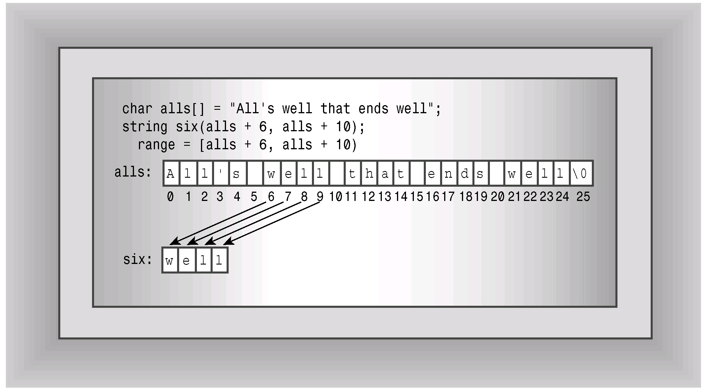
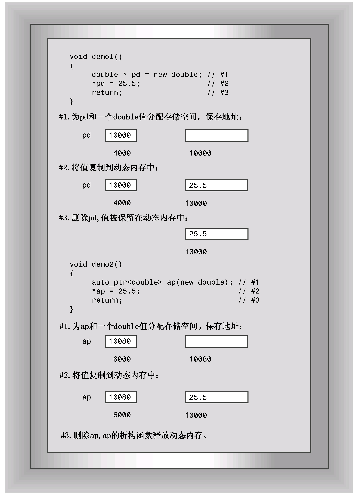
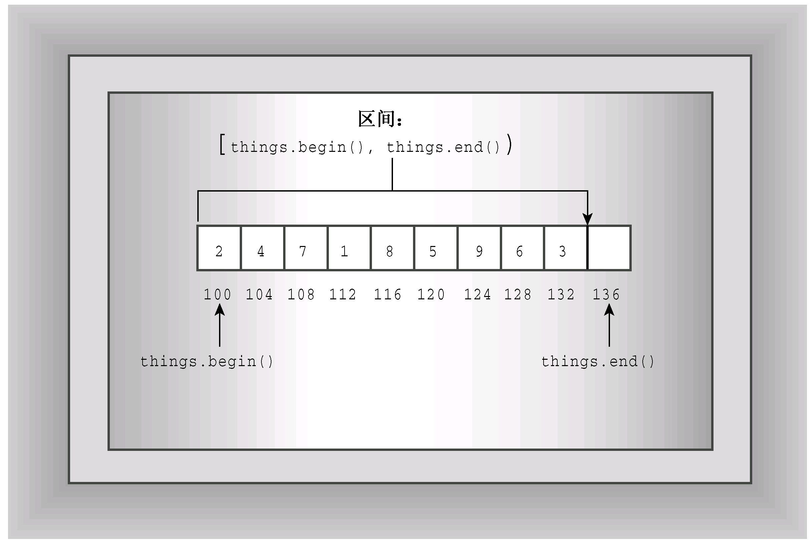

# 第16章 string类和标准模板库
本章内容包括：

* 标准C++ string类。
* 模板auto_ptr、unique_ptr和shared_ptr。
* 标准模板库（STL）。
* 容器类。
* 迭代器。
* 函数对象（functor）。
* STL算法。
* 模板initializer_list。

至此您熟悉了C++可重用代码的目标，这样做的一个很大的回报是可以重用别人编写的代码，这正是类库的用武之地。有很多商业C++类库，也有一些库是C++程序包自带的。例如，曾使用过的头文件ostream支持的输入/输出类。本章介绍一些其他可重用代码，它们将给编程工作带来快乐。

本书前面介绍过string类，本章将更深入地讨论它；然后介绍“智能指针”模板类，它们让管理动态内存更容易；接下来介绍标准模板库（STL），它是一组用于处理各种容器对象的模板。STL演示了一种编程模式——泛型编程；最后，本章将介绍C++11新增的模板initializer_list，它让您能够将初始化列表语法用于STL对象。

## 16.1 string类
很多应用程序都需要处理字符串。C语言在string.h（在C++中为cstring）中提供了一系列的字符串函数，很多早期的C++实现为处理字符串提供了自己的类。第4章介绍了ANSI/ISO C++ string类，而第12章创建了一个不大的String类，以说明设计表示字符串的类的某些方面。

string类是由头文件string支持的（注意，头文件string.h和cstring支持对C-风格字符串进行操纵的C库字符串函数，但不支持string类）。要使用类，关键在于知道它的公有接口，而string类包含大量的方法，其中包括了若干构造函数，用于将字符串赋给变量、合并字符串、比较字符串和访问各个元素的重载运算符以及用于在字符串中查找字符和子字符串的工具等。简而言之，string类包含的内容很多。

### 16.1.1 构造字符串
先来看string的构造函数。毕竟，对于类而言，最重要的内容之一是，有哪些方法可用于创建其对象。程序清单16.1使用了string的7个构造函数（用ctor标识，这是传统C++中构造函数的缩写）。表16.1简要地描述了这些构造函数，它首先使用顺序简要描述了程序清单16.1使用的7个构造函数，然后列出了C++11新增的两个构造函数。使用构造函数时都进行了简化，即隐藏了这样一个事实：string实际上是模板具体化basic_string<char>的一个typedef，同时省略了与内存管理相关的参数（这将在本章后面和附录F中讨论）。size_type是一个依赖于实现的整型，是在头文件string中定义的。string类将string::npos定义为字符串的最大长度，通常为unsigned int的最大值。另外，表格中使用缩写NBTS（null-terminated string）来表示以空字符结束的字符串——传统的C字符串。

表16.1 string类的构造函数

| 构 造 函 数 | 描 述 |
| :--- | :--- |
| string(const char * s) | 将string对象初始化为s指向的NBTS |
| string(size_type n, char c) | 创建一个包含n个元素的string对象，其中每个元素都被初始化为字符c |
| string(const string & str) | 将一个string对象初始化为string对象str（复制构造函数） |
| string( ) | 创建一个默认的sting对象，长度为0（默认构造函数） |
| string(const char * s, size_type n) | 将string对象初始化为s指向的NBTS的前n个字符，即使超过了NBTS结尾 |
| template<class Iter> string(Iter begin, Iter end) | 将string对象初始化为区间[begin, end)内的字符，其中begin和end的行为就像指针，用于指定位置，范围包括begin在内，但不包括end |
| string(const string & str, string size_type pos = 0, size_type n = npos) | 将一个string对象初始化为对象str中从位置pos开始到结尾的字符，或从位置pos开始的n个字符 |
| string(string && str) noexcept | 这是C++11新增的，它将一个string对象初始化为string对象str，并可能修改str（移动构造函数） |
| string(initializer_list<char> il) | 这是C++11新增的，它将一个string对象初始化为初始化列表il中的字符 |

程序清单16.1 str1.cpp
```c++
// str1.cpp -- introducing the string class
#include <iostream>
#include <string>
// using string constructors

int main()
{
    using namespace std;
    string one("Lottery Winner!");     // ctor #1
    cout << one << endl;               // overloaded <<
    string two(20, '$');               // ctor #2
    cout << two << endl;
    string three(one);                 // ctor #3
    cout << three << endl;
    one += " Oops!";                   // overloaded +=
    cout << one << endl;
    two = "Sorry! That was ";
    three[0] = 'P';
    string four;                       // ctor #4
    four = two + three;                // overloaded +, =
    cout << four << endl;
    char alls[] = "All's well that ends well";
    string five(alls,20);              // ctor #5
    cout << five << "!\n";
    string six(alls+6, alls + 10);     // ctor #6
    cout << six  << ", ";
    string seven(&five[6], &five[10]); // ctor #6 again
    cout << seven << "...\n";
    string eight(four, 7, 16);         // ctor #7
    cout << eight << " in motion!" << endl;
    // std::cin.get();
    return 0; 
}
```

程序清单16.1中程序还使用了重载+=运算符，它将一个字符串附加到另一个字符串的后面；重载的=运算符用于将一个字符串赋给另一个字符串；重载的<<运算符用于显示string对象；重载的[ ]运算符用于访问字符串中的各个字符。

下面是程序清单16.1中程序的输出：
```c++
Lottery Winner!
$$$$$$$$$$$$$$$$$$$$
Lottery Winner!
Lottery Winner! Oops!
Sorry! That was Pottery Winner!
All's well that ends!
well, well...
That was Pottery in motion!
```

1. 程序说明

程序清单16.1中的程序首先演示了可以将string对象初始化为常规的C-风格字符串，然后使用重载的<<运算符来显示它：
```c++
string one("Lottery Winner!");     // ctor #1
cout << one << endl;               // overloaded <<
```

接下来的构造函数将string对象two初始化为由20个$字符组成的字符串：
```c++
string two(20, '$');               // ctor #2
```

复制构造函数将string对象three初始化为string对象one：
```c++
string three(one);                 // ctor #3
```

重载的+=运算符将字符串“Oops!”附加到字符串one的后面：
```c++
one += " Oops!";                   // overloaded +=
```

这里是将一个C-风格字符串附加到一个string对象的后面。但+=运算符被多次重载，以便能够附加string对象和单个字符：
```c++
one += two;     // append a string object (not in program)
one += '!';     // append a type char value (not in program)
```

同样，=运算符也被重载，以便可以将string对象、C-风格字符串或char值赋给string对象：
```c++
two = "Sorry! That was ";   // assign a C-style string
two = one;                  // assign a string object (not in program)
two = '?';                  // assign a char value (not in program)
```

重载[ ]运算符（就像第12章的String示例那样）使得可以使用数组表示法来访问string对象中的各个字符：
```c++
three[0] = 'P';
```

默认构造函数创建一个以后可对其进行赋值的空字符串：
```c++
string four;                       // ctor #4
four = two + three;                // overloaded +, =
```

第2行使用重载的+运算符创建了一个临时string对象，然后使用重载的=运算符将它赋给对象four。正如所预料的，+运算符将其两个操作数组合成一个string对象。该运算符被多次重载，以便第二个操作数可以是string对象、C-风格字符串或char值。

第5个构造函数将一个C-风格字符串和一个整数作为参数，其中的整数参数表示要复制多少个字符：
```c++
char alls[] = "All's well that ends well";
string five(alls,20);              // ctor #5
```

从输出可知，这里只使用了前20个字符（“All's well that ends”）来初始化five对象。正如表16.1指出的，如果字符数超过了C-风格字符串的长度，仍将复制请求数目的字符。所以在上面的例子中，如果用40代替20，将导致15个无用字符被复制到five的结尾处（即构造函数将内存中位于字符串“All's well that ends well”后面的内容作为字符）。

第6个构造函数有一个模板参数：
```c++
template<class Iter> string(Iter begin, Iter end);
```

begin和end将像指针那样，指向内存中两个位置（通常，begin和end可以是迭代器——广泛用于STL中的广义化指针）。构造函数将使用begin和end指向的位置之间的值，对string对象进行初始化。[begin, end)来自数学中，意味着包括begin，但不包括end在内的区间。也就是说，end指向被使用的最后一个值后面的一个位置。请看下面的语句：
```c++
string six(alls+6, alls + 10);     // ctor #6
```

由于数组名相当于指针，所以alls + 6和alls +10的类型都是char *，因此使用模板时，将用类型char *替换Iter。第一个参数指向数组alls中的第一个w，第二个参数指向第一个well后面的空格。因此，six将被初始化为字符串“well”。图16.1说明了该构造函数的工作原理。



现在假设要用这个构造函数将对象初始化为另一个string对象（假设为five）的一部分内容，则下面的语句不管用：
```c++
string seven(five + 6, five + 10);
```

原因在于，对象名（不同于数组名）不会被看作是对象的地址，因此five不是指针，所以five + 6是没有意义的。然而，five[6]是一个char值，所以&five[6]是一个地址，因此可被用作该构造函数的一个参数。
```c++
string seven(&five[6], &five[10]); // ctor #6 again
```

第7个构造函数将一个string对象的部分内容复制到构造的对象中：
```c++
string eight(four, 7, 16);         // ctor #7
```

上述语句从four的第8个字符（位置7）开始，将16个字符复制到eight中。

2. C++11新增的构造函数

构造函数string（string && str）类似于复制构造函数，导致新创建的string为str的副本。但与复制构造函数不同的是，它不保证将str视为const。这种构造函数被称为移动构造函数（move constructor）。在有些情况下，编译器可使用它而不是复制构造函数，以优化性能。第18章的“移动语义和右值引用”一节将讨论这个主题。

构造函数string（initializer_list<char> il）让您能够将列表初始化语法用于string类。也就是说，它使得下面这样的声明是合法的：
```c++
string piano_man = {'L', 'i', 's', 'z', 't'};
string comp_lang {'L', 'i', 's', 'p'};
```

就string类而言，这可能用处不大，因为使用C-风格字符串更容易，但确实实现了让列表初始化语法普遍实用的意图。本章后面将更深入地讨论模板initializer_list。

### 16.1.2 string类输入
对于类，很有帮助的另一点是，知道有哪些输入方式可用。对于C-风格字符串，有3种方式：
```c++
char info[100];
cin >> info;              // read a word
cin.getline(info, 100);   // read a line, discard \n
cin.get(info, 100);       // read a line, leave \n in queue
```

对于string对象，有两种方式：
```c++
string stuff;
cin >> stuff;             // read a word
getline(cin, stuff);      // read a line, discard \n
```

两个版本的getline( )都有一个可选参数，用于指定使用哪个字符来确定输入的边界：
```c++
cin.getline(info, 100, ':');    // read up to :, discard :
getline(stuff, ':');            // read up to :, discard :
```

在功能上，它们之间的主要区别在于，string版本的getline( )将自动调整目标string对象的大小，使之刚好能够存储输入的字符：
```c++
char fname[10];
string lname;
cin >> fname;           // could be a problem if input size > 9 characters
cin >> lname;           // can read a very, very long word
cin.getline(fname, 10); // may truncate input
getline(cin, fname);    // no truncation
```

自动调整大小的功能让string版本的getline( )不需要指定读取多少个字符的数值参数。

在设计方面的一个区别是，读取C-风格字符串的函数是istream类的方法，而string版本是独立的函数。这就是对于C-风格字符串输入，cin是调用对象；而对于string对象输入，cin是一个函数参数的原因。这种规则也适用于>>形式，如果使用函数形式来编写代码，这一点将显而易见：
```c++
cin.operator>>(fname);    // ostream class method
operator>>(cin, lname);   // regular function
```

下面更深入地探讨一下string输入函数。正如前面指出的，这两个函数都自动调整目标string的大小，使之与输入匹配。但也存在一些限制。第一个限制因素是string对象的最大允许长度，由常量string::npos指定。这通常是最大的unsigned int值，因此对于普通的交互式输入，这不会带来实际的限制；但如果您试图将整个文件的内容读取到单个string对象中，这可能成为限制因素。第二个限制因素是程序可以使用的内存量。

string版本的getline( )函数从输入中读取字符，并将其存储到目标string中，直到发生下列三种情况之一：

* 到达文件尾，在这种情况下，输入流的eofbit将被设置，这意味着方法fail( )和eof( )都将返回true；
* 遇到分界字符（默认为\n），在这种情况下，将把分界字符从输入流中删除，但不存储它；
* 读取的字符数达到最大允许值（string::npos和可供分配的内存字节数中较小的一个），在这种情况下，将设置输入流的failbit，这意味着方法fail( )将返回true。

输入流对象有一个统计系统，用于跟踪流的错误状态。在这个系统中，检测到文件尾后将设置eofbit寄存器，检测到输入错误时将设置failbit寄存器，出现无法识别的故障（如硬盘故障）时将设置badbit寄存器，一切顺利时将设置goodbit寄存器。第17章将更深入地讨论这一点。

string版本的operator>>( )函数的行为与此类似，只是它不断读取，直到遇到空白字符并将其留在输入队列中，而不是不断读取，直到遇到分界字符并将其丢弃。空白字符指的是空格、换行符和制表符，更普遍地说，是任何将其作为参数来调用isspace( )时，该函数返回ture的字符。

本书前面有多个控制台string输入示例。由于用于string对象的输入函数使用输入流，能够识别文件尾，因此也可以使用它们来从文件中读取输入。程序清单16.2是一个从文件中读取字符串的简短示例，它假设文件中包含用冒号字符分隔的字符串，并使用指定分界符的getline( )方法。然后，显示字符串并给它们编号，每个字符串占一行。

程序清单16.2 strfile.cpp
```c++
// strfile.cpp -- read strings from a file
#include <iostream>
#include <fstream>
#include <string>
#include <cstdlib>
int main()
{
     using namespace std;
     ifstream fin;
     fin.open("tobuy.txt");
     if (fin.is_open() == false)
     {
        cerr << "Can't open file. Bye.\n";
        exit(EXIT_FAILURE);
     }
     string item;
     int count = 0;
     
     getline(fin, item, ':');
     while (fin)  // while input is good
     {
        ++count;
        cout << count <<": " << item << endl;
        getline(fin, item,':');     
     }
     cout << "Done\n";
     fin.close();
	 // std::cin.get();
	 // std::cin.get();
     return 0;
}
```

下面是文件tobuy.txt的内容：
```c++
sardines:chocolate ice cream:pop corn:leeks:
cottage cheese:olive oil:butter:tofu:
```

通常，对于程序要查找的文本文件，应将其放在可执行程序或项目文件所在的目录中；否则必须提供完整的路径名。在Windows系统中，C-风格字符串中的转义序列\表示一个斜杠：
```c++
fin.open("C:\\CPP\\Proqs\\tobuy.txt");   // file = C:\CPP\Proqs\tobuy.txt
```

下面是程序清单16.2中程序的输出：
```c++
1: sardines
2: chocolate ice cream
3: pop corn
4: leeks
5:
cottage cheese
6: olive oil
7: butter
8: tofu
Done
```

注意，将:指定为分界字符后，换行符将被视为常规字符。因此文件tobuy.txt中第一行末尾的换行符将成为包含“cottage cheese”的字符串中的第一个字符。同样，第二行末尾的换行符是第9个输入字符串中唯一的内容。

### 16.1.3 使用字符串
现在，您知道可以使用不同方式来创建string对象、显示string对象的内容、将数据读取和附加到string对象中、给string对象赋值以及将两个string对象连结起来。除此之外，还能做些什么呢？

可以比较字符串。String类对全部6个关系运算符都进行了重载。如果在机器排列序列中，一个对象位于另一个对象的前面，则前者被视为小于后者。如果机器排列序列为ASCII码，则数字将小于大写字符，而大写字符小于小写字符。对于每个关系运算符，都以三种方式被重载，以便能够将string对象与另一个string对象、C-风格字符串进行比较，并能够将C-风格字符串与string对象进行比较：
```c++
string snake1("cobra");
string snake2("coral");
char snake3[20] = "anaconda";
if (snake1 < snake2)    // operator<(const string &, const string &)
     ...
if (snake1 == snake3)   // operator==(const string &, const char *)
     ...
if (snake3 != snake2)   // operator!=(const char *, const string &)
     ...
```

可以确定字符串的长度。size( )和length( )成员函数都返回字符串中的字符数：
```c++
if (snake1.length() == snake2.size())
     cout << "Both strings have the same length.\n";
```

为什么这两个函数完成相同的任务呢？length( )成员来自较早版本的string类，而size( )则是为提供STL兼容性而添加的。

可以以多种不同的方式在字符串中搜索给定的子字符串或字符。表16.2简要地描述了find( )方法的4个版本。如前所述，string ::npos是字符串可存储的最大字符数，通常是无符号int或无符号long的最大取值。

**表16.2 重载的find( )方法**

| 方 法 原 型 | 描 述 |
| :--- | :--- |
| size_type find(const string & str, size_type pos = 0)const | 从字符串的pos位置开始，查找子字符串str。如果找到，则返回该子字符串首次出现时其首字符的索引；否则，返回string :: npos |
| size_type find(const char * s, size_type pos = 0)const | 从字符串的pos位置开始，查找子字符串s。如果找到，则返回该子字符串首次出现时其首字符的索引；否则，返回string:: npos |
| size_type find(const char * s, size_type pos = 0, size_type n) | 从字符串的pos位置开始，查找s的前n个字符组成的子字符串。如果找到，则返回该子字符串首次出现时其首字符的索引；否则，返回string :: npos |
| size_type find(char ch, size_type pos = 0)const | 从字符串的pos位置开始，查找字符ch。如果找到，则返回该字符首次出现的位置；否则，返回string :: npos |

string库还提供了相关的方法：rfind( )、find_first_of( )、find_last_of( )、find_first_not_of( )和find_last_not_of( )，它们的重载函数特征标都与find( )方法相同。rfind( )方法查找子字符串或字符最后一次出现的位置；find_first_of( )方法在字符串中查找参数中任何一个字符首次出现的位置。例如，下面的语句返回r在“cobra”中的位置（即索引3），因为这是“hark”中各个字母在“cobra”首次出现的位置：
```c++
int where = snake1.find_first_of("hark");
```

find_last_of( )方法的功能与此相同，只是它查找的是最后一次出现的位置。因此，下面的语句返回a在“cobra”中的位置：
```c++
int where = snake1.last_first_of("hark");
```

find_first_not_of( )方法在字符串中查找第一个不包含在参数中的字符，因此下面的语句返回c在“cobra”中的位置，因为“hark”中没有c：
```c++
int where = snake1.find_first_not_of("hark");
```

在本章最后的练习中，您将了解find_last_not_of( )。

还有很多其他的方法，这些方法足以创建一个非图形版本的Hangman拼字游戏。该游戏将一系列的单词存储在一个string对象数组中，然后随机选择一个单词，让人猜测单词的字母。如果猜错6次，玩家就输了。该程序使用find( )函数来检查玩家的猜测，使用+=运算符创建一个string对象来记录玩家的错误猜测。为记录玩家猜对的情况，程序创建了一个单词，其长度与被猜的单词相同，但包含的是连字符。玩家猜对字符时，将用该字符替换相应的连字符。程序清单16.3列出了该程序的代码。

程序清单16.3 hangman.cpp
```c++
// hangman.cpp -- some string methods
#include <iostream>
#include <string>
#include <cstdlib>
#include <ctime>
#include <cctype>
using std::string;
const int NUM = 26;
const string wordlist[NUM] = {"apiary", "beetle", "cereal",
    "danger", "ensign", "florid", "garage", "health", "insult",
    "jackal", "keeper", "loaner", "manage", "nonce", "onset",
    "plaid", "quilt", "remote", "stolid", "train", "useful",
    "valid", "whence", "xenon", "yearn", "zippy"};

int main()
{
    using std::cout;
    using std::cin;
    using std::tolower;
    using std::endl;
    
    std::srand(std::time(0));
    char play;
    cout << "Will you play a word game? <y/n> ";
    cin >> play;
    play = tolower(play);
    while (play == 'y')
    {
        string target = wordlist[std::rand() % NUM];
        int length = target.length();
        string attempt(length, '-');
        string badchars;
        int guesses = 6;
        cout << "Guess my secret word. It has " << length
            << " letters, and you guess\n"
            << "one letter at a time. You get " << guesses
            << " wrong guesses.\n";
        cout << "Your word: " << attempt << endl;
        while (guesses > 0 && attempt != target)
        {
            char letter;
            cout << "Guess a letter: ";
            cin >> letter;
            if (badchars.find(letter) != string::npos
                || attempt.find(letter) != string::npos)
            {
                cout << "You already guessed that. Try again.\n";
                    continue;
            }
            int loc = target.find(letter);
            if (loc == string::npos)
            {
                cout << "Oh, bad guess!\n";
                --guesses;
                badchars += letter; // add to string
            }
            else
            {
                cout << "Good guess!\n";
                attempt[loc]=letter;
                // check if letter appears again
                loc = target.find(letter, loc + 1);
                while (loc != string::npos)
                {
                    attempt[loc]=letter;
                    loc = target.find(letter, loc + 1);
                }
           }
            cout << "Your word: " << attempt << endl;
            if (attempt != target)
            {
                if (badchars.length() > 0)
                    cout << "Bad choices: " << badchars << endl;
                cout << guesses << " bad guesses left\n";
            }
        }
        if (guesses > 0)
            cout << "That's right!\n";
        else
            cout << "Sorry, the word is " << target << ".\n";

        cout << "Will you play another? <y/n> ";
        cin >> play;
        play = tolower(play);
    }

    cout << "Bye\n";

    return 0; 
}
```

程序清单16.3中程序的运行情况如下：
```c++
Will you play a word game? <y/n> y
Guess my secret word. It has 5 letters, and you guess
one letter at a time. You get 6 wrong guesses.
Your word: -----
Guess a letter: e
Good guess!
Your word: -e---
6 bad guesses left
Guess a letter: a
Oh, bad guess!
Your word: -e---
Bad choices: a
5 bad guesses left
Guess a letter: t
Oh, bad guess!
Your word: -e---
Bad choices: at
4 bad guesses left
Guess a letter: r
Oh, bad guess!
Your word: -e---
Bad choices: atr
3 bad guesses left
Guess a letter: y
Oh, bad guess!
Your word: -e---
Bad choices: atry
2 bad guesses left
Guess a letter: i
Oh, bad guess!
Your word: -e---
Bad choices: atryi
1 bad guesses left
Guess a letter: p
Oh, bad guess!
Your word: -e---
Bad choices: atryip
0 bad guesses left
Sorry, the word is xenon.
Will you play another? <y/n> n
Bye
```

程序说明

在程序清单16.3中，由于关系运算符被重载，因此可以像对待数值变量那样对待字符串：
```c++
while (guesses > 0 && attempt != target)
```

与对C-风格字符串使用strcmp( )相比，这样简单些。

该程序使用find( )来检查玩家以前是否猜过某个字符。如果是，则它要么位于badchars字符串（猜错）中，要么位于attempt字符串（猜对）中：
```c++
if (badchars.find(letter) != string::npos
    || attempt.find(letter) != string::npos)
```

npos变量是string类的静态成员，它的值是string对象能存储的最大字符数。由于索引从0开始，所以它比最大的索引值大1，因此可以使用它来表示没有查找到字符或字符串。

该程序利用了这样一个事实：+=运算符的某个重载版本使得能够将一个字符附加到字符串中：
```c++
badchars += letter;   // append a char to a string object
```

该程序的核心是从检查玩家选择的字符是否位于被猜测的单词中开始的：
```c++
int loc = target.find(letter);
```

如果loc是一个有效的值，则可以将该字母放置在答案字符串的相应位置：
```c++
attempt[loc]=letter;
```

然而，由于字母在被猜测的单词中可能出现多次，所以程序必须一直进行检查。该程序使用了find( )的第二个可选参数，该参数可以指定从字符串什么位置开始搜索。因为字母是在位置loc找到的，所以下一次搜索应从loc+1开始。while循环使搜索一直进行下去，直到找不到该字符为止。如果loc位于字符串尾，则表明find( )没有找到该字符。
```c++
// check if letter appears again
loc = target.find(letter, loc + 1);
while (loc != string::npos)
{
    attempt[loc]=letter;
    loc = target.find(letter, loc + 1);
}
```

### 16.1.4 string还提供了哪些功能
string库提供了很多其他的工具，包括完成下述功能的函数：删除字符串的部分或全部内容、用一个字符串的部分或全部内容替换另一个字符串的部分或全部内容、将数据插入到字符串中或删除字符串中的数据、将一个字符串的部分或全部内容与另一个字符串的部分或全部内容进行比较、从字符串中提取子字符串、将一个字符串中的内容复制到另一个字符串中、交换两个字符串的内容。这些函数中的大多数都被重载，以便能够同时处理C-风格字符串和string对象。附录F简要地介绍了string库中的函数。

首先来看自动调整大小的功能。在程序清单16.3中，每当程序将一个字母附加到字符串末尾时将发生什么呢？不能仅仅将已有的字符串加大，因为相邻的内存可能被占用了。因此，可能需要分配一个新的内存块，并将原来的内容复制到新的内存单元中。如果执行大量这样的操作，效率将非常低，因此很多C++实现分配一个比实际字符串大的内存块，为字符串提供了增大空间。然而，如果字符串不断增大，超过了内存块的大小，程序将分配一个大小为原来两倍的新内存块，以提供足够的增大空间，避免不断地分配新的内存块。方法capacity( )返回当前分配给字符串的内存块的大小，而reserve( )方法让您能够请求内存块的最小长度。程序清单16.4是一个使用这些方法的示例。

程序清单16.4 str2.cpp
```c++
// str2.cpp -- capacity() and reserve()
#include <iostream>
#include <string>
int main()
{
    using namespace std;
    string empty;
    string small = "bit";
    string larger = "Elephants are a girl's best friend";
    cout << "Sizes:\n";
    cout << "\tempty: " << empty.size() << endl;
    cout << "\tsmall: " << small.size() << endl;
    cout << "\tlarger: " << larger.size() << endl;
    cout << "Capacities:\n";
    cout << "\tempty: " << empty.capacity() << endl;
    cout << "\tsmall: " << small.capacity() << endl;
    cout << "\tlarger: " << larger.capacity() << endl;
    empty.reserve(50);
    cout << "Capacity after empty.reserve(50): " 
         << empty.capacity() << endl;
	// cin.get();
    return 0;
}
```

下面是使用某种C++实现时，程序清单16.4中程序的输出：
```c++
Sizes:
        empty: 0
        small: 3
        larger: 34
Capacities:
        empty: 15
        small: 15
        larger: 34
Capacity after empty.reserve(50): 50
```

注意，该实现使用的最小容量为15个字符，这比标准容量选择（16的倍数）小1。其他实现可能做出不同的选择。

如果您有string对象，但需要C-风格字符串，该如何办呢？例如，您可能想打开一个其名称存储在string对象中的文件：
```c++
string filename;
cout << "Enter file name: ";
cin >> filename;
ofstream fout;
```

不幸的是，open( )方法要求使用一个C-风格字符串作为参数；幸运的是，c_str( )方法返回一个指向C-风格字符串的指针，该C-风格字符串的内容与用于调用c_str( )方法的string对象相同。因此可以这样做：
```c++
fout.open(filename.c_str());
```

### 16.1.5 字符串种类
本节将string类看作是基于char类型的。事实上，正如前面指出的，string库实际上是基于一个模板类的：
```c++
template<class charT, class traits = char _traits<charT>,
        class Allocator = allocator<char> >
basic_string { ... };
```

模板basic_string有4个具体化，每个具体化都有一个typedef名称：
```c++
typedef basic_string<char> string;
typedef basic_string<wchar_t> wstring;
typedef basic_string<char16_t> u16string;   // C++11
typedef basic_string<char32_t> u32string;   // C++11
```

这让您能够使用基于类型wchar_t、char16_t、char32_t和char的字符串。甚至可以开发某种类似字符的类，并对它使用basic_string类模板（只要它满足某些要求）。traits类描述关于选定字符类型的特定情况，如如何对值进行比较。对于wchar_t、char16_t、char32_t和char类型，有预定义的char_traits模板具体化，它们都是traits的默认值。Allocator是一个管理内存分配的类。对于各种字符类型，都有预定义的allocator模板具体化，它们都是默认的。它们使用new和delete。

## 16.2 智能指针模板类
智能指针是行为类似于指针的类对象，但这种对象还有其他功能。本节介绍三个可帮助管理动态内存分配的智能指针模板。先来看需要哪些功能以及这些功能是如何实现的。请看下面的函数：
```c++
void remodel(std::string & str)
{
    std::string * ps = new std::string(str);
    ...
    str = ps;
    return;
}
```

您可能发现了其中的缺陷。每当调用时，该函数都分配堆中的内存，但从不收回，从而导致内存泄漏。您可能也知道解决之道——只要别忘了在return语句前添加下面的语句，以释放分配的内存即可：
```c++
delete ps;
```

然而，但凡涉及“别忘了”的解决方法，很少是最佳的。因为您有时可能忘了，有时可能记住了，但可能在不经意间删除或注释掉了这些代码。即使确实没有忘记，也可能有问题。请看下面的变体：
```c++
void remodel(std::string & str)
{
    std::string * ps = new std::string(str);
    ...
    if (weird_thing())
        throw exception();
    str = *ps;
    delete ps;
    return;
}
```

当出现异常时，delete将不被执行，因此也将导致内存泄漏。

可以按第14章介绍的方式修复这种问题，但如果有更灵巧的解决方法就好了。来看一下需要些什么。当remodel( )这样的函数终止（不管是正常终止，还是由于出现了异常而终止），本地变量都将从栈内存中删除——因此指针ps占据的内存将被释放。如果ps指向的内存也被释放，那该有多好啊。如果ps有一个析构函数，该析构函数将在ps过期时释放它指向的内存。因此，ps的问题在于，它只是一个常规指针，不是有析构函数的类对象。如果它是对象，则可以在对象过期时，让它的析构函数删除指向的内存。这正是auto_ptr、unique_ptr和shared_ptr背后的思想。模板auto_ptr是C++98提供的解决方案，C++11已将其摒弃，并提供了另外两种解决方案。然而，虽然auto_ptr被摒弃，但它已使用了多年；同时，如果您的编译器不支持其他两种解决方案，auto_ptr将是唯一的选择。

### 16.2.1 使用智能指针
这三个智能指针模板（auto_ptr、unique_ptr和shared_ptr）都定义了类似指针的对象，可以将new获得（直接或间接）的地址赋给这种对象。当智能指针过期时，其析构函数将使用delete来释放内存。因此，如果将new返回的地址赋给这些对象，将无需记住稍后释放这些内存：在智能指针过期时，这些内存将自动被释放。图16.2说明了auto_ptr和常规指针在行为方面的差别；share_ptr和unique_ptr的行为与auto_ptr相同。



要创建智能指针对象，必须包含头文件memory，该文件模板定义。然后使用通常的模板语法来实例化所需类型的指针。例如，模板auto_ptr包含如下构造函数：
```c++
template<class X> class auto_ptr {
public:
    explicit auto_ptr(X* p = 0) throw();
    ...
};
```

本书前面说过，throw( )意味着构造函数不会引发异常；与auto_ptr一样，throw()也被摒弃。因此，请求X类型的auto_ptr将获得一个指向X类型的auto_ptr：
```c++
auto_ptr<double> pd(new double);    // pd an auto_ptr to double
                                    // (use in place of double * pd)
auto_ptr<string> ps(new string);    // ps an auto_ptr to string
                                    // (use in place of string * ps)
```

new double是new返回的指针，指向新分配的内存块。它是构造函数auto_ptr<double>的参数，即对应于原型中形参p的实参。同样，newstring也是构造函数的实参。其他两种智能指针使用同样的语法：
```c++
unique_ptr<double> pdu(new double);   // pdu an unique_ptr to double
shared_ptr<string> pss(new string);   // pss a shared ptr to string
```

因此，要转换remodel( )函数，应按下面3个步骤进行：

1. 包含头文件memory；

2. 将指向string的指针替换为指向string的智能指针对象；

3. 删除delete语句。

下面是使用auto_ptr修改该函数的结果：
```c++
#include <memory>
void remodel(std::string & str)
{
    std::auto_ptr<std::string> ps(new std::string(str));
    ...
    if (weird_thing())
        throw exception();
    str = *ps;
    // delete ps; NO LONGER NEEDED
    return;
}
```

注意到智能指针模板位于名称空间std中。程序清单16.5是一个简单的程序，演示了如何使用全部三种智能指针。要编译该程序，您的编译器必须支持C++11新增的类share_ptr和unique_ptr。每个智能指针都放在一个代码块内，这样离开代码块时，指针将过期。Report类使用方法报告对象的创建和销毁。

程序清单16.5 smrtptrs.cpp
```c++
// smrtptrs.cpp -- using three kinds of smart pointers
#include <iostream>
#include <string>
#include <memory>

class Report
{
private:
    std::string str;
public:
    Report(const std::string s) : str(s) { std::cout << "Object created!\n"; }
    ~Report() { std::cout << "Object deleted!\n"; }
    void comment() const { std::cout << str << "\n"; }
};

int main()
{
    {
        std::auto_ptr<Report> ps (new Report("using auto_ptr"));
        ps->comment();   // use -> to invoke a member function
    }
    {
        std::shared_ptr<Report> ps (new Report("using shared_ptr"));
        ps->comment();
    }
    {
        std::unique_ptr<Report> ps (new Report("using unique_ptr"));
        ps->comment();
    }
    // std::cin.get();  
    return 0;
}
```

该程序的输出如下：
```c++
Object created!
using auto_ptr
Object deleted!
Object created!
using shared_ptr
Object deleted!
Object created!
using unique_ptr
Object deleted!
```

所有智能指针类都一个explicit构造函数，该构造函数将指针作为参数。因此不需要自动将指针转换为智能指针对象：
```c++
shared_ptr<double> pd;
double *p_reg = new double;
pd = p_reg;                         // not allowed (implicit conversion)
pd = shared_ptr<double>(p_reg);     // allowed (explicit conversion)
shared_ptr<double> pshared = p_reg; // not allowed (implicit conversion)
shared_ptr<double> pshared(p_reg);  // allowed (explicit conversion)
```

由于智能指针模板类的定义方式，智能指针对象的很多方面都类似于常规指针。例如，如果ps是一个智能指针对象，则可以对它执行解除引用操作（* ps）、用它来访问结构成员（ps->puffIndex）、将它赋给指向相同类型的常规指针。还可以将智能指针对象赋给另一个同类型的智能指针对象，但将引起一个问题，这将在下一节进行讨论。

但在此之前，先说说对全部三种智能指针都应避免的一点：
```c++
string vacation("I wandered lonely as a cloud.");
shared_ptr<string> pvac(&vacation);   // NO!
```

pvac过期时，程序将把delete运算符用于非堆内存，这是错误的。

就程序清单16.5演示的情况而言，三种智能指针都能满足要求，但情况并非总是这样简单。

### 16.2.2 有关智能指针的注意事项
为何有三种智能指针呢？实际上有4种，但本书不讨论weak_ptr。为何摒弃auto_ptr呢？

先来看下面的赋值语句：
```c++
auto_ptr<string> ps("I wandered lonely as a cloud.");
auto_ptr<string> vacation;
vacation = ps;
```

上述赋值语句将完成什么工作呢？如果ps和vocation是常规指针，则两个指针将指向同一个string对象。这是不能接受的，因为程序将试图删除同一个对象两次——一次是ps过期时，另一次是vocation过期时。要避免这种问题，方法有多种。

* 定义赋值运算符，使之执行深复制。这样两个指针将指向不同的对象，其中的一个对象是另一个对象的副本。
* 建立所有权（ownership）概念，对于特定的对象，只能有一个智能指针可拥有它，这样只有拥有对象的智能指针的构造函数会删除该对象。然后，让赋值操作转让所有权。这就是用于auto_ptr和unique_ptr的策略，但unique_ptr的策略更严格。
* 创建智能更高的指针，跟踪引用特定对象的智能指针数。这称为引用计数（reference counting）。例如，赋值时，计数将加1，而指针过期时，计数将减1。仅当最后一个指针过期时，才调用delete。这是shared_ptr采用的策略。

当然，同样的策略也适用于复制构造函数。

每种方法都有其用途。程序清单16.6是一个不适合使用auto_ptr的示例。

程序清单16.6 fowl.cpp
```c++
// fowl.cpp  -- auto_ptr a poor choice
#include <iostream>
#include <string>
#include <memory>

int main()
{
    using namespace std;
    auto_ptr<string> films[5] =
    {
        auto_ptr<string> (new string("Fowl Balls")),
        auto_ptr<string> (new string("Duck Walks")),
        auto_ptr<string> (new string("Chicken Runs")),
        auto_ptr<string> (new string("Turkey Errors")),
        auto_ptr<string> (new string("Goose Eggs"))
    };
    auto_ptr<string> pwin;
    pwin = films[2];   // films[2] loses ownership

    cout << "The nominees for best avian baseball film are\n";
    for (int i = 0; i < 5; i++)
        cout << *films[i] << endl;
    cout << "The winner is " << *pwin << "!\n";
    // cin.get();
    return 0;
}
```

下面是该程序的输出：
```c++
The nominees for best avian baseball film are
Fowl Balls
Duck Walks
Segmentation fault (core dumped)
```

消息core dumped表明，错误地使用auto_ptr可能导致问题（这种代码的行为是不确定的，其行为可能随系统而异）。这里的问题在于，下面的语句将所有权从films[2]转让给pwin：
```c++
pwin = films[2];   // films[2] loses ownership
```

这导致films[2]不再引用该字符串。在auto_ptr放弃对象的所有权后，便可能使用它来访问该对象。当程序打印films[2]指向的字符串时，却发现这是一个空指针，这显然讨厌的意外。

如果在程序清单16.6中使用shared_ptr代替auto_ptr（这要求编译器支持C++11新增的shared_ptr类），则程序将正常运行，其输出如下：
```c++
The nominees for best avian baseball film are
Fowl Balls
Duck Walks
Chicken Runs
Turkey Errors
Goose Eggs
The winner is Chicken Runs!
```

差别在于程序的如下部分：
```c++
shared_ptr<string> pwin;
pwin = films[2];
```

这次pwin和films[2]指向同一个对象，而引用计数从1增加到2。在程序末尾，后声明的pwin首先调用其析构函数，该析构函数将引用计数降低到1。然后，shared_ptr数组的成员被释放，对filmsp[2]调用析构函数时，将引用计数降低到0，并释放以前分配的空间。

因此使用shared_ptr时，程序清单16.6运行正常；而使用auto_ptr时，该程序在运行阶段崩溃。如果使用unique_ptr，结果将如何呢？与auto_ptr一样，unique_ptr也采用所有权模型。但使用unique_ptr时，程序不会等到运行阶段崩溃，而在编译器因下述代码行出现错误：
```c++
pwin = films[2];
```

显然，该进一步探索auto_ptr和unique_ptr之间的差别。

### 16.2.3 unique_ptr为何优于auto_ptr
请看下面的语句：
```c++
auto_ptr<string> p1(new string("auto"));  // #1
auto_ptr<string> p2;                      // #2
p2 = p1;                                  // #3
```

在语句#3中，p2接管string对象的所有权后，p1的所有权将被剥夺。前面说过，这是件好事，可防止p1和p2的析构函数试图删除同一个对象；但如果程序随后试图使用p1，这将是件坏事，因为p1不再指向有效的数据。

下面来看使用unique_ptr的情况：
```c++
unique_ptr<string> p3(new string("auto"));  // #4
unique_ptr<string> p4;                      // #5
p4 = p3;                                    // #6
```

编译器认为语句#6非法，避免了p3不再指向有效数据的问题。因此，unique_ptr比auto_ptr更安全（编译阶段错误比潜在的程序崩溃更安全）。

但有时候，将一个智能指针赋给另一个并不会留下危险的悬挂指针。假设有如下函数定义：
```c++
unique_ptr<string> demo(const char * s)
{
    unique_ptr<string> temp(new string(s));
    return temp;
}
```

并假设编写了如下代码：
```c++
unique_ptr<string> ps;
ps = demo("Uniquely special");
```

demo( )返回一个临时unique_ptr，然后ps接管了原本归返回的unique_ptr所有的对象，而返回的unique_ptr被销毁。这没有问题，因为ps拥有了string对象的所有权。但这里的另一个好处是，demo( )返回的临时unique_ptr很快被销毁，没有机会使用它来访问无效的数据。换句话说，没有理由禁止这种赋值。神奇的是，编译器确实允许这种赋值！

总之，程序试图将一个unique_ptr赋给另一个时，如果源unique_ptr是个临时右值，编译器允许这样做；如果源unique_ptr将存在一段时间，编译器将禁止这样做：
```c++
using namespace std;
unique_ptr<string> pu1(new string("Hi ho!"));
unique_ptr<string> pu2;
pu2 = pu1;                                      // #1 not allowed
unique_ptr<string> pu3;
pu3 = unique_ptr<string>(new string("Yo!"));    // #2 allowed
```

语句#1将留下悬挂的unique_ptr（pul），这可能导致危害。语句#2不会留下悬挂的unique_ptr，因为它调用unique_ptr的构造函数，该构造函数创建的临时对象在其所有权转让给pu后就会被销毁。这种随情况而异的行为表明，unique_ptr优于允许两种赋值的auto_ptr。这也是禁止（只是一种建议，编译器并不禁止）在容器对象中使用auto_ptr，但允许使用unique_ptr的原因。如果容器算法试图对包含unique_ptr的容器执行类似于语句#1的操作，将导致编译错误；如果算法试图执行类似于语句#2的操作，则不会有任何问题。而对于auto_ptr，类似于语句#1的操作可能导致不确定的行为和神秘的崩溃。

当然，您可能确实想执行类似于语句#1的操作。仅当以非智能的方式使用遗弃的智能指针（如解除引用时），这种赋值才不安全。要安全地重用这种指针，可给它赋新值。C++有一个标准库函数std::move( )，让您能够将一个unique_ptr赋给另一个。下面是一个使用前述demo( )函数的例子，该函数返回一个unique_ptr<string>对象：
```c++
using namespace std;
unique_ptr<string> ps1, ps2;
ps1 = demo("Uniquely special");
ps2 = move(ps1);                       // enable assignment
ps1 = demo(" and more");
cout << *ps2 << *ps1 << endl;
```

您可能会问，unique_ptr如何能够区分安全和不安全的用法呢？答案是它使用了C++11新增的移动构造函数和右值引用，这将在第18章讨论。

相比于auto_ptr，unique_ptr还有另一个优点。它有一个可用于数组的变体。别忘了，必须将delete和new配对，将delete []和new [ ]配对。模板auto_ptr使用delete而不是delete [ ]，因此只能与new一起使用，而不能与new [ ]一起使用。但unique_ptr有使用new [ ]和delete [ ]的版本：
```c++
std::unique_ptr<double []> pda(new double(5));    // will use delete []
```

> **警告：**
> 
> 使用new分配内存时，才能使用auto_ptr和shared_ptr，使用new [ ]分配内存时，不能使用它们。不使用new分配内存时，不能使用auto_ptr或shared_ptr；不使用new或new []分配内存时，不能使用unique_ptr。

### 16.2.4 选择智能指针
应使用哪种智能指针呢？如果程序要使用多个指向同一个对象的指针，应选择shared_ptr。这样的情况包括：有一个指针数组，并使用一些辅助指针来标识特定的元素，如最大的元素和最小的元素；两个对象包含都指向第三个对象的指针；STL容器包含指针。很多STL算法都支持复制和赋值操作，这些操作可用于shared_ptr，但不能用于unique_ptr（编译器发出警告）和auto_ptr（行为不确定）。如果您的编译器没有提供shared_ptr，可使用Boost库提供的shared_ptr。

如果程序不需要多个指向同一个对象的指针，则可使用unique_ptr。如果函数使用new分配内存，并返回指向该内存的指针，将其返回类型声明为unique_ptr是不错的选择。这样，所有权将转让给接受返回值的unique_ptr，而该智能指针将负责调用delete。可将unique_ptr存储到STL容器中，只要不调用将一个unique_ptr复制或赋给另一个的方法或算法（如sort( )）。例如，可在程序中使用类似于下面的代码段，这里假设程序包含正确的include和using语句：
```c++
unique_ptr<int> make_int(int n)
{
    return unique_ptr<int>(new int(n));
}
void show(unique_ptr<int> & pi)     // pass by reference
{
    cout << *a << ' ';
}
int main()
{
    ...
    vector<unique_ptr<int>> vp(size);
    for (int i = 0; i < vp.size(); i++)
        vp[i] = make_int(rand() % 1000);    // copy temporary unique_ptr
    vp.push_back(make_int(rand() % 1000));  // ok because arg is temporary
    for_each(vp.begin(), vp.end(), show);   // use for each()
    ...
}
```

其中的push_back( )调用没有问题，因为它返回一个临时unique_ptr，该unique_ptr被赋给vp中的一个unique_ptr。另外，如果按值而不是按引用给show( )传递对象，for_each( )语句将非法，因为这将导致使用一个来自vp的非临时unique_ptr初始化pi，而这是不允许的。前面说过，编译器将发现错误使用unique_ptr的企图。

在unique_ptr为右值时，可将其赋给shared_ptr，这与将一个unique_ptr赋给另一个需要满足的条件相同。与前面一样，在下面的代码中，make_int( )的返回类型为unique_ptr<int>：
```c++
unique_ptr<int> pup(make_int(rand() % 1000));   // ok
shared_ptr<int> spp(pup);                       // not allowed, pup an lvalue
shared_ptr<int> spr(make_int(rand() % 1000));   // ok
```

模板shared_ptr包含一个显式构造函数，可用于将右值unique_ptr转换为shared_ptr。shared_ptr将接管原来归unique_ptr所有的对象。

在满足unique_ptr要求的条件时，也可使用auto_ptr，但unique_ptr是更好的选择。如果您的编译器没有提供unique_ptr，可考虑使用BOOST库提供的scoped_ptr，它与unique_ptr类似。

## 16.3 标准模板库
STL提供了一组表示容器、迭代器、函数对象和算法的模板。容器是一个与数组类似的单元，可以存储若干个值。STL容器是同质的，即存储的值的类型相同；算法是完成特定任务（如对数组进行排序或在链表中查找特定值）的处方；迭代器能够用来遍历容器的对象，与能够遍历数组的指针类似，是广义指针；函数对象是类似于函数的对象，可以是类对象或函数指针（包括函数名，因为函数名被用作指针）。STL使得能够构造各种容器（包括数组、队列和链表）和执行各种操作（包括搜索、排序和随机排列）。

Alex Stepanov和Meng Lee在Hewlett-Packard实验室开发了STL，并于1994年发布其实现。ISO/ANSI C++委员会投票同意将其作为C++标准的组成部分。STL不是面向对象的编程，而是一种不同的编程模式——泛型编程（generic programming）。这使得STL在功能和方法方面都很有趣。关于STL的信息很多，无法用一章的篇幅全部介绍，所以这里将介绍一些有代表性的例子，并领会泛型编程方法的精神。先来看几个具体的例子，让您对容器、迭代器和算法有一些感性的认识，然后再介绍底层的设计理念，并简要地介绍STL。附录G对各种STL方法和函数进行了总结。

### 16.3.1 模板类vector
第4章简要地介绍了vector类，下面更详细地介绍它。在计算中，矢量（vector）对应数组，而不是第11章介绍的数学矢量（在数学中，可以使用N个分量来表示N维数学矢量，因此从这方面讲，数学矢量类似一个N维数组。然而，数学矢量还有一些计算机矢量不具备的其他特征，如内乘积和外乘积）。计算矢量存储了一组可随机访问的值，即可以使用索引来直接访问矢量的第10个元素，而不必首先访问前面第9个元素。所以vector类提供了与第14章介绍的valarray和ArrayTP以及第4章介绍的array类似的操作，即可以创建vector对象，将一个vector对象赋给另一个对象，使用[ ]运算符来访问vector元素。要使类成为通用的，应将它设计为模板类，STL正是这样做的——在头文件vector（以前为vector.h）中定义了一个vector模板。

要创建vector模板对象，可使用通常的<type>表示法来指出要使用的类型。另外，vector模板使用动态内存分配，因此可以用初始化参数来指出需要多少矢量：
```c++
#include <vector>
using namespace std;
vector<int> ratings(5);       // a vector of 5 ints
int n;
cin >> n;
vector<double> scores(n)      // a vector of n doubles
```

由于运算符[ ]被重载，因此创建vector对象后，可以使用通常的数组表示法来访问各个元素：
```c++
ratings[0] = 9;
for (int i = 0; i < n; i++)
    cout << scores[i] << endl;
```

> **分配器**
> 
> 与string类相似，各种STL容器模板都接受一个可选的模板参数，该参数指定使用哪个分配器对象来管理内存。例如，vector模板的开头与下面类似：
> ```c++
> template<class T, class Allocator = allocator<T>>
> class vector { ...
> ```
> 
> 如果省略该模板参数的值，则容器模板将默认使用allocator<T>类。这个类使用new和delete。

程序清单16.7是一个要求不高的应用程序，它使用了这个类。该程序创建了两个vector对象——一个是int规范，另一个是string规范，它们都包含5个元素。

程序清单16.7 vect1.cpp
```c++
// vect1.cpp -- introducing the vector template
#include <iostream>
#include <string>
#include <vector>

const int NUM = 5;
int main()
{
    using std::vector;
    using std::string;
    using std::cin;
    using std::cout;
    using std::endl;

    vector<int> ratings(NUM);
    vector<string> titles(NUM);
    cout << "You will do exactly as told. You will enter\n"
         << NUM << " book titles and your ratings (0-10).\n";
    int i;
    for (i = 0; i < NUM; i++)
    {
        cout << "Enter title #" << i + 1 << ": ";
        getline(cin,titles[i]);
        cout << "Enter your rating (0-10): ";
        cin >> ratings[i];
        cin.get();
    }
    cout << "Thank you. You entered the following:\n"
          << "Rating\tBook\n";
    for (i = 0; i < NUM; i++)
    {
        cout << ratings[i] << "\t" << titles[i] << endl;
    }
    // cin.get();

    return 0; 
}
```

程序清单16.7中程序的运行情况如下：
```c++
You will do exactly as told. You will enter
5 book titles and your ratings (0-10).
Enter title #1: The Cat Who Knew C++
Enter your rating (0-10): 6
Enter title #2: Felonious Felines
Enter your rating (0-10): 4
Enter title #3: Warlords of Wonk
Enter your rating (0-10): 3
Enter title #4: Don't Touch Thar Metaphor
Enter your rating (0-10): 5
Enter title #5: Panic Oriented Programming
Enter your rating (0-10): 8
Thank you. You entered the following:
Rating  Book
6       The Cat Who Knew C++
4       Felonious Felines
3       Warlords of Wonk
5       Don't Touch Thar Metaphor
8       Panic Oriented Programming
```

该程序使用vector模板只是为方便创建动态分配的数组。下一节将介绍一个使用更多类方法的例子。

### 16.3.2 可对矢量执行的操作
除分配存储空间外，vector模板还可以完成哪些任务呢？所有的STL容器都提供了一些基本方法，其中包括size( )——返回容器中元素数目、swap( )——交换两个容器的内容、begin( )——返回一个指向容器中第一个元素的迭代器、end( )——返回一个表示超过容器尾的迭代器。

什么是迭代器？它是一个广义指针。事实上，它可以是指针，也可以是一个可对其执行类似指针的操作——如解除引用（如operator*( )）和递增（如operator++( )）——的对象。稍后将知道，通过将指针广义化为迭代器，让STL能够为各种不同的容器类（包括那些简单指针无法处理的类）提供统一的接口。每个容器类都定义了一个合适的迭代器，该迭代器的类型是一个名为iterator的typedef，其作用域为整个类。例如，要为vector的double类型规范声明一个迭代器，可以这样做：
```c++
vector<double>::iterator pd;  // pd an iterator
```

假设scores是一个vector<double>对象：
```c++
vector<double> scores;
```

则可以使用迭代器pd执行这样的操作：
```c++
pd = scores.begin();  // have pd point to the first element
*pd = 22.3;           // dereference pd and assign value to first element
++pd;                 // make pd point to the next element
```

正如您看到的，迭代器的行为就像指针。顺便说一句，还有一个C++11自动类型推断很有用的地方。例如，可以不这样做：
```c++
vector<double>::iterator pd = scores.begin();
```

而这样做：
```c++
auto pd = scores.begin();     // C++11 automatic type deduction
```

回到前面的示例。什么是超过结尾（past-the-end）呢？它是一种迭代器，指向容器最后一个元素后面的那个元素。这与C-风格字符串最后一个字符后面的空字符类似，只是空字符是一个值，而“超过结尾”是一个指向元素的指针（迭代器）。end( )成员函数标识超过结尾的位置。如果将迭代器设置为容器的第一个元素，并不断地递增，则最终它将到达容器结尾，从而遍历整个容器的内容。因此，如果scores和pd的定义与前面的示例中相同，则可以用下面的代码来显示容器的内容：
```c++
for (pd = scores.begin(); pd != scores.end(); pd++)
    cout << *pd << endl;
```

所有容器都包含刚才讨论的那些方法。vector模板类也包含一些只有某些STL容器才有的方法。push_back( )是一个方便的方法，它将元素添加到矢量末尾。这样做时，它将负责内存管理，增加矢量的长度，使之能够容纳新的成员。这意味着可以编写这样的代码：
```c++
vector<double> scores;    // create an empty vector
double temp;
while (cin >> temp && temp >= 0)
    scores.push_back(temp);
cout << "You entered " << scores.size() << " scores.\n";
```

每次循环都给scores对象增加一个元素。在编写或运行程序时，无需了解元素的数目。只要能够取得足够的内存，程序就可以根据需要增加scores的长度。

erase( )方法删除矢量中给定区间的元素。它接受两个迭代器参数，这些参数定义了要删除的区间。了解STL如何使用两个迭代器来定义区间至关重要。第一个迭代器指向区间的起始处，第二个迭代器位于区间终止处的后一个位置。例如，下述代码删除第一个和第二个元素，即删除begin( )和begin( )+1指向的元素（由于vector提供了随机访问功能，因此vector类迭代器定义了诸如begin( )+2等操作）：
```c++
scores.erase(scores.begin(), scores.begin() +2);
```

如果it1和it2是迭代器，则STL文档使用[p1, p2)来表示从p1到p2（不包括p2）的区间。因此，区间[begin( ), end( )]将包括集合的所有内容（参见图16.3），而区间[p1, p1)为空。[ )表示法并不是C++的组成部分，因此不能在代码中使用，而只能出现在文档中。

> **注意：**
> 
> 区间[it1, it2)由迭代器it1和it2指定，其范围为it1到it2（不包括it2）。

insert( )方法的功能与erase( )相反。它接受3个迭代器参数，第一个参数指定了新元素的插入位置，第二个和第三个迭代器参数定义了被插入区间，该区间通常是另一个容器对象的一部分。例如，下面的代码将矢量new_v中除第一个元素外的所有元素插入到old_v矢量的第一个元素前面：
```c++
vector<int> old_v;
vector<int> new_v;
...
old_v.insert(old_v.begin(), new_v.begin() + 1, new_v.end());
```



顺便说一句，对于这种情况，拥有超尾元素是非常方便的，因为这使得在矢量尾部附加元素非常简单。下面的代码将新元素插入到old.end( )前面，即矢量最后一个元素的后面。
```c++
old_v.insert(old_v.end(), new_v.begin() + 1, new_v.end());
```

程序清单16.8演示了size( )、begin( )、end( )、push_back( )、erase( )和insert( )的用法。为简化数据处理，将程序清单16.7中的rating和title组合成了一个Review结构，并使用FillReview( )和ShowReview( )函数来输入和输出Review对象。

程序清单16.8 vect2.cpp
```c++
// vect2.cpp -- methods and iterators
#include <iostream>
#include <string>
#include <vector>

struct Review {
    std::string title;
    int rating;
};
bool FillReview(Review & rr);
void ShowReview(const Review & rr);

int main()
{
    using std::cout;
    using std::vector;
    vector<Review> books;
    Review temp;
    while (FillReview(temp))
        books.push_back(temp);
    int num = books.size();
    if (num > 0)
    {
        cout << "Thank you. You entered the following:\n"
            << "Rating\tBook\n";
        for (int i = 0; i < num; i++)
            ShowReview(books[i]);
        cout << "Reprising:\n"
            << "Rating\tBook\n";
        vector<Review>::iterator pr;
        for (pr = books.begin(); pr != books.end(); pr++)
            ShowReview(*pr);
        vector <Review> oldlist(books);     // copy constructor used
        if (num > 3)
        {
            // remove 2 items
            books.erase(books.begin() + 1, books.begin() + 3);
            cout << "After erasure:\n";
            for (pr = books.begin(); pr != books.end(); pr++)
                ShowReview(*pr);
            // insert 1 item
            books.insert(books.begin(), oldlist.begin() + 1,
                        oldlist.begin() + 2);
            cout << "After insertion:\n";
            for (pr = books.begin(); pr != books.end(); pr++)
                ShowReview(*pr);
        }
        books.swap(oldlist);
        cout << "Swapping oldlist with books:\n";
        for (pr = books.begin(); pr != books.end(); pr++)
            ShowReview(*pr);
    }
    else
        cout << "Nothing entered, nothing gained.\n";
    // std::cin.get();
	return 0;
}

bool FillReview(Review & rr)
{
    std::cout << "Enter book title (quit to quit): ";
    std::getline(std::cin,rr.title);
    if (rr.title == "quit")
        return false;
    std::cout << "Enter book rating: ";
    std::cin >> rr.rating;
    if (!std::cin)
        return false;
    // get rid of rest of input line
    while (std::cin.get() != '\n')
        continue;
    return true;
}

void ShowReview(const Review & rr)
{
    std::cout << rr.rating << "\t" << rr.title << std::endl; 
}
```

程序清单16.8中程序的运行情况如下：
```c++
Enter book title (quit to quit): The Cat Who Knew Vectors
Enter book rating: 5
Enter book title (quit to quit): Candid Canines
Enter book rating: 7
Enter book title (quit to quit): Warriors of Wonk
Enter book rating: 4
Enter book title (quit to quit): Quantum Manners
Enter book rating: 8
Enter book title (quit to quit): quit
Thank you. You entered the following:
Rating  Book
5       The Cat Who Knew Vectors
7       Candid Canines
4       Warriors of Wonk
8       Quantum Manners
Reprising:
Rating  Book
5       The Cat Who Knew Vectors
7       Candid Canines
4       Warriors of Wonk
8       Quantum Manners
After erasure:
5       The Cat Who Knew Vectors
8       Quantum Manners
After insertion:
7       Candid Canines
5       The Cat Who Knew Vectors
8       Quantum Manners
Swapping oldlist with books:
5       The Cat Who Knew Vectors
7       Candid Canines
4       Warriors of Wonk
8       Quantum Manners
```

### 16.3.3 对矢量可执行的其他操作
程序员通常要对数组执行很多操作，如搜索、排序、随机排序等。矢量模板类包含了执行这些常见的操作的方法吗？没有！STL从更广泛的角度定义了非成员（non-member）函数来执行这些操作，即不是为每个容器类定义find( )成员函数，而是定义了一个适用于所有容器类的非成员函数find( )。这种设计理念省去了大量重复的工作。例如，假设有8个容器类，需要支持10种操作。如果每个类都有自己的成员函数，则需要定义80（8*10）个成员函数。但采用STL方式时，只需要定义10个非成员函数即可。在定义新的容器类时，只要遵循正确的指导思想，则它也可以使用已有的10个非成员函数来执行查找、排序等操作。

另一方面，即使有执行相同任务的非成员函数，STL有时也会定义一个成员函数。这是因为对有些操作来说，类特定算法的效率比通用算法高，因此，vector的成员函数swap( )的效率比非成员函数swap( )高，但非成员函数让您能够交换两个类型不同的容器的内容。

下面来看3个具有代表性的STL函数：for_each( )、random_shuffle( )和sort( )。for_each( )函数可用于很多容器类，它接受3个参数。前两个是定义容器中区间的迭代器，最后一个是指向函数的指针（更普遍地说，最后一个参数是一个函数对象，函数对象将稍后介绍）。for_each( )函数将被指向的函数应用于容器区间中的各个元素。被指向的函数不能修改容器元素的值。可以用for_each( )函数来代替for循环。例如，可以将代码：
```c++
vector<Review>::iterator pr;
for (pr = books.begin(); pr != books.end(); pr++)
    ShowReview(*pr);
```

替换为：
```c++
for_each(books.begin, books.end(), ShowReview);
```

这样可避免显式地使用迭代器变量。

Random_shuffle( )函数接受两个指定区间的迭代器参数，并随机排列该区间中的元素。例如，下面的语句随机排列books矢量中所有元素：
```c++
random_shuffle(books.begin(), books.end());
```

与可用于任何容器类的for_each不同，该函数要求容器类允许随机访问，vector类可以做到这一点。

sort( )函数也要求容器支持随机访问。该函数有两个版本，第一个版本接受两个定义区间的迭代器参数，并使用为存储在容器中的类型元素定义的<运算符，对区间中的元素进行操作。例如，下面的语句按升序对coolstuff的内容进行排序，排序时使用内置的<运算符对值进行比较：
```c++
vector<int> coolstuff;
...
sort(coolstuff.begin(), coolstuff.end());
```

如果容器元素是用户定义的对象，则要使用sort( )，必须定义能够处理该类型对象的operator<( )函数。例如，如果为Review提供了成员或非成员函数operator<( )，则可以对包含Review对象的矢量进行排序。由于Review是一个结构，因此其成员是公有的，这样的非成员函数将为：
```c++
bool operator<(const Review & r1, const Review & r2)
{
    if (r1.title < r2.title)
        return true;
    else if (r1.title == r2.title && r1.rating < r2.rating)
        return true;
    else
        return false;
}
```

有了这样的函数后，就可以对包含Review对象（如books）的矢量进行排序了：
```c++
sort(books.begin(), books.end());
```

上述版本的operator<( )函数按title成员的字母顺序排序。如果title成员相同，则按照rating排序。然而，如果想按降序或是按rating（而不是title）排序，该如何办呢？可以使用另一种格式的sort( )。它接受3个参数，前两个参数也是指定区间的迭代器，最后一个参数是指向要使用的函数的指针（函数对象），而不是用于比较的operator<( )。返回值可转换为bool，false表示两个参数的顺序不正确。下面是一个例子：
```c++
bool worseThan(const Review & r1, const Review & r2)
{
    if (r1.rating < r2.rating)
        return true;
    else
        return false;
}
```

有了这个函数后，就可以使用下面的语句将包含Review对象的books矢量按rating升序排列：
```c++
sort(books.begin(), books.end(), WorseThan);
```

注意，与operator<( )相比，WorseThan( )函数执行的对Review对象进行排序的工作不那么完整。如果两个对象的title成员相同，operator<( )函数将按rating进行排序，而WorseThan( )将它们视为相同。第一种排序称为全排序（total ordering），第二种排序称为完整弱排序（strict weak ordering）。在全排序中，如果 a < b 和 b < a 都不成立，则a和b必定相同。在完整弱排序中，情况就不是这样了。它们可能相同，也可能只是在某方面相同，如WorseThan( )示例中的rating成员。所以在完整弱排序中，只能说它们等价，而不是相同。

程序清单16.9演示了这些STL函数的用法。

程序清单16.9 vect3.cpp
```c++
// vect3.cpp -- using STL functions
#include <iostream>
#include <string>
#include <vector>
#include <algorithm>

struct Review {
    std::string title;
    int rating;
};

bool operator<(const Review & r1, const Review & r2);
bool worseThan(const Review & r1, const Review & r2);
bool FillReview(Review & rr);
void ShowReview(const Review & rr);
int main()
{
    using namespace std;

    vector<Review> books;
    Review temp;
    while (FillReview(temp))
        books.push_back(temp);
    if (books.size() > 0)
    {
        cout << "Thank you. You entered the following "
             << books.size() << " ratings:\n"
              << "Rating\tBook\n";
        for_each(books.begin(), books.end(), ShowReview);

        sort(books.begin(), books.end());
        cout << "Sorted by title:\nRating\tBook\n";
        for_each(books.begin(), books.end(), ShowReview);

        sort(books.begin(), books.end(), worseThan);
        cout << "Sorted by rating:\nRating\tBook\n";
        for_each(books.begin(), books.end(), ShowReview);

        random_shuffle(books.begin(), books.end());
        cout << "After shuffling:\nRating\tBook\n";
        for_each(books.begin(), books.end(), ShowReview);
    }
    else
        cout << "No entries. ";
    cout << "Bye.\n";
    // cin.get();
    return 0;
}

bool operator<(const Review & r1, const Review & r2)
{
    if (r1.title < r2.title)
        return true;
    else if (r1.title == r2.title && r1.rating < r2.rating)
        return true;
    else
        return false;
}

bool worseThan(const Review & r1, const Review & r2)
{
    if (r1.rating < r2.rating)
        return true;
    else
        return false;
}

bool FillReview(Review & rr)
{
    std::cout << "Enter book title (quit to quit): ";
    std::getline(std::cin,rr.title);
    if (rr.title == "quit")
        return false;
    std::cout << "Enter book rating: ";
    std::cin >> rr.rating;
    if (!std::cin)
        return false;
    // get rid of rest of input line
    while (std::cin.get() != '\n')
        continue;
    return true;
}

void ShowReview(const Review & rr)
{
    std::cout << rr.rating << "\t" << rr.title << std::endl; 
}
```

程序清单16.9中程序的运行情况如下：
```c++
Enter book title (quit to quit): The Cat Who Can Teach You Weight Loss
Enter book rating: 8
Enter book title (quit to quit): The Dogs of Dharma
Enter book rating: 6
Enter book title (quit to quit): The Wimps of Wonk
Enter book rating: 3
Enter book title (quit to quit): Farewell and Delete
Enter book rating: 7
Enter book title (quit to quit): quit
Thank you. You entered the following 4 ratings:
Rating  Book
8       The Cat Who Can Teach You Weight Loss
6       The Dogs of Dharma
3       The Wimps of Wonk
7       Farewell and Delete
Sorted by title:
Rating  Book
7       Farewell and Delete
8       The Cat Who Can Teach You Weight Loss
6       The Dogs of Dharma
3       The Wimps of Wonk
Sorted by rating:
Rating  Book
3       The Wimps of Wonk
6       The Dogs of Dharma
7       Farewell and Delete
8       The Cat Who Can Teach You Weight Loss
After shuffling:
Rating  Book
3       The Wimps of Wonk
8       The Cat Who Can Teach You Weight Loss
6       The Dogs of Dharma
7       Farewell and Delete
Bye.
```

### 16.3.4 基于范围的for循环（C++11）
第5章说过，基于范围的for循环是为用于STL而设计的。为复习该循环，下面是第5章的第一个示例：
```c++
double prices[5] = {4.99, 10.99, 6.87, 7.99, 8.49};
for (double x : prices)
    cout << x << std::endl;
```

在这种for循环中，括号内的代码声明一个类型与容器存储的内容相同的变量，然后指出了容器的名称。接下来，循环体使用指定的变量依次访问容器的每个元素。例如，对于下述摘自程序清单16.9的语句：
```c++
for_each(books.begin(), books.end(), ShowReview);
```

可将其替换为下述基于范围的for循环：
```c++
for (auto x : books) ShowReview(x);
```

根据book的类型（vector<Review>），编译器将推断出x的类型为Review，而循环将依次将books中的每个Review对象传递给ShowReview( )。

不同于for_each( )，基于范围的for循环可修改容器的内容，诀窍是指定一个引用参数。例如，假设有如下函数：
```c++
void InflateReview(Review &r){r.rating++;}
```

可使用如下循环对books的每个元素执行该函数：
```c++
for (auto &x : books) InflateReview(x);
```

## 16.4 泛型编程
有了一些使用STL的经验后，来看一看底层理念。STL是一种泛型编程（generic programming）。面向对象编程关注的是编程的数据方面，而泛型编程关注的是算法。它们之间的共同点是抽象和创建可重用代码，但它们的理念绝然不同。

泛型编程旨在编写独立于数据类型的代码。在C++中，完成通用程序的工具是模板。当然，模板使得能够按泛型定义函数或类，而STL通过通用算法更进了一步。模板让这一切成为可能，但必须对元素进行仔细地设计。为解模板和设计是如何协同工作的，来看一看需要迭代器的原因。

### 16.4.1 为何使用迭代器
理解迭代器是理解STL的关键所在。模板使得算法独立于存储的数据类型，而迭代器使算法独立于使用的容器类型。因此，它们都是STL通用方法的重要组成部分。

为了解为何需要迭代器，我们来看如何为两种不同数据表示实现find函数，然后来看如何推广这种方法。首先看一个在double数组中搜索特定值的函数，可以这样编写该函数：
```c++
double * find_ar(double * ar, int n, const double & val)
{
    for (int i = 0; i < n; i++)
        if (ar[i] == val)
            return &ar[i];
    return 0;   // or, in C++11, return nullptr;
}
```

如果函数在数组中找到这样的值，则返回该值在数组中的地址，否则返回一个空指针。该函数使用下标来遍历数组。可以用模板将这种算法推广到包含= =运算符的、任意类型的数组。尽管如此，这种算法仍然与一种特定的数据结构（数组）关联在一起。

下面来看搜索另一种数据结构——链表的情况（第12章使用链表实现了Queue类）。链表由链接在一起的Node结构组成：
```c++
struct Node
{
    double item;
    Node * p_next;
};
```

假设有一个指向链表第一个节点的指针，每个节点的p_next指针都指向下一个节点，链表最后一个节点的p_next指针被设置为0，则可以这样编写find_ll( )函数：
```c++
Node* find_ll(Node * head, const double & val)
{
    Node * start;
    for (start = head; start != 0; start = start->p_next)
        if (start->item == val)
            return start;
    return 0;
}
```

同样，也可以使用模板将这种算法推广到支持= =运算符的任何数据类型的链表。然而，这种算法也是与特定的数据结构——链表关联在一起。

从实现细节上看，这两个find函数的算法是不同的：一个使用数组索引来遍历元素，另一个则将start重置为start->p_next。但从广义上说，这两种算法是相同的：将值依次与容器中的每个值进行比较，直到找到匹配的为止。

泛型编程旨在使用同一个find函数来处理数组、链表或任何其他容器类型。即函数不仅独立于容器中存储的数据类型，而且独立于容器本身的数据结构。模板提供了存储在容器中的数据类型的通用表示，因此还需要遍历容器中的值的通用表示，迭代器正是这样的通用表示。

要实现find函数，迭代器应具备哪些特征呢？下面是一个简短的列表。

* 应能够对迭代器执行解除引用的操作，以便能够访问它引用的值。即如果p是一个迭代器，则应对*p进行定义。
* 应能够将一个迭代器赋给另一个。即如果p和q都是迭代器，则应对表达式p=q进行定义。
* 应能够将一个迭代器与另一个进行比较，看它们是否相等。即如果p和q都是迭代器，则应对p= =q和p!=q进行定义。
* 应能够使用迭代器遍历容器中的所有元素，这可以通过为迭代器p定义++p和p++来实现。

迭代器也可以完成其他的操作，但有上述功能就足够了，至少对于find函数是如此。实际上，STL按功能的强弱定义了多种级别的迭代器，这将在后面介绍。顺便说一句，常规指针就能满足迭代器的要求，因此，可以这样重新编写find_arr( )函数：
```c++
typedef double * iterator;
iterator find_ar(iterator ar, int n, const double & val)
{
    for (int i = 0; i < n; i++, ar++)
        if (*ar == val)
            return ar;
    return 0;
}
```

然后可以修改函数参数，使之接受两个指示区间的指针参数，其中的一个指向数组的起始位置，另一个指向数组的超尾（程序清单7.8与此类似）；同时函数可以通过返回尾指针，来指出没有找到要找的值。下面的find_ar( )版本完成了这些修改：
```c++
typedef double * iterator;
iterator find_ar(iterator begin, iterator end, const double & val)
{
    iterator ar;
    for (ar = begin; ar != end; ar++)
        if (*ar == val)
            return ar;
    return end;     // indicates val not found
}
```

对于find_ll( )函数，可以定义一个迭代器类，其中定义了运算符*和++：
```c++
struct Node
{
    double item;
    Node * p_next;
};

class iterator
{
    Node * pt;
public:
    iterator() : pt(0) { }
    iterator(Node * pn) : pt(pn) { }
    double operator*() {return pt->item;}
    iterator& operator++()    // for ++it
    {
        pt = pt->p_next;
        return *this;
    }
    iterator operator++(int)  // for it++
    {
        iterator tmp = *this;
        pt = pt->p_next;
        return tmp;
    }
    // ... operator==(), operator!=(), etc.
};
```

为区分++运算符的前缀版本和后缀版本，C++将operator++作为前缀版本，将operator++（int）作为后缀版本；其中的参数永远也不会被用到，所以不必指定其名称。

这里重点不是如何定义iterator类，而是有了这样的类后，第二个find函数就可以这样编写：
```c++
iterator find_ll(iterator head, const double & val)
{
    iterator start;
    for (start = head; start != 0; ++start)
        if (*start == val)
            return start;
    return 0;
}
```

这和find_ar( )几乎相同，差别在于如何谓词已到达最后一个值。find_ar( )函数使用超尾迭代器，而find_ll( )使用存储在最后一个节点中的空值。除了这种差别外，这两个函数完全相同。例如，可以要求链表的最后一个元素后面还有一个额外的元素，即让数组和链表都有超尾元素，并在迭代器到达超尾位置时结束搜索。这样，find_ar( )和find_ll( )检测数据尾的方式将相同，从而成为相同的算法。注意，增加超尾元素后，对迭代器的要求变成了对容器类的要求。

STL遵循上面介绍的方法。首先，每个容器类（vector、list、deque等）定义了相应的迭代器类型。对于其中的某个类，迭代器可能是指针；而对于另一个类，则可能是对象。不管实现方式如何，迭代器都将提供所需的操作，如*和++（有些类需要的操作可能比其他类多）。其次，每个容器类都有一个超尾标记，当迭代器递增到超越容器的最后一个值后，这个值将被赋给迭代器。每个容器类都有begin( )和end( )方法，它们分别返回一个指向容器的第一个元素和超尾位置的迭代器。每个容器类都使用++操作，让迭代器从指向第一个元素逐步指向超尾位置，从而遍历容器中的每一个元素。

使用容器类时，无需知道其迭代器是如何实现的，也无需知道超尾是如何实现的，而只需知道它有迭代器，其begin( )返回一个指向第一个元素的迭代器，end( )返回一个指向超尾位置的迭代器即可。例如，假设要打印vector<double>对象中的值，则可以这样做：
```c++
vector<double>::iterator pr;
for (pr = scores.begin(); pr != scores.end(); pr++)
    cout << *pr << endl;
```

其中，下面的代码行将pr的类型声明为vector<double>类的迭代器：
```c++
vector<double> class:
vector<double>::iterator pr;
```

如果要使用list<double>类模板来存储分数，则代码如下：
```c++
list<double>::iterator pr;
for (pr = scores.begin(); pr != scores.end(); pr++)
    cout << *pr << endl;
```

唯一不同的是pr的类型。因此，STL通过为每个类定义适当的迭代器，并以统一的风格设计类，能够对内部表示绝然不同的容器，编写相同的代码。

使用C++11新增的自动类型推断可进一步简化：对于矢量或列表，都可使用如下代码：
```c++
for (auto pr = scores.begin(); pr != scores.end(); pr++)
    cout << *pr << endl;
```

实际上，作为一种编程风格，最好避免直接使用迭代器，而应尽可能使用STL函数（如for_each( )）来处理细节。也可使用C++11新增的基于范围的for循环：
```c++
for (auto x : scores) cout << x << endl;
```

来总结一下STL方法。首先是处理容器的算法，应尽可能用通用的术语来表达算法，使之独立于数据类型和容器类型。为使通用算法能够适用于具体情况，应定义能够满足算法需求的迭代器，并把要求加到容器设计上。即基于算法的要求，设计基本迭代器的特征和容器特征。

### 16.4.2 迭代器类型
不同的算法对迭代器的要求也不同。例如，查找算法需要定义++运算符，以便迭代器能够遍历整个容器；它要求能够读取数据，但不要求能够写数据（它只是查看数据，而并不修改数据）。而排序算法要求能够随机访问，以便能够交换两个不相邻的元素。如果iter是一个迭代器，则可以通过定义+运算符来实现随机访问，这样就可以使用像iter + 10这样的表达式了。另外，排序算法要求能够读写数据。

STL定义了5种迭代器，并根据所需的迭代器类型对算法进行了描述。这5种迭代器分别是输入迭代器、输出迭代器、正向迭代器、双向迭代器和随机访问迭代器。例如，find( )的原型与下面类似：
```c++
template<class InputIterator, class T>
InputIterator find(InputIterator first, InputIterator last, const T &value);
```

这指出，这种算法需要一个输入迭代器。同样，下面的原型指出排序算法需要一个随机访问迭代器：
```c++
template<class RandomAccessIterator>
void sort(RandomAccessIterator first, RandomAccessIterator last);
```

对于这5种迭代器，都可以执行解除引用操作（即为它们定义了*运算符），也可进行比较，看其是相等（使用= =运算符，可能被重载了）还是不相等（使用!=运算符，可能被重载了）。如果两个迭代器相同，则对它们执行解除引用操作得到的值将相同。即如果表达式iter1 == iter2为真，则下述表达式也为真：
```c++
iter1 == iter2
```

is true, then the following is also true:
```c++
*iter1 == *iter2
```

当然，对于内置运算符和指针来说，情况也是如此。因此，这些要求将指导您如何对迭代器类重载这些运算符。下面来看迭代器的其他特征。

1. 输入迭代器

术语“输入”是从程序的角度说的，即来自容器的信息被视为输入，就像来自键盘的信息对程序来说是输入一样。因此，输入迭代器可被程序用来读取容器中的信息。具体地说，对输入迭代器解除引用将使程序能够读取容器中的值，但不一定能让程序修改值。因此，需要输入迭代器的算法将不会修改容器中的值。

输入迭代器必须能够访问容器中所有的值，这是通过支持++运算符（前缀格式和后缀格式）来实现的。如果将输入迭代器设置为指向容器中的第一个元素，并不断将其递增，直到到达超尾位置，则它将依次指向容器中的每一个元素。顺便说一句，并不能保证输入迭代器第二次遍历容器时，顺序不变。另外，输入迭代器被递增后，也不能保证其先前的值仍然可以被解除引用。基于输入迭代器的任何算法都应当是单通行（single-pass）的，不依赖于前一次遍历时的迭代器值，也不依赖于本次遍历中前面的迭代器值。

注意，输入迭代器是单向迭代器，可以递增，但不能倒退。

2. 输出迭代器

STL使用术语“输出”来指用于将信息从程序传输给容器的迭代器，因此程序的输出就是容器的输入。输出迭代器与输入迭代器相似，只是解除引用让程序能修改容器值，而不能读取。也许您会感到奇怪，能够写，却不能读。发送到显示器上的输出就是如此，cout可以修改发送到显示器的字符流，却不能读取屏幕上的内容。STL足够通用，其容器可以表示输出设备，因此容器也可能如此。另外，如果算法不用读取作容器的内容就可以修改它（如通过生成要存储的新值），则没有理由要求它使用能够读取内容的迭代器。

简而言之，对于单通行、只读算法，可以使用输入迭代器；而对于单通行、只写算法，则可以使用输出迭代器。

3. 正向迭代器

与输入迭代器和输出迭代器相似，正向迭代器只使用++运算符来遍历容器，所以它每次沿容器向前移动一个元素；然而，与输入和输出迭代器不同的是，它总是按相同的顺序遍历一系列值。另外，将正向迭代器递增后，仍然可以对前面的迭代器值解除引用（如果保存了它），并可以得到相同的值。这些特征使得多次通行算法成为可能。

正向迭代器既可以使得能够读取和修改数据，也可以使得只能读取数据：
```c++
int * pirw;       // read-write iterator
const int * pir;  // read-only iterator
```

4. 双向迭代器

假设算法需要能够双向遍历容器，情况将如何呢？例如，reverse函数可以交换第一个元素和最后一个元素、将指向第一个元素的指针加1、将指向第二个元素的指针减1，并重复这种处理过程。双向迭代器具有正向迭代器的所有特性，同时支持两种（前缀和后缀）递减运算符。

5. 随机访问迭代器

有些算法（如标准排序和二分检索）要求能够直接跳到容器中的任何一个元素，这叫做随机访问，需要随机访问迭代器。随机访问迭代器具有双向迭代器的所有特性，同时添加了支持随机访问的操作（如指针增加运算）和用于对元素进行排序的关系运算符。表16.3列出了除双向迭代器的操作外，随机访问迭代器还支持的操作。其中，X表示随机迭代器类型，T表示被指向的类型，a和b都是迭代器值，n为整数，r为随机迭代器变量或引用。

**表16.3 随机访问迭代器操作**

| 表 达 式 | 描 述 |
| :--- | :--- |
| a + n | 指向a所指向的元素后的第n个元素 |
| n + a | 与a + n相同 |
| a - n | 指向a所指向的元素前的第n个元素 |
| r += n | 等价于r = r + n |
| r -= n | 等价于r = r – n |
| a[n] | 等价于*(a + n) |
| b - a | 结果为这样的n值，即b = a + n |
| a < b | 如果b – a > 0，则为真 |
| a > b | 如果b < a，则为真 |
| a >= b | 如果 !( a < b)，则为真 |
| a <= b | 如果 !( a > b)，则为真 |

像a+n这样的表达式仅当a和a+n都位于容器区间（包括超尾）内时才合法，

### 16.4.3 迭代器层次结构
您可能已经注意到，迭代器类型形成了一个层次结构。正向迭代器具有输入迭代器和输出迭代器的全部功能，同时还有自己的功能；双向迭代器具有正向迭代器的全部功能，同时还有自己的功能；随机访问迭代器具有正向迭代器的全部功能，同时还有自己的功能。表16.4总结了主要的迭代器功能。其中，i为迭代器，n为整数。

**表16.4 迭代器性能**

| 迭代器功能 | 输 入 | 输 出 | 正 向 | 双 向 | 随 机 访 问 |
| :--- | :--- | :--- | :--- | :--- | :--- |
| 解除引用读取 | 有 | 无 | 有 | 有 | 有 |
| 解除引用写入 | 无 | 有 | 有 | 有 | 有 |
| 固定和可重复排序 | 无 | 无 | 有 | 有 | 有 |
| ++i i++ | 有 | 有 | 有 | 有 | 有 |
| −−i i−− | 无 | 无 | 无 | 有 | 有 |
| i[n] | 无 | 无 | 无 | 无 | 有 |
| i + n | 无 | 无 | 无 | 无 | 有 |
| i - n | 无 | 无 | 无 | 无 | 有 |
| i += n | 无 | 无 | 无 | 无 | 有 |
| i −= n | 无 | 无 | 无 | 无 | 有 |

根据特定迭代器类型编写的算法可以使用该种迭代器，也可以使用具有所需功能的任何其他迭代器。所以具有随机访问迭代器的容器可以使用为输入迭代器编写的算法。

为何需要这么多迭代器呢？目的是为了在编写算法尽可能使用要求最低的迭代器，并让它适用于容器的最大区间。这样，通过使用级别最低的输入迭代器，find( )函数便可用于任何包含可读取值的容器。而sort( )函数由于需要随机访问迭代器，所以只能用于支持这种迭代器的容器。

注意，各种迭代器的类型并不是确定的，而只是一种概念性描述。正如前面指出的，每个容器类都定义了一个类级typedef名称——iterator，因此vector<int>类的迭代器类型为vector<int> :: interator。然而，该类的文档将指出，矢量迭代器是随机访问迭代器，它允许使用基于任何迭代器类型的算法，因为随机访问迭代器具有所有迭代器的功能。同样，list<int>类的迭代器类型为list<int> :: iterator。STL实现了一个双向链表，它使用双向迭代器，因此不能使用基于随机访问迭代器的算法，但可以使用基于要求较低的迭代器的算法。

### 16.4.4 概念、改进和模型
STL有若干个用C++语言无法表达的特性，如迭代器种类。因此，虽然可以设计具有正向迭代器特征的类，但不能让编译器将算法限制为只使用这个类。原因在于，正向迭代器是一系列要求，而不是类型。所设计的迭代器类可以满足这种要求，常规指针也能满足这种要求。STL算法可以使用任何满足其要求的迭代器实现。STL文献使用术语概念（concept）来描述一系列的要求。因此，存在输入迭代器概念、正向迭代器概念，等等。顺便说一句，如果所设计的容器类需要迭代器，可考虑STL，它包含用于标准种类的迭代器模板。

概念可以具有类似继承的关系。例如，双向迭代器继承了正向迭代器的功能。然而，不能将C++继承机制用于迭代器。例如，可以将正向迭代器实现为一个类，而将双向迭代器实现为一个常规指针。因此，对C++而言，这种双向迭代器是一种内置类型，不能从类派生而来。然而，从概念上看，它确实能够继承。有些STL文献使用术语改进（refinement）来表示这种概念上的继承，因此，双向迭代器是对正向迭代器概念的一种改进。

概念的具体实现被称为模型（model）。因此，指向int的常规指针是一个随机访问迭代器模型，也是一个正向迭代器模型，因为它满足该概念的所有要求。

1. 将指针用作迭代器

迭代器是广义指针，而指针满足所有的迭代器要求。迭代器是STL算法的接口，而指针是迭代器，因此STL算法可以使用指针来对基于指针的非STL容器进行操作。例如，可将STL算法用于数组。假设Receipts是一个double数组，并要按升序对它进行排序：
```c++
const int SIZE = 100;
double Receipts[SIZE];
```

STL sort( )函数接受指向容器第一个元素的迭代器和指向超尾的迭代器作为参数。&Receipts[0]（或Receipts）是第一个元素的地址，&Receipts[SIZE]（或Receipts + SIZE）是数组最后一个元素后面的元素的地址。因此，下面的函数调用对数组进行排序：
```c++
sort(Receipts, Receipts + SIZE);
```

C++确保了表达式Receipts + n是被定义的，只要该表达式的结果位于数组中。因此，C++支持将超尾概念用于数组，使得可以将STL算法用于常规数组。由于指针是迭代器，而算法是基于迭代器的，这使得可将STL算法用于常规数组。同样，可以将STL算法用于自己设计的数组形式，只要提供适当的迭代器（可以是指针，也可以是对象）和超尾指示器即可。

copy( )、ostream_iterator和istream_iterator

STL提供了一些预定义迭代器。为了解其中的原因，这里先介绍一些背景知识。有一种算法（名为copy( )）可以将数据从一个容器复制到另一个容器中。这种算法是以迭代器方式实现的，所以它可以从一种容器到另一种容器进行复制，甚至可以在数组之间复制，因为可以将指向数组的指针用作迭代器。例如，下面的代码将一个数组复制到一个矢量中：
```c++
int casts[10] = {6, 7, 2, 9, 4, 11, 8, 7, 10, 5};
vector<int> dice[10];
copy(casts, casts + 10, dice.begin());    // copy array to vector
```

copy( )的前两个迭代器参数表示要复制的范围，最后一个迭代器参数表示要将第一个元素复制到什么位置。前两个参数必须是（或最好是）输入迭代器，最后一个参数必须是（或最好是）输出迭代器。Copy( )函数将覆盖目标容器中已有的数据，同时目标容器必须足够大，以便能够容纳被复制的元素。因此，不能使用copy( )将数据放到空矢量中——至少，如果不采用本章后面将介绍的技巧，则不能这样做。

现在，假设要将信息复制到显示器上。如果有一个表示输出流的迭代器，则可以使用copy( )。STL为这种迭代器提供了ostream_iterator模板。用STL的话说，该模板是输出迭代器概念的一个模型，它也是一个适配器（adapter）——一个类或函数，可以将一些其他接口转换为STL使用的接口。可以通过包含头文件iterator（以前为iterator.h）并作下面的声明来创建这种迭代器：
```c++
#include <iterator>
...
ostream_iterator<int, char> out_iter(cout, " ");
```

out_iter迭代器现在是一个接口，让您能够使用cout来显示信息。第一个模板参数（这里为int）指出了被发送给输出流的数据类型；第二个模板参数（这里为char）指出了输出流使用的字符类型（另一个可能的值是wchar_t）。构造函数的第一个参数（这里为cout）指出了要使用的输出流，它也可以是用于文件输出的流（参见第17章）；最后一个字符串参数是在发送给输出流的每个数据项后显示的分隔符。

可以这样使用迭代器：
```c++
*out_iter++ = 15;   // works like cout << 15 << " ";
```

对于常规指针，这意味着将15赋给指针指向的位置，然后将指针加1。但对于该ostream_iterator，这意味着将15和由空格组成的字符串发送到cout管理的输出流中，并为下一个输出操作做好了准备。可以将copy( )用于迭代器，如下所示：
```c++
copy(dice.begin(), dice.end(), out_iter);   // copy vector to output stream
```

这意味着将dice容器的整个区间复制到输出流中，即显示容器的内容。

也可以不创建命名的迭代器，而直接构建一个匿名迭代器。即可以这样使用适配器：
```c++
copy(dice.begin(), dice.end(), ostream iterator<int, char>(cout, " "));
```

iterator头文件还定义了一个istream_iterator模板，使istream输入可用作迭代器接口。它是一个输入迭代器概念的模型，可以使用两个istream_iterator对象来定义copy( )的输入范围：
```c++
copy(istream_iterator<int, char>(cin),
     istream_iterator<int, char>(), dice.begin());
```

与ostream_iterator相似，istream_iterator也使用两个模板参数。第一个参数指出要读取的数据类型，第二个参数指出输入流使用的字符类型。使用构造函数参数cin意味着使用由cin管理的输入流，省略构造函数参数表示输入失败，因此上述代码从输入流中读取，直到文件结尾、类型不匹配或出现其他输入故障为止。

2. 其他有用的迭代器

除了ostream_iterator和istream_iterator之外，头文件iterator还提供了其他一些专用的预定义迭代器类型。它们是reverse_iterator、back_insert_iterator、front_insert_iterator和insert_iterator。

我们先来看reverse -iterator的功能。对reverse_iterator执行递增操作将导致它被递减。为什么不直接对常规迭代器进行递减呢？主要原因是为了简化对已有的函数的使用。假设要显示dice容器的内容，正如刚才介绍的，可以使用copy( )和ostream_iterator来将内容复制到输出流中：
```c++
ostream_iterator<int, char> out_iter(cout, " ");
copy(dice.begin(), dice.end(), out_iter);   // display in forward order
```

现在假设要反向打印容器的内容（可能您正在从事时间反演研究）。有很多方法都不管用，但与其在这里耽误工夫，不如来看看能够完成这种任务的方法。vector类有一个名为rbegin( )的成员函数和一个名为rend( )的成员函数，前者返回一个指向超尾的反向迭代器，后者返回一个指向第一个元素的反向迭代器。因为对迭代器执行递增操作将导致它被递减，所以可以使用下面的语句来反向显示内容：
```c++
copy(dice.rbegin(), dice.rend(), out_iter);   // display in reverse order
```

甚至不必声明反向迭代器。

> **注意：**
> 
> rbegin( )和end( )返回相同的值（超尾），但类型不同（reverse_iterator和iterator）。同样，rend( )和begin( )也返回相同的值（指向第一个元素的迭代器），但类型不同。

必须对反向指针做一种特殊补偿。假设rp是一个被初始化为dice.rbegin( )的反转指针。那么*rp是什么呢？因为rbegin( )返回超尾，因此不能对该地址进行解除引用。同样，如果rend( )是第一个元素的位置，则copy( )必须提早一个位置停止，因为区间的结尾处不包括在区间中。

反向指针通过先递减，再解除引用解决了这两个问题。即* rp将在* rp的当前值之前对迭代器执行解除引用。也就是说，如果rp指向位置6，则*rp将是位置5的值，依次类推。程序清单16.10演示了如何使用copy( )、istream迭代器和反向迭代器。

程序清单16.10 copyit.cpp
```c++
// copyit.cpp -- copy() and iterators
#include <iostream>
#include <iterator>
#include <vector>

int main()
{
    using namespace std;

    int casts[10] = {6, 7, 2, 9 ,4 , 11, 8, 7, 10, 5};
    vector<int> dice(10);
    // copy from array to vector
    copy(casts, casts + 10, dice.begin());
    cout << "Let the dice be cast!\n";
    // create an ostream iterator
    ostream_iterator<int, char> out_iter(cout, " ");
    // copy from vector to output
    copy(dice.begin(), dice.end(), out_iter);
    cout << endl;
    cout <<"Implicit use of reverse iterator.\n";
    copy(dice.rbegin(), dice.rend(), out_iter);
    cout << endl;
    cout <<"Explicit use of reverse iterator.\n";
   // vector<int>::reverse_iterator ri;  // use if auto doesn't work
    for (auto ri = dice.rbegin(); ri != dice.rend(); ++ri)
        cout << *ri << ' ';
    cout << endl;
	// cin.get();
    return 0; 
}
```

程序清单16.10中程序的输出如下：
```c++
Let the dice be cast!
6 7 2 9 4 11 8 7 10 5
Implicit use of reverse iterator.
5 10 7 8 11 4 9 2 7 6
Explicit use of reverse iterator.
5 10 7 8 11 4 9 2 7 6
```

如果可以在显式声明迭代器和使用STL函数来处理内部问题（如通过将rbegin( )返回值传递给函数）之间选择，请采用后者。后一种方法要做的工作较少，人为出错的机会也较少。

另外三种迭代器（back_insert_iterator、front_insert_iterator和insert_iterator）也将提高STL算法的通用性。很多STL函数都与copy( )相似，将结果发送到输出迭代器指示的位置。前面说过，下面的语句将值复制到从dice.begin( )开始的位置：
```c++
copy(casts, casts + 10, dice.begin());
```

这些值将覆盖dice中以前的内容，且该函数假设dice有足够的空间，能够容纳这些值，即copy( )不能自动根据发送值调整目标容器的长度。程序清单16.10考虑到了这种情况，将dice声明为包含10个元素。然而，如果预先并不知道dice的长度，该如何办呢？或者要将元素添加到dice中，而不是覆盖已有的内容，又该如何办呢？

三种插入迭代器通过将复制转换为插入解决了这些问题。插入将添加新的元素，而不会覆盖已有的数据，并使用自动内存分配来确保能够容纳新的信息。back_insert_iterator将元素插入到容器尾部，而front_insert_iterator将元素插入到容器的前端。最后，insert_iterator将元素插入到insert_iterator构造函数的参数指定的位置前面。这三个插入迭代器都是输出容器概念的模型。

这里存在一些限制。back_insert_iterator只能用于允许在尾部快速插入的容器（快速插入指的是一个时间固定的算法，将在本章后面的“容器概念”一节做进一步讨论），vector类符合这种要求。front_insert_iterator只能用于允许在起始位置做时间固定插入的容器类型，vector类不能满足这种要求，但queue满足。insert_iterator没有这些限制，因此可以用它把信息插入到矢量的前端。然而，front_insert_iterator对于那些支持它的容器来说，完成任务的速度更快。

> **提示：**
> 
> 可以用insert_iterator将复制数据的算法转换为插入数据的算法。

这些迭代器将容器类型作为模板参数，将实际的容器标识符作为构造函数参数。也就是说，要为名为dice的vector<int>容器创建一个back_insert_iterator，可以这样做：
```c++
back_insert_iterator<vector<int>> back_iter(dice);
```

必须声明容器类型的原因是，迭代器必须使用合适的容器方法。back_insert_iterator的构造函数将假设传递给它的类型有一个push_back( )方法。copy( )是一个独立的函数，没有重新调整容器大小的权限。但前面的声明让back_iter能够使用方法vector<int>::push_back( )，该方法有这样的权限。

声明front_insert_iterator的方式与此相同。对于insert_iterator声明，还需一个指示插入位置的构造函数参数：
```c++
insert_iterator<vector<int>> insert_iter(dice, dice.begin());
```

程序清单16.11演示了这两种迭代器的用法，还使用for_each( )而不是ostream迭代器进行输出。

程序清单16.11 inserts.cpp
```c++
// inserts.cpp -- copy() and insert iterators
#include <iostream>
#include <string>
#include <iterator>
#include <vector>
#include <algorithm>

void output(const std::string & s) {std::cout << s << " ";}

int main()
{
    using namespace std;
    string s1[4] = {"fine", "fish", "fashion", "fate"};
    string s2[2] = {"busy", "bats"};
    string s3[2] = {"silly", "singers"};
    vector<string> words(4);
    copy(s1, s1 + 4, words.begin());
    for_each(words.begin(), words.end(), output);
    cout << endl;
 
// construct anonymous back_insert_iterator object
    copy(s2, s2 + 2, back_insert_iterator<vector<string> >(words));
    for_each(words.begin(), words.end(), output);
    cout << endl;

// construct anonymous insert_iterator object
    copy(s3, s3 + 2, insert_iterator<vector<string> >(words, words.begin()));
    for_each(words.begin(), words.end(), output);
    cout << endl;
    // cin.get();
    return 0; 
}
```

程序清单16.11中程序的输出如下：
```c++
fine fish fashion fate
fine fish fashion fate busy bats
silly singers fine fish fashion fate busy bats
```

第一个copy( )从s1中复制4个字符串到words中。这之所以可行，在某种程度上说是由于words被声明为能够存储4个字符串，这等于被复制的字符串数目。然后，back_insert_iterator将s2中的字符串插入到words数组的末尾，将words的长度增加到6个元素。最后，insert_iterator将s3中的两个字符串插入到words的第一个元素的前面，将words的长度增加到8个元素。如果程序试图使用words.end( )和words.begin( )作为迭代器，将s2和s3复制到words中，words将没有空间来存储新数据，程序可能会由于内存违规而异常终止。

如果您被这些迭代器搞晕，则请记住，只要使用就会熟悉它们。另外还请记住，这些预定义迭代器提高了STL算法的通用性。因此，copy( )不仅可以将信息从一个容器复制到另一个容器，还可以将信息从容器复制到输出流，从输入流复制到容器中。还可以使用copy( )将信息插入到另一个容器中。因此使用同一个函数可以完成很多工作。copy( )只是是使用输出迭代器的若干STL函数之一，因此这些预定义迭代器也增加了这些函数的功能。

### 16.4.5 容器种类
STL具有容器概念和容器类型。概念是具有名称（如容器、序列容器、关联容器等）的通用类别；容器类型是可用于创建具体容器对象的模板。以前的11个容器类型分别是deque、list、queue、priority_queue、stack、vector、map、multimap、set、multiset和bitset（本章不讨论bitset，它是在比特级处理数据的容器）；C++11新增了forward_list、unordered_map、unordered_multimap、unordered_set和unordered_multiset，且不将bitset视为容器，而将其视为一种独立的类别。因为概念对类型进行了分类，下面先讨论它们。

1. 容器概念

没有与基本容器概念对应的类型，但概念描述了所有容器类都通用的元素。它是一个概念化的抽象基类——说它概念化，是因为容器类并不真正使用继承机制。换句话说，容器概念指定了所有STL容器类都必须满足的一系列要求。

容器是存储其他对象的对象。被存储的对象必须是同一种类型的，它们可以是OOP意义上的对象，也可以是内置类型值。存储在容器中的数据为容器所有，这意味着当容器过期时，存储在容器中的数据也将过期（然而，如果数据是指针的话，则它指向的数据并不一定过期）。

不能将任何类型的对象存储在容器中，具体地说，类型必须是可复制构造的和可赋值的。基本类型满足这些要求；只要类定义没有将复制构造函数和赋值运算符声明为私有或保护的，则也满足这种要求。C++11改进了这些概念，添加了术语可复制插入（CopyInsertable）和可移动插入（MoveInsertable），但这里只进行简单的概述。

基本容器不能保证其元素都按特定的顺序存储，也不能保证元素的顺序不变，但对概念进行改进后，则可以增加这样的保证。所有的容器都提供某些特征和操作。表16.5对一些通用特征进行了总结。其中，X表示容器类型，如vector；T表示存储在容器中的对象类型；a和b表示类型为X的值；r表示类型为X&的值；u表示类型为X的标识符（即如果X表示vector<int>，则u是一个vector<int>对象）。

**表16.5 一些基本的容器特征**

| 表 达 式 | 返 回 类 型 | 说 明 | 复 杂 度 |
| :--- | :--- | :--- | :--- |
| X::iterator | 指向T的迭代器类型 | 满足正向迭代器要求的任何迭代器 | 编译时间 |
| X::value_type | T | T的类型 | 编译时间 |
| X u; | | 创建一个名为u的空容器 | 固定 |
| X( ); | | 创建一个匿名的空容器 | 固定 |
| X u(a); | | 调用复制构造函数后u == a | 线性 |
| X u = a; | | 作用同X u(a); | 线性 |
| r = a; | X& | 调用赋值运算符后r == a | 线性 |
| (&a)->~X( ) | void | 对容器中每个元素应用析构函数 | 线性 |
| a.begin( ) | 迭代器 | 返回指向容器第一个元素的迭代器 | 固定 |
| a.end( ) | 迭代器 | 返回超尾值迭代器 | 固定 |
| a.size( ) | 无符号整型 | 返回元素个数，等价于a.end( )– a.begin( ) | 固定 |
| a.swap(b) | void | 交换a和b的内容 | 固定 |
| a == b | 可转换为bool | 如果a和b的长度相同，且a中每个元素都等于（==为真）b中相应的元素，则为真 | 线性 |
| a != b | 可转换为bool | 返回!(a= =b) | 线性 |

表16.5中的“复杂度”一列描述了执行操作所需的时间。这个表列出了3种可能性，从快到慢依次为：

* 编译时间；
* 固定时间；
* 线性时间。

如果复杂度为编译时间，则操作将在编译时执行，执行时间为0。固定复杂度意味着操作发生在运行阶段，但独立于对象中的元素数目。线性复杂度意味着时间与元素数目成正比。即如果a和b都是容器，则a == b具有线性复杂度，因为 == 操作必须用于容器中的每个元素。实际上，这是最糟糕的情况。如果两个容器的长度不同，则不需要作任何的单独比较。

> **固定时间和线性时间复杂度**
> 
> 假设有一个装满大包裹的狭长盒子，包裹一字排开，而盒子只有一端是打开的。假设任务是从打开的一端取出一个包裹，则这将是一项固定时间任务。不管在打开的一端后面有10个还是1000个包裹，都没有区别。
> 
> 现在假设任务是取出盒子中没有打开的一端的那个包裹，则这将是线性时间任务。如果盒子里有10个包裹，则必须取出10个包裹才能拿到封口端的那个包裹；如果有100个包裹，则必须取出100个包裹。假设是一个不知疲倦的工人来做，每次只能取出1个包裹，则需要取10次或更多。
> 
> 现在假设任务是取出任意一个包裹，则可能取出第一个包裹。然而，通常必须移动的包裹数目仍旧与容器中包裹的数目成正比，所以这种任务依然是线性时间复杂度。
> 
> 如果盒子各边都可打开，而不是狭长的，则这种任务的复杂度将是固定时间的，因为可以直接取出想要的包裹，而不用移动其他的包裹。
> 
> 时间复杂度概念描述了容器长度对执行时间的影响，而忽略了其他因素。如果超人从一端打开的盒子中取出包裹的速度比普通人快100倍，则他完成任务时，复杂度仍然是线性时间的。在这种情况下，他取出封闭盒子中包裹（一端打开，复杂度为线性时间）的速度将比普通人取出开放盒子中包裹（复杂度为固定时间）要快，条件是盒子里没有太多的包裹。

复杂度要求是STL特征，虽然实现细节可以隐藏，但性能规格应公开，以便程序员能够知道完成特定操作的计算成本。

2. C++11新增的容器要求

表16.6列出了C++11新增的通用容器要求。在这个表中，rv表示类型为X的非常量右值，如函数的返回值。另外，在表16.5中，要求X::iterator满足正向迭代器的要求，而以前只要求它不是输出迭代器。

**表16.6 C++11新增的基本容器要求**

| 表 达 式 | 返 回 类 型 | 说 明 | 复 杂 度 |
| :--- | :--- | :--- | :--- |
| X u(rv); | 指向T的迭代器类型 | 调用移动构造函数后，u的值与rv的原始值相同 | 线性 |
| X u = rv; | | 作用同X u(rv); | |
| a = rv; | X& | 调用移动赋值运算符后，u的值与rv的原始值相同 | 线性 |
| a.cbegin( ) | const_iterator | 返回指向容器第一个元素的const迭代器 | 固定 |
| a.cend( ) | const_iterator | 返回超尾值const迭代器 | 固定 |

复制构造和复制赋值以及移动构造和移动赋值之间的差别在于，复制操作保留源对象，而移动操作可修改源对象，还可能转让所有权，而不做任何复制。如果源对象是临时的，移动操作的效率将高于常规复制。第18章将更详细地介绍移动语义。

3. 序列

可以通过添加要求来改进基本的容器概念。序列（sequence）是一种重要的改进，因为7种STL容器类型（deque、C++11新增的forward_list、list、queue、priority_queue、stack和vector）都是序列（本书前面说过，队列让您能够在队尾添加元素，在队首删除元素。deque表示的双端队列允许在两端添加和删除元素）。序列概念增加了迭代器至少是正向迭代器这样的要求，这保证了元素将按特定顺序排列，不会在两次迭代之间发生变化。array也被归类到序列容器，虽然它并不满足序列的所有要求。

序列还要求其元素按严格的线性顺序排列，即存在第一个元素、最后一个元素，除第一个元素和最后一个元素外，每个元素前后都分别有一个元素。数组和链表都是序列，但分支结构（其中每个节点都指向两个子节点）不是。

因为序列中的元素具有确定的顺序，因此可以执行诸如将值插入到特定位置、删除特定区间等操作。表16.7列出了这些操作以及序列必须完成的其他操作。该表格使用的表示法与表16.5相同，此外，t表示类型为T（存储在容器中的值的类型）的值，n表示整数，p、q、i和j表示迭代器。

**表16.7 序列的要求**

| 表 达 式 | 返 回 类 型 | 说 明 |
| :--- | :--- | :--- |
| X a(n, t); | | 声明一个名为a的由n个t值组成的序列 |
| X(n, t) | | 创建一个由n个t值组成的匿名序列 |
| X a(i, j) | | 声明一个名为a的序列，并将其初始化为区间[i，j)的内容 |
| X(i, j) | | 创建一个匿名序列，并将其初始化为区间[i，j)的内容 |
| a.insert(p, t) | 迭代器 | 将t插入到p的前面 |
| a.insert(p, n, t) | void | 将n个t插入到p的前面 |
| a.insert(p, i, j) | void | 将区间[i，j)中的元素插入到p的前面 |
| a.erase(p) | 迭代器 | 删除p指向的元素 |
| a.erase(p, q) | 迭代器 | 删除区间[p，q)中的元素 |
| a.clear( ) | void | 等价于erase(begin( ), end( )) |

因为模板类deque、list、queue、priority_queue、stack和vector都是序列概念的模型，所以它们都支持表16.7所示的运算符。除此之外，这6个模型中的一些还可使用其他操作。在允许的情况下，它们的复杂度为固定时间。表16.8列出了其他操作。

**表16.8 序列的可选要求**

| 表 达 式 | 返 回 类 型 | 含 义 | 容 器 |
| :--- | :--- | :--- | :--- |
| a.front( ) | T& | *a.begin( ) | vector、list、deque |
| a.back( ) | T& | *--a.end( ) | vector、list、deque |
| a.push_front(t) | void | a.insert(a.begin( ), t) | list、deque |
| a.push_back(t) | void | a.insert(a.end( ), t) | vector、list、deque |
| a.pop_front(t) | void | a.erase(a.begin( )) | list、deque |
| a.pop_back(t) | void | a.erase(--a.end( )) | vector、list、deque |
| a[n] | T& | *(a.begin( )+ n) | vector、deque |
| a.at(t) | T& | *(a.begin( )+ n) | vector、deque |

表16.8有些需要说明的地方。首先，a[n]和a.at(n)都返回一个指向容器中第n个元素（从0开始编号）的引用。它们之间的差别在于，如果n落在容器的有效区间外，则a.at(n)将执行边界检查，并引发out_of_range异常。其次，可能有人会问，为何为list和deque定义了push_front( )，而没有为vector定义？假设要将一个新值插入到包含100个元素的矢量的最前面。要腾出空间，必须将第99个元素移到位置100，然后把第98个元素移动到位置99，依此类推。这种操作的复杂度为线性时间，因为移动100个元素所需的时间为移动单个元素的100倍。但表16.8的操作被假设为仅当其复杂度为固定时间时才被实现。链表和双端队列的设计允许将元素添加到前端，而不用移动其他元素，所以它们可以以固定时间的复杂度来实现push_front( )。图16.4说明了push_front( )和push_back( )。

和push_back().png)

下面详细介绍这7种序列容器类型。

（1）vector

前面介绍了多个使用vector模板的例子，该模板是在vector头文件中声明的。简单地说，vector是数组的一种类表示，它提供了自动内存管理功能，可以动态地改变vector对象的长度，并随着元素的添加和删除而增大和缩小。它提供了对元素的随机访问。在尾部添加和删除元素的时间是固定的，但在头部或中间插入和删除元素的复杂度为线性时间。

除序列外，vector还是可反转容器（reversible container）概念的模型。这增加了两个类方法：rbegin( )和rend( )，前者返回一个指向反转序列的第一个元素的迭代器，后者返回反转序列的超尾迭代器。因此，如果dice是一个vector<int>容器，而Show(int)是显示一个整数的函数，则下面的代码将首先正向显示dice的内容，然后反向显示：
```c++
for_each(dice.begin(), dice.end(), Show);   // display in order
cout << endl;
for_each(dice.rbegin(), dice.rend(), Show);   // display in reversed order
cout << endl;
```

这两种方法返回的迭代器都是类级类型reverse_iterator。对这样的迭代器进行递增，将导致它反向遍历可反转容器。

vector模板类是最简单的序列类型，除非其他类型的特殊优点能够更好地满足程序的要求，否则应默认使用这种类型。

（2）deque

deque模板类（在deque头文件中声明）表示双端队列（doubleended queue），通常被简称为deque。在STL中，其实现类似于vector容器，支持随机访问。主要区别在于，从deque对象的开始位置插入和删除元素的时间是固定的，而不像vector中那样是线性时间的。所以，如果多数操作发生在序列的起始和结尾处，则应考虑使用deque数据结构。

为实现在deque两端执行插入和删除操作的时间为固定的这一目的，deque对象的设计比vector对象更为复杂。因此，尽管二者都提供对元素的随机访问和在序列中部执行线性时间的插入和删除操作，但vector容器执行这些操作时速度要快些。

（3）list

list模板类（在list头文件中声明）表示双向链表。除了第一个和最后一个元素外，每个元素都与前后的元素相链接，这意味着可以双向遍历链表。list和vector之间关键的区别在于，list在链表中任一位置进行插入和删除的时间都是固定的（vector模板提供了除结尾处外的线性时间的插入和删除，在结尾处，它提供了固定时间的插入和删除）。因此，vector强调的是通过随机访问进行快速访问，而list强调的是元素的快速插入和删除。

与vector相似，list也是可反转容器。与vector不同的是，list不支持数组表示法和随机访问。与矢量迭代器不同，从容器中插入或删除元素之后，链表迭代器指向元素将不变。我们来解释一下这句话。例如，假设有一个指向vector容器第5个元素的迭代器，并在容器的起始处插入一个元素。此时，必须移动其他所有元素，以便腾出位置，因此插入后，第5个元素包含的值将是以前第4个元素的值。因此，迭代器指向的位置不变，但数据不同。然后，在链表中插入新元素并不会移动已有的元素，而只是修改链接信息。指向某个元素的迭代器仍然指向该元素，但它链接的元素可能与以前不同。

除序列和可反转容器的函数外，list模板类还包含了链表专用的成员函数。表16.9列出了其中一些（有关STL方法和函数的完整列表，请参见附录G）。通常不必担心Alloc模板参数，因为它有默认值。

**表16.9 list成员函数**

| 函 数 | 说 明 |
| :--- | :--- |
| void merge(list<T, Alloc>& x) | 将链表x与调用链表合并。两个链表必须已经排序。合并后的经过排序的链表保存在调用链表中，x为空。这个函数的复杂度为线性时间 |
| void remove(const T & val) | 从链表中删除val的所有实例。这个函数的复杂度为线性时间 |
| void sort( ) | 使用<运算符对链表进行排序；N个元素的复杂度为NlogN |
| void splice(iterator pos, list<T, Alloc>x) | 将链表x的内容插入到pos的前面，x将为空。这个函数的的复杂度为固定时间 |
| void unique( ) | 将连续的相同元素压缩为单个元素。这个函数的复杂度为线性时间 |

程序清单16.12演示了这些方法和insert( )方法（所有模拟序列的STL类都有这种方法）的用法。

程序清单16.12 list.cpp
```c++
// list.cpp -- using a list
#include <iostream>
#include <list>
#include <iterator>
#include <algorithm>

void outint(int n) {std::cout << n << " ";}

int main()
{
    using namespace std;
    list<int> one(5, 2); // list of 5 2s
    int stuff[5] = {1,2,4,8, 6};
    list<int> two;
    two.insert(two.begin(),stuff, stuff + 5 );
    int more[6] = {6, 4, 2, 4, 6, 5};
    list<int> three(two);
    three.insert(three.end(), more, more + 6);

    cout << "List one: ";
    for_each(one.begin(),one.end(), outint);
    cout << endl << "List two: ";
    for_each(two.begin(), two.end(), outint);
    cout << endl << "List three: ";
    for_each(three.begin(), three.end(), outint);
    three.remove(2);
    cout << endl << "List three minus 2s: ";
    for_each(three.begin(), three.end(), outint);
    three.splice(three.begin(), one);
    cout << endl << "List three after splice: ";
    for_each(three.begin(), three.end(), outint);
    cout << endl << "List one: ";
    for_each(one.begin(), one.end(), outint);
    three.unique();
    cout << endl << "List three after unique: ";
    for_each(three.begin(), three.end(), outint);
    three.sort();
    three.unique();
    cout << endl << "List three after sort & unique: ";
    for_each(three.begin(), three.end(), outint);
    two.sort();
    three.merge(two);
    cout << endl << "Sorted two merged into three: ";
    for_each(three.begin(), three.end(), outint);
    cout << endl;
    // cin.get();

    return 0; 
}
```

下面是程序清单16.12中程序的输出：
```c++
List one: 2 2 2 2 2
List two: 1 2 4 8 6
List three: 1 2 4 8 6 6 4 2 4 6 5
List three minus 2s: 1 4 8 6 6 4 4 6 5
List three after splice: 2 2 2 2 2 1 4 8 6 6 4 4 6 5
List one:
List three after unique: 2 1 4 8 6 4 6 5
List three after sort & unique: 1 2 4 5 6 8
Sorted two merged into three: 1 1 2 2 4 4 5 6 6 8 8
```

（4）程序说明

程序清单16.12中程序使用了for_each()算法和outint( )函数来显示列表。在C++11中，也可使用基于范围的for循环：
```c++
for (auto x : three) cout << x << " ";
```

insert( )和splice( )之间的主要区别在于：insert( )将原始区间的副本插入到目标地址，而splice( )则将原始区间移到目标地址。因此，在one的内容与three合并后，one为空。（splice( )方法还有其他原型，用于移动单个元素和元素区间）。splice( )方法执行后，迭代器仍有效。也就是说，如果将迭代器设置为指向one中的元素，则在splice( )将它重新定位到元素three后，该迭代器仍然指向相同的元素。

注意，unique( )只能将相邻的相同值压缩为单个值。程序执行three.unique( )后，three中仍包含不相邻的两个4和两个6。但应用sort( )后再应用unique( )时，每个值将只占一个位置。

还有非成员sort( )函数（程序清单16.9），但它需要随机访问迭代器。因为快速插入的代价是放弃随机访问功能，所以不能将非成员函数sort( )用于链表。因此，这个类中包括了一个只能在类中使用的成员版本。

（5）list工具箱

list方法组成了一个方便的工具箱。例如，假设有两个邮件列表要整理，则可以对每个列表进行排序，合并它们，然后使用unique( )来删除重复的元素。

sort( )、merge( )和unique( )方法还各自拥有接受另一个参数的版本，该参数用于指定用来比较元素的函数。同样，remove( )方法也有一个接受另一个参数的版本，该参数用于指定用来确定是否删除元素的函数。这些参数都是谓词函数，将稍后介绍。

（6）forward_list（C++11）

C++11新增了容器类forward_list，它实现了单链表。在这种链表中，每个节点都只链接到下一个节点，而没有链接到前一个节点。因此forward_list只需要正向迭代器，而不需要双向迭代器。因此，不同于vector和list，forward_list是不可反转的容器。相比于list，forward_list更简单、更紧凑，但功能也更少。

（7）queue

queue模板类（在头文件queue（以前为queue.h）中声明）是一个适配器类。由前所述，ostream_iterator模板就是一个适配器，让输出流能够使用迭代器接口。同样，queue模板让底层类（默认为deque）展示典型的队列接口。

queue模板的限制比deque更多。它不仅不允许随机访问队列元素，甚至不允许遍历队列。它把使用限制在定义队列的基本操作上，可以将元素添加到队尾、从队首删除元素、查看队首和队尾的值、检查元素数目和测试队列是否为空。表16.10列出了这些操作。

**表16.10 queue的操作**

| 方 法 | 说 明 |
| :--- | :--- |
| bool empty( )const | 如果队列为空，则返回true；否则返回false |
| size_type size( )const | 返回队列中元素的数目 |
| T& front( ) | 返回指向队首元素的引用 |
| T& back( ) | 返回指向队尾元素的引用 |
| void push(const T& x) | 在队尾插入x |
| void pop( ) | 删除队首元素 |

注意，pop( )是一个删除数据的方法，而不是检索数据的方法。如果要使用队列中的值，应首先使用front( )来检索这个值，然后使用pop( )将它从队列中删除。

（8）priority_queue

priority_queue模板类（在queue头文件中声明）是另一个适配器类，它支持的操作与queue相同。两者之间的主要区别在于，在priority_queue中，最大的元素被移到队首（生活不总是公平的，队列也一样）。内部区别在于，默认的底层类是vector。可以修改用于确定哪个元素放到队首的比较方式，方法是提供一个可选的构造函数参数：
```c++
priority_queue<int> pq1;                // default version
priority_queue<int> pq2(greater<int>);  // use greater<int> to order
```

greater< >( )函数是一个预定义的函数对象，本章稍后将讨论它。

（9）stack

与queue相似，stack（在头文件stack——以前为stack.h——中声明）也是一个适配器类，它给底层类（默认情况下为vector）提供了典型的栈接口。

stack模板的限制比vector更多。它不仅不允许随机访问栈元素，甚至不允许遍历栈。它把使用限制在定义栈的基本操作上，即可以将压入推到栈顶、从栈顶弹出元素、查看栈顶的值、检查元素数目和测试栈是否为空。表16.11列出了这些操作。

**表16.11 stack的操作**

| 方 法 | 说 明 |
| :--- | :--- |
| bool empty( )const | 如果栈为空，则返回true；否则返回false |
| size_type size( )const | 返回栈中的元素数目 |
| T& top( ) | 返回指向栈顶元素的引用 |
| void push(const T& x) | 在栈顶部插入x |
| void pop( ) | 删除栈顶元素 |

与queue相似，如果要使用栈中的值，必须首先使用top( )来检索这个值，然后使用pop( )将它从栈中删除。

（10）array（C++11）

第4章介绍过，模板类array是否头文件array中定义的，它并非STL容器，因为其长度是固定的。因此，array没有定义调整容器大小的操作，如push_back( )和insert( )，但定义了对它来说有意义的成员函数，如operator [] ()和at( )。可将很多标准STL算法用于array对象，如copy( )和for_each( )。

### 16.4.4 关联容器
关联容器（associative container）是对容器概念的另一个改进。关联容器将值与键关联在一起，并使用键来查找值。例如，值可以是表示雇员信息（如姓名、地址、办公室号码、家庭电话和工作电话、健康计划等）的结构，而键可以是唯一的员工编号。为获取雇员信息，程序将使用键查找雇员结构。前面说过，对于容器X，表达式X::value_type通常指出了存储在容器中的值类型。对于关联容器来说，表达式X::key_type指出了键的类型。

关联容器的优点在于，它提供了对元素的快速访问。与序列相似，关联容器也允许插入新元素，但不能指定元素的插入位置。原因是关联容器通常有用于确定数据放置位置的算法，以便能够快速检索信息。

关联容器通常是使用某种树实现的。树是一种数据结构，其根节点链接到一个或两个节点，而这些节点又链接到一个或两个节点，从而形成分支结构。像链表一样，节点使得添加或删除数据项比较简单；但相对于链表，树的查找速度更快。

STL提供了4种关联容器：set、multiset、map和multimap。前两种是在头文件set（以前分别为set.h和multiset.h）中定义的，而后两种是在头文件map（以前分别为map.h和multimap.h）中定义的。

最简单的关联容器是set，其值类型与键相同，键是唯一的，这意味着集合中不会有多个相同的键。确实，对于set来说，值就是键。multiset类似于set，只是可能有多个值的键相同。例如，如果键和值的类型为int，则multiset对象包含的内容可以是1、2、2、2、3、5、7、7。

在map中，值与键的类型不同，键是唯一的，每个键只对应一个值。multimap与map相似，只是一个键可以与多个值相关联。

有关这些类型的信息很多，无法在本章全部列出（但附录G列出了方法），这里只介绍一个使用set的简单例子和一个使用multimap的简单例子。

1. set示例

STL set模拟了多个概念，它是关联集合，可反转，可排序，且键是唯一的，所以不能存储多个相同的值。与vector和list相似，set也使用模板参数来指定要存储的值类型：
```c++
set<string> A;    // a set of string objects
```

第二个模板参数是可选的，可用于指示用来对键进行排序的比较函数或对象。默认情况下，将使用模板less< >（稍后将讨论）。老式C++实现可能没有提供默认值，因此必须显式指定模板参数：
```c++
set<string, less<string>> A;    // older implementation
```

请看下面的代码：
```c++
const int N = 6;
string s1[N] = {"buffoon", "thinkers", "for", "heavy", "can", "for"};
set<string> A(s1, s1 + N);    // initialize set A using a range from array
ostream_iterator<string, char> out(cout, " ");
copy(A.begin(), A.end(), out);
```

与其他容器相似，set也有一个将迭代器区间作为参数的构造函数（参见表16.6）。这提供了一种将集合初始化为数组内容的简单方法。请记住，区间的最后一个元素是超尾，s1 + N指向数组s1尾部后面的一个位置。上述代码片段的输出表明，键是唯一的（字符串“for”在数组中出现了2次，但在集合中只出现1次），且集合被排序：
```c++
buffoon can for heavy thinkers
```

数学为集合定义了一些标准操作，例如，并集包含两个集合合并后的内容。如果两个集合包含相同的值，则这个值将在并集中只出现一次，这是因为键是唯一的。交集包含两个集合都有的元素。两个集合的差是第一个集合减去两个集合都有的元素。

STL提供了支持这些操作的算法。它们是通用函数，而不是方法，因此并非只能用于set对象。然而，所有set对象都自动满足使用这些算法的先决条件，即容器是经过排序的。set_union( )函数接受5个迭代器参数。前两个迭代器定义了第一个集合的区间，接下来的两个定义了第二个集合区间，最后一个迭代器是输出迭代器，指出将结果集合复制到什么位置。例如，要显示集合A和B的并集，可以这样做：
```c++
set_union(A.begin(), A.end(), B.begin(), B.end(),
          ostream_iterator<string, char> out(cout, " "));
```

假设要将结果放到集合C中，而不是显示它，则最后一个参数应是一个指向C的迭代器。显而易见的选择是C.begin( )，但它不管用，原因有两个。首先，关联集合将键看作常量，所以C.begin( )返回的迭代器是常量迭代器，不能用作输出迭代器。不直接使用C.begin( )的第二个原因是，与copy( )相似，set_union( )将覆盖容器中已有的数据，并要求容器有足够的空间容纳新信息。C是空的，不能满足这种要求。但前面讨论的模板insert_iterator可以解决这两个问题。前面说过，它可以将复制转换为插入。另外，它还模拟了输出迭代器概念，可以用它将信息写入容器。因此，可以创建一个匿名insert_iterator，将信息复制给C。前面说过，其构造函数将容器名称和迭代器作为参数：
```c++
set_union(A.begin(), A.end(), B.begin(), B.end(),
          insert_iterator<set<string>>(C, C.begin()));
```

函数set_intersection( )和set_difference( )分别查找交集和获得两个集合的差，它们的接口与set_union( )相同。

两个有用的set方法是lower_bound( )和upper_bound( )。方法lower_bound( )将键作为参数并返回一个迭代器，该迭代器指向集合中第一个不小于键参数的成员。同样，方法upper_bound( )将键作为参数，并返回一个迭代器，该迭代器指向集合中第一个大于键参数的成员。例如，如果有一个字符串集合，则可以用这些方法获得一个这样的区间，即包含集合中从“b”到“f”的所有字符串。

因为排序决定了插入的位置，所以这种类包含只指定要插入的信息，而不指定位置的插入方法。例如，如果A和B是字符串集合，则可以这样做：
```c++
string s("tennis");
A.insert(s);                    // insert a value
B.insert(A.begin(), A.end());   // insert a range
```

程序清单16.13演示了集合的这些用途。

程序清单16.13 setops.cpp
```c++
// setops.cpp -- some set operations
#include <iostream>
#include <string>
#include <set>
#include <algorithm>
#include <iterator>

int main()
{
    using namespace std;
    const int N = 6;
    string s1[N] = {"buffoon", "thinkers", "for", "heavy", "can", "for"};
    string s2[N] = {"metal", "any", "food", "elegant", "deliver","for"};

    set<string> A(s1, s1 + N);
    set<string> B(s2, s2 + N);

    ostream_iterator<string, char> out(cout, " ");
    cout << "Set A: ";
    copy(A.begin(), A.end(), out);
    cout << endl;
    cout << "Set B: ";
    copy(B.begin(), B.end(), out);
    cout << endl;

    cout << "Union of A and B:\n";
    set_union(A.begin(), A.end(), B.begin(), B.end(), out);
    cout << endl;

    cout << "Intersection of A and B:\n";
    set_intersection(A.begin(), A.end(), B.begin(), B.end(), out);
    cout << endl;

    cout << "Difference of A and B:\n";
    set_difference(A.begin(), A.end(), B.begin(), B.end(), out);
    cout << endl;

    set<string> C;
    cout << "Set C:\n";
    set_union(A.begin(), A.end(), B.begin(), B.end(),
        insert_iterator<set<string> >(C, C.begin()));
    copy(C.begin(), C.end(), out);
    cout << endl;

    string s3("grungy");
    C.insert(s3);
    cout << "Set C after insertion:\n";
    copy(C.begin(), C.end(),out);
    cout << endl;

    cout << "Showing a range:\n";
    copy(C.lower_bound("ghost"),C.upper_bound("spook"), out);
    cout << endl;
    // cin.get();
    return 0; 
}
```

下面是程序清单16.13中程序的输出：
```c++
Set A: buffoon can for heavy thinkers
Set B: any deliver elegant food for metal
Union of A and B:
any buffoon can deliver elegant food for heavy metal thinkers
Intersection of A and B:
for
Difference of A and B:
buffoon can heavy thinkers
Set C:
any buffoon can deliver elegant food for heavy metal thinkers
Set C after insertion:
any buffoon can deliver elegant food for grungy heavy metal thinkers
Showing a range:
grungy heavy metal
```

和本章中大多数示例一样，程序清单16.13在处理名称空间std时采取了偷懒的方式：
```c++
using namespace std;
```

这样做旨在简化表示方式。这些示例使用了名称空间std中非常多的元素，如果使用using声明或作用域运算符，代码将变得混乱：
```c++
std::set<std::string> B(s2, s2 + N);
std::ostream_iterator<std::string, char> out(std::cout, " ");
std::cout << "Set A: ";
std::copy(A.begin(), A.end(), out);
```

2. multimap示例

与set相似，multimap也是可反转的、经过排序的关联容器，但键和值的类型不同，且同一个键可能与多个值相关联。

基本的multimap声明使用模板参数指定键的类型和存储的值类型。例如，下面的声明创建一个multimap对象，其中键类型为int，存储的值类型为string：
```c++
multimap<int, string> codes;
```

第3个模板参数是可选的，指出用于对键进行排序的比较函数或对象。在默认情况下，将使用模板less< >（稍后将讨论），该模板将键类型作为参数。老式C++实现可能要求显式指定该模板参数。

为将信息结合在一起，实际的值类型将键类型和数据类型结合为一对。为此，STL使用模板类pair<class T, class U>将这两种值存储到一个对象中。如果keytype是键类型，而datatype是存储的数据类型，则值类型为pair<const keytype, datatype>。例如，前面声明的codes对象的值类型为pair<const int, string>。

例如，假设要用区号作为键来存储城市名（这恰好与codes声明一致，它将键类型声明为int，数据类型声明为string），则一种方法是创建一个pair，再将它插入：
```c++
pair<const int, string> item(213, "Los Angeles");
codes.insert(item);
```

也可使用一条语句创建匿名pair对象并将它插入：
```c++
codes.insert(pair<const int, string>(213, "Los Angeles"));
```

因为数据项是按键排序的，所以不需要指出插入位置。

对于pair对象，可以使用first和second成员来访问其两个部分了：
```c++
pair<const int, string> item(213, "Los Angeles");
cout << item.first << ' ' << item.second << endl;
```

如何获得有关multimap对象的信息呢？成员函数count( )接受键作为参数，并返回具有该键的元素数目。成员函数lower_bound( )和upper_bound( )将键作为参数，且工作原理与处理set时相同。成员函数equal_range( )用键作为参数，且返回两个迭代器，它们表示的区间与该键匹配。为返回两个值，该方法将它们封装在一个pair对象中，这里pair的两个模板参数都是迭代器。例如，下面的代码打印codes对象中区号为718的所有城市：
```c++
pair<multimap<KeyType, string>::iterator,
     multimap<KeyType, string>::iterator> range
                         = codes.equal_range(718);
cout << "Cities with area code 718:\n";
std::multimap<KeyType, std::string>::iterator it;
for (it = range.first; it != range.second; ++it)
    cout << (*it).second << endl;
```

在声明中可使用C++11自动类型推断功能，这样代码将简化为如下所示：
```c++
auto range = codes.equal_range(718);
cout << "Cities with area code 718:\n";
for (auto it = range.first; it != range.second; ++it)
    cout << (*it).second << endl;
```

程序清单16.14演示了上述大部分技术，它也使用typedef来简化代码：

程序清单16.14 multimap.cpp
```c++
// multmap.cpp -- use a multimap
#include <iostream>
#include <string>
#include <map>
#include <algorithm>

typedef int KeyType;
typedef std::pair<const KeyType, std::string> Pair;
typedef std::multimap<KeyType, std::string> MapCode;

int main()
{
    using namespace std;
    MapCode codes;

    codes.insert(Pair(415, "San Francisco"));
    codes.insert(Pair(510, "Oakland"));
    codes.insert(Pair(718, "Brooklyn"));
    codes.insert(Pair(718, "Staten Island"));
    codes.insert(Pair(415, "San Rafael"));
    codes.insert(Pair(510, "Berkeley"));

    cout << "Number of cities with area code 415: "
         << codes.count(415) << endl;
    cout << "Number of cities with area code 718: "
         << codes.count(718) << endl;
    cout << "Number of cities with area code 510: "
         << codes.count(510) << endl;
    cout << "Area Code   City\n";
    MapCode::iterator it;
    for (it = codes.begin(); it != codes.end(); ++it)
        cout << "    " << (*it).first << "     "
            << (*it).second    << endl;

    // pair<MapCode::iterator, MapCode::iterator> 
    auto range = codes.equal_range(718);
    cout << "Cities with area code 718:\n";
    for (it = range.first; it != range.second; ++it)
        cout <<  (*it).second    << endl;
    // cin.get();
    return 0; 
}
```

下面是程序清单16.14中程序的输出：
```c++
Number of cities with area code 415: 2
Number of cities with area code 718: 2
Number of cities with area code 510: 2
Area Code   City
    415     San Francisco
    415     San Rafael
    510     Oakland
    510     Berkeley
    718     Brooklyn
    718     Staten Island
Cities with area code 718:
Brooklyn
Staten Island
```

### 16.4.5 无序关联容器（C++11）
无序关联容器是对容器概念的另一种改进。与关联容器一样，无序关联容器也将值与键关联起来，并使用键来查找值。但底层的差别在于，关联容器是基于树结构的，而无序关联容器是基于数据结构哈希表的，这旨在提高添加和删除元素的速度以及提高查找算法的效率。有4种无序关联容器，它们是unordered_set、unordered_multiset、unordered_map和unordered_multimap，将在附录G更详细地介绍。

## 16.5 函数对象
很多STL算法都使用函数对象——也叫函数符（functor）。函数符是可以以函数方式与( )结合使用的任意对象。这包括函数名、指向函数的指针和重载了( )运算符的类对象（即定义了函数operator( )( )的类）。例如，可以像这样定义一个类：
```c++
class Linear
{
private:
    double slope;
    double y0;
public:
    Linear(double s1_ = 1, double y_ = 0)
         : slope(s1_), y0(y_) { }
    double operator()(double x) { return y0 + slope * x;}
};
```

这样，重载的( )运算符将使得能够像函数那样使用Linear对象：
```c++
Linear f1;
Linear f2(2.5, 10.0);
double y1 = f1(12.5);     // right-hand side is f1.operator()(12.5)
double y2 = f2(0.4);
```

其中y1将使用表达式0 + 1 * 12.5来计算，y2将使用表达式10.0 + 2.5 * 0.4来计算。在表达式y0 + slope * x中，y0和slope的值来自对象的构造函数，而x的值来自operator( ) ( )的参数。

还记得函数for_each吗？它将指定的函数用于区间中的每个成员：
```c++
for_each(books.begin(), books.end(), ShowReview);
```

通常，第3个参数可以是常规函数，也可以是函数符。实际上，这提出了一个问题：如何声明第3个参数呢？不能把它声明为函数指针，因为函数指针指定了参数类型。由于容器可以包含任意类型，所以预先无法知道应使用哪种参数类型。STL通过使用模板解决了这个问题。for_each的原型看上去就像这样：
```c++
template<class InputIterator, class Function>
Function for_each(InputIterator first, InputIterator last, Function f);
```

ShowReview( )的原型如下：
```c++
void ShowReview(const Review &);
```

这样，标识符ShowReview的类型将为void(*)(const Review &)，这也是赋给模板参数Function的类型。对于不同的函数调用，Function参数可以表示具有重载的( )运算符的类类型。最终，for_each( )代码将具有一个使用f( )的表达式。在ShowReview( )示例中，f是指向函数的指针，而f( )调用该函数。如果最后的for_each( )参数是一个对象，则f( )将是调用其重载的( )运算符的对象。

### 16.5.1 函数符概念
正如STL定义了容器和迭代器的概念一样，它也定义了函数符概念。

* 生成器（generator）是不用参数就可以调用的函数符。
* 一元函数（unary function）是用一个参数可以调用的函数符。
* 二元函数（binary function）是用两个参数可以调用的函数符。

例如，提供给for_each( )的函数符应当是一元函数，因为它每次用于一个容器元素。

当然，这些概念都有相应的改进版：

* 返回bool值的一元函数是谓词（predicate）；
* 返回bool值的二元函数是二元谓词（binary predicate）。

一些STL函数需要谓词参数或二元谓词参数。例如，程序清单16.9使用了sort( )的这样一个版本，即将二元谓词作为其第3个参数：
```c++
bool WorseThan(const Review & r1, const Review & r2);
...
sort(books.begin(), books.end(), WorseThan);
```

list模板有一个将谓词作为参数的remove_if( )成员，该函数将谓词应用于区间中的每个元素，如果谓词返回true，则删除这些元素。例如，下面的代码删除链表three中所有大于100的元素：
```c++
bool tooBig(int n) { return n > 100; }
list<int> scores;
...
scores.remove_if(tooBig);
```

最后这个例子演示了类函数符适用的地方。假设要删除另一个链表中所有大于200的值。如果能将取舍值作为第二个参数传递给tooBig( )，则可以使用不同的值调用该函数，但谓词只能有一个参数。然而，如果设计一个TooBig类，则可以使用类成员而不是函数参数来传递额外的信息：
```c++
template<class T>
class TooBig
{
private:
    T cutoff;
public:
    TooBig(const T & t) : cutoff(t) { }
    bool operator()(const T & v) { return v > cutoff; }
};
```

这里，一个值（V）作为函数参数传递，而第二个参数（cutoff）是由类构造函数设置的。有了该定义后，就可以将不同的TooBig对象初始化为不同的取舍值，供调用remove_if( )时使用。程序清单16.15演示了这种技术。

程序清单16.15 functor.cpp
```c++
// functor.cpp -- using a functor
#include <iostream>
#include <list>
#include <iterator>
#include <algorithm>

template<class T>  // functor class defines operator()()
class TooBig
{
private:
    T cutoff;
public:
    TooBig(const T & t) : cutoff(t) {}
    bool operator()(const T & v) { return v > cutoff; }
};

void outint(int n) {std::cout << n << " ";}

int main()
{
    using std::list;
    using std::cout;
    using std::endl;
	using std::for_each;
	using std::remove_if;

    TooBig<int> f100(100); // limit = 100
    int vals[10] = {50, 100, 90, 180, 60, 210, 415, 88, 188, 201};
    list<int> yadayada(vals, vals + 10); // range constructor
    list<int> etcetera(vals, vals + 10);
 
 // C++0x can use the following instead
//  list<int> yadayada = {50, 100, 90, 180, 60, 210, 415, 88, 188, 201};
//  list<int> etcetera {50, 100, 90, 180, 60, 210, 415, 88, 188, 201};

    cout << "Original lists:\n";
    for_each(yadayada.begin(), yadayada.end(), outint);
    cout << endl;
    for_each(etcetera.begin(), etcetera.end(), outint);
    cout << endl;
    yadayada.remove_if(f100);               // use a named function object
    etcetera.remove_if(TooBig<int>(200));   // construct a function object
    cout <<"Trimmed lists:\n";
    for_each(yadayada.begin(), yadayada.end(), outint);
    cout << endl;
    for_each(etcetera.begin(), etcetera.end(), outint);
    cout << endl;
    // std::cin.get();
    return 0;
}
```

一个函数符（f100）是一个声明的对象，而另一个函数符（TooBig<int>(200)）是一个匿名对象，它是由构造函数调用创建的。下面是程序清单16.15中程序的输出：
```c++
Original lists:
50 100 90 180 60 210 415 88 188 201
50 100 90 180 60 210 415 88 188 201
Trimmed lists:
50 100 90 60 88
50 100 90 180 60 88 188
```

假设已经有了一个接受两个参数的模板函数：
```c++
template<class T>
bool tooBig(const T & val, const T & lim)
{
    return val > lim;
}
```

则可以使用类将它转换为单个参数的函数对象：
```c++
template<class T>
class TooBig2
{
private:
    T cutoff;
public:
    TooBig2(const T & t) : cutoff(t) { }
    bool operator()(const T & v) { return TooBig<T>(v, cutoff); }
};
```

即可以这样做：
```c++
TooBig2<int> tB100(100);
int x;
cin >> x;
if (tB100(x))   // same as if (TooBig(x, 100))
    ...
```

因此，调用tB100(x)相当于调用tooBig(x, 100)，但两个参数的函数被转换为单参数的函数对象，其中第二个参数被用于构建函数对象。简而言之，类函数符TooBig2是一个函数适配器，使函数能够满足不同的接口。

在该程序清单中，可使用C++11的初始化列表功能来简化初始化。为此，可将如下代码：
```c++
int vals[10] = {50, 100, 90, 180, 60, 210, 415, 88, 188, 201};
list<int> yadayada(vals, vals + 10);    // range constructor
list<int> etcetera(vals, vals + 10);
```

替换为下述代码：
```c++
list<int> yadayada = {50, 100, 90, 180, 60, 210, 415, 88, 188, 201};
list<int> etcetera {50, 100, 90, 180, 60, 210, 415, 88, 188, 201};
```

### 16.5.2 预定义的函数符
STL定义了多个基本函数符，它们执行诸如将两个值相加、比较两个值是否相等操作。提供这些函数对象是为了支持将函数作为参数的STL函数。例如，考虑函数transform( )。它有两个版本。第一个版本接受4个参数，前两个参数是指定容器区间的迭代器（现在您应该已熟悉了这种方法），第3个参数是指定将结果复制到哪里的迭代器，最后一个参数是一个函数符，它被应用于区间中的每个元素，生成结果中的新元素。例如，请看下面的代码：
```c++
const int LIM = 5;
double arr1[LIM] = {36, 39, 42, 45, 48};
vector<double> gr8(arr1, arr1 + LIM);
ostream_iterator<double, char> out(cout, " ");
transform(gr8.begin(), gr8.end(), out, sqrt);
```

上述代码计算每个元素的平方根，并将结果发送到输出流。目标迭代器可以位于原始区间中。例如，将上述示例中的out替换为gr8.begin( )后，新值将覆盖原来的值。很明显，使用的函数符必须是接受单个参数的函数符。

第2种版本使用一个接受两个参数的函数，并将该函数用于两个区间中元素。它用另一个参数（即第3个）标识第二个区间的起始位置。例如，如果m8是另一个vector<double>对象，mean（double，double）返回两个值的平均值，则下面的的代码将输出来自gr8和m8的值的平均值：
```c++
transform(gr8.begin(), gr8.end(), m8.begin(), out, mean);
```

现在假设要将两个数组相加。不能将+作为参数，因为对于类型double来说，+是内置的运算符，而不是函数。可以定义一个将两个数相加的函数，然后使用它：
```c++
double add(double x, double y) { return x + y; }
...
transform(gr8.begin(), gr8.end(), m8.begin(), out, add);
```

然而，这样必须为每种类型单独定义一个函数。更好的办法是定义一个模板（除非STL已经有一个模板了，这样就不必定义）。头文件functional（以前为function.h）定义了多个模板类函数对象，其中包括plus< >( )。

可以用plus< >类来完成常规的相加运算：
```c++
#include <functional>
...
plus<double> add;         // create a plus<double> object
double y = add(2.2, 3.4); // using plus<double>::operator()()
```

它使得将函数对象作为参数很方便：
```c++
transform(qr8.begin(), qr8.end(), m8.begin(), out, plus<double>());
```

这里，代码没有创建命名的对象，而是用plus<double>构造函数构造了一个函数符，以完成相加运算（括号表示调用默认的构造函数，传递给transform( )的是构造出来的函数对象）。

对于所有内置的算术运算符、关系运算符和逻辑运算符，STL都提供了等价的函数符。表16.12列出了这些函数符的名称。它们可以用于处理C++内置类型或任何用户定义类型（如果重载了相应的运算符）。

**表16.12 运算符和相应的函数符**

| 运 算 符 | 相应的函数符 |
| :--- | :--- |
| + | plus |
| - | minus |
| * | multiplies |
| / | divides |
| % | modulus |
| - | negate |
| == | equal_to |
| != | not_equal_to |
| > | greater |
| < | less |
| >= | greater_equal |
| <= | less_equal |
| && | logical_and |
| &#124;&#124; | logical_or |
| ! | logical_not |

> **警告：**
> 
> 老式C++实现使用函数符名times，而不是multiplies。

### 16.5.3 自适应函数符和函数适配器
表16.12列出的预定义函数符都是自适应的。实际上STL有5个相关的概念：自适应生成器（adaptable generator）、自适应一元函数（adaptable unary function）、自适应二元函数（adaptable binary function）、自适应谓词（adaptable predicate）和自适应二元谓词（adaptable binary predicate）。

使函数符成为自适应的原因是，它携带了标识参数类型和返回类型的typedef成员。这些成员分别是result_type、first_argument_type和second_argument_type，它们的作用是不言自明的。例如，plus<int>对象的返回类型被标识为plus<int>::result_type，这是int的typedef。

函数符自适应性的意义在于：函数适配器对象可以使用函数对象，并认为存在这些typedef成员。例如，接受一个自适应函数符参数的函数可以使用result_type成员来声明一个与函数的返回类型匹配的变量。

STL提供了使用这些工具的函数适配器类。例如，假设要将矢量gr8的每个元素都增加2.5倍，则需要使用接受一个一元函数参数的transform( )版本，就像前面的例子那样：
```c++
transform(gr8.begin(), gr8.end(), out, sqrt);
```

multiplies( )函数符可以执行乘法运行，但它是二元函数。因此需要一个函数适配器，将接受两个参数的函数符转换为接受1个参数的函数符。前面的TooBig2示例提供了一种方法，但STL使用binder1st和binder2nd类自动完成这一过程，它们将自适应二元函数转换为自适应一元函数。

来看binder1st。假设有一个自适应二元函数对象f2( )，则可以创建一个binder1st对象，该对象与一个将被用作f2( )的第一个参数的特定值（val）相关联：
```c++
binderlst(f2, val) f1;
```

这样，使用单个参数调用f1(x)时，返回的值与将val作为第一参数、将f1( )的参数作为第二参数调用f2( )返回的值相同。即f1(x)等价于f2(val, x)，只是前者是一元函数，而不是二元函数。f2( )函数被适配。同样，仅当f2( )是一个自适应函数时，这才能实现。

看上去有点麻烦。然而，STL提供了函数bind1st( )，以简化binder1st类的使用。可以问其提供用于构建binder1st对象的函数名称和值，它将返回一个这种类型的对象。例如，要将二元函数multiplies( )转换为将参数乘以2.5的一元函数，则可以这样做：
```c++
binderlist(multiplies<double>(), 2.5)
```

因此，将gr8中的每个元素与2.5相乘，并显示结果的代码如下：
```c++
transform(gr8.begin(), gr8.end(), out, 
      bindlst(multiplies<double>(), 2.5));
```

binder2nd类与此类似，只是将常数赋给第二个参数，而不是第一个参数。它有一个名为bind2nd的助手函数，该函数的工作方式类似于bind1st。

程序清单16.16将一些最近的示例合并成了一个小程序。

程序清单16.16 funadap.cpp
```c++
// funadap.cpp -- using function adapters
#include <iostream>
#include <vector>
#include <iterator>
#include <algorithm>
#include <functional>

void Show(double);
const int LIM = 6;
int main()
{
    using namespace std;
    double arr1[LIM] = {28, 29, 30, 35, 38, 59};
    double arr2[LIM] = {63, 65, 69, 75, 80, 99};
    vector<double> gr8(arr1, arr1 + LIM);
    vector<double> m8(arr2, arr2 + LIM);
    cout.setf(ios_base::fixed);
    cout.precision(1);
    cout << "gr8:\t";
    for_each(gr8.begin(), gr8.end(), Show);
    cout << endl;
    cout << "m8: \t";
    for_each(m8.begin(), m8.end(), Show);
    cout << endl;

    vector<double> sum(LIM);
    transform(gr8.begin(), gr8.end(), m8.begin(), sum.begin(),
              plus<double>());
    cout << "sum:\t";
    for_each(sum.begin(), sum.end(), Show);
    cout << endl;

    vector<double> prod(LIM);
    transform(gr8.begin(), gr8.end(), prod.begin(),
              bind1st(multiplies<double>(), 2.5));
    cout << "prod:\t";
    for_each(prod.begin(), prod.end(), Show);
    cout << endl;
    // cin.get();
    return 0; 
}

void Show(double v)
{
    std::cout.width(6);
    std::cout << v << ' '; 
}
```

程序清单16.16中程序的输出如下：
```c++
gr8:      28.0   29.0   30.0   35.0   38.0   59.0
m8:       63.0   65.0   69.0   75.0   80.0   99.0
sum:      91.0   94.0   99.0  110.0  118.0  158.0
prod:     70.0   72.5   75.0   87.5   95.0  147.5
```

C++11提供了函数指针和函数符的替代品——lambda表达式，这将在第18章讨论。

## 16.6 算法
STL包含很多处理容器的非成员函数，前面已经介绍过其中的一些：sort( )、copy( )、find( )、random_shuffle( )、set_union( )、set_intersection( )、set_difference( )和transform( )。可能已经注意到，它们的总体设计是相同的，都使用迭代器来标识要处理的数据区间和结果的放置位置。有些函数还接受一个函数对象参数，并使用它来处理数据。

对于算法函数设计，有两个主要的通用部分。首先，它们都使用模板来提供泛型；其次，它们都使用迭代器来提供访问容器中数据的通用表示。因此，copy( )函数可用于将double值存储在数组中的容器、将string值存储在链表中的容器，也可用于将用户定义的对象存储在树结构中（如set所使用的）的容器。因为指针是一种特殊的迭代器，因此诸如copy( )等STL函数可用于常规数组。

统一的容器设计使得不同类型的容器之间具有明显关系。例如，可以使用copy( )将常规数组中的值复制到vector对象中，将vector对象中的值复制到list对象中，将list对象中的值复制到set对象中。可以用= =来比较不同类型的容器，如deque和vector。之所以能够这样做，是因为容器重载的= =运算符使用迭代器来比较内容，因此如果deque对象和vector对象的内容相同，并且排列顺序也相同，则它们是相等的。

### 16.6.1 算法组
STL将算法库分成4组：

* 非修改式序列操作；
* 修改式序列操作；
* 排序和相关操作；
* 通用数字运算。

前3组在头文件algorithm（以前为algo.h）中描述，第4组是专用于数值数据的，有自己的头文件，称为numeric（以前它们也位于algol.h中）。

非修改式序列操作对区间中的每个元素进行操作。这些操作不修改容器的内容。例如，find( )和for_each( )就属于这一类。

修改式序列操作也对区间中的每个元素进行操作。然而，顾名思义，它们可以修改容器的内容。可以修改值，也可以修改值的排列顺序。transform( )、random_shuffle( )和copy( )属于这一类。

排序和相关操作包括多个排序函数（包括sort( )）和其他各种函数，包括集合操作。

数字操作包括将区间的内容累积、计算两个容器的内部乘积、计算小计、计算相邻对象差的函数。通常，这些都是数组的操作特性，因此vector是最有可能使用这些操作的容器。

### 16.6.2 算法的通用特征
正如您多次看到的，STL函数使用迭代器和迭代器区间。从函数原型可知有关迭代器的假设。例如，copy( )函数的原型如下：
```c++
template<class InputIterator, class OutputIterator>
OutputIterator copy(InputIterator first, InputIterator last,
                    OutputIterator result);
```

因为标识符InputIterator和OutputIterator都是模板参数，所以它们就像T和U一样。然而，STL文档使用模板参数名称来表示参数模型的概念。因此上述声明告诉我们，区间参数必须是输入迭代器或更高级别的迭代器，而指示结果存储位置的迭代器必须是输出迭代器或更高级别的迭代器。

对算法进行分类的方式之一是按结果放置的位置进行分类。有些算法就地完成工作，有些则创建拷贝。例如，在sort( )函数完成时，结果被存放在原始数据的位置上，因此，sort( )是就地算法（in-place algorithm）；而copy( )函数将结果发送到另一个位置，所以它是复制算法（copying algorithm）。transform( )函数可以以这两种方式完成工作。与copy( )相似，它使用输出迭代器指示结果的存储位置；与copy( )不同的是，transform( )允许输出迭代器指向输入区间，因此它可以用计算结果覆盖原来的值。

有些算法有两个版本：就地版本和复制版本。STL的约定是，复制版本的名称将以_copy结尾。复制版本将接受一个额外的输出迭代器参数，该参数指定结果的放置位置。例如，函数replace( )的原型如下：
```c++
template<class ForwardIterator, class T>
void replace(ForwardIterator first, ForwardIterator last,
              const T & old_value, const T & new_value);
```

它将所有的old_value替换为new_value，这是就地发生的。由于这种算法同时读写容器元素，因此迭代器类型必须是ForwardIterator或更高级别的。复制版本的原型如下：
```c++
template<class InputIterator, class OutputIterator, class T>
OutputIterator replace_copy(InputIterator first, InputIterator last,
              OutputIterator result,
              const T & old_value, const T & new_value);
```

在这里，结果被复制到result指定的新位置，因此对于指定区间而言，只读输入迭代器足够了。

注意，replace_copy( )的返回类型为OutputIterator。对于复制算法，统一的约定是：返回一个迭代器，该迭代器指向复制的最后一个值后面的一个位置。

另一个常见的变体是：有些函数有这样的版本，即根据将函数应用于容器元素得到的结果来执行操作。这些版本的名称通常以_if结尾。例如，如果将函数用于旧值时，返回的值为true，则replace_if( )将把旧值替换为新的值。下面是该函数的原型：
```c++
template<class ForwardIterator, class Predicate, class T>
void replace_if(ForwardIterator first, ForwardIterator last,
              Predicate pred, const T & new_value);
```

如前所述，谓词是返回bool值的一元函数。还有一个replace_copy_if( )版本，您不难知道其作用和原型。

与InputIterator一样，Predicate也是模板参数名称，可以为T或U。然而，STL选择用Predicate来提醒用户，实参应模拟Predicate概念。同样，STL使用诸如Generator和BinaryPredicate等术语来指示必须模拟其他函数对象概念的参数。请记住，虽然文档可指出迭代器或函数符需求，但编译器不会对此进行检查。如果您使用了错误的迭代器，则编译器试图实例化模板时，将显示大量的错误消息。

### 16.6.3 STL和string类
string类虽然不是STL的组成部分，但设计它时考虑到了STL。例如，它包含begin( )、end( )、rbegin( )和rend( )等成员，因此可以使用STL接口。程序清单16.17用STL显示了使用一个词的字母可以得到的所有排列组合。排列组合就是重新安排容器中元素的顺序。next_permutation( )算法将区间内容转换为下一种排列方式。对于字符串，排列按照字母递增的顺序进行。如果成功，该算法返回true；如果区间已经处于最后的序列中，则该算法返回false。要得到区间内容的所有排列组合，应从最初的顺序开始，为此程序使用了STL算法sort( )。

程序清单16.17 strgst1.cpp
```c++
// strgstl.cpp -- applying the STL to a string
#include <iostream>
#include <string>
#include <algorithm>

int main()
{
    using namespace std;
    string letters;
    
    cout << "Enter the letter grouping (quit to quit): ";
    while (cin >> letters && letters != "quit")
    {
        cout << "Permutations of " << letters << endl;
        sort(letters.begin(), letters.end());
        cout << letters << endl;
        while (next_permutation(letters.begin(), letters.end()))
            cout << letters << endl;
        cout << "Enter next sequence (quit to quit): ";
    }
    cout << "Done.\n";
    // cin.get();
    // cin.get();
    return 0;
}
```

程序清单16.17中程序的运行情况如下：
```c++
Enter the letter grouping (quit to quit): awl
Permutations of awl
alw
awl
law
lwa
wal
wla
Enter next sequence (quit to quit): all
Permutations of all
all
lal
lla
Enter next sequence (quit to quit): quit
Done.
```

注意，算法next_permutation( )自动提供唯一的排列组合，这就是输出中“awl”一词的排列组合比“all”（它有重复的字母）的排列组合要多的原因。

### 16.6.4 函数和容器方法
有时可以选择使用STL方法或STL函数。通常方法是更好的选择。首先，它更适合于特定的容器；其次，作为成员函数，它可以使用模板类的内存管理工具，从而在需要时调整容器的长度。

例如，假设有一个由数字组成的链表，并要删除链表中某个特定值（例如4）的所有实例。如果la是一个list<int>对象，则可以使用链表的remove( )方法：
```c++
la.remove(4);   // remove all 4s from the list
```

调用该方法后，链表中所有值为4的元素都将被删除，同时链表的长度将被自动调整。

还有一个名为remove( )的STL算法（见附录G），它不是由对象调用，而是接受区间参数。因此，如果lb是一个list<int>对象，则调用该函数的代码如下：
```c++
remove(lb.begin(), lb.end(), 4);
```

然而，由于该remove( )函数不是成员，因此不能调整链表的长度。它将没被删除的元素放在链表的开始位置，并返回一个指向新的超尾值的迭代器。这样，便可以用该迭代器来修改容器的长度。例如，可以使用链表的erase( )方法来删除一个区间，该区间描述了链表中不再需要的部分。程序清单16.18演示了这是如何进行的。

程序清单16.18 listrmv.cpp
```c++
// listrmv.cpp -- applying the STL to a string
#include <iostream>
#include <list>
#include <algorithm>

void Show(int);
const int LIM = 10;
int main()
{
    using namespace std;
    int ar[LIM] = {4, 5, 4, 2, 2, 3, 4, 8, 1, 4};
    list<int> la(ar, ar + LIM);
    list<int> lb(la);
    
    cout << "Original list contents:\n\t";
    for_each(la.begin(), la.end(), Show);
    cout << endl;
    la.remove(4);
    cout << "After using the remove() method:\n";
    cout << "la:\t";
    for_each(la.begin(), la.end(), Show);
    cout << endl;
    list<int>::iterator last;
    last = remove(lb.begin(), lb.end(), 4);
    cout << "After using the remove() function:\n";
    cout << "lb:\t";
    for_each(lb.begin(), lb.end(), Show);
    cout << endl;
    lb.erase(last, lb.end());
    cout << "After using the erase() method:\n";
    cout << "lb:\t";
    for_each(lb.begin(), lb.end(), Show);
    cout << endl;
    // cin.get();    
    return 0;
}

void Show(int v)
{
    std::cout << v << ' ';
}
```

下面是程序清单16.18中程序的输出：
```c++
Original list contents:
        4 5 4 2 2 3 4 8 1 4
After using the remove() method:
la:     5 2 2 3 8 1
After using the remove() function:
lb:     5 2 2 3 8 1 4 8 1 4
After using the erase() method:
lb:     5 2 2 3 8 1
```

从中可知，remove( )方法将链表la从10个元素减少到6个元素。但对链表lb应用remove( )后，它仍然包含10个元素。最后4个元素可任意处理，因为其中每个元素要么为4，要么与已经移到链表开头的值相同。

尽管方法通常更适合，但非方法函数更通用。正如您看到的，可以将它们用于数组、string对象、STL容器，还可以用它们来处理混合的容器类型，例如，将矢量容器中的数据存储到链表或集合中。

### 16.6.5 使用STL
STL是一个库，其组成部分被设计成协同工作。STL组件是工具，但也是创建其他工具的基本部件。我们用一个例子说明。假设要编写一个程序，让用户输入单词。希望最后得到一个按输入顺序排列的单词列表、一个按字母顺序排列的单词列表（忽略大小写），并记录每个单词被输入的次数。出于简化的目的，假设输入中不包含数字和标点符号。

输入和保存单词列表很简单。可以按程序清单16.8和程序清单16.9那样创建一个vector<string>对象，并用push_back( )将输入的单词添加到矢量中：
```c++
vector<string> words;
string input;
while (cin >> input && input != "quit")
    words.push_back(input);
```

如何得到按字母顺序排列的单词列表呢？可以使用sort( )，然后使用unique( )，但这种方法将覆盖原始数据，因为sort( )是就地算法。有一种更简单的方法，可以避免这种问题：创建一个set<string>对象，然后将矢量中的单词复制（使用插入迭代器）到集合中。集合自动对其内容进行排序，因此无需调用sort( )；集合只允许同一个键出现一次，因此无需调用unique( )。这里要求忽略大小写，处理这种情况的方法之一是使用transform( )而不是copy( )，将矢量中的数据复制到集合中。使用一个转换函数将字符串转换成小写形式。
```c++
set<string> wordset;
transform(words.begin(), words.end(),
    insert_iterator<set<string>>(wordset, wordset.begin()), ToLower);
```

ToLower( )函数很容易编写，只需使用transform( )将tolower( )函数应用于字符串中的各个元素，并将字符串用作源和目标。记住，string对象也可以使用STL函数。将字符串按引用传递和返回意味着算法不必复制字符串，而可以直接操作原始字符串。下面是函数ToLower( )的代码：
```c++
string & ToLower(string & st)
{
    transform(st.begin(), st.end(), st.begin(), tolower);
    return st;
}
```

一个可能出现的问题是：tolower( )函数被定义为int tolower（int），而一些编译器希望函数与元素类型（即char）匹配。一种解决方法是，使用toLower代替tolower，并提供下面的定义：
```c++
char toLower(char ch){return tolower(ch);}
```

要获得每个单词在输入中出现的次数，可以使用count( )函数。它将一个区间和一个值作为参数，并返回这个值在区间中出现的次数。可以使用vector对象来提供区间，并使用set对象来提供要计算其出现次数的单词列表。即对于集合中的每个词，都计算它在矢量中出现的次数。要将单词与其出现的次数关联起来，可将单词和计数作为pair<const string, int>对象存储在map对象中。单词将作为键（只出现一次），计数作为值。这可以通过一个循环来完成：
```c++
map<string, int> wordmap;
set<string>::iterator si;
for (si = wordset.begin(); si != wordset.end(); si++)
    wordmap.insert(pair<string, int>(*si, count(words.begin(),
    words.end(), *si)));
```

map类有一个有趣的特征：可以用数组表示法（将键用作索引）来访问存储的值。例如，wordmap[“the”]表示与键“the”相关联的值，这里是字符串“the”出现的次数。因为wordset容器保存了wordmap使用的全部键，所以可以用下面的代码来存储结果，这是一种更具吸引力的方法：
```c++
for (si = wordset.begin(); si != wordset.end(); si++)
    wordmap[*si] = count(words.begin(), words.end(), *si);
```

因为si指向wordset容器中的一个字符串，所以*si是一个字符串，可以用作wordmap的键。上述代码将键和值都放到wordmap映象中。

同样，也可以使用数组表示法来报告结果：
```c++
for (si = wordset.begin(); si != wordset.end(); si++)
    cout << *si << ": " << wordmap[*si] << endl;
```

如果键无效，则对应的值将为0。

程序清单16.19把这些想法组合在一起，同时包含了用于显示3个容器（包含输入内容的矢量、包含单词列表的集合和包含单词计数的映象）内容的代码。

程序清单16.19 usealgo.cpp
```c++
//usealgo.cpp -- using several STL elements
#include <iostream>
#include <string>
#include <vector>
#include <set>
#include <map>
#include <iterator>
#include <algorithm>
#include <cctype>
using namespace std;

char toLower(char ch) { return tolower(ch); }
string & ToLower(string & st);
void display(const string & s);

int main()
{
    vector<string> words;
    cout << "Enter words (enter quit to quit):\n";
    string input;
    while (cin >> input && input != "quit")
        words.push_back(input);

    cout << "You entered the following words:\n";
    for_each(words.begin(), words.end(), display);
    cout << endl;

    // place words in set, converting to lowercase
    set<string> wordset;
    transform(words.begin(), words.end(),
        insert_iterator<set<string> > (wordset, wordset.begin()),
        ToLower);
    cout << "\nAlphabetic list of words:\n";
    for_each(wordset.begin(), wordset.end(), display);
    cout << endl;

    // place word and frequency in map
    map<string, int> wordmap;
    set<string>::iterator si;
    for (si = wordset.begin(); si != wordset.end(); si++)
        wordmap[*si] = count(words.begin(), words.end(), *si);

    // display map contents
    cout << "\nWord frequency:\n";
    for (si = wordset.begin(); si != wordset.end(); si++)
        cout << *si << ": " << wordmap[*si] << endl;
    // cin.get();
    // cin.get();
    return 0;
}

string & ToLower(string & st)
{
    transform(st.begin(), st.end(), st.begin(), toLower);
    return st; 
}

void display(const string & s)
{
    cout << s << " ";
}
```

程序清单16.19中程序的运行情况如下：
```c++
Enter words (enter quit to quit):
The dog saw the cat and thought the cat fat
The cat thought the cat perfect
quit
You entered the following words:
The dog saw the cat and thought the cat fat The cat thought the cat perfect

Alphabetic list of words:
and cat dog fat perfect saw the thought

Word frequency:
and: 1
cat: 4
dog: 1
fat: 1
perfect: 1
saw: 1
the: 5
thought: 2
```

这里的寓意在于，使用STL时应尽可能减少要编写的代码。STL通用、灵活的设计将节省大量工作。另外，STL设计者就是非常关心效率的算法人员，算法是经过仔细选择的，并且是内联的。

## 16.7 其他库
C++还提供了其他一些类库，它们比本章讨论前面的例子更为专用。例如，头文件complex为复数提供了类模板complex，包含用于float、long和long double的具体化。这个类提供了标准的复数运算及能够处理复数的标准函数。C++11新增的头文件random提供了更多的随机数功能。

第14章介绍了头文件valarray提供的模板类valarray。这个类模板被设计成用于表示数值数组，支持各种数值数组操作，例如将两个数组的内容相加、对数组的每个元素应用数学函数以及对数组进行线性代数运算。

### 16.7.1 vector、valarray和array
您可能会问，C++为何提供三个数组模板：vector、valarray和array。这些类是由不同的小组开发的，用于不同的目的。vector模板类是一个容器类和算法系统的一部分，它支持面向容器的操作，如排序、插入、重新排列、搜索、将数据转移到其他容器中等。而valarray类模板是面向数值计算的，不是STL的一部分。例如，它没有push_back( )和insert( )方法，但为很多数学运算提供了一个简单、直观的接口。最后，array是为替代内置数组而设计的，它通过提供更好、更安全的接口，让数组更紧凑，效率更高。Array表示长度固定的数组，因此不支持push_back( )和insert( )，但提供了多个STL方法，包括begin( )、end( )、rbegin( )和rend( )，这使得很容易将STL算法用于array对象。

例如，假设有如下声明：
```c++
vector<double> ved1(10), ved2(10), ved3(10);
array<double, 10> vod1, vod2, vod3;
valarray<double> vad1(10), vad2(10), vad3(10);
```

同时，假设ved1、ved2、vod1、vod2、vad1和vad2都有合适的值。要将两个数组中第一个元素的和赋给第三个数组的第一个元素，使用vector类时，可以这样做：
```c++
transform(ved1.begin(), ved1.end(), ved2.begin(), ved3.begin(),
          plus<double>());
```

对于array类，也可以这样做：
```c++
transform(vod1.begin(), vod1.end(), vod2.begin(), vod3.begin(),
          plus<double>());
```

然而，valarray类重载了所有算术运算符，使其能够用于valarray对象，因此您可以这样做：
```c++
vad3 = vad1 + vad2;   // + overloaded
```

同样，下面的语句将使vad3中每个元素都是vad1和vad2中相应元素的乘积：
```c++
vad3 = vad1 * vad2;   // * overloaded
```

要将数组中每个元素的值扩大2.5倍，STL方法如下：
```c++
transform(ved3.begin(), ved3.end(), ved3.begin(),
          bindlst(multiplies<double>(), 2.5));
```

valarray类重载了将valarray对象乘以一个值的运算符，还重载了各种组合赋值运算符，因此可以采取下列两种方法之一：
```c++
vad3 = 2.5 * vad3;      // * overloaded
vad3 *- 2.5;            // *= overloaded
```

假设您要计算数组中每个元素的自然对数，并将计算结果存储到另一个数组的相应元素中，STL方法如下：
```c++
transform(ved1.begin(), ved1.end(), ved3.begin(),
          log);
```

valarray类重载了这种数学函数，使之接受一个valarray参数，并返回一个valarray对象，因此您可以这样做：
```c++
vad3 = log(vad1);     // log() overloaded
```

也可以使用apply( )方法，该方法也适用于非重载函数：
```c++
vad3 = vad1.apply(log);
```

方法apply( )不修改调用对象，而是返回一个包含结果的新对象。

执行多步计算时，valarray接口的简单性将更为明显：
```c++
vad3 = 10.0 * ((vad1 + vad2) / 2.0 + vad1 * cos(vad2));
```

有关使用STL vector来完成上述计算的代码留给您去完成。

valarray类还提供了方法sum( )（计算valarray对象中所有元素的和）、size( )（返回元素数）、max( )（返回最大的元素值）和min( )（返回最小的元素值）。

正如您看到的，对于数学运算而言，valarray类提供了比vector更清晰的表示方式，但通用性更低。valarray类确实有一个resize( )方法，但不能像使用vector的push_back时那样自动调整大小。没有支持插入、排序、搜索等操作的方法。总之，与vector类相比，valarray类关注的东西更少，但这使得它的接口更简单。

valarray的接口更简单是否意味着性能更高呢？在大多数情况下，答案是否定的。简单表示法通常是使用类似于您处理常规数组时使用的循环实现的。然而，有些硬件设计允许在执行矢量操作时，同时将一个数组中的值加载到一组寄存器中，然后并行地进行处理。从原则上说，valarray操作也可以实现成利用这样的设计。

可以将STL功能用于valarray对象吗？通过回答这个问题，可以快速地复习一些STL原理。假设有一个包含10个元素的valarray<double>对象：
```c++
valarray<double> vad(10);
```

使用数字填充该数组后，能够将STL sort( )函数用于该数组吗？valarray类没有begin( )和end( )方法，因此不能将它们用作指定区间的参数：
```c++
sort(vad.begin(), vad.end());   // NO, no begin(), end()
```

另外，vad是一个对象，而不是指针，因此不能像处理常规数组那样，使用vad和vad + 10作为区间参数，即下面的代码不可行：
```c++
sort(vad, vad + 10);    // NO, vad an object, not an address
```

可以使用地址运算符：
```c++
sort(&vad[0], &vad[10]);    // maybe?
```

但valarray没有定义下标超过尾部一个元素的行为。这并不一定意味着使用&vadp[10]不可行。事实上，使用6种编译器测试上述代码时，都是可行的；但这确实意味着可能不可行。为让上述代码不可行，需要一个不太可能出现的条件，如让数组与预留给堆的内存块相邻。然而，如果3.85亿的交易命悬于您的代码，您可能不想冒代码出现问题的风险。

为解决这种问题，C++11提供了接受valarray对象作为参数的模板函数begin( )和end( )。因此，您将使用begin(vad)而不是vad.begin。这些函数返回的值满足STL区间需求：
```c++
sort(begin(vad), end(vad));   // C++11 fix!
```

程序清单16.20演示了vector和valarray类各自的优势。它使用vector的push_back( )方法和自动调整大小的功能来收集数据，然后对数字进行排序后，将它们从vector对象复制到一个同样大小的valarray对象中，再执行一些数学运算。

程序清单16.20 valvect.cpp
```c++
// valvect.cpp -- comparing vector and valarray
#include <iostream>
#include <valarray>
#include <vector>
#include <algorithm>
int main()
{
    using namespace std;
    vector<double> data;
    double temp;

    cout << "Enter numbers (<=0 to quit):\n";
    while (cin >> temp && temp > 0)
        data.push_back(temp);
    sort(data.begin(), data.end());
    int size = data.size();
    valarray<double> numbers(size);
    int i;
    for (i = 0; i < size; i++)
        numbers[i] = data[i];
    valarray<double> sq_rts(size);
    sq_rts = sqrt(numbers);
    valarray<double> results(size);
    results = numbers + 2.0 * sq_rts;
    cout.setf(ios_base::fixed);
    cout.precision(4);
    for (i = 0; i < size; i++)
    {
        cout.width(8);
        cout << numbers[i] << ": ";
        cout.width(8);
        cout << results[i] << endl;
    }
    cout << "done\n";
    // cin.get();
    // cin.get();

    return 0;
}
```

下面是程序清单16.20中程序的运行情况：
```c++
Enter numbers (<=0 to quit):
3.3 1.8 5.2 10 14.4 21.6 26.9 0
  1.8000:   4.4833
  3.3000:   6.9332
  5.2000:   9.7607
 10.0000:  16.3246
 14.4000:  21.9895
 21.6000:  30.8952
 26.9000:  37.2730
done
```

除前面讨论的外，valarray类还有很多其他特性。例如，如果numbers是一个valarray<double>对象，则下面的语句将创建一个bool数组，其中vbool[i]被设置为numbers[i] > 9的值，即true或false：
```c++
valarray<bool> vbool = numbers > 9;
```

还有扩展的下标指定版本，来看其中的一个——slice类。slice类对象可用作数组索引，在这种情况下，它表的不是一个值而是一组值。slice对象被初始化为三个整数值：起始索引、索引数和跨距。起始索引是第一个被选中的元素的索引，索引数指出要选择多少个元素，跨距表示元素之间的间隔。例如，slice(1, 4, 3)创建的对象表示选择4个元素，它们的索引分别是1、4、7和10。也就是说，从起始索引开始，加上跨距得到下一个元素的索引，依此类推，直到选择了4个元素。如果varint是一个valarray<int>对象，则下面的语句将把第1、4、7、10个元素都设置为10：
```c++
varint[slice(1, 4, 3)] = 10;  // set selected elements to 10
```

这种特殊的下标指定功能让您能够使用一个一维valarray对象来表示二维数据。例如，假设要表示一个4行3列的数组，可以将信息存储在一个包含12个元素的valarray对象中，然后使用一个slice(0, 3, 1)对象作为下标，来表示元素0、1和2，即第1行。同样，下标slice(0, 4, 3)表示元素0、3、6和9，即第一列。程序清单16.21演示了slice的一些特性。

程序清单16.21 vslice.cpp
```c++
// vslice.cpp -- using valarray slices
#include <iostream>
#include <valarray>
#include <cstdlib>

const int SIZE = 12;
typedef std::valarray<int> vint;     // simplify declarations
void show(const vint & v, int cols);
int main()
{
    using std::slice;                // from <valarray>
    using std::cout;
    vint valint(SIZE);               // think of as 4 rows of 3

    int i;
    for (i = 0; i < SIZE; ++i)
        valint[i] = std::rand() % 10;
    cout << "Original array:\n";
    show(valint, 3);                 // show in 3 columns
    vint vcol(valint[slice(1,4,3)]); // extract 2nd column
    cout << "Second column:\n";
    show(vcol, 1);                   // show in 1 column
    vint vrow(valint[slice(3,3,1)]); // extract 2nd row
    cout << "Second row:\n";
    show(vrow, 3);
    valint[slice(2,4,3)]  = 10;      // assign to 2nd column
    cout << "Set last column to 10:\n";
    show(valint, 3);
    cout << "Set first column to sum of next two:\n";
    // + not defined for slices, so convert to valarray<int>
    valint[slice(0,4,3)]  = vint(valint[slice(1,4,3)])
                               + vint(valint[slice(2,4,3)]);
    show(valint, 3);
    // std::cin.get();
    return 0;
}

void show(const vint & v, int cols)
{
    using std::cout;
    using std::endl;

    int lim = v.size();
    for (int i = 0; i < lim; ++i)
    {
        cout.width(3);
        cout << v[i];
        if (i % cols == cols - 1)
            cout << endl;
        else
            cout << ' ';
    }
    if (lim % cols != 0)
        cout << endl;
}
```

对于valarray对象（如valint）和单个int元素（如valint[1]），定义了运算符+；但正如程序清单16.21指出的，对于使用slice下标指定的valarray单元，如valint[slice(1, 4, 3)，并没有定义运算符+。因此程序使用slice指定的元素创建一个完整的valint对象，以便能够执行加法运算：
```c++
vint(valint[slice(1,4,3)])    // calls a slice-based constructor
```

valarray类提供了用于这种目的的构造函数。

下面是程序清单16.21中程序的运行情况：
```c++
Original array:
  3   6   7
  5   3   5
  6   2   9
  1   2   7
Second column:
  6
  3
  2
  2
Second row:
  5   3   5
Set last column to 10:
  3   6  10
  5   3  10
  6   2  10
  1   2  10
Set first column to sum of next two:
 16   6  10
 13   3  10
 12   2  10
 12   2  10
```

由于元素值是使用rand( )设置的，因此不同的rand( )实现将设置不同的值。

另外，使用gslice类可以表示多维下标，但上述内容应足以让您对valarray有一定了解。

### 16.7.2 模板initializer_list（C++11）
模板initializer_list是C++11新增的。您可使用初始化列表语法将STL容器初始化为一系列值：
```c++
std::vector<double> payments {45.99, 39.23, 19.95, 89.01};
```

这将创建一个包含4个元素的容器，并使用列表中的4个值来初始化这些元素。这之所以可行，是因为容器类现在包含将initializer_list<T>作为参数的构造函数。例如，vector<double>包含一个将initializer_list<double>作为参数的构造函数，因此上述声明与下面的代码等价：
```c++
std::vector<double> payments({45.99, 39.23, 19.95, 89.01});
```

这里显式地将列表指定为构造函数参数。

通常，考虑到C++11新增的通用初始化语法，可使用表示法{}而不是()来调用类构造函数：
```c++
shared_ptr<double> pd {new double};   // ok to use {} instead of ()
```

但如果类也有接受initializer_list作为参数的构造函数，这将带来问题：
```c++
std::vector<int> vi{10};    // ??
```

这将调用哪个构造函数呢？
```c++
std::vector<int> vi(10);    // case A: 10 uninitialized elements
std::vector<int> vi({10});  // case B: element to 10
```

答案是，如果类有接受initializer_list作为参数的构造函数，则使用语法{}将调用该构造函数。因此在这个示例中，对应的是情形B。

所有initializer_list元素的类型都必须相同，但编译器将进行必要的转换：
```c++
std::vector<double> payments {45.99, 39.23, 19, 89};
// same as std::vector<double> payments {45.99, 39.23, 19.0, 89.0};
```

在这里，由于vector的元素类型为double，因此列表的类型为initializer_list<double>，所以19和89被转换为double。

但不能进行隐式的窄化转换：
```c++
std::vector<int> values = {10, 8, 5.5};   // narrowing, compile-time error
```

在这里，元素类型为int，不能隐式地将5.5转换为int。

除非类要用于处理长度不同的列表，否则让它提供接受initializer_list作为参数的构造函数没有意义。例如，对于存储固定数目值的类，您不想提供接受initializer_list作为参数的构造函数。在下面的声明中，类包含三个数据成员，因此没有提供initializer_list作为参数的构造函数：
```c++
class Position
{
private:
    int x;
    int y;
    int z;
public:
    Position(int xx = 0, int yy = 0, int zz = 0)
              : x(xx), y(yy), z(zz) { }
    // no initializer_list constructor
    ...
};
```

这样，使用语法{}时将调用构造函数Position(int, int, int)：
```c++
Position A = {20, -3};    // uses Position A = {20, -3, 0}
```

### 16.7.3 使用initializer_list
要在代码中使用initializer_list对象，必须包含头文件initializer_list。这个模板类包含成员函数begin( )和end( )，您可使用这些函数来访问列表元素。它还包含成员函数size( )，该函数返回元素数。程序清单16.22是一个简单的initializer_list使用示例，它要求编译器支持C++11新增的initializer_list。

程序清单16.22 ilist.cpp
```c++
// ilist.cpp  -- use initializer_list
#include <iostream>
#include <initializer_list>

double sum(std::initializer_list<double> il);
double average(const std::initializer_list<double> & ril);

int main()
{
    using std::cout;

    cout << "List 1: sum = " << sum({2,3,4})
         <<", ave = " << average({2,3,4}) << '\n';
    std::initializer_list<double> dl = {1.1, 2.2, 3.3, 4.4, 5.5};
    cout << "List 2: sum = " << sum(dl)
         <<", ave = " << average(dl) << '\n';
    dl = {16.0, 25.0, 36.0, 40.0, 64.0};
    cout << "List 3: sum = " << sum(dl)
         <<", ave = " << average(dl) << '\n';
    // std::cin.get();
    return 0;
}

double sum(std::initializer_list<double> il)
{
    double tot = 0;
    for (auto p = il.begin(); p !=il.end(); p++)
        tot += *p;
    return tot;
}

double average(const std::initializer_list<double> & ril)
{
    double tot = 0;
    int n = ril.size();
    double ave = 0.0;
    
    if (n > 0)
    {
        for (auto p = ril.begin(); p !=ril.end(); p++)
            tot += *p;
        ave = tot / n;
    }
    return ave;
}
```

该程序的输出如下：
```c++
List 1: sum = 9, ave = 3
List 2: sum = 16.5, ave = 3.3
List 3: sum = 181, ave = 36.2
```

程序说明

可按值传递initializer_list对象，也可按引用传递，如sum()和average()所示。这种对象本身很小，通常是两个指针（一个指向开头，一个指向末尾的下一个元素），也可能是一个指针和一个表示元素数的整数，因此采用的传递方式不会带来重大的性能影响。STL按值传递它们。

函数参数可以是initializer_list字面量，如{2, 3, 4}，也可以是initializer_list变量，如dl。

initializer_list的迭代器类型为const，因此您不能修改initializer_list中的值：
```c++
*dl.begin() = 2011.6;     // not allowed
```

但正如程序清单16.22演示的，可以将一个initializer_list赋给另一个initializer_list：
```c++
dl = {16.0, 25.0, 36.0, 40.0, 64.0};    // allowed
```

然而，提供initializer_list类的初衷旨在让您能够将一系列值传递给构造函数或其他函数。

## 16.8 总结
C++提供了一组功能强大的库，这些库提供了很多常见编程问题的解决方案以及简化其他问题的工具。string类为将字符串作为对象来处理提供了一种方便的方法。string类提供了自动内存管理功能以及众多处理字符串的方法和函数。例如，这些方法和函数让您能够合并字符串、将一个字符串插入到另一个字符串中、反转字符串、在字符串中搜索字符或子字符串以及执行输入和输出操作。

诸如auto_ptr以及C++11新增的shared_ptr和unique_ptr等智能指针模板使得管理由new分配的内存更容易。如果使用这些智能指针（而不是常规指针）来保存new返回的地址，则不必在以后使用删除运算符。智能指针对象过期时，其析构函数将自动调用delete运算符。

STL是一个容器类模板、迭代器类模板、函数对象模板和算法函数模板的集合，它们的设计是一致的，都是基于泛型编程原则的。算法通过使用模板，从而独立于所存储的对象的类型；通过使用迭代器接口，从而独立于容器的类型。迭代器是广义指针。

STL使用术语“概念”来描述一组要求。例如，正向迭代器的概念包含这样的要求，即正向迭代器能够被解除引用，以便读写，同时能够被递增。概念真正的实现方式被称为概念的“模型”。例如，正向迭代器概念可以是常规指针或导航链表的对象。基于其他概念的概念叫作“改进”。例如，双向迭代器是正向迭代器概念的改进。

诸如vector和set等容器类是容器概念（如容器、序列和关联容器）的模型。STL定义了多种容器类模板：vector、deque、list、set、multiset、map、multimap和bitset；还定义了适配器类模板queue、priority_queue和stack；这些类让底层容器类能够提供适配器类模板名称所建议的特性接口。因此，stack虽然在默认情况下是基于vector的，但仍只允许在栈顶进行插入和删除。C++11新增了forward_list、unordered_set、unordered_multiset、unordered_map和unordered_multimap。

有些算法被表示为容器类方法，但大量算法都被表示为通用的、非成员函数，这是通过将迭代器作为容器和算法之间的接口得以实现的。这种方法的一个优点是：只需一个诸如for_each( )或copy( )这样的函数，而不必为每种容器提供一个版本；另一个优点是：STL算法可用于非STL容器，如常规数组、string对象、array对象以及您设计的秉承STL迭代器和容器规则的任何类。

容器和算法都是由其提供或需要的迭代器类型表征的。应当检查容器是否具备支持算法要求的迭代器概念。例如，for_each( )算法使用一个输入迭代器，所有的STL容器类类型都满足其最低要求；而sort( )则要求随机访问迭代器，并非所有的容器类都支持这种迭代器。如果容器类不能满足特定算法的要求，则可能提供一个专用的方法。例如，list类包含一个基于双向迭代器的sort( )方法，因此它可以使用该方法，而不是通用函数。

STL还提供了函数对象（函数符），函数对象是重载了( )运算符（即定义了operator( )( )方法）的类。可以使用函数表示法来调用这种类的对象，同时可以携带额外的信息。自适应函数符有typedef语句，这种语句标识了函数符的参数类型和返回类型。这些信息可供其他组件（如函数适配器）使用。

通过表示常用的容器类型，并提供各种使用高效算法实现的常用操作（全部是通用的方式实现的），STL提供了一个非常好的可重用代码源。可以直接使用STL工具来解决编程问题，也可以把它们作为基本部件，来构建所需的解决方案。

模板类complex和valarray支持复数和数组的数值运算。

## 16.9 复习题
1. 考虑下面的类声明：
```c++
class RQ1
{
private:
    char * st;        // points to C-style string
public:
    RQ1() { st = new char [1]; strcpy(st, ""); }
    RQ1(const char * s)
    { st = new char [strlen(s) + 1]; strcpy(st, s); }
    RQ1(const RQ1 & rq)
    { st = new char [strlen(rq.st) + 1]; strcpy(st, rq.st); }
    ~RQ1() { delete [] st; }
    RQ & operator=(const RQ & rq);
    // more stuff
};
```

将它转换为使用string对象的声明。哪些方法不再需要显式定义？

2. 在易于使用方面，指出string对象至少两个优于C-风格字符串的地方。

3. 编写一个函数，用string对象作为参数，将string对象转换为全部大写。

4. 从概念上或语法上说，下面哪个不是正确使用auto_ptr的方法（假设已经包含了所需的头文件）？
```c++
auto_ptr<int> pia(new int[20]);
auto_ptr<string> (new string);
int rigue = 7;
auto_ptr<int>pr(&rigue);
auto_ptr dbl (new double);
```

5. 如果可以生成一个存储高尔夫球棍（而不是数字）的栈，为何它（从概念上说）是一个坏的高尔夫袋子？

6. 为什么说对于逐洞记录高尔夫成绩来说，set容器是糟糕的选择？

7. 既然指针是一个迭代器，为什么STL设计人员没有简单地使用指针来代替迭代器呢？

8. 为什么STL设计人员仅定义了迭代器基类，而使用继承来派生其他迭代器类型的类，并根据这些迭代器类来表示算法？

9. 给出vector对象比常规数组方便的3个例子。

10. 如果程序清单16.9是使用list（而不是vector）实现的，则该程序的哪些部分将是非法的？非法部分能够轻松修复吗？如果可以，如何修复呢？

11. 假设有程序清单16.15所示的函数符TooBig，下面的代码有何功能？赋给bo的是什么值？
```c++
bool bo = TooBig<int>(10)(15);
```

## 16.10 编程练习
1. 回文指的是顺读和逆读都一样的字符串。例如，“tot”和“otto”都是简短的回文。编写一个程序，让用户输入字符串，并将字符串引用传递给一个bool函数。如果字符串是回文，该函数将返回true，否则返回false。此时，不要担心诸如大小写、空格和标点符号这些复杂的问题。即这个简单的版本将拒绝“Otto”和“Madam，I'm Adam”。请查看附录F中的字符串方法列表，以简化这项任务。

2. 与编程练习1中给出的问题相同，但要考虑诸如大小写、空格和标点符号这样的复杂问题。即“Madam，I'm Adam”将作为回文来测试。例如，测试函数可能会将字符串缩略为“madamimadam”，然后测试倒过来是否一样。不要忘了有用的cctype库，您可能从中找到几个有用的STL函数，尽管不一定非要使用它们。

3. 修改程序清单16.3，使之从文件中读取单词。一种方案是，使用vector<string>对象而不是string数组。这样便可以使用push_back( )将数据文件中的单词复制到vector<string>对象中，并使用size( )来确定单词列表的长度。由于程序应该每次从文件中读取一个单词，因此应使用运算符>>而不是getline( )。文件中包含的单词应该用空格、制表符或换行符分隔。

4. 编写一个具有老式风格接口的函数，其原型如下：
```c++
int reduce(long ar[], int n);
```

实参应是数组名和数组中的元素个数。该函数对数组进行排序，删除重复的值，返回缩减后数组中的元素数目。请使用STL函数编写该函数（如果决定使用通用的unique( )函数，请注意它将返回结果区间的结尾）。使用一个小程序测试该函数。

5. 问题与编程练习4相同，但要编写一个模板函数：
```c++
template <class T>
int reduce(T ar[], int n);
```

在一个使用long实例和string实例的小程序中测试该函数。

6. 使用STL queue模板类而不是第12章的Queue类，重新编写程序清单12.12所示的示例。

7. 彩票卡是一个常见的游戏。卡片上是带编号的圆点，其中一些圆点被随机选中。编写一个lotto( )函数，它接受两个参数。第一个参数是彩票卡上圆点的个数，第二个参数是随机选择的圆点个数。该函数返回一个vector<int>对象，其中包含（按排列后的顺序）随机选择的号码。例如，可以这样使用该函数：
```c++
vector<int> winners;
winners = Lotto(51, 6);
```

这样将把一个矢量赋给winner，该矢量包含1～51中随机选定的6个数字。注意，仅仅使用rand( )无法完成这项任务，因它会生成重复的值。提示：让函数创建一个包含所有可能值的矢量，使用random_shuffle( )，然后通过打乱后的矢量的第一个值来获取值。编写一个小程序来测试这个函数。

8. Mat和Pat希望邀请他们的朋友来参加派对。他们要编写一个程序完成下面的任务。

* 让Mat输入他朋友的姓名列表。姓名存储在一个容器中，然后按排列后的顺序显示出来。
* 让Pat输入她朋友的姓名列表。姓名存储在另一个容器中，然后按排列后的顺序显示出来。
* 创建第三个容器，将两个列表合并，删除重复的部分，并显示这个容器的内容。

9. 相对于数组，在链表中添加和删除元素更容易，但排序速度更慢。这就引出了一种可能性：相对于使用链表算法进行排序，将链表复制到数组中，对数组进行排序，再将排序后的结果复制到链表中的速度可能更快；但这也可能占用更多的内存。请使用如下方法检验上述假设。

a. 创建大型vector<int>对象vi0，并使用rand( )给它提供初始值。

b．创建vector<int>对象vi和list<int>对象li，它们的长度都和初始值与vi0相同。

c．计算使用STL算法sort( )对vi进行排序所需的时间，再计算使用list的方法sort( )对li进行排序所需的时间。

d．将li重置为排序的vi0的内容，并计算执行如下操作所需的时间：将li的内容复制到vi中，对vi进行排序，并将结果复制到li中。

要计算这些操作所需的时间，可使用ctime库中的clock( )。正如程序清单5.14演示的，可使用下面的语句来获取开始时间：
```c++
clock_t start = clock();
```

再在操作结束后使用下面的语句获取经过了多长时间：
```c++
clock_t end = clock();
cout << (double)(end - start)/CLOCKS_PER_SEC;
```

这种测试并非绝对可靠，因为结果取决于很多因素，如可用内存量、是否支持多处理以及数组（列表）的长度（随着要排序的元素数增加，数组相对于列表的效率将更明显）。另外，如果编译器提供了默认生成方式和发布生成方式，请使用发布生成方式。鉴于当今计算机的速度非常快，要获得有意义的结果，可能需要使用尽可能大的数组。例如，可尝试包含100000、1000000和10000000个元素。

10. 请按如下方式修改程序清单16.9（vect3.cpp）。

a．在结构Review中添加成员price。

b．不使用vector<Review>来存储输入，而使用vector<shared_ptr<Review>>。别忘了，必须使用new返回的指针来初始化shared_ptr。

c．在输入阶段结束后，使用一个循环让用户选择如下方式之一显示书籍：按原始顺序显示、按字母表顺序显示、按评级升序显示、按评级降序显示、按价格升序显示、按价格降序显示、退出。

下面是一种可能的解决方案：获取输入后，再创建一个shared_ptr矢量，并用原始数组初始化它。定义一个对指向结构的指针进行比较的operator < ( )函数，并使用它对第二个矢量进行排序，让其中的shared_ptr按其指向的对象中的书名排序。重复上述过程，创建按rating和price排序的shared_ptr矢量。请注意，通过使用rbegin()和rend()，可避免创建按相反的顺序排列的shared_ptr矢量。


