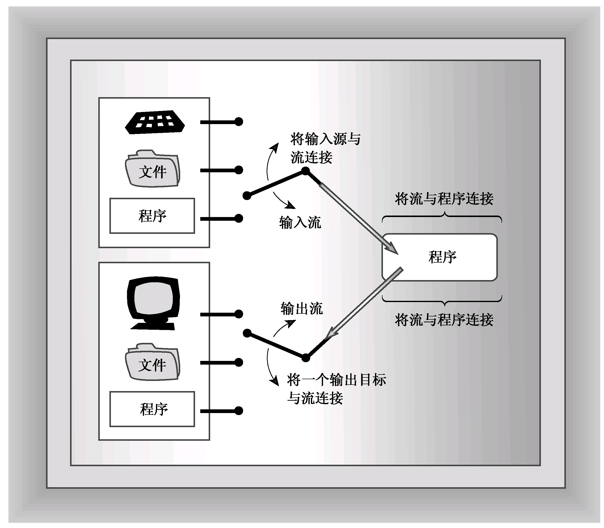
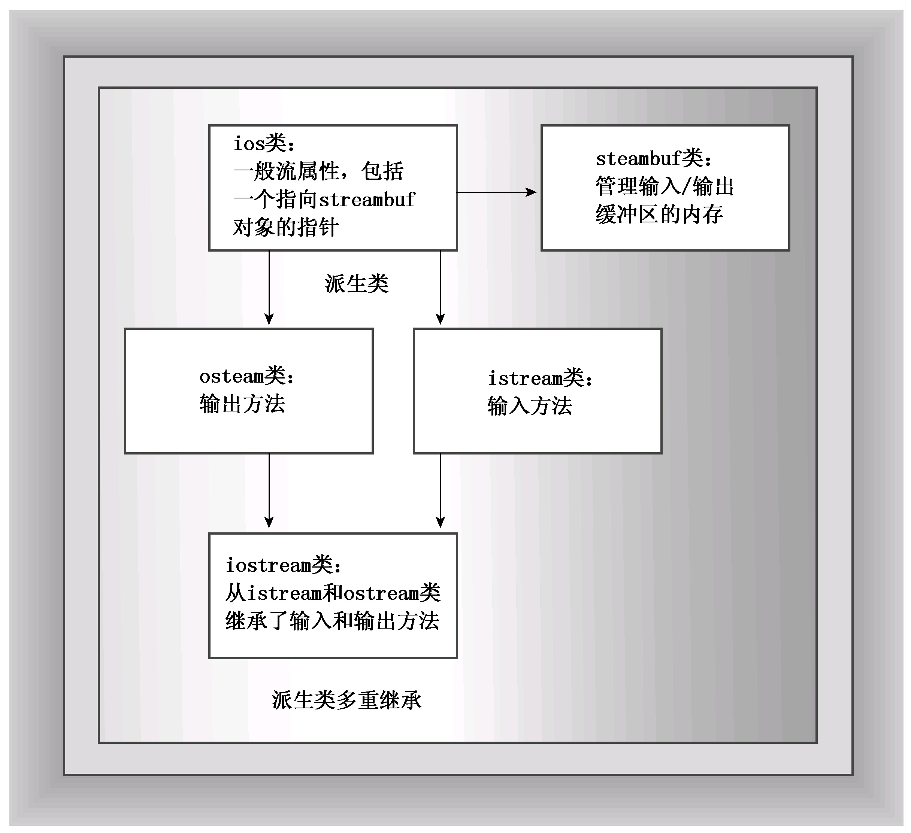
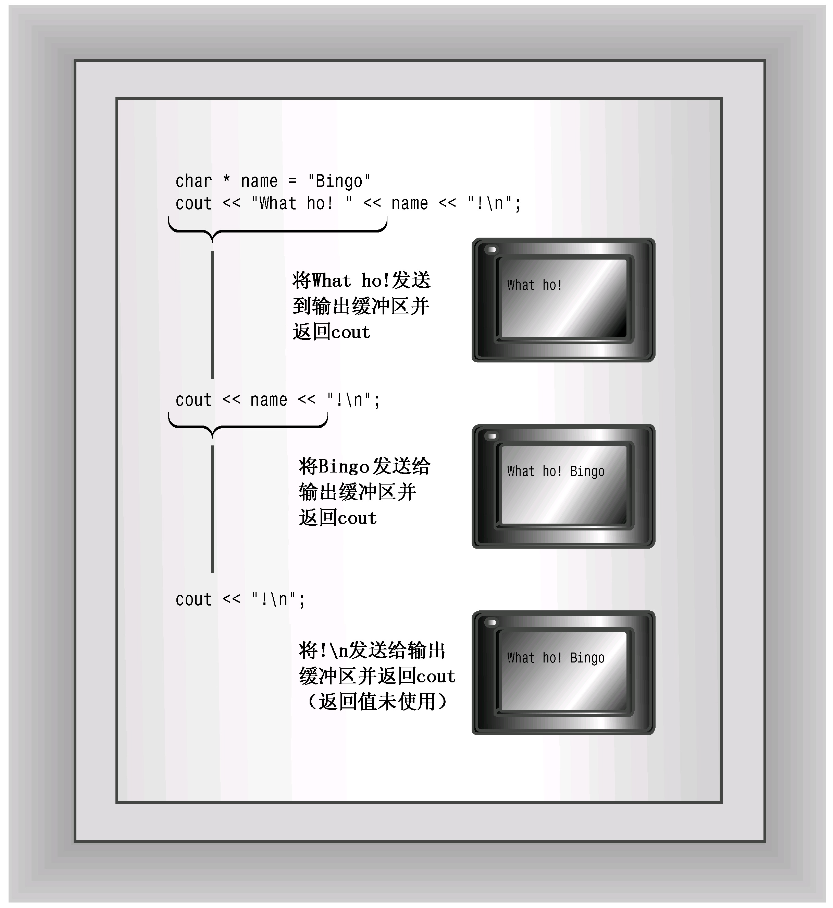
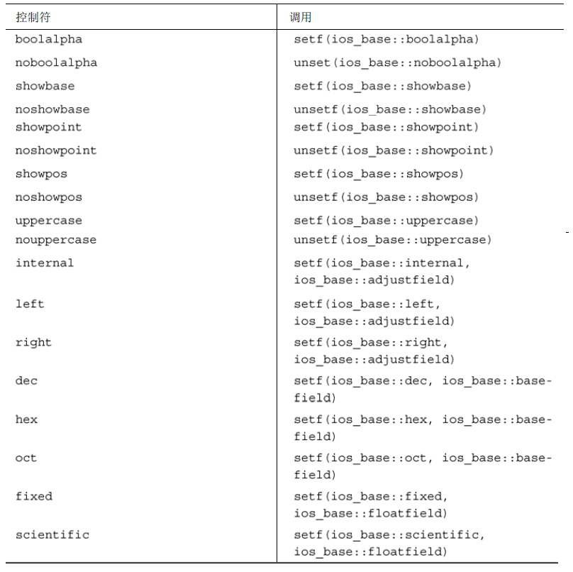
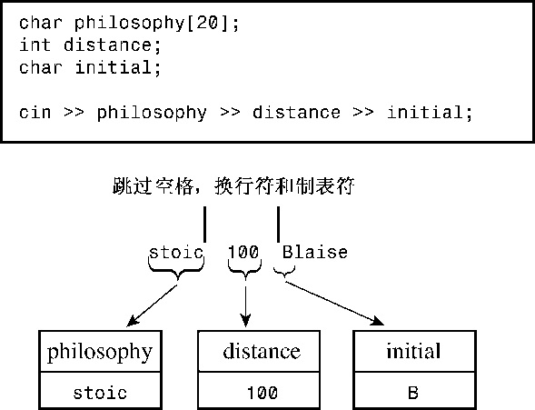
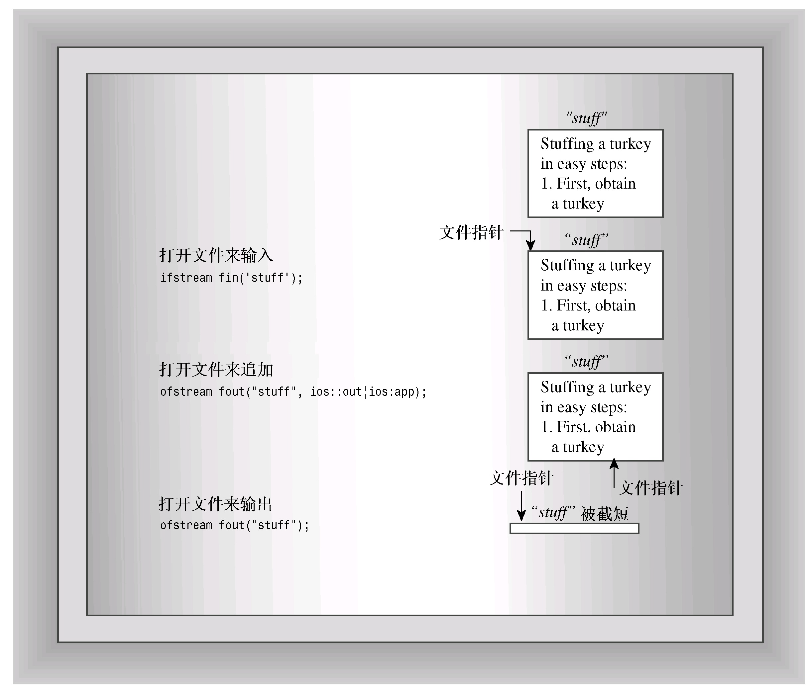
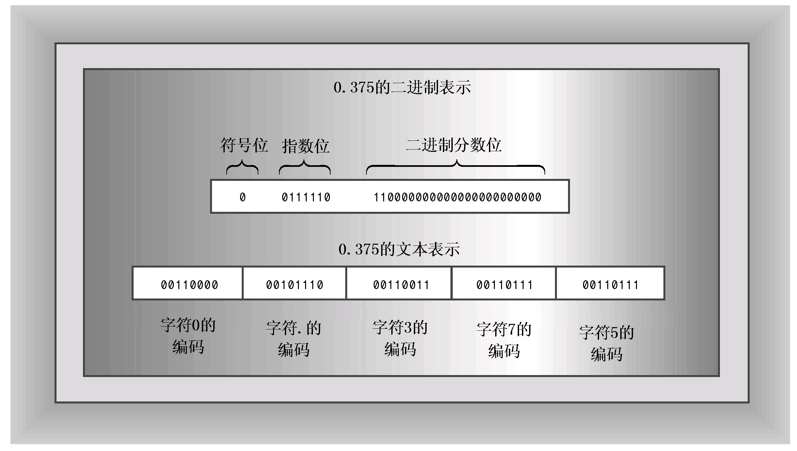

# 第17章 输入、输出和文件
本章内容包括：

* C++角度的输入和输出。
* iostream类系列。
* 重定向。
* ostream类方法。
* 格式化输出。
* istream类方法。
* 流状态。
* 文件I/O。
* 使用ifstream类从文件输入。
* 使用ofstream类输出到文件。
* 使用fstream类进行文件输入和输出。
* 命令行处理。
* 二进制文件。
* 随机文件访问。
* 内核格式化。

对C++输入和输出（简称I/O）的讨论提出了一个问题。一方面，几乎每个程序都要使用输入和输出，因此了解如何使用它们是每个学习计算机语言的人面临的首要任务；另一方面，C++使用了很多较为高级的语言特性来实现输入和输出，其中包括类、派生类、函数重载、虚函数、模板和多重继承。因此，要真正理解C++ I/O，必须了解C++的很多内容。为了帮助您起步，本书的开始几章介绍了使用istream类对象cin和ostream类对象cout进行输入和输出的基本方法，同时使用了ifstream和ofstream对象进行文件输入和输出。本章将更详细地介绍C++的输入和输出类，看看它们是如何设计的，学习如何控制输出格式（如果您跳过很多章，直接学习高级格式，可浏览一下讨论该主题的一些小节，注意其中的技术，而忽略解释）。

用于文件输入和输出的C++工具都是基于cin和cout所基于的基本类定义，因此本章以对控制台I/O（键盘和屏幕）的讨论为跳板，来研究文件I/O。

ANSI/ISO C++标准委员会的工作是让C++ I/O与现有的C I/O更加兼容，这给传统的C++做法带来了一些变化。

## 17.1 C++输入和输出概述
多数计算机语言的输入和输出是以语言本身为基础实现的。例如，从诸如BASIC和Pascal等语言的关键字列表中可知，PRINT语句、Writeln语句以及其他类似的语句都是语言词汇表的组成部分，但C和C++都没有将输入和输出建立在语言中。这两种语言的关键字包括for和if，但不包括与I/O有关的内容。C语言最初把I/O留给了编译器实现人员。这样做的一个原因是为了让实现人员能够自由的设计I/O函数，使之最适合于目标计算机的硬件要求。实际上，多数实现人员都把I/O建立在最初为UNIX环境开发的库函数的基础之上。ANSI C正式承认这个I/O软件包时，将其称为标准输入/输出包，并将其作为标准C库不可或缺的组成部分。C++也认可这个软件包，因此如果熟悉stdio.h文件中声明的C函数系列，则可以在C++程序中使用它们（较新的实现使用头文件cstdio来支持这些函数）。

然而，C++依赖于C++的I/O解决方案，而不是C语言的I/O解决方案，前者是在头文件iostream（以前为iostream.h）和fstream（以前为fstream.h）中定义一组类。这个类库不是正式语言定义的组成部分（cin和istream不是关键字）；毕竟计算机语言定义了如何工作（例如如何创建类）的规则，但没有定义应按照这些规则创建哪些东西。然而，正如C实现自带了一个标准函数库一样，C++也自带了一个标准类库。首先，标准类库是一个非正式的标准，只是由头文件iostream和fstream中定义的类组成。ANSI/ISO C++委员会决定把这个类正式作为一个标准类库，并添加其他一些标准类，如第16章讨论的那些类。本章将讨论标准C++ I/O。但首先看一看C++ I/O的概念框架。

### 17.1.1 流和缓冲区
C++程序把输入和输出看作字节流。输入时，程序从输入流中抽取字节；输出时，程序将字节插入到输出流中。对于面向文本的程序，每个字节代表一个字符，更通俗地说，字节可以构成字符或数值数据的二进制表示。输入流中的字节可能来自键盘，也可能来自存储设备（如硬盘）或其他程序。同样，输出流中的字节可以流向屏幕、打印机、存储设备或其他程序。流充当了程序和流源或流目标之间的桥梁。这使得C++程序可以以相同的方式对待来自键盘的输入和来自文件的输入。C++程序只是检查字节流，而不需要知道字节来自何方。同理，通过使用流，C++程序处理输出的方式将独立于其去向。因此管理输入包含两步：

* 将流与输入去向的程序关联起来。
* 将流与文件连接起来。

换句话说，输入流需要两个连接，每端各一个。文件端部连接提供了流的来源，程序端连接将流的流出部分转储到程序中（文件端连接可以是文件，也可以是设备，如键盘）。同样，对输出的管理包括将输出流连接到程序以及将输出目标与流关联起来。这就像将字节（而不是水）引入到水管中（参见图17.1）。



通常，通过使用缓冲区可以更高效地处理输入和输出。缓冲区是用作中介的内存块，它是将信息从设备传输到程序或从程序传输给设备的临时存储工具。通常，像磁盘驱动器这样的设备以512字节（或更多）的块为单位来传输信息，而程序通常每次只能处理一个字节的信息。缓冲区帮助匹配这两种不同的信息传输速率。例如，假设程序要计算记录在硬盘文件中的金额。程序可以从文件中读取一个字符，处理它，再从文件中读取下一个字符，再处理，依此类推。从磁盘文件中每次读取一个字符需要大量的硬件活动，速度非常慢。缓冲方法则从磁盘上读取大量信息，将这些信息存储在缓冲区中，然后每次从缓冲区里读取一个字节。因为从内存中读取单个字节的速度比从硬盘上读取快很多，所以这种方法更快，也更方便。当然，到达缓冲区尾部后，程序将从磁盘上读取另一块数据。这种原理与水库在暴风雨中收集几兆加仑流量的水，然后以比较文明的速度给您家里供水是一样的（见图17.2）。输出时，程序首先填满缓冲区，然后把整块数据传输给硬盘，并清空缓冲区，以备下一批输出使用。这被称为刷新缓冲区（flushing the buffer）。


键盘输入每次提供一个字符，因此在这种情况下，程序无需缓冲区来帮助匹配不同的数据传输速率。然而，对键盘输入进行缓冲可以让用户在将输入传输给程序之前返回并更正。C++程序通常在用户按下回车键时刷新输入缓冲区。这是为什么本书的例子没有一开始就处理输入，而是等到用户按下回车键后再处理的原因。对于屏幕输出，C++程序通常在用户发送换行符时刷新输出缓冲区。程序也可能会在其他情况下刷新输入，例如输入即将到来时，这取决于实现。也就是说，当程序到达输入语句时，它将刷新输出缓冲区中当前所有的输出。与ANSI C一致的C++实现是这样工作的。

### 17.1.2 流、缓冲区和iostream文件
管理流和缓冲区的工作有点复杂，但iostream（以前为iostream.h）文件中包含一些专门设计用来实现、管理流和缓冲区的类。C++98版本C++ I/O定义了一些类模板，以支持char和wchar_t数据；C++11添加了char16_t和char32_t具体化。通过使用typedef工具，C++使得这些模板char具体化能够模仿传统的非模板I/O实现。下面是其中的一些类（见图17.3）：



* streambuf类为缓冲区提供了内存，并提供了用于填充缓冲区、访问缓冲区内容、刷新缓冲区和管理缓冲区内存的类方法；
* ios_base类表示流的一般特征，如是否可读取、是二进制流还是文本流等；
* ios类基于ios_base，其中包括了一个指向streambuf对象的指针成员；
* ostream类是从ios类派生而来的，提供了输出方法；
* istream类也是从ios类派生而来的，提供了输入方法；
* iostream类是基于istream和ostream类的，因此继承了输入方法和输出方法。

要使用这些工具，必须使用适当的类对象。例如，使用ostream对象（如cout）来处理输出。创建这样的对象将打开一个流，自动创建缓冲区，并将其与流关联起来，同时使得能够使用类成员函数。

> **重定义I/O**
> 
> ISO/ANSI标准C++98对I/O作了两方面的修订。首先是从ostream.h到ostream的变化，用ostream将类放到std名称空间中。其次，I/O类被重新编写。为成为国际语言，C++必须能够处理需要16位的国际字符集或更宽的字符类型。因此，该语言在传统的8位char（“窄”）类型的基础上添加了wchar_t（“宽”）字符类型；而C++11添加了类型char16_t和char32_t。每种类型都需要有自己的I/O工具。标准委员会并没有开发两套（现在为4套）独立的类，而是开发了1套I/O类模板，其中包括basic_istream<charT，traits<charT>>和basic_ostream<charT， traits<charT>>。traits<charT>模板是一个模板类，为字符类型定义了具体特性，如如何比较字符是否相等以及字符的EOF值等。该C++11标准提供了I/O的char和wchar_t具体化。例如，istream和ostream都是char具体化的typedef。同样，wistream和wostream都是wchar_t具体化。例如，wcout对象用于输出宽字符流。头文件ostream中包含了这些定义。
> 
> ios基类中的一些独立于类型的信息被移动到新的ios_base类中，这包括各种格式化常量，例如ios::fixed（现在为ios_base::fixed）。另外，ios_base还包含了一些老式ios中没有的选项。

C++的iostream类库管理了很多细节。例如，在程序中包含iostream文件将自动创建8个流对象（4个用于窄字符流，4个用于宽字符流）。

* cin对象对应于标准输入流。在默认情况下，这个流被关联到标准输入设备（通常为键盘）。wcin对象与此类似，但处理的是wchar_t类型。
* cout对象与标准输出流相对应。在默认情况下，这个流被关联到标准输出设备（通常为显示器）。wcout对象与此类似，但处理的是wchar_t类型。
* cerr对象与标准错误流相对应，可用于显示错误消息。在默认情况下，这个流被关联到标准输出设备（通常为显示器）。这个流没有被缓冲，这意味着信息将被直接发送给屏幕，而不会等到缓冲区填满或新的换行符。wcerr对象与此类似，但处理的是wchar_t类型。
* clog对象也对应着标准错误流。在默认情况下，这个流被关联到标准输出设备（通常为显示器）。这个流被缓冲。wclog对象与此类似，但处理的是wchar_t类型。
* 对象代表流——这意味着什么呢？当iostream文件为程序声明一个cout对象时，该对象将包含存储了与输出有关的信息的数据成员，如显示数据时使用的字段宽度、小数位数、显示整数时采用的计数方法以及描述用来处理输出流的缓冲区的streambuf对象的地址。下面的语句通过指向的streambuf对象将字符串“Bjarna free”中的字符放到cout管理的缓冲区中：
```c++
cout << "Bjarne free";
```

ostream类定义了上述语句中使用的operator<<( )函数，ostream类还支持cout数据成员以及其他大量的类方法（如本章稍后将讨论的那些方法）。另外，C++注意到，来自缓冲区的输出被导引到标准输出（通常是显示器，由操作系统提供）。总之，流的一端与程序相连，另一端与标准输出相连，cout对象凭借streambuf对象的帮助，管理着流中的字节流。

### 17.1.3 重定向
标准输入和输出流通常连接着键盘和屏幕。但很多操作系统（包括UNIX、Linux和Windows）都支持重定向，这个工具使得能够改变标准输入和标准输出。例如，假设有一个名为counter.exe的、可执行的Windows命令提示符C++程序，它能够计算输入中的字符数，并报告结果（在大多数Windows系统中，可以选择“开始”>“程序”，再单击“命令提示符”来打开命令提示符窗口）。该程序的运行情况如下：
```c++
C>counter
Hello
and goodbye!
Control-Z       << simulated end-of-file
Input contained 19 characters
C>
```

其中的输入来自键盘，输出的被显示到屏幕上。

通过输入重定向（<）和输出重定向（>），可以使用上述程序计算文件oklahoma中的字符数，并将结果放到cow_cnt文件中：
```c++
cow_cnt file:
C>counter <oklahoma>cow_cnt
C>
```

命令行中的< oklahoma将标准输入与oklahoma文件关联起来，使cin从该文件（而不是键盘）读取输入。换句话说，操作系统改变了输入流的流入端连接，而流出端仍然与程序相连。命令行中的 >cow_cnt将标准输出与cow_cnt文件关联起来，导致cout将输出发送给文件（而不是屏幕）。也就是说，操作系统改变了输出流的流出端连接，而流入端仍与程序相连。DOS、Windows命令提示符模式、Linux和UNIX能自动识别这种重定向语法（除早期的DOS外，其他操作系统都允许在重定向运算符与文件名之间加上可选的空格）。

cout代表的标准输出流是程序输出的常用通道。标准错误流（由cerr和clog代表）用于程序的错误消息。默认情况下，这3个对象都被发送给显示器。但对标准输出重定向并不会影响cerr或clog，因此，如果使用其中一个对象来打印错误消息，程序将在屏幕上显示错误消息，即使常规的cout输出被重定向到其他地方。例如，请看下面的代码片段：
```c++
if (success)
    std::cout << "Here come the goodies!\n";
else
{
    std::cerr << "Something horrible has happened.\n";
    exit(1);
}
```

如果重定向没有起作用，则选定的消息都将被显示在屏幕上。然而，如果程序输出被重定向到一个文件，则第一条消息（如果被选定）将被发送到文件中，而第二条消息（如果被选定）将被发送到屏幕。顺便说一句，有些操作系统也允许对标准错误进行重定向。例如，在UNIX和Linux中，运算符2>重定向标准错误。

## 17.2 使用cout进行输出
正如前面指出的，C++将输出看作字节流（根据实现和平台的不同，可能是8位、16位或32位的字节，但都是字节），但在程序中，很多数据被组织成比字节更大的单位。例如，int类型由16位或32位的二进制值表示；double值由64位的二进制数据表示。但在将字节流发送给屏幕时，希望每个字节表示一个字符值。也就是说，要在屏幕上显示数字−2.34，需要将5个字符（−、2、.、3和4），而不是这个值的64位内部浮点表示发送到屏幕上。因此，ostream类最重要的任务之一是将数值类型（如int或float）转换为以文本形式表示的字符流。也就是说，ostream类将数据内部表示（二进制位模式）转换为由字符字节组成的输出流（以后会有仿生移植物，使得能够直接翻译二进制数据。我们把这种开发作为一个练习，留给您）。为执行这些转换任务，ostream类提供了多个类方法。现在就来看看它们，总结本书使用的方法，并介绍能够更精密地控制输出外观的其他方法。

### 17.2.1 重载的<<运算符
本书常结合使用cout和<<运算符（插入（insertion）运算符）：
```c++
int clients = 22;
cout << clients;
```

在C++中，与C一样，<<运算符的默认含义是按位左移运算符（参见附录E）。表达式x<<3的意思，将x的二进制表示中所有的位向左移动3位。显然，这与输出的关系不大。但ostream类重新定义了<<运算符，方法是将其重载为输出。在这种情况下，<<叫作插入运算符，而不是左移运算符（左移运算符由于其外观（像向左流动的信息流）而获得这种新角色）。插入运算符被重载，使之能够识别C++中所有的基本类型：

* unsigned char；
* signed char；
* char；
* short；
* unsigned short；
* int；
* unsiged int；
* long；
* unsigned long；
* long long（C++11）；
* unsigned long long（C++11）；
* float；
* double；
* long double。

对于上述每种数据类型，ostream类都提供了operator<<( )函数的定义（第11章讨论过，名称中包含运算符的函数用于重载该运算符）。因此，如果使用下面这样一条语句，而value是前面列出的类型之一，则C++程序将其对应于有相应的特征标的运算符函数：
```c++
cout << value;
```

例如，表达式cout<<88对应于下面的方法原型：
```c++
ostream & operator<<(int);
```

该原型表明，operator<<( )函数接受一个int参数，这与上述语句中的88匹配。该原型还表明，函数返回一个指向ostream对象的引用，这使得可以将输出连接起来，如下所示：
```c++
cout << "I'm feeling sedimental over " << boundary << "\n";
```

如果您是C语言程序员，深受%类型说明符过多、说明符类型与值不匹配时将发生问题等痛苦，则使用cout非常简单（当然，由于有cin， C++输入也非常简单）。

1. 输出和指针

ostream类还为下面的指针类型定义了插入运算符函数：

* const signed char *；
* const unsigned char *；
* const char *；
* void *。

不要忘了，C++用指向字符串存储位置的指针来表示字符串。指针的形式可以是char数组名、显式的char指针或用引号括起的字符串。因此，下面所有的cout语句都显示字符串：
```c++
char name[20] = "Dudly Diddlemore";
char * pn = "Violet D'Amore";
cout << "Hello!";
cout << name;
cout << pn;
```

方法使用字符串中的终止空字符来确定何时停止显示字符。

对于其他类型的指针，C++将其对应于void *，并打印地址的数值表示。如果要获得字符串的地址，则必须将其强制转换为其他类型，如下面的代码片段所示：
```c++
int eggs = 12;
char * amount = "dozen";
cout << &eggs;              // prints address of eggs variable
cout << amount;             // prints the string "dozen"
cout << (void *) amount;    // prints the address of the "dozen" string
```

2. 拼接输出

插入运算符的所有化身的返回类型都是ostream &。也就是说，原型的格式如下：
```c++
ostream & operator<<(type);
```

（其中，type是要显示的数据的类型）返回类型ostream &意味着使用该运算符将返回一个指向ostream对象的引用。哪个对象呢？函数定义指出，引用将指向用于调用该运算符的对象。换句话说，运算符函数的返回值为调用运算符的对象。例如，cout << “potluck”返回的是cout对象。这种特性使得能够通过插入来连接输出。例如，请看下面的语句：
```c++
cout << "We have " << count << "unhatched chickens.\n";
```

表达式cout << “We have”将显示字符串，并返回cout对象。至此，上述语句将变为：
```c++
cout << count << "unhatched chickens.\n";
```

表达式cout << count将显示count变量的值，并返回cout。然后cout将处理语句中的最后一个参数（参见图 17.4）。这种设计技术确实是一项很好的特性，这也是前几章中重载 << 运算符的示例模仿了这种技术的原因所在。



### 17.2.2 其他ostream方法
除了各种operator<<( )函数外，ostream类还提供了put( )方法和write( )方法，前者用于显示字符，后者用于显示字符串。

最初，put( )方法的原型如下：
```c++
ostream & put(char);
```

当前标准与此相同，但被模板化，以适用于wchar_t。可以用类方法表示法来调用它：
```c++
cout.put('W');    // display the W character
```

其中，cout是调用方法的对象，put( )是类成员函数。和<<运算符函数一样，该函数也返回一个指向调用对象的引用，因此可以用它将拼接输出：
```c++
cout.put('I').put('t');   // displaying It with two put() calls
```

函数调用cout.put('I')返回cout，cout然后被用作put('t')调用的调用对象。

在原型合适的情况下，可以将数值型参数（如int）用于put( )，让函数原型自动将参数转换为正确char值。例如，可以这样做：
```c++
cout.put(65);     // display the A character
cout.put(66.3);   // display the B character
```

第一条语句将int值65转换为一个char值，然后显示ASCII码为65的字符。同样，第二条语句将double值66.3转换为char值66，并显示对应的字符。

这种行为在C++ 2.0之前可派上用场。在这些版本中，C++语言用int值表示字符常量。因此，下面的语句将'W'解释为一个int值，因此将其作为整数87（即该字符的ASCII值）显示出来：
```c++
cout << 'W';
```

然而，下面这条语句能够正常工作：
```c++
cout.put('W');
```

因为当前的C++将char常量表示为char类型，因此现在可以使用上述任何一种方法。

一些老式编译器错误地为char、unsigned char和signed char 3种参数类型重载了put( )。这使得将int参数用于put( )时具有二义性，因为int可被转换为这3种类型中的任何一种。

write( )方法显示整个字符串，其模板原型如下：
```c++
basic_ostream<charT, traits>& write(const char type * s, streamsize n);
```

write( )的第一个参数提供了要显示的字符串的地址，第二个参数指出要显示多少个字符。使用cout调用write( )时，将调用char具体化，因此返回类型为ostream &。程序清单17.1演示了write( )方法是如何工作的。

程序清单17.1 write.cpp
```c++
// write.cpp -- using cout.write()
#include <iostream>
#include <cstring>  // or else string.h

int main()
{
    using std::cout;
    using std::endl;
    const char * state1 = "Florida";
    const char * state2 = "Kansas";
    const char * state3 = "Euphoria";
    int len = std::strlen(state2);
    cout << "Increasing loop index:\n";
    int i;
    for (i = 1; i <= len; i++)
    {
        cout.write(state2,i);
        cout << endl;
    }

// concatenate output
    cout << "Decreasing loop index:\n";
    for (i = len; i > 0; i--)
        cout.write(state2,i) << endl;

// exceed string length
    cout << "Exceeding string length:\n";
    cout.write(state2, len + 5) << endl;
    // std::cin.get();
    return 0; 
}
```

有些编译器可能指出该程序定义了数组state1和state3但没有使用它们。这不是什么问题，因为这两个数组只是用于提供数组state2前面和后面的数据，以便您知道程序错误地存取state2时发生的情况。下面是程序清单17.1中程序的输出：
```c++
Increasing loop index:
K
Ka
Kan
Kans
Kansa
Kansas
Decreasing loop index:
Kansas
Kansa
Kans
Kan
Ka
K
Exceeding string length:
KansasEuph
```

注意，cout.write( )调用返回cout对象。这是因为write( )方法返回一个指向调用它的对象的引用，这里调用它的对象是cout。

这使得可以将输出拼接起来，因为cout.write( )将被其返回值cout替换：
```c++
cout.write(state2,i) << endl;
```

还需要注意的是，write( )方法并不会在遇到空字符时自动停止打印字符，而只是打印指定数目的字符，即使超出了字符串的边界！在这个例子中，在字符串“kansas”的前后声明了另外两个字符串，以便相邻的内存包含数据。编译器在内存中存储数据的顺序以及调整内存的方式各不相同。例如，“Kansas”占用6个字节，而该编译器使用4个字节的倍数调整字符串，因此“Kansas”被填充成占用8个字节。由于编译器之间的差别，因此输出的最后一行可能不同。

write( )方法也可用于数值数据，您可以将数字的地址强制转换为char *，然后传递给它：
```c++
long val = 560031841;
cout.write((char *)&val, sizeof(long));
```

这不会将数字转换为相应的字符，而是传输内存中存储的位表示。例如，4字节的long值（如560031841）将作为4个独立的字节被传输。输出设备（如显示器）将把每个字节作为ASCII码进行解释。因此在屏幕上，560031841将被显示为4个字符的组合，这很可能是乱码（也可能不是，请试试看）。然而，write( )确实为将数值数据存储在文件中提供了一种简洁、准确的方式，这将在本章后面进行介绍。

### 17.2.3 刷新输出缓冲区
如果程序使用cout将字节发送给标准输出，情况将如何？由于ostream类对cout对象处理的输出进行缓冲，所以输出不会立即发送到目标地址，而是被存储在缓冲区中，直到缓冲区填满。然后，程序将刷新（flush）缓冲区，把内容发送出去，并清空缓冲区，以存储新的数据。通常，缓冲区为512字节或其整数倍。当标准输出连接的是硬盘上的文件时，缓冲可以节省大量的时间。毕竟，不希望程序为发送512个字节，而存取磁盘512次。将512个字节收集到缓冲区中，然后一次性将它们写入硬盘的效率要高得多。

然而，对于屏幕输出来说，首先填充缓冲区的重要性要低得多。如果必须重述消息“Press any key to continue”以便使用512个字节来填充缓冲区，实在是太不方便了。所幸的是，在屏幕输出时，程序不必等到缓冲区被填满。例如，将换行符发送到缓冲区后，将刷新缓冲区。另外，正如前面指出的，多数C++实现都会在输入即将发生时刷新缓冲区。也就是说，假设有下面的代码：
```c++
cout << "Enter a number: ";
float num;
cin >> num;
```

程序期待输入这一事实，将导致它立刻显示cout消息（即刷新“Enter a number：”消息），即使输出字符串中没有换行符。如果没有这种特性，程序将等待输入，而无法通过cout消息来提示用户。

如果实现不能在所希望时刷新输出，可以使用两个控制符中的一个来强行进行刷新。控制符flush刷新缓冲区，而控制符endl刷新缓冲区，并插入一个换行符。这两个控制符的使用方式与变量名相同：
```c++
cout << "Hello, good-looking! " << flush;
cout << "Wait just a moment, please." << endl;
```

事实上，控制符也是函数。例如，可以直接调用flush( )来刷新cout缓冲区：
```c++
flush(cout);
```

然而，ostream类对<<插入运算符进行了重载，使得下述表达式将被替换为函数调用flush(cout)：
```c++
cout << flush;
```

因此，可以用更为方便的插入表示法来成功地进行刷新。

### 17.2.4 用cout进行格式化
ostream插入运算符将值转换为文本格式。在默认情况下，格式化值的方式如下。

* 对于char值，如果它代表的是可打印字符，则将被作为一个字符显示在宽度为一个字符的字段中。
* 对于数值整型，将以十进制方式显示在一个刚好容纳该数字及负号（如果有的话）的字段中。
* 字符串被显示在宽度等于该字符串长度的字段中。

浮点数的默认行为有变化。下面详细说明了老式实现和新实现之间的区别。

* 新式：浮点类型被显示为6位，末尾的0不显示（注意，显示的数字位数与数字被存储时精度没有任何关系）。数字以定点表示法显示还是以科学计数法表示（参见第3章），取决于它的值。具体来说，当指数大于等于6或小于等于−5时，将使用科学计数法表示。另外，字段宽度恰好容纳数字和负号（如果有的话）。默认的行为对应于带%g说明符的标准C库函数fprintf( )。
* 老式：浮点类型显示为带6位小数，末尾的0不显示（注意，显示的数字位数与数字被存储时的精度没有任何关系）。数字以定点表示法显示还是以科学计数法表示（参见第3章），取决于它的值。另外，字段宽度恰好容纳数字和负号（如果有的话）。

因为每个值的显示宽度都等于它的长度，因此必须显式地在值之间提供空格；否则，相邻的值将不会被分开。

程序清单17.2演示默认的输出情况，它在每个值后面都显示一个冒号（：），以便可以知道每种情况下的字段宽度。该程序使用表达式1.0/9.0来生成一个无穷小数，以便能够知道打印了多少位。

> **注意：**
> 
> 并非所有的编译器都能生成符合当前C++标准格式的输出。另外，当前标准允许区域性变化。例如，欧洲实现可能遵循欧洲人的风格：使用逗号而不是句点来表示小数点。也就是说，2.54将被写成2，54。区域库（头文件locale）提供了用特定的风格影响（imbuing）输入或输出流的机制，所以同一个编译器能够提供多个区域选项。本章使用美国格式。

程序清单17.2 defaults.cpp
```c++
// defaults.cpp -- cout default formats
#include <iostream>

int main()
{
    using std::cout;
    cout << "12345678901234567890\n";
    char ch = 'K';
    int t = 273;
    cout << ch << ":\n";
    cout << t << ":\n";
    cout << -t <<":\n";

    double f1 = 1.200;
    cout << f1 << ":\n";
    cout << (f1 + 1.0 / 9.0) << ":\n";

    double f2 = 1.67E2;
    cout << f2 << ":\n";
    f2 += 1.0 / 9.0;
    cout << f2 << ":\n";
    cout << (f2 * 1.0e4) << ":\n";


    double f3 = 2.3e-4;
    cout << f3 << ":\n";
    cout << f3 / 10 << ":\n";
    // std::cin.get();
    return 0; 
}
```

程序清单17.2中程序的输出如下：
```c++
12345678901234567890
K:
273:
-273:
1.2:
1.31111:
167:
167.111:
1.67111e+06:
0.00023:
2.3e-05:
```

每个值都填充自己的字段。注意，1.200末尾的0没有显示出来，但末尾不带0的浮点值后面将有6个空格。另外，该实现将指数显示为3位，而其他实现可能为两位。

1. 修改显示时使用的计数系统

ostream类是从ios类派生而来的，而后者是从ios_base类派生而来的。ios_base类存储了描述格式状态的信息。例如，一个类成员中某些位决定了使用的计数系统，而另一个成员则决定了字段宽度。通过使用控制符（manipulator），可以控制显示整数时使用的计数系统。通过使用ios_base的成员函数，可以控制字段宽度和小数位数。由于ios_base类是ostream的间接基类，因此可以将其方法用于ostream对象（或子代），如cout。

> **注意：**
> 
> ios_base类中的成员和方法以前位于ios类中。现在，ios_base是ios的基类。在新系统中，ios是包含char和wchar_t具体化的模板，而ios_base包含了非模板特性。

来看如何设置显示整数时使用的计数系统。要控制整数以十进制、十六进制还是八进制显示，可以使用dec、hex和oct控制符。例如，下面的函数调用将cout对象的计数系统格式状态设置为十六进制：
```c++
hex(cout);
```

完成上述设置后，程序将以十六进制形式打印整数值，直到将格式状态设置为其他选项为止。注意，控制符不是成员函数，因此不必通过对象来调用。

虽然控制符实际上是函数，但它们通常的使用方式为：
```c++
cout << hex;
```

ostream类重载了<<运算符，这使得上述用法与函数调用hex（cout）等价。控制符位于名称空间std中。程序清单17.3演示了这些控制符的用法，它以3种不同的计数系统显示了一个整数的值极其平方。注意，可以单独使用控制符，也可将其作为一系列插入的组成部分。

程序清单17.3 manip.cpp
```c++
// manip.cpp -- using format manipulators
#include <iostream>
int main()
{
    using namespace std;
    cout << "Enter an integer: ";
    int n;
    cin >> n;

    cout << "n     n*n\n";
    cout << n << "     " << n * n << " (decimal)\n";
// set to hex mode
    cout << hex;
    cout << n << "     ";
    cout << n * n << " (hexadecimal)\n";

// set to octal mode
    cout << oct << n << "     " << n * n << " (octal)\n";

// alternative way to call a manipulator
    dec(cout);
    cout << n << "     " << n * n << " (decimal)\n";
    // cin.get();
    // cin.get();
    return 0; 
}
```

下面程序清单17.3中程序的运行情况：
```c++
Enter an integer: 13
n     n*n
13     169 (decimal)
d     a9 (hexadecimal)
15     251 (octal)
13     169 (decimal)
```

2. 调整字段宽度

您可能已经注意到，在程序清单17.3的输出中各列并没有对齐，这是因为数字的字段宽度不相同。可以使用width成员函数将长度不同的数字放到宽度相同的字段中，该方法的原型为：
```c++
int width();
int width(int i);
```

第一种格式返回字段宽度的当前设置；第二种格式将字段宽度设置为i个空格，并返回以前的字段宽度值。这使得能够保存以前的值，以便以后恢复宽度值时使用。

width( )方法只影响将显示的下一个项目，然后字段宽度将恢复为默认值。例如，请看下面的语句：
```c++
cout << '#';
cout.width(12);
cout << 12 << "#" << 24 << "#\n";
```

由于width( )是成员函数，因此必须使用对象（这里为cout）来调用它。输出语句生成的输出如下：
```c++
#          12#24#
```

12被放到宽度为12个字符的字段的最右边，这被称为右对齐。然后，字段宽度恢复为默认值，并将两个#符号以及24放在宽度与它们的长度相等的字段中。

> **警告：**
> 
> width( )方法只影响接下来显示的一个项目，然后字段宽度将恢复为默认值。

C++永远不会截短数据，因此如果试图在宽度为2的字段中打印一个7位值，C++将增宽字段，以容纳该数据（在有些语言中，如果数据长度与字段宽度不匹配，将用星号填充字段。C/C++的原则是：显示所有的数据比保持列的整洁更重要。C++视内容重于形式）。程序清单17.4演示了width( )成员函数是如何工作的。

程序清单17.4 width.cpp
```c++
// width.cpp -- using the width method
#include <iostream>

int main()
{
    using std::cout;
    int w = cout.width(30);
    cout << "default field width = " << w << ":\n";

    cout.width(5);
    cout << "N" <<':';
    cout.width(8);
    cout << "N * N" << ":\n";

    for (long i = 1; i <= 100; i *= 10)
    {
        cout.width(5);
        cout << i <<':';
        cout.width(8);
        cout << i * i << ":\n";
    }
    // std::cin.get();
    return 0; 
}
```

程序清单17.4中程序的输出如下：
```c++
        default field width = 0:
    N:   N * N:
    1:       1:
   10:     100:
  100:   10000:
```

在上述输出中，值在字段中右对齐。输出中包含空格，也就是说，cout通过加入空格来填满整个字段。右对齐时，空格被插入到值的左侧。用来填充的字符叫做填充字符（fill character）。右对齐是默认的。

注意，在程序清单17.4中，第一条cout语句显示字符串时，字段宽度被设置为30，但在显示w的值时，字段宽度不是30。这是由于width( )方法只影响接下来被显示的一个项目。另外，w的值为0。这是由于cout.width（30）返回的是以前的字段宽度，而不是刚设置的值。W为0表明，默认的字段宽度为0。由于C++总会增长字段，以容纳数据，因此这种值适用于所有的数据。最后，程序使用width( )来对齐列标题和数据，方法是将第1列宽度设置为5个字符，将第2列的宽度设置为8个字符。

3. 填充字符

在默认情况下，cout用空格填充字段中未被使用的部分，可以用fill( )成员函数来改变填充字符。例如，下面的函数调用将填充字符改为星号：
```c++
cout.fill('*');
```

这对于检查打印结果，防止接收方添加数字很有用。程序清单17.5演示了该成员函数的用法。

程序清单17.5 fill.cpp
```c++
// fill.cpp -- changing fill character for fields
#include <iostream>

int main()
{
    using std::cout;
    cout.fill('*');
    const char * staff[2] = { "Waldo Whipsnade", "Wilmarie Wooper"};
    long bonus[2] = {900, 1350};

    for (int i = 0; i < 2; i++)
    {
        cout << staff[i] << ": $";
        cout.width(7);
        cout << bonus[i] << "\n";
    }
    // std::cin.get();
    return 0; 
}
```

下面是程序清单17.5中程序的输出：
```c++
Waldo Whipsnade: $****900
Wilmarie Wooper: $***1350
```

注意，与字段宽度不同的是，新的填充字符将一直有效，直到更改它为止。

4. 设置浮点数的显示精度

浮点数精度的含义取决于输出模式。在默认模式下，它指的是显示的总位数。在定点模式和科学模式下（稍后将讨论），精度指的是小数点后面的位数。已经知道，C++的默认精度为6位（但末尾的0将不显示）。precision( )成员函数使得能够选择其他值。例如，下面语句将cout的精度设置为2：
```c++
cout.precision(2);
```

和width( )的情况不同，但与fill( )类似，新的精度设置将一直有效，直到被重新设置。程序清单17.6准确地说明了这一点。

程序清单17.6 precise.cpp
```c++
// precise.cpp -- setting the precision
#include <iostream>

int main()
{
    using std::cout;
    float price1 = 20.40;
    float price2 = 1.9 + 8.0 / 9.0;

    cout << "\"Furry Friends\" is $" << price1 << "!\n";
    cout << "\"Fiery Fiends\" is $" << price2 << "!\n";

    cout.precision(2);
    cout << "\"Furry Friends\" is $" << price1 << "!\n";
    cout << "\"Fiery Fiends\" is $" << price2 << "!\n";
	// std::cin.get();
    return 0; 
}
```

下面是程序清单17.6中程序的输出：
```c++
"Furry Friends" is $20.4!
"Fiery Fiends" is $2.78889!
"Furry Friends" is $20!
"Fiery Fiends" is $2.8!
```

注意，第3行没有打印小数点及其后面的内容。另外，第4行显示的总位数为2位。

5. 打印末尾的0和小数点

对于有些输出（如价格或栏中的数字），保留末尾的0将更为美观。例如，对于程序清单17.6的输出，$20.40将比$20.4更美观。iostream系列类没有提供专门用于完成这项任务的函数，但ios_base类提供了一个setf( )函数（用于set标记），能够控制多种格式化特性。这个类还定义了多个常量，可用作该函数的参数。例如，下面的函数调用使cout显示末尾小数点：
```c++
cout.self(ios_base::showpoint);
```

使用默认的浮点格式时，上述语句还将导致末尾的0被显示出来。也就是说，如果使用默认精度（6位）时，cout不会将2.00显示为2，而是将它显示为2.000000。程序清单17.7在程序清单17.6中添加了这条语句。

您可能对表示法ios_base::showpoint有疑问，showpoint是ios_base类声明中定义的类级静态常量。类级意味着如果在成员函数定义的外面使用它，则必须在常量名前面加上作用域运算符（::）。因此ios_base::showpoint指的是在ios_base类中定义的一个常量。

程序清单17.7 showpt.cpp
```c++
// showpt.cpp -- setting the precision, showing trailing point
#include <iostream>

int main()
{
    using std::cout;
    using std::ios_base;

    float price1 = 20.40;
    float price2 = 1.9 + 8.0 / 9.0;

    cout.setf(ios_base::showpoint);
    cout << "\"Furry Friends\" is $" << price1 << "!\n";
    cout << "\"Fiery Fiends\" is $" << price2 << "!\n";

    cout.precision(2);
    cout << "\"Furry Friends\" is $" << price1 << "!\n";
    cout << "\"Fiery Fiends\" is $" << price2 << "!\n";
	// std::cin.get();
    return 0; 
}
```

下面是使用当前C++格式时，程序清单17.7中程序的输出：
```c++
"Furry Friends" is $20.4000!
"Fiery Fiends" is $2.78889!
"Furry Friends" is $20.!
"Fiery Fiends" is $2.8!
```

在上述输出中，第一行显示了；第三行显示了小数点，但没有显示末尾的0，这是因为精度被设置为2，而小数点前面已经包含两位。

6. 再谈setf( )

setf( )方法控制了小数点被显示时其他几个格式选项，因此来仔细研究一下它。ios_base类有一个受保护的数据成员，其中的各位（这里叫作标记）分别控制着格式化的各个方面，例如计数系统、是否显示末尾的0等。打开一个标记称为设置标记（或位），并意味着相应的位被设置为1。位标记是编程开关，相当于设置DIP开关以配置计算机硬件。例如，hex、dec和oct控制符调整控制计数系统的3个标记位。setf( )函数提供了另一种调整标记位的途径。

setf( )函数有两个原型。第一个为：
```c++
fmtflags self(fmtflags);
```

其中，fmtflags是bitmask类型（参见后面的“注意”）的typedef名，用于存储格式标记。该名称是在ios_base类中定义的。这个版本的setf( )用来设置单个位控制的格式信息。参数是一个fmtflags值，指出要设置哪一位。返回值是类型为fmtflags的数字，指出所有标记以前的设置。如果打算以后恢复原始设置，则可以保存这个值。应给setf( )传递什么呢？如果要第11位设置为1，则可以传递一个第11位为1的数字。返回值的第11位将被设置为1。对位进行跟踪好像单调乏味（实际上也是这样）。然而，您不必作做这项工作，ios_base类定义了代表位值的常量，表17.1列出了其中的一些定义。

**表17.1 格式常量**

| 常 量 | 含 义 |
| :--- | :--- |
| ios_base::boolalpha | 输入和输出bool值，可以为true或false |
| ios_base::showbase | 对于输出，使用C++基数前缀（0，0x） |
| ios_base::showpoint | 显示末尾的小数点 |
| ios_base::uppercase | 对于16进制输出，使用大写字母，E表示法 |
| ios_base::showpos | 在正数前面加上+ |

> **注意：**
> 
> bitmask类型是一种用来存储各个位值的类型。它可以是整型、枚举，也可以是STL bitset容器。这里的主要思想是，每一位都是可以单独访问的，都有自己的含义。iostream软件包使用bitmask来存储状态信息。

由于这些格式常量都是在ios_base类中定义，因此使用它们时，必须加上作用域解析运算符。也就是说，应使用ios_base ::uppercase，而不是uppercase。如果不想使用using编译指令或using声明，可以使用作用域运算符来指出这些名称位于名称空间std中。修改将一直有效，直到被覆盖为止。程序清单17.8演示了如何使用其中一些常量。

程序清单17.8 setf.cpp
```c++
// setf.cpp -- using setf() to control formatting
#include <iostream>

int main()
{
    using std::cout;
    using std::endl;
    using std::ios_base;

    int temperature = 63;

    cout << "Today's water temperature: ";
    cout.setf(ios_base::showpos);    // show plus sign
    cout << temperature << endl;

    cout << "For our programming friends, that's\n";
    cout << std::hex << temperature << endl; // use hex
    cout.setf(ios_base::uppercase);  // use uppercase in hex
    cout.setf(ios_base::showbase);   // use 0X prefix for hex
    cout << "or\n";
    cout << temperature << endl;
    cout << "How " << true << "!  oops -- How ";
    cout.setf(ios_base::boolalpha);
    cout << true << "!\n";
	// std::cin.get();
    return 0; 
}
```

下面是程序清单17.8中程序的输出：
```c++
Today's water temperature: +63
For our programming friends, that's
3f
or
0X3F
How 0X1!  oops -- How true!
```

注意，仅当基数为10时才使用加号。C++将十六进制和八进制都视为无符号的，因此对它们，无需使用符号（然而，有些C++实现可能仍然会显示加号）。

第二个setf( )原型接受两个参数，并返回以前的设置：
```c++
fmtflags setf(fmtflags, fmtflags);
```

函数的这种重载格式用于设置由多位控制的格式选项。第一参数和以前一样，也是一个包含了所需设置的fmtflags值。第二参数指出要清除第一个参数中的哪些位。例如，将第3位设置为1表示以10为基数，将第4位设置为1表示以8为基数，将第5位设置为1表示以16为基数。假设输出是以10为基数的，而要将它设置为以16为基数，则不仅需要将第5位设置为1，还需要将第3位设置为0——这叫作清除位（clearing the bit）。聪明的十六进制控制符可自动完成这两项任务。使用函数setf( )时，要做的工作多些，因为要用第二参数指出要清除哪些位，用第一参数指出要设置哪位。这并不像听上去那么复杂，因为ios_base类为此定义了常量（如表17.2所示）。具体地说，要修改基数，可以将常量ios_base::basefield用作第二参数，将ios_base ::hex用作第一参数。也就是说，下面的函数调用与使用十六进制控制符的作用相同：
```c++
cout.setf(ios_base::hex, ios_base::basefield);
```

**表17.2 setf(long, long)的参数**

| 第二个参数 | 第一个参数 | 含 义 |
| :--- | :--- | :--- |
| ios_base::basefield | ios_base::dec | 使用基数10 |
| ios_base::basefield | ios_base::oct | 使用基数8 |
| ios_base::basefield | ios_base::hex | 使用基数16 |
| ios_base::floatfield | ios_base::fixed | 使用定点计数法 |
| ios_base::floatfield | ios_base::scientific | 使用科学计数法 |
| ios_base::adjustfield | ios_base::left | 使用左对齐 |
| ios_base::adjustfield | ios_base::right | 使用右对齐 |
| ios_base::adjustfield | ios_base::internal | 符号或基数前缀左对齐，值右对齐 |

ios_base类定义了可按这种方式处理的3组格式标记。每组标记都由一个可用作第二参数的常量和两三个可用作第一参数的常量组成。第二参数清除一批相关的位，然后第一参数将其中一位设置为1。表17.2列出了用作setf( )的第二参数的常量的名称、可用作第一参数的相关常量以及它们的含义。例如，要选择左对齐，可将ios_base ::adjustfield用作第二参数，将ios_base ::left作为第一参数。左对齐意味着将值放在字段的左端，右对齐则表示将值放在字段的右端。内部对齐表示将符号或基数前缀放在字段左侧，余下的数字放在字段的右侧（遗憾的是，C++没有提供自对齐模式）。

定点表示法意味着使用格式123.4来表示浮点值，而不管数字的长度如何，科学表示法则意味着使用格式1.23e04，而不考虑数字的长度。如果您熟悉C语言中printf( )的说明符，则可能知道，默认的C++模式对应于%g说明符，定点表示法对应于%f说明符，而科学表示法对应于%e说明符。

在C++标准中，定点表示法和科学表示法都有下面两个特征：

* 精度指的是小数位数，而不是总位数；
* 显示末尾的0。

setf( )函数是ios_base类的一个成员函数。由于这个类是ostream类的基类，因此可以使用cout对象来调用该函数。例如，要左对齐，可使用下面的调用：
```c++
ios_base::fmtflags old = cout.setf(ios::left, ios::adjustfield);
```

要恢复以前的设置，可以这样做：
```c++
cout.setf(old, ios::adjustfield);
```

程序清单17.9是一个使用两个参数的setf( )的示例。

> **注意：**
> 
> 程序清单17.9中的程序使用了一个数学函数，有些C++系统不自动搜索数学库。例如，有些UNIX系统要求这样做：
> ```c++
> $ CC setf2.C -lm
> ```

-lm选项命令链接程序搜索数学库。同样，有些使用g++的Linux系统也要求这样做。

程序清单17.9 setf2.cpp
```c++
// setf2.cpp -- using setf() with 2 arguments to control formatting
#include <iostream>
#include <cmath>

int main()
{
    using namespace std;
   // use left justification, show the plus sign, show trailing
    // zeros, with a precision of 3
    cout.setf(ios_base::left, ios_base::adjustfield);
    cout.setf(ios_base::showpos);
    cout.setf(ios_base::showpoint);
    cout.precision(3);
    // use e-notation and save old format setting
    ios_base::fmtflags old = cout.setf(ios_base::scientific,
        ios_base::floatfield);
    cout << "Left Justification:\n";
    long n;
    for (n = 1; n <= 41; n+= 10)
    {
        cout.width(4);
        cout << n << "|";
        cout.width(12);
        cout << sqrt(double(n)) << "|\n";
    }

    // change to internal justification
    cout.setf(ios_base::internal, ios_base::adjustfield);
    // restore default floating-point display style
    cout.setf(old, ios_base::floatfield);

    cout << "Internal Justification:\n";
    for (n = 1; n <= 41; n+= 10)
    {
        cout.width(4);
        cout << n << "|";
        cout.width(12);
        cout << sqrt(double(n)) << "|\n";
    }

    // use right justification, fixed notation
    cout.setf(ios_base::right, ios_base::adjustfield);
    cout.setf(ios_base::fixed, ios_base::floatfield);
    cout << "Right Justification:\n";
    for (n = 1; n <= 41; n+= 10)
    {
        cout.width(4);
        cout << n << "|";
        cout.width(12);
        cout << sqrt(double(n)) << "|\n";
    }
	// std::cin.get();
    return 0; 
}
```

下面是程序清单17.9中程序的输出：
```c++
Left Justification:
+1  |+1.000e+00  |
+11 |+3.317e+00  |
+21 |+4.583e+00  |
+31 |+5.568e+00  |
+41 |+6.403e+00  |
Internal Justification:
+  1|+       1.00|
+ 11|+       3.32|
+ 21|+       4.58|
+ 31|+       5.57|
+ 41|+       6.40|
Right Justification:
  +1|      +1.000|
 +11|      +3.317|
 +21|      +4.583|
 +31|      +5.568|
 +41|      +6.403|
```

注意到精度3让默认的浮点显示（在这个程序中用于内部对齐）总共显示3位，而定点模式和科学模式只显示3位小数（e表示法的指数位数取决于实现）。

调用setf( )的效果可以通过unsetf( )消除，后者的原型如下：
```c++
void unsetf(fmtflags mask);
```

其中，mask是位模式。mask中所有的位都设置为1，将使得对应的位被复位。也就是说，setf( )将位设置为1，unsetf( )将位恢复为0。例如：
```c++
cout.setf(ios_base::showpoint);         // show training decimal point
cout.unsetf(ios_base::boolshowpoint);   // don't show trailing decimal point
cout.setf(ios_base::boolalpha);         // display true, false
cout.unsetf(ios_base::boolalpha);       // display 1, 0
```

您可能注意到了，没有专门指示浮点数默认显示模式的标记。系统的工作原理如下：仅当只有定点位被设置时使用定点表示法；仅当只有科学位被设置时使用科学表示法；对于其他组合，如没有位被设置或两位都被设置时，将使用默认模式。因此，启用默认模式的方法之一如下：
```c++
cout.setf(0, ios_base::floatfield);   // go to default mode
```

第二个参数关闭这两位，而第一个参数不设置任何位。一种实现同样目标的简捷方式是，使用参数ios::floatfield来调用函数unsetf( )：
```c++
cout.unsetf(ios_base::floatfield);    // go to default mode
```

如果已知cout处于定点状态，则可以使用参数ios_base::fixed调用函数unsetf( )来切换到默认模式；然而，无论cout的当前状态如何，使用参数ios_base::floatfield调用函数unsetf( )都将切换到默认模式，因此这是一种更好的选择。

7. 标准控制符

使用setf( )不是进行格式化的、对用户最为友好的方法，C++提供了多个控制符，能够调用setf( )，并自动提供正确的参数。前面已经介绍过dec、hex和oct，这些控制符（多数都不适用于老式C++实现）的工作方式都与hex相似。例如，下面的语句打开左对齐和定点选项：
```c++
cout << left << fixed;
```

表17.3列出了这些控制符以及其他一些控制符。

**表17.3 一些标准控制符**



> **提示：**
> 
> 如果系统支持这些控制符，请使用它们；否则，仍然可以使用setf( )。

8. 头文件iomanip

使用iostream工具来设置一些格式值（如字段宽度）不太方便。为简化工作，C++在头文件iomanip中提供了其他一些控制符，它们能够提供前面讨论过的服务，但表示起来更方便。3个最常用的控制符分别是setprecision( )、setfill( )和setw( )，它们分别用来设置精度、填充字符和字段宽度。与前面讨论的控制符不同的是，这3个控制符带参数。setprecision( )控制符接受一个指定精度的整数参数；setfill( ) 控制符接受一个指定填充字符的char参数；setw( )控制符接受一个指定字段宽度的整数参数。由于它们都是控制符，因此可以用cout语句连接起来。这样，setw( )控制符在显示多列值时尤其方便。程序清单17.10演示了这一点，它对于每一行输出，都多次修改了字段宽度和填充字符，同时使用了一些较新的标准控制符。

> **注意：**
> 
> 有些C++系统不自动搜索数学库。前面说过，有些UNIX系统要求使用如下命令选项来访问数学库：
> ```c++
> $ CC iomanio.C -lm
> ```

程序清单17.10 iomanip.cpp
```c++
// iomanip.cpp -- using manipulators from iomanip
// some systems require explicitly linking the math library
#include <iostream>
#include <iomanip>
#include <cmath>

int main()
{
    using namespace std;
    // use new standard manipulators
    cout << fixed << right;

    // use iomanip manipulators
    cout << setw(6) << "N" << setw(14) << "square root"
         << setw(15) << "fourth root\n";

    double root;
    for (int n = 10; n <=100; n += 10)
    {
        root = sqrt(double(n));
        cout << setw(6) << setfill('.') << n << setfill(' ')
               << setw(12) << setprecision(3) << root
               << setw(14) << setprecision(4) << sqrt(root)
               << endl;
    }
	// std::cin.get();
    return 0; 
}
```

下面是程序清单17.10中程序的输出：
```c++
     N   square root   fourth root
....10       3.162        1.7783
....20       4.472        2.1147
....30       5.477        2.3403
....40       6.325        2.5149
....50       7.071        2.6591
....60       7.746        2.7832
....70       8.367        2.8925
....80       8.944        2.9907
....90       9.487        3.0801
...100      10.000        3.1623
```

现在可以生成几乎完全对齐的列了。使用fixed控制符导致显示末尾的0。

## 17.3 使用cin进行输入
现在来介绍输入，即如何给程序提供数据。cin对象将标准输入表示为字节流。通常情况下，通过键盘来生成这种字符流。如果键入字符序列2011，cin对象将从输入流中抽取这几个字符。输入可以是字符串的一部分、int值、float值，也可以是其他类型。因此，抽取还涉及了类型转换。cin对象根据接收值的变量的类型，使用其方法将字符序列转换为所需的类型。

通常，可以这样使用cin：
```c++
cin >> value_holder;
```

其中，value_holder为存储输入的内存单元，它可以是变量、引用、被解除引用的指针，也可以是类或结构的成员。cin解释输入的方式取决于value_holder的数据类型。istream类（在iostream头文件中定义）重载了抽取运算符>>，使之能够识别下面这些基本类型：

* signed char &；
* unsigned char &；
* char &；
* short &；
* unsigned short &；
* int &；
* unsigned int &；
* long &；
* unsigned long &；
* long long &（C++11）；
* unsigned long long &（C++11）；
* float &；
* double &；
* long double &。

这些运算符函数被称为格式化输入函数（formatted input functions），因为它们可以将输入数据转换为目标指定的格式。

典型的运算符函数的原型如下：
```c++
istream & operator >> (int &);
```

参数和返回值都是引用。引用参数（参见第8章）意味着下面这样的语句将导致operator>>( )函数处理变量staff_size本身，而不是像常规参数那样处理它的副本：
```c++
cin >> staff_size;
```

由于参数类型为引用，因此cin能够直接修改用作参数的变量的值。例如，上述语句将直接修改变量staff_size的值。稍后将介绍引用返回值的重要意义。首先来看抽取运算符的类型转换方面。对于上述列出的各种类型的参数，抽取运算符将字符输入转换为指定类型的值。例如，假设staff_size的类型为int，则编译器将：
```c++
cin >> staff_size;
```

与下面的原型匹配：
```c++
istream & operator>>(int &);
```

对应于上述原型的函数将读取发送给程序的字符流（假设为字符2、3、1、8和4）。对于使用2字节int的系统来说，函数将把这些字符转换为整数23184的2字节二进制表示。如果staff_size的类型为double，则cin将使用operator >> (double &)将上述输入转换为值23184.0的8字节浮点表示。

顺便说一句，可以将hex、oct和dec控制符与cin一起使用，来指定将整数输入解释为十六进制、八进制还是十进制格式。例如，下面的语句将输入12或0x12解释为十六进制的12或十进制的18，而将ff或FF解释为十进制的255：
```c++
cin >> hex;
```

istream类还为下列字符指针类型重载了>>抽取运算符：

* signed char *；
* char *；
* unsigned char *。

对于这种类型的参数，抽取运算符将读取输入中的下一个单词，将它放置到指定的地址，并加上一个空值字符，使之成为一个字符串。例如，假设有这样一段代码：
```c++
cout << "Enter your first name:\n";
char name[20];
cin >> name;
```

如果通过键入Liz来进行响应，则抽取运算符将把字符Liz\0放到name数组中（\0表示末尾的空值字符）。name标识符是一个char数组名，可作为数组第一个元素的地址，这使name的类型为char *（指向char的指针）。

每个抽取运算符都返回调用对象的引用，这使得能够将输入拼接起来，就像拼接输出那样：
```c++
char name[20];
float fee;
int group;
cin >> name >> fee >> group;
```

其中，cin>>name返回的cin对象成了处理fee的对象。

### 17.3.1 cin>>如何检查输入
不同版本的抽取运算符查看输入流的方法是相同的。它们跳过空白（空格、换行符和制表符），直到遇到非空白字符。即使对于单字符模式（参数类型为char、unsigned char或signed char），情况也是如此，但对于C语言的字符输入函数，情况并非如此（参见图17.5）。在单字符模式下，>>运算符将读取该字符，将它放置到指定的位置。在其他模式下，>>运算符将读取一个指定类型的数据。也就是说，它读取从非空白字符开始，到与目标类型不匹配的第一个字符之间的全部内容。



例如，对于下面的代码：
```c++
int elevation;
cin >> elevation;
```

假设键入下面的字符：
```c++
-123Z
```

运算符将读取字符−、1、2和3，因为它们都是整数的有效部分。但Z字符不是有效字符，因此输入中最后一个可接受的字符是3。Z将留在输入流中，下一个cin语句将从这里开始读取。与此同时，运算符将字符序列−123转换为一个整数值，并将它赋给elevation。

输入有时可能没有满足程序的期望。例如，假设输入的是Zcar，而不是−123Z。在这种情况下，抽取运算符将不会修改elevation的值，并返回0（如果istream对象的错误状态被设置，if或while语句将判定该对象为false，这将在本章后面做更详细的介绍）。返回值false让程序能够检查输入是否满足要求，如程序清单17.11所示。

程序清单17.11 check_it.cpp
```c++
// check_it.cpp -- checking for valid input
#include <iostream>

int main()
{
    using namespace std;
    cout << "Enter numbers: ";

    int sum = 0;
    int input;
    while (cin >> input)
    {
        sum += input;
    }

    cout << "Last value entered = " << input << endl;
    cout << "Sum = " << sum << endl;
/* keeping output window open */
/*
    cin.clear();
    while (cin.get() != '\n')
        continue;
    cin.get();
*/
    return 0;
}
```

下面是输入流中包含不适当输入（−123Z）时程序清单17.11中程序的输出：
```c++
Enter numbers: 200
10 -50 -123Z 60
Last value entered = -123
Sum = 37
```

由于输入被缓冲。因此通过键盘输入的第二行在用户按下回车键之前，不会被发送给程序。然而，循环在字符Z处停止了对输入的处理，因此它不与任何一种浮点格式匹配。输入与预期格式不匹配反过来将导致表达式cin>>input的结果为false，因此while循环被终止。

### 17.3.2 流状态
我们来进一步看看不适当的输入会造成什么后果。cin或cout对象包含一个描述流状态（stream state）的数据成员（从ios_base类那里继承的）。流状态（被定义为iostate类型，而iostate是一种bitmask类型）由3个ios_base元素组成：eofbit、badbit或failbit，其中每个元素都是一位，可以是1（设置）或0（清除）。当cin操作到达文件末尾时，它将设置eofbit；当cin操作未能读取到预期的字符时（像前一个例子那样），它将设置failbit。I/O失败（如试图读取不可访问的文件或试图写入写保护的磁盘），也可能将failbit设置为1。在一些无法诊断的失败破坏流时，badbit元素将被设置（实现没有必要就哪些情况下设置failbit，哪些情况下设置badbit达成一致）。当全部3个状态位都设置为0时，说明一切顺利。程序可以检查流状态，并使用这种信息来决定下一步做什么。表17.4列出了这些位和一些报告或改变流状态的ios_base方法。

表17.4 流状态

| 成 员 | 描 述 |
| :--- | :--- |
| eofbit | 如果到达文件尾，则设置为1 |
| badbit | 如果流被破坏，则设置为1；例如，文件读取错误 |
| failbit | 如果输入操作未能读取预期的字符或输出操作没有写入预期的字符，则设置为1 |
| goodbit | 另一种表示0的方法 |
| good( ) | 如果流可以使用（所有的位都被清除），则返回true |
| eof( ) | 如果eofbit被设置，则返回true |
| bad( ) | 如果badbit被设置，则返回true |
| fail( ) | 如果badbit或failbit被设置，则返回true |
| rdstate( ) | 返回流状态 |
| exceptions( ) | 返回一个位掩码，指出哪些标记导致异常被引发 |
| exceptions(isostate ex) | 设置哪些状态将导致clear( )引发异常；例如，如果ex是eofbit，则如果eofbit被设置，clear( )将引发异常 |
| clear(iostate s) | 将流状态设置为s；s的默认值为0（goodbit）；如果(restate( ) &exceptions( ))! = 0，则引发异常basic_ios::failure |
| setstate(iostate s) | 调用clear（rdstate( )｜ s）。这将设置与s中设置的位对应的流状态位，其他流状态位保持不变 |

1. 设置状态

表17.4中的两种方法——clear( )和setstate( )很相似。它们都重置状态，但采取的方式不同。clear( )方法将状态设置为它的参数。因此，下面的调用将使用默认参数0，这将清除全部3个状态位（eofbit、badbit和failbit）：
```c++
clear();
```

同样，下面的调用将状态设置为eofbit；也就是说，eofbit将被设置，另外两个状态位被清除：
```c++
clear(eofbit);
```

而setstate( )方法只影响其参数中已设置的位。因此，下面的调用将设置eofbit，而不会影响其他位：
```c++
setstate(eofbit);
```

因此，如果failbit被设置，则仍将被设置。

为什么需要重新设置流状态呢？对于程序员来说，最常见的理由是，在输入不匹配或到达文件尾时，需要使用不带参数的clear( )重新打开输入。这样做是否有意义，取决于程序要执行的任务。稍后将介绍一些例子。setstate( )的主要用途是为输入和输出函数提供一种修改状态的途径。例如，如果num是一个int，则下面的调用将可能导致operator >> (int &)使用setstate( )设置failbit或eofbit：
```c++
cin >> num;   // read an int
```

2. I/O和异常

假设某个输入函数设置了eofbit，这是否会导致异常被引发呢？在默认情况下，答案是否定的。但可以使用exceptions( )方法来控制异常如何被处理。

首先，介绍一些背景知识。exceptions( )方法返回一个位字段，它包含3位，分别对应于eofbit、failbit和badbit。修改流状态涉及clear( )或setstate( )，这都将使用clear( )。修改流状态后，clear( )方法将当前的流状态与exceptions( )返回的值进行比较。如果在返回值中某一位被设置，而当前状态中的对应位也被设置，则clear( )将引发ios_base::failure异常。如果两个值都设置了badbit，将发生这种情况。如果exceptions( )返回goodbit，则不会引发任何异常。ios_base::failure异常类是从std::exception类派生而来的，因此包含一个what( )方法。

exceptions( )的默认设置为goodbit，也就是说，没有引发异常。但重载的exceptions（iostate）函数使得能够控制其行为：
```c++
cin.exceptions(badbit);   // setting badbit causes exception to be thrown
```

位运算符OR（在附录E讨论）使得能够指定多位。例如，如果badbit或eofbit随后被设置，下面的语句将引发异常：
```c++
cin.exceptions(badbit | eofbit);
```

程序清单17.12对程序清单17.11进行了修改，以便程序能够在failbit被设置时引发并捕获异常。

程序清单17.12 cinexcp.cpp
```c++
// cinexcp.cpp -- having cin throw an exception
#include <iostream>
#include <exception>

int main()
{
    using namespace std;
    // have failbit cause an exception to be thrown
    cin.exceptions(ios_base::failbit);
    cout << "Enter numbers: ";
    int sum = 0;
    int input;
    try {
        while (cin >> input)
        {
            sum += input;
        }
    } catch(ios_base::failure & bf)
    {
        cout << bf.what() << endl;
        cout << "O! the horror!\n";
    }

    cout << "Last value entered = " << input << endl;
    cout << "Sum = " << sum << endl;
/* keeping output window open */
/*
    cin.clear();
    while (cin.get() != '\n')
        continue;
    cin.get();
*/

    return 0;
}
```

程序清单17.12中程序的运行情况如下，其中的what( )消息取决于实现：
```c++
Enter numbers: 20 30 40 pi 6
basic_ios::clear: iostream error
O! the horror!
Last value entered = 0
Sum = 90
```

这就是如何在接受输入时使用异常。然而，应该使用它们吗？这取决于具体情况。就这个例子而言，答案是否定的。异常用于捕获不正常的意外情况，但这个例子将输入错误作为一种退出循环的方式。然而，让这个程序在badbit位被设置时引发异常可能是合理的，因为这种情况是意外的。如果程序被设计成从一个数据文件中读取数据，直到到达文件尾，则在failbit位被设置时引发异常也是合理的，因为这表明数据文件出现了问题。

3. 流状态的影响

只有在流状态良好（所有的位都被清除）的情况下，下面的测试才返回true：
```c++
while (cin >> input)
```

如果测试失败，可以使用表17.4中的成员函数来判断可能的原因。例如，可以将程序清单17.11中的核心部分修改成这样：
```c++
while (cin >> input)
{
    sum += input;
}
if (cin.eof())
    cout << "Loop terminated because EOF encountered\n";
```

设置流状态位有一个非常重要的后果：流将对后面的输入或输出关闭，直到位被清除。例如，下面的代码不可行：
```c++
while (cin >> input)
{
    sum += input;
}
cout << "Last value entered = " << input << endl;
cout << "Sum = " << sum << endl;
cout << "Now enter a new number: ";
cin >> input;   // won't work
```

如果希望程序在流状态位被设置后能够读取后面的输入，就必须将流状态重置为良好。这可以通过调用clear( )方法来实现：
```c++
while (cin >> input)
{
    sum += input;
}
cout << "Last value entered = " << input << endl;
cout << "Sum = " << sum << endl;
cout << "Now enter a new number: ";
cin.clear();      // reset stream state
while (!isspace(cin.get()))
    continue;     // get rid of bad input
cin >> input;     // will work now
```

注意，这还不足以重新设置流状态。导致输入循环终止的不匹配输入仍留在输入队列中，程序必须跳过它。一种方法是一直读取字符，直到到达空白为止。isspace( )函数（参见第6章）是一个cctype函数，它在参数是空白字符时返回true。另一种方法是，丢弃行中的剩余部分，而不仅仅是下一个单词：
```c++
while(cin.get() != '\n')
    continue;   // get rid rest of line
```

这个例子假设循环由于不恰当的输入而终止。现在，假设循环是由于到达文件尾或者由于硬件故障而终止的，则处理错误输入的新代码将毫无意义。可以使用fail( )方法检测假设是否正确，来修复问题。由于历史原因，fail( )在failbit或eofbit被设置时返回true，因此代码必须排除后一种情况。下面是一个排除这种情况的例子：
```c++
while (cin >> input)
{
    sum += input;
}
cout << "Last value entered = " << input << endl;
cout << "Sum = " << sum << endl;
if (cin.fail() && !cin.eof())   // failed because of mismatched input
{
    cin.clear();    // reset stream state
    while (!isspace(cin.get()))
        continue;   // get rid of bad input
}
else  // else bail out
{
    cout << "I cannot go on!\n";
    exit(1);
}
cout << "Now enter a new number: ";
cin >> input;   // will work now
```

### 17.3.3 其他istream类方法
第3章～第5章讨论了get( )和getline( )方法。您可能还记得，它们提供下面的输入功能：

* 方法get(char&)和get(void)提供不跳过空白的单字符输入功能；
* 函数get(char*, int, char)和getline(char*, int, char)在默认情况下读取整行而不是一个单词。

它们被称为非格式化输入函数（unformatted input functions），因为它们只是读取字符输入，而不会跳过空白，也不进行数据转换。

来看一下istream类的这两组成员函数。

1. 单字符输入

在使用char参数或没有参数的情况下，get( )方法读取下一个输入字符，即使该字符是空格、制表符或换行符。get(char & ch)版本将输入字符赋给其参数，而get(void)版本将输入字符转换为整型（通常是int），并将其返回。

（1）成员函数get(char &)

先来看get(char &)。假设程序中包含如下循环：
```c++
int ct = 0;
char ch;
cin.get(ch);
while (ch != '\n')
{
    cout << ch;
    ct++;
    cin.get(ch);
}
cout << ct << endl;
```

接下来，假设提供了如下输入：
```c++
I C++ clearly.<Enter>
```

按下回车键后，这行输入将被发送给程序。上述程序片段将首先读取字符I，使用cout显示它，并将ct递增到1。接着，它读取I后面的空格字符，显示它，并将ct递增到2。这一过程将一直继续下去，直到程序将回车键作为换行符处理，并终止循环。这里的重点是，通过使用get(ch)，代码读取、显示并考虑空格和可打印字符。

假设程序试图使用>>：
```c++
int ct = 0;
char ch;
cin >> ch;
while (ch != '\n')    // FAILS
{
    cout << ch;
    ct++;
    cin.get(ch);
}
cout << ct << endl;
```

则代码将首先跳过空格，这样将不考虑空格，因此相应的输出压缩为如下：
```c++
IC++clearly.
```

更糟糕的是，循环不会终止！由于抽取运算符跳过了换行符，因此代码不会将换行符赋给ch，所以while循环测试将不会终止循环。

get(char &)成员函数返回一个指向用于调用它的istream对象的引用，这意味着可以拼接get(char &)后面的其他抽取：
```c++
char c1, c2, c3;
gin.get(c1).get(c2) >> c3;
```

首先，cin.get(c1)将第一个输入字符赋给c1，并返回调用对象——cin。这样代码缩为cin.get(c2) >> c3，它将第二个输入字符赋给c2。该函数调用返回cin，将代码缩为cin>>c3。这将把下一个非空白字符赋给c3。因此c1和c2的值最后为空格，但c3不是。

如果cin.get(char &)到达文件尾——无论是真正的文件尾，还是通过键盘仿真的文件尾（对于DOS和Windows命令提示符模式，为按下Ctrl + Z；对于UNIX，是在行首按下Ctrl + D），它都不会给其参数赋值。这是完全正确的，因为如果程序到达文件尾，就没有值可供赋给参数了。另外，该方法还调用setstate（failbit），导致cin的测试结果为false：
```c++
char ch;
while (cin.get(ch))
{
    // process input
}
```

只要存在有效输入，cin.get(ch)的返回值都将是cin，此时的判定结果为true，因此循环将继续。到达文件尾时，返回值判定为false，循环终止。

（2）成员函数get(void)

get(void)成员函数还读取空白，但使用返回值来将输入传递给程序。因此可以这样使用它：
```c++
int ct = 0;
char ch;
cin.get(ch);    // use return value
while (ch != '\n')
{
    cout << ch;
    ct++;
    cin.get(ch);
}
cout << ct << endl;
```

get(void)成员函数的返回类型为int（或某种更大的整型，这取决于字符集和区域）。这使得下面的代码是非法的：
```c++
char c1, c2, c3;
cin.get().get() >> c3;    // not valid
```

这里，cin.get( )将返回一个int值。由于返回值不是类对象，因此不能对它应用成员运算符。因此将出现语法错误。然而，可以在抽取序列的最后使用get( )：
```c++
char c1;
cin.get(c1).get();    // valid
```

get(void)的返回类型为int，这意味着它后面不能跟抽取运算符。然而，由于cin.get(c1)返回cin，因此它可以放在get( )的前面。上述代码将读取第一个输入字符，将其赋给c1，然后读取并丢弃第二个输入字符。

到达文件尾后（不管是真正的文件尾还是模拟的文件尾），cin.get(void)都将返回值EOF——头文件iostream提供的一个符号常量。这种设计特性使得可以这样来读取输入：
```c++
int ch;
while ((ch = cin.get()) != EOF)
{
    // process input
}
```

这里应将ch的类型声明为int，而不是char，因为值EOF可能无法使用char类型来表示。

第5章更详细地介绍了这些函数，表17.5对单字符输入函数的特性进行了总结。

**表17.5 cin.get(ch)与cin.get( )**

| 特 征 | cin.get(ch) | ch = cin.get( ) |
| :--- | :--- | :--- |
| 传输输入字符的方法 | 赋给参数ch | 将函数返回值赋给ch |
| 字符输入时函数的返回值 | 指向istream对象的引用 | 字符编码（int值） |
| 达到文件尾时函数的返回值 | 转换为false | EOF |

2. 采用哪种单字符输入形式

假设可以选择>>、get（char &）或get（void），应使用哪一个呢？首先，应确定是否希望跳过空白。如果跳过空白更方便，则使用抽取运算符>>。例如，提供菜单选项时，跳过空白更为方便：
```c++
cout << "a. annoy client           b. bill client\n"
     << "c. calm client            d. deceive client\n"
     << "q.\n";
cout << "Enter a, b, c, d, or q: ";
char ch;
cin >> ch;
while (ch != 'q')
{
    switch (ch)
    {
        ...
    }
    cout << "Enter a, b, c, d, or q: ";
    cin >> ch;
}
```

要输入b进行响应，可以键入b并按回车键，这将生成两个字符的响应——b\n。如果使用get( )，则必须添加在每次循环中处理\n字符的代码，而抽取运算符可以跳过它（如果使用过C语言进行编程，则可能遇到过使用换行符进行响应为非法的情况。这是个很容易解决的问题，但比较讨厌）。

如果希望程序检查每个字符，请使用get( )方法，例如，计算字数的程序可以使用空格来判断单词何时结束。在get( )方法中，get(char &)的接口更佳。get(void)的主要优点是，它与标准C语言中的getchar( )函数极其类似，这意味着可以通过包含iostream（而不是stdio.h），并用cin.get( )替换所有的getchar( )，用cout.put(ch)替换所有的putchar(ch)，来将C程序转换为C++程序。

3. 字符串输入：getline( )、get( )和ignore( )

接下来复习一下第4章介绍的字符串输入成员函数。getline( )成员函数和get( )的字符串读取版本都读取字符串，它们的函数特征标相同（这是从更为通用的模板声明简化而来的）：
```c++
istream & get(char *, int, char);
istream & get(char *, int);
istream & getline(char *, int, char);
istream & getline(char *, int);
```

第一个参数是用于放置输入字符串的内存单元的地址。第二个参数比要读取的最大字符数大1（额外的一个字符用于存储结尾的空字符，以便将输入存储为一个字符串）。第3个参数指定用作分界符的字符，只有两个参数的版本将换行符用作分界符。上述函数都在读取最大数目的字符或遇到换行符后为止。

例如，下面的代码将字符输入读取到字符数组line中：
```c++
char line[50];
cin.get(line, 50);
```

cin.get( )函数将在到达第49个字符或遇到换行符（默认情况）后停止将输入读取到数组中。get( )和getline( )之间的主要区别在于，get( )将换行符留在输入流中，这样接下来的输入操作首先看到是将是换行符，而gerline( )抽取并丢弃输入流中的换行符。

第4章演示了如何使用这两个成员函数的默认格式。现在来看一下接受三个参数的版本，第三个参数用于指定分界符。遇到分界字符后，输入将停止，即使还未读取最大数目的字符。因此，在默认情况下，如果在读取指定数目的字符之前到达行尾，这两种方法都将停止读取输入。和默认情况一样，get( )将分界字符留在输入队列中，而getline( )不保留。

程序清单17.13演示了getline( )和get( )是如何工作的，它还介绍了ignore( )成员函数。该函数接受两个参数：一个是数字，指定要读取的最大字符数；另一个是字符，用作输入分界符。例如，下面的函数调用读取并丢弃接下来的255个字符或直到到达第一个换行符：
```c++
cin.ignore(255, '\n');
```

原型为两个参数提供的默认值为1和EOF，该函数的返回类型为istream &：
```c++
istream & ignore(int = 1, int = EOF);
```

默认参数值EOF导致ignore( )读取指定数目的字符或读取到文件尾。

该函数返回调用对象，这使得能够拼接函数调用，如下所示：
```c++
cin.ignore(255, '\n').ignore(255, '\n');
```

其中，第一个ignore( )方法读取并丢弃一行，第二个调用读取并丢弃另一行，因此一共读取了两行。

现在来看一看程序清单17.13。

程序清单17.13 get_gun.cpp
```c++
// get_fun.cpp -- using get() and getline()
#include <iostream>
const int Limit = 255;

int main()
{
    using std::cout;
    using std::cin;
    using std::endl;

    char input[Limit];

    cout << "Enter a string for getline() processing:\n";
    cin.getline(input, Limit, '#');
    cout << "Here is your input:\n";
    cout << input << "\nDone with phase 1\n";

    char ch;
    cin.get(ch);
    cout << "The next input character is " << ch << endl;

    if (ch != '\n')
        cin.ignore(Limit, '\n');    // discard rest of line

    cout << "Enter a string for get() processing:\n";
    cin.get(input, Limit, '#');
    cout << "Here is your input:\n";
    cout << input << "\nDone with phase 2\n";

    cin.get(ch);
    cout << "The next input character is " << ch << endl;
/* keeping output window open */
/*
    cin.clear();
    while (cin.get() != '\n')
        continue;
    cin.get();
*/
    return 0; 
}
```

下面是程序清单17.13中程序的运行情况：
```c++
Enter a string for getline() processing:
Please pass
me a #3 melon!
Here is your input:
Please pass
me a
Done with phase 1
The next input character is 3
Enter a string for get() processing:
I still
want my #3 melon!
Here is your input:
I still
want my
Done with phase 2
The next input character is #
```

注意，getline( )函数将丢弃输入中的分界字符#，而get( )函数不会。

4. 意外字符串输入

get(char *, int)和getline( )的某些输入形式将影响流状态。与其他输入函数一样，这两个函数在遇到文件尾时将设置eofbit，遇到流被破坏（如设备故障）时将设置badbit。另外两种特殊情况是无输入以及输入到达或超过函数调用指定的最大字符数。下面来看这些情况。

对于上述两个方法，如果不能抽取字符，它们将把空值字符放置到输入字符串中，并使用setstate( )设置failbit。方法在什么时候无法抽取字符呢？一种可能的情况是输入方法立刻到达了文件尾。对于get(char *, int)来说，另一种可能是输入了一个空行：
```c++
char temp[80];
while (cin.get(temp, 80))   // terminates on empty line
    ...
```

有意思的是，空行并不会导致getline( )设置failbit。这是因为getline( )仍将抽取换行符，虽然不会存储它。如果希望getline( )在遇到空行时终止循环，则可以这样编写：
```c++
char temp[80];
while (cin.getline(temp, 80) && temp[0] != '\0')   // terminates on empty line
```

现在假设输入队列中的字符数等于或超过了输入方法指定的最大字符数。首先，来看getline( )和下面的代码：
```c++
char temp[30];
while (cin.getline(temp, 30))
```

getline( )方法将从输入队列中读取字符，将它们放到temp数组的元素中，直到（按测试顺序）到达文件尾、将要读取的字符是换行符或存储了29个字符为止。如果遇到文件尾，则设置eofbit；如果将要读取的字符是换行符，则该字符将被读取并丢弃；如果读取了29个字符，并且下一个字符不是换行符，则设置failbit。因此，包含30个或更多字符的输入行将终止输入。

现在来看get(char *, int)方法。它首先测试字符数，然后测试是否为文件尾以及下一个字符是否是换行符。如果它读取了最大数目的字符，则不设置failbit标记。然而，由此可以知道终止读取是否是由于输入字符过多引起的。可以用peek( )（参见下一节）来查看下一个输入字符。如果它是换行符，则说明get( )已读取了整行；如果不是换行符，则说明get( )是在到达行尾前停止的。这种技术对getline( )不适用，因为getline( )读取并丢弃换行符，因此查看下一个字符无法知道任何情况。然而，如果使用的是get( )，则可以知道是否读取了整个一行。下一节将介绍这种方法的一个例子。另外，表17.6总结了这些行为。

**表17.6 输入行为**

| 方 法 | 行 为 |
| :--- | :--- |
| getline(char *, int) | 如果没有读取任何字符（但换行符被视为读取了一个字符），则设置failbit 如果读取了最大数目的字符，且行中还有其他字符，则设置failbit |
| get(char *, int) | 如果没有读取任何字符，则设置failbit |

### 17.3.4 其他istream方法
除前面讨论过的外，其他istream方法包括read( )、peek( )、gcount( )和putback( )。read( )函数读取指定数目的字节，并将它们存储在指定的位置中。例如，下面的语句从标准输入中读取144个字符，并将它们存储在gross数组中：
```c++
char gross[144];
cin.read(gross, 144);
```

与getline( )和get( )不同的是，read( )不会在输入后加上空值字符，因此不能将输入转换为字符串。read( )方法不是专为键盘输入设计的，它最常与ostream write( )函数结合使用，来完成文件输入和输出。该方法的返回类型为istream &，因此可以像下面这样将它拼接起来：
```c++
char gross[144];
char score[20];
cin.read(gross, 144).read(score, 20);
```

peek( )函数返回输入中的下一个字符，但不抽取输入流中的字符。也就是说，它使得能够查看下一个字符。假设要读取输入，直到遇到换行符或句点，则可以用peek( )查看输入流中的下一个字符，以此来判断是否继续读取：
```c++
char great_input[80];
char ch;
int i = 0;
while ((ch = cin.peek()) != '.' && ch != '\n' )
    cin.get(great_input[i++]);
great_input[i] = '\0';
```

cin.peek( )查看下一个输入字符，并将它赋给ch。然后，while循环的测试条件检查ch是否是句点或换行符。如果是，循环将该字符读入到数组中，并更新数组索引。当循环终止时，句点和换行符将留在输入流中，并作为接下来的输入操作读取的第一个字符。然后，代码将一个空值字符放在数组的最后，使之成为一个字符串。

gcount( )方法返回最后一个非格式化抽取方法读取的字符数。这意味着字符是由get( )、getline( )、ignore( )或read( )方法读取的，不是由抽取运算符（>>）读取的，抽取运算符对输入进行格式化，使之与特定的数据类型匹配。例如，假设使用cin.get（myarray，80）将一行读入myarray数组中，并想知道读取了多少个字符，则可以使用strlen( )函数来计算数组中的字符数，这种方法比使用cin.gcount( )计算从输入流中读取了多少字符的速度要快。

putback( )函数将一个字符插入到输入字符串中，被插入的字符将是下一条输入语句读取的第一个字符。putback( )方法接受一个char参数——要插入的字符，其返回类型为istream &，这使得可以将该函数调用与其他istream方法拼接起来。使用peek( )的效果相当于先使用get( )读取一个字符，然后使用putback( )将该字符放回到输入流中。然而，putback( )允许将字符放到不是刚才读取的位置。

程序清单17.14采用两种方式来读取并显示输入中#字符（不包括）之前的内容。第一种方法读取#字符，然后使用putback( )将它插回到输入中。第二种方法在读取之前使用peek( )查看下一个字符。

程序清单17.14 peeker.cpp
```c++
// peeker.cpp -- some istream methods
#include <iostream>

int main()
{
    using std::cout;
    using std::cin;
    using std::endl;

//  read and echo input up to a # character
    char ch;

    while(cin.get(ch))          // terminates on EOF
    {
        if (ch != '#')
            cout << ch;
        else
        {
            cin.putback(ch);    // reinsert character
            break;
        }
    }

    if (!cin.eof())
    {
        cin.get(ch);
        cout << endl << ch << " is next input character.\n";
    }
    else
    {
        cout << "End of file reached.\n";
        std::exit(0);
    }

    while(cin.peek() != '#')    // look ahead
    {
        cin.get(ch);
        cout << ch;
    }
    if (!cin.eof())
    {
        cin.get(ch);
        cout << endl << ch << " is next input character.\n";
    }
    else
        cout << "End of file reached.\n";
// keeping output window open 
/*
    cin.clear();
    while (cin.get() != '\n')
        continue;
    cin.get();
*/
    return 0; 
}
```

下面是程序清单17.14中程序的运行情况：
```c++
I used a #3 pencil when I should have used a #2.
I used a
# is next input character.
3 pencil when I should have used a
# is next input character.
```

程序说明

来详细讨论程序清单17.14中的一些代码。第一种方法是用while循环来读取输入：
```c++
while(cin.get(ch))          // terminates on EOF
{
    if (ch != '#')
        cout << ch;
    else
    {
        cin.putback(ch);    // reinsert character
        break;
    }
}
```

达到文件尾时，表达式（cin.get（ch））将返回false，因此从键盘模拟文件尾将终止循环。如果#字符首先出现，则程序将该字符放回到输入流中，并使用break语句来终止循环。

第二种方法看上去更简单：
```c++
while(cin.peek() != '#')    // look ahead
{
    cin.get(ch);
    cout << ch;
}
```

程序查看下一个字符。如果它不是#，则读取并显示它，然后再查看下一个字符。这一过程将一直继续下去，直到出现分界字符。

现在来看一个例子（参见程序清单17.15），它使用peek( )来确定是否读取了整行。如果一行中只有部分内容被加入到输入数组中，程序将删除余下的内容。

程序清单17.15 truncate.cpp
```c++
// truncate.cpp -- using get() to truncate input line, if necessary
#include <iostream>
const int SLEN = 10;
inline void eatline() { while (std::cin.get() != '\n') continue; }
int main()
{
    using std::cin;
    using std::cout;
    using std::endl;

    char name[SLEN];
    char title[SLEN];
    cout << "Enter your name: ";
    cin.get(name,SLEN);
    if (cin.peek() != '\n')
        cout << "Sorry, we only have enough room for "
                << name << endl;
    eatline();
    cout << "Dear " << name << ", enter your title: \n";
    cin.get(title,SLEN);
    if (cin.peek() != '\n')
        cout << "We were forced to truncate your title.\n";
    eatline();
    cout << " Name: " << name
         << "\nTitle: " << title << endl;
    // cin.get();
    return 0; 
}
```

下面是程序清单17.15中程序的运行情况：
```c++
Enter your name: Ella Fishsniffer
Sorry, we only have enough room for Ella Fish
Dear Ella Fish, enter your title:
Executive Adjunct
We were forced to truncate your title.
 Name: Ella Fish
Title: Executive
```

注意，下面的代码确定第一条输入语句是否读取了整行：
```c++
while (cin.get() != '\n') continue;
```

如果get( )读取了整行，它将保留换行符，而上述代码将读取并丢弃换行符。如果get( )只读取一部分，则上述代码将读取并丢弃该行中余下的内容。如果不删除余下的内容，则下一条输入语句将从第一个输入行中余下部分的开始位置读取。对于这个例子，这将导致程序把字符串sniffer读取到title数组中。

## 17.4 文件输入和输出
大多数计算机程序都使用了文件。字处理程序创建文档文件；数据库程序创建和搜索信息文件；编译器读取源代码文件并生成可执行文件。文件本身是存储在某种设备（磁带、光盘、软盘或硬盘）上的一系列字节。通常，操作系统管理文件，跟踪它们的位置、大小、创建时间等。除非在操作系统级别上编程，否则通常不必担心这些事情。需要的只是将程序与文件相连的途径、让程序读取文件内容的途径以及让程序创建和写入文件的途径。重定向（本章前面讨论过）可以提供一些文件支持，但它比显式程序中的文件I/O的局限性更大。另外，重定向来自操作系统，而非C++，因此并非所有系统都有这样的功能。本书前面简要地介绍过文件I/O，本章将更详细地探讨这个主题。

C++ I/O类软件包处理文件输入和输出的方式与处理标准输入和输出的方式非常相似。要写入文件，需要创建一个ofstream对象，并使用ostream方法，如<<插入运算符或write( )。要读取文件，需要创建一个ifstream对象，并使用istream方法，如>>抽取运算符或get( )。然而，与标准输入和输出相比，文件的管理更为复杂。例如，必须将新打开的文件和流关联起来。可以以只读模式、只写模式或读写模式打开文件。写文件时，可能想创建新文件、取代旧文件或添加到旧文件中，还可能想在文件中来回移动。为帮助处理这些任务，C++在头文件fstream（以前为fstream.h）中定义了多个新类，其中包括用于文件输入的ifstream类和用于文件输出的ofstream类。C++还定义了一个fstream类，用于同步文件I/O。这些类都是从头文件iostream中的类派生而来的，因此这些新类的对象可以使用前面介绍过的方法。

### 17.4.1 简单的文件I/O
要让程序写入文件，必须这样做：

1. 创建一个ofstream对象来管理输出流；
2. 将该对象与特定的文件关联起来；
3. 以使用cout的方式使用该对象，唯一的区别是输出将进入文件，而不是屏幕。

要完成上述任务，首先应包含头文件fstream。对于大多数（但不是全部）实现来说，包含该文件便自动包括iostream文件，因此不必显示包含iostream。然后声明一个ofstream对象：
```c++
ofstream fout;    // create an ofstream object named fout
```

对象名可以是任意有效的C++名称，如fout、outFile、cgate或didi。

接下来，必须将这个对象与特定的文件关联起来。为此，可以使用open( )方法。例如，假设要打开文件jar.txt进行输出，则可以这样做：
```c++
fout.open("jar.txt");   // associate fout with jar.txt
```

可以使用另一个构造函数将这两步（创建对象和关联到文件）合并成一条语句：
```c++
ofstream fout("jar.txt");   // create fout object, associate it with jar.txt
```

然后，以使用cout的方式使用fout（或选择的其他名称）。例如，要将Dull Data放到文件中，可以这样做：
```c++
fout << "Dull Date";
```

由于ostream是ofstream类的基类，因此可以使用所有的ostream方法，包括各种插入运算符定义、格式化方法和控制符。ofstream类使用被缓冲的输出，因此程序在创建像fout这样的ofstream对象时，将为输出缓冲区分配空间。如果创建了两个ofstream对象，程序将创建两个缓冲区，每个对象各一个。像fout这样的ofstream对象从程序那里逐字节地收集输出，当缓冲区填满后，它便将缓冲区内容一同传输给目标文件。由于磁盘驱动器被设计称以大块的方式传输数据，而不是逐字节地传输，因此通过缓冲可以大大提高从程序到文件传输数据的速度。

以这种方式打开文件来进行输出时，如果没有这样的文件，将创建一个新文件；如果有这样的文件，则打开文件将清空文件，输出将进入到一个空文件中。本章后面将介绍如何打开已有的文件，并保留其内容。

> **警告：**
> 
> 以默认模式打开文件进行输出将自动把文件的长度截短为零，这相当于删除已有的内容。

读取文件的要求与写入文件相似：

* 创建一个ifstream对象来管理输入流；
* 将该对象与特定的文件关联起来；
* 以使用cin的方式使用该对象。

上述读文件的步骤类似于写文件。首先，当然要包含头文件fstream。然后声明一个ifstream对象，将它与文件名关联起来。可以使用一两条语句来完成这项工作：
```c++
// two statements
ifstream fin;               // create ifstream object called fin
fin.open("jellyjar.txt");   // open jellyjar.txt for reading
// one statement
ifstream fis("jamjar.txt"); // create fis and associate with jamjar.txt
```

现在，可以像使用cin那样使用fin或fis。例如，可以这样做：
```c++
char ch;
fin >> ch;                // read a character from the jellyjar.txt file
char buf[80];
fin >> buf;               // read a word from the file
fin.getline(buf, 80);     // read a line from the file
string line;
getline(fin, line);       // read from a file to a string object
```

输入和输出一样，也是被缓冲的，因此创建ifstream对象与fin一样，将创建一个由fin对象管理的输入缓冲区。与输出一样，通过缓冲，传输数据的速度比逐字节传输要快得多。

当输入和输出流对象过期（如程序终止）时，到文件的连接将自动关闭。另外，也可以使用close( )方法来显式地关闭到文件的连接：
```c++
fout.close();   // close output connection to file
fin.close();    // close input connection to file
```

关闭这样的连接并不会删除流，而只是断开流到文件的连接。然而，流管理装置仍被保留。例如，fin对象与它管理的输入缓冲区仍然存在。您稍后将知道，可以将流重新连接到同一个文件或另一个文件。

我们来看一个简短的例子。程序清单17.16的程序要求输入文件名，然后创建一个名称为输入名的文件，将一些信息写入到该文件中，然后关闭该文件。关闭文件将刷新缓冲区，从而确保文件被更新。然后，程序打开该文件，读取并显示其内容。注意，该程序以使用cin和cout的方式使用fin和fout。另外，该程序将文件名读取到一个string对象中，然后使用方法c_str( )来给ofstream和ifstream的构造函数提供一个C-风格字符串参数。

程序清单17.16 fileio.cpp
```c++
// fileio.cpp -- saving to a file
#include <iostream> // not needed for many systems
#include <fstream>
#include <string>

int main()
{
    using namespace std;
    string filename;

    cout << "Enter name for new file: ";
    cin >> filename;

// create output stream object for new file and call it fout
    ofstream fout(filename.c_str());

    fout << "For your eyes only!\n";        // write to file
    cout << "Enter your secret number: ";   // write to screen
    float secret;
    cin >> secret;
    fout << "Your secret number is " << secret << endl;
    fout.close();           // close file

// create input stream object for new file and call it fin
    ifstream fin(filename.c_str());
    cout << "Here are the contents of " << filename << ":\n";
    char ch;
    while (fin.get(ch))     // read character from file and
        cout << ch;         // write it to screen
    cout << "Done\n";
    fin.close();
    // std::cin.get();
    // std::cin.get();
    return 0; 
}
```

下面是程序清单17.16中程序的运行情况：
```c++
Enter name for new file: pythag
Enter your secret number: 3.14159
Here are the contents of pythag:
For your eyes only!
Your secret number is 3.14159
Done
```

如果查看该程序所在的目录，将看到一个名为pythag的文件，使用文本编辑器打开该文件，其内容将与程序输出相同。

### 17.4.2 流状态检查和is_open( )
C++文件流类从ios_base类那里继承了一个流状态成员。正如前面指出的，该成员存储了指出流状态的信息：一切顺利、已到达文件尾、I/O操作失败等。如果一切顺利，则流状态为零（没有消息就是好消息）。其他状态都是通过将特定位设置为1来记录的。文件流类还继承了ios_base类中报告流状态的方法，表17.4对这些方法进行了总结。可以通过检查流状态来判断最后一个流操作是否成功。对于文件流，这包括检查试图打开文件时是否成功。例如，试图打开一个不存在的文件进行输入时，将设置failbit位，因此可以这样进行检查：
```c++
fin.open(argv[file]);
if (fin.fail())   // open attempt failed
{
    ...
}
```

由于ifstream对象和istream对象一样，被放在需要bool类型的地方时，将被转换为bool值，因此您也可以这样做：
```c++
fin.open(argv[file]);
if (!fin)   // open attempt failed
{
    ...
}
```

然而，较新的C++实现提供了一种更好的检查文件是否被打开的方法——is_open( )方法：
```c++
if (!fin.is_open())   // open attempt failed
{
    ...
}
```

这种方式之所以更好，是因为它能够检测出其他方式不能检测出的微妙问题，接下来的“警告”将讨论这一点。

> **警告：**
> 
> 以前，检查文件是否成功打开的常见方式如下：
> ```c++
> if (fin.fail()) ...   // failed to open
> if (!fin.good()) ...  // failed to open
> if (!fin) ...         // failed to open
> ```
> 
> fin对象被用于测试条件中时，如果fin.good( )为false，将被转换为false；否则将被转换为true。因此上面三种方式等价。然而，这些测试无法检测到这样一种情形：试图以不合适的文件模式（参见本章后面的“文件模式”一节）打开文件时失败。方法is_open( )能够检测到这种错误以及good( )能够检测到的错误。然而，老式C++实现没有is_open( )。

### 17.4.3 打开多个文件
程序可能需要打开多个文件。打开多个文件的策略取决于它们将被如何使用。如果需要同时打开两个文件，则必须为每个文件创建一个流。例如，将两个排序后的文件拼接成第三个文件的程序，需要为两个输入文件创建两个ifstream对象，并为输出文件创建一个ofstream对象。可以同时打开的文件数取决于操作系统。

然而，可能要依次处理一组文件。例如，可能要计算某个名称在10个文件中出现的次数。在这种情况下，可以打开一个流，并将它依次关联到各个文件。这在节省计算机资源方面，比为每个文件打开一个流的效率高。使用这种方法，首先需要声明一个ifstream对象（不对它进行初始化），然后使用open( )方法将这个流与文件关联起来。例如，下面是依次读取两个文件的代码：
```c++
ifstream fin;             // create stream using default constructor
fin.open("fat.txt");      // associate stream with fat.txt file
...                       // do stuff
fin.close();              // terminate association with fat.txt
fin.clear();              // reset fin (may not be needed)
...
fin.close();
```

稍后将介绍一个例子，但先来看这样一种将一系列文件输入给程序的技术，即让程序能够使用循环来处理文件。

### 17.4.4 命令行处理技术
文件处理程序通常使用命令行参数来指定文件。命令行参数是用户在输入命令时，在命令行中输入的参数。例如，要在UNIX或Linux系统中计算文件包含的字数，可以在命令行提示符下输入下面的命令：
```c++
wc report1 report2 report3
```

其中，wc是程序名，report1、report2和report3是作为命令行参数传递给程序的文件名。

C++有一种让在命令行环境中运行的程序能够访问命令行参数的机制，方法是使用下面的main( )函数：
```c++
int main(int argc, char *argv[])
```

argc为命令行中的参数个数，其中包括命令名本身。argv变量为一个指针，它指向一个指向char的指针。这过于抽象，但可以将argv看作一个指针数组，其中的指针指向命令行参数，argv[0]是一个指针，指向存储第一个命令行参数的字符串的第一个字符，依此类推。也就是说，argv[0]是命令行中的第一个字符串，依此类推。例如，假设有下面的命令行：
```c++
wc report1 report2 report3
```

则argc为4，argv[0]为wc，argv[1]为report1，依此类推。下面的循环将把每个命令行参数分别打印在单独一行上：
```c++
for (int i = 1; i < argc; i++)
    cout << argv[i] << endl;
```

以i=1开头将只打印命令行参数；以i=0开头将同时打印命令名。

当然，命令行参数与命令行操作系统（如Windows命令提示符模式、UNIX和Linux）紧密相关。其他程序也可能允许使用命令行参数。

* 很多Windows IDE（集成开发环境）都有一个提供命令行参数的选项。通常，必须选择一系列菜单，才能打开一个可以输入命令行参数的对话框。具体的步骤随厂商和升级版本而异，因此请查看文档。
* 很多Windows IDE都可以生成可执行文件，这些文件能够在Windows命令提示符模式下运行。

程序清单17.17结合使用命令行技术和文件流技术，来计算命令行上列出的文件包含的字符数。

程序清单17.17 count.cpp
```c++
// count.cpp -- counting characters in a list of files
#include <iostream>
#include <fstream>
#include <cstdlib>          // or stdlib.h
int main(int argc, char * argv[])
{
    using namespace std;
    if (argc == 1)          // quit if no arguments
    {
        cerr << "Usage: " << argv[0] << " filename[s]\n";
        exit(EXIT_FAILURE);
    }

    ifstream fin;              // open stream
    long count;
    long total = 0;
    char ch;

    for (int file = 1; file < argc; file++)
    {
        fin.open(argv[file]);  // connect stream to argv[file]
        if (!fin.is_open())
        {
            cerr << "Could not open " << argv[file] << endl;
            fin.clear();
            continue;
        }
        count = 0;
        while (fin.get(ch))
            count++;
        cout << count << " characters in " << argv[file] << endl;
        total += count;
        fin.clear();           // needed for some implementations
        fin.close();           // disconnect file
    }
    cout << total << " characters in all files\n";

    return 0; 
}
```

> **注意：**
> 
> 有些C++实现要求在该程序末尾使用fin.clear( )，有些则不要求，这取决于将文件与ifstream对象关联起来时，是否自动重置流状态。使用fin.clear( )是无害的，即使在不必使用它的时候使用。

例如，在Linux系统中，可以将程序清单17.17编译为一个名为a.out的可执行文件。该程序的运行情况如下：
```c++
$ a.out
Usage: a.out filename[s]
$ a.out paris rome
3580 characters in paris
4886 characters in rome
8466 characters in all files
$
```

注意，该程序使用cerr表示错误消息。另外，消息使用argv[0]，而不是a.out：
```c++
cerr << "Usage: " << argv[0] << " filename[s]\n";
```

如果修改了可执行文件的名称，则程序将自动使用新的名称。

该程序使用is_open( )方法来确定能够打开指定的文件，下面更深入地探讨这一主题。

### 17.4.5 文件模式
文件模式描述的是文件将被如何使用：读、写、追加等。将流与文件关联时（无论是使用文件名初始化文件流对象，还是使用open( )方法），都可以提供指定文件模式的第二个参数：
```c++
ifstream fin("banjo", mode1);   // constructor with mode argument
ostream fout();
fout.open("harp", mode2);       // open() with mode arguments
```

ios_base类定义了一个openmode类型，用于表示模式；与fmtflags和iostate类型一样，它也是一种bitmask类型（以前，其类型为int）。可以选择ios_base类中定义的多个常量来指定模式，表17.7列出了这些常量及其含义。C++文件I/O作了一些改动，以便与ANSI C文件I/O兼容。

**表17.7 文件模式常量**

| 常 量 | 含 义 |
| :--- | :--- |
| ios_base::in | 打开文件，以便读取 |
| ios_base::out | 打开文件，以便写入 |
| ios_base::ate | 打开文件，并移到文件尾 |
| ios_base::app | 追加到文件尾 |
| ios_base::trunc | 如果文件存在，则截短文件 |
| ios_base::binary | 二进制文件 |

如果ifstream和ofstream构造函数以及open( )方法都接受两个参数，为什么前面的例子只使用一个参数就可以调用它们呢？您可能猜到了，这些类成员函数的原型为第二个参数（文件模式参数）提供了默认值。例如，ifstream open( )方法和构造函数用ios_base::in（打开文件以读取）作为模式参数的默认值，而ofstream open( )方法和构造函数用ios_base::out | ios_base::trunc（打开文件，以读取并截短文件）作为默认值。位运算符OR（1）用于将两个位值合并成一个可用于设置两个位的值。fstream类不提供默认的模式值，因此在创建这种类的对象时，必须显式地提供模式。

注意，ios_base::trunc标记意味着打开已有的文件，以接收程序输出时将被截短；也就是说，其以前的内容将被删除。虽然这种行为极大地降低了耗尽磁盘空间的危险，但您也许能够想象到这样的情形，即不希望打开文件时将其内容删除。当然，C++提供了其他的选择。例如，如果要保留文件内容，并在文件尾添加（追加）新信息，则可以使用ios_base::app模式：
```c++
ofstream fout("bagels", ios_base::out | ios_base::app );
```

上述代码也使用|运算符来合并模式，因此ios_base::out | ios_base::app意味着启用模式out和app（参见图17.6）。



老式C++实现之间可能有一些差异。例如，有些实现允许省略前一例子中的ios_base::out，有些则不允许。如果不使用默认模式，则最安全的方法是显式地提供所有的模式元素。有些编译器不支持表17.6中的所有选项，有些则提供了表中没有列出的其他选项。这些差异导致的后果之一是，可能必须对后面的例子作一些修改，使之能够在所用的系统中运行。好在C++标准提供了更高的统一性。

标准C++根据ANSI C标准I/O定义了部分文件I/O。实现像下面这样的C++语句时：
```c++
ifstream fin(filename, c++mode);
```

就像它使用了C的fopen( )函数一样：
```c++
fopen(filename, cmode);
```

其中，c++mode是一个openmode值，如ios_base::in；而cmode是相应的C模式字符串，如“r”。表17.8列出了C++模式和C模式的对应关系。注意，ios_base::out本身将导致文件被截短，但与ios_base::in一起使用时，不会导致文件被截短。没有列出的组合，如ios_base::in [vn] ios_base::trunc，将禁止文件被打开。is_open( )方法用于检测这种故障。

**表17.8 C++和C的文件打开模式**

| C++模式 | C模式 | 含 义 |
| :--- | :--- | :--- |
| ios_base::in | "r" | 打开以读取 |
| ios_base::out | "w" | 等价于ios_base::out｜ios_base::trunc |
| ios_base::out&#124;ios_base::trunc | "w" | 打开以写入，如果已经存在，则截短文件 |
| ios_base::out&#124;ios_base::app | "a" | 打开以写入，只追加 |
| ios_base::out&#124;ios_base::out | "r+" | 打开以读写，在文件允许的位置写入 |
| ios_base::out&#124;ios_base::out&#124;ios_base::trunc | "w+" | 打开以读写，如果已经存在，则首先截短文件 |
| c++mode&#124;ios_base::binary | "cmodeb" | 以C++mode（或相应的cmode）和二进制模式打开；例如，ios_base::in&#124;ios_base::binary成为“rb” |
| c++mode&#124;ios_base::ate | "cmodeb" | 以指定的模式打开，并移到文件尾。C使用一个独立的函数调用，而不是模式编码。例如，ios_base::in&#124;ios_base::ate被转换为“r”模式和C函数调用fseek(file, 0, SEEK_END) |

注意，ios_base::ate和ios_base::app都将文件指针指向打开的文件尾。二者的区别在于，ios_base::app模式只允许将数据添加到文件尾，而ios_base::ate模式将指针放到文件尾。

显然，各种模式的组合很多，我们将介绍几种有代表性的组合。

1. 追加文件

来看一个在文件尾追加数据的程序。该程序维护一个存储来客清单的文件。该程序首先显示文件当前的内容（如果有话）。在尝试打开文件后，它使用is_open( )方法来检查该文件是否存在。接下来，程序以ios_base::app模式打开文件，进行输出。然后，它请求用户从键盘输入，并将其添加到文件中。最后，程序显示修订后的文件内容。程序清单17.18演示了如何实现这些目标。请注意程序是如何使用is_open( )方法来检测文件是否被成功打开的。

> **注意：**
> 
> 在早期，文件I/O可能是C++最不标准的部分，很多老式编译器都不遵守当前的标准。例如，有些编译器使用诸如nocreate等模式，而这些模式不是当前标准的组成部分。另外，只有一部分编译器要求在第二次打开同一个文件进行读取之前调用fin.clear( )。

程序清单17.18 append.cpp
```c++
// append.cpp -- appending information to a file
#include <iostream>
#include <fstream>
#include <string>
#include <cstdlib>      // (or stdlib.h) for exit()

const char * file = "guests.txt";
int main()
{
    using namespace std;
    char ch;

// show initial contents
    ifstream fin;
    fin.open(file);

    if (fin.is_open())
    {
        cout << "Here are the current contents of the "
             << file << " file:\n";
        while (fin.get(ch))
            cout << ch;
        fin.close();
    }

// add new names
    ofstream fout(file, ios::out | ios::app);
    if (!fout.is_open())
    {
        cerr << "Can't open " << file << " file for output.\n";
        exit(EXIT_FAILURE);
    }

    cout << "Enter guest names (enter a blank line to quit):\n";
    string name;
    while (getline(cin,name) && name.size() > 0)
    {
          fout << name << endl;
    }
    fout.close();

// show revised file
    fin.clear();    // not necessary for some compilers
    fin.open(file);
    if (fin.is_open())
    {
        cout << "Here are the new contents of the "
             << file << " file:\n";
        while (fin.get(ch))
            cout << ch;
        fin.close();
   }
    cout << "Done.\n";
    // cin.get();
    return 0; 
}
```

下面是第一次运行程序清单17.18中程序的情况：
```c++
Enter guest names (enter a blank line to quit):
Genghis Kant
Hank Attila
Charles Bigg

Here are the new contents of the guests.txt file:
Genghis Kant
Hank Attila
Charles Bigg
Done.
```

此时，guests.txt文件还没有创建，因此程序不能预览该文件。

但第二次运行该程序时，guests.txt文件已经存在，因此程序将预览该文件。另外，新数据被追加到旧文件的后面，而不是取代它们。
```c++
Here are the current contents of the guests.txt file:
Genghis Kant
Hank Attila
Charles Bigg
Enter guest names (enter a blank line to quit):
Greta Greppo
LaDonna Mobile
Fannie Mae

Here are the new contents of the guests.txt file:
Genghis Kant
Hank Attila
Charles Bigg
Greta Greppo
LaDonna Mobile
Fannie Mae
Done.
```

可以用任何文本编辑器来读取guest.txt的内容，包括用来编写源代码的编辑器。

2. 二进制文件

将数据存储在文件中时，可以将其存储为文本格式或二进制格式。文本格式指的是将所有内容（甚至数字）都存储为文本。例如，以文本格式存储值−2.324216e+07时，将存储该数字包含的13个字符。这需要将浮点数的计算机内部表示转换为字符格式，这正是<<插入运算符完成的工作。另一方面，二进制格式指的是存储值的计算机内部表示。也就是说，计算机不是存储字符，而是存储这个值的64位double表示。对于字符来说，二进制表示与文本表示是一样的，即字符的ASCII码的二进制表示。对于数字来说，二进制表示与文本表示有很大的差别（参见图17.7）。



每种格式都有自己的优点。文本格式便于读取，可以使用编辑器或字处理器来读取和编辑文本文件，可以很方便地将文本文件从一个计算机系统传输到另一个计算机系统。二进制格式对于数字来说比较精确，因为它存储的是值的内部表示，因此不会有转换误差或舍入误差。以二进制格式保存数据的速度更快，因为不需要转换，并可以大块地存储数据。二进制格式通常占用的空间较小，这取决于数据的特征。然而，如果另一个系统使用另一种内部表示，则可能无法将数据传输给该系统。同一系统上不同的编译器也可能使用不同的内部结构布局表示。在这种情况下，则必须编写一个将一种数据转换成另一种的程序。

来看一个更具体的例子。考虑下面的结构定义和声明：
```c++
const int LIM = 20;
struct planet
{
    char name[LIM];     // name of planet
    double population;  // its population
    double g;           // its acceleration of gravity
};
planet pl;
```

要将结构pl的内容以文本格式保存，可以这样做：
```c++
ofstream fout("planets.dat", ios_base::out | ios_base::app);
fout << pl.name << " " << pl.population << " " << pl.g << "\n";
```

必须使用成员运算符显式地提供每个结构成员，还必须将相邻的数据分隔开，以便区分。如果结构有30个成员，则这项工作将很乏味。

要用二进制格式存储相同的信息，可以这样做：
```c++
ofstream fout("planets.dat",
              ios_base::out | ios_base::app|ios_base::binary);
fout.write((char *)&pl, sizeof pl);
```

上述代码使用计算机的内部数据表示，将整个结构作为一个整体保存。不能将该文件作为文本读取，但与文本相比，信息的保存更为紧凑、精确。它确实更便于键入代码。这种方法做了两个修改：

* 使用二进制文件模式；
* 使用成员函数write( )。

下面更详细的介绍这两项修改。

有些系统（如Windows）支持两种文件格式：文本格式和二进制格式。如果要用二进制格式保存数据，应使用二进制文件格式。在C++中，可以将文件模式设置为ios_base::binary常量来完成。要知道为什么在Windows系统上需要完成这样的任务，请参见后面的旁注“二进制文件和文本文件”。

> **二进制文件和文本文件**
> 
> 使用二进制文件模式时，程序将数据从内存传输给文件（反之亦然）时，将不会发生任何隐藏的转换，而默认的文本模式并非如此。例如，对于Windows文本文件，它们使用两个字符的组合（回车和换行）表示换行符；Macintosh文本文件使用回车来表示换行符；而UNIX和Linux文件使用换行（linefeed）来表示换行符。C++是从UNIX系统上发展而来的，因此也使用换行（linefeed）来表示换行符。为增加可移植性，Windows C++程序在写文本模式文件时，自动将C++换行符转换为回车和换行；Macintosh C++程序在写文件时，将换行符转换为回车。在读取文本文件时，这些程序将本地换行符转换为C++格式。对于二进制数据，文本格式会引起问题，因此double值中间的字节可能与换行符的ASCII码有相同的位模式。另外，在文件尾的检测方式也有区别。因此以二进制格式保存数据时，应使用二进制文件模式（UNIX系统只有一种文件模式，因此对于它来说，二进制模式和文本模式是一样的）。

要以二进制格式（而不是文本格式）存储数据，可以使用write( )成员函数。前面说过，这种方法将内存中指定数目的字节复制到文件中。本章前面用它复制过文本，但它只逐字节地复制数据，而不进行任何转换。例如，如果将一个long变量的地址传递给它，并命令它复制4个字节，它将复制long值中的4个字节，而不会将它转换为文本。唯一不方便的地方是，必须将地址强制转换为指向char的指针。也可以用同样的方式来复制整个planet结构。要获得字节数，可以使用sizeof运算符：
```c++
fout.write((char *)&pl, sizeof pl);
```

这条语句导致程序前往pl结构的地址，并将开始的36个字节（sizeof pl表达式的值）复制到与fout相关联的文件中。

要使用文件恢复信息，请通过一个ifstream对象使用相应的read( )方法：
```c++
ifstream fin("planets.dat", ios_base::in | ios_base::binary);
fin.read((char *) &pl, sizeof pl);
```

这将从文件中复制sizeof pl个字节到pl结构中。同样的方法也适用于不使用虚函数的类。在这种情况下，只有数据成员被保存，而方法不会被保存。如果类有虚方法，则也将复制隐藏指针（该指针指向虚函数的指针表）。由于下一次运行程序时，虚函数表可能在不同的位置，因此将文件中的旧指针信息复制到对象中，将可能造成混乱（请参见“编程练习6”中的注意）。

> **提示：**
> 
> read( )和write( )成员函数的功能是相反的。请用read( )来恢复用write( )写入的数据。

程序清单17.19使用这些方法来创建和读取二进制文件。从形式上看，该程序与程序清单17.18相似，但它使用的是write( )和read( )，而不是插入运算符和get( )方法。另外，它还使用控制符来格式化屏幕输出。

> **注意：**
> 
> 虽然二进制文件概念是ANSI C的组成部分，但一些C和C++实现并没有提供对二进制文件模式的支持。原因在于：有些系统只有一种文件类型，因此可以将二进制操作（如read( )和write( )）用于标准文件格式。因此，如果实现认为ios_base::binary是非法常量，只要删除它即可。如果实现不支持fixed和right控制符，则可以使用cout.setf（ios_base::fixed、ios_base::floatfield）和cout.setf（ios_base::right、ios_base::adjustfield）。另外，也可能必须用ios替换ios_base。其他编译器（特别是老式编译器）可能还有其他特征。

程序清单17.19 binary.cpp
```c++
// binary.cpp -- binary file I/O
#include <iostream> // not required by most systems
#include <fstream>
#include <iomanip>
#include <cstdlib>  // (or stdlib.h) for exit()

inline void eatline() { while (std::cin.get() != '\n') continue; }
struct planet
{
    char name[20];      // name of planet
    double population;  // its population
    double g;           // its acceleration of gravity
};

const char * file = "planets.dat";

int main()
{
    using namespace std;
    planet pl;
    cout << fixed << right;

// show initial contents
    ifstream fin;
    fin.open(file, ios_base::in |ios_base::binary);  // binary file
    //NOTE: some systems don't accept the ios_base::binary mode
    if (fin.is_open())
    {
    cout << "Here are the current contents of the "
        << file << " file:\n";
    while (fin.read((char *) &pl, sizeof pl))
    {
        cout << setw(20) << pl.name << ": "
              << setprecision(0) << setw(12) << pl.population
              << setprecision(2) << setw(6) << pl.g << endl;
    }    
    fin.close();
    }

// add new data
    ofstream fout(file, 
             ios_base::out | ios_base::app | ios_base::binary);
    //NOTE: some systems don't accept the ios::binary mode
    if (!fout.is_open())
    {
        cerr << "Can't open " << file << " file for output:\n";
        exit(EXIT_FAILURE);
    }

    cout << "Enter planet name (enter a blank line to quit):\n";
    cin.get(pl.name, 20);
    while (pl.name[0] != '\0')
    {
        eatline();
        cout << "Enter planetary population: ";
        cin >> pl.population;
        cout << "Enter planet's acceleration of gravity: ";
        cin >> pl.g;
        eatline();
        fout.write((char *) &pl, sizeof pl);
        cout << "Enter planet name (enter a blank line "
                "to quit):\n";
        cin.get(pl.name, 20);
    }
    fout.close();

// show revised file
    fin.clear();    // not required for some implementations, but won't hurt
    fin.open(file, ios_base::in | ios_base::binary);
    if (fin.is_open())
    {
        cout << "Here are the new contents of the "
             << file << " file:\n";
        while (fin.read((char *) &pl, sizeof pl))
        {
            cout << setw(20) << pl.name << ": "
                 << setprecision(0) << setw(12) << pl.population
                 << setprecision(2) << setw(6) << pl.g << endl;
        }
        fin.close();
    }
    cout << "Done.\n";
// keeping output window open
    // cin.clear();
    // eatline();
    // cin.get();
    return 0; 
}
```

下面是首次运行程序清单17.19中程序时的情况：
```c++
Enter planet name (enter a blank line to quit):
Earth
Enter planetary population: 6928198253
Enter planet's acceleration of gravity: 9.81
Enter planet name (enter a blank line to quit):

Here are the new contents of the planets.dat file:
               Earth:   6928198253  9.81
Done.
```

下面是再次运行该程序时的情况：
```c++
Here are the current contents of the planets.dat file:
               Earth:   6928198253  9.81
Enter planet name (enter a blank line to quit):
Jenny's World
Enter planetary population: 32155648
Enter planet's acceleration of gravity: 8.93
Enter planet name (enter a blank line to quit):

Here are the new contents of the planets.dat file:
               Earth:   6928198253  9.81
       Jenny's World:     32155648  8.93
Done.
```

看到该程序的主要特征后，下面再次讨论前面提到的几点。程序在读取行星的g值后，将使用下面的代码（以内嵌eatline( )函数的形式）：
```c++
while (std::cin.get() != '\n') continue;
```

这将读取并丢弃输入中换行符之前的内容。考虑循环中的下一条输入语句：
```c++
cin.get(pl.name, 20);
```

如果保留换行符，该语句将换行符作为空行读取，然后终止循环。

您可能会问，如果该程序是否可以使用string对象而不是字符数组来表示planet结构的name成员？答案是否定的，至少在不对设计做重大修改的情况下是否定的。问题在于，string对象本身实际上并没有包含字符串，而是包含一个指向其中存储了字符串的内存单元的指针。因此，将结构复制到文件中时，复制的将不是字符串数据，而是字符串的存储地址。当您再次运行该程序时，该地址将毫无意义。

### 17.4.6 随机存取
在最后一个文件示例中，将探讨随机存取。随机存取指的是直接移动（不是依次移动）到文件的任何位置。随机存取常被用于数据库文件，程序维护一个独立的索引文件，该文件指出数据在主数据文件中的位置。这样，程序便可以直接跳到这个位置，读取（还可能修改）其中的数据。如果文件由长度相同的记录组成，这种方法实现起来最简单。每条记录表示一组相关的数据。例如，在程序清单17.19的示例中，每条文件记录将表示关于特定行星的全部数据。很自然，文件记录对应于程序结构或类。

我们将以程序清单17.19中的二进制文件程序为基础，充分利用planet结构为文件了记录模式，来创建这个例子。为使编程更具创造性，该示例将以读写模式打开文件，以便能够读取和修改记录。为此，可以创建一个fstream对象。fstream类是从iostream类派生而来的，而后者基于istream和ostream两个类，因此它继承了它们的方法。它还继承了两个缓冲区，一个用于输入，一个用于输出，并能同步化这两个缓冲区的处理。也就是说，当程序读写文件时，它将协调地移动输入缓冲区中的输入指针和输出缓冲区中的输出指针。

该示例将完成以下工作：

* 1．显示planets.dat文件当前的内容；
* 2．询问要修改哪条记录；
* 3．修改该记录；
* 4．显示修改后的文件。

更复杂的程序将使用菜单和循环，使得能在操作列表中不断地进行选择。但这里的版本只能执行每种操作一次。这种简化让您能够检验读写文件的多个方面，而不陷入程序设计事务之中。

> **警告：**
> 
> 这个程序假设planets.dat文件已经存在，该文件是由程序清单17.19中的binary.cpp程序创建的。

要回答的第一个问题是：应使用哪种文件模式。为读取文件，需要使用ios_base::in模式。为执行二进制I/O，需要使用ios_base::binary模式（在某些非标准系统上，可以省略这种模式，事实上，可能必须省略这种模式）。为写入文件，需要ios_base::out或ios_base::app模式。然而，追加模式只允许程序将数据添加到文件尾，文件的其他部分是只读的；也就是说，可以读取原始数据，但不能修改它；要修改数据，必须使用ios_base::out。表17.8表明，同时使用in模式和out模式将得到读/写模式，因此只需添加二进制元素即可。如前所述，要使用|运算符来组合模式。因此，需要使用下面的语句：
```c++
finout.open(file, ios_base::in | ios_base::out | ios_base::binary);
```

接下来，需要一种在文件中移动的方式。fstream类为此继承了两个方法：seekg( )和seekp( )，前者将输入指针移到指定的文件位置，后者将输出指针移到指定的文件位置（实际上，由于fstream类使用缓冲区来存储中间数据，因此指针指向的是缓冲区中的位置，而不是实际的文件）。也可以将seekg( )用于ifstream对象，将seekp( )用于oftream对象。下面是seekg( )的原型：
```c++
basic_istream<charT, traits>& seekg(off_type ios_base::seekdir);
basic_istream<charT, traits>& seekg(pos_type);
```

正如您看到的，它们都是模板。本章将使用char类型的模板具体化。对于char具体化，上面两个原型等同于下面的代码：
```c++
istream & seekg(streamoff, ios_base::seekdir);
istream & seekg(streampos);
```

第一个原型定位到离第二个参数指定的文件位置特定距离（单位为字节）的位置；第二个原型定位到离文件开头特定距离（单位为字节）的位置。

> **类型升级**
> 
> 在C++早期，seekg( )方法比较简单。Streamoff和streampos类型是一些标准整型（如long）的typedef。但为创建可移植标准，必须处理这样的现实情况：对于有些文件系统，整数参数无法提供足够的信息，因此streamoff和streampos允许是结构或类类型，条件是它们允许一些基本的操作，如使用整数值作为初始值等。随后，老版本的istream类被basic_istream模板取代，streampos和streamoff被basic_istream模板取代。然而，streampos和streamoff继续存在，作为pos_type和off_type的char的具体化。同样，如果将seekg( )用于wistream对象，可以使用wstreampos和wstreamoff类型。

来看seekg( )的第一个原型的参数。streamoff值被用来度量相对于文件特定位置的偏移量（单位为字节）。streamoff参数表示相对于三个位置之一的偏移量为特定值（以字节为单位）的文件位置（类型可定义为整型或类）。seek_dir参数是ios_base类中定义的另一种整型，有3个可能的值。常量ios_base::beg指相对于文件开始处的偏移量。常量ios_base::cur指相对于当前位置的偏移量；常量ios_base::end指相对于文件尾的偏移量。下面是一些调用示例，这里假设fin是一个ifstream对象：
```c++
fin.seekg(30, ios_base::beg);     // 30 bytes beyond the beginning
fin.seekg(-1, ios_base::cur);     // back up one byte
fin.seekg(0, ios_base::end);      // go to the end of the file
```

下面来看第二个原型。streampos类型的值定位到文件中的一个位置。它可以是类，但如果是这样的话，这个类将包含一个接受streamoff参数的构造函数和一个接受整数参数的构造函数，以便将两种类型转换为streampos值。streampos值表示文件中的绝对位置（从文件开始处算起）。可以将streampos位置看作是相对于文件开始处的位置（以字节为单位，第一个字节的编号为0）。因此下面的语句将文件指针指向第112个字节，这是文件中的第113个字节：
```c++
fin.seekg(112);
```

如果要检查文件指针的当前位置，则对于输入流，可以使用tellg( )方法，对于输出流，可以使用tellp( )方法。它们都返回一个表示当前位置的streampos值（以字节为单位，从文件开始处算起）。创建fstream对象时，输入指针和输出指针将一前一后地移动，因此tellg( )和tellp( )返回的值相同。然而，如果使用istream对象来管理输入流，而使用ostream对象来管理同一个文件的输出流，则输入指针和输出指针将彼此独立地移动，因此tellg( )和tellp( )将返回不同的值。

然后，可以使用seekg( )移到文件的开头。下面是打开文件、移到文件开头并显示文件内容的代码片段：
```c++
fstream finout;     // read and write streams
finout.open(file, 
        ios_base::in | ios_base::out | ios_base::binary);
//NOTE: Some Unix systems require omitting | ios::binary
int ct = 0;
if (finout.is_open())
{
    finout.seekg(0);    // go to beginning
    cout << "Here are the current contents of the "
          << file << " file:\n";
    while (finout.read((char *) &pl, sizeof pl))
    {
        cout << ct++ << ": " << setw(LIM) << pl.name << ": "
              << setprecision(0) << setw(12) << pl.population
              << setprecision(2) << setw(6) << pl.g << endl;
    }
    if (finout.eof())
        finout.clear(); // clear eof flag
    else
    {
        cerr << "Error in reading " << file << ".\n";
        exit(EXIT_FAILURE);
    }
}
else
{
    cerr << file << " could not be opened -- bye.\n";
    exit(EXIT_FAILURE);
}
```

这与程序清单17.19的开头很相似，但也修改和添加了一些内容。首先，程序以读/写模式使用一个fstream对象，并使用seekg( )将文件指针放在文件开头（对于这个例子而言，这其实不是必须的，但它说明了如何使用seekg( )）。接下来，程序在给记录编号方面做了一些小的改动。然后添加了以下重要的代码：
```c++
if (finout.eof())
    finout.clear(); // clear eof flag
else
{
    cerr << "Error in reading " << file << ".\n";
    exit(EXIT_FAILURE);
}
```

上述代码解决的问题是，程序读取并显示整个文件后，将设置eofbit元素。这使程序相信，它已经处理完文件，并禁止对文件做进一步的读写。使用clear( )方法重置流状态，并打开eofbit后，程序便可以再次访问该文件。else部分处理程序因到达文件尾之外的其他原因（如硬件故障）而停止读取的情况。

接下来需要确定要修改的记录，并修改它。为此，程序让用户输入记录号。将该编号与记录包含的字节数相乘，得到该记录第一个字节的编号。如果record是记录号，则字节编号为record * sizeof pl：
```c++
cout << "Enter the record number you wish to change: ";
long rec;
cin >> rec;
eatline();              // get rid of newline
if (rec < 0 || rec >= ct)
{
    cerr << "Invalid record number -- bye\n";
    exit(EXIT_FAILURE);
}
streampos place = rec * sizeof pl;  // convert to streampos type
finout.seekg(place);    // random access
```

变量ct表示记录号。如果试图超出文件尾，程序将退出。

接下来，程序显示当前的记录：
```c++
finout.read((char *) &pl, sizeof pl);
cout << "Your selection:\n";
cout << rec << ": " << setw(LIM) << pl.name << ": "
      << setprecision(0) << setw(12) << pl.population
      << setprecision(2) << setw(6) << pl.g << endl;
if (finout.eof())
    finout.clear();     // clear eof flag
```

显示记录后，程序让您修改记录：
```c++
cout << "Enter planet name: ";
cin.get(pl.name, LIM);
eatline();
cout << "Enter planetary population: ";
cin >> pl.population;
cout << "Enter planet's acceleration of gravity: ";
cin >> pl.g;
finout.seekp(place);    // go back
finout.write((char *) &pl, sizeof pl) << flush;

if (finout.fail())
{
    cerr << "Error on attempted write\n";
    exit(EXIT_FAILURE);
}
```

程序刷新输出，以确保进入下一步之前，文件被更新。

最后，为显示修改后的文件，程序使用seekg( )将文件指针重新指向开头。程序清单17.20列出了完整的程序。不要忘了，该程序假设binary.cpp创建的planets.dat文件是可用的。

> **注意：**
> 
> 实现越旧，与C++标准相冲突的可能性越大。一些系统不能识别二进制标记、fixed和right控制符以及ios_base。

程序清单17.20 random.cpp
```c++
// random.cpp -- random access to a binary file
#include <iostream>     // not required by most systems
#include <fstream>
#include <iomanip>
#include <cstdlib>      // (or stdlib.h) for exit()
const int LIM = 20;
struct planet
{
    char name[LIM];      // name of planet
    double population;  // its population
    double g;           // its acceleration of gravity
};

const char * file = "planets.dat";  // ASSUMED TO EXIST (binary.cpp example)
inline void eatline() { while (std::cin.get() != '\n') continue; }

int main()
{
    using namespace std;
    planet pl;
    cout << fixed;

// show initial contents
    fstream finout;     // read and write streams
    finout.open(file, 
           ios_base::in | ios_base::out | ios_base::binary);
    //NOTE: Some Unix systems require omitting | ios::binary
    int ct = 0;
    if (finout.is_open())
    {
        finout.seekg(0);    // go to beginning
        cout << "Here are the current contents of the "
             << file << " file:\n";
        while (finout.read((char *) &pl, sizeof pl))
        {
            cout << ct++ << ": " << setw(LIM) << pl.name << ": "
                 << setprecision(0) << setw(12) << pl.population
                 << setprecision(2) << setw(6) << pl.g << endl;
        }
        if (finout.eof())
            finout.clear(); // clear eof flag
        else
        {
            cerr << "Error in reading " << file << ".\n";
            exit(EXIT_FAILURE);
        }
    }
    else
    {
        cerr << file << " could not be opened -- bye.\n";
        exit(EXIT_FAILURE);
    }

// change a record
    cout << "Enter the record number you wish to change: ";
    long rec;
    cin >> rec;
    eatline();              // get rid of newline
    if (rec < 0 || rec >= ct)
    {
        cerr << "Invalid record number -- bye\n";
        exit(EXIT_FAILURE);
    }
    streampos place = rec * sizeof pl;  // convert to streampos type
    finout.seekg(place);    // random access
    if (finout.fail())
    {
        cerr << "Error on attempted seek\n";
        exit(EXIT_FAILURE);
    }

    finout.read((char *) &pl, sizeof pl);
    cout << "Your selection:\n";
    cout << rec << ": " << setw(LIM) << pl.name << ": "
         << setprecision(0) << setw(12) << pl.population
         << setprecision(2) << setw(6) << pl.g << endl;
    if (finout.eof())
        finout.clear();     // clear eof flag

    cout << "Enter planet name: ";
    cin.get(pl.name, LIM);
    eatline();
    cout << "Enter planetary population: ";
    cin >> pl.population;
    cout << "Enter planet's acceleration of gravity: ";
    cin >> pl.g;
    finout.seekp(place);    // go back
    finout.write((char *) &pl, sizeof pl) << flush;
    if (finout.fail())
    {
        cerr << "Error on attempted write\n";
        exit(EXIT_FAILURE);
    }

// show revised file
    ct = 0;
    finout.seekg(0);            // go to beginning of file
    cout << "Here are the new contents of the " << file
         << " file:\n";
    while (finout.read((char *) &pl, sizeof pl))
    {
        cout << ct++ << ": " << setw(LIM) << pl.name << ": "
             << setprecision(0) << setw(12) << pl.population
             << setprecision(2) << setw(6) << pl.g << endl;
    }
    finout.close();
    cout << "Done.\n";
// keeping output window open
    // cin.clear();
    // eatline();
    // cin.get();
    return 0; 
}
```

下面是程序清单17.20中的程序基于planets.dat文件的运行情况，该文件比上次见到时多了一些条目：
```c++
Here are the current contents of the planets.dat file:
0:                Earth:   6928198253  9.81
1:        Jenny's World:     32155648  8.93
2:              Tramtor:  89000000000 15.03
3:              Trellan:       521400  9.62
4:            Freestone:   3945851000  8.68
5:            Taanagoot:    361000004 10.23
6:                Marin:       252409  9.79
Enter the record number you wish to change: 2
Your selection:
2:              Tramtor:  89000000000 15.03
Enter planet name: Tramtor
Enter planetary population: 89521844777
Enter planet's acceleration of gravity: 10.53
Here are the current contents of the planets.dat file:
0:                Earth:   6928198253  9.81
1:        Jenny's World:     32155648  8.93
2:              Tramtor:  89000000000 15.03
3:              Trellan:       521400  9.62
4:            Freestone:   3945851000  8.68
5:            Taanagoot:    361000004 10.23
6:                Marin:       252409  9.79
Done.
```

通过使用该程序中的技术，对其进行扩展，使之能够让用户添加新信息和删除记录。如果打算扩展该程序，最好通过使用类和函数来重新组织它。例如，可以将planet结构转换为一个类定义，然后对 << 插入运算符进行重载，使得cout << pl按示例的格式显示类的数据成员。另外，该示例没有对输入进行检查，您可以添加代码来检查数值输入是否合适。

> **使用临时文件**
> 
> 开发应用程序时，经常需要使用临时文件，这种文件的存在是短暂的，必须受程序控制。您是否考虑过，在C++中如何使用临时文件呢？创建临时文件、复制另一个文件的内容并删除文件其实都很简单。首先，需要为临时文件制定一个命名方案，但如何确保每个文件都被指定了独一无二的文件名呢？cstdio中声明的tmpnam( )标准函数可以帮助您。
> ```c++
> char * tmpnam(char * pszName);
> ```
> 
> tmpnam( )函数创建一个临时文件名，将它放在pszName指向的C-风格字符串中。常量L_tmpnam和TMP_MAX（二者都是在cstdio中定义的）限制了文件名包含的字符数以及在确保当前目录中不生成重复文件名的情况下tmpnam( )可被调用的最多次数。下面是生成10个临时文件名的代码。
> ```c++
> #include <cstdio>
> #include <iostream>
> 
> int main()
> {
>     using namespace std;
>     cout << "This system can generate up to " << TMP_MAX
>          << " temporary names of up to " << L_tmpnam
>          << " characters.\n";
>     char pszName[L_tmpnam] = {'\0'};
>     cout << "Here are ten names:\n";
>     for ( int i=0; 10 > i; i++)
>     {
>         tmpnam(pszName);
>         cout << pszName << endl;
>     }
>     return 0;
> }
> ```
> 
> 更具体地说，使用tmpnam( )可以生成TMP_NAM个不同的文件名，其中每个文件名包含的字符不超过L_tmpnam个。生成什么样的文件名取决于实现，您可以运行该程序，来看看编译器给您生成的文件名。

## 17.5 内核格式化
iostream族（family）支持程序与终端之间的I/O，而fstream族使用相同的接口提供程序和文件之间的I/O。C++库还提供了sstream族，它们使用相同的接口提供程序和string对象之间的I/O。也就是说，可以使用于cout的ostream方法将格式化信息写入到string对象中，并使用istream方法（如getline( )）来读取string对象中的信息。读取string对象中的格式化信息或将格式化信息写入string对象中被称为内核格式化（incore formatting）。下面简要地介绍一下这些工具（string的sstream族支持取代了char数组的strstream.h族支持）。

头文件sstream定义了一个从ostream类派生而来的ostringstream类（还有一个基于wostream的wostringstream类，这个类用于宽字符集）。如果创建了一个ostringstream对象，则可以将信息写入其中，它将存储这些信息。可以将可用于cout的方法用于ostringstream对象。也就是说，可以这样做：
```c++
ostringstream outstr;
double price = 380.0;
char * ps = " for a copy of the ISO/EIC C++ standard!";
outstr.precision(2);
outstr << fixed;
outstr << "Pay only CHF " << price << ps << endl;
```

格式化文本进入缓冲区，在需要的情况下，该对象将使用动态内存分配来增大缓冲区。ostringstream类有一个名为str( )的成员函数，该函数返回一个被初始化为缓冲区内容的字符串对象：
```c++
string mesg = outstr.str();   // returns string with formatted information
```

使用str( )方法可以“冻结”该对象，这样便不能将信息写入该对象中。

程序清单17.21是一个有关内核格式化的简短示例。

程序清单17.21 strout.cpp
```c++
// strout.cpp -- incore formatting (output)
#include <iostream>
#include <sstream>
#include <string>
int main()
{
    using namespace std;
    ostringstream outstr;   // manages a string stream

    string hdisk;
    cout << "What's the name of your hard disk? ";
    getline(cin, hdisk);
    int cap;
    cout << "What's its capacity in GB? ";
    cin >> cap;
    // write formatted information to string stream
    outstr << "The hard disk " << hdisk << " has a capacity of "
            << cap << " gigabytes.\n";
    string result = outstr.str();   // save result
    cout << result;                 // show contents

    // cin.get();
	// cin.get();
    return 0; 
}
```

下面是程序清单17.21中程序的运行情况：
```c++
What's the name of your hard disk? Datarapture
What's its capacity in GB? 2000
The hard disk Datarapture has a capacity of 2000 gigabytes.
```

istringstream类允许使用istream方法族读取istringstream对象中的数据，istringstream对象可以使用string对象进行初始化。

假设facts是一个string对象，则要创建与该字符串相关联的istringstream对象，可以这样做：
```c++
istringstream instr(facts);   // use facts to initialize stream
```

这样，便可以使用istream方法读取instr中的数据。例如，如果instr包含大量字符格式的整数，则可以这样读取它们：
```c++
int n;
int sum = 0;
while (instr >> n)
    sum += n;
```

程序清单17.22使用重载的>>运算符读取字符串中的内容，每次读取一个单词。

程序清单17.22 strin.cpp
```c++
// strin.cpp -- formatted reading from a char array
#include <iostream>
#include <sstream>
#include <string>
int main()
{
    using namespace std;
    string lit = "It was a dark and stormy day, and "
                 " the full moon glowed brilliantly. ";
    istringstream instr(lit);   // use buf for input
    string word;
    while (instr >> word)       // read a word a time
        cout << word << endl;
    // cin.get();
    return 0;
}
```

下面是程序清单17.22中程序的输出：
```c++
It
was
a
dark
and
stormy
day,
and
the
full
moon
glowed
brilliantly.
```

总之，istringstream和ostringstream类使得能够使用istream和ostream类的方法来管理存储在字符串中的字符数据。

## 17.6 总结
流是进出程序的字节流。缓冲区是内存中的临时存储区域，是程序与文件或其他I/O设备之间的桥梁。信息在缓冲区和文件之间传输时，将使用设备（如磁盘驱动器）处理效率最高的尺寸以大块数据的方式进行传输。信息在缓冲区和程序之间传输时，是逐字节传输的，这种方式对于程序中的处理操作更为方便。C++通过将一个被缓冲流同程序及其输入源相连来处理输入。同样，C++也通过将一个被缓冲流与程序及其输出目标相连来处理输出。iostream和fstream文件构成了I/O类库，该类库定义了大量用于管理流的类。包含了iostream文件的C++程序将自动打开8个流，并使用8个对象管理它们。cin对象管理标准输入流，后者默认与标准输入设备（通常为键盘）相连；cout对象管理标准输出流，后者默认与标准输出设备（通常为显示器）相连；cerr和clog对象管理与标准错误设备（通常为显示器）相连的未被缓冲的流和被缓冲的流。这4个对象有都有用于宽字符的副本，它们是wcin、wcout、wcerr和
wclog。

I/O类库提供了大量有用的方法。istream类定义了多个版本的抽取运算符（>>），用于识别所有基本的C++类型，并将字符输入转换为这些类型。get( )方法族和getline( )方法为单字符输入和字符串输入提供了进一步的支持。同样，ostream类定义了多个版本的插入运算符（<<），用于识别所有的C++基本类型，并将它们转换为相应的字符输出。put( )方法对单字符输出提供了进一步的支持。wistream和wostream类对宽字符提供了类似的支持。

使用ios_base类方法以及文件iostream和iomanip中定义的控制符（可与插入运算符拼接的函数），可以控制程序如何格式化输出。这些方法和控制符使得能够控制计数系统、字段宽度、小数位数、显示浮点变量时采用的计数系统以及其他元素。

fstream文件提供了将iostream方法扩展到文件I/O的类定义。ifstream类是从istream类派生而来的。通过将ifstream对象与文件关联起来，可以使用所有的istream方法来读取文件。同样，通过将ofstream对象与文件关联起来，可以使用ostream方法来写文件；通过将fstream对象与文件关联起来，可以将输入和输出方法用于文件。

要将文件与流关联起来，可以在初始化文件流对象时提供文件名，也可以先创建一个文件流对象，然后用open( )方法将这个流与文件关联起来。close( )方法终止流与文件之间的连接。类构造函数和open( )方法接受可选的第二个参数，该参数提供文件模式。文件模式决定文件是否被读和/或写、打开文件以便写入时是否截短文件、试图打开不存在的文件时是否会导致错误、是使用二进制模式还是文本模式等。

文本文件以字符格式存储所有的信息，例如，数字值将被转换为字符表示。常规的插入和抽取运算符以及get( )和getline( )都支持这种模式。二进制文件使用计算机内部使用的二进制表示来存储信息。与文本文件相比，二进制文件存储数据（尤其是浮点值）更为精确、简洁，但可移植性较差。read( )和write( )方法都支持二进制输入和输出。

seekg( )和seekp( )函数提供对文件的随机存取。这些类方法使得能够将文件指针放置到相对于文件开头、文件尾和当前位置的某个位置。tellg( )和tellp( )方法报告当前的文件位置。

sstream头文件定义了istringstream和ostringstream类，这些类使得能够使用istream和ostream方法来抽取字符串中的信息，并对要放入到字符串中的信息进行格式化。

## 17.7 复习题
1. iostream文件在C++ I/O中扮演何种角色？

2. 为什么键入数字（如121）作为输入要求程序进行转换？

3. 标准输出与标准错误之间有什么区别？

4. 为什么在不为每个类型提供明确指示的情况下，cout仍能够显示不同的C++类型？

5. 输出方法的定义的哪一特征让您能够拼接输出？

6. 编写一个程序，要求用户输入一个整数，然后以十进制、八进制和十六进制显示该整数。在宽度为15个字符的字段中显示每种形式，并将它们显示在同一行上，同时使用C++数基前缀。

7. 编写一个程序，请求用户输入下面的信息，并按下面的格式显示它们：
```c++
Enter your name: Billy Gruff
Enter Your hourly wages: 12
Enter number of hours worked: 7.5
First format:
                Billy Gruff: $    12.00 :   7.5
Second format:
Billy Gruff                   : $12.00     :7.5
```

8. 对于下面的程序：
```c++
// rq17-8.cpp
#include <iostream>

int main()
{
    using namespace std;
    char ch;
    int ct1 = 0;

    cin >> ch;
    while (ch != 'q')
    {
        ct1++;
        cin >> ch;
    }

    int ct2 = 0;
    cin.get(ch);
    while (ch != 'q')
    {
        ct2++;
        cin.get(ch);
    }
    cout << "ct1 = " << ct1 << "; ct2 = " << ct2 << "\n";

    return 0;
}
```

如果输入如下，该程序将打印什么内容？
```c++
I see a q<Enter>
I see a q<Enter>
```

其中，<Enter>表示按回车键。

9. 下面的两条语句都读取并丢弃行尾之前的所有字符（包括行尾）。这两条语句的行为在哪方面不同？
```c++
while (cin.get() != '\n')
    continue;
cin.ignore(80, '\n');
```

## 17.8 编程练习
1. 编写一个程序计算输入流中第一个$之前的字符数目，并将$留在输入流中。

2. 编写一个程序，将键盘输入（直到模拟的文件尾）复制到通过命令行指定的文件中。

3. 编写一个程序，将一个文件复制到另一个文件中。让程序通过命令行获取文件名。如果文件无法打开，程序将指出这一点。

4. 编写一个程序，它打开两个文本文件进行输入，打开一个文本文件进行输出。该程序将两个输入文件中对应的行并接起来，并用空格分隔，然后将结果写入到输出文件中。如果一个文件比另一个短，则将较长文件中余下的几行直接复制到输出文件中。例如，假设第一个输入文件的内容如下：
```c++
eggs kites donuts
balloons hammers
stones
```

而第二个输入文件的内容如下：
```c++
zero lassitude
finance drama
```

则得到的文件的内容将如下：
```c++
eggs kites donuts zero lassitude
balloons hammers finance drama
stones
```

5. Mat和Pat想邀请他们的朋友来参加派对，就像第16章中的编程练习8那样，但现在他们希望程序使用文件。他们请您编写一个完成下述任务的程序。

* 从文本文件mat.dat中读取Mat朋友的姓名清单，其中每行为一个朋友。姓名将被存储在容器，然后按顺序显示出来。
* 从文本文件pat.dat中读取Pat朋友的姓名清单，其中每行为一个朋友。姓名将被存储在容器中，然后按顺序显示出来。
* 合并两个清单，删除重复的条目，并将结果保存在文件matnpat.dat中，其中每行为一个朋友。

6. 考虑14章的编程练习5中的类定义。如果还没有完成这个练习，请现在就做，然后完成下面的任务。

编写一个程序，它使用标准C++ I/O、文件I/O以及14章的编程练习5中定义的employee、manager、fink和highfink类型的数据。该程序应包含程序清单17.17中的代码行，即允许用户将新数据添加到文件中。该程序首次被运行时，将要求用户输入数据，然后显示所有的数据，并将这些信息保存到一个文件中。当该程序再次被运行时，将首先读取并显示文件中的数据，然后让用户添加数据，并显示所有的数据。差别之一是，应通过一个指向employee类型的指针数组来处理数据。这样，指针可以指向employee对象，也可以指向从employee派生出来的其他三种对象中的任何一种。使数组较小有助于检查程序，例如，您可能将数组限定为最多包含10个元素：
```c++
const int MAX = 10;     // no more than 10 object
...
employee * pc[MAX];
```

为通过键盘输入，程序应使用一个菜单，让用户选择要创建的对象类型。菜单将使用一个switch，以便使用new来创建指定类型的对象，并将它的地址赋给pc数组中的一个指针。然后该对象可以使用虚函数setall( )来提示用户输入相应的数据：
```c++
pc[i]->setall();    // invokes function corresponding to type of object
```

为将数据保存到文件中，应设计一个虚函数writeall( )：
```c++
for (i = 0; i < index; i++)
    pc[i]->writeall(fout);    // fout ofstream connected to output file
```

> **注意：**
> 
> 对于这个练习，应使用文本I/O，而不是二进制I/O（遗憾的是，虚对象包含指向虚函数指针表的指针，而write( )将把这种信息复制到文件中。使用read( )读取文件的内容，以填充对象时，函数指针值将为乱码，这将扰乱虚函数的行为）。可使用换行符将字段分隔开，这样在输入时将很容易识别各个字段。也可以使用二进制I/O，但不能将对象作为一个整体写入，而应该提供分别对每个类成员应用write( )和read( )的类方法。这样，程序将只把所需的数据保存到文件中。

比较难处理的部分是使用文件恢复数据。问题在于：程序如何才能知道接下来要恢复的项目是employee对象、manager对象、fink对象还是highfink对象？一种方法是，在对象的数据写入文件时，在数据前面加上一个指示对象类型的整数。这样，在文件输入时，程序便可以读取该整数，并使用switch语句创建一个适当的对象来接收数据：
```c++
enum classkind{Employee, Manager, Fink, Highfink};  // in class header
int classtype;
while ((fin >> classtype).get(ch)){ // newline separates int from data
    switch (classtype) {
    case Employee : pc[i] = new employee;
                  : break;
```

然后便可以使用指针调用虚函数getall( )来读取信息：
```c++
pc[i++]->getall();
```

7. 下面是某个程序的部分代码。该程序将键盘输入读取到一个由string对象组成的vector中，将字符串内容（而不是string对象）存储到一个文件中，然后该文件的内容复制到另一个由string对象组成的vector中。
```c++
int main()
{
    using namespace std;
    vector<string> vostr;
    string temp;

    // acquire strings
    cout << "Enter strings (empty line to quit):\n";
    while (getline(cin, temp) && temp[0] != '\0')
        vostr.push_back(temp);
    cout << "Here is your input.\n";
    for_each(vostr.begin(), vostr.end(), ShowStr);

    // store in a file
    ofstream fout("strings.dat", ios_base::out | ios_base::binary);
    for_each(vostr.begin(), vostr.end(), Store(fout));
    fout.close();

    // recover file contents
    vector<string> vistr;
    ifstream fin("strings.dat", ios_base::in | ios_base::binary);
    if (!fin.is_open())
    {
        cerr << "Could not open file for input.\n";
        exit(EXIT_FAILURE);
    }
    GetStrs(fin, vistr);
    cout << "\nHere are the strings read from the file:\n";
    for_each(vistr.begin(), vistr.end(), ShowStr);

    return 0;
}
```

该程序以二进制格式打开文件，并想使用read( )和write( )来完成I/O。余下的工作如下所述。

* 编写函数void ShowStr(const string &)，它显示一个string对象，并在显示完后换行。
* 编写函数符Store，它将字符串信息写入到文件中。Store的构造函数应接受一个指定ifstream对象的参数，而重载的operator( )(const string &)应指出要写入到文件中的字符串。一种可行的计划是，首先将字符串的长度写入到文件中，然后将字符串的内容写入到文件中。例如，如果len存储了字符串的长度，可以这样做：
```c++
os.write((char *)&len, sizeof(std::size_t));    // store length
os.write(s.data(), len);                        // store characters
```
成员函数data( )返回一个指针，该指针指向一个其中存储了字符串中字符的数组。它类似于成员函数c_str( )，只是后者在数组末尾加上了一个空字符。
* 编写函数GetStrs( )，它根据文件恢复信息。该函数可以使用read( )来获得字符串的长度，然后使用一个循环从文件中读取相应数量的字符，并将它们附加到一个原来为空的临时string末尾。由于string的数据是私有的，因此必须使用string类的方法来将数据存储到string对象中，而不能直接存储。


