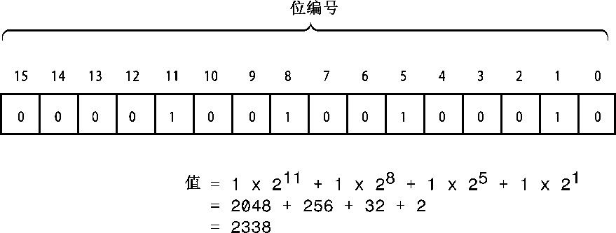

# 附录A 计数系统
人们使用很多计数系统来表示数字。有些计数系统（如罗马数字）不适合用于算术运算；而印度计数系统经过改进，并传入到欧洲后变成了阿拉伯计数系统，这种数字方便了数学、科学和商业计算。现代的计算机计数系统是基于占位符概念的，使用了最先出现在印度计数系统中的零。然而，这种原理被推广到其他计数系统。因此，虽然在日常生活中使用的是下一节将介绍的十进制，但计算领域通常使用八进制、十六进制和二进制。

## A.1 十进制数
数字的书写方式是基于10的幂数。例如，对于数字2468，2表示2个1000，4表示4个100，6表示6个10，8表示8个1。

2468 = 2 × 1000 + 4 × 100 + 6 × 10 + 8 × 1

一千是10 × 10 × 10或10的3次幂，用103表示。使用这种表示法，可以这样书写上述关系：

2468 = 2 × 10^3 + 4 × 10^2 + 6 × 10^1 + 8 × 10^0

因为这种数字表示法是基于10的幂，所以将它称作基数为10的表示法或十进制表示法。可以用任何数作基数。例如，C++允许使用基数8（八进制）和基数16（十六进制）来书写整数（请注意，100为1，任何非零数的0次幂都为1）。

## A.2 八进制整数
八进制数是基于8的幂的，所以基数为8的表示法用数字0-7来书写数字。C++用前缀0来表示八进制表示法。也就是说，0177是一个八进制值。可以用8的幂来找到对应的十进制值：

| 八 进 制 | 十 进 制 |
| :--- | :--- |
| 177 | = 1 × 8^2 + 7 × 8^1 + 7 × 8^0 |
| | = 1 × 64 + 7 × 8 + 7 × 1 |
| | = 127 |

由于UNIX操作系统常使用八进制来表示值，因此C++和C提供了八进制表示法。

## A.3 十六进制数
十六进制数是基于16的幂的。这意味着十六进制的10表示16 + 0，即16。为表示9-16值，需要其他一些数字，标准的十六进制表示法使用字母a-f。C++接受这些字符的大写和小写版本，如表A.1所示。

表A.1 十六进制数

| 十六进制数 | 十 进 制 值 |
| :--- | :--- |
| a或A | 10 |
| b或B | 11 |
| c或C | 12 |
| d或D | 13 |
| e或E | 14 |
| f或F | 15 |

C++使用0x或0X来指示十六进制表示法。因此0x2B3是一个十六进制值，可使用16的幂来得到对应的十进制值。

| 十六进制 | 十 进 制 |
| :--- | :--- |
| 0x2B3 | = 2 × 16^2 + 11 × 16^1 + 3 × 16^0 |
| | = 2 × 256 + 11 × 16 + 3 × 1 |
| | = 691 |

硬件文档常使用十六进制来表示诸如内存单元和端口号等值。

## A.4 二进制数
不管是使用十进制、八进制，还是十六进制表示法来书写整数，计算机都将它存储为二进制值（即基数为2）。二进制表示法只使用两个数字——0和1。例如，10011011就是二进制数。但C++没有提供二进制表示法来书写数字的方式。二进制数是基于2的幂。

| 二 进 制 | 十 进 制 |
| :--- | :--- |
| 10011011 | = 1 × 2^7+ 0 × 2^6 + 0 × 2^5 + 1 × 2^4 + 1 × 2^3 + 0 × 2^2 + 1 × 2^1 + 1 × 2^0 |
| | = 128 + 0 + 0 + 16 + 8 + 0 + 2 + 1 |
| | = 155 |

二进制表示法与计算机内存完全对应，在内存中，每个单元（位）都可以设置成开或关。只是将关表示为0，将开表示为1。内存通常是以字节为单位组织的，每个字节包含8位（正如第2章指出的，C++字节并非一定是8位，但本附录采用常见的做法，用字节表示八位组）。字节中的位被编号，对应于相关的2的幂。这样，最右侧的位编号为0，然后是1，依此类推。例如，图A.1表示一个2字节的整数。

## A.5 二进制和十六进制
十六进制表示法常用于提供更为方便的二进制数据（如内存地址或存储位标记设置的整数）视图。这样做的原因是，每个十六进制位对应于4位。表A.2说明了这种对应关系。

表A.2 十六进制数和对应的二进制数

| 十六进制位 | 对应的二进制数 |
| :--- | :--- |
| 0 | 0000 |
| 1 | 0001 |
| 2 | 0010 |
| 3 | 0011 |
| 4 | 0100 |
| 5 | 0101 |
| 6 | 0110 |
| 7 | 0111 |
| 8 | 1000 |
| 9 | 1001 |
| A | 1010 |
| B | 1011 |
| C | 1100 |
| D | 1101 |
| E | 1110 |
| F | 1111 |

要将十六进制值转换为二进制，只需将每个十六进制位替换为相应的二进制数即可。例如，十六进制0xA4对应于二进制数10100100。同样，可以轻松地将二进制值转换为十六进制，方法是将每4位转换为对应的十六进制位。例如，二进制值10010101将被转换为0x95。

> **Big Endian和Little Endian**
> 
> 奇怪的是，都使用整数的二进制表示的两个计算平台对同一个值的表示可能并不相同。例如，Intel计算机使用Little Endian体系结构来存储字节，而Motorola处理器、IBM大型机、SPARC处理器和ARM处理器使用Big Endian方案（但最后的两种系统可配置成使用上述任何一种方案）。
> 
> 术语Big Endian和Little Endian是从“Big End In”和“Little End In”（指内存中单词（通常为两个字节）的字节顺序）衍生而来的。在Intel计算机（Little Endian）中，先存储低位字节，这意味着十六进制值0xABCD在内存中将被存储为0xCD 0xAB。Motorola（Big Endian）计算机按相反的顺序存储，因此0xABCD在内存中被存储为0xAB 0xCD。
> 
> 这些术语最先出现在Jonathan Swift编写的《Gulliver’s Travels》一书中。为讽刺众多政治斗争的非理性，Swift杜撰了假想国中两个喜欢争论的政治派别：Big Endians和Little Endians，前者坚持认为从大的一头打破鸡蛋更合理，而后者坚持认为从小的一头打破鸡蛋更合理。
> 
> 作为软件工程师，应了解目标平台的词序，它会影响对通过网络传输的数据的解释方式以及数据在二进制文件中的存储方式。在上面的例子中，二字节内存模式0xABCD在Little Endian计算机上表示十进制值52651，而在Big Endian计算机上表示十进制值43981。

