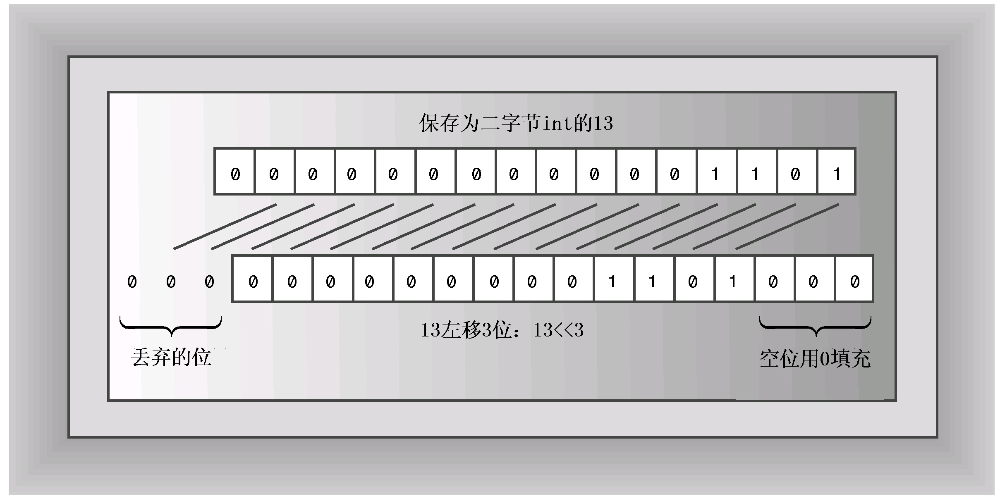
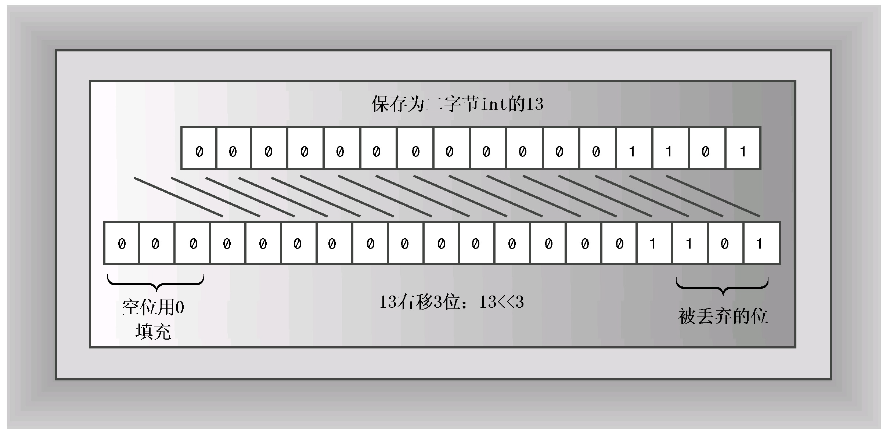
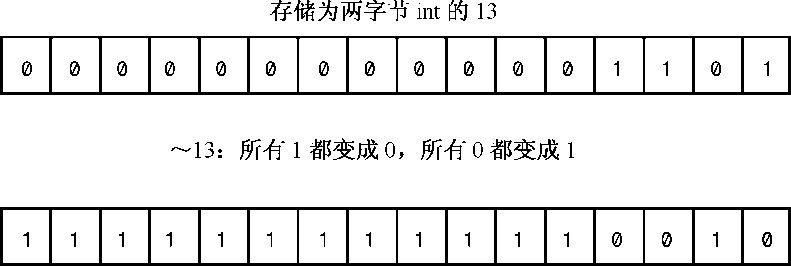
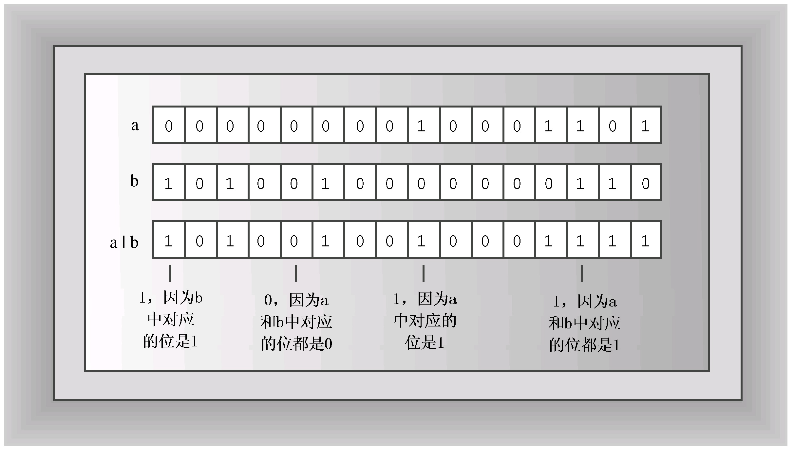
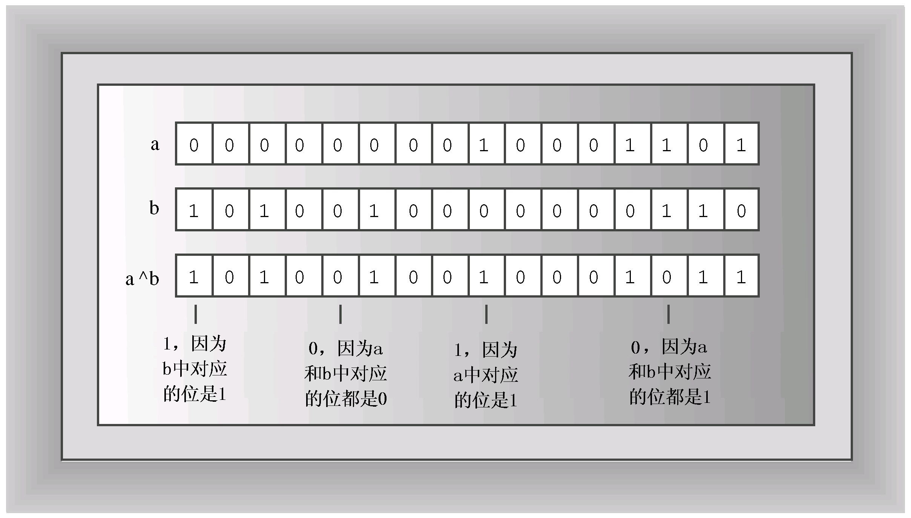
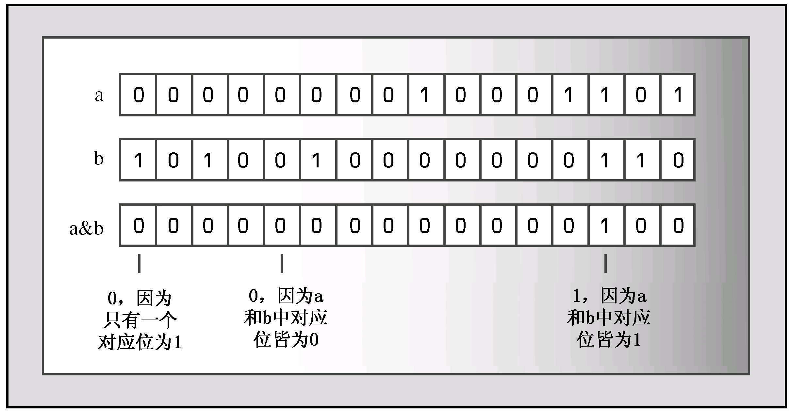

# 附录E 其他运算符
为了避免篇幅过长，有三组运算符没有在本书正文部分介绍。第一组是按位运算符，能够操纵值中的各个位；这些运算符是从C语言继承而来的；第二组运算符是两个成员解除引用运算符，它们是C++新增的；第三组是C++11新增的运算符：alignof和noexcept。本附录将简要地对这些运算符做一总结。

## E.1 按位运算符
按位运算符对整数值的位进行操作。例如，左移运算符将位向左移，按位非运算符将所有的1变成0，所有的0变成1，C++共有6个这样的运算符：<<、>>、~、&、|和^。

### E.1.1 移位运算符
左移运算符的语法如下：
```c++
value << shift
```

其中，value是要被操作的整数值，shift是要移动的位数。例如，下面的代码将值13的所有位都向左移3位：
```c++
13 << 3
```

腾出的位置用0填充，超出边界的位被丢弃（参见图E.1）。

由于每个位都表示右边一位的2倍（参见附录A），所以左移一位相当于乘以2。同样，左移2位相当于乘以2^2，左移n位相当于乘以2^n。因此，13<<3的值为13 × 2^3，即104。



左移运算符提供了通常可以在汇编语言中找到的功能。不过，左移运算符在汇编语言中会直接修改寄存器的内容，而C++左移运算符生成一个新值，而不修改原来的值。例如，请看下面的代码：
```c++
int x = 20;
int y = x << 3;
```

上述代码不会修改x的值。表达式x<<3使用x的值来生成一个新值，就像x+3会生成一个新值，而不会修改x一样。

如果要用左移运算符来修改变量的值，则还必须使用赋值运算符。可以使用常规的赋值运算符或<<=运算符（该运算符将移动与赋值结合在一起）：
```c++
x = x << 4;   // regular assignment
y <<= 2;      // shift and assign
```

正如所期望的，右移运算符（>>）将位向右移，其语法如下：
```c++
value >> shift
```

其中，value是要移动的整数值，shift是要移动的位数。例如，下面的代码将值17中所有的位向右移两位：
```c++
17 >> 2
```

对于无符号整数，腾出的位置用0填充，超过边界的位被删除。对于有符号整数，腾出的位置可能用0填充，也可能用原来最左边的位填充，这取决于C++实现（图E.2是一个用0填充的例子）。



向右移动一位相当于除以2。向右移动n位相当于除以2n。

C++还定义了一个“右移并赋值”运算符，如果要用移动后的值替换变量的值，可以这样做：
```c++
int q = 43;
a >>= 2;        // replace 43 by 43 >> 2, or 10
```

在有些系统上，使用左移运算符（右移运算符）实现将整数乘（除）以2的速度比使用乘（除）法运算符更快，但由于编译器在优化代码方面越来越好，因此这种差异正在减小。

### E.1.2 逻辑按位运算符
逻辑按位运算符类似于常规的逻辑运算符，只是它们用于值的每一位，而不是整个值。例如，请看常规的非运算符（!）和位非（或求反）运算符（～）。!运算符将true（或非零值）转换为false，将false值转换为true。～运算符将每一位转换为它的反面（1转换为0，0转换为1）。例如，对于unsigned char值3：
```c++
unsigned char x = 3;
```

表达式!x的值为0。要知道~x的值，先把它写成二进制形式：00000011。然后将每个0转换为1，将每个1转换为0。这样将得到值11111100，在十进制中，为252（图E.3是一个16位的例子）。新值是原值的补值。

按位运算符OR（|）对两个整数值进行操作，生成一个新的整数值。如果被操作的两个值的对应位至少有一个为1，则新值中相应位为1，否则为0（参见图E.4）。





表E.1对∣运算符的操作方式进行了总结。

**表E.1 b1|b2的值**

| 位 值 | b1 = 0 | b1 = 1 |
| :--- | :--- | :--- |
| b2 = 0 | 0 | 1 |
| b2 = 1 | 1 | 1 |

运算符|=组合了按位运算符OR与赋值运算符的功能：
```c++
a |= b;   // set a to a | b
```

按位运算符XOR（^）将两个整数值结合起来，生成一个新的整数值。如果原始值中对应的位有一个（而不是两个）为1，则新值中相应位为1；如果对应的位都为0或1，则新值中相应位为0（参见图E.5）。



表E.2总结了^运算符的结合方式。

| 位 值 | b1 = 0 | b1 = 1 |
| :--- | :--- | :--- |
| b2 = 0 | 0 | 1 |
| b2 = 1 | 1 | 0 |

^=运算符结合了按位运算符XOR和赋值运算符的功能：
```c++
a ^= b;   // set a to a ^ b
```

按位运算符AND（&）将两个整数结合起来，生成一个新的整数值。如果原始值中对应位都为1，则新值中相应位为1，否则为0（参见图E.6）。



表E.3总结了&运算符是如何运算的。

表E.3 b1&b2的值

| 位 值 | b1 = 0 | b1 = 1 |
| :--- | :--- | :--- |
| b2 = 0 | 0 | 0 |
| b2 = 1 | 0 | 1 |

&=运算符结合了按位运算符AND和赋值运算符的功能：
```c++
a &= b;   // set a to a & b
```

### E.1.3 按位运算符的替代表示
对于几种按位运算符，C++提供了替代表示，如表E.4所示。它们适用于字符集中不包含传统按位运算符的区域。

**表E.4 按位运算符的替代表示**

| 标 准 表 示 | 替 代 表 示 |
| :--- | :--- |
| & | bitand |
| &= | and_eq |
| &#124; | bitor |
| &#124;= | or_eq |
| ～ | compl |
| ^ | xor |
| ^= | xor_eq |

这些替代表示让您能够编写下面这样的语句：
```c++
b = compl a bitand b;   // same as b = ~a & b;
c = a xor b;            // same as c = a ^ c;
```

### E.1.4 几种常用的按位运算符技术
控制硬件时，常涉及打开/关闭特定的位或查看它们的状态。按位运算符提供了执行这种操作的途径。下面简要地介绍一下这些方法。

在下面的示例中，lottabits表示一个值，bit表示特定位的值。位从右到左进行编号，从0开始，因此，第n位的值为2n。例如，只有第3位为1的整数的值为23（8）。一般来说，正如附录A介绍的，各个位都对应于2的幂。因此我们使用术语位（bit）表示2的幂；这对应于特定位为1，其他所有位都为0的情况。

1. 打开位

下面两项操作打开lottabits中对应于bit表示的位：
```c++
lottabits = lottabits | bits;
lottabits |= bit;
```

它们都将对应的位设置为1，而不管这一位以前的值是多少。这是因为对1和1或者0和1执行OR操作时，都将得到1。lottabits中其他所有位都保持不变，这是因为对0和0做OR操作将得到0，对1和0做OR操作将生成1。

2. 切换位

下面两项操作切换lottabits中对应于bit表示的位。也就是说，如果位是关闭的，则将被打开；如果位是打开的，将被关闭：
```c++
lottabits = lottabits ^ bits;
lottabits ^= bit;
```

对0和1执行XOR操作的结果为1，因此将关闭已打开的位；对1和1执行XOR操作的结果为0，因此将打开已关闭的位。lottabits中其他所有位都保持不变，这是因为对0和0执行XOR操作的结果为0，对1和0执行XOR操作的结果为1。

3. 关闭位

下面的操作将关闭lottabits中对应于bit表示的位：
```c++
lottabits = lottabits & ~bit;
```

该语句关闭相应的位，而不管它以前的状态如何。首先，运算符～bit将原来为1的位设置为0，原来为0的位设置为1。对0和任意值执行AND操作都将得到0，因此关闭相应的位。lottabits中其他所有位都保持不变，这是因为对1和任意值执行AND操作时，该位的值将保持不变。

下面是一种更简洁的方法：
```c++
lottabits &= ~bit;
```

4. 测试位的值

如果要确定lottabits中对应于bit的位是否为1，则下面的测试不一定管用：
```c++
if (lottabits == bit)     // no good
```

这是因为即使lottabits中对应的位为1，而其他位也可能为1。仅当对应的位为1，而其他位皆为0时，上述等式才为true。因此修补的方式是，首先对lottabits和bit执行AND操作，这样生成的值的对应位保持不变，因为对1和任何值执行AND操作都将保持该值不变；而其他位都为0，因为对0和任何值执行AND操作的结果都为0。正确的测试如下：
```c++
if (lottabits & bit == bit)   // testing a bit
```

实际应用中，程序员常将上述测试简化为：
```c++
if (lottabits & bit)   // testing a bit
```

因为bit中有一位为1，而其他位都为0，因此lottabits & bit的结果要么为0（测试结果为false），要么为bit（非零值，测试结果为true）。

## E.2 成员解除引用运算符
C++允许定义指向类成员的指针，对这种指针进行声明或解除引用时，需要使用一种特殊的表示法。为说明需要使用的特殊表示法，先来看一个样本类：
```c++
class Example
{
private:
    int feet;
    int inches;
public:
    Example();
    Example(int ft);
    ~Example();
    void show_in() const;
    void show_ft() const;
    void use_ptr() const;
};
```

如果没有具体的对象，则inches成员只是一个标签。也就是说，这个类将inches定义为一个成员标识符，但要为它分配内存，必须声明这个类的一个对象：
```c++
Example ob;   // now ob.inches exists
```

因此，可以结合使用标识符inches和特定的对象，来引用实际的内存单元（对于成员函数，可以省略对象名，但对象被认为是指针指向的对象）。

C++允许这样定义一个指向标识符inches的成员指针：
```c++
int Example::*pt = &Example::inches;
```

这种指针与常规指针有所差别。常规指针指向特定的内存单元，而pt指针并不指向特定的内存单元，因为声明中没有指出具体的对象。指针pt指的是inches成员在任意Example对象中的位置。和标识符inches一样，pt被设计为与对象标识符一起使用。实际上，表达式*pt对标识符inches的角色做了假设，因此，可以使用对象标识符来指定要访问的对象，使用pt指针来指定该对象的inches成员。例如，类方法可以使用下面的代码：
```c++
int Example::*pt = &Example::inches;
Example ob1;
Example ob2;
Example *pq = new Example;
cout << ob1.*pt << endl;    // display inches member of ob1
cout << ob2.*pt << endl;    // display inches member of ob2
cout << po->*pt << endl;    // display inches member of *po
```

其中，和->都是成员解除引用运算符（member dereferencing operator）。声明对象（如obl）后，ob1.pi指的将是ob1对象的inches成员。同样，pq->pt指的是pq指向的对象的inches成员。

改变上述示例中使用的对象，将改变使用的inches成员。不过也可以修改pt指针本身。由于feet的类型与inches相同，因此可以将pt重新设置为指向feet成员（而不指向inches成员），这样ob1.*pt将是ob1的feet成员：
```c++
pt = &Example::feet;      // reset pt
cout << ob1.*pt << endl;  // display feet member of ob1
```

实际上，*pt相当于一个成员名，因此可用于标识（相同类型的）其他成员。

也可以使用成员指针来标识成员函数，其语法稍微复杂点。对于不带任何参数、返回值为void的函数，声明一个指向该函数的指针的代码如下：
```c++
void (*pf)();     // pf points to a function
```

声明指向成员函数的指针时，必须指出该函数所属的类。例如，下面的代码声明了一个指向Example类方法的指针：
```c++
void (Example::*pf)() const;    // pf points to an Example member function
```

这表明pf可用于可使用Example方法的地方。注意，Example：*pf必须放在括号中，可以将特定成员函数的地址赋给该指针：
```c++
pf = &Example::show_inches;
```

注意，和普通函数指针的赋值情况不同，这里必须使用地址运算符。完成赋值操作后，便可以使用一个对象来调用该成员函数：
```c++
Example ob3(20);
(ob3.*pf)();      // invoke show inches() using the ob3 object
```

必须将ob3.*pf放在括号中，以明确地指出，该表达式表示的是一个函数名。

由于show_feet( )的原型与show_inches( )相同，因此也可以使用pf来访问show_feet( )方法：
```c++
pf = &Example::show_feet;
(ob3.*pf)();      // apply show_feet() to the ob3 object
```

程序清单E.1中的类定义包含一个use_ptr( )方法，该方法使用成员指针来访问Example类的数据成员和函数成员。

程序清单E.1 memb_pt.cpp
```c++
// memb_pt.cpp -- dereferencing pointers to class members
#include <iostream>
using namespace std;

class Example
{
private:
    int feet;
    int inches;
public:
    Example();
    Example(int ft);
    ~Example();
    void show_in() const;
    void show_ft() const;
    void use_ptr() const;
};

Example::Example()
{
    feet = 0;
    inches = 0;
}

Example::Example(int ft)
{
    feet = ft;
    inches = 12 * feet;
}

Example::~Example()
{
}

void Example::show_in() const
{
    cout << inches << " inches\n";
}

void Example::show_ft() const
{
    cout << feet << " feet\n";
}

void Example::use_ptr() const
{
    Example yard(3);
    int Example::*pt;
    pt = &Example::inches;
    cout << "Set pt to &Example::inches:\n";
    cout << "this->pt: " << this->*pt << endl;
    cout << "yard.*pt: " << yard.*pt << endl;
    pt = &Example::feet;
    cout << "Set pt to &Example::feet:\n";
    cout << "this->pt: " << this->*pt << endl;
    cout << "yard.*pt: " << yard.*pt << endl;
    void (Example::*pf)() const;
    pf = &Example::show_in;
    cout << "Set pf to &Example::show_in:\n";
    cout << "Using (this->*pf)(): ";
    (this->*pf)();
    cout << "Using (yard.*pf)(): ";
    (yard.*pf)();
}

int main()
{
    Example car(15);
    Example van(20);
    Example garage;

    cout << "car.use_ptr() output:\n";
    car.use_ptr();
    cout << "\nvan.use_ptr() output:\n";
    van.use_ptr();

    return 0;
}
```

下面是程序清单E.1中程序的运行情况：
```c++
car.use_ptr() output:
Set pt to &Example::inches:
this->pt: 180
yard.*pt: 36
Set pt to &Example::feet:
this->pt: 15
yard.*pt: 3
Set pf to &Example::show_in:
Using (this->*pf)(): 180 inches
Using (yard.*pf)(): 36 inches

van.use_ptr() output:
Set pt to &Example::inches:
this->pt: 240
yard.*pt: 36
Set pt to &Example::feet:
this->pt: 20
yard.*pt: 3
Set pf to &Example::show_in:
Using (this->*pf)(): 240 inches
Using (yard.*pf)(): 36 inches
```

这个例子在编译期间给指针赋值。在更复杂的类中，可以使用指向数据成员和方法的成员指针，以便在运行阶段确定与指针关联的成员。

## E.3 alignof（C++11）
计算机系统可能限制数据在内存中的存储方式。例如，一个系统可能要求double值存储在编号为偶数的内存单元中，而另一个系统可能要求其起始地址为8个整数倍。运算符alignof将类型作为参数，并返回一个整数，指出要求的对齐方式。例如，对齐要求可能决定结构中信息的组织方式，如程序清单E.2所示。

程序清单E.2 align.cpp
```c++
// align.cpp -- checking alignment
#include <iostream>
using namespace std;
struct things1
{
    char ch;
    int a;
    double x;
};

struct things2
{
    int a;
    double x;
    char ch;
};

int main()
{
    things1 th1;
    things2 th2;
    cout << "char alignment: " << alignof(char) << endl;
    cout << "int alignment: " << alignof(int) << endl;
    cout << "double alignment: " << alignof(double) << endl;
    cout << "things1 alignment: " << alignof(things1) << endl;
    cout << "things2 alignment: " << alignof(things2) << endl;
    cout << "things1 size: " << sizeof(things1) << endl;
    cout << "things2 size: " << sizeof(things2) << endl;
    return 0;
}
```

下面是该程序在一个系统中的输出：
```c++
char alignment: 1
int alignment: 4
double alignment: 8
things1 alignment: 8
things2 alignment: 8
things1 size: 16
things2 size: 24
```

两个结构的对齐要求都是8。这意味着结构长度将是8的整数倍，这样创建结构数组时，每个元素的起始位置都是8的整数倍。在程序清单E.2中，每个结构的所有成员只占用13位，但结构要求占用的位数为8的整数倍，这意味着需要填充一些位。在每个结构中，double成员的对齐要求为8的整数倍，但在结构thing1和thing2中，成员的排列顺序不同，这导致thing2需要更多的内部填充，以便其边界处于正确的位置。

## E.4 noexcept（C++11）
关键字noexcept用于指出函数不会引发异常。它也可用作运算符，判断操作数（表达式）是否可能引发异常；如果操作数可能引发异常，则返回false，否则返回true。例如，请看下面的声明：
```c++
int hilt(int);
int halt(int) noexcept;
```

表达式noexcept(hilt) 的结果为false，因为hilt( ) 的声明未保证不会引发异常，但noexcept(halt) 的结果为true。


