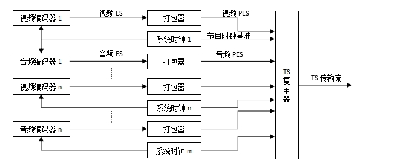
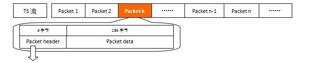
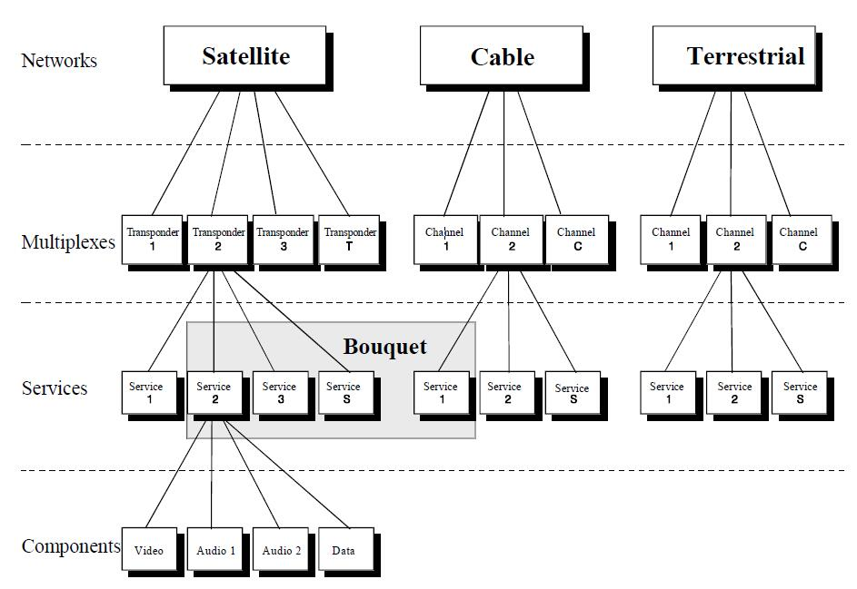

# 第一章： 预备知识

**本文参考网址：**

[https://www.onelib.biz/doc/stb/course/prereading.html](https://www.onelib.biz/doc/stb/course/prereading.html)

最近开始学习数字电视机顶盒的开发，从MPEG-2到DVB，看着看着突然就出现了一大堆表格， 什么PAT、PMT、CAT……如此多的表该怎样深入了解呢？

我们知道，数字电视机顶盒接收到的是一段段的码流，我们称之为TS（Transport Stream，传输流）， 每个TS流都携带一些信息，如Video、Audio以及我们需要学习的PAT、PMT等信息。 因此，我们首先需要了解TS流是什么，以及TS流是怎样形成、有着怎样的结构。

## TS流、PS流、PES流和ES流都是什么

**ES流（Elementary Stream）**： 基本码流，不分段的音频、视频或其他信息的连续码流。

**PES流**： 把基本流ES分割成段，并加上相应头文件打包成形的打包基本码流。

**PS流（Program Stream）**： 节目流，将具有共同时间基准的一个或多个PES组合（复合）而成的单一数据流（用于播放或编辑系统，如m2p）。

**TS流（Transport Stream）**： 传输流，将具有共同时间基准或独立时间基准的一个或多个PES组合（复合）而成的单一数据流（用于数据传输）。

**NOTE:**

TS流和PS流的区别：TS流的包结构是长度是固定的；PS流的包结构是可变长度的。 这导致了 TS流的抵抗传输误码的能力强于PS流 （TS码流由于采用了固定长度的包结构， 当传输误码破坏了某一TS包的同步信息时，接收机可在固定的位置检测它后面包中的同步信息，从而恢复同步，避免了信息丢失。 而PS包由于长度是变化的，一旦某一 PS包的同步信息丢失， 接收机无法确定下一包的同步位置，就会造成失步，导致严重的信息丢失。 因此，在信道环境较为恶劣，传输误码较高时，一般采用TS码流；而在信道环境较好，传输误码较低时，一般采用PS码流。）

由于TS码流具有较强的抵抗传输误码的能力，因此目前在传输媒体中进行传输的MPEG-2码流基本上都采用了TS码流的包格。

**TS流（传输流）和PS流（节目流）对比**

TS流（传输流）和PS流（节目流）是MPEG-2标准中定义的两种主要音视频封装格式，它们在结构、容错性和应用场景上存在显著差异。

核心区别对比

| 特性 | TS流（Transport Stream） | PS流（Program Stream） |
| :--- | :--- | :--- |
| 包长度 | 固定为188字节 | 可变长度 |
| 设计目标 | 适用于不稳定、易出错的传输环境（如广播、网络流媒体） | 适用于稳定、低误码的存储环境（如DVD、蓝光光盘） |
| 容错能力 | 强。固定包长使接收端能在同步信息丢失后，通过固定位置检测后续包的同步头，快速恢复同步，避免信息大面积丢失。 | 弱。可变包长导致一旦同步信息丢失，接收端无法确定下一包起始位置，极易造成失步和严重信息丢失。 |
| 主要应用场景 | 数字电视广播（DVB-T、DMB-TH）、卫星电视、IPTV、流媒体传输、蓝光光盘（部分） | DVD电影、VCD、家庭存储介质、演播室内部编辑 |
| 多节目支持 | 支持。通过PAT（节目关联表）和PMT（节目映射表）可以复用多个节目流。 | 通常不支持。主要用于封装单个节目。 |
| 关键结构 | 包含PAT和PMT表，用于索引节目中的音视频流PID（包标识符）。 | 包含系统头、PS头和PES头，结构相对紧凑。 |
| 同步机制 | 依赖PCR（节目时钟参考）和连续性计数器进行精确同步和错误检测。 | 依赖SCR（系统时钟参考）与PTS/DTS配合实现视音频同步。 |
| 文件扩展名 | `.ts` | `.mpg`, `.mpeg` |

总结
简单来说，TS流是为“传输”而生，强调抗干扰和实时性；而PS流是为“存储”而设计，追求结构紧凑和存储效率。在数字电视和网络流媒体领域，TS流是绝对的主流；而在DVD等物理存储介质上，PS流则更为常见。

## TS流是如何产生的？

从上图可以看出，视频ES和音频ES通过打包器和共同或独立的系统时间基准形成一个个PES， 通过TS复用器复用形成的传输流。 注意这里的TS流是 **位流格式**（分析Packet的时候会解释），也即是说TS流是可以按位读取的。

## TS流的格式是怎样的？

TS流是基于Packet的位流格式，即由n个包组成；每个包是188个字节（或204个字节，在188个字节后加上了16字节的CRC校验数据，其他格式一样）。 下图是一个TS流，以第k个包(Package)为例：

<table><tr><td colspan="4" style="text-align:center; font-weight:bold;">Packet Header（包头）信息说明</td></tr>
<tr style="text-align:center; font-weight:bold;"><td>#</td><td>标识</td><td>位数</td><td>说明</td></tr>
<tr style="text-align:center;"><td>0</td><td>sync_byte</td><td>8 bits</td><td>同步字节，固定是0x47</td></tr>
<tr style="text-align:center;"><td>1</td><td>transport_error_indicator</td><td>1 bits</td><td>错误指示信息（1：该包至少有1bits传输错误）</td></tr>
<tr style="text-align:center;"><td>2</td><td>payload_unit_start_indicator</td><td>1 bits</td><td>负载单元开始标志（packet不满188字节时需填充）</td></tr>
<tr style="text-align:center;"><td>3</td><td>transport_priority</td><td>1 bits</td><td>传输优先级标志（1：优先级高）</td></tr>
<tr style="text-align:center;" class="strong"><td>4</td><td>PID</td><td>13 bits</td><td>Packet ID号码，唯一的号码对应不同的包</td></tr>
<tr style="text-align:center;"><td>5</td><td>transport_scrambling_control</td><td>2 bits</td><td>加密标志（00：未加密；其他表示已加密）</td></tr>
<tr style="text-align:center;"><td>6</td><td>adaptation_field_control</td><td>2 bits</td><td>附加区域控制</td></tr>
<tr style="text-align:center;"><td>7</td><td>continuity_counter</td><td>4 bits</td><td>包递增计数器</td></tr>
</table>

上面表格是一个包(Package)的头(Header)的说明，其中需要注意的是：**PID是TS流中唯一识别标志，Packet Data是什么内容就是由PID决定的**。 如果一个TS流中的一个Packet的Packet Header中的PID是0x0000，那么这个Packet的Packet Data就是DVB的PAT表而非其他类型数据（如Video、Audio或其他业务信息）。

下表给出了一些表的PID值，这些值是固定的，不允许更改。

<table><tr><td colspan="3" style="text-align:center; font-weight:bold;">TS流中PID的分配</td></tr>
  <tr style="text-align:center; font-weight:bold;"><td>表</td><td>PID值</td><td>说明</td></tr>
  <tr style="text-align:center;"><td>PAT</td><td>0x0000</td><td>-</td></tr>
  <tr style="text-align:center;"><td>CAT</td><td>0x0001</td><td>-</td></tr>
  <tr style="text-align:center;"><td>TSDT</td><td>0x0002</td><td>-</td></tr>
  <tr style="text-align:center;"><td>预留</td><td>0x0003 至0x000F</td><td>无</td></tr>
  <tr style="text-align:center;"><td>NIT, ST</td><td>0x0010</td><td>-</td></tr>
  <tr style="text-align:center;"><td>SDT , BAT, ST</td><td>0x0011</td><td>-</td></tr>
  <tr style="text-align:center;"><td>EIT, ST</td><td>0x0012</td><td>-</td></tr>
  <tr style="text-align:center;"><td>RST, ST</td><td>0x0013</td><td>-</td></tr>
  <tr style="text-align:center;"><td>TDT, TOT, ST</td><td>0x0014</td><td>-</td></tr>
  <tr style="text-align:center;"><td>网络同步</td><td>0x0015</td><td>无</td></tr>
  <tr style="text-align:center;"><td>预留使用</td><td>0x0016 至 0x001B</td><td>无</td></tr>
  <tr style="text-align:center;"><td>带内信令</td><td>0x001C</td><td>无</td></tr>
  <tr style="text-align:center;"><td>DIT</td><td>0x001E</td><td>无</td></tr>
  <tr style="text-align:center;"><td>SIT</td><td>0x001F</td><td>无</td></tr>
</table>

下面以一个TS流的其中一个Packet中的Packet Header为例进行说明：

<table class="table table-striped table-bordered" style="margin-top:-6px; font-size:70%; background-color:#fff;">
<tbody><tr style="text-align:center;">
	<td>位号</td><td>0</td><td>1</td><td>2</td><td>3</td><td>4</td><td>5</td>
	<td>6</td><td>7</td><td>8</td><td>9</td><td>10</td><td>11</td><td>12</td>
	<td>13</td><td>14</td><td>15</td><td>16</td><td>17</td><td>18</td><td>19</td>
	<td>20</td><td>21</td><td>22</td><td>23</td><td>24</td><td>25</td><td>26</td>
	<td>27</td><td>28</td><td>29</td><td>30</td><td>31</td><td>...</td>
</tr>
<tr style="text-align:center;">
	<td>Packet（二进制）</td>
	<td>0</td><td>1</td><td>0</td><td>0</td>    <td>0</td><td>1</td><td>1</td><td>1</td>
	<td>0</td><td>0</td><td>0</td><td>0</td>    <td>0</td><td>1</td><td>1</td><td>1</td>
	<td>1</td><td>1</td><td>1</td><td>0</td>    <td>0</td><td>1</td><td>0</td><td>1</td>
	<td>0</td><td>0</td><td>0</td><td>1</td>    <td>0</td><td>0</td><td>1</td><td>0</td>
	<td>...</td>
</tr>
<tr style="text-align:center;">
	<td>Packet（十六进制）</td>
	<td colspan="4">4</td><td colspan="4">7</td>
	<td colspan="4">0</td><td colspan="4">7</td>
	<td colspan="4">E</td><td colspan="4">5</td>
	<td colspan="4">1</td><td colspan="4">2</td>
	<td>...</td>
</tr>
<tr style="text-align:center;" class="strong">
	<td>Packet Header信息</td>
	<td colspan="8">0: sync_byte=0x47</td>
	<td>1</td><td>2</td><td>3</td><td colspan="13">4: PID (这里是0x07e5)</td>
	<td colspan="2">5</td><td colspan="2">6</td>
	<td colspan="4">7</td>
	<td>...</td>
</tr>
</tbody></table>

上表中，第一行为表头的位号（0-31，共32位）， 第二行为每位的二进制数值， 第三行为每个字节的16进制数值， 最后一行对应上面的表格[《Packet Header（包头）信息说明》](./01.预备知识.md#ts流的格式是怎样的)的数据。下表是[《Packet Header（包头）信息说明》](./01.预备知识.md#ts流的格式是怎样的)的Demo数据。

<table class="table table-striped" style="margin-top:-6px; font-size:70%;">
	<tbody><tr><td colspan="4" style="text-align:center; font-weight:bold;">Packet Header（包头）信息Demo</td></tr>
	<tr style="text-align:center; font-weight:bold;"><td>#</td><td>标识</td><td>位数</td><td>说明</td></tr>
	<tr style="text-align:center;"><td>0</td><td>sync_byte</td><td>8 bits</td><td style="text-align:left;">固定是0x47</td></tr>
	<tr style="text-align:center;"><td>1</td><td>transport_error_indicator</td><td>1 bits</td><td style="text-align:left;">值为0，表示当前包没有发生传输错误。错误指示信息（1：该包至少有1bits传输错误）</td></tr>
	<tr style="text-align:center;"><td>2</td><td>payload_unit_start_indicator</td><td>1 bits</td><td style="text-align:left;">值为0，含义参考ISO13818-1标准文档。负载单元开始标志（packet不满188字节时需填充）</td></tr>
	<tr style="text-align:center;"><td>3</td><td>transport_priority</td><td>1 bits</td><td style="text-align:left;">值为0，表示当前包是低优先级。传输优先级标志（1：优先级高）</td></tr>
	<tr style="text-align:center;"><td>4</td><td>PID</td><td>13 bits</td><td style="text-align:left;">PID=00111 11100101即0x07e5,是Video PID。Packet ID号码，唯一的号码对应不同的包</td></tr>
	<tr style="text-align:center;"><td>5</td><td>transport_scrambling_control</td><td>2 bits</td><td style="text-align:left;">值为0x00，表示节目没有加密。加密标志（00：未加密；其他表示已加密）</td></tr>
	<tr style="text-align:center;"><td>6</td><td>adaptation_field_control</td><td>2 bits</td><td style="text-align:left;">值为0x01,具体含义请参考ISO13818-1。附加区域控制</td></tr>
	<tr style="text-align:center;"><td>7</td><td>continuity_counter</td><td>4 bits</td><td style="text-align:left;">值为0x02,表示当前传送的相同类型的包是第3个。包递增计数器</td></tr>
</tbody></table>

回顾一下，TS流是一种位流（当然就是数字的）， 它是由ES流分割成PES后复用而成的；它经过网络传输被机顶盒接收到； 数字电视机顶盒接收到TS流后将解析TS流。

TS流是由一个个Packet（包）构成的， 每个包都是由Packet Header（包头）和Packet Data（包数据）组成的。 其中Packet Header指示了该Packet是什么属性的，并给出了该Packet Data的数据的唯一网络标识符PID。

## PSI/SI缩略语

<table class="table table-striped" style="margin-top:-6px; font-size:70%;">
	<tbody><tr><td colspan="4" style="text-align:center; font-weight:bold;">PSI/SI缩略语（简版）</td></tr>
	<tr style="text-align:center; font-weight:bold;"><td>关键字</td><td>全称</td><td>中文翻译</td><td>备注</td></tr>
	<tr style="text-align:center;"><td>PSI</td><td>Program Specific Information</td><td>节目引导信息</td><td>对单一码流的描述</td></tr>
	<tr style="text-align:center;"><td>SI</td><td>Service Information</td><td>业务信息</td><td>对系统中所有码流的描述</td></tr>
	<tr style="text-align:center;"><td>TS</td><td>Transport Stream</td><td>传输流 （常称为TS流）</td><td>一个频道（多个节目及业务）的TS包复用后称TS流</td></tr>
	<tr style="text-align:center;"><td>TS包</td><td>Transport Packet</td><td>传输包</td><td>数字视音频、图文数据打包成TS包</td></tr>
	<tr class="success" style="text-align:center;"><td>PAT</td><td>Program Association Table</td><td>节目关联表</td><td>将节目号码和节目映射表PID相关联，获取数据的开始</td></tr>
	<tr class="success" style="text-align:center;"><td>PMT</td><td>Program Map Table</td><td>节目映射表</td><td>指定一个或多个节目的PID</td></tr>
	<tr class="success" style="text-align:center;"><td>CAT</td><td>Conditional Access Table</td><td>条件接收表</td><td>将一个或多个专用EMM流分别与唯一的PID相关联</td></tr>
	<tr class="success" style="text-align:center;"><td>NIT</td><td>Network Information Table</td><td>网络信息表</td><td>描述整个网络，如多少TS流、频点和调制方式等信息</td></tr>
	<tr class="info" style="text-align:center;"><td>SDT</td><td>Service Description Table</td><td>业务描述表</td><td>包含业务数据（如业务名称、起始时间、持续时间等）</td></tr>
	<tr class="info" style="text-align:center;"><td>BAT</td><td>Bouquet Association Table</td><td>业务群关联表</td><td>给出业务群的名称及其业务列表等信息</td></tr>
	<tr class="info" style="text-align:center;"><td>EIT</td><td>Event Information Table</td><td>事件信息表</td><td>包含事件或节目相关数据，是生成EPG的主要表</td></tr>
	<tr class="info" style="text-align:center;"><td>RST</td><td>Running Status Table</td><td>运行状态表</td><td>给出事件的状态（运行/非运行）</td></tr>
	<tr class="info" style="text-align:center;"><td>TDT</td><td>Time&amp;Date Table</td><td>时间和日期表</td><td>给出当前事件和日期相关信息，更新频繁</td></tr>
	<tr class="info" style="text-align:center;"><td>TOT</td><td>Time Offset Table</td><td>时间偏移表</td><td>给出了当前时间日期与本地时间偏移的信息</td></tr>
	<tr class="info" style="text-align:center;"><td>ST</td><td>Stuffing Table</td><td>填充表</td><td>用于使现有的段无效，如在一个传输系统的边界</td></tr>
	<tr class="info" style="text-align:center;"><td>SIT</td><td>Selection Information Table</td><td>选择信息表</td><td>仅用于码流片段中，如记录的一段码流，包含描述该码流片段业务信息段的地方</td></tr>
	<tr class="info" style="text-align:center;"><td>DIT</td><td>Discontinuity Information Table DVB</td><td>间断信息表</td><td>仅用于码流片段，如记录的一段码流中，它将插入到码流片段业务信息间断的地方</td></tr>
</tbody></table>

**注：绿色背景为PSI信息，蓝色背景为SI信息。**

**详细列表请移步**： [PSI/SI名词速查](https://www.onelib.biz/doc/stb/appendix/dictionary.html)

## 业务与事件

关于业务（Service）、事件（Event），我们要弄清楚其准确意义，避免混淆。

那么什么是“业务”，什么是“事件”呢？ 按照普通人的习惯来说，“业务”就是指“频道”，“事件”就是“节目”。 举个例子：CCTV1是一个频道，其标准说法应该是“业务（Service）”； 《新闻联播》是一个节目，其标准说法应该是“事件”。

在实际中，我们经常将“频道(Channel)”代指“业务(Service)”，比如上面的说明。 但事实上，在正式的场合，尤其翻译回英语后，“Channel”和我们认知中的“频道”是完全不同的概念。 从下图可以看出，**“Channel”指的是“频点”或者“信道”，而每个“Channel”里会有一个或多个的“Service”**。

因此，务必要养成良好的习惯，在交流中才能准确地描述 **业务(Service) 、 事件(Event) 和 频道(Channel)** 。

## 参考文档

<table class="table table-condensed table-hover table-bordered" style=" font-size:70%;">
	<thead>
		<tr style="background:#ED391B; color:snow; text-align:center;"><td>#</td><td>文档名称</td><td>作者</td></tr>
	</thead>
	<tbody style="text-align:center;">
		<tr><td>1</td><td><a href="http://blog.csdn.net/kkdestiny/article/details/9850587" target="_blank">《1.从TS流到PAT和PMT》</a></td><td>林晓州</td></tr>
		<tr><td>2</td><td><a href="http://blog.csdn.net/kkdestiny/article/details/12993971" target="_blank">《PSI/SI深入学习》</a></td><td>林晓州</td></tr>
		<tr><td>3</td><td><a href="../doc/En300468.V1.7.1_Specification for SI in DVB Systems.pdf" target="_blank">《En300468.V1.7.1_Specification for SI in DVB Systems.pdf》</a></td><td>European Standard</td></tr>
		<tr><td>4</td><td><a href="../doc/中文SI版本1.0.doc" target="_blank">《数字视频广播中文业务信息规范》</a></td><td>国家广播电影电视总局</td></tr>
	</tbody>
</table>

## 版本信息

<table class="table table-condensed table-hover table-bordered" style=" font-size:70%;">
	<thead>
		<tr style="background:#ED391B; color:snow; text-align:center;"><td>#</td><td>发布日期</td><td>版本</td><td>更新内容</td><td>作者</td><td>审核</td></tr>
	</thead>
	<tbody style="text-align:center;">
		<tr><td>1</td><td>2013年08月09日</td><td>V1.0</td><td>文档<a href="http://blog.csdn.net/kkdestiny/article/details/9850587" target="_blank">《1.从TS流到PAT和PMT》</a></td><td>林晓州</td><td>——</td></tr>
		<tr><td>2</td><td>2016年02月18日</td><td>V2.0</td><td>整合了多个文档资料，对PSI/SI学习所需的知识进行系统的总结。</td><td>林晓州</td><td>——</td></tr>
	</tbody>
</table>

## PSI和SI的区别

在广播电视系统中，PSI（Program Specific Information，节目专用信息）和SI（Service Information，业务信息）是数字电视传输流（TS流）中至关重要的两类信息，它们共同协作，使接收设备（如机顶盒）能够正确解码和呈现节目。它们的核心区别在于范围、功能和标准来源。

核心区别

| 特征 | PSI (节目专用信息) | SI (业务信息) |
| :--- | :--- | :--- |
| 定义与标准 | 由MPEG-2标准定义，是数字电视传输流的基础引导信息。 | 由DVB（数字视频广播）标准定义，是对PSI的扩展和补充。 |
| 作用范围 | 仅针对单个传输流（TS流）内的节目进行描述。 | 针对整个系统中的多个TS流进行描述，提供更全面的业务信息。 |
| 核心功能 | 提供解码器必需的、底层的、技术性参数，用于定位和解码节目。 | 在PSI基础上，增加面向用户的、内容性的、管理性信息，提升用户体验。 |
| 主要包含的表 | - PAT（节目关联表）：列出TS流中所有节目的PMT PID。 - PMT（节目映射表）：列出单个节目包含的视频、音频、数据流的PID及类型。 - CAT（条件接收表）：提供加密节目解密所需的信息。 - NIT（网络信息表）：*（注：NIT在MPEG-2中未定义，由DVB定义，常被归入SI，但有时也被视为PSI的延伸）* | - SDT（业务描述表）：提供频道/业务的名称、提供商、类型等。 - EIT（事件信息表）：提供节目名称、开始时间、时长、简介等，是电子节目指南（EPG）的核心。 - BAT（业务群关联表）：将多个业务（可能跨TS流）分组，如“电影频道”、“体育频道”等。 - TDT/TOT（时间与日期表/时间偏移表）：提供精确的当前时间和时区信息。 - NIT（网络信息表）：提供所有TS流的物理传输参数（频率、调制方式等）。 |

关系总结

1.  SI包含PSI：SI在设计上是建立在PSI之上的。一个完整的SI系统必然包含PSI的所有核心表（PAT、PMT、CAT）。
2.  PSI是基础，SI是升华：PSI解决了“如何找到并解码一个节目”的技术问题；SI则解决了“这个节目是什么、什么时候播、怎么分类、怎么找”的用户体验和管理问题。
3.  NIT的归属：网络信息表（NIT）是一个特殊案例。它在MPEG-2标准中没有定义，而是由DVB标准引入。虽然它描述的是网络层信息，但因其与TS流的物理传输直接相关，有时被归类为PSI的延伸，有时则被明确归入SI。在实际应用中，它常被视为SI的重要组成部分。

简而言之，PSI是让电视“看得懂”节目流的底层密码，而SI是让观众“看得明白、找得方便”的节目说明书和导航图。

