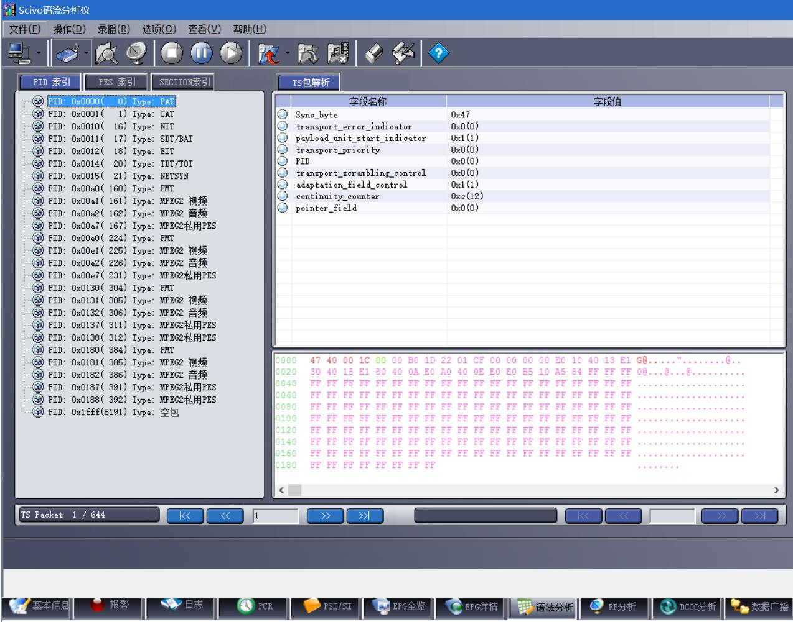
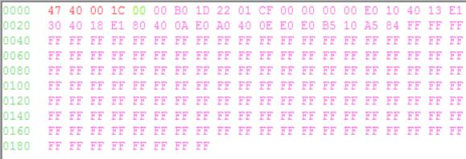
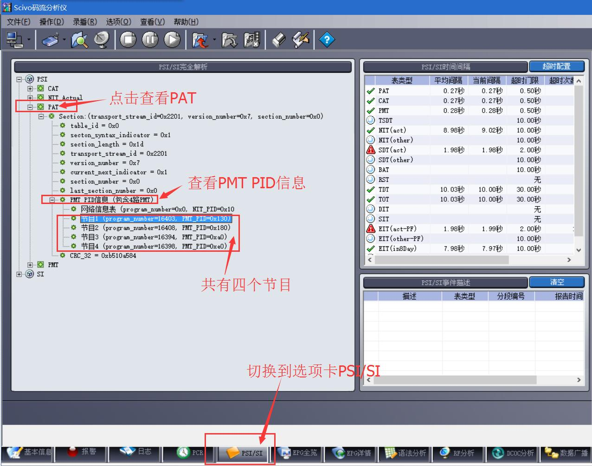
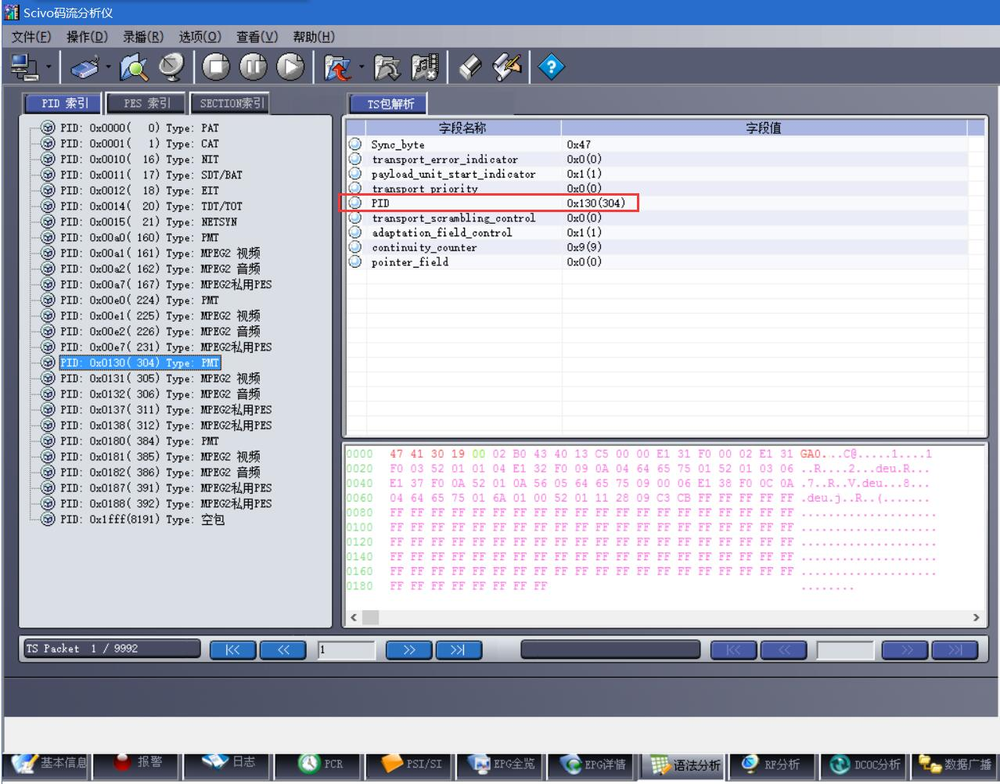
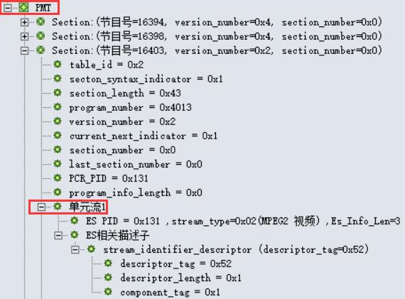
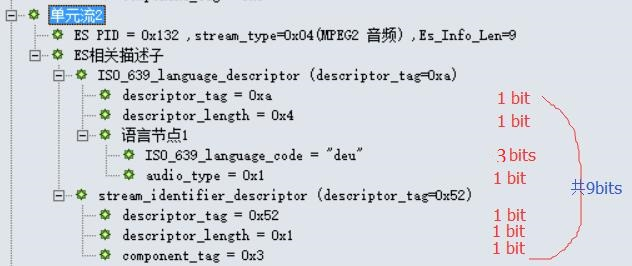
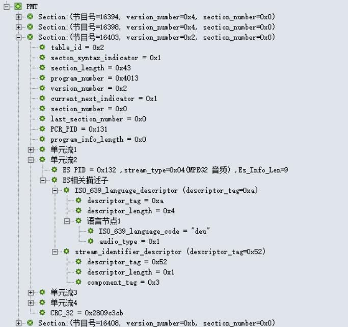
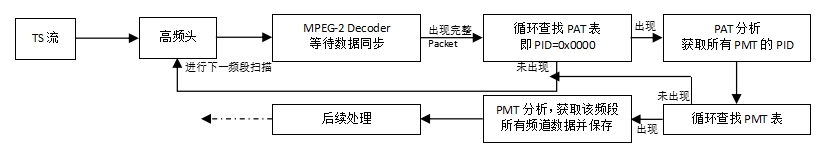

# 第二章：从TS到PAT和PMT

说完了TS流相关的基本概念，就该开始对TS流进行更深入的研究了。 首先需要想一想：TS流的本质是什么？ **TS是一段码流，并且是一段由数据包（Packet）组成的码流**。 那么我们要如何组织和处理如此庞大的数据包呢？

如果我们把码流看作一本书，那么我们就需要给这本书**制作一个目录**；有了这样的目录，我们就可以“按图索骥”地得到我们需要的信息。

**是的，PSI/SI就是这样“目录”。而PAT则是“目录”的“目录”**。 通过PAT及其他 PSI 信息，我们可以一点一点地把整个TS流的信息组织和管理起来，从而分离出不同的业务(Service)， 以及该业务的视频、音频、图文(Teletext)、字幕(Subtitle)、其他音轨等分量； 再根据 SI 信息，我们就可以得到每个业务的名称、事件(Event)等附加信息， 从而形成 EPG ，更好地管理各个业务。

需要区分的一点是，不管是PSI还是SI，都**只是一种“管理信息”**，它并不包含任何的视频或音频数据。

## 什么是PID

在上一节[《预备知识》](./01.预备知识.md)中，我们可以看到 **PID(Packet Identifier)** 这个被标红的字段频繁地出现。

**PID** 是当前TS流的Packet区别于其他Packet类型的唯一识别符，通过读取每个包的Packet Header， 我们可以知道这个Packet的数据属于何种类型。下表列出了几项固定的 **PID** 值，它们用于识别存储了特殊信息的Packet。 下面要谈的PAT表的 **PID** 值就是固定的0x0000。

<table class="table table-striped" style="margin-top:-6px; font-size:70%;">
	<tbody>
		<tr style="cursor:pointer;" class="hover-text" title="点击查看详情" onclick="OL_ToggelTable1()"><td colspan="3" style="text-align:center; font-weight:bold;">TS流中PID的分配</td></tr>
	</tbody>
	<tbody style="" id="part1_t1">
		<tr style="text-align:center; font-weight:bold;"><td>表</td><td>PID值</td><td>说明</td></tr>
		<tr style="text-align:center;" class="strong"><td>PAT</td><td>0x0000</td><td>-</td></tr>
		<tr style="text-align:center;"><td>CAT</td><td>0x0001</td><td>-</td></tr>
		<tr style="text-align:center;"><td>TSDT</td><td>0x0002</td><td>-</td></tr>
		<tr style="text-align:center;"><td>预留</td><td>0x0003 至0x000F</td><td>无</td></tr>
		<tr style="text-align:center;"><td>NIT, ST</td><td>0x0010</td><td>-</td></tr>
		<tr style="text-align:center;"><td>SDT , BAT, ST</td><td>0x0011</td><td>-</td></tr>
		<tr style="text-align:center;"><td>EIT, ST</td><td>0x0012</td><td>-</td></tr>
		<tr style="text-align:center;"><td>RST, ST</td><td>0x0013</td><td>-</td></tr>
		<tr style="text-align:center;"><td>TDT, TOT, ST</td><td>0x0014</td><td>-</td></tr>
		<tr style="text-align:center;"><td>网络同步</td><td>0x0015</td><td>无</td></tr>
		<tr style="text-align:center;"><td>预留使用</td><td>0x0016 至 0x001B</td><td>无</td></tr>
		<tr style="text-align:center;"><td>带内信令</td><td>0x001C</td><td>无</td></tr>
		<tr style="text-align:center;"><td>DIT</td><td>0x001E</td><td>无</td></tr>
		<tr style="text-align:center;"><td>SIT</td><td>0x001F</td><td>无</td></tr>
	</tbody>
</table>

解复用程序需要使用到的表格只有PAT、PMT、SDT；而CA解扰还需要使用CAT；EPG则还要有NIT、EIT、TDT、TOT等表。

## 使用工具说明

使用码流分析软件来分析一段码流，会事半功倍：泽华源码流分析软件 或 Tsparse。

下图是使用 泽华源码流分析软件 的界面。在打开码流并分析完毕后，点击下方选项卡“语法分析”可以出现这个窗口。

## 一切从PAT开始

**PAT表(Program Association Table，节目关联表)** 定义了当前TS流中所有的节目，其PID为0x0000，它是PSI的根节点，要查寻找节目必须从PAT表开始查找。PAT表携带以下信息:

<table class="table table-striped" style="margin-top:-6px; font-size:70%;">
	<tbody><tr style="text-align:center;"><td>TS流ID</td><td>transport_stream_id</td><td>该ID标志唯一的流ID</td></tr>
	<tr style="text-align:center;"><td>节目频道号</td><td>program_number</td><td>该号码标志TS流中的一个频道，该频道可以包含很多的节目(即可以包含多个Video PID和Audio PID)</td></tr>
	<tr style="text-align:center;" class="strong"><td>PMT的PID</td><td>program_map_PID</td><td>表示本频道使用哪个PID做为PMT的PID。 因为可以有很多的业务，因此DVB规定PMT的PID可以由用户自己定义</td></tr>
</tbody></table>

## 解析PAT表的数据包

### PAT表的数据包

上一幅图中，右下角粉红色的数据即为PAT表的数据包。

根据在上一章 [《预备知识》](./01.预备知识.md)中提到的包的分析方法，可以将上图的的数据这样划分：

<table class="table table-striped table-bordered" style="margin-top:-6px; font-size:70%;">
	<tbody><tr style="text-align:center; font-weight:bold;"><td>包头(Package Header)</td><td>包数据(Package Data)</td></tr>
	<tr style="text-align:center;"><td class="strong">47 40 00 1C</td><td>00 B0 1D 22 01 CF 00 00 00 00 E0 10 40 13 E1 30 40 18 E1 ... FF FF</td></tr>
</tbody></table>

注：表格内数据均为16进制数值。前4个字节为包头，后面的184个字节为包数据。

### PAT表的包头

细分其表头(Package Header)数据（**47 40 00 1C**）如下：

<table class="table table-striped table-bordered" style="margin-top:6px; font-size:70%; background-color:#fff;">
	<tbody><tr style="text-align:center;">
		<td>位号</td><td>0</td><td>1</td><td>2</td><td>3</td><td>4</td><td>5</td>
		<td>6</td><td>7</td><td>8</td><td>9</td><td>10</td><td>11</td><td>12</td>
		<td>13</td><td>14</td><td>15</td><td>16</td><td>17</td><td>18</td><td>19</td>
		<td>20</td><td>21</td><td>22</td><td>23</td><td>24</td><td>25</td><td>26</td>
		<td>27</td><td>28</td><td>29</td><td>30</td><td>31</td><td>...</td>
	</tr>
	<tr style="text-align:center;">
		<td>Packet（二进制）</td>
		<td>0</td><td>1</td><td>0</td><td>0</td>    <td>0</td><td>1</td><td>1</td><td>1</td>
		<td>0</td><td>1</td><td>0</td><td>0</td>    <td>0</td><td>0</td><td>0</td><td>0</td>
		<td>0</td><td>0</td><td>0</td><td>0</td>    <td>0</td><td>0</td><td>0</td><td>0</td>
		<td>0</td><td>0</td><td>0</td><td>1</td>    <td>1</td><td>1</td><td>0</td><td>0</td>
		<td>...</td>
	</tr>
	<tr style="text-align:center;">
		<td>Packet（十六进制）</td>
		<td colspan="4">4</td><td colspan="4">7</td>
		<td colspan="4">4</td><td colspan="4">0</td>
		<td colspan="4">0</td><td colspan="4">0</td>
		<td colspan="4">1</td><td colspan="4">C</td>
		<td>...</td>
	</tr>
	<tr style="text-align:center;" class="strong">
		<td>Packet Header信息</td>
		<td colspan="8">0*: sync_byte=0x47</td>
		<td>1*</td><td>2*</td><td>3*</td><td colspan="13">4*: PID (这里是0x0000)</td>
		<td colspan="2">5*</td><td colspan="2">6*</td>
		<td colspan="4">7*</td>
		<td>...</td>
	</tr>
</tbody></table>

上表中，第一行为表头的位号（0-31，共32位）， 第二行为每位的二进制数值， 第三行为每个字节的16进制数值， 最后一行的数据说明参看下面的表格。

<table class="table table-striped table-bordered" style="margin-top:-6px; font-size:70%;">
	<tbody><tr><td colspan="4" style="text-align:center; font-weight:bold;">Packet Header（包头）信息Demo</td></tr>
	<tr style="text-align:center; font-weight:bold;"><td>#</td><td>标识</td><td>位数</td><td>说明</td></tr>
	<tr style="text-align:center;"><td class="strong">0*</td><td>sync_byte</td><td>8 bits</td><td style="text-align:left;">固定是0x47</td></tr>
	<tr style="text-align:center;"><td class="strong">1*</td><td>transport_error_indicator</td><td>1 bits</td><td style="text-align:left;">值为0，表示当前包没有发生传输错误。错误指示信息（1：该包至少有1bits传输错误）</td></tr>
	<tr style="text-align:center;"><td class="strong">2*</td><td>payload_unit_start_indicator</td><td>1 bits</td><td style="text-align:left;">值为1，含义参考ISO13818-1标准文档。负载单元开始标志（packet不满188字节时需填充）</td></tr>
	<tr style="text-align:center;"><td class="strong">3*</td><td>transport_priority</td><td>1 bits</td><td style="text-align:left;">值为0，表示当前包是低优先级。传输优先级标志（1：优先级高）</td></tr>
	<tr style="text-align:center;"><td class="strong">4*</td><td>PID</td><td>13 bits</td><td style="text-align:left;">PID=0x0000,说明是PAT表。Packet ID号码，唯一的号码对应不同的包</td></tr>
	<tr style="text-align:center;"><td class="strong">5*</td><td>transport_scrambling_control</td><td>2 bits</td><td style="text-align:left;">值为0x00，表示节目没有加密。加密标志（00：未加密；其他表示已加密）</td></tr>
	<tr style="text-align:center;"><td class="strong">6*</td><td>adaptation_field_control</td><td>2 bits</td><td style="text-align:left;">值为0x01,具体含义请参考ISO13818-1。附加区域控制</td></tr>
	<tr style="text-align:center;"><td class="strong">7*</td><td>continuity_counter</td><td>4 bits</td><td style="text-align:left;">值为0xC,表示当前传送的相同类型的包是第12个。包递增计数器</td></tr>
</tbody></table>

### PAT表的包数据

该包的数据部分(Package Data)为：

00 B0 1D 22 01 CF 00 00 00 00 E0 10 40 13 E1 30 40 18 E1 80 40 0A E0 A0 40 0E E0 B5 10 A5 84 FF ... FF FF

注意到这里有一个绿色的 00， 这是因为在包头后需要除去一个字节才是有效数据（payload_unit_start_indicator="1"）。 因此，真正要分析的数据应该是红色部分：

B0 1D 22 01 CF 00 00 00 00 E0 10 40 13 E1 30 40 18 E1 80 40 0A E0 A0 40 0E E0 B5 10 A5 84 FF ... FF FF

**解析前8个字节**

下面对前8个字节（0-7字节，共计64 bits）进行分析：

**B0 1D 22 01 CF 00 00** 00 00 E0 10 40 13 E1 30 40 18 E1 80 40 0A E0 A0 40 0E E0 B5 10 A5 84 FF ... FF FF

<table class="table table-striped table-bordered" style="margin-top:6px; font-size:70%; background-color:#fff;">
	<tbody><tr style="text-align:center;">
		<td>位号</td>
		<td>0</td><td>1</td><td>2</td><td>3</td>		<td>4</td><td>5</td><td>6</td><td>7</td>
		<td>8</td><td>9</td><td>10</td><td>11</td>		<td>12</td><td>13</td><td>14</td><td>15</td>
		<td>16</td><td>17</td><td>18</td><td>19</td>	<td>20</td><td>21</td><td>22</td><td>23</td>
		<td>24</td><td>25</td><td>26</td><td>27</td>	<td>28</td><td>29</td><td>30</td><td>31</td>
		<td>32</td><td>33</td><td>34</td><td>35</td>	<td>36</td><td>37</td><td>38</td><td>39</td>
		<td>40</td><td>41</td><td>42</td><td>43</td>	<td>44</td><td>45</td><td>46</td><td>47</td>
		<td>48</td><td>49</td><td>50</td><td>51</td>	<td>52</td><td>53</td><td>54</td><td>55</td>
		<td>...</td>
	</tr>
	<tr style="text-align:center;">
		<td>Binary</td>
		<td>0</td><td>0</td><td>0</td><td>0</td>    <td>0</td><td>0</td><td>0</td><td>0</td>
		<td>1</td><td>0</td><td>1</td><td>1</td>    <td>0</td><td>0</td><td>0</td><td>0</td>
		<td>0</td><td>0</td><td>0</td><td>1</td>    <td>1</td><td>1</td><td>0</td><td>1</td>
		<td>0</td><td>0</td><td>1</td><td>0</td>    <td>0</td><td>0</td><td>1</td><td>0</td>
		<td>0</td><td>0</td><td>0</td><td>0</td>    <td>0</td><td>0</td><td>0</td><td>1</td>
		<td>1</td><td>1</td><td>0</td><td>0</td>    <td>1</td><td>1</td><td>1</td><td>1</td>
		<td>0</td><td>0</td><td>0</td><td>0</td>    <td>0</td><td>0</td><td>0</td><td>0</td>
		<td>...</td>
	</tr>
	<tr style="text-align:center;" class="strong">
		<td>Hex</td>
		<td colspan="4">0</td><td colspan="4">0</td>
		<td colspan="4">B</td><td colspan="4">0</td>
		<td colspan="4">1</td><td colspan="4">D</td>
		<td colspan="4">2</td><td colspan="4">2</td>
		<td colspan="4">0</td><td colspan="4">1</td>
		<td colspan="4">C</td><td colspan="4">F</td>
		<td colspan="4">0</td><td colspan="4">0</td>
		<td>...</td>
	</tr>
	<tr style="text-align:center;" class="strong">
		<td>结构</td>
		<td colspan="8">0*: table_id=0x00</td>
		<td>1*</td><td>2*</td><td colspan="2">3*</td><td colspan="12">4*: section_length (这里是0x01D)</td>
		<td colspan="16">5*</td><td colspan="2">6*</td>
		<td colspan="5">7*</td><td>8*</td><td colspan="4">9*</td><td colspan="4">10*</td>
		<td>...</td>
	</tr>
</tbody></table>

 

<table class="table table-striped table-bordered" style="margin-top:6px; font-size:70%;">
	<tbody><tr style="text-align:center; font-weight:bold;"><td>#</td><td>字段名</td><td>占位</td><td>具体值</td><td>次序</td><td>说明</td></tr>
	<tr style="text-align:center;"><td class="strong">0*</td><td>table_id</td><td>8 bits</td><td>0000 0000(即0x00)</td><td>第0个字节 00</td><td>PAT的table_id只能是0x00</td></tr>
	<tr style="text-align:center;"><td class="strong">1*</td><td>section_syntax_indicator</td><td>1 bit</td><td>1</td><td rowspan="4">  第1、2个字节 B0 1D</td><td>段语法标志位，固定为1</td></tr>
	<tr style="text-align:center;"><td class="strong">2*</td><td>zero</td><td>1 bit</td><td>0</td><td></td></tr>
	<tr style="text-align:center;"><td class="strong">3*</td><td>reserved</td><td>2 bits</td><td>11 (Binary)</td><td></td></tr>
	<tr style="text-align:center;"><td class="strong">4*</td><td>section_length</td><td>12 bits</td><td>00 00 00 01 11 01(即0x1D，十进制值为29)</td><td>意思是 段长度为29字节</td></tr>
	<tr style="text-align:center;"><td class="strong">5*</td><td>transport_stream_id</td><td>16 bits</td><td>‭00 10 00 10 00 00 00 01‬(即0x2201)</td><td>第3、4个字节 22 01</td><td>TS的识别号</td></tr>
	<tr style="text-align:center;"><td class="strong">6*</td><td>reserved</td><td>2 bits</td><td>11</td><td rowspan="3">  第5个字节 CF</td><td>TS的识别号</td></tr>
	<tr style="text-align:center;"><td class="strong">7*</td><td>version_number</td><td>5 bits</td><td>0 01 11</td><td>一旦PAT有变化，版本号加1</td></tr>
	<tr style="text-align:center;"><td class="strong">8*</td><td>current_next_indicator</td><td>1 bit</td><td>1</td><td>当前传送的PAT表可以使用，若为0则要等待下一个表</td></tr>
	<tr style="text-align:center;"><td class="strong">9*</td><td>section_number</td><td>4 bits</td><td>00 00(即0x00)</td><td>第6个字节 00</td><td>给出section号，在sub_table中， 第一个section其section_number为"0x00", 每增加一个section,section_number加一</td></tr>
	<tr style="text-align:center;"><td class="strong">10*</td><td>last_section_number</td><td>4 bits</td><td>00 00(即0x00)</td><td>第7个字节 00</td><td>sub_table中最后一个section的section_number</td></tr>
	<tr style="text-align:center; font-weight:bold;"><td colspan="6">循环开始（循环内的数据解析见下一节内容！）</td></tr>
	<tr style="text-align:center;" class="success"><td class="strong">-</td><td>program_number</td><td>16 bits</td><td>--</td><td>--</td><td>-</td></tr>
	<tr style="text-align:center;" class="success"><td class="strong">-</td><td>reserved</td><td>3 bits</td><td>--</td><td>--</td><td>-</td></tr>
	<tr style="text-align:center;" class="success"><td class="strong">-</td><td>network_id 或 program_map_PID</td><td>13 bits</td><td>--</td><td>--</td><td>program_number为0x0000时， 这里是network_id(NIT的PID)； 其余情况是program_map_PID(PMT的PID)</td></tr>
	<tr style="text-align:center; font-weight:bold;"><td colspan="6">循环结束</td></tr>
	<tr style="text-align:center;"><td class="strong">-</td><td>CRC_32</td><td>32 bits</td><td>--</td><td>最后4个字节</td><td>-</td></tr>
</tbody></table>

**解析循环部分**

下面对后续几个字节（第8个字符开始）进行分析：

B0 1D 22 01 CF 00 00 **00 00 E0 10 40 13 E1 30 40 18 E1 80 40 0A E0 A0 40 0E E0 B5 10 A5 84 FF ... FF FF**

 

在上一小节节的表格中，每一个循环都是4个字节(32 bits)，我们在这里就先解析第一个循环：

B0 1D 22 01 CF 00 00 **00 00 E0 10** 40 13 E1 30 40 18 E1 80 40 0A E0 A0 40 0E E0 B5 10 A5 84 FF ... FF FF

<table class="table table-striped table-bordered" style="margin-top:6px; font-size:70%; background-color:#fff;">
	<tbody><tr style="text-align:center;">
		<td>位号</td>
		<td>0</td><td>1</td><td>2</td><td>3</td>		<td>4</td><td>5</td><td>6</td><td>7</td>
		<td>8</td><td>9</td><td>10</td><td>11</td>		<td>12</td><td>13</td><td>14</td><td>15</td>
		<td>16</td><td>17</td><td>18</td><td>19</td>	<td>20</td><td>21</td><td>22</td><td>23</td>
		<td>24</td><td>25</td><td>26</td><td>27</td>	<td>28</td><td>29</td><td>30</td><td>31</td>
		<td>...</td>
	</tr>
	<tr style="text-align:center;">
		<td>Binary</td>
		<td>0</td><td>0</td><td>0</td><td>0</td>    <td>0</td><td>0</td><td>0</td><td>0</td>
		<td>0</td><td>0</td><td>0</td><td>0</td>    <td>0</td><td>0</td><td>0</td><td>0</td>
		<td>1</td><td>1</td><td>1</td><td>0</td>    <td>0</td><td>0</td><td>0</td><td>0</td>
		<td>0</td><td>0</td><td>0</td><td>1</td>    <td>0</td><td>0</td><td>0</td><td>0</td>
		<td>...</td>
	</tr>
	<tr style="text-align:center;" class="strong">
		<td>Hex</td>
		<td colspan="4">0</td><td colspan="4">0</td>
		<td colspan="4">0</td><td colspan="4">0</td>
		<td colspan="4">E</td><td colspan="4">0</td>
		<td colspan="4">1</td><td colspan="4">0</td>
		<td>...</td>
	</tr>
	<tr style="text-align:center;" class="strong">
		<td>结构</td>
		<td colspan="16">1*: program_number = 0x0000</td>
		<td colspan="3">2*: reserved</td>
		<td colspan="13">3*: network_id = 0x10</td>
		<td>...</td>
	</tr>
</tbody></table>

 

<table class="table table-striped table-bordered" style="margin-top:6px; font-size:70%;">
	<tbody><tr style="text-align:center; font-weight:bold;"><td>#</td><td>字段名</td><td>占位</td><td>具体值</td><td>说明</td></tr>
	<tr style="text-align:center;" class="success"><td class="strong">1*</td><td>program_number</td><td>16 bits</td><td>0x0000</td><td>program_number = 0x0000</td></tr>
	<tr style="text-align:center;" class="success"><td class="strong">2*</td><td>reserved</td><td>3 bits</td><td>111</td><td>-</td></tr>
	<tr style="text-align:center;" class="success"><td class="strong">3*</td><td>program_map_PID</td><td>13 bits</td><td>0x0000</td><td>因为program_number为0x0000， 所以这里是network_id(NIT的PID)</td></tr>
</tbody></table>

继续解析下一个循环：

B0 1D 22 01 CF 00 00 00 00 E0 10 **40 13 E1 30** 40 18 E1 80 40 0A E0 A0 40 0E E0 B5 10 A5 84 FF ... FF FF

<table class="table table-striped table-bordered" style="margin-top:6px; font-size:70%; background-color:#fff;">
	<tbody><tr style="text-align:center;">
		<td>位号</td>
		<td>0</td><td>1</td><td>2</td><td>3</td>		<td>4</td><td>5</td><td>6</td><td>7</td>
		<td>8</td><td>9</td><td>10</td><td>11</td>		<td>12</td><td>13</td><td>14</td><td>15</td>
		<td>16</td><td>17</td><td>18</td><td>19</td>	<td>20</td><td>21</td><td>22</td><td>23</td>
		<td>24</td><td>25</td><td>26</td><td>27</td>	<td>28</td><td>29</td><td>30</td><td>31</td>
		<td>...</td>
	</tr>
	<tr style="text-align:center;">
		<td>Binary</td>
		<td>0</td><td>1</td><td>0</td><td>0</td>    <td>0</td><td>0</td><td>0</td><td>0</td>
		<td>0</td><td>0</td><td>0</td><td>1</td>    <td>0</td><td>0</td><td>1</td><td>1</td>
		<td>1</td><td>1</td><td>1</td><td>0</td>    <td>0</td><td>0</td><td>0</td><td>1</td>
		<td>0</td><td>0</td><td>1</td><td>1</td>    <td>0</td><td>0</td><td>0</td><td>0</td>
		<td>...</td>
	</tr>
	<tr style="text-align:center;" class="strong">
		<td>Hex</td>
		<td colspan="4">4</td><td colspan="4">0</td>
		<td colspan="4">1</td><td colspan="4">3</td>
		<td colspan="4">E</td><td colspan="4">1</td>
		<td colspan="4">3</td><td colspan="4">0</td>
		<td>...</td>
	</tr>
	<tr style="text-align:center;" class="strong">
		<td>结构</td>
		<td colspan="16">1*: program_number = 0x4013(即十进制16403)</td>
		<td colspan="3">2*: reserved</td>
		<td colspan="13">3*: program_map_PID = 0x130(即PMT_PID为0x130)</td>
		<td>...</td>
	</tr>
</tbody></table>

 

<table class="table table-striped table-bordered" style="margin-top:6px; font-size:70%;">
	<tbody><tr style="text-align:center; font-weight:bold;"><td>#</td><td>字段名</td><td>占位</td><td>具体值</td><td>说明</td></tr>
	<tr style="text-align:center;" class="success"><td class="strong">1*</td><td>program_number</td><td>16 bits</td><td>0x4013</td><td>program_number = 0x4013(即十进制16403)</td></tr>
	<tr style="text-align:center;" class="success"><td class="strong">2*</td><td>reserved</td><td>3 bits</td><td>111</td><td>-</td></tr>
	<tr style="text-align:center;" class="success"><td class="strong">3*</td><td>program_map_PID</td><td>13 bits</td><td>0x130</td><td>因为program_number不为0x0000， 所以这里是program_map_PID = 0x130(即PMT_PID为0x130)</td></tr>
</tbody></table>

通过这个循环，我们可以知道，在这个TS中，有一个节目号为0x4013(即十进制16403)的节目，其PMT的PID为0x130。那么要想获取这个节目的详细信息，就要去解析PID为0x130的PMT表。（关于PMT表的解析可参看下一节内容）

为了不占用过多空间来显示这样重复的内容，关于更多循环的分析就不显示在正文，如果你仍想看，可以 点击这里显示或隐藏。

继续解析下一个循环：

B0 1D 22 01 CF 00 00 00 00 E0 10 40 13 E1 30 **40 18 E1 80** 40 0A E0 A0 40 0E E0 B5 10 A5 84 FF ... FF FF

<table class="table table-striped table-bordered" style="margin-top:6px; font-size:70%; background-color:#fff;">
	<tbody><tr style="text-align:center;">
		<td>位号</td>
		<td>0</td><td>1</td><td>2</td><td>3</td>		<td>4</td><td>5</td><td>6</td><td>7</td>
		<td>8</td><td>9</td><td>10</td><td>11</td>		<td>12</td><td>13</td><td>14</td><td>15</td>
		<td>16</td><td>17</td><td>18</td><td>19</td>	<td>20</td><td>21</td><td>22</td><td>23</td>
		<td>24</td><td>25</td><td>26</td><td>27</td>	<td>28</td><td>29</td><td>30</td><td>31</td>
		<td>...</td>
	</tr>
	<tr style="text-align:center;">
		<td>Binary</td>
		<td>0</td><td>1</td><td>0</td><td>0</td>    <td>0</td><td>0</td><td>0</td><td>0</td>
		<td>0</td><td>0</td><td>0</td><td>1</td>    <td>1</td><td>0</td><td>1</td><td>1</td>
		<td>1</td><td>1</td><td>1</td><td>0</td>    <td>0</td><td>0</td><td>0</td><td>1</td>
		<td>1</td><td>0</td><td>0</td><td>0</td>    <td>0</td><td>0</td><td>0</td><td>0</td>
		<td>...</td>
	</tr>
	<tr style="text-align:center;" class="strong">
		<td>Hex</td>
		<td colspan="4">4</td><td colspan="4">0</td>
		<td colspan="4">1</td><td colspan="4">8</td>
		<td colspan="4">E</td><td colspan="4">1</td>
		<td colspan="4">8</td><td colspan="4">0</td>
		<td>...</td>
	</tr>
	<tr style="text-align:center;" class="strong">
		<td>结构</td>
		<td colspan="16">1*: program_number = 0x4018(即十进制16408)</td>
		<td colspan="3">2*: reserved</td>
		<td colspan="13">3*: program_map_PID = 0x180(即PMT_PID为0x180)</td>
		<td>...</td>
	</tr>
</tbody></table>

 

<table class="table table-striped table-bordered" style="margin-top:6px; font-size:70%;">
	<tbody><tr style="text-align:center; font-weight:bold;"><td>#</td><td>字段名</td><td>占位</td><td>具体值</td><td>说明</td></tr>
	<tr style="text-align:center;" class="success"><td class="strong">1*</td><td>program_number</td><td>16 bits</td><td>0x4018</td><td>program_number = 0x4018(即十进制16408)</td></tr>
	<tr style="text-align:center;" class="success"><td class="strong">2*</td><td>reserved</td><td>3 bits</td><td>111</td><td>-</td></tr>
	<tr style="text-align:center;" class="success"><td class="strong">3*</td><td>program_map_PID</td><td>13 bits</td><td>0x180</td><td>因为program_number不为0x0000， 所以这里是program_map_PID = 0x180(即PMT_PID为0x180)</td></tr>
</tbody></table>

通过这个循环，我们可以知道，在这个TS中，有一个节目号为0x4018(即十进制16408)的节目，其PMT的PID为0x180。那么要想获取这个节目的详细信息，就要去解析PID为0x180的PMT表。

**循环汇总**

将所有循环遍历完毕后，我们就能找出4个节目。下图是码流分析软件的截图。

**PMT PID列表**

下面表格是通过对PAT表分析后得到的数据。在分析完PMT表后，还将对这张表进行补充。

<table class="table table-striped table-bordered" style="margin-top:-15px; font-size:70%;">
	<tbody><tr style="text-align:center; font-weight:bold;"><td>#</td><td>节目号</td><td>PMT PID</td></tr>
	<tr style="text-align:center;"><td>1</td><td>16403</td><td>0x130</td></tr>
	<tr style="text-align:center;"><td>2</td><td>16408</td><td>0x180</td></tr>
	<tr style="text-align:center;"><td>3</td><td>16394</td><td>0xA0</td></tr>
	<tr style="text-align:center;"><td>4</td><td>16398</td><td>0xE0</td></tr>
</tbody></table>

**小结**

对我们来说，**PAT就是一个总入口**。PAT告诉了我们，这个TS流中有几个节目，以及它们的PMT PID分别是多少。有了PMT的PID，我们就可以继续下一步了。

## PMT表分析

### PMT表概述

PMT表中包含的数据如下：

    (1) 当前频道中包含的所有Video数据的PID

    (2) 当前频道中包含的所有Audio数据的PID

    (3) 和当前频道关联在一起的其他数据的PID(如Teletext、Subtitle、其他音轨等的PID)

只要我们处理了PMT，那么我们就可以获取频道中所有的PID信息， 如当前频道包含多少个Video、共多少个Audio和其他数据，还能知道每种数据对应的PID分别是什么。 这样如果我们要选择其中一个Video和Audio收看，那么只需要把要收看的节目的Video PID和Audio PID保存起来， 在处理Packet的时候进行过滤即可实现。

### PMT表的数据包总览

以PMT PID=0x130来分析。我们找到PID为0x130的PMT表：

### PMT表的数据包包头

表头的分析方式和PAT表头的相同，就不详细介绍了。

数据包头是红色部分：

**47 41 30 19 00** 02 B0 43 40 13 C5 00 00 E1 31 F0 00 02 E1 31
F0 03 52 01 01 04 04 E1 32 F0 09 0A 04 64 75 01 52 01 03 06
E1 37 F0 0A 52 01 0A 56 05 64 65 75 09 00 06 E1 38 F0 0C 0A
04 64 65 75 01 6A 01 00 52 01 11 28 09 C3 CB FF FF ... FF FF

分析如下：

<table class="table table-striped table-bordered" style="margin-top:6px; font-size:70%; background-color:#fff;">
	<tbody><tr style="text-align:center;">
		<td>位号</td><td>0</td><td>1</td><td>2</td><td>3</td><td>4</td><td>5</td>
		<td>6</td><td>7</td><td>8</td><td>9</td><td>10</td><td>11</td><td>12</td>
		<td>13</td><td>14</td><td>15</td><td>16</td><td>17</td><td>18</td><td>19</td>
		<td>20</td><td>21</td><td>22</td><td>23</td><td>24</td><td>25</td><td>26</td>
		<td>27</td><td>28</td><td>29</td><td>30</td><td>31</td><td>...</td>
	</tr>
	<tr style="text-align:center;">
		<td>Packet（二进制）</td>
		<td>0</td><td>1</td><td>0</td><td>0</td>    <td>0</td><td>1</td><td>1</td><td>1</td>
		<td>0</td><td>1</td><td>0</td><td>0</td>    <td>0</td><td>0</td><td>0</td><td>1</td>
		<td>0</td><td>0</td><td>1</td><td>1</td>    <td>0</td><td>0</td><td>0</td><td>0</td>
		<td>0</td><td>0</td><td>0</td><td>1</td>    <td>1</td><td>0</td><td>0</td><td>1</td>
		<td>...</td>
	</tr>
	<tr style="text-align:center;">
		<td>Packet（十六进制）</td>
		<td colspan="4">4</td><td colspan="4">7</td>
		<td colspan="4">4</td><td colspan="4" class="strong">1</td>
		<td colspan="4" class="strong">3</td><td colspan="4" class="strong">0</td>
		<td colspan="4">1</td><td colspan="4">9</td>
		<td>...</td>
	</tr>
	<tr style="text-align:center;">
		<td>Packet Header信息</td>
		<td colspan="8">-</td>
		<td>-</td><td>-</td><td>-</td><td colspan="13" class="strong">PMT PID (这里是0x130)</td>
		<td colspan="2">-</td><td colspan="2">-</td>
		<td colspan="4">-</td>
		<td>...</td>
	</tr>
</tbody></table>

### PMT表的数据包数据

数据内容是红色部分：

47 41 30 19 00

**片段1：02 B0 43 40 13 C5**

**片段2：00 00 E1 31 F0 00**

**片段3：02 E1 31 F0 03**

**片段3补充：52 01 01**

**片段4：04 E1 32 F0 09**

**0A 04 64 75 01 52 01 03 06**

**E1 37 F0 0A 52 01 0A 56 05 64 65 75 09 00 06 E1 38 F0 0C 0A**

**04 64 65 75 01 6A 01 00 52 01 11 28 09 C3 CB FF FF ... FF FF**

 

**片段1：02 B0 43 40 13 C5**

<table class="table table-striped table-bordered" style="margin-top:6px; font-size:70%; background-color:#fff;">
	<tbody><tr style="text-align:center;">
		<td>位号</td>
		<td>0</td><td>1</td><td>2</td><td>3</td>		<td>4</td><td>5</td><td>6</td><td>7</td>
		<td>8</td><td>9</td><td>10</td><td>11</td>		<td>12</td><td>13</td><td>14</td><td>15</td>
		<td>16</td><td>17</td><td>18</td><td>19</td>	<td>20</td><td>21</td><td>22</td><td>23</td>
		<td>24</td><td>25</td><td>26</td><td>27</td>	<td>28</td><td>29</td><td>30</td><td>31</td>
		<td>32</td><td>33</td><td>34</td><td>35</td>	<td>36</td><td>37</td><td>38</td><td>39</td>
		<td>40</td><td>41</td><td>42</td><td>43</td>	<td>44</td><td>45</td><td>46</td><td>47</td>
	</tr>
	<tr style="text-align:center;">
		<td>Binary</td>
		<td>0</td><td>0</td><td>0</td><td>0</td>    <td>0</td><td>0</td><td>1</td><td>0</td>
		<td>1</td><td>0</td><td>1</td><td>1</td>    <td>0</td><td>0</td><td>0</td><td>0</td>
		<td>0</td><td>1</td><td>0</td><td>0</td>    <td>0</td><td>0</td><td>1</td><td>1</td>
		<td>0</td><td>1</td><td>0</td><td>0</td>    <td>0</td><td>0</td><td>0</td><td>0</td>
		<td>0</td><td>0</td><td>0</td><td>1</td>    <td>0</td><td>0</td><td>1</td><td>1</td>
		<td>1</td><td>1</td><td>0</td><td>0</td>    <td>0</td><td>1</td><td>0</td><td>1</td>
	</tr>
	<tr style="text-align:center;">
		<td>Hex</td>
		<td colspan="4">0</td><td colspan="4">2</td>
		<td colspan="4">B</td><td colspan="4">0</td>
		<td colspan="4">4</td><td colspan="4">3</td>
		<td colspan="4">4</td><td colspan="4">0</td>
		<td colspan="4">1</td><td colspan="4">3</td>
		<td colspan="4">C</td><td colspan="4">5</td>
	</tr>
	<tr style="text-align:center;" class="strong">
		<td>结构</td>
		<td colspan="8">0*: table_id=0x02</td><td>1*</td><td>2*</td><td colspan="2">3*</td>
		<td colspan="12">4*</td><td colspan="16">5*: 0x4013 = 16403</td><td colspan="2">6*</td><td colspan="5">7*: 0x02</td>
		<td>8*</td>
	</tr>
</tbody></table>

 

<table class="table table-striped table-bordered" style="margin-top:6px; font-size:70%;">
	<tbody><tr style="text-align:center; font-weight:bold;"><td>#</td><td>字段名</td><td>占位</td><td>具体值</td><td>说明</td></tr>
	<tr style="text-align:center;"><td class="strong">0*</td><td>table_id</td><td>8 bits</td><td>0x02</td><td></td></tr>
	<tr style="text-align:center;"><td class="strong">1*</td><td>Section_syntax_indicator</td><td>1 bit</td><td>1</td><td>通常设为“1”</td></tr>
	<tr style="text-align:center;"><td class="strong">2*</td><td>zero</td><td>1 bit</td><td>0</td><td></td></tr>
	<tr style="text-align:center;"><td class="strong">3*</td><td>Reserved</td><td>2 bits</td><td>11</td><td></td></tr>
	<tr style="text-align:center;"><td class="strong">4*</td><td>Section_length</td><td>12 bits</td><td>0x43</td><td>段长度,从program_number开始,到CRC_32(含)的字节总数</td></tr>
	<tr style="text-align:center;"><td class="strong">5*</td><td>program_number</td><td>16 bits</td><td>0x4013</td><td>节目号为16403</td></tr>
	<tr style="text-align:center;"><td class="strong">6*</td><td>Reserved</td><td>2 bits</td><td>11</td><td></td></tr>
	<tr style="text-align:center;"><td class="strong">7*</td><td>Version_number</td><td>5 bits</td><td>00010 = 0x02</td><td></td></tr>
	<tr style="text-align:center;"><td class="strong">8*</td><td>Current_next_indicator</td><td>1 bit</td><td>1</td><td>当前未来标志符</td></tr>
</tbody></table>

 

**片段2：00 00 E1 31 F0 00**

<table class="table table-striped table-bordered" style="margin-top:6px; font-size:70%; background-color:#fff;">
	<tbody><tr style="text-align:center;">
		<td>位号</td>
		<td>48</td><td>49</td><td>50</td><td>51</td>	<td>52</td><td>53</td><td>54</td><td>55</td>
		<td>56</td><td>57</td><td>58</td><td>59</td>	<td>60</td><td>61</td><td>62</td><td>63</td>
		<td>64</td><td>65</td><td>66</td><td>67</td>	<td>68</td><td>69</td><td>70</td><td>71</td>
		<td>72</td><td>73</td><td>74</td><td>75</td>	<td>76</td><td>77</td><td>78</td><td>78</td>
		<td>79</td><td>80</td><td>81</td><td>82</td>	<td>83</td><td>84</td><td>85</td><td>86</td>
		<td>87</td><td>88</td><td>89</td><td>90</td>	<td>91</td><td>92</td><td>93</td><td>94</td>
		<td>...</td>
	</tr>
	<tr style="text-align:center;">
		<td>Binary</td>
		<td>0</td><td>0</td><td>0</td><td>0</td>    <td>0</td><td>0</td><td>0</td><td>0</td>
		<td>0</td><td>0</td><td>0</td><td>0</td>    <td>0</td><td>0</td><td>0</td><td>0</td>
		<td>1</td><td>1</td><td>1</td><td>0</td>    <td>0</td><td>0</td><td>0</td><td>1</td>
		<td>0</td><td>0</td><td>1</td><td>1</td>    <td>0</td><td>0</td><td>0</td><td>1</td>
		<td>1</td><td>1</td><td>1</td><td>1</td>    <td>0</td><td>0</td><td>0</td><td>0</td>
		<td>0</td><td>0</td><td>0</td><td>0</td>    <td>0</td><td>0</td><td>0</td><td>0</td>
		<td>...</td>
	</tr>
	<tr style="text-align:center;">
		<td>Hex</td>
		<td colspan="4">0</td><td colspan="4">0</td>
		<td colspan="4">0</td><td colspan="4">0</td>
		<td colspan="4">E</td><td colspan="4">1</td>
		<td colspan="4">3</td><td colspan="4">1</td>
		<td colspan="4">F</td><td colspan="4">0</td>
		<td colspan="4">0</td><td colspan="4">0</td>
		<td>...</td>
	</tr>
	<tr style="text-align:center;" class="strong">
		<td>结构</td>
		<td colspan="8">9*</td><td colspan="8">10*</td>
		<td colspan="3">11*</td><td colspan="13">12*</td><td colspan="4">13*</td><td colspan="12">14*</td>
		<td>...</td>
	</tr>
</tbody></table>

 

<table class="table table-striped table-bordered" style="margin-top:6px; font-size:70%;">
	<tbody><tr style="text-align:center; font-weight:bold;"><td>#</td><td>字段名</td><td>占位</td><td>具体值</td><td>说明</td></tr>
	<tr style="text-align:center;"><td class="strong">9*</td><td>Section_number</td><td>8 bits</td><td>0x00</td><td>当前段号码</td></tr>
	<tr style="text-align:center;"><td class="strong">10*</td><td>last_section_number</td><td>8 bits</td><td>0x00</td><td>最后段号码,含义和PAT中的对应字段相同</td></tr>
	<tr style="text-align:center;"><td class="strong">11*</td><td>reserved</td><td>3 bits</td><td>0x00</td><td></td></tr>
	<tr style="text-align:center;"><td class="strong">12*</td><td>PCR_PID</td><td>13 bits</td><td>0x0131</td><td>PCR(节目参考时钟)所在TS分组的PID</td></tr>
	<tr style="text-align:center;"><td class="strong">13*</td><td>reserved</td><td>4 bits</td><td>1111</td><td></td></tr>
	<tr style="text-align:center;"><td class="strong">14*</td><td>program_info_length</td><td>12 bits</td><td>0x00</td><td>节目信息长度 (之后的是N个描述符结构,一般可以忽略掉,这个字段就代表描述符总的长度,单位是Bytes) 紧接着就是频道内部包含的节目类型和对应的PID号码了</td></tr>
</tbody></table>

注意，上面的program_info_length之后的是N个描述符结构，但一般可以忽略掉。这个字段就代表描述符总的长度，单位是Bytes；这里是0x00，也就是意味着后面没有描述符结构。

 

**片段3：02 E1 31 F0 03**

因为program_info_length=0x00，所以紧接着的是频道内部包含的节目类型和对应的PID号码

<table class="table table-striped table-bordered" style="margin-top:6px; font-size:70%; background-color:#fff;">
	<tbody><tr style="text-align:center;">
		<td>位号</td>
		<td>95</td><td>96</td><td>97</td><td>98</td>		<td>99</td><td>100</td><td>101</td><td>102</td>
		<td>103</td><td>104</td><td>105</td><td>106</td>	<td>107</td><td>108</td><td>109</td><td>110</td>
		<td>111</td><td>112</td><td>113</td><td>114</td>	<td>115</td><td>116</td><td>117</td><td>118</td>
		<td>119</td><td>120</td><td>121</td><td>122</td>	<td>123</td><td>124</td><td>125</td><td>126</td>
		<td>127</td><td>128</td><td>129</td><td>130</td>	<td>131</td><td>132</td><td>133</td><td>134</td>
		<td>...</td>
	</tr>
	<tr style="text-align:center;">
		<td>Binary</td>
		<td>0</td><td>0</td><td>0</td><td>0</td>    <td>0</td><td>0</td><td>1</td><td>0</td>
		<td>1</td><td>1</td><td>1</td><td>0</td>    <td>0</td><td>0</td><td>0</td><td>1</td>
		<td>0</td><td>0</td><td>1</td><td>1</td>    <td>0</td><td>0</td><td>0</td><td>1</td>
		<td>1</td><td>1</td><td>1</td><td>1</td>    <td>0</td><td>0</td><td>0</td><td>0</td>
		<td>0</td><td>0</td><td>0</td><td>0</td>    <td>0</td><td>0</td><td>1</td><td>1</td>
		<td>...</td>
	</tr>
	<tr style="text-align:center;">
		<td>Hex</td>
		<td colspan="4">0</td><td colspan="4">2</td>
		<td colspan="4">E</td><td colspan="4">1</td>
		<td colspan="4">3</td><td colspan="4">1</td>
		<td colspan="4">F</td><td colspan="4">0</td>
		<td colspan="4">0</td><td colspan="4">3</td>
		<td>...</td>
	</tr>
	<tr style="text-align:center;" class="strong">
		<td>结构</td>
		<td colspan="8">15*</td>
		<td colspan="3">16*</td><td colspan="13">17*</td>
		<td colspan="4">18*</td><td colspan="12">19*</td>
		<td>...</td>
	</tr>
</tbody></table>

 

<table class="table table-striped table-bordered" style="margin-top:6px; font-size:70%;">
	<tbody><tr style="text-align:center; font-weight:bold;"><td>#</td><td>字段名</td><td>占位</td><td>具体值</td><td>说明</td></tr>
	<tr style="text-align:center;"><td class="strong">15*</td><td>stream_type</td><td>8 bits</td><td>0x02</td><td>流类型,标志是Video还是Audio还是其他数据。这里是MPEG2视频类型</td></tr>
	<tr style="text-align:center;"><td class="strong">16*</td><td>reserved</td><td>3 bits</td><td>111</td><td></td></tr>
	<tr style="text-align:center;"><td class="strong">17*</td><td>elementary_PID</td><td>13 bits</td><td>0x131</td><td>该节目的音频或视频PID。这里是视频PID=0x131</td></tr>
	<tr style="text-align:center;"><td class="strong">18*</td><td>reserved</td><td>4 bits</td><td>1111</td><td></td></tr>
	<tr style="text-align:center;"><td class="strong">19*</td><td>ES_info_length</td><td>12 bits</td><td>0x003</td><td>后面紧跟着3个字节的描述子</td></tr>
</tbody></table>

**片段3补充：52 01 01**

因为ES_info_length=0x03，所以后续的三个字节，为Stream identifier descriptor

<table class="table table-striped table-bordered" style="margin-top:6px; font-size:70%; background-color:#fff;">
	<tbody><tr style="text-align:center;">
		<td>位号</td>
		<td>135</td><td>136</td><td>137</td><td>138</td>		<td>139</td><td>140</td><td>141</td><td>142</td>
		<td>143</td><td>144</td><td>145</td><td>146</td>		<td>147</td><td>148</td><td>149</td><td>150</td>
		<td>151</td><td>152</td><td>153</td><td>154</td>		<td>155</td><td>156</td><td>157</td><td>158</td>
		<td>...</td>
	</tr>
	<tr style="text-align:center;">
		<td>Binary</td>
		<td>0</td><td>1</td><td>0</td><td>1</td>    <td>0</td><td>0</td><td>1</td><td>0</td>
		<td>0</td><td>0</td><td>0</td><td>0</td>    <td>0</td><td>0</td><td>0</td><td>1</td>
		<td>0</td><td>0</td><td>0</td><td>0</td>    <td>0</td><td>0</td><td>0</td><td>1</td>
		<td>...</td>
	</tr>
	<tr style="text-align:center;">
		<td>Hex</td>
		<td colspan="4">5</td><td colspan="4">2</td>
		<td colspan="4">0</td><td colspan="4">1</td>
		<td colspan="4">0</td><td colspan="4">1</td>
		<td>...</td>
	</tr>
	<tr style="text-align:center;" class="strong">
		<td>结构</td>
		<td colspan="8">20*</td>
		<td colspan="8">21*</td><td colspan="8">22*</td>
		<td>...</td>
	</tr>
</tbody></table>

 

<table class="table table-striped table-bordered" style="margin-top:6px; font-size:70%;">
	<tbody><tr style="text-align:center; font-weight:bold;"><td>#</td><td>字段名</td><td>占位</td><td>具体值</td><td>说明</td></tr>
	<tr style="text-align:center;"><td class="strong">20*</td><td>descriptor_tag</td><td>8 bits</td><td>0x52</td><td></td></tr>
	<tr style="text-align:center;"><td class="strong">21*</td><td>descriptor_length</td><td>8 bits</td><td>0x01</td><td></td></tr>
	<tr style="text-align:center;"><td class="strong">22*</td><td>component_tag</td><td>8 bits</td><td>0x01</td><td></td></tr>
</tbody></table>

至此，第一段单元流（Elementary Stream）的信息解析出来了。这是视频ES（MPEG2），其PID为0x131

 

**片段4：04 E1 32 F0 09**

接下来，继续第二个单元流信息解析。参照片段3的方式，先讲下一个单元流的基本信息解析出来：

**0000 0100**    111    **0 0001 0011 0010**    1111    **0000 0000 1001**

<table class="table table-striped table-bordered" style="margin-top:-15px; font-size:70%;">
	<tbody><tr style="text-align:center; font-weight:bold;"><td>#</td><td>字段名</td><td>占位</td><td>具体值</td><td>说明</td></tr>
	<tr style="text-align:center;"><td class="strong">23*</td><td>stream_type</td><td>8 bits</td><td>0x04</td><td>流类型,标志是Video还是Audio还是其他数据。这里是MPEG2音频类型</td></tr>
	<tr style="text-align:center;"><td class="strong">24*</td><td>reserved</td><td>3 bits</td><td>111</td><td></td></tr>
	<tr style="text-align:center;"><td class="strong">25*</td><td>elementary_PID</td><td>13 bits</td><td>0 0001 0011 0010 = 0x132</td><td>该节目的音频或视频PID。这里是音频PID=0x132</td></tr>
	<tr style="text-align:center;"><td class="strong">26*</td><td>reserved</td><td>4 bits</td><td>1111</td><td></td></tr>
	<tr style="text-align:center;"><td class="strong">27*</td><td>ES_info_length</td><td>12 bits</td><td>0000 0000 1001 = 0x09</td><td>后面紧跟着9个字节的描述子</td></tr>
</tbody></table>

上图是完整的PID为0x132的ES信息，可以看到这个ES有两个描述子(descriptor)。 解析时，第一个字节代表了描述子tag，第二个代表该描述子的长度。

    看第一个描述子ISO_639_language_descriptor，第一个字节值为0xa，长度为0x4

    看第二个描述子stream_identifier_descriptor，第一个字节值为0x52，长度为0x1

其余单元流和PMT PID的分析略。

 

### PMT表的数据包数据小结

根据PAT和PMT的信息，我们可以得到下面的信息：

<table id="part4_t1" class="table table-striped table-bordered" style="margin-top:-15px; font-size:70%;">
	<tbody><tr style="text-align:center; font-weight:bold;"><td>#</td><td>节目号</td><td>PMT PID</td><td>ES PID</td><td>ES说明</td></tr>
	<tr style="text-align:center;"><td rowspan="4">1</td><td rowspan="4">16403</td><td rowspan="4" class="">0x130</td><td class="strong">0x131</td><td class="strong">MPEG2视频</td></tr>
	<tr style="text-align:center;"><td class="strong">0x132</td><td class="strong">MPEG2音频</td></tr>
	<tr style="text-align:center;"><td class="strong">0x137</td><td class="strong">MPEG2私用PES</td></tr>
	<tr style="text-align:center;"><td class="strong">0x138</td><td class="strong">MPEG2私用PES</td></tr>
	
	<tr style="text-align:center;"><td rowspan="4">2</td><td rowspan="4">16408</td><td rowspan="4" class="">0x180</td><td class="strong">0x181</td><td class="strong">MPEG2视频</td></tr>
	<tr style="text-align:center;"><td class="strong">0x182</td><td class="strong">MPEG2音频</td></tr>
	<tr style="text-align:center;"><td class="strong">0x187</td><td class="strong">MPEG2私用PES</td></tr>
	<tr style="text-align:center;"><td class="strong">0x188</td><td class="strong">MPEG2私用PES</td></tr>
	
	<tr style="text-align:center;"><td rowspan="3">3</td><td rowspan="3">16394</td><td rowspan="3" class="">0xA0</td><td class="strong">0xa1</td><td class="strong">MPEG2视频</td></tr>
	<tr style="text-align:center;"><td class="strong">0xa2</td><td class="strong">MPEG2音频</td></tr>
	<tr style="text-align:center;"><td class="strong">0xa7</td><td class="strong">MPEG2私用PES</td></tr>
	
	<tr style="text-align:center;"><td rowspan="3">4</td><td rowspan="3">16398</td><td rowspan="3" class="">0xE0</td><td class="strong">0xe1</td><td class="strong">MPEG2视频</td></tr>
	<tr style="text-align:center;"><td class="strong">0xe2</td><td class="strong">MPEG2音频</td></tr>
	<tr style="text-align:center;"><td class="strong">0xe7</td><td class="strong">MPEG2私用PES</td></tr>
</tbody></table>

 

## TS的复用与解复用

在数字电视系统的前端，所有的数据（视频、音频、PSI/SI信息）都会被复用器(Multiplexer)复用成TS流，从而进行传送（见下图）。

当机顶盒等接收器收到的数据，自然就是被复用后的一个个包(Package)了。这样的数据是不能直接使用的。 这时候，我们要做的就是把被复用的TS流 **解复用(Demultiplexing, 简称Demux)**。

解复用的意义在于，由于TS流是一种复用的码流，里面混杂了多种类型的包；解复用TS流可以将类型相同的Packet存入相同缓存，分别处理。 这样就可以将Video、Audio或者其他业务信息(如PSI/SI信息)的数据区分开来。

上一小节制成的表格，其实就是解复用获得的信息。 通过它，我们可以组织起这个频点下的所有 节目。 以节目号为16403的 节目 为例， 过滤PID为0x131的所有包数据，就可以组成这个节目的视频； 过滤PID为0x132的所有包数据，就可以组成这个节目的音频； 这样，节目16403需要的视音频数据就集齐了；当然，要正常播放这个台，还需要时钟来同步。

## DVB搜台过程

### DVB搜台过程

机顶盒先调整高频头到一个固定的频率(一般是主频点，如深圳天威的主频点是259MHZ)，如果此频率有数字信号， 则COFDM芯片(如MT352)会自动把TS流数据传送给MPEG-2 decoder。 MPEG-2 decoder先进行数据的同步，也就是等待完整的Packet的到来.然后循环查找是否出现PID==0x0000的Packet; 如果出现了，则马上进入分析PAT的处理，获取了所有的PMT的PID。 接着循环查找是否出现PMT，如果发现了，则自动进入PMT分析，获取该频段所有的频道数据并保存。 如果没有发现PAT或者没有发现PMT，说明该频段没有信号，进入下一个频率扫描。

在解析TS流的时候，首先寻找PAT表，根据PAT获取所有PMT表的PID；再寻找PMT表，获取该频段所有节目数据并保存。 这样，只需要知道节目的PID就可以根据PacketHeade给出的PID过滤出不同的Packet，从而观看不同的节目。 这些就是PAT表和PMT表之间的关系。

### SDT表

由于PID是一串枯燥的数字，用户不方便记忆、且容易输错，所以需要有一张表将节目名称和该节目的PID对应起来，DVB设计了 SDT表 来解决这个问题。 该表格标志一个节目的名称，并且能和PMT中的PID联系起来，这样用户就可以通过直接选择节目名称来选择节目了。

根据SDT表信息（这里不再详细解析），我们可以把上一小节总结的表格进一步补充：

<table class="table table-striped table-bordered" style="margin-top:-15px; font-size:70%;">
	<tbody><tr style="text-align:center; font-weight:bold;"><td>#</td><td>节目号</td><td>PMT PID</td><td>ES PID</td><td>ES说明</td><td>SDT表信息</td></tr>
	<tr style="text-align:center;"><td rowspan="4">1</td><td rowspan="4">16403</td><td rowspan="4">0x130</td><td>0x131</td><td>MPEG2视频</td><td rowspan="4" class="strong">ProSieben</td></tr>
	<tr style="text-align:center;"><td>0x132</td><td>MPEG2音频</td></tr>
	<tr style="text-align:center;"><td>0x137</td><td>MPEG2私用PES</td></tr>
	<tr style="text-align:center;"><td>0x138</td><td>MPEG2私用PES</td></tr>
	
	<tr style="text-align:center;"><td rowspan="4">2</td><td rowspan="4">16408</td><td rowspan="4">0x180</td><td>0x181</td><td>MPEG2视频</td><td rowspan="4" class="strong">SAT.1</td></tr>
	<tr style="text-align:center;"><td>0x182</td><td>MPEG2音频</td></tr>
	<tr style="text-align:center;"><td>0x187</td><td>MPEG2私用PES</td></tr>
	<tr style="text-align:center;"><td>0x188</td><td>MPEG2私用PES</td></tr>
	
	<tr style="text-align:center;"><td rowspan="3">3</td><td rowspan="3">16394</td><td rowspan="3">0xA0</td><td>0xa1</td><td>MPEG2视频</td><td rowspan="3" class="strong">KABEL1</td></tr>
	<tr style="text-align:center;"><td>0xa2</td><td>MPEG2音频</td></tr>
	<tr style="text-align:center;"><td>0xa7</td><td>MPEG2私用PES</td></tr>
	
	<tr style="text-align:center;"><td rowspan="3">4</td><td rowspan="3">16398</td><td rowspan="3">0xE0</td><td>0xe1</td><td>MPEG2视频</td><td rowspan="3" class="strong">N24</td></tr>
	<tr style="text-align:center;"><td>0xe2</td><td>MPEG2音频</td></tr>
	<tr style="text-align:center;"><td>0xe7</td><td>MPEG2私用PES</td></tr>
</tbody></table>

### NIT表

在国内，NIT表一般会给出整个网络的频点列表。 在搜索主频点的同时解析出NIT表，就可以得到这个网络的频点列表。 机顶盒按顺序对所有频点锁频、解析，就可以将整个网络的业务搜索出来了。

但在国外，一般不会有这样的情况。首先，小运营商只是租用其中一个或几个频点，不可能对整个网络“指手画脚”，自然就不能定义NIT表了。 而大运营商，它们有自己的业务群(Bouquet)，更倾向于使用BAT表来组织自己的节目。

## 参考文档

<table class="table table-condensed table-hover table-bordered" style="font-size:70%;">
	<thead>
		<tr style="background:#ED391B; color:snow; text-align:center;"><td>#</td><td>文档名称</td><td>作者</td></tr>
	</thead>
	<tbody style="text-align:center;">
		<tr><td>1</td><td><a href="http://blog.csdn.net/kkdestiny/article/details/9850587" target="_blank">《1.从TS流到PAT和PMT》</a></td><td>林晓州</td></tr>
		<tr><td>2</td><td><a href="http://blog.csdn.net/kkdestiny/article/details/12993971" target="_blank">《PSI/SI深入学习》</a></td><td>林晓州</td></tr>
		<tr><td>3</td><td><a href="../doc/En300468.V1.7.1_Specification for SI in DVB Systems.pdf" target="_blank">《En300468.V1.7.1_Specification for SI in DVB Systems.pdf》</a></td><td>European Standard</td></tr>
		<tr><td>4</td><td><a href="../doc/中文SI版本1.0.doc" target="_blank">《数字视频广播中文业务信息规范》</a></td><td>国家广播电影电视总局</td></tr>
		<tr><td>5</td><td><a href="../doc/数字电视业务PSI-SI学习系列.docx" target="_blank">《数字电视业务PSI-SI学习系列》</a></td><td>网络</td></tr>
	</tbody>
</table>

## 版本信息

<table class="table table-condensed table-hover table-bordered" style="font-size:70%;">
	<thead>
		<tr style="background:#ED391B; color:snow; text-align:center;"><td>#</td><td>发布日期</td><td>版本</td><td>更新内容</td><td>作者</td><td>审核</td></tr>
	</thead>
	<tbody style="text-align:center;">
		<tr><td>1</td><td>2013年08月09日</td><td>V1.0</td><td>文档<a href="http://blog.csdn.net/kkdestiny/article/details/9850587" target="_blank">《1.从TS流到PAT和PMT》</a></td><td>林晓州</td><td>——</td></tr>
		<tr><td>2</td><td>2016年02月19日</td><td>V2.0</td><td>整合了多个文档资料，对PSI/SI学习所需的知识进行系统的总结。</td><td>林晓州</td><td>——</td></tr>
	</tbody>
</table>

