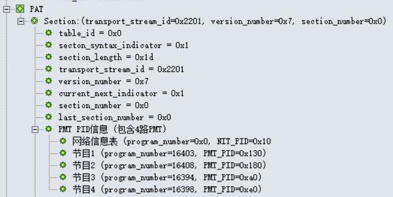
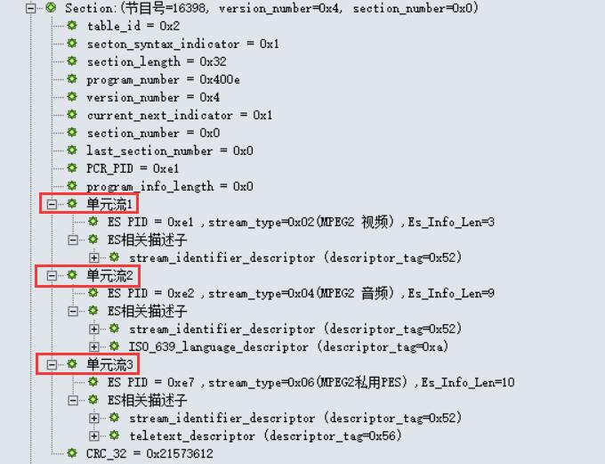
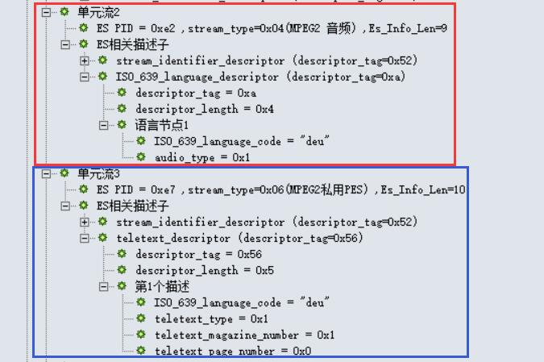
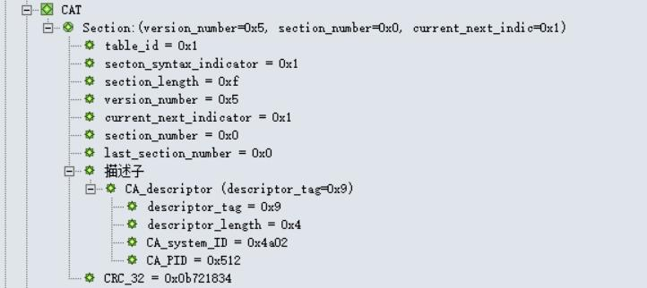
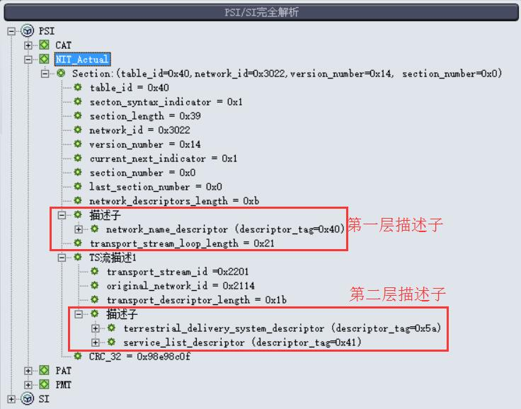
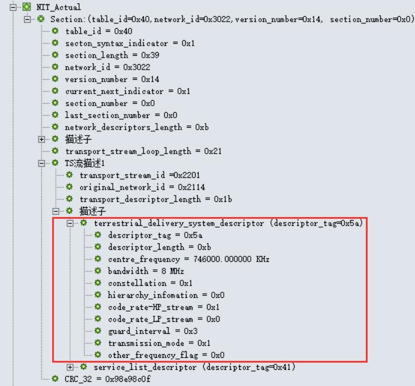
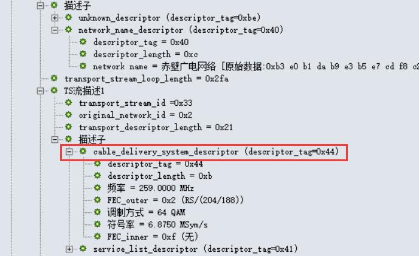
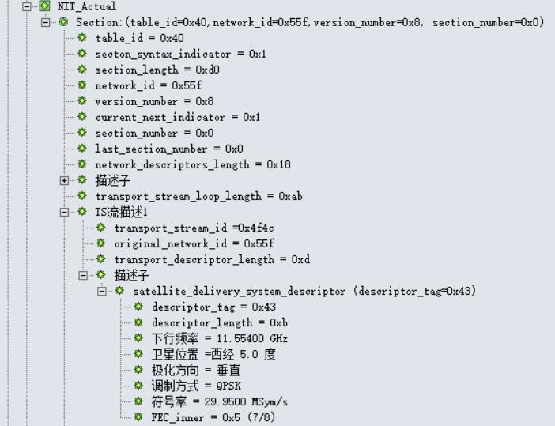
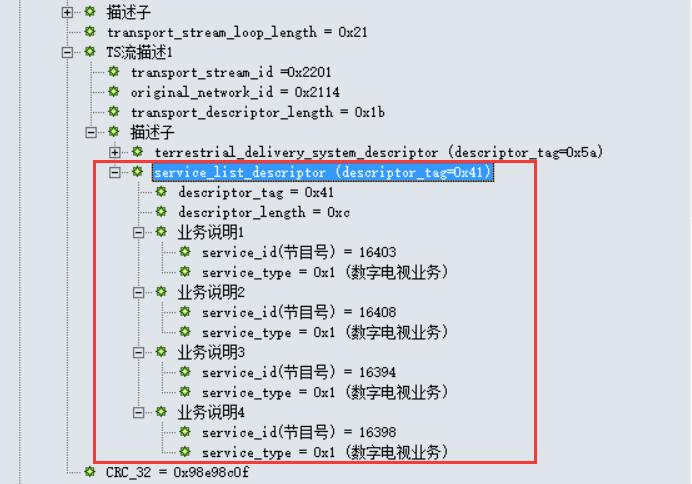

# 第三章：深入学习PSI

在上一章文档中，我们对PAT和PMT表有了初步的了解；在这一章中，我们会更加系统地对PSI信息进行说明。

    **“PSI是对单一TS流的描述，是TS流中的引导信息”**
    -- 可以理解为，PSI是某一频点里的节目引导信息

PSI信息由节目关联表PAT、条件接收表CAT、节目映射表PMT和网络信息表NIT组成，这些表会被插入到TS流中。 PSI信息是对单一TS流的描述，它是TS流的引导信息；PSI信息指定了如何从一个携带多个节目的传输流中找到指定的节目。 下面给出的是节目引导信息（或称节目特定信息，PSI）的四个表结构。

<table class="table table-bordered table-condensed" style="margin-top:-6px; font-size:70%;">
	<tbody><tr style="text-align:center;font-weight:bold; background-color:#bbb; color:#000"><td>结构名</td><td>中文</td><td>所定义标准</td><td>PID</td><td>描述</td></tr>
	<tr style="text-align:center;"><td>PAT</td><td>节目关联表</td><td>MPEG2标准</td><td>0x0000</td><td>将节目号码和节目映射表PID相关联，是获取数据的开始</td></tr>
	<tr style="text-align:center;"><td>PMT</td><td>节目映射表</td><td>MPEG2标准</td><td>PAT中标识</td><td>指定一个或多个节目的PID</td></tr>
	<tr style="text-align:center;"><td>CAT</td><td>条件接收表</td><td>MPEG2标准</td><td>0x0001</td><td>将一个或多个专用EMM流分别与唯一的PID相关联</td></tr>
	<tr style="text-align:center;"><td>NIT</td><td>网络信息表</td><td>SI标准</td><td>PAT中标识</td><td>描述整个网络，如多少个TS流、频点和调制方式等信息</td></tr>
</tbody></table>

## PAT表

> **"PAT是机顶盒接收的入口点，是它获取数据的开始"**

节目关联表PAT的意义在于，它描述了当前TS流中包含了哪些PID； 只有根据获得的PID，用户才可以以此作为凭据找出其他表（如PMT表）及其信息。 所以 **PAT是机顶盒接收的入口点，是它获取数据的开始**； 要保证一个TS流能被正常接收，则至少要有一个完整有效的PAT。

### PAT表的结构分析

PAT表主要提供Program和PID之间的对应关系。

    PID = 0x0000
    table_id = 0x00

下表是PAT结构：

<table class="table table-condensed table-hover" style="margin-top:-5px; font-size:70%;text-align:center;">
	<thead>
		<tr style="font-weight:bold; background:#bbb; color:#000;"><td>Syntax(句法结构)</td><td>No. of bits(所占位数)</td><td>Identifier(识别符)</td><td>Note(注释)</td></tr>
	</thead>
	<tbody><tr style="text-align:left; font-weight:bold;"><td colspan="4">program_association_section(){</td></tr>
	<tr><td style="text-indent:4em; text-align:left;">table_id</td><td>8</td><td>uimsbf</td><td>表标识符</td></tr>
	<tr><td style="text-indent:4em; text-align:left;">Section_syntax_indicator</td><td>1</td><td>bslbf</td><td>段语法指示符，通常设置为“1”</td></tr>
	<tr><td style="text-indent:4em; text-align:left;">"0"</td><td>1</td><td>bslbf</td><td>zero</td></tr>
	<tr><td style="text-indent:4em; text-align:left;">Reserved</td><td>2</td><td>bslbf</td><td class="light-text">保留</td></tr>
	<tr><td style="text-indent:4em; text-align:left;">Section_length</td><td>12</td><td>uimsbf</td><td><a data-content="&lt;h3 class=&quot;pop-title&quot;&gt;Section_length&lt;/h3&gt;&lt;p class=&quot;pop-text&quot;&gt;段长度，12位，指出了此Section的长度，头两位为“00”，值不超过1021&lt;/p&gt;" style="cursor:pointer;" data-toggle="popover" data-placement="left" data-trigger="click" data-html="true" data-original-title="" title="">注释</a></td></tr>
	<tr><td style="text-indent:4em; text-align:left;">transport_stream_id</td><td>16</td><td>uimsbf</td><td><a data-content="&lt;h3 class=&quot;pop-title&quot;&gt;transport_stream_id&lt;/h3&gt;&lt;p class=&quot;pop-text&quot;&gt;16位, 给出TS的识别号&lt;/p&gt;" style="cursor:pointer;" data-toggle="popover" data-placement="left" data-trigger="click" data-html="true" data-original-title="" title="">注释</a></td></tr>
	<tr><td style="text-indent:4em; text-align:left;">Reserved</td><td>2</td><td>bslbf</td><td class="light-text">保留</td></tr>
	<tr><td style="text-indent:4em; text-align:left;">Version_number</td><td>5</td><td>uimsbf</td><td><a data-content="&lt;h3 class=&quot;pop-title&quot;&gt;Version_number&lt;/h3&gt;&lt;p class=&quot;pop-text&quot;&gt;sub_table的版本号，值为0~31，当sub_table信息改变时，值加1，若值已为31，则变化后值为0（循环），若curren_next_indicator的值为“1”，version_number指当前sub_table,若curren_next_indicator的值为“0”，version_number指下一个sub_table&lt;/p&gt;" style="cursor:pointer;" data-toggle="popover" data-placement="left" data-trigger="click" data-html="true" data-original-title="" title="">注释</a></td></tr>
	<tr><td style="text-indent:4em; text-align:left;">Current_next_indicator</td><td>1</td><td>bslbf</td><td><a data-content="&lt;h3 class=&quot;pop-title&quot;&gt;Current_next_indicator&lt;/h3&gt;&lt;p class=&quot;pop-text&quot;&gt;当前后续指示符，1位，“1”指sub_table是current, “0”指sub_table是next&lt;/p&gt;" style="cursor:pointer;" data-toggle="popover" data-placement="left" data-trigger="click" data-html="true" data-original-title="" title="">注释</a></td></tr>
	<tr><td style="text-indent:4em; text-align:left;">Section_number</td><td>8</td><td>uimsbf</td><td><a data-content="&lt;h3 class=&quot;pop-title&quot;&gt;Section_number&lt;/h3&gt;&lt;p class=&quot;pop-text&quot;&gt;段号，8位,给出section号，在sub_table中，第一个section其section_number为&quot;0x00&quot;，每增加一个section，section_number加一&lt;/p&gt;" style="cursor:pointer;" data-toggle="popover" data-placement="left" data-trigger="click" data-html="true" data-original-title="" title="">注释</a></td></tr>
	<tr><td style="text-indent:4em; text-align:left;">last_section_number</td><td>8</td><td>uimsbf</td><td><a data-content="&lt;h3 class=&quot;pop-title&quot;&gt;last_section_number&lt;/h3&gt;&lt;p class=&quot;pop-text&quot;&gt;最后段号，sub_table中最后一个section的section_number&lt;/p&gt;" style="cursor:pointer;" data-toggle="popover" data-placement="left" data-trigger="click" data-html="true" data-original-title="" title="">注释</a></td></tr>
	<tr style="text-align:left;"><td colspan="4" style="text-indent:4em; text-align:left;">for(i=0;i&lt;N;i++){</td></tr>
	<tr><td style="text-indent:6em; text-align:left;">program_number</td><td>16</td><td>uimsbf</td><td><a data-content="&lt;h3 class=&quot;pop-title&quot;&gt;program_number&lt;/h3&gt;&lt;p class=&quot;pop-text&quot;&gt;节目号，16位,指定了Program_map_PID可用的节目。若其值为0x0000，则接下来的13bits的PID是network_PID，否则为program_map_PID&lt;/p&gt;" style="cursor:pointer;" data-toggle="popover" data-placement="left" data-trigger="click" data-html="true" data-original-title="" title="">注释</a></td></tr>
	<tr><td style="text-indent:6em; text-align:left;">reserved</td><td>3</td><td>bslbf</td><td class="light-text">保留</td></tr>
	<tr style="text-align:left;"><td colspan="4" style="text-indent:6em; text-align:left;">if(program_number == 0){</td></tr>
	<tr><td style="text-indent:8em; text-align:left;">network_PID</td><td>13</td><td>uimsbf</td><td><a data-content="&lt;h3 class=&quot;pop-title&quot;&gt;network_PID&lt;/h3&gt;&lt;p class=&quot;pop-text&quot;&gt;13位, 指定了包含NIT的TS包的PID，其值由用户定义&lt;/p&gt;" style="cursor:pointer;" data-toggle="popover" data-placement="left" data-trigger="click" data-html="true" data-original-title="" title="">注释</a></td></tr>
	<tr style="text-align:left;"><td colspan="4" style="text-indent:6em; text-align:left;">}</td></tr>
	<tr style="text-align:left;"><td colspan="4" style="text-indent:6em; text-align:left;">else{</td></tr>
	<tr><td style="text-indent:8em; text-align:left;">program_map_PID</td><td>13</td><td>uimsbf</td><td><a data-content="&lt;h3 class=&quot;pop-title&quot;&gt;program_map_PID&lt;/h3&gt;&lt;p class=&quot;pop-text&quot;&gt;13位,指定了TS包的PID，这些TS包包含由program_number指定的program_map_section，其值由用户定义&lt;/p&gt;" style="cursor:pointer;" data-toggle="popover" data-placement="left" data-trigger="click" data-html="true" data-original-title="" title="">注释</a></td></tr>
	<tr style="text-align:left;"><td colspan="4" style="text-indent:6em; text-align:left;">}</td></tr>
	<tr style="text-align:left;"><td colspan="4" style="text-indent:4em; text-align:left;">}</td></tr>
	<tr><td style="text-indent:4em; text-align:left;">CRC_32</td><td>32</td><td>rpchof</td><td><a data-content="&lt;h3 class=&quot;pop-title&quot;&gt;CRC_32&lt;/h3&gt;&lt;p class=&quot;pop-text&quot;&gt;32位, 表示CRC的值&lt;/p&gt;" style="cursor:pointer;" data-toggle="popover" data-placement="left" data-trigger="click" data-html="true" data-original-title="" title="">注释</a></td></tr>
	<tr style="text-align:left;"><td colspan="4" style="text-align:left;">}</td></tr>
</tbody></table>

这里我们注意关注五个字段：

    table_id：PAT的table_id应为0x00
    transport_stream_id（传输流标志）：用以标识来源于网络中任何其他复合流的TS流
    program_number（节目号）：规定program_map_PID可适用的节目。当值为0x0000时，其后的PID参照将是网络PID。它可以作为一个指示符号，例如用于广播通道。
    network_PID（网络PID）：仅当program_number为0x00时使用
    program_map_PID（节目映射PID）：据此找出相应的PMT表

### PAT表实例

在下图中，我们可以看到PAT表携带的基本信息。

首先，table_id=0x0。网络信息表的PID为0x10。网络中有四路节目，并给出了每个节目的program_number以及每个节目的PMT PID。 在解析完PAT表后，就可以根据这里得到的四个PMT PID去过滤对应PID号的PMT表，从而得到每个节目的更详细信息。

## PMT表

> **"PMT是连接节目号与节目元素的桥梁"**

**节目映射表PMT的意义在于，它给出了节目号与组成这个节目元素之间的映射**； 也就是说，PMT是连接节目号与节目元素的桥梁。 我们知道，一个电视节目至少包含了视频和音频数据，而每一个节目的视音频数据都是以包的形式在TS流中传输的； 所以说，一个TS流包含了多个节目的视频和音频数据包。 要想过滤出一个TS流中其中一个节目的视频和音频，则需要知道这个节目中视频和音频的标识号PID。 PMT表的作用就在于，它提供了每个节目视频、音频（或其他）数据包的PID。

### PMT表的结构分析

PMT表主要提供节目numbers和节目elements之间的映射关系。

    PID = 值由编码器选择
    table_id = 0x02

下表是PMT结构：

<table class="table table-condensed table-hover" style="margin-top:-5px; font-size:70%; text-align:center;">
	<thead>
		<tr style="text-align:center; font-weight:bold; background:#bbb; color:#000;"><td>Syntax(句法结构)</td><td>No. of bits(所占位数)</td><td>Identifier(识别符)</td><td>Note(注释)</td></tr>
	</thead>
	<tbody><tr style="text-align:left; font-weight:bold;"><td colspan="4">program_map_section(){</td></tr>
	<tr><td style="text-indent:4em; text-align:left;">table_id</td><td>8</td><td>uimsbf</td><td>表标识符</td></tr>
	<tr><td style="text-indent:4em; text-align:left;">Section_syntax_indicator</td><td>1</td><td>bslbf</td><td>段语法指示符，通常设置为“1”</td></tr>
	<tr><td style="text-indent:4em; text-align:left;">"0"</td><td>1</td><td>bslbf</td><td>zero</td></tr>
	<tr><td style="text-indent:4em; text-align:left;">Reserved</td><td>2</td><td>bslbf</td><td class="light-text">保留</td></tr>
	<tr><td style="text-indent:4em; text-align:left;">Section_length</td><td>12</td><td>uimsbf</td><td><a data-content="&lt;h3 class=&quot;pop-title&quot;&gt;Section_length&lt;/h3&gt;&lt;p class=&quot;pop-text&quot;&gt;段长度，12位，指出了此Section的长度，头两位为“00”，值不超过1021&lt;/p&gt;" style="cursor:pointer;" data-toggle="popover" data-placement="left" data-trigger="click" data-html="true" data-original-title="" title="">注释</a></td></tr>
	<tr><td style="text-indent:4em; text-align:left;">program_number</td><td>16</td><td>uimsbf</td><td>节目号，与service_id对应</td></tr>
	<tr><td style="text-indent:4em; text-align:left;">Reserved</td><td>2</td><td>bslbf</td><td class="light-text">保留</td></tr>
	<tr><td style="text-indent:4em; text-align:left;">Version_number</td><td>5</td><td>bslbf</td><td><a data-content="&lt;h3 class=&quot;pop-title&quot;&gt;Version_number&lt;/h3&gt;&lt;p class=&quot;pop-text&quot;&gt;sub_table的版本号，值为0~31，当sub_table信息改变时，值加1，若值已为31，则变化后值为0（循环），若curren_next_indicator的值为“1”，version_number指当前sub_table,若curren_next_indicator的值为“0”，version_number指下一个sub_table&lt;/p&gt;" style="cursor:pointer;" data-toggle="popover" data-placement="left" data-trigger="click" data-html="true" data-original-title="" title="">注释</a></td></tr>
	<tr><td style="text-indent:4em; text-align:left;">Current_next_indicator</td><td>1</td><td>bslbf</td><td><a data-content="&lt;h3 class=&quot;pop-title&quot;&gt;Current_next_indicator&lt;/h3&gt;&lt;p class=&quot;pop-text&quot;&gt;当前后续指示符，1位，“1”指sub_table是current, “0”指sub_table是next&lt;/p&gt;" style="cursor:pointer;" data-toggle="popover" data-placement="left" data-trigger="click" data-html="true" data-original-title="" title="">注释</a></td></tr>
	<tr><td style="text-indent:4em; text-align:left;">Section_number</td><td>8</td><td>uimsbf</td><td><a data-content="&lt;h3 class=&quot;pop-title&quot;&gt;Section_number&lt;/h3&gt;&lt;p class=&quot;pop-text&quot;&gt;段号，8位,给出section号，在sub_table中，第一个section其section_number为&quot;0x00&quot;，每增加一个section，section_number加一&lt;/p&gt;" style="cursor:pointer;" data-toggle="popover" data-placement="left" data-trigger="click" data-html="true" data-original-title="" title="">注释</a></td></tr>
	<tr><td style="text-indent:4em; text-align:left;">last_section_number</td><td>8</td><td>uimsbf</td><td><a data-content="&lt;h3 class=&quot;pop-title&quot;&gt;last_section_number&lt;/h3&gt;&lt;p class=&quot;pop-text&quot;&gt;最后段号，sub_table中最后一个section的section_number&lt;/p&gt;" style="cursor:pointer;" data-toggle="popover" data-placement="left" data-trigger="click" data-html="true" data-original-title="" title="">注释</a></td></tr>
	<tr><td style="text-indent:4em; text-align:left;">reserved</td><td>3</td><td>bslbf</td><td class="light-text">保留</td></tr>
	<tr><td style="text-indent:4em; text-align:left;">PCR_PID</td><td>13</td><td>uimsbf</td><td><a data-content="&lt;h3 class=&quot;pop-title&quot;&gt;PCR_PID&lt;/h3&gt;&lt;p class=&quot;pop-text&quot;&gt;13位, 指定了包含NIT的TS包的PID&lt;/p&gt;" style="cursor:pointer;" data-toggle="popover" data-placement="left" data-trigger="click" data-html="true" data-original-title="" title="">注释</a></td></tr>
	<tr><td style="text-indent:4em; text-align:left;">reserved</td><td>4</td><td>bslbf</td><td class="light-text">保留</td></tr>
	<tr><td style="text-indent:4em; text-align:left;">program_info_length</td><td>12</td><td>uimsbf</td><td>头两位为“00”</td></tr>
	<tr style="text-align:left;"><td colspan="4" style="text-indent:4em; text-align:left;">for(i=0;i&lt;N;i++){</td></tr>
	<tr style="text-align:left;"><td colspan="4" style="text-indent:6em; text-align:left; font-weight:bold;">descriptor()</td></tr>
	<tr style="text-align:left;"><td colspan="4" style="text-indent:4em; text-align:left;">}</td></tr>
	<tr style="text-align:left;"><td colspan="4" style="text-indent:4em; text-align:left;">for(i=0;i&lt;N1;i++){</td></tr>
	<tr><td style="text-indent:6em; text-align:left;">stream_type</td><td>8</td><td>uimsbf</td><td><a data-content="&lt;h3 class=&quot;pop-title&quot;&gt;stream_type&lt;/h3&gt;&lt;p class=&quot;pop-text&quot;&gt;8位,指定了节目element的类型&lt;/p&gt;" style="cursor:pointer;" data-toggle="popover" data-placement="left" data-trigger="click" data-html="true" data-original-title="" title="">注释</a></td></tr>
	<tr><td style="text-indent:6em; text-align:left;">reserved</td><td>3</td><td>bslbf</td><td class="light-text">保留</td></tr>
	<tr><td style="text-indent:6em; text-align:left;">elementary_PID</td><td>13</td><td>uimsbf</td><td><a data-content="&lt;h3 class=&quot;pop-title&quot;&gt;elementary_PID&lt;/h3&gt;&lt;p class=&quot;pop-text&quot;&gt;13位,指定了包含program element的TS包的PID&lt;/p&gt;" style="cursor:pointer;" data-toggle="popover" data-placement="left" data-trigger="click" data-html="true" data-original-title="" title="">注释</a></td></tr>
	<tr><td style="text-indent:6em; text-align:left;">reserved</td><td>4</td><td>bslbf</td><td class="light-text">保留</td></tr>
	<tr><td style="text-indent:6em; text-align:left;">ES_info_length</td><td>12</td><td>uimsbf</td><td>头两位为"00"</td></tr>
	<tr style="text-align:left;"><td colspan="4" style="text-indent:6em; text-align:left;">for(i=0;i&lt;N2;i++){</td></tr>
	<tr style="text-align:left;"><td colspan="4" style="text-indent:8em; text-align:left; font-weight:bold;">descriptor()</td></tr>
	<tr style="text-align:left;"><td colspan="4" style="text-indent:6em; text-align:left;">}</td></tr>
	<tr style="text-align:left;"><td colspan="4" style="text-indent:4em; text-align:left;">}</td></tr>
	<tr><td style="text-indent:4em; text-align:left;">CRC_32</td><td>32</td><td>rpchof</td><td><a data-content="&lt;h3 class=&quot;pop-title&quot;&gt;CRC_32&lt;/h3&gt;&lt;p class=&quot;pop-text&quot;&gt;32位, 表示CRC的值&lt;/p&gt;" style="cursor:pointer;" data-toggle="popover" data-placement="left" data-trigger="click" data-html="true" data-original-title="" title="">注释</a></td></tr>
	<tr style="text-align:left;"><td colspan="4" style="text-align:left;">}</td></tr>
</tbody></table>

注意到，PMT表中有两个地方有Descriptor():

    Mosaic descriptor：查看！！
    Service move descriptor：查看！！
    Stream identifier descriptor：查看！！
    Teletext descriptor：查看！！

### PMT表实例

在下图中，我们可以看到PMT表携带的基本信息。一共有四个section，是四张PMT表的信息；其中，每个section存储在一个PMT表中，对应了一个节目的信息。 下面，我们以节目号为16398的节目为例进行分析。

下图可以看到，一共有3个单元流，每一个单元流都是组成这个节目的一个 元素(或者说是分量)。 可以看到，这个节目包含一个MPEG2的视频(stream_type=0x02)、一个MPEG2的音频(stream_type=0x04)以及一个私有类型(stream_type=0x06)的数据。

下表是stream_type值的规定：

<table class="table table-condensed table-hover table-bordered" style="margin-top:-5px; font-size:70%; text-align:center;">
	<thead>
		<tr style="text-align:center; font-weight:bold; background:#bbb; color:#000;"><td>stream_type</td><td>描述</td></tr>
	</thead>
	<tbody><tr><td>0x00</td><td>ITU-T | ISO/IEC Reserved，国际标准保留</td></tr>
	<tr><td>0x01</td><td>ISO/IEC 11172 Video，视频</td></tr>
	<tr><td>0x02</td><td>ITU-T Rec. H.262 | ISO/IEC 13818-2 Video or ISO/IEC 11172-2 constrained parameter video stream，视频或受限参数视频流</td></tr>
	<tr><td>0x03</td><td>ISO/IEC 11172 Audio，音频</td></tr>
	<tr><td>0x04</td><td>ISO/IEC 13818-3 Audio，音频</td></tr>
	<tr><td>0x05</td><td>ITU-T Rec. H.222.0 | ISO/IEC 13818-1 private_sections</td></tr>
	<tr><td>0x06</td><td>ITU-T Rec. H.222.0 | ISO/IEC 13818-1 PES packets containing private data,包含专用数据的PES分组</td></tr>
	<tr><td>0x07</td><td>ISO/IEC 13522 MHEG</td></tr>
	<tr><td>0x08</td><td>ITU-T Rec. H.222.0 | ISO/IEC 13818-1 Annex A DSM CC</td></tr>
	<tr><td>0x09</td><td>ITU-T Rec.H.222.1</td></tr>
	<tr><td>0x0A</td><td>ISO/IEC 13818-6 type A</td></tr>
	<tr><td>0x0B</td><td>ISO/IEC 13818-6 type B</td></tr>
	<tr><td>0x0C</td><td>ISO/IEC 13818-6 type C</td></tr>
	<tr><td>0x0D</td><td>ISO/IEC 13818-6 type D</td></tr>
	<tr><td>0x0E</td><td>ISO/IEC 13818-1 auxiliary</td></tr>
	<tr><td>0x0F - 0x7F</td><td>ITU-T Rec. H.222.0 | ISO/IEC 13818-1 Reserved，GB/T保留</td></tr>
	<tr><td>0x80 - 0xFF</td><td>User Private，用户专用</td></tr>
</tbody></table>

该节目的单元流2是音频分量的信息，可以看出，该音频语言为“deu”，即德语；其audio_type=0x1。 单元流3是Teletext分类，其语言编码也是“deu”，teletext_type=0x1。下面给出了teletext_type值的规定：

<table class="table table-condensed table-hover table-bordered" style="margin-top:-5px; font-size:70%; text-align:center;">
	<thead>
		<tr style="text-align:center; font-weight:bold; background:#bbb; color:#000;"><td>teletext_type</td><td>描述</td></tr>
	</thead>
	<tbody><tr><td>0x00</td><td>保留</td></tr>
	<tr><td>0x01</td><td>initial Teletext page</td></tr>
	<tr><td>0x02</td><td>Teletext subtitle page</td></tr>
	<tr><td>0x03</td><td>additional information page</td></tr>
	<tr><td>0x04</td><td>programme schedule page</td></tr>
	<tr><td>0x05</td><td>Teletext subtitle page for hearing impaired people，听障人士Teletext字幕</td></tr>
	<tr><td>0x06 - 0x1F</td><td>保留</td></tr>
</tbody></table>

## CAT表

> **"CAT描述了节目的加密方式"**

条件接收表CAT描述了节目的加密方式，它包含了节目的 EMM 识别PID。 它给出了一个或多个CA系统、EMM流以及与CA相关的特定参数之间的关系。

CA描述符既用于规定像EMM这样的系统范围条件接收管理信息，也用于规定像ECM这样的基本流特定信息。

如果一个基本流（Elementary Stream）是加扰的，那么包含该基本流的节目信息PMT中需要一个CA描述符

如果一个TS流中有任何一个系统范围的条件接收管理信息，则条件接收表中应有CA描述符。

### CAT表的结构分析

CAT表主要提供关于Bouquet的信息，Bouquet是一个services的集合。

    PID = 0x0001
    table_id = 0x01

下表是CAT结构：

<table class="table table-condensed table-hover" style="margin-top:-5px; font-size:70%; text-align:center;">
	<thead>
		<tr style="text-align:center; font-weight:bold; background:#bbb; color:#000;"><td>Syntax(句法结构)</td><td>No. of bits(所占位数)</td><td>Identifier(识别符)</td><td>Note(注释)</td></tr>
	</thead>
	<tbody><tr style="text-align:left; font-weight:bold;"><td colspan="4">conditional_access_section(){</td></tr>
	<tr><td style="text-indent:4em; text-align:left;">table_id</td><td>8</td><td>uimsbf</td><td>表标识符</td></tr>
	<tr><td style="text-indent:4em; text-align:left;">Section_syntax_indicator</td><td>1</td><td>bslbf</td><td>段语法指示符，通常设置为“1”</td></tr>
	<tr><td style="text-indent:4em; text-align:left;">"0"</td><td>1</td><td>bslbf</td><td>zero</td></tr>
	<tr><td style="text-indent:4em; text-align:left;">Reserved</td><td>2</td><td>bslbf</td><td class="light-text">保留</td></tr>
	<tr><td style="text-indent:4em; text-align:left;">Section_length</td><td>12</td><td>uimsbf</td><td><a data-content="&lt;h3 class=&quot;pop-title&quot;&gt;Section_length&lt;/h3&gt;&lt;p class=&quot;pop-text&quot;&gt;段长度，12位，指出了此Section的长度，头两位为“00”，值不超过1021&lt;/p&gt;" style="cursor:pointer;" data-toggle="popover" data-placement="left" data-trigger="click" data-html="true" data-original-title="" title="">注释</a></td></tr>
	<tr><td style="text-indent:4em; text-align:left;">Reserved</td><td>18</td><td>bslbf</td><td class="light-text">保留</td></tr>
	<tr><td style="text-indent:4em; text-align:left;">Version_number</td><td>5</td><td>uimsbf</td><td><a data-content="&lt;h3 class=&quot;pop-title&quot;&gt;Version_number&lt;/h3&gt;&lt;p class=&quot;pop-text&quot;&gt;sub_table的版本号，值为0~31，当sub_table信息改变时，值加1，若值已为31，则变化后值为0（循环），若curren_next_indicator的值为“1”，version_number指当前sub_table,若curren_next_indicator的值为“0”，version_number指下一个sub_table&lt;/p&gt;" style="cursor:pointer;" data-toggle="popover" data-placement="left" data-trigger="click" data-html="true" data-original-title="" title="">注释</a></td></tr>
	<tr><td style="text-indent:4em; text-align:left;">Current_next_indicator</td><td>1</td><td>bslbf</td><td><a data-content="&lt;h3 class=&quot;pop-title&quot;&gt;Current_next_indicator&lt;/h3&gt;&lt;p class=&quot;pop-text&quot;&gt;当前后续指示符，1位，“1”指sub_table是current, “0”指sub_table是next&lt;/p&gt;" style="cursor:pointer;" data-toggle="popover" data-placement="left" data-trigger="click" data-html="true" data-original-title="" title="">注释</a></td></tr>
	<tr><td style="text-indent:4em; text-align:left;">Section_number</td><td>8</td><td>uimsbf</td><td><a data-content="&lt;h3 class=&quot;pop-title&quot;&gt;Section_number&lt;/h3&gt;&lt;p class=&quot;pop-text&quot;&gt;段号，8位,给出section号，在sub_table中，第一个section其section_number为&quot;0x00&quot;，每增加一个section，section_number加一&lt;/p&gt;" style="cursor:pointer;" data-toggle="popover" data-placement="left" data-trigger="click" data-html="true" data-original-title="" title="">注释</a></td></tr>
	<tr><td style="text-indent:4em; text-align:left;">last_section_number</td><td>8</td><td>uimsbf</td><td><a data-content="&lt;h3 class=&quot;pop-title&quot;&gt;last_section_number&lt;/h3&gt;&lt;p class=&quot;pop-text&quot;&gt;最后段号，sub_table中最后一个section的section_number&lt;/p&gt;" style="cursor:pointer;" data-toggle="popover" data-placement="left" data-trigger="click" data-html="true" data-original-title="" title="">注释</a></td></tr>
	<tr style="text-align:left;"><td colspan="4" style="text-indent:4em; text-align:left;">for(i=0;i&lt;N;i++){</td></tr>
	<tr style="text-align:left;"><td colspan="4" style="text-indent:6em; text-align:left; font-weight:bold;">descriptor()</td></tr>
	<tr style="text-align:left;"><td colspan="4" style="text-indent:4em; text-align:left;">}</td></tr>
	<tr><td style="text-indent:4em; text-align:left;">CRC_32</td><td>32</td><td>rpchof</td><td><a data-content="&lt;h3 class=&quot;pop-title&quot;&gt;CRC_32&lt;/h3&gt;&lt;p class=&quot;pop-text&quot;&gt;32位, 表示CRC的值&lt;/p&gt;" style="cursor:pointer;" data-toggle="popover" data-placement="left" data-trigger="click" data-html="true" data-original-title="" title="">注释</a></td></tr>
	<tr style="text-align:left;"><td colspan="4" style="text-align:left;">}</td></tr>
</tbody></table>

注意到，CAT表中的Descriptor():

    CA identifier descriptor：查看！！

### CAT表实例

下图是一个CAT表的实例：

## NIT表

> **"NIT描述了数字电视网络中与网络相关的信息"**

NIT描述了数字电视网络中与网络相关的信息，但这个表本身的信息有限，更多的信息是依靠插入表中的描述符来提供的。 NIT常用的描述符有：网络名称描述符（network_name_descriptor）、有线传送系统（cable_delivery_system_descriptor）、业务列表描述符（service_list_descriptor）和链接描述符（linkage_descriptor）。

### NIT表的结构分析

NIT表主要提供物理网络本身的一些信息。

    PID = 0x0010
    table_id：

        - discribe actual newwork = 0x40
        - discribe not actual newwork = 0x41

网络信息表（NIT）传递了与通过一个给定的网络传输的复用流/TS流的物理结构相关的信息，以及与网络自身特性相关的信息。下表是NIT结构：

<table class="table table-condensed table-hover" style="margin-top:-5px; font-size:70%; text-align:center;">
	<thead>
		<tr style="text-align:center; font-weight:bold; background:#bbb; color:#000;"><td>Syntax(句法结构)</td><td>No. of bits(所占位数)</td><td>Identifier(识别符)</td><td>Note(注释)</td></tr>
	</thead>
	<tbody><tr style="text-align:left; font-weight:bold;"><td colspan="4">network_information_section(){</td></tr>
	<tr><td style="text-indent:4em; text-align:left;">table_id</td><td>8</td><td>uimsbf</td><td>表标识符</td></tr>
	<tr><td style="text-indent:4em; text-align:left;">Section_syntax_indicator</td><td>1</td><td>bslbf</td><td>段语法指示符，通常设置为"1"</td></tr>
	<tr><td style="text-indent:4em; text-align:left;">Reserved_future_use</td><td>1</td><td>bslbf</td><td class="light-text">预留使用</td></tr>
	<tr><td style="text-indent:4em; text-align:left;">Reserved</td><td>2</td><td>bslbf</td><td class="light-text">保留</td></tr>
	<tr><td style="text-indent:4em; text-align:left;">Section_length</td><td>12</td><td>uimsbf</td><td><a data-content="&lt;h3 class=&quot;pop-title&quot;&gt;Section_length&lt;/h3&gt;&lt;p class=&quot;pop-text&quot;&gt;段长度，12位，指出了此Section的长度，头两位为“00”，值不超过1021&lt;/p&gt;" style="cursor:pointer;" data-toggle="popover" data-placement="left" data-trigger="click" data-html="true" data-original-title="" title="">注释</a></td></tr>
	<tr><td style="text-indent:4em; text-align:left;">Network_id</td><td>16</td><td>uimsbf</td><td><a data-content="&lt;h3 class=&quot;pop-title&quot;&gt;Network_id&lt;/h3&gt;&lt;p class=&quot;pop-text&quot;&gt;网络标识符，16位字段。NIT表所描述的传输系统的网络标识，用以区别其他的传输系统。This is a 16-bit field which serves as a label to identify the delivery system, about which the NIT informs, from any other delivery system.&lt;/p&gt;" style="cursor:pointer;" data-toggle="popover" data-placement="left" data-trigger="click" data-html="true" data-original-title="" title="">注释</a></td></tr>
	<tr><td style="text-indent:4em; text-align:left;">Reserved</td><td>2</td><td>bslbf</td><td class="light-text">保留</td></tr>
	<tr><td style="text-indent:4em; text-align:left;">Version_number</td><td>5</td><td>uimsbf</td><td><a data-content="&lt;h3 class=&quot;pop-title&quot;&gt;Version_number&lt;/h3&gt;&lt;p class=&quot;pop-text&quot;&gt;sub_table的版本号，值为0~31，当sub_table信息改变时，值加1，若值已为31，则变化后值为0（循环），若curren_next_indicator的值为“1”，version_number指当前sub_table,若curren_next_indicator的值为“0”，version_number指下一个sub_table&lt;/p&gt;" style="cursor:pointer;" data-toggle="popover" data-placement="left" data-trigger="click" data-html="true" data-original-title="" title="">注释</a></td></tr>
	<tr><td style="text-indent:4em; text-align:left;">Current_next_indicator</td><td>1</td><td>bslbf</td><td><a data-content="&lt;h3 class=&quot;pop-title&quot;&gt;Current_next_indicator&lt;/h3&gt;&lt;p class=&quot;pop-text&quot;&gt;当前后续指示符，1位，“1”指sub_table是current, “0”指sub_table是next&lt;/p&gt;" style="cursor:pointer;" data-toggle="popover" data-placement="left" data-trigger="click" data-html="true" data-original-title="" title="">注释</a></td></tr>
	<tr><td style="text-indent:4em; text-align:left;">Section_number</td><td>8</td><td>uimsbf</td><td><a data-content="&lt;h3 class=&quot;pop-title&quot;&gt;Section_number&lt;/h3&gt;&lt;p class=&quot;pop-text&quot;&gt;段号，8位,给出section号，在sub_table中，第一个section其section_number为&quot;0x00&quot;，每增加一个section，section_number加一&lt;/p&gt;" style="cursor:pointer;" data-toggle="popover" data-placement="left" data-trigger="click" data-html="true" data-original-title="" title="">注释</a></td></tr>
	<tr><td style="text-indent:4em; text-align:left;">last_section_number</td><td>8</td><td>uimsbf</td><td><a data-content="&lt;h3 class=&quot;pop-title&quot;&gt;last_section_number&lt;/h3&gt;&lt;p class=&quot;pop-text&quot;&gt;最后段号，sub_table中最后一个section的section_number&lt;/p&gt;" style="cursor:pointer;" data-toggle="popover" data-placement="left" data-trigger="click" data-html="true" data-original-title="" title="">注释</a></td></tr>
	<tr><td style="text-indent:4em; text-align:left;">Reserved_future_use</td><td>4</td><td>bslbf</td><td class="light-text">预留使用</td></tr>
	<tr><td style="text-indent:4em; text-align:left;">Network_descriptors_length</td><td>12</td><td>uimsbf</td><td>网络描述符长度</td></tr>
	<tr style="text-align:left;"><td colspan="4" style="text-indent:4em; text-align:left;">for(i=0;i&lt;N;i++){</td></tr>
	<tr style="text-align:left;"><td colspan="3" style="text-indent:6em; text-align:left; font-weight:bold;">descriptor()</td><td>First descriptor loop</td></tr>
	<tr style="text-align:left;"><td colspan="4" style="text-indent:4em; text-align:left;">}</td></tr>
	<tr><td style="text-indent:4em; text-align:left;">reserved_future_use</td><td>4</td><td>bslbf</td><td>-</td></tr>
	<tr><td style="text-indent:4em; text-align:left;">transport_stream_loop_length</td><td>12</td><td>uimsbf</td><td>传输流循环长度</td></tr>
	<tr style="text-align:left;"><td colspan="4" style="text-indent:4em; text-align:left;">for(i=0;i&lt;N;i++){</td></tr>
	<tr><td style="text-indent:6em; text-align:left;">transport_stream_id</td><td>16</td><td>uimsbf</td><td><a data-content="&lt;h3 class=&quot;pop-title&quot;&gt;transport_stream_id&lt;/h3&gt;&lt;p class=&quot;pop-text&quot;&gt;传输流标识符，16位, 给出TS的识别号&lt;/p&gt;" style="cursor:pointer;" data-toggle="popover" data-placement="left" data-trigger="click" data-html="true" data-original-title="" title="">注释</a></td></tr>
	<tr><td style="text-indent:6em; text-align:left;">original_network_id</td><td>16</td><td>uimsbf</td><td><a data-content="&lt;h3 class=&quot;pop-title&quot;&gt;original_network_id&lt;/h3&gt;&lt;p class=&quot;pop-text&quot;&gt;原始网络标识符，16位，给出originating delivery system中的网络识别号&lt;/p&gt;" style="cursor:pointer;" data-toggle="popover" data-placement="left" data-trigger="click" data-html="true" data-original-title="" title="">注释</a></td></tr>
	<tr><td style="text-indent:6em; text-align:left;">reserved_future_use</td><td>4</td><td>bslbf</td><td class="light-text">预留使用</td></tr>
	<tr><td style="text-indent:6em; text-align:left;">transport_descriptors_length</td><td>12</td><td>uimsbf</td><td>传输流描述符长度</td></tr>
	<tr style="text-align:left;"><td colspan="4" style="text-indent:6em; text-align:left;">for(i=0;i&lt;N;i++){</td></tr>
	<tr style="text-align:left;"><td colspan="3" style="text-indent:8em; text-align:left; font-weight:bold;">descriptor()</td><td>Second descriptor loop</td></tr>
	<tr style="text-align:left;"><td colspan="4" style="text-indent:6em; text-align:left;">}</td></tr>
	<tr style="text-align:left;"><td colspan="4" style="text-indent:4em; text-align:left;">}</td></tr>
	<tr><td style="text-indent:4em; text-align:left;">CRC_32</td><td>32</td><td>rpchof</td><td><a data-content="&lt;h3 class=&quot;pop-title&quot;&gt;CRC_32&lt;/h3&gt;&lt;p class=&quot;pop-text&quot;&gt;32位, 表示CRC的值&lt;/p&gt;" style="cursor:pointer;" data-toggle="popover" data-placement="left" data-trigger="click" data-html="true" data-original-title="" title="">注释</a></td></tr>
	<tr style="text-align:left;"><td colspan="4" style="text-align:left;">}</td></tr>
</tbody></table>

### NIT表中的描述子

注意到NIT结构里出现了两个循环，分别成为第一层循环和第二层循环； 每层循环都插入了一个描述符，也就是一共插入了两个描述符。 这两个描述符的特点如下：

<table class="table table-condensed table-hover table-bordered" style="font-size:70%;">
	<tbody style="text-align:center;">
		<tr><td style="background-color:#bbb; color:#000; font-weight:bold;">第一层描述符</td><td>作用域是针对整个网络的，如插入网络名称描述符、链接描述符等</td></tr>
		<tr><td style="background-color:#bbb; color:#000; font-weight:bold;">第二层描述符</td><td>作用域是第一层循环所代表的一个TS流，如插入有线传输系统描述符</td></tr>
	</tbody>
</table>

NIT表各层的Descriptor()包括:

**第一层(First descriptor loop)**

    Linkage descriptor：查看！！
    Multiligual network name descriptor：查看！！
    Network name descriptor：查看！！

**第二层(Second descriptor loop)**

    Delivery system descriptor：查看！！
    Service list descriptor：查看！！
    Frequency list descriptor：查看！！

在SI标准中规定：original_network_id和transport_stream_id两个标识符相结合唯一确定了网络中的TS流。 各网络被分配独立的network_id值作为网络的唯一识别码。 当NIT表在生成TS流的网络上传输时，network_id和original_network_id将取同一值。 此外，NIT表还有如下特点：

    NIT表被切分为网络信息段（network_information_section）
    任何NIT的段都必须由PID为0x0010的TS包传输
    现行网络的NIT表任何段的table_id值应为0x40，且具有相同的table_id_extension即（network_id）；
    现行网络以外的其他网络NIT表的段table_id值应为0x41

### NIT表实例

在下图中，我们可以看到NIT表的各个信息，如table_id=0x40、network_id=0x3022、NIT版本号(version_number=0x14)等。 另外，这里也出现了两层共三个描述子，接下来，我们逐个点开描述子来查看相关信息。

**第一层描述子：network_name_descriptor**

下图是第一层的network_name_descriptor描述子。其descriptor_tag=0x40，网络名称(network name)为“T-Systems”。

**第二层描述子1：地面传输系统描述子terrestrial_delivery_system_descriptor**

下图是第二层的第一个描述子terrestrial_delivery_system_descriptor。 可以看到，该网络的中心频点(center_frequency)为746MHz，带宽为8MHz。 注意，这个位置的描述子分为cable、satellite和terrestrial三种，长度都为13个字节，这使他们之间的转换变得方便； 而此案例中，判断描述子是terrestrial的原因，是descriptor_tag的值是0x5a。 descriptor_tag的值与描述子类型的对应关系如下：

<table class="table table-condensed table-hover table-bordered" style="font-size:70%;">
	<thead style="text-align:center;">
		<tr style="background-color:#bbb; color:#000; font-weight:bold;"><td>descriptor_tag</td><td>描述子类型</td><td>说明</td></tr>
	</thead>
	<tbody style="text-align:center;">
		<tr><td>0x43</td><td>satellite_delivery_system_descriptor</td><td>卫星传输系统描述子</td></tr>
		<tr><td>0x44</td><td>cable_delivery_system_descriptor</td><td>有线传输系统描述子</td></tr>
		<tr><td>0x5a</td><td>terrestrial_delivery_system_descriptor</td><td>地面传输系统描述子</td></tr>
	</tbody>
</table>

**第二层描述子2：有线传输系统描述子： cable_delivery_system_descriptor**

下图是另一个码流的NIT表，该描述子的descriptor_tag=0x44，即有线传输系统（有线电视），所以其携带的传输系统描述子是cable_delivery_system_descriptor。 从图中可以看出，该有线电视网络的主频点是259MHz，符码率为6876M，调制方式为64QAM。 需要说明的是，这里的64QAM并不是直接给出的，而是按照下表的规定(Modulation scheme for cable)发出的代码：

<table class="table table-condensed table-hover table-bordered" style="font-size:70%;">
	<thead style="text-align:center;">
		<tr style="background-color:#bbb; color:#000; font-weight:bold;"><td>调制方式（十六进制）</td><td>描述</td></tr>
	</thead>
	<tbody style="text-align:center;">
		<tr><td>0x00</td><td>未定义</td></tr>
		<tr><td>0x01</td><td>16 QAM</td></tr>
		<tr><td>0x02</td><td>32 QAM</td></tr>
		<tr><td>0x03</td><td>64 QAM</td></tr>
		<tr><td>0x04</td><td>128 QAM</td></tr>
		<tr><td>0x05</td><td>256 QAM</td></tr>
		<tr><td>0x06 - 0xFF</td><td>预留使用</td></tr>
	</tbody>
</table>

**第二层描述子3：卫星传输系统描述子： satellite_delivery_system_descriptor**

下图是另一个码流的NIT表，该描述子的descriptor_tag=0x43，即卫星传输系统，所以其携带的传输系统描述子是satellite_delivery_system_descriptor。 从图中可以看出，该频点的信息为11554/H/29950。具体分析可参考该描述子专项说明：查看！！

**第二层描述子4：业务列表描述子： service_list_descriptor**

下图是第二层的第二个描述子service_list_descriptor(业务列表)。它给出了业务根据其id和type排序的一种方式。 从图中可以看到，该网络的有四个业务，且四个业务均为数字电视业务。 其节目号(service_id)分别为16403、16408、16394和16398。

> 这里要特别说明的是，service_id 与 PMT表里的program_number相对应（service_type = 0x04 (NVOD reference service)除外）。

上面描述子中，有一个service_type字段，它的值可参照下表Service type coding：

<table class="table table-condensed table-hover table-bordered" style="font-size:70%;">
	<thead style="text-align:center;">
		<tr style="background-color:#bbb; color:#000; font-weight:bold;"><td>service_type</td><td>说明(中文)</td><td>说明(英文)</td></tr>
	</thead>
	<tbody style="text-align:center;">
		<tr><td>0x00</td><td>预留使用</td><td>reserved for future use</td></tr>
		<tr><td>0x01</td><td title="查看NOTE1">数字电视业务</td><td>digital television service</td></tr>
		<tr><td>0x02</td><td title="查看NOTE2">数字音频广播业务</td><td>digital radio sound service</td></tr>
		<tr><td>0x03</td><td>图文电视业务</td><td>Teletext service</td></tr>
		<tr><td>0x04</td><td title="查看NOTE1">NVOD参考业务</td><td>NVOD reference service</td></tr>
		<tr><td>0x05</td><td title="查看NOTE1">NVOD时移业务</td><td>NVOD time-shifted service</td></tr>
		<tr><td>0x06</td><td>马赛克业务</td><td>mosaic service</td></tr>
		<tr><td>0x07</td><td>PAL制编码信号</td><td>reserved for future use</td></tr>
		<tr><td>0x08</td><td>SECAM制编码信号</td><td>reserved for future use</td></tr>
		<tr><td>0x09</td><td>D/D2-MAC</td><td>reserved for future use</td></tr>
		<tr><td>0x0A</td><td>调频广播</td><td>advanced codec digital radio sound servic</td></tr>
		<tr><td>0x0B</td><td>NTSC制信号</td><td>advanced codec mosaic service</td></tr>
		<tr><td>0x0C</td><td>数据广播业务</td><td>data broadcast service</td></tr>
		<tr><td>0x0D</td><td>公共接口使用预留</td><td>reserved for Common Interface Usage (EN 50221 [39])</td></tr>
		<tr><td>0x0E</td><td>RCS映射</td><td>RCS Map (see EN 301 790 [7])</td></tr>
		<tr><td>0x0F</td><td>RCS FLS</td><td>RCS FLS (see EN 301 790 [7])，RCS FLS</td></tr>
		<tr><td>0x10</td><td>DVB MHP业务</td><td>DVB MHP service</td></tr>
		<tr><td>0x11</td><td>预留使用</td><td>MPEG-2 HD digital television service</td></tr>
		<tr><td>0x12 - 0x15</td><td>预留使用</td><td>reserved for future use</td></tr>
		<tr><td>0x16</td><td>预留使用</td><td>advanced codec SD digital television service</td></tr>
		<tr><td>0x17</td><td>预留使用</td><td>advanced codec SD NVOD time-shifted service</td></tr>
		<tr><td>0x18</td><td>预留使用</td><td>advanced codec SD NVOD reference service</td></tr>
		<tr><td>0x19</td><td>预留使用</td><td>advanced codec HD digital television service</td></tr>
		<tr><td>0x1A</td><td>预留使用</td><td>advanced codec HD NVOD time-shifted service</td></tr>
		<tr><td>0x1A</td><td>预留使用</td><td>advanced codec HD NVOD reference service</td></tr>
		<tr><td>0x1C - 0x7F</td><td>预留使用</td><td>reserved for future use</td></tr>
		<tr><td>0x80 - 0xFE</td><td>用户定义</td><td>user defined</td></tr>
		<tr><td>0xFF</td><td>预留使用</td><td>reserved for future use</td></tr>
		<tr style="text-align:left; font-weight:bold;"><td colspan="3">
			NOTE 1: MPEG-2 SD material should use this type 
			NOTE 2: digital radio sound service 
		</td></tr>
	</tbody>
</table>

## 本章小结

本章通过对PSI各表结构的解析，逐步讲解了PAT表、PMT表、CAT表和NIT表的整体结构，并对各表里出现的描述子(Descriptor)进行了简单的说明。 由于本教程的目的只是讲解PSI各表、让新手们能有一个形象的概念， 在本章里我没有简单粗暴地照搬PSI规范，而是以一条主线的形式从PAT表入手、逐步进入其他表，同时增加了很多实例分析，因此会忽略一些内容(如具体的描述子结构和功能说明)； 这只是一种学习的策略，希望新手们从整体结构入手，不要死盯着某一个细节不放。 如果要查看更详细的信息，可进入 资料快查 来查看你需要的信息。

## 参考文档

<table class="table table-condensed table-hover table-bordered" style="font-size:70%;">
	<thead>
		<tr style="background:#bbb; color:#000; text-align:center; font-weight:bold;"><td>#</td><td>文档名称</td><td>作者</td></tr>
	</thead>
	<tbody style="text-align:center;">
		<tr><td>1</td><td><a href="http://blog.csdn.net/kkdestiny/article/details/9850587" target="_blank">《1.从TS流到PAT和PMT》</a></td><td>林晓州</td></tr>
		<tr><td>2</td><td><a href="http://blog.csdn.net/kkdestiny/article/details/12993971" target="_blank">《2.PSI/SI深入学习1——预备知识》</a></td><td>林晓州</td></tr>
		<tr><td>3</td><td><a href="http://blog.csdn.net/kkdestiny/article/details/12994085" target="_blank">《2.PSI/SI深入学习2——PSI信息解析(PAT,PMT,CAT) 》</a></td><td>林晓州</td></tr>
		<tr><td>4</td><td><a href="http://blog.csdn.net/kkdestiny/article/details/12994675" target="_blank">《2.PSI/SI深入学习3——SI信息解析1(NIT,BAT) 》</a></td><td>林晓州</td></tr>
		<tr><td>5</td><td><a href="../doc/En300468.V1.7.1_Specification for SI in DVB Systems.pdf" target="_blank">《En300468.V1.7.1_Specification for SI in DVB Systems.pdf》</a></td><td>European Standard</td></tr>
		<tr><td>6</td><td><a href="../doc/DVB和MPEG-II中的表格.html" target="_blank">DVB和MPEG-II中的表格</a></td><td>网络</td></tr>
	</tbody>
</table>

